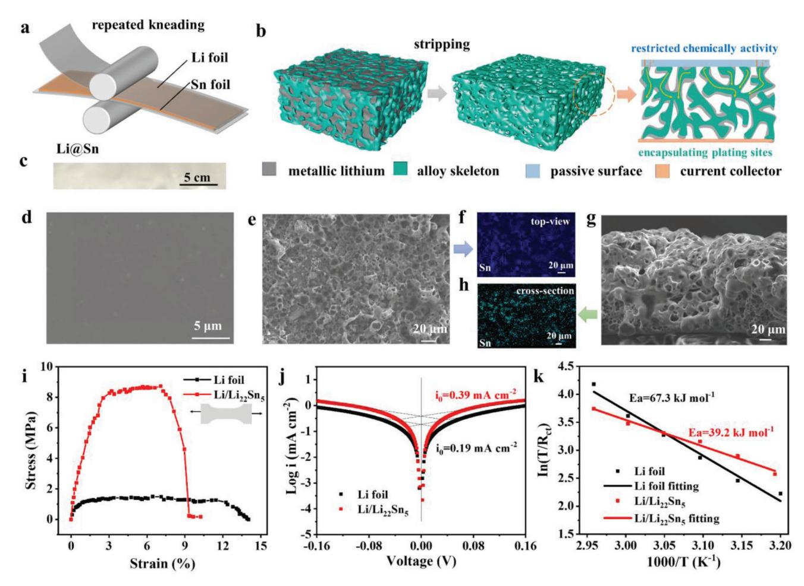
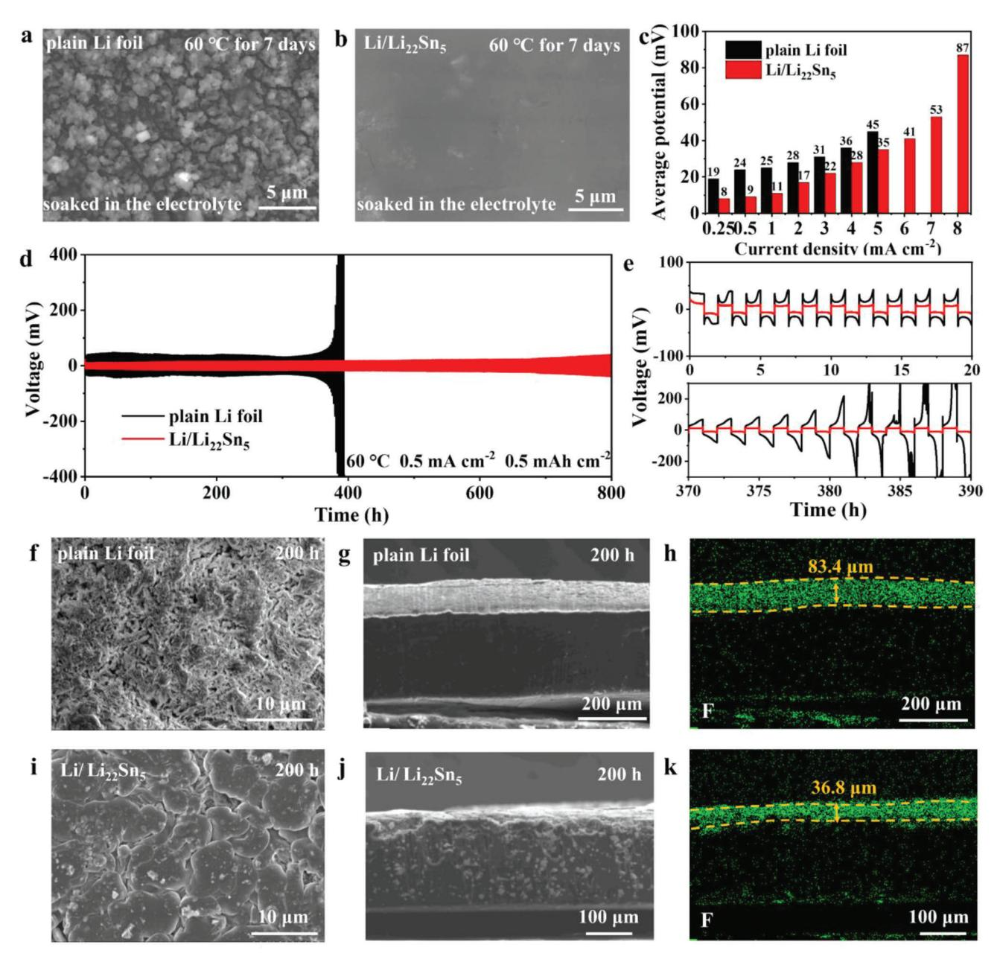
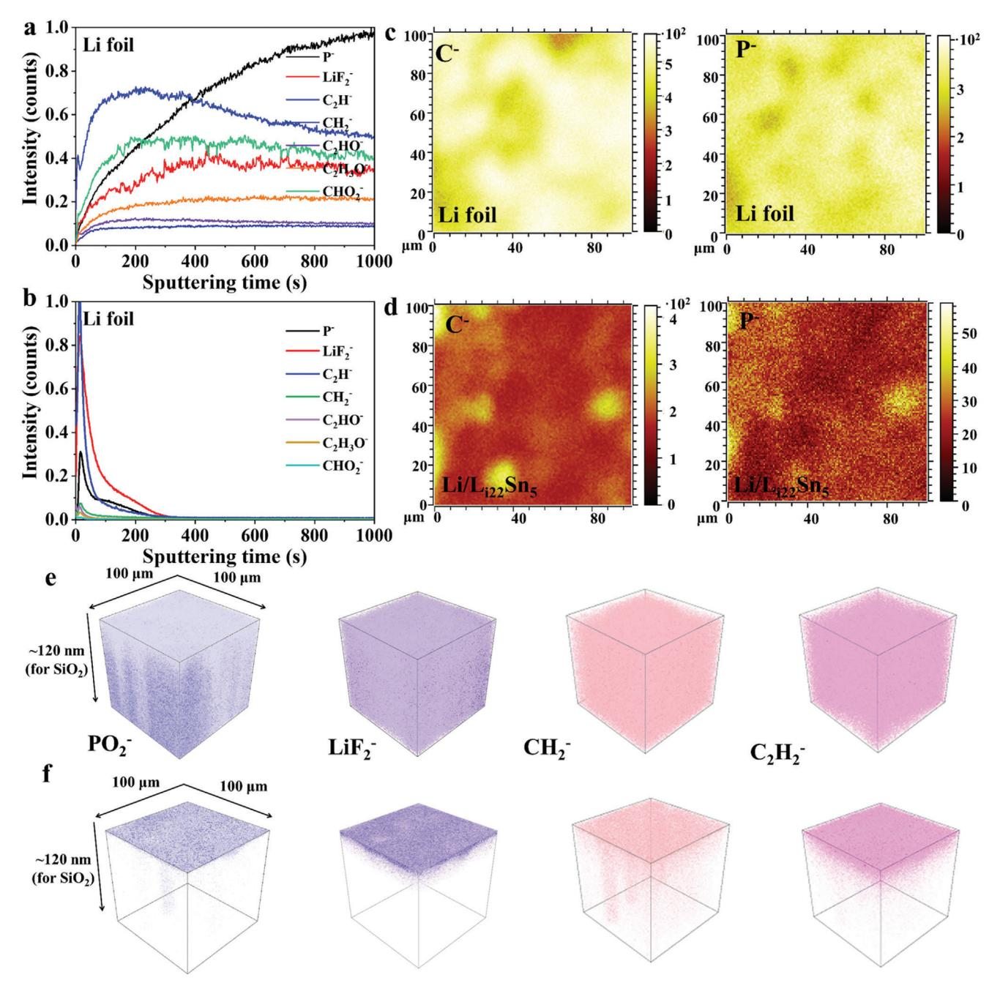
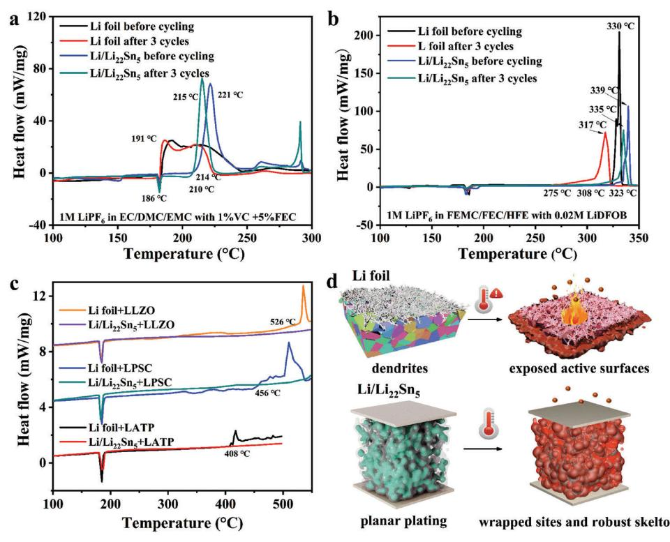
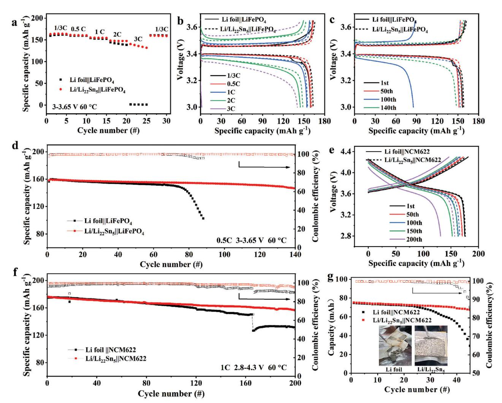
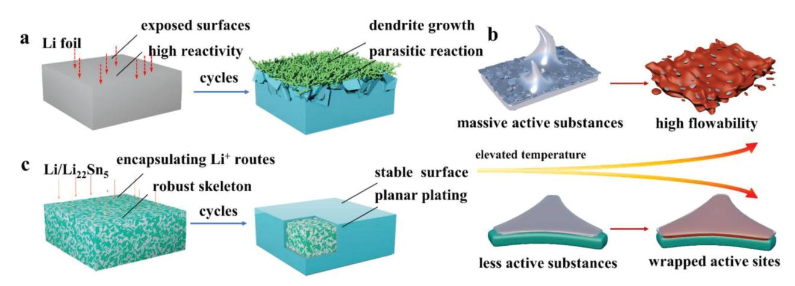

# **Boosting the Intrinsic Stability of Lithium Metal Anodes by an Electrochemically Active Encapsulating Framework**

*Hongmei Liang, Lingyue Wang, Yufang He, Dongsheng Ren, Youzhi Song, Kai Yang, Aiping Wang, Yanyan Yi, Li Wang,\* Yongming Sun,\* and Xiangming He\**

**The lithium metal anode (LMA) is a promising technology to promote the energy density of secondary batteries. However, the coupled growth of surface corrosion and deposited lithium with high reactivity causes capacity fading and safety hazards, especially at high temperatures. Great efforts have been focused on preventing the LMA from direct contact with electrolytes to extend its lifespan, but few pay attention to its stability at high temperatures, which is crucial to battery safety. Herein, a 3D Li22Sn5-based interpenetrated skeleton is introduced into the bulk of LMA with mechanical kneading, which enables a LMA with fast and stable cycles at high temperatures and improved safety under thermal abuse. The Li22Sn5 skeleton acts as a solid electrolyte inside the bulk, allowing rapid Li+ ion transport and homogenous lithium stripping/plating into the porous bulk through Li/Li22Sn5 interface. The encapsulating framework expands the electrochemically active area and limits its exposure to the electrolyte, enabling a LMA with steady cyclability even at 60 °C. Trapping lithium inside the thermally stable skeleton postpones the catastrophic exothermal reactions between lithium and electrolytes. The strategy for constructing a 3D encapsulating lithiophilic framework is promising for creating safe and stable lithium metal batteries working under harsh circumstances.**

# **1. Introduction**

Lithium-ion batteries (LIBs) have revolutionized the way to exploit energy by powering our portable electronics, and electric vehicles and gathering intermittent energy ever since their birth.[1] Emerging battery chemistries that promise extraordinarily high energy density and safety are being vigorously pursued to satisfy the rapid development of demand. Lithium metal anodes (LMAs) have been revived as the energetic candidates for the upcoming

H. Liang, Y. He, D. Ren, Y. Song, K. Yang, A. Wang, Y. Yi, L. Wang, X. He Institute of Nuclear & New Energy Technology Tsinghua University Beijing 100084, China E-mail: wang-l@tsinghua.edu.cn; hexm@tsinghua.edu.cn L. Wang, Y. Sun Wuhan National Laboratory for Optoelectronics Huazhong University of Science and Technology Wuhan 430074, China E-mail: yongmingsun@hust.edu.cn The ORCID identification number(s) for the author(s) of this article can be found under https://doi.org/10.1002/aenm.202302755

**DOI: 10.1002/aenm.202302755**

rechargeable batteries with energy density over 500 Wh kg−1. [2] However, their accompanying ultra-high chemical reactivity and dendrite growth lead to capacity degradation and safety hazards, especially at high temperatures.[3] Among safety failures, thermal runaway triggered by a string of exothermic reactions is the most notorious. The studies showed that the thermal stability of the anode determined the threshold temperatures for both thermal failure and thermal runaway.[4] The chemical stability of the anode toward the electrolyte is responsible for battery self-heating, which is the initial stage of field failure.[5] Lithium dendrites expand the specific surface area of the LMA, amplifying the exothermic interactions with other cell components.[6] After cycling, the onset temperature of heat generation significantly dropped for a Li||LiNi0.5Co0.2Mn0.3O2 pouch cell, bringing about combustible gases or soluble reductive species in the electrolyte.[7] Aging LIBs

are also susceptible to field failure due to the metallic lithium precipitation from graphite.[8] Reducing the reactivity between the LMAs and electrolytes and inhibiting dendrite growth are critical for realizing lithium metal batteries (LMBs) with safety and long-span life.

In effect, intense efforts have been dedicated to sustaining reliable cycles and risk-free operation of LMAs at high temperatures. Developing an artificial solid electrolyte interface (SEI) can isolate the electrolyte corrosion to some extent, but the nanoscale physical isolation is insufficient to adapt to the "hostless" nature of metallic lithium and it is prone to failure during extended cycles and under high-temperature operation.[9] Nonflammable liquid electrolytes recruiting flame-retardant solvents are regarded as an essential approach to address safety concerns, due to their low reactivity with oxygen from air or cathode. While it was demonstrated that the exothermic reaction between lithium salts and the graphite anode at a high charge state (the typical composition is LiC6) is enough to induce thermal runaway.[4] Given that metallic lithium or "dead" lithium dendrites show no less reactivity while possibly higher surface area than LiC6, the thermal safety of LMA is worrying. Solid-state electrolytes (SSEs) endowing nonvolatility and nonflammability are considered the ultimate techniques to achieve the intrinsic safety of LMBs.[10] While the latest research proved that oxygen release from some oxide SSEs can initiate intensely exothermic reactions with molten metallic lithium.[11] Accordingly, only a rationally designed LMA can make LMBs survive from performance and security issues. Composite LMAs with 3D current collectors can ensure mechanical and thermal stability owing to the robust framework.[12] Embedding lithiophilic sites on the substrate can further guide homogeneous lithium stripping/plating.[13] The 3D substrate provides a larger surface area for lithium plating/stripping, helping to decrease the local current density and restrain lithium dendrites. However, the open interface also means a large contact area of metallic lithium with electrolyte. As the results of the parasitic reactions between metallic lithium and electrolyte, the cyclability of the composite LMA at high temperatures may not be satisfying, let alone the safety which is determined by the thermal reactions at higher temperatures. When the electrochemical reaction and side reaction occur at the same lithium/electrolyte interface, balancing the competition between lithium plating and interfacial reaction is a challenging task.[14] Isolating the chemical reaction interface with the electrochemical active interface is ideal to address the aforementioned dilemma.

In this contribution, it is proved that an interpenetrated 3D Li22Sn5 framework enables LMA with fast and stable cycling even at high temperatures, and improved safety under thermal abuse. The 3D framework induces abundant electrochemically active inner-face into the bulk, acting as a solid electrolyte to realize rapid Li+-ion transport through Li/Li22Sn5 interface. The framework also serves as a robust barrier for metallic lithium to resist electrolyte corrosion, thus limiting parasitic reactions just at the geometry surface. By this means, the 3D inner face not only regulates lithium plating/stripping to avoid lithium dendrites, but also restrains the parasitic reaction at high rates/capacities and high temperatures, as well as improving the thermal stability under thermal abuse. This work establishes a 3D lithiopilic inner face, as a decoupling methodology, to spatially separate the active chemical and electrochemical interfaces, desiring to develop LMBs with extended cycling durability and enhanced safety.

#### **2. Results and Discussion**

**Figure 1**a depicts the fabrication of the composite LMA with interpenetrated 3D framework, which is based on the previous synthesis strategy of repeated kneading.[15] The alloying reaction between lithium and tin (Sn) produces a lithiophilic framework permeating the whole bulk phase (Figure 1b). Lithium-tin alloy exhibits a high chemical diffusion coefficient, which diminishes the lithium diffusion barrier and promotes the spontaneous transfer of Li from the Li-rich phase to the poor phase.[16] The created abundant phase-boundaries also enable fast diffusion pathways for Li+-ions.[17] The lithiophilic sites realize homogenous plating behavior with large-grain deposition. In addition, the inner face expands electrochemically active sites but restrains the chemically active sites to a limited geometry surface. This distinctive structure is helpful for boosting LMAs in circumstances where strong side reactions were previously a barrier, such as at high rates/capacities, high-temperature cycling, and thermal stability.

Figure 1c shows a piece of the composite anode with a size of 22.6 × 3.5 cm, which presents a smooth, strong, and non-sticky surface. The composition is detected by X-ray diffraction (XRD). The diffraction peaks feature strong signals of metallic lithium and Li22Sn5 (Figure S1, Supporting Information). No peaks for metallic Sn are observed, demonstrating that Sn is completely alloyed with lithium, and the composite is marked as Li/Li22Sn5. The specific capacity of the prepared Li/Li22Sn5 as LMA is tested to be 2040 mAh g−1 with a cut-off voltage of 0.3 V versus Li/Li+, where only metallic lithium is stripped (Figure S2, Supporting Information).

As observed by scanning electron microscope (SEM), the morphology of Li/Li22Sn5 is smooth and uniform (Figure 1d). After stripping all the metallic lithium by controlling the cut-off voltage, it leaves a porous, self-standing framework. The pores on the surface are open (the top-view, Figure 1e), while most are closed and individually dispersed in the bulk (cross-section view, Figure 1g). The cross-section view shows the high integrity of the porous framework with a thickness of over 150 μm, demonstrating the robustness of the framework during the stripping process. According to the composition of the composite foil, the 3D framework can only be Li22Sn5. The even distribution of Sn in elemental mapping further manifests the compositional and structural stability (Figure 1f,h). This 3D Li22Sn5 framework with closed pores serves as a stable host, providing successive pathways for Li+ ion diffusion from the top surface to the deep bottom and adequate pore space for lithium plating while preventing electrolytes from penetrating into the bulk. Moreover, the abundant inner and closed pores may provide rich and lithiophilic sites for lithium plating, ensuring metallic lithium to deposit at locally mild current densities. The maximum tensile stress of Li/Li22Sn5 is five times that of the plain Li foil (8.7 MPa vs 1.5 MPa), demonstrating the promising processability during battery fabrication (Figure 1i). Simultaneously, the improved mechanical strength and fatigue resistance can also prevent electrodes from cracking.[18]

To access the benefit of the 3D Li22Sn5 framework on the diffusion kinetics of the Li/Li22Sn5, exchange current density (*i*0) is probed by fitting the Tafel plots of the Li||Li symmetrical cells (Figure 1j).[19] The Li/Li22Sn5 exhibits *i0* of double higher than the plain Li foil (0.39 mA cm−2 for Li/Li22Sn5 vs 0.19 mA cm−2 for plain Li foil), indicating superior charge transfer capabilities which result from the 3D lithiophilic framework. This effect is further confirmed by the *i*0 derived from galvanostatic charging/discharging of symmetric cells at current densities spanning from 20 to 100 μA cm−2 (Figures S3 and S4, Supporting Information).[20] Plain Li foil displays an *i*0 of 0.16 mA cm−2. With the aid of the 3D Li22Sn5 skeleton, the *i*0 increases to 0.36 mA cm−2, which is not only due to the increased electrochemically active inner-surface but also the pathway of enough fast for Li+-ion diffusion provided by the 3D Li22Sn5 framework.

Under the assumption that the Li-ion transport is a thermally activated process, the Arrhenius equation can be used to calculate the apparent activation energy (*E*a) for the charge transfer capability of the anodes.[21] After fitting the temperature-dependent electrochemical impedance spectroscopy (EIS) with reasonable equivalent circuits, charge transfer resistance (*R*ct) is extracted at high frequencies (Figure S5 and Table S1, Supporting Information). According to the Arrhenius equation, the *E*a can be calculated from the fitted slope of the curve 1000/*T*-ln *T*/*R*ct. [21b,22] The obtained *E*a of the Li/Li22Sn5 (39.2 kJ mol−1) is much lower

**Figure 1.** a) The synthesis process of the Li/Li22Sn5 with 3D built-in lithiophilic skeleton by repeated kneading. b) Schematic diagram of alloy skeleton and Li+ ion diffusion routes in Li/Li22Sn5. c) The appearance of Li/Li22Sn5. d) The SEM image of Li/Li22Sn5. e,g) The SEM images of top-view and crosssection of the Li22Sn5 framework prepared by electrochemically stripping metallic lithium. f,h) The distribution of Sn on the plane and cross-section. i) The tensile performance of Li foil and Li/Li22Sn5. j) The *i* 0 of Li foil and Li/Li22Sn5 obtained through log*i*-*V* curve, where *V* is the real-time voltage of the symmetric cell and *i* is the current density. k) The charge-transfer activation energy of Li foil and Li/Li22Sn5 obtained by temperature-dependent EIS.

than the plain Li foil (67.3 kJ mol−1), demonstrating the superior charge transfer capability enabled by the built-in Li22Sn5 lithiophilic framework (Figure 1k). It increases the active area for electrochemical reactions and provides high-speed diffusion channels for Li+-ions, thus reducing the accumulation of Li+-ions on the surface.[23]

Due to high chemical reactivity toward the electrolyte, metallic lithium without protection will encounter continuous corrosion and rapid byproduct accumulation at high temperatures. After storing in a traditional carbonated electrolyte (TCE, 1 m LiPF6 in EC/DMC/EMC, 1:1:1 by weight, with 1 wt.% VC and 5 wt.% FEC) at 60 °C for 7 days, the originally smooth surface of the plain Li foil deteriorates and develops a spongy, porous texture (**Figure 2**a). The surface is covered with a thick layer of tiny particles. Meanwhile, multiple fractures emerge on the surface as a result of inadequate mechanical strength. In stark contrast, the Li/Li22Sn5 surface preserves its original flatness and compactness (Figure 2b). Thus, the composite structure can effectively inhibit the reaction between metallic lithium and the electrolyte, enabling long high-temperature storage life of LMBs.

The electrochemical stability of each LMA at high temperatures is evaluated by the rate and galvanostatic tests using symmetric cells with TCE. Figure S6 (Supporting Information) depicts the rate capability of the symmetric cells at step-increasing current densities at 60 °C. The Li foil exhibits substantially higher overpotentials and experiences voltage fluctuations at 6 mA cm−2 caused by local internal short circuits (Figure 2c). The Li/Li22Sn5 consistently retains low overpotentials and steady cycles even at 8 mA cm−2. Even at high rates and temperatures, the composite structure can improve the plating behavior of metallic lithium. The cyclability at 60 °C is tested in symmetric cells at 0.5 mA cm−2 for 0.5 mAh cm−2 (Figure 2d). The plain Li foil exhibits rising polarization after ≈350 h, reaching ≈178 mV after 380 h (Figure 2e). The significant voltage fluctuations observed at ≈382 h imply the presence of local short circuits. The Li/Li22Sn5 consistently maintains a relatively low overpotential of ≈40 mV for 800 h. Predictably, Li/Li22Sn5 also shows small overpotential and high cyclability at room temperature (Figure S7, Supporting Information). Incorporating the 3D Li22Sn5 framework facilitates lithium plating and prevents electrolyte corrosion, thus the cycle

**Figure 2.** a,b) The SEM images of plain Li foil and Li/Li22Sn5 soaked in the TCE at 60 °C for 7 days. c) The average voltage of symmetrical cells tested with the current densities range from 0.25 to 8 mA cm−2 at 60 °C. d) The voltage profiles of symmetric cells during galvanostatic cycling tests with the current density of 0.5 mA cm−2 for a capacity of 0.5 mAh cm−2 at 60 °C. e) The enlarged voltage profiles of symmetric cells within two specific cycle ranges. f,g) The SEM images of the top view and cross-section of plain Li foil after cycling for 200 h. h) The F element distribution on the cross-section of the plain Li foil, which represents the thickness of the loose deposits. i,j) The SEM images of the top view and cross-section of the Li/Li22Sn5 after cycling for 200 h. k) The F element distribution on the cross-section of the Li/Li22Sn5.

stability both under high C-rate and high temperatures is greatly improved.

To manifest the impact of distinctive architecture on the electroplating/stripping process, the morphology of plain Li foil or Li/Li22Sn5 deconstructed from the symmetric cells was examined by SEM. After cycling for 100 h, massive loosely aligned whiskers, and byproducts overspread the surface of the plain Li foil (Figure S8, Supporting Information). The sharp tips of whiskers may cross the separator, posing a potential hazard of short circuits. Besides, the large specific surface area means enhanced interface reaction with the electrolytes, which consumes a considerable amount of active lithium and electrolytes. After cycling for 200 h, the fine deposits on the surface are arranged closely (Figure 2f). For the Li/Li22Sn5, the deposited granules have large diameters and are densely packed (Figure 2i). The smooth surface cannot threaten to puncture the separator, and the dense arrangement inhibits the penetration of electrolyte and minimizes the side reaction area. The transition of plated lithium from dendrite to cylinder derives from the embedded lithiophilic structure, which facilitates the improvement of the hightemperature stability of LMAs.

The distribution of the F element also shows the signal of the reaction layer, indicating electrolyte permeability and reaction. The top layer is ≈83.4 μm for the Li foil after 200 h (Figure 2g,h), whereas that for the Li/Li22Sn5 is only ≈36.8 μm (Figure 2j,k). The thick F-containing top layer on the Li foil can attributed to the accumulation of loose metallic lithium and the by-products of interfacial reactions. The thin F-containing layer on the Li/Li22Sn5 surface demonstrates the electrochemically active encapsulating structure can regulate the Li+-ion plating behavior and reduce the parasitic reaction and electrolyte penetration.

X-ray photoelectron spectroscopy (XPS) depth profiling was adopted to probe the differences in composition and content of SEI on the anodes after 5 cycles at 60 °C with the sputtering rate of 4.5 nm min−1 for Si. For the Li/Li22Sn5, the inner layer of SEI shows a higher F atomic content (Figure S9, Supporting Information). This indicates Li/Li22Sn5 facilitates the absorption of fluorinated substances more than the plain Li foil. Fluorinated species stem from the decomposition of LiPF6 and fluoroethylene carbonate (FEC) and are mainly composed of mechanically robust LiF, LixPOyFz, LixPFy, and flexible polymeric/organic species (Figures S10a and S11a, Supporting Information).[24] Meanwhile, organic carbonaceous compounds on the plain Li foil exhibit a greater abundance and species diversity, forming a heterogeneous SEI rich in polycarbonates (ploy(CO3)), polyether carbon (CH2O), carbonyl group (CO3), ether oxygen (C─O─C), carbonyl (C═O) and hydrocarbon (CH2─CH2O) (Figure S10b,c, Supporting Information).[25] In an SEI abundant in organic segments, Li+ flux is variably distributed, resulting in dendrite formation.[26] The C 1s spectra on Li/Li22Sn5 demonstrate a reduction in both the diversity and intensity of the carbonate species, which may originate from the less exposed electrochemical active sites, reducing the occurrence of parasitic reactions (Figure S11b,c, Supporting Information). It profits from the uniform distribution of Li+ flux and planar plating.

The time-of-flight secondary ion mass spectrometry (ToF-SIMS) was performed to investigate the decomposition fragments of electrolytes on the anode after 25 cycles at 60 °C. The electrolyte breakdown fragments are detected throughout the sputtering process (≈120 nm for standard SiO2) on the plain Li foil, revealing the constant electrolyte penetration and degradation (**Figure 3**a). In contrast, the fragment signals rapidly diminish within 400 s of sputtering on the Li/Li22Sn5, suggesting that electrolyte reduction is localized to a small region of the surface (Figure 3b). The ToF-SIMS chemical maps of some ion fragments comprise numerous brightly colored regions on the Li foil, revealing it contains substantial organic products in lateral directions (Figure 3c; Figure S12, Supporting Information). The 3D rendering results of some electrolyte decomposition fragments intuitively show that the electrolyte experiences ongoing infiltration and decomposition across the entire depth (Figure 3e). In contrast, Li/Li22Sn5 has a lower concentration of electrolyte decomposition fragments in lateral directions, indicating fewer parasitic reactions (Figure 3d; Figure S13, Supporting Information). The 3D rendering results demonstrate parasitic reactions are confined in a thin space near the surface of Li/Li22Sn5 (Figure 3f).

The unregulated proliferation of dendrites causes the active sites to be heavily exposed, accompanied by continual reductive degradation. The 3D Li22Sn5 framework can regulate lithium plating deep into the bulk of Li/Li22Sn5, whose abundant inner face boosts the electrochemically active sites and minimizes the chemically active area at the geometry surface, thus decoupling the electrochemical behavior with the parasitic reactions. The framework remains stable under high temperatures to ensure its protection toward metallic lithium inside. That is why the interface reaction due to electrolytes can be restrained greatly both at room temperature and high temperature. Then, it can be inferred that the self-heating, which is the initial stage of thermal runaway, of Li/Li22Sn5-based LMBs can be well inhibited.

The reaction between anodes and liquid electrolytes is considered the first loop of the chain reactions leading to battery thermal runaway.[4,8b,27] Then increasing the reaction temperature between LMA and electrolyte is crucial. The thermal stability of plain Li foil and Li/Li22Sn5 toward various electrolytes is characterized by differential scanning calorimetry (DSC) at the heating rate of 5 °C min−1. The plain Li foil and Li/Li22Sn5 both show an endothermic peak at 186 °C, which could be ascribed to the melting of metallic lithium (**Figure 4**a). Subsequently, the plain Li foil reacts rapidly with the TCE and releases heat. The Li/Li22Sn5 shows exothermic reaction up to 214 °C, indicative of superior thermal stability toward TCE. Though the melting temperature of Li22Sn5 is high, it may be its thermal reaction with electrolyte that hampers its effective encapsulation of metallic lithium. The reaction onset temperature of Li/Li22Sn5 after three cycles slightly decreases (210 °C), but it significantly lags behind that of plain Li foil. Increasing the Sn content of the composite anode cannot change the initial temperature of the exothermic reaction, but can reduce the maximum heat flow value ≈210 °C (Figure S14, Supporting Information).

Fluorinated electrolytes are believed to significantly enhance battery safety because of the ultra-conformal protective interphase with high inorganic content.[28] An all-fluorinated electrolyte (AFE, 1 m LiPF6 in FEC/FEMC/TTE, 2:6:2 by weight, with 0.02 m LiDFOB) was adopted to test the reactions with two anodes (Figure 4b). Compared to TCE, AFE can postpone the evoked temperature to 323 °C. After cycling three times, the evoked temperature moves to 275 °C, 33 °C ahead of Li/Li22Sn5, further proving that Li/Li22Sn5 has higher thermal safety than plain Li foil.

SSEs are regarded as the decisive materials for upcoming rechargeable LMBs owing to their charming safety and energy density. Exploring the thermochemical properties of SSEs is crucial for advancing the practical application of solid-state batteries. Three common SSEs, Li1.3Al0.3Ti1.7(PO4)3 (LATP), Li6PS5Cl (LPSC), Li7La3Zr2O12 (LLZO), were adopted to investigate their thermal stability with two anodes after three cycles (Figure 4c). Compared with liquid electrolytes, SSEs display considerably higher exothermic temperatures. Li foil induces exothermic reactions with LATP, LPSC, and LLZO at 408, 456, and 526 °C, respectively. Nonetheless, Li/Li22Sn5 does not observe exothermic reactions with SSEs at the same temperatures. Consequently, the 3D Li22Sn5 framework can improve the thermal safety of LMAs. The superior thermal stability of Li/Li22Sn5 could be attributed to the encapsulation protection of metallic lithium by the Li22Sn5

**Figure 3.** a,b) The ToF-SIMS depth sputtering profiles on the Li foil and Li/Li22Sn5 after 25 cycles at 60 °C. c,d) ToF-SIMS chemical maps of C− and P− on an analysis area of 100 × 100 μm on the Li foil and Li/Li22Sn5. The scale bars on the right of the images indicate the normalized intensity in terms of total counts. e,f) The 3D rendering results of some electrolyte decomposition products on Li foil and Li/Li22Sn5.

framework, which both chemically and physically traps the metallic lithium inside the bulk (Figure 4d).[12b,29] Combining with optimized electrolytes, LMBs are expected to break the bottleneck in safety.

The high-temperature durability of the 3D Li22Sn5 framework is further verified by testing the electrochemical performance of the LMBs assembled with commercial cathodes. Cycling at high rates/capacities usually accelerates dendrite propagation and polarization surge.[13] Broad concern has been drawn to the high-rate performance of LMAs coupled with high-loading cathodes. The rate performance of the anodes has been tested by assembling with commercial LiFePO4 (2.6 mAh cm−2). The applied current densities increase from 1/3 to 3C (1 C = 180 mAh g−1) and then return to 1/3C at 60 °C (**Figure 5**a). Under low rates, Li/Li22Sn5||LiFePO4 shows slightly higher specific capacity than Li||LiFePO4. While it demonstrates substantial advantages in high-rate testing by delivering 140.5 mAh g−1 at 3 C. Whereas Li||LiFePO4 cannot exert its capacity

**Figure 4.** DSC traces of the Li foil and Li/Li22Sn5 mixed with different electrolytes at the heating rate of 5 °C min−1. a) Li foil and Li/Li22Sn5 before and after three cycles reacting with TCE; b) reacting with AFE. c) Li foil and Li/Li22Sn5 reacting with LLZO, LPSC, and LATP after three cycles. d) Schematics of the difference in high-temperature stability between plain Li foil and Li/Li22Sn5.

under 3 C. The high-rate plating/stripping accelerates polarization and side reactions, preventing Li||LiFePO4 from releasing capacity (Figure 5b). The lithiophilic framework realizes planar plating and decreases byproduct accumulation, significantly reducing the interfacial resistance and exhibiting better rate performance.

The cycle performance of Li||LiFePO4 is conducted with limited electrolyte (≈40 μL) at 0.5 C and 60 °C (Figure 5c,d). Li/Li22Sn5||LiFePO4 retains 92.3% of the initial capacity, accompanied by a high average CE of 99.9% after 140 cycles. Li||LiFePO4 experiences a sharp decline in capacity after 75 cycles. It is believed that the sharp attenuation may be due to the increased internal resistance or electrolyte consumption.[14] When assembled with LiNi0.6Co0.2Mn0.2O2 (NCM622, ≈1 mAh cm−2) and tested cycle performance under 1 C at 60 °C, the two cells exhibit similar discharge-specific capacities in the first 80 cycles (Figure 5e,f). Henceforth, Li||NCM622 experiences a continuous decline, culminating in a precipitous drop after 165 cycles. Li/Li22Sn5||NCM622 retains 89.2% of the initial capacity after 200 cycles and consistently maintains a higher CE than Li||NCM622, revealing the lithiophilic framework plays a crucial role in enhancing the stability of the interface and prolonging the operational lifespan of LMBs at high temperature. Li/Li22Sn5||NCM622 also maintains remarkable stability during long-term cycling at room temperature. It retains 83.7% (149.1 mAh g−1) of its initial capacity after 280 cycles at 0.5 C. While the capacity retention of Li||NCM622 falls to 77.7% (135.1 mAh g−1) when subjected to merely 198 cycles (Figures S15 and S16, Supporting Information).

Li||NCM622 pouch cells were assembled with two anodes and tested at 0.5 C and 60 °C (Figure 5g). As previously concluded, Li/Li22Sn5||NCM622 pouch cell shows a more stable cycle than the plain Li||NCM622. Most notably, after cycling, the disassembled Li foil has undergone severe pulverization and crushing. The pulverization creates highly active lithium particles, which are regarded as a crucial contributor to the heat self-generation.[30] Additionally, the blackened surface is indicative of a previously experienced severe parasitic reaction.[31] The disassembled Li/Li22Sn5 maintains good integrity without severe crushing, indicating that the robust lithiophilic framework can effectively reduce active lithium particles. This is an important factor contributing to the outstanding electrochemical reversibility and thermal stability of Li/Li22Sn5. The luminous surface also indicates fewer parasitic reactions occurred on Li/Li22Sn5.

Accordingly, for the plain Li foil, the uneven plating/stripping behavior thrives irregularly patterned dendrites, whose highly exposed active surfaces cause the plating sites to intertwine with interfacial reactions (**Figure 6**a). Ultimately, the accumulation of by-products and dead lithium aggravates polarization and electrolyte depletion, leading to the diving descent of capacity. In the case of thermal abuse, the reactions between electrolyte and molten lithium accompanied with a substantial pulverized lithium cause rapid heat generation (Figure 6b). In stark contrast, the electrochemically active encapsulating framework directs the homogenous plating of lithium in the bulk and minimizes www.advancedsciencenews.com

IENCE NEWS

**Figure 5.** a) Rate performance of the plain Li foil and Li/Li22Sn5 assembled with commercial LiFePO4 and tested at 60 °C. b) The charge/discharge curves of Li||LiFePO4 and Li/Li22Sn5||LiFePO4 at different C-rates. c,d) The charge/discharge curves and cycle performance of the plain Li foil and Li/Li22Sn5 assembled with commercial LiFePO4 cycled at 0.5 C and 60 °C. e,f) The charge/discharge curves and the electrochemical performance of Li foil and Li/Li22Sn5 assembled with NCM622 cycled at 1 C and 60 °C. f) The cycle performance of Li||NCM622 pouch cells assembled with plain Li foil and  $Li/Li_{22}Sn_5$  and tested at 0.5 C and 60 °C. The inserted images show the disassembled anode after cycling.

**Figure 6.** a) Schematic of the electroplating behavior of plain Li foil. b) Schematic of thermal behavior of the hostless plain Li foil and composite anode with 3D built-in lithiophilic skeleton. c) Schematic of the electroplating behavior of  $Li/Li_{22}Sn_5$ .

the chemical reaction area (Figure 6c). The encapsulated dense deposits and robust built-in framework reduce side reactions and pulverization, thus improving the reversibility and safety of LMAs.

#### **3. Conclusion**

In summary, we have developed Li/Li22Sn5 as LMA, where Li22Sn5 forms a 3D framework to encapsulate metallic lithium. 3D Li22Sn5 framework not only rapid Li+-ions transport pathway across the entire electrode, but also an ideal surface for regulated Li plating/stripping, as well as a robust barrier for metallic lithium against electrolyte corrosion during cycling or under high temperatures. As a consequence, Li/Li22Sn5 anode exhibits excellent electrochemical performances and high thermal safety for battery application. Furthermore, it helps to enhance the mechanical strength and fragile tolerance of LMA for easy processing. Based on the inherent properties of Li22Sn5, we propose 3D interpenetrated frameworks with the properties of good lithiophilicity, high mechanical strength, high melting point, Li+-ion conductivity, and superior thermal stability to metallic lithium that have the potential to improve the thermal tolerance of metallic lithium. The concept of a 3D framework is promising to develop LMA with high-rate performance, long calendar life, and high safety, paving the way to the practical application of LMBs.

#### **Supporting Information**

Supporting Information is available from the Wiley Online Library or from the author.

#### **Acknowledgements**

The authors express their sincere appreciation to the National Natural Science Foundation of China (No. 22279070 [L.W.], 52206263 [Y.S.], U21A20170 [X.H.], and 52007099 [D.R.] and the Chinese Ministry of Science and Technology of China (No. 2019YFA0705703 [L.W.]). The authors would like to thank the "Explorer 100" cluster system of Tsinghua National Laboratory for Information Science and Technology for facility support.

# **Conflict of Interest**

The authors declare no conflict of interest.

# **Author Contributions**

H.L. performed conceptualization, methodology, investigation, data curation, and writing the original draft. L.W. performed conceptualization, methodology, and resources. Y.H. performed conceptualization, methodology, and provided resources. D.R. provided resources and performed writing – review and editing. Y.S. performed conceptualization, writing – review, and editing. K.Y. performed writing – review and editing. A.W. performed writing – review and editing. Y.Y. performed writing – review and editing. L.W. provided resources and performed supervision, conceptualization, writing review, and editing. Y.S. provided resources and performed supervision, conceptualization, writing review, and editing. X.H. provided resources and performed supervision, conceptualization, writing review, and editing. The final manuscript was reviewed by all authors and received their approval.

# **Data Availability Statement**

The data that support the findings of this study are available from the corresponding author upon reasonable request.

# **Keywords**

interpenetrated 3D framework, lithiophilicity, lithium metal anodes, parasitic reaction, thermal stability

> Received: August 21, 2023 Revised: September 17, 2023 Published online: October 17, 2023

- [1] Y. S. Meng, V. Srinivasan, K. Xu, *Science* **2022**, *378*, eabq3750.
- [2] H. Liang, L. Wang, L. Sheng, H. Xu, Y. Song, X. He, *Electrochem. Energy Rev.* **2022**, *5*, 23.
- [3] T. Naren, G.-C. Kuang, R. Jiang, P. Qing, H. Yang, J. Lin, Y. Chen, W. Wei, X. Ji, L. Chen, *Angew. Chem. Int. Ed* **2023**, *62*, e202305287.
- [4] J. Hou, L. Lu, L. Wang, A. Ohma, D. Ren, X. Feng, Y. Li, Y. Li, I. Ootani, X. Han, W. Ren, X. He, Y. Nitta, M. Ouyang, *Nat. Commun.* **2020**, *11*, 5100.
- [5] Y. Wang, X. Feng, Y. Peng, F. Zhang, D. Ren, X. Liu, L. Lu, Y. Nitta, L. Wang, M. Ouyang, *Joule* **2022**, *6*, 2810.
- [6] B. Lu, D. Cheng, B. Sreenarayanan, W. Li, B. Bhamwala, W. Bao, Y. S. Meng, *ACS Energy Lett.* **2023**, *8*, 3230.
- [7] a) X.-Q. Xu, X.-B. Cheng, F.-N. Jiang, S.-J. Yang, D. Ren, P. Shi, H. Hsu, H. Yuan, J.-Q. Huang, M. Ouyang, Q. Zhang, *SusMat* **2022**, *2*, 435; b) L. Wang, Z. Chen, Y. Liu, Y. Li, H. Zhang, X. He, *eTransportation* **2023**, *16*, 100239.
- [8] a) D. Ren, X. Feng, L. Lu, X. He, M. Ouyang, *Appl. Energy* **2019**, *250*, 323; b) D. Ren, H. Hsu, R. Li, X. Feng, D. Guo, X. Han, L. Lu, X. He, S. Gao, J. Hou, Y. Li, Y. Wang, M. Ouyang, *eTransportation* **2019**, *2*, 100034.
- [9] a) M. He, R. Guo, G. M. Hobold, H. Gao, B. M. Gallant, *P. Natl. Acad. Sci.* **2020**, *117*, 73; b) Y. Wang, X. Feng, W. Huang, X. He, L. Wang, M. Ouyang, *Adv. Energy Mater.* **2023**, *13*, 2203841.
- [10] H. Liang, L. Wang, A. Wang, Y. Song, Y. Wu, Y. Yang, X. He, *Nano-Micro Lett.* **2023**, *15*, 42.
- [11] R. Chen, A. M. Nolan, J. Lu, J. Wang, X. Yu, Y. Mo, L. Chen, X. Huang, H. Li, *Joule* **2020**, *4*, 812.
- [12] a) W. Guo, S. Liu, X. Guan, X. Zhang, X. Liu, J. Luo, *Adv. Energy Mater.* **2019**, *9*, 1900193; b) L. Fu, M. Wan, B. Zhang, Y. Yuan, Y. Jin, W. Wang, X. Wang, Y. Li, L. Wang, J. Jiang, J. Lu, Y. Sun, *Adv. Mater.* **2020**, *32*, 2000952; c) C. Wu, H. Huang, W. Lu, Z. Wei, X. Ni, F. Sun, P. Qing, Z. Liu, J. Ma, W. Wei, L. Chen, C. Yan, L. Mai, *Adv. Sci.* **2020**, *7*, 1902643.
- [13] J. Pu, J. Li, K. Zhang, T. Zhang, C. Li, H. Ma, J. Zhu, P. V. Braun, J. Lu, H. Zhang, *Nat. Commun.* **2019**, *10*, 1896.
- [14] C. Niu, D. Liu, J. A. Lochala, C. S. Anderson, X. Cao, M. E. Gross, W. Xu, J.-G. Zhang, M. S. Whittingham, J. Xiao, J. Liu, *Nat. Energy* **2021**, *6*, 723.
- [15] M. Wan, S. Kang, L. Wang, H.-W. Lee, G. W. Zheng, Y. Cui, Y. Sun, *Nat. Commun.* **2020**, *11*, 829.
- [16] a) J. Du, W. Wang, M. Wan, X. Wang, G. Li, Y. Tan, C. Li, S. Tu, Y. Sun, *Adv. Energy Mater.* **2021**, *11*, 2102259; b) C. J. Wen, R. A. Huggins, *J. Solid State Chem.* **1980**, *35*, 376.
- [17] W. Zhao, M. Guo, Z. Zuo, X. Zhao, H. Dou, Y. Zhang, S. Li, Z. Wu, Y. Shi, Z. Ma, X. Yang, *Engineering* **2022**, *11*, 87.

- [18] a) S. Liu, L. Deng, W. Guo, C. Zhang, X. Liu, J. Luo, *Adv. Mater.* **2019**, *31*, 1807585; b) P. Qing, Z. Wu, A. Wang, S. Huang, K. Long, T. Naren, D. Chen, P. He, H. Huang, Y. Chen, L. Mei, L. Chen, *Adv. Mater.* **2023**, *35*, 2211203.
- [19] L. Fu, X. Wang, L. Wang, M. Wan, Y. Li, Z. Cai, Y. Tan, G. Li, R. Zhan, Z. W. Seh, Y. Sun, *Adv. Funct. Mater.* **2021**, *31*, 2010602.
- [20] Z. Wang, F. Qi, L. Yin, Y. Shi, C. Sun, B. An, H.-M. Cheng, F. Li, *Adv. Energy Mater.* **2020**, *10*, 1903843.
- [21] a) K. Xu, Y. Lam, S. S. Zhang, T. R. Jow, T. B. Curtis, *J. Phys. Chem. C* **2007**, *111*, 7411; b) K. Xu, *J. Electrochem. Soc.* **2007**, *154*, A162.
- [22] X. Xie, S. Liang, J. Gao, S. Guo, J. Guo, C. Wang, G. Xu, X. Wu, G. Chen, J. Zhou, *Energy Environ. Sci.* **2020**, *13*, 503.
- [23] Y. Guo, P. Niu, Y. Liu, Y. Ouyang, D. Li, T. Zhai, H. Li, Y. Cui, *Adv. Mater.* **2019**, *31*, 1900342.
- [24] a) K. Kim, H. Ma, S. Park, N.-S. Choi, *ACS Energy Lett.* **2020**, *5*, 1537; b) M. L. Divya, Y.-S. Lee, V. Aravindan, *Batteries Supercaps* **2021**, *4*, 671.
- [25] a) H. Liang, L. Wang, Y. Song, D. Ren, A. Wang, Y. Yang, H. Xu, Y. Sun, X. He, *Adv. Funct. Mater.* **2023**, *33*, 2303077; b) J. Zheng, M. H.

Engelhard, D. Mei, S. Jiao, B. J. Polzin, J.-G. Zhang, W. Xu, *Nat. Energy* **2017**, *2*, 17012.

- [26] Y. Gu, W.-W. Wang, Y.-J. Li, Q.-H. Wu, S. Tang, J.-W. Yan, M.- S. Zheng, D.-Y. Wu, C.-H. Fan, W.-Q. Hu, Z.-B. Chen, Y. Fang, Q.-H. Zhang, Q.-F. Dong, B.-W. Mao, *Nat. Commun.* **2018**, *9*, 1339.
- [27] D. Ren, X. Liu, X. Feng, L. Lu, M. Ouyang, J. Li, X. He, *Appl. Energy* **2018**, *228*, 633.
- [28] Y. Wu, X. Feng, X. Liu, X. Wang, D. Ren, L. Wang, M. Yang, Y. Wang, W. Zhang, Y. Li, Y. Zheng, L. Lu, X. Han, G.-L. Xu, Y. Ren, Z. Chen, J. Chen, X. He, K. Amine, M. Ouyang, *Energy Stor. Mater.* **2021**, *43*, 248.
- [29] Z. Chang, H. Yang, X. Zhu, P. He, H. Zhou, *Nat. Commun.* **2022**, *13*, 1510.
- [30] Q.-K. Zhang, X.-Q. Zhang, H. Yuan, J.-Q. Huang, *Small Sci* **2021**, *1*, 2170025.
- [31] L. Sheng, Q. Wang, X. Liu, H. Cui, X. Wang, Y. Xu, Z. Li, L. Wang, Z. Chen, G.-L. Xu, J. Wang, Y. Tang, K. Amine, H. Xu, X. He, *Nat. Commun.* **2022**, *13*, 172.