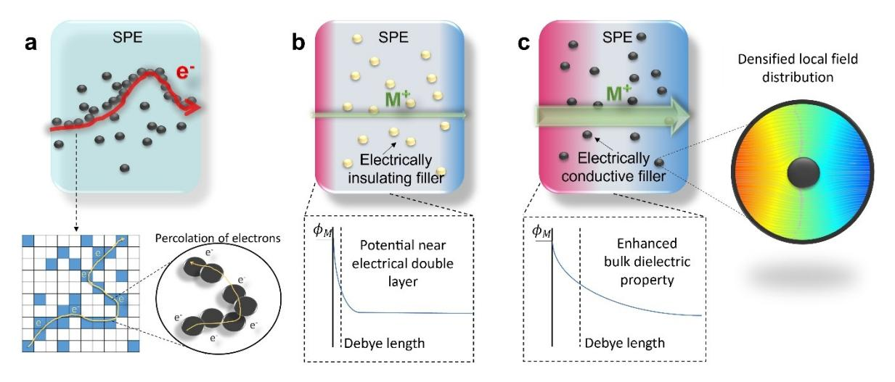
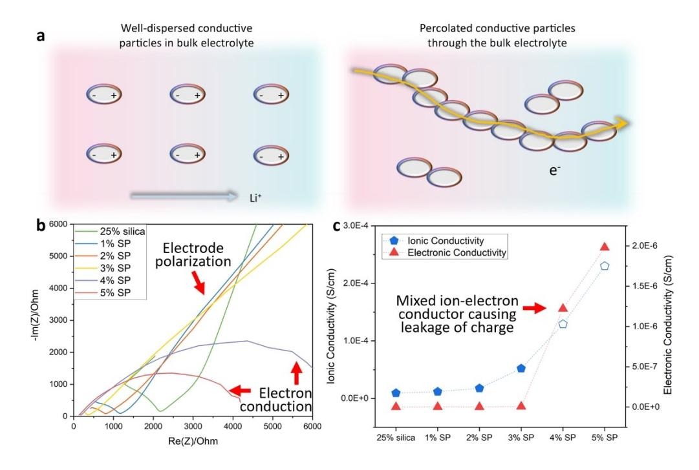
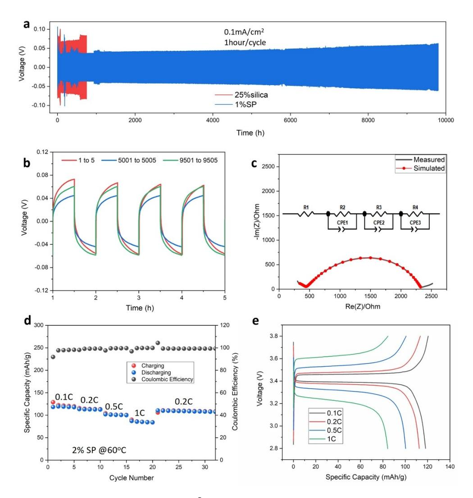
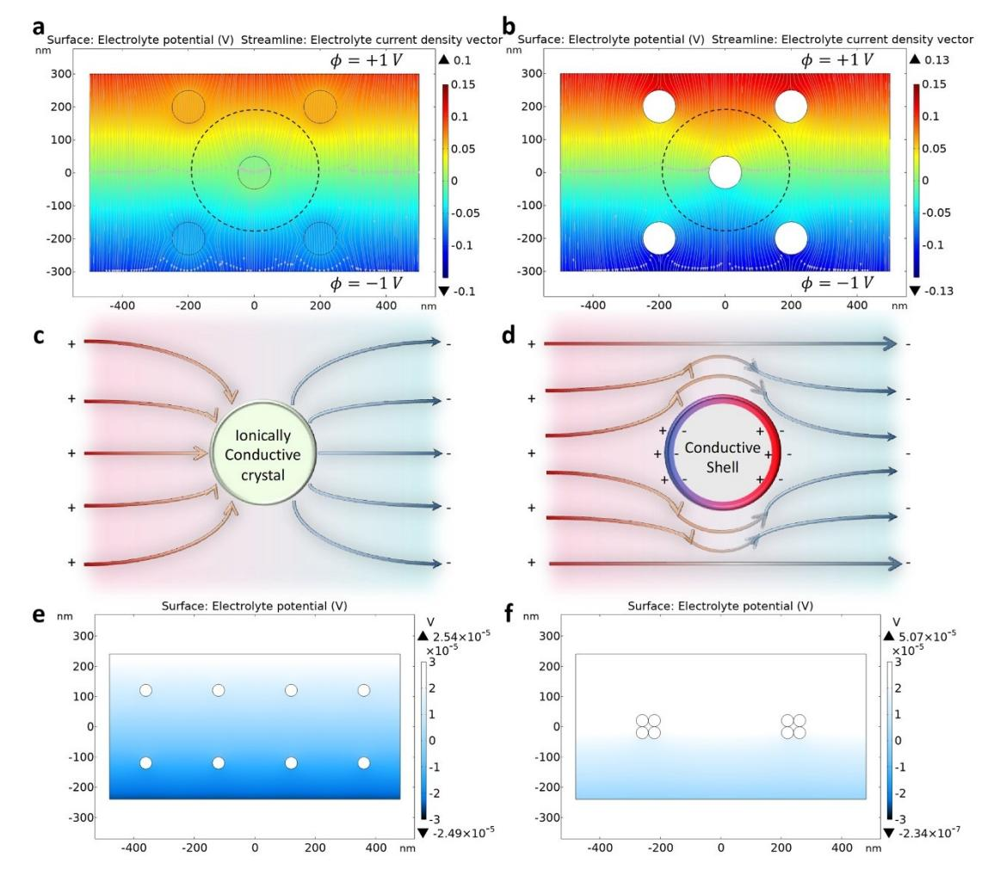
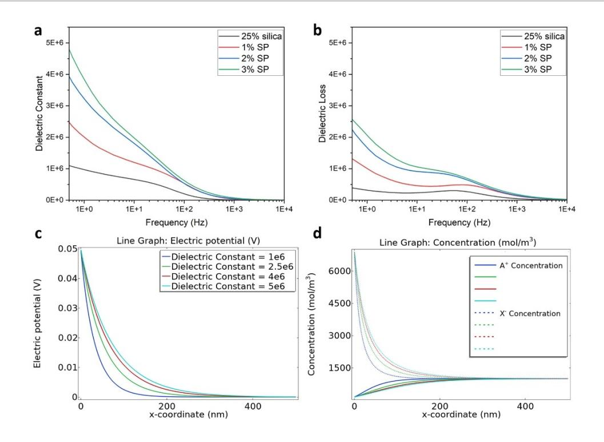

*Forschungsartikel*

*Angewandte Chemie* www.angewandte.org

Zitierweise: *Angew. Chem. Int. Ed.* **2023,** *62,* e202217538 Internationale Ausgabe: [doi.org/10.1002/anie.202217538](https://doi.org/10.1002/anie.202217538) Deutsche Ausgabe: [doi.org/10.1002/ange.202217538](https://doi.org/10.1002/ange.202217538)

# **A Stable Solid Polymer Electrolyte for Lithium Metal Battery with Electronically Conductive Fillers**

*Xuelin Guo, Zhengyu Ju, Xitang Qian, Yijie Liu, Xiao Xu, and [Guihua](http://orcid.org/0000-0002-3253-0749) Yu\**

**Abstract:** Electronic conduction in solid-polymer electrolytes is generally not desired, which causes leakage of electrons or energy loss, and the electronically conductive domains at electrode-electrolyte interfaces can lead to continuous decomposition of electrolytes and shorting issues. However, it is noticed in this work that in an insulating matrix, the conductive domains at certain aspects could also have positive effects on the electrolyte performance with proper control. This work evaluates the limitation and benefits of electronically conductive domains in a solid-polymer electrolyte system and discusses the approach to improve the electrolyte physicochemical properties with densified local electric field distribution, enhanced bulk dielectric property, and charge transfer. By deliberately introducing the conductive domains in a regular solid-polymer electrolyte, stable cycle life, low overpotential, and promising full cell performance could be achieved.

#### *Introduction*

Prosperity in electronic technologies and electric vehicles stimulates great need of efficient energy storage systems, and lithium-ion batteries (LIBs) as one of the most welldeveloped rechargeable battery technologies are approaching the theoretical limit within the current configuration.[1] Regular commercial LIBs are adopting organic liquid electrolytes with carbonate or ether-based solvents and lithium salts. However, the direct application of the high energy density Li metal as anode is currently challenging because of the serious dendrite issue and instability at interfaces.[2] Due to the chemical instability, the electrolyte molecules would decompose into layered or mosaic domains of decomposition products, which is called the solid-electrolyte interphase (SEI).[3] Some of the SEI components can conduct both electrons and ions, which is referred as the mixed-ion-electronic conductors while some components are insulating, and when this layer is insufficient to block the electrons, decomposition reactions at the interfaces would continuously proceed. Moreover, if the interfacial layer

*Angew. Chem.* **2023**, *135*, e202217538 (1 of 8) © 2022 Wiley-VCH GmbH

prefers to transfer electrons rather than ions, Li ions could deposit at the top surface instead of migrating into the electrode, and this part of Li could be wasted as the dead Li or even elongate and lead to the dangerous dendrite issue. Therefore, researchers proposed that the interfacial composition need to be insulating enough, by artificial methods such as implanting a dense layer of electronically insulating but ionically conductive LiF to cease the decomposition and ensure interfacial stability.[4]

It is often believed that the electron conduction is not only harmful at the electrode-electrolyte interfaces (EEIs) but could also cause electrolyte degradation. In liquid electrolytes, since most electrolyte solvents are electronically insulating, this issue is not significant, whereas the solid-state electrolytes have more concerns on this aspect. Solid-state electrolytes not only have more significant dendrite issues at the interfaces due to the insufficient interfacial contact between solid and solid surfaces, but also have severe concerns of Li deposition at the local grain boundaries because of the trapped charge.[5] For the solid-polymer electrolytes, although the better mechanical property could promise less detachment issues than inorganic solid-state electrolytes, the poor electrochemical stability could cause worse interfacial decomposition issue.[6] Therefore, it is essential to eliminate the electronic conductivity in solidstate electrolytes. In previous study, it has been noticed that unlike the inorganic solid-state electrolyte, the polymer electrolyte based on polyethylene oxide (PEO) matrix and Lithium bis(trifluoromethanesulfonyl)imide (LiTFSI) salt is not capable of forming as stable anion-driven SEI layer as the liquid organic electrolyte based on LiPF6 or Lithium bis(fluorosulfonyl)imide (LiFSI) salt.[7] Besides the electronic conductivity issue, the polymer electrolytes rely heavily on the percentage of amorphous polymer chains for fast interchain lithium-ion conduction.[8] In most experiments with polymer electrolytes, additive fillers, plasticizers, and elevated operation temperatures are normally necessary to achieve a reasonable ionic conductivity. For polymer electrolytes, the fillers are effective by preventing crystallization of polymer chains and creating more amorphous region, and the nano- or micro- particles such as SiO2, Al2O3, and inorganic ionic conductors are common fillers. Researchers have also noticed that with ionically conductive fillers, lithium ions could not only be transported rapidly by the amorphous region generated around the filler particles, but also could migrate through the particle crystals.[9] However, although the dielectric property has been noticed to be able to affect the electrolyte performance, little effort has been done on studying the electronically conductive

[\*] Dr. X. Guo, Z. Ju, Dr. X. Qian, Dr. Y. Liu, X. Xu, Prof. Dr. G. Yu Materials Science and Engineering Program and Walker Department of Mechanical Engineering, The University of Texas at Austin 204 E Dean Keeton Street, Austin, TX 78712 (USA) E-mail: ghyu@austin.utexas.edu

*Angewandte Chemie*

fillers.[10] Although several works have used electronically conductive fillers, the discussions are focused on the filler interaction with polymer, while the significance of electronic conductivity has not been well discussed or fully understood.[11]

In this work, we delved into the complex effects of the conductive fillers on solid-polymer-electrolytes and found they could significantly enhance the battery cycling stability and promise a reduced overpotential. Even a small amount of the carbon filler could already provide a much-enhanced electrolyte performance, and the reasons behind are proposed into two major scenarios: (1) microscopically, the carbon fillers densified the local electric field distribution and helped more efficient charge transfer to prevent local dendrite formation at particle boundaries; and (2) macroscopically, the enhanced bulk dielectric property helped to spread the double layer region and salt solvation to enhance the interfacial and bulk charge transfer. Supported by the stable electrochemical performance of both half-cell and full-cell, simulations and characterization also agree with our proposed model. The simulation of field in the electrolyte shows the intensified electric field around electrically conductive particles, but much reduced ion flow across the edge of particles to prevent local deposition of Li when the filler particles do not have ionic conductivity, with the dispersion of particles effecting the transfer property significantly. The dielectric measurement also reflects that the electronically conductive carbon particle shows more significant dielectric property that the silica fillers. Based on the double layer theory at the electrode surfaces, the increased dielectric property could also lead to more uniformized ion concentration distribution at electrode surfaces, and therefore the possibility of ion depletion which is blamed for dendritic protrusion could be limited. It is believed that the significance and understanding of the electronically conductive part in electrolyte have been underestimated for long, and this study may provide insights into better design of solid-state electrolyte systems.

#### *Results and Discussion*

As shown in Figure 1, when adding too many conductive particles as fillers in the SPE matrix (Figure 1a), there is an increasing possibility that the conductive particles could get interconnected and form an electronic pathway, which will lead to local short circuiting. Based on the percolation theory, this critical concentration is related to the size and shape of the conductive domains.[12] For the spherical particles, the percolation threshold could be achieved with larger amount than that for fibrous particles that are geometrically more possible to form interconnected framework. To avoid electron percolation, the conductive filler particles are selected to be the common additive that is normally adopted for electrode preparation, which is the Super P spherical acetylene carbon black with an average size of 20–50 nm. Comparing with the regular electrolytes that have a layer of opposite species of charge at the electrode surfaces and fast decaying concentration throughout the outer space due to the presence of electrical double layer (Figure 1b), whereas the conductive fillers could cause a more dispersed distribution of charge near the interfacial region, and therefore requires a larger distance for the charge depletion to happen (Figure 1c). Also, the conductive particles in the electric field could be polarized to be the opposite of electric field direction and adsorb a layer of counter ions around the particles, in which case the electric field around the particle would be densified.

To probe the percolation threshold of the carbon nanoparticle filler in SPE, an inspection to search the upper limit is performed. By the same preparation method with a sonication step after adding filler particles that disperse the carbon particles evenly in the polymer electrolyte, the risk of aggregation of particles that forms conductive domains is largely limited. And as the conductive domains are dispersed well in the electrolyte, with the applied outer electric field, the electrons and holes in the conductive domains would concentrate at the opposite sides as the applied field. In this

*Figure 1.* Schematics of the conductive filler effect on solid polymer electrolytes. a) shows the case that the over number of conductive particles could cause the percolation of electrons through connected conductive pathways. b), c) show the difference of electric field distribution at the electrode surfaces with electronically (b) insulating or (c) conductive fillers in the SPE.

*Angew. Chem.* **2023**, *135*, e202217538 (2 of 8) © 2022 Wiley-VCH GmbH

case, although the polymer electrolyte is not intrinsically dielectric, the polarized conductive domains are helpful for increasing the bulk dielectric property and enhancing the dissociation of salt for better charge transfer (Figure 2a). Via the electrochemical impedance spectroscopy (EIS) tests with only stainless-steel current collectors of the SPE with different fillers, it could be noticed that the first semi-circle which represents the bulk electrolyte resistance is decreasing with increasing amount of carbon, but even 1 wt% of carbon is sufficient for much enhanced charge transfer than the silica nanoparticle filler (Figure 2b). As most electrolytes would behave, the accumulation of charge at current collectors in this test configuration should lead to the increasing impedance after the first semi-circle, whereas when the carbon amount is exceeding 4 wt%, the second semi-circle starts to appear, which is corresponding to the leakage of electrons through percolated domains.[13] It could also be found in the constant voltage measurement that the leakage of current is very significant when the carbon exceeds a certain limit (Figure S1). The comparison between ionic and electronic conductivities shown in Figure 2c clearly indicates the advantage of adopting carbon filler than the silica filler and the upper limit of adding this type of filler. From the plot, the electronic conductivity experiences an abrupt change after a certain amount of carbon is added, instead of gradual change like the ionic conductivity, which indicates the turning into mixed-ion-electronic conduction due to electron percolation. It should be noted that the positive charge conductivity is measured with the alternating current (AC) method by selecting the first semi-circle in EIS tests as the ionic conduction, which is widely adopted in studies on electrolyte properties. When the electronic conductivity is sufficiently small, the conductivity corresponds to mainly ionic conductivity. To validate that, direct current (DC) tests are also provided as a reference (Table S1). Based on the measurements, the capability of maintaining electronically insulating is not changed even at elevated temperatures (Table S1, S2). To confirm that the performance increment of adding carbon particles is not solely or mostly due to the decreased crystallinity of polymer chains, the X-ray diffraction spectroscopy (XRD) results show regular PEO patterns after adding fillers (Figure S2), and the differential scanning calorimetry (DSC) measurements indicate phase transfer behaviour at same temperature with comparable amount of enthalpy change for 1 wt% of carbon and 25 wt% of silica (Figure S3, S4).[14] Since the density of carbon black is approximately 1.8– 2.1 gcm 3 while that of silica is 2.65 gcm 3 , the added amount of carbon is significantly smaller than silica in both mass and volume aspects. The morphology of the polymer electrolyte with the carbon as filler is checked, as shown in Figure S5, being around 250 μm in thickness and flat top surface. The dispersion of carbon nanoparticles is not easy to observe since the 20–50 nm sized carbon particles can be hardly distinguished with SEM, but the non-contact atomic force microscopy (AFM) is able to present the dispersion and size of particles. It could be noticed that the carbon black particles are aggregated with domains in the SPE but dispersed with sufficiently large distance to prevent electronic percolation (Figure S6). It should be noted since the poor interfacial contact of the as-prepared Li metal cells are different from those that have been treated with operation

*Figure 2.* Determining the percolation threshold for this carbon filled SPE system. a) The schematics of the polarized particle in the electric field and the percolation of electrons with connected conductive domains. b) The EIS tests of the SPEs with different fillers in stainless-steel symmetric cells at room temperature. c) The electronic and ionic conductivity measured by AC method of the SPEs at room temperature.

*Angew. Chem.* **2023**, *135*, e202217538 (3 of 8) © 2022 Wiley-VCH GmbH

temperature (Figure S7), leading to even higher conductivity (Table S3).

To validate that the SPE with carbon filler is a feasible electrolyte to function properly, we present the superior cycling stability of the Li symmetric cell and reasonable full cell performance paired with a regular Li-ion cathode. To keep consistency of our test, in this work, a SPE substrate with 0.5 g LiTFSI and 1 g PEO (Mv 600 000) is adopted as matrix, with different weight ratios of different fillers, and the battery operation temperature is adopted to be 60 °C as for most reported SPEs. As shown in Figure 3a, with only 1 wt% of carbon filler (labelled as 1 wt% SP, and so for other carbon filled samples) at 0.1 mAcm 2 current density for 1 hour per cycle and 60°C, the Li metal symmetric cell kept stable long cycling for around 10000 cycles with no sign of shorting at a low level of overpotential. The initial cycles appear fluctuations of the overpotential, indicating the interfacial reactions that helps to stabilize the battery cycling, which can smooth out over time. Whereas the silica filler leads to a significantly increased overpotential after several hundred cycles. The selected cycles throughout the long cycling in Figure 3b indicate that the overpotential is in between of 40 mV to 70 mV in these 10 000 cycles with a recognizable SPE Li metal symmetric voltage profile patterns. At room temperature, the EIS test could be simulated with an equivalent circuit as indicated in Figure 3c, with the parameters summarized in Table S4. The equivalent circuit indicates that this symmetric cell has a relatively small electrical resistance R1 and also a reasonably small bulk electrolyte resistance as R2 represents, but a slightly more significant interfacial resistance that could be roughly represented by R3 and R4, which could be due to many reasons, such as the poor solid-solid contact at room temperature and the presence of interfacial SEI. It has been

*Figure 3.* Battery performance of the SPE with 1 wt% of Super P® carbon filler in Li-ion batteries. a) The long-term cycling stability of Li metal symmetric cell in comparison with silica filled SPE. b) The magnified voltage profiles of different cycles (1 to 5, 5001 to 5005, and 9501 to 9505) in the long-term cycling stability test of the Li metal symmetric cell. c) The measured and simulated room-temperature Li metal 2 wt% carbon filled SPE symmetric cell EIS with equivalent circuit as indicated in the plot. d) The rate performance of the LiFePO4 cathode and Li anode with 2 wt% carbon filler. e) The voltage profiles of the full cell cycled at different rates.

*Angew. Chem.* **2023**, *135*, e202217538 (4 of 8) © 2022 Wiley-VCH GmbH

reported that for a SPE, the solid interfacial contact between electrodes and electrolyte could introduce the extra interfacial resistance beside the bulk resistance of electrolyte, charge transfer, and meanwhile the grains and grain boundaries of particle fillers, as well as the interfacial decomposition product could also increase the resistance, which has been discussed in many equivalent circuit patterns for SPEs.[15] At higher current density, the instability starts to appear after the current density exceeds 1 mAcm 2 for the 1 wt% carbon filled SPE (Figure S8), whereas with increased amount of filler to 3 wt% (Figure S9) the limit could be extended to 2 mAcm 2 . To verify that the electrolyte is also able for practical use, the full cell measurement for Li metal with a regular LiFePO4 cathode. As shown in Figure 3d–e, the full cell with a 2 wt% carbon filled SPE shows promising rate performance and stability, with good reversibility that has coulombic efficiency close to 100%. From these battery performance characterizations, it could be confirmed that the carbon nanoparticles as a type of polymer electrolyte filler is not only functional, but shows promising performance that is almost comparable with liquid organic electrolytes at 60 °C. Within the full cell operation range, we do not observe electrolyte decomposition of the SPE with carbon additive, which indicates the promising electrochemical stability.

To further understand the mechanism driving this superior performance of the carbon filled electrolytes, the finite-element simulations with manually set parameters are performed. If the ionically conductive fillers have a higher ionic conductivity than the bulk electrolyte are added into the SPE, the current could flow faster through the particles, and the field line distribution around the particle is sparse (Figure 4a). However, when electronically conductive but ionically insulating particles present in the field, the electric field around the particles would curve because of the current flow, and the current density around the particles would be intensified as simulated in Figure 4b. It should be noted that with the particles that are both ionically and electronically insulating, the electric field can still show intensified field lines around the particles because the charge needs to

*Figure 4.* Simulations for local effect demonstration. An electric potential difference applied to an electrolyte is simulated with potential distribution and current density distribution around the a) ionically conductive and b) ionically non-conductive particles in the electrolyte. c) and d) are schematics of the electric field distribution around different types of particles in the electric field. e) and f) show significantly different potential distribution with different dispersion of particles.

*Angew. Chem.* **2023**, *135*, e202217538 (5 of 8) © 2022 Wiley-VCH GmbH

migrate through only the bulk electrolyte when the particles are hindering the current pathway, whereas the electronically conductive particles could be polarized in the electric field with charge at each side of particle surfaces and cause the accumulation of opposite type of ions adsorbed and concentrated at the surfaces of the particles, helping the dissociation of charge as reported for dielectric materials (Figure 4c, d). The better dissociation of salt can be reflected by the transference property of Li ions, and Equation 1 is used to estimate the transference number with the Bruce-Vincent method (Figure S14), in which the  $I_0$  or  $R_{i0}$  and  $I_s$ or  $R_{is}$  are the current or interfacial resistance of the initial or stabilized state with a constant voltage  $\Delta V$  applied across the bulk electrolyte.[16]

$$t^{+} = \frac{I_{s}(\Delta V - I_{0}R_{i0})}{I_{0}(\Delta V - I_{s}R_{is})}$$
 (1)

It is measured that the transference number of the 25 wt % silica sample is 0.150, whereas that for the 1 wt % carbon filler sample is 0.396 at room temperature, which indicates the higher capability of the later one for charge dissociation. It has been proposed that the growth of dendrite could be closely related to the concentration of available ions. The depletion of charge could lead to growth of Li protrusion, which mostly depends on parameters including the bulk electrolyte concentration, current density, and transference number.[17] This result explains the superior stability and also explains the increased ionic conductivity of the SPEs with carbon filler even at room temperature (Table S1, S2). Comparing with the model of an ionically conductive particle in the electric field (Figure 4c), the electronically conductive particles (Figure 4d), due to the electrostatic shielding effect of the presence of this positive charge around the particles, have less current flow directly towards the particles, so the chance of trapping ions across boundaries should be limited. It is one of the reasons leading to the outstanding stability of having conductive fillers inside SPE, since the local dendrite issue could be limited. Dispersion of particles could also significantly affect the field distribution and current density. Based on the preparation method and analyzation of AFM image (Figure S15, S16), the distribution of carbon particles could be estimated mathematically. Within the estimated dimensions, the simulation result in Figure 4e, f indicates that the well dispersed particles in the SPE could lead to a more significant local potential change inside the electrolyte than the aggregated particles with the same applied current. It has been reported that the gradient field in the nanogap cells, the overlapping double layer region as a uniformized field area that could largely enhance charge migration, which indicates the benefits of having uniformly distributed potential instead of the traditional electrical double layer structure at only near electrode surfaces and relatively slower diffusion for ion transport inside the bulk electrolyte.[18]

To understand the holistic effect of the local phenomenon on the bulk electrolyte, the dielectric property of SPE with different fillers are tested. With Equation  $(2)$  for the dielectric constant  $\epsilon'_{r}$  and Equation (3) for the dielectric loss

Angew. Chem. 2023, 135, e202217538 (6 of 8)

 $\varepsilon_{r}^{''}$  calculation, the EIS tests provide complex and imaginary impedance ( $Z^{'}$  and  $Z^{'}$ ), frequency f, and phase angle  $\theta$ . In the equation,  $\varepsilon_0$  is the vacuum permittivity, *d* and *A* are the thickness and area of the electrolyte.[19]

$$\varepsilon_{r}^{'} = -\frac{Z^{'}d}{2\pi f|Z|^{2} \varepsilon_{0} A} \tag{2}$$

$$\varepsilon_{r}^{''} = -\frac{\varepsilon_{r}}{\tan \theta} \tag{3}$$

As shown in Figure 5a, the carbon filled SPEs have much higher permittivity than the SPE with silica filler and increases with increasing amount of carbon filler added to the SPE. This is inferred that the electronically conductive carbon filler could be easily polarized in the polymer matrix, and could bring the dielectric property to the SPE, although the intrinsic material dielectric property of the polymer matrix is not changed. Moreover, since the energy loss of heat dissipation in the varying electric field is also higher for the carbon filled SPEs as the measured dielectric loss (Figure 5b), it ideally could allow the polymer electrolyte to maintain reasonable temperature to create more amorphous region without extra energy input. Considering the spatial extend of diffuse double layer of same order as the Debye length, which is defined as Equation  $(4)$ , the distribution of potential could be estimated with the Poisson Equation, and the current flux is demonstrated by the Nernst-Plank Equation. It could be noticed that when the temperature is constant, the double layer dispersion is closely determined by the relative permittivity and bulk concentration.[20]

$$x_{\rm D} = \left(\frac{RT}{2F^2c_{\rm buk}}\varepsilon_0\right)^{\frac{1}{2}}\tag{4}$$

Based on the dielectric properties measured and the same simulation parameters for other conditions as provided in the method section, the simulation of the potential distribution shows that the carbon fillers show a relatively more uniform electric field distribution (Figure 5c) as well as more available charge near the electrode surface (Figure 5d). Since the dendrite elongation can be stimulated significantly by the ion depletion, this result also explains the superior stability of this carbon filled SPE for Li metal electrode as mentioned in the previous sections. It should be noted that the simulations and models proposed in this work are all based on the spherical shape that is identical to the carbon black filler we are using, and the geometric effect has not been discussed. Due to the close relationship between the percolation threshold and the conductive particle aspect ratio, and degree of agglomeration, the model should be further modified when other types of fillers are adopted, such as carbon fibres or carbon nanosheets, and so forth.

#### **Conclusion**

In conclusion, we notice that deliberate introduction of the electronically conductive carbon filler can largely improve

*Figure 5.* The measured dielectric property and simulation based on the measurements. a) and b) are the dielectric constant and dielectric loss measured for SPE with different fillers as labelled in the plots at room temperature. c) and d) are the simulated estimation of electric potential and ionic concentration of cations A+ and anions X near the electrode based on the measured dielectric constants with the same colour corresponding to different dielectric constant as in (c).

the PEO-based Li-ion solid-polymer electrolyte stability and conductivity, which provides new understanding for the effect of conductive domains in solid-state electrolyte. The percolation threshold could be determined by the materials type and geometry, which has been determined for the carbon black that a 3 wt% of polymer weight is the upper limit for safe operation. The electric field homogenized by the presence of electronically conductive particles that helps more efficient ion migration and the enhanced bulk dielectric properties that helps salt dissociation are both possible reasons leading to stable Li metal batteries. Electrochemical characterizations and finite element simulations are both provided to confirm the proposed theory. Whereas the battery performance and simulations show promising results, the direct observation of the actual distribution of charge inside the electrolyte and around the particle is hard to characterize with current available technologies for the polymer system and nanosized carbon particles, therefore future explorations should pay more attention on this phenomenon with advanced characterization and to experimental validation with different types of conductive materials for a more generalized design principle towards great applicational values. Besides, in this work, the experiment and simulations are based on the spherical conductive carbon black, whereas it is also important that future works should explore more on the geometric factor of different types of conductive fillers in SPE and discuss if the electrical conductivity difference of the conductive fillers could lead to different charge transfer behavior, to enhance the understanding for stable and efficient SPE designs.

#### *Acknowledgements*

G.Y. acknowledges the financial support from the Welch Foundation Award F-1861, and Camille-Dreyfus Teacher Scholar Award.

## *Conflict of Interest*

The authors declare no conflict of interest.

### *Data Availability Statement*

The data that support the findings of this study are available in the Supporting Information of this article.

**Keywords:** Electrochemical Interfaces **·** Electronically Conductive Fillers **·** Lithium Metal **·** Solid-Polymer Electrolytes

[1] a) J. M. Tarascon, M. Armand, *Nature* **2001**, *414*, [359–367;](https://doi.org/10.1038/35104644) b) S. Yang, F. Zhang, H. Ding, P. He, H. Zhou, *Joule* **2018**, *2*, [1648–](https://doi.org/10.1016/j.joule.2018.07.006) [1651](https://doi.org/10.1016/j.joule.2018.07.006).

- [2] a) D. Lin, Y. Liu, Y. Cui, *Nat. [Nanotechnol.](https://doi.org/10.1038/nnano.2017.16)* **2017**, *12*, 194–206; b) X. B. Cheng, R. Zhang, C. Z. Zhao, Q. Zhang, *[Chem.](https://doi.org/10.1021/acs.chemrev.7b00115) Rev.* **2017**, *117*, [10403–10473](https://doi.org/10.1021/acs.chemrev.7b00115).
- [3] E. Peled, S. Menkin, *J. [Electrochem.](https://doi.org/10.1149/2.1441707jes) Soc.* **2017**, *164*, A1703– [A1719](https://doi.org/10.1149/2.1441707jes).
- [4] a) J. Chen, X. Fan, Q. Li, H. Yang, M. R. Khoshi, Y. Xu, S. Hwang, L. Chen, X. Ji, C. Yang, H. He, C. Wang, E. Garfunkel, D. Su, O. Borodin, C. Wang, *Nat. [Energy](https://doi.org/10.1038/s41560-020-0601-1)* **2020**, *5*, [386–397;](https://doi.org/10.1038/s41560-020-0601-1) b) Z. Shadike, H. Lee, O. Borodin, X. Cao, X. Fan, X. Wang, R. Lin, S. M. Bak, S. Ghose, K. Xu, C. Wang, J. Liu, J. Xiao, X. Q. Yang, E. Hu, *Nat. [Nanotechnol.](https://doi.org/10.1038/s41565-020-00845-5)* **2021**, *16*, 549– [554.](https://doi.org/10.1038/s41565-020-00845-5)
- [5] a) T. Krauskopf, F. H. Richter, W. G. Zeier, J. Janek, *[Chem.](https://doi.org/10.1021/acs.chemrev.0c00431) Rev.* **2020**, *120*, [7745–7794;](https://doi.org/10.1021/acs.chemrev.0c00431) b) Q. Zhao, S. Stalin, C.-Z. Zhao, L. A. Archer, *Nat. Rev. Mater.* **2020**, *5*, [229–252;](https://doi.org/10.1038/s41578-019-0165-5) c) X. Guo, J. Bae, Y. Ding, X. Zhang, G. Yu, *Adv. Funct. [Mater.](https://doi.org/10.1002/adfm.202010863)* **2021**, *31*, [2010863;](https://doi.org/10.1002/adfm.202010863) d) F. Han, A. S. Westover, J. Yue, X. Fan, F. Wang, M. Chi, D. N. Leonard, N. J. Dudney, H. Wang, C. Wang, *[Nat.](https://doi.org/10.1038/s41560-018-0312-z) Energy* **2019**, *4*, [187–196](https://doi.org/10.1038/s41560-018-0312-z).
- [6] a) A. Manthiram, X. Yu, S. Wang, *Nat. Rev. Mater.* **2017**, *2*, 16103; b) B. D. Paulsen, K. Tybrandt, E. Stavrinidou, J. Rivnay, *Nat. [Mater.](https://doi.org/10.1038/s41563-019-0435-z)* **2020**, *19*, 13–26.
- [7] a) X. Guo, Y. Liu, X. Zhang, Z. Ju, Y. Li, D. Mitlin, G. Yu, *Angew. Chem. Int. Ed.* **2022**, *61*, e202203409; *Angew. Chem.* **2022**, *134*, e202203409; b) H. Wang, W. Huang, Z. Yu, W. Huang, R. Xu, Z. Zhang, Z. Bao, Y. Cui, *ACS [Energy](https://doi.org/10.1021/acsenergylett.0c02533) Lett.* **2021**, *6*, [816–825](https://doi.org/10.1021/acsenergylett.0c02533); c) Z. Yu, P. E. Rudnicki, Z. Zhang, Z. Huang, H. Celik, S. T. Oyakhire, Y. Chen, X. Kong, S. C. Kim, X. Xiao, H. Wang, Y. Zheng, G. A. Kamat, M. S. Kim, S. F. Bent, J. Qin, Y. Cui, Z. Bao, *Nat. [Energy](https://doi.org/10.1038/s41560-021-00962-y)* **2022**, *7*, 94–106; d) X. Guo, Y. Ding, G. Yu, *Adv. Mater.* **2021**, *33*, [2100052](https://doi.org/10.1002/adma.202100052); e) J. Bae, X. Zhang, X. Guo, G. Yu, *Nano Lett.* **2021**, *21*, [1184–1191.](https://doi.org/10.1021/acs.nanolett.0c04959)
- [8] Z. Xue, D. He, X. Xie, *J. Mater. Chem. A* **2015**, *3*, [19218–](https://doi.org/10.1039/C5TA03471J) [19253.](https://doi.org/10.1039/C5TA03471J)

- [9] L. Chen, Y. Li, S.-P. Li, L.-Z. Fan, C.-W. Nan, J. B. Goodenough, *Nano Energy* **2018**, *46*, [176–184.](https://doi.org/10.1016/j.nanoen.2017.12.037)
- [10] V. P. Hoang Huy, S. So, J. Hur, *[Nanomaterials](https://doi.org/10.3390/nano11030614)* **2021**, *11*, 614.
- [11] a) C. Ma, K. Dai, H. Hou, X. Ji, L. Chen, D. G. Ivey, W. Wei, *Adv. Sci.* **2018**, *5*, [1700996;](https://doi.org/10.1002/advs.201700996) b) H. Yu, Y. Jin, G. D. Zhan, X. Liang, *ACS Omega* **2021**, *6*, [29060–29070](https://doi.org/10.1021/acsomega.1c04275).
- [12] V. K. S. Shante, S. Kirkpatrick, *Adv. Phys.* **1971**, *20*, [325–357.](https://doi.org/10.1080/00018737100101261)
- [13] Q. C. Zhuang, S. D. Xu, X. Y. Qiu, Y. L. Cui, L. A. Fang, S. G. Sun, *Prog. Chem.* **2010**, *22*, 1044–1057.
- [14] E. M. Masoud, A. A. El-Bellihi, W. A. Bayoumy, M. A. Mousa, *J. Alloys Compd.* **2013**, *575*, [223–228](https://doi.org/10.1016/j.jallcom.2013.04.054).
- [15] a) S. S. Zhang, K. Xu, T. R. Jow, *[Electrochim.](https://doi.org/10.1016/j.electacta.2005.02.137) Acta* **2006**, *51*, [1636–1640](https://doi.org/10.1016/j.electacta.2005.02.137); b) Z. Zhang, S. Chen, J. Yang, J. Wang, L. Yao, X. Yao, P. Cui, X. Xu, *ACS Appl. Mater. [Interfaces](https://doi.org/10.1021/acsami.7b16176)* **2018**, *10*, [2556–2565](https://doi.org/10.1021/acsami.7b16176).
- [16] a) K. Pożyczka, M. Marzantowicz, J. R. Dygas, F. Krok, *Electrochim. Acta* **2017**, *227*, 127–135; b) J. Evans, C. A. Vincent, P. G. Bruce, *Polymer* **1987**, *28*, [2324–2328](https://doi.org/10.1016/0032-3861(87)90394-6).
- [17] P. Bai, J. Li, F. R. Brushett, M. Z. Bazant, *Energy [Environ.](https://doi.org/10.1039/C6EE01674J) Sci.* **2016**, *9*, [3221–3229](https://doi.org/10.1039/C6EE01674J).
- [18] Y. Wang, S. R. Narayanan, W. Wu, *ACS Nano* **2017**, *11*, [8421–](https://doi.org/10.1021/acsnano.7b04038) [8428](https://doi.org/10.1021/acsnano.7b04038).
- [19] H. Gao, K. Lian, *ACS Appl. Mater. [Interfaces](https://doi.org/10.1021/am4045103)* **2014**, *6*, 464–472.
- [20] S. Académie des, S. Centre national de la recherche, *Comptes rendus hebdomadaires des séances de l*'*Académie des sciences*, *Vol. 149 (1909)*, publiés avec le concours du Centre national de la recherche scientifique par MM. les secrétaires perpétuels, Paris, **1909**.

Manuscript received: November 28, 2022

Accepted manuscript online: December 12, 2022 Version of record online: January 11, 2023