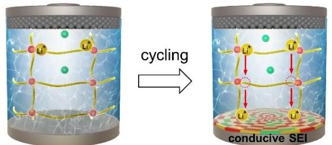
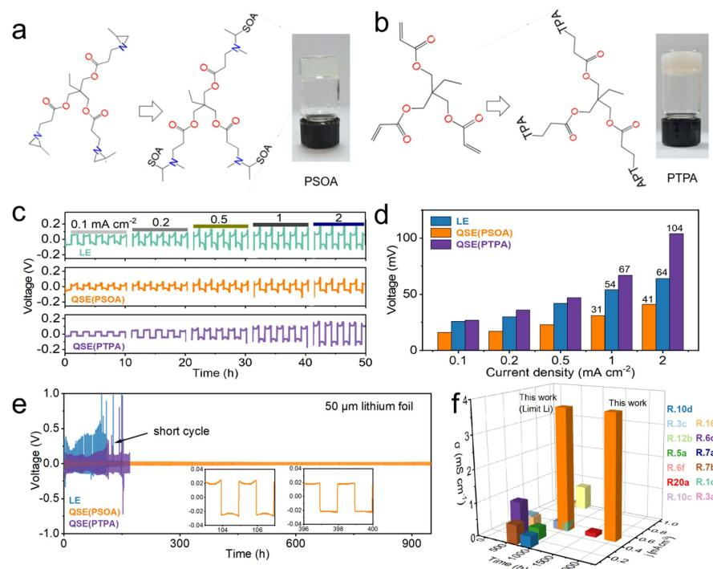
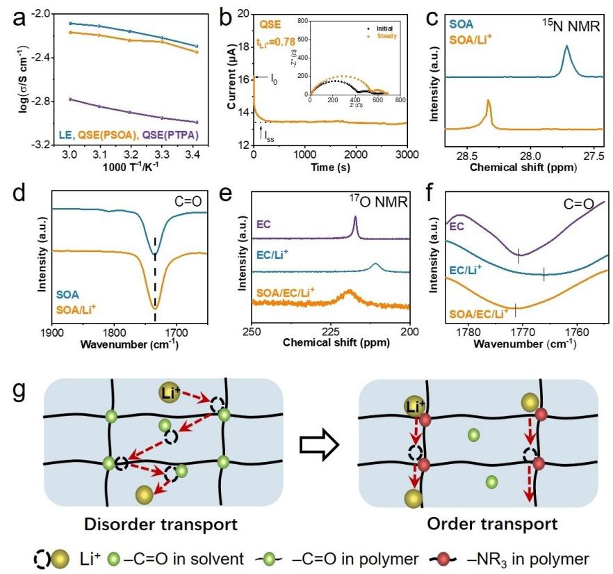
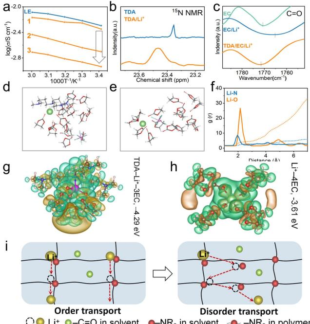
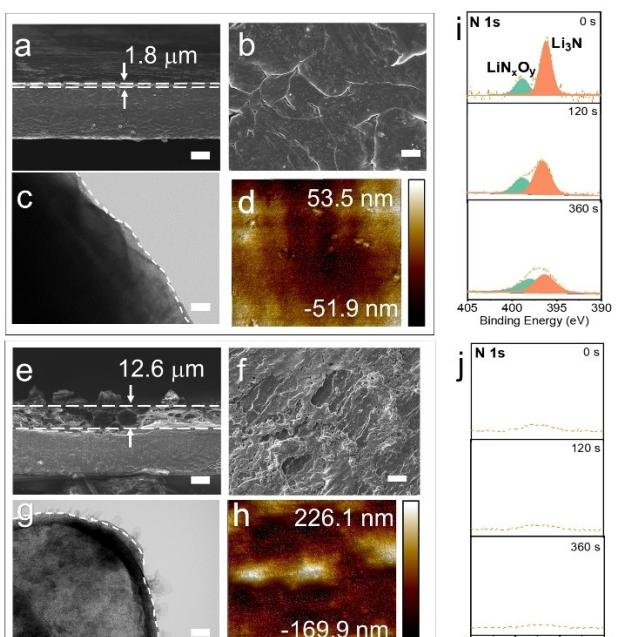
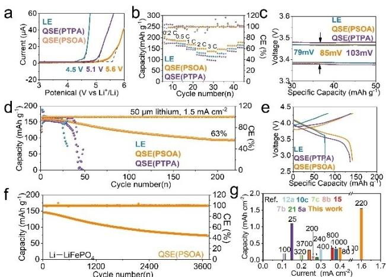
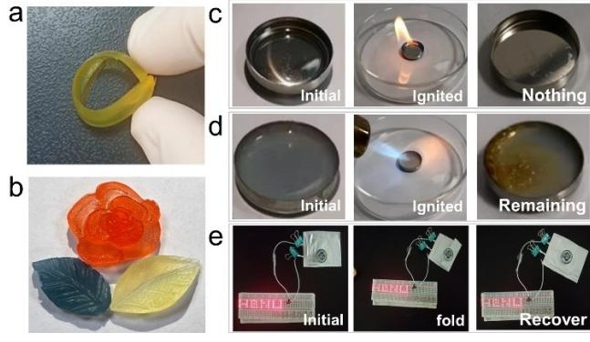

*Forschungsartikel*

*Angewandte Chemie* www.angewandte.org

## *Polymer Electrolytes Hot Paper*

Zitierweise: *Angew. Chem. Int. Ed.* **2023**, *62*, e202302559 [doi.org/10.1002/anie.202302559](https://doi.org/10.1002/anie.202302559)

# **Ordered and Fast Ion Transport of Quasi-solid-state Electrolyte with Regulated Coordination Strength for Lithium Metal Batteries**

*Qi Zhang, Zewen Liu, Xiaosheng Song, Tengfei Bian, Zhijie Guo, Donghai Wu, Jun Wei, Sixin Wu, and [Yong](http://orcid.org/0000-0002-5039-4576) Zhao\**

**Abstract:** Polymer based quasi-solid-state electrolyte (QSE) has attracted great attention due to its assurance for high safety of rechargeable batteries including lithium metal batteries (LMB). However, it faces the issue of low ionic conductivity of electrolyte and solidelectrolyte-interface (SEI) layer between QSE and lithium anode. Herein, we firstly demonstrate that the ordered and fast transport of lithium ion (Li+) can be realized in QSE. Due to the higher coordination strength of Li+ on tertiary amine ( NR3) group of polymer network than that on carbonyl ( C=O) group of ester solvent, Li+ can diffuse orderly and quickly on NR3 of polymer, significantly increasing the ionic conductivity of QSE to 3.69 mScm 1 . Moreover, NR3 of polymer can induce in situ and uniform generation of Li3N and LiN*x*O*y* in SEI. As a result, the Lij jNCM811 batteries (50 μm Li foil) with this QSE show an excellent stability of 220 cycles at �1.5 mAcm 2 , 5 times to those with conventional QSE. LMBs with LiFePO4 can stably run for �8300 h. This work demonstrates an attractive concept for improving ionic conductivity of QSE, and also provides an important step for developing advanced LMB with high cycle stability and safety.

### *Introduction*

Polymer-based quasi-solid-state electrolyte (QSE) has attracted great attention due to the advantages for ensuring the high safety of rechargeable batteries including of lithium metal batteries (LMB).[1] However, QSE faces the issue of low ionic conductivity.[2] In the bulk of electrolyte, there are multiple interactions between the cation/anion of lithium salt and the functional groups of polymer network and organic solvent, resulting in disordered and slow diffusion of ions, consequently low ionic conductivity of QSE.[3] Moreover, at the interface of QSE and anode, the generation of

*Angew. Chem.* **2023**, *135*, e202302559 (1 of 8) © 2023 Wiley-VCH GmbH

solid-electrolyte-interface (SEI) layer with low ionic conductivity leads to the subsequent dendrite growth and side reactions.[4] Therefore, the low ionic conductivity of bulky QSE and relevant SEI layer are definitely the bottleneck to limit the performance of quasi-solid-state LMBs, especially the low rate capability and cyclic stability.[5]

To improve the ionic conductivity of polymer-based QSE, the researchers devoted great efforts and developed different strategies,[6] such as decreasing the energy barrier of ionic transport, improving the migration rate of polymer chains, and so on. For example, Yang et al. showed that the inorganic filler decreased the energy barrier of Li+ transport, and the ionic conductivity of QSE reached 2.89× 10 4 Scm 1 . [7] Moreover, the ionic conductivity of QSE can be increased by improving the chain motility of polymer network.[3a, 8] For example, Dominic Bresser et al. reported a QSE based on a mixture of organic carbonates and polysiloxane,[9] and the ionic conductivity of the QSE reached 4×10 4 Scm 1 at 20 °C. Although the existing strategies have improved Li+ conductivity to a certain extent, the diffusion resistance of coordinate Li+ in the polymer network is relatively high to limit their transport. In the literatures, the Li+ conductivity of QSE with network polymer is mainly in the order of 10 4 Scm 1 at room temperature, one order of magnitude lower than that of conventional liquid electrolyte.[3b,10] Such a low ionic conductivity of QSE has become one of challenge to achieve the high performance of LMBs.

Except for settling down the above-mentioned issue, the increase of ionic conductivity of SEI layer on Li metal anode is also important for the long cycling stability of LMBs.[11] Various types of strategies such as regulating SEI components and structure optimization have shown the positive effects on the cyclic stability of Li anode.[4,12] Among them, the construction of in situ SEI layer with high ionic conductivity not only reduce the Li+ diffusion energy barrier, but also promote the dense massive lithium deposition to improve cycling stability.[13] Although different solutions have been used to prepare effective SEI layers for inhibiting the side reaction and dendrite growth of Li anode, the technique for constructing uniform and robust SEI layer with good ionic conductivity is still needed, especially in the ester-based electrolyte for high-voltage electrode materials.[14]

In this work, we firstly report a unique strategy that Li+ can orderly and quickly transport on the functional group of polymer network for the substantial improvement of ion conductivity in the polymer-based QSE. By introducing

[\*] Q. Zhang, Z. Liu, X. Song, T. Bian, Dr. Z. Guo, D. Wu, J. Wei, S. Wu, Prof. Dr. Y. Zhao

Key Lab for Special Functional Materials of Ministry of Education; National; Local Joint Engineering Research Center for Highefficiency Display and Lighting Technology; School of Materials Science and Engineering; Collaborative Innovation Center of Nano Functional Materials and Applications, Henan University Kaifeng, 475004 (P. R. China) E-mail: zhaoyong@henu.edu.cn

 NR3 group into the three-dimensional (3D) polymer network, the coordination strength of Li+ on the NR3 group is higher than that on the C=O group of ester solvents in QSE.[15] It overcomes the disordered and slow Li+ diffusion among C=O groups of network polymer and organic solvent due to the similar coordination strengths of Li+ in the conventional QSE (Scheme 1a), guiding the ordered transport of Li+ mainly on the polymer network in the newly-developed QSE (Scheme 1b). The ionic conductivity of as-prepared QSE reaches 3.69 mScm 1 , much higher than that of conventional QSE (*<*1 mScm 1 ), approaching to the level of ester liquid electrolyte (4.54 mScm 1 ).[1,16] Moreover, the homogeneous Li3N/LiN*x*O*y* species with high ionic conductivity can be in situ generated in the SEI layer from NR3 groups of polymers, promoting the uniform Li plating and stripping behaviors.[6b,17] As a result, the cycle life of Lij jLi batteries (50 μm Li foil) is 8 times longer than those of conventional QSE at a current of 0.5 mAcm 2 and a capacity of 0.5 mAhcm 2 . The assembled Lij jLiNi0.8Co0.1Mn0.1O2 (Lij jNCM811) batteries with such QSE and high NCM811 load of 8.6 mgcm 2 can operate 220 cycles at 1 C, much better than the traditional QSE (40 cycles) and liquid electrolyte (29 cycles), indicating its excellent ion conduction ability of bulk and SEI layer from the as-prepared QSE.

### *Results and Discussion*

Figure 1a and b show the molecular structure from trimethylolpropane tris(2-methyl-1-aziridinepropionate) (SOA)

*Scheme 1.* The schematic images of a) disordered Li+ transport with low rate and b) ordered Li+ transport with high rate by regulating the coordination strength between Li+ and the functional groups of polymer network and liquid medium in QSEs. Moreover, NR3 of PSOA can induce in situ and uniform generation of ion conducive species on SEI, resulting in the stable Li platting/stripping processes.

*Angew. Chem.* **2023**, *135*, e202302559 (2 of 8) © 2023 Wiley-VCH GmbH

monomer to poly[SOA)] (PSOA) polymer, and from trimethylolpropane trimethacrylate (TPA) monomer to poly(TPA) (PTPA) polymer, respectively. The synthesis information can be found in Figure S1 and S2, which the 3D PSOA network polymer was obtained by cation-initiated polymerization in the presence of ester solvent and LiPF6, and PTPA was obtained by radical-initiated polymerization. The main difference for the designed PSOA and PTPA is the functional groups in the polymer network, while PSOA contains NR3 and C=O groups, and PTPA only contains C=O group. In the above-mentioned QSE, ethylene carbonate (EC) and diethyl carbonate ethyl carbonate (DEC) solvents with 1 M LiPF6 were used as liquid electrolyte, in which C=O group exists in the medium. PSOAbased and PTPA-based QSEs are denoted as QSE(PSOA) and QSE(PTPA), respectively. The optical images of resultant QSE indicate its locking ability of liquid electrolyte (Figure 1).

To evaluate the actual application of QSE(PSOA), we primarily used it to assemble the quasi-solid-state Lij jLi symmetric batteries. Liquid electrolyte (LE, EC/DEC with 1 M LiPF6) and QSE(PTPA) were used for comparison. We tested the cell rate capability to assess their ability of ion transport (Figure 1c, d). When the current densities are 0.1, 0.2, 0.5, 1 and 2 mAcm 2 , the polarization voltages of batteries with QSE(PSOA) are 16, 17, 23, 31 and 41 mV, respectively, much lower than those with QSE(PTPA) (27, 36, 47, 67 and 104 mV). The corresponding polarization voltages (26, 30, 42, 54 and 64 mV) with LE are a little higher than those with QSE(PSOA). It demonstrates that the ionic conductivity of QSE(PSOA) is much higher than those of QSE(PTPA), reaching the level of LE. Moreover, the ionic conductivity of QSE also has the important impact on the rate capability of LMBs. To verify the high ionic conductivity of QSE(PSOA) and the resultant SEI layer, we evaluated the cyclic stability of Lij jLi symmetric battery by using 50 μm lithium foil at a current density of 0.5 mAcm 2 and a capacity of 0.5 mAh cm 2 (Figure 1e). Compared with those of LE, the cycle life of batteries with QSE(PSOA) increases from 100 to 950 h (Figure S3), 8 times higher than that of the QSE(PTPA) (120 h). With 450 μm Li foil as electrode, QSE(PSOA) assembled battery can stably operate more than 2000 hours (Figure S3).

The Lij jLi symmetric battery with QSE(PSOA) was also tested at 20, 15, 10, 5, 0 and 5°C, and they show the polarization voltages of 40, 47, 60, 71, 90 and 106 mV, respectively. In contrast, the corresponding values for the LE are 30, 36, 51, 73, 108 and 112 mV, and the short circuit occurs at 5°C (Figure S4). The long-term cyclic stability of the Lij jLi cells demonstrates that the QSE(PSOA) not only have the high ionic conductivity, but also generate the effective SEI layer on Li anode for stable Li stripping and plating behavior. The electrochemical impedance spectra (EIS) of assembled Lij jLi battery with QSE(PSOA) show that the resistance almost did not change with the increase of time (Figure S5), and the interfacial resistance was 145 Ω after being stationary for 30 days. In contrast, the interfacial resistance of battery with LE increased from the initial 215 Ω to 597 Ω, indicating the continuous occurrence of side

*Figure 1.* The performance of batteries with QSE and LE. a) The molecular structure from SOA to PSOA and Optical photos of QSE(PSOA) electrolyte. b) The molecular structure from TPA to PTPA and optical photos of QSE(PTPA) electrolyte. c) The rate capability of Lij j Li symmetrical batteries. d) Histogram of polarization voltages of Lij jLi symmetric battery shown in (c). e) Cycle stability test of Lij j Li batteries (50 μm lithium). the polarization curves of Lij j Li symmetrical batteries with QSE and LE. f) The comparison of the ionic conductivity of QSE and the cycle life of corresponding Lij j Li batteries at different current densities in the ever-reported and this work.

reactions. It indicates the more stable SEI on Li electrode induced from QSE(PSOA) than that from LE. In addition, we assembled Lij jCu half cells (0.5 mAcm 2 , 0.5 mAhcm 2 ), and the cycle number with QSE(PSOA) is over 200 cycles (Figure S6a), 3 times to that of LE and 4 times to that of QSE(PTPA). Moreover, QSE(PSOA) shows the lowest polarization and nucleation potentials within the three electrolytes after 50 cycles (Figure S6b). To the best of our knowledge, QSE(PSOA) show the impressive performance compared to those in the ever-reported references, especially in a limit lithium source (Figure 1f).

The better rate capability of Lij jLi cells indicates that QSE(PSOA) has high ion transport ability. To confirm this finding, we measured the ionic conductivity by testing the resistance of stainless-steelj jstainless-steel symmetrical cells (Figure 2a and S7). The results show that the ionic conductivity of QSE(PSOA) is 3.69 mScm 1 , much higher than that of QSE(PTPA) (0.96 mScm 1 ), a little lower than that of LE (4.54 mScm 1 ). We also tested Li+ transfer number (tLiþ ) of QSE(PSOA). Compared with tLi+ of LE and QSE(PTPA) (0.43 and 0.57, Figure S8 and S9), the tLiþ of QSE(PSOA) reaches up to 0.78 (Figure 2b).[18] Different from LE and QSE(PTPA), Li+ diffuses and transports on the NR3 group of PSOA in QSE(PSOA) without disordered diffusion, and PF6 anion with big size is confined in 3D polymer network. It is therefore suggested to be the reason for the high tLi+ value in QSE(PSOA). To clarify the mechanism for substantial improvement of ionic conductiv-

*Angew. Chem.* **2023**, *135*, e202302559 (3 of 8) © 2023 Wiley-VCH GmbH

ity from QSE(PTPA) to QSE(PSOA), the absorption capability of Li+ on the NR3 and C=O groups of PSOApolymer/ester-solvent are evaluated by different spectroscopies. 15N NMR spectra results show that N chemical shift of SOA moves from 27.7 to 28.3 ppm after mixing lithium salt (Figure 2c), and infrared (IR) spectra results show that C=O groups of SOA at 1735.6 cm 1 do not shift after mixing lithium salt (Figure 2d). It indicated that Li+ can interact strongly with N of NR3 but not with C=O in the SOA. In addition, 17O NMR spectra results show that O chemical shift of ester solvent moves from 217.3 ppm to 210.8 ppm after mixing lithium salt (Figure 2e), indicating the coordination structure of Li+ and C=O group. When SOA is added into the mixture of lithium salt and ester solvent, O chemical shift of C=O group moves back to 219.4 ppm, close to the original value (217.3 ppm). It is due to that Li+ primarily absorbs on C=O group of esters, while it changes to absorb on N of NR3 group of SOA in the ester solvent. The original absorption peak of C=O group of ester locates at 1770.6 cm 1 , and it shifts to 1765.6 cm 1 in the presence of lithium salt.[19] IR spectra results further confirm this conclusion (Figure 2f). After adding SOA into the solution, the peak is back to 1771.4 cm 1 , indicating the strong coordination strength between NR3 of SOA and Li+. It reveals that the introduction of NR3 groups changes the original coordination structure of Li+ and C=O group, and Li+ prefers to absorb on the NR3 of PSOA in QSE(PSOA). Based on the

*Forschungsartikel*

*Figure 2.* a) Ion conductivity test of QSE and LE at variable temperature. b) Current variation with polarization of a Lij jQSE(PSOA)j jLi symmetrical cell with an applied potential of 10 mV and EIS before and after polarization. c) 15N NMR testing of different solvents. d), f) IR spectroscopy of different solvents. e) 17O NMR testing of different solvents. g) Schematic of ion transport from disorder to order transport.

stronger coordination strength of Li+ on NR3 of SOA than that on C=O of ester and the much higher ionic conductivity of QSE(PSOA) than that of QSE(PTPA), we hypothesize that Li+ can diffuse orderly and rapidly on NR3 group of polymer network but not on C=O of liquid medium during battery operation. It is quite different from those of conventional QSE(PTPA), in which Li+ diffuse disorderly on the C=O groups of polymer network and liquid medium (Figure 2g).

To clarify the new mechanism of ordered transport in the QSE(PSOA), we added tris-(dimethylaminopropyl) amine (TDA, Figure S10) as an additive into electrolyte, in which NR3 group existed in both of PSOA and TDA. It reveals that Li+ can absorb on NR3 group of TDA liquid medium and polymer network in QSE, and the originally ordered Li+ transport in the QSE(PSOA) can be broken and changed to the disordered transport after adding TDA. Figure 3a shows the ionic conductivity of QSE(PSOA) in the presence of different concentration of TDA, and it gradually decreases when TDA concentration increases. When TDA concentration is similar as that of SOA, the ionic conductivity of QSE(PSOA) decreases to 0.92× 10 3 Scm 1 . 15N NMR spectra results show that the N chemical shift of TDA moves from 23.3 to 23.6 ppm after mixing lithium salt (Figure 3b and S10), similar as those of SOA. The IR spectra also show that C=O characteristic

*Angew. Chem.* **2023**, *135*, e202302559 (4 of 8) © 2023 Wiley-VCH GmbH

peak of ester electrolyte containing lithium salt shifts from 1765.6 cm 1 to 1771.4 cm 1 in the presence of TDA, indicating the stronger coordination strength of Li+ on NR3 of TDA than that on C=O of ester (Figure 3c and S11). The aforementioned experiments have proved the Li+ ordered transport in QSE(PSOA). To clarify the true state of Li+ in the presence C=O and NR3 for QSE(PSOA), the solvation structure of Li+ was probed by conducting ab initio molecular dynamics (AIMD) simulation. To simplify the model, we used simplified TDA with NR3 group to substitute PSOA in the ester electrolyte. As shown in Figure 3d and 3e, Li+ is surrounded by three EC molecules and one TDA molecule in the medium, while Li+ is surrounded by four EC molecules in the absence of TDA solvent. The calculated distance of Li N and Li O confirms the stronger coordination strength of Li+ and N of TDA than that of Li+ and C=O of EC (Figure 3f and S12). Based on this coordination, we calculated the absorption energy between Li+ and different functional group by using density functional theory (DFT) method (Figure 3g, h, S13 and S14). The results show that Li+ has strong binding energy with NR3 group. The coordination strength of Li+ to the combined 3 EC and 1 TDA is 4.29 eV, stronger than that of 4 EC ( 3.61 eV) in the four-coordination structure. The theoretical calculation results further confirm the spectra results.[20] In the original state of QSE(PSOA), Li+ orderly

## *Forschungsartikel*

*Figure 3.* a) Ion conductivity test of LE with/without TDA at variable temperature. b) 15N NMR testing of different solvents. c) IR spectroscopy of different solvents. d), e) Snapshots of the AIMD simulation with TDA/EC/Li+ and EC/Li+ in the final state at 313 K. f) Radial distribution function g(r) of N Li (TDA) and O Li (EC). g), h) DFT was used to calculate the binding energy of different solvents (yellow present position and green present negative; The hydrogen, lithium, carbon, nitrogen, and oxygen is marked as grey, pink, brown, blue and red, respectively). i) Schematic of ion transport by from order to disorder transport.

and quickly diffuses on the NR3 of PSOA. After introducing TDA into QSE(PSOA), Li+ can diffuse on the NR3 group of PSOA polymer and TDA liquid, resulting in the disordered diffusion and low ionic conductivity of QSE- (PSOA) (Figure 3i).

The abovementioned results indicate that the ordered and fast transport of Li+ can be realized in the QSE(PSOA), which is due to the different coordination strength of Li+ on functional groups of 3D network polymer and solvent. Except for that, the obtained long-term cyclic stability of Lij jLi symmetrical cells also relate with the advanced SEI layer on Li electrode. To clarify this point, we primarily used in situ optical microscopy to observe the Li stripping and plating behaviors. At a deposition current of 1 mA and a deposition time of 30 min, the Li dendrite growth can be found in the LE, while the deposited Li metal on the original electrode is still smooth and neat within the QSE- (PSOA) (Figure S15). Moreover, we observed the surface morphology of Li metal in the Lij jLi symmetric battery after 10 cycles by scanning electron microscopy (SEM). Cross-section images show that the thickness of SEI layer of Li electrode cycled in the LE reaches 12.6 μm (Figure 4a), while the thickness of SEI layer within QSE(PSOA) is only 1.8 μm (Figure 4e). The surface of Li electrode cycled in QSE(PSOA) is flat and smooth (Figure 4b), while many by-

*Angewandte*

*Chemie*

*Figure 4.* Surface morphology characterization of Li electrodes before and after Lij j Li symmetric cell cycling. SEM cross-section images of lithium electrodes after 10 cycling of the cells with QSE(PSOA) (a) and LE (e). The surface morphology of cycled Li electrode with QSE(PSOA) (b) and LE (f). HRTEM images of SEI structure of Li electrode with QSE(PSOA) (c) and LE (g) after 10 cycles. AFM images of copper foil surface of Lij jCu cells with QSE(PSOA) (d) and LE (h) after 10 cycles. XPS spectra of Li electrode surface after etching with different times (the cells with (i) QSE(PSOA) and (j) LE cycled for 10 times) (The scale bar is 10 μm in a, e; 200 μm for b, f and 50 nm for c and g).

products can be found on the surface of Li electrode cycled in the LE (Figure 4f). In addition, the high-resolution transmission electron microscope (HRTEM) images (Figure 4c, g) show that there are a lot of protrudes on the surface of Li metal cycled in the LE, while the surface of Li metal cycled in the QSE(PSOA) is smooth and uniform (Figure S16). Atomic force microscope (AFM) was used to further test the surface roughness of copper foil cycled in the Li Cu half battery (Figure 4d, h). It shows that the surface roughness of copper foil cycled in the QSE(PSOA) is much smaller than that in LE. Moreover, we measured the resistance of Lij jLi symmetrical cells before and after cycling (Figure S17). After 100 cycles, the SEI charge transfer resistance of LE/Li interface increases from 149.3 to 369.8 Ω. In contrast, the SEI interfacial resistance of QSE- (PSOA)jLi decreases from 119.7 to 102 Ω. It demonstrates the higher ionic conductivity of SEI layer from QSE(PSOA) than that from LE, and the more uniform Li stripping and plating behaviors can be realized for the better cyclic stability of battery.[21]

To analyze the chemical component of SEI layer, we used X-ray photoelectron spectroscopy (XPS) to check the surface composition, and performed the etching technique to detect the components of SEI layer in three-dimensional space. The differences in the SEI layer cannot be directly distinguished by C 1s and O 1s spectra, but N 1s spectra show that the peaks at binding energies of 399.6 eV and 403.4 eV assigned to N of Li3N and LiN*x*O*y* appear in the presence of QSE(PSOA).[6b,17] It indicates the formation of ion conductive species in the SEI layer, which is almost not changed with the etching depth (Figure S18). In contrast, the peak signal of N is not detected in the presence of LE. Considering the difference of chemical compositions between LE and QSE(PSOA), it is concluded that the NR3 groups of PSOA polymer is the N source to generate Li3N and LiN*x*O*y* in the SEI layer, which is benefit for the uniform Li stripping and plating process (Figure S19).

The above-mentioned results demonstrate that QSE- (PSOA) not only have the high ionic conductivity, but also has the ability of forming conducive SEI layer. To evaluate its possible application in LMBs, we assembled Lij j stainless-steel asymmetric cell to test the antioxidant capability of QSE(PSOA). The antioxidant voltage of QSE- (PSOA) can be 5.6 V, higher than those of LE (4.5 V) and QSE(PTPA) (5.1 V) (Figure 5a). Based on this advantage, we assembled LMB with low loading amount of electrode materials to evaluate the effect of SEI layer formed by QSE(PSOA). At the NCM811 load of 2 mg cm 2 (Figure 5b), the capacities of batteries with QSE(PSOA) are 194, 186, 169, 150 and 137 mAhg 1 at the rate of 0.2, 0.5, 1, 2 and 3 C, respectively. It is better than those with LE (191, 175, 158, 133, 115 mAhg 1 ) and QSE(PTPA) (174, 163, 147, 122, 99 mAhg 1 ). It should be noted that the capacities with these three electrolytes at the high current of 3 C are 132,

*Figure 5.* The performance of LMBs. a) LSV testing of QSE and LE using stainless steels as the working electrode and Li as the counter/ reference electrodes at a scan rate of 1 mVs 1 . b) Rate capability of Li-NCM811 full batteries with LE, QSE(PTPA) and QSE (PSOA) at a NCM811 loading amount of 2 mg cm 2 . c) Polarization curves of Li-LiFePO4 full battery with a LiFePO4 loading amount of 10.6 mg cm 2 . d) Cyclic stability of Li-NCM811 full battery with a NCM811 loading amount of 8.6 mgcm 2 at 1 C (CE: Coulombic efficiency). e) The charging and discharging curves of Li-NCM811 full batteries with NCM811 loading amount of 8.6 mg cm 2 at 30th cycle. f) Cyclic stability of Li-LiFePO4 full battery at 0.5 C. g) The comparison of the cycle life with corresponding full batteries at different current densities in the ever-reported and this work.

*Angew. Chem.* **2023**, *135*, e202302559 (6 of 8) © 2023 Wiley-VCH GmbH

113 and 97 mAhg 1 , respectively, which should relate with their different ionic conductivity (Figure S20). We also carried out the test of cell cyclic stability by using 50 μm lithium as anode. The Li-LiFePO4 battery (2 mgcm 2 LiFe-PO4) can stably cycle for 1200 cycles at 1 C (Figure S21). Moreover, the Li-NCM811 (2 mgcm 2 NCM) batteries can stably cycle for 800 cycles at 1 C (Figure S22). Moreover, we conducted battery test at a wide range of temperature to verify the advantage of QSE(PSOA). At 50°C, the assembled Li-LiFePO4 battery can be stable for more than 120 cycles at a load of 10.6 mgcm 2 and a current density of 0.5 C, verifying the high stability at high temperature (Figure S23). It proves the formation of advanced SEI layer in the presence of QSE(PSOA) for the stable cycling of Li electrode and full batteries.

To further confirm the importance of high ionic conductivity of QSE(PSOA), the loading amount of LiFePO4 was increased to 10.6 mgcm 2 . The discharge-charge curve in Figure 5c shows that the polarization voltages of LE, QSE (PSOA) and QSE (PTPA) after several cycles is 79, 85 and 103 mV at 0.5 C, respectively, further proving that the ionic conductivity of QSE(PSOA) is better than that of QSE- (PTPA). We also conducted the test of cyclic stability. When the NCM811 load amount increases to 8.6 mg cm 2 , at a high current density of 1.5 mAcm 2 , the cyclic stability of QSE- (PSOA) is more than 200 cycles, 5 times to those of LE and QSE(PTPA) (Figure 5d). The capacity retention rate of battery with QSE(PSOA) is also the best among the three electrolytes (Figure 5e). This synergistic effect of high ionic conductivity of QSE(PSOA) and its derived SEI layer contributes the long-term cycle stability of LMBs with high area capacity. Finally, we assembled Li-LiFePO4 battery for long-term operation (2 mg cm 2 ), and the cycle time is close to one year (8300 h/3700 times) at a current density of 0.5 C (Figure 5f). However, the battery with LE can only cycle 1300 times (Figure S24). The obtained cycle life is highly competitive to the ever-reported data in the literatures (Figure 5g).

Except for the advantages of high ionic conductivity of QSE(PSOA) and its derived stable SEI layer, we also tested its physical properties. To confirm the locking ability of liquid medium, we conducted thermo-gravimetric analysis (TGA) test (Figure S25). When the temperature reaches to 200 °C, the weight retention rate of QSE(PSOA) is as high as 75%, much higher than that of LE (10%). It is highly important to improve the safety of LMBs. Figure 6a shows that QSE(PSOA) can be twisted about 180° without any crack, indicating its good flexibility. The good machinability of QSE(PSOA) is also demonstrated by constructing different geometric configurations (Figure 6b, S26). Compared with the traditional polymer based QSE, the mechanical strength of QSE(PSOA) increases by two orders of magnitude from 47 to 6604 kPa, when the volume compression is 50% of the original state (Figure S27). These results prove that QSE(PSOA) has both good flexibility and high mechanical strength, which is beneficial to inhibit dendrite growth and alleviate volume expansion instability during electrode cycling. We also tested the flame retardancy condition by using the combustion experiment (Figure 6c,

## *Forschungsartikel*

*Figure 6.* Optical images about physical properties of QSE(PSOA). a) Flexibility and b) machinability of QSE(PSOA). Optical images of flame-retardant test of c) QSE(PSOA) and d) LE. e) light emitting diodes (LED) under different conditions test.

d). It shows that LE in the cell burns rapidly, but QSE- (PSOA) is difficult to be ignited, showing a good flameretardant capability. The 3D network of PSOA has a good locking ability to liquid medium due to their strong interaction with high contact area, which can inhibit the liquid volatilization (Figure S28). Consequently, QSE becomes less flammable and battery safety is improved. The light-emitting-diode can be lighted even if the assembled pouch cells are bended or cut (Figure 6e). To show the advantages of QSE(PSOA) more clearly in comparison to the reference data, we draw the radar map (Figure S29). Compared to the properties of LE and solid electrolyte, QSE(PSOA) in this work has the strong competitiveness in high voltage compatibility, flame retardant, ionic conductivity.

### *Conclusion*

In this work, we show a new pathway of ionic transport in the QSE, in which Li+ can orderly and quickly diffuse on the functional group of polymers network due to the higher coordination strength of Li+ on NR3 group than that on C=O of ester solvent. As a result, the ionic conductivity of QSE(PSOA) approaches to the level of LE, which is the highest value of QSEs with 3D network polymer up to now. Moreover, the introduction of NR3 group in the polymer network promotes the formation of SEI layer with high ionic conductivity, resulting in the substantial improvement of cyclic stability of Li electrode. The assembled LMBs show good cyclic stability and rate performance. This work develops a theoretical basis for constructing QSE with high ionic conductivity, and also provides an important step for the development of quasi-solid-state LMBs with high cycle stability and high safety.

### *Experimental Section*

Experimental Details are supported in the Supporting Information.

*Angew. Chem.* **2023**, *135*, e202302559 (7 of 8) © 2023 Wiley-VCH GmbH

### *Acknowledgements*

The authors gratefully acknowledge National Natural Science Foundation of China (U22A20437, 21773055) and Joint Fund of Science and Technology R&D Plan of Henan Province (222301420005) for financial support. We thank Dr. Ruijuan Shi and Dr. Luojia Liu for technical support of theoretical calculation.

### *Conflict of Interest*

The authors declare no conflict of interest.

### *Data Availability Statement*

The data that support the findings of this study are available in the Supporting Information of this article.

**Keywords:** Electrolyte **·** Order Transport **·** Polymer **·** Quasi-Solid-State **·** Solid Electrolyte Interface

- [1] a) G. Cui, *Matter* **2020**, *2*, [805–815;](https://doi.org/10.1016/j.matt.2020.02.003) b) S. Li, J. Huang, Y. Cui, S. Liu, Z. Chen, W. Huang, C. Li, R. Liu, R. Fu, D. Wu, *[Nat.](https://doi.org/10.1038/s41565-022-01107-2) [Nanotechnol.](https://doi.org/10.1038/s41565-022-01107-2)* **2022**, *17*, 613–621; c) K. He, S. H.-S. Cheng, J. Hu, Y. Zhang, H. Yang, Y. Liu, W. Liao, D. Chen, C. Liao, X. Cheng, Z. Lu, J. He, J. Tang, R. K. Y. Li, C. Liu, *[Angew.](https://doi.org/10.1002/anie.202103403) Chem. Int. Ed.* **2021**, *60*, [12116–12123](https://doi.org/10.1002/anie.202103403).
- [2] a) G. Liang, F. Mo, X. Ji, C. Zhi, *Nat. Rev. Mater.* **2021**, *6*, 109– 123; b) J. Lopez, D. G. Mackanic, Y. Cui, Z. Bao, *Nat. [Rev.](https://doi.org/10.1038/s41578-019-0103-6) Mater.* **2019**, *4*, [312–330;](https://doi.org/10.1038/s41578-019-0103-6) c) D. Zhou, D. Shanmukaraj, A. Tkacheva, M. Armand, G. Wang, *Chem* **2019**, *5*, [2326–2352.](https://doi.org/10.1016/j.chempr.2019.05.009)
- [3] a) S.-J. Yang, N. Yao, F.-N. Jiang, J. Xie, S.-Y. Sun, X. Chen, H. Yuan, X.-B. Cheng, J.-Q. Huang, Q. Zhang, *Angew. Chem. Int. Ed.* **2022**, *61*, e202214545; b) T. Dong, H. Zhang, R. Hu, P. Mu, Z. Liu, X. Du, C. Lu, G. Lu, W. Liu, G. Cui, *[Energy](https://doi.org/10.1016/j.ensm.2022.05.052) Storage Mater.* **2022**, *50*, [525–532](https://doi.org/10.1016/j.ensm.2022.05.052); c) S. Matsuda, M. Ono, H. Asahina, S. Kimura, E. Mizuki, E. Yasukawa, S. Yamaguchi, Y. Kubo, K. Uosaki, *Adv. Energy Mater.* **2023**, *13*, [2203062](https://doi.org/10.1002/aenm.202203062).
- [4] a) S. Matsuda, Y. Kubo, K. Uosaki, S. Nakanishi, *ACS [Energy](https://doi.org/10.1021/acsenergylett.7b00149) Lett.* **2017**, *2*, [924–929;](https://doi.org/10.1021/acsenergylett.7b00149) b) C. Fang, J. Li, M. Zhang, Y. Zhang, F. Yang, J. Z. Lee, M.-H. Lee, J. Alvarado, M. A. Schroeder, Y. Yang, B. Lu, N. Williams, M. Ceja, L. Yang, M. Cai, J. Gu, K. Xu, X. Wang, Y. S. Meng, *Nature* **2019**, *572*, [511–515;](https://doi.org/10.1038/s41586-019-1481-z) c) X.- B. Cheng, R. Zhang, C.-Z. Zhao, Q. Zhang, *[Chem.](https://doi.org/10.1021/acs.chemrev.7b00115) Rev.* **2017**, *117*, [10403–1047](https://doi.org/10.1021/acs.chemrev.7b00115).
- [5] a) H. Li, Y. Du, Q. Zhang, Y. Zhao, F. Lian, *Adv. [Energy](https://doi.org/10.1002/aenm.202103530) Mater.* **2022**, *12*, [2103530;](https://doi.org/10.1002/aenm.202103530) b) Y. Su, X. Rong, H. Li, X. Huang, L. Chen, B. Liu, Y.-S. Hu, *Adv. Mater.* **2022**, *34*, 2209402; c) J. Xiao, Q. Li, Y. Bi, M. Cai, B. Dunn, T. Glossmann, J. Liu, T. Osaka, R. Sugiura, B. Wu, J. Yang, J.-G. Zhang, M. S. Whittingham, *Nat. Energy* **2020**, *5*, [561–568.](https://doi.org/10.1038/s41560-020-0648-z)
- [6] a) S. Zhang, T. Liang, D. Wang, Y. Xu, Y. Cui, J. Li, X. Wang, X. Xia, C. Gu, J. Tu, *Adv. Sci.* **2021**, *8*, [2003241;](https://doi.org/10.1002/advs.202003241) b) L. Chen, T. Gu, J. Ma, K. Yang, P. Shi, J. Biao, J. Mi, M. Liu, W. Lv, Y.-B. He, *Nano [Energy](https://doi.org/10.1016/j.nanoen.2022.107470)* **2022**, *100*, 107470; c) M. Yao, Q. Ruan, T. Yu, H. Zhang, S. Zhang, *Energy [Storage](https://doi.org/10.1016/j.ensm.2021.10.009) Mater.* **2022**, *44*, 93– [103](https://doi.org/10.1016/j.ensm.2021.10.009); d) Y. Xu, L. Gao, Q. Liu, Q. Liu, Z. Chen, W. Zhao, X. Kong, H. B. Wu, *Energy Storage Mater.* **2023**, *54*, [854–862;](https://doi.org/10.1016/j.ensm.2022.11.029) e) Z. Chang, H. Yang, X. Zhu, P. He, H. Zhou, *Nat. Commun.* **2022**, *13*, 1510; f) Y. M. Jeon, S. Kim, M. Lee, W. B. Lee, J. H.

Park, *Adv. Energy Mater.* **2020**, *10*, [2003114;](https://doi.org/10.1002/aenm.202003114) g) J. Bae, Y. Qian, Y. Li, X. Zhou, J. B. Goodenough, G. Yu, *Energy [Environ.](https://doi.org/10.1039/C9EE02558H) Sci.* **2019**, *12*, [3319–3327](https://doi.org/10.1039/C9EE02558H).

- [7] a) X. Zheng, J. Wu, J. Chen, X. Wang, Z. Yang, *J. [Energy](https://doi.org/10.1016/j.jechem.2022.03.010) Chem.* **2022**, *71*, [174–181;](https://doi.org/10.1016/j.jechem.2022.03.010) b) Q. Zhang, X. Liu, H. Li, Z. Guo, T. Bian, X. Zhu, N. Zhan, Y. Zhao, *Small* **2022**, *18*, [2106395;](https://doi.org/10.1002/smll.202106395) c) X. Zhu, Z. Chang, H. Yang, P. He, H. Zhou, *J. [Mater.](https://doi.org/10.1039/D1TA09499H) Chem. A* **2022**, *10*, [651–663](https://doi.org/10.1039/D1TA09499H).
- [8] a) Y. Lin, Y. Chen, Z. Yu, Z. Huang, J.-C. Lai, J. B. H. Tok, Y. Cui, Z. Bao, *Chem. Mater.* **2022**, *34*, [2393–2399;](https://doi.org/10.1021/acs.chemmater.1c04396) b) F. Fu, W. Lu, Y. Zheng, K. Chen, C. Sun, L. Cong, Y. Lu, H. Xie, L. Sun, *J. Power [Sources](https://doi.org/10.1016/j.jpowsour.2020.229186)* **2021**, *484*, 229186.
- [9] H.-P. Liang, M. Zarrabeitia, Z. Chen, S. Jovanovic, S. Merz, J. Granwehr, S. Passerini, D. Bresser, *Adv. [Energy](https://doi.org/10.1002/aenm.202200013) Mater.* **2022**, *12*, [2200013.](https://doi.org/10.1002/aenm.202200013)
- [10] a) K. Wen, X. Tan, T. Chen, S. Chen, S. Zhang, *Energy [Storage](https://doi.org/10.1016/j.ensm.2020.07.037) [Mater.](https://doi.org/10.1016/j.ensm.2020.07.037)* **2020**, *32*, 55–64; b) X. Lin, J. Yu, M. B. Effat, G. Zhou, M. J. Robson, S. C. T. Kwok, H. Li, S. Zhan, Y. Shang, F. Ciucci, *Adv. Funct. Mater.* **2021**, *31*, [2010261;](https://doi.org/10.1002/adfm.202010261) c) W. Liu, C. Yi, L. Li, S. Liu, Q. Gui, D. Ba, Y. Li, D. Peng, J. Liu, *[Angew.](https://doi.org/10.1002/anie.202101537) Chem. Int. Ed.* **2021**, *60*, [12931–12940](https://doi.org/10.1002/anie.202101537); d) W. Shang, C. Niu, G. Chen, Y. Chen, J. Du, *[Electrochim.](https://doi.org/10.1016/j.electacta.2020.135902) Acta* **2020**, *338*, 135902; e) H. X. Yang, Z. K. Liu, Y. Wang, N. W. Li, L. Yu, *Adv. Funct. Mater.* **2022**, *32*, 2209837.
- [11] a) X. Wang, R. Kerr, F. Chen, N. Goujon, J. M. Pringle, D. Mecerreyes, M. Forsyth, P. C. Howlett, *Adv. [Mater.](https://doi.org/10.1002/adma.201905219)* **2020**, *32*, [1905219;](https://doi.org/10.1002/adma.201905219) b) S. Gao, F. Sun, N. Liu, H. Yang, P.-F. Cao, *[Mater.](https://doi.org/10.1016/j.mattod.2020.06.011) Today* **2020**, *40*, [140–159;](https://doi.org/10.1016/j.mattod.2020.06.011) c) D. Luo, L. Zheng, Z. Zhang, M. Li, Z. Chen, R. Cui, Y. Shen, G. Li, R. Feng, S. Zhang, G. Jiang, L. Chen, A. Yu, X. Wang, *Nat. Commun.* **2021**, *12*, 186; d) D. Chen, T. Zhu, M. Zhu, P. Kang, S. Yuan, Y. Li, J. Lan, X. Yang, G. Sui, *Small [Methods](https://doi.org/10.1002/smtd.202201114)* **2022**, *6*, 2201114.
- [12] a) Z. Li, X.-Y. Zhou, X. Guo, *Energy [Storage](https://doi.org/10.1016/j.ensm.2020.04.015) Mater.* **2020**, *29*, [149–155;](https://doi.org/10.1016/j.ensm.2020.04.015) b) T. Deng, L. Cao, X. He, A.-M. Li, D. Li, J. Xu, S. Liu, P. Bai, T. Jin, L. Ma, M. A. Schroeder, X. Fan, C. Wang, *Chem* **2021**, *7*, [3052–3068](https://doi.org/10.1016/j.chempr.2021.06.019); c) M. S. Kim, Z. Zhang, P. E. Rudnicki, Z. Yu, J. Wang, H. Wang, S. T. Oyakhire, Y. Chen, S. C. Kim, W. Zhang, D. T. Boyle, X. Kong, R. Xu, Z. Huang, W. Huang, S. F. Bent, L.-W. Wang, J. Qin, Z. Bao, Y. Cui, *[Nat.](https://doi.org/10.1038/s41563-021-01172-3) Mater.* **2022**, *21*, [445–454.](https://doi.org/10.1038/s41563-021-01172-3)
- [13] a) U. Pal, D. Rakov, B. Lu, B. Sayahpour, F. Chen, B. Roy, D. R. MacFarlane, M. Armand, P. C. Howlett, Y. S. Meng, M. Forsyth, *Energy Environ. Sci.* **2022**, *15*, [1907–1919](https://doi.org/10.1039/D1EE02929K); b) L. Wang, R. Xie, B. Chen, X. Yu, J. Ma, C. Li, Z. Hu, X. Sun, C. Xu, S. Dong, T.-S. Chan, J. Luo, G. Cui, L. Chen, *Nat. Commun.* **2020**, *11*, 5889.
- [14] a) S. Choudhury, Z. Tu, A. Nijamudheen, M. J. Zachman, S. Stalin, Y. Deng, Q. Zhao, D. Vu, L. F. Kourkoutis, J. L. Mendoza-Cortes, L. A. Archer, *Nat. Commun.* **2019**, *10*, 3091; b) K. Yoshida, M. Nakamura, Y. Kazue, N. Tachikawa, S. Tsuzuki, S. Seki, K. Dokko, M. Watanabe, *J. Am. [Chem.](https://doi.org/10.1021/ja203983r) Soc.* **2011**, *133*, [13121–13129](https://doi.org/10.1021/ja203983r).
- [15] X. Pei, Y. Li, T. Ou, X. Liang, Y. Yang, E. Jia, Y. Tan, S. Guo, *Angew. Chem. Int. Ed.* **2022**, *61*, e202205075.
- [16] W. Fan, N.-W. Li, X. Zhang, S. Zhao, R. Cao, Y. Yin, Y. Xing, J. Wang, Y.-G. Guo, C. Li, *Adv. Sci.* **2018**, *5*, [1800559.](https://doi.org/10.1002/advs.201800559)
- [17] a) Z. Guo, X. Song, Q. Zhang, N. Zhan, Z. Hou, Q. Gao, Z. Liu, Z. Shen, Y. Zhao, *ACS Energy Lett.* **2022**, *7*, [569–576;](https://doi.org/10.1021/acsenergylett.1c02495) b) W. Zhang, Q. Wu, J. Huang, L. Fan, Z. Shen, Y. He, Q. Feng, G. Zhu, Y. Lu, *Adv. Mater.* **2020**, *32*, [2001740;](https://doi.org/10.1002/adma.202001740) c) S. Li, W. Zhang, Q. Wu, L. Fan, X. Wang, X. Wang, Z. Shen, Y. He, Y. Lu, *Angew. Chem. Int. Ed.* **2020**, *59*, [14935–14941](https://doi.org/10.1002/anie.202004853); d) Z. Wang, Y. Wang, C. Wu, W. K. Pang, J. Mao, Z. Guo, *[Chem.](https://doi.org/10.1039/D1SC01806J) Sci.* **2021**, *12*, [8945–8966.](https://doi.org/10.1039/D1SC01806J)
- [18] a) Y. Hu, L. Li, H. Tu, X. Yi, J. Wang, J. Xu, W. Gong, H. Lin, X. Wu, M. Liu, *Adv. Funct. Mater.* **2022**, *32*, [2203336](https://doi.org/10.1002/adfm.202203336); b) T. Dong, J. Zhang, G. Xu, J. Chai, H. Du, L. Wang, H. Wen, X. Zang, A. Du, Q. Jia, X. Zhou, G. Cui, *Energy [Environ.](https://doi.org/10.1039/C7EE03365F) Sci.* **2018**, *11*, [1197–1203;](https://doi.org/10.1039/C7EE03365F) c) . Cui, X. Wu, Y. Yang, M. Fei, S. Liu, G. Li, X.-P. Gao, *ACS [Energy](https://doi.org/10.1021/acsenergylett.1c02233) Lett.* **2022**, *7*, 42–52.
- [19] J. Pan, Y. Zhang, J. Wang, Z. Bai, R. Cao, N. Wang, S. Dou, F. Huang, *Adv. Mater.* **2022**, *34*, 2107183.
- [20] a) K. Zhang, F. Wu, X. Wang, L. Zheng, X. Yang, H. Zhao, Y. Sun, W. Zhao, Y. Bai, C. Wu, *Adv. Funct. [Mater.](https://doi.org/10.1002/adfm.202107764)* **2022**, *32*, [2107764](https://doi.org/10.1002/adfm.202107764); b) Z. Piao, R. Gao, Y. Liu, G. Zhou, H.-M. Cheng, *Adv. Mater.* **2022**, *34*, 2206009; c) Y. Zou, Z. Cao, J. Zhang, W. Wahyudi, Y. Wu, G. Liu, Q. Li, H. Cheng, D. Zhang, G.-T. Park, L. Cavallo, T. D. Anthopoulos, L. Wang, Y.-K. Sun, J. Ming, *Adv. Mater.* **2021**, *33*, [2102964](https://doi.org/10.1002/adma.202102964).
- [21] J. Wu, X. Wang, Q. Liu, S. Wang, D. Zhou, F. Kang, D. Shanmukaraj, M. Armand, T. Rojo, B. Li, G. Wang, *Nat. Commun.* **2021**, *12*, 5746.
- [22] a) X. Wang, S. Wang, H. Wang, W. Tu, Y. Zhao, S. Li, Q. Liu, J. Wu, Y. Fu, C. Han, F. Kang, B. Li, *Adv. [Mater.](https://doi.org/10.1002/adma.202007945)* **2021**, *33*, [2007945](https://doi.org/10.1002/adma.202007945); b) T. Yang, T. Qian, J. Liu, N. Xu, Y. Li, N. Grundish, C. Yan, J. B. Goodenough, *ACS Nano* **2019**, *13*, [9067–9073](https://doi.org/10.1021/acsnano.9b03304).

Manuscript received: February 19, 2023

Accepted manuscript online: May 25, 2023 Version of record online: June 16, 2023