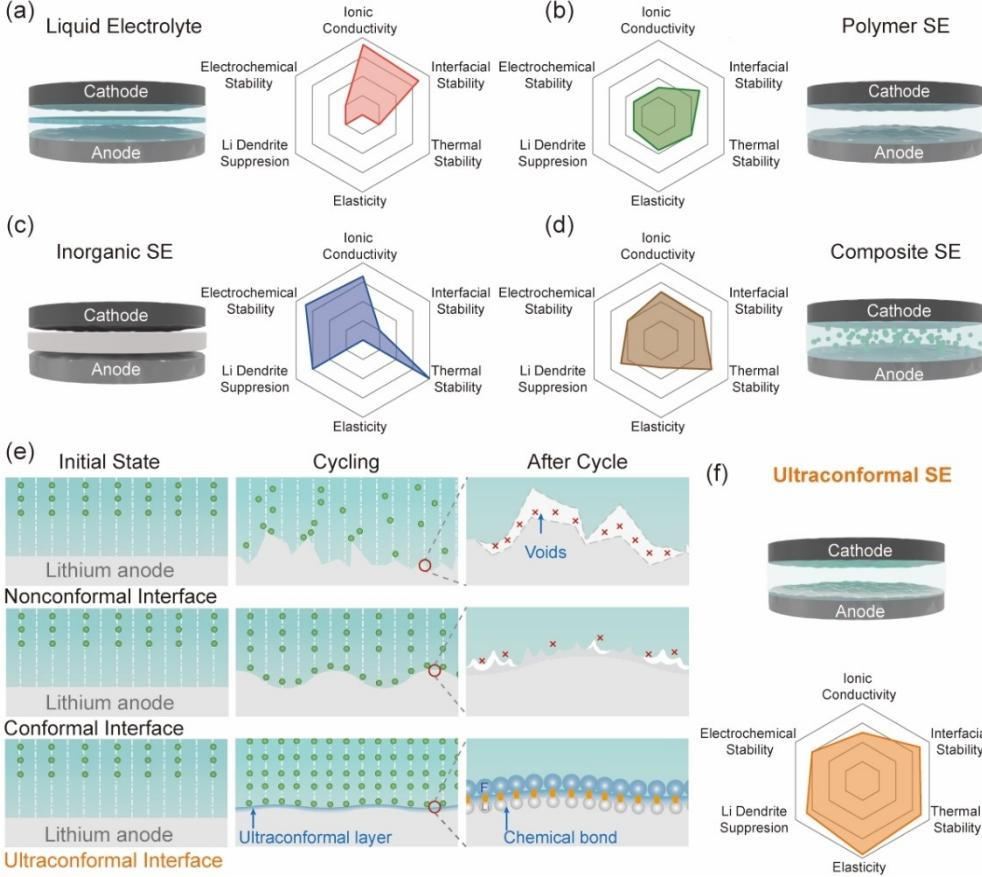
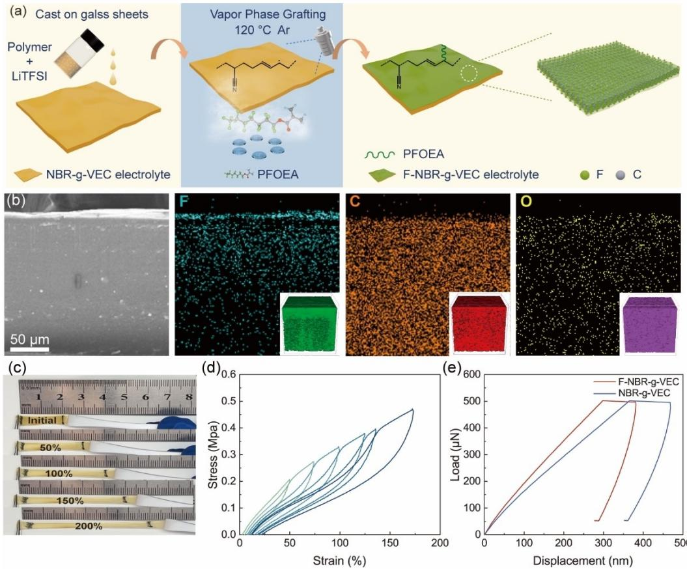
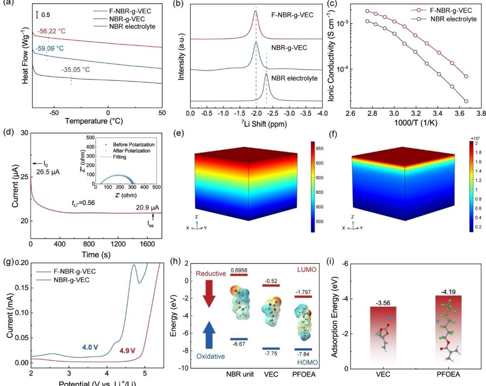
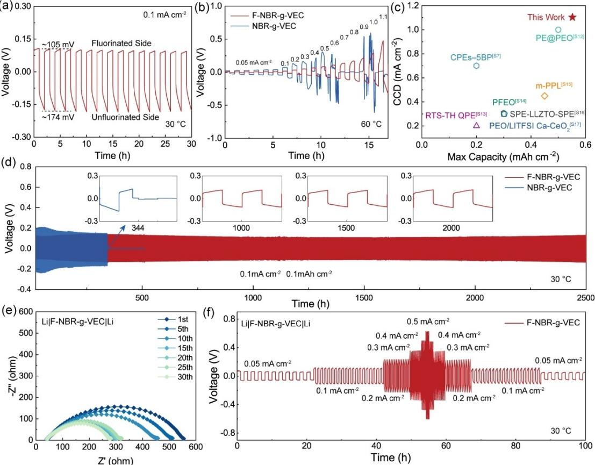
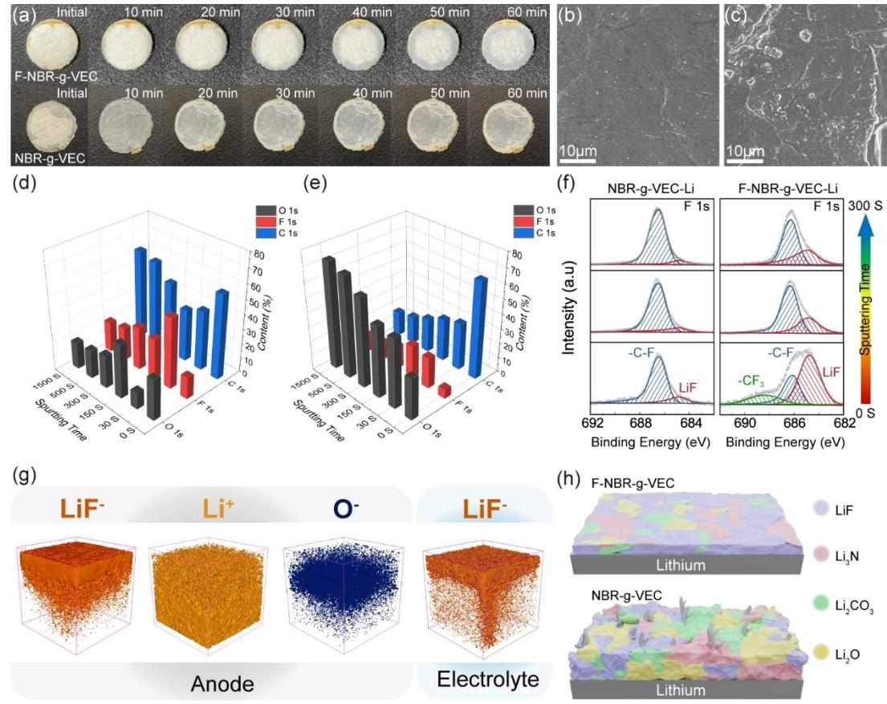
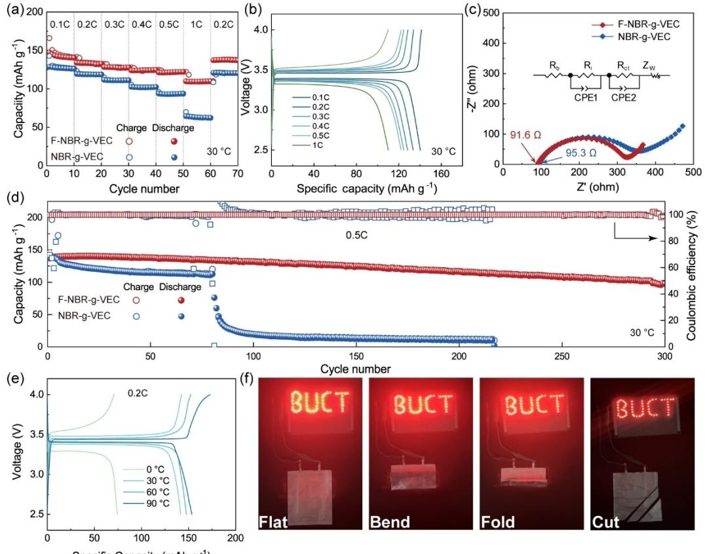

*Li Metal Batteries*

Zitierweise: *Angew. Chem. Int. Ed.* **2023**, *62*, e202304339 [doi.org/10.1002/anie.202304339](https://doi.org/10.1002/anie.202304339)

safety hazards due to the disadvantages of conventional liquid electrolytes, including their inherent volatility, flammability, thermal instability, and unfavorable chemical/ electrochemical reactions with metallic lithium (Scheme 1a).[2] Moreover, lithium anodes often form lithium dendrites because of non-uniform stripping/deposition in conventional liquid electrolytes, and the large volume changes in the lithium anode would cause localized pressure accumulation. These safety issues have severely restricted

practical applications of high-energy-density LMBs.

Compared with their liquid counterparts, solid electrolytes (SEs) possess higher thermal stability, improved electrochemical stability, and better mechanical properties, which should lead to higher safety when used in high-energy

# **A Chemically Bonded Ultraconformal Layer between the Elastic Solid Electrolyte and Lithium Anode for High-performance Lithium Metal Batteries**

*Na Yang, Yujie Cui, Hang Su, Jiaying Peng, Yongzheng Shi,\* Jin Niu,\* and Feng [Wang](http://orcid.org/0000-0002-7901-3693)\**

**Abstract:** Although high ionic conductivities have been achieved in most solid-state electrolytes used in lithium metal batteries (LMBs), rapid and stable lithium-ion transport between solid-state electrolytes and lithium anodes remains a great challenge due to the high interfacial impedances and infinite volume changes of metallic lithium. In this work, a chemical vapor-phase fluorination approach is developed to establish a lithiophilic surface on rubber-derived electrolytes, which results in the formation of a resilient, ultrathin, and mechanically integral LiF-rich layer after electrochemical cycling. The resulting ultraconformal layer chemically connects the electrolyte and lithium anode and maintains dynamic contact during operation, thus facilitating rapid and stable lithium-ion transport across interfaces, as well as promoting uniform lithium deposition and inhibiting side reactions between electrolyte components and metallic lithium. LMBs containing the novel electrolyte have an ultralong cycling life of 2500 h and deliver a high critical current density of 1.1 mAcm <sup>2</sup> in lithium symmetric cells as well as showing good stability over 300 cycles in a full cell.

#### *Introduction*

Lithium metal batteries (LMBs) are recognized as the most promising type of energy storage system to meet the highenergy-density needs of electric vehicles, ships, and even aircraft because of the high theoretical specific capacity (3860 mAhg <sup>1</sup> ) and low negative potential ( 3.04 V vs. the standard hydrogen electrode) of metallic lithium.[1] Unfortunately, liquid electrolyte-based LMBs suffer from severe

```
[*] N. Yang, Y. Cui, H. Su, J. Peng, Y. Shi, J. Niu, F. Wang
State Key Laboratory of Chemical Resource Engineering, Beijing Key
Laboratory of Electrochemical Process and Technology for Materi-
als, Beijing University of Chemical Technology
Beijing 100029 (P. R. China)
and
Beijing Advanced Innovation Center for Soft Matter Science and
Engineering, Beijing University of Chemical Technology
Beijing 100029 (P. R. China)
E-mail: shiyongzheng@mail.buct.edu.cn
        niujin@mail.buct.edu.cn
        wangf@mail.buct.edu.cn
```
LMBs (Scheme 1b–d).[3–7] Inorganic SEs and polymer SEs, as well as their composites (composite SEs), have all been employed in LMBs. Inorganic SEs (e.g., oxides,[8] sulfides,[9] nitrides,[10] etc.) can afford high ionic conductivities (up to 10 <sup>2</sup> Scm <sup>1</sup> ) by facilitating rapid transport of lithium ions in

the bulks. They also offer high mechanical strength, which suppresses lithium dendrite formation, and good thermal stability. However, lithium-ion migration at the interface between the rigid inorganic SEs and electrodes is almost blocked because of the poor interfacial contact.[11] Although intermediate inorganic layers (e.g., Na,[12] Ga,[13] Ge,[14] Zn,[15] Li-Mg alloys,[16] MXenes,[17] etc.) or polymer layers (e.g., polyacrylonitrile,[18] polyethylene oxide (PEO),[19] etc.) have been incorporated between inorganic SEs and lithium anodes in an attempt to overcome the interface issues, the resulting non-conformal intermediate layers are unable to accommodate localized mechanical stresses accumulated on electrolyte/lithium anode interfaces during operation and pose an additional barrier to lithium-ion transport (Scheme 1e, top).[20] Similar issues arise with the non-conformal interfaces present in conventional polymer SEs[21] and composite SEs.[22] Although polymer matrices can provide more intimate contact with the electrodes than inorganic SEs, polymer SEs and composite SEs still suffer from irreversible plastic deformation since their mechanical resilience is insufficient to accommodate the repeated volume fluctuations of lithium anodes during long-term charge–discharge processes. Such deformation inevitably results in unstable interfacial contact.

Very recently, elastic electrolytes such as poly-butyl acrylate/succinonitrile,[23] SiO2/poly(propylene oxide),[24] and rubber-derived electrolytes[25–27] have been synthesized via polymerization-induced phase separation, covalent-dynamic


## *Forschungsartikel*




*Scheme 1.* Schematic illustration and performance comparison of the a) liquid electrolyte, b) polymer SE, c) inorganic SE, and d) composite SE. e) Schematic illustration of different interfaces between lithium anode and different electrolytes. f) Schematic illustration and performance of the ultraconformal SE (our work).

hydrogen bonding dual-crosslinking, and vulcanization methods, respectively. Owing to their good resilience and high durability, these elastic electrolytes can form a conformal interface with electrodes resulting in improved cycling performance in solid-state LMBs. However, most previously reported elastic electrolytes are physically connected to the lithium anode without strong chemical binding or have insufficient lithiophilicity to ensure rapid and stable interface transport of lithium ions (Scheme 1e, middle). In these cases, additional liquid electrolytes are commonly used to promote lithium-ion transport across the interface, which inevitably sacrifices battery safety. Therefore, establishing an intimate and dynamic interface between a lithium anode and the electrolyte remains a key challenge.

In this work, we report a vapor-phase fluorination approach to build a lithiophilic surface on elastic rubberderived electrolytes, which results in a resilient, ultrathin, mechanically integral LiF-rich layer after electrochemical operation. This novel ultraconformal layer chemically binds the electrolyte to the lithium anode and enables their intimate and dynamic contact, thus providing a rapid lithium-ion transport path and guiding uniform lithium deposition (Scheme 1e, bottom). Moreover, the LiF-rich layer can effectively inhibit the side reactions of electrolyte

*Angew. Chem.* **2023**, *135*, e202304339 (2 of 10) © 2023 Wiley-VCH GmbH

components with metallic lithium, thus avoiding the continuous consumption of metallic lithium and subsequent failure commonly observed in solid-state LMBs.[28–32] These features make the performance of our ultraconformal SE superior to other reported SEs (Scheme 1f), enabling the fabrication of solid-state LMBs which can deliver ultralong cycling lifetimes and high critical current densities.

#### *Results and Discussion*

As shown in Figure 1a and Figure S1, an elastic rubberderived electrolyte was synthesized by electrophilic addition of nitrile butadiene rubber (NBR) and vinyl ethylene carbonate (VEC) monomer with lithium bis (trifluoromethane) sulfonimide (LiTFSI) (denoted NBR-g-VEC electrolyte). A fluorine-rich monomer (perfluorooctylethyl acrylate, PFOEA) was then grafted on the surface of the NBR-g-VEC electrolyte by a vapor-phase fluorination process, affording an elastic lithiophilic electrolyte (denoted F-NBR-g-VEC electrolyte).

The F-NBR-g-VEC matrix (pure polymer without LiTFSI) was also prepared and characterized to indicate the fluorination effect. Compared with the uniform distributions


## *Forschungsartikel*




*Figure 1.* a) Schematic illustration of the vapor-phase fluorinated approach. b) The cross-section scanning electron microscope (SEM) image of the F-NBR-g-VEC matrix and corresponding elemental mapping images of C, F, and O (inset: 3D rendering of C , F , and O secondary ion distributions of the F-NBR-g-VEC electrolyte). c) Digital photographs of the F-NBR-g-VEC electrolyte under different strains. d) Stress-strain cycling curves of the F-NBR-g-VEC electrolyte. e) Nanoindentation test on the F-NBR-g-VEC and NBR-g-VEC electrolyte membranes.

of carbon and oxygen elements, fluorine displays a high concentration on the surface of the F-NBR-g-VEC matrix and shows a clear concentration gradient in cross-section view (Figure 1b). In addition, the F-NBR-g-VEC matrix shows overlapping distributions of carbon, oxygen and fluorine elements, suggesting that vapor-phase fluorination barely increased the membrane thickness. Time-of-flight secondary ion mass spectrometry (ToF-SIMS) profiles further reveal that, within a depth range of �100 nm, the upper surface of the F-NBR-g-VEC electrolyte exhibits a gradient distribution of fluorine, whereas carbon and oxygen elements are uniformly distributed (Figure 1b inset and Figure S2). Furthermore, the F-NBR-g-VEC electrolyte membrane can recover its initial state after being subjected to different strains (Figure 1c, d) and displays a high elongation at break of nearly 250% (Figure S3), showing that it retains the elasticity of the NBR precursor. The mechanical properties of the F-NBR-g-VEC electrolyte in the normal direction were evaluated by nanoindentation tests. The F-NBR-g-VEC electrolyte membrane exhibits a modulus of 390 MPa, which is higher than that of NBR-g-VEC (344 MPa) and nearly 15 times that of a typical PEO electrolyte (23.5 MPa) (Figure 1e).[33] By virtue of its good resilience and fluorinated surface layer, the F-NBR-g-VEC

*Angew. Chem.* **2023**, *135*, e202304339 (3 of 10) © 2023 Wiley-VCH GmbH

electrolyte has the potential to generate an intimate and chemically bonded ultraconformal layer with metallic lithium upon electrochemical cycling.

The structural properties of the F-NBR-g-VEC electrolyte were investigated in more detail and compared with other electrolytes. As shown in Figure S4, only one broad peak can be detected in the X-ray diffraction (XRD) pattern of the electrolyte membrane, indicating a uniform distribution of crystalline LiTFSI in the amorphous matrix. A Fourier transform infrared spectrum (FTIR)[34] of the NBRg-VEC matrix (Figure S5) showed both C�N (1668 cm <sup>1</sup> ) and C=O (1793 cm <sup>1</sup> ) bands, confirming the successful grafting of VEC onto the NBR backbone. After treatment with PFOEA, FTIR peaks characteristic of C F bonds can be clearly seen in the FTIR spectrum of the exposed side of the F-NBR-g-VEC matrix, indicating the successful grafting of PFOEA onto the surface of the NBR-g-VEC membrane. The fluorination result is further confirmed by X-ray photoelectron spectroscopy (XPS) tests (Figure S6), in which the intensity of CF3 signal in the F-NBR-g-VEC electrolyte is higher than that of the NBR-g-VEC electrolyte. Owing to the chemical vapor-phase fluorination, the resulting F-NBRg-VEC electrolyte shows high thermal stability with only 1.65 wt% weight loss at 150 °C (Figure S7), which suggests the electrolyte has the potential to be employed at high temperatures.

Differential scanning calorimetry (DSC) showed that the NBR-g-VEC electrolyte has a much lower glass transition temperature (*T*g, 59 °C) than the pure NBR electrolyte (50% acrylonitrile content) (Figure 2a), which can be attributed to plasticization by the VEC oligomers. After vapor-phase fluorination, the F-NBR-g-VEC electrolyte has a very similar *T*<sup>g</sup> ( 56°C) to that of the NBR-g-VEC electrolyte, suggesting that the surface fluorination process does not affect the molecular structure within the polymer matrix. The low *T*<sup>g</sup> values of the NBR-g-VEC and F-NBR-g-VEC electrolytes are indicative of a high proportion of amorphous material, which should allow local segmental motion. The local environments around the lithium atoms in NBR-derived electrolytes were examined by solid-state <sup>7</sup> Li NMR spectroscopy (Figure 2b). The F-NBR-g-VEC and NBR-g-VEC electrolytes have similar <sup>7</sup> Li chemical shifts, consistent with their nearly identical internal backbones. The peaks are shifted downfield (by ca. 0.34 ppm) from the pure NBR electrolyte, indicating a more labile coordination environment between lithium ions and VEC oligomers.[35, 36] The improved local segmental motion and more labile coordination environment in the F-NBR-g-VEC electrolyte can be expected to facilitate the rapid transport of lithium ions in its bulk.

The intrinsic lithium-ion transport kinetics of all the electrolytes were first investigated by measuring the temperature-dependent ionic conductivities. The corresponding Arrhenius plots over the temperature range from 0 to 90 °C are non-linear, typical of classical polymers, and can be wellfitted to the Vogel-Tammann-Fulcher equation (Figure 2c and Figure S8). This demonstrates that the lithium-ion transport behavior of all the electrolytes involves a solidstate lithium conduction mechanism. The room temperature ionic conductivity of the F-NBR-g-VEC electrolyte can be optimized by adjusting the amounts of LiTFSI and VEC (Figure S9). The maximized value of 4.0×10 <sup>4</sup> Scm <sup>1</sup> at 25 °C is nearly seven times that of the NBR electrolyte, and much higher than the values for other reported electrolytes (Table S1). The F-NBR-g-VEC electrolyte also possesses a low activation energy of 35 kJmol <sup>1</sup> (Figure S10). The



*Figure 2.* Electrochemical characterization of the F-NBR-g-VEC electrolyte. a) DSC curves and b) <sup>7</sup> Li NMR spectra of the F-NBR-g-VEC, NBR-g-VEC, and NBR electrolytes. c) Ionic conductivity-temperature functions of the F-NBR-g-VEC and NBR electrolytes. d) The *t*Li<sup>þ</sup> test of the F-NBR-g-VEC electrolyte. COMSOL simulations of lithium-ion gradients in the e) F-NBR-g-VEC electrolyte and f) PEO electrolyte. g) Electrochemical window of the F-NBR-g-VEC and NBR-g-VEC electrolytes. h) Density functional theory (DFT) analysis of the HOMO/LUMO energy levels and electron cloud density distributions of different polymer units. i) DFT analysis of the adsorption energy between the polymer units and lithium ions.

*Angew. Chem.* **2023**, *135*, e202304339 (4 of 10) © 2023 Wiley-VCH GmbH

dramatically enhanced ionic conductivity of the F-NBR-g-VEC electrolyte can be attributed to the plasticization introduced by the VEC oligomers. This results from their abundant polar functional groups (C=O and C O C), which promote the local segmental motion and provide a labile coordination environment for lithium ions in the electrolyte. As shown in Figure 2d, the F-NBR-g-VEC electrolyte also exhibits a high transference number (*t*Li<sup>þ</sup> ) of 0.56 (The impedance spectrum fitting details are summarized in Table S2 and S3), which exceeds the values for typical PEObased electrolytes (*<*0.2),[37, 38] most reported polymer SEs (*<*0.5),[39,40] and commercial liquid electrolytes (0.2–0.4).[2] The high *t*Li<sup>þ</sup> of the F-NBR-g-VEC electrolyte can be attributed to the Lewis acid-base interactions between lithium ions and the abundant polar functional groups in the electrolyte, which improves the dissociation of lithium salts and supplies a fast transport path for lithium ions. To visually predict the lithium-ion transport behavior of the F-NBR-g-VEC electrolyte and a typical polymer SE (a PEObased electrolyte) during cycling in LMBs, finite element simulations were carried out using the "two-dimensional transient" model in COMSOL Multiphysics (Figure 2e, f). The simulations showed that the F-NBR-g-VEC electrolyte, with its high ionic conductivity and high *t*Li<sup>þ</sup> , exhibits smaller concentration gradients of lithium ions and more homogeneous current distributions from the initial to the steady state (Supporting Information Video 1), leading to uniform lithium deposition and stripping. In contrast, the PEO electrolyte, with its poor ionic conductivity of 6.0× 10 <sup>5</sup> Scm <sup>1</sup> and a low *t*Li<sup>þ</sup> of 0.12, suffers from localized concentration of lithium ions on the surface, which causes non-uniform current distributions in its steady state, potentially triggering the generation and growth of lithium dendrites.

The introduction of a fluorinated layer not only facilitates intrinsic fast lithium-ion transport but also forms an intimate and stable interface between the electrolyte and electrode. As shown in Figure 2g, the linear sweep voltammetry (LSV) curve of the F-NBR-g-VEC electrolyte shows no visible oxidation before 4.9 V (vs. Li<sup>+</sup>/Li), which is much higher than the corresponding values for NBR-g-VEC (4.0 V vs. Li<sup>+</sup>/Li) and pure NBR electrolytes (3.4 V vs. Li<sup>+</sup>/ Li, Figure S11). Since the F-NBR-g-VEC and NBR-g-VEC electrolytes have the same polymer structure comprising an NBR main chain and VEC branches, its wider electrochemical window can be ascribed to the stable fluorinated layer on its surface. Density functional theory calculations were performed to determine the lowest unoccupied molecular orbital (LUMO) energy level, highest occupied molecular orbital (HOMO) energy level, and lithium-ion adsorption energy for different polymer structural units. As shown in Figure 2h, PFOEA has the lowest HOMO energy level among the polymer structural units, which indicates it has the best antioxidation ability and that the stable fluorinated layer endows the F-NBR-g-VEC electrolyte with superior oxidation resistance. PFOEA also shows the lowest LUMO energy level among the polymer structural units, indicating that PFOEA will be preferentially reduced to form an interlayer between the lithium anode and electrolyte during operation. The calculated lithium-ion adsorption energies are displayed in Figure 2i. PFOEA has a higher adsorption energy ( 4.19 eV) than VEC ( 3.56 eV), which endows the F-NBR-g-VEC electrolyte with a better lithiophilicity than NBR-g-VEC. As a result, the elastic fluorinated layer of the F-NBR-g-VEC electrolyte can react in situ with metallic lithium at the electrolyte/anode interface to produce an integral LiF-rich layer. This replaces the original electrolyte/ anode interface, resulting in a more intimate and chemically bonded interfacial contact. However, in the absence of a fluorinated layer, the NBR-g-VEC electrolyte will tend to form a relatively unstable Li2O/Li2CO3-rich layer.[31, 34]

The high elasticity and excellent lithiophilicity of the F-NBR-g-VEC electrolyte ensure its ultraconformal contact with the lithium anode, which should lead to higher critical current densities and longer lifetimes of solid-state lithium metal batteries. The electrochemical performance of the F-NBR-g-VEC electrolyte was evaluated by assembling solidstate LijLi symmetric cells and testing them at 30 °C. F-NBR-g-VEC fluorinated on just one side was first employed as the electrolyte to compare the effects of conformal and ultraconformal layers on lithium-ion transport between the electrolyte and lithium anode. As shown in Figure 3a and Figure S12, the fluorinated side shows ca. 60% of the overpotential of the unfluorinated side. The gradient fluorinated layer significantly decreases the lithium-ion diffusion barrier and facilitates lithium-ion transport across the interface, confirming the successful formation of an ultraconformal interface during cycling. When comparing the F-NBR-g-VEC electrolyte fluorinated on both sides with the NBR-g-VEC electrolyte (Figure 3b) in LijLi symmetric cells, the contrast in overpotential is even more significant at high current densities. Notably, the LijLi symmetric cell using the F-NBR-g-VEC electrolyte exhibits a high critical current density of 1.1 mAcm <sup>2</sup> at a capacity of 0.55 mAhcm <sup>2</sup> , which is five times that of the LijLi symmetric cell using the NBR-g-VEC electrolyte (0.2 mAcm <sup>2</sup> , 0.1 mAhcm <sup>2</sup> ), and much higher than the values for other reported electrolytes (Figure 3c and Table S4). Although both electrolytes have similar intrinsic lithium-ion transport kinetics, the LijLi symmetric cell using the F-NBR-g-VEC electrolyte delivers dramatically improved critical current densities by virtue of the chemically bonded ultraconformal layer between the lithium anode and electrolyte.

The electrochemical durability of the F-NBR-g-VEC electrolyte was further assessed by galvanostatic charging/ discharging at various current densities in LijLi symmetric cells. As shown in Figure 3d, the LijLi symmetric cell using the F-NBR-g-VEC electrolyte delivers a much lower overpotential (110 mV) than the LijLi symmetric cell using the NBR-g-VEC electrolyte (210 mV) and exhibits an ultralong cycling life of 2500 h at a low current density of 0.1 mAcm <sup>2</sup> , which is eight times that of the LijLi symmetric cell using the NBR-g-VEC electrolyte, and much higher than the values for other reported electrolytes (Table S5). The time evolution of the interfacial resistance between the electrolyte and lithium anode reveals that the F-NBR-g-VEC and NBR-g-VEC electrolytes have a similar bulk resistance of


*Forschungsartikel*



*Figure 3.* Electrochemical performance of F-NBR-g-VEC and NBR-g-VEC electrolytes. a) Cycling performance of the Lij Li symmetric cell using the single-side fluorinated NBR-g-VEC electrolyte. b) Critical current density test of the F-NBR-g-VEC and NBR-g-VEC electrolytes. c) Critical current density comparison with other polymer SEs and composite SEs. d) Cycling performance for the Lij Li symmetric cells using the F-NBR-g-VEC and NBR-g-VEC electrolytes at current density of 0.1 mAcm <sup>2</sup> with a capacity of 0.1 mAh cm <sup>2</sup> , insets: the voltage profiles of the NBR-g-VEC electrolyte at the 344th hour and the F-NBR-g-VEC electrolyte at the 1000th,1500th, and 2000th hours. e) Typical Nyquist plots of the LijF-NBR-g-VECj Li cells during 30 cycles in the frequency range from 1 MHz to 0.1 Hz. f) Rate performance of the LijF-NBR-g-VECjLi cell at the current density range from 0.05 to 0.5 mAcm <sup>2</sup> .

�41 Ω (Figure 3e), which shows no visible difference after 30 cycles. However, the interfacial resistances and charge transfer resistances of the F-NBR-g-VEC electrolyte decrease monotonically during cycling and stabilize after 15 cycles, whereas these resistances show a continuous increase for the NBR-g-VEC electrolyte (Figure S13). This confirms that the fluorinated layer of the F-NBR-g-VEC electrolyte can generate a stable LiF-rich layer in situ in a short time, while the absence of a fluorinated layer in the NBR-g-VEC electrolyte leads to the formation of an unstable layer during cycling. The contrast in durability between the F-NBR-g-VEC and NBR-g-VEC electrolyte is further apparent at a high current density of 0.25 mAcm <sup>2</sup> , where the former is much more stable than the latter (Figure S14). Furthermore, a symmetric cell with the F-NBR-g-VEC electrolyte performs well even when the current density was increased from 0.05 to 0.5 mAcm <sup>2</sup> (Figure 3f). The superior electrochemical performance of the F-NBR-g-VEC electrolyte demonstrates that, compared with an elastic conformal layer, the ultraconformal layer significantly facilitates lithium-ion transport across the electrolyte/lithium anode interface and helps the electrolyte to prevent the penetration of lithium dendrites.

Given the remarkable influence of the ultraconformal layer on the durability and stability of the solid-state lithium metal symmetric batteries, the microstructure and chemical composition at the metallic lithium surface were analyzed. After cycling LijLi symmetric cells with the F-NBR-g-VEC and NBR-g-VEC electrolytes, the cells were disassembled. The interfaces between the NBR-derived electrolytes and metallic lithium anodes were first examined by cross-section SEM (Figure S15). The results revealed that the F-NBR-g-VEC electrolyte exhibited a tight connection with the lithium anode, whereas there existed voids and gaps on the interface between the non-fluorinated NBR-g-VEC electrolyte and metallic lithium anode. The used lithium anodes were then subjected to air exposure experiments. The metallic lithium cycled with the F-NBR-g-VEC electrolyte showed only a slight change in color at its edge after 1 h (Figure 4a, top), whereas metallic lithium cycled with the NBR-g-VEC electrolyte suffered from severe oxidation after just 10 min (Figure 4a, bottom). The apparent differences in

*Angewandte*

*Chemie*



*Figure 4.* a) Digital photographs of the cycled lithium anode with the F-NBR-g-VEC electrolyte and bare lithium after being exposed in ambient air for different time. SEM images of the cycled lithium anodes with the b) F-NBR-g-VEC and c) NBR-g-VEC electrolytes. XPS elemental concentration on the cycled lithium anode with the d) F-NBR-g-VEC and e) NBR-g-VEC electrolytes by Ar sputtering for different time. f) XPS spectra of F 1s for the cycled lithium anode with the F-NBR-g-VEC and NBR-g-VEC electrolytes by Ar sputtering for different time. g) The 3D rendering of LiF , Li<sup>+</sup>, and O secondary ion distributions on the cycled lithium anode with the F-NBR-g-VEC electrolyte. h) Schematic illustration of the structural compositions of the cycled lithium anode with the F-NBR-g-VEC electrolyte (top) and the NBR-g-VEC electrolyte (bottom).

chemical stability of the metallic lithium in air can probably be attributed to the formation of an integral LiF-rich layer on the surface of the anode in the cell with the F-NBR-g-VEC electrolyte, while the anode in the cell with the NBRg-VEC electrolyte has a loose and rough surface or even new exposure of metallic lithium. SEM images of the lithium anodes after cycling confirm this deduction. The lithium anode in contact with the ultraconformal layer of the F-NBR-g-VEC electrolyte presents a smooth and flat surface (Figure 4b), but the lithium anode in contact with the conformal layer of the NBR-g-VEC electrolyte shows a rough and cracked surface with uneven protrusions (Figure 4c). This shows that the ultraconformal layer endows the F-NBR-g-VEC electrolyte with a better ability to guide the uniform deposition of lithium ions than NBR-g-VEC.

The chemical composition of the ultraconformal layer on the lithium anode was also analyzed by XPS and elemental concentration analysis via sputtering with Ar<sup>+</sup> ions.[31, 41] Before sputtering, the surface of the ultraconformal layer displays a much higher content of fluorine (ca. 14.8%) than the surface of the conformal layer (ca. 6.2%), demonstrating that the addition of fluorine-rich PFOEA results in the formation of much more LiF in the ultraconformal layer.[42] After sputtering from 30 to 300 seconds, the elemental fluorine content in the ultraconformal layer undergoes a rapid increase and then decreases to a moderate concentration (Figure 4d), accompanied by small fluctuations in carbon and oxygen content. In contrast, the elemental fluorine content maintains a low concentration in the conformal layer (Figure 4e), with steady increase in oxygen content and a steady decrease in carbon content. These sharply contrasting results confirm that continuous reactions occur between the VEC oligomers/LiTFSI and fresh lithium at the conformal interface during cycling, generating an unstable Li2O/Li2CO3-rich layer,[43–45] whereas these side reactions are efficiently suppressed by the LiF-rich ultraconformal layer. Further confirmation is provided by highresolution F 1s XPS spectra (Figure 4f). These show that LiF remains at a relatively high concentration in the ultraconformal layer but stays at a very low concentration in the conformal layer after sputtering for 300 seconds. ToF-SIMS provides a more visual description of the distribution of the components in the ultraconformal layer. As shown in Figure 4g, LiF and metallic lithium show an inverse gradient distribution in the lithium anode with an ultraconformal layer, together with a relatively uniform distribution of oxygen element, consistent with the XPS results. The thickness of the gradient-distributed LiF on the ultraconformal layer is estimated to be �159 nm (�93 nm on the lithium anode side and �66 nm on the fluorinated electrolyte side, Figure S16), which is significantly thinner than most previously reported artificial or in situ-generated intermediate layers on lithium anodes.[16,18, 21] The ultrathin ultraconformal layer on the interface between the F-NBR-g-VEC electrolyte and the lithium anode extends from the polymer phase of the elastic electrolyte to the LiF-rich phase of the lithium anode, which facilitates rapid and stable transport of lithium ions at the interface and effectively guides the uniform deposition of lithium, making it superior to the NBR-g-VEC electrolyte which only has a conformal layer (Figure 4h).

To further validate the electrochemical performance of the F-NBR-g-VEC electrolyte, full cells with a lithium anode and a LiFePO4 cathode were assembled and tested at 30°C. A solid-state full cell with the F-NBR-g-VEC electrolyte exhibited superior rate capability from 0.1 to 1 C and welldefined charge–discharge curves of the LiFePO4 cathode compared with a cell using the NBR-g-VEC electrolyte (Figure 5a, b). This can be attributed to the ultraconformal layer in the F-NBR-g-VEC electrolyte. The results obtained from electrochemical impedance spectroscopy measurements indicate that both full cells possessed comparable bulk resistances, but the LijF-NBR-g-VECjLFP cell exhibited a lower charge transfer resistance (207.2 Ω, simulated by the inset equivalent circuit) than the LijNBR-g-VECj LFP cell (247.5 Ω, simulated by the inset equivalent circuit), which can be attributed to the presence of the chemically bonded ultraconformal layer (Figure 5c). Furthermore, the F-NBR-g-VEC-based full cell delivers excellent long-term cycling stability at 0.5 C at 30 °C. (Figure 5d). The capacity of the NBR-g-VEC-based full cell, by contrast, rapidly decreases to 25 mAhg <sup>1</sup> within 100 cycles. Moreover, the F-NBR-g-VEC-based full cell operates well over a wide temperature ranging from 0 to 90°C (Figure 5e). And full cells utilizing the F-NBR-g-VEC electrolyte exhibited high discharge capacities at both 90 and 0°C, which were more than two times those of full cells with the NBR-g-VEC electrolyte (Figure S17). This can be attributed to the superior thermal and electrochemical stability of the fluorinated electrolyte, as well as its efficient transport of lithium ions across the interfaces. Moreover, the full cells at 0°C



*Figure 5.* Full cell performance and pouch cell tests for the F-NBR-g-VEC electrolyte with LiFePO4 (LFP) cathodes. a) Rate performance of the LijF-NBR-g-VECjLFP and LijNBR-g-VECj LFP cells. b) Charge/discharge profiles of the LijF-NBR-g-VECj LFP cell at different C rate. c) Typical Nyquist plots of the LijF-NBR-g-VECj LFP and LijNBR-g-VECj LFP cells. d) Cycling performance and Coulombic efficiency of the LijF-NBR-g-VECj LFP and LijNBR-g-VECjLFP cells at 0.5 C. e) Charge/discharge profiles of the LijF-NBR-g-VECj LFP cell at 0.2 C under different temperature ranging from 0 to 90 °C. f) Pouch cell test under different bending states and cutting state.

*Angew. Chem.* **2023**, *135*, e202304339 (8 of 10) © 2023 Wiley-VCH GmbH

and 60 °C also showed good cycling performance (Figure S18 and S19). To confirm the wide electrochemical window of the F-NBR-g-VEC electrolyte, the NCM811 cathode was also utilized to assemble full cells which were tested using a high cutoff voltage (Figure S20 and S21). It is shown that the full cells using the F-NBR-g-VEC electrolyte showed markedly enhanced cycling stability in comparison to the full cells with the NBR-g-VEC electrolyte and PEO-based electrolytes.[46] Furthermore, the F-NBR-g-VEC electrolyte exhibits excellent safety and reliability in a solid-state pouch cell. As shown in Figure 5f, the pouch cell can still power an LED even after being folded several times or even cut twice.

#### *Conclusion*

An F-NBR-g-VEC electrolyte with high elasticity and good lithiophilicity has been fabricated by a vapor-phase fluorination approach. This electrolyte is able to generate in situ an ultraconformal layer with a lithium anode upon electrochemical cycling. The resulting ultraconformal layer features good resilience, an ultrathin thickness, and an integral LiFrich layer, which maintains a dynamic and intimate contact between the electrolyte and lithium anode, and facilitates the rapid transport of lithium ions across the interface. Furthermore, the presence of electrochemically inert LiF in the ultraconformal layer efficiently inhibits continuous side reactions of the electrolyte components with metallic lithium and guides the uniform deposition of lithium. These benefits of the elastic and lithiophilic electrolyte endow solid-state lithium symmetric cells with an ultralong cycling life of 2500 h, a high critical current density of 1.1 mAcm <sup>2</sup> , and good rate capability. In addition, solid-state full cells show good stability over 300 cycles at 0.5 C, suggesting that the F-NBR-g-VEC electrolyte has potential practical applications in the fabrication of dendrite-free and high-energy density LMBs.

#### *Acknowledgements*

This work was supported by National Natural Science Foundation of China (U20A20337, 52003025, 52130206, 22178016, 52002012, 52221006), the Fundamental Research Funds for the Central Universities (buctrc202024, JD2313), and the High performance computing platform of BUCT.

### *Conflict of Interest*

The authors declare no conflict of interest.

#### *Data Availability Statement*

The data that support the findings of this study are available from the corresponding author upon reasonable request.

**Keywords:** Chemically Bonded Ultraconformal Layer **·** Lithium Metal Battery **·** Resilient Interface **·** Solid-State Electrolyte **·** Vapor-Phase Fluorination

- [1] Y. Liu, X. Tao, Y. Wang, C. Jiang, C. Ma, O. Sheng, G. Lu, X. Lou, *[Science](https://doi.org/10.1126/science.abn1818)* **2022**, *375*, 739.
- [2] Y. Jie, X. Ren, R. Cao, W. Cai, S. Jiao, *Adv. Funct. [Mater.](https://doi.org/10.1002/adfm.201910777)* **2020**, *30*, [1910777](https://doi.org/10.1002/adfm.201910777).
- [3] S. Li, S.-Q. Zhang, L. Shen, Q. Liu, J.-B. Ma, W. Lv, Y.-B. He, Q.-H. Yang, *Adv. Sci.* **2020**, *7*, [1903088.](https://doi.org/10.1002/advs.201903088)
- [4] X. Fan, C. Zhong, J. Liu, J. Ding, Y. Deng, X. Han, L. Zhang, W. Hu, D. P. Wilkinson, J. Zhang, *[Chem.](https://doi.org/10.1021/acs.chemrev.2c00196) Rev.* **2022**, *122*, [17155](https://doi.org/10.1021/acs.chemrev.2c00196).
- [5] Y. Guo, S. Wu, Y.-B. He, F. Kang, L. Chen, H. Li, Q.-H. Yang, *[eScience](https://doi.org/10.1016/j.esci.2022.02.008)* **2022**, *2*, 138.
- [6] X.-L. Zhang, F.-Y. Shen, X. Long, S. Zheng, Z. Ruan, Y.-P. Cai, X.-J. Hong, Q. Zheng, *Energy [Storage](https://doi.org/10.1016/j.ensm.2022.07.045) Mater.* **2022**, *52*, [201](https://doi.org/10.1016/j.ensm.2022.07.045).
- [7] H. Zhang, L. Huang, H. Xu, X. Zhang, Z. Chen, C. Gao, C. Lu, Z. Liu, M. Jiang, G. Cui, *[eScience](https://doi.org/10.1016/j.esci.2022.03.001)* **2022**, *2*, 201.
- [8] C. Wang, K. Fu, S. P. Kammampata, D. W. McOwen, A. J. Samson, L. Zhang, G. T. Hitz, A. M. Nolan, E. D. Wachsman, Y. Mo, V. Thangadurai, L. Hu, *[Chem.](https://doi.org/10.1021/acs.chemrev.9b00427) Rev.* **2020**, *120*, 4257.
- [9] N. Kamaya, K. Homma, Y. Yamakawa, M. Hirayama, R. Kanno, M. Yonemura, T. Kamiyama, Y. Kato, S. Hama, K. Kawamoto, A. Mitsui, *Nat. [Mater.](https://doi.org/10.1038/nmat3066)* **2011**, *10*, 682.
- [10] J. Li, C. Ma, M. Chi, C. Liang, N. J. Dudney, *Adv. [Energy](https://doi.org/10.1002/aenm.201401408) Mater.* **2015**, *5*, [1401408.](https://doi.org/10.1002/aenm.201401408)
- [11] S. Lou, F. Zhang, C. Fu, M. Chen, Y. Ma, G. Yin, J. Wang, *Adv. Mater.* **2021**, *33*, [2000721.](https://doi.org/10.1002/adma.202000721)
- [12] X. Fu, T. Wang, W. Shen, M. Jiang, Y. Wang, Q. Dai, D. Wang, Z. Qiu, Y. Zhang, K. Deng, Q. Zeng, N. Zhao, X. Guo, Z. Liu, J. Liu, Z. Peng, *Adv. Mater.* **2020**, *32*, [2000575](https://doi.org/10.1002/adma.202000575).
- [13] J. Meng, Y. Zhang, X. Zhou, M. Lei, C. Li, *Nat. Commun.* **2020**, *11*, 3716.
- [14] Y. Liu, C. Li, B. Li, H. Song, Z. Cheng, M. Chen, P. He, H. Zhou, *Adv. Energy Mater.* **2018**, *8*, [1702374](https://doi.org/10.1002/aenm.201702374).
- [15] Y. Zhong, Y. Xie, S. Hwang, Q. Wang, J. J. Cha, D. Su, H. Wang, *[Angew.](https://doi.org/10.1002/anie.202004477) Chem. Int. Ed.* **2020**, *59*, 14003.
- [16] P. Gao, H. Wu, X. Zhang, H. Jia, J.-M. Kim, M. H. Engelhard, C. Niu, Z. Xu, J.-G. Zhang, W. Xu, *[Angew.](https://doi.org/10.1002/anie.202103344) Chem. Int. Ed.* **2021**, *60*, [16506](https://doi.org/10.1002/anie.202103344).
- [17] X. Han, J. Chen, M. Chen, W. Zhou, X. Zhou, G. Wang, C.-P. Wong, B. Liu, L. Luo, S. Chen, S. Shi, *Energy [Storage](https://doi.org/10.1016/j.ensm.2021.04.029) Mater.* **[2021](https://doi.org/10.1016/j.ensm.2021.04.029)**, *39*, 250.
- [18] J.-Y. Liang, X.-X. Zeng, X.-D. Zhang, T.-T. Zuo, M. Yan, Y.- X. Yin, J.-L. Shi, X.-W. Wu, Y.-G. Guo, L.-J. Wan, *J. [Am.](https://doi.org/10.1021/jacs.9b03517) [Chem.](https://doi.org/10.1021/jacs.9b03517) Soc.* **2019**, *141*, 9165.
- [19] S.-S. Chi, Y. Liu, N. Zhao, X. Guo, C.-W. Nan, L.-Z. Fan, *Energy [Storage](https://doi.org/10.1016/j.ensm.2018.07.004) Mater.* **2019**, *17*, 309.
- [20] K. Fu, Y. Gong, B. Liu, Y. Zhu, S. Xu, Y. Yao, W. Luo, C. Wang, S. D. Lacey, J. Dai, Y. Chen, Y. Mo, E. Wachsman, L. Hu, *Sci. Adv.* **2017**, *3*, e1601659.
- [21] T. Deng, L. Cao, X. He, A.-M. Li, D. Li, J. Xu, S. Liu, P. Bai, T. Jin, L. Ma, M. A. Schroeder, X. Fan, C. Wang, *[Chem](https://doi.org/10.1016/j.chempr.2021.06.019)* **2021**, *7*, [3052](https://doi.org/10.1016/j.chempr.2021.06.019).
- [22] Y. Su, X. Zhang, C. Du, Y. Luo, J. Chen, J. Yan, D. Zhu, L. Geng, S. Liu, J. Zhao, Y. Li, Z. Rong, Q. Huang, L. Zhang, Y. Tang, J. Huang, *Small* **2022**, *18*, [2202069](https://doi.org/10.1002/smll.202202069).
- [23] M. J. Lee, J. Han, K. Lee, Y. J. Lee, B. G. Kim, K.-N. Jung, B. J. Kim, S. W. Lee, *[Nature](https://doi.org/10.1038/s41586-021-04209-4)* **2022**, *601*, 217.
- [24] S. Tang, Q. Lan, L. Xu, J. Liang, P. Lou, C. Liu, L. Mai, Y.-C. Cao, S. Cheng, *Nano [Energy](https://doi.org/10.1016/j.nanoen.2020.104600)* **2020**, *71*, 104600.
- [25] Y. Shi, N. Yang, J. Niu, S. Yang, F. Wang, *[Adv.](https://doi.org/10.1002/advs.202200553) Sci.* **2022**, *9*, [2200553](https://doi.org/10.1002/advs.202200553).

- [26] D. Zhang, Y. Shi, J. An, S. Yang, B. Li, *J. Mater. [Chem.](https://doi.org/10.1039/D2TA06723D) A* **2022**, *10*, [23095](https://doi.org/10.1039/D2TA06723D).
- [27] T. Y. Kwon, K. T. Kim, D. Y. Oh, Y. B. Song, S. Jun, Y. S. Jung, *Energy [Storage](https://doi.org/10.1016/j.ensm.2022.04.017) Mater.* **2022**, *49*, 219.
- [28] M. Guan, Y. Huang, Q. Meng, B. Zhang, N. Chen, L. Li, F. Wu, *Small* **2022**, *18*, [2202981](https://doi.org/10.1002/smll.202202981).
- [29] J. Zhao, L. Liao, F. Shi, T. Lei, G. Chen, A. Pei, J. Sun, K. Yan, G. Zhou, J. Xie, C. Liu, Y. Li, Z. Liang, Z. Bao, Y. Cui, *[J.](https://doi.org/10.1021/jacs.7b05251) Am. [Chem.](https://doi.org/10.1021/jacs.7b05251) Soc.* **2017**, *139*, 11550.
- [30] J. Tan, J. Matz, P. Dong, J. Shen, M. Ye, *Adv. [Energy](https://doi.org/10.1002/aenm.202100046) Mater.* **2021**, *11*, [2100046](https://doi.org/10.1002/aenm.202100046).
- [31] J. Li, H. Zhang, Y. Cui, H. Da, Y. Cai, S. Zhang, *Nano [Energy](https://doi.org/10.1016/j.nanoen.2022.107716)* **2022**, *102*, [107716](https://doi.org/10.1016/j.nanoen.2022.107716).
- [32] J. Jiang, Y. Ou, S. Lu, C. Shen, B. Li, X. Liu, Y. Jiang, B. Zhao, J. Zhang, *Energy [Storage](https://doi.org/10.1016/j.ensm.2022.06.011) Mater.* **2022**, *50*, 810.
- [33] W. Tang, S. Tang, C. Zhang, Q. Ma, Q. Xiang, Y.-W. Yang, J. Luo, *Adv. Energy Mater.* **2018**, *8*, [1800866.](https://doi.org/10.1002/aenm.201800866)
- [34] W. Junru, X. Wang, Q. Liu, S. Wang, D. Zhou, F. Kang, D. Shanmukaraj, M. Armand, T. Rojo, B. Li, G. Wang, *Nat. Commun.* **2021**, *12*, 5746.
- [35] N. Wu, P.-H. Chien, Y. Li, A. Dolocan, H. Xu, B. Xu, N. Grundish, H. Jin, Y.-Y. Hu, J. Goodenough, *J. Am. [Chem.](https://doi.org/10.1021/jacs.9b12233) Soc.* **2020**, *142*, [2497](https://doi.org/10.1021/jacs.9b12233).
- [36] N. Wu, P. H. Chien, Y. Qian, Y. Li, H. Xu, N. Grundish, B. Xu, H. Jin, Y. Y. Hu, G. Yu, J. Goodenough, *[Angew.](https://doi.org/10.1002/anie.201914478) Chem. Int. Ed.* **[2020](https://doi.org/10.1002/anie.201914478)**, *59*, 4131.
- [37] S. H.-S. Cheng, K.-Q. He, Y. Liu, J.-W. Zha, M. Kamruzzaman, R. L.-W. Ma, Z.-M. Dang, R. K. Y. Li, C. Y. Chung, *[Electro](https://doi.org/10.1016/j.electacta.2017.08.162)[chim.](https://doi.org/10.1016/j.electacta.2017.08.162) Acta* **2017**, *253*, 430.
- [38] W. Liu, S. W. Lee, D. Lin, F. Shi, S. Wang, A. D. Sendek, Y. Cui, *Nat. Energy* **2017**, *2*, 17035.
- [39] N. Wu, Y.-R. Shi, S.-Y. Lang, J.-M. Zhou, J.-Y. Liang, W. Wang, S.-J. Tan, Y.-X. Yin, R. Wen, Y.-G. Guo, *[Angew.](https://doi.org/10.1002/anie.201910478) Chem. Int. Ed.* **2019**, *58*, [18146.](https://doi.org/10.1002/anie.201910478)
- [40] Y. Zheng, X. Li, C. Y. Li, *Energy [Storage](https://doi.org/10.1016/j.ensm.2020.04.002) Mater.* **2020**, *29*, 42.
- [41] W. Yu, Z. Yu, Y. Cui, Z. Bao, *ACS [Energy](https://doi.org/10.1021/acsenergylett.2c01587) Lett.* **2022**, *7*, 3270.
- [42] D. Lin, Y. Liu, W. Chen, G. Zhou, K. Liu, B. Dunn, Y. Cui, *Nano Lett.* **2017**, *17*, 388.
- [43] Z. Cheng, T. Liu, B. Zhao, F. Shen, H. Jin, X. Han, *[Energy](https://doi.org/10.1016/j.ensm.2020.09.016) [Storage](https://doi.org/10.1016/j.ensm.2020.09.016) Mater.* **2021**, *34*, 388.
- [44] B. Han, Z. Zhang, Y. Zou, K. Xu, G. Xu, H. Wang, H. Meng, Y. Deng, J. Li, M. Gu, *Adv. Mater.* **2021**, *33*, [2100404.](https://doi.org/10.1002/adma.202100404)
- [45] S.-Y. Sun, N. Yao, C.-B. Jin, J. Xie, X.-Y. Li, M.-Y. Zhou, X. Chen, B.-Q. Li, X.-Q. Zhang, Q. Zhang, *Angew. Chem. Int. Ed.* **2022**, *61*, e202208743.
- [46] M. Jia, P. Wen, Z. Wang, Y. Zhao, Y. Liu, J. Lin, M. Chen, X. Lin, *Adv. Funct. Mater.* **2021**, *31*, [2101736.](https://doi.org/10.1002/adfm.202101736)

Manuscript received: March 26, 2023 Accepted manuscript online: May 9, 2023 Version of record online: June 1, 2023