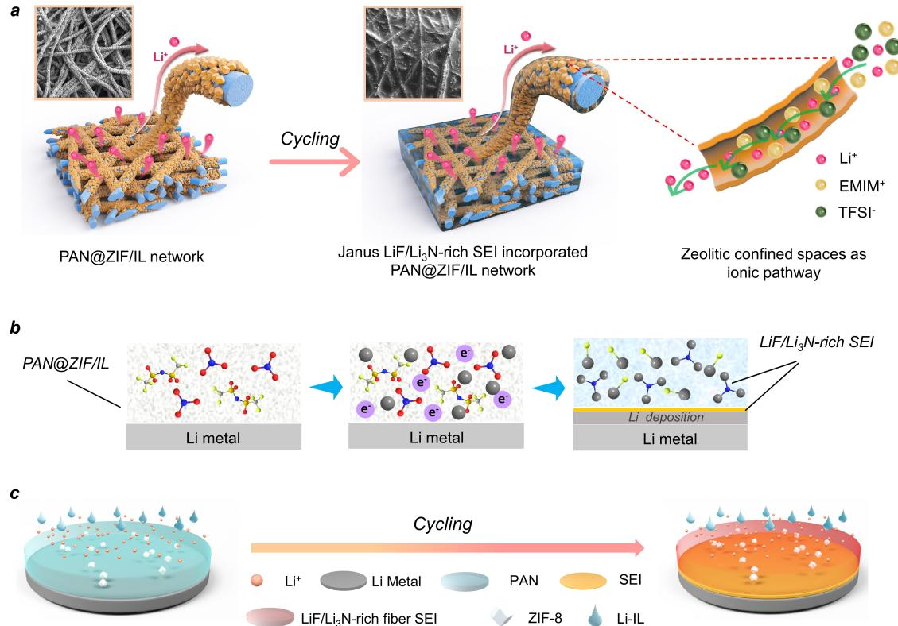
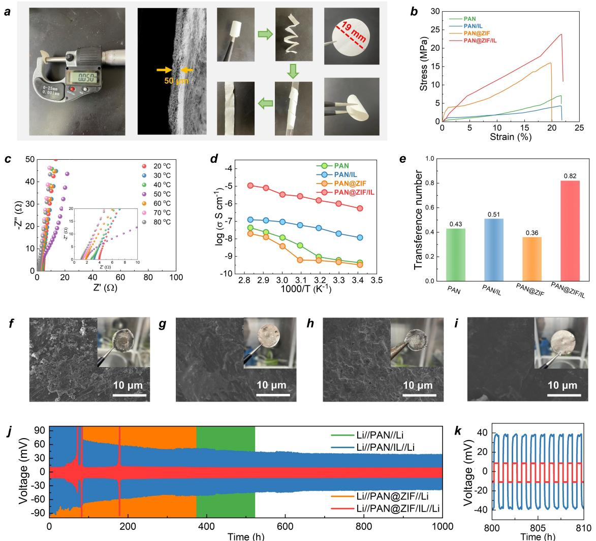
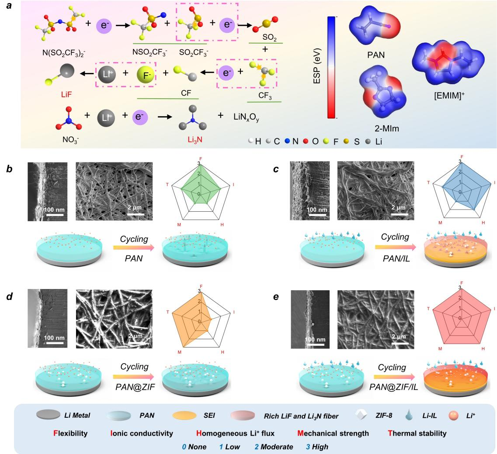
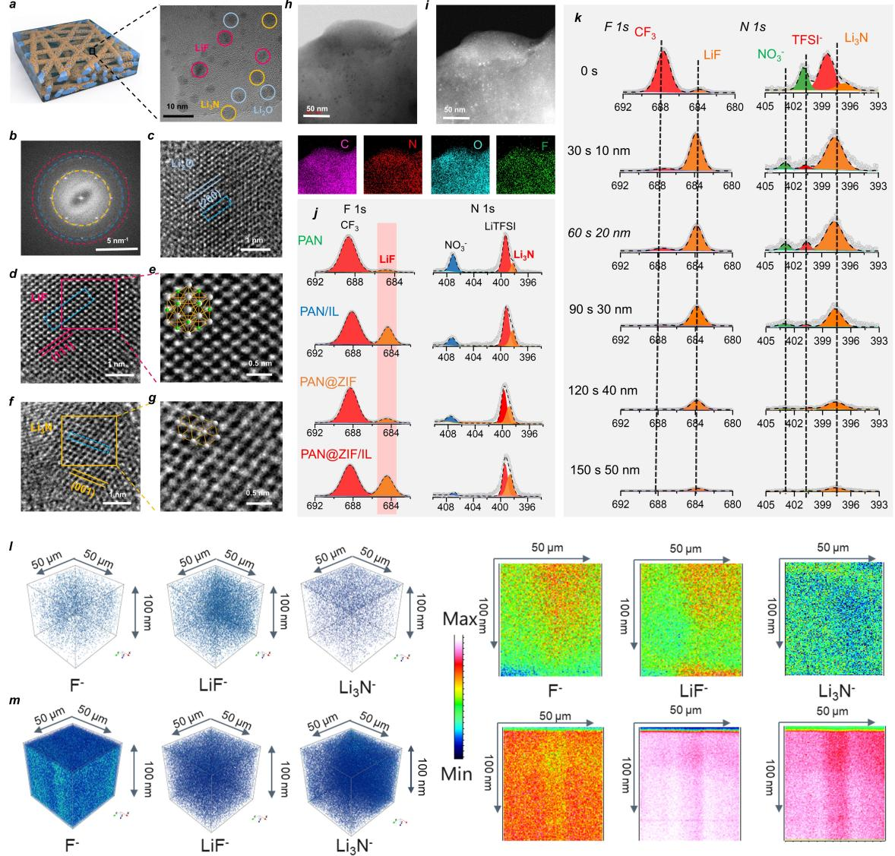
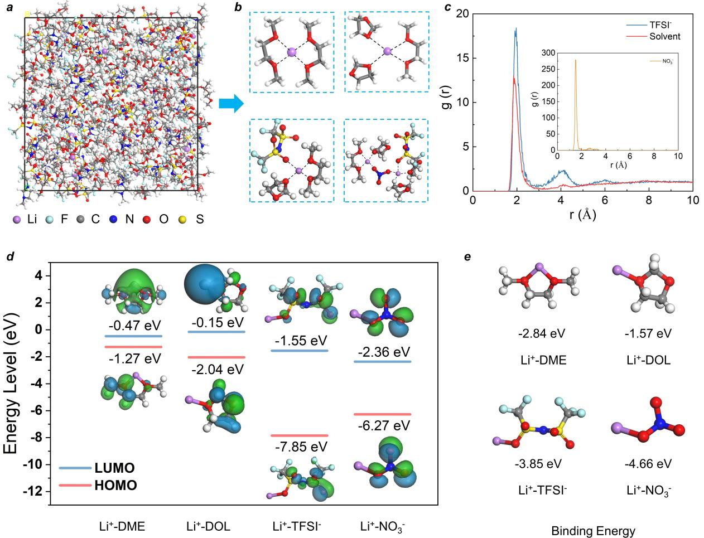
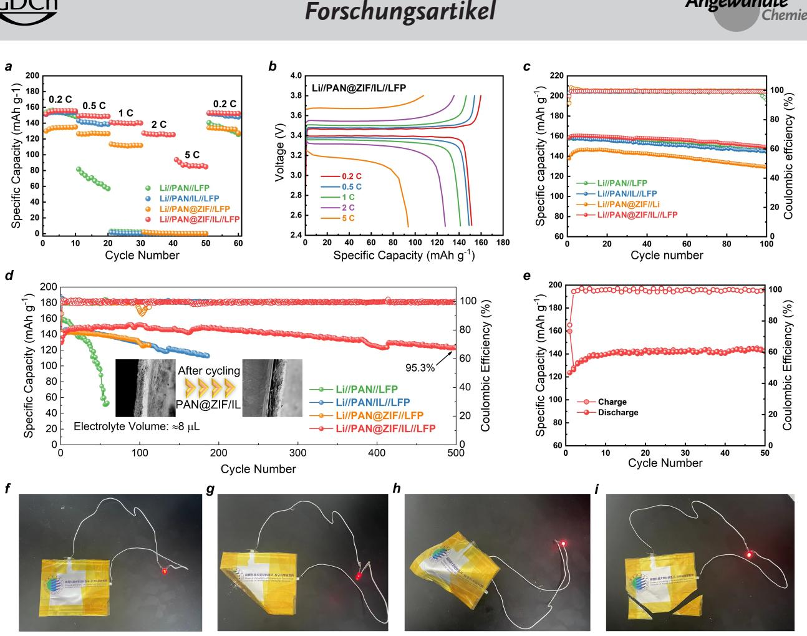

*Forschungsartikel*

*Li Metal Batteries*

Zitierweise: *Angew. Chem. Int. Ed.* **2023**, *62*, e202304947 [doi.org/10.1002/anie.202304947](https://doi.org/10.1002/anie.202304947)

# **Stabilizing Solid-state Lithium Metal Batteries through In Situ Generated Janus-heterarchical LiF-rich SEI in Ionic Liquid Confined 3D MOF/Polymer Membranes**

*Xingxing Zhang, [Qingmei](http://orcid.org/0000-0003-0185-4422) Su,\* Gaohui Du, Bingshe Xu, Shun Wang, Zhuo Chen, Liming Wang, [Wenhuan](http://orcid.org/0000-0003-1474-9373) Huang,\* and [Huan](http://orcid.org/0000-0002-5319-0480) Pang\**

**Abstract:** Pursuing high power density lithium metal battery with high safety is essential for developing nextgeneration energy-storage devices, but uncontrollable electrolyte degradation and the consequence formed unstable solid-electrolyte interface (SEI) make the task really challenging. Herein, an ionic liquid (IL) confined MOF/Polymer 3D-porous membrane was constructed for boosting in situ electrochemical transformations of Janus-heterarchical LiF/Li3N-rich SEI films on the nanofibers. Such a 3D-Janus SEI-incorporated into the separator offers fast Li+ transport routes, showing superior room-temperature ionic conductivity of 8.17×10 4 Scm 1 and Li+ transfer number of 0.82. The cryo-TEM was employed to visually monitor the in situ formed LiF and Li3N nanocrystals in SEI and the deposition of Li dendrites, which is greatly benefit to the theoretical simulation and kinetic analysis of the structural evolution during the battery charge and discharge process. In particular, this membrane with high thermal stability and mechanical strength used in solid-state Lij j LiFePO4 and Lij jNCM-811 full cells and even in pouch cells showed enhanced rate-performance and ultra-long life spans.

[\*] X. Zhang, Q. Su, G. Du, B. Xu, L. Wang School of Materials Science & Engineering, Shaanxi University of Science and Technology 710021 Xi'an (P. R. China) E-mail: suqingmei@sust.edu.cn

X. Zhang, S. Wang, Z. Chen, W. Huang Key Laboratory of Chemical Additives for China National Light Industry, College of Chemistry and Chemical Engineering, Shaanxi University of Science and Technology

710021 Xi'an (P. R. China) E-mail: huangwenhuan@sust.edu.cn

H. Pang School of Chemistry and Chemical Engineering, Institute for Innovative Materials and Energy, Yangzhou University 225002 Yangzhou (P. R. China) E-mail: huanpangchem@hotmail.com

*Angew. Chem.* **2023**, *135*, e202304947 (1 of 10) © 2023 Wiley-VCH GmbH

## *Introduction*

Lithium (Li) has a theoretical specific capacity of 3860 mAhg 1 and a low redox potential ( 3.04 V vs. the standard hydrogen electrode), which is considered as a promising anode for the next-generation high energy density batteries.[1] However, the application of lithium metal batteries (LMBs) suffers from severe safety problems and rapid capacity degradation caused by the lithium dendrites growth at the interfacial gap among the electrode and separator.[2] One of the most effective strategy for inhibiting the growth of lithium dendrites is the surficial modification on the separator with the regeneration of solid-electrolyte interphase (SEI) film.[3] The chemical component of SEI and surficial infiltration are responsible for the fast Li+ transmit kinetics, low impedance and stable electrode.[4] Especially, LiF in the SEI has high interfacial energy, excellent chemical stability, and low Li+ diffusion barrier, which generally related to the decomposition of F-containing liquid electrolyte.[5]

Owing to the spontaneously electrochemical formation of SEI film among the separator and anode during the charge/discharge process, the precise structural design of the separator with the proper components is crucial for in situ formation of SEI but hard to control.[6] The most commonly used polymer separator or inorganic separator suffers from the low Li+ conductivity with a narrow electrochemicalstability window and the poor interfacial affinity with the severe growth of lithium dendrites, which is adverse to the formation of high-performance SEI film in battery.[7] As a matter of fact, the hybrid inorganic/polymer separators combining the merits of high ionic conductivity, high mechanical strength, high thermal stability, flexibility, and interfacial affinity, have attracted great attention by the scientist recent years.[8]

Recently, a variety of metal organic frameworks (MOFs) become promising fillers and have been employed in the assembly of MOF/Polymer mixed-matrix separators, which displayed the promoted ionic conductivity, enhanced stability of the assembled batteries.[9] For instance, Pan et al. reported an ionic-liquid-impregnated MOF (Li-IL@MOF) pressed separator with the modified interfacial wettability, which exhibited high room-temperature ionic conductivity of 3.0×10 4 Scm 1 and enhanced compatibility against electrodes with low interfacial resistances.[10] Moreover, Yaghi et al. reported an anionic MOF-688 with active MnMo6 *Forschungsartikel*

clusters, which showed high ionic conductivity of 3.4×10 4 Scm 1 and stable cycling in solid-state battery at room temperature.[11] Assembled with polytetrafluoroethylene, Zhou et al. employed MOF with sub-nanometer 6.5 Å pores as filler, delivering a wide electrochemical stability window of approximately 5.4 V vs. Li+/Li, and stable electrochemical performances (171 mAhg 1 after 300 cycles, 89% capacity retention) even at 90°C and after sustaining damage (164 mAhg 1 after 100 cycles).[12] These results indicate the superiority and significant contribution of modified active metallic sites and polarized pores/channels in the MOF-incorporated separators for enhancing the electrochemical performance. Especially, their distinct pores and functional groups are conducive to regulating the components and distribution of SEI film.[13] However, the formation mechanism and reaction kinetics of SEI in such complex system are still obscure.

Herein, an ionic liquid (IL) confined MOF/Polymer 3D hierarchical porous membrane with 1D fiber substructures, as quasi-solid state electrolyte, was designed and constructed through electrospinning and chemical soaking process. Benefiting from the confinement of lithium salt and IL in the zeolitic pores, the in situ electrochemically transformed LiF and Li3N SEI uniformly covered the MOF/Polymer fibers and embedded into the hierarchical network, constructing a 3D-Janus SEI-incorporated solid state electrolyte. By cryo-TEM and theoretical calculations, direct visualization and simulation of the formation of LiF and Li3N were accomplished. Owing to the unique hierarchical Janus nano/micro structures and good surficial affinity, the fast Li+ transport kinetics (8.17×10 4 Scm 1 at 25°C) was achieved, which further greatly suppressed the growth of Li dendrites. Furthermore, as assembled Lij jLiFePO4 and Lij j NCM-811 full cells, the remarkable long-term capacities of �140 mAhg 1 at 1 C and �135 mAhg 1 at 2 C were achieved. The LiFePO4 j jLi cell maintained superior capacity retention of 95.3% after 500 cycles at 1 C rate, merely decaying from 129.55 to 123.46 mAhg 1 at 25°C.

#### *Results and Discussion*

The 3D-Janus separator of LiF/Li3N-rich SEI incorporated with Polymer@ZIF/IL mixed matrix membrane was constructed for lithium metal battery according to the procedures shown in Figure 1 and S1. Firstly, the polyacrylonitrile (PAN) and zinc acetylacetonate were dissolved in DMF with ultrasonic treatment as emulsion, and then the mixture was further electro-spined into a 3D porous membrane (thickness of �50 μm) composed of cross-linked 1D nanofibers (diameter of �200 nm) (Figure S3–S5). The as synthesized Zn-presursor PAN 1D/3D porous membrane was immersed into 2-methyl imidazolate solution for 2 hours to form ZIF-coated PAN nanofibers (Figure S6). Then, the membrane was soaked into bis (trifluoromethane) sulfonimide lithium (LiTFSI) and ionic liquid (IL, 1-ethyl-3-meth-

*Figure 1.* In situ fabrication of 3D-Janus hierarchical electrolyte. a) Electrochemical transformation of LiF-rich SEI in 3D-janus electrolyte and ionic transmit route. b) Schematic illustration of electrolyte decomposition and SEI formation. c) Schematic drawing of suppressing Li dendrites.

*Angew. Chem.* **2023**, *135*, e202304947 (2 of 10) © 2023 Wiley-VCH GmbH

ylimidazolium-bis(trifluoromethylsulfonyl)imide, [EMIM]- [TFSI]) at 120 °C for 12 h. The IL-encapsulated Zn-ZIF particles with an average diameter of �100 nm were tightly grew on the surface of the PAN nanofiber, which was denoted as PAN@ZIF/IL separator (Figure S8, S9). The chemical composition and morphological structure of PAN@ZIF/IL were analyzed by powder X-ray diffraction (PXRD), differential scanning calorimetry (DSC), Fourier transform infrared spectroscopy (FT-IR), thermogravimetric analysis (TGA), scanning electron microscope (SEM) and transmission electron microscope (TEM) (Figure S4–S14). The uniform distribution of C, N, O, Zn, F and S elements in EDS-mapping confirmed the homogeneous growth of ZIF particles on 1D nanofibers and the successful encapsulation of LiTFSI and ILs (Figure S7–S9). The N2 adsorption/ desorption and TGA results indicated the IL loading amount of �21.43 wt% in ZIF particles (Figure S13, S14).[14]

Along each 1D cross-linked nanofiber in the 3D membrane, the ZIF particles with abundant zeolitic-type confined spaces and Lewis acid Zn2+ sites are continuously distributed, which provide fast Li+ ion transport routes with the effective confining of TFSI anions (Figure 1a).[15] The molecular size of EMIM+ (*d*p of 7.6 Å and *V*v of 116 Å3 ), TFSI (*d*p of 7.9 Å and *V*v of 147 Å3 ) and the zeolitic pores size of ZIF (*d*a of 3.4 Å, *d*p of 11.6 Å and *V*p of 817 Å3 ) confirmed the ILs could enter the ZIF pores successfully (Figure S2). More importantly, the rich polarized N-containing groups (C=N in ZIF and EMIM+, C�N in polyacrylonitrile) in the membrane accelerate the electron transfer kinetics and promote the electrochemical redox reaction between TFSI /NO3 and Li+ to form LiF and Li3N. Moreover, owing to the confinement of TFSI and NO3 in ZIF particles, the in situ generation of LiF and Li3N covering the ZIF particles surface among the fibers gap was occurred, forming a Janus-type electrolyte of LiF/Li3N-rich SEI incorporated with PAN@ZIF/IL (Figure 1b). As the SEM images of PAN@ZIF/IL in disassembled cells given in Figure 2, 3, the dense LiF/Li3N-rich SEI not only promoted the Li+ transfer kinetics, but also prevented the growth of Li dendrites (Figure 1c).

The pristine PAN, IL loaded PAN, and PAN@ZIF without IL (denoted as PAN, PAN/IL and PAN@ZIF, respectively) were constructed as three contrast electrolytes for evaluating the physicochemical properties and ionic conductivity mechanism of PAN@ZIF/IL. The helical micrometer and fractured surface SEM indicated the thickness of PAN@ZIF and pristine PAN membrane was only �50 μm (Figure 2a and S3). The flexibility of the separators was evaluated first, the PAN@ZIF electrolyte maintained the good flexibility of pristine PAN membrane, which was confirmed by physical folding, curling, bending, and wrapping tests (Figure 2a). Moreover, the loaded ZIF particle (thermal stable at �450 °C)[16] in the PAN@ZIF electrolyte greatly enhance the thermal stability of the hybrid PAN@- ZIF electrolyte (keep stable at �200 °C), which far beyond the commercial PP separator (shrinkage at �80°C) and the synthesized PAN electrolyte (shrinkage at �120 °C) (Figure S15). Moreover, the mechanical strength of PAN@ZIF and PAN@ZIF/IL (�16 MPa and 23 MPa) was also im-

*Angew. Chem.* **2023**, *135*, e202304947 (3 of 10) © 2023 Wiley-VCH GmbH

proved, which was almost 3–5 times higher than that of pristine PAN and PAN/IL membrane (�6 MPa and 4 MPa) (Figure 2b). The good flexibility, thermal stability, and mechanical strength of PAN@ZIF electrolyte indicated its further commercial application potentials.

To evaluate the surficial affinity, the contact angles of LiNO3 containg ether liquid electrolyte (*V*�10 μL) on the surface of different electrolytes were tested (Figure S16). The IL loaded separators (PAN/IL and PAN@ZIF/IL) displayed the better electrolyte affinities (contact angle of 22.3° and 24.6°, respectively) than PAN (contact angle of 45.6°) and PAN@ZIF (contact angle of 63.4°). The electrolyte affinity of the separator is generally involved in the Li+ transmitting behavior, formation of SEI, and growth process of Li dendrites. Therefore, electrochemical impedance spectroscopy (EIS) of four electrolytes at 25 °C revealed the lowest charge transfer impedance (*R*ct) of 3.98 Ω and the highest σ of 8.17×10 4 Scm 1 for PAN@ZIF/IL, exceeding PAN/IL (*R*ct of 18.00 Ω and σ of 1.8×10 4 Scm 1 ), PAN@ZIF (*R*ct of 75.57 Ω and σ of 4.3×10 5 Scm 1 ), and PAN (*R*ct of 50.77 Ω and σ of 6.4×10 4 Scm 1 ) (Figure S17). The interval tested electrochemical impedance curves of PAN@ZIF/IL at 20–80 °C indicated a continuous decreasing of *R*ct and raising of σ (*R*ct of 0.929 Ω and σ of 3.5×10 3 Scm 1 at 80°C, Figure 2c). The activation energy (*E*a) calculated from the Arrhenius plot for PAN@ZIF/IL, PAN/IL, PAN and PAN@ZIF (0.16, 0.14, 0.28 and 0.24, respectively) also suggested the higher Li+ conductivity and lower Li+ transport energy barrier of PAN@ZIF/IL and PAN/IL (Figure 2d). These results are highly in accordance with the electrolyte affinities, which indicated the IL in the separator promote the conducting of Li+ ions.

Furthermore, the electrochemical-stability windows (Figure S18) of PAN/IL and PAN@ZIF/IL were much higher (4.9 V) than that of PAN@ZIF (4.6 V) and PAN (4.3 V), suggesting the introduction of ZIF particle and IL can improve the electrochemical stability of the electrolyte. During the charge and discharge process, the higher transmitting of Li+ will restrain the moving of anions and formation of the lithium dendrites. As shown in Figure S19, the polarization curves and initial and steady state impedance diagrams for all four separators in symmetric Li cells were evaluated. The calculated Li+ transference number (t Liþ ) for PAN@ZIF/IL is 0.82, which far beyond to PAN/IL (0.51), PAN (0.43) and PAN@ZIF (0.36) (Figure 2e). It proved that the synergistic role of the porous spaces with the confined TFSI anions provide the continuous Li+ transfer routes. However, owing to the untight contact of PAN@ZIF surface with the electrode plate, the lowest tLiþ for PAN@ZIF was observed, which also means the filled ILs play the dominant surficial role for accelerating Li+ transmission. The transport of lithium ions is mainly driven by space charges, hence, the accumulation of space charges near to lithium cathode will promote the reduction and overgrowth of lithium Li dendrites. Theoretically, high ionic conductivity and surficial affinity of the electrolyte can inhibit the growth of lithium dendrites. The long-term Li plating and stripping tests of the electrolytes in symmetric Li cells at different current densities were evaluated (Figure 2j

*Figure 2.* Characterization and properties of 3D-Janus hierarchical electrolyte. a) Flexibility and thickness of electrolyte in digital photos. b) Stressstrain curves. c) EIS plots of electrolytes at various temperatures. d) Arrhenius plots of the ionic conductivities. e) Transfer numbers of Li+ ions. f)– i) SEM images and digital photos of Li anodes in PAN, PAN/IL, PAN@ZIF and PAN@ZIF/IL electrolytes constructed LikLi cells after long-term cycling at 0.5 mAcm 2 . j) Cycling performances of Li/Li symmetric cell at 2 mAcm 2 at room temperature.

and S20). The symmetric Li cell of PAN@ZIF/IL showed long stability of 1000 cycles over 1000 h with an ultra-small overpotential of 20 mV at a current density of 2 mAcm 2 (Figure 2j). And 0.5 mAcm 2 and 1 mAcm 2 , it kept stable for 1000 cycles with overpotentials of 16 mV and 18 mV, even at 4 mAcm 2 for 4 mAhcm 2 , with a small overpotentials of 60 mV (Figure S20). In contrast, the Li symmetrical cells with other three electrolytes showed poor cycle stabilities with greater overpotentials (Figure 2j and S20). To further confirm the dendrite suppressing capabilities, the digital photos and SEM images of the detached Li anodes after 1000 h cycling at 0.5, 1.0 and 2.0 mAcm 2 for these cells were obtained (Figure 2f–i and S20). Different from the smooth surface of Li anode without obvious dendrites in PAN@ZIF/IL cell, the PAN, PAN/IL and PAN@ZIF cells all displayed loose lithium dendrites on the Li surface to varying degrees after cycling at 0.5 mAcm 2

*Angew. Chem.* **2023**, *135*, e202304947 (4 of 10) © 2023 Wiley-VCH GmbH

(Figure 2f–i). The similar SEM results on Li anodes were observed at high current densities of 1.0 and 2.0 mAcm 2 (Figure S20). The EIS spectra before and after Li stripping cycles are show in Figure S21. In comparison, PAN@ZIF/IL showed a relatively smaller initial impedance and change trend. These results are highly matched with the previous predictions and confirmed that the IL-encapsulated ZIF/ PAN hierarchical 3D network as separator effectively accelerate the Li transport and inhibit the growth of the lithium dendrites.

It's worth noting that the PAN@ZIF/IL displayed the lowest polarization voltage and the fastest steady trends (Figure 2j and S20), which should be attribute to the in situ formed SEI stabilized the electrode/electrolyte interface during the charge/discharge cycling. We speculate that the zeolitic pores and Lewis acidic sites in PAN@ZIF/IL not only limit the migration of TFSI anions and accelerate the

mobility of Li+ ions, but also promote the uniform deposition of SEI film. The electrostatic potentials of Ncontaining organic fragments for PAN, 2-MIm, and EMIM+ indicated the electron-rich groups in such a system promote the electron transfer kinetics and the electrochemical decomposition of TFSI and NO3 anions (Figure 3a). As the equations given, the LiF and Li3N incorporated multiphase hierarchical ionic conducting SEI was formed among the interfaces in the electrolyte (Figure 1b–e).

For further investigating the distribution of the SEI in the cell, the SEM images of both Li anode and electrolyte from the detached symmetric Li cells after 1000 h at different current densities were characterized. The cross-sectional SEM of PAN and PAN@ZIF cells did not show obvious SEI layer on the electrolytes but severe lithium dendrites on the Li anodes (Figure 3b–d, Figure S22). The low ionic conductivity and poor interfacial affinity of PAN and PAN@- ZIF resulted in the interfacial polarization and inhomogeneous Li decomposition. As comparison, the dense SEI and Li deposition layers on the PAN/IL and PAN@ZIF/IL separators were observed (Figure 3c–e, S23), especially the thin SEI and Li deposition layer (20 μm) without Li dendrite in PAN@ZIF/IL cell (Figure 3e). In PAN/IL cell, without the confinement of ZIF, the TFSI and NO3 anions diffused on the surface of electrolyte fast and were transformed into SEI components continuously (�50 μm). With the increasing thickness of SEI layer between the Li and separator, the diffusion pathways of Li+ ions were blocked and further result in the growth of lithium dendrites (Figure 3c). However, in PAN@ZIF/IL cell, the TFSI anions confined by the zeolitic pores and Lewis acid sites of ZIF particles induced the in situ formation and growth of SEI, which tightly covered on the surface of PAN@ZIF nanofiber and filled into the gaps of separator as Janus structure. Hence, such a Janus SEI incorporated PAN@ZIF/IL electrolyte in the cell provided the 3D network with high ionic conductivity, enhancing the transmitting kinetics of Li+ ions with the superb stability and low interfacial impedance.

*Figure 3.* Formation of LiF-rich SEI in 3D-Janus hierarchical electrolyte. a) Chemical expression for the formation of LiF and Li3N in SEI and the optimized geometric configurations and electrostatic potentials. b)–e) Tomoscan, surficial SEM, schematic illustration of SEI film and Li dendrite growth for PAN, PAN/IL, PAN@ZIF and PAN@ZIF/IL electrolytes in symmetric half-cells after 1000 h at 0.5 mAcm 2 .

*Angew. Chem.* **2023**, *135*, e202304947 (5 of 10) © 2023 Wiley-VCH GmbH

To further evaluate the positive role of PAN and ILs on the Li deposition, the electrochemical Li plating and stripping experiments for these electrolytes in Li kCu halfcell were conducted at different current densities (Figure S24). The stable coulombic efficiency (CE) of �90% after 100 cycles at 0.5, 1.0 and even 2.0 mAcm 2 for PAN@ZIF/IL were obtained, which far superior to PAN@- ZIF electrolyte. The fast decline of CE for PAN@ZIF after only �20 cycles were observed (*<*80% CE at 0.5 and 1.0 mAcm 2 ). The rapid decreasing CE and unstable cycling behavior for PAN@ZIF electrolyte is attribute to the poor interfacial compatibility among ZIF particles with the Cu electrode plate, which was strongly confirmed by the apprentice Li dendrites on Cu plate surface in SEM images (Figure S25). These results are highly matched with those obtained in the symmetric Li cells, indicating the ILs confined by the ZIFs play the key role for interfacial electrochemical reactions. As compared in Figure 2a–e, the PAN@ZIF/IL electrolyte combines five merits of good flexibility, high ionic conductivity, homogeneous Li flux, mechanical strength and thermal stability, showing great potentials for serving as electrolyte in LMBs.

To verify the above assumptions about the formation process of SEI, the microstructures and components of SEI in solid electrolyte nanofibers were characterized by cryotransmission electron microscopy (cryo-TEM) at sub-angstrom resolution. The high-resolution TEM (HRTEM) images of generated SEI in PAN, PAN/IL, PAN@ZIF and PAN@ZIF/IL membranes clearly displayed the classical embedded structures of crystalline nanoparticles in amorphous phase matrix (Figure 4a and S28a–c). The selected electron diffraction pattern (SAED) confirms that the main components are Li2O, LiF and Li3N (Figure 4b). The crystalline phases of Li2O, LiF and Li3N were determined by matched long-range-ordered lattice plans and intensity scanning profiles (Figure 4c–g and S26). The lattice distance of 2.30 Å, 2.32 Å and 3.78 Å are corresponding to (200), (111) and (001) planes of Li2O, LiF and Li3N, which are in agreement with the SAED results (Figure 4b and S28d–f). The distribution of LiF and Li3N nanocrystals were confirmed by the electron energy loss spectroscopy mapping (EELS-mapping) of F and N elements (Figure S27). The high-angle annular dark-field STEM (HAADF-STEM) images and the corresponding EDS mappings further revealed the high amount of untrafine LiF and Li3N nanocrystals in SEI for PAN@ZIF/IL electrolyte (Figure 4h–i). Moreover, the SEI looks relatively dense, and the C, N, O and F elements are located in the matrix uniformly. On the contrary, the small quantity of F-containing nanocrystals in PAN, PAN/IL and PAN@ZIF were observed by the corresponding element mapping images and the mass content of typical elements (Figure S29–S32). These results coincide with the electrochemical and theoretical results of high content of LiF and Li3N in SEI could be in situ formed on the IL-confined ZIF/polymer hybrid-nanofibers in electrolyte during the charge/discharge processes.

The X-ray photoelectron spectroscopy (XPS) on both electrolyte and Li anode surface of the detached cells after 20 cycles was conducted to identify the chemical compo-

*Angew. Chem.* **2023**, *135*, e202304947 (6 of 10) © 2023 Wiley-VCH GmbH

nents and valent states of the SEI (Figure 4j–k and S33– S35). In the C 1s spectra, the peaks assigned to C C, C O, O C=O, and CF3 originate from the electrolyte and ionic liquid. In F 1s spectra for electrolyte surfaces, the more intense peaks at 684.5 eV for PAN/IL and PAN@ZIF/IL suggested the higher contents of LiF in their SEI. In addition, in the Li 1s spectra, PAN@ZIF/IL-derived SEI is higher than that of the other electrolyte-derived SEI, meaning more of the LiF component. However, the F 1s XPS spectra on the surface of lithium anode plates showed the much higher LiF peak in PAN/IL cell than that in PAN@ZIF/IL cell (Figure S34). The XPS depth profiles of the Li deposited with PAN@ZIF/IL and PAN/IL show that LiF and Li3N appears on the Li anode surface, LiF and Li3N content gradually decreases until the lithium metal anode in PAN@ZIF/IL, while its content in PAN/IL remains largely stable (Figure 4k and Figure S35). In addition, we performed TOF-SIMS depth profiling of the Li-metal anode interface, and the results showed that the PAN/IL-derived F , LiF and Li3N signals and thicknesses were significantly higher than those of PAN@ZIF/IL, which is consistent with the XPS results (Figure 4l–m). It suggested that without the IL confined by ZIF, the free movement of TFSI anions cannot be restricted and the LiF formed easily on the surface of Li anode. Hence, in PAN/IL cell, the decomposition of TFSI among the Li/separator gap generated thicker SEI layer, greatly blocks the diffusion channels and hinders the migrating of lithium ions. In F 1s and N 1s spectra on separators, the weaker TFSI and NO3 peaks (688.6 eV and 407.2 eV), and the stronger Li3N peaks (398.2 eV) are observed in PAN@ZIF/IL. Owing to the confinement of IL in zeolitic pores, the promoted decomposition of TFSI- and the transformation of LiF on the nanofibers were achieved. Meanwhile, the higher electron-donating ability of Lewis acid metallic sites in ZIF particles promote the reduction of NO3 and formation of Li3N. The cryo-TEM and XPS results further confirm the LiF/Li3N-rich hierarchical incorporated 3D Janus SEI network in PAN@ZIF/IL cell, which are benefit to transmitting of Li+ and restraining the growth of Li dendrite.

For further evaluating the formation process of SEI in PAN@ZIF/IL cell, the density functional theory (DFT) and ab initio molecular dynamics (AIMD) simulations on the corresponding solvation models, including LiTFSI, LiNO3 , 1,3-dioxacyclopentane (DOL), and 1,2-dimethoxyethane (DME) were performed (Figure 5a). The solvation structures with Li+ insertion into the system were calculated by molecular dynamics simulations at 300 K with a time step of 1 fs. The equilibrium snapshots of the interactions between Li+ and anion/solvent in original electrolyte systems (Figure 5a,b) displayed that the Li+ are solvated by DME/DOL molecules through Li O interactions and the TFSI /NO3 anions are mainly in the dissociation state (Figure 5b). The configurations and the corresponding binding energy between Li+ and solvent/anion were calculated by DFT and presented in Figure 5e. The weak interaction between DME/DOL and Li+ induce the binding of TFSI and NO3 anions to Li+, resulting in the desolvation of Li-DME/Li-DOL. Moreover, according to the radial distribution

*Forschungsartikel*

*Figure 4.* Cryo-TEM, XPS and TOF-SIMS characterizations of LiF-rich SEI in electrolyte. a) Enlarged TEM image of the PAN@ZIF/IL interface. b) Corresponding fast Fourier transform with red circle indexed to LiF; yellow circle indexed to Li3N; blue circle indexed to Li2O. c)–g) HRTEM and magnified images of Li2O, LiF and Li3N. h)–i) EDS mapping for the chemical components in SEI. j) XPS spectra of the SEIs in Li symmetric half-cell inside PAN, PAN/IL, PAN@ZIF and PAN@ZIF/IL. k) A depth profiling of the elements on the PAN@ZIF/IL Li anode surface by the XPS sputter etching technique. l)–m) TOF-SIMS 3D and 2D spectra of F , LiF and Li3N for the Li anode surface of the PAN@ZIF/IL(l) and PAN/IL(m).

function (RDF) in Figure 5c, the strong coordinating ability of TFSI and NO3 to Li+ are demonstrated by the highest and closest peak between the central Li and binding O atoms from TFSI and NO3 . The long pairs of electrons on the O of TFSI and NO3 anions is more electronegative. This feature not only enables the solvation of Li-TFSI/Li-NO3, but also promote the decomposition of TFSI and NO3 anions into LiF and Li3N. Furthermore, the highest occupied molecular orbital (HOMO) and the lowest unoccupied molecular orbital (LUMO) calculations for Li+ -solvent and Li+-anion complexes are investigated (Figure 5d). The LUMO energy values of the Li+-anion complexes were lower than those of the Li+-solvent species, indicating that the anions (TFSI , NO3 ) in the system were more likely to get electrons and further decompose into LiF and Li3N.

The four separators were assembled into Lij jLFP fullcells with the lean electrolyte condition (8 μL) for comparing long-term cycling performance at room temperature. Figure 6a,b compares the rate performances of batteries with different electrolytes at room temperature. The full-cell assembled with PAN@ZIF/IL showed high average discharge capacity of 155.1 mAhg 1 at 0.2 C, 148.9 mAhg 1 at 0.5 C and even 125.9 mAhg 1 at 2 C. Moreover, the good reversible capacity from 87.2 mAhg 1 at 5 C to 152.5 mAhg 1 at 0.2 C, indicating the excellent rate performance of PAN@ZIF/IL-based full-cell at high current densities was achieved. In contrast, the full-cells assembled with PAN/IL, PAN@ZIF and PAN displayed the low discharge

*Forschungsartikel*

*Figure 5.* Analysis of Li+ solvation structures and DFT calculations. a) Molecular dynamics simulation snapshot of the electrolyte. b) Typical solvation structures of the LiTFSI/LiNO3/DOL/DME electrolyte during the MD operation. c) Comparison of the radial distribution function g(r) of the system. d) LUMO and HOMO energies of the Li+-DME, Li+-DOL, Li+-TFSI , Li+-NO3 (insets are molecular orbital simulation snapshots of LUMO and HOMO). e) Geometric configuration, and binding energy between Li+ and solvent/anion.

capacity of 140.2 mAhg 1 126.7 mAhg 1 and 68.3 mAhg 1 at 0.5 C. Although, the reversible capacity of PAN/IL was higher than that of PAN@ZIF in full-cells, the discharge ability of PAN/IL at 1 C was near zero. It is due to the rapid formed thick SEI film in PAN/IL cell impedes the diffusion of lithium ion. The PAN@ZIF full-cell delivered low discharge capacity of 112.0 mAhg 1 at 1 C, which may be attribute to the poor interfacial affinity among the electrolyte and electrodes (Figure 6a). All four Lij jLFP cells presented good cycling performance beyond 100 cycles at 0.1 C at room temperature (Figure 6c). However, PAN, PAN/IL and PAN@ZIF full-cells displayed rapid capacity decay at 1 C, which are impracticable for long-life batteries. To our delight, the PAN@ZIF/IL full-cell showed superior capacity retention rate of 95.3% with a high CE of �99.9% after 500 cycles at 1 C and capacity retention rate even reach of 90.7% with a CE of �99.5% after 200 cycles at 2 C (Figure 6d and S40).

It is worth noting that another typical high-voltage cathode material (2.7–4.3 V) LiNi0.8Co0.1Mn0.1O2 (NCM-811) was also employed for assembling Lij jNCM-811 full-cells.

*Angew. Chem.* **2023**, *135*, e202304947 (8 of 10) © 2023 Wiley-VCH GmbH

As shown in Figure S41, the high average discharge capacity of 224.4, 181.3, 157.9 and 134.0 mAhg 1 at 0.2, 0.5, 1 and 2 C were obtained. The brilliant reversible capacity from 90.9 mAhg 1 at 5 C to 183.0 mAhg 1 at 0.2 C and the high capacity of �135 mAhg 1 during long-term cycling at 2 C were achieved, which further demonstrated the excellent electrochemical properties of PAN@ZIF/IL electrolyte in full-cells.

To study the deterioration mechanism of different electrolytes in full-cells, the electrochemical impedance, XRD, and SEM characterizations of four Lij jLFP cells after long-term cycling at 0.1 C were investigated. The PAN@ZIF/IL full-cell displayed good interfacial stability with little impedance change (from 172.34 Ω to 250.81 Ω after 100 cycles) (Figure S34). However, the severe degradation of interfacial impedance for PAN, PAN/IL and PAN@ZIF full-cells after 100 cycles were observed, revealing the key role of compatible electrode/electrolyte interface in these full-cells (Figure S39). The PXRD curves of PAN@ZIF/IL electrolyte after different cycling (Figure S38) also indicated the good crystalline structure stability of ZIF

*Figure 6.* Electrochemical properties of solid-state Lij jLFP full cell. a) Rate performances with different solid electrolytes. b) Charge and discharge voltage profiles at different rates. c), d) Cycling performance of Lij j LFP cell at 0.1 and 1 C at 25 °C. e) Long-term cycle performance of the Lij j LFP pouch full-cell. f)–i) Photos of solid-state pouch Li metal cell based on PAN@ZIF/IL composite solid electrolyte showing well-working at f) Flat, g) Bent (h), Folded, and i) Cutted states.

particles in PAN@ZIF/IL full-cell during the long-term cycling. Moreover, the surface morphologies of lithium anode from the detached Lij jLFP batteries after 100 cycles were evaluated through SEM images, showing smooth and flat surface for PAN@ZIF/IL, but rough surfaces with obvious Li dendrites and dead Li for PAN, PAN/IL and PAN@ZIF (Figure S36). These SEM results are consistent with those obtained in symmetric Li cells. In PAN, PAN/IL and PAN@ZIF full-cells, the severe lithium dendrites are the culprits for the short circuits. The dense SEI was also observed in SEM image for PAN@ZIF/IL electrolyte (Figure S37). These results suggested the Janus structure of SEIincorporated PAN@ZIF/IL electrolyte in the battery not only restrained the growth of Li dendrites, but also enhanced the electrochemical stability of the battery.

The safety really matters for practical use of batteries. Hence, Lij jPAN@ZIF/ILj jLFP pouch cell was also fabricated for cyclability and safety studies. The discharge capacity maintained around 140 mAhg 1 throughout the cycling under 1 C at room temperature, which is very close to the value of the coin cell. Also, the pouch cell presented a high CE of �99% after 50 cycles (Figure 6e). For practical

*Angew. Chem.* **2023**, *135*, e202304947 (9 of 10) © 2023 Wiley-VCH GmbH

application, this pouch cell kept working under the folded, bent and even cutted condition, indicating that the PAN@- ZIF/IL electrolyte inherit good flexibility of polymer separator (Figure 6f–i), high conductivity of inorganic electrolyte and high safety of solid-state electrolyte separator.

#### *Conclusion*

In summary, an Li-IL confined 3D-porous PAN@ZIF membrane was fabricated through electrospinning method as separator in solid-state Li metal battery for controllable constructing SEI in battery and enhancing the electrochemical performance. The cryo-TEM images and theoretical calculations were employed for simulating the transformation mechanism of LiF/Li3N in SEI and the deposition of lithium dendrites. During the charge/discharge process, the Lewis acid metal sites and the confined ILs in zeolitic pores of ZIF promoted the decomposition of TFSI and NO3 into LiF and Li3N covering on the nanofibers, inducing the in situ electrochemical transformation of Janus-type SEI in PAN@ZIF/IL electrolyte. Owing to the unique hierarch-

*Angewandte*

ical nano/micro structures of LiF/Li3N SEI film, the fast Li+ transmitting kinetics and the effective inhibition of Li dendrites were achieved. The assembled Lij jLFP, Lij j NCM-811 full-cells delivered high reversible capacities, good rate performances and cycling stabilities at high current densities. This work highlights an ideal SEI structure design and an effective strategy for practical high-performance solid-state battery.

## *Acknowledgements*

This work was financially supported by the National Natural Science Foundation of China (U2032131, 22001156, 22271178), Key R& D Program of Shaanxi Province (No. 2021GY-118), International Cooperation Key Project of Science and Technology Department of Shaanxi, China (2022KWZ-06), the Youth Talent Promotion Project of Science and Technology Association of Universities of Shaanxi Province (20210602), Research project of Xi'an Science and Technology Bureau (2022GXFW0011).

### *Conflict of Interest*

The authors declare no conflict of interest.

## *Data Availability Statement*

The data that support the findings of this study are available in the Supporting Information of this article.

**Keywords:** Janus-Heterarchical LiF/Li3N-Rich SEI Films **·** Lithium Metal Battery **·** Solid-Electrolyte Interface (SEI)

- [1] a) H. Yuan, X. Ding, T. Liu, J. Nai, Y. Wang, Y. Liu, C. Liu, X. Tao, *Mater. Today* **2022**, *53*, [173–196](https://doi.org/10.1016/j.mattod.2022.01.015); b) W. Xu, J. Wang, F. Ding, X. Chen, E. Nasybulin, Y. Zhang, J.-G. Zhang, *[Energy](https://doi.org/10.1039/C3EE40795K) [Environ.](https://doi.org/10.1039/C3EE40795K) Sci.* **2014**, *7*, 513–537; c) X.-B. Cheng, R. Zhang, C.-Z. Zhao, Q. Zhang, *Chem. Rev.* **2017**, *117*, [10403–10473.](https://doi.org/10.1021/acs.chemrev.7b00115)
- [2] a) A. Jana, S. I. Woo, K. S. N. Vikrant, R. E. Garcia, *[Energy](https://doi.org/10.1039/C9EE01864F) Environ. Sci.* **2019**, *12*, [3595–3607](https://doi.org/10.1039/C9EE01864F); b) X. Gao, Y.-N. Zhou, D. Han, J. Zhou, D. Zhou, W. Tang, J. B. Goodenough, *[Joule](https://doi.org/10.1016/j.joule.2020.06.016)* **2020**, *4*, [1864–1879](https://doi.org/10.1016/j.joule.2020.06.016); c) X.-R. Chen, B.-C. Zhao, C. Yan, Q. Zhang, *Adv. Mater.* **2021**, *33*, 2004128.
- [3] a) Y. Xiao, Y. Wang, S.-H. Bo, J. C. Kim, L. J. Miara, G. Ceder, *Nat. Rev. Mater.* **2020**, *5*, 105–126; b) Y. Jiang, B. Wang, P. Liu, B. Wang, Y. Zhou, D. Wang, H. Liu, S. Dou, *[Nano](https://doi.org/10.1016/j.nanoen.2020.105308) [Energy](https://doi.org/10.1016/j.nanoen.2020.105308)* **2020**, *77*, 105308; c) Y. Gao, X. Du, Z. Hou, X. Shen, Y.-W. Mai, J.-M. Tarascon, B. Zhang, *Joule* **2021**, *5*, [1860–1872.](https://doi.org/10.1016/j.joule.2021.05.015)
- [4] a) T. Li, X.-Q. Zhang, P. Shi, Q. Zhang, *Joule [Joule.](https://doi.org/10.1016/j.joule.2019.09.022)* **2019**, *3*, [2647–2661;](https://doi.org/10.1016/j.joule.2019.09.022) b) J. Chen, X. Fan, Q. Li, H. Yang, M. R. Khoshi, Y. Xu, S. Hwang, L. Chen, X. Ji, C. Yang, H. He, C. Wang, E.

Garfunkel, D. Su, O. Borodin, C. Wang, *Nat. [Energy](https://doi.org/10.1038/s41560-020-0601-1)* **2020**, *5*, [386–397](https://doi.org/10.1038/s41560-020-0601-1); c) H. Xu, Y. Li, A. Zhou, N. Wu, S. Xin, Z. Li, J. B. Goodenough, *Nano Lett.* **2018**, *18*, [7414–7418](https://doi.org/10.1021/acs.nanolett.8b03902); d) R. Xu, X.-B. Cheng, C. Yan, X.-Q. Zhang, Y. Xiao, C.-Z. Zhao, J.-Q. Huang, Q. Zhang, *[MATTER](https://doi.org/10.1016/j.matt.2019.05.016)* **2019**, *1*, 317–344.

- [5] a) R. Lin, Y. He, C. Wang, P. Zou, E. Hu, X.-Q. Yang, K. Xu, H. L. Xin, *Nat. [Nanotechnol.](https://doi.org/10.1038/s41565-022-01211-3)* **2022**, *17*, 1024; b) J. Tan, J. Matz, P. Dong, J. Shen, M. Ye, *Adv. Energy Mater.* **2021**, *11*, 2100046; c) Y. Liu, X. Tao, Y. Wang, C. Jiang, C. Ma, O. Sheng, G. Lu, X. W. Lou, *Science* **2022**, *375*, [739–745.](https://doi.org/10.1126/science.abn1818)
- [6] a) C. Hou, J. Han, P. Liu, C. Yang, G. Huang, T. Fujita, A. Hirata, M. Chen, *Adv. Energy Mater.* **2019**, *9*, [1902675](https://doi.org/10.1002/aenm.201902675); b) S. Zhang, Y. Liu, H. Liu, *Mol. Simul.* **2020**, *46*, [573–580;](https://doi.org/10.1080/08927022.2020.1746304) c) A. Wang, S. Kadam, H. Li, S. Shi, Y. Qi, *NPJ Comput. Mater.* **2018**, *4*, 26.
- [7] a) S. Liu, W. Liu, D. Ba, Y. Zhao, Y. Ye, Y. Li, J. Liu, *Adv. Mater.* **2023**, *35*, 2110423; b) D. Zhou, D. Shanmukaraj, A. Tkacheva, M. Armand, G. Wang, *Chem* **2019**, *5*, [2326–2352;](https://doi.org/10.1016/j.chempr.2019.05.009) c) P. Ding, Z. Lin, X. Guo, L. Wu, Y. Wang, H. Guo, L. Li, H. Yu, *Mater. Today* **2021**, *51*, [449–474](https://doi.org/10.1016/j.mattod.2021.08.005).
- [8] a) Y. Zheng, Y. Yao, J. Ou, M. Li, D. Luo, H. Dou, Z. Li, K. Amine, A. Yu, Z. Chen, *Chem. Soc. Rev.* **2020**, *49*, [8790–8839;](https://doi.org/10.1039/D0CS00305K) b) M. B. Dixit, W. Zaman, N. Hortance, S. Vujic, B. Harkey, F. Shen, W.-Y. Tsai, V. De Andrade, X. C. Chen, N. Balke, K. B. Hatzell, *Joule* **2020**, *4*, [207–221](https://doi.org/10.1016/j.joule.2019.11.015); c) L.-Z. Fan, H. He, C.-W. Nan, *Nat. Rev. Mater.* **2021**, *6*, [1003–1019.](https://doi.org/10.1038/s41578-021-00320-0)
- [9] a) J. Li, X. Jing, Q. Li, S. Li, X. Gao, X. Feng, B. Wang, *[Chem.](https://doi.org/10.1039/D0CS00017E) Soc. Rev.* **2020**, *49*, [3565–3604;](https://doi.org/10.1039/D0CS00017E) b) T. Kitao, Y. Zhang, S. Kitagawa, B. Wang, T. Uemura, *[Chem.](https://doi.org/10.1039/C7CS00041C) Soc. Rev.* **2017**, *46*, [3108–3133](https://doi.org/10.1039/C7CS00041C); c) R. Zhao, Y. Wu, Z. Liang, L. Gao, W. Xia, Y. Zhao, R. Zou, *Energy Environ. Sci.* **2020**, *13*, [2386–2403;](https://doi.org/10.1039/D0EE00153H) d) Z. Chang, H. Yang, A. Pan, P. He, H. Zhou, *Nat. Commun.* **2022**, *13*, 6788–6788.
- [10] Z. Wang, R. Tan, H. Wang, L. Yang, J. Hu, H. Chen, F. Pan, *Adv. Mater.* **2018**, *30*, [1704436.](https://doi.org/10.1002/adma.201704436)
- [11] W. Xu, X. Pei, C. S. Diercks, H. Lyu, Z. Ji, O. M. Yaghi, *[J.](https://doi.org/10.1021/jacs.9b10418) Am. Chem. Soc.* **2019**, *141*, [17522–17526.](https://doi.org/10.1021/jacs.9b10418)
- [12] Z. Chang, H. Yang, X. Zhu, P. He, H. Zhou, *Nat. Commun.* **2022**, *13*, 1510.
- [13] a) Q. Wu, Y. Zheng, X. Guan, J. Xu, F. Cao, C. Li, *Adv. Funct. Mater.* **2021**, *31*, 2101034; b) X. Zhou, C. Li, B. Zhang, F. Huang, P. X. Zhou, Z. Ma, *J. Mater. Sci. [Technol.](https://doi.org/10.1016/j.jmst.2022.07.017)* **2023**, *136*, [140–148](https://doi.org/10.1016/j.jmst.2022.07.017).
- [14] a) Y. Zhao, Q. Lai, J. Zhu, J. Zhong, Z. Tang, Y. Luo, Y. Liang, *Small* **2018**, *14*, [1704207;](https://doi.org/10.1002/smll.201704207) b) Z. Su, J. Zhang, J. Jin, S. Yang, G. Li, *Chem. Eng. J.* **2022**, *430*, [132865](https://doi.org/10.1016/j.cej.2021.132865); c) Y. Zhang, S. Yuan, X. Feng, H. Li, J. Zhou, B. Wang, *J. Am. [Chem.](https://doi.org/10.1021/jacs.6b02553) Soc.* **2016**, *138*, [5785–5788;](https://doi.org/10.1021/jacs.6b02553) d) L. Zhou, H. Lu, Z. Ouyang, *Dalton Trans.* **2014**, *43*, 6684–6688.
- [15] a) M. Ue, A. Murakami, S. Nakamura, *J. [Electrochem.](https://doi.org/10.1149/1.1507593) Soc.* **2002**, *149*, [A1385;](https://doi.org/10.1149/1.1507593) b) K. S. Park, Z. Ni, A. P. Cote, J. Y. Choi, R. Huang, F. J. Uribe-Romo, H. K. Chae, M. O'Keeffe, O. M. Yaghi, *Proc. Natl. Acad. Sci. USA* **2006**, *103*, [10186–10191.](https://doi.org/10.1073/pnas.0602439103)
- [16] L. Du, B. Zhang, W. Deng, Y. Cheng, L. Xu, L. Mai, *Adv. Energy Mater.* **2022**, *12*, 2200501.

Manuscript received: April 7, 2023 Accepted manuscript online: May 30, 2023 Version of record online: June 29, 2023