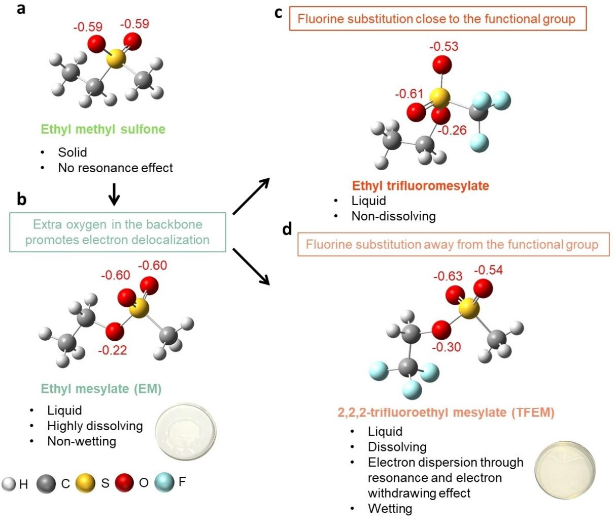
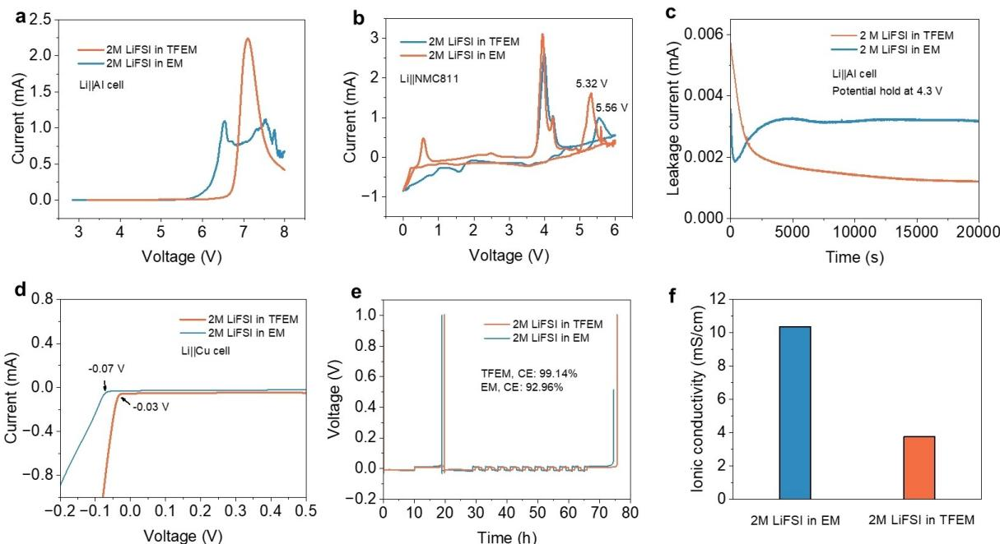
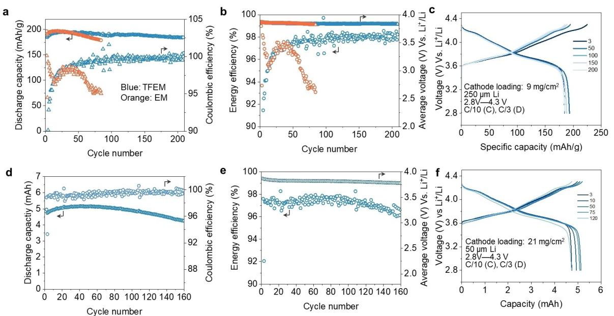
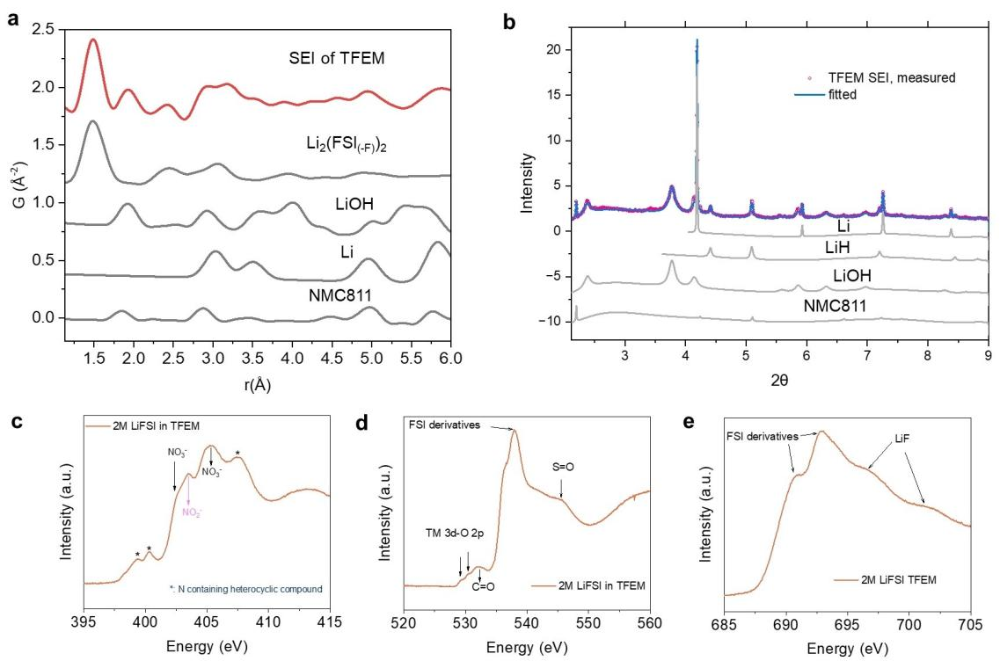

*Zuschriften*

*Lithium Batteries Very Important Paper*

Zitierweise: *Angew. Chem. Int. Ed.* **2023**, *62*, e202311051 [doi.org/10.1002/anie.202311051](https://doi.org/10.1002/anie.202311051)

## **Electron Delocalization Enables Sulfone-based Single-solvent Electrolyte for Lithium Metal Batteries**

*Muhammad Mominur Rahman and [Enyuan](http://orcid.org/0000-0002-1881-4534) Hu\**

**Abstract:** Li-metal batteries (LMB), although providing high energy density, face the grand challenge of identifying good electrolyte solvents for cycling. Common solvents are either only stable against lithium metal anode or only stable against LiNi*x*Mn*y*Co1-*x*-*y*O2 (NMC) cathode. There is significant effort trying to increase the cathode stability for ether electrolytes, which are in general stable against lithium metal anode. In comparison, there is much less effort trying to increase the anode stability of electrolytes that are stable against NMC cathode. One example is the sulfone-based electrolyte. It has good cathode stability but is hindered from practical application because of (1) high viscosity and poor wetting capability and (2) poor anode stability. Here, we solve these issues by modifying the sulfone molecules using resonance and electron withdrawing effect. The viscosity is significantly reduced by delocalizing the electrons through introducing additional oxygen on the molecular backbone and applying appropriate fluorination. The resulting molecule 2,2,2-trifluoroethyl mesylate (TFEM) has decreased Lewis basicity and less reactivity toward Li+. The electrolyte based on TFEM as single solvent enables cycling of LMB under harsh conditions of low N/P ratio (21 mg/cm2 NMC811 and 50 μm Li) with 90% capacity retention after 160 cycles at C/3 discharge rate.

*I*nterest in Li-metal batteries (LMB) has surged in recent years as they provide opportunities to significantly enhance the energy density of batteries.[1] Cells using high-energy NMC811 cathode and Li metal anode have almost doubled the energy density of commercial Li-ion batteries.[2] However, one of the biggest challenges facing LMB is to design electrolytes that are simultaneously stable with both electrodes.[3] Commercial carbonate-based electrolytes are not stable against Li metal anode,[4] whereas ether-based electrolytes are not stable against NMC cathodes.[5] One of the most popular strategies to design electrolytes for LMB is through formulating localized high-concentration electrolytes (LHCE).[6] LHCEs are usually high concentration electrolytes mixed with diluents,[78] The high salt concentration allows the lowest unoccupied molecular orbital

[\*] M. Mominur Rahman, E. Hu Chemistry Division, Brookhaven National Laboratory Upton, NY 11973 (USA) E-mail: enhu@bnl.gov

*Angew. Chem.* **2023**, *135*, e202311051 (1 of 6) © 2023 Wiley-VCH GmbH

(LUMO) to shift from solvent to salt anion, promoting the formation of anion-derived interphases. The diluents decrease the viscosity of the electrolyte and may help to form stable interphase in some cases.[8a] Meanwhile, electrolytes based on single salt and single solvent have been attractive as they may potentially be advantageous in large scale production. A successful example of such endeavor is the electrolyte based on lithium bis(fluorosulfonyl) imide (LiF-SI) salt and fluorinated ether solvent.[9] Fluorination weakens the solvent-solute interaction[9b] and lowers the highest occupied molecular orbital (HOMO) energy,[10] resulting in facile interfacial kinetics and enhanced oxidative stability. Following the similar design principles, variations of etherbased electrolytes have been reported with promising cyclability.[11]

Compared with the above efforts that address the oxidation stability issue of anode-stable solvents such as ethers, efforts on addressing the reduction stability issue of cathode-stable solvents have been lacking, especially for single salt and single solvent electrolyte. Cyclic carbonates usually have good cathode stability, and some research has been done for electrolyte with mixed carbonates. Fluorinating the solvent and applying additives led to enhanced cyclability.[12] So far, there is little or no effort on another type of cathode-stable solvents–sulfones. Sulfones are in general stable at high voltage and have been extensively explored for lithium-ion batteries (which use graphite as anode)[13] but with limited success. The major issues include anode instability, high viscosity and poor wetting capability.[14] When it comes to LMB, the anode instability is even worse considering the even lower reduction potential at the anode side. The sulfone molecules are in general reactive toward the lithium metal.[15] Due to the strong intermolecular interactions, sulfones usually have high melting points. For those sulfones that are liquid at room temperature, they invariantly have high viscosity and poor wetting capability.[14] There were previous efforts that try to address the issues by fluorinating the sulfones,[16] but the modification does not seem effective as considerable amount of additives need to be used to cycle the batteries.

In this study, we make strategic modifications on the sulfone molecules toward enabling sulfone-based single salt and single solvent electrolyte for LMB. We introduce an additional oxygen to the sulfone backbone to delocalize the electrons, leading to sulfonate molecules with much decreased melting point and viscosity. We address the anode instability issue by applying appropriate fluorination on the sulfonate molecule, rendering it much decreased Lewis basicity and reactivity with lithium metal anode. The 2 M

LiFSI in TFEM enables stable cycling of LMB under harsh conditions of high cathode loading (21 mg/cm2 ) and low N/P ratio.

Sulfones with small molecules are mostly solid at room temperature. One such example is the ethyl methyl sulfone (Figure 1a, Figure S1, and Table S1), which is the starting point for molecular modification in this study. Going from sulfone to sulfonate by introducing an additional oxygen in the backbone of the molecule delocalizes electrons in the sulfonate functional group (Figure 1b and Figure S2). The resulting ethyl methanesulfonate (Figure S1) is liquid at room temperature, likely due to the weakened intermolecular interaction resulting from reduced polarity of the molecules. As 'S' usually refers to sulfone in the electrolyte literature, we use 'M' to denote the methanesulfonate group (which is also known as mesylate) to avoid confusion. Ethyl methanesulfonate, or ethyl mesylate (EM) can dissolve Li salts such as Li bis-(fluorosulfonyl)imide (LiFSI) but the solvent is non-wetting to the commercial Celgard separator (Figure 1b). Fluorination is a well-known method to enhance wettability.[16] It can also enhance electrolyte stability through electron withdrawing effect leading to weakened solvent-solute interaction as well as modifying the HOMO–LUMO energy levels.[10] Introducing the CF3 group (Figure 1c) on the methyl end of the EM molecule indeed addresses the wettability issue. However, the CF3 group being at the immediate vicinity of the sulfonate functional group significantly reduces the solvation capability of the molecule due to the strong electron withdrawing effect (Figure S2).[9a] Instead, when the fluorination is performed on the terminal carbon of the ethyl group (Figure 1d), the wettability issue is still answered while maintaining the solvation capability of the molecule. The resulting 2,2,2 trifluoroethyl mesylate (TFEM) is liquid at room temperature (Table S1) and the electrolytes made by dissolving LiFSI salt at different concentrations in TFEM solvent (saturation point above 2 M) also maintains good wettability to the separator (Figure S3–S4).

*Figure 1.* Design strategy to enable sulfone-based single solvent electrolyte. (a) Ethyl methyl sulfone as the starting point for solvent design. (b) Additional oxygen in the backbone to induce electron delocalization through resonance. However, the solvent is nonwetting to the Celgard separator. (c-d) Strategic fluorination to impart solvent stability against the electrodes. Fluorination also promotes wettability. The numbers in each of the oxygen atoms indicate the partial negative charge on that atom.

*Angew. Chem.* **2023**, *135*, e202311051 (2 of 6) © 2023 Wiley-VCH GmbH

Resonance and electron withdrawal through fluorination modifies the HOMO–LUMO energy levels of the molecules (Figure S5 and S6). Ethyl methyl sulfone and EM already have very low HOMO energy level, which is much lower than the ether-based solvents.[11a] Fluorination of the sulfonate molecules further lowers the HOMO energy level to enhance the oxidative stability of the EM molecule (Figure S6). The practical oxidative stability of EM and TFEM electrolytes are measured in a Lij jAl cell, which shows that TFEM has higher oxidative decomposition potential (around 7 V) than EM (Figure 2a). This is further corroborated in a Lij jNMC811 cell, where the highest voltage peak of TFEM is higher than the EM electrolyte (Figure 2b). It should be noted that the oxidative decomposition potential is lower in the Lij jNMC811 cell in comparison to the Lij jAl cell. This could be due to the presence of NMC811 which catalyzes the electrolyte decomposition and reduces the onset of oxidative decomposition potential.[17] Leakage current measured at potential hold of 4.3 V shows lower current from the Lij jAl cell with the TFEM electrolyte, indicating suppressed parasitic side reactions at high voltage (Figure 2c). TFEM electrolyte also shows enhanced stability against Li metal anode. Although fluorination lowers LUMO energy which may decrease the anode stability (Figure S6), it will also lead to weaker solvent-solute interaction and allows facile reaction kinetics at the electrode interface.[9b] This should give rise to overall greater electrolyte stability as reported in previous studies.[9] Indeed, the Li plating/stripping overpotential is lower in a Lij jCu cell using the TFEM electrolyte than that using the non-fluorinated electrolyte (Figure 2d). The average Coulombic efficiency (CE)[18] of Li cycling is also significantly improved after fluorination (Figure 2e). The ionic conductivity of the electrolytes is measured in a Pt Pt cell.[19] Fluorination of EM leads to lower ionic conductivity due to weaker solvent-solute interaction (Figure 2f). The ionic conductivity of the TFEM electrolyte is comparable to some reported fluorinated ether electrolytes.[9b] Ionic conductivity of TFEM electrolyte shows slight variation and the one with 2 M LiFSI has the highest ionic conductivity (Figure S7). 2 M LiFSI in EM and TFEM electrolytes are further evaluated electrochemically in Lij jNMC811 cells.

LMB cycling is performed with NMC811 cathode and Li metal anode using EM and TFEM electrolytes at high and low N/P conditions. Stable cycling is achieved in high N/P LMB with 9 mg/cm2 loading NMC811 and 250 μm Li anode using TFEM electrolyte (Figure 3a). Gradual capacity fading is observed in EM electrolyte with low CE on cycling up to 80 cycles (Figure 3a). LMB with TFEM electrolyte retains more than 95% capacity even after 200 cycles. However, the CE in the cell with TFEM electrolyte and under high N/P condition gradually increases and stabilizes at more than 99.2% after 50 cycles, suggesting a slow activation process. Slow activation has also been reported in other fluorinated electrolytes, which is likely related to the small current density of cycling in high N/P cells as well as the solvent purity.[9b] Average voltage of the cells with TFEM electrolyte is more stable than the EM counterpart, indicating low

*Figure 2.* Electrochemical evaluation of EM and TFEM solvents with 2 M LiFSI as solute. (a) Oxidative stability limit of the electrolytes in a Lij jAl cell measured through linear scanning voltammetry. (b) Oxidative stability of the electrolytes measured in a Lij jNMC811 cell through cyclic voltammetry (highest potential: 6 V, lowest potential: 0 V). (c) Oxidative stability of the electrolytes evaluated through leakage current measurement in a Lij jAl cell. Potential of the cell was held at 4.3 V. (d) Li plating/stripping overpotential of the electrolytes measured in a Lij jCu cell. (d) Average Coulombic efficiency (CE) of Li plating/stripping measured in a Lij jCu cell through the Aurbach method. (f) Ionic conductivity of the electrolytes measured at room temperature.

*Angew. Chem.* **2023**, *135*, e202311051 (3 of 6) © 2023 Wiley-VCH GmbH

*Zuschriften*

*Figure 3.* Electrochemical performance of Li metal cells with EM and TFEM electrolytes. (a) Discharge capacity and CE, and (b) energy efficiency and average voltage of the high N/P LMBs containing the two electrolytes. (c) Charge-discharge curves of the high N/P LMB with the TFEM electrolyte. (d) Discharge capacity and CE, (e) energy efficiency and average voltage, and (f) charge–discharge curves of low N/P LMB with TFEM electrolyte.

voltage polarization (Figure 3b). Further evaluation of voltage polarization, which is presented as the average voltage difference between discharge and charge shows minimum voltage fading and hysteresis development in the high N/P LMB with the TFEM electrolyte (Figure S8). Energy efficiency also improves to around 98% after 50 cycles in the cell with TFEM electrolyte (Figure 3b). High energy efficiency suggests both low voltage hysteresis and good capacity retention. However, the energy efficiency of the cell with EM electrolyte shows gradual fading (Figure 3b). The charge–discharge curves of the high N/P cell with the TFEM electrolyte also point to lower voltage polarization (Figure 3c and Figure S9). The LMB performance in TFEM electrolyte is further evaluated in low N/P cells with 21 mg/cm2 NMC811 loading and 50 μm thick Li metal anode. Stable cycling is achieved at this harsh condition, with 90% capacity retention after 160 cycles at C/ 10 charge and C/3 discharge rate (Figure 3d). Fast activation with more than 99% CE is achieved within the first 2–3 cycles. A stable CE of more than 99.5% is maintained afterwards. A stable average discharge voltage is achieved on prolonged cycling, meaning minimum voltage polarization (Figure 3e). Discharge/charge voltage difference is also low upon prolonged cycling (Figure S10). A high energy efficiency (97.5%) is achieved, higher than the target energy efficiency (90–95%) to minimize charging cost (Figure 3e).[20] Low polarization can also be seen from the charge–discharge curves of the cell in Figure 3f.

The solid-electrolyte interphase (SEI) and cathodeelectrolyte interphase (CEI) of anode and cathode cycled in TFEM electrolytes after 80 cycles are characterized with Xray diffraction, pair distribution function, and soft X-ray

*Angew. Chem.* **2023**, *135*, e202311051 (4 of 6) © 2023 Wiley-VCH GmbH

absorption spectroscopy. PDF data (Figure 4a) shows that the SEI contains a lot of amorphous species derived from the decomposition of the FSI anion (unique peaks at around 1.5 Å and 2.3 Å). Since there are no peaks smaller than 1.5 Å, which usually originates from C O species, solvent decomposition derived species are minor components of the SEI. XRD pattern of the SEI (Figure 4b, Figure S11, and Table S2–S3) shows the presence of crystalline LiH and LiOH, which are typical SEI components of LMB. LiH and LiOH are also observed on the SEI of Li metal cycled in EM electrolyte (Figure S11, and Table S4). The source of LiOH can be from the native surface species of the pristine Li metal anode or residual water present in the electrolyte solvent. Although little LiF formation on the anode SEI is observed, the overall XRD and PDF analyses in Figure 4a–b show that the SEI components are mainly derived from salt decomposition in TFEM electrolyte consisting of both amorphous and crystalline components, which can potentially provide simultaneous mechanical stability and flexibility to the SEI to form a stable interphase. Interestingly, a small amount of NMC811 can be seen in the SEI (Figure 4b), which may result from the particle detachment from the cathode and subsequent crossover to the anode side. The presence of NMC811 may indicate a possible degradation pathway of high loading NMC811 cathode, which may require further attention in future to enable high energy LMB. N, F, and O K-edge spectra on the surface of the cathode materials (Figure 4c–e and S12–13) reveal oxidized nitrogen species,[21] N-containing heterocyclic species,[21–22] as well as FSI-derived[23] species and LiF[24] in both electrolyte systems. Oxidized nitrogen can be produced from the oxidation of the S N bond in

*Figure 4.* SEI and CEI characterization of electrodes cycled in TFEM electrolytes. (a) PDF, (b) XRD characterization of SEI components of Li metal anode cycled in low N/P Lij jNMC811 cell. (c) N K-edge, (d) O K-edge, and (e) F K-edge of the CEI species of NMC811 cathode.

LiFSI salt by highly reactive singlet oxygen, which forms on cathodes during charging as reported in previous studies.[25] FSI-derived species in the CEI contains similar functional group as the LiFSI salt as reported in a previous study from our group.[23] The likely species is the Li2(FSI(-F))2, which contains one less F than the two molecules of LiFSI it is derived from.[26] These species originate from salt decomposition, which may create a robust interphase on the cathode. The presence of these species may reveal why EM and TFEM are both high voltage stable. However, greater high voltage stability is achieved through TFEM electrolyte. Probing the oxidation states of the transition metals just beneath the CEI through soft XAS reveals that the oxidation states of the surface transition metals are more reversible in NMC811 cathodes cycled in TFEM electrolyte (Figure S14 and S15). Meanwhile, the surface transition metals appear to be more reduced in the cathode cycled in EM electrolyte (Figure S14).

In conclusion, we present a pathway of enabling sulfonebased single-solvent electrolytes for LMB. We show that the physical state of the solvent, and the solvent-solute interaction can be tuned through electron resonance by functional group redesign and electron withdrawing effect through fluorination. Such modifications lead to enhanced stability of the sulfone-based solvent against both electrodes. Namely the designed 2,2,2-trilfuoroethyl mesylate based single-solvent electrolyte led to much improved cyclability under practical conditions.

## *Acknowledgements*

The work at BNL is supported by the Assistant Secretary for Energy Efficiency and Renewable Energy (EERE), Vehicle Technology Office (VTO) of the US Department of Energy (DOE) through the Advanced Battery Materials Research (BMR) Program including the Battery500 Consortium under contract no. DE-SC0012704. This research used beamlines 23-ID-2 and 28-ID-2 of the National Synchrotron Light Source II, a US DOE Office of Science user facility operated for the DOE Office of Science by Brookhaven National Laboratory under contract number DE-SC0012704. We also acknowledge the electrode produced at the US DOE CAMP (Cell Analysis, Modeling and Prototyping) Facility, Argonne National Laboratory. The CAMP Facility is fully supported by the DOE Vehicle Technologies Office.

## *Conflict of Interest*

The authors declare no conflict of interest.

## *Data Availability Statement*

The data that support the findings of this study are available from the corresponding author upon reasonable request.

**Keywords:** Electrochemistry **·** Electrolytes **·** Fluorination **·** Li-Metal Batteries **·** Sulfone

- [1] B. Liu, J.-G. Zhang, W. Xu, *Joule* **2018**, *2*, [833–845](https://doi.org/10.1016/j.joule.2018.03.008).
- [2] J. Liu, Z. Bao, Y. Cui, E. J. Dufek, J. B. Goodenough, P. Khalifah, Q. Li, B. Y. Liaw, P. Liu, A. Manthiram, Y. S. Meng, V. R. Subramanian, M. F. Toney, V. V. Viswanathan, M. S. Whittingham, J. Xiao, W. Xu, J. Yang, X.-Q. Yang, J.-G. Zhang, *Nat. Energy* **2019**, *4*, [180–186.](https://doi.org/10.1038/s41560-019-0338-x)
- [3] H. Wang, Z. Yu, X. Kong, S. C. Kim, D. T. Boyle, J. Qin, Z. Bao, Y. Cui, *Joule* **2022**, *6*, [588–616.](https://doi.org/10.1016/j.joule.2021.12.018)
- [4] a) X. B. Cheng, R. Zhang, C. Z. Zhao, F. Wei, J. G. Zhang, Q. Zhang, *Adv. Sci.* **2016**, *3*, [1500213](https://doi.org/10.1002/advs.201500213); b) D. Aurbach, A. Zaban, Y. Gofer, Y. E. Ely, I. Weissman, O. Chusid, O. Abramson, *[J.](https://doi.org/10.1016/0378-7753(94)02044-4) Power [Sources](https://doi.org/10.1016/0378-7753(94)02044-4)* **1995**, *54*, 76–84.
- [5] a) S. Jiao, X. Ren, R. Cao, M. H. Engelhard, Y. Liu, D. Hu, D. Mei, J. Zheng, W. Zhao, Q. Li, N. Liu, B. D. Adams, C. Ma, J. Liu, J.-G. Zhang, W. Xu, *Nat. Energy* **2018**, *3*, [739–746;](https://doi.org/10.1038/s41560-018-0199-8) b) K. Hayashi, Y. Nemoto, S.-i. Tobishima, J.-i. Yamaki, *[Electro](https://doi.org/10.1016/S0013-4686(98)00374-0)chim. Acta* **1999**, *44*, [2337–2344](https://doi.org/10.1016/S0013-4686(98)00374-0); c) K. Xu, *[Chem.](https://doi.org/10.1021/cr030203g) Rev.* **2004**, *104*, [4303–4418.](https://doi.org/10.1021/cr030203g)
- [6] X. Cao, X. Ren, L. Zou, M. H. Engelhard, W. Huang, H. Wang, B. E. Matthews, H. Lee, C. Niu, B. W. Arey, Y. Cui, C. Wang, J. Xiao, J. Liu, W. Xu, J.-G. Zhang, *Nat. [Energy](https://doi.org/10.1038/s41560-019-0464-5)* **2019**, *4*, [796–805.](https://doi.org/10.1038/s41560-019-0464-5)
- [7] S. Perez Beltran, X. Cao, J.-G. Zhang, P. B. Balbuena, *[Chem.](https://doi.org/10.1021/acs.chemmater.0c00987) Mater.* **2020**, *32*, [5973–5984.](https://doi.org/10.1021/acs.chemmater.0c00987)
- [8] a) X. Cao, H. Jia, W. Xu, J.-G. Zhang, *J. [Electrochem.](https://doi.org/10.1149/1945-7111/abd60e) Soc.* **2021**, *168*, [010522](https://doi.org/10.1149/1945-7111/abd60e); b) S. Chen, J. Zheng, D. Mei, K. S. Han, M. H. Engelhard, W. Zhao, W. Xu, J. Liu, J. G. Zhang, *Adv. Mater.* **2018**, *30*, 1706102.
- [9] a) Z. Yu, P. E. Rudnicki, Z. Zhang, Z. Huang, H. Celik, S. T. Oyakhire, Y. Chen, X. Kong, S. C. Kim, X. Xiao, H. Wang, Y. Zheng, G. A. Kamat, M. S. Kim, S. F. Bent, J. Qin, Y. Cui, Z. Bao, *Nat. [Energy](https://doi.org/10.1038/s41560-021-00962-y)* **2022**, *7*, 94–106; b) Z. Yu, H. Wang, X. Kong, W. Huang, Y. Tsao, D. G. Mackanic, K. Wang, X. Wang, W. Huang, S. Choudhury, Y. Zheng, C. V. Amanchukwu, S. T. Hung, Y. Ma, E. G. Lomeli, J. Qin, Y. Cui, Z. Bao, *Nat. [Energy](https://doi.org/10.1038/s41560-020-0634-5)* **2020**, *5*, [526–533](https://doi.org/10.1038/s41560-020-0634-5).
- [10] N. von Aspern, G. V. Röschenthaler, M. Winter, I. Cekic-Laskovic, *Angew. Chem. Int. Ed.* **2019**, *58*, [15978–16000](https://doi.org/10.1002/anie.201901381).
- [11] a) G. Zhang, J. Chang, L. Wang, J. Li, C. Wang, R. Wang, G. Shi, K. Yu, W. Huang, H. Zheng, T. Wu, Y. Deng, J. Lu, *Nat. Commun.* **2023**, *14*, 1081; b) Y. Zhao, T. Zhou, D. Baster, M. El Kazzi, J. W. Choi, A. Coskun, *ACS [Energy](https://doi.org/10.1021/acsenergylett.3c01004) Lett.* **2023**, *8*, [3180–3187;](https://doi.org/10.1021/acsenergylett.3c01004) c) Y. Zhao, T. Zhou, M. Mensi, J. W. Choi, A. Coskun, *Nat. Commun.* **2023**, *14*, 299.
- [12] G.-X. Li, H. Jiang, R. Kou, D. Wang, A. Nguyen, M. Liao, P. Shi, A. Silver, D. Wang, *ACS Energy Lett.* **2022**, *7*, [2282–2288.](https://doi.org/10.1021/acsenergylett.2c01090)

[13] a) Y. Wang, L. Xing, W. Li, D. Bedrov, *J. Phys. [Chem.](https://doi.org/10.1021/jz401726p) Lett.* **2013**, *4*, [3992–3999](https://doi.org/10.1021/jz401726p); b) C.-C. Su, M. He, P. C. Redfern, L. A. Curtiss, I. A. Shkrob, Z. Zhang, *Energy [Environ.](https://doi.org/10.1039/C7EE00035A) Sci.* **2017**, *10*, [900–904](https://doi.org/10.1039/C7EE00035A); c) J. Alvarado, M. A. Schroeder, M. Zhang, O. Borodin, E. Gobrogge, M. Olguin, M. S. Ding, M. Gobet, S. Greenbaum, Y. S. Meng, *Mater. Today* **2018**, *21*, [341–353](https://doi.org/10.1016/j.mattod.2018.02.005).

*Angewandte*

*Chemie*

- [14] X. Ren, S. Chen, H. Lee, D. Mei, M. H. Engelhard, S. D. Burton, W. Zhao, J. Zheng, Q. Li, M. S. Ding, *[Chem](https://doi.org/10.1016/j.chempr.2018.05.002)* **2018**, *4*, [1877–1892](https://doi.org/10.1016/j.chempr.2018.05.002).
- [15] K. Xu, C. A. Angell, *J. [Electrochem.](https://doi.org/10.1149/1.1483866) Soc.* **2002**, *149*, A920.
- [16] C.-C. Su, M. He, J. Shi, R. Amine, Z. Yu, L. Cheng, J. Guo, K. Amine, *Energy Environ. Sci.* **2021**, *14*, [3029–3034.](https://doi.org/10.1039/D0EE03890C)
- [17] a) W. M. Dose, W. Li, I. Temprano, C. A. O'Keefe, B. L. Mehdi, M. F. De Volder, C. P. Grey, *ACS [Energy](https://doi.org/10.1021/acsenergylett.2c01722) Lett.* **2022**, *7*, [3524–3530](https://doi.org/10.1021/acsenergylett.2c01722); b) B. L. Rinkel, D. S. Hall, I. Temprano, C. P. Grey, *J. Am. Chem. Soc.* **2020**, *142*, [15058–15074](https://doi.org/10.1021/jacs.0c06363).
- [18] B. D. Adams, J. Zheng, X. Ren, W. Xu, J. G. Zhang, *Adv. Energy Mater.* **2018**, *8*, 1702097.
- [19] T. T. Hagos, B. Thirumalraj, C.-J. Huang, L. H. Abrha, T. M. Hagos, G. B. Berhe, H. K. Bezabh, J. Cherng, S.-F. Chiu, W.- N. Su, *ACS Appl. Mater. Interfaces* **2019**, *11*, [9955–9963](https://doi.org/10.1021/acsami.8b21052).
- [20] a) A. Eftekhari, *Sustain. Energy Fuels* **2017**, *1*, [2053–2060;](https://doi.org/10.1039/C7SE00350A) b) W. Li, E. M. Erickson, A. Manthiram, *Nat. [Energy](https://doi.org/10.1038/s41560-019-0513-0)* **2020**, *5*, [26–34](https://doi.org/10.1038/s41560-019-0513-0).
- [21] P. Leinweber, J. Kruse, F. L. Walley, A. Gillespie, K.-U. Eckhardt, R. I. R. Blyth, T. Regier, *J. [Synchrotron](https://doi.org/10.1107/S0909049507042513) Radiat.* **2007**, *14*, [500–511](https://doi.org/10.1107/S0909049507042513).
- [22] a) C. C. Fernández, D. Wechsler, T. C. Rocha, H.-P. Steinrück, O. Lytken, F. J. Williams, *J. Phys. Chem. C* **2019**, *123*, [10974–](https://doi.org/10.1021/acs.jpcc.9b01019) [10980](https://doi.org/10.1021/acs.jpcc.9b01019); b) H. Yabuta, M. Uesugi, H. Naraoka, M. Ito, A. Kilcoyne, S. A. Sandford, F. Kitajima, H. Mita, Y. Takano, T. Yada, *Earth Planets Space* **2014**, *66*, 156.
- [23] S. Tan, M. M. Rahman, Z. Wu, H. Liu, S. Wang, S. Ghose, H. Zhong, I. Waluyo, A. Hunt, P. Liu, X.-Q. Yang, E. Hu, *[ACS](https://doi.org/10.1021/acsenergylett.3c00281) Energy Lett.* **2023**, *8*, [2496–2504](https://doi.org/10.1021/acsenergylett.3c00281).
- [24] W. A. Caliebe, J. A. Soininen, E. L. Shirley, C. C. Kao, K. Hämäläinen, *Phys. Rev. Lett.* **2000**, *84*, [3907–3910.](https://doi.org/10.1103/PhysRevLett.84.3907)
- [25] a) T. Bartsch, F. Strauss, T. Hatsukade, A. Schiele, A.-Y. Kim, P. Hartmann, J. r. Janek, T. Brezesinski, *ACS [Energy](https://doi.org/10.1021/acsenergylett.8b01457) Lett.* **2018**, *3*, [2539–2543;](https://doi.org/10.1021/acsenergylett.8b01457) b) A. T. Freiberg, M. K. Roos, J. Wandt, R. de Vivie-Riedle, H. A. Gasteiger, *J. Phys. [Chem.](https://doi.org/10.1021/acs.jpca.8b08079) A* **2018**, *122*, [8828–8839](https://doi.org/10.1021/acs.jpca.8b08079); c) J. Wandt, A. T. Freiberg, A. Ogrodnik, H. A. Gasteiger, *Mater. Today* **2018**, *21*, [825–833](https://doi.org/10.1016/j.mattod.2018.03.037).
- [26] Z. Shadike, H. Lee, O. Borodin, X. Cao, X. Fan, X. Wang, R. Lin, S.-M. Bak, S. Ghose, K. Xu, C. Wang, J. Liu, J. Xiao, X.- Q. Yang, E. Hu, *Nat. [Nanotechnol.](https://doi.org/10.1038/s41565-020-00845-5)* **2021**, *16*, 549–554.

Manuscript received: August 1, 2023 Accepted manuscript online: September 13, 2023 Version of record online: September 25, 2023