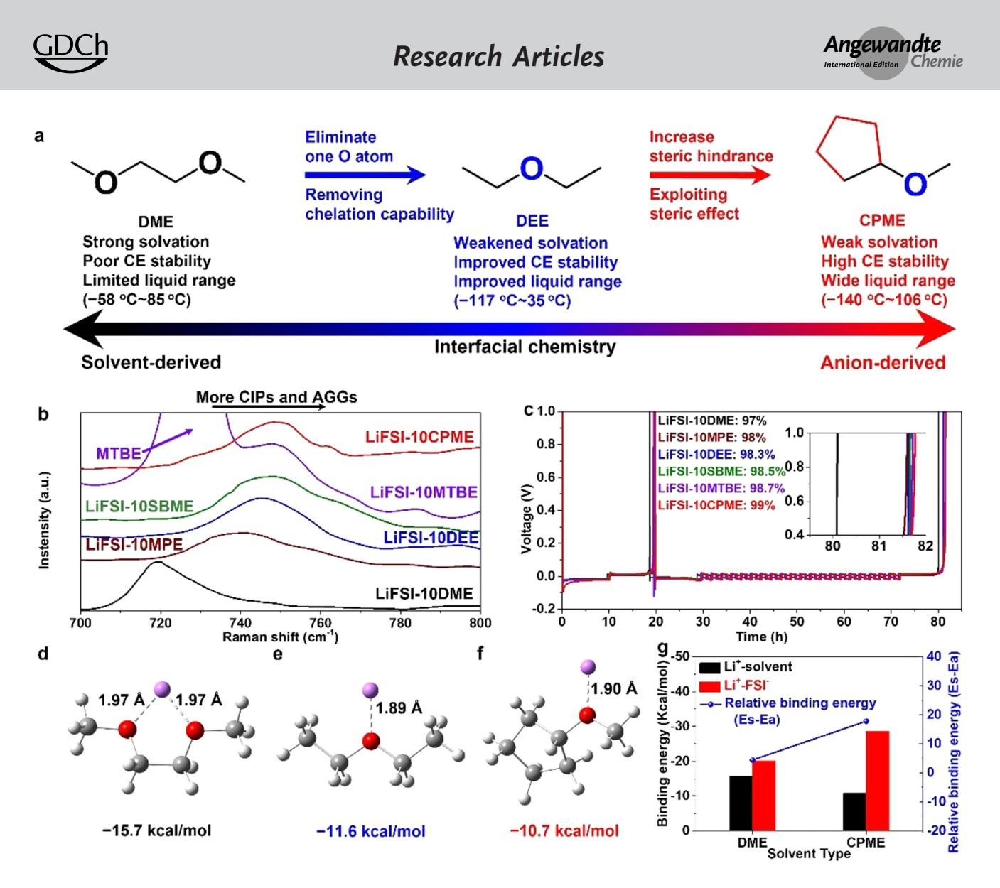
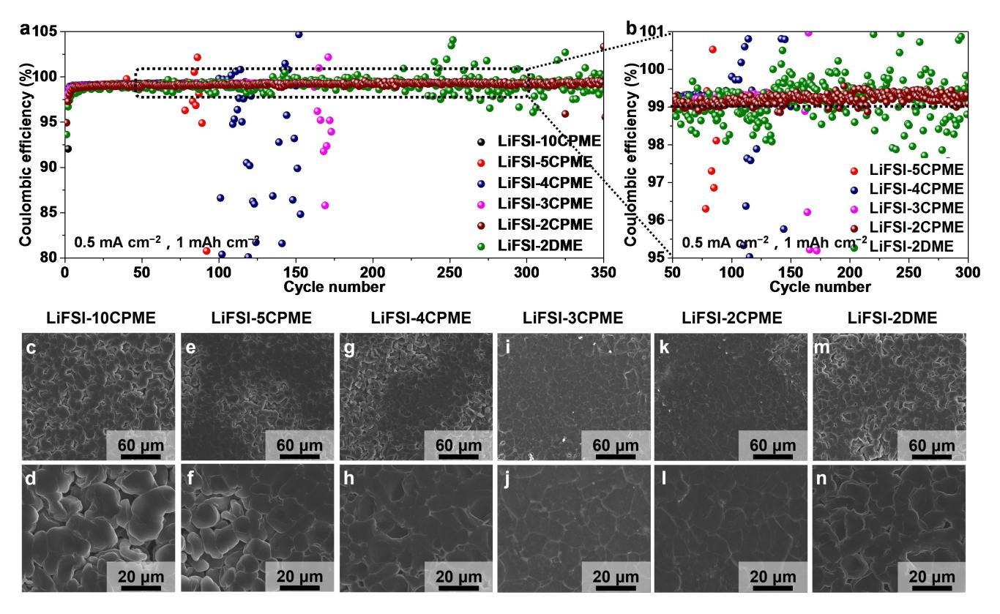
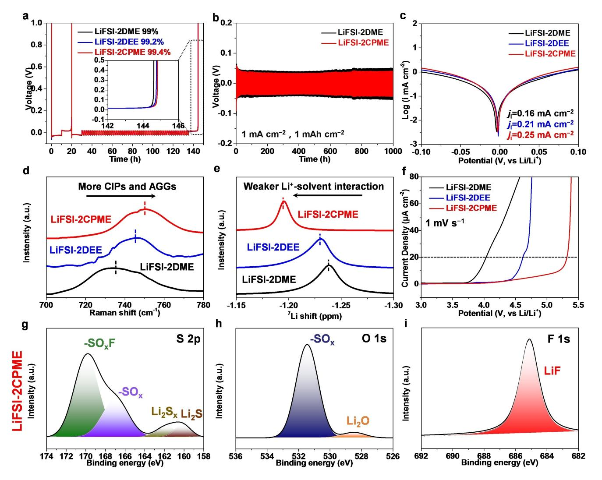
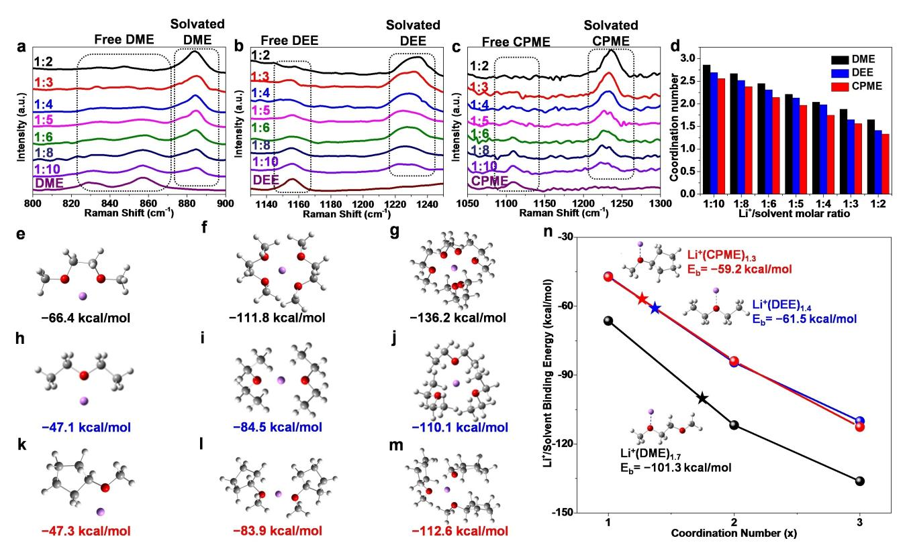

*Research Articles*

*Li Metal Batteries*

*Angewandte Chemie* www.angewandte.org

How to cite: *Angew. Chem. Int. Ed.* **2023,** *62,* e202300771 International Edition: [doi.org/10.1002/anie.202300771](https://doi.org/10.1002/anie.202300771) German Edition: [doi.org/10.1002/ange.202300771](https://doi.org/10.1002/ange.202300771)

# **Cyclopentylmethyl Ether, a Non-Fluorinated, Weakly Solvating and Wide Temperature Solvent for High-Performance Lithium Metal Battery**

*Han Zhang, Ziqi [Zeng](http://orcid.org/0000-0002-0539-6193),\* Fenfen Ma, Qiang Wu, Xinlan Wang, Shijie Cheng, and Jia [Xie](http://orcid.org/0000-0002-8731-295X)\**

**Abstract:** While recent work demonstrates the advantages of weakly solvating solvents in enhancing the cyclability of LMBs, both new designs and design strategies for high performance weakly solvating solvent, especially physicochemical properties, are still lacking. Here, we propose a molecular design to tune the solvating power and physicochemical properties of nonfluorinated ether solvent. The resulting cyclopentylmethyl ether (CPME) have a weak solvating power and wide liquid-phase temperature range. By optimizing the salt concentration, the CE is further promoted to 99.4%. Besides, the improved electrochemical performance of Li S battery in CPME-based electrolytes is obtained at 20 °C. The Lij jLFP (17.6 mgcm 2 ) battery with developed electrolyte maintains *>*90% of the original capacity over 400 cycles. Our design concept for solvent molecule provides a promising pathway to non-fluorinated electrolytes with weakly solvating power and wide temperature window for highenergy-density LMBs.

#### *Introduction*

Lithium metal batteries (LMBs) are intensively pursued as powerful alternatives for next-generation energy storage systems and are expected to achieve a high energy density beyond 500 Whkg 1 because lithium metal anode (LMA) possesses the highest theoretical specific capacity (3860 mAhg 1 ) and lowest redox potential ( 3.04 V vs. the

[\*] H. Zhang, Dr. Z. Zeng, Q. Wu, X. Wang, Prof. S. Cheng, Prof. J. Xie State Key Laboratory of Advanced Electromagnetic Engineering and Technology, School of Electrical and Electronic Engineering, Huazhong University of Science and Technology Wuhan 430074, Hubei (China) E-mail: ziqizeng@hust.edu.cn xiejia@hust.edu.cn H. Zhang, X. Wang State Key Laboratory of Materials Processing and Die & Mould Technology, School of Materials Science and Engineering, Huaz-

hong University of Science and Technology

Wuhan 430074, Hubei (China)

F. Ma GuSu Laboratory of Materials Suzhou 215123, Jiangsu (China)

*Angew. Chem. Int. Ed.* **2023**, *62*, e202300771 (1 of 9) © 2023 Wiley-VCH GmbH

standard hydrogen electrode).[1] However, the prolonged use of LMB is restricted by low Coulombic efficiency (CE) and Li-dendrite growth.[2] Such notorious issues is triggered by unstable and fragile solid electrolyte interphase (SEI) formation that worsens the irreversible Li loss and finally inferior cycle life.[3] Many of these challenges are related to the properties of electrolytes or their interface with nascent chemistry. Therefore, electrolyte engineering is regarded as one of the most promising and viable approaches to inhibit continuous parasitic reactions between LMA and electrolytes.[4] By tuning electrolyte composition, SEI structure and chemistry can be adjusted to enhance the CE and cyclability of LMBs.[5] In particular, "solvent-in-salt" electrolyte (high-concentration electrolyte (HCE) and diluted highconcentration electrolyte (DHCE)) stand out with a high average CE exceeding 99%.[6] These merits originate from the elimination of free solvents and the increment of ion clusters such as contact ion pairs (CIPs) and aggregates (AGGs) within the primary solvation sheath, resulting in anion-derived SEI.[7] Nevertheless, HCE and DHCE are usually too expensive to be used for commercial applications.[8] Therefore, the development of cost-effective electrolytes while still generating anion-derived SEI on LMA constitutes an essential challenge in advancing the practical LMBs.

As another competitive candidate, weakly solvating electrolyte (WSE) not only expresses superiority in terms of cost compared with HCE and DHCE, but also maintains anion-derived SEI.[9] WSE contains "weakly solvating power" solvents, which insufficiently dissociate lithium salts for partly separate cation and anion, showing weak interaction with Li+ and in turn permitting more anions to coordinate with Li+, forming abundant CIPs and AGGs.[10] In other words, WSE successfully induces a shift from solvent-derived interfacial chemistry to an anion-derived interfacial chemistry even under low salt concentrations (1 M). Besides, the "weakly solvating power" solvent is a relative definition, which is compared with DME in our work. Typically, it is well recognized that the chelation effect in ether and ester solvents make them possess strong solvating power. Rational molecular design of solvent is a feasible tactic to tune solvating power, including decreasing O atoms,[11] shortening main alkyl chain,[12] and increasing steric hindrance.[13] Although these solvents exhibit weakly solvating power, the poor physicochemical properties (low boiling point*<*60 °C and high melting point*>*0°C) present great challenges for their practical applications.[14] Beyond

solvent molecule tuning, fluorination is another critical strategy to regulate the solvating power with Li+ owing to the high electronegativity of  $F$ .[15] Fluorinated solvents not only lead to anion-derived SEI that dramatically improves electrochemical performance, but also significantly enhance physicochemical properties, allowing for stable operation over a wide temperature range. Despite these advances, high fluorine content in solvent is usually at the expense of high cost, high density, and great environmental burden. Consequently, designing weakly solvating solvents that are compatible with LMA while enabling non-fluorinated and wide liquid-phase temperature range is highly desirable.

Here, we present a novel molecular design to regulate the solvating power and physicochemical properties of nonfluorinated ether solvents. By eliminating one O atom and increasing steric hinderance, the solvating power of resulting cyclopentylmethyl ether (CPME) is significantly weakened. Meanwhile, CPME exhibits a lower melting point and higher boiling point around  $-140^{\circ}$ C and  $106^{\circ}$ C, respectively, showing a great prospect for wide temperature application. Even lithium bis(fluorosulfonyl)imide (LiFSI):CPME with a molar ratio of 1:10, the CPME-based electrolyte exhibits a controlled solvation structure, in which CIPs and AGGs prevail, leading to an anion-derived, inorganic-rich SEI and allowing for excellent compatibility with LMA (CE: 99%). Further optimizing the salt concentration, CE can be increased to 99.4%. Besides, the performance of CPMEbased electrolyte is further demonstrated in Li–S cell under  $-20$  °C. Moreover, when coupled with commercial LFP (loading:  $17.6 \text{ mg cm}^{-2}$ ), cells with developed electrolyte retains  $> 90\%$  of the initial capacity over 400 cycles. This work offers a new direction to design non-fluorinated electrolyte solvents with weakly solvating power and wide liquid-phase temperature range for high performance LMBs.

#### **Results and Discussion**

Despite strong solvating power and intrinsic reductive stability, the highly oxidizing nature, underperformed CE, low boiling point and medium melting point make DMEbased electrolytes incompatible with practical applications. Based on current insight on the role of anions in the prevail and anion-derived SEI, we present two critical design principles for non-fluorinated ether solvent to ensure high LMA compatibility as well as wide temperature range toward extreme temperature application. First, eliminating one from two O atoms in 1,2-dimethoxylethane (DME) to obtain diethyl ether (DEE). The motivation is to weaken the solvating power by removing chelation capability. Second, exploiting a cyclopentane ring to increase steric hinderance to further weaken the solvating power, which leads to cyclopentyl methyl ether (CPME) (Figure 1a). Therefore, we speculate that CPME is a possible weakly solvating solvent and could derive more favorable interfacial properties to achieve high CE stability. Beyond above features, cyclic alkyl groups tend to be more chemical stable than chain alkyl groups, showing a great perspective in

extreme temperature application (Table S1). To verify the design concepts and hypothesis, a series of ethereal solvents was investigated with a molar ratio of 1LiFSI: 10solvents. Raman was firstly applied to study the FSI- coordination environment in Figure 1b. The contact ion pairs (CIPs) and aggregates (AGGs) are more abundant in methyl propyl ether (MPE)-, DEE-, sec-butyl methyl ether (SBME)-, methyl tert-butyl ether (MTBE)-, and CPME-based electrolytes than in DME-based electrolytes, suggesting the weaker solvating power of MPE, DEE, SBME, MTBE, and CPME. Furthermore, the Li CE was measured by a modified Aurbach method.[16] in Figure 1c. The average CE of CPME-based electrolyte is up to 99% and overmatches that of other electrolytes, showing the improved stability of CPME over DME, MPE, DEE, SBME, and MTBE towards Li anode. Besides, the cycling performance of Li-Cu half cells (Figure S1) are consistent with those in Aurbach method. Generally speaking, the solvating power of solvents can be roughly estimated from the values of the dielectric constant. The lower this value is, the lower the solvating power of solvent will be. Theoretically, the solvating power decreased in the following order: DME ( $\varepsilon = 7.2$ )>CPME  $(\varepsilon=4.7)$  > DEE  $(\varepsilon=4.3)$  > MTBE  $(\varepsilon=2.6)$  in Table S2, and MTBE should show weakest solvating power than DME, CPME, and DEE. However, MTBE-based electrolytes don't express best electrochemical performance. Hence, the solvating power of solvent is not the lower the better in electrolytes. Insufficient solvation will cause ion cluster, poor ion motion and low solubility of salts, leading to large polarization and finally battery rapid failure in battery.[15b] Interestingly, our developed CPME-based successfully achieve a balance between solvating power and dielectric constant, affording the best electrochemical performance compared to other electrolytes. Despite DEE possess slightly smaller dielectric constant than CPME, the addition of five-ring component in CPME regulate the solvation of  $\text{Li}^+$  by decreasing the electron density on the  $-O-$  atoms[15a] and increasing steric hinderance simultaneously, leading to a weaker solvation power in CPME than in DEE. In addition, Linear scanning voltammetry (LSV) was conducted with Li | Al coin cells to explain structure-property correlations in depth. Figure S2 show that CPME-based electrolytes exhibit highest anti-oxidation capability toward other WSE and DME-based electrolytes, demonstrating that the cyclopentyl group in CPME is electrochemically more stable than alkoxy group in DME, MPE, DEE, SBME, and MTBE. Then, the binding energy of solvent-Li+ was investigated to evaluate solvating power. O with more negative charge is the binding site for  $Li^+$  in DME, DEE and CPME solvent (Figure 1d– 1f). Interestingly, the binding energy of DME- $Li^+$  $(-15.7 \text{ kcal mol}^{-1})$  is lower than DEE-Li+  $(-11.6 \text{ kcal mol}^{-1})$ and CPME-Li+ ( $-10.7$  kcal mol-1). Furthermore, a longer Li-O bond length was observed in the CPME-Li+. The theoretical calculation results indicate that the interactions between Li+ and CPME are weaker than DME and DEE, namely, CPME has lower solvating power than DME and DEE. To justify the weakly solvating power in CPME, density functional theory (DFT) calculations were further conducted to probe the molecular interactions between

*Figure 1.* (a) Step-by-step molecular design to tune solvation properties of solvent. (b) Raman spectra. (c) Aurbach CE tests. (d–f) The binding energies of Li+-DME, Li+-DEE and Li+-CPME complex. (g) The binding energies between Li+ and solvents/anions obtained by first-principles calculations.

anions/solvents and Li+. Specifically, the binding energy of Li+-solvent (ES) and Li+-anion (EA) complexes is calculated in Figure 1g and Figure S3. The value of ES-EA serves as a quantitative indicator to predict to what extent do anions intrude the primary solvation sheath of Li+. [9a] As result, the ES of Li+-DME ( 15.7 kcalmol 1 ) is significantly larger than that of Li+-CPME ( 10.7 kcalmol 1 ), and the EA in DME ( 20.1 kcalmol 1 ) is significantly smaller than that in CPME ( 28.6 kcalmol 1 ). Therefore, the ES-EA in DME (4.4 kcalmol 1 ) is significantly smaller than that in CPME (17.9 kcalmol 1 ), which is consistent with our previous standpoint. These results suggest that eliminating one O atom and introducing steric hinderance can indeed regulate the solvating power of non-fluorinated ether solvents, which in turn alters solvation structures of Li+.

Subsequently, we systematically investigated electrochemical performance of a series of CPME-based electrolyte with different LiFSI/CPME molar ratio. As the result of Li Cu cell at 0.5 mAcm 2 , 1 mAh cm 2 (Figure 2a–2b and

*Angew. Chem. Int. Ed.* **2023**, *62*, e202300771 (3 of 9) © 2023 Wiley-VCH GmbH

Figure S4), the higher the LiFSI/CPME molar ratio, the higher the CE. Concretely, the molar ratio of LiFSI: 2CPME (LiFSI-2CPME) is close to saturation (Figure S5). Li Cu cell in LiFSI-2CPME shows the highest CE and longest cycling performance (*>*99.3% after 350 cycles), demonstrating a superior CE than previously reports (Table S3). As shown in Figure 2b, a big fluctuation of CE up to �1% is observed in a molar ratio of LiFSI: 2DME (LiFSI-2DME), demonstrating the inferior stability toward LMA. To further study the compatibility with LMA, Li metal layers with 5 mAhcm 2 were plating on Cu foil in different electrolytes. Scanning electron microscopy (SEM) was applied to probe the morphology (Figure 2c-2n). These observations suggest that LiFSI-2CPME displays largest granular morphology, effectively alleviating parasitic reactions between LMA and electrolytes, thus renders to high and stable CE, long-time cyclic lifespan of LMA. Above results indicate that LiFSI-2CPME is an optimized choice for further studies. In addition, we investigated the physical

**Research Articles** 

**Figure 2.** (a–b) Li–Cu tests of various electrolytes at a current density of 0.5 mAcm-2, 1 mAh cm-2. (c–n) SEM images of deposited Li on Cu foil in the different electrolytes. (0.5 mA cm $-2$  for 5 mAh cm $-2$ ).

properties of CPME-based and DME-based electrolytes. A LiFSI-10CPME and LiFSI-2CPME deliver a lower density  $(0.96 \text{ g cm}^{-3} \text{ and } 1.23 \text{ g cm}^{-3})$  compared to LiFSI-10DME and LiFSI-2DME (0.99  $\text{g cm}^{-3}$  and 1.28  $\text{g cm}^{-3}$ ), which is promising to reduce the weight fraction of electrolytes in practical application (Table S4). The measured ionic conductivity (Figure S6) of DME-based electrolytes were found to be consistently higher than CPME-based electrolytes at  $-40-40$  °C, which is consistent with previous WSE reports.[11,15] Furthermore, Differential scanning calorimetry (DSC) was applied to examine the boiling and melting points of CPME-based and DME-based electrolytes. LiFSI-10DME electrolyte delivers noticeable endothermic peak in cold and heat condition at  $-24.5$  and  $118^{\circ}$ C (Figure S7a-S7b), showing the melting points and boiling points, respectively. Benefiting from much less relative number of organic solvents in LiFSI-2DME electrolyte, DSC results show no endothermic peak in cold condition until  $-60^{\circ}$ C and an endothermic peak in heat condition at 168°C (Figure S7c–S7d), showing higher boiling point and lower melting points.[17] Nevertheless, CPME-based electrolytes deliver no endothermic peak in cold condition (Figure S7e and S7g) and endothermic peaks in heat condition at  $168^{\circ}$ C (Figure S7f) and 194 $\degree$ C (Figure S7h), attributing to the well extended temperature range of liquid phase from  $-140$  °C to 106°C of CPME solvent. In order to better understand the cyclic lifespan of LMA in LiFSI-2CPME, Li plating/stripping stability was determined by a modified Aurbach method

Angew. Chem. Int. Ed. 2023, 62, e202300771 (4 of 9)

(Figure 3a). As a result, the average CE values suggest that LiFSI-2CPME (99.4%) is overmatched to LiFSI-2DEE (99.2%) and LiFSI-2DME (99%) in terms of LMA's reversibility. In addition, the Li-Li cells are assembled to estimate the cycling stability of LiFSI-2DME and LiFSI-2CPME with a measuring parameter of  $1 \text{ mAh cm}^{-2}$ , 1 mA cm $-2$  in Figure 3b. At a molar ratio of 1:2, both DMEbased and CPME-based electrolytes empower stable cycling over 1000 h without cell failure. Compared to LiFSI-2DME, the Li-Li cells in LiFSI-2CPME delivered a lower voltage hysteresis, demonstrating much better interfacial compatibility with LMA (Figure S8). Furthermore, interfacial Li+ kinetics is correlated with exchange current density  $(j_0)$ (Figure 3c). The  $j_0$  of LiFSI-2CPME (0.25 mA cm-2) is higher than that of LiFSI-2DEE  $(0.21 \text{ mA cm}^{-2})$  and LiFSI-2DME (0.16 mA cm $-2$ ), demonstrating reversible Li plating/ stripping and fast Li+-transfer kinetics. Moreover, the electrochemical impedance spectroscopy (EIS) is measured depending on the different cycles. The interfacial resistances and charge transfer resistance in LiFSI-2CPME are smaller than those of LiFSI-2DME regardless of the cycling state (Figure S9), which is highly consistent with above results. Raman was applied to examine the FSI- coordination environment (Figure 3d). While two electrolytes show plentiful ion clusters, LiFSI-2CPME exhibits more CIPs and AGGs than LiFSI-2DEE and LiFSI-2DME, which further demonstrates the weaker solvating power of CPME compared to DEE and DME. The nuclear magnetic resonance

*Research Articles*

*Figure 3.* (a) Aurbach CE tests of LiFSI-2CPME, LiFSI-2DEE and LiFSI-2DME. (b) Li Li cell tests of LiFSI-2CPME and LiFSI-2DME. (c) Tafel plots of Li plating/stripping in LiFSI-2CPME, LiFSI-2DEE and LiFSI-2DME. (d) Raman spectra of LiFSI-2CPME, LiFSI-2DEE and LiFSI-2DME. (e) 7 Li NMR of LiFSI-2CPME, LiFSI-2DEE and LiFSI-2DME. (f) LSV plots of LiFSI-2CPME, LiFSI-2DEE and LiFSI-2DME. XPS of deposited Li in LiFSI-2CPME (g) S 2p, (h) O 1s, (i) F 1s.

(NMR) spectroscopy was further applied to study the solvation structures of LiFSI-2CPME, LiFSI-2DEE and LiFSI-2DME. The 7 Li NMR spectrum of different electrolytes are shown in Figure 3e, where LiFSI-2DME displays an upfield shifting. This result can be attributed to the strong chelation of two O atoms in DME molecular, leading to a gathering of electron cloud around Li+. To sum up, NMR results show that the Li+-anions interaction in LiFSI-2CPME is stronger than that of LiFSI-2DEE and LiFSI 2DME. In other words, the Li+-CPME interaction is weaker than that of Li+-DEE and Li+-DME. In addition, linear sweep voltammetry (LSV) was examined to evaluate the oxidative stability of different electrolytes. LiFSI-2CPME presents stronger anti-oxidation capability than LiFSI-2DEE and LiFSI-2DME (Figure 3f), corresponding to the abundant ion pairing in CPME-based electrolyte. The composition of SEI was characterized by X-ray photoelectron spectroscopy (XPS). The species in LiFSI-2CPME (Figure 3g–3i and Figure S10a–10c) are near identical to that in LiFSI-2DME due to similar reaction path for ether-based electrolytes. Interestingly, more inorganic components (Li2S, Li2O and LiF) can be detected in LiFSI-2CPME sample. These results demonstrate that the benefits of the ideal decomposition anions to derive the passive film, which is possessed with great interfacial Li+ ion transport, resulting in dense Li deposits, high CE, and long lifespan.

To further certify the detailed mechanism for the improved electrochemical performance, Raman vibrational spectroscopy of free and coordinated solvents as the function of the salt concentration at Li+/solvent molar ratios from 1: 10 to 1: 2 in DME, DEE and CPME electrolytes were investigated (Figure 4a–4c).

With the addition of LiFSI, new bands appeared at �870–890 cm 1 , �1220–1240 cm 1 and �1210–1260 cm 1 can be attributed to the coordination of DME, DEE and CPME with Li+, respectively. As MRs increase, free DME,

*Angew. Chem. Int. Ed.* **2023**, *62*, e202300771 (5 of 9) © 2023 Wiley-VCH GmbH

*Research Articles*

#### *Angewandte Chemie*

*Figure 4.* Raman analysis of (a) LiFSI-DME in the region from 800 to 900 cm 1 and (b) LiFSI-DEE electrolytes in the region from 1120 to 1260 cm 1 . (c) LiFSI-CPME electrolytes in the region from 1050 to 1300 cm 1 (d) Solvation numbers in different molar ratios electrolytes derived from Raman spectra. Optimized structures and calculated binding energies of Li+(solvent)n coordination complexes for: Li+(DME)n (e) *n*=1, (f) *n*=2, (g) *n*=3, Li+(DEE)n (h) *n*=1, (i) *n*=2, (j) *n*=3 and Li+(CPME)n (k) *n*=1, (l) *n*=2, (m) *n*=3. (n) Corresponding binding energies for both systems. Li+(CPME)1.3, Li+(DEE)1.4 and Li+(DME)1.7 values were calculated via linear interpolation.

DEE and CPME transform into coordinated DME, DEE and CPME. To obtain an accurate coordination number (CN) value for each solvent, we deconvoluted the Raman peaks of the free and coordinated solvents into Voigt (Gaussian-Lorentz) functions to calculate the CN by integrating peak areas (Figure 4d).[18] At the same MRs, the CN of CPME-based electrolytes is smaller than that of DEEbased and DME-based electrolytes, suggesting that the interaction between CPME and Li+ is weaker than DEE and Li+ DME and Li+. Then, the density functional theory (DFT) calculations were applied to probe the interactions between solvents and Li+, which were expressed in terms of binding energy (Eb). For the purposes of this study, it's determined that the Eb difference between DME, DEE and CPME persists in Li+(DME)n, Li+(DEE)n and Li+(CPME)n coordination complexes when *n*=1–3. As shown in Figures 4e-4 m, Li+ manifests stronger interactions with DME than DEE and CPME regardless of the coordination number. Noteworthy, Li+ manifests stronger interactions with CPME than DEE in 1 and 3 coordination number, which is consistent with dielectric constant. Nevertheless, each Li+ is surrounded by 1.7 DME molecule, 1.4 DEEE molecule and 1.3 CPME molecule in LiFSI-2DME, LiFSI-2DEE and LiFSI-2CPME electrolytes. Therefore, we conjecture that the specific solvation structure is determined by a combination of the dielectric constant and the molecular geometries of the solvent. As shown in Figures 4n, the Eb of the Li+(solvent)n complexes are assessed via calculations, which yields Eb of 101.3, 61.5 and 59.2 kcalmol 1 for the Li+(DME)1.7 Li+(DEE)1.4 and Li+(CPME)1.3 complexes (average coordination numbers from Raman), respectively. Theoretically, compared to DME-based and DEE-based electrolytes, CPME-based electrolytes contain less and weaker coordination solvent in the solvation sheath. Therefore, we contend that this stark difference in binding energy leads to excellently homogeneous deposition behaviors and highly improved compatibility with LMA in the CPME system.

Lithium metal batteries call for a wide operating temperature range for realistic application. Figure 5a and Figure S11 displays a significantly enhanced rate performance of cells in LiFSI-2CPME at 20 °C. For the LiFSI-2DME, the coin cells show sharp drops in battery capacity. In addition, a good cyclability with a capacity retention of 98% over 50 cycles under 0.2 C charging/0.3 C discharging is obtained with LiFSI-2CPME at 20 °C, compared to an insufficient capacity in LiFSI-2DME (Figure 5b–5c, Figure S12). To eliminate the effect of high viscosity on electrochemical properties in low temperature, we also measured rate performance of Li S batteries toward LiFSI-5CPME under 20 °C, providing similar results to that in LiFSI-2CPME (Figure S13–S14). Moreover, the cell exhibits a

*Research Articles*

*Figure 5.* (a) Rate and (b) Long-term cycling performance of Li S batteries toward LiFSI-2DME and LiFSI-2CPME at 20 °C (SPAN loading: 1.3 mgcm 2 ). (c) The charge–discharge curves of Li S batteries in LiFSI-2CPME at 20 °C. (d) Rate and (e) Long-term cycling performance of Li-LFP batteries toward LiFSI-2DME and LiFSI-2CPME (LFP loading: 1 mg cm 2 ). (f) The charge–discharge curves of Li-LFP cell in LiFSI-2CPME. (g) Cycling performance of Li-LFP coin cells in different electrolytes (commercial LFP mass loading: 17.6 mg cm 2 ).

prolong cycling performance with a capacity retention of 60% over 100 cycles at 0.5 C. In contrast, the Li S battery shows a rapid capacity decay in LiFSI-5DME (Figure S15– S16). These results imply a huge potential of CPME in application over a wide temperature range. In order to demonstrate the compatibility between the designed electrolyte and LMA, the performance of Li-LiFePO4 (LFP) cell was further examined. The Li-LFP cell shows a great rate capability in LiFSI-2CPME (Figure 5d and Figure S17) on account of the sound interfacial chemistry. Besides, longterm cycling performance of the Li-LFP cell was conducted with 1 C charge and 2 C discharge. Surprisingly, the cell containing LiFSI-2CPME exhibits superb cycling performance, achieving a capacity retention near 100% after 600 cycles (Figure 5e-5f and Figure S18). Given that a high areal mass loading causes a series of rigorous adverse reaction, full cells were assembled with commercial LFP cathode (loading: 17.6 mgcm 2 ) to evaluate the potential of CPMEbased electrolytes in practical LMBs. The Li-LFP full cell

*Angew. Chem. Int. Ed.* **2023**, *62*, e202300771 (7 of 9) © 2023 Wiley-VCH GmbH

suffers rapid capacity decay and increased voltage polarization in LiFSI-2DME (Figure S19a). In contrast, a significant enhanced performance can be observed in LiFSI-2CPME (Figure 5g and Figure S19b), indicating durable SEI formed and less parasitic reactions occur.

#### *Conclusion*

In this work, an original molecular design is reported to tailor the solvating power and physicochemical properties of non-fluorinated ether solvent. It is found that eliminating one O atom and exploiting the steric effect led to CPME with significantly weakened solvating power and greatly improved physicochemical properties. When serving as the single-solvent for electrolyte, a unique CIP- and AGG-rich solvation structures is induced at low salt concentration. Benefiting from the anion-derived SEI, a high CE of 99% in LiFSI-10CPME is attained. By further optimizing the salt

*Angewandte*

*Chemie*

concentration, Li Cu cells exhibit outstanding CE during long-term cycling (*>*99.3% after 350 cycles). Moreover, the excellent electrochemical performance of Li S battery in CPME-based electrolytes is obtained at 20°C as a result of the wide liquid-phase temperature range of CPME. Interestingly, the Lij jLFP (17.6 mgcm 2 ) full battery affords *>*90% of the initial capacity over 400 cycles. Such molecular design provides a new direction of electrolyte engineering beyond fluorination for high-performance Li metal batteries.

### *Acknowledgements*

This work was supported by the National Natural Science Foundation of China (Nos. 21975087, 22008082). The authors gratefully acknowledge the Analytical and Testing Center of HUST for allowing us to use its facilities. The authors thank Shiyanjia Lab ([www.shiyanjia.com\)](http://www.shiyanjia.com) for the NMR test.

## *Conflict of Interest*

The authors declare no conflict of interest.

## *Data Availability Statement*

The data that support the findings of this study are available from the corresponding author upon reasonable request.

**Keywords:** Cyclopentylmethyl Ether **·** Molecular Design **·** Non-Fluorinated Solvent **·** Weakly Solvating Power **·** Wide Temperature Range

- [1] a) J. Liu, Z. Bao, Y. Cui, E. J. Dufek, J. B. Goodenough, P. Khalifah, Q. Li, B. Y. Liaw, P. Liu, A. Manthiram, Y. S. Meng, V. R. Subramanian, M. F. Toney, V. V. Viswanathan, M. S. Whittingham, J. Xiao, W. Xu, J. Yang, X.-Q. Yang, J.-G. Zhang, *Nat. Energy* **2019**, *4*, [180–186](https://doi.org/10.1038/s41560-019-0338-x); b) P. Albertus, S. Babinec, S. Litzelman, A. Newman, *Nat. Energy* **2018**, *3*, 16–21; c) S. Yuan, T. Kong, Y. Zhang, P. Dong, Y. Zhang, X. Dong, Y. Wang, Y. Xia, *[Angew.](https://doi.org/10.1002/anie.202108397) Chem. Int. Ed.* **2021**, *60*, 25624– [25638.](https://doi.org/10.1002/anie.202108397)
- [2] a) H. Liu, X. Sun, X.-B. Cheng, C. Guo, F. Yu, W. Bao, T. Wang, J. Li, Q. Zhang, *Adv. Energy Mater.* **2022**, *12*, [2202518;](https://doi.org/10.1002/aenm.202202518) b) Y. Cao, M. Li, J. Lu, J. Liu, K. Amine, *Nat. [Nanotechnol.](https://doi.org/10.1038/s41565-019-0371-8)* **2019**, *14*, [200–207;](https://doi.org/10.1038/s41565-019-0371-8) c) S. Cao, X. He, L. Nie, J. Hu, M. Chen, Y. Han, K. Wang, K. Jiang, M. Zhou, *Adv. Sci.* **2022**, *9*, [2201147;](https://doi.org/10.1002/advs.202201147) d) H. Zhang, Z. Zeng, M. Liu, F. Ma, M. Qin, X. Wang, Y. Wu, S. Lei, S. Cheng, J. Xie, *Chem. Sci.* **2023**, *14*, [2745–2754.](https://doi.org/10.1039/D2SC06620C)
- [3] a) Z. Jiang, L. Jin, Z. Han, W. Hu, Z. Zeng, Y. Sun, J. Xie, *Angew. Chem. Int. Ed.* **2019**, *58*, [11374–11378](https://doi.org/10.1002/anie.201905712); b) H. Zhang, Z. Zeng, F. Ma, X. Wang, Y. Wu, M. Liu, R. He, S. Cheng, J. Xie, *Adv. Funct. Mater.* **2022**, *33*, 2212000; c) C. Fang, J. Li, M. Zhang, Y. Zhang, F. Yang, J. Z. Lee, M.-H. Lee, J. Alvarado, M. A. Schroeder, Y. Yang, B. Lu, N. Williams, M. Ceja, L. Yang, M. Cai, J. Gu, K. Xu, X. Wang, Y. S. Meng, *[Nature](https://doi.org/10.1038/s41586-019-1481-z)* **2019**, *572*, [511–515.](https://doi.org/10.1038/s41586-019-1481-z)
- [4] a) N. Sun, R. Li, Y. Zhao, H. Zhang, J. Chen, J. Xu, Z. Li, X. Fan, X. Yao, Z. Peng, *Adv. Energy Mater.* **2022**, *12*, [2200621;](https://doi.org/10.1002/aenm.202200621)

*Angew. Chem. Int. Ed.* **2023**, *62*, e202300771 (8 of 9) © 2023 Wiley-VCH GmbH

b) H. Wang, Z. Yu, X. Kong, W. Huang, Z. Zhang, D. G. Mackanic, X. Huang, J. Qin, Z. Bao, Y. Cui, *Adv. [Mater.](https://doi.org/10.1002/adma.202008619)* **2021**, *33*, [2008619](https://doi.org/10.1002/adma.202008619); c) C. V. Amanchukwu, Z. Yu, X. Kong, J. Qin, Y. Cui, Z. Bao, *J. Am. Chem. Soc.* **2020**, *142*, [7393–7403](https://doi.org/10.1021/jacs.9b11056).

- [5] a) Q.-K. Zhang, X.-Q. Zhang, L.-P. Hou, S.-Y. Sun, Y.-X. Zhan, J.-L. Liang, F.-S. Zhang, X.-N. Feng, B.-Q. Li, J.-Q. Huang, *Adv. Energy Mater.* **2022**, *12*, [2200139;](https://doi.org/10.1002/aenm.202200139) b) H. Zhang, Z. Zeng, R. He, Y. Wu, W. Hu, S. Lei, M. Liu, S. Cheng, J. Xie, *Energy Storage Mater.* **2022**, *48*, [393–402](https://doi.org/10.1016/j.ensm.2022.03.034); c) X. Fan, X. Ji, L. Chen, J. Chen, T. Deng, F. Han, J. Yue, N. Piao, R. Wang, X. Zhou, X. Xiao, L. Chen, C. Wang, *Nat. [Energy](https://doi.org/10.1038/s41560-019-0474-3)* **2019**, *4*, 882– [890](https://doi.org/10.1038/s41560-019-0474-3).
- [6] a) Q. Liu, Y. Liu, Z. Chen, Q. Ma, Y. Hong, J. Wang, Y. Xu, W. Zhao, Z. Hu, X. Hong, J. Wang, X. Fan, H. B. Wu, *Adv. Funct. Mater.* **2022**, *33*, 2209725; b) Z. Zeng, V. Murugesan, K. S. Han, X. Jiang, Y. Cao, L. Xiao, X. Ai, H. Yang, J.-G. Zhang, M. L. Sushko, J. Liu, *Nat. Energy* **2018**, *3*, [674–681;](https://doi.org/10.1038/s41560-018-0196-y) c) Z. Jiang, Z. Zeng, X. Liang, L. Yang, W. Hu, C. Zhang, Z. Han, J. Feng, J. Xie, *Adv. Funct. Mater.* **2021**, *31*, [2005991](https://doi.org/10.1002/adfm.202005991).
- [7] a) L. Tan, S. Chen, Y. Chen, J. Fan, D. Ruan, Q. Nian, L. Chen, S. Jiao, X. Ren, *Angew. Chem. Int. Ed.* **2022**, *61*, e202203693; b) X. Cao, X. Ren, L. Zou, M. H. Engelhard, W. Huang, H. Wang, B. E. Matthews, H. Lee, C. Niu, B. W. Arey, Y. Cui, C. Wang, J. Xiao, J. Liu, W. Xu, J.-G. Zhang, *[Nat.](https://doi.org/10.1038/s41560-019-0464-5) Energy* **2019**, *4*, [796–805;](https://doi.org/10.1038/s41560-019-0464-5) c) X. Ren, L. Zou, X. Cao, M. H. Engelhard, W. Liu, S. D. Burton, H. Lee, C. Niu, B. E. Matthews, Z. Zhu, C. Wang, B. W. Arey, J. Xiao, J. Liu, J.-G. Zhang, W. Xu, *Joule* **2019**, *3*, [1662–1676.](https://doi.org/10.1016/j.joule.2019.05.006)
- [8] a) C. Zhang, S. Gu, D. Zhang, J. Ma, H. Zheng, M. Zheng, R. Lv, K. Yu, J. Wu, X. Wang, Q.-H. Yang, F. Kang, W. Lv, *Energy Storage Mater.* **2022**, *52*, [355–364;](https://doi.org/10.1016/j.ensm.2022.08.018) b) Z. Jiang, Z. Zeng, W. Hu, Z. Han, S. Cheng, J. Xie, *Energy [Storage](https://doi.org/10.1016/j.ensm.2021.01.008) Mater.* **2021**, *36*, [333–340;](https://doi.org/10.1016/j.ensm.2021.01.008) c) D.-J. Yoo, S. Yang, K. J. Kim, J. W. Choi, *Angew. Chem. Int. Ed.* **2020**, *59*, [14869–14876](https://doi.org/10.1002/anie.202003663).
- [9] a) Y.-X. Yao, X. Chen, C. Yan, X.-Q. Zhang, W.-L. Cai, J.-Q. Huang, Q. Zhang, *Angew. Chem. Int. Ed.* **2021**, *60*, [4090–4097;](https://doi.org/10.1002/anie.202011482) b) C. V. Amanchukwu, X. Kong, J. Qin, Y. Cui, Z. Bao, *[Adv.](https://doi.org/10.1002/aenm.201902116) Energy Mater.* **2019**, *9*, [1902116;](https://doi.org/10.1002/aenm.201902116) c) T. D. Pham, K.-K. Lee, *Small* **2021**, *17*, [2100133](https://doi.org/10.1002/smll.202100133).
- [10] a) Y. Huang, R. Li, S. Weng, H. Zhang, C. Zhu, D. Lu, C. Sun, X. Huang, T. Deng, L. Fan, L. Chen, X. Wang, X. Fan, *[Energy](https://doi.org/10.1039/D2EE01756C) Environ. Sci.* **2022**, *15*, [4349–4361](https://doi.org/10.1039/D2EE01756C); b) Z. Yu, H. Wang, X. Kong, W. Huang, Y. Tsao, D. G. Mackanic, K. Wang, X. Wang, W. Huang, S. Choudhury, Y. Zheng, C. V. Amanchukwu, S. T. Hung, Y. Ma, E. G. Lomeli, J. Qin, Y. Cui, Z. Bao, *Nat. [Energy](https://doi.org/10.1038/s41560-020-0634-5)* **2020**, *5*, [526–533](https://doi.org/10.1038/s41560-020-0634-5).
- [11] J. Holoubek, H. Liu, Z. Wu, Y. Yin, X. Xing, G. Cai, S. Yu, H. Zhou, T. A. Pascal, Z. Chen, P. Liu, *Nat. [Energy](https://doi.org/10.1038/s41560-021-00783-z)* **2021**, *6*, 303– [313](https://doi.org/10.1038/s41560-021-00783-z).
- [12] T. Ma, Y. Ni, Q. Wang, W. Zhang, S. Jin, S. Zheng, X. Yang, Y. Hou, Z. Tao, J. Chen, *Angew. Chem. Int. Ed.* **2022**, *61*, e202207927.
- [13] a) Y. Chen, Z. Yu, P. Rudnicki, H. Gong, Z. Huang, S. C. Kim, J.-C. Lai, X. Kong, J. Qin, Y. Cui, Z. Bao, *J. Am. [Chem.](https://doi.org/10.1021/jacs.1c09006) Soc.* **2021**, *143*, [18703–18713](https://doi.org/10.1021/jacs.1c09006); b) E. Park, J. Park, K. Lee, Y. Zhao, T. Zhou, G. Park, M.-G. Jeong, M. Choi, D.-J. Yoo, H.-G. Jung, A. Coskun, J. W. Choi, *ACS Energy Lett.* **2022**, *7*, 179– 188.
- [14] Y. Zhao, T. Zhou, T. Ashirov, M. E. Kazzi, C. Cancellieri, L. P. H. Jeurgens, J. W. Choi, A. Coskun, *Nat. Commun.* **2022**, *13*, 2575.
- [15] a) T. Zhou, Y. Zhao, M. El Kazzi, J. W. Choi, A. Coskun, *Angew. Chem. Int. Ed.* **2022**, *61*, e202115884; b) Z. Yu, P. E. Rudnicki, Z. Zhang, Z. Huang, H. Celik, S. T. Oyakhire, Y. Chen, X. Kong, S. C. Kim, X. Xiao, H. Wang, Y. Zheng, G. A. Kamat, M. S. Kim, S. F. Bent, J. Qin, Y. Cui, Z. Bao, *[Nat.](https://doi.org/10.1038/s41560-021-00962-y) [Energy](https://doi.org/10.1038/s41560-021-00962-y)* **2022**, *7*, 94–106.

- [16] B. D. Adams, J. Zheng, X. Ren, W. Xu, J.-G. Zhang, *[Adv.](https://doi.org/10.1002/aenm.201702097) Energy Mater.* **2018**, *8*, [1702097.](https://doi.org/10.1002/aenm.201702097)
- [17] Y. Yamada, J. Wang, S. Ko, E. Watanabe, A. Yamada, *[Nat.](https://doi.org/10.1038/s41560-019-0336-z) Energy* **2019**, *4*, [269–280](https://doi.org/10.1038/s41560-019-0336-z).
- [18] a) X. Liu, X. Shen, L. Luo, F. Zhong, X. Ai, H. Yang, Y. Cao, *ACS Energy Lett.* **2021**, *6*, [4282–4290](https://doi.org/10.1021/acsenergylett.1c02194); b) D. M. Seo, O. Borodin, S.-D. Han, P. D. Boyle, W. A. Henderson, *J. [Electro-](https://doi.org/10.1149/2.035209jes)*

*chem. Soc.* **2012**, *159*, [A1489](https://doi.org/10.1149/2.035209jes); c) T. D. Pham, A. Bin Faheem, J. Kim, H. M. Oh, K.-K. Lee, *Small* **2022**, *18*, [2107492.](https://doi.org/10.1002/smll.202107492)

Manuscript received: January 15, 2023 Accepted manuscript online: March 22, 2023 Version of record online: April 18, 2023