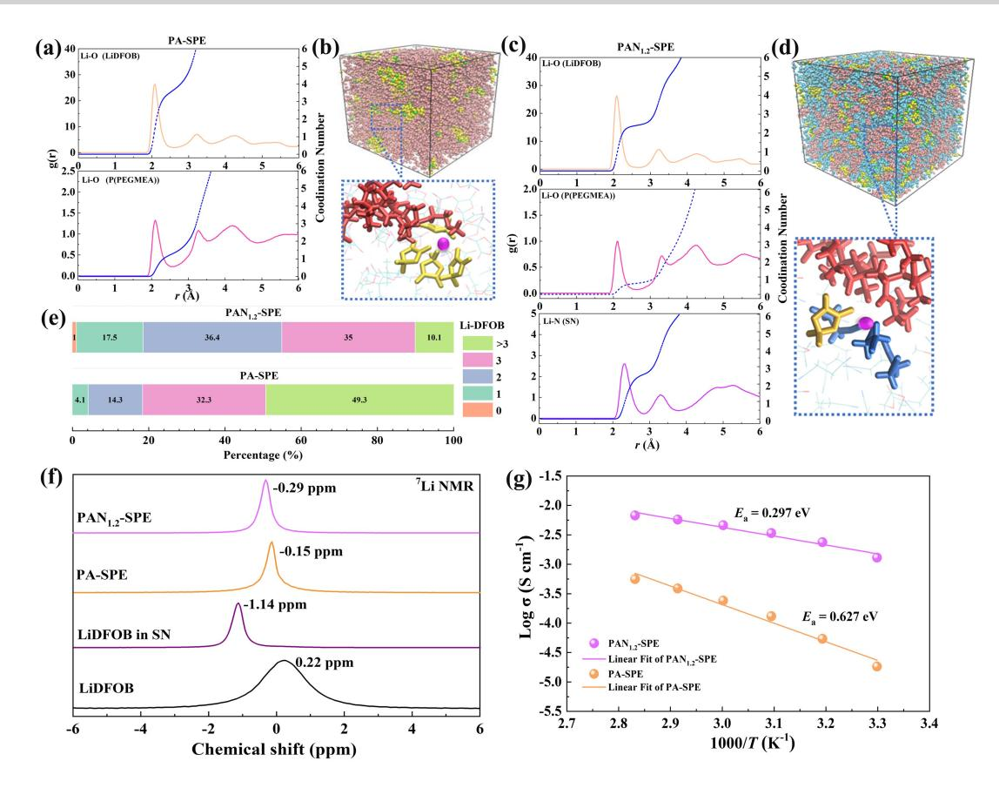
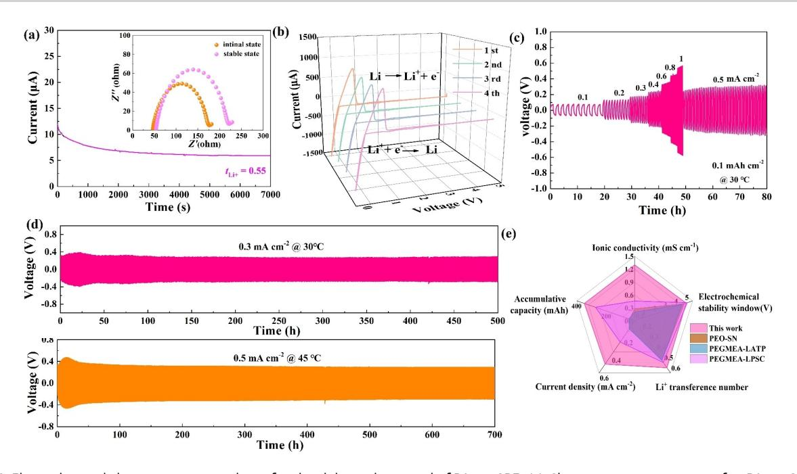
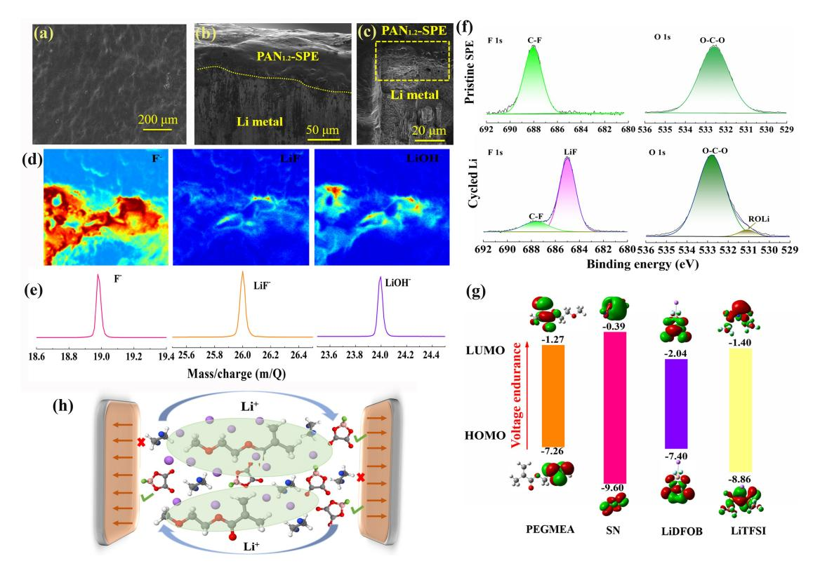
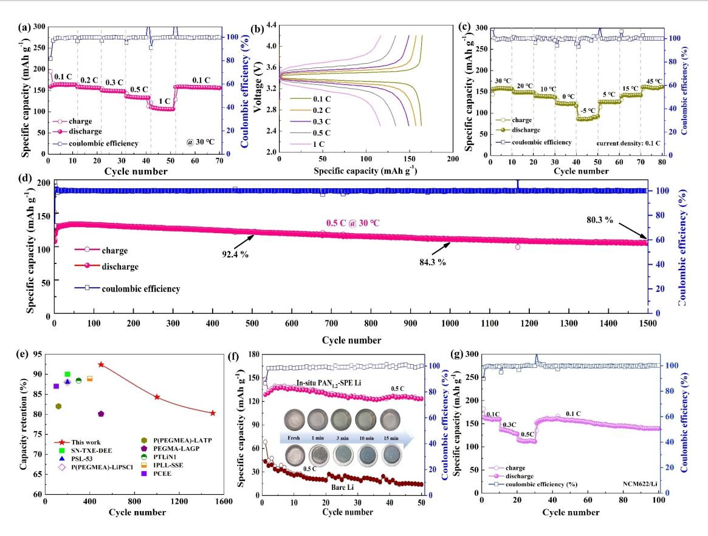
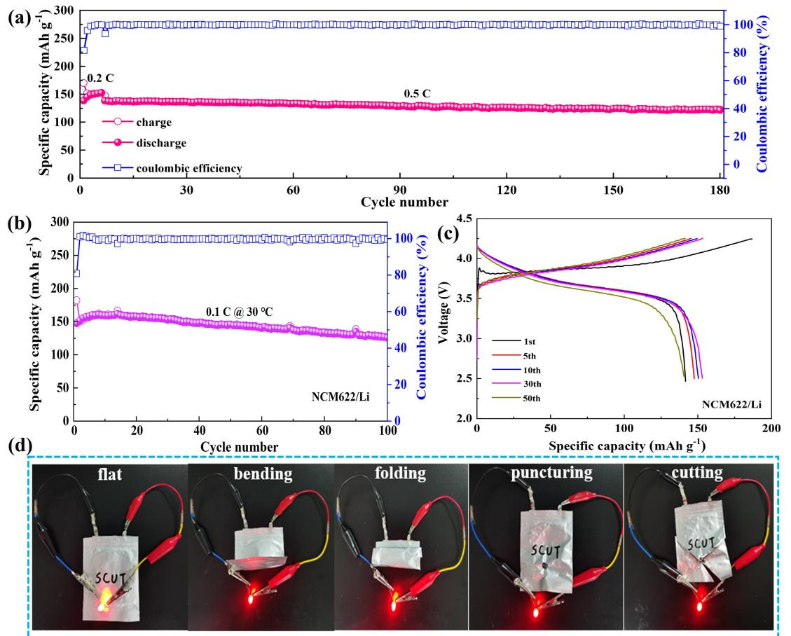

*Li Metal Batteries*

How to cite: *Angew. Chem. Int. Ed.* **2023**, *62*, e202310006 [doi.org/10.1002/anie.202310006](https://doi.org/10.1002/anie.202310006)

# **Eutectic-Based Polymer Electrolyte with the Enhanced Lithium Salt Dissociation for High-Performance Lithium Metal Batteries**

*Dechao Zhang+ , Yuxuan Liu+ , Zhaoyu Sun, Zhengbo Liu, Xijun Xu, Lei Xi, Shaomin Ji, Min Zhu, and Jun [Liu\\*](http://orcid.org/0000-0002-7078-8046)*

**Abstract:** The deployment of lithium metal anode in solid-state batteries with polymer electrolytes has been recognized as a promising approach to achieving highenergy-density technologies. However, the practical application of the polymer electrolytes is currently constrained by various challenges, including low ionic conductivity, inadequate electrochemical window, and poor interface stability. To address these issues, a novel eutectic-based polymer electrolyte consisting of succinonitrile (SN) and poly (ethylene glycol) methyl ether acrylate (PEGMEA) is developed. The research results demonstrate that the interactions between SN and PEGMEA promote the dissociation of the lithium difluoro(oxalato) borate (LiDFOB) salt and increase the concentration of free Li+. The well-designed eutectic-based PAN1.2-SPE (PEGMEA: SN=1: 1.2 mass ratio) exhibits high ionic conductivity of 1.30 mScm 1 at 30°C and superior interface stability with Li anode. The Li/Li symmetric cell based on PAN1.2-SPE enables longterm plating/stripping at 0.3 and 0.5 mAcm 2 , and the Li/LiFePO4 cell achieves superior long-term cycling stability (capacity retention of 80.3% after 1500 cycles). Moreover, Li/LiFePO4 and Li/LiNi0.6Co0.2Mn0.2O2 pouch cells employing PAN1.2-SPE demonstrate excellent cycling and safety characteristics. This study presents a new pathway for designing high-performance polymer electrolytes and promotes the practical application of high-stable lithium metal batteries.

[\*] Dr. D. Zhang,+ Dr. Y. Liu,+ Z. Sun, Dr. Z. Liu, Dr. X. Xu, L. Xi, Prof. M. Zhu, Prof. J. Liu Guangdong Provincial Key Laboratory of Advanced Energy Storage Materials, School of Materials Science and Engineering, South China University of Technology Guangzhou, 510641 (China) E-mail: msjliu@scut.edu.cn Dr. D. Zhang+ Department of Materials Science and Engineering, City University of Hong Kong Kowloon, 999077, Hong Kong SAR (China) Dr. X. Xu, Prof. S. Ji School of Chemical Engineering and Light Industry, Guangdong University of Technology Guangzhou 510006 (China)

[ +] These authors contributed equally to this work.

*Angew. Chem. Int. Ed.* **2023**, *62*, e202310006 (1 of 10) © 2023 Wiley-VCH GmbH

## *Introduction*

The rapidly-growing demands for energy storage in vehicle electrification, electrical device portability, and large-scale renewable power storage have created a strong impetus to drive the development of high-energy-density lithium (Li) metal batteries (LMBs).[1] However, the current state-of-theart LMBs no longer meet the safety requirements due to the use of flammable organic liquid electrolytes, which have been responsible for dangerous accidents. The substitution of organic liquid electrolytes with solid-state electrolytes (SEs) has been deemed an optimal strategy to tackle the paramount safety issues associated with LMBs.[2] Among various kinds of SEs, solid polymer electrolytes (SPEs) are particularly advantageous for the production and manufacture of solid-state lithium metal batteries (SLMBs) due to their natural features of lightweight, high mechanical properties, and excellent processability.[3] Unfortunately, the practical application of SPEs is still hindered by the low ionic conductivity and poor interfacial chemical stability in contact with a Li metal anode.[4] Therefore, formulating a novel, advanced solid SPE with high ion conductivity, excellent interfacial stability, and wide voltage stability window is crucial for enhancing the performance of SLMBs.[5]

Poly(ethylene glycol) methyl ether methacrylate (PEG-MEA) is a common monomer material for polymerization synthesis of SPEs because of its good compatibility with lithium metal.[6] However, it has limited success in the applications for LMBs due to its unsatisfactory ionic conductivity (10 6 ~10 5 Scm 1 at 25 °C) and poor oxidation stability. Despite combination of inorganic ceramic electrolytes could enhance the ionic conductivity of PEGMEAbased SPEs, the resultant ionic conductivity is still inadequate to meet practical application requirements.[7] Coupling plastic crystal with polymer is considered one of the most effective strategies to enhance the ionic conductivity of SPE.[8] To decrease crystallinity and subsequently improve ionic conductivity, succinonitrile (SN) is commonly introduced into SPEs as a plasticizer that also functions as a retardant agent of polymerization. In a recent study, Kim et al. developed a plastic crystal-embedded elastomer polymer electrolyte by polymerizing a homogeneous solution consisting of butyl acrylate (BA), SN and LiTFSI. Benefitting from the 3D interconnected ion-conducting SN, this electrolyte exhibits exceptionally high ionic conductivity about 10 3 Scm 1 at 20 °C as well as excellent extensibility of 300%.[9] Furthermore, it is noteworthy that the -C�N group contained in SN molecular demonstrates remarkable resistance to oxidation. Owing to this property, succinonitrilebased electrolytes with a wide electrochemical window and promising thermal stability have been considered attractive candidates for high-safety SLMBs.[10] However, the presence of strong electron-withdrawing C�N group can significantly boost the activity of α-hydrogen of SN molecular, leading to high reactivity with lithium metal and undesired formation of interfacial by-products. Therefore, SN is seldom used as the primary electrolyte component for LMBs due to its inadequate compatibility with the Li anode.[11] Cui et al. reported a dual-anion deep eutectic solution combination of SN and functional LiTFSI and lithium difluoro(oxalato) borate (LiDFOB) salts. It was found that the interactions between SN and salts could enhance interface stability with Li metal.[12] Subsequently, they designed a deep eutecticbased electrolyte by mixing SN, LiDFOB and 1, 3, 5 trioxane (TXE) at specific mass ratios, which further confirmed the strong interaction between components in the deep eutectic electrolyte. This interaction facilitates the formation of a stable solid electrolyte interface (SEI), effectively boosting the stability of an SN-based electrolyte.[13] Therefore, the polymer eutectic strategy combined with LiDFOB as the lithium salt can significantly enhance the interfacial stability between the SN-based electrolytes and lithium metal.[14]

Inspired by the idea of deep eutectic polymer electrolytes, a new type of eutectic solid polymer electrolyte composed of P(PEGMEA), SN, and LiDFOB is elaborately designed and prepared to improve the ionic conductivity of P(PEGMEA) based SPE and interface stability of SN with Li metal. The experimental characterization and theoretical calculation confirm that the interaction between the component of P(PEGMEA) and SN can effectively promote the dissociation of LiDFOB. In particular, the optimized and prepared PAN1.2-SPE (PEGMEA: SN=1: 1.2 mass ratio) exhibits excellent high ionic conductivity of 1.30 mScm 1 at 30 °C. The protective layer generated by the reaction of DFOB and Li on the surface effectively prevents the parasitic side reactions between SN and Li metal, thus improving the interfacial electrochemical stability. As a result, the assembled Li/Li symmetrical cell based on the new design eutectic-based PAN1.2-SPE enable stable plating/ stripping at the current density of both 0.3 and 0.5 mAcm 1 . Meanwhile, the Li/LiFePO4 cell can achieve superior longterm cycling stability with a high capacity retention ratio of 80.3% after 1500 cycles at 30 °C. In addition, the wide electrochemical window of the PAN1.2-SPE meets the application requirements of high voltage LiNi0.6Co0.2Mn0.2O2 (NCM622) cathode, and the soft pouch-type Li/LiFePO4 and Li/NCM622 cells demonstrate excellent cycling and safety characteristics, highlighting their potential for superior practicability. The present study provides compelling evidence of the effectiveness of the well-designed eutectic PAN1.2-SPE for high-performance room-temperature SLMBs.

#### *Results and Discussion*

As demonstrated schematically in Figure 1a, a series of flexible P(PEGMEA)-SN based eutectic solid polymer electrolytes (PEGMEA1-SN*x*-SPE) were prepared through a conventional in situ polymerization technique. The PEGMEA was chosen as the polymer matrix due to its superior mechanical properties and interfacial compatibility with Li metal, while SN was introduced to facilitate the eutectic formation and improve the ionic conductivity. The optimization of SN concentration was determined by testing the ionic conductivity (*σ*Li+) of the PEGMEA1-SN*x*-SPE membranes with varies SN concentrations as displayed in Figure 1b. The pure P(PEGMEA)-based SPE (PA-SPE) only shows a low room temperature *σ*Li+ of 0.018 mScm 1 . As the SN concentration increased, the *σ*Li+ of the PEGMEA1-SN*x*-SPE improved. With a mass ratio of PEGMEA: SN=1: 1.2, the PEGMEA1-SN1.2-SPE (PAN1.2- SPE) exhibits an impressive room temperature *σ*Li+ of 1.30 mScm 1 . However, further increasing the content of SN in the PEGMEA1-SN*x*-SPE will not lead to a significant increase in ionic conductivity. The XRD patterns (Figure S1, Supporting Information) show that the PA-SPE and PAN1.2- SPE are both amorphous at room temperature. Thus, the *σ*Li+ of PEGMEA1-SN*x*-SPE is primarily determined by the concentration of the Li+ rather than the crystallinity of the polymer, and increasing the content of SN in the composite SPE will further lead to the decrease of Li+ concentration, which in turn limits the increase in ionic conductivity.[15] In addition, the electrospun PAN/PVDF-HFP nanofiber membrane as a reinforced skeleton was employed to enhance the mechanical strength of PAN1.2-SPE. It is important to note that the ionic conductivity of PAN1.2-SPE shows slight minimal variations when different reinforced skeletons are used (Figure S2a and S2b, Supporting Information), indicating that the reinforced skeleton does not significantly affect the ion conductivity of PAN1.2-SPE. The selection of the electrospun PAN/PVDF-HFP nanofiber membrane as the supporting framework is primarily attributed to its uniform structure and high solution absorption rate (Figure S2b, Supporting Information). The digital images (Figure S3a, Supporting Information) visually show that the PEGMEA monomers with SN (1 : 1.2 mass ratio) can successfully polymerize after thermally treatment. Meanwhile, the *σ*Li+ demonstrates a slight change (Figure S3b, Supporting Information) with thermal treatment time, indicating the polymerization of PEGMEA will not increase the energy barrier of Li+ transportation in the polymer matrix. SEM images in Figure 1c illustrate the optimized PAN1.2-SPE, revealing a flat and smooth surface, and the cross-section demonstrates a dense structure with the thickness about 110 μm. The toughness and flexibility of the PAN1.2-SPE membrane were further studied. As shown in digital optical images (Figure 1d), though the prepared PAN1.2-SPE contains abundant small molecular SN, it exhibits exceptional elasticity and mechanical properties. The membrane can be folded and bent without any apparent visible cracks, and when stretched, no breaks were observed, indicating that the PAN1.2-SPE membrane is capable of withstanding various

*Figure 1.* Characterizations of PEGMEA1-SN*x*-SPE: (a) Schematic representation of the structure for the PEGMEA1-SN*x*-SPE. (b) Ionic conductivity of PEGMEA1-SN*x*-SPE at 30 °C. (c) SEM images and (d) optical photographs of the prepared PAN1.2-SPE membrane. (e) FT-IR spectra and (f) locally magnified FT-IR spectra of SN, PEGMEA, P(PEGMEA), PA-SPE and PAN1.2-SPE.

stressful conditions such as folding and stretching. In addition, the PAN1.2-SPE also exhibits superior thermal stability (Figure S4 Supporting Information), which can ensure the safe use of PAN1.2-SPE in batteries. Fourier transform infrared spectrometer (FT-IR) was conducted to characterize the molecular structure. Figure 1e shows that, after thermal treatment, the functional group of C=C bond in PEGMEA at 1630 cm 1 disappears, while other functional groups such as C=O or C O C remain unchanged, which indicates that the successful polymerization of PEGMEA into P(PEGMEA).[7a] To fundamentally understand the interactions between SN and P(PEGMEA), locally magnified FT-IR spectra are illustrated in Figure 1f. The characteristic C O C peak of P(PEGMEA) shows a significant redshift after blending with SN, whereas the characteristic C=O peak shows an insignificant shift, which implies a robust interaction between C O C of P(PEGMEA) and SN.[12–13] The electrostatic potentials (ESPs) (Figure S5, Supporting Information) provide evidence of the fundamental molecular interaction between P(PEGMEA) and SN with the altered the molecular polarity index (MPI).[16] The FT-IR characterizations and theoretical calculations corroborate the strong intermolecular interaction between P- (PEGMEA) and SN, resulting in the homogeneous eutectic.[14a]

To reveal the influence of molecular interaction on ions transport mechanism of the PA-SPE and SN modified PAN1.2-SPE, molecular dynamics (MD) simulations were conducted. The radial distribution function (RDF), coordination number (CN), and snapshots from MD simulations of the PA-SPE and PAN1.2-SPE are shown in Figure 2a,b and 2c,d, respectively. As shown in Figure 2a, the RDF between Li+ and O of DFOB shows a sharp peak at 2.07 Å with the CN of 3.5, while the coordination peak between Li+ and O of PEGMEA located at 2.07 Å with the CN of 1.2. The total CN between Li O of PA-SPE is 4.7. Meanwhile, the locally enlarged snapshot (Figure 2b) also shows that abundant DFOB anions are bound around the Li+, indicating a low LiDFOB dissociation in PA-SPE. In PAN1.2-SPE, the coordination number between Li+ and O of DFOB decreased to 2.3; meanwhile, the RDF between Li+ and the N atom of SN molecules shows a coordination peak at 2.3 Å with the CN of 2.7. The total CN between Li O and Li N of PAN1.2-SPE is 5.6. As presented in Figure 2d, partial

*Figure 2.* Li ions transport mechanism of PA-SPE and PAN1.2-SPE: (a) Radial distribution function (RDF), g(r) and coordination number and (b) molecular dynamics (MD) simulations snapshot of PA-SPE. (c) Radial distribution function (RDF), g(r) and coordination number and (d) molecular dynamics (MD) simulations snapshot of PAN1.2-SPE. (e) The ratio of the coordination number between DFOB anion and Li+. (f) 7 Li NMR spectra of LiDFOB, LiDFOB in SN, PA-SPE and PAN1.2-SPE. (g) Arrhenius plots of PA-SPE and PAN1.2-SPE.

DFOB anions are replaced by SN. The occupancy from SN suggests that the stronger interaction between Li+ and SN makes more Li+ dissociating from DFOB , which will facilitate the transfer of Li+ in electrolyte. Furthermore, the percentage of DFOB anions with different CNs around Li+ is quantified and shown in Figure. 2e. The ratio of CN�2 between DFOB and Li+ within the PAN1.2-SPE is as high as 54.9%, whereas it is only 18.4% in PA-SPE. This comparison further demonstrates that the introduction of SN in PAN1.2-SPE effectively promotes the dissociation of LiDFOB. Furthermore, the 7 Li magic angle spinning nuclear magnetic resonance (MAS NMR) spectrum was performed to clarify the Li+ migration behavior. As illustrated in Figure 2f, the 7 Li NMR resonance of LiDFOB salt appears in 0.22 ppm with a broad spectrum, indicating the Li+ ions in salt are strongly bound, because of the large number of electrons formed near the Li+ ions. On the contrary, the NMR spectra of LiDFOB dissolved in SN located at 1.14 ppm indicate the completely free Li+ ions. Compared with the PA-SPE, the 7 Li NMR signals of PAN1.2-SPE shift 0.14 ppm high-field, and the shifting high-field of Li resonance implies an improved free Li+ and weakened polymer-Li+ interaction.[17] In addition, Raman shift was performed to detect the DFOB anion states (Figure S6, Supporting Information), as evidenced by the redshift

*Angew. Chem. Int. Ed.* **2023**, *62*, e202310006 (4 of 10) © 2023 Wiley-VCH GmbH

observed in the stretching peaks of the ionic constituents of DFOB , which further indicates that SN promote the dissociation of Li salt and results in a higher concentration of free DFOB movable Li+. [18] The Arrhenius plots of PA-SPE and PAN1.2-SPE based on the ionic conductivity at different temperatures are shown in Figure 2g. The calculated activation energy (*E*a) for Li+ transport of PAN1.2-SPE is 0.297 eV, which is significantly lower than PA-SPE (0.627 eV), suggesting the high free and low migration barrier of Li+ in PAN1.2-SPE. These obtained experimental results are consistent with the mean square displacement (MSD) from MD simulation as shown in Figure S7 (Supporting Information).

Li-ion transference number (*t*Li+) is a crucial parameter for polymer electrolytes because the high *t*Li+ can decrease the electrode polarization and promote the uniform deposition of Li+. [19] Figure 3a demonstrates the time-dependent response of the direct-current polarization and electrochemical impedance spectra before and after chronoamperometry. The calculated *t*Li+ of PAN1.2-SPE is 0.55, indicating that the high ionic conductivity is mainly contributed by lithium-ion migration. Accordingly, the higher Li-ion transference number and lower activation energy will benefit the battery performances, especially cycling at higher current densities. The electrochemical stability windows of the PA-

*Figure 3.* Electrochemical characterizations and interfacial stability with Li metal of PAN1.2-SPE: (a) Chronoamperometry curve of Li/PAN1.2-SPE/Li cell, and inset shows the EIS spectra before and after polarization. (b) CV curves for PAN1.2-SPE. (c) Galvanostatic plating/stripping curves of Li/ PAN1.2-SPE/Li symmetric cell under different current densities with fixed area capacity of 0.1 mAhcm 2 . (d) Galvanostatic cycling curves of Li/ PAN1.2-SPE/Li symmetric cell under 0.3 mAcm 2 at 30 °C, and 0.5 mAcm 2 at 45 °C. (e) Comparison of the comprehensive electrochemical properties of the PAN1.2-SPE with other types of SPEs.

SPE and PAN1.2-SPE were measured by linear sweep voltammetry (LSV). As shown in Figure S8 (Supporting Information), the initial oxidation potential of PA-SPE is 4.2 V, while the oxidation potential of PAN1.2-SPE increases up to 4.8 V, indicating the coupling with SN improves the electrochemical window, which can satisfy the application requirements of high voltage cathodes. Figure 3b presents the cyclic voltammetry (CV) curves of PAN1.2-SPE in the voltage range of 0.5–4.5 V, which clearly show that the 1st and the 4th cycles of these CV curves are entirely repeatable, indicating high electrochemical stability of PAN1.2-SPE at this working voltage range. The galvanostatic cycling performances of PAN1.2-SPE in contact with lithium metal anodes were further tested to investigate the interface stability by galvanostatic plating/stripping cycling of the Li/ Li symmetrical cell. Figure 3c demonstrates the voltage profiles of Li galvanostatic plating/stripping with a fixed area capacity of 0.1 mAhcm 2 , in which the current density is increased from 0.1 to 1 mAcm 2 . The polarization voltage profiles increase as expected with increasing current density, while the cell still maintains stable cycling without a short circuit even under 1.0 mAcm 2 . Meanwhile, the rate performance test with a step-increase current densities from 0.1 to 1 mAcm 2 was also performed to further evaluate the critical current density of PAN1.2-SPE (Figure S9, Supporting Information). The PAN1.2-SPE shows a critical current density over 0.5 mAcm 2 at 30 °C, and 0.8 mAcm 2 at 45°C, respectively, indicating the superior high current tolerance. Furthermore, the stability of PAN1.2-SPE within the Li/Li symmetric cell performed by periodical plating/stripping is demonstrated in Figure 3d. The Li/Li symmetric cells exhibit a stable cycling performance for more than 500 h under 0.3 mAcm 2 at 30°C, even cycling 700 h at a high current density of 0.5 mAcm 2 and 45°C. The typical magnified polarization voltage curves (Figure S10, Supporting Information) of the symmetric cells after different cycles still keep stable without obvious fluctuation and short circuits, indicating that PAN1.2-SPE is compatible with Li metal. Furthermore, the average Li plating/stripping Coulombic efficiency (CEavg) measurement was conducted in Li/PAN1.2- SPE/Cu cells. As shown in Figure S11 (Supporting Information), the cells exhibited a high CEavg of 85.4%, indicating the high reversibility of the Li plating/stripping. Figure 3e shows the detailed electrochemical property comparison of PAN1.2-SPE with several types of polymer electrolytes reported previously.[6–7,20] It is quite encouraging that the elaborately designed PAN1.2-SPE demonstrates impressive comprehensive electrochemical performances, including room temperature ionic conductivity, Li ion transference number (*t*Li+), electrochemical stability window, and compatibility with Li metal anodes.

To gain insights into the inner mechanism by which PAN1.2-SPE pairing with Li metal exhibits enhanced electrochemical stability. The surface morphology properties of the Li metal were firstly characterized by scanning electron microscope (SEM). As shown in Figure 4a, the post-cycling image of the Li electrode surface shows a smooth surface devoid of obvious dendrites or the "mossy" lithium, meanwhile, a composite interface layer was formed on the surface (Figure 4b). In attempt to further understand the chemical composition and ascertain the information of the hybrid interface layer, the focused ion beam (FIB) technique was

*Figure 4.* Structural evolution of the PAN1.2-SPE/Li interface. SEM images of cycled Li metal anode collected from symmetrical Li cells (a) surface, (b) cross-section, (c) cross-section constructed by FIB. (d) TOF-SIMS high lateral resolution secondary ion maps. (e) Corresponding matrixassisted laser desorption/ionization time of flight mass spectrometry (MALDI-TOF-MS). (f) XPS spectra of F 1s and O 1s before and after cycling. (g) The HOMO and LUMO levels of PEGMEA, SN, LiDFOB, and LiTFSI. (h) Schematic illustration of the SEI formation between PAN1.2-SPE and Li metal.

used to perform a fresh and flat cross-section of the cycled Li metal (Figure 4c). The time-of-flight secondary ion mass spectrometry (TOF-SIMS) technique was used to elucidate the main chemical compositions. The molecular fragments of F , LiF and LiOH were chosen as representative species for the typical SEI components. Figure 4d shows the high lateral resolution mapping, which provides a precise localization of F , LiF and LiOH at the interface. The matrix-assisted laser desorption/ionization time of flight mass spectrometry (MALDI-TOF-MS) analysis also reveals the presence of these compounds (Figure 4e). Furthermore, ex situ X-ray photoelectron spectroscopy (XPS) characterizations were conducted to detect the SEI compositions of the cycled Li. Figure 4f compares the XPS spectra of the initial PAN1.2-SPE membrane and the surface of Li metal cycled in the symmetric cells. The new peaks appeared at 685 eV of F1s and 532.6 eV of O 1s spectra after cycling are assigned to the formed LiF and LiOR, respectively.[21] These compounds are usually considered to be the SEI-related compounds, which implies the formation of an SEI layer on the Li–metal interface during cycling.[22] The in situ formed SEI layer between PAN1.2-SPE and Li metal is stable enough to suppress Li dendrite growth and prevents the undesired reaction between SN and Li metal. Furthermore, there are no discernible alterations in the C 1s and N 1s core level spectra (Figure S12, Supporting Information) before

reactions between polymer matrix and lithium metal. The orbital energy levels of the PAN1.2-SPE base components determined from Gaussian are shown in Figure 4g. The lower energy level of the highest occupied molecular orbital (HOMO) of SN ( 9.6 eV), implies a higher dielectric constant, which can improve the high-voltage endurance and meet the requirements for the high-voltage cathodes.[20] In addition, compared to LiTFSI, the LiDFOB salt displays the lowest lower unoccupied molecular orbital (LUMO) energy levels, making it more susceptible to reduction on the Li metal and resulting in a robust solid electrolyte interphase (SEI). This SEI helps to prevent adverse interface reactions between SN and Li, as well as the formation of Li dendrites. The formation processes of the uniform SEI layer and homogeneous Li deposition are schematically illustrated in Figure 4h. The above investigations provide valuable insights into the composition of the SEI and have facilitated the quantification of the SEI layer formed on the surface of lithium metal.

and after cycling, indicating the absence of undesirable side

The LiFePO4/PAN1.2-SPE/Li SLMBs were assembled and measured in detail. Figure 5a and 5b illustrate the rate capability with corresponding charge–discharge curves of the LiFePO4/PAN1.2-SPE/Li cell, which delivers specific capacities of 163, 157, 148, 134, and 106 mAhg 1 at 0.1, 0.2, 0.3, 0.5 and 1 C (1 C=170 mAg 1 ) current density, respec-

*Figure 5.* Electrochemistry performances of SLMBs with PAN1.2-SPE: (a) Rate performance of LiFePO4/PAN1.2-SPE/Li cell and (b) corresponding charged/discharge curves at different current densities. (c) Cycling performance of LiFePO4/PAN1.2-SPE/Li cell at different temperatures. (d) Longterm cycling performance of the LiFePO4/PAN1.2-SPE/Li cell at 0.5 C and 30°C. (e) Comparison of the cycling performance with other SN or P(PEGMEA) based electrolytes. (g) Cyclic performance of LiFePO4/Li cell assembled with PAN1.2-SPE integration-protected Li and bare Li after exposing to air for 15 min, insert illustrates the optical images. (h) Cyclic performance of the NCM622/PAN1.2-SPE/Li cell.

tively. A high capacity of 159 mAhg 1 is obtained as the current density returned to 0.1 C, demonstrating good capacity reversibility. As shown in Figure 5b, the charge/ discharge voltage profiles of the LiFePO4/PAN1.2-SPE/Li cell at various rates are stable, indicating the fast Li+ transfer kinetics in PAN1.2-SPE and no side reaction occurs. To confirm the feasibility of PAN1.2-SPE in challenging conditions, the charge/discharge performances of the full cell was evaluated at different temperatures. As demonstrated in Figure 5c, the specific capacities of the full cell at 20, 10, and 0°C are 148, 139, and 121 mAhg 1 , respectively, which are close to that at 30°C. Even the temperature is decreased to 5°C, a reversible capacity of 85 mAhg 1 can be still obtained. When the temperature is returned to 5, 15, and 45°C, the discharge capacity is recovered to 126, 142 and 160 mAhg 1 , respectively, demonstrating superior practicability at broad temperature conditions. To further test the long-term cycling performance, the full cell was cycled at 0.5 C and 30°C. As demonstrated in Figure 5d, at the initial five cycles, the specific discharge capacity of the cell gradually rises and reaches a maximum value of 132 mAhg 1 . After 1500 cycles, the specific capacity is maintained 106 mAhg 1 and the capacity retention rate of the full cell is 80.3% (the attenuation rate is only 1.3% for per 100 cycles) with an average Coulombic efficiency above

indicating the excellent cycle performance. A comparison with the reported typical SN and PEGMEA-based solid electrolytes in terms of their cycling performances are illustrated in Figure 5e.[6–7,12–13, 23] The significant promotion in cycling performance can be mainly attributed to the intermolecular interaction between SN, PEGMEA and LiDFOB, which enhances the overall electrochemical performance of PAN1.2-SPE. This interaction also inhibits adverse reactions between SN and Li metal, resulting in the homogeneous deposition of lithium. Building on the former merits, the assembled LiFePO4/PAN1.2-SPE/Li cell demonstrates an impressive long-term cycle life. Furthermore, the LiFePO4/PAN1.2-SPE/Li cell also displays a superior rate performance and cycling stability with high cathode material mass loading at 45 °C. As shown in Figure S14a and S14b (Supporting Information), the cell exhibits a high areal capacity of 1.39, 1.36, 1.32, and 1.26 mAhcm 2 , corresponding to 149.9, 146.1, 141.8, and 126.6 mAhg 1 at 0.1, 0.2, 0.3, and 0.5 mAcm 2 current density (45°C). The overpotential of this cell remains stable at different current densities, indicating the outstanding electrochemical stability of

99.5%. The galvanostatic charge/discharge voltage curves during the cycling are shown in Figure S13 (Supporting Information). Except for the slight capacity decay, extremely low overpotential is observed during the cycling process,

PAN1.2-SPE even at a high current density. Moreover, the LiFePO4/PAN1.2-SPE/Li cell also exhibits a profound cyclability for 1000 cycles (Figure S14c, Supporting Information), indicating the good stability of PAN1.2-SPE under high current density and areal capacity. Moreover, the intrinsic high reactivity of Li metal necessitates an inert gas environment for batteries, resulting in elevated costs and handling complexities. Therefore, PAN1.2-SPE is applied as an in situ coated on the Li metal, serving as a protective layer to block the air and prevent the reaction of Li metal with air. Figure 5f illustrates the optical images of the PAN1.2-SPE integration-protected lithium and bare one in ambient conditions with a relative humidity of about 45%. Undisputed, the PAN1.2-SPE integration-protected lithium remains fresh, while the bare Li appears darker as it exposes to air for 15 min indicating the surface was oxidation. By further applying above air-exposed Li to assemble LiFePO4/ Li SLMBs, the full cell with PAN1.2-SPE integrationprotected lithium maintains a high specific capacity exceeding 120 mAhg 1 at 0.5 C of and superior cycling performance. In contrast, the LiFePO4/Li cell with bare Li demonstrates poor battery performance with a discharge capacity of 46 mAhg 1 . It suggests that the in situ coated PAN1.2-SPE is a reliable protection layer against air corrosion. Accordingly, LiNi0.6Co0.2Mn0.2O2 (NCM622)/Li full cell assembled with the PAN1.2-SPE was further measured in the voltage range of 2.8–4.2 V to demonstrate versatility and application effectiveness. As shown in Figure 5g, the NCM622/PAN1.2- SPE/Li cell delivers a specific capacity of 160.6, 134.4 and 112.6 mAhg 1 at 0.1, 0.3 and 0.5 C (1 C=170 mAhg 1 ) respectively. The discharge capacity recovers to 155.6 mAhg 1 when the current density returns to 0.1 C, and the capacity maintains 139.4 mAhg 1 after 100 cycles. The corresponding charge/discharge curves (Figure S15, Supporting Information) at various rates are stable, indicating good compatibility with the high voltage cathode.

To demonstrate the practical applications of PAN1.2- SPE, pouch-type cells were assembled and tested. Figure 6a illustrates the stable cycling performance of the LiFePO4/ PAN1.2-SPE/Li pouch cell, which maintains a stable cycling performance over 180 cycles at 0.5 C. At a current density of 0.2 C, the pouch cell achieves a high reversible capacity of 150 mAhg 1 . Even the current density increases to 0.5 C, the pouch cell still delivers a discharge capacity of 137 mAhg 1 . The actual charge/discharge curves of the pouch cell are presented in Figure S16 (Supporting Information) and the

*Figure 6.* Electrochemical performances of the pouch-type SLMBs: (a) Cycling performance of the LiFePO4/PAN1.2-SPE/Li pouch-type cell at 0.5 C. (b) Cycling performance of the NCM622/PAN1.2-SPE/Li pouch-type cell at 0.1 C. (c) Corresponding charge–discharge curves after different cycles. (d) The security tests by lighting a LED panel under extreme circumstances of NCM622/PAN1.2-SPE/Li pouch-type cell.

*Angew. Chem. Int. Ed.* **2023**, *62*, e202310006 (8 of 10) © 2023 Wiley-VCH GmbH

capacity of the pouch cell is 12.5 and 10.25 mAh at 0.1 and 0.5 C, respectively. In addition, due to the wide electrochemical window of PAN1.2-SPE, the pouch cell featuring a high-voltage cathode of LiNi0.6Co0.2Mn0.2O2 (NCM622) was further assembled and tested in the voltage range of 2.8– 4.2 V. As demonstrated in Figure 6b, the pouch cell delivers a high discharge capacity of 158 mAhg 1 at 0.1 C and maintains a high capacity of 125 mAhg 1 after 100 cycles. Figure 6d displays the corresponding voltage curves during cycling, where the extended charging curve in the initial cycle may be attributed to the formation of the SEI layer. Except this, the typical charge–discharge process of NCM622 exhibits low polarization of only 0.04 V. To further evaluate the flexible and safe functionality of this highvoltage pouch cell, various tests were conducted under harsh conditions, including bending deformation, folding, nail puncturing, and cutting. As presented in Figure 6d, the pouch cell can still deliver a stable current to power a bright red LED diode even after exposure to these conditions. Moreover, no abnormalities, such as smoking or fire evolution, occurred during such destructive conditions, which demonstrates the excellent safety and practicability of PAN1.2-SPE.

#### *Conclusion*

In summary, we have successfully developed a new type of eutectic polymer electrolyte based on SN and P(PEGMEA) through in situ thermally initiated polymerization. The experimental characterizations and theoretical simulations confirm that the electrophilic SN interacts with P- (PEGMEA) and LiDFOB, which effectively promotes the dissociation of LiDFOB. As a consequence, the developed PAN1.2-SPE possesses high ionic conductivity of 1.3 mScm 1 at 30°C, wide electrochemical stable window of 4.8 V, and stable interfacial characteristics with Li metal. The Li/Li symmetrical cell assembled with the PAN1.2-SPE enables stable plating/stripping for more than 500 cycles even at the high current density of 0.3 and 0.5 mAcm 1 . Furthermore, the Li/LiFePO4 cell based on the designed PAN1.2-SPE achieves superior long-term cycling stability with a high capacity retention ratio of 80.3% after 1500 cycles at 30°C. These exceptional features ensure superior battery cycling performance at both room and elevated low temperatures. Meanwhile, the wide electrochemical window of the PAN1.2- SPE also satisfies the high voltage NCM622 cathode. The soft pouch-type Li/LiFePO4 and Li/LiNi0.6Co0.2Mn0.2O2 cells demonstrate excellent cycling and safety characteristics, indicating the superior practicability. Our proposed methodology provides deep insight to inspire progress in the development of highly safe and durable Li metal batteries.

#### *Experimental Section*

The Experimental Section is available in the Supporting Information.

#### *Acknowledgements*

This work was supported by the National Key Research and Development Program of China (no. 2022YFB2502000), Guangdong Basic and Applied Basic Research Foundation (nos. 2020B1515120049, 2021A1515010332), R&D Program in Key Areas of Guangdong Province (no. 2020B0101030005), and the National Natural Science Foundation of China (no. U21A20332).

## *Conflict of Interest*

The authors declare no conflict of interest.

### *Data Availability Statement*

The data that support the findings of this study are available from the corresponding author upon reasonable request.

**Keywords:** Dendrite-Free **·** Eutectic Based Polymer Electrolyte **·** Interface Stability **·** Solid-State Lithium Metal Batteries

- [1] M. Li, R. P. Hicks, Z. Chen, C. Luo, J. Guo, C. Wang, Y. Xu, *Chem. Rev.* **2023**, *123*, [1712–1773](https://doi.org/10.1021/acs.chemrev.2c00374).
- [2] a) R. Chen, Q. Li, X. Yu, L. Chen, H. Li, *[Chem.](https://doi.org/10.1021/acs.chemrev.9b00268) Rev.* **2020**, *120*, [6820;](https://doi.org/10.1021/acs.chemrev.9b00268) b) J. Wu, S. Liu, F. Han, X. Yao, C. Wang, *Adv. Mater.* **2021**, *33*, 2000751.
- [3] a) Y. Wang, C. J. Zanelotti, X. Wang, R. Kerr, L. Jin, W. H. Kan, T. J. Dingemans, M. Forsyth, L. A. Madsen, *Nat. [Mater.](https://doi.org/10.1038/s41563-021-00995-4)* **2021**, *20*, [1255;](https://doi.org/10.1038/s41563-021-00995-4) b) X. Chi, M. Li, J. Di, P. Bai, L. Song, X. Wang, F. Li, S. Liang, J. Xu, J. Yu, *[Nature](https://doi.org/10.1038/s41586-021-03410-9)* **2021**, *592*, 551; c) J. Lopez, D. G. Mackanic, Y. Cui, Z. Bao, *Nat. Rev. [Mater.](https://doi.org/10.1038/s41578-019-0103-6)* **2019**, *4*, [312](https://doi.org/10.1038/s41578-019-0103-6).
- [4] a) K. He, S. H. Cheng, J. Hu, Y. Zhang, H. Yang, Y. Liu, W. Liao, D. Chen, C. Liao, X. Cheng, Z. Lu, J. He, J. Tang, R. K. Y. Li, C. Liu, *[Angew.](https://doi.org/10.1002/anie.202103403) Chem. Int. Ed.* **2021**, *60*, 12116; b) R. Fang, B. Xu, N. S. Grundish, Y. Xia, Y. Li, C. Lu, Y. Liu, N. Wu, J. B. Goodenough, *[Angew.](https://doi.org/10.1002/anie.202106039) Chem. Int. Ed.* **2021**, *60*, [17701](https://doi.org/10.1002/anie.202106039); c) B. Xu, X. Li, C. Yang, Y. Li, N. S. Grundish, P. H. Chien, K. Dong, I. Manke, R. Fang, N. Wu, H. Xu, A. Dolocan, J. B. Goodenough, *J. Am. [Chem.](https://doi.org/10.1021/jacs.1c00752) Soc.* **2021**, *143*, [6542](https://doi.org/10.1021/jacs.1c00752).
- [5] a) D. C. Zhang, X. J. Xu, Y. L. Qin, S. M. Ji, Y. P. Huo, Z. S. Wang, Z. B. Liu, J. D. Shen, J. Liu, *[Chem.](https://doi.org/10.1002/chem.201904461) Eur. J.* **2020**, *26*, [1720](https://doi.org/10.1002/chem.201904461); b) L. Liu, D. Zhang, X. Xu, Z. Liu, J. Liu, *[Chem.](https://doi.org/10.1007/s40242-021-0007-z) Res. [Chin.](https://doi.org/10.1007/s40242-021-0007-z) Univ.* **2021**, *37*, 210.
- [6] Y. Yan, J. Ju, S. Dong, Y. Wang, L. Huang, L. Cui, F. Jiang, Q. Wang, Y. Zhang, G. Cui, *Adv. Sci.* **2021**, *8*, 2003887.
- [7] a) Y. Wang, J. Ju, S. Dong, Y. Yan, F. Jiang, L. Cui, Q. Wang, X. Han, G. Cui, *Adv. Funct. Mater.* **2021**, *31*, 2101523; b) Z. Wang, L. Shen, S. Deng, P. Cui, X. Yao, *Adv. Mater.* **2021**, *33*, e2100353.
- [8] a) D. Zhang, L. Zhang, K. Yang, H. Wang, C. Yu, D. Xu, B. Xu, L. M. Wang, *ACS Appl. Mater. [Interfaces](https://doi.org/10.1021/acsami.7b12186)* **2017**, *9*, 36886; b) D. Zhou, Y. B. He, R. Liu, M. Liu, H. Du, B. Li, Q. Cai, Q. H. Yang, F. Kang, *Adv. Energy Mater.* **2015**, *5*, [1500353](https://doi.org/10.1002/aenm.201500353).
- [9] M. J. Lee, J. Han, K. Lee, Y. J. Lee, B. G. Kim, K. N. Jung, B. J. Kim, S. W. Lee, *[Nature](https://doi.org/10.1038/s41586-021-04209-4)* **2022**, *601*, 217.

- [10] J. Han, M. J. Lee, K. Lee, Y. J. Lee, S. H. Kwon, J. H. Min, E. Lee, W. Lee, S. W. Lee, B. J. Kim, *Adv. Mater.* **2023**, *35*, e2205194.
- [11] Z. Hu, F. Xian, Z. Guo, C. Lu, X. Du, X. Cheng, S. Zhang, S. Dong, G. Cui, L. Chen, *[Chem.](https://doi.org/10.1021/acs.chemmater.9b05003) Mater.* **2020**, *32*, 3405.
- [12] H. Wu, B. Tang, X. Du, J. Zhang, X. Yu, Y. Wang, J. Ma, Q. Zhou, J. Zhao, S. Dong, G. Xu, J. Zhang, H. Xu, G. Cui, L. Chen, *Adv. Sci.* **2020**, *7*, 2003370.
- [13] J. Zhang, H. Wu, X. Du, H. Zhang, L. Huang, F. Sun, T. Liu, S. Tian, L. Zhou, S. Hu, Z. Yuan, B. Zhang, J. Zhang, G. Cui, *Adv. Energy Mater.* **2023**, *13*, 2202529.
- [14] a) X. Pei, Y. Li, T. Ou, X. Liang, Y. Yang, E. Jia, Y. Tan, S. Guo, *Angew. Chem. Int. Ed.* **2022**, *61*, e202205075; b) P. Jaumaux, Q. Liu, D. Zhou, X. Xu, T. Wang, Y. Wang, F. Kang, B. Li, G. Wang, *[Angew.](https://doi.org/10.1002/anie.202001793) Chem. Int. Ed.* **2020**, *59*, 9134.
- [15] D. Zhang, X. Xu, X. Huang, Z. Shi, Z. Wang, Z. Liu, R. Hu, J. Liu, M. Zhu, *J. [Mater.](https://doi.org/10.1039/D0TA06697D) Chem. A* **2020**, *8*, 18043.
- [16] a) Z. Liu, T. Lu, Q. Chen, *[Carbon](https://doi.org/10.1016/j.carbon.2020.09.048)* **2021**, *171*, 514; b) T. Lu, F. Chen, *J. [Comput.](https://doi.org/10.1002/jcc.22885) Chem.* **2012**, *33*, 580.
- [17] J. Seo, G. Lee, J. Hur, M.-C. Sung, J.-H. Seo, D.-W. Kim, *Adv. Energy Mater.* **2021**, *11*, 2102583.
- [18] a) J. Wu, Z. Gao, Y. Wang, X. Yang, Q. Liu, D. Zhou, X. Wang, F. Kang, B. Li, *Nano-Micro Lett.* **2022**, *14*, 147; b) W.

Liu, C. Yi, L. Li, S. Liu, Q. Gui, D. Ba, Y. Li, D. Peng, J. Liu, *[Angew.](https://doi.org/10.1002/anie.202101537) Chem. Int. Ed.* **2021**, *60*, 12931.

- [19] X. Zhao, C. Wang, H. Liu, Y. Liang, L. Z. Fan, *Batteries & Supercaps* **2023**, *6*, e202200502.
- [20] J. Sun, C. He, X. Yao, A. Song, Y. Li, Q. Zhang, C. Hou, Q. Shi, H. Wang, *Adv. Funct. Mater.* **2021**, *31*, 2006381.
- [21] a) K. Zhang, F. Wu, X. Wang, L. Zheng, X. Yang, H. Zhao, Y. Sun, W. Zhao, Y. Bai, C. Wu, *Adv. Funct. Mater.* **2022**, *32*, 2107764; b) Z. Lin, X. Guo, Z. Wang, B. Wang, S. He, L. A. O'Dell, J. Huang, H. Li, H. Yu, L. Chen, *Nano [Energy](https://doi.org/10.1016/j.nanoen.2020.104786)* **2020**, *73*, [104786](https://doi.org/10.1016/j.nanoen.2020.104786).
- [22] O. Sheng, J. Zheng, Z. Ju, C. Jin, Y. Wang, M. Chen, J. Nai, T. Liu, W. Zhang, Y. Liu, X. Tao, *Adv. Mater.* **2020**, *32*, e2000223.
- [23] a) S. Xu, Z. Sun, C. Sun, F. Li, K. Chen, Z. Zhang, G. Hou, H. M. Cheng, F. Li, *Adv. Funct. Mater.* **2020**, *30*, 2007172; b) X. Zhang, M. Jia, Q. Zhang, N. Zhang, X. Wu, S. Qi, L. Zhang, *Chem. Eng. J.* **2022**, *448*, [137743;](https://doi.org/10.1016/j.cej.2022.137743) c) Z. Ren, J. Li, Y. Gong, C. Shi, J. Liang, Y. Li, C. He, Q. Zhang, X. Ren, *Energy [Storage](https://doi.org/10.1016/j.ensm.2022.06.037) [Mater.](https://doi.org/10.1016/j.ensm.2022.06.037)* **2022**, *51*, 130.

Manuscript received: July 13, 2023

Accepted manuscript online: September 13, 2023 Version of record online: September 26, 2023