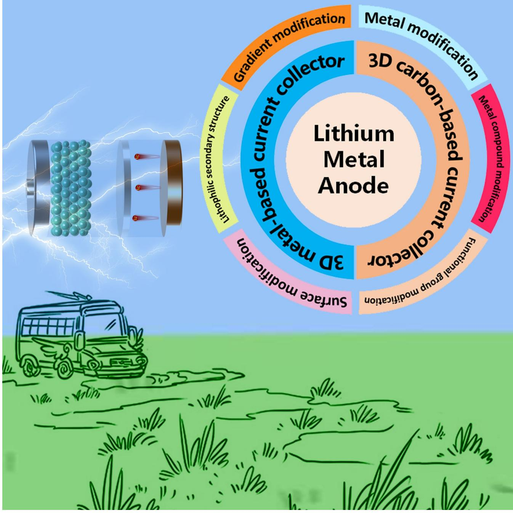
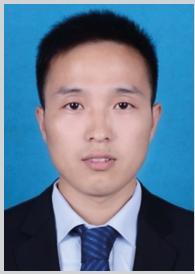
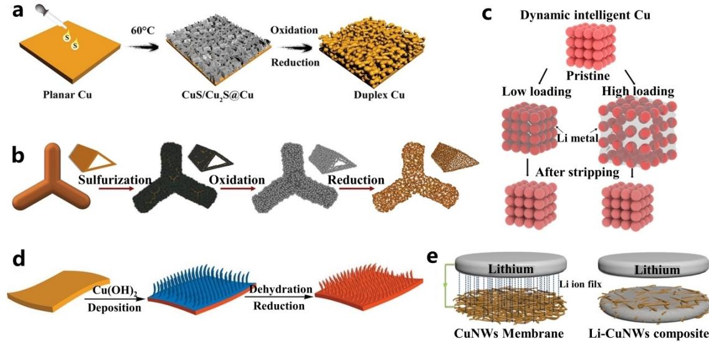
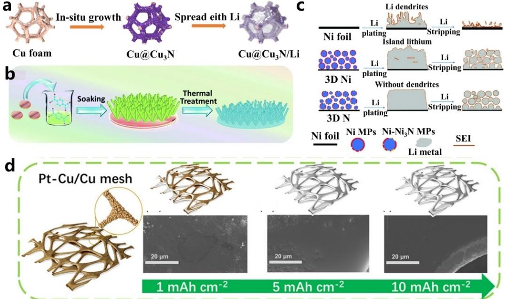
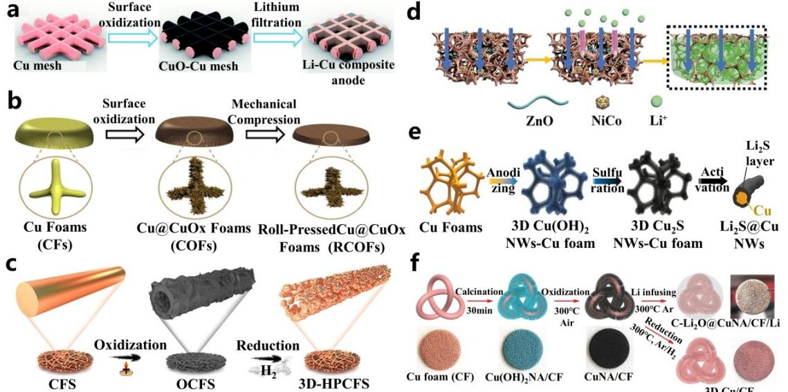
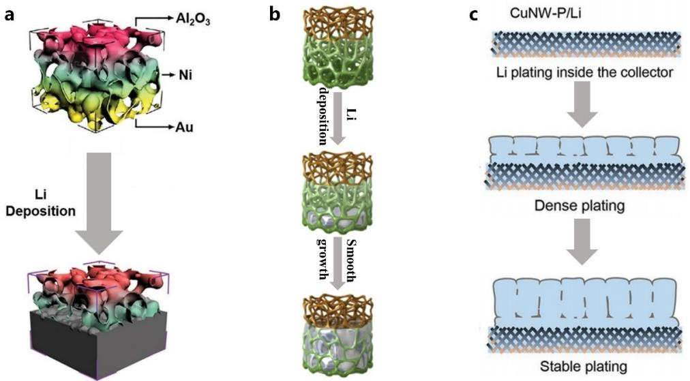
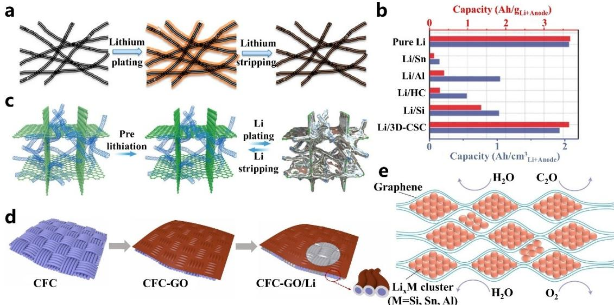
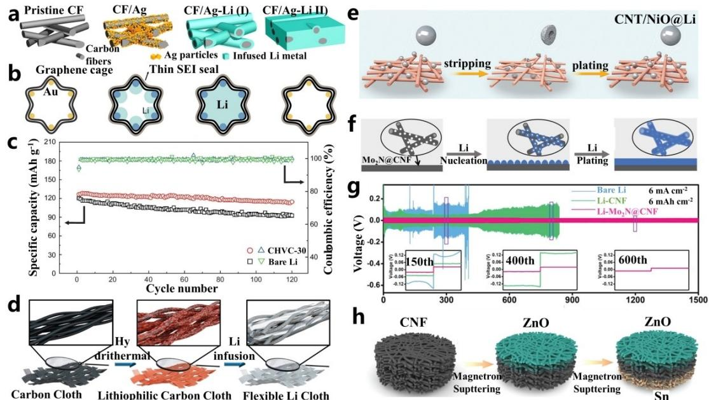
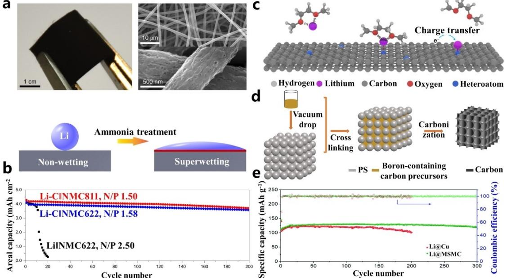

# **Rational Design of Three-Dimensional Self-Supporting Structure for Advanced Lithium Metal Anode**

Minghuan Jin,[a] Lianhui Wu,[a] Daying Guo,\*[a, b, c] Chuanhuang Wu,[a] Cong Wang,[a] Xi'an [Chen](http://orcid.org/0000-0001-7882-3005),\*[a] and Shun Wang[a]

Lithium metal anode (LMA) is the next generation of highperformance electrochemical energy storage materials because of its unique advantages (high capacity and low redox potential). However, a discontinuous solid electrolyte interface (SEI) layer and lithium dendrites are formed during battery charging, leading to serious safety problems. For this purpose, researchers have devised many solutions, such as artificial SEI, modified current collector, and lithium alloy layer. Among them, the three-dimensional (3D) current collector with a high surface area can not only reduce the local current density of

## **1. Introduction**

Rechargeable lithium-ion batteries (LIBs) are gradually permeating our daily life with their superior energy density, and have achieved rapid development in portable electronic devices, electric vehicles (EVs) and other applications, thus realizing a smart and green lifestyle.[1] However, the traditional LIBs will reach their theoretical capacity, which can no longer meet the growing demand for high energy density energy storage devices.[2] Therefore, people need to develop battery chemical components other than LIBs.[2d,3] Fortunately, the lithium metal anode (LMA) has a high theoretical specific capacity (3860 mAhg 1 ) and a low redox potential (3.040 V relative to the standard hydrogen electrode), so it has been regarded as the "Holy Grail" material.[4] In addition, the use of LMA broadens the scope of cathode materials, which provides a new opportunity for realizing high-energy-density batteries.[5]

However, the practical application of LMA has been faced with many technical problems. Firstly, the uneven deposition of LMA is easy to form dendrites during the cycle process, and large dendrites can pierce the separator and cause short circuits in the batteries, leading to serious safety problems such as fire and explosion. Meanwhile, the repeated growth of lithium dendrites results in the rupture of the solid electrolyte interface (SEI) membrane, which intensifies the consumption of electrolytes by highly active lithium and rapidly decreases the coulomb efficiency (CE) of batteries. Furthermore, in the process of lithium dissolution, dendrite lithium is prone to root fracture and loss of electrical contact, irreversibly forming "dead lithium" and further increasing the loss of lithium.[6] Additionally, the accumulation of side reaction products and "dead lithium" on the surface of lithium metal will further increase the trans-

[a] *M. Jin, L. Wu, Dr. D. Guo, C. Wu, C. Wang, Prof. X.'a. Chen, Prof. S. Wang Key Laboratory of Carbon Materials of Zhejiang Province, College of Chemistry and Materials Engineering, Wenzhou University, Wenzhou 325035, China E-mail: guody@wzu.edu.cn*

*xianchen@wzu.edu.cn*

[b] *Dr. D. Guo Zhejiang Engineering Research Center for Electrochemical Energy Materials*

*and Devices, Institute of New Materials and Industrial Technologies, Wenzhou University, Wenzhou, Zhejiang 325035, China*

[c] *Dr. D. Guo*

*Wenzhou Key Lab of Advanced Energy Storage and Conversion, Zhejiang Province Key Lab of Leather Engineering, College of Chemistry and Materials Engineering, Wenzhou University, Wenzhou, Zhejiang 325035, China*

lithium deposition but also promote lithium-ion transfer and nucleation, thus inhibiting dendrite growth. In this progress report, we review the design of the LMA 3D-structured current collector in accordance with the classification. Firstly, we discuss the latest development of advanced metal current collectors. Secondly, the 3D design of carbon-based current collectors is summarized to improve the overall performance of lithium metal batteries (LMBs). Finally, the main challenges and development prospects of LMBs' current collectors in the future are discussed.

mission impedance of electrons and ions, dramatically increase the polarization of the batteries and cause a significant decline in cycling performance and CE.[7]

Consequently, to prolong the service life of LMA and achieve the commercialization of lithium metal batteries (LMBs), various methods have been developed, such as constructing an alloy layer on a lithium metal surface,[8] designing and using a three-dimensional (3D) current collector,[9] optimizing electrolyte composition or artificially pretreating to form SEI layer,[10] and developing solid-state electrolyte,[11] etc. Among them, using a 3D porous current collector instead of a 2D planar current collector is one of the most effective strategies and has become a research hotspot in the field of LMA. The 3D current collector has the following main advantages: (1) high specific surface area can effectively reduce local current density and uniform electric field distribution, (2) the porous cross-linked structure can be used as a storage space for lithium and alleviate the volume change in the process of Li deposition/ dissolution, (3) 3D skeleton can provide an attachment skeleton for Li+ deposition, while the functionalized skeleton surface can promote uniform nucleation and dense deposition of Li.[5b,7b,f,12]

In this review, we summarize the latest strategies to increase the active sites of metal nucleation and maintain sustainable Li+ transport with the meticulous improvement of electrode materials in recent years, and the 3D electrode materials are divided into metal-based and carbon-based. For this purpose, many different 3D structures have been prepared in various ways and the lithiophilic of 3D materials has been further improved through various modification strategies, thereby enhancing the electrochemical performance. Therefore, we should pay special attention to their specific design methods and electrochemical capabilities, from which we can build up the development direction of 3D current collectors.

## **2. 3D Metal-based Current Collector**

At present, metal current collectors represented by Cu and Ni are widely used in batteries because of their rich content, superior conductivity and low cost. The 3D structure with a high specific surface area effectually reduces the local current density, provides more lithiophilic sites and inhibits the growth of lithium dendrites. In this part, we summarize the latest progress of 3D metal current collectors and discuss its development prospect.

#### **2.1. 3D metal current collector**

Both commercial Cu/Ni foam (CF, NF) and Cu/Ni mesh (CM/NM) have large pore volumes and interconnected channels, which are beneficial to accommodate a large amount of Li metal and transfer ions. Some work has proved that using CF/NF and CM/ NM as current collectors can availably alleviate the volume expansion of lithium metal and obtain better battery performance. For example, CM with different pore sizes (from 60 to 170 μm in diameter) is embedded in lithium metal by simply applying mechanical pressure to manufacture a 3D Cu/Li composite electrode.[9b] And 3D printing technology is used to make 3D-ordered Cu grids, which greatly improves the security and cycle stability of LMBs.[13] Recently the Cu current collector treated with sodium formate (SF) solution has a passivation layer covering the surface of Cu(110), which can improve the lithium affinity and oxidation resistance of the Cu current collector.[14]

In addition, porous metals with richer pores have been prepared by chemical dealloying and sulfurization-oxidationreduction methods, which can further reduce the local current density and induce the uniform deposition of Li+ in the 3D pores. Li et al. constructed 3D hierarchical porous Cu(3DHP Cu) by controlled electrochemical etching of Cu Zn alloy.[15] Under the condition of 1 mAcm 2 , the configured symmetrical batteries (Li@3DHP Cuj j Li@ 3DHP Cu) can stably cycle for 850 h. CuS/Cu2S nanosheets were formed by dropping sulfurcontaining solution on the surface of Cu foil at 60°C, which were converted into porous Cu through oxidation reaction, and finally, the porous Cu with ant nest shape was obtained after hydrogen reduction (Figure 1a).[16] Due to the rich pores and unique geometric morphology, large-capacity lithium deposition (10 mAh cm 2 ) has been realized. Similarly, rimous CF (RCF) with an ant-like porous Cu skeleton was prepared from CF through sulfurization-oxidation-reduction (Figure 1b).[17] Apart from this, the NF can be oxidized at 700°C for 8 h, and then

Minghuan Jin graduated from Zhengzhou University and is currently studying at Wenzhou University. His research interests are Li anode modification.

Daying Guo received his Ph.D. degree at the School of Materials Science and Engineering, Sun Yat-sen University in 2020 under the supervision of Prof. Bin Xi. He is currently working at Wenzhou University. His research interests are focused on the construction of nanostructured and multifunctional materials for energy storage and conversion applications using atomic-layer deposition technology, such as electrocatalysts for water splitreduced by hydrogen for 5 h to obtain nano-porous NF with a larger surface area.[18] And the LiFePO4 full cell was successfully cycled at 1 C at least 300 times (the capacity retention rate was 93%). According to the granular accumulation phenomenon in daily life, commercial copper microparticles (MPs) were dissolved on the Cu foil, and a dynamic intelligent Cu current collector with a granular accumulation structure was manufactured (Figure 1c).[19] It can dynamically adapt to the volume change in the process of Li plating/stripping, and make the stress relaxation quickly.

Compared with the above-mentioned 3D metal current collector, other nanostructures with unique 3D morphology are also assembled. Guo et al. soaked Cu foil in ammonia solution to form Cu(OH)2, and then dehydrated it into 3D Cu fiber (Figure 1d).[9a] Because of the excellent lithium loading capacity, the optimized LMBs can last for 600 h without any short circuits. CF was treated in the same way, and multistage Cu fibers were vertically grown on the CF skeleton.[20] A large number of Cu fibers can provide electrochemical active sites, and induce uniform nucleation and deposition of Li. Additionally, the 3D current collector composed of metal nanowires can achieve a large specific surface area and low mass/volume ratio at the same time, which is beneficial to the uniform deposition of Li+ (Figure 1e).[21] Cu nanowires (CuNW) with a high aspect ratio are assembled into self-supporting 3D nanostructures, thus inhibiting the growth of lithium dendrites. The average CE of LMA with CuNW is 98.6% in 200 cycles, demonstrating good stability.

#### **2.2. Lithophilic modification of 3D metal current collector**

Although 3D metal structures can efficaciously uniform the electric field distribution and reduce the local current density, most metals have poor lithium affinity, so it is necessary to

> ting, lithium–sulfur batteries, sodium-ion batteries, and supercapacitors.

Xi'an Chen graduated from Wenzhou Normal University with a Bachelor of Science degree in chemistry education in 2004. He graduated from Wenzhou University with a master of science degree in organic chemistry in 2007. In 2015, he graduated from School of Materials Science and Engineering, Hunan University, with a doctorate degree in engineering. He is currently working at Wenzhou University. His research interests include the design and synthesis of carbon-based micro-nano materials, structural regulation and application in energy storage and conversion, mainly involving lithium-sulfur batteries, sodium batteries, electrocatalysis, etc.

**Figure 1.** a) Schematic presentation of the procedures to prepare a self-welded 3D duplex Cu foil from a planar Cu foil. Reproduced with permission from Ref. [16]. Copyright (2020) Wiley. b) Schematic illustration of the procedures to prepare restructured RCF from a bare CF. Reproduced with permission from Ref. [17]. Copyright (2020) Elsevier. c) Illustration of the Li plating and stripping process on the Cu current collector. Reproduced with permission from Ref. [19]. Copyright (2020) American Chemical Society. d) Schematic presentation of the procedures to prepare a 3D porous Cu foil from a planar Cu foil. Reproduced with permission from Ref. [9a]. Copyright (2015) Nature Publishing Group. e) Schematic illustration of Li ion flux distribution and Li-metal plating models on CuNW network. Reproduced with permission from Ref. [21]. Copyright (2016) American Chemical Society.

further improve their electrochemical properties through lithophilic modification.

**Surface modification**: It is a common method to improve the lithophilic of 3D metal current collectors through construct a coating layer containing lithium affinity functional groups on the surface of the metal skeleton. Among them, nitrogen doping is widely used in cladding layers. The CF was immersed in Cu acetate solution and put into a tube furnace to obtain the final product Cu@Cu3N under high-purity ammonia (Figure 2a).[22] Moreover, the lithophilic between Li atom and substrate is verified by first-principles theoretical calculation, which shows amazing electrochemical performance in both

**Figure 2.** a) Schematic of fabrication of Cu@Cu3N/Li anode. Reproduced with permission from Ref. [22]. Copyright (2021) Elsevier. b) Schematic of the strategy of 3D NC/Cu current collector. Reproduced with permission from Ref. [23]. Copyright (2020) Royal Society of Chemistry. c) Schematic illustration of Li plating and stripping on different Ni current collectors. Reproduced with permission from Ref. [26]. Copyright (2022) Royal Society of Chemistry. d) Schematic diagrams and SEM images of Li plating on a Cu sheet. Reproduced with permission from Ref. [28]. Copyright (2021) Wiley.

half-cell and full-cell. Owing to the uniqueness of the 3D structure, the full batteries assembled by 3D nitrogen-carbon anchored Cu nanorod array have significantly improved cycle capacity and electrochemical performance compared with bare Cu (Figure 2b).[23] The combination of 3D Cu with polydopamine (PDA),[24] CF with Prussian blue analogue (PBA)[25] provides more uniform nucleation sites and achieves the effect of inhibiting the growth of lithium dendrites. PDA with lithium affinity provides a smaller nucleation overpotential. Profit from the rich deposition sites of homogenized Li+ flux, the selfassembled lithophilic CuFePBA modified layer has uniform Li nucleation and electroplating/peeling behavior. By coating the surface nitrated Ni particles on the Ni foil, and the uniform distribution of Ni3N and NiO on the interface promoted the uniform electroplating/stripping of Li (Figure 2c), and the assembled symmetrical batteries were stably circulated for more than 850 h.[26] Furthermore, the functional groups of halogen elements with strong electronegativity have different degrees of affinity for Li+. With F-containing MXene anchored on CF, the symmetrical batteries based on MXene@CF can run for more than 1000 h without strong voltage fluctuation at a current density of 1 mAcm 2 . [27]

The surface coating modification has the problem that the coating is easy to break and fall off in the process of repeated deposition/dissolution of Li, the deformation and fracture of the complete coating is avoided by modifying lithophilic metal nanoparticles on the surface of the metal skeleton. Zhang et al. used potassium hexachloroplatinate (K2[PtCl6]) aqueous solution to treat CF, and formed a Pt Cu alloy top layer through galvanic replacement reaction.[28] The product with a large surface area and rough morphology can provide uniform charge and ion flux distribution, thus reducing local current density and platinum shows high lithophilic. Hence, CF not only has excellent performance in LMBs (Figure 2d), but also has good cycle performance in sodium metal batteries. 3D porous Cu with vertical microchannels was prepared by a phase inversion tape casting process, and Sb was introduced into its surface.[29] This Sb-modified 3D Cu exhibits stable CE with high capacity (6 mAh cm 2 ) or high current density (3 mAcm 2 ). Besides, a 3Dordered Zn/Cu current collector was prepared by combining a simple template method with the pulse electroplating method.[30] Benefiting from the composite structure of macropores and mesopores, stable cycling for more than 2000 h was realized at 0.2 mAcm 2 . The melting method can also be used to directly form Li Cu alloys and the lithophilic of Li Cu nanowires induces the uniform deposition of Li.[31]

**Lithophilic secondary structure**: Lithophilic metal compounds (such as ZnO, CuO, CoO, etc.) are common materials for constructing secondary structures. Compared with the current collector of surface-modified nanoparticles, the secondary structure can provide more lithophilic sites, which is beneficial to the uniform deposition of Li+ in the secondary network constructed by it and the formation of flat deposition morphology. Lithophilic CuO was formed on the surface of CM by a simple thermal oxidation method (Figure 3a).[32] And with a high current density of 10 mAcm 2 , the Li Cu composite anode can be stably circulated for 1000 cycles. Through simple methods, the surface of CF is oxidized by ammonia water, then the porosity of the surface coating is adjusted by mechanical pressure (Figure 3b).[33] CuO*x* coating can improve the wettability with Li, thereby reducing the nucleation overpotential of Li metal. After 500 cycles in a continuous metal plating/ dissolution process, the obtained CuO*x* coating CF shows up to 97% CE. In addition, Cu2O[34] or CoO[35] is used to construct the

**Figure 3.** a) Fabrication illustration of the CuO Cu mesh with melted Li. Reproduced with permission from Ref. [32]. Copyright (2019) The Royal Society of Chemistry. b) The fabrication of roll-pressed Cu@CuO*x* foams. Reproduced with permission from Ref. [33]. Copyright (2020) Elsevier. c) Schematic diagram of the fabrication process of 3D-HPCFs. Reproduced with permission from Ref. [36]. Copyright (2020) American Chemical Society. d) Schematic diagrams of Li deposition on modified CF. Reproduced with permission from Ref. [40]. Copyright (2021) Wiley. e) Schematic of the 3D Cu2S NWs–CF fabrication process. Reproduced with permission from Ref. [42]. Copyright (2020) Wiley. f) Schematic diagrams of CuONA/CF, 3D Cu/CF and C–Li2O@CuNA/CF/Li. Reproduced with permission from Ref. [44]. Copyright (2020) Elsevier.

secondary structure on CF. Based on the secondary structure of fine lithophilic, the reversibility of Li plating/stripping process is enhanced. Others, 3D hollow porous Cu fibers were prepared by the redox method, and the electric field distribution was uniform with CuO and Cu2O nanoparticles on the surface (Figure 3c).[36] These 3D Cu fibers as LMA materials inhibit the growth of Li dendrites, and the CE remains stable at 99.21% after 350 cycles. Analogously, CM modified by TiO2/Cu2O heterostructure was synthesized.[37] Heterostructure can induce rapid and uniform conduction of Li and promote dendrite-free Li deposition. In symmetrical batteries, the lifetime of batteries is effectively prolonged (up to 1000 h). Moreover, 3D Cu modified by CuO and SnO2 was prepared by the simple ammonia oxidation method.[38] Spongy 3D Cu reduced the nucleation barrier, and the batteries paired with LiCoO2 cathode showed excellent capacity retention performance. Interestingly, the commercial brass mesh was placed in Fe(NO3) 3 solution and then moved into the microwave reflection chamber of a microwave oven to obtain a granular layer with FeO and CuO, which effectually regulated the Li deposition behavior.[39] When the current density reaches up to 5 mAcm 2 , the batteries can cycle steady for 1000 h.

Ni Co alloy and ZnO were loaded on CF, in which Ni Co alloy availably allowed Li deposition, and ZnO as a lithophilic structure, reduced the nucleation overpotential of Li (Figure 3d).[40] Significantly, at a current density of 2 mAcm 2 , the symmetrical batteries can firmly cycle for more than 560 h. Furthermore, the performance of the current collector is improved by in-situ formation of LIF-rich SEI on the CF skeleton.[41] On account of the inhibitory effect of SEI on Li dendrites, the corresponding symmetrical cells work continuously for 2400 h with a small voltage lag of about 10 mV. The combination of metal compounds and metal nanowires can also improve the performance of 3D metal current collector. Above all, the nanowire structure on the CF surface increases the surface area of the current collector and usefully reduces the local current density. After that, an SEI layer (Li2S) was formed in situ to adjust the uniform deposition of Li (Figure 3e).[42] In consequence, the assembled batteries show outstanding rate performance and steady cycle performance. In a similar way, it can be applied to NF.[43] Moreover, Li2O is formed by an in-situ reaction between CuO nanowires and Li metal, which provides abundant Li nucleation sites (Figure 3f).[44] The corresponding symmetrical batteries exhibit excellent cycle stability within 600 h.

**Gradient modification**: Although surface modification and secondary structure construction can improve the lithophilic of current collectors, the conductivity of many lithium affinity compounds is worse than that of metals, which is not conducive to the transmission of electrons at the interface of a 3D network skeleton. In order to achieve the fine balance between the lithophilic and conductivity of metal current collectors, a lithophilic gradient formed by the top Al2O3 coating and bottom Au layer is reported (Figure 4a).[45] This unique structure contributes to Li preferential nucleation at the bottom and has stable cycle performance even at the low temperature of 15°C. Depending on the ion/conductivity gradient structure, a thickness-dependent conductive Ni nano-layer was introduced on the melamine sponge (Figure 4b).[46] In addition to guiding Li deposition from bottom to top, polar functional groups can stabilize Li+ flux. Additionally, a lithophilic CuSnAl layer was fabricated on the bottom of CF to induce dense Li deposition.[47] After 300 cycles, the full batteries can achieve a higher capacity retention rate. Kang et al. prepared CuNW with a phosphating gradient, in which Cu3P has better lithium affinity than other Cu-based compounds. In addition, the Li3P formed by the reaction has high Li+ conductivity (10 4 S cm 1 ), which ensures uniform Li+ flux on the electrode surface. And

**Figure 4.** a) Schematic illustration of Li metal deposition behavior on modified NF. Reproduced with permission from Ref. [45]. Copyright (2019) Nature Publishing Group. b) Schematic illustration of the Li-plating process on 3D porous scaffold. Reproduced with permission from Ref. [46]. Copyright (2020) Elsevier. c) Schematic of the Li plating behaviors on CuNW P current collectors. Reproduced with permission from Ref. [48]. Copyright (2019) Wiley.

the lifetime of the symmetrical batteries is 1000 h at 1 mAcm 2 , which indicated that it could efficaciously and stably prevent Li dendrite growth (Figure 4c).[48]

To sum up, although the research on metal-based 3D current collectors has made various progress, there are still the following problems when metal materials are used as LMA current collectors: (1) The high density of metal materials and the heavy current collectors are not conducive to the construction of high energy density batteries. (2) Poor flexibility and bending resistance. (3) Large pore size, small pore volume and low Li loading. (4) The surface is difficult to be functionalized, and the effect of uniform current is limited, which greatly limits its application in future energy storage devices.

## **3. 3D Carbon-based Current Collector**

3D current collectors made of carbon materials have many advantages, e.g., abundant sources, stable chemical properties, low density, easy functionalization and surface modification. At present, based on the in-depth understanding of the formation mechanism of lithium dendrites and lithium deposition behavior, combined with the morphology and surface chemistry of different carbon substrates, a variety of carbon-based 3D current collectors with different structures have been applied to LMA. Thus, inhibit dendrite growth and promote the stable deposition/dissolution of Li, and show good practical application prospects.

#### **3.1. Design of 3D carbon structure**

Carbon materials with various micro-morphologies can meet the needs of 3D current collector structure design. Compared with sp and sp3 hybrid carbon materials, sp2 hybrid carbon such as carbon nanotubes (CNTs) and graphene possesses highly delocalized π electrons, and the 3D structure assembled from them has excellent conductivity, mechanical strength and chemical stability. For example, Chen et al. reported that the CNTs sponge designed as a 3D porous current collector showed a high affinity for the deposition of Li metal and reduced the overpotential of Li nucleation (Figure 5a).[49] Among them, the CNTs sponge batteries ran stably when it undergoes 400 h continuous Li deposition/stripping cycling. When the CNTs network had more orderly cross-stacking, the specific capacity (3656 mAhg 1 ) provided by the corresponding LMA is close to the theoretical capacity of Li metal (Figure 5b).[50] Furthermore, profit from the well-organized structure, the cycle life of the batteries exceeds 2000 h. It is a simple method to replace Cu foil with artificial graphite paper (GP) as the current collector of LMA. GP has good chemical stability, as well as inhibiting galvanic corrosion.[51] In the test of pouch batteries, GP can safely cycle for 240 cycles, and the capacity retention rate is 91.6%. The 3D graphene/CNTs composite aerogels composed of 2D graphene layers and 1D CNTs displays large surface area and uniform Li deposition (Figure 5c).[52] When matched with various high-voltage cathodes, it exhibits excellent rate and cycle performance. Carbon fiber cloth (CFC) and graphene oxide (GO) composite is also a good choice (Figure 5d).[53] By taking advantage of the poor conductivity of GO, Li can enter the internal space of CFC for deposition/stripping. As a simplified strategy, Li was compounded with several porous carbon hosts

**Figure 5.** a) Schematic diagrams of electrochemical plating/stripping process of lithium on the CNT sponges. Reproduced with permission from Ref. [49]. Copyright (2019) American Chemical Society. b) Gravimetric and volumetric capacities of various electrode materials. Reproduced with permission from Ref. [50]. Copyright (2019) Wiley-VCH. c) Schematic diagrams of the deposition behaviors of lithium metal in graphene/CNTs. Reproduced with permission from Ref. [52]. Copyright (2021) Wiley-VCH. d) Schematic diagrams of the deposition behaviors of lithium metal in CFC-GO. Reproduced with permission from Ref. [53]. Copyright (2023) Elsevier. e) Schematic illustrating the unique foil structure comprising densely packed reactive Li*x*M nanoparticles encapsulated by large graphene sheets (M=Si, Sn, or Al). Reproduced with permission from Ref. [54a]. Copyright (2017) Nature Publishing Group.

to improve the performance of LMA.[54] It is reported that the anode made of Li*x*M/graphene foil (M=Si, Sn, or Al) has a unique foil structure, which effectively avoids the inherent problems caused by lithium dendrite growth (Figure 5e).[54a] Additionally, the volume capacity of Li*x*Si/graphene foil is 1800– 2000 mAhcm 3 , which is close to the theoretical value of Li metal (2061 mAhcm 3 ). Under the condition of 2.4 mAhcm 2 , it can circulate stably for 400 cycles and the capacity retention rate is 98%.

#### **3.2. Lithophilic modification of 3D carbon current collector**

Although porous carbon has the advantages of diverse structure and adjustable pore size, the lithium affinity of pure carbon current collector is insufficient, issuing in excessive nucleation overpotential of Li+ and uneven nucleation/deposition of Li. Therefore, the surface modification of carbon materials is usually carried out by means of lithophilic site modification, so as to induce Li nucleation and form uniform deposition morphology.

**Metal/metal compound modification**: Ag,[9c,d,55] Au,[56] etc. can dissolve in lithium, so there is no lithium nucleation barrier. Lithophilic modification by metal modification can effectually reduce the lithium nucleation overpotential, so it is widely used to improve the lithium affinity of carbon materials. Zhang et al. constructed coral-like composite anode materials by electroplating Ag particles on the surface of carbon fibers (Figure 6a).[9d] Even under the extremely high current density of 10 mAcm 2 , it can reach stably circulated for 160 cycles in symmetrical batteries. The template method was used to generate graphene with Au inside (Figure 6b).[56a] This wrinkled graphene cage structure has good mechanical stability, better Li+ conductivity and excellent SEI, which realizes the uniform deposition of Li and greatly improves the cycle lifespan of the batteries. Furthermore, the properties of carbon can be further improved by alloy modification.[57] Using unidirectional ice template technology, the carbon main material with adjustable vertical pore size was prepared, and Sn/Ni alloy was added to increase nucleation sites, which availably and uniformly deposited Li.[57a] In the full batteries test, the capacity retention rate is 90.6% after 120 cycles (Figure 6c).

Metal compounds, including oxides[9f,58] and nitrides,[59] have a strong affinity for lithium, which are used as lithophilic active sites to modify the surface of porous carbon and thereby regulate the uniform deposition of Li. For instance, Yu et al. introduced MnO2 nanosheets into carbon fiber cloth, which not only provided lithium affinity sites, but also further expanded the surface area, usefully limiting the growth of Li dendrites (Figure 6d).[9f] When the energy density of volume is 468 WhL 1 , the lifetime of the pouch batteries can reach 800 cycles. Inspired by the Wenzel model, a lotus-like 3D porous host was prepared by interweaving NiO ball with CNTs (Figure 6e).[58c] In the symmetrical batteries test, it achieves continuously cycled for 900 h at a low overpotential. In order to form uniform lithophilic sites on the surface of carbon fibers, TiN nanoparticles with a strong affinity for lithium were modified on the surface of carbon nanofibers.[59a] Under the test conditions of a

**Figure 6.** a) Schematic diagram of preparing CF/Ag Li composite electrode. Reproduced with permission from Ref. [9d]. Copyright (2018) Elsevier. b) Schematic diagram of composite electrode during Li deposition and stripping. Reproduced with permission from Ref. [56a]. Copyright (2019) American Chemical Society. c) Cycling performance of full cells. Reproduced with permission from Ref. [57a]. Copyright (2019) Science Press. d) Schematic of the material design and the synthetic procedures. Reproduced with permission from Ref. [9f]. Copyright (2021) American Chemical Society. e) Schematic illustration for stripping and cycling behavior on composite anode. Reproduced with permission from Ref. [58c]. Copyright (2021) Wiley-VCH. f) Schematic illustration of the Li nucleation and plating process on composite anode. g) Cycling performance of symmetric cells. Reproduced with permission from Ref. [59b]. Copyright (2019) Wiley-VCH. h) Schematic illustration of the synthesis procedure of materials. Reproduced with permission from Ref. [60b]. Copyright (2022) Wiley-VCH.

large capacity of 3 mAh cm 2 and 6 mAh cm 2 , it still has high CE and excellent cycle stability. Similarly, Mo2N nanoparticles modified carbon fiber 3D current collector can also inhibit Li dendrite growth (Figure 6f).[59b] In the Li nucleation stage, Mo2N reacts with Li to produce Mo and Li3N. Mo generated in situ can be used as a preferential nucleation site to induce subsequent Li deposition, and at the same time, Li3N with excellent ionic conductivity can accelerate Li+ transport. Therefore, it can run stably for more than 1500 h at a current density of 6 mAcm 2 (Figure 6g). Moreover, through the combination of metal and metal compounds, the performance of a 3D carbon current collector is further improved.[60] Two-way gradient modification is designed, which is modified by top-down ZnO and bottomup Sn (Figure 6h).[60b] ZnO at the top improves the diffusion coefficient of Li+, and Sn at the bottom leads to the preferential deposition of Li. At the current density of 1 mAcm 2 , the overpotential (8.4 mV) and CE (96.7%) have been kept low for 250 cycles.

**Functional group modification**: There is a strong interaction between strongly electronegative nitrogen, oxygen and sulfur with positively charged Li+. Hence, lithophilic polar functional groups were modified on the surface of porous carbon by element doping. Wan et al. reused melamine foam waste and nitrogenized it to form a flexible 3D host.[61] The functional group containing N promotes the uniform growth of Li, thus obtaining excellent electrochemical performance. As a consequence, it shows a high CE of 99.6% and a long lifespan of 1200 h in the batteries. Li metal deposited on the surface of amine-functionalized carbon becomes smooth during cycling, this self-smoothing behavior is beneficial to uniform Li deposition (Figure 7a).[62] In the full batteries test coupled with a high voltage cathode, stable cycling was performed over 200 times and reached a high energy density of 381 Wh kg 1 (Figure 7b). The effectiveness of nitrogenized functional groups has also been proved in several other works.[9g,63] Besides, carbon fibers with oxygen functional groups were prepared by electrospinning, which led to the uniform deposition of Li metal.[64] Among them, a surface ozone decomposition method is reported to form oxygen-rich lignin carbon membranes.[64b] In symmetrical batteries, it can achieve a long cycle life of more than 1000 h and a voltage lag of less than 20 mV. Analogical to the abovementioned, the nucleation and deposition of Li can also be controlled by heteroatom doping to design advanced LMA.[65] Zhang et al. discussed the lithophilic chemistry of various heteroatom-doped carbon through first-principles calculation and experimental tests (Figure 7c).[65b] It is found that O/B codoping has the best lithophilic, which can guide the uniform nucleation of Li. After that, the O/B co-doped honeycomb carbon skeleton was successfully constructed as the current collector (Figure 7d).[65e] The interaction of functional groups tends to form a stable SEI film, thereby inhibiting the growth of Li dendrites. And the symmetrical batteries can operate stably for 700 h at a current density of 1 mAcm 2 . The N/O co-doped hollow carbon nanosphere can improve the lithophilic, and also alleviate the volume effect.[65d] N/S co-doped mesoporous carbon nanospheres can be prepared by simple in-situ polymerization and easy pyrolysis, which can effectively inhibit the growth of lithium dendrites.[65f] In the full batteries test with LiFePO4, the capacity retention rate is 84% after 300 cycles at 2 C (Figure 7e).

Although a series of progress has been made in the research of carbon-based 3D current collectors, there are still two main

**Figure 7.** a) Images and schematic diagrams of a flexible carbon film prepared by electrospinning. b) Cycling performances of the full cells. Reproduced with permission from Ref. [62]. Copyright (2019) Nature Publishing Group. c) Schematic representation of the Li nucleation on conductive frameworks. Reproduced with permission from Ref. [65b]. Copyright (2019) American Association for the Advancement of Science. d) Schematic illustration of the fabrication procedure for the O/B codoped honeycomb carbon structures. Reproduced with permission from Ref. [65e]. Copyright (2022) Wiley-VCH. e) Cycling performance at 2 C of full cells. Reproduced with permission from Ref. [65f]. Copyright (2022) The Royal Society of Chemistry.

shortcomings: (1) Porous carbon has a large specific surface area and high surface activity, which is easy to cause irreversible side reactions with organic electrolytes, resulting in a decrease in CE. (2) The lithium intercalation behavior of carbon material itself can improve the area-specific capacity, but for the carbonbased 3D current collector modified by coating the lithiumaffinity layer, the repeated deintercalation of Li+ in the carbon matrix has a certain destructive effect on its internal structure, which may lead to the decline of the mechanical properties of carbon matrix and aggravate the cracking and peeling of the surface layer.

## **4. Summary and Perspective**

This review generalizes the latest advances in LMA material design, and includes the diversified methods from using commercial current collectors to up-to-date nanostructures. As an effective means to inhibit the growth of lithium dendrites, the large specific surface area of 3D current collectors (metalbased materials and carbon-based materials) can reduce the current density, uniform electric field and lithium-ion concentration gradient, moreover, its porous structure can accommodate the volume change of Li. Through reasonable structural design and surface modification, the dendrite-free, dense, stable and safe LMA can be finally realized.

However, highly effective surface areas can lead to a significant reduction of Li and electrolytes in reduplicated lithium stripping/plating process. At present, the synthesis methods of advanced 3D current collectors are still complex and expensive, and the manufactured collectors are not compatible with the current roll-to-roll production procedures in the batteries industry. In addition, due to the limitation of the preparation process and other factors, the LMA based on a 3D current collector is still far from practical application. From the practical point of view, the future development of 3D current collectors has the following trends: (1) The preparation process should be simple, mild and low-cost, which is suitable for industrial production. And the common electrochemical deposition pre-storage Li method is not applicable in mass production, so it is necessary to achieve a simple Li composite mode (roll method, etc.) . (2) Preparing a light 3D current collector, efficaciously reducing the mass ratio of the current collector in the batteries and improving the energy density of the batteries. (3) The 3D current collector should have good mechanical strength and toughness, ensuring the persistent stability of its structure in repeated charge/discharge cycles and broadening its potential application in flexible devices. (4) Continue to improve the CE of the 3D current collector, focus on the development of a Li-free/Li-poor anode full batteries system, and enhance the practical level of the LMA energy storage system. To sum up, the construction of a 3D composite lithium anode is of great significance to promote the commercialization of LMBs.

Although the use of high-performance 3D structure electrode materials can significantly improve the safety and cycle life of LMBs, more in-depth research on LMA is still needed. Combined with multidisciplinary research, through advanced surface engineering technology and characterization methods, a more reliable LMA is designed reasonably. As more and more researchers join this rapidly developing field, we believe that this will promote LMBs and other energy storage systems to make greater breakthroughs in the next few years.

# *Acknowledgements*

This research was financially sponsored by Natural Science Foundation of China (52202109 and 52271225), Natural Science Foundation of Zhejiang Province (LQ23E020001), Basic Scientific Research Projects of Wenzhou City (G20220024, H20220002).

# *Conflict of Interests*

The authors declare no conflict of interest.

## *Data Availability Statement*

Research data are not shared.

**Keywords:** 3D current collector **·** high specific surface area **·** lithium dendrite **·** lithium metal anode **·** uniform deposition

- [1] a) M. Armand, J. M. Tarascon, *[Nature](https://doi.org/10.1038/451652a)* **2008**, *451*, 652; b) S. Chu, A. Majumdar, *[Nature](https://doi.org/10.1038/nature11475)* **2012**, *488*, 294; c) D. Zhou, D. Shanmukaraj, A. Tkacheva, M. Armand, G. Wang, *[Chem](https://doi.org/10.1016/j.chempr.2019.05.009)* **2019**, *5*, 2326; d) X. He, D. Bresser, S. Passerini, F. Baakes, U. Krewer, J. Lopez, C. T. Mallia, Y. Shao-Horn, I. Cekic-Laskovic, S. Wiemers-Meyer, F. A. Soto, V. Ponce, J. M. Seminario, P. B. Balbuena, H. Jia, W. Xu, Y. Xu, C. Wang, B. Horstmann, R. Amine, C.- C. Su, J. Shi, K. Amine, M. Winter, A. Latz, R. Kostecki, *Nat. Rev. [Mater.](https://doi.org/10.1038/s41578-021-00345-5)* **[2021](https://doi.org/10.1038/s41578-021-00345-5)**, *6*, 1036.
- [2] a) J. M. Tarascon, M. Armand, *[Nature](https://doi.org/10.1038/35104644)* **2001**, *414*, 359; b) J. B. Goodenough, K. S. Park, *J. Am. [Chem.](https://doi.org/10.1021/ja3091438) Soc.* **2013**, *135*, 1167; c) M. H. Braga, N. S. Grundish, A. J. Murchison, J. B. Goodenough, *Energy [Environ.](https://doi.org/10.1039/C6EE02888H) Sci.* **[2017](https://doi.org/10.1039/C6EE02888H)**, *10*, 331; d) D. Lin, Y. Liu, Y. Cui, *Nat. [Nanotechnol.](https://doi.org/10.1038/nnano.2017.16)* **2017**, *12*, 194; e) G. Assat, J.-M. Tarascon, *Nat. [Energy](https://doi.org/10.1038/s41560-018-0097-0)* **2018**, *3*, 373; f) J. Zhang, C. You, H. Lin, J. Wang, *Energy [Environ.](https://doi.org/10.1002/eem2.12250) Mater.* **2022**, *5*, 731.
- [3] Y. Kato, S. Hori, T. Saito, K. Suzuki, M. Hirayama, A. Mitsui, M. Yonemura, H. Iba, R. Kanno, *Nat. Energy* **2016**, *1*, 1.
- [4] a) Y. Sun, N. Liu, Y. Cui, *Nat. Energy* **2016**, *1*, 1; b) P. Albertus, S. Babinec, S. Litzelman, A. Newman, *Nat. [Energy](https://doi.org/10.1038/s41560-017-0047-2)* **2017**, *3*, 16; c) X. B. Cheng, R. Zhang, C. Z. Zhao, Q. Zhang, *Chem. Rev.* **2017**, *117*, [10403](https://doi.org/10.1021/acs.chemrev.7b00115); d) M. Asadi, B. Sayahpour, P. Abbasi, A. T. Ngo, K. Karis, J. R. Jokisaari, C. Liu, B. Narayanan, M. Gerard, P. Yasaei, X. Hu, A. Mukherjee, K. C. Lau, R. S. Assary, F. Khalili-Araghi, R. F. Klie, L. A. Curtiss, A. Salehi-Khojin, *[Nature](https://doi.org/10.1038/nature25984)* **[2018](https://doi.org/10.1038/nature25984)**, *555*, 502; e) B. Liu, J. Zhang, W. Xu, *Joule* **[2018](https://doi.org/10.1016/j.joule.2018.03.008)**, *2*, 833; f) T. Li, X. Zhang, P. Shi, Q. Zhang, *Joule* **[2019](https://doi.org/10.1016/j.joule.2019.09.022)**, *3*, 2647; g) Q. Lu, Y. Jie, X. Meng, A. Omar, D. Mikhailova, R. Cao, S. Jiao, Y. Lu, Y. Xu, *[Carbon](https://doi.org/10.1002/cey2.147) Energy* **2021**, *3*, [957;](https://doi.org/10.1002/cey2.147) h) X. Yan, L. Lin, Q. Chen, Q. Xie, B. Qu, L. Wang, D. L. Peng, *[Carbon](https://doi.org/10.1002/cey2.95) [Energy](https://doi.org/10.1002/cey2.95)* **2021**, *3*, 303.
- [5] a) X. B. Cheng, R. Zhang, C. Z. Zhao, F. Wei, J. G. Zhang, Q. Zhang, *[Adv.](https://doi.org/10.1002/advs.201500213) Sci.* **2016**, *3*, [1500213;](https://doi.org/10.1002/advs.201500213) b) J. Wang, L. Li, H. Hu, H. Hu, Q. Guan, M. Huang, L. Jia, H. Adenusi, K. V. Tian, J. Zhang, S. Passerini, H. Lin, *ACS [Nano](https://doi.org/10.1021/acsnano.2c08480)* **2022**, *16*, [17729;](https://doi.org/10.1021/acsnano.2c08480) c) B. Yang, D. Guo, P. Lin, L. Zhou, J. Li, G. Fang, J. Wang, H. Jin, X. Chen, S. Wang, *Angew Chem Int Ed Engl* **2022**, *1*, e202204327; d) D. P. Dubal, O. Ayyad, V. Ruiz, P. Gomez-Romero, *[Chem.](https://doi.org/10.1039/C4CS00266K) Soc. Rev.* **[2015](https://doi.org/10.1039/C4CS00266K)**, *44*, 1777; e) J. Zhang, Y. Su, Y. Zhang, *[Nanoscale](https://doi.org/10.1039/D0NR03833D)* **2020**, *12*, [15528;](https://doi.org/10.1039/D0NR03833D) f) G. Zhou, H. Chen, Y. Cui, *Nat. [Energy](https://doi.org/10.1038/s41560-022-01001-0)* **2022**, *7*, 312.
- [6] a) X. Tao, J. Wang, C. Liu, H. Wang, H. Yao, G. Zheng, Z. W. Seh, Q. Cai, W. Li, G. Zhou, C. Zu, Y. Cui, *Nat. Commun.* **2016**, *7*, 11203; b) H.-J. Peng,

J.-Q. Huang, X.-B. Cheng, Q. Zhang, *Adv. Energy Mater.* **2017**, *7*, [1700260](https://doi.org/10.1002/aenm.201700260); c) D. Wang, W. Zhang, W. Zheng, X. Cui, T. Rojo, Q. Zhang, *[Adv.](https://doi.org/10.1002/advs.201600168) Sci.* **2017**, *4*, [1600168](https://doi.org/10.1002/advs.201600168); d) Z. Chang, Y. Qiao, H. Deng, H. Yang, P. He, H. Zhou, *Joule* **[2020](https://doi.org/10.1016/j.joule.2020.06.011)**, *4*, 1776; e) Z. Chang, Y. Qiao, H. Yang, H. Deng, X. Zhu, P. He, H. Zhou, *Energy [Environ.](https://doi.org/10.1039/D0EE02769C) Sci.* **2020**, *13*, 4122; f) A. Hu, W. Chen, X. Du, Y. Hu, T. Lei, H. Wang, L. Xue, Y. Li, H. Sun, Y. Yan, J. Long, C. Shu, J. Zhu, B. Li, X. Wang, J. Xiong, *Energy [Environ.](https://doi.org/10.1039/D1EE00508A) Sci.* **2021**, *14*, 4115.

- [7] a) K. Zhang, G.-H. Lee, M. Park, W. Li, Y.-M. Kang, *Adv. [Energy](https://doi.org/10.1002/aenm.201600811) Mater.* **2016**, *6*, [1600811;](https://doi.org/10.1002/aenm.201600811) b) S. Park, H. J. Jin, Y. S. Yun, *Adv. Mater.* **2020**, *32*, e2002193; c) J. Holoubek, H. Liu, Z. Wu, Y. Yin, X. Xing, G. Cai, S. Yu, H. Zhou, T. A. Pascal, Z. Chen, P. Liu, *Nat. Energy* **2021**, *2021*, 303; d) B. Horstmann, J. Shi, R. Amine, M. Werres, X. He, H. Jia, F. Hausen, I. Cekic-Laskovic, S. Wiemers-Meyer, J. Lopez, D. Galvez-Aranda, F. Baakes, D. Bresser, C.-C. Su, Y. Xu, W. Xu, P. Jakes, R.-A. Eichel, E. Figgemeier, U. Krewer, J. M. Seminario, P. B. Balbuena, C. Wang, S. Passerini, Y. Shao-Horn, M. Winter, K. Amine, R. Kostecki, A. Latz, *Energy [Environ.](https://doi.org/10.1039/D1EE00767J) Sci.* **2021**, *14*, [5289;](https://doi.org/10.1039/D1EE00767J) e) D. Wang, Y. Liu, G. Li, C. Qin, L. Huang, Y. Wu, *Adv. [Funct.](https://doi.org/10.1002/adfm.202106740) Mater.* **2021**, *31*, [2106740](https://doi.org/10.1002/adfm.202106740); f) L. Hu, J. Deng, Q. Liang, J. Wu, B. Ge, Q. Liu, G. Chen, X. Yu, *EcoMat* **2023**, [10.1002/eom2.12269;](https://doi.org/10.1002/eom2.12269) g) Q. Kang, Y. Li, Z. Zhuang, D. Wang, C. Zhi, P. Jiang, X. Huang, *J. [Energy](https://doi.org/10.1016/j.jechem.2022.01.008) Chem.* **2022**, *69*, [194.](https://doi.org/10.1016/j.jechem.2022.01.008)
- [8] a) X. Liang, Q. Pang, I. R. Kochetkov, M. S. Sempere, H. Huang, X. Sun, L. F. Nazar, *Nat. Energy* **2017**, *2*, 17119; b) Z. Tu, S. Choudhury, M. J. Zachman, S. Wei, K. Zhang, L. F. Kourkoutis, L. A. Archer, *Nat. [Energy](https://doi.org/10.1038/s41560-018-0096-1)* **[2018](https://doi.org/10.1038/s41560-018-0096-1)**, *3*, 310; c) G. He, Q. Li, Y. Shen, Y. Ding, *[Angew.](https://doi.org/10.1002/anie.201911800) Chem. Int. Ed. Engl.* **2019**, *58*, [18466;](https://doi.org/10.1002/anie.201911800) d) J. Wang, H. Hu, S. Duan, Q. Xiao, J. Zhang, H. Liu, Q. Kang, L. Jia, J. Yang, W. Xu, H. Fei, S. Cheng, L. Li, M. Liu, H. Lin, Y. Zhang, *Adv. Funct. Mater.* **2022**, *32*, [2110468](https://doi.org/10.1002/adfm.202110468).
- [9] a) C. P. Yang, Y. X. Yin, S. F. Zhang, N. W. Li, Y. G. Guo, *Nat. Commun.* **2015**, *6*, 8058; b) Q. Li, S. Zhu, Y. Lu, *Adv. Funct. [Mater.](https://doi.org/10.1002/adfm.201606422)* **2017**, *27*, [1606422](https://doi.org/10.1002/adfm.201606422); c) P. Xue, S. Liu, X. Shi, C. Sun, C. Lai, Y. Zhou, D. Sui, Y. Chen, J. Liang, *Adv. Mater.* **2018**, *30*, e1804165; d) R. Zhang, X. Chen, X. Shen, X.- Q. Zhang, X.-R. Chen, X.-B. Cheng, C. Yan, C.-Z. Zhao, Q. Zhang, *[Joule](https://doi.org/10.1016/j.joule.2018.02.001)* **[2018](https://doi.org/10.1016/j.joule.2018.02.001)**, *2*, 764; e) C. Wang, M. Liu, M. Thijs, F. G. B. Ooms, S. Ganapathy, M. Wagemaker, *Nat. Commun.* **2021**, *12*, 6536; f) B. Yu, Y. Fan, S. Mateti, D. Kim, C. Zhao, S. Lu, X. Liu, Q. Rong, T. Tao, K. K. Tanwar, X. Tan, S. C. Smith, Y. I. Chen, *ACS [Nano](https://doi.org/10.1021/acsnano.0c08627)* **2021**, *15*, 1358; g) Z. Chen, W. Chen, H. Wang, C. Zhang, X. Qi, L. Qie, F. Wu, L. Wang, F. Yu, *Nano [Energy](https://doi.org/10.1016/j.nanoen.2021.106836)* **2022**, *93*, [106836](https://doi.org/10.1016/j.nanoen.2021.106836).
- [10] a) R. Xu, X.-B. Cheng, C. Yan, X.-Q. Zhang, Y. Xiao, C.-Z. Zhao, J.-Q. Huang, Q. Zhang, *[Matter](https://doi.org/10.1016/j.matt.2019.05.016)* **2019**, *1*, 317; b) X. Liu, J. Liu, T. Qian, H. Chen, C. Yan, *Adv. Mater.* **2020**, *32*, e1902724; c) J. Wang, J. Yang, Q. Xiao, J. Zhang, T. Li, L. Jia, Z. Wang, S. Cheng, L. Li, M. Liu, H. Liu, H. Lin, Y. Zhang, *Adv. Funct. Mater.* **2020**, *31*, 2007434; d) L. P. Hou, N. Yao, J. Xie, P. Shi, S. Y. Sun, C. B. Jin, C. M. Chen, Q. B. Liu, B. Q. Li, X. Q. Zhang, Q. Zhang, *Angew. Chem. Int. Ed. Engl.* **2022**, *61*, e202201406; e) X. Liu, A. Mariani, M. Zarrabeitia, M. E. Di Pietro, X. Dong, G. A. Elia, A. Mele, S. Passerini, *Energy [Storage](https://doi.org/10.1016/j.ensm.2021.10.034) Mater.* **2022**, *44*, 370; f) B. Qin, Y. Cai, X. Si, C. Li, J. Cao, W. Fei, J. Qi, *Chem. Eng. J.* **2022**, *430*, [132698](https://doi.org/10.1016/j.cej.2021.132698).
- [11] a) C. Wang, J. Liang, J. Luo, J. Liu, X. Li, F. Zhao, R. Li, H. Huang, S. Zhao, L. Zhang, J. Wang, X. Sun, *Sci. Adv.* **2021**, *7*, eabh1896; b) J. Wan, J. Xie, X. Kong, Z. Liu, K. Liu, F. Shi, A. Pei, H. Chen, W. Chen, J. Chen, X. Zhang, L. Zong, J. Wang, L. Q. Chen, J. Qin, Y. Cui, *Nat. [Nanotechnol.](https://doi.org/10.1038/s41565-019-0465-3)* **2019**, *14*, [705](https://doi.org/10.1038/s41565-019-0465-3); c) R. Xu, F. Liu, Y. Ye, H. Chen, R. R. Yang, Y. Ma, W. Huang, J. Wan, Y. Cui, *Adv. Mater.* **2021**, *33*, e2104009; d) M. J. Lee, J. Han, K. Lee, Y. J. Lee, B. G. Kim, K. N. Jung, B. J. Kim, S. W. Lee, *[Nature](https://doi.org/10.1038/s41586-021-04209-4)* **2022**, *601*, 217; e) F. Zhao, S. H. Alahakoon, K. Adair, S. Zhang, W. Xia, W. Li, C. Yu, R. Feng, Y. Hu, J. Liang, X. Lin, Y. Zhao, X. Yang, T. K. Sham, H. Huang, L. Zhang, S. Zhao, S. Lu, Y. Huang, X. Sun, *Adv. Mater.* **2021**, *33*, e2006577.
- [12] a) F. Wu, Y.-X. Yuan, X.-B. Cheng, Y. Bai, Y. Li, C. Wu, Q. Zhang, *[Energy](https://doi.org/10.1016/j.ensm.2018.03.024) [Storage](https://doi.org/10.1016/j.ensm.2018.03.024) Mater.* **2018**, *15*, 148; b) K. Qin, K. Holguin, M. Mohammadiroudbari, J. Huang, E. Y. S. Kim, R. Hall, C. Luo, *Adv. Funct. [Mater.](https://doi.org/10.1002/adfm.202009694)* **2021**, *31*, [2009694;](https://doi.org/10.1002/adfm.202009694) c) D. Li, B. Chen, H. Hu, W. Y. Lai, *Adv. [Sustainable](https://doi.org/10.1002/adsu.202200010) Syst.* **2022**, *6*, [2200010](https://doi.org/10.1002/adsu.202200010).
- [13] C. Chen, S. Li, P. H. L. Notten, Y. Zhang, Q. Hao, X. Zhang, W. Lei, *[ACS](https://doi.org/10.1021/acsami.1c03997) Appl. Mater. [Interfaces](https://doi.org/10.1021/acsami.1c03997)* **2021**, *13*, 24785.
- [14] A. Fu, C. Wang, J. Peng, M. Su, F. Pei, J. Cui, X. Fang, J. F. Li, N. Zheng, *Adv. Funct. Mater.* **2021**, *31*, [2009805](https://doi.org/10.1002/adfm.202009805).
- [15] C. Luan, L. Chen, B. Li, L. Zhu, W. Li, *ACS Appl. Energ. [Mater.](https://doi.org/10.1021/acsaem.1c02696)* **2021**, *4*, [13903.](https://doi.org/10.1021/acsaem.1c02696)
- [16] K. Lin, T. Li, S. W. Chiang, M. Liu, X. Qin, X. Xu, L. Zhang, F. Kang, G. Chen, B. Li, *Small* **2020**, *16*, e2001784.
- [17] K. Lin, X. Xu, X. Qin, G. Zhang, M. Liu, F. Lv, Y. Xia, F. Kang, G. Chen, B. Li, *Energy [Storage](https://doi.org/10.1016/j.ensm.2020.01.001) Mater.* **2020**, *26*, 250.
- [18] S. Liu, H. Zhang, X. Liu, Y. Yang, C. Chi, S. Wang, J. Xue, T. Hao, J. Zhao, Y. Li, *J. [Energy](https://doi.org/10.1016/j.jechem.2020.09.013) Chem.* **2021**, *58*, 124.
- [19] J. Chen, J. Zhao, L. Lei, P. Li, J. Chen, Y. Zhang, Y. Wang, Y. Ma, D. Wang, *[Nano](https://doi.org/10.1021/acs.nanolett.0c00316) Lett.* **2020**, *20*, 3403.
- [20] Y. Zhao, S. Hao, L. Su, Z. Ma, G. Shao, *Chem. Eng. J.* **2020**, *392*, [123691.](https://doi.org/10.1016/j.cej.2019.123691)
- [21] L. L. Lu, J. Ge, J. N. Yang, S. M. Chen, H. B. Yao, F. Zhou, S. H. Yu, *[Nano](https://doi.org/10.1021/acs.nanolett.6b01581) Lett.* **[2016](https://doi.org/10.1021/acs.nanolett.6b01581)**, *16*, 4431.
- [22] Z. Li, Q. He, C. Zhou, Y. Li, Z. Liu, X. Hong, X. Xu, Y. Zhao, L. Mai, *[Energy](https://doi.org/10.1016/j.ensm.2021.01.012) [Storage](https://doi.org/10.1016/j.ensm.2021.01.012) Mater.* **2021**, *37*, 40.
- [23] D. Yin, G. Huang, S. Wang, D. Yuan, X. Wang, Q. Li, Q. Sun, H. Xue, L. Wang, J. Ming, *J. [Mater.](https://doi.org/10.1039/C9TA10772J) Chem. A* **2020**, *8*, 1425.
- [24] J. Jiang, Z. Pan, Z. Kou, P. Nie, C. Chen, Z. Li, S. Li, Q. Zhu, H. Dou, X. Zhang, J. Wang, *Energy [Storage](https://doi.org/10.1016/j.ensm.2020.04.006) Mater.* **2020**, *29*, 84.
- [25] Y. Cai, B. Qin, J. Lin, C. Li, X. Si, J. Cao, J. Qi, *ACS Appl. Mater. [Interfaces](https://doi.org/10.1021/acsami.1c04965)* **2021**, *13*, [23803](https://doi.org/10.1021/acsami.1c04965).
- [26] P. Li, L. Xu, F. Xiong, Z. Zheng, X. Bao, Q. Ren, Y. Liu, Y. Hu, Y. Ma, *[Nanoscale](https://doi.org/10.1039/D1NR07873A)* **2022**, *14*, 3480.
- [27] Y. Zhao, Q. Li, Z. Liu, L. Fan, J. Li, Z. Ma, X. Qin, G. Shao, *ACS Appl. [Mater.](https://doi.org/10.1021/acsami.0c05244) [Interfaces](https://doi.org/10.1021/acsami.0c05244)* **2020**, *12*, 37967.
- [28] J. Wang, Q. Kang, J. Yuan, Q. Fu, C. Chen, Z. Zhai, Y. Liu, W. Yan, A. Li, J. Zhang, *[Carbon](https://doi.org/10.1002/cey2.94) Energy* **2021**, *3*, 153.
- [29] J. Wang, M. Wang, F. Chen, Y. Li, L. Zhang, Y. Zhao, C. Chen, *[Energy](https://doi.org/10.1016/j.ensm.2020.09.002) [Storage](https://doi.org/10.1016/j.ensm.2020.09.002) Mater.* **2021**, *34*, 22.
- [30] D. Zhang, A. Dai, B. Fan, Y. Li, K. Shen, T. Xiao, G. Hou, H. Cao, X. Tao, Y. Tang, *ACS Appl. Mater. [Interfaces](https://doi.org/10.1021/acsami.0c09503)* **2020**, *12*, 31542.
- [31] a) W. Jia, Y. Liu, Z. Wang, F. Qing, J. Li, Y. Wang, R. Xiao, A. Zhou, G. Li, X. Yu, Y. S. Hu, H. Li, Z. Wang, X. Huang, L. Chen, *Sci. Bull.* **[2020](https://doi.org/10.1016/j.scib.2020.07.012)**, *65*, 1907; b) Z. Wang, J. Xue, Y. Liu, J. Xing, A. Zhou, J. Li, W. Zou, F. Zhou, H. Li, *Sci. China Mater.* **2021**, *65*, 69.
- [32] S. Wu, T. Jiao, S. Yang, B. Liu, W. Zhang, K. Zhang, *J. [Mater.](https://doi.org/10.1039/C9TA00466A) Chem. A* **[2019](https://doi.org/10.1039/C9TA00466A)**, *7*, 5726.
- [33] R. Li, J. Wang, L. Lin, H. Wang, C. Wang, C. Zhang, C. Song, F. Tian, J. Yang, Y. Qian, *Mater. Today* **2020**, *15*, 100367.
- [34] Y. Cai, B. Qin, C. Li, X. Si, J. Cao, X. Zheng, J. Qi, *[Chem.](https://doi.org/10.1016/j.cej.2021.133689) Eng. J.* **2022**, *433*, [133689.](https://doi.org/10.1016/j.cej.2021.133689)
- [35] R. Zhang, Y. Li, M. Wang, D. Li, J. Zhou, L. Xie, T. Wang, W. Tian, Y. Zhai, H. Gong, M. Gao, K. Liang, P. Chen, B. Kong, *Small* **2021**, *17*, e2101301.
- [36] L. Zhang, X. Yin, S. Shen, Y. Liu, T. Li, H. Wang, X. Lv, X. Qin, S. W. Chiang, Y. Fu, F. Kang, B. Li, *[Nano](https://doi.org/10.1021/acs.nanolett.0c00797) Lett.* **2020**, *20*, 5662.
- [37] L. Ruan, X. Qin, K. Lin, Z. Yang, Q. Cai, T. Li, F. Wu, F. Kang, B. Li, *[Nano](https://doi.org/10.1007/s12274-022-5066-z) Res.* **[2023](https://doi.org/10.1007/s12274-022-5066-z)**, *16*, 4917.
- [38] C. Sun, Y. Yang, X. Bian, R. Guan, C. Wang, D. Lu, L. Gao, D. Zhang, *[ACS](https://doi.org/10.1021/acsami.1c13896) Appl. Mater. [Interfaces](https://doi.org/10.1021/acsami.1c13896)* **2021**, *13*, 48691.
- [39] C. Sun, L. Gao, Y. Yang, Z. Yan, D. Zhang, X. Bian, *[Chem.](https://doi.org/10.1016/j.cej.2022.139407) Eng. J.* **2023**, *452*, [139407](https://doi.org/10.1016/j.cej.2022.139407).
- [40] J. Zhang, H. Chen, M. Wen, K. Shen, Q. Chen, G. Hou, Y. Tang, *Adv. Funct. Mater.* **2021**, *32*, 2110110.
- [41] K. Huang, S. Song, Z. Xue, X. Niu, X. Peng, Y. Xiang, *Energy [Storage](https://doi.org/10.1016/j.ensm.2022.12.003) [Mater.](https://doi.org/10.1016/j.ensm.2022.12.003)* **2023**, *55*, 301.
- [42] P. Zhai, Y. Wei, J. Xiao, W. Liu, J. Zuo, X. Gu, W. Yang, S. Cui, B. Li, S. Yang, Y. Gong, *Adv. Energy Mater.* **2020**, *10*, [1903339](https://doi.org/10.1002/aenm.201903339).
- [43] J. Pan, J. Li, H. Dong, Y. Fang, K. Shi, Q. Liu, *[Chem.](https://doi.org/10.1016/j.cej.2022.137401) Eng. J.* **2022**, *447*, [137401.](https://doi.org/10.1016/j.cej.2022.137401)
- [44] L. Tan, X. Li, M. Cheng, T. Liu, Z. Wang, H. Guo, G. Yan, L. Li, Y. Liu, J. Wang, *J. Power [Sources](https://doi.org/10.1016/j.jpowsour.2020.228178)* **2020**, *463*, 228178.
- [45] J. Pu, J. Li, K. Zhang, T. Zhang, C. Li, H. Ma, J. Zhu, P. V. Braun, J. Lu, H. Zhang, *Nat. Commun.* **2019**, *10*, 1896.
- [46] J. Li, P. Zou, S. W. Chiang, W. Yao, Y. Wang, P. Liu, C. Liang, F. Kang, C. Yang, *Energy [Storage](https://doi.org/10.1016/j.ensm.2019.06.019) Mater.* **2020**, *24*, 700.
- [47] Y. Lv, Q. Zhang, C. Li, C. Ma, W. Guan, X. Liu, Y. Ding, *ACS [Sustainable](https://doi.org/10.1021/acssuschemeng.2c01812) [Chem.](https://doi.org/10.1021/acssuschemeng.2c01812) Eng.* **2022**, *10*, 7188.
- [48] C. Zhang, R. Lyu, W. Lv, H. Li, W. Jiang, J. Li, S. Gu, G. Zhou, Z. Huang, Y. Zhang, J. Wu, Q. H. Yang, F. Kang, *Adv. Mater.* **2019**, *31*, e1904991.
- [49] G. Yang, Y. Li, Y. Tong, J. Qiu, S. Liu, S. Zhang, Z. Guan, B. Xu, Z. Wang, L. Chen, *[Nano](https://doi.org/10.1021/acs.nanolett.8b04376) Lett.* **2019**, *19*, 494.
- [50] L. Ye, M. Liao, H. Sun, Y. Yang, C. Tang, Y. Zhao, L. Wang, Y. Xu, L. Zhang, B. Wang, F. Xu, X. Sun, Y. Zhang, H. Dai, P. G. Bruce, H. Peng, *[Angew.](https://doi.org/10.1002/anie.201814324) [Chem.](https://doi.org/10.1002/anie.201814324) Int. Ed. Engl.* **2019**, *58*, 2437.
- [51] Y. Li, Q. Guo, Y. Wu, D. Ying, Y. Yu, T. Chi, S. Xia, X. Zhou, Z. Liu, *Adv. Funct. Mater.* **2023**, *33*, 2214523.
- [52] T. Yang, L. Li, T. Zhao, Y. Ye, Z. Ye, S. Xu, F. Wu, R. Chen, *Adv. [Energy](https://doi.org/10.1002/aenm.202102454) Mater.* **2021**, *11*, [2102454](https://doi.org/10.1002/aenm.202102454).
- [53] S. Xia, Q. Guo, Y. Yu, Y. Li, S. Wang, D. Dong, Z. Liu, H. Zhou, X. Zhou, Z. Liu, *[Carbon](https://doi.org/10.1016/j.carbon.2022.12.034)* **2023**, *203*, 743.

- [54] a) J. Zhao, G. Zhou, K. Yan, J. Xie, Y. Li, L. Liao, Y. Jin, K. Liu, P. C. Hsu, J. Wang, H. M. Cheng, Y. Cui, *Nat. [Nanotechnol.](https://doi.org/10.1038/nnano.2017.129)* **2017**, *12*, 993; b) F. Liu, R. Xu, Z. Hu, S. Ye, S. Zeng, Y. Yao, S. Li, Y. Yu, *Small* **2019**, *15*, e1803734; c) P. Shi, T. Li, R. Zhang, X. Shen, X. B. Cheng, R. Xu, J. Q. Huang, X. R. Chen, H. Liu, Q. Zhang, *Adv. Mater.* **2019**, *31*, e1807131; d) Y. Zhang, Y. Shi, X. C. Hu, W. P. Wang, R. Wen, S. Xin, Y. G. Guo, *Adv. Energy Mater.* **2019**, *10*, 1903325; e) D. Li, C. Xie, Y. Gao, H. Hu, L. Wang, Z. Zheng, *[Adv.](https://doi.org/10.1002/aenm.202200584) Energy Mater.* **2022**, *12*, [2200584](https://doi.org/10.1002/aenm.202200584).
- [55] B. Tian, Z. Huang, X. Xu, X. Cao, H. Wang, T. Xu, D. Kong, Z. Zhang, J. Xu, J. Zang, X. Li, Y. Wang, *J. Mater. Sci. [Technol.](https://doi.org/10.1016/j.jmst.2022.05.044)* **2023**, *132*, 50.
- [56] a) H. Wang, Y. Li, Y. Li, Y. Liu, D. Lin, C. Zhu, G. Chen, A. Yang, K. Yan, H. Chen, Y. Zhu, J. Li, J. Xie, J. Xu, Z. Zhang, R. Vila, A. Pei, K. Wang, Y. Cui, *[Nano](https://doi.org/10.1021/acs.nanolett.8b04906) Lett.* **2019**, *19*, 1326; b) Y. Liao, L. Yuan, J. Xiang, W. Zhang, Z. Cheng, B. He, Z. Li, Y. Huang, *Nano Energy* **2020**, *69*, [104471](https://doi.org/10.1016/j.nanoen.2020.104471).
- [57] a) Y. C. Yin, Z. L. Yu, Z. Y. Ma, T. W. Zhang, Y. Y. Lu, T. Ma, F. Zhou, H. B. Yao, S. H. Yu, *Natl. Sci. Rev.* **[2019](https://doi.org/10.1093/nsr/nwy148)**, *6*, 247; b) S. Abdul Ahad, S. Bhattacharya, S. Kilian, M. Ottaviani, K. M. Ryan, T. Kennedy, D. Thompson, H. Geaney, *Small* **2023**, *19*, e2205142.
- [58] a) Y. Zhang, C. Wang, G. Pastel, Y. Kuang, H. Xie, Y. Li, B. Liu, W. Luo, C. Chen, L. Hu, *Adv. Energy Mater.* **2018**, *8*, [1800635](https://doi.org/10.1002/aenm.201800635); b) L. Tang, R. Zhang, X. Zhang, N. Zhao, C. Shi, E. Liu, L. Ma, J. Luo, C. He, *J. [Mater.](https://doi.org/10.1039/C9TA06401J) Chem. A* **2019**, *7*, [19442](https://doi.org/10.1039/C9TA06401J); c) Y. Mei, J. Zhou, Y. Hao, X. Hu, J. Lin, Y. Huang, L. Li, C. Feng, F. Wu, R. Chen, *Adv. Funct. Mater.* **2021**, *31*, [2106676;](https://doi.org/10.1002/adfm.202106676) d) R. Zhu, H. Yang, L. Fadillah, Z. Xiong, D. Kowalski, C. Zhu, S. Kitano, Y. Aoki, H. Habazaki, *J. [Mater.](https://doi.org/10.1039/D1TA02491D) Chem. A* **2021**, *9*, 13332.
- [59] a) K. Lin, X. Qin, M. Liu, X. Xu, G. Liang, J. Wu, F. Kang, G. Chen, B. Li, *[Adv.](https://doi.org/10.1002/adfm.201903229) Funct. Mater.* **2019**, *29*, [1903229](https://doi.org/10.1002/adfm.201903229); b) L. Luo, J. Li, H. Yaghoobnejad Asl, A. Manthiram, *Adv. Mater.* **2019**, *31*, e1904537; c) Q. Chen, S. Chen, L. Zhao, J. Ma, H. Wang, J. Zhang, *Chem. Eng. J.* **2022**, *431*, [133961.](https://doi.org/10.1016/j.cej.2021.133961)
- [60] a) L. Jin, H. Zhang, S. Li, S. Lei, M. Liu, Z. Zeng, C. Yu, S. Cheng, J. Xie, *ACS Appl. Mater. [Interfaces](https://doi.org/10.1021/acsami.1c11733)* **2021**, *13*, 38425; b) T. Li, S. Gu, L. Chen, L. Zhang, X. Qin, Z. Huang, Y. B. He, W. Lv, F. Kang, *Small* **2022**, *18*, e2203273.
- [61] L. Liu, Y. X. Yin, J. Y. Li, S. H. Wang, Y. G. Guo, L. J. Wan, *Adv. [Mater.](https://doi.org/10.1002/adma.201706216)* **2018**, *30*, [1706216](https://doi.org/10.1002/adma.201706216).
- [62] C. Niu, H. Pan, W. Xu, J. Xiao, J. G. Zhang, L. Luo, C. Wang, D. Mei, J. Meng, X. Wang, Z. Liu, L. Mai, J. Liu, *Nat. [Nanotechnol.](https://doi.org/10.1038/s41565-019-0427-9)* **2019**, *14*, 594.
- [63] a) X. R. Chen, B. Q. Li, C. Zhu, R. Zhang, X. B. Cheng, J. Q. Huang, Q. Zhang, *Adv. Energy Mater.* **2019**, *9*, [1901932](https://doi.org/10.1002/aenm.201901932); b) G. Wang, T. Liu, X. Fu, Z. Wu, M. Liu, X. Xiong, *Chem. Eng. J.* **2021**, *414*, [128698](https://doi.org/10.1016/j.cej.2021.128698).
- [64] a) J. Cui, S. Yao, M. Ihsan-Ul-Haq, J. Wu, J.-K. Kim, *Adv. [Energy](https://doi.org/10.1002/aenm.201802777) Mater.* **2019**, *9*, [1802777](https://doi.org/10.1002/aenm.201802777); b) L. Tao, Z. Xu, C. Kuai, X. Zheng, C. E. Wall, C. Jiang, A. R. Esker, Z. Zheng, F. Lin, *Energy [Storage](https://doi.org/10.1016/j.ensm.2019.08.027) Mater.* **2020**, *24*, 129.
- [65] a) M. Chen, J. Zheng, O. Sheng, C. Jin, H. Yuan, T. Liu, Y. Liu, Y. Wang, J. Nai, X. Tao, *J. [Mater.](https://doi.org/10.1039/C9TA05684J) Chem. A* **2019**, *7*, 18267; b) X. Chen, X.-R. Chen, T.-Z. Hou, B.-Q. Li, X.-B. Cheng, R. Zhang, Q. Zhang, *Sci. Adv.* **2019**, *5*, eaau7728; c) Y. Liu, X. Qin, S. Zhang, Y. Huang, F. Kang, G. Chen, B. Li, *Energy [Storage](https://doi.org/10.1016/j.ensm.2018.08.018) Mater.* **2019**, *18*, 320; d) C. Gao, J. Li, K. Sun, H. Li, B. Hong, M. Bai, K. Zhang, Z. Zhang, Y. Lai, *[Chem.](https://doi.org/10.1016/j.cej.2021.128721) Eng. J.* **2021**, *412*, [128721;](https://doi.org/10.1016/j.cej.2021.128721) e) Y. Xie, H. Zhang, J. Yu, Z. Liu, S. Zhang, H. Shao, Y. Cao, X. Huang, S. Li, *Small* **2022**, *18*, e2104876; f) F. Zhang, P. Liu, Y. Tian, J. Wu, X. Wang, H. Li, X. Liu, *J. [Mater.](https://doi.org/10.1039/D1TA09575G) Chem. A* **2022**, *10*, 1463.

Manuscript received: June 12, 2023 Revised manuscript received: July 28, 2023 Accepted manuscript online: August 1, 2023 Version of record online: August 16, 2023