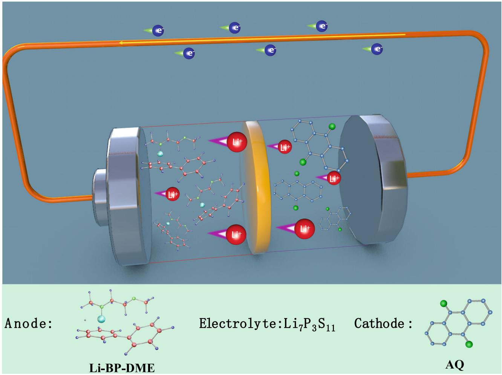
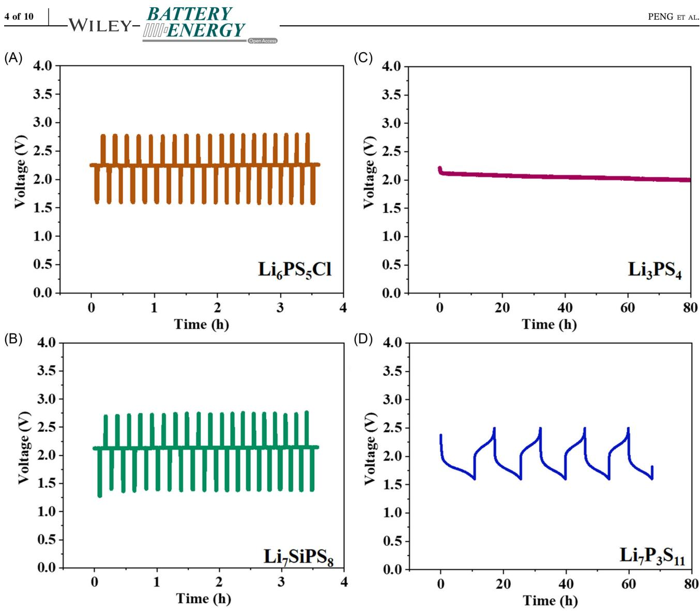
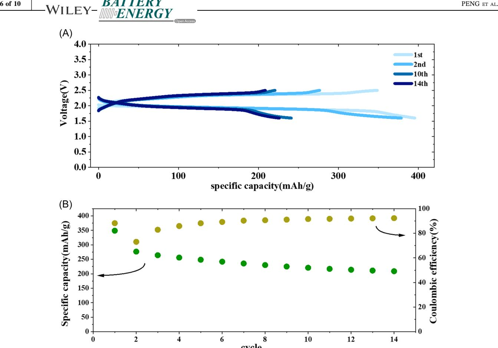
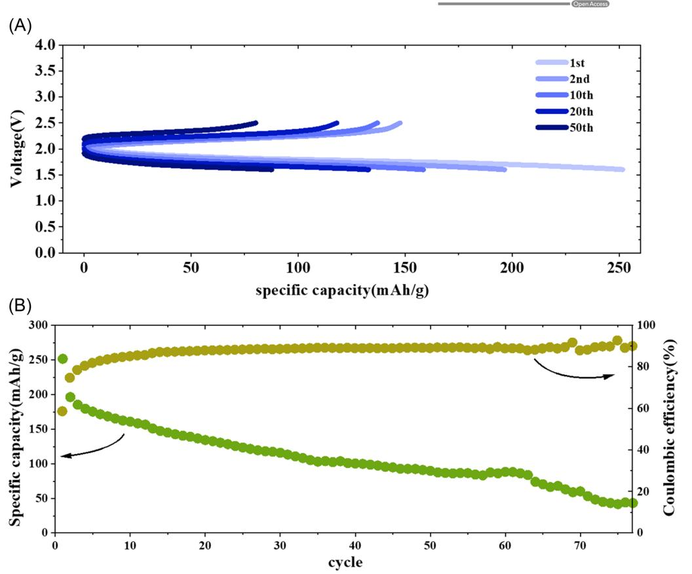
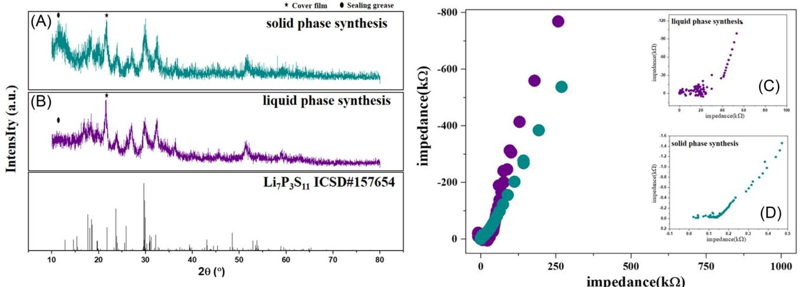
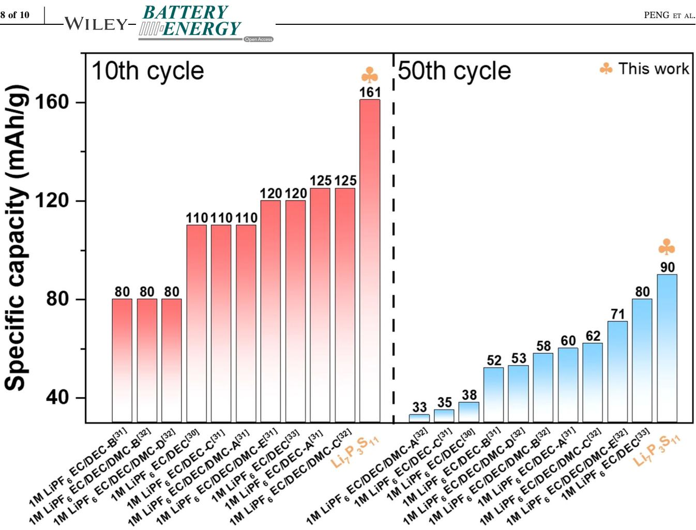

# Long‐life high‐capacity lithium battery with liquid organic cathode and sulfide solid electrolyte

Jian Peng1,2,3,4 | Dengxu Wu1,2,3,4 | Hong Li1,2,3,4 | Liquan Chen1,2,3,4 |

Fan Wu1,2,3,4,[5](http://orcid.org/0000-0002-7928-571X)

1 Key Laboratory for Renewable Energy, Beijing Key Laboratory for New Energy Materials and Devices, Beijing National Laboratory for Condensed

2 University of Chinese Academy of Sciences, Beijing, China

3 Tianmu Lake Institute of Advanced Energy Storage Technologies, Liyang, China

Matter Physics, Institute of Physics, Chinese Academy of Sciences, Beijing, China

4 Yangtze River Delta Physics Research Center, Liyang, China

5 Nano Science and Technology Institute, University of Science and Technology of China, Suzhou, China

#### Correspondence

Fan Wu, University of Chinese Academy of Sciences, Beijing, 100049, China. Email: [fwu@iphy.ac.cn](mailto:fwu@iphy.ac.cn)

#### Funding information

Science and Technology Research Institute of China Three Gorges Corporation, Grant/Award Number: 202103402; Key Program‐Automobile Joint Fund of National Natural Science Foundation of China, Grant/Award Number: U1964205; Outstanding Youth Fund Project by Department of Science and Technology of Jiangsu Province, Grant/Award Number: BK20220045; Cultivation project of leading innovative experts in Changzhou City, Grant/Award Number: CQ20210003; Talent Program of Chinese Academy of Sciences, "Scientist Studio Program Funding" from Yangtze River Delta Physics Research Center and Tianmu Lake Institute of Advanced Energy Storage Technologies, Grant/Award Number: TIES‐SS0001; General Program of National Natural Science Foundation of China, Grant/Award Number: 51972334; Key R&D Project funded by Department of Science and Technology of Jiangsu Province, Grant/Award Number: BE2020003; National Overseas High‐level Expert recruitment Program, Grant/Award Number: E1JF021E11;

#### Abstract

Electrochemical batteries with organic electrode materials have attracted worldwide attention due to their high safety, low cost, renewability, low contamination, and easiness of recycling. However, the practical application of such system is limited by low density, low electronic/ionic conductivity, and the dissolution of organic electrode materials in conventional liquid electrolytes. Herein, a novel battery configuration is proposed to replace liquid electrolyte/solid organic cathode with solid electrolyte/liquid organic cathode to ultimately solve the shuttle effect and dissolution problem of organic cathodes. More importantly, this configuration combines room‐temperature high‐safety liquid lithium metal anode Li‐BP‐DME that can essentially inhibit lithium dendrite nucleation/growth and sulfide SE with ultrahigh room‐temperature ionic conductivity for facilitated ion‐conduction.

#### KEYWORDS

anthraquinone cathode, liquid lithium metal, sulfide solid electrolyte

This is an open access article under the terms of the Creative Commons Attribution License, which permits use, distribution and reproduction in any medium, provided the original work is properly cited.

© 2023 The Authors. Battery Energy published by Xijing University and John Wiley & Sons Australia, Ltd.

## 1 | INTRODUCTION

Inorganic transition‐metal oxide and phosphate materials (such as LiCoO2, LiMn2O4, LiNi1‐x‐yCoxMnyO2, or LiFePO4) are currently the major cathode materials for commercial lithium‐ion batteries, but the mineral resources used to produce these materials are nonrenewable and limited. The global energy market will face a new round of resource crises with the dramatically increased production of electric vehicles and portable electronics as well as the complicated/costly battery recycling technology. Therefore, recyclable organic electrode materials have received considerable attention in recent years1[–](#page-8-0)4 due to their high safety, low cost, renewability, low pollution, and ease to recycle, thus the development of recyclable organic electrode materials has become the research frontier in the battery field.5–[10](#page-8-1) Organic electrode materials are rich in carbon, hydrogen, oxygen, and other elements. With the advantages of renewability, low cost, and high capacity, organic‐ electrode lithium‐ion batteries are expected to be a very promising candidate for the energy‐storage system. Although organic electrode materials have many advantages, their applications in batteries still face many technical challenges.[11](#page-8-2) First of all, the low density of organic electrode materials (<2 g cm−3 ) leads to a low bulk energy density of the battery. Moreover, the low electronic and ionic conductivities of organic electrode materials require the use of a large number of conductive agents, also resulting in low energy densities. In addition, the dissolution of organic electrode materials in conventional electrolytes leads to a severe loss of active materials and the shuttle effect, which lead to capacity decay and low cycle efficiency.

To solve the above difficulties, this work innovatively replaces the conventional organic electrolyte/solid organic cathode with a solid electrolyte (SE)/liquid organic cathode to successfully solve the shuttle effect and dissolution problem. Replacing the liquid electrolyte with SE not only provides advantages in battery design but also avoids catastrophic consequences such as outgassing, thermal runaway, and combustion caused by short circuits in conventional carbonate liquid‐electrolyte batteries. Since organic quinones are generally soluble in liquid organic electrolytes, the cycle performance of lithium‐ion batteries with quinone organic compounds as cathodes is not good. In this work, an organic solvent with higher solubility is adopted to dissolve the solid organic cathode for the liquid organic cathode, which successfully avoids the capacity degradation caused by solid anthraquinone dissolved in liquid organic electrolytes. This work also mitigates bulk density and conductivity issues through electrode design and battery configuration design. The new battery uses anthraquinone (AQ, a carbonyl compound with a high theoretical specific capacity, 256 mAh/g), as the active material for cathode, liquid‐lithium metal (Li‐BP‐DME) anode, and sulfide SE. Liquid lithium metal Li‐BP‐ DM[E12](#page-8-3)–15 has the advantages of low cost, simple/efficient preparation, high conductivity of 12 mS cm−1 , and low potential of 0.3 V versus Li/Li+. Most importantly, it can essentially inhibit the nucleation and growth of lithium dendrites and prevent the safety hazard of internal short circuits caused by dendrites growth. In addition, compared with lithium metal, the reaction between liquid lithium metal and water is mild without any observable flame. Sulfide SEs have the highest room‐temperature ionic conductivity among all types of SEs, ideal mechanical ductility, and good thermal stability. Moreover, a fully compact sulfide SE membrane with low porosity can be achieved by simple room‐temperature cold pressing,[16](#page-8-4)–29 which is almost void‐free to effectively prevent the shuttle effect and short circuit. Furthermore, Li7P3S11 was found to be the most suitable sulfide SE through compatibility experiments of various sulfide SEs with organic cathodes and anodes. The organic lithium battery assembled with Li7P3S11 shows longer cycle life and higher capacity compared with the organic lithium battery using liquid electrolytes. These results corroborate that this new secondary battery has the advantages of desirable electrochemical performance and low cost, which provides a new idea for the development of energy‐storage devices.

#### 2 | EXPERIMENTAl SECTION

## 2.1 | Li1.5BP3DME10 solution preparation

The Li1.5Bp3DME10 solution was prepared in a glove box filled with argon (O2 < 0.1 ppm, H2O < 0.1 ppm). Different amounts of lithium metal (China Energy Lithium Co. Ltd), biphenyl (alfa Aesar), and DME (alfa Aesar) were prepared according to the molar ratio of the Li1.5Bp3DME10 solution. Then, biphenyl was dissolved PENG ET AL. | 3 of 10

in DME at ambient temperature in glass bottles to form a transparent, colorless solution. Finally, the lithium metal pieces were put into the Bp3DME10 solution with heating for 10 min in a 60°C water bath.

## 2.2 | AQ solution preparation

Five milligrams of anthraquinone were dissolved in 10 mL of propylene carbonate (PC) solution; 2.87 g of Lithium bis (trifluoromethanesulphonyl)imide LiTFSI and 400 mg of conductive carbon Super P were added into the PC solution. Finally, the mixture was well stirred.

## 2.3 | Preparation of the Li7P3S11 pellet

First, amorphous Li7P3S11 precursor powder was synthesized by two methods. One is liquid phase synthesis. The precursor was obtained by dissolving Li2S (99.9%, Ganfeng Lithium) and P2S5 (99.9%, Macklin) with a molar ratio of 7:3 in 20 mL Acetonitrile (ACN) at 50°C for 48 h. The ACN solution was evaporated and the precursor powder was placed in a vacuum oven and treated at 100°C for 24 h. The other method is solid phase synthesis. The precursor was obtained by ball‐milling Li2S (99.9%, Ganfeng Lithium) and P2S5 (99.9%, Macklin) with a molar ratio of 7:3. Then the precursor was pressed into pellets, which were vacuum‐ sealed in a quartz tube, and heated at 260°C for several hours. 150 mg of the Li7P3S11 power was pressed into a pellet under a pressure of 65 MPa. The diameter of the Li7P3S11 pellet was 15 mm and the thickness was 500 μm.

## 2.4 | Preparation of home‐made battery

Five milliliters of Li1.5Bp3DME10 solution and 5 ml AQ cathode solution were added into two tanks of the homemade cell separately. The Li7P3S11 pellet was placed in the middle of two tanks. The schematic illustration of the battery system is shown in Figure [1.](#page-2-0)

FIGURE 1 Schematic illustration of the battery system.

FIGURE 2 Voltage profiles of organic batteries with different sulfide solid electrolytes (A: Li6PS5Cl, B: Li7SiPS8, C: Li3PS4, D: Li7P3S11) at 0.127 mA cm−2 .

## 2.5 | Structure characterization, conductivity measurement, and electrochemical cell testing

The crystal structure of synthesized materials was investigated by X‐ray diffraction (XRD, Beijing Purkinje XD2), equipped with Cu Kα radiation (λ = 1.54056 A) and operated at 36 kV and 20 mA in the 2θ range of 10°–80°. The ionic conductivity was measured by electrochemical impedance spectroscopy (EIS) by using an electrochemical workstation (Zahner IM6e). EIS data were recorded in the frequency range from 100 mHz to 8.0 MHz by applying an alternating voltage of 5 mV at room temperature. The galvanostatic charge–discharge test was carried out on a battery tester (CT2001, Land Ins.) at a cutoff voltage between −5 V and 5 V.

#### 3 | RESULTS AND DISCUSSION

## 3.1 | Compatibility study of different sulfide solid electrolytes with organic electrodes

Sulfide SE has poor chemical stability with a polar solvent, and the contact between them will lead to chemical side reactions. As a result, on the surface of sulfide SE, an interfacial layer is generated, which determines the performance of the battery. Therefore, the selection of sulfide SEs that are compatible with organic liquid electrodes is a prerequisite for the operation of the battery. Comparative experiments were conducted on four mainstream sulfide SEs (Li6PS5Cl, Li7SiPS8, Li3PS4, and Li7P3S11). The voltage profiles are shown in Figure [2.](#page-3-0) It can be seen that the voltage–time curve of the batteries assembled with Li6PS5Cl and Li7SiPS8 have no voltage plateau for charging and discharging, and the voltage values jump between cutoff voltages (Figure [2A,B](#page-3-0)). This indicates that the ionic conductivity of the interface formed by the reaction of the Li6PS5Cl and Li7SiPS8 in contact with the organic liquid electrode (AQ‐LiTFSI‐PC and Li‐BP‐ DME solution) is very poor, and therefore the battery cannot operate properly. The voltage‐time curve of the battery assembled with Li3PS4 shows that the voltage decreases slowly with time and the battery remains in a discharged state without normal charging and discharging (Figure [2C\)](#page-3-0). This indicates that the interface formed by the reaction between Li3PS4 and the organic liquid electrode after contact is unstable and a continuous interfacial reaction occurs, so the battery also cannot operate properly. The voltage–time curve of the battery assembled with Li7P3S11 shows a normal charge–discharge curve as well as a discharge voltage plateau of ~1.9 V and a charging voltage plateau of ~2.2 V (Figure [2D\)](#page-3-0). It indicates that the interface formed by the reaction of Li7P3S11 in contact with the organic liquid electrode is more stable and the ionic conductivity of the interfacial layer is better, so the battery can operate normally. The different crystal structures of Li3PS4 and Li7P3S11 are used to explain the possible reasons for the different battery behaviors of Li3PS4 and Li7P3S11. It is well known that Li3PS4 is mainly composed of PS4 3− units, while the structure of Li7P3S11 is based on PS4 3− and P2S7 4− units. Bridging sulfur exists in the P2S7 4− unit, but not in PS4 3− unit. The different chemical bond strengths and chemical stabilities of these two structural units result in their different chemical compatibilities with liquid cathode/anode materials, which may be the reason for the differences in batteries with Li3PS4 and Li7P3S11. Through the above comparison experiments, it is found that Li7P3S11 electrolyte has better compatibility with the organic liquid electrode (AQ‐LiTFSI‐PC and Li‐BP‐DME solution), and the organic lithium battery assembled with it can operate normally.

## 3.2 | Batteries electrochemical performance of Li7P3S11 electrolytes prepared by different methods

After screening the Li7P3S11 electrolyte as a sulfide SE of with better compatibility with organic liquid electrodes, the effects of Li7P3S11 electrolytes prepared by different preparation methods (solid phase synthesis and liquid phase synthesis) on the battery performance were further investigated. Figure [3](#page-5-0) shows the electrochemical performance of the battery with Li7P3S11 synthesized by the solid phase method. Figure [3A](#page-5-0) shows the 1st, 2nd, 10th, and 14th cycle charge/discharge

PENG ET AL. | 5 of 10

profiles of the batteries in the voltage range of 1.6−2.5 V. The specific capacity in the first cycle was 395.6 mAh g−1 , which exceedes AQ's theoretical specific capacity of 256 mAh g−1 . This may be due to the interfacial reaction between the Li7P3S11 electrolyte and the organic liquid electrode upon contact during the initial discharge process, and there was a partial decomposition of Li7P3S11, which contributed a part of the specific capacity. In the later cycles, the battery capacity gradually decreased, and in the 10th cycle, the discharge‐specific capacity decreased to 241.1 mAh g−1 , which was close to the theoretical specific capacity of AQ. The charge and discharge voltage plateau were ~2.2 and ~1.9 V, respectively. Figure [3B](#page-5-0) shows the cycling performance of the battery. The first‐cycle Coulombic efficiency was 88.2% and maintained ~90% until the 14th cycle. After the 14th cycle, the battery capacity decreased rapidly and the battery failed. The reason may be that the interface layer generated during the initial cycle has good ionic conductivity, which enables the battery to operate, but the electrochemical stability of this interface layer is poor, and poor ionic conductivity is continuously generated during the battery cycle and accumulates at the interface, leading to an increase in the internal resistance of the battery, and the battery eventually fails.

Figure [4](#page-6-0) shows the electrochemical performance of the battery with Li7P3S11 synthesized by the liquid phase method. Figure [4A](#page-6-0) shows the 1st, 2nd, 10th, 20th, and 50th cycle charge/discharge profiles of the batteries in the voltage range of 1.6−2.5 V. The specific capacity in the first cycle is 251.7 mAh g−1 , and this specific capacity value is close to the theoretical specific capacity of anthraquinone (256 mAh g−1 ). The battery capacity gradually decreased in the later cycles, the discharge‐ specific capacity decreased to 161.1 mAh g−1 at the 10th cycle and 90.1 mAh g−1 at the 50th cycle. The charge and discharge voltage plateau were ~2.2 and ~1.8 V, respectively. From the charge/discharge curves, the polarization voltage of the battery increased with the increase of the cycle. This may be due to the deterioration of the interface or the denaturation of the organic liquid electrode due to the lack of sealing of the battery. Figure [4B](#page-6-0) shows the cycling performance of the battery. The first‐cycle Coulombic efficiency was 58.6% and maintains ~90% until the 77th cycle. The battery capacity gradually decreased (from 251.7 mAh g−1 [1st cycle] to 43.5 mAh g−1 [77th cycle]). Compared with the liquid phase‐synthesized Li7P3S11‐assembled batteries, the solid phase‐synthesized Li7P3S11‐assembled batteries showed better cycling performance, and no sudden failure was observed.

To investigate the reasons for the different performance of the batteries assembled from Li7P3S11 prepared

FIGURE 3 Electrochemical performance of anthraquinone (AQ)/Li7P3S11 (solid phase synthesis)/Li1.5BP3DME10 battery at 0.127 mA cm−2 (~0.1 C). (A) The charge–discharge curves. (B) Cycle performance.

by the two methods (solid phase synthesis and liquid phase synthesis), XRD characterizations of Li7P3S11 synthesized by the two methods were carried out and corresponding ionic conductivities were tested by EIS spectra. The XRD patterns of the synthesized Li7P3S11 solid electrolytes via the solid‐state synthesis method and liquid phase synthesis are shown in Figure [5A,B](#page-6-1), which corresponds well with the indexed diffraction pattern of the Li7P3S11 phase (ICSD #157654) without the impurity phase. This indicates that the electrolyte material synthesized by two methods is Li7P3S11. The electrochemical performances of the synthesized Li7P3S11 via two routes were also compared. Figure [5C,D](#page-6-1) shows the Nyquist plots. The plots both consist of a semicircle and a spike. The line in the low‐frequency region represents the diffusion impedance, and the incomplete semicircle contains the grain boundary resistance (RSE,gb) of the solid electrolyte in the intermediate frequency region and the bulk resistance (RSE,bulk) of the solid electrolyte in the high‐frequency region. After calculation, the ionic conductivity of the Li7P3S11 electrolyte synthesized in the liquid phase method was 0.0045 mS cm−1 and that of the Li7P3S11 electrolyte prepared by the ball milling method was 0.64 mS cm−1 . The high ionic conductivity of the Li7P3S11 electrolyte synthesized in the solid phase is consistent with the lower polarization voltage of the batteries assembled with the Li7P3S11 electrolyte synthesized in the solid phase. As for the liquid phase‐synthesized Li7P3S11 electrolyte with low ionic conductivity but relatively better cycling performance, it may be because the solvent involvement in the electrolyte preparation process affects not only the electrolyte material but also the electrochemical performance of the battery.

The cycle performance of batteries assembled with the Li7P3S11 electrolyte prepared by liquid‐phase synthesis is better than the AQ cathode batteries of the liquid electrolyte without additives such as LiNO3. 30–[34](#page-9-0) Comparison of the cycling performance in this study with the previous reports about AQ for lithium batteries is shown in Figure [6](#page-7-0) and Table [1](#page-7-1). Due to the high solubility and shuttle effect of carbonyl compounds in conventional liquid electrolytes, the cycling performance of AQ cathode batteries is poor, and the discharge‐ specific capacity decreases rapidly with increasing cycles, with the specific capacity of the battery dropping to 80–125 mAh g−1 after 10 cycles and to about 33–80 mAh g−1 after 50 cycles.[30](#page-9-0)–34 However, it can be

FIGURE 4 Electrochemical performance of AQ/Li7P3S11 (liquid phase synthesis)/Li1.5BP3DME10 battery at 0.127 mA cm−2 (~0.1 C). (A) The charge–discharge curves. (B) Cycle performance.

FIGURE 5 X‐ray diffraction (XRD) patterns of the synthesized Li7P3S11 solid electrolytes via solid‐state synthesis method (A), liquid phase synthesis (B), and the indexed diffraction pattern of the Li7P3S11 phase (ICSD #157654). Impedance spectroscopy of Li7P3S11 solid electrolytes via liquid synthesis method (C) and solid‐state phase synthesis (D).

seen that cycling performance in this study is higher than those reported. The specific capacity of the battery is 161 mAh g−1 after 10 cycles and 90 mAh g−1 after 50 cycles. The above results indicate that this sulfide‐based organic lithium battery can solve the problem of the high solubility of AQ in liquid electrolyte and shuttle effect, therefore improving the cycling performance of the AQ organic lithium battery.

FIGURE 6 Comparison of the cycling performance in this study with the previous reports about anthraquinone (AQ) for lithium batteries.

TABLE 1 Comparison of the cycling performance in this study with the previous reports about anthraquinone (AQ) for lithium batteries.

| No. | Electrolyte                                 | 10th specific capacity (mAh/g) | 50th specific capacity (mAh/g) | Reference |
|-----|---------------------------------------------|-----------------------------------|-----------------------------------|-----------|
| 1   | 1 M LiPF6 EC/DEC/DMC‐A (AQ unmodified)      | 110                               | 33                                | [33]      |
| 2   | 1 M LiPF6 EC/DEC‐C (AQ with PVDF binder)    | 110                               | 35                                | [31]      |
| 3   | 1 M LiPF6 EC/DEC                            | 110                               | 38                                | [30]      |
| 4   | 1 M LiPF6 EC/DEC‐B (AQ with CMC‐Li2 binder) | 80                                | 52                                | [31]      |
| 5   | 1 M LiPF6 EC/DEC/DMC‐D (AQ/CNF/Li3)         | 80                                | 53                                | [33]      |
| 6   | 1 M LiPF6 EC/DEC/DMC‐B (AQ/CNF/Li1)         | 80                                | 58                                | [33]      |
| 7   | 1 M LiPF6 EC/DEC‐C (AQ with CMC‐Li1 binder) | 125                               | 60                                | [31]      |
| 8   | 1 M LiPF6 EC/DEC/DMC‐C (AQ/CNF/Li2)         | 125                               | 62                                | [33]      |
| 9   | 1 M LiPF6 EC/DEC/DMC‐E (AQ/CNF/Li4)         | 120                               | 71                                | [33]      |
| 10  | 1 M LiPF6 EC/DEC                            | 120                               | 80                                | [34]      |
| 11  | Li7P3S11                                    | 161                               | 90                                | This work |

## 4 | CONCLUSION

In summary, a novel battery configuration is proposed to replace liquid electrolyte/solid organic cathode with solid electrolyte/liquid organic cathode to ultimately solve the shuttle effect and dissolution problem of organic cathodes. Li7P3S11 is found to be the most suitable sulfide SE through compatibility experiments of various sulfide SEs with organic cathodes and anodes, and the electrochemical performances of batteries assembled with Li7P3S11 prepared by liquid‐phase synthesis are better than solid‐phase‐ synthesized counterparts. Moreover, the organic lithium battery assembled with Li7P3S11 and room‐ temperature high‐safety dendrite‐free liquid lithium metal anode Li‐BP‐DME shows longer cycle life and higher capacity compared with the organic lithium battery using the liquid electrolyte. These results show that this new secondary battery has the advantages of long cycle life and low cost, which provides a new idea for the development of energy‐storage batteries.

#### ACKNOWLEDGMENTS

This work is supported by the Outstanding Youth Fund Project by the Department of Science and Technology of Jiangsu Province (Grant No. BK20220045), the Key R&D Project funded by the Department of Science and Technology of Jiangsu Province (Grant No. BE2020003), Key Program‐Automobile Joint Fund of National Natural Science Foundation of China (Grant No. U1964205), General Program of National Natural Science Foundation of China (Grant No. 51972334), General Program of National Natural Science Foundation of Beijing (Grant No. 2202058), Cultivation project of leading innovation experts in Changzhou City (CQ20210003), National Overseas High‐level Expert recruitment Program (Grant No. E1JF021E11), Talent Program of Chinese Academy of Sciences, "Scientist Studio Program Funding" from Yangtze River Delta Physics Research Center and Tianmu Lake Institute of Advanced Energy Storage Technologies (Grant No. TIES‐SS0001), and Science and Technology Research Institute of China Three Gorges Corporation (Grant No. 202103402).

#### CONFLICT OF INTEREST STATEMENT

The authors declare no conflict of interest.

#### DATA AVAILABILITY STATEMENT

The data that support the findings of this study are available from the corresponding author upon reasonable request.

# ORCID

Fan Wu <http://orcid.org/0000-0002-7928-571X>

#### REFERENCES

- 1. Armand M, Tarascon JM. Building better batteries. Nature. 2008;451:652‐657.
- 2. Chen H, Armand M, Demailly G, Dolhem F, Poizot P, Tarascon JM. From biomass to a renewable LixC6O6 organic electrode for sustainable Li‐ion batteries. Chem. Sus. Chem. 2008;1:348‐355.
- 3. Xiang J, Chang C, Li M, Wu S, Yuan L, Sun J. A novel coordination polymer as positive electrode material for lithium‐ion battery. Cryst Growth Des. 2008;8:280‐282.
- 4. Armand M, Grugeon S, Vezin H, et al. Conjugated dicarboxylate anodes for Li‐ion batteries. Nat Mater. 2009;8:120‐125.
- 5. Lu Y, Hou X, Miao L, et al. Cyclohexanehexone with ultrahigh capacity as cathode materials for lithium‐ion batteries. Angew Chem Int Ed. 2019;58:7020‐7024.
- 6. Iordache A, Delhorbe V, Bardet M, Dubois L, Gutel T, Picard L. Perylene‐based all‐organic redox battery with excellent cycling stability. ACS Appl Mater Interfaces. 2016;8:22762‐22767.
- 7. Bhargav A, Bell ME, Karty J, Cui Y, Fu Y. A class of organopolysulfides as liquid cathode materials for high‐ energy‐density lithium batteries. ACS Appl Mater Interfaces. 2018;10:21084‐21090.
- 8. Hansen K‐A, Nerkar J, Thomas K, et al. New spin on organic radical batteries—an isoindoline nitroxide‐based high‐voltage cathode material. ACS Appl Mater Interfaces. 2018;10: 7982‐7988.
- 9. Matsunaga T, Kubota T, Sugimoto T, Satoh M. High‐ performance lithium secondary batteries using cathode active materials of triquinoxalinylenes exhibiting six electron migration. Chem Lett. 2011;40:750‐752.
- 10. Han X, Qing G, Sun J, Sun T. How many lithium ions can be inserted onto fused C6 aromatic ring systems? Angew Chem Int Ed. 2012;51:5147‐5151.
- 11. Lu Y, Chen J. Prospects of organic electrode materials for practical lithium batteries. Nat Rev Chem. 2020;4(3):127‐142.
- 12. Peng J, Wu D, Song F, et al. High current density and long cycle life enabled by sulfide solid electrolyte and dendrite‐free liquid lithium anode. Adv Funct Mater. 2022; 32:2105776.
- 13. Peng J., Wu D., Lu P., et al. High‐safety, wide‐temperature‐ range, low‐external‐pressure and dendrite‐free lithium battery with sulfide solid electrolyte. Energy Storage Mater. 2023; 54:430‐439.
- 14. Deng H, Chang Z, Qiu F, et al. A safe organic oxygen battery built with Li‐based liquid anode and MOFs separator. Adv Energy Mater. 2020;10:1903953.
- 15. Chu G, Liu BN, Luo F, et al. Conductivity and applications of Li‐biphenyl‐1,2‐dimethoxyethane solution for lithium ion batteries. Chin Phys B. 2017;26(7):078201.
- 16. Xu J, Li J, Li Y, et al. Long‐life lithium‐metal all‐solid‐state batteries and stable Li plating enabled by in situ formation of Li3PS4 in the SEI layer. Adv Mater. 2022;34:2203281.
- 17. Li Y, Wu Y, Ma T, et al. Long‐life sulfide all‐solid‐state battery enabled by substrate‐modulated dry‐process binder. Adv Energy Mater. 2022;12:2201732.

# 10 of 10 | PENG ET AL.

- 18. Wang S, Wu Y, Ma T, Chen L, Li H, Wu F. Thermal stability between sulfide solid electrolytes and oxide cathode. ACS Nano. 2022;16:16158‐16176.
- 19. Wang J, Zhang Z, Han J, et al. Interfacial and cycle stability of sulfide all‐solid‐state batteries with Ni‐rich layered oxide cathodes. Nano Energy. 2022;100:107528.
- 20. Xu J, Wang Q, Yan W, Chen L, Li H, Wu F. Liquid‐phase synthesis of Li2S and Li3PS4 with lithium‐based organic solutions. Chin Phys B. 2022;31(09):098203.
- 21. Lu P, Liu L, Wang S, et al. Superior all‐solid‐state batteries enabled by a gas‐phase‐synthesized sulfide electrolyte with ultrahigh moisture stability and ionic conductivity. Adv Mater. 2021;33:2100921.
- 22. Xu J, Li Y, Lu P, et al. Water‐stable sulfide solid electrolyte membranes directly applicable in all‐solid‐state batteries enabled by superhydrophobic Li+‐conducting protection layer. Adv Energy Mater. 2022;12:2102348.
- 23. Liu H, Zhu Q, Wang C, et al. High air stability and excellent Li metal compatibility of argyrodite‐based electrolyte enabling superior all‐solid‐state Li metal batteries. Adv Funct Mater. 2022; 32:2203858.
- 24. Liu H, Liang Y, Wang C, et al. Priority and prospect of sulfide‐ based solid‐electrolyte membrane. Adv Mater. 2022;2206013.
- 25. Liang Y, Liu H, Wang G, et al. Heuristic design of cathode hybrid coating for power‐limited sulfide‐based all‐solid‐state lithium batteries. Adv Energy Mater. 2022;12:2201555.
- 26. Ni Y, Huang C, Liu H, Liang Y, Fan L‐Z. A high air‐stability and Li‐metal‐compatible Li3+2xP1−xBixS4−1.5xO1.5x sulfide electrolyte for all‐solid‐state Li‐metal batteries. Adv Funct Mater. 2022;32:2205998.
- 27. Liang Y, Liu H, Wang G, et al. Challenges, interface engineering, and processing strategies toward practical sulfide‐based all‐solid‐ state lithium batteries. InfoMat. 2022;4(5):e12292.
- 28. Liu H, He P, Wang G, Liang Y, Wang C, Fan LZ. Thin, flexible sulfide‐based electrolyte film and its interface engineering for

high performance solid‐state lithium metal batteries. Chem Eng J. 2022;430(3):132991.

- 29. Fan LZ, He H, Nan CW. Tailoring inorganic‐polymer composites for the mass production of solid‐state batteries. Nat Rev Mater. 2021;6:1003‐1019.
- 30. Lei Z, Wei‐kun W, An‐bang W, Zhong‐bao Y, Shi C, Yu‐ sheng Y. A MC/AQ parasitic composite as cathode material for lithium battery. J Electrochem Soc. 2011;158(9): A991‐A996.
- 31. Xie L, Zhao L, Wan J, Shao Z, Wang F, Lv S. The electrochemical performance of carboxymethyl cellulose lithium as a binding material for anthraquinone cathodes in lithium batteries. J Electrochem Soc. 2012; 159(4):A499‐A505.
- 32. Song Z, Zhou H. Towards sustainable and versatile energy storage devices: an overview of organic electrode materials. Energy Environ Sci. 2013;6:2280‐2301.
- 33. Lei Q, Shao Z, Liu M, et al. Synthesis and electrospinning carboxymethyl cellulose lithium (CMC‐Li) modified 9,10‐ anthraquinone (AQ) high‐rate lithium‐ion battery. Carbohydr Polym. 2014;102:986‐992.
- 34. Zhang K, Guo C, Zhao Q, Niu Z, Chen J. High‐performance organic lithium batteries with an ether‐based electrolyte and 9,10‐Anthraquinone (AQ)/CMK‐3 cathode. Adv Sci. 2015;2: 1500018.

How to cite this article: Peng J, Wu D, Li H, Chen L, Wu F. Long‐life high‐capacity lithium battery with liquid organic cathode and sulfide solid electrolyte. Battery Energy. 2023;2:20220059. [doi:10.1002/bte2.20220059](https://doi.org/10.1002/bte2.20220059)