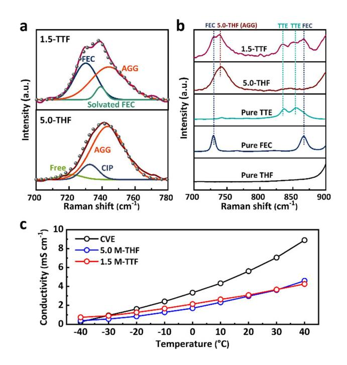
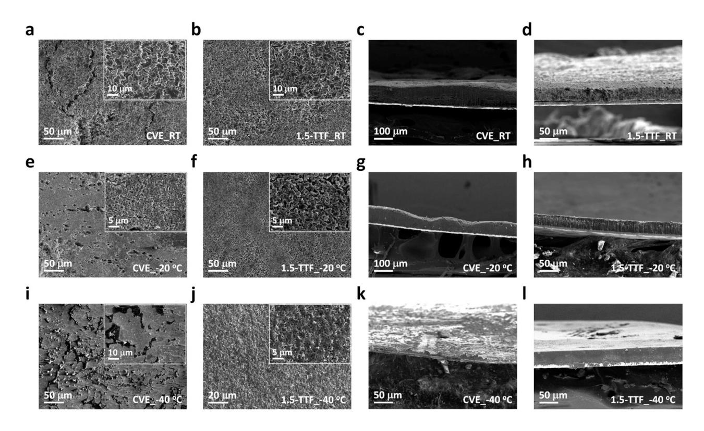
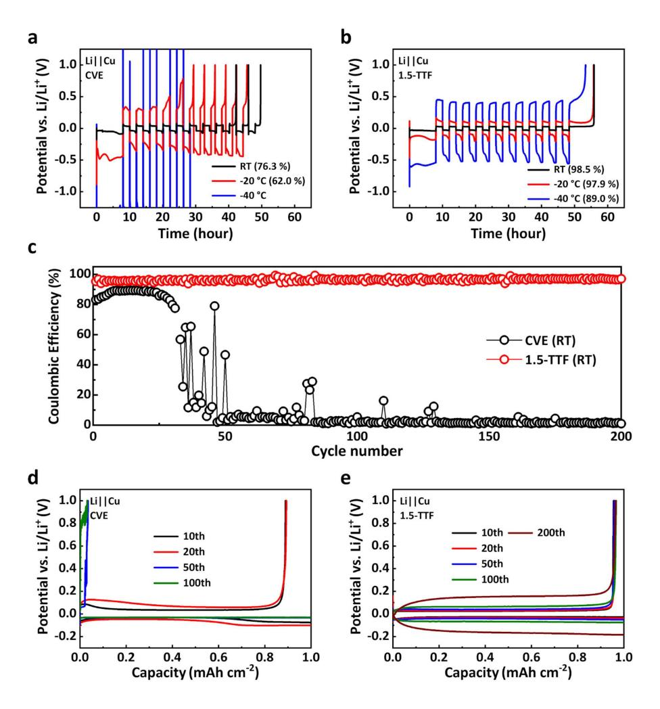
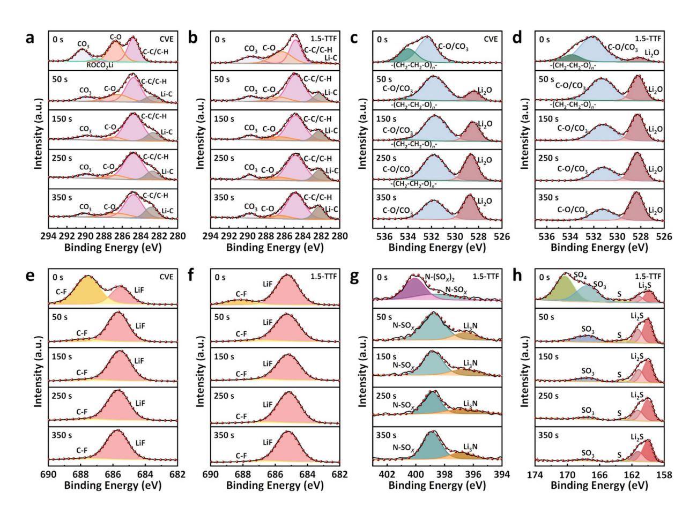
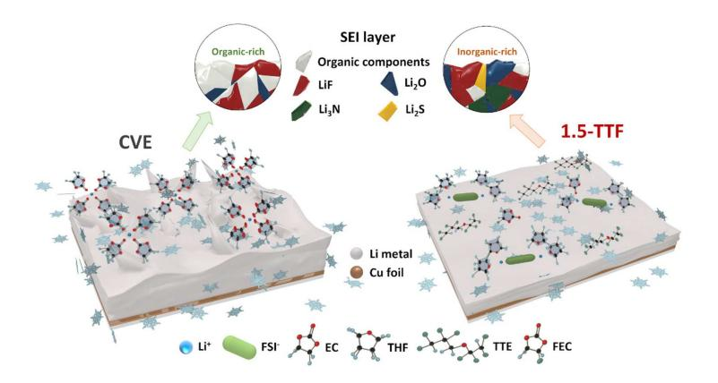
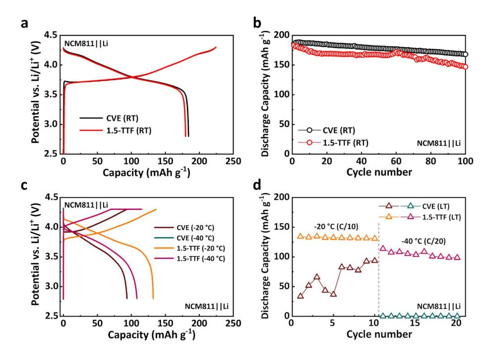

# **Tailored Solvation and Interface Structures by Tetrahydrofuran-Derived Electrolyte Facilitates Ultralow Temperature Lithium Metal Battery Operations**

Soohwan Kim[a] and Vilas G. Pol\*[a]

Ineffectiveness of Li-ion batteries (LIBs) in cold climates hinders electronics to work in various conditions including frigid environments, despite high demands. Given that intrinsic properties of LIB materials cause this problem, optimized cell chemistries ultimately are required for low-temperature usage. In this study, Li-metal batteries (LMBs) composed of a Li-metal anode (LMA) stabilized by a localized high-concentration electrolyte (LHCE) are found to significantly enhance lowtemperature performance. The LHCE allows the LMA to have compact and regular deposition and excellent plating/stripping

## **Introduction**

The development of rechargeable batteries for cold climates is becoming crucial, as people are actively using electronic devices in any conditions, including frigid environments for advanced exploration and military missions.[1] Nevertheless, severe performance degradation of current Li-ion batteries (LIBs) at low temperatures and their inability to operate at ultralow ( $\leq$  -40 °C) temperature have impeded their coldclimate application.[1] The LIB electrolytes composed of carbonate solvents are ineffectual for low-temperature operation because of high melting/freezing point solvents, high Li+ desolvation barrier, and poor Li+ conductivity.[1] Moreover, graphite anodes for the LIB suffer high charge-transfer resistance and uncontrolled Li plating on the graphite surface as temperature get lowered.[2] Therefore, these incompetences at low-temperature operations suggest that the batteries ultimately need to be designed with alternative materials for lowtemperature operation.

Li-metal battery (LMB) has an advantageous reaction mechanism of Li plating/stripping on Li-metal anode (LMA) for low-temperature operation compared to the intercalation mechanism of the graphite.[2b,3] The graphite intercalation reaction includes desolvation of Li+, Li+ transport through

efficiency at sub-zero temperatures. The LHCE produces an inorganic-rich solid-electrolyte interphase with larger amounts of Li2O/LiF interfaces, dominance of ion aggregates in Li+ solvation, and enhanced Li+ transport, which can greatly improve the LMA stability. LMB full cells based on  $LiNi_{0.8}Co_{0.1}Mn_{0.1}O_2$  cathodes with the tailored electrolyte show high retentions of 75 and 64% at  $-20$  and  $-40$  °C, respectively. Furthermore, the LMB configuration retains its charge - discharge capability even at  $-60$  °C.

solid-electrolyte interphase (SEI), and Li+ solid-state diffusion within the graphite. These reaction processes inevitably become slower as temperature goes down, thereby inducing the aforementioned issues of graphite at low-temperature.[2] However, the LMA can accelerate the Li+ desolvation process through electrical neutralization with electrons and circumvent the long-distance charge-transfer process during the Li+ reactions.[2b,3] However, lack of proper electrolytes has obstructed the LMA utilization for the batteries, as causing unstable SEI, irregular Li plating, and low Coulombic efficiency (CE).[4] In particular, this issue becomes more prominent at lowtemperature due to retarded charge-transfer in bulk transport electrolyte and the SEI, which cause rapid Li dendrite growth, despite the merits of the reaction mechanism.[5]

Localized high salt-concentration electrolyte (LHCE) is a potentially promising approach that has recently made a lot of progress to mitigate the problems of the LMA.[6] By incorporating non-solvating diluents, the LHCE can relieve high viscosity and poor wettability issues in high salt-concentration electrolyte (HCE), while maintaining benefits of the HCE from a distinct solvation structure.[6a,7] The lowered viscosity can enhance charge-transfer kinetics of Li cycling by facilitating Li+ migration, especially at low-temperature.[8] The LHCEs retain extensive anions coordination with solvent molecules and Li+, creating larger aggregates (AGGs) ion-pairs in Li+ solvation structure with less free solvent molecules and free anions in the electrolyte.[6] This AGG-rich solvation structure enhances Li+ mass transport in electrolytes, which can lead to higher and homogenous Li+ availability at electrode surface.[9] It eventually enables the LMA to have dense and uniform deposition morphology.[9a] In addition, as a result of the extensive ionpairing in the  $Li^+$  solvation structure, the anions can generate plenty of inorganic decomposition products in the SEI.[6] This inorganic-rich environment produces a stable, robust, and thin

ChemSusChem 2023, 16, e202202143 (1 of 9)

[a] S. Kim, Prof. V. G. Pol Davidson School of Chemical Engineering Purdue University, West Lafayette, IN 47907 (USA) E-mail: vpol@purdue.edu

 $\Box$  Supporting information for this article is available on the WWW under https://doi.org/10.1002/cssc.202202143

 $\mathbf{G}$  © 2022 The Authors. ChemSusChem published by Wiley-VCH GmbH. This is an open access article under the terms of the Creative Commons Attribution License, which permits use, distribution and reproduction in any medium, provided the original work is properly cited.

SEI and prevents side reactions and the Li dendrites on the LMA, whereas organic-rich SEI from solvent decomposition of the conventional electrolyte causes the above-mentioned LMA issues. Moreover, due to the distinct solvation and SEI structures, the LHCE paradigm offers a wider range of solvent options which have not been available with low concentration electrolytes because of limited oxidation and reduction stability of solvents.[6] Therefore, various low freezing point solvents become feasible as the electrolyte solvent to operate batteries at low-temperatures. Consequently, the outstanding features of the LHCE bring about overall enhanced Li+ kinetics, stable Li+ deposition, and broadened solvent design space, which can be leveraged to improve low-temperature battery performance.[7,10]

By taking the advantages of the LHCE, we develop a new electrolyte design for the LMB composed of tetrahydrofuran (THF) and lithium bis(fluorosulfonyl)imide (LiFSI) with 1,1,2,2 tetrafluoroethyl-2,2,3,3-tetrafluoropropyl ether (TTE) as a diluent and fluoroethylene carbonate (FEC) as an additive. We design the electrolyte with THF/Li+ molar ratio of 2.5 to have enough ion-pairs in the diluent media, which can significantly reduce temperature dependence of Li cycling.[11] The THF induces more salt aggregation compared to other solvents, which strengthens the above-mentioned AGGs features.[12] Moreover, more labile anions in the THF-based AGGs result in high Li+ transference number (*tLi*þ ).[10] The low freezing point of the THF ( 109°C) and TTE ( 94°C) allow liquid-phase Li+ transport in the electrolyte at frigid temperatures.[10,13] The implementation of small amount of FEC in the solvation structure increases ion carrier concentration and Li+ transport channels in the SEI, as creating more inorganic compounds and grain boundaries.[2b,14] Therefore, sufficient Li+ flux in the bulk electrolyte and fast charge-transfer in the SEI, being inherent in this electrolyte design, are effective to resolve the low-temperature limiting factor of the LMA.[5a,10] With these properties of our LHCE, the LMA could obtain substantially improved Li deposition morphology and plating/stripping stability from room temperature (RT) to 40°C. Experimental analyses reveal that the improvement can be attributed to AGG-rich Li+ solvation, enhanced Li+ transport, and well-distributed inorganic compounds from surface to inner SEI in our LHCE. Finally, this LHCE corroborated its outstanding low-temperature performance with the LMB full cell consisting of a high-voltage LiNi0.8Co0.1Mn0.1O2 (NCM811) cathode and the LMA as showing 75% (at 20°C) and 64% (at 40°C) of the RT capacity. Furthermore, more decreased temperature of 60°C was available with this cell configuration despite decreased capacity and current rate.

## **Results and Discussion**

#### **Electrolyte solvation structures and physicochemical properties**

Solvation structures and physicochemical properties of electrolytes were investigated by Raman spectroscopy and transport property measurement. We included 5 м LiFSI THF (5.0-THF) electrolyte for these experiments to reveal diluent effects on

solvation structures and transport properties of the 1.5 м LiFSI THF/TTE/FEC (1.5-TTF). The Raman spectrum of the 5.0-THF shows three deconvoluted peaks denoting free FSI (720 cm 1 , non-coordinated FSI ), CIPs (732 cm 1 , one Li+ coordination), and AGGs (744 cm 1 , two or more Li+ coordination) (Figure 1a).[15] The AGGs mostly occupied the Li+ solvation structure in the 5.0-THF due to extensive FSI participation at high concentration, unlike the solvent-derived Li+ solvation in conventional electrolytes.[6] The 1.5-TTF electrolyte also maintained the AGG dominance in the solvation structure even after dilution with the TTE. The Raman spectrum of the 1.5-TTF shows three deconvoluted peaks indicating strong signal of AGGs (744 cm 1 ) and free FEC (730 cm 1 ) with smaller proportion of solvated FEC (739 cm 1 ).[8b] It suggests that the AGGs were still dominant and the Li+ solvation structure contained some amounts of the FEC after addition of the TTE diluent and FEC. Extensive engagement of the THF molecules in the solvation structures also can be confirmed by a blue shift of the C O C vibrational peak (1031 cm 1 ) in the 5.0-THF and 1.5-TTF (see the Supporting Information, Figure S1). The blue shift happened due to shortened C O bonds by coordinating with Li+ in the electrolytes,[10] but the FEC engagement in the solvation structures and overlapped TTE Raman spectrum led to smaller blue shift in the 1.5-TTF compared to that of the 5.0- TTF.

The long-range Raman spectra (Figure 1b) show TTE peaks at 835 and 856 cm 1 in the 1.5-TTF spectrum without peak shifting. It indicates that the involvement of the TTE did not disturb the Li+ solvation structure as other electrolyte diluent studies.[6a,8]

**Figure 1.** Effects of AGG-rich Li+ solvation structure: a) Raman spectra of electrolytes in the range of 700–780 cm 1 (S N S vibrational mode of FSI ). b) Long-range Raman spectra for electrolytes and pure solvents. c) Measured ionic conductivities of electrolytes from 40 to 40°C.

The dilution and AGG-dominant solvation structure substantially altered transport properties (viscosity, ionic conductivity, and Li+ transference number) as well. The 5.0-THF showed a high viscosity of 34.1 cP because of the large amount of ion pairs and ion clusters in the HCE (Table 1 and Figure S2).[6,10] However, the addition of the TTE significantly lowered the viscosity of the 1.5-TTF (6.99 cP), which value is comparable with that of 1 м LiPF6 EC/DEC (CVE; 5.06 cP). With regard to the ionic conductivity, overall ion motions of the CVE decreased more steeply as the temperature went down (Table 1, Figures 1c and S3). It became even lower at ultra-low temperature ( 40°C) than the others, indicating low-temperature vulnerability of the CVE. The 5.0-THF and 1.5-TTF exhibit overall comparable ionic conductivities to each other originating from the similar form of extensive ion pairing. However, the higher ionic conductivities of the 1.5-TTF at sub-zero temperatures reveal that the lowered viscosity of the 1.5-TTF facilitates ion transport in bulk electrolyte particularly at low-temperature. Although the ionic conductivities in the 5.0-THF and 1.5-TTF

| Table 1. Transport properties of electrolytes. |                             |                         |                               |                      |                      |                      |                         |
|------------------------------------------------|-----------------------------|-------------------------|-------------------------------|----------------------|----------------------|----------------------|-------------------------|
| Electrolyte                                    | Viscosity [cP] (25°C) | 40°C                    | Conductivity [mS cm 1 20°C | ] 0°C             | 20°C                 | 40°C                 | tLiþ                    |
| CVE 5.0-THF 1.5-TTF                      | 5.06 34.1 6.99        | 0.256 0.385 0.740 | 1.62 0.84 1.26          | 3.34 1.70 2.14 | 5.61 2.97 3.09 | 8.89 4.60 4.26 | 0.392 0.521 0.644 |

between 30 and 40°C were lower than those in the CVE, it can be attributed to the decreased FSI mobility as forming the AGG-rich solvation structure rather than their insufficient Li+ transport properties, considering both free anions and cations substantially contribute the ionic conductivity.[9b,16] The *tLi*þ of the 5.0-THF and 1.5-TTF corroborated their enhanced Li+ transport properties (Table 1 and Figure S4). The *t*Liþ of the CVE was only 0.392, however the 5.0-THF and 1.5-TTF exhibited 0.521 and 0.644, respectively. Therefore, the TTE diluent successfully lowered the viscosity in the commercial electrolyte level without interrupting the AGG-dominant solvation structure, which provided efficient Li+ transport despite the lower ionic conductivities. This enhancement in the 1.5-TTF would be a key for stable LMA operations especially at low-temperatures, as Li+ mass transport is a rate-determining step in case of Li electrodeposition and affects uniformity and density of the Li deposition morphology.[9]

#### **Enhanced LMA deposition behavior and stability**

The LMA deposition behavior and stability were investigated by scanning electron microscopy (SEM) and electrochemical tests. SEM images provide the Li deposition morphology in the different electrolytes at various temperatures (Figures 2 and S5). The Li was deposited onto Cu foil with 0.5 mAcm 2 current density for 8 h (4 mAhcm 2 ) in Lij jCu coin-type cells for the SEM analyses. The plated Li at RT in the CVE shows some cracks

**Figure 2.** Li deposition morphology from RT to 40 °C in different electrolytes. Top-view SEM images for Li deposits on Cu: (a, e, i) in CVE at a) RT, e) 20 °C and i) 40°C; (b, f, j) in 1.67-TTF at b) RT, f) 20°C, and j) 40°C. Cross-section view SEM images for Li deposit on Cu: (c, g, k) in CVE at c) RT, g) 20°C, and k) 40°C; (d, h, l) in 1.67-TTF at d) RT, h) 20 °C, and l) 40 °C.

at the top surface and more porous microstructures unlike densely packed Li chunks in the 1.5-TTF (Figure 2a, b). Crosssection images further confirmed the evenly and densely deposited Li with ~40 μm thickness in the 1.5-TTF, while the plated Li was much thicker (~110 μm) due to the porous microstructure in the CVE (Figure 2c, d). The Li deposition in the CVE accompanied severe volume changes over a theoretical value even at RT, considering that the dense and nonporous theoretical thickness of the deposited Li is ~19 μm based on a volumetric capacity of the LMA (2062 mAhcm 3 ).[17] On decreasing the temperature, the Li chunk size became smaller, and many holes appeared at the deposited Li surface in the CVE at 20°C (Figure 2e). The Li morphology was still regular and dense in the 1.5-TTF at 20°C, although the microstructure became more porous and showed reduced particle size compared to the structure at RT (Figure 2f). The irregularly plated Li in the CVE at 20°C was also detected through crosssectional view, which shows dents in some spots (Figure 2g). In contrast, there was even surface of Li deposits in the 1.5-TTF which had similar thickness (~35 μm) with the RT thickness (Figure 2h). At 40°C, Li was barely deposited in the CVE and only a few dendritic Li appeared because of the electrolyte freezing issue (Figure 2i,k). However, the closely packed Li chunks with a ~40 μm thickness of layer showed a smooth surface in the 1.5-TTF even at 40°C (Figure 2j, l). Overall, the LMA can be deposited stably in the 1.5-TTF from RT to sub-zero temperatures.

The CE test of Li plating/stripping on Cu foil further demonstrated the LMA stability in the advanced electrolyte as well. We determined the CE through a modification of Aurbach's method including a stabilization process proposed by Adams et al.[18] The CEs of Lij jCu cells in the CVE were only 76.3% at RT and 62.0% ( 20°C; Figure 3a), whereas Lij jCu cells in the 1.5-TTF showed the higher CEs of 98.5% at RT and 97.9% at 20°C (Figure 3b). Even at 40°C, the cell in the 1.5- TTF maintained 89.0%, whereas the Lij jCu cell in the CVE did not work properly to measure the CE at 40°C. The long-term test of Li plating/striping at RT also showed the enhanced CE with the advanced electrolyte (Figure 3c–e). The Lij jCu cell in the 1.5-TTF remained the CE of *>*94.2% over 200 cycles and showed stable voltage profiles over the process. However, the Lij jCu cell in the CVE showed a rapid drop after 30 cycles and

**Figure 3.** CE tests for Lij jCu cells at sub-zero temperatures. a, b) Li plating/stripping voltage profiles of Lij jCu cells for CE determination under 0.5 mAcm 2 current density from RT to 40°C in a) CVE and b) 1.5-TTF. c) Long-term CE measurement with 0.5 mAcm 2 current density. d, e) 1.0 mAhcm 2 areal capacity and corresponding voltage profiles in d) CVE and e) 1.5-TTF.

stripping barely occurred after 50 cycles. Moreover, the longterm cycling tests with Lij j Li symmetric cells identified these stable Li plating/stripping in the 1.5-TTF (Figure S6). The Lij j Li cells in the 1.5-TTF show extended stabilities with much lower electrode polarizations for both 0.5 mAcm 2 /1.0 mAhcm 2 and 1.0 mAcm 2 /3.0 mAhcm 2 tests.

#### **Favorable LMA/electrolyte interface structure**

The LMA surface and LMA/electrolyte interface structure varied by electrolytes and they can greatly influence the Li deposition and stripping/plating behavior and stability.[4,8b,19] In particular, the HCE and LHCE form distinct interface structures through anion participation during the formation process.[6] Hence, we characterized outer to inner layer of SEI structures in the CVE and 1.5-TTF through X-ray photoelectron spectroscopy (XPS) analysis with depth profiling for the LMAs (Figure 4 and S7). The plated Li was prepared through the same stabilization process in the CE test and then Li was stripped and plated at 0.5 mAh 1 for 2 h each for 10 cycles for the XPS analysis. The C1s spectra show that the SEI surface in the CVE had more organic species (C O, ROCO2Li, and CO3) than that of the 1.5-TTF (Figure 4a, b). In addition, the organic species were mostly distributed in the outer SEI for both electrolytes and the intensities decreased in the inner SEI. In the O1s spectra, Li2O appeared from the surface to the inner SEI in the 1.5-TTF, whereas the CVE SEI did not include the Li2O at the surface and presented relatively weaker Li2O intensities from the outer to inner SEI (Figure 4c, d). The Li2O in the SEI from the surface to inner would be helpful to enhance Li+ diffusion kinetics and suppress the Li dendrite formation.[20] The F1s spectra exhibit that LiF content was higher from the surface SEI in the 1.5-TTF and the LiF was spread throughout the SEI in both electrolytes (Figure 4e, f). The higher amount of the LiF in the SEI would be more favorable for faster Li+ conduction with reduced charge transfer resistance and effective to hinder dendritic Li growth.[10,21] Incomplete decomposition components (N-(SO*x*)2, N-SO*x*, SO4, and SO3) at the SEI surface in the N1s and S2p spectrum of the 1.5-TTF corroborated the FSI participation in the SEI formation (Figure 4g, h). Additional inorganic components (Li3N and Li2S), which mainly formed underneath the surface SEI, also could be beneficial to enhance Li+ kinetics and prevent the interfacial side reactions and the Li dendrites growth.[22]

Element distribution profiles indicate additional features of the SEI from the different electrolytes (Figure S7). Sooner converged Li ratio in the 1.5-TTF revealed thinner passivation film on the LMA, which implies relatively thinner SEI of the 1.5- TTF indirectly.[2b] Highly maintained C ratio throughout the SEI in the CVE substantiated the organic-rich environment in the

**Figure 4.** XPS analysis with depth profiling to characterize SEI chemistry on LMA. a, b) C1s XPS spectra for a) CVE and b) 1.5-TTF. c, d) O1s XPS spectra for c) CVE and d) 1.5-TTF. e, f) F1s XPS spectra for e) CVE and f) 1.5-TTF. g) N1s XPS spectra for 1.5-TTF. h) S2p XPS spectra for 1.5-TTF.

CVE SEI. Regarding the inorganic components, O ratio was relatively higher than F in the 1.5-TTF unlike reduced O ratio in the CVE, which indicated that the Li2O exists in the 1.5-TTF SEI as much as the LiF. Therefore, the inorganic-rich 1.5-TTF SEI would have large amounts of Li2O/LiF interfaces known as facilitating Li+ transport and regulating Li deposition.[23]

Overall, various inorganic components were well distributed from the surface to the inner layer of the SEI in the 1.5-TTF with thin thickness, unlike the thick and organic-rich CVE SEI. The inorganic components with the larger amounts of the Li2O/LiF interfaces had effects on improving Li+ kinetics and suppressing the side reactions and the Li dendrites growth. Resistance values measured after first Li plating and 10 cycles of Li stripping/plating (same conditions as XPS sample preparation) reinforce the enhanced Li+ kinetics at the interfacial region (Figure S8). Both charge-transfer and SEI resistances were much smaller in the 1.5-TTF than in the CVE. As a result, these features of the 1.5-TTF SEI could bring the excellent Li deposition morphology and the enhanced Li plating/stripping stability for the LMA at sub-zero temperatures for the LMA (Figures 2 and 3).

Figure 5 summarizes the electrolytes' interaction with the LMA. The unique solvation structure and lowered viscosity of the 1.5-TTF provided the enhanced Li+ transport properties. Moreover, the 1.5-TTF offered the inorganic and Li2O/LiF interface rich SEI by forming the AGG-rich solvation without interruption of the TTE diluent, while the CVE generated the organic-rich SEI on Li metal surface. As a result of those superior properties, the 1.5-TTF improved Li deposition morphology and stability a lot at RT and especially at sub-zero temperatures, unlike the irregular morphology, the Li dendrites formation, and the unstable Li plating/stripping features in the CVE.

### **Electrochemical performance of NCM811 LMB full cells**

Lastly, we investigated electrochemical performance of the 1.5- TTF in LMB full cells with high-voltage NCM811 cathodes to confirm how the enhanced Li+ transport, Li deposition stability, and SEI affect low-temperature LMB full cell performance. The high nickel NCM cathode with a high cut-off voltage of 4.3 V (vs. Li/Li+) was applicable with the 1.5-TTF because of the extended oxidation stability, which came from the unique solvation structure of concentrated electrolytes (Figure S9).[6] Although discharge capacity was a little lower in the cell with the 1.5-TTF (CVE: 184.2 mAhg 1 and 1.5-TTF: 179.8 mAhg 1 ), the LMB full cells with both electrolytes present similar charge/ discharge behavior during the first cycle at RT (Figure 6a). The discharge capacities throughout cycling and retention after 100 cycles were also slightly higher in the full cell with the CVE at RT (CVE: 89.6% and 1.5-TTF: 82.8%; Figure 6b and S10). However, the two electrolytes showed significant differences at lower temperatures. The LMB full cell with the 1.5-TTF retained 75% of the RT capacity at 20°C (*>*130 mAhg 1 ) with stable cycling, whereas severe capacity fluctuation with poor retention appeared in the full cells with the CVE (Figure 6c,d). Moreover, the 1.5-TTF cell demonstrated extended cyclability for 100 cycles at 20°C with 84% of retention (Figure S11). At a further dropped temperature of 40°C, unlike negligible capacities of the CVE cell, the 1.5-TTF enabled the full cells to repeat charge/discharge cycles and produce 108.2 mAhg 1 (64% of the RT capacity; Figure 6c, d). In addition, the developed electrolyte still could deliver 38.5 mAhg 1 with the high nickel NCM cathode at 60°C despite a very slow charge/ discharge current rate (Figure S12). The above-mentioned lowtemperature electrochemical performance demonstrated that the outstanding features of the 1.5-TTF are also effective for the actual LMB full cell operation at sub-zero temperatures.

## **Conclusion**

We have reported herein a LHCE with LiFSI salt and THF/TTE/ FEC solvents for improving sub-zero temperature Li deposition behavior and LMB performance. Raman spectroscopy and the physicochemical properties of the 1.5-TTF indicated that the TTE diluent lowered viscosity on a commercial level without impeding the AGG-dominant solvation structure and the enhanced Li+ transport. The developed 1.5-TTF electrolyte presented significantly improved Li deposition morphology and Li plating/stripping stability for the LMA from RT to 40°C compared to a conventional electrolyte. These improvements

**Figure 5.** Schematic illustration of interactions between the LMA and electrolytes (Li+ solvation and SEI chemistries).

**Figure 6.** Electrochemical performance of NCM811j j Li full cells: a) First cycle galvanostatic voltage profiles and b) cycling performance at RT and 0.2 C (40 mAg 1 ). c) Galvanostatic voltage profiles and d) cycling performance at low temperatures (-20 °C and 40 °C).

can be attributed to the inorganic-rich environment with larger amounts of Li2O/LiF interfaces from the surface to inner SEI, owing to the unique solvation structure of the 1.5-TTF. This type of SEI can lead to enhanced Li+ kinetics and suppression of side reactions and Li dendrite growth. The enhanced features of the 1.5-TTF were also available for low-temperature operation of the high-nickel, high-voltage NCM-based LMB full cells, which retained 75% and 64% of the RT capacity at 20 and 40°C, respectively. Furthermore, the advanced electrolyte allowed the LMB full cell to operate at 60°C in spite of the slow current rate. In conclusion, the developed electrolyte strategy for the LMB provides an alternative way to extend battery utilization for sub-zero and ultralow-temperature conditions, which cannot be achieved with current LIB technologies.

## **Experimental Section**

#### **Materials**

Lithium bis(fluorosulfonyl)imide (LiFSI, Solvionic, 99.9%) salt was dissolved into solvents in an Ar-filled glove box to prepare electrolytes. Tetrahydrofuran (THF, Sigma-Aldrich, 99.9%), 1,1,2,2- Tetrafluoroethyl 2,2,3,3-tetrafluoropropyl ether (TTE, SynQuest Laboratories, 99.0%), and fluoroethylene carbonate (FEC, TCI America, *>*98.0%) were composed of the solvent mixture. All chemicals had high purity (*>*98%) and were mixed without further purification. The volume ratio of the solvent mixture is 3:6:1 (THF :TTE : FEC) and the molar ratio of the 1.5-TTF is LiFSI-2.5THF-2.6TTE-0.9FEC. A conventional electrolyte for comparison consists of 1.0 м LiPF6 in ethylene carbonate (EC) and diethyl carbonate (DEC; Sigma-Aldrich, 1:1 v/v, battery grade).

The LiNi0.8Co0.1Mn0.1O2 (NCM811) electrodes (mass loading: 7.2– 7.4 mgcm 2 ) were provided by CAMP Facility at Argonne National Laboratory. The NCM electrodes consisting of NCM811 active material (90 wt%), C45 conductive agent (5 wt%), and PVDF binder (5 wt%) were prepared onto Al foil.

## **Material characterization**

Raman spectra were collected by a Raman microscope (Thermo Scientific DXR 2) with a 613 nm laser. Viscosities of electrolytes were investigated by a rheometer (TA Instruments DHR-3). Electrolyte conductivities were measured between 20 and 40°C by an electrochemical cell system (Autolab Microcell HC with TSC 1600 cell). SEM analyses were carried out by a scanning electron microscope (Thermo Scientific FEI Teneo). The Li was deposited onto Cu foil with 0.5 mAcm 2 current density for 8 h (4 mAhcm 2 ) in Lij jCu coin-type cells for the SEM analyses. Surface chemistries of the cycled Li-metal were identified by an X-ray photoelectron spectrometer (Kratos AXIS Ultra DLD) equipped with a monochromatized AlKα X-ray source. For XPS analyses, 4 mAhcm 2 of Li was plated onto Cu foil at first and then Li was stripped and plated at 0.5 mAcm 2 for 2 h each for 10 cycles in Lij jCu cells. The cycled Limetal on Cu foil was washed with dimethyl carbonate (DMC) and dried in the Ar-filled glove box to remove remaining electrolyte components before the SEM and XPS analyses. The sample preparation for the XPS analysis was done in an Ar-filled glove box attached to the X-ray photoelectron spectrometer. The prepared samples were directly transferred from the glovebox to the instrument to minimize surface contamination. XPS depth profiling was performed by applying a certain amount of time of Ar+ beam sputtering.

## **Electrochemical measurements**

The galvanostatic charge/discharge measurement was carried out using CR2032 coin-type cells on battery-testing systems (Arbin BT-2000). The CR2032 coin-type cells were fabricated with a working electrode, Li-metal (Sigma-Aldrich, 99.9%) as a counter electrode, polypropylene separator (Celgard 2500), and the prepared electrolytes in the Ar-filled glove box. The Coulombic efficiency (CE) for Li plating/stripping was measured in Lij jCu cells at room temperature (RT), 20, and 40°C.[18] A stabilization process (formation cycle) was carried out for the cells at RT, where 4 mAhcm 2 of Li was plated onto the Cu foil with 0.5 mAcm 2 current density and then completely stripped to 1 V. Rest time was applied for 24 h after the complete stripping and then 4 mAhcm 2 of Li was plated again. After the stabilization process, Li was stripped and plated at 0.5 mAcm 2 for 2 h each for 10 cycles and then fully stripped to 1 V. The long-term CE measurement in the Lij jCu cells was performed by plating Li onto the Cu foil at 0.5 mAcm 2 for 2 h and then fully stripping to 1 V. Lij j Li symmetric cells were evaluated with areal capacities of 1.0 and 3.0 mAhcm 2 at 0.5 and 1.0 mAcm 2 respectively.

The NCM811j j Li full cells were charged and discharged within the voltage range of 2.8 to 4.3 V using constant current mode for galvanostatic charge–discharge tests. The cells were cycled with the following C-rate (1 C=200 mAg 1 ) at various temperatures (C/5 for RT, C/10 for 20°C, C/20 for 40°C, and C/200 for 60°C). Constant voltage mode was added to charge cells at 40°C. The low temperature cell tests were performed on a customized cooling plate with liquid nitrogen cooling system (INSTEC HCP402SG-PM +).[24] Electrochemical impedance spectroscopy (EIS), DC polarization, and linear sweep voltammetry (LSV) measurement were carried out using a potentiostat (Gamry Reference [600]+). The transference numbers of the electrolytes were obtained through potentiostatic polarization method with Lij j Li symmetric cells.[25] The transference number *t*+ was calculated by Equation (1):

$$t_{+} = \frac{I_{ss}(\Delta V - I_0 R_0)}{I_0(\Delta V - I_{ss} R_{ss})}$$
 (1)

The EIS was performed to measure the initial cell impedance (*R*0) and steady state cell impedance (*R*SS) before and after DC polarization (1 MHz to 10 mHz of frequency range and 10 mV amplitude of AC voltage perturbation). Initial current (*I*0) and steady state current (*I*SS) were obtained by the DC polarization by applying a 10 mV (D*V*) constant voltage for 4000 s. The Lij jCu cells impedances was measured with 1 MHz to 10 mHz of frequency range and 10 mV amplitude of AC voltage perturbation. The LSV was conducted with Al working electrode and Li reference and counter electrode (Lij jAl), sweeping from open circuit potential to 5.5 V at a rate of 0.5 mVs 1 .

## *Acknowledgements*

*V. G. P. truly thanks the financial support from the Naval Enterprise Partnership Teaming with Universities for National Excellence (NEPTUNE), Office of Naval Research (Grant # N000142112070) and the Program Manager, Maria Medeiros. V.G.P. also thanks DoD's Defense University Research Instrumentation Program (DURIP) for the project "Li-ion Battery Safety Systems: In situ/Multimode Calorimetry, Electrochemical Impedance Spectroscopy, and Critical Temperature Cycling," which was used to establish the "Ultralow Temperature ViPER Batteries" Laboratory at Purdue's* *ChE school (Grant # N000142212333). The electrodes were produced at the U.S. Department of Energy's (DOE) CAMP (Cell Analysis, Modeling and Prototyping) Facility, Argonne National Laboratory. The CAMP Facility is fully supported by the DOE Vehicle Technologies Office (VTO). A provisional US patent (PRF # 2022-POL-69515) has been filed by Dr. D. H. R. Sarma, Registered USPTO Patent Practitioner, of the Purdue Research Foundation, IN, USA, on the experimental research work displayed in this manuscript. The XPS data was obtained at the Surface Analysis Facility of Birck Nanotechnology Center, Purdue University. The authors appreciate Andrés Villa and Dr. Anaba Anani at BrightVolt for the ionic conductivity measurement.*

# *Conflict of Interest*

The authors declare no conflict of interest.

# **Data Availability Statement**

The data that support the findings of this study are available from the corresponding author upon reasonable request.

**Keywords:** batteries **·** lithium **·** electrolytes **·** interfacial chemistry **·** low temperatures

- [1] a) Y. Feng, L. Zhou, H. Ma, Z. Wu, Q. Zhao, H. Li, K. Zhang, J. Chen, *Energy Environ. Sci.* **2022**, *15*, [1711–1759;](https://doi.org/10.1039/D1EE03292E) b) A. Gupta, A. Manthiram, *Adv. Energy Mater.* **2020**, *10*, [2001972;](https://doi.org/10.1002/aenm.202001972) c) J. Hou, M. Yang, D. Wang, J. Zhang, *Adv. Energy Mater.* **2020**, *10*, 1094152.
- [2] a) G. A. Collins, H. Geaney, K. M. Ryan, *J. Mater. Chem. A* **2021**, *9*, [14172–](https://doi.org/10.1039/D1TA00998B) [14213;](https://doi.org/10.1039/D1TA00998B) b) A. C. Thenuwara, P. P. Shetty, N. Kondekar, S. E. Sandoval, K. Cavallaro, R. May, C.-T. Yang, L. E. Marbella, Y. Qi, M. T. McDowell, *[ACS](https://doi.org/10.1021/acsenergylett.0c01209) Energy Lett.* **2020**, *5*, [2411–2420](https://doi.org/10.1021/acsenergylett.0c01209).
- [3] X. Dong, Y. G. Wang, Y. Xia, *Acc. Chem. Res.* **2021**, *54*, [3883–3894](https://doi.org/10.1021/acs.accounts.1c00420).
- [4] M. D. Tikekar, S. Choudhury, Z. Tu, L. A. Archer, *Nat. Energy* **2016**, *1*, 16114.
- [5] a) A. Hu, F. Li, W. Chen, T. Lei, Y. Li, Y. Fan, M. He, F. Wang, M. Zhou, Y. Hu, Y. Yan, B. Chen, J. Zhu, J. Long, X. Wang, J. Xiong, *Adv. [Energy](https://doi.org/10.1002/aenm.202202432) Mater.* **2022**, *12*, [2202432;](https://doi.org/10.1002/aenm.202202432) b) N. Zhang, T. Deng, S. Zhang, C. Wang, L. Chen, C. Wang, X. Fan, *Adv. Mater.* **2022**, *34*, [2107899](https://doi.org/10.1002/adma.202107899).
- [6] a) Y. Yamada, J. Wang, S. Ko, E. Watanabe, A. Yamada, *Nat. [Energy](https://doi.org/10.1038/s41560-019-0336-z)* **2019**, *4*, [269–280](https://doi.org/10.1038/s41560-019-0336-z); b) J. Zheng, J. A. Lochala, A. Kwok, Z. D. Deng, J. Xiao, *[Adv.](https://doi.org/10.1002/advs.201700032) Sci.* **2017**, *4*, [1700032](https://doi.org/10.1002/advs.201700032).
- [7] a) W. Lin, M. Zhu, Y. Fan, H. Wang, G. Tao, M. Ding, N. Liu, H. Yang, J. Wu, J. Fang, Y. Tang, *J. Alloys [Compd.](https://doi.org/10.1016/j.jallcom.2022.164163)* **2022**, *905*, 164163; b) J. Zhang, J. Zhang, T. Liu, H. Wu, S. Tian, L. Zhou, B. Zhang, G. Cui, *Adv. [Energy](https://doi.org/10.1002/aesr.202100039) Sustain. Res.* **2021**, *2*, [2100039.](https://doi.org/10.1002/aesr.202100039)
- [8] a) X. Ren, S. Chen, H. Lee, D. Mei, M. H. Engelhard, S. D. Burton, W. Zhao, J. Zheng, Q. Li, M. S. Ding, M. Schroeder, J. Alvarado, K. Xu, Y. S. Meng, J. Liu, J.-G. Zhang, W. Xu, *Chem* **2018**, *4*, [1877–1892](https://doi.org/10.1016/j.chempr.2018.05.002); b) X. Zheng, L. Huang, W. Luo, H. Wang, Y. Dai, X. Liu, Z. Wang, H. Zheng, Y. Huang, *ACS [Energy](https://doi.org/10.1021/acsenergylett.1c00647) Lett.* **2021**, *6*, [2054–2063.](https://doi.org/10.1021/acsenergylett.1c00647)
- [9] a) X. Xu, Y. Liu, J. Y. Hwang, O. O. Kapitanova, Z. Song, Y. K. Sun, A. Matic, S. Xiong, *Adv. Energy Mater.* **2020**, *10*, [2002390;](https://doi.org/10.1002/aenm.202002390) b) G. A. Giffin, *Nat. Commun.* **2022**, *13*, 5250.
- [10] S. Kim, B. Seo, H. V. Ramasamy, Z. Shang, H. Wang, B. M. Savoie, V. G. Pol, *ACS Appl. Mater. Interfaces* **2022**, *14*, [41934–41944.](https://doi.org/10.1021/acsami.2c09338)
- [11] J. Holoubek, K. Kim, Y. Yin, Z. Wu, H. Liu, M. Li, A. Chen, H. Gao, G. Cai, T. A. Pascal, P. Liu, Z. Chen, *Energy Environ. Sci.* **2022**, *15*, [1647–1658](https://doi.org/10.1039/D1EE03422G).
- [12] J. Chen, X. Fan, Q. Li, H. Yang, M. R. Khoshi, Y. Xu, S. Hwang, L. Chen, X. Ji, C. Yang, H. He, C. Wang, E. Garfunkel, D. Su, O. Borodin, C. Wang, *[Nat.](https://doi.org/10.1038/s41560-020-0601-1) Energy* **2020**, *5*, [386–397.](https://doi.org/10.1038/s41560-020-0601-1)

*ChemSusChem* **2023**, *16*, e202202143 (8 of 9) © 2022 The Authors. ChemSusChem published by Wiley-VCH GmbH

- [13] a) K. M. Abraham, D. M. Pasquariello, F. J. Martin, *J. [Electrochem.](https://doi.org/10.1149/1.2108650) Soc.* **1986**, *133*, [661–666;](https://doi.org/10.1149/1.2108650) b) J. Ban, X. Jiao, Y. Feng, J. Xue, C. He, J. Song, *[ACS](https://doi.org/10.1021/acsaem.1c00177) Appl. Energ. Mater.* **2021**, *4*, [3777–3784.](https://doi.org/10.1021/acsaem.1c00177)
- [14] T. Hou, G. Yang, N. N. Rajput, J. Self, S.-W. Park, J. Nanda, K. A. Persson, *Nano Energy* **2019**, *64*, [103881](https://doi.org/10.1016/j.nanoen.2019.103881).
- [15] Y. Yamada, M. Yaegashi, T. Abe, A. Yamada, *Chem. [Commun.](https://doi.org/10.1039/c3cc46665e)* **2013**, *49*, [11194–11196.](https://doi.org/10.1039/c3cc46665e)
- [16] H. G. Buss, S. Y. Chan, N. A. Lynd, B. D. McCloskey, *ACS [Energy](https://doi.org/10.1021/acsenergylett.6b00724) Lett.* **2017**, *2*, [481–487.](https://doi.org/10.1021/acsenergylett.6b00724)
- [17] S. Li, M. Jiang, Y. Xie, H. Xu, J. Jia, J. Li, *Adv. Mater.* **2018**, *30*, [1706375](https://doi.org/10.1002/adma.201706375).
- [18] B. D. Adams, J. Zheng, X. Ren, W. Xu, J. G. Zhang, *Adv. Energy Mater.* **2017**, *8*, 1702097.
- [19] Z. Hu, C. Wang, C. Wang, B. Chen, C. Yang, S. Dong, G. Cui, *InfoMat* **2021**, *4*, e12249.
- [20] a) C. Shen, H. Yan, J. Gu, Y. Gao, J. Yang, K. Xie, *Front. Chem.* **2018**, *6*, 517; b) X. Xin, K. Ito, A. Dutta, Y. Kubo, *[Angew.](https://doi.org/10.1002/anie.201808154) Chem. Int. Ed.* **2018**, *57*, [13206–13210;](https://doi.org/10.1002/anie.201808154) *Angew. Chem.* **2018**, *130*, [13390–13394.](https://doi.org/10.1002/ange.201808154)
- [21] a) Q. Zhang, J. Pan, P. Lu, Z. Liu, M. W. Verbrugge, B. W. Sheldon, Y. T. Cheng, Y. Qi, X. Xiao, *Nano Lett.* **2016**, *16*, [2011–2016;](https://doi.org/10.1021/acs.nanolett.5b05283) b) G. Wang, M.

Zhu, Y. Zhang, C. Song, X. Zhu, Z. Huang, Y. Zhang, F. Yu, G. Xu, M. Wu, H. K. Liu, S. X. Dou, C. Wu, *InfoMat* **2022**, *4*, e12293.

- [22] a) K. Chen, R. Pathak, A. Gurung, E. A. Adhamash, B. Bahrami, Q. He, H. Qiao, A. L. Smirnova, J. J. Wu, Q. Qiao, Y. Zhou, *Energy [Storage](https://doi.org/10.1016/j.ensm.2019.02.006) Mater.* **2019**, *18*, [389–396;](https://doi.org/10.1016/j.ensm.2019.02.006) b) Y. Liu, H. Su, M. Li, J. Xiang, X. Wu, Y. Zhong, X. Wang, X. Xia, C. Gu, J. Tu, *J. Mater. Chem. A* **2021**, *9*, [13531–13539](https://doi.org/10.1039/D1TA03343C).
- [23] X.-X. Ma, X. Shen, X. Chen, Z.-H. Fu, N. Yao, R. Zhang, Q. Zhang, *[Small](https://doi.org/10.1002/sstr.202200071) Struct.* **2022**, *3*, [2200071.](https://doi.org/10.1002/sstr.202200071)
- [24] C. M. Jamison, S. Kim, H. V. Ramasamy, T. E. Adams, V. G. Pol, *[Energy](https://doi.org/10.1002/ente.202200799) Technol.* **2022**, *10*, [2200799](https://doi.org/10.1002/ente.202200799).
- [25] S. Zugmann, M. Fleischmann, M. Amereller, R. M. Gschwind, H. D. Wiemhöfer, H. J. Gores, *[Electrochim.](https://doi.org/10.1016/j.electacta.2011.02.025) Acta* **2011**, *56*, 3926–3933.

Manuscript received: November 16, 2022 Revised manuscript received: December 11, 2022 Accepted manuscript online: December 12, 2022

Version of record online: January 5, 2023