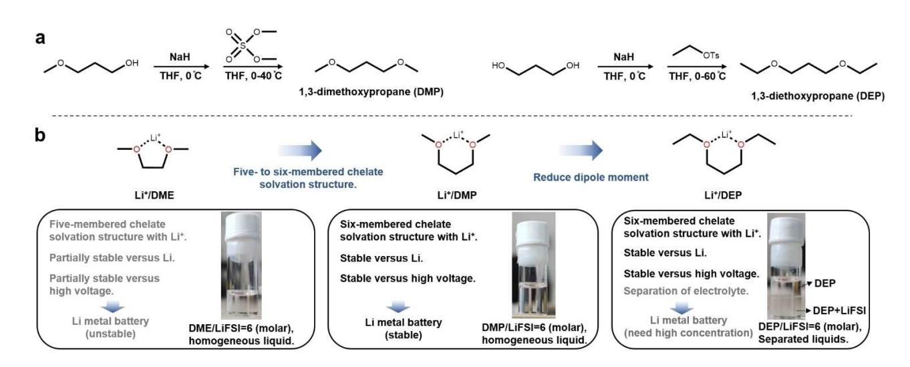
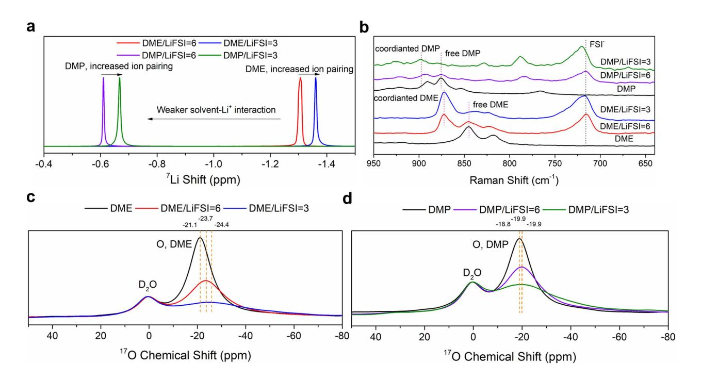
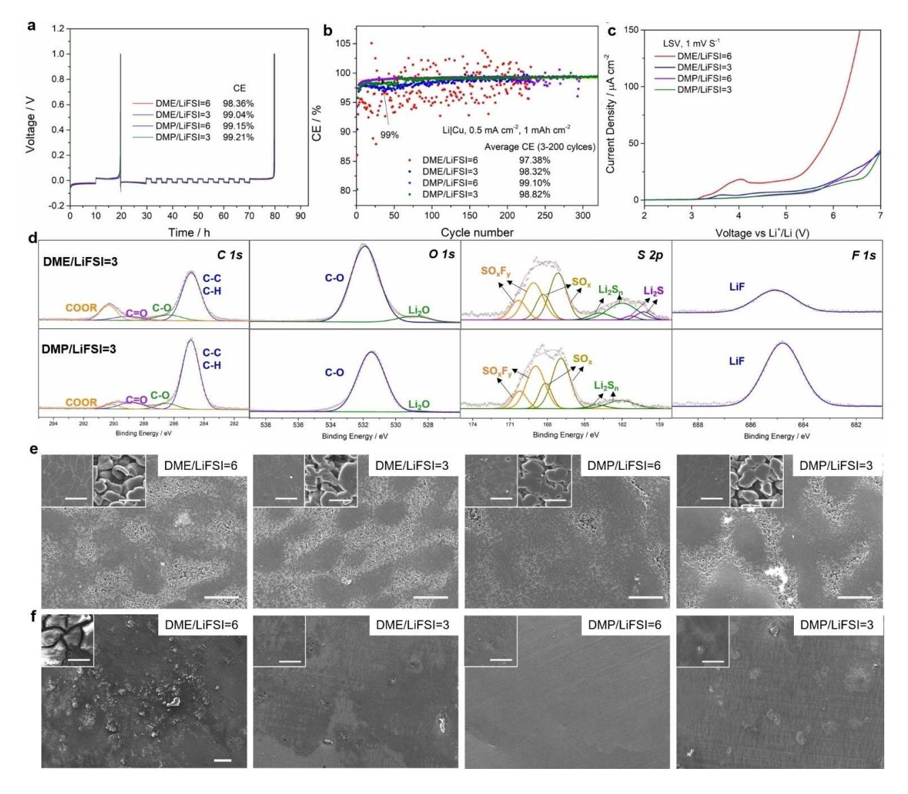
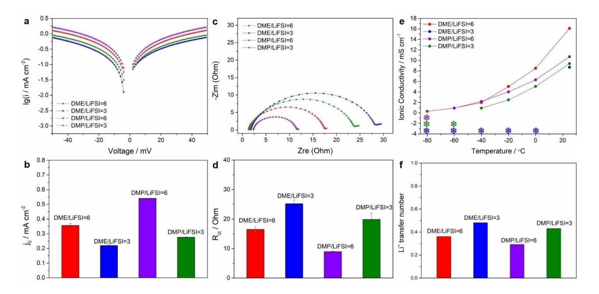
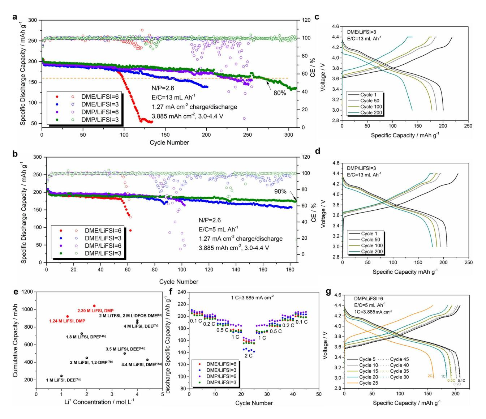

# **Hexacyclic Chelated Lithium Stable Solvates for Highly Reversible Cycling of High-Voltage Lithium Metal Battery**

Lan-Qing Wu,[a] Zhe Li,[a] Yong Lu,[a] Jin-Ze Hou,[a] Hao-Qin Han,[a] Qing [Zhao,](http://orcid.org/0000-0003-0625-9892)\*[a, b] and Jun [Chen\a, b]

Ether-based electrolytes that are endowed with decent compatibility towards lithium anode have been regarded as promising candidates for constructing energy-dense lithium metal batteries (LMBs), but their applications are hindered by low oxidation stability in conventional salt concentration. Here, we reported that regulating the chelating power and coordination structure can remarkably increase the high-voltage stability of ether-based electrolytes and lifespan of LMBs. Two ether molecules of 1,3-dimethoxypropane (DMP) and 1,3-diethoxypropane (DEP) are designed and synthesized as solvents of electrolytes to replace the traditional ether solvent (1,2-dimeth-

## **Introduction**

With the ever-growing demand for electrochemical energy storage devices with high-energy density, the traditional Li-ion battery based on intercalation/de-intercalation chemistry gradually fails to satisfy the application demand due to their relatively low energy density (~250 WhKg 1 ).[1] Lithium metal batteries (LMBs) that use element Li as anode have revived in recent years because the reversible plating/stripping reactions with lightweight Li provide the possibility to achieve the energy density over 500 Whkg 1 . [2] Nevertheless, the inevitable side reactions between traditional carbonate electrolytes and Li metal lead to fast depletion of both anode and electrolytes, and largely restrict the calendar life of LMBs. Ether based electrolytes are gaining increasing attentions due to the decent compatibility toward Li anode, but facing poor oxidation stability lower than 4.0 V in conventional salt concentration that can't afford the operation of high-voltage cathode such as LiNi0.8Mn0.1Co0.1O2 (NMC811).[3,4] Building high-concentration electrolytes (HCEs) have been proposed to increase the high voltage stability,[5a,b] but they suffer from the high viscosity and low conductivity. Diluting the HCEs with the formation of localized high-concentration electrolytes (LHCEs) can largely

Supporting information for this article is available on the WWW under <https://doi.org/10.1002/cssc.202300590>

oxyethane, DME). Both computational and spectra reveal that the transition from five- to six-membered chelate solvation structure by adding one methylene on DME results in the formation of weak Li solvates, which increase the reversibility and high-voltage stability in LMBs. Even under lean electrolyte (5 mLAh 1 ) and low anode to cathode ratio (2.6), the fabricated high-voltage Lij j LiNi0.8Co0.1Mn0.1O2 LMBs using electrolyte of 2.30 M Lithiumbisfluorosulfonimide (LiFSI)/DMP still show capacity retention over 90% after 184 cycles. This work highlights the importance of designing the coordination structures in nonfluorine ether electrolytes for rechargeable batteries.

reduce the viscosity of electrolytes,[5g–j] while the introduction of inert component in electrolytes may bring the concerns of iontransport in lean electrolyte condition. Modifying the molecular structure of ethers by high electronegative fluorine atom can elevate the high voltage stability by lowering the energy of Highest Occupied Molecular Orbital (HOMO).[5c–f] The challenges of fluorinated ethers are lack of cost-effectiveness and ecofriendliness, and the largely reduced coordination ability of fluorinated ethers also reduce the ionic conductivity of electrolytes. Therefore, more approaches are still needed by designing non-fluorination ethers that are simultaneously compatible with Li metal anode and high voltage cathodes.

The properties of electrolytes are known to be highly correlated with the corresponding structures of Li+, anions and solvents. Lithium "solvate" ionic liquids ([Li(solvent)*n*] +X , SILs) that are found widely existed in glymes and lithium salts solutions are a new class of room-temperature ionic liquid (ILs). The ligand molecules, as a third species of the liquids, strongly solvate the Li+ to form the long-lived [Li(glyme)]+, providing the potential to design high-voltage non-fluorination ether electrolyte.[6] As the simplest glyme, although dimethoxyethane (DME) is supposed to be unable to form stable SILs due to the short chain structures, a strong Li+-solvent solvates with fivemembered ring coordination can still be produced, enabling the stable operation of LMB batteries with NCM811.[7] However, the strong Li+-solvent solvates also indicate that plenty of free DME solvents with strong coordination ability exist at a low concentration of electrolyte, which can accelerate the corrosion of stainless steel and Al current collector. In fact, the low oxidation stability of DME electrolyte reported in literatures is supposed to be caused by the serious corrosion of stainless steel. Therefore, one possible solution is partially reducing high solvation energy of Li+, this is, forming the attenuated Li+ -solvent solvates, which can on one hand maintain merits of Li-

[a] *L.-Q. Wu, Z. Li, Y. Lu, J.-Z. Hou, H.-Q. Han, Prof. Q. Zhao, Prof. J. Chen Frontiers Science Center for New Organic Matter, Renewable Energy Conversion and Storage Center (RECAST), Key Laboratory of Advanced Energy Materials Chemistry (Ministry of Education), College of Chemistry Nankai University Tianjin, 300071 (P.R. China) E-mail: zhaoq@nankai.edu.cn*

[b] *Prof. Q. Zhao, Prof. J. Chen Haihe Laboratory of Sustainable Chemical Transformations Tianjin, 300192 (P.R. China)*

ion transport and high-voltage stability, and on the other hand form effective passivation of Al current collector by allowing partial participation of anion in solvates.

Herein, we rationally design and synthesize two ether molecules of 1,3-dimethoxypropane (DMP) and 1,3-diethoxypropane (DEP) derived from DME with extended distance between O atom as electrolyte solvents for LMBs. The molecular dynamics (MD) simulation reveals that the six-membered ring chelating solvation structure in DMP results in the formation of weaker Li+-solvent solvates than that of DME with fivemembered ring chelating solvation structure. Benefiting from the weaker solvates, the prepared LiFSI/DMP electrolyte enables highly reversible lithium plating/stripping performance with coulombic efficiency up to 99.21%, elevated stability and suppressed Al corrosion over 5 V. The cycling life of constructed Lij jNMC811 LMBs with thin lithium (50 μm) and thick cathode (3.855 mAhcm 2 ) can operate up to 237 cycles (80% capacity retention) at a conventional concentration (1.24 M, DMP/LiFSI= 6, molar ratio), and further prolonged to 268 cycles after increasing the concentration to 2.30 M (DMP/LiFSI=3). Even under lean electrolyte condition (5 mLAh 1 ), the batteries still show a cycling life of 184 cycles (90% capacity retention), standing as the state-of-the-art performance for non-fluorinated ether electrolytes.

## **Results and Discussion**

Due to high coordination stability of DME, it is difficult to generate a passivate layer on the surface of Al current collector, leading to the continuous corrosion of Al and failure of the battery.[7a] It should also be mentioned that the intrinsic oxidation of DME doesn't seriously hamper the short-term battery cycling.[7b] By changing chelate coordination from fivemembered ring to six-membered ring, we proposed that the designed molecules should demonstrate the follow advantages. (1) Due to the bigger steric hindrance of six-membered ring, relatively weaker Li+-solvent structure will generate in electrolytes with reduced solvation energy. (2) By reducing solvation ability, the solubility of eroded Al product will be largely reduced, and a qualified passivation can be built by the decomposition of anion.[7a,8] (3) The remained stable chelate structures can maintain the high Li salt solubility and high ionic conductivity to support the high current density. (4) Under proper stoichiometric ratio, stable chelate coordination can minimize the dissociative ether molecules and thus prevent the oxidation of ethers at high voltage and long-time exposure to high valence transition metals.

To confirm our hypothesis, we first synthesized two ether molecules of DEP and DMP with extended distance between O atom as the typical short chain six-membered coordination solvents with lithium ion (Scheme 1a, Figures S1 and S2 in the Supporting Information). They all have higher boiling points (106°C for DMP and 140°C for DEP, Table S1) than DME. Electrolytes with molar ratios of solvent (either DEP or DMP)/ LiFSI from 6 :1, 3 :1 to 1 :1 were prepared. Homogeneous and colorless liquids were formed for all DMP based electrolytes. However, two liquid phases were observed for DEP/LiFSI=6 electrolytes (Scheme 1b). We measured the 1 H Nuclear magnetic resonance (NMR) and 19F NMR spectra of both liquid phases (Figure S3). The results demonstrated that the top layer was pure DEP solvent and the bottom was a solution of DEP and LiFSI. The separation was disappeared for DEP/LiFSI=3 electrolyte. We speculated that the generated solvates formed in DEP electrolytes exhibited distinctively different polarity with free DEP, resulting in the phase separation. Increasing the concentration of LiFSI results in the disappearance of free molecule with the formation of homogeneous solution. Similar solvates were also observed in DME and LiTFSI with molar ratio of 3:1, 2:1 and 1:1.[9] Regarding that the continuous consumptions of anions during battery cycling may lead to the phase separation in DEP electrolyte even at high concentrations of LiFSI, we choose DMP as the model solvent for further studies.

**Scheme 1.** Molecule design strategies for high voltage ether electrolytes: (a) Synthesis routes of DMP and DEP. (b) Molecule structures of DME, DMP, and DEP with deign principles. The inserts are digital photos of prepared electrolyte with solvent to salt molar ratio of 6.

MD simulations were then performed on DME and DMP electrolytes to provide detailed information about solvation structures. Various Li+ solvation shells and their probabilities in each electrolyte are illustrated in Figure 1a and b. For DME/LiFSI electrolytes, the two dominating solvation structures are 3 solvent molecules as [Li(DME)3] + (solvent separated ion pairs, SSIP),) and 2 solvents, 1 FSI as [Li(DME)2FSI] (contact ion pairs, CIP). In [Li(DME)3] + structure, all DME molecules exhibit five membered chelated solvation structure with Li+. In [Li- (DME)2FSI], one DME molecule is replaced by one FSI anion, showing six-membered chelated structure with Li+. Under low concentration (DME/LiFSI=6), SSIP and CIP take up 86% and 13% portion, respectively, while [Li(DME)2(FSI)2] (lithium-anion clusters, LAC or ion aggregates, AGG) only has 1% content. Increase salt concentration to DME/LiFSI=3 results in lower SSIP (57%) and higher CIP (42%), which is consistent with the previous reports on HCEs. [7a] For DMP/LiFSI electrolytes, three dominating solvation structures named as [Li(DMP)3] +, [Li- (DMP)2(FSI)], and [Li(DMP)(FSI)2] were observed. In particular, the structure of [Li(DMP)3] + is distinctively different with [Li(DME)3] +, in which two DMP molecules chelate with Li+ to form a six membered ring and one DMP molecule is unable to chelate Li+, resulting in a total Li+ coordination number of 5 (Figure 1a and Table S2). This phenomenon is also observed in [Li(DMP)2(FSI)], Li+ also shows the coordination number of 5 by chelating with two DMP molecules and coordinating with one oxygen atom in FSI . However, in [Li(DMP)(FSI)2] structure, Li+ can form six-coordinated structure by chelating with one DMP molecules and two FSI . These results indicate that due to the small size of Li+ and steric hindrance caused by longer coordination chains, the weaker Li+-solvent solvates are generated in DMP electrolytes. As results, higher CIP (37%) and LAC (22%) structures are observed in DMP/LiFSI=6 electrolyte than those in DME/LiFSI=3. Increasing the concentration of LiFSI further enhanced the ratios of CIP (38%) and LAC (33%).

We further calculated the binding energy between ether molecule and Li+. The results show that when one solvent is coordinated with one Li+, the binding energy of Li+-DME ( 66.4 kJmol 1 ) is more positive than Li+-DMP ( 73.5 kJ.mol 1 ) (Table S3), which is reasonable as the oxygen atoms in DMP have stronger Lewis basicity. However, the results are opposite when we compare the binding energies of the major components in electrolyte. The binding energy of [Li(DME)3] + ( 150.8 kJmol 1 ) is much more negative than [Li(DMP)3] + ( 120.2 kJmol 1 ), ascribing to the higher coordination number of Li+ in DME than that in DMP. Radial distribution functions (RDF) of solvation structures for solvent/LiFSI=6 electrolytes are shown in Figure 1c. DME molecules strongly coordinate with Li+ as the evidence of sharp O (DME) peaks in the primary solvation shell (*r*�2 Å), while low O (FSI ) intensity indicates that the anion does not contribute significantly to the Li+ solvation structure. In contrast, higher O (FSI ) intensity is found in DMP based electrolyte, which suggests that the weaker

**Figure 1.** Design six-membered ring chelating solvation structure with the formation of weaker Li+-solvent solvates: (a) Dominating Li-ion coordination structures of DME/LiFSI=6 and DMP/LiFSI=6 electrolytes calculated from molecular dynamics (MD) simulations. The spheres in gray, white, red, green, blue, and yellow color stand for lithium, hydrogen, oxygen, fluorine, nitrogen, and sulfur atom, respectively. (b) Statistical distribution of SSIP, CIP and LAC in each electrolyte. (c) Radial distribution functions of interactions between Li+ to solvent or Li+ to FSI in DME/LiFSI=6 and DMP/LiFSI=6 electrolytes.

solvation ability enables the participation of anion in primary solvation shell.

NMR measurements on DME and DMP electrolytes were applied to study their solvation ability. 7 Li NMR is sensitive to the coordinating species in the solvation shell. An upfield (more negative) shift indicates the increased electron density around Li+, which can be either contributed by enhanced solvent or anion binding. By increasing molar ratio of LiFSI, upfield shifts were observed for both DME and DMP electrolyte, indicating a higher content of ion pairing under higher concentration.[10] Under the same molar ratio, DMP based electrolytes are more downshift than DME based electrolytes (Figure 2a). The stronger solvent-Li+ interaction of DME-Li+ than DMP-Li+ leads to more electron density around Li+ for DME electrolytes. In addition, 7 Li chemical of DEP/LiFSI=3 electrolyte is more downshift than DMP/LiFSI=3 (Figure S4), indicating the weaker solvation ability of DEP, which is due to the larger steric hindrance of ethyl groups.[7a] 17O NMR further confirmed our conclusion. As shown in Figure 2c and d, the oxygen chemical shift of DME and DMP in electrolyte shifts to lower value comparing to the pure solvent, which is attributed to the formation of solvent/Li+ complexes.[10b] Upon increasing the concentration of LiFSI, the 17O peak is more negative for DME/LiFSI=3, confirming the increased coordinated solvent ratio. Nevertheless, the downshift of DMP electrolytes is not obvious after increasing the concentration of LiFSI, indicating the intrinsic weak coordination of DMP is less susceptible than DME (Figure 2d). This hypothesis is also proved by the electrolyte of DEP/LiFSI=3, in which the 17O shows negligible change due to the weakest bonding among the three solvents (Figure S5).

Raman measurements were applied to confirm the solvation structures. It is well-known the participation of anion in solvation structure is sensitive to the S N S bending peak of FSI located at 710–770 cm 1 . [2d] The Raman shift increase in the order of SSIP, CIP and AGG due to the increase of Li+-FSI pairing.[11] For solvent/LiFSI=3 electrolyte, the S N S peak in DMP/LiFSI=3 (720.6 cm 1 ) shows slightly blue shift in comparison with DME/LiFSI=3 (717.2 cm 1 ) electrolyte (Figure 2b), indicating a higher SSIP content in DME systems (63.55%) than DMP electrolytes (48.18%) (Figure S6). Similar trend was also observed in 6:1 ratio of solvent/LiFSI electrolytes. Additional, peaks at 845 cm 1 for DME gradually attenuated from pure DME to DME/LiFSI=6 and DME/LiFSI=3 electrolyte, indicating that adding LiFSI can reduce the dissociative DME molecules efficiently. Analogous phenomenon was also observed in FTIR spectra for DMP/LiFSI and DEP/LiFSI (Figure S6) electrolytes (Figure S7). Results of spectra analysis prove the weaker solvation ability and stronger Li+-FSI interactions in DMP based electrolytes.

The compatibility of electrolytes with Li anode was then first investigated by measuring the coulombic efficiency (CE) in the Lij jCu electrochemical cell configuration using Aurbach's method (Figure 3a). With 6 :1 solvent/LiFSI ratio, the CE of DMP reaches 99.15% and outperforms that of DME (98.36%), which means a superior compatibility of DMP with Li metal. At 3:1 solvent/LiFSI ratio, both high CE was obtained for DME and DMP electrolytes (99.04% and 99.21%), confirming the advantage of anion-rich solvates at high concentration of salt. For the long-term cycling of Lij jCu electrochemical cells, the average CE of DMP/LiFSI=6 electrolyte calculated from 3rd to 200th cycle (99.10%) also largely exceeds the cells with DME/LiFSI=6

**Figure 2.** Spectral characterizations of DME and DMP electrolytes: (a) 7 Li NMR spectra of DME and DMP electrolytes. (b) Raman spectra of DME, DMP solvents and electrolytes. 17O NMR spectra of (c) DME (d) DMP solvents and electrolytes.

**Figure 3.** Anode, cathode and current collector stabilities of DME and DMP electrolytes: (a) Coulombic efficiencies (CEs) of Li stripping/plating measured by Lij jCu electrochemical cells through Aurbach method. (b) Long-term CEs of Lij jCu half cell. (c) Linear sweep voltammetry (LSV) of Lij jAl electrochemical cells. (d) XPS analysis of solid-electrolyte interphase (SEI) formed in DME/LiFSI=3 and DMP/LiFSI=3 electrolytes. (e) SEM morphologies of deposited Li with areal capacity of 5 mAhcm 2 at a current density of 0.5 mAcm 2 . The insert is the amplification of smooth and rough locations. (f) SEM morphologies of Al current collector disassembled form Lij jAl electrochemical cells after holding at 5.0 V (vs Li+/Li) for 172 h. The inserts are the amplification of the Al foil. The scale bare for panels (e) to (f) and their insets are 100 μm and 10 μm, respectively.

electrolyte (97.38%) (Figure 3b, S8). It is worth noticed the Li stripping/plating profiles for DME based electrolyte is fluctuant during battery cycling, which may be caused by the formation of unstable interphase. Furthermore, the DMP/LiFSI=6 electrolyte shows lower overpotential (~21.8 mV at the 200 cycle) than DME/LiFSI=6 electrolyte (~24.6 mV at the 200 cycle). The cycling life was further prolonged after increasing the concentration of LiFSI. For example, the Lij jCu cells with DMP/LiFSI= 3 electrolyte can stably operate over 300 cycles with high CE of around 99.3% after 200 cycles. In comparison, the average CE of DME/LiFSI=3 is 98.32% with a cycle life of around 205 cycles. We also measured the CE of DEP based electrolyte. Fluctuant Li plating voltage was observed for DEP/LiFSI=3 electrolyte (Figure S9), which may due to the separation of liquid phases as previously discussed in the process of Li metal plating. Upon increasing the salt concentration (DEP/LiFSI=1), stable cycling with 99.06% CE was obtained with Aurbach's method.

The origin of the improved compatibility towards Li metal was then studied by investigating the morphology and corresponding solid-electrolyte interphase (SEI) of deposited Li. We first tested the composition of SEI formed in solvent/LiFSI= 3 electrolytes through X-ray photoelectron spectroscopy (XPS) analysis.[5k,l] The compositions of SEI (Figure 3d, Figure S10, and Table S4) were similar for the two electrolytes, due to the similar decomposition pathways of ether electrolytes. In particular, the component of LiF in DMP/LiFSI=3 is distinctively higher than that in DME/LiFSI=3, indicating more anion decomposition

participate in the formation of SEI. The lithium deposition morphology on bare Cu was studied by scanning electron microscope. As shown in Figure 3e and Figure S11, for all electrolytes, the size of Li particles is about 10 μm, which is not surprising considering all four electrolytes exhibit CEs exceeding 98%. However, the morphology of deposition Li in DMP based electrolyte is obviously more compact than that in DME based electrolyte, which is consistent with the higher CE in Lij jCu electrochemical cells.

Linear sweep voltammetry (LSV) was applied to test the oxidation stability of each electrolytes (Figure 3c). Al was selected as the working electrode, as it has been commonly used as the cathode current collector in full cells. The inability to form AlF3 and LiF is the major factor of Al corrosion. The current density of DME/LiFSI=6 electrolyte increases fast below 4.0 V (vs Li+/Li) and hold nearly 20 μA cm 2 till 5.2 V (vs Li+/Li). In contrast, DMP/LiFSI=6 electrolyte does not show significant increase in current density till 6.4 V (vs Li+/Li). Upon increasing LiFSI concentration (solvent/LiFSI=3), the electrolytes appear to be more stable with Al electrode, which is consistent with previous reports on high-concentration electrolytes. [5a,b] After holding the Al electrode at 5.0 V (vs Li+/Li) for 172 h, serious Al corrosion was observed for the DME/LiFSI=6 electrolyte, as the entire surface went cracking and roughening (Figure 3f and Figure S12). Furthermore, the electrolyte was almost dry, indicating the fast consumption of electrolyte during the process of Al dissolution. In contrast, for DMP/LiFSI=6 electrolyte, the corrosion of Al electrode was less severe without broken pieces (Figure S12), which was further confirmed by the smooth surface evidenced by SEM results (Figure 3f). Through increasing salt concentration to solvent/LiFSI=3, both electrolytes showed low corrosion to Al foil. The results are also consistent with the leaking current measured in Lij jAl electrochemical cells (Figure S13a and b). Similar trends were also found for LSV measurement with Pt as working electrodes (Figure S13c). However, in comparison with Al working electrode, the Lij jPt electrochemical cells with DME/LiFSI=6 electrolytes show distinctively low current density below 4 V, confirming the reaction of DME electrolytes below 4 V is mainly attributed to the corrosion of Al current collector. On the basis of the evidence above, we conclude that the addition of one methylene moiety to DME can change the coordination mode from five- to six-membered classical coordination configuration, which can in turn modify the solvation ability of ether molecules. Furthermore, by controlling the stoichiometry of ether and LiFSI, the dissociative solvents can be further reduced. This relatively weak Li+-solvent solvates are expected to improve the reversibility of lithium plating/stripping and suppress the corrosion of Al current collector, and thus improve cycling performance of LMBs.

In addition to the interphase, the kinetics of ion transport can also be affected by the solvation structures of Li-ion. The exchange current density of charge transfer (*j*0) at fresh Lielectrolyte interfaces is the key parameter to reflect the kinetics of the electroplating reaction, and also related to the Li deposition morphology and cycling CEs.[12] Larger *j*0 value indicates fast interfacial equilibrium and lower activation energy. As seen in Figure 4a, b and Figure S14, the exchange current density (*j*0) follows the order of DMP/LiFSI=6*>*DME/ LiFSI=6*>*DMP/LiFSI=3*>*DMP/LiFSI=3. On the same solvent/ LiFSI ratio, DMP based electrolytes have larger *j*0 than DME based solvent, which means a weaker solvation of DMP than

**Figure 4.** Kinetics of ion-transport for DME and DMP electrolytes: (a) Tafel plots derived from cyclic voltammetry measurements. (b) Corresponding current density of charge transfer (*j*0) calculated by fitting the region of Tafel plots from 35–50 mV. (c) EIS analysis. (d) *R*ct calculated from EIS. (e) Ionic conductivity of electrolytes. The points with snowflake shapes indicate the solidification of electrolyte. (f) Li+ transfer number of electrolytes. CV and EIS analysis were conducted in electrochemical Lij j Li symmetrical cells with fresh Li.

DME, further verifying our design principle along with NMR and Raman results. With the increasing salt concentration, *j*0 values decreased for both DME and DMP based electrolytes, which are supposed to ascribe to the increasing amount of Li+-FSI ion pairs. Simultaneously, the charge transfer resistance (*R*ct) follow the similar rules (Figure 4c, 4d) (DMP/LiFSI=6*<*DME/LiFSI=6*<* DMP/LiFSI=3*<*DMP/LiFSI=3) as j0 and Rct obey the following equation [Eq. (1)]:

$$R_{\rm ct} = RT/(Fj_0) \tag{1}$$

Where R is ideal gas constant (R=8.314 J mol-1 K-1), T is temperature, F is Faraday constant (96485 C mol-1). The weaker solvation ability of DMP lead to higher surface energy that is thermodynamically favorable for uniform Li plating, which is consistent with SEM results.

Further ionic conductivity test demonstrates DME/LiFSI=6 has the highest value of 16.1 ms cm 1 under room temperature (Figure 4e), benefiting from the strong solvation ability of DME. The ionic conductivity is 10.7 mScm 1 for DMP/LiFSI=6 electrolyte, which is still much higher than electrolyte with fluorinated ether solvents (~0.7-6.2 ms cm 2 ).[5c–f] At 40°C, DMP/LiFSI has higher ionic conductivity (2.18 ms cm 1 ) than DME/LiFSI=6 electrolyte (1.98 ms cm 1 ). In particular, the DMP/LiFSI=6 electrolyte still shows ionic conductivity of 0.91 mS cm 1 even at 60°C. After increasing the concentration of LiFSI, both DMP/ LiFSI=3 and DME/LiFSI=3 electrolytes are still endowed with high ionic conductivity over 8 ms cm 1 at 25°C. However, DME/ LiFSI=3 electrolyte is solidified at 0°C, while the ionic conductivity of DMP/LiFSI=3 electrolyte still reaches 0.90 ms cm 1 at 40°C. The results indicate the superiority of DMP based electrolyte in low temperature. We then tested the lithium transfer number of all electrolytes (Figure 4f and Figure S15). Compared to DMP/LiFSI=6 electrolyte, DME/ LiFSI=6 electrolyte has higher lithium transfer number (0.293 compared to 0.362), which may due to the larger solvation structure of Li+/DMP than Li+/DME. Similar phenomenon was also found in 3 :1 electrolytes, which DMP/LiFSI=3 electrolyte has relatively lower Li+ transfer number than DME/LiFSI=6 electrolyte (0.432 compared to 0.482). It is worth mentioned that the measurement of transfer number by polarization method is not reliable enough when ion aggregation is commonly existed in the electrolytes. [13]

In order to demonstrate the stability towards high-voltage cathode, rigorous potentiostatic polarization test with Lij j NMC811 cells were conducted from 4.2 V to 4.7 V (vs Li+/Li) to study the compatibility of electrolytes and NMC811 cathode. As shown in Figure S16, low leakage currents (less than 5 μA) were observed for all electrolytes below 4.5 V in spite of the highest value for DME/LiFSI=6 electrolyte. Upon increasing voltage to 4.7 V, the leaking current for DMP based electrolytes are much lower than DME based electrolyte. The polarization test indicate that all electrolytes are suitable to support operation of high voltage NMC811 cathode.

We then tested the long-term performance of Lij jNMC811 battery. A relatively high-loading NMC811 cathode (3.885 mAh.cm 2 ) and thin Li (50 μm, N/P=2.6) were used for all the batteries, which were cycled with a cut off voltage at 4.4 V (vs Li+/Li) and charge/discharge current density of 1.27 mAcm 2 . The discharge specific capacity during long-term cycling are compared. Under a conventional electrolyte amount (Electrolyte (E)/cathode (C)=13 mLAh 1 ), the capacity retention with DME/LiFSI=6 (~1.36 M) electrolyte decreases to 80% after 121 cycles (Figure 5a, c, d). In contrast, the capacity retention is not lower than 80% until 237 cycles for DMP/LiFSI=6 electrolyte (~1.24 M), although the CE is lower than 95% after 182 cycles caused by the increasing consumption of electrolytes. Upon increasing concentration to solvent/LiFSI=3, DME (~ 2.60 M) and DMP (~2.30 M) achieve longer cycle life (176 cycles and 268 cycles for DME and DMP). Under a relatively low E/C of 5 mLAh 1 (Figure 5b), rapid decay of capacity was observed in DME/LiFSI=6 electrolyte as only 56 cycle numbers were obtained, while DMP/LiFSI=6 electrolyte maintain 82.83% capacity after 102 cycles. In particular, DMP/LiFSI=3 still show capacity retention over 90% after 184 cycles, while DME/LiFSI= 3 electrolyte only has 75 cycles (90% capacity retention). We also tested the Lij jNMC811 cells using DEP/LiFSI=3 electrolyte. The batteries show fast fading after 10 cycles, which may be caused by the phase separation due to consumption of electrolytes (Figure S17). Among all the electrolytes, DMP/ LiFSI=6 electrolyte demonstrate the best high-rate performance. The capacity retention is 79% at 2 C in comparison with 0.1 C (Figure 5f and g). Comparing with the reported nonfluorinated ether electrolytes, DMP based electrolytes in this work show the highest cumulative capacity under relatively low concentration (Figure 5e and Table S5).

ConclusionsTo summarize, two ether molecules (DMP and DEP) were designed and synthesized for high-voltage electrolytes of LMBs, in which DMP exhibited homogenous solution in all solvent/LiFSI ratios. In comparison with DME with fivemembered coordination structure, the solvating power of DMP was rationally adjusted by the formation of six-membered configuration, resulting in the reduced the solvation energy, improved exchange current density of charge transfer, elevated oxidation stability through suppressing Al dissolution, and more compacted and reversible Li metal deposition. Under stringent full-cell condition of 3.885 mAhcm 2 NMC811, 50 μm thin Li and lean electrolyte (E/C=5 mLAh 1 ), the capacity retention of Lij jNCM811 batteries cycling between 3.0 and 4.4 V still remain 90% after 184 cycles. Our work highlights the importance of coordination structure regulation in the high voltage stability of ether-based electrolytes. Furthermore, through regulating the intensity of lithium solvates, both accelerated ion transport and high/low voltage interfacial stability can be achieved in nonfluorinated ether electrolytes, thus providing a new strategy to design cost-effectiveness and eco-friendliness electrolytes for energy dense LMBs.

*ChemSusChem* **2023**, *16*, e202300590 (7 of 10) © 2023 Wiley-VCH GmbH

**Figure 5.** Electrochemical performance of Lij jNMC811 LMBs using DME and DMP based electrolytes: Cycling performance with CEs of Lij jNMC811 batteries using electrolytes of DME/LiFSI=6, DME/LiFSI=3, DMP/LiFSI=6, and DMP/LiFSI=3 under (a) E/C=13 mLAh 1 . (b) E/C=5 mLAh 1 . (c) (d) Galvanostatic charge/discharge profiles of DME/LiFSI=3 and DMP/LiFSI=3 electrolytes. (e) The cumulative capacity using non-fluorined ether electrolytes and NMC cathodes.[5b,7a,b,14a–c] (f) Rate test of each electrolyte. (g) Corresponding galvanostatic charge/discharge profiles of DMP/LiFSI=6 electrolyte. The thickness of Li anode is 50 μm, and the areal capacity of cathode is 3.885 mAh.cm 2 .

## **Experimental Section**

#### **Materials**

Anhydrous sodium sulfate (99%), dimethyl sulfate (98%), 3-methoxy-1-propanol (97%) and 1,3-propanediol (98%) were purchased from Macklin. NaH (60% in mineral oil) and anhydrous THF (99.9%) were purchased from J&K Scientific. 4-methyl-benzenesulfonicaciethylester (98%) was purchased from Energy Chemistry. Lithium bisfluorosulfonimide (LiFSI) and 1,2-dimethoxyethane (DME) were purchased from Duoduo Chem. All raw materials were commercially available without purification.

## **Synthesis and purification of ether molecules**

(1) Synthesis of 1,3-dimethoxypropane (1,3-DMP). 28 g NaH (60% in mineral oil) was added to 1 L three necked flask, followed with addition of 500 mL anhydrous THF. The reaction mixture was cooled to 0°C by ice bath and stirred for 30 min. Then 45 g 3 methoxy-1-propanol was added dropwise to the reaction mixture and the solution was further stirred in the ice bath for 3 h. Next, 94 g dimethyl sulfate was added, and the reaction mixture was stirred mechanically for 3 h at 0°C. The flask was then gradually heated to 40°C to react overnight. After cooling to room temperature, 300 mL deionized water was slowly added to the suspension, and further heated to 60°C for 3 h. The THF was removed under vacuum, and the products was extracted with 300 mL dichloromethane for three times. The dichloromethane layer was dried by anhydrous Na2SO4 and removed under vacuum. The crude product was distilled under vacuum (~60°C, 3 kPa). 26.4 g, Yield: 50.7%.

(2) Purification of 1,3-DMP. 1.0 g NaH (60% in mineral oil) was added to the crude 1,3-DMP and the mixture was heated to 80°C followed by distilling at 15 kPa for 6 h to obtain colorless liquid. The procedure was repeated for 2 times. At last, 12.4 g pure product was obtained through rectification.

(3) Synthesis of 1,3-diethoxypropane (1,3-DEP). 28 g NaH was added to 1 L three necked flask, followed with addition of 500 mL anhydrous THF. The reaction mixture was cooled to 0°C by ice bath and stirred for 30 min. Then 19 g 1,3-propanediol was added dropwise to the reaction mixture and further stirred in the ice bath for 3 h. Next, 100 g 4-methyl-benzenesulfonicaciethylester was added and the reaction mixture was stirred mechanically for 3 h at 0 °C. The flask was gradually heated to 60°C to reflux overnight. After cooling to room temperature, 300 mL deionized water was slowly added to the suspension. The THF was removed under vacuum, and the products was extracted with 300 mL dichloromethane for three times. The dichloromethane layer was dried by anhydrous Na2SO4 and removed under vacuum. The crude product was distilled under vacuum (~60°C, 1 kPa). 20.1 g, Yield: 60.9%.

(4) Purification of 1,3-DEP. 1.0 g NaH was added to the crude 1,3- DEP and heated to 90 °C, which was further distilled at 6 kPa for 6 h to obtain colorless liquid. The procedure was repeated for 2 times. At last, 12.7 g pure product was obtained through rectification.

#### **Electrolyte preparation and electrochemical measurement**

Electrolytes were prepared by stoichiometrically mixing LiFSI in DME, DMP or DEP at solvent/LiFSI ratio of 1:1, 3:1 and 6:1. The 2032-type coin cells were used for all electrochemical measurements under ambient conditions. Battery fabrication was performed in an Ar-filled glovebox. (1) Lij jCu CEs was performed with Aurbach method. 10 mm diameter Li foil, two layers of 19 mm Celgard 2325 separator, 16 mm Cu foil and 15 μL electrolyte were used. The Cu surface was conditioned by plating 5 mAhcm 2 of Li and stripping to 1 V at 0.5 mAcm 2 . Then a Li reservoir of 5 mAhcm 2 was plated onto Cu, followed by 10 cycles of Li plating and striping at 1 mAhcm 2 and 0.5 mAcm 2 . Finally, all Li on Cu was stripped to 1 V at 0.5 mAcm 2 . (2) For long term electrochemical Lij jCu cell test, 10 mm diameter Li foil, two layers of 19 mm Celgard 2325 separator, 16 mm Cu foil and 40 μL electrolyte were used. The half-cell was cycled at 1 mAhcm 2 and 0.5 mAcm 2 . (3) Linear sweep voltammetry (LSV) was test on Lij jAl cell using a CHI760e electrochemical workstation. 16 mm diameter Li foil, one layer of 19 mm Celgard 2325 separator, 19 mm Al foil, 40 μL electrolyte and Al-clad cathode cases were used. The voltage swept from open-circle voltage to 7 V vs Li+/Li at a rate of 1 mVs 1 . (4) Lij jNCM811 potentiostatic polarization test used 16 mm diameter Li foil, one layer of 19 mm Celgard 2325 separator, 10 mm NCM811 cathode, 40 μL electrolyte and Al-clad cathode cases. One layer of 19 mm Al foil was placed inside the cathode cases to avoid the corrosion of stainless steel. The test was operated first by galvanostatic charge to 4.2 V, then the voltage was held for 10 h and gradually increase the voltage with 0.1 V step for 10 h each step until the voltage reach 5.0 V. (5) Lij jNCM811 full-cells. 12 mm diameter 50 μm Li foil, one layer of 19 mm Celgard 2325 separator, 40 μL electrolyte, 10 mm NCM811 cathode (3.885 mAcm 2 ), and Alclad cathode cases were used. One layer of 19 mm Al foil was placed inside the cathode cases to avoid the corrosion of stainless steel. The full-cells were cycled between 3.0 V and 4.4 V with a current density of 1.27 mAcm 2 . Two formation cycles under 0.42 mAcm 2 (first) and 0.85 mAcm 2 (second) charge/discharge current density were performed.

The transference numbers of the electrolytes were determined via a potentiostatic polarization technique on a CHI760e electrochemical workstation, in which 5 mV was applied for 2800 s to a Lij j Li cell with one layer of Whatman GF/A glass microfiber filter as separator to obtain the initial current *I*0 and stabilized current *I*s. EIS were applied before and after the polarization to obtain the cell resistance (*R*0 and *R*s), the Li+ transference number (*t*+) was then calculated using Equation (2):[2d]

$$\mathbf{t}_{+} = \frac{I_{s}(\Delta V - I_{0}R_{0})}{I_{0}(\Delta V - I_{s}R_{s})}$$
 (2)

#### **Material characterization**

The surface morphologies of Al and Li were imaged by SEM on a JEOL 7900F. Lij jAl coin cells were fabricated as described and the voltage were held at 5.0 V for 240 h. The cells were disassembled, and the Al foil was rinsed with DME solvent. Li deposition morphology on Cu was studied by depositing 3 mAhcm 2 of Li at 0.5 mAcm 2 in Lij jCu cells with 40 μL electrolyte. After Li deposition, the cells were disassembled and the Cu electrodes were rinsed with DME solvent. 7 Li NMR and 17O NMR spectroscopy was performed on a Bruker AVANCE III 400 MHz. Each solvent or electrolyte was added to the NMR tube and one 1 mm capillary sealed with 1 M LiCl in D2O was inserted into the NMR tube. The samples were locked and shimmed by using the external standard. The chemical shifts were corrected with the 7 Li of LiCl in D2O (0 ppm). Raman spectra were collected on a DXR Microscope. X-ray photoelectron spectroscopy (XPS) was conducted on a Thermo ScientificTM K-AlphaTM+ spectrometer equipped with a monochromatic Al Kα X-ray source (1486.6 eV) operating at 100 W. Samples were analyzed under vacuum (*P<*10 8 mbar) with a pass energy of 150 eV (survey scans) or 50 eV (high-resolution scans). All peaks were calibrated with C 1s peak binding energy at 284.8 eV for adventitious carbon.

### **Theoretical calculations**

The molecular structures were first optimized at the level of B3LYP/ 6-31G+(d, p) and further optimized by M062X/6-311G+(d, p). Gaussian 16.A.03 package[15a] and Gaussview 6.0 were used for the DFT calculations and the visualization of molecular structures,[15b] respectively. Molecular dynamics simulations were performed by using Gromacs 2018 package.[15c] The optimized potentials for liquid simulations (OPLS) force field and generalized Amber force field (GAFF) were used for solvents and ions, respectively.

# *Acknowledgements*

*This work was supported by the National Key R&D Program of China (2021YFB2500300), the Natural Science Foundation of Tianjin (No. 22JCZDJC00380), the National Natural Science Foundation of China (No. 52201259), and Young Elite Scientist Sponsorship Program by CAST.*

# *Conflict of Interests*

The authors declare no conflict of interest.

# **Data Availability Statement**

The data that support the findings of this study are available from the corresponding author upon reasonable request.

**Keywords:** Lithium metal batteries **·** ether **·** electrolytes **·** Coordination structure **·** electrode-electrolyte interphase

- [1] W. Xue, M. Huang, Y. Li, Y. Zhu, R. Gao, X. Xiao, W. Zhang, S. Li, G. Xu, Y. Yu, P. Li, J. Lopez, D. Yu, Y. Dong, W. Fan, Z. Shi, R. Xiong, C.-J. Sun, I. Hwang, W.-K. Lee, Y. S.-H. J. A. Johnson, J. Li, *Nat. [Energy.](https://doi.org/10.1038/s41560-021-00792-y)* **2021**, *6*, 495– [505.](https://doi.org/10.1038/s41560-021-00792-y)
- [2] a) L. Lin, K. Qin, Q. Zhang, L. Gu, L. Suo, Y.-S. Hu, H. Li, X. Huang, L. Chen, *Angew. Chem. Int. Ed.* **2021**, *60*, [8289–8296;](https://doi.org/10.1002/anie.202017063) b) W. Cao, Q. Li, X. Yu, H. Li, *[eScience](https://doi.org/10.1016/j.esci.2022.02.002)* **2022**, *2*, 47–48; c) J. Liu, Z. Bao, Y. Cui, E. J. Dufek, J. B. Goodenough, P. Khalifah, Q. Li, B. Y. Liaw, P. Liu, A. Manthiram, Y. S. Meng, V. R. Subramanian, M. F. Toney, V. V. Viswanathan, M. S. Whittingham, J. Xiao, W. Xu, J. Yang, X.-Q. Yang, J.-G. Zhang, *Nat. [Energy.](https://doi.org/10.1038/s41560-019-0338-x)* **2019**, *4*, [180–186;](https://doi.org/10.1038/s41560-019-0338-x) d) J. Holoubek, H. Liu, Z. Wu, Y. Yin, X. Xing, G. Cai, S. Yu, H. Zhou, T. A. Pascal, Z. Chen, P. Liu, *Nat. Energy.* **2021**, *6*, [303–313](https://doi.org/10.1038/s41560-021-00783-z); e) X. Li, R. Zhao, Y. Fu, A. Manthiram, *eScience* **2021**, *1*, [108–123](https://doi.org/10.1016/j.esci.2021.12.006).
- [3] a) M. Li, C. Wang, Z. Chen, K. Xu, J. Lu, *Chem. Rev.* **2020**, *120*, [6783–6819](https://doi.org/10.1021/acs.chemrev.9b00531); b) J.-G. Zhang, W. Xu, J. Xiao, X. Cao, J. Liu, *[Chem.](https://doi.org/10.1021/acs.chemrev.0c00275) Rev.* **2020**, *120*, [13312–13348;](https://doi.org/10.1021/acs.chemrev.0c00275) c) J. Ning, K. Duan, K. Wang, J. Liu, S. Wang, J. Zhang, *[J.](https://doi.org/10.1016/j.jechem.2021.10.004) Energy Chem.* **2022**, *67*, [290–299.](https://doi.org/10.1016/j.jechem.2021.10.004)
- [4] a) K. Xu, *Chem. Rev.* **2004**, *104*, [4303–4417;](https://doi.org/10.1021/cr030203g) b) Q. Zhao, X. Liu, J. Zheng, L. Archer, *PNAS.* **2020**, *117*, [26053](https://doi.org/10.1073/pnas.2004576117); c) Q. Zhao, Y. Deng, N. W. Utomo, J. Zheng, P. Biswal, J. Yin, L. Archer, *Nat. Commun.* **2021**, *12*, 6034; d) J. Zheng, M. S. Kim, Z. Tu, S. Choudhury, T. Tang, L. A. Archer, *[Chem.](https://doi.org/10.1039/C9CS00883G) Soc. Rev.* **[2020](https://doi.org/10.1039/C9CS00883G)**, *49*, 2701.
- [5] a) X. Ren, L. Zou, S. Jiao, D. Mei, M. H. Engelhard, Q. Li, H. Lee, C. Niu, B. D. Adams, C. Wang, J. Liu, J.-G. Zhang, W. Xu, *ACS [Energy](https://doi.org/10.1021/acsenergylett.9b00381) Lett.* **2019**, *4*, [896–902](https://doi.org/10.1021/acsenergylett.9b00381); b) S. Jiao, X. Ren, R. Cao, M. H. Engelhard, Y. Liu, D. Hu, D. Mei, J. Zheng, W. Zhao, Q. Li, N. Liu, B. D. Adams, C. Ma, J. Liu, J.-G. Zhang, W. Xu, *Nat. Energy.* **2018**, *3*, [739–746](https://doi.org/10.1038/s41560-018-0199-8); c) T. Zhou, Y. Zhao, M. E. Kazzi, J. W. Choi, A. Coskun, *Angew. Chem. Int. Ed.* **2022**, *61*, e202115884; d) Y. Zhao, T. Zhou, T. Ashirov, M. E. Kazzi, C. Cancellieri, L. P. H. Jeurgens, J. W. Choi, A. Coskun, *Nat. Commun.* **2022**, *13*, 2575; e) Z. Yu, P. E. Rudnicki, Z. Zhang, Z. Huang, H. Celik, S. T. Oyakhire, Y. Chen, X. Kong, S. C. Kim, X. Xiao, H. Wang, Y. Zheng, G. A. Kamat, M. S. Kim, S. F. Bent, J. Qin, Y. Cui, Z. Bao, *Nat. Energy.* **2022**, *7*, [94–106;](https://doi.org/10.1038/s41560-021-00962-y) f) Z. Yu, H. Wang, X. Kong, W. Huang, Y. Tsao, D. G. Mackanic, K. Wang, X. Wang, W. Huang, S. Choudhury, Y. Zheng, C. V. Amanchukwu, S. T. Hung, Y. Ma, E. G. Lomeli, J. Qin, Y. Cui, Z. Bao, *Nat. Energy.* **2020**, *5*, [526–533](https://doi.org/10.1038/s41560-020-0634-5); g) T. Li, Y. Li, Y. Sun, Z. Qian, R. Wang, *ACS [Materials](https://doi.org/10.1021/acsmaterialslett.1c00276) Lett.* **2021**, *3*, 838–844; h) S. Lin, H. Hua, Z. Li, J. Zhao, *ACS Appl. Mater. Interfaces* **2020**, *12*, [33710–33718;](https://doi.org/10.1021/acsami.0c07904) i) S. Chen, J. Fan, Z. Cui, L. Tan, D. Ruan, X. Zhao, J. Jiang, S. Jiao, X. Ren, *Angew. Chem. Int. Ed.* **2023**, *62*, e202219310; j) C. Li, Y. Li, Z. Chen, Y. Zhou, F. Bai, T. Li, *Chi. Chem. Lett.* **2023**, *34*, [107852](https://doi.org/10.1016/j.cclet.2022.107852); k) X. Cao, L. Zou, B. E. Matthews, L. Zhang, X. He, X. Ren, M. H. Engelhard, S. D. Burton, P. Z. El-Khoury, H.-S. Lim, C. Niu, H. Lee, C. Wang, B. W. Arey, C. Wang, J. Xiao, J. Liu, W. Xu, J.-G. Zhang, *Energy [Storage](https://doi.org/10.1016/j.ensm.2020.08.035) Mater.* **2021**, *34*, 76–84; l) X. Cao, P. Gao, X. Ren, L. Zou, M. H. Engelhard, B. E. Matthews, J. Hu, C. Niu, D. Liu, B. W. Arey, C. Wang, J. Xiao, J. Liu, W. Xu, J.-G. Zhang, *PNAS.* **2021**, *118*, e2020357118.
- [6] a) K. Yoshida, M. Nakamura, Y. Kazue, N. Tachikawa, S. Tsuzuki, S. Seki, K. Dokko, M. Watanabe, *J. Am. Chem. Soc.* **2011**, *133*, [13121–13129](https://doi.org/10.1021/ja203983r); b) K. Ueno, K. Yoshida, M. Tsuchiya, N. Tachikawa, K. Dokko, M. Watanabe, *[J.](https://doi.org/10.1021/jp307378j) Phys. Chem. B.* **2012**, *116*, [11323–11331;](https://doi.org/10.1021/jp307378j) c) C. Zhang, A. Yamazaki, J. Murai, J.-W. Park, T. Mandai, K. Ueno, K. Dokko, M. Watanabe, *J. [Phys.](https://doi.org/10.1021/jp504099q) Chem. C.* **2014**, *118*, [17362–17373](https://doi.org/10.1021/jp504099q); d) C. Zhang, K. Ueno, A. Yamazaki, K. Yoshida, H. Moon, T. Mandai, Y. Umebayashi, K. Dokko, M. Watanabe, *[J.](https://doi.org/10.1021/jp501319e) Phys. Chem. B.* **2014**, *118*, [5144–5153](https://doi.org/10.1021/jp501319e).

- [7] a) Y. Chen, Z. Yu, P. Rudnicki, H. Gong, Z. Huang, S. C. Kim, J.-C. Lai, X. Kong, J. Qin, Y. Cui, Z. Bao, *J. Am. Chem. Soc.* **2021**, *143*, [18703–18713;](https://doi.org/10.1021/jacs.1c09006) b) E. Park, J. Park, K. Lee, Y. Zhao, T. Zhou, G. Park, M.-G. Jeong, M. Choi, D.-J. Yoo, H.-G. Jung, A. Coskun, J. W. Choi, *ACS [Energy](https://doi.org/10.1021/acsenergylett.2c02003) Lett.* **2023**, *8*, [179–188](https://doi.org/10.1021/acsenergylett.2c02003).
- [8] a) T. Ma, G. Xu, Y. Li, L. Wang, X. He, J. Zheng, J. Liu, M. H. Engelhard, P. Zapol, L. A. Curtiss, J. Jorne, K. Amine, Z. Chen, *J. Phys. [Chem.](https://doi.org/10.1021/acs.jpclett.6b02933) Lett.* **2017**, *8*, [1072–1077](https://doi.org/10.1021/acs.jpclett.6b02933); b) A. Abouimrane, J. Ding, I. J. Davidson, *J. Power [Sources](https://doi.org/10.1016/j.jpowsour.2008.08.077)* **2009**, *189*, [693–696;](https://doi.org/10.1016/j.jpowsour.2008.08.077) c) Y. Yamada, C. H. Chiang, K. Sodeyama, J. Wang, Y. Tateyama, A. Yamada, *[ChemElectroChem.](https://doi.org/10.1002/celc.201500235)* **2015**, *2*, 1687–1694; d) K. Matsumoto, K. Inoue, K. Nakahara, R. Yuge, T. Noguchi, K. Utsugi, *[J.](https://doi.org/10.1016/j.jpowsour.2012.12.028) Power Sources* **2013**, *231*, [234–238](https://doi.org/10.1016/j.jpowsour.2012.12.028).
- [9] a) W. A. Henderson, *J. Phys. Chem. B.* **2006**, *110*, [13177–13183](https://doi.org/10.1021/jp061516t); b) D. Brouillette, D. E. Irish, N. J. Taylor, G. Perron, M. Odziemkowski, J. E. Desnoyers, *Phys. Chem. Chem. Phys.* **2002**, *4*, [6063–6071.](https://doi.org/10.1039/b203776a)
- [10] a) C. V. Amanchukwu, X. Kong, J. Qin, Y. Cui, Z. Bao, *Adv. [Energy](https://doi.org/10.1002/aenm.201902116) Mater.* **2019**, *9*, [1902116;](https://doi.org/10.1002/aenm.201902116) b) C. Wan, M. Y. Hu, O. Borodin, J. Qian, Z. Qin, J.-G. Zhang, J. Z. Hu, *J. Power Sources* **2016**, *307*, [231–243](https://doi.org/10.1016/j.jpowsour.2015.12.120).
- [11] M. Kerner, N. Plylahan, J. Scheers, P. Johansson, *RSC Adv.* **2016**, *6*, [23327.](https://doi.org/10.1039/C5RA25048J)
- [12] D. T. Boyle, S. C. Kim, S. T. Oyakhire, R. A. Vila, Z. Huang, P. Sayavong, J. Qin, Z. Bao, Y. Cui, *J. Am. Chem. Soc.* **2022**, *144*, [20717–20725.](https://doi.org/10.1021/jacs.2c08182)
- [13] Y. Guo, M. W. Terban, I. Moudrakovski, A. Münchinger, R. E. Dinnebier, J. Popovic, J. Maier, *J. Mater. Chem. A.* **2024**, *11*, 3427–3436.
- [14] a) X. Ren, L. Zou, X. Cao, M. H. Engelhard, W. Liu, S. D. Burton, H. Lee, C. Niu, B. E. Matthews, Z. Zhu, C. Wang, B. W. Arey, J. Xiao, J. Liu, J.-G. Zhang, W. Xu, *Joule.* **2019**, *3*, [1662–1676;](https://doi.org/10.1016/j.joule.2019.05.006) b) Z. Li, H. Rao, R. Atwi, B. M. Sivakumar, B. Gwalani, S. Gray, K. S. Han, T. A. Everett, T. A. Ajantiwalay, V. Murugesan, N. N. Rajput, V. G. Pol, *Nat. Commun.* **2023**, *14*, 868; c) T. D. Pham, A. B. Faheem, J. Kim, H. M. Oh, K.-K. Lee, *[Small.](https://doi.org/10.1002/smll.202107492)* **2022**, *18*, [2107492](https://doi.org/10.1002/smll.202107492).
- [15] a) Frisch, M. J. Trucks, G. W. Schlegel, H. B. Scuseria, G. E. Robb, M. A. Cheeseman, J. R. Scalmani, G. Barone, V. Petersson, G. A. Nakatsuji, H. Li, X.; Caricato, M. Marenich, A. V. Bloino, J. Janesko, B. G. Gomperts, R. Mennucci, B. Hratchian, H. P. Ortiz, J. V. Izmaylov, A. F. Sonnenberg, J. L. Williams-Young, D. Ding, F. Lipparini, F. Egidi, F. Goings, J. Peng, B. Petrone, A. Henderson, T. Ranasinghe, D. Zakrzewski, V. G. Gao, J. Rega, N. Zheng, G. Liang, W. Hada, M. Ehara, M. Toyota, K. Fukuda, R. Hasegawa, J. Ishida, M. Nakajima, T. Honda, Y. Kitao, O. Nakai, H. Vreven, T. Throssell, K. Montgomery, J. A. Jr. Peralta, J. E. Ogliaro, F. Bearpark, M. J. Heyd, J. J. Brothers, E. N. Kudin, K. N. Staroverov, V. N. Keith, T. A. Kobayashi, R. Normand, J. Raghavachari, K. Rendell, A. P. Burant, J. C. Iyengar, S. S. Tomasi, J. Cossi, M. Millam, J. M. Klene, M. Adamo, C. Cammi, R. Ochterski, J. W. Martin, R. L. Morokuma, K. Farkas, O. Foresman, J. B. Fox, D. J. Gaussian, Inc. Wallingford CT, Gaussian 16, Revision A. 03, **2016**; b) Dennington, Roy. Keith, Todd A. Millam, John.M. Semichem Inc, Shawnee Mission, KS, GaussView, Version 6, **2016**; c) Abraham, M. J. Murtola, T. Schulz, R. Páll, S. Smith, J. C. Hess, B. Lindahl, E. GROMACS: High performance molecular simulations through multi-level parallelism from laptops to supercomputers. SoftwareX. **2015**, *1–2*, 19–25.

Manuscript received: April 25, 2023 Revised manuscript received: June 2, 2023 Accepted manuscript online: June 11, 2023 Version of record online: July 24, 2023