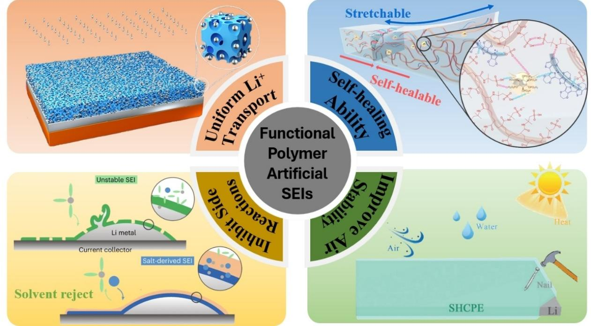
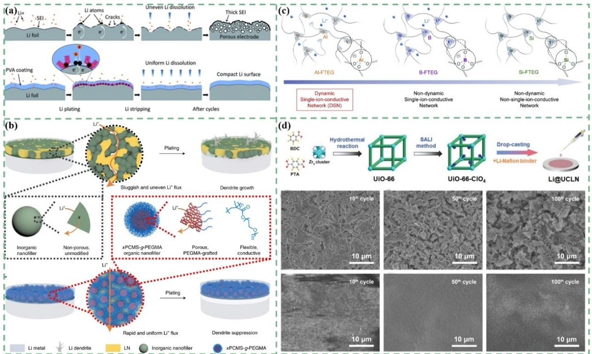
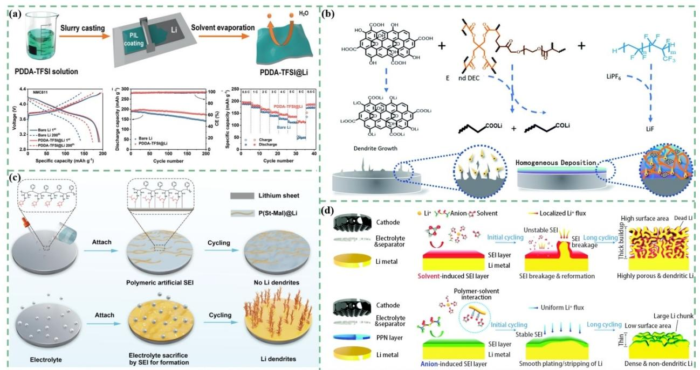
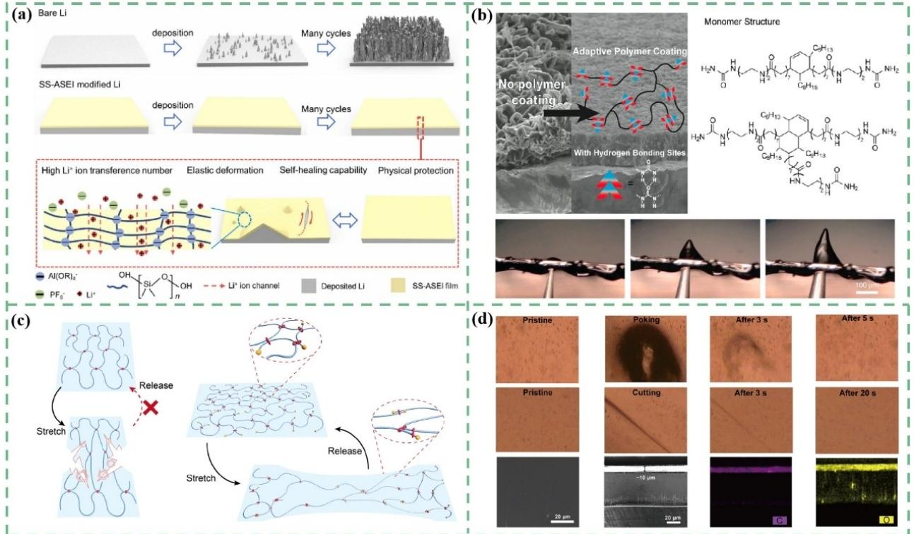
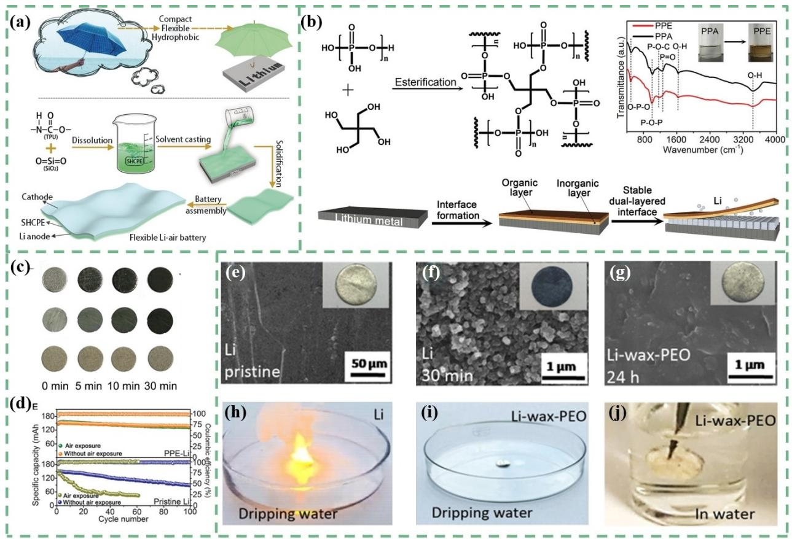

# **Functional Polymers as Artificial Solid Electrolyte Interfaces for Stabilizing Lithium Metal Anode**

Tuoya Naren,[a] Ruheng Jiang,[a] Gui-chao Kuang,[a] Liangjun Zhou,\*[a] and [Libao](http://orcid.org/0000-0002-3766-1545) Chen\*[a]

The practical implementation of the lithium metal anode (LMA) has long been pursued due to its extremely high specific capacity and low electrochemical equilibrium potential. However, the unstable interfaces resulting from lithium ultrahigh reactivity have significantly hindered the use of LMA. This instability directly leads to dendrite growth behavior, dead lithium, low Coulombic efficiency, and even safety concerns. Therefore, artificial solid electrolyte interfaces (ASEI) with enhanced physicochemical and electrochemistry properties have been explored to stabilize LMA. Polymer materials, with

## **1. Introduction**

The past few decades have seen significant advancement in the fields of consumer electronics and electrical vehicles, benefits to the development and commercialization of lithium-ion batteries (LIBs).[1] Despite the progress made through modern battery engineering, the traditional LIBs chemistries are approaching their maximum potential.[2] As a result, it is important to develop new generations of batteries to meet the growing demand for higher energy density. Lithium metal batteries (LMBs) have gained considerable attention in the scientific community due to their high theoretical capacity (3860 mAhg 1 ) and low electrochemical potential ( 3.04 V versus SHE) offered by lithium metal anodes (LMAs).[3] The higher energy density of LMBs leads to longer runtimes for devices and reduced weight for mobile applications. Furthermore, LMBs exhibit superior discharge rates, making them suitable for applications that require rapid charging and discharging cycles. Additionally, LMBs have the potential to increase the lifespan of batteries, thus reducing the need for frequent replacements and contributing to sustainability efforts. However, it is important to note that the utilization of lithium metal anodes (LMAs) does come with some serious limiting factors.

The implementation of LMAs poses a considerable challenge due to various inherent issues. Lithium (Li) easily undergoes chemical and electrochemical reactions with components of the electrolyte, resulting in the accumulation of side productions on the surface of LMAs. This kind of accumulation

[a] *Dr. T. Naren, R. Jiang, Dr. G.-c. Kuang, Dr. L. Zhou, Prof. Dr. L. Chen State Key Laboratory of Powder Metallurgy Central South University Changsha 410083 (P. R. China) E-mail: alexander-zhou@csu.edu.cn lbchen@csu.edu.cn*

their flexible structures and multiple functional groups, offer a promising way for structurally designing ASEIs to address the challenges faced by LMA. This Concept demonstrates an overview of polymer ASEIs with different functionalities, such as providing uniform lithium ion and single-ion transportation, inhibiting side reactions, possessing self-healing ability, and improving air stability. Furthermore, challenges and prospects for the future application of polymeric ASEIs in commercial lithium metal batteries (LMBs) are also discussed.

will form an uneven interface, which we call the original solidstate electrolyte interface (SEI) within which exhibit heterogeneous Li-ion (Li+) conduction and promote the formation of dendritic Li deposition.[4] Additionally, the cycle of LMAs exacerbates this situation by causing significant volume changes, resulting in the cracking of the brittle original SEI. Consequently, the exposed fresh Li surface undergoes additional parasitic reactions with the electrolyte. This uncontrollable and relentless cycle significantly impairs Li cycling efficiency, depletes the entire electrolyte supply, and ultimately leads to the demise of LMAs.[5]

Numerous efforts have been made to address the above issues. Modifying the liquid electrolyte composition can help stabilize the SEI and suppress dendrite growth.[6] Separator modification involves enhancing the properties of the separator to improve the performance and safety of lithium metal anodes.[7] Solid electrolytes are an alternative to liquid electrolytes.[8] Modifying the interface between the lithium metal anode and the electrolyte can improve the stability and performance.[9] Utilizing advanced characterization techniques, such as in-situ/operando microscopy, spectroscopy, and electrochemical analysis, can provide insights into the behavior and degradation mechanisms of lithium metal anodes. Among these approaches, interfacial engineering approach has showed some advantages due to its effectiveness, scalability in manufacturing, and ability to tailor properties. The design principles of ASEIs primarily focus on mechanical stability, smooth Li+ transport, and chemical passivation ability to prevent Li corrosion.[10] Achieving favorable Li deposition morphology for safe and long-lasting LMBs can be realized by finely tuning the physical and chemical properties of ASEIs to overcome the drawbacks of original SEIs.

Functional polymers play a vital role in ASEI. Compared to inorganic compounds, polymeric materials offer several advantages, such as lower density, greater flexibility,[11] and better compatibility with Li.[12] Because of their chemical structures

tunability, polymers provide unique functions. High dielectric constant groups, for example, can enhance the dissociation of Li salts.[13] In addition, the presence of flexible chains can facilitate the transportation of Li+. [14] Polymers can also address the issue of interfacial compatibility between inorganic solidstate electrolytes and Li.[15] This results in polymer-based ASEIs often exhibiting lower interfacial resistance and greater deformation ability compared to pure inorganic interfacial phases. Although polymers have limited ionic conductivity, their tunable compositions and compatibility with inorganic materials offer the potential for further optimization.

The research progress of polymers in ASEIs is reviewed, focusing on the functionalization effect of polymeric ASEI on LMA (Scheme 1). The functionalization effect is introduced from four aspects: providing uniform Li+ transportation, inhibition of side reactions, possession of self-healing ability, and improvement of air stability. In the last section, this Concept highlights the opportunities and challenges for the development of polymeric ASEIs.

# **2. Uniform Li**+ **Transportation and Deposition**

To address the issue of uncontrollable growth of Li dendrites in the practical application of LMAs, one must consider the uneven spatial distribution of Li+. The severity of dendrite growth increases as the demand for high current and high area capacity batteries rises, thereby posing serious safety risks and the potential for short circuits. An effective approach to mitigate this challenge is the utilization of lithiophilic polymeric ASEIs.

Lithiophilic polymers, particularly those containing polar functional groups, such as polyacrylonitrile (PAN),[19] *β*-phase poly(vinylidene difluoride) (*β*-PVDF),[20] poly(vinyl alcohol) (PVA)[21] and so on, achieve uniform Li deposition by balancing the distribution of Li+ and facilitating their nucleation. This phenomenon prevents the movement of Li+ towards deposition "hotspots" such as Li dendrites or protrusions, ultimately promoting uniform lithium deposition (Figure 1a). The strategy of introducing inorganic materials to the polymer matrix was proposed to address the issue of limited improvement in both the mechanical properties of the polymer and the number of ion migrations.[22] Wu et al. employed xPCMS-g-PEGMA nanospheres as porous nanofillers to strengthen the lithiated Nafion film (Figure 1b).[15] This approach facilitates the simultaneous creation of a robust ASEI with high modulus, adequate conformality, and enhanced ionic conductivity, leading to significantly improved electrochemical performance for LMBs.

To prevent dendrite formation on LMAs, Brissot and Chazalviel's theory suggests that high ionic conductivity and a unity Li+ transference number are necessary to eliminate strong electric fields caused by anion depletion.[23] According to their theory, dendrite formation can be completely inhibited by maintaining a constant concentration of Li+ at the Li

Dr. Tuoya Naren received her B.S. degree from State Key Laboratory of Powder Metallurgy from Central South University, China in 2021. She is pursuing her PhD degree in Central South University. Her current research interest includes advanced energy storage devices, especially for Li metal batteries and solid-state electrolyte.

Ruheng Jiang received his B.S. degree from State Key Laboratory of Powder Metallurgy from Central South University, China in 2021. He is pursuing his M.S. degree in Central South University. His current research interest includes advanced energy storage devices, especially for Zinc metal batteries and electrolyte additives.

Dr. Liangjun Zhou is an associate professor in the State Key Laboratory of Powder Metallurgy at the Central South University (China). He received PhD degree from University of Chinese Academy of Sciences in 2014, and then did post-doctoral research in South University of Science and Technology of China. His research interest mainly includes lithium batteries for wide temperature and sodium ion batteries.

Prof. Dr. Libao Chen received his B.S. degree and M.S. degree from Central South University in 2001 and 2004 and his PhD degree from the Shanghai Institute of Microsystem and Information Technology, Chinese Academy of Sciences in 2007. He is now a professor at the State Key Laboratory of Powder Metallurgy at Central South University. His main research interest is focused on high-performance energy storage materials and devices, including Li alloy anodes, zinc anodes, lithium ion batteries and lithium sulfur batteries.

**Scheme 1.** Schematic outline of the Concept. Upper left part was reproduced from ref [16] Copyright 2020, with permission from Wiley. Upper right part was reproduced from ref [11] Copyright 2023, with permission from Nature. Lower left part was reproduced from ref [17] Copyright 2023 with permission from Nature. Lower right part was reproduced from ref [18] Copyright 2019,with permission from Wiley.

**Figure 1.** (a) Schematic illustration of Li deposition–stripping behavior on LMA with/without ASEI. Reproduced from ref. [22] Copyright (2019), with permission from Royal Society of Chemistry. (b) Schematic illustrations of organic-inorganic ASEI structure and Li plating behavior for ASEI layers. Reproduced from ref. [15] Copyright (2022), with permission from Nature Publishing Group. (c) Conceptual sketch of DSN. Reproduced from ref. [26] Copyright (2019), with permission from Cell Press. (d) Schematic illustrations for the bionic design and rational synthesis of UiO-66-ClO4 and the artificial UCLN film on the Li metal surface. Reproduced from ref. [27] Copyright (2020), with permission from Wiley.

interface.[14] Tikekar et al. recently proposed that a single-ion conducting polymer electrolyte could facilitate the stable electrodeposition of various metals.[24] Therefore, the demand for fast single-ion conducting ASEI arises. In response to this demand, a cross-linked ASEI layer was created by using the thiol-ene click reaction of PETMP with LiBAMB on the surface of LMAs.[25] In this structure, only Li+ can move, guided by the anion network for even distribution and deposition. Another approach was taken by the Bao and Cui group,[26] who constructed a dynamic single-ion conductive network (DSN) that could simultaneously achieve single-ion conductivity, slow down the change of interface morphology, prevent the side reaction of electrolyte penetration, and make Li uniform deposition (Figure 1c). It is worth mentioning that ASEI with different properties were designed to fully demonstrate that uniform single-ion conduction can reduce the generation of heterogeneous nucleation sites. Additionally, by combining UiO-66-ClO4 and Li-Nafion on a Li metal anode, a novel ASEI film with high stability and biomimetic ion channels has been fabricated (Figure 1d).[27] Due to the presence of ClO4 groups, the anion receives strong electrostatic repulsion and is difficult to pass through the narrow UiO-66 pore size. In addition, the lithiophilic channel of UiO-66-ClO4 selectively adsorbs Li+, which reduces the activation energy required for Li+ conduction and deposition, and ensures the uniform deposition of Li.

The ability to provide uniform Li+ and single-ion transportation is one of the main advantages of polymer ASEIs. The LMAs interfaces can facilitate efficient and selective transport of Li+ by incorporating specific functional groups or structures. This leads to improved battery performance and cycle life. This uniform transport also helps minimize polarization and increase the overall energy density of the battery. However, interfacial resistance and ionic conductivity can be influenced by temperature, humidity, and other environmental factors. Therefore, careful control of these factors is necessary during device fabrication and operation.

# **3. Inhibit Side Reactions Between LMAs and Electrolytes**

Many methods have been proposed to address the issue of Li reacting with electrolyte solvents. One simple approach is to incorporate insoluble solvents.[28] Several polymer materials have been employed to safeguard the LMA from reacting with the electrolyte. These polymers possess chemical stability, making them particularly suitable for active carbonate electrolytes that can reach high voltage cathode stability (Figure 2a).[29] However, this method requires the polymer with high ion conductivity and significantly increases the interface resistance, making it less than ideal as a strategy. To overcome this limitation, researchers have designed polymers with special functional groups that can take advantage of the high chemical reactivity with Li metal. These polymers, known as reactive ASEI serve as a protective layer.[30] Yang and He group constructed a multifunctional protective (MAP) layer using carboxyl and hydroxyl groups in the polymer, which can react with Li metal

**Figure 2.** (a) Schematic illustration of the fabrication process of PDDA–TFSI@Li. Reproduced from ref. [29] Copyright (2021), with permission from Wiley-VCH. (b) Schematic of the construction of the MAP layer on Li metal. Reproduced from ref. [31] Copyright (2021), with permission from The Royal Society of Chemistry. (c) Illustration of the formation of a polymeric protective layer and the effect of P(St-MaI)@Li layer on LMA. Reproduced from ref. [32] Copyright (2023), with permission from Wiley. (d) A schematic illustration of the effect of the PPN protective layer. Reproduced from ref. [33] Copyright (2019), with permission from The Royal Society of Chemistry.

and adjust the structure of the SEI (Figure 2b).[31] The reaction promotes the formation of lithium fluoride (LiF) and ensures a long cycling life of LMAs in carbonate electrolytes. Chen group prepared a reactive polymer P(St-Mal) as a reactive ASEI (Figure 2c).[32] This interface layer possesses high Li+ conductivity and has certain mechanical strength. Once P(St-Mal) encounters Li, it immediately reacts to generate a dense interface layer and effectively prevents the electrolyte from reacting with Li metal, thus can suppress Li dendrite growth.

In addition to prevent the reaction between the liquid electrolytes and Li metal, adjusting the interaction between the polymers and the electrolytes is also a good way. The Yu group utilized the -CN groups in the polyacrylonitrile chain segment to interact with the C=O in the electrolyte, reducing the reactivity of the carbonate electrolyte and suppressing its corrosiveness.[33] Consequently, the freedom of the free solvent molecules is decreased, facilitating the formation of the SEI by the salt anions (Figure 2d). Thus, this study presents a beneficial viewpoint on how to control electrolyte coordination in carbonate electrolytes to establish a stable SEI layer in LMBs.

By using the functional polymer ASEIs mentioned above, it is possible to create an interface that blocks or reduces the occurrence of side reactions, resulting in more stable and reliable battery operation. However, there are concerns about the loss of energy density due to the consumption of Li by the reactive ASEI. Additionally, the durability and long-term stability under extended cycling and stress conditions remain a concern that requires further investigation.

#### **4. Possess Self-healing Ability**

Flexibility is a unique advantage of polymers over other materials, which enables polymer ASEI to adapt to changes in the interface during cycling. Many researchers use rubber-like materials or viscoelastic polymers to serve as protective coatings[28,34] . As a kind of rubber material, PDMS is widely used in the manufacture of self-healing ASEI. Pu group produced a highly self-healing ASEI by adding highly conductive silica nanoparticles to crosslinked PDMS.[35] The ASEI is single-ion conductive (Figure 3a). Bao and Cui group produced a flowable polymer whose hydrogen bonding-based self-healing polymer prevents defects on LMAs during cycling (Figure 3b).[36] The polymer with high viscoelasticity flows slowly across the LMAs surface hindering the creation of cracks or pinholes in the SEI layer and impeding dendrite formation. These two ASEIs were believed to be responsible to regulate Li deposition, enhance the kinetics of Li plating/stripping, and inhibit dendrite growth.

By adjusting the structure of the polymer, controlling the movement of its chain segment can also achieve the effect of self-healing. Guo group has developed a tough polymer with a slide-ring structure called PR-PAA, which involves the covalent combination of *α*-cyclodextrin as a movable pulley with PAA

**Figure 3.** (a) Schematic illustrations of Li plating/stripping on bare Li metal and SS-ASEI modified Li metal. Reproduced from ref. [35] Copyright (2021), with permission from Elsevier. (b) Chemical structure of the polymer and characterization of Li deposition. Reproduced from ref. [36] Copyright (2016), with permission from ACS. (c) Schematic representation of the stretching and releasing of polymer with fixed crosslinks and movable crosslinks. Reproduced from ref. [37] Copyright (2021), with permission from Wiley. (d) Optical microscopy and SEM characterization of the self-healing processes of PR-PAA. Reproduced from ref. [37] Copyright (2021), with permission from Wiley.

(Figure 3c,d).[37] PR-PAA exhibits excellent deformation ability and can quickly repair cracks during the cycle due to the slip of its cross-linked network, allowing for effective stress dissipation caused by dendrite growth. As a result, the use of PR-PAA ASEI leads to a significant improvement in the suppression of Li dendrite formation. This improvement is demonstrated by the stable cycling of full cells incorporating high-voltage NCM, high-areal capacity LiFePO4 (LFP), and sulfur cathodes, as well as the achievement of a high critical current density of 6 mAcm 2 .

The polymer ASEIs with self-healing properties allowing them to repair themselves in response to damage or degradation. This feature can be extended and widely used in solid electrolytes, which is the main research direction of LMBs in the future.

#### **5. Improve Air Stability of LMAs**

The development of LMAs with air stability is of great significance to improve the manufacturing efficiency, safety, and cost reduction of LMBs.[38] Li metal easily reacts with nitrogen, oxygen, carbon dioxide, and other components in the air, resulting in the production of uneven and non-dense byproducts. As a consequence, this leads to surface morphology and structural defects, as well as uneven interface current/ ion flow, and severe performance deterioration.[39] In addition, Li metal is highly sensitive to moisture. Even the presence of a small amount of water in the air can lead to intense reactions, and in severe cases, Li combustion, posing safety hazards. Therefore, the preparation and transportation of Li metal are extremely challenging in the actual production process.[40]

Various passivation techniques have been developed to achieve long-term stability of Li metal in the air. Inspired by hydrophobic umbrella cloth, Zhang group developed a composite polymer electrolyte (SHCPE) (Figure 4a).[18] This electrolyte consists of thermoplastic polyurethane (TPU) and hydrophobic SiO2 nanoparticles. The SHCPE possesses remarkable hydrophobicity and stability. It effectively modifies the uneven interface of the Li by serving as a separator and ASEI. As a result, even when exposed to water droplets or air, the Li sheet remains bright, providing full protection and greatly increasing the safety of the battery. A wax-based coating is proposed to address issues of air stability and waterproofing in Li-metal anodes.[41] Composed of ion conducting poly(ethylene oxide),

**Figure 4.** (a) Protection of the LMA and fabrication process of the FLAB. Reproduced from ref. [18] Copyright (2019), with permission from Wiley. (b) Schematic illustration showing the synthetic procedure of PPE. Reproduced from ref. [42] Copyright (2019), with permission from Wiley. (c) Optical images of pristine Li (top), PPA Li (middle), and PPE Li (bottom) exposed to air with relative humidity of 25% for various times. Reproduced from ref. [42] Copyright (2019), with permission from Wiley. (d) The cycling performance of PPE Li/LFP (top) and pristine Li/LFP (bottom) cells with the Li anode exposed to air for 30 min, compared with the cell directly assembled in the Argon (Ar) atmosphere. Reproduced from ref. [42] Copyright (2019), with permission from Wiley. (e-j) The stability of Li-wax-PEO and Li in air and water. Reproduced from ref. [41] Copyright (2019), with permission from Elsevier.

the coating enhances air and water stability without observable changes in color or structure after exposure to air or water (Figure 4e-j). In addition, the electrochemical performance is improved because the wax composition hinders the electrolyte corrosion of LMA.

All these studies mentioned above do not react with Li. An inorganic Li3PO4 layer is formed on the surface of Li, along with an organic PPE molecules coating layer (called PPE Li), through *in-situ* reaction with poly(phosphoric ester) (PPE) solution (Figure 4b).[42] This dual-layered interface firmly attaches to the Li metal, allowing it to resist corrosion by ambient air or electrolyte (Figure 4 c,d). Li/LFP cells with the air-treated Li and PPA Li anodes experience rapid capacity decay, which is worse than that of the Li/LFP cells assembled with pristine Li in an inert atmosphere. These results provide an alternative for battery assembly without the need for an extremely inert atmosphere. *In-situ* formed protective layers resulting in tighter bonding with Li due to strong chemical interactions. Therefore, both *exsitu* and *in-situ* formed protective layers mentioned in this section have the potential to significantly improve the air stability of Li, offering inspiration for large-scale production of low-cost LMAs.

Air-stable interfaces allow for the secure implementation of LMBs in high-priority applications like electric vehicles and renewable energy systems, ensuring safety and reliability. Additionally, this feature helps to lower the expenses associated with storing and transporting Li.

## **6. Summary and Outlook**

In conclusion, the use of functionalized polymer ASEIs is an effective method to enhance the performance of LMBs. However, despite significant progress, it is still in the early stages of practical application. Therefore, future research should consider the following aspects in order to achieve the ultimate goals of stable long cycle life and safety.

- 1. The growth mechanism of SEI and the inherent mechanism of ASEI protecting LMA need to be further studied. LMA undergoes continuous chemical and electrochemical reactions during battery cycling. Therefore, it is necessary to thoroughly investigate the transport dynamics of lithium ions in polymeric ASEI, the interface reactions between lithium metal and ASEIs, as well as the influence of ASEI thickness.
- 2. There is a need to develop multifunctional ASEI that can simultaneously achieve high, uniform Li+ transport (singleion transportation), prevent side reactions of LMA, have a certain self-healing ability, and improve the air/water stability of LMA.
- 3. There are still many unresolved issues related to LMA. For instance, volume expansion and the use of polymeric ASEI strategies have reduced the utilization and energy density of lithium metal, thus greatly diminishing its advantages.[43]
- 4. It is crucial to improve the possibility of large-scale application by addressing the complexity of production and purification processes required for most polymers, as well as

finding additional techniques for processing on LMA. This is essential in order to achieve high performance and low cost ASEIs, which is crucial for their commercial application.

## *Acknowledgements*

This work was supported by the National Natural Science Foundation of China (U1904216) and the Natural Science Foundation of Hunan Province (2023JJ50012)

#### *Conflict of Interests*

The authors declare no conflict of interest.

**Keywords:** Li metal anode **·** functional polymer material **·** solid state electrolyte interface

- [1] M. S. Whittingham, *Chem. Informationsdienst* **2004**, *35, 50*.
- [2] J. M. Tarascon, M. Armand, *Nature* **2001**, *414*, [359–367](https://doi.org/10.1038/35104644).
- [3] W. Xu, J. Wang, F. Ding, X. Chen, E. Nasybulin, Y. Zhang, J.-G. Zhang, *Energy Environ. Sci.* **2014**, *7*, [513–537](https://doi.org/10.1039/C3EE40795K).
- [4] D. Lin, Y. Liu, Y. Cui, *Nat. [Nanotechnol.](https://doi.org/10.1038/nnano.2017.16)* **2017**, *12*, 194–206.
- [5] X.-B. Cheng, R. Zhang, C.-Z. Zhao, Q. Zhang, *[Chem.](https://doi.org/10.1021/acs.chemrev.7b00115) Rev.* **2017**, *117*, [10403–10473.](https://doi.org/10.1021/acs.chemrev.7b00115)
- [6] a) J. Zheng, M. H. Engelhard, D. Mei, S. Jiao, B. J. Polzin, J.-G. Zhang, W. Xu, *Nat. Energy* **2017**, *2*; b) H. Zhang, G. Gebresilassie Eshetu, X. Judez, C. Li, L. M. Rodriguez-Martinez, M. Armand, *[Angew.](https://doi.org/10.1002/anie.201712702) Chem. Int. Ed.* **2018**, *57*, [15002–15027;](https://doi.org/10.1002/anie.201712702) c) N. Piao, S. Liu, B. Zhang, X. Ji, X. Fan, L. Wang, P.-F. Wang, T. Jin, S.-C. Liou, H. Yang, J. Jiang, K. Xu, M. A. Schroeder, X. He, C. Wang, *ACS Energy Lett.* **2021**, *6*, [1839–1848;](https://doi.org/10.1021/acsenergylett.1c00365) d) S. Li, W. Zhang, Q. Wu, L. Fan, X. Wang, X. Wang, Z. Shen, Y. He, Y. Lu, *[Angew.](https://doi.org/10.1002/anie.202004853) Chem. Int. Ed.* **2020**, *59*, [14935–14941](https://doi.org/10.1002/anie.202004853).
- [7] a) Y. Yang, S. Yao, Z. Liang, Y. Wen, Z. Liu, Y. Wu, J. Liu, M. Zhu, *[ACS](https://doi.org/10.1021/acsenergylett.1c02719) Energy Lett.* **2022**, *7*, [885–896;](https://doi.org/10.1021/acsenergylett.1c02719) b) L. Tan, Y. Sun, C. Wei, Y. Tao, Y. Tian, Y. An, Y. Zhang, S. Xiong, J. Feng, *Small* **2021**, *17*.
- [8] a) X. Zhang, S. Wang, C. Xue, C. Xin, Y. Lin, Y. Shen, L. Li, C.-W. Nan, *Adv. Mater.* **2019**, *31*; b) Y. Gao, Z. Yan, J. L. Gray, X. He, D. Wang, T. Chen, Q. Huang, Y. C. Li, H. Wang, S. H. Kim, T. E. Mallouk, D. Wang, *Nat. [Mater.](https://doi.org/10.1038/s41563-019-0305-8)* **[2019](https://doi.org/10.1038/s41563-019-0305-8)**, *18*, 384; c) H. Chen, J. Liu, X. Zhou, H. Ji, S. Liu, M. Wang, T. Qian, C. Yan, *Chem. Eng. J.* **2021**, *404*, [126470.](https://doi.org/10.1016/j.cej.2020.126470)
- [9] a) Y. Jiang, B. Wang, P. Liu, B. Wang, Y. Zhou, D. Wang, H. Liu, S. Dou, *Nano Energy* **2020**, *77*; b) Y.-X. Song, W.-Y. Lu, Y.-J. Chen, H. Yang, C. Wu, W.-F. Wei, L.-B. Chen, X.-P. Ouyang, *Rare Met.* **2022**, *41*, [1255–1264](https://doi.org/10.1007/s12598-021-01811-3); c) X. Shen, T. Qian, P. Chen, J. Liu, M. Wang, C. Yan, *ACS Appl. Mater. [Interfaces](https://doi.org/10.1021/acsami.8b12093)* **2018**, *10*, [30058–30064](https://doi.org/10.1021/acsami.8b12093).
- [10] Z. Yu, Y. Cui, Z. Bao, *Cell Reports Physical Science* **2020**, 100119.
- [11] D.-H. Kim, Z. A. Akbar, Y. T. Malik, J.-W. Jeon, S.-Y. Jang, *Nat. Commun.* **2023**, *14*, 3246.
- [12] S. Gao, Z. Li, N. Liu, G. Liu, H. Yang, P.-F. Cao, *Adv. Funct. Mater.* **2022**, *32*,2202013.
- [13] X. Wang, F. Chen, G. M. A. Girard, H. Zhu, D. R. MacFarlane, D. Mecerreyes, M. Armand, P. C. Howlett, M. Forsyth, *Joule* **2019**, *3*, [2687–](https://doi.org/10.1016/j.joule.2019.07.008) [2702.](https://doi.org/10.1016/j.joule.2019.07.008)
- [14] J. Song, H. Lee, M. J. Choo, J. K. Park, H. T. Kim, *Sci. Rep.* **2015**, *5*, 14458.
- [15] S. Li, J. Huang, Y. Cui, S. Liu, Z. Chen, W. Huang, C. Li, R. Liu, R. Fu, D. Wu,
- *Nat. [Nanotechnol.](https://doi.org/10.1038/s41565-022-01107-2)* **2022**, *17*, 613–621. [16] L. Qi, Z. Wu, B. Zhao, B. Liu, W. Wang, H. Pei, Y. Dong, S. Zhang, Z. Yang,
- L. Qu, W. Zhang, *Chem. Eur. J.* **2020**, *26*, [4193–4203](https://doi.org/10.1002/chem.201904631). [17] Z. Huang, J.-C. Lai, S.-L. Liao, Z. Yu, Y. Chen, W. Yu, H. Gong, X. Gao, Y. Yang, J. Qin, Y. Cui, Z. Bao, *Nat. Energy* **2023**, *8*, [577–585.](https://doi.org/10.1038/s41560-023-01252-5)
- [18] T. Liu, X. L. Feng, X. Jin, M. Z. Shao, Y. T. Su, Y. Zhang, X. B. Zhang, *Angew. Chem. Int. Ed.* **2019**, *58*, [18240–18245.](https://doi.org/10.1002/anie.201911229)
- [19] X.-B. Cheng, T.-Z. Hou, R. Zhang, H.-J. Peng, C.-Z. Zhao, J.-Q. Huang, Q. Zhang, *Adv. Mater.* **2016**, *28*, [2888–2895](https://doi.org/10.1002/adma.201506124).
- [20] J. Luo, C.-C. Fang, N.-L. Wu, *Adv. Energy Mater.* **2018**, *8*, 1701482.

- [21] H. Wu, Z. Yao, Q. Wu, S. Fan, C. Yin, C. Li, *J. [Mater.](https://doi.org/10.1039/C9TA09146G) Chem. A* **2019**, *7*, [22257–22264.](https://doi.org/10.1039/C9TA09146G)
- [22] Y. Liu, D. Lin, P. Y. Yuen, K. Liu, J. Xie, R. H. Dauskardt, Y. Cui, *Adv. Mater.* **2017**, *29*, 1605531.
- [23] a) C. Brissot, M. Rosso, J.-N. Chazalviel, S. Lascaud, *J. Power [Sources](https://doi.org/10.1016/S0378-7753(98)00242-0)* **1999**, *81–82*, [925–929](https://doi.org/10.1016/S0378-7753(98)00242-0); b) J. Chazalviel, *Phys. Rev. A.* **1990**, *42*, [7355–7367.](https://doi.org/10.1103/PhysRevA.42.7355)
- [24] M. D. Tikekar, L. A. Archer, D. L. Koch, *J. [Electrochem.](https://doi.org/10.1149/2.085405jes) Soc.* **2014**, *161*, [A847-A855](https://doi.org/10.1149/2.085405jes).
- [25] K. Deng, D. Han, S. Ren, S. Wang, M. Xiao, Y. Meng, *J. [Mater.](https://doi.org/10.1039/C9TA02407G) Chem. A* **2019**, *7*, [13113–13119.](https://doi.org/10.1039/C9TA02407G)
- [26] Z. Yu, D. G. Mackanic, W. Michaels, M. Lee, A. Pei, D. Feng, Q. Zhang, Y. Tsao, C. V. Amanchukwu, X. Yan, H. Wang, S. Chen, K. Liu, J. Kang, J. Qin, Y. Cui, Z. Bao, *Joule* **2019**, *3*, [2761–2776](https://doi.org/10.1016/j.joule.2019.07.025).
- [27] G. Jiang, K. Li, F. Yu, X. Li, J. Mao, W. Jiang, F. Sun, B. Dai, Y. Li, *Adv. Energy Mater.* **2021**, *11*, 2003496.
- [28] a) B. Zhu, Y. Jin, X. Hu, Q. Zheng, S. Zhang, Q. Wang, J. Zhu, *Adv. Mater.* **2017**, *29*; b) Q. Li, F.-L. Zeng, Y.-P. Guan, Z.-Q. Jin, Y.-Q. Huang, M. Yao, W.-K. Wang, A.-B. Wang, *Energy Storage Mater.* **2018**, *13*, [151–159](https://doi.org/10.1016/j.ensm.2018.01.002); c) Q. Pang, L. Zhou, L. F. Nazar, *Proc. Natl. Acad. Sci. USA* **2018**, *115*, [12389–](https://doi.org/10.1073/pnas.1809187115) [12394.](https://doi.org/10.1073/pnas.1809187115)
- [29] J. Wu, Z. Rao, X. Liu, Y. Shen, C. Fang, L. Yuan, Z. Li, W. Zhang, X. Xie, Y. Huang, *Adv. Mater.* **2021**, *33*, e2007428.
- [30] Y. Gao, Y. Zhao, Y. C. Li, Q. Huang, T. E. Mallouk, D. Wang, *J. Am. [Chem.](https://doi.org/10.1021/jacs.7b06437) Soc.* **2017**, *139*, [15288–15291](https://doi.org/10.1021/jacs.7b06437).
- [31] S. Li, X.-S. Wang, Q.-D. Li, Q. Liu, P.-R. Shi, J. Yu, W. Lv, F. Kang, Y.-B. He, Q.-H. Yang, *J. Mater. Chem. A* **2021**, *9*, [7667–7674](https://doi.org/10.1039/D1TA00408E).
- [32] T. Naren, G.-C. Kuang, R. Jiang, P. Qing, H. Yang, J. Lin, Y. Chen, W. Wei, X. Ji, L. Chen, *Angew. Chem. Int. Ed.* **2023**, e202305287.
- [33] J. Bae, Y. Qian, Y. Li, X. Zhou, J. B. Goodenough, G. Yu, *Energy [Environ.](https://doi.org/10.1039/C9EE02558H) Sci.* **2019**, *12*, [3319–3327.](https://doi.org/10.1039/C9EE02558H)
- [34] a) K. Liu, A. Pei, H. R. Lee, B. Kong, N. Liu, D. Lin, Y. Liu, C. Liu, P. C. Hsu, Z. Bao, Y. Cui, *J. Am. Chem. Soc.* **2017**, *139*, [4815–4820;](https://doi.org/10.1021/jacs.6b13314) b) G. Wang, C. Chen, Y. Chen, X. Kang, C. Yang, F. Wang, Y. Liu, X. Xiong, *[Angew.](https://doi.org/10.1002/anie.201913351) Chem. Int. Ed.* **2020**, *59*, [2055–2060](https://doi.org/10.1002/anie.201913351).
- [35] C. Chang, Y. Yao, R. Li, Z. H. Guo, L. Li, C. Pan, W. Hu, X. Pu, *Nano [Energy](https://doi.org/10.1016/j.nanoen.2021.106871)* **2022**, *93*, [106871](https://doi.org/10.1016/j.nanoen.2021.106871).
- [36] G. Zheng, C. Wang, A. Pei, J. Lopez, F. Shi, Z. Chen, A. D. Sendek, H.-W. Lee, Z. Lu, H. Schneider, M. M. Safont-Sempere, S. Chu, Z. Bao, Y. Cui, *ACS Energy Lett.* **2016**, *1*, [1247–1255](https://doi.org/10.1021/acsenergylett.6b00456).
- [37] R. M. Gao, H. Yang, C. Y. Wang, H. Ye, F. F. Cao, Z. P. Guo, *[Angew.](https://doi.org/10.1002/anie.202111199) Chem. Int. Ed.* **2021**, *60*, [25508–25513](https://doi.org/10.1002/anie.202111199).
- [38] Y. Han, B. Liu, Z. Xiao, W. Zhang, X. Wang, G. Pan, Y. Xia, X. Xia, J. Tu, *InfoMat* **2021**, *3*, [155–174](https://doi.org/10.1002/inf2.12166).
- [39] J. Zhao, G. Zhou, K. Yan, J. Xie, Y. Li, L. Liao, Y. Jin, K. Liu, P.-C. Hsu, J. Wang, H.-M. Cheng, Y. Cui, *Nat. [Nanotechnol.](https://doi.org/10.1038/nnano.2017.129)* **2017**, *12*, 993–999.
- [40] X. Shen, Y. Li, T. Qian, J. Liu, J. Zhou, C. Yan, J. B. Goodenough, *Nat. Commun.* **2019**, *10*, 900.
- [41] Y. Zhang, W. Lv, Z. Huang, G. Zhou, Y. Deng, J. Zhang, C. Zhang, B. Hao, Q. Qi, Y. B. He, F. Kang, Q. H. Yang, *Sci. Bull.* **2019**, *64*, [910–917.](https://doi.org/10.1016/j.scib.2019.05.025)
- [42] X. Liu, J. Liu, T. Qian, H. Chen, C. Yan, *Adv. Mater.* **2020**, *32*, e1902724. [43] H. F. Huang, Y. N. Gui, F. Sun, Z. J. Liu, H. L. Ning, C. Wu, L. B. Chen, *[Rare](https://doi.org/10.1007/s12598-021-01708-1) Met.* **2021**, *40*, [3494–3500.](https://doi.org/10.1007/s12598-021-01708-1)

Manuscript received: August 19, 2023 Revised manuscript received: September 10, 2023 Accepted manuscript online: September 17, 2023 Version of record online: November 15, 2023