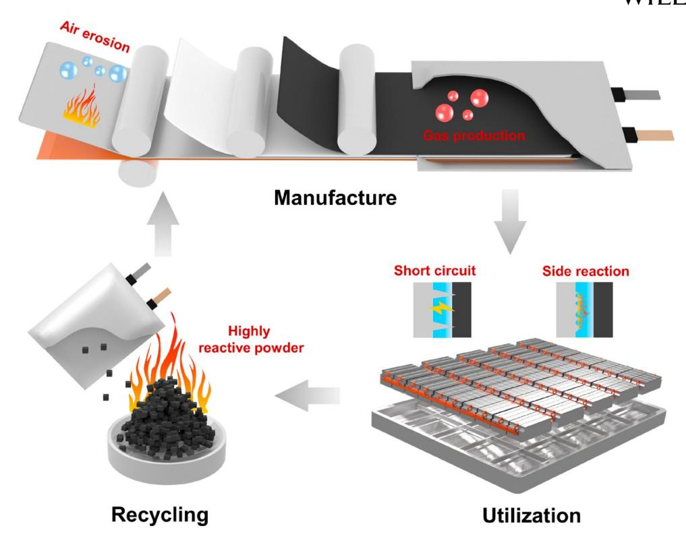
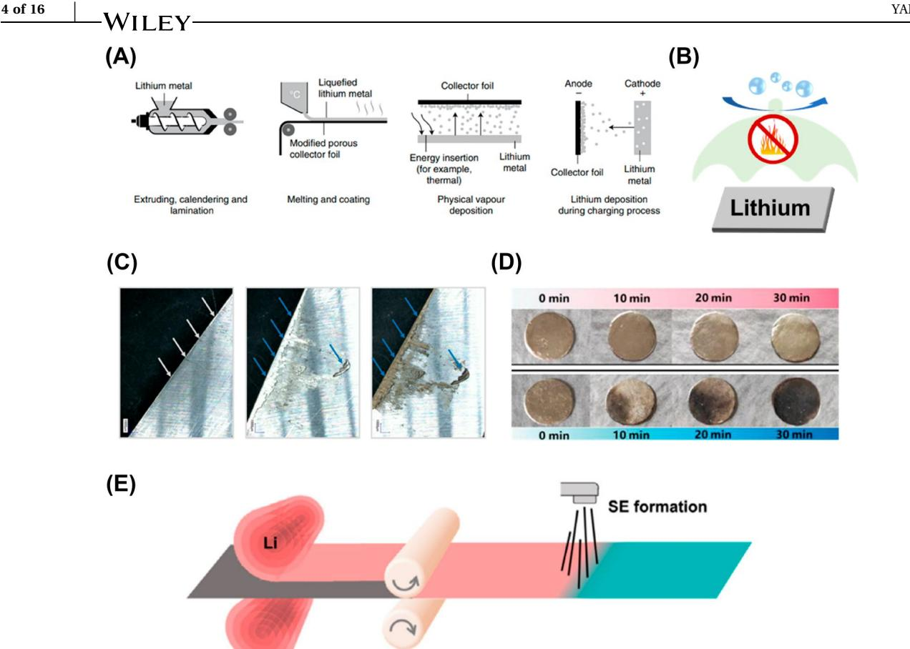
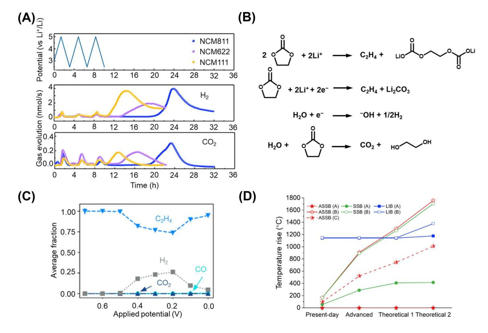
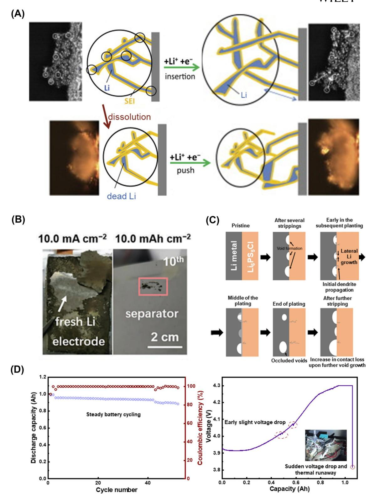
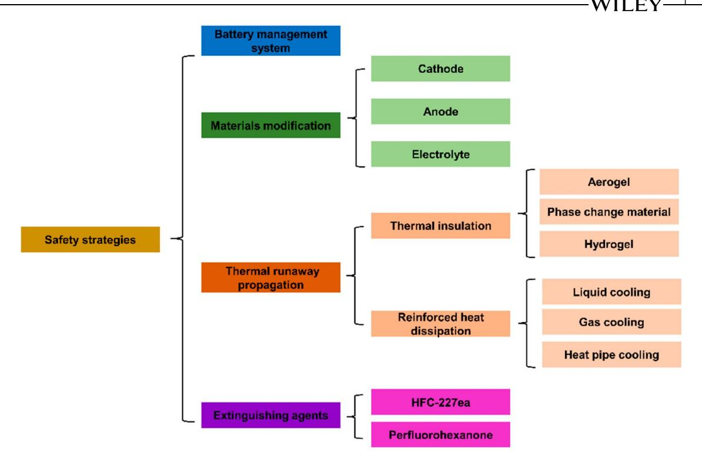
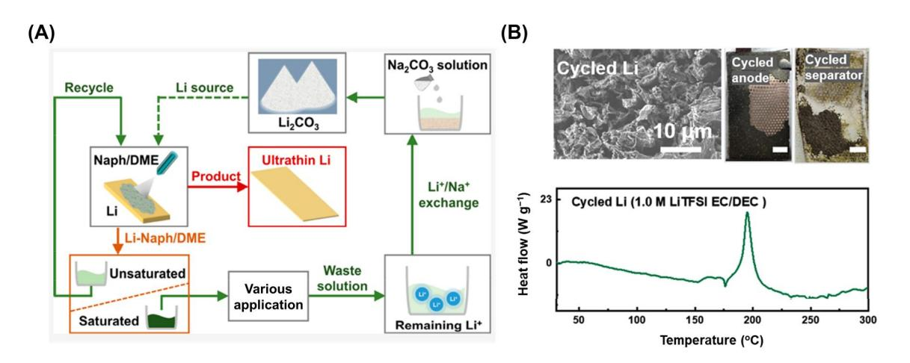

#### **PERSPECTIVE**

# **Life cycle safety issues of lithium metal batteries: A perspective**

**Shi‐Jie Yang1,2** | **Feng‐Ni Jiang3** | **Jiang‐Kui Hu1,2** | **Hong Yuan1,2** | **Xin‐Bing Cheng4** | **Stefan Kaskel5,6** | **Qiang Zhang7** | **Jia‐Qi Huang1,2**

1 School of Materials Science & Engineering, Beijing Institute of Technology, Beijing, China

2 Advanced Research Institute of Multidisciplinary Science, Beijing Institute of Technology, Beijing, China

3 College of Chemical Engineering and Technology, Taiyuan University of Technology, Taiyuan, China

4 Key Laboratory of Energy Thermal Conversion and Control of Ministry of Education, School of Energy and Environment, Southeast University, Nanjing, China

5 Fraunhofer Institute for Material and Beam Technology IWS, Dresden, Germany

6 TU Dresden, Inorganic Chemistry I, Dresden, Germany

7 Department of Chemical Engineering, Tsinghua University, Beijing, China

#### **Correspondence**

Hong Yuan, Xin‐Bing Cheng, Qiang Zhang and Jia‐Qi Huang. Email: [yuanhong@bit.edu.cn,](mailto:yuanhong@bit.edu.cn) [chengxb@seu.](mailto:chengxb@seu.edu.cn) [edu.cn](mailto:chengxb@seu.edu.cn), [zhang-qiang@mails.tsinghua.edu.cn](mailto:zhang-qiang@mails.tsinghua.edu.cn) and [jqhuang@bit.edu.cn](mailto:jqhuang@bit.edu.cn)

#### **Funding information**

Beijing Municipal Natural Science Foundation, Grant/Award Number: L223009; National Key Research and Development Program, Grant/Award Number: 2021YFB2500300; National Natural Science Foundation of China, Grant/Award Numbers: 22075029, 22179070; Natural Science Foundation of Jiangsu Province, Grant/Award Number: BK20220073; Fundamental Research Funds for the Central Universities

#### **Abstract**

The rising lithium metal batteries (LMBs) demonstrate a huge potential for improving the utilization duration of energy storage devices due to high theoretical energy density. Benefiting from the designs in the electrolyte, interface, and lithium host, several attempts have been made in the commercial application of LMBs. However, the application of lithium anode introduces additional safety risks and potential catastrophic accidents due to the high activity of lithium metal and dendrite during the electrochemical cycles. A comprehensive understanding of challenges and design issues on the safety hazards of LMBs in life cycle management is imperative for safe and commercial applications of LMBs. This paper first reviews emerging key safety issues and promising corresponding enhancements of LMBs during their production, utilization, and recycling. The wet air instability of lithium metal anode and gas production during activation have undoubtedly become the most intractable problems in LMBs production. It is necessary to use spraying technology to build a good protection layer upon lithium metal anode. Then, the growth of lithium dendrites poses a higher challenge to the utilization of LMBs, which requires the design of better electrolyte, anode skeleton, and other strategies as well as the prediction of LMBs life through big data and other methods. As for LMBs recovery, it is of great significance to choose the solvent to effectively control the consumption rate and temperature of highly reactive lithium metal powder. At last, further appeals and improvements are proposed for inspiring more related research to push forward the commercial use of LMBs.

Shi‐Jie Yang and Feng‐Ni Jiang contributed equally to this work.

This is an open access article under the terms of the Creative Commons [Attribution](http://creativecommons.org/licenses/by/4.0/) License, which permits use, distribution and reproduction in any medium, provided the original work is properly cited.

© 2023 The Authors. *Electron* published by Harbin Institute of Technology and John Wiley & Sons Australia, Ltd.

**WILEY** 

 $2 \text{ of } 16$ 

#### $\mathbf{1}$ **INTRODUCTION**

Energy storage devices are becoming critical components in our daily life and nearly necessary for almost all human activities with increasing electrification.1–3 Since lithium (Li) ion batteries (LIBs) were commercialized by Sony Corporation in the early 1990s, LIBs have been widely recognized as one of the most important energy storage devices.4-7 Besides the wide utilization in personal electronic equipment, high energy density batteries have also been used in the development of advanced electric vehicles from the beginning of the 21st century. At present, the most advanced LIB is approaching the theoretical energy density limit and becomes a bottleneck in further popularization of electric vehicles due to the low energy density of graphite. $^{8-10}$ 

In the past few years, Li metal was regarded as one of the ideal anode materials for Li batteries in terms of its high theoretical specific capacity (3860 vs. 372 mAh  $g^{-1}$  of graphite) and low negative potential  $(-3.04$  V vs. standard hydrogen electrode).11,12 Besides, when Li metal is paired with lithium transitionmetal oxide (LMO), the Li metal batteries can achieve a high specific energy of ~500 Wh kg $-1$  (vs. ~300 Wh kg $-1$ ) of state-of-the-art LIBs).13 Especially for emerging Li–S and Li-air battery systems, the specific energy may further reach ~650 and ~950 Wh kg $-1$ , respectively.14 In fact, Li metal has long been tried in battery systems. In the late 1980s, Moli Energy used an  $MoS2$  cathode paired with excess Li as commercial Li metal batteries (LMBs). But an accident caused by dendrite formation raised safety concerns in the public hampering further development.15 Until now, many advanced strategies have been proposed to protect the Li metal anode during the steady chemical/electrochemical processes, including electrolyte/interface modification,  $16-19$  separator/skeleton design,  $20-22$  solid-state electrolyte,23-26 etc. The stability of Li metal and the cycling performance of LMBs have been improved to meet the demand for a longer lifespan of batteries, which draws an ideal blueprint for the future application of LMBs in consumer electronics, electric vehicles, and even aircraft. However, the high activity of Li metal and Li dendrites leads to a series of safety problems. $27-30$  Unfortunately, research studies on the thermal safety performance of LMBs are still relatively few, especially during the production and recovery of Li metal. Therefore, an overall consideration of key

safety issues in LMBs life cycle management is critical for the future application of LMBs.

Herein, we will briefly review the thermal hazards of LMBs during all processes, including battery production, application, and recycling (Figure 1). The reactions between Li metal and water or oxygen are the key safety issues during the production processes. Highly flammable  $H_2$  and unstable LiH together cause the safety issue of LMBs manufacture. Further, during the working of LMBs, continuous Li dendrite growth gradually increases the side reaction rate between Li metal and electrolyte and increases the battery safety risk. Intense Li dendrite growth can also lead to the direct battery short circuit and thus, resulting in severe thermal runaway. At the same time, the high energy density of LMBs also increases the maximum temperature of thermal runaway. The harm capacity of a single battery or battery pack in the event of an accident also needs to be emphatically considered. Additionally, the recovery of spent LMBs is also a "hot potato". The pulverization of cycled Li anode will cause additional security risks due to its ultra-high reactivity with ambient atmosphere. Meanwhile, recent improvements and corresponding suggestions on various safety hazards of LMBs are put forward. Last, novel and promising perspectives are put forward to provide better guidance for safety improvements in LMBs life cycle. We hope this review can draw more attention to the safety performance of LMBs to promote its practical application.

#### **SAFETY ISSUES DURING BATTERY** $\mathbf{2}$ **PRODUCTION**

### 2.1 | Li metal anode preparation

Li metal, as one of the highly reactive alkali metals, no doubt becomes the most intractable safety problem in the production process of LMBs.31-34 The flexibility, stickiness, and high activity of Li metal pose a great challenge for the safe and stable production of Li metal anode with uniform thickness and standard size.35,36 Currently, hot extrusion, melt coating, and physical/electrochemical deposition are the main methods to produce Li metal foil (Figure 2A).37 The first two technologies require heating to melt the Li metal at inert atmosphere because the molten Li metal reacts with air, including nitrogen, oxygen, water, and carbon dioxide to generate a large amount of heat, and

**FIGURE 1** Safety issues during manufacture, utilization, and recycling of lithium metal batteries.

especially reaction with water can produce flammable and explosive hydrogen.[41](#page-11-0) However, an advantage of melt coating is that film thickness is quite adjustable and a controlled subsequent passivation is feasible.[42](#page-11-0) Although physical vapor deposition is able to produce ultra‐thin Li metal foils, it requires a vacuum and high‐ pressure environment leading to high investment and operation cost. But the density and uniformity of the Li metal foil obtained by thermal evaporation are also better. Ho et al.[43](#page-11-0) used synchrotron hard X‐ray microtomography to demonstrate that the level of impurities in Li metal foils produced via thermal evaporation is two orders of magnitude lower than that of rolled Li metal foils. Electrochemical deposition in organic electrolyte is simple and cheap, but the Li metal depositions are loose and porous, which is difficult to use in the subsequent battery production process stably.[44](#page-12-0) Moreover, this process may be limited in productivity when compared with traditional hot rolling, and the environmental footprint of additional electrolytes used is problematic.

After the production of Li metal foil, it is necessary to cut it into the fixed size to produce a uniform Li metal anode. Mechanical cutting and laser cutting are the two main ways. Among them, equipment needs to be cleaned frequently during mechanical cutting, because the viscosity of Li metal makes it to adhere to the tool, leaving safety risks. Laser cutting can acquire uniform Li metal foil easily, but the energy input needs to be controlled to avoid Li metal combustion.[45](#page-12-0) Overall, to meet the demand of safe, cheap, and high energy density energy storage devices, it is necessary to develop a method to manufacture stable and ultra‐ thin Li metal anodes.

One of the most critical and difficult processes is the design of a protection layer on Li metal to insulate the air, reducing the requirements of the operating environment (Figure [2B](#page-3-0)).[46–48](#page-12-0) The evaporated surface of conventional Li metal after cutting has high reactivity with moisture, generating hydrogen and by‐ products (Figure [2C\)](#page-3-0).[38](#page-11-0) With increasing the popularity of LMBs and attempting at industrialization, researchers have proposed many methods of using interface polymer/inorganic coatings to protect the Li metal anode[.49,50](#page-12-0) The polymer coating can better isolate the Li metal from the air and reduce the corresponding safety risks. With the protection of poly (diallyl dimethyl ammonium), Li metal anode can even coexist stably with water droplets on its surface for more than 120 s[.51](#page-12-0) It is expected that a similar polymer protection upon Li metal would result in a significant improvement in the safety and a reduced requirement in an operating environment, especially the moisture content. At the same time, the mechanical strength and ion conductivity of the interfacial protective layer can be improved by using the organic–inorganic composite coating, which can also stabilize the Li anode in the subsequent cycling processes[.52,53](#page-12-0) Zhang et al.[39](#page-11-0) reported an in situ copolymerized poly(ethylene glycol methacrylate)

FIGURE 2 Safety risk during Li metal anode production. (A) Typical Li metal anode production technologies. Reproduced with permission.37 Copyright 2021, Springer Nature. (B) Schematic diagram of Li metal anode interface protection. (C) Optical images of pristine Li metal anode, after five times cutting, and reacting with ambient atmosphere subsequently.38 Reproduced with permission. Copyright 2018, Multidisciplinary Digital Publishing Institute. (D) Optical images of PEGMA-LAGP modified (upper) and pristine (lower) Li metal anode resting in air from 0 to 30 min.39 Reproduced with permission. Copyright 2022, Wiley-VCH. (E) Schematic diagram of spraying the air protective layer on the surface of Li metal anode.40 Reproduced with permission. Copyright 2019, Elsevier. SE, solid electrolyte.

and  $\text{Li}_{1.5}\text{Al}_{0.5}\text{Ge}_{1.5}(\text{PO}_4)_3$  (PEGMA-LAGP) upon Li metal anode, which can achieve Li protection and prevent moisture corrosion over 30 min at  $\approx$ 30% relative humidity (Figure 2D). The ultra-thin thickness and electrochemical stability of this protective layer give LMBs better cycling performance. It is promising to construct a large-scale air protective layer on the surface of Li metal anode by spraying and other technologies (Figure 2E).40 However, most of these efforts have only been demonstrated in smallscale laboratory settings. There are still many challenges to building a uniform and stable interface layer on a large-scale Li metal anode, including production line transformation, polymer/inorganic type selection, and corresponding operation safety risks.

#### **Battery assembling, activation,** $2.2 \quad |$ and storage

After the Li metal anode is well produced, it still needs to be assembled with the separator and cathode to

complete a series of processes before LMBs are assembled into the market. Different from existing LIBs, previous works have confirmed that additional pressure is critical to maintaining the relatively stable cycle performance of LMBs.54 Therefore, highperformance LMBs are expected to be achieved through lamination and pouch cell production processed that facilitate pressurizing the batteries. These battery configurations are easy to be pressurized. However, unlike the graphite anode in LIBs, the Li metal anode is ductile and electrochemically active and can electrochemically react with the cathode. Therefore, it is necessary to carefully control the overlap of electrodes in the process of lamination as well as the extraction and pressurization process of the final battery assembly avoiding the direct contact between the anode and cathode.  $55,56$  More advanced robotic arms, image recognition, and laser positioning make stacking better. Real-time resistance and voltage monitoring of LMBs can also better reflect whether there is an obvious short circuit inside the battery and thus, effectively preventing catastrophic accidents.

After battery assembling and electrolyte injection of LMBs, a typical formation procedure is also required at a lower current to construct a stable interphase layer upon both anode and cathode. But unlike the graphite anode, the high activity of the Li metal anode consumes limited electrolyte rapidly and produces more combustible gases such as hydrogen[.57,58](#page-12-0) Zhao et al.[59](#page-12-0) used in situ differential electrochemical mass spectrometry to monitor the gas precipitation upon the initial cycles and subsequent open‐circuit storage of Li‐ternary transition metal oxide cells (Figure 3A). A similar pattern of increasing CO2 and H2 concentrations from 2.5 to 5.0 V and more pronounced H2 and CO2 production during open‐ circuit storage are observed. The reduction reaction of trace water in common solvents and electrolytes with Li metal is responsible for the generation of H2, CO2, and C2H4 (Figure 3B).[62](#page-12-0) The large amount of flammable and exploitable gas produced during battery formation and storage will cause potential security hazards. At present, many new electrolyte systems such as high salt concentration electrolyte can inhibit solvent decomposition on Li metal surface, which is expected to reduce the generation of combustible gas[.63–65](#page-12-0) In addition, the use of ultra‐dry solvent is also key to improve the safety performance of LMBs activation. Furthermore, there is an urgent need for

research on gas production analysis in large capacity and practical LMBs to better promote its commercial use. A critical aspect is also fluorinated or in general halogenated solvents or binders that might lead to fatal failure processes. Fluoroethers are frequently proposed as alternative solvents but when in contact with lithium metal LiF formation may occur in an uncontrolled manner.[66](#page-12-0)

After LMBs are produced, batteries need to be properly stored before they are loaded into vehicles. As mentioned above, gas production is one of the biggest problems in LMBs storage, and this process is accelerated by high temperature. Based on quantum chemical calculations and data‐driven chemical reaction networks, Spotte‐Smith et al.[60](#page-12-0) simulated electrolyte decomposition products at various temperatures (Figure 3C). At higher temperatures, solid electrolyte interphase (SEI) on the surface of Li metal is less stable and is easily decomposed to C2H4, H2, and other flammable gases. LMBs are more prone to inflating, gas leakage, and other safety accidents; hence, they need to be dealt with caution. It is necessary to add an exhaust valve to the battery to realize timely emission of gas under appropriate pressure. The battery configuration design for LMBs should not be limited to the current pouch battery system, and more specific shell design ought to be

**FIGURE 3** Safety risk of Li metal anode in LMBs assembling, activation, and storage. (A) In situ gaseous evolution rate of H2 and CO2 during the activation and subsequent storage of lithium metal batteries.[59](#page-12-0) Reproduced with permission. Copyright 2021, Wiley‐VCH. (B) Typical reduction reaction equations of ethylene carbonate solvent and water with Li metal anode. (C) Gaseous by‐product simulations under various applied potentials referenced to Li/Liþ electrode.[60](#page-12-0) Reproduced with permission. Copyright 2022, American Chemical Society. (D) Calculated temperature rise based on different cell formats and various designs, and the energy density is increased from present‐day to advanced and theoretical 1,2[.61](#page-12-0) Reproduced with permission. Copyright 2022, Elsevier.

developed. Moreover, it is best to store LMBs in an inert/anaerobic atmosphere to avoid potential combustion and explosive reactions caused by flammable gas escape.

Apart from the gas problem, the high energy density storage of LMBs poses more challenges.67–69 Bates et al.61 applied the first thermodynamic models to quantitatively evaluate the heat release of LMBs and LIBs under several conditions (Figure 3D). Even while using a relatively stable oxide solid electrolyte, the maximum temperature of thermal runaway of LMBs is still higher than that of existing LIBs when the battery capacity and energy density are increased. Among them, the heat release of Li metal combustion is highly pronounced, so that the highest temperature of the battery can reach 1800°C, which poses a severe challenge to fire prevention and suppression. At the present stage, the most practical prospect is still solidliquid mixed LMBs. The heat brought by decomposition and combustion of electrolyte will further increase the maximum temperature of thermal runaway of batteries. Therefore, the storage form of LMBs needs to be reconsidered. If additional Li metal is not added into anode-free LMBs, the safety performance of the battery at 0% state of charge can be effectively improved. However, the capacity of anode-free LMBs declines too dramatically and is still far from being practical. In a word, it is still necessary to pay special attention to temperature and gas production in the storage process of LMBs and avoid large-scale and long-term storage.

In conclusion, due to the high reactivity of the Li metal anode, it is necessary to focus on the chemical reactions that will occur at the anode interface during battery assembly, activation, and storage. In particular, short circuit during assembly, large gas production during activation, and inert protection during storage require special attention.

#### **SAFETY ISSUES IN BATTERIES** $\mathbf{3}$ **UTILIZATION**

#### Normal cycling processes $3.1 \quad \vert$

The Li dendrite growth is regarded as one of the most critical problems in LMBs during cycling processes (Figure 4A). $70,73,74$  Different from the graphite anode in traditional LIBs, the mechanism of Li metal chemistry strongly depends on the conversion reaction between Li ions and Li atoms, rather than the intercalation/deintercalation reaction of Li ions in the graphite layer, which indicates that Li metal will repeatedly undergo deposition and stripping processes.75 Being one of the alkali metal families, Li metal has lower surface energy and higher Li-atom diffusion barrier, and the deposition of Li metal tends to gather at a certain active site, which is essentially easier to deposit a one-dimensional dendritic structure, forming Li dendrite.76 In addition, the space charge layer caused by the uneven concentration of Li ions in the electrolyte and the uneven active sites on the surface of Li metal anode will aggravate the growth of Li dendrites. Li dendrite growth increases the specific surface area of Li metal, thereby aggravating the consumption of Li metal and the organic electrolyte. As a result, it leads to poor cycling performance and low Coulombic efficiency of LMBs.77–80 Similarly, sharp Li dendrite generated during the charging process seriously hinders the practical application of LMBs from the viewpoint of battery safety. Li dendrite can penetrate the separator and reach the cathode to form an undesired electronic circuit in LMBs during the cycling processes, resulting in the internal short circuit of LMBs (Figure 4B). $7^{1}$ Then, the huge joule heat releases quickly and the battery temperature increases sharply in several seconds, which leads to the severe safety risks of working batteries. In fact, safety accidents caused by the internal short circuit of LIBs have happened occasionally in recent years, resulting in serious threats to the consumer's property and lives.81 Worse still, compared with LIBs, LMBs confront severer internal short-circuit problems because of the more serious Li dendrite growth. Hence, the strategies to inhibit or alleviate the formation of Li dendrite are essential for the pursuit of the commercial application of LMBs.

Numerous strategies have been proposed to address the above issues, including solid-state electrolyte, electrolyte additive, high-concentration electrolytes, localized high-concentration electrolytes, artificial SEI, and so on.82–86 These solutions are creative and will be a great contribution to the field of battery safety. Especially, the solid-state LMBs are thought to be one of the most promising nextgeneration energy storage systems in the future.87–89 The nonflammability of solid-state electrolyte relieves the thermal safety risks of LMBs at high temperature. In addition, the Monroe–Newmann model suggests that Li dendrite can be suppressed when the shear modulus of the solid-state electrolyte is two times larger than that of Li metal ( $\sim$ 4.0 GPa).90 However, in fact, the growth of Li dendrite in the solid-state electrolyte has been widely discovered in a large number of studies; even the above criterion is achieved. Kasemchainan et al. $72$  investigated the Li metal plating and stripping processes of Li symmetrical batteries with Li6PS5Cl electrolyte. It was discovered that the stripping rate of Li atoms at electrolyteelectrode was much higher than the replenishment rate. Consequently, cavities were generated at the interface, resulting in the heterogeneous current density distribution and ultimately inducing the generation of Li dendrite during the following plating

 $7 \text{ of } 16$ 

**FIGURE 4** (A) Schematic diagram of Li dendrite plating and stripping processes.70 Reproduced with permission. Copyright 2014, Elsevier. (B) The digital photos of Li anode and separator after 10 cycles.71 Reproduced wi (C) Schematic diagram of Li dendrite growth at Li electrode and Li6PS5Cl electrolyte interface.72 Copyright 2019, Springer Nature. (D) The sudden thermal runaway of Ah-level lithium metal batteries within normal cycling.

processes (Figure [4C](#page-6-0))[.72](#page-12-0) The existence of Li dendrite significantly aggravates the thermal runaway risks of solid‐state LMBs and suggests that the thermal safety of solid‐state LMBs may have been overestimated. Under the influence of this hidden danger, LMBs are prone to sudden short circuit in the battery caused by accumulated Li dendrite during cycling, resulting in severe thermal runaway (Figure [4D\)](#page-6-0). This process is very fast and difficult to warn in advance, which is the biggest potential safety hazard in the utilization of LMBs. In addition, pressurizing LMBs with advanced electrolytes can also effectively inhibit the growth of Li dendrites. Niu et al.[54](#page-12-0) used a localized high‐ concentration electrolyte and added a pressure of 10 psi to achieve a long cycle of LMBs at high energy density (300 Wh kg−1 ). Coating a stable and high mechanical modulus interfacial layer on the surface of Li metal can also enhance the uniform transport of Li ions and inhibit the growth of Li dendrites. A porous graphene oxide film doped with sulfur and nitrogen is adopted by Ni et al[.91](#page-13-0) as the interface layer to effectively inhibit the growth of Li dendrites. However, the repeated deposition and stripping of Li metal will accumulate side reaction products, which deteriorate the Li metal anode and causes serious Li dendrite growth. Based on the above analysis, it is essential to devote greater efforts in alleviating Li dendrite growth to deliver LMBs with excellent safety during the cycling processes.

### **3.2** | **Abuse conditions**

The thermal runaway of the energy storage system is also triggered by different kinds of abuse, including mechanical abuse (crush, puncture, etc.), electrical abuse (external short circuit, overcharge, etc.), and thermal abuse (overheating fire, etc.)[.61,92](#page-12-0) These abuse states can be transformed into each other, eventually leading to uncontrolled exothermal chain reactions inside the battery and the occurrence of thermal runaway. There are several key exothermic reactions in LMBs that require specific attention: (1) SEI is thermally unstable at high temperature (>100°C)[.93,94](#page-13-0) Therefore, Li metal may react violently with electrolyte, leading to the uncontrollable rise in the temperature of LMBs and[95](#page-13-0) (2) the high‐Ni oxide cathodes decompose under thermal induction, accompanied by the release of oxygen.[96–98](#page-13-0) Then, the chemical combination between oxygen and electrolyte/Li metal can lead to great danger of LMBs. In addition, it is the battery pack consisting of several battery modules rather than the single battery serving in the new energy vehicles to release the customer's worry about the electric driving range. Meanwhile, the much more serious thermal safety problems are triggered by the increase in energy density. The thermal safety risk of the battery pack requires much more attention. The heat transfer and the gas/fire eruption can result in the thermal runaway propagation from a battery to its neighbors or the failure modules to adjacent modules.[99](#page-13-0) As a result, tremendous heat is released and a catastrophic hazard will occur and extremely threaten the safe utilization of LMBs.

Based on the above analysis, the corresponding solving strategies are proposed to circumvent or solve the thermal safety risks of LMBs (Figure [5\)](#page-8-0). The innovation of the next‐generation battery management system, which can monitor the battery status and recognize the early warning signs of abuse is really important. In addition, material modification, including cathode, anode, and electrolyte is beneficial to eliminate the exothermic reactions and cut off the chain side reactions in LMBs. Surface coating of the cathode can avoid direct contact between the electrode and electrolyte, thereby improving the structural stability of the cathode and alleviating the appearance of the exothermic reactions at the interface successfully.[100](#page-13-0) The thermally stable SEI with abundant polymer is prepared to enhance the thermal stability between Li metal and electrolyte at high temperature.[101](#page-13-0) Flame retardants, such as ethoxy (pentafluoride) cyclotriphosphonitrile, (phenoxy) pentafluorocyclotriphosphazene, and triethyl phosphate, are added into organic electrolytes to modify the flammability and suppress the fire or even the explosion of the battery[.102,103](#page-13-0) Moreover, controlling the speed of the thermal runaway propagation in battery pack is another suitable method to establish a barrier for the battery against thermal runaway. The utilization of thermal insulation and reinforced heat dissipation is thought to be an effective strategy to restrain or even block the thermal runaway propagation in the battery module. The synergistic effects between conventional thermal insulation materials, including aerogel and nanofiber materials, phase change material, and hydrogel, etc., and thermal management methods, such as liquid cooling, gas cooling, and heat pipe cooling, etc., are cost‐effective and widespread solutions to mitigate thermal runaway propagation at the system level[.104,105](#page-13-0) However, if the above protections fail, the passive protection is needed to minimize the losses. Extinguishing agents are regarded as the last barrier to prevent the thermal runaway of battery from the great damage to passengers. Various extinguishing agents based on the three factors of combustion have been investigated extensively. Heptafluoropropane (HFC‐227ea), dodecafluoro‐2‐methylpentan‐3‐one, perfluorohexanone, etc. can extinguish the battery fire rapidly and effectively avoid the reignition of fire.[106,107](#page-13-0) Therefore, it is reasonable and acceptable that the commercialization of LMBs has a bright prospect with the assistance of these effective strategies.

**FIGURE 5** An overview of the effective strategies for improving thermal safety of lithium metal batteries under abuse conditions.

### **3.3** | **Scrap of LMBs**

With the charge and discharge processes in LMBs, the Li anode is highly dendritic and the structure stability of Ni‐based layered cathode is deteriorated significantly, which not only induces the short cycling lifespan, but obviously reduces the thermal safety of LMBs. Xu et al.[108](#page-13-0) quantitatively demonstrated that the thermal runaway risks of pristine LMBs with fresh Li were activated with the formation of dendrite and dead Li during long cycling processes. The failure of the first commercialization of LMBs occurred in 1989 because of the generation of the large quantities of dendrite.[109](#page-13-0) In addition, different dangerous gases especially H2 formed during the plating and stripping processes aggravate the thermal runaway risks of LMBs. Therefore, it is necessary to formulate appropriate retirement criteria for aged batteries. At present, the LIBs are scrapped when the remaining capacity is less than 80% of the initial capacity. However, the thermal safety of LMBs is much more serious than LIBs. Li et al.[110](#page-14-0) found that the Li dendrite deposited on the surface of graphite anode afterthe fast charging application led to the earlier thermal runaway of LIBs. As a result, the large amount of Li metal in LMBs warns of the dangers involved. Börner et al.[111](#page-14-0) compared the thermal stability of LIBs after aging at different temperatures. They found that a large amount of Li metal was deposited on the surface of the graphite anode at 20o C. The Li metal can react violently with electrolyte, thus significantly reducing the thermal stability of the battery. Aiming at this situation, more stringent scrapping standards are needed for LMBs, which may not just be concerned with the capacity of batteries, but the various battery parameters such as voltage, resistance, and temperature, etc. should all be taken into consideration.

### **4** | **SAFETY ISSUES OF LMB RECYCLING**

The fast development of high‐capacity rechargeable batteries in electric vehicles and smart grids will inevitably lead to the rapid growth of the number of the spent batteries. For LIB, the established recycling routes are pyrometallurgy and hydrometallurgy. Direct recycling is in development but only applicable in limited cases.

As we all know, the spent LMBs consist of environmental pollution organic electrolytes, safety‐ threatening Li powder, and various metal elements such as Co, Ni, Mn, and Al; most of them with high economic value.[112–114](#page-14-0) Therefore, the corresponding recycling strategies of LMBs must be developed before they are tried in commercial products from the viewpoint of environmental protection, battery safety, and economic effectiveness.

The spent batteries should be discharged completely before disassembly with the aim to enhance the security in the following recycling steps of LMBs. Moreover, Li metal, especially the pulverized Li metal, is highly sensitive to water, therefore, the dismantling - YANG ET AL.

of the spent LMBs to obtain the valuable cathode and anode must be carried out in an atmosphere almost without water or oxygen. At present, the recovery of valuable metals such as Li, Co, Ni, and Mn from the cathode has been widely investigated. Xin et al.[115](#page-14-0) proposed a cheap autotrophic bioleaching to extract the metals from the resistant LiNi*x*Co*y*Mn1‐*x*‐*y*O2 with a very high extraction efficiency (>95%). Lu et al.[116](#page-14-0) designed an oxalic acid‐based deep eutectic solvent (DES) to recover the metal in LiCoO2. It was discovered that the DES was sustainable and the extraction efficiency of Li and Co was as much as 92.9% and 74.5%, respectively, at the firth recycling. Zhu et al.[117](#page-14-0) reported a carbothermal shock method with uniform temperature distribution and rapid temperature change to enhance the leaching efficiency of valuable metals such as Li (>90%) and Ni (98%) efficiently.

The technologies of the recovery of the valuable metals from battery cathode in LIB are relatively mature while there are few studies related to the recovery of Li metal. Therefore, the main challenge is the recovery of Li anode for the spent LMBs. Direct recycling extracting Li metal in the metallic state would result in the highest revenue. However, the high sensitivity of Li metal makes such processes challenging. The explosive development of LMBs in the future must drive the requirement of Li to unexpected levels. It is well known that the current price of Li has soared a lot, revealing the importance to develop the recycling of Li element in spent LMBs[.118](#page-14-0) To be noticed, the Li metal with large specific surface area has extremely high chemical activity. Therefore, the solvents used to dissolve Li metal should be chosen carefully to ensure that the recovery of the Li element in LMBs is efficient and safe enough. Hu et al.[119](#page-14-0) utilized the naphthalene to dissolve the Li metal to obtain ultrathin Li foil and discovered that the reaction rate can be effectively adjusted by the temperature, concentration, and operation mode (Figure 6A). However, the high surface area and reactivity of pulverized Li anode make it difficult to be recovered at a controlled rate (Figure 6B).[108](#page-13-0) After cycling, the accumulation of unstable chemical components on the surface of Li metal anode is excessive, which can spontaneously lead to violent exothermic phenomena under heating conditions. Therefore, it is necessary to control the consumption rate and reaction temperature during LMBs recycling. Finding a more suitable solvent to control the rate of reaction with Li metal becomes critical. Yang et al.[120](#page-14-0) proposed that the Li metal can be slowly and continuously dissolved by diethyl carbonate because the reduction product of diethyl carbonate (Li ethylene carbonate), dispersing easily in the electrolyte, cannot protect the Li metal. After the dissolving process, the produced solutions with Li element can be utilized as raw materials to obtained various Li salts, such as Li2CO3 and LiOH etc., at last exhibiting good Li atom economy. The slow and mild chemical reaction also increases the safety of LMBs recycling. In addition to the liquid‐phase reaction method of consuming Li metal, critical CO2 also shows excellent potential in consuming active Li metal and converting it to inert Li2CO3, but further exploration is needed.[121](#page-14-0)

Overall, the separation or selection of appropriate solvents to control the reaction rates of highly active Li metal powders is the biggest challenge in the recovery of LMBs. The lower density of Li metal makes pulverized Li easy to float and scatter in the process of separation as an ignition source to cause environmental fires. The large amount of heat and combustible gas generated by the direct conversion of Li metal will also provide higher requirements for the pressure and temperature control of the reaction vessel.

**FIGURE 6** (A) Schematic illustration of the production process of ultrathin Li foil with naphthalene.[119](#page-14-0) Reproduced with permission. Copyright 2022, American Chemical Society. (B) Morphology and heat release process of Li metal anode after cycling.[108](#page-13-0) Reproduced with permission. Copyright 2014, Elsevier.

# **5** | **SUMMARY AND OUTLOOK**

As an excellent alternative to LIB, LMBs are emerging as a rising star in energy storage devices that have satisfactory energy density and are able to power electric airplanes and even rockets. With the efforts of many researchers, the cycling performance of LMBs has been greatly improved using advanced electrolytes and excellent solid‐state electrolytes. However, before manufacturing large‐capacity LMBs, the thermal safety hazards of LMBs throughout the life cycle are necessary to summarize and review for safer batteries production, utilization, and recycling. In this minireview, we conclude the main thermal hazards of LMBs during the life cycle management, and the corresponding improvement strategies are subsequently summarized. At present, LMBs for energy storage are not safe enough to meet the demands of practical applications and commercialization. There are still some technical problems that need to be addressed, and these challenges are discussed in more detail below:

- 1) Further improvement of inhibiting the growth of Li dendrites by exploiting novel electrolyte, optimizing the interface modification, and introducing 2D/3D skeleton are highly expected. Even though recent breakthroughs have been made in the electrochemical performance of LMBs by achieving more than 400 cycles with 80% capacity retention. However, the metallic Li dendrites still grow violently, which will significantly reduce the safety of the battery after cycling and bring serious safety risks for the recycling of LMBs. Therefore, novel materials and methods are required to be developed for enhancing the electrochemical stability of Li metal anode.
- 2) At present, there are still few literature on the improvement of LMBs thermal stability, and corresponding theories and methods are very scarce, which needs to be filled urgently. After improving the battery cycling performance, the evaluation of battery safety should be appended to better reflect the prospect for promoting the commercialization of practical LMBs. In addition, due to the high energy density of LMBs, it is necessary to develop more stable and safe methods to evaluate battery stability. Especially, when the battery capacity increases, the destruction ability of LMBs during thermal runaway is expected to increase significantly. Therefore, it is necessary to tame this violent "beast" to provide methods and guidance for subsequent thermal safety improvement.
- 3) Li metal recovery in LMBs must be on the agenda because of its high cost and content in batteries. The most difficult problem in the recovery of LMBs is the safety problem caused by the pulverization of Li metal anode. The separation of

pulverized Li metal from the cathode and the gentle disposal of highly reactive pulverized Li needs to be discussed more fully. At present, there is still no ideal method and case for large‐capacity LMBs to indicate the risk level in this process and corresponding improvements.

#### **ACKNOWLEDGMENTS**

This work was funded by Beijing Municipal Natural Science Foundation (L223009), National Key Research and Development Program (2021YFB2500300), National Natural Science Foundation of China (22075029, 22179070), the Natural Science Foundation of Jiangsu Province (BK20220073), and the Fundamental Research Funds for the Central Universities.

## **CONFLICT OF INTEREST STATEMENT**

The authors declare no competing interests.

### **ORCID**

*Hong Yuan* <https://orcid.org/0000-0001-7565-2204> *Xin‐Bing Cheng* [https://orcid.org/0000-0001-7567-](https://orcid.org/0000-0001-7567-1210) [1210](https://orcid.org/0000-0001-7567-1210) *Stefan Kaskel* [https://orcid.org/0000-0003-4572-](https://orcid.org/0000-0003-4572-0303)

[0303](https://orcid.org/0000-0003-4572-0303)

*Qiang Zhang* [https://orcid.org/0000-0002-3929-](https://orcid.org/0000-0002-3929-1541) [1541](https://orcid.org/0000-0002-3929-1541)

*Jia‐Qi Huang* [https://orcid.org/0000-0001-7394-](https://orcid.org/0000-0001-7394-9186) [9186](https://orcid.org/0000-0001-7394-9186)

### **REFERENCES**

- 1. Vasconcelos LS, Xu R, Xu Z, et al. Chemomechanics of rechargeable batteries: status, theories, and perspectives. *Chem Rev*. 2022;122(15):13043‐13107. [https://doi.org/10.](https://doi.org/10.1021/acs.chemrev.2c00002) [1021/acs.chemrev.2c00002](https://doi.org/10.1021/acs.chemrev.2c00002)
- 2. Li M, Lu J, Chen Z, Amine K. 30 years of lithium‐ion batteries. *Adv Mater Interfac*. 2018;30(33):1800561. [https://doi.org/10.](https://doi.org/10.1002/adma.201800561) [1002/adma.201800561](https://doi.org/10.1002/adma.201800561)
- 3. Zhang JG, Xu W, Xiao J, Cao X, Liu J. Lithium metal anodes with nonaqueous electrolytes. *Chem Rev*. 2020;120(24): 13312‐13348. <https://doi.org/10.1021/acs.chemrev.0c00275>
- 4. Wang CY, Liu T, Yang XG, et al. Fast charging of energy‐ dense lithium‐ion batteries. *Nature*. 2022;611(7936):485‐490. [https://doi.org/10.1038/s41586](https://doi.org/10.1038/s41586-022-05281-0)‐022‐05281‐0
- 5. Kwade A, Haselrieder W, Leithoff R, Modlinger A, Dietrich F, Droeder K. Current status and challenges for automotive battery production technologies. *Nat Energy*. 2018;3(4):290‐ 300. [https://doi.org/10.1038/s41560](https://doi.org/10.1038/s41560-018-0130-3)‐018‐0130‐3
- 6. Winter M, Barnett B, Xu K. Before Li ion batteries. *Chem Rev*. 2018;118(23):11433‐11456. [https://doi.org/10.1021/acs.](https://doi.org/10.1021/acs.chemrev.8b00422) [chemrev.8b00422](https://doi.org/10.1021/acs.chemrev.8b00422)
- 7. Zubi G, Adhikari RS, Sánchez NE, Acuña‐Bravo W. Lithium‐ ion battery‐packs for solar home systems: layout, cost and implementation perspectives. *J Energy Storage*. 2020;32: 101985. <https://doi.org/10.1016/j.est.2020.101985>
- 8. Yang SJ, Shen X, Cheng XB, et al. Plating current density distribution of lithium metal anodes in pouch cells. *J Energy Chem*. 2022;69:70‐75. [https://doi.org/10.1016/j.jechem.2021.](https://doi.org/10.1016/j.jechem.2021.12.049) [12.049](https://doi.org/10.1016/j.jechem.2021.12.049)
- 9. Jiang F‐N, Yang S‐J, Cheng X‐B, et al. An interface‐contact regulation renders thermally safe lithium metal batteries.

**12 of 16**

*eTransportation*. 2023;15:100211. [https://doi.org/10.1016/j.](https://doi.org/10.1016/j.etran.2022.100211) [etran.2022.100211](https://doi.org/10.1016/j.etran.2022.100211)

- 10. Xu XQ, Jiang FN, Yang SJ, et al. Dual‐layer vermiculite nanosheet based hybrid film to suppress dendrite growth in lithium metal batteries. *J Energy Chem*. 2022;69:205‐210. <https://doi.org/10.1016/j.jechem.2022.01.019>
- 11. Xu K. Electrolytes and interphases in Li‐ion batteries and beyond. *Chem Rev*. 2014;114(23):11503‐11618. [https://doi.](https://doi.org/10.1021/cr500003w) [org/10.1021/cr500003w](https://doi.org/10.1021/cr500003w)
- 12. Ding J‐F, Xu R, Yan C, Li B‐Q, Yuan H, Huang J‐Q. A review on the failure and regulation of solid electrolyte interphase in lithium batteries. *J Energy Chem*. 2021;59:306‐319. [https://](https://doi.org/10.1016/j.jechem.2020.11.016) [doi.org/10.1016/j.jechem.2020.11.016](https://doi.org/10.1016/j.jechem.2020.11.016)
- 13. Kim S, Park G, Lee SJ, et al. Lithium‐metal batteries: from fundamental research to industrialization. *Adv Mater*. 2023; 35:e2206625. <https://doi.org/10.1002/adma.202206625>
- 14. Lin D, Liu Y, Cui Y. Reviving the lithium metal anode for high‐energy batteries. *Nat Nanotechnol*. 2017;12(3):194‐206. <https://doi.org/10.1038/nnano.2017.16>
- 15. Liu H, Sun X, Cheng XB, et al. Working principles of lithium metal anode in pouch cells. *Adv Energy Mater*. 2022;12(47): 2202518. <https://doi.org/10.1002/aenm.202202518>
- 16. Fan X, Ji X, Han F, et al. Fluorinated solid electrolyte interphase enables highly reversible solid‐state Li metal battery. *Sci Adv*. 2018;4(12):eaau9245. [https://doi.org/10.1126/scia](https://doi.org/10.1126/sciadv.aau9245) [dv.aau9245](https://doi.org/10.1126/sciadv.aau9245)
- 17. Hobold GM, Lopez J, Guo R, et al. Moving beyond 99.9% Coulombic efficiency forlithium anodes in liquid electrolytes. *Nat Energy*. 2021;6(10):951‐960. [https://doi.org/10.1038/](https://doi.org/10.1038/s41560-021-00910-w) [s41560](https://doi.org/10.1038/s41560-021-00910-w)‐021‐00910‐w
- 18. Gao RM, Yang H, Wang CY, Ye H, Cao FF, Guo ZP. Fatigue‐ resistant interfacial layer for safe lithium metal batteries. *Angew Chem Int Ed*. 2021;60(48):25508‐25513. [https://doi.](https://doi.org/10.1002/anie.202111199) [org/10.1002/anie.202111199](https://doi.org/10.1002/anie.202111199)
- 19. Liu DH, Bai Z, Li M, et al. Developing high safety Li‐metal anodes for future high‐energy Li‐metal batteries: strategies and perspectives. *Chem Soc Rev*. 2020;49(15):5407‐5445. <https://doi.org/10.1039/c9cs00636b>
- 20. Sun S, Wang J, Chen X, et al. Thermally stable and dendrite‐ resistant separators toward highly robust lithium metal batteries. *Adv Energy Mater*. 2022;12(41):2202206. [https://](https://doi.org/10.1002/aenm.202202206) [doi.org/10.1002/aenm.202202206](https://doi.org/10.1002/aenm.202202206)
- 21. Zhao Q, Wang R, Hu X, et al. Functionalized 12 µm polyethylene separator to realize dendrite‐free lithium deposition toward highly stable lithium‐metal batteries. *Adv Sci*. 2022; 9(13):e2102215. <https://doi.org/10.1002/advs.202102215>
- 22. Liu Z, Hu Q, Guo S, Yu L, Hu X. Thermoregulating separators based on phase‐change materials for safe lithium‐ion batteries. *Adv Mater*. 2021;33(15):2008088. [https://doi.org/10.](https://doi.org/10.1002/adma.202008088) [1002/adma.202008088](https://doi.org/10.1002/adma.202008088)
- 23. Sheng O, Jin C, Ding X, et al. A decade of progress on solid‐ state electrolytes for secondary batteries: advances and contributions. *Adv Funct Mater*. 2021;31(27):2100891. <https://doi.org/10.1002/adfm.202100891>
- 24. Yu Z, Zhang X, Fu C, et al. Dendrites in solid‐state batteries: ion transport behavior, advanced characterization, and interface regulation. *Adv Energy Mater*. 2021;11(18):2003250. <https://doi.org/10.1002/aenm.202003250>
- 25. Zhang S, Sun F, Du X, et al. *In situ*‐polymerized lithium salt as a polymer electrolyte for high‐safety lithium metal batteries. *Energy Environ Sci*. 2023;16(6):2591‐2602. [https://doi.](https://doi.org/10.1039/d3ee00558e) [org/10.1039/d3ee00558e](https://doi.org/10.1039/d3ee00558e)
- 26. Chen RS, Nolan AM, Lu JZ, et al. The thermal stability of lithium solid electrolytes with metallic lithium. *Joule*. 2020;4: 812‐821. <https://doi.org/10.1016/j.joule.2020.03.012>
- 27. Yang C, Fu K, Zhang Y, Hitz E, Hu L. Protected lithium‐metal anodes in batteries: from liquid to solid. *Adv Mater*. 2017; 29(36):1701169. <https://doi.org/10.1002/adma.201701169>

- 28. Jiang F‐N, Yang S‐J, Chen Z‐X, et al. Higher‐order polysulfides induced thermal runaway for 1.0 Ah lithium sulfur pouch cells. *Particuology*. 2023;79:10‐17. [https://doi.org/10.](https://doi.org/10.1016/j.partic.2022.11.009) [1016/j.partic.2022.11.009](https://doi.org/10.1016/j.partic.2022.11.009)
- 29. Huang XY, Xiao M, Han DM, Xue JJ, Wang SJ, Meng YZ. Thermal runaway features of lithium sulfur pouch cells at various states of charge evaluated by extended volume‐ accelerating rate calorimetry. *J Power Sources*. 2021;489: 229503. <https://doi.org/10.1016/j.jpowsour.2021.229503>
- 30. Li H, Wen Z, Wu D, et al. Achieving a stable solid electrolyte interphase and enhanced thermal stability by a dual‐ functional electrolyte additive toward a high‐loading LiNi0.8Mn0.1Co0.1O2 /lithium pouch battery. *ACS Appl Mater Interfaces*. 2021;13(48):57142‐57152. [https://doi.org/10.1021/](https://doi.org/10.1021/acsami.1c17209) [acsami.1c17209](https://doi.org/10.1021/acsami.1c17209)
- 31. Lisbona D, Snee T. A review of hazards associated with primary lithium and lithium‐ion batteries. *Process Saf Environ Protect*. 2011;89(6):434‐442. [https://doi.org/10.1016/j.psep.](https://doi.org/10.1016/j.psep.2011.06.022) [2011.06.022](https://doi.org/10.1016/j.psep.2011.06.022)
- 32. Wang D, Zhang W, Zheng W, Cui X, Rojo T, Zhang Q. Towards high‐safe lithium metal anodes: suppressing lithium dendrites via tuning surface energy. *Adv Sci*. 2017;4(1):1600168. <https://doi.org/10.1002/advs.201600168>
- 33. Tan YH, Lu GX, Zheng JH, et al. Lithium fluoride in electrolyte for stable and safe lithium‐metal batteries. *Adv Mater*. 2021;33(42):e2102134. [https://doi.org/10.1002/adma.20210](https://doi.org/10.1002/adma.202102134) [2134](https://doi.org/10.1002/adma.202102134)
- 34. Li T, Liu H, Shi P, Zhang Q. Recent progress in carbon/ lithium metal composite anode for safe lithium metal batteries. *Rare Met*. 2018;37(6):449‐458. [https://doi.org/10.1007/](https://doi.org/10.1007/s12598-018-1049-3) [s12598](https://doi.org/10.1007/s12598-018-1049-3)‐018‐1049‐3
- 35. Grady HR. Lithium metal for the battery industry. *J Power Sources*. 1980;5(1):127‐135. [https://doi.org/10.1016/0378](https://doi.org/10.1016/0378-7753(80)80101-7)‐ [7753\(80\)80101](https://doi.org/10.1016/0378-7753(80)80101-7)‐7
- 36. Masias A, Felten N, Garcia‐Mendez R, Wolfenstine J, Sakamoto J. Elastic, plastic, and creep mechanical properties of lithium metal. *J Mater Sci*. 2018;54(3):2585‐2600. [https://doi.](https://doi.org/10.1007/s10853-018-2971-3) [org/10.1007/s10853](https://doi.org/10.1007/s10853-018-2971-3)‐018‐2971‐3
- 37. Duffner F, Kronemeyer N, Tübke J, Leker J, Winter M, Schmuch R. Post‐lithium‐ion battery cell production and its compatibility with lithium‐ion cell production infrastructure. *Nat Energy*. 2021;6(2):123‐134. [https://doi.org/10.1038/](https://doi.org/10.1038/s41560-020-00748-8) [s41560](https://doi.org/10.1038/s41560-020-00748-8)‐020‐00748‐8
- 38. Jansen T, Blass D, Hartwig S, Dilger K. Processing of advanced battery materials—laser cutting of pure lithium metal foils. *Batteries*. 2018;4(3):37. [https://doi.org/10.3390/](https://doi.org/10.3390/batteries4030037) [batteries4030037](https://doi.org/10.3390/batteries4030037)
- 39. Zhang K, Wu F, Wang X, et al. 8.5 µm‐thick flexible‐rigid hybrid solid–electrolyte/lithium integration for air‐stable and interface‐compatible all‐solid‐state lithium metal batteries. *Adv Energy Mater*. 2022;12(24):2200368. [https://doi.](https://doi.org/10.1002/aenm.202200368) [org/10.1002/aenm.202200368](https://doi.org/10.1002/aenm.202200368)
- 40. Shen X, Cheng X, Shi P, et al. Lithium–matrix composite anode protected by a solid electrolyte layer for stable lithium metal batteries. *J Energy Chem*. 2019;37:29‐34. [https://doi.](https://doi.org/10.1016/j.jechem.2018.11.016) [org/10.1016/j.jechem.2018.11.016](https://doi.org/10.1016/j.jechem.2018.11.016)
- 41. Wang Z, Cao Y, Zhou J, et al. Processing robust lithium metal anode for high‐security batteries: a minireview. *Energy Storage Mater*. 2022;47:122‐133. [https://doi.org/10.1016/j.](https://doi.org/10.1016/j.ensm.2022.01.049) [ensm.2022.01.049](https://doi.org/10.1016/j.ensm.2022.01.049)
- 42. Schönherr K, Schumm B, Hippauf F, et al. Liquid lithium metal processing into ultrathin metal anodes for solid state batteries. *Chem Eng J Adv*. 2022;9:100218. [https://doi.org/10.](https://doi.org/10.1016/j.ceja.2021.100218) [1016/j.ceja.2021.100218](https://doi.org/10.1016/j.ceja.2021.100218)
- 43. Ho AS, Westover AS, Browning K, et al. Comparing the purity of rolled versus evaporated lithium metal films using X‐ray microtomography. *ACS Energy Lett*. 2022;7(3):1120‐1124. <https://doi.org/10.1021/acsenergylett.2c00255>

- 44. Acebedo B, Morant‐Miñana MC, Gonzalo E, et al. Current status and future perspective on lithium metal anode production methods. *Adv Energy Mater*. 2023;13(13):2203744. <https://doi.org/10.1002/aenm.202203744>
- 45. Schnell J, Günther T, Knoche T, et al. All‐solid‐state lithium‐ ion and lithium metal batteries – paving the way to large‐ scale production. *J Power Sources*. 2018;382:160‐175. <https://doi.org/10.1016/j.jpowsour.2018.02.062>
- 46. Liu T, Feng XL, Jin X, et al. Protecting the lithium metal anode for a safe flexible lithium‐air battery in ambient air. *Angew Chem Int Ed*. 2019;58(50):18240‐18245. [https://doi.](https://doi.org/10.1002/anie.201911229) [org/10.1002/anie.201911229](https://doi.org/10.1002/anie.201911229)
- 47. Xu R, Cheng X‐B, Yan C, et al. Artificial interphases for highly stable lithium metal anode. *Matter*. 2019;1(2):317‐344. <https://doi.org/10.1016/j.matt.2019.05.016>
- 48. Li R, Fan Y, Zhao C, et al. Air‐stable protective layers for lithium anode achieving safe lithium metal batteries. *Small Methods*. 2023;7(1):e2201177. [https://doi.org/10.1002/smtd.](https://doi.org/10.1002/smtd.202201177) [202201177](https://doi.org/10.1002/smtd.202201177)
- 49. Han Z, Zhang C, Lin Q, et al. A protective layer for lithium metal anode: why and how. *Small Methods*. 2021;5(4): e2001035. <https://doi.org/10.1002/smtd.202001035>
- 50. Zhao J, Zhou G, Yan K, et al. Air‐stable and freestanding lithium alloy/graphene foil as an alternative to lithium metal anodes. *Nat Nanotechnol*. 2017;12(10):993‐999. [https://doi.](https://doi.org/10.1038/nnano.2017.129) [org/10.1038/nnano.2017.129](https://doi.org/10.1038/nnano.2017.129)
- 51. Wu J, Rao Z, Liu X, et al. Polycationic polymer layer for air‐ stable and dendrite‐free Li metal anodes in carbonate electrolytes. *Adv Mater*. 2021;33(12):e2007428. [https://doi.org/](https://doi.org/10.1002/adma.202007428) [10.1002/adma.202007428](https://doi.org/10.1002/adma.202007428)
- 52. Kozen AC, Lin CF, Pearse AJ, et al. Next‐generation lithium metal anode engineering *via* atomic layer deposition. *ACS Nano*. 2015;9(6):5884‐5892. [https://doi.org/10.1021/acsnano.](https://doi.org/10.1021/acsnano.5b02166) [5b02166](https://doi.org/10.1021/acsnano.5b02166)
- 53. Xu Q, Lin J, Ye C, et al. Air‐stable and dendrite‐free lithium metal anodes enabled by a hybrid interphase of C60 and Mg. *Adv Energy Mater*. 2019;10(6):1903292. [https://doi.org/10.](https://doi.org/10.1002/aenm.201903292) [1002/aenm.201903292](https://doi.org/10.1002/aenm.201903292)
- 54. Niu C, Lee H, Chen S, et al. High‐energy lithium metal pouch cells with limited anode swelling and long stable cycles. *Nat Energy*. 2019;4(7):551‐559. [https://doi.org/10.1038/s41560](https://doi.org/10.1038/s41560-019-0390-6)‐ 019‐[0390](https://doi.org/10.1038/s41560-019-0390-6)‐6
- 55. Hoffmann L, Grathwol J‐K, Haselrieder W, et al. Capacity distribution of large lithium‐ion battery pouch cells in context with pilot production processes. *Energy Technol*. 2019;8(2):1900196. [https://doi.org/10.1002/ente.2019](https://doi.org/10.1002/ente.201900196) [00196](https://doi.org/10.1002/ente.201900196)
- 56. Liu J, Bao Z, Cui Y, et al. Pathways for practical high‐energy long‐cycling lithium metal batteries. *Nat Energy*. 2019;4(3): 180‐186. [https://doi.org/10.1038/s41560](https://doi.org/10.1038/s41560-019-0338-x)‐019‐0338‐x
- 57. Huang L, Xu G, Du X, et al. Uncovering LiH triggered thermal runaway mechanism of a high‐energy LiNi0.5 Co0.2 Mn0.3 O2/ graphite pouch cell. *Adv Sci*. 2021;8(14):e2100676. [https://](https://doi.org/10.1002/advs.202100676) [doi.org/10.1002/advs.202100676](https://doi.org/10.1002/advs.202100676)
- 58. Xu G, Li J, Wang C, et al. The formation/decomposition equilibrium of LiH and its contribution on anode failure in practical lithium metal batteries. *Angew Chem Int Ed*. 2021; 60(14):7770‐7776. <https://doi.org/10.1002/anie.202013812>
- 59. Zhao H, Wang J, Shao H, Xu K, Deng Y. Gas generation mechanism in Li‐metal batteries. *Energy Environ Mater*. 2021;5(1):327‐336. <https://doi.org/10.1002/eem2.12180>
- 60. Spotte‐Smith EWC, Kam RL, Barter D, et al. Toward a mechanistic model of solid–electrolyte interphase formation and evolution in lithium‐ion batteries. *ACS Energy Lett*. 2022; 7(4):1446‐1453. [https://doi.org/10.1021/acsenergylett.2c0](https://doi.org/10.1021/acsenergylett.2c00517) [0517](https://doi.org/10.1021/acsenergylett.2c00517)
- 61. Bates AM, Preger Y, Torres‐Castro L, Harrison KL, Harris SJ, Hewson J. Are solid‐state batteries safer than lithium‐ion

batteries? *Joule*. 2022;6(4):742‐755. [https://doi.org/10.1016/](https://doi.org/10.1016/j.joule.2022.02.007) [j.joule.2022.02.007](https://doi.org/10.1016/j.joule.2022.02.007)

- 62. Aurbach D. Review of selected electrode–solution interactions which determine the performance of Li and Li ion batteries. *J Power Sources*. 2000;89(2):206‐218. [https://doi.](https://doi.org/10.1016/s0378-7753(00)00431-6) [org/10.1016/s0378](https://doi.org/10.1016/s0378-7753(00)00431-6)‐7753(00)00431‐6
- 63. Chen S, Zheng J, Mei D, et al. High‐voltage lithium‐metal batteries enabled by localized high‐concentration electrolytes. *Adv Mater*. 2018;30(21):e1706102. [https://doi.org/10.](https://doi.org/10.1002/adma.201706102) [1002/adma.201706102](https://doi.org/10.1002/adma.201706102)
- 64. Cao X, Jia H, Xu W, Zhang J‐G. Review—localized high‐ concentration electrolytes for lithium batteries. *J Electrochem Soc*. 2021;168(1):010522. [https://doi.org/10.1149/1945](https://doi.org/10.1149/1945-7111/abd60e)‐ [7111/abd60e](https://doi.org/10.1149/1945-7111/abd60e)
- 65. Zheng J, Lochala JA, Kwok A, Deng ZD, Xiao J. Research progress towards understanding the unique interfaces between concentrated electrolytes and electrodes for energy storage applications. *Adv Sci*. 2017;4(8):1700032. [https://doi.](https://doi.org/10.1002/advs.201700032) [org/10.1002/advs.201700032](https://doi.org/10.1002/advs.201700032)
- 66. Weller C, Thieme S, Härtel P, Althues H, Kaskel S. Intrinsic shuttle suppression in lithium‐sulfur batteries for pouch cell application. *J Electrochem Soc*. 2017;164(14):A3766‐A3771. <https://doi.org/10.1149/2.0981714jes>
- 67. Schiemann M, Bergthorson J, Fischer P, Scherer V, Taroata D, Schmid G. A review on lithium combustion. *Appl Energy*. 2016;162:948‐965. [https://doi.org/10.1016/j.apenergy.2015.](https://doi.org/10.1016/j.apenergy.2015.10.172) [10.172](https://doi.org/10.1016/j.apenergy.2015.10.172)
- 68. Lamb J, Torres‐Castro L, Hewson JC, Shurtz RC, Preger Y. Investigating the role of energy density in thermal runaway of lithium‐ion batteries with accelerating rate calorimetry. *J Electrochem Soc*. 2021;168(6):060516. [https://doi.org/10.](https://doi.org/10.1149/1945-7111/ac0699) 1149/1945‐[7111/ac0699](https://doi.org/10.1149/1945-7111/ac0699)
- 69. Ouyang D, Weng J, Chen M, Wang J. Impact of charging and charging rate on thermal runaway behaviors of lithium‐ion cells. *J Electrochem Soc*. 2021;168(12):120510. [https://doi.](https://doi.org/10.1149/1945-7111/ac3c20) [org/10.1149/1945](https://doi.org/10.1149/1945-7111/ac3c20)‐7111/ac3c20
- 70. Steiger J, Kramer D, Mönig R. Microscopic observations of the formation, growth and shrinkage of lithium moss during electrodeposition and dissolution. *Electrochim Acta*. 2014; 136:529‐536. <https://doi.org/10.1016/j.electacta.2014.05.120>
- 71. Shi P, Cheng XB, Li T, et al. Electrochemical diagram of an ultrathin lithium metal anode in pouch cells. *Adv Mater*. 2019;31(37):e1902785. [https://doi.org/10.1002/adma.20190](https://doi.org/10.1002/adma.201902785) [2785](https://doi.org/10.1002/adma.201902785)
- 72. Kasemchainan J, Zekoll S, Spencer Jolly D, et al. Critical stripping current leads to dendrite formation on plating in lithium anode solid electrolyte cells. *Nat Mater*. 2019;18(10): 1105‐1111. [https://doi.org/10.1038/s41563](https://doi.org/10.1038/s41563-019-0438-9)‐019‐0438‐9
- 73. Um JH, Yu SH. Unraveling the mechanisms of lithium metal plating/stripping via in situ/operando analytical techniques. *Adv Energy Mater*. 2020;11(27):2003004. [https://doi.org/10.](https://doi.org/10.1002/aenm.202003004) [1002/aenm.202003004](https://doi.org/10.1002/aenm.202003004)
- 74. Steiger J, Richter G, Wenk M, Kramer D, Mönig R. Comparison of the growth of lithium filaments and dendrites under different conditions. *Electrochem Commun*. 2015;50:11‐14. <https://doi.org/10.1016/j.elecom.2014.11.002>
- 75. Yang I, Jeong Jh, Seok JY, Kim S. Structurally tailored hierarchical Cu current collector with selective inward growth of lithium for high‐performance lithium metal batteries. *Adv Energy Mater*. 2022;13(2):2202321. [https://doi.org/10.1002/](https://doi.org/10.1002/aenm.202202321) [aenm.202202321](https://doi.org/10.1002/aenm.202202321)
- 76. Ling C, Banerjee D, Matsui M. Study of the electrochemical deposition of Mg in the atomic level: why it prefers the non‐ dendritic morphology. *Electrochim Acta*. 2012;76:270‐274. <https://doi.org/10.1016/j.electacta.2012.05.001>
- 77. Jiang FN, Cheng XB, Yang SJ, et al. Thermoresponsive electrolytes for safe lithium‐metal batteries. *Adv Mater*. 2023; 35:2209114.

- YANG ET AL.

- 78. Ma Q, Yue J, Fan M, et al. Formulating the electrolyte towards high‐energy and safe rechargeable lithium–metal batteries. *Angew Chem Int Ed*. 2021;60(30):16554‐16560. <https://doi.org/10.1002/anie.202103850>
- 79. Li SY, Fan L, Lu YY. Rational design of robust‐flexible protective layer for safe lithium metal battery. *Energy Storage Mater*. 2019;18:205‐212. [https://doi.org/10.1016/j.ensm.20](https://doi.org/10.1016/j.ensm.2018.09.015) [18.09.015](https://doi.org/10.1016/j.ensm.2018.09.015)
- 80. Zou P, Wang Y, Chiang SW, Wang X, Kang F, Yang C. Directing lateral growth of lithium dendrites in micro‐ compartmented anode arrays for safe lithium metal batteries. *Nat Commun*. 2018;9(1):464. [https://doi.org/10.1038/](https://doi.org/10.1038/s41467-018-02888-8) [s41467](https://doi.org/10.1038/s41467-018-02888-8)‐018‐02888‐8
- 81. Huang L, Liu L, Lu L, et al. A review of the internal short circuit mechanism in lithium‐ion batteries: inducement, detection and prevention. *Int J Energy Res*. 2021;45(11): 15797‐15831. <https://doi.org/10.1002/er.6920>
- 82. Lv Q, Jiang Y, Wang B, et al. Suppressing lithium dendrites within inorganic solid‐state electrolytes. *Cell Rep Phys Sci*. 2022;3(1):100706. <https://doi.org/10.1016/j.xcrp.2021.100706>
- 83. Shen L, Shi P, Hao X, et al. Progress on lithium dendrite suppression strategies from the interior to exterior by hierarchical structure designs. *Small*. 2020;16(26):e2000699. <https://doi.org/10.1002/smll.202000699>
- 84. Liu S, Ji X, Piao N, et al. An inorganic‐rich solid electrolyte interphase for advanced lithium‐metal batteries in carbonate electrolytes. *Angew Chem Int Ed*. 2021;60(7):3661‐3671. <https://doi.org/10.1002/anie.202012005>
- 85. Qian JF, Henderson WA, Xu W, et al. High rate and stable cycling of lithium metal anode. *Nat Commun*. 2015;6(1): 6362. <https://doi.org/10.1038/ncomms7362>
- 86. Liu J, Xu R, Yan C, et al. In situ regulated solid electrolyte interphase via reactive separators for highly efficient lithium metal batteries. *Energy Storage Mater*. 2020;30:27‐33. [https://](https://doi.org/10.1016/j.ensm.2020.04.043) [doi.org/10.1016/j.ensm.2020.04.043](https://doi.org/10.1016/j.ensm.2020.04.043)
- 87. Liao Y‐L, Hu J‐K, Fu Z‐H, et al. Integrated interface configuration by in‐situ interface chemistry enabling uniform lithium deposition in all‐solid‐state lithium metal batteries. *J Energy Chem*. 2023;80:458‐465. [https://doi.org/10.1016/j.](https://doi.org/10.1016/j.jechem.2023.02.012) [jechem.2023.02.012](https://doi.org/10.1016/j.jechem.2023.02.012)
- 88. Liu J, Yuan H, Liu H, et al. Unlocking the failure mechanism of solid state lithium metal batteries. *Adv Energy Mater*. 2021; 12(4):2100748. <https://doi.org/10.1002/aenm.202100748>
- 89. Zhang Q, Cao D, Ma Y, Natan A, Aurora P, Zhu H. Sulfide‐ based solid‐state electrolytes: synthesis, stability, and potential for all‐solid‐state batteries. *Adv Mater*. 2019;31(44): e1901131. <https://doi.org/10.1002/adma.201901131>
- 90. Zhang X, Wang A, Liu X, Luo J. Dendrites in lithium metal anodes: suppression, regulation, and elimination. *Acc Chem Res*. 2019;52(11):3223‐3232. [https://doi.org/10.1021/](https://doi.org/10.1021/acs.accounts.9b00437) [acs.accounts.9b00437](https://doi.org/10.1021/acs.accounts.9b00437)
- 91. Ni S, Zhang M, Li C, et al. A 3D framework with Li3N–Li2S solid electrolyte interphase and fast ion transfer channels for a stabilized lithium‐metal anode. *Adv Mater*. 2023;35(8): e2209028. <https://doi.org/10.1002/adma.202209028>
- 92. Liu Y, Mao Y, Wang H, Pan Y, Liu B. Internal short circuit of lithium metal batteries under mechanical abuse. *Int J Mech Sci*. 2023;245:108130. [https://doi.org/10.1016/j.ijmecsci.2023.](https://doi.org/10.1016/j.ijmecsci.2023.108130) [108130](https://doi.org/10.1016/j.ijmecsci.2023.108130)
- 93. Feng XN, Ouyang MG, Liu X, Lu LG, Xia Y, He XM. Thermal runaway mechanism of lithium ion battery for electric vehicles: a review. *Energy Storage Mater*. 2018;10:246‐267. <https://doi.org/10.1016/j.ensm.2017.05.013>
- 94. Yoon T, Milien MS, Parimalam BS, Lucht BL. Thermal decomposition of the solid electrolyte interphase (SEI) on silicon electrodes for lithium ion batteries. *Chem Mater*. 2017; 29(7):3237‐3245. [https://doi.org/10.1021/acs.chemmater.7b0](https://doi.org/10.1021/acs.chemmater.7b00454) [0454](https://doi.org/10.1021/acs.chemmater.7b00454)

- 95. Puthusseri D, Parmananda M, Mukherjee PP, Pol VG. Probing the thermal safety of Li metal batteries. *J Electrochem Soc*. 2020;167(12):120513. [https://doi.org/10.1149/1945](https://doi.org/10.1149/1945-7111/ababd2)‐71 [11/ababd2](https://doi.org/10.1149/1945-7111/ababd2)
- 96. Bak SM, Hu E, Zhou Y, et al. Structural changes and thermal stability of charged LiNixMnyCozO2 cathode materials studied by combined *in situ* time‐resolved XRD and mass spectroscopy. *ACS Appl Mater Interfaces*. 2014;6(24):22594‐22601. [https://doi.org/10.1021/am506](https://doi.org/10.1021/am506712c) [712c](https://doi.org/10.1021/am506712c)
- 97. Li JY, Hua HM, Kong XB, et al. In‐situ probing the near‐ surface structural thermal stability of high‐nickel layered cathode materials. *Energy Storage Mater*. 2022;46:90‐99. <https://doi.org/10.1016/j.ensm.2022.01.007>
- 98. Zhang L, Zhao C, Qin X, et al. Heterogeneous degradation in thick Nickel‐rich cathodes during high‐temperature storage and mitigation of thermal instability by regulating cationic disordering. *Small*. 2021;17(34):e2102055. [https://doi.org/10.](https://doi.org/10.1002/smll.202102055) [1002/smll.202102055](https://doi.org/10.1002/smll.202102055)
- 99. Feng XN, Ren DS, He XM, Ouyang MG. Mitigating thermal runaway of lithium‐ion batteries. *Joule*. 2020;4:743‐770. <https://doi.org/10.1016/j.joule.2020.02.010>
- 100. Yuan S, Guo J, Ma Y, et al. Improving the electrochemical performance of a lithium‐rich layered cathode with an in situ transformed layered@spinel@spinel heterostructure. *ACS Appl Energy Mater*. 2021;4(10):11014‐11025. [https://doi.org/](https://doi.org/10.1021/acsaem.1c01955) [10.1021/acsaem.1c01955](https://doi.org/10.1021/acsaem.1c01955)
- 101. Yang SJ, Yao N, Jiang FN, et al. Thermally stable polymer‐rich solid electrolyte interphase for safe lithium metal pouch cells. *Angew Chem Int Ed*. 2022;61(51):e202214545. [https://](https://doi.org/10.1002/anie.202214545) [doi.org/10.1002/anie.202214545](https://doi.org/10.1002/anie.202214545)
- 102. Wu H‐L, Chong Y‐H, Ong H‐C, Shu C‐M. Thermal stability of modified lithium‐ion battery electrolyte by flame retardant, tris (2,2,2‐trifluoroethyl) phosphite. *J Therm Anal Calorim*. 2022;147(6):4245‐4252. [https://doi.org/10.1007/s10973](https://doi.org/10.1007/s10973-021-10824-0)‐021‐ [10824](https://doi.org/10.1007/s10973-021-10824-0)‐0
- 103. Deng K, Zeng Q, Wang D, et al. Nonflammable organic electrolytes for high‐safety lithium‐ion batteries. *Energy Storage Mater*. 2020;32:425‐447. [https://doi.org/10.1016/j.ensm.2020.](https://doi.org/10.1016/j.ensm.2020.07.018) [07.018](https://doi.org/10.1016/j.ensm.2020.07.018)
- 104. Weng J, Ouyang D, Yang X, Chen M, Zhang G, Wang J. Alleviation of thermal runaway propagation in thermal management modules using aerogel felt coupled with flame‐ retarded phase change material. *Energy Convers Manag*. 2019;200:112071. [https://doi.org/10.1016/j.enconman.2019.](https://doi.org/10.1016/j.enconman.2019.112071) [112071](https://doi.org/10.1016/j.enconman.2019.112071)
- 105. Liu F, Wang J, Yang N, et al. Experimental study on the alleviation of thermal runaway propagation from an overcharged lithium‐ion battery module using different thermal insulation layers. *Energy*. 2022;257:124768. [https://doi.org/](https://doi.org/10.1016/j.energy.2022.124768) [10.1016/j.energy.2022.124768](https://doi.org/10.1016/j.energy.2022.124768)
- 106. Zhao J, Xue F, Fu Y, Cheng Y, Yang H, Lu S. A comparative study on the thermal runaway inhibition of 18650 lithium‐ion batteries by different fire extinguishing agents. *iScience*. 2021;24(8):102854. [https://doi.org/10.1016/j.isci.](https://doi.org/10.1016/j.isci.2021.102854) [2021.102854](https://doi.org/10.1016/j.isci.2021.102854)
- 107. Zhang L, Jin K, Sun J, Wang Q. A review of fire‐extinguishing agents and fire suppression strategies for lithium‐ion batteries fire. *Fire Technol*. 2022;58:1‐42. [https://doi.org/10.1007/](https://doi.org/10.1007/s10694-022-01278-3) [s10694](https://doi.org/10.1007/s10694-022-01278-3)‐022‐01278‐3
- 108. Xu X‐Q, Cheng X‐B, Jiang F‐N, et al. Dendrite‐accelerated thermal runaway mechanisms of lithium metal pouch batteries. *SusMat*. 2022;2(4):435‐444. [https://doi.org/10.10](https://doi.org/10.1002/sus2.74) [02/sus2.74](https://doi.org/10.1002/sus2.74)
- 109. Jiang F‐N, Yang S‐J, Cheng X‐B, et al. Thermal safety of dendritic lithium against non‐aqueous electrolyte in pouch‐ type lithium metal batteries. *J Energy Chem*. 2022;72:158‐165. <https://doi.org/10.1016/j.jechem.2022.05.005>

- 110. Li Y, Feng X, Ren D, Ouyang M, Lu L, Han X. Thermal runaway triggered by plated lithium on the anode after fast charging. *ACS Appl Mater Interfaces*. 2019;11(50):46839‐- 46850. <https://doi.org/10.1021/acsami.9b16589>
- 111. Börner M, Friesen A, Grützke M, et al. Correlation of aging and thermal stability of commercial 18650‐type lithium ion batteries. *J Power Sources*. 2017;342:382‐392. [https://doi.org/](https://doi.org/10.1016/j.jpowsour.2016.12.041) [10.1016/j.jpowsour.2016.12.041](https://doi.org/10.1016/j.jpowsour.2016.12.041)
- 112. Piątek J, Afyon S, Budnyak TM, Budnyk S, Sipponen MH, Slabon A. Sustainable Li‐ion batteries: chemistry and recycling. *Adv Energy Mater*. 2020;11(43):2003456. [https://doi.](https://doi.org/10.1002/aenm.202003456) [org/10.1002/aenm.202003456](https://doi.org/10.1002/aenm.202003456)
- 113. Hu X, Mousa E, Tian Y, Ye G. Recovery of Co, Ni, Mn, and Li from Li‐ion batteries by smelting reduction ‐ part I: a laboratory‐scale study. *J Power Sources*. 2021;483:228936. <https://doi.org/10.1016/j.jpowsour.2020.228936>
- 114. Shekhar AR, Parekh MH, Pol VG. Worldwide ubiquitous utilization of lithium‐ion batteries: what we have done, are doing, and could do safely once they are dead? *J Power Sources*. 2022;523:231015. [https://doi.org/10.1016/j.jpowsour.2022.](https://doi.org/10.1016/j.jpowsour.2022.231015) [231015](https://doi.org/10.1016/j.jpowsour.2022.231015)
- 115. Xin Y, Guo X, Chen S, Wang J, Wu F, Xin B. Bioleaching of valuable metals Li, Co, Ni and Mn from spent electric vehicle Li‐ion batteries for the purpose of recovery. *J Clean Prod*. 2016;116:249‐258. [https://doi.org/10.1016/j.jclepro.20](https://doi.org/10.1016/j.jclepro.2016.01.001) [16.01.001](https://doi.org/10.1016/j.jclepro.2016.01.001)
- 116. Lu Q, Chen L, Li X, et al. Sustainable and convenient recovery of valuable metals from spent Li‐ion batteries by a one‐pot extraction process. *ACS Sustainable Chem Eng*. 2021; 9(41):13851‐13861. [https://doi.org/10.1021/acssuschemeng.](https://doi.org/10.1021/acssuschemeng.1c04717) [1c04717](https://doi.org/10.1021/acssuschemeng.1c04717)
- 117. Zhu XH, Li YJ, Gong MQ, et al. Recycling valuable metals from spent lithium‐ion batteries using carbothermal shock method. *Angew Chem Int Ed*. 2023;62(15):e202300074. <https://doi.org/10.1002/anie.202300074>
- 118. Sun X, Ouyang M, Hao H. Surging lithium price will not impede the electric vehicle boom. *Joule*. 2022;6:1–5. [https://](https://doi.org/10.1016/j.joule.2022.06.028) [doi.org/10.1016/j.joule.2022.06.028](https://doi.org/10.1016/j.joule.2022.06.028)
- 119. Hu M, Tong Z, Cui C, Zhai T, Li H. Facile, atom‐economic, chemical thinning strategy for ultrathin lithium foils. *Nano Lett*. 2022;22(7):3047‐3053. [https://doi.org/10.1021/acs.](https://doi.org/10.1021/acs.nanolett.2c00338) [nanolett.2c00338](https://doi.org/10.1021/acs.nanolett.2c00338)
- 120. Yang S‐J, Yao N, Xu X‐Q, et al. Formation mechanism of the solid electrolyte interphase in different ester electrolytes. *J Mater Chem*. 2021;9(35):19664‐19668. [https://doi.org/10.10](https://doi.org/10.1039/d1ta02615a) [39/d1ta02615a](https://doi.org/10.1039/d1ta02615a)
- 121. Neumann J, Petranikova M, Meeus M, et al. Recycling of lithium‐ion batteries—current state of the art, circular economy, and next generation recycling. *Adv Energy Mater*. 2022;12(17):2102917. [https://doi.org/10.1002/aenm.2](https://doi.org/10.1002/aenm.202102917) [02102917](https://doi.org/10.1002/aenm.202102917)

### **AUTHOR BIOGRAPHIES**

**Shi‐Jie Yang** is currently a doctoral student in Advanced Research Institute of Multidisciplinary Science at Beijing Institute of Technology. He received his bachelor's degree from the Department of Chemistry and Biological Engi-

neering at University of Science and Technology Beijing and master's degree from the Department of Materials at Beijing Institute of Technology. His research interests mainly focus on the advanced electrolyte and thermal safety of lithium metal battery.

**Feng‐Ni Jiang** received her doctoral degree in Taiyuan University of Technology in 2023 and as a visiting student in Prof. Qiang Zhang's team at Tsinghua University from 2020 to 2023. Her research focuses on the safety problems of lithium metal

batteries, including their causes and the solutions.

**Hong Yuan** received his B.S. degree from Yanbian University in 2011 and Ph.D. degree from Beijing Institute of Technology in 2017. After that, he joined in Prof. Qiang Zhang's research group as a postdoctoral researcher in Tsinghua University.

Now he is an associate professor in Advanced Research Institute of Multidisciplinary Science in Beijing Institute of Technology. His research interests are focused on fundamental understanding of energy chemistry in advanced Li‐S batteries, Li‐ ion batteries, and solid‐state batteries.

**Xin‐Bing Cheng** received his BEng from Tianjin University in 2012 and Ph.D. from Tsinghua University in 2017. He worked as a postdoctor from 2017 to 2020 and research assistant professor from 2020 to 2021 at Tsinghua University. He is currently a

Full Professor at Southeast University. His current research interests are mainly focused on electrochemical energy storage, especially lithium metal battery, solid‐state battery, and high‐safety lithium‐ion battery.

**Qiang Zhang** is a full professor at the Chemical Engineering Department, Tsinghua University, China. He held the Newton Advanced Fellowship from Royal Society, UK and the National Science Fund for Distinguished Young Scholars. His current

research interests are advanced energy chemistry and energy materials, including dendrite‐free lithium metal anode, lithium sulfur batteries, and energy electrocatalysis, especially the structure design and full demonstration of advanced energy materials in working devices. He is the Advisor Editor of *Angew. Chem.*, Associate Editor of *J Energy Chem & Energy Storage Mater*. He is sitting on

### - YANG ET AL.

the advisory board of *Matter*, *ChemSocRev*, *Adv Energy Mater*, *Chem Commun*, *ChemSusChem*, *EnergyChem*, *Sci China Chem*, and so on.

**Jia‐Qi Huang** is a full professor in Advanced Research Institute of Multidisciplinary Science at Beijing Institute of Technology. He received his bachelor and Ph.D. degree from the Department of Chemical Engineering at Tsinghua University. His

research interests focus on the advanced high‐ energy‐density batteries such as lithium sulfur batteries and lithium metal batteries, especially on the chemical phenomena in the formation and evolution of electrode interface. He was recognized as a Highly Cited Researcher by Clarivate since 2018 in materials science and chemistry.

**How to cite this article:** Yang S‐J, Jiang F‐N, Hu J‐K, et al. Life cycle safety issues of lithium metal batteries: a perspective. *Electron*. 2023;1(2):e8. <https://doi.org/10.1002/elt2.8>