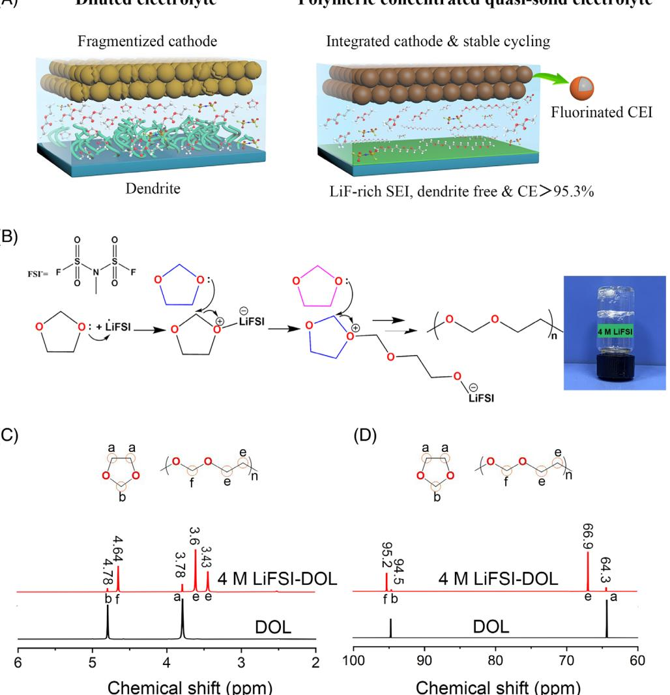
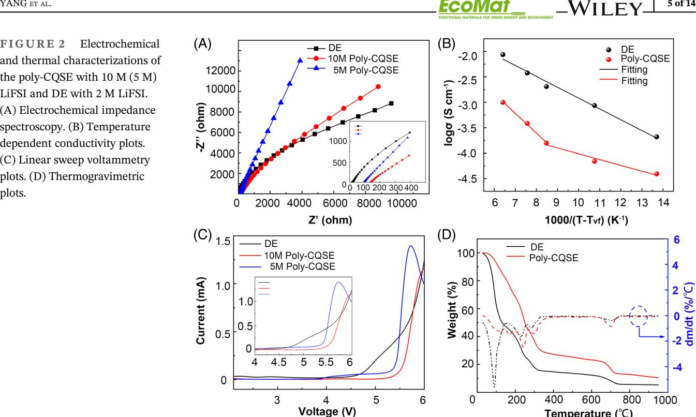
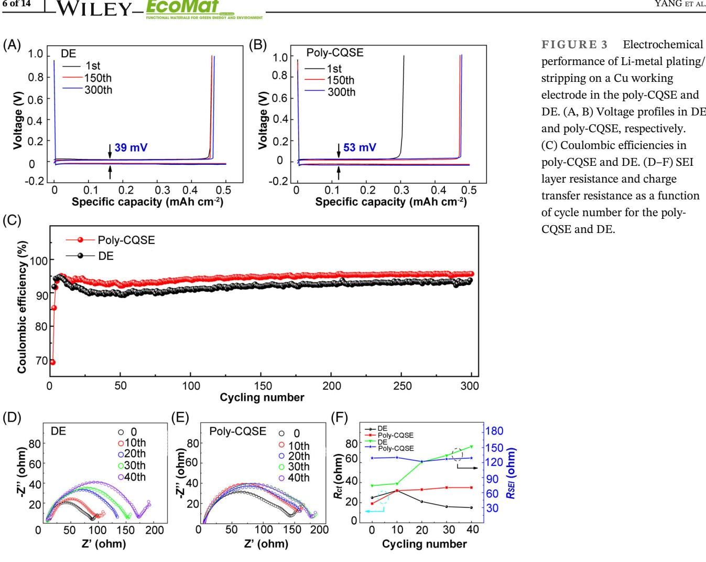
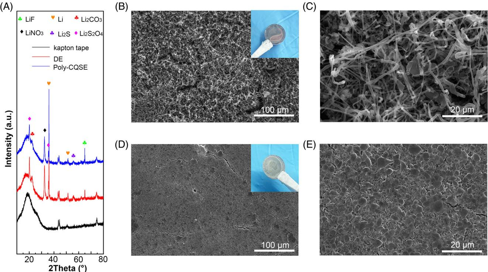
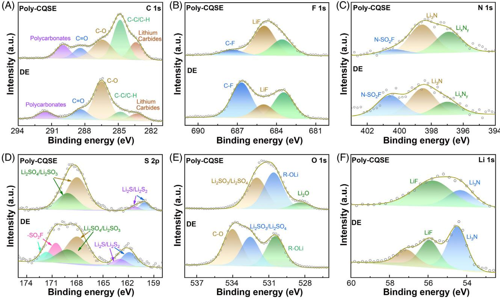
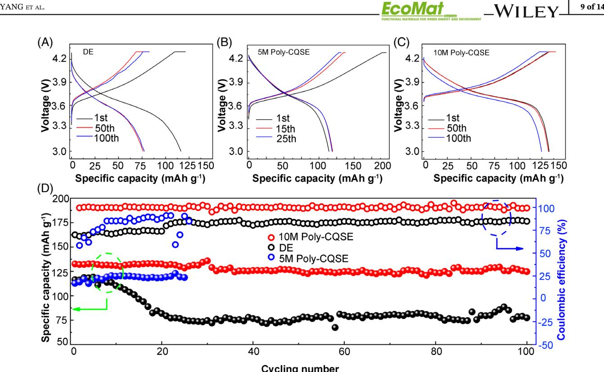
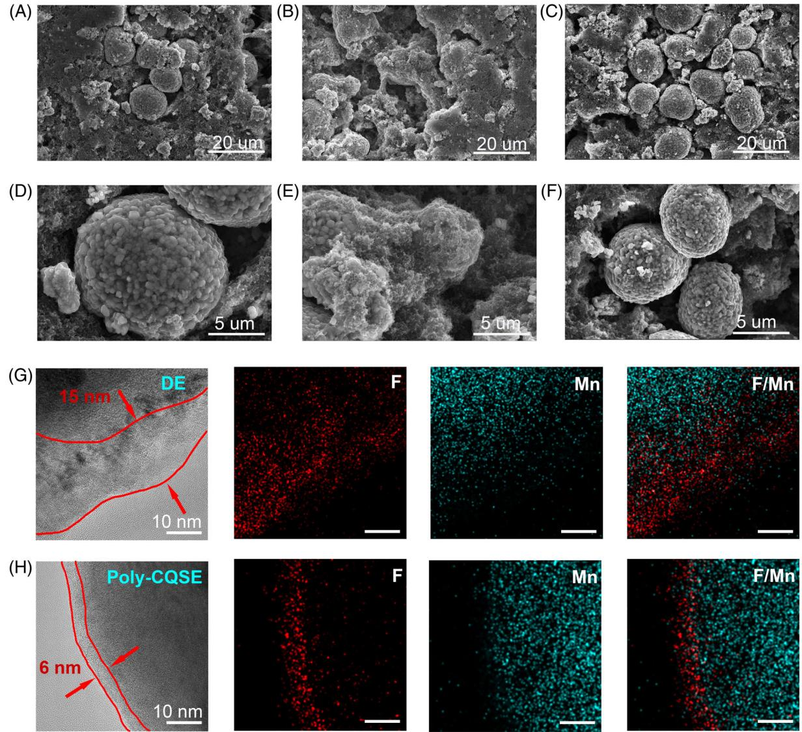

### RESEARCH ARTICLE

# Polymeric concentrated electrolyte enables simultaneous stabilization of electrode/electrolyte interphases for quasisolid-state lithium metal batteries

Guanming Yang1 | Wangshu Hou1 | Yanfang Zhai1 | Zongyuan Chen1 | Chengyong Liu2 | Chuying Ouyang2 | Xiao Liang3 | Peerasak Paoprasert4 | Ning Hu5 | Shufeng Song1

1 College of Aerospace Engineering, Chongqing University, Chongqing, China

2 Fujian Science & Technology Innovation Laboratory for Energy Devices of China (21C-LAB), Ningde, Fujian, China

3 College of Chemistry and Chemical Engineering, Hunan University, Changsha, Hunan, China

4 Department of Chemistry, Faculty of Science and Technology, Thammasat University, Pathum Thani, Thailand

5 State Key Laboratory of Reliability and Intelligence Electrical Equipment, National Engineering Research Center for Technological Innovation Method and Tool, and School of Mechanical Engineering, Hebei University of Technology, Tianjin, China

#### Correspondence

Shufeng Song, College of Aerospace Engineering, Chongqing University, Chongqing, 400044, China. Email: [sfsong@cqu.edu.cn](mailto:sfsong@cqu.edu.cn)

Ning Hu, State Key Laboratory of Reliability and Intelligence Electrical Equipment, National Engineering Research Center for Technological Innovation Method and Tool, and School of Mechanical Engineering, Hebei University of Technology, Tianjin, 300401, China.

Email: [ninghu@hebut.edu.cn](mailto:ninghu@hebut.edu.cn)

#### Present address

Guanming Yang, Chongqing Changan New Energy Vehicle Co., Ltd., Chongqing, China.

#### Funding information

Key Program for International Science and Technology Cooperation Projects of the Ministry of Science and Technology of China, Grant/Award Number: 2021YFE0109700; Fujian Science & Technology Innovation Laboratory for Energy Devices of China (21C-LAB), Grant/Award Number: 21C-OP-202110; Fundamental Research Funds for the

### Abstract

To achieve next-generation lithium metal batteries (LMBs) with desirable specific energy and reliability, the electrolyte shown simultaneously high reductive stability toward lithium metal anode and oxidative stability toward highvoltage cathode is of great importance. Here, we report for the first time that high-concentration lithium bis(fluorosulfonyl)imide (LiFSI) initiates ringopening polymerization of 1,3-dioxolane in presence of ethylene carbonate and ethylmethyl carbonate to produce in-situ a novel polymeric concentrated quasi-solid electrolyte (poly-CQSE). The unique poly-CQSE with 10 M LiFSI forms a mixed-lithiophobic-conductive LiF-Li3N solid electrolyte interphase on lithium metal anode, and a F-rich conformal cathode electrolyte interphase on LiNi0.5Co0.2Mn0.3O2 (NCM523) cathode simultaneously. As a result, the poly-CQSE not only enables stable Li plating/stripping of metallic Li anode at a sound Coulombic efficiency of 95.3% without dendrite growth, but also enables a stable cycling of the LijjNCM523 quasi-solid-state LMB at a capacity retention of 94% over 100 cycles.

#### KEYWORDS

cathode electrolyte interphase, concentrated quasi-solid electrolyte, lithium metal batteries, ring-opening polymerization, solid electrolyte interphase

This is an open access article under the terms of the [Creative Commons Attribution](http://creativecommons.org/licenses/by/4.0/) License, which permits use, distribution and reproduction in any medium, provided the original work is properly cited.

© 2023 The Authors. EcoMat published by The Hong Kong Polytechnic University and John Wiley & Sons Australia, Ltd.

Central Universities, Grant/Award Number: 2022CDJXY-012; State Key Laboratory of High Performance Ceramics and Superfine Microstructure, Grant/Award Number: SKL202106SIC; Chinese National Natural Science Fund, Grant/Award Numbers: 11632004, U1864208; National Science and Technology Major Project, Grant/Award Number: 2017-VII-0011-0106; Science and Technology Planning Project of Tianjin, Grant/Award Number: 20ZYJDJC00030; Key Program of Research and Development of Hebei Province, Grant/Award Number: 202030507040009; Natural Science Foundation of Hebei Province, Grant/Award Number: A2020202002; Natural Science Foundation of Chongqing, Grant/Award Number: cstc2021jcyj-msxmX0241; Key Project of Natural Science Foundation of Tianjin, Grant/Award Number: S20ZDF077

### 1 | INTRODUCTION

Batteries with desirable specific energy and reliability have received unprecedented opportunities and challenges in light of advancement of electric automobiles and green energy. Current Li-ion batteries with graphite anodes are nearly reaching the limit of the proud specific energy.[1](#page-10-0) Lithium metal anode, featuring large theoretical capacity (3860 mAh g-1 ), minor standard electrochemical potential (-3.04 V vs. standard hydrogen electrode), gentle weight (0.534 g cm-3 ), and abundant reserves, has resuscitated for rechargeable lithium metal batteries (LMBs). However, low Coulombic efficiency, unwanted dendrite Li growth, and unlimited volume variation during Li deposition/stripping gave rise to insufficient electrochemical properties and notorious safety issues.[2](#page-11-0) Replacing organic-liquid electrolytes with solid-state ones is expected to address the issues of lithium-ion batteries and lithium metal anodes.[3](#page-11-0)

Up to now, inorganic and organic solid-state electrolytes have been investigated extensively. The inorganic ceramic electrolytes can be further classified into two types: sulfides and oxides. The sulfide-type solid electrolytes delivered the highest room-temperature (RT) conductivities approximately 10-3 –10-2 S cm-1 highlighted by the work of Kanno et al[.4](#page-11-0) unfortunately, they suffered from high cost, atmosphere sensibility, and instability toward lithium metal. Various oxide structures, for example, NASICON,[5](#page-11-0) perovskite,[6](#page-11-0) LISICON,[7](#page-11-0) and garnet,[8](#page-11-0) have been studied as electrolytes, which showed advantages of outstanding atmosphere stability and cost-effectiveness in comparison to their sulfide counterparts, and moderately large RT conductivities (approx. 10-4 –10-3 S cm-1 ), sufficient electrochemical voltage limit (>5.0 V vs. Li/Li+), single cation transference number, and large shear modulus (60 GPa).[9](#page-11-0) However, the complex sintering process, hard and brittleness nature are the intrinsic disadvantages of the oxidetype solid electrolytes.

In comparison with the inorganic ceramics, solid polymer electrolytes offered some merits, including sufficient physical contact, softness, price inexpensive, processing simple, and availability to accommodate state-of-art industry. However, the solid polymer electrolytes suffered from much lower ionic conductivities, such as poly(ethylene oxide), a representative solid polymer electrolyte after dissolving various lithium salts, that is, Li bis(trifluoromethanesulfonimidate), Li bis(oxalato) borate, lithium perchlorate, Li trifluoromethanesulfonate, and Li bis(trifluoromethanesulfonimide), normally exhibited conductivities of 10-8 –10-6 S cm-1 at 25C.[10](#page-11-0) The inert nanoscale oxides, like SiO2, Al2O3 and TiO2 and so forth were first dispersed in the polymer matrices,[11,12](#page-11-0) following the inorganic super ion conductors, that is, perovskite-type Li0.33La0.557TiO3, nasicontype Li1.3Al0.3Ti1.7(PO4)3, garnet-type Li6.4La3Zr1.4- Ta0.6O12, sulfide-type Li3PS4 and so forth aiming at broadening the amorphous region of PEO and enhancing the conductivities, but the conductivities were still limited to the range of 10-5 and 10-4 S cm-1 at 25C.[13](#page-11-0)–16

In brief, an ideal electrolyte has to provide two peculiarities. One is the high bulk conductivity and facile interface transport. The other is the interface stability toward both the anode and cathode during battery cycling.17–[19](#page-11-0) The most studied inorganic ceramic electrolytes and solid polymer electrolytes do not satisfy either of these demands at room temperature. Nevertheless, the choice of an electrolyte leaves the LMBs up a gum tree, which is either instable against lithium metal anodes, or instable against high-voltage cathodes.

One strategy was to prepare the electrolytes via polymerization of monomers, the as-received in-situ polymeric electrolytes in an electrochemical cell promised high bulk conductivities and low interfacial resistances.[20](#page-11-0)–22 In particular, the liquid precursors have good capabilities of low viscosity, simple operability and wettability toward the electrodes. The polymerization of the liquid precursors in the battery configuration gives rise to a quasi-solid electrolyte. Such polymeric electrolytes can build good interfaces with the surfaces of electrodes as well as the inside of cathodes.[23,24](#page-11-0) Recently, the emerging poly(1,3-dioxolane) electrolytes exhibited improved thermal stability, superior bulk conductivity and interface ion transport, prepared by ring-opening polymerization of 1,3-dioxolane (DOL),[25](#page-11-0)–29 a key electrolyte solvent in lithium sulfur batteries with good chemical stability toward lithium metal anodes.[30](#page-11-0) However, the polyether electrolytes have long faced great challenge of interface stabilization, namely, the capability of simultaneously resisting the reduction by the anode and the oxidation by the cathode, which remains one of the biggest obstinate barrier of ether electrolytes.[31](#page-11-0)–35

In the last few years, a major advancement in electrolyte chemistries was enhancing the concentration of lithium salts at a critical concentration (generally above 3– 5 M) that led to elevated reactions of Li+, anions and solvents, disappearance of free solvent molecules, forming a new concept of electrolyte, concentrated electrolyte.[36,37](#page-12-0) Such concentrated electrolytes exhibited extraordinary physicochemical and electrochemical properties that are distinctly different from a traditional diluted electrolyte, that is, interesting interface variations from the conventional solvent-derived solid electrolyte interphase (SEI) and cathode electrolyte interphase (CEI) to the anionderived SEI and CEI.[38](#page-12-0)–40

Inspired by these emerging electrolyte chemistries, to address the critical issues of the interface instability at both the anode and cathode sides, here we report a polymeric concentrated quasi-solid electrolyte (poly-CQSE) created in-situ by ring-opening polymerization of highconcentration lithium bis(fluorosulfonyl)imide (LiFSI) and DOL in the presence of ethylene carbonate (EC) and ethylmethyl carbonate (EMC). As one necessary component of state-of-the-art Li-ion batteries, the EC shows large boiling point (approx. 243–244C) and melting point (approx. 34–37C), which can offset the intrinsic nature of DOL (e.g., low boiling point and melting point).

On the other hand, the EMC serves as diluent to the viscous EC. Besides, EC and EMC have high anodic potential surpassing 5 V, in contrast, DOL would be oxidized at about 4.3 V. In addition, when EC and EMC serve as cosolvent, they have been known to form a desirable CEI to support large failure potential.[17,33](#page-11-0) Finally, 50 vol.% EC-EMC cosolvent serves as a plasticizer to the poly(1,- 3-dioxolane) to enable high salt concentration, as the concentrated LiFSI stressfully polymerizes the DOL. The emerging chemistry of ring-opening polymerization reaction between concentrated LiFSI and DOL is for the first time to our best knowledge explored and applied in solidstate LMBs. Such developed poly-CQSE not only integrates the remarkable peculiarities of superior bulk conductivity and interfacial ion transport, but also demonstrates excellent synergetic interface reductive stabilization toward lithium metal anode and oxidative stabilization toward LiNi0.5Co0.2Mn0.3O2 (NCM523) cathode.

### 2 | RESULTS AND DISCUSSION

We report the ring-opening polymerization of DOL initiated via high-concentration LiFSI, different from the previous studies on aluminum triflate (Al(OTf )3),[25](#page-11-0) rare-earth triflates (e.g., Sc(OTf )3 and Y(OTf )3),[28](#page-11-0) organoaluminum species (e.g., C4H10AlCl and C2H5AlCl2),[41](#page-12-0) aluminum alkoxides,[42](#page-12-0) methyl fluorosulfonate[,43](#page-12-0) tin complexes and metal halides (e.g., AlCl3 and TiCl4) catalysts for DOL,[44](#page-12-0) the high-concentration LiFSI serves both conductive lithium salt and polymeric catalyst. By increasing the LiFSI concentration in ether-carbonate cosolvents (DOL, EC, and EMC), the new poly-CQSE can be produced, which can yield F-contained SEI and CEI layers as a result of the decomposition of FSI anion, thus strongly suppress dendric Li and electrolyte degeneration (Figure [1A](#page-3-0)). The concurrent stabilization of both Li metal anode and NCM cathode surfaces in the poly-CQSE results in high-safety and high-energy-density LMBs. The in-situ polymerization process of LiFSI-DOL and its mechanism are demonstrated in Figure [1B](#page-3-0). The lone-pair electrons on oxygen atom of DOL are first attacked by Li+, showing electropositivity. Meanwhile, the lone-pair electrons on oxygen atom of another molecule DOL are attracted to the carbon atom on the acetal of the prior DOL, leading to heterolytic cleavage of the carbon– oxygen bond on acetal of DOL, and the oxygen atom gains an electron. The above reaction processes are repeated continuously to form a transparent and immovable polymer (Figure [1B\)](#page-3-0). NMR spectroscopy was conducted to confirm the polymerization reaction of 4 M LiFSI-DOL electrolyte (Figure [1C,D](#page-3-0)). The 1 H NMR, in

FIGURE 1 Mechanism and structure of the polymeric quasi-solid electrolyte. (A) Diagrammatic drawing of the effect of polymerization and salt concentration on Li-metal anode and NCM cathode. (B) DOL polymerization mechanism initiated via LiFSI. Inset is optical photograph of quasi-solid electrolyte with 4 M LiFSI in DOL. (C) Hydrogen and (D) carbon NMR spectra of liquid DOL and the poly (1,3-dioxolane) formed at 4 M LiFSI.

addition to the signals O CH2 O at 3.78 ppm and O CH2CH2 O at 4.78 ppm of liquid DOL monomer, shows new peaks for poly(1,3-dioxolane) at 3.6 and 4.64 ppm upon addition of 4 M LiFSI in DOL, demonstrating extremely high polymerization degree of 94.1%. Initiating the ring-opening polymerization reaction of DOL via 4 M LiFSI is further demonstrated by the FTIR spectra (Figure S1).

The 4 M LiFSI-DOL electrolyte without EC and EMC exhibits an ionic conductivity of 3.43 10-5 S cm-1 at 25C (Figure S2). Its high polymerization degree of 94.1%, determined by NMR spectra (Figure 1C,D), indicates only 6% liquid DOL monomer is remained. We further purify the 4 M LiFSI-DOL electrolyte by volatilizing the liquid DOL under heat treatment at 60C for 24 h in vacuum. The purified 4 M LiFSI-DOL electrolyte still provides an ionic conductivity of 3.3 10-5 S cm-1 , approaching the initial conductivity of the unpurified electrolyte, indicating the superior conduction property of the poly(1,3-dioxolane) electrolyte. The poly-CQSE with 10 M LiFSI in DOL-EC-EMC exhibits semitransparent and non-flowing state, in comparison, the DE with 2 M LiFSI in DOL-EC-EMC is flowing (Figure S3). The electrochemical impedance spectroscopy was conducted on the poly-CQSE and DE, which showed only inclined lines 25C (Figure [2A](#page-4-0)). This phenomenon is a weak capacitance resulting from short dielectric relaxation, implying fast ion conduction in the electrolyte systems. The 10 M poly-CQSE deliveries an acceptable ionic conductivity of 2.5 10-4 S cm-1 , owing to the drastic FIGURE 2 Electrochemical and thermal characterizations of the poly-CQSE with 10 M (5 M) LiFSI and DE with 2 M LiFSI. (A) Electrochemical impedance spectroscopy. (B) Temperature dependent conductivity plots. (C) Linear sweep voltammetry plots. (D) Thermogravimetric plots.

polymerization of DOL and high concentration of lithium salt, although the 5 M poly-CQSE deliveries a higher ionic conductivity of 3.55 10-4 S cm-1 , and the DE shows an extremely high ionic conductivity of 2.1 10-3 S cm-1 . This conductivity value is actually much higher than those of solid polymer electrolytes and adequate in view of the fact that the in-situ polymerization will lead to low electrode/electrolyte interfacial resistances. Noting that the electrochemical impedance spectroscopy herein is conducted in a coin cell with glass fiber separator that means the practical ionic conductivity of the poly-CQSE is larger than the measured value. The molecular weights of the poly-CQSE and DE were determined by gel permeation chromatography. The results shown in Table S1 show that the molecular weight Mw (Mw is the weight-average molecular weight) of the electrolyte increases approximately with the concentration of LiFSI, in agreement with the nature of cationic polymerization.[26](#page-11-0) The molecular weight Mw and ionic conductivity vary in inverse relationship, indicating that the ionic conductivity of polymeric electrolyte will decrease with the growth of polymer chains.

The temperature dependence of the conductivity in Figure 2B conforms to Vogel–Tamman–Fulcher (VTF) equation in a temperature range of -20 and 63C. The activation energy for the poly-CQSE is 0.95 kJ mol-1 below the deflection point (-20 to 25C), 1.74 kJ mol-1 above the deflection point (25–63C). The poly-CQSE shows a superior ionic conductivity of 2.0 10-3 S cm-1 at 63C and an impressive ionic conductivity of 5.8 10-5 S cm-1 at -20C. Differential scanning calorimetry was used to investigate thermal transitions in the poly-CQSE from heat flow measurements. The result shown in Figure S4 exhibits that, only glass transition peak and melting peak are observed but the recrystallization peak is disappeared, thus the poly-CQSE is mainly amorphous.

The ether electrolytes (e.g., DOL) suffered from poor oxidative stabilization at potentials above 4 V versus Li/Li+, hence they were commonly applied in Li S and LiFePO4 batteries, which remains a stubborn obstacle to enabling intercalating cathodes, although the DOL polymerization reaction promotes the electrochemical stability window of poly(1,3-dioxolane) around 4.2–4.5 V versus Li/Li+. 26–[28,31,32](#page-11-0) Linear sweep voltammetry measurements were applied to determine the effect of polymerizing liquid DOL and enhancing salt concentration on the oxidative stabilization of the electrolytes. The 4 M LiFSI-DOL electrolyte without EC and EMC exhibits an oxidative decomposition voltage of 4.2 V (Figure S5). The results reported in Figure 2C clearly demonstrate that synergetic polymerization and superconcentration dramatically rise the oxidative stabilization of the 5 M poly-CQSE electrolyte over 5.0 V and the 10 M poly-CQSE electrolyte over 5.5 V versus Li/Li+. The same measurement shows that for the DE, oxidation already happens at about 4.5 V versus Li/Li+. Therefore, the synergistic polymerization and high salt concentration

FIGURE 3 Electrochemical performance of Li-metal plating/ stripping on a Cu working electrode in the poly-CQSE and DE. (A, B) Voltage profiles in DE and poly-CQSE, respectively. (C) Coulombic efficiencies in poly-CQSE and DE. (D–F) SEI layer resistance and charge transfer resistance as a function of cycle number for the poly-CQSE and DE.

observably enhance the anodic stabilization. It was reported that the solvent molecule coordinating with Li+ exhibits higher oxidation stability than the free molecule owing to the downward shift of its highest occupied molecular orbital level.[45](#page-12-0) Therefore, the superconcentration can rise the oxidative stabilization of the electrolyte.

Thermogravimetric (TG) analysis was applied to survey the thermal stability. The results shown in Figure [2D](#page-4-0) imply that the thermal stability of poly-CQSE is significantly improved in comparison to the DE, because of the strong interaction of solvents and Li+ cations in the concentrated system. The battery safety has been a persistent concern particularly the large-scale application of batteries. Despite a number of aspects influence the cell safety, the highly combustible and volatile electrolyte may generate fire even explosion. As seen in the videos of ignition (Supporting Information), the glass fiber separator is highly flammable, and in the DE, the separator is rapidly blackened due to the inflammability of DE. However, in the poly-CQSE, the separator is blackened weakly, indicating the poly-CQSE is low-flammable, although flammable EC and EMC were kept in the poly-CQSE. Moreover, poly-CQSE is also low-volatile in comparison with the DE (Figure S6). Although the battery safety keeps an unsettled issue, the concentrated electrolyte can address to the safety issue by selecting flame-retardant solvent, improving the interactions between the cations and solvent molecules, decreasing the intrinsic volatility of solvent.[46](#page-12-0) The formation of Li dendrites cause safety accidents in LMBs, and the highest bearable current density of solid-state LMB is defined as critical current density (CCD) that is a significant sign to show the effectiveness of dendritic Li repression by the electrolyte.[47](#page-12-0) As shown in Figure S7, the CCD of Li/DE/Li cell was only 0.1 mA cm-2 , and the CCD of Li/5 M poly-CQSE/Li cell was 0.3 mA cm-2 , while the CCD of Li/10 M poly-CQSE/Li cell was considerably enhanced to 0.7 mA cm-2 . Therefore, the low flammability, low volatileness, and significant improvement of CCD of the poly-CQSE demonstrate the safety enhancement by the concentrated design.

The carbonate electrolytes, for example, EC and EMC, currently used in Li-ion batteries, can produce protective SEI on graphite anodes, but generate uncontrollable SEI growth on Li meal anodes, leading to dendritic electrodeposition and low CE.[48](#page-12-0) One hypothesis of our study is that the synergetic polymerization and superconcentration give opportunity to break limit of reductive stability of traditional electrolytes toward Li metal anodes, contributing to dendrite-free Li meal plating/stripping cycling and higher Coulombic efficiency (CE). Figure [3A,B](#page-5-0) display the voltage curves of the LijjCu cells using the poly-CQSE and DE at 0.5 mA cm-2 . The poly-CQSE shows slightly larger Li plating/stripping voltage hysteresis in comparison to the DE (53 vs. 39 mV), because of the lower ionic conductivity and slightly larger interface resistance of the poly-CQSE as compared to the DE. The poly-CQSE shows low CE (69.3%) in first cycle owing mainly to the SEI formation process[.49](#page-12-0) Yet it is worth noting that the poly-CQSE exhibits an impressive average CE of 95.3% and is highly stable for 300 cycles (Figure [3C\)](#page-5-0). On the contrary, despite lower overpotential was observed for the DE, the CE in this electrolyte is moderately 91.3%. The remarkable cycling stability and high Li plating/stripping CE in the poly-CQSE indicates the electrolyte forms a significant protection for the highly reactive lithium metal anode.

To further study the stability of SEI, electrochemical impedance spectroscopy of the poly-CQSE and DE in LijjCu cells was conducted as shown in Figure [3D,E.](#page-5-0) The impedance data was fitted according to the equivalent circuit (Figure S8). The Ohmic part (Rs) is assigned to the bulk resistance of electrolyte; the depressed semicircle is distinguished to two semicircles, where the highfrequency and low-frequency semicircles are assigned to SEI layer resistance (RSEI) and charge transfer resistance (Rct), respectively[50;](#page-12-0) the CPE and W are the constant phase and Warburg elements. All the resistances were listed in Table S2. The Rct of LijjCu cell with DE rises from the initial 25 to 32 Ω after 10 cycles, but reduces to 21 Ω after 20 cycles, 16 Ω after 30 cycles, and 15 Ω after 40 cycles. The continuous decline in Rct of DE after 10–40 cycles could be ascribed to the larger surface area of Li dendrites that permit more intimate electrolyte contact, and dissolution of the passivation layer.[51](#page-12-0) Nevertheless, the superfluous electrolyte consumption will finally run dry electrolyte and cause cell failure. On the contrary, The Rct of LijjCu cell with poly-CQSE rises from the initial 19 to 32 Ω after 10 cycles and stabilizes at 35 Ω after 30 cycles. The initial increase in Rct of poly-CQSE could be ascribed to the generation of passivation film and the stable Rct with Li plating/stripping demonstrates the desirable stabilization of the passivation film. More importantly, a successive increase in the RSEI from fresh 74 to 152 Ω after 40 cycles was observed for the DE, indicating repeating collapse/formation of the SEI during Li plating/stripping (Figure [3F](#page-5-0)). In sharp contrast, poly-CQSE shows almost fixed RSEI of 130 Ω. As a result, it is evident that the poly-CQSE is efficient at enabling a stable and less resistive SEI film on metallic Li surface during Li plating/stripping, which contributes to the high Li plating/stripping CE.

According to energy-dispersive spectroscopy (EDS) analysis, the major elements on the cycled Li anode in poly-CQSE and DE electrolytes are fluorine, sulfur, and oxygen (Figure S9). XRD was used to characterize the possible phases on the cycled Li anode (Figure [4A](#page-7-0)). In addition to Li metal, LiF, Li3N, Li2S2O4, Li2SO4, and Li2O are detected in both electrolytes, which are the typical components of SEI film.[25,52](#page-11-0) It seems that the poly-CQSE generates more LiF on the metallic Li surface, as indicated by the higher diffraction intensity of LiF, which has now been well acknowledged in the literature as beneficial for stable Li deposition.[52](#page-12-0) The LiF-rich SEI film will firmly protect the Li metal during cycling.

The morphology of Li deposition on Cu foil after the 101st Li plating in LijjCu cells was evaluated by scanning electron microscopy (SEM). The insets in Figure [4B,D](#page-7-0) are the corresponding digital photos of the electrodes, the surface of Li in DE clearly exhibits some signs of Li depletion, the surface of Li in poly-CQSE, in contrast, exhibits no signs of damage. The Li metal in DE shows abundant dendritic Li metal deposition with random orientations (Figure [4B,C\)](#page-7-0). In sharp comparison, a nodule-like deposited Li without dendrite is observed in poly-CQSE (Figure [4D,E](#page-7-0)). The needle-like Li metal with diameter of a few micrometers and length of hundreds of micrometers can easily stab the electrolyte/separator. However, the nodule-like Li metal with size of 5–10 μm and flat circular edges shows minor threat to the electrolyte/separator. Equally importantly, the surface area of Li metal in poly-CQSE is much lower than in DE, resulting in weaker side reactions between the deposited Li and electrolyte thus higher CE. This is consistent with the aforementioned CE and electrochemical impedance data.

To examine the interface chemistry, x-ray photoelectron spectroscopy (XPS) analysis is applied on the cycled Li metal anodes from both the poly-CQSE and the DE base LijjCu cells (Figure [5](#page-7-0)), where the survey spectra is shown in Figure S10. In the C 1s spectra, both electrolytes show the carbonaceous species, such as lithium carbides (283.2 eV), C C/C H (284.8 eV), C O (286.4 eV), C O (288.4 eV), polycarbonates (290 eV).[53](#page-12-0) However, the SEI layers for both electrolytes show different carbonaceous components. Integration of the areas under the peaks resulted in a decline in polyether carbons, assigning to the decomposition of DOL, from 53.5% for DE to 25.1% for poly-CQSE, and an increase in hydro carbons, assigning to the decomposition of EC and EMC, from 12.3% for DE to 36.45% for poly-CQSE. Therefore, the

FIGURE 4 (A) XRD patterns of cycled Li metal after the 100th stripping. SEM images of the morphologies of cycled Li metal after the 101st plating on Cu substrates in (B, C) DE and (D, E) poly-CQSE. Insets are the optical photographs of cycled Li metal after the 101st plating on Cu substrates.

FIGURE 5 XPS spectra of cycled Li metal anodes from the poly-CQSE (upper curves) and the DE (lower curves) base LijjCu cells. (A) C 1s spectra. (B) F 1s spectra. (C) N 1s spectra. (D) S 2p spectra. (E) O 1s spectra. (F) Li 1s spectra.

FIGURE 6 Electrochemical performance of LijjNCM523 quasi-solid-state cells using poly-CQSE and DE. (A–C) Capacity-voltage profiles in DE, 5 M and 10 M poly-CQSE, respectively. (D) Cycling performance and Coulombic efficiencies in DE and poly-CQSE.

ring-opening polymerization of DOL in poly-CQSE improved the stabilization of ether component. In the F 1s spectra, peaks at 685 and 687.4 eV are corresponded to LiF and C F, respectively[.54](#page-12-0) Accordingly, the poly-CQSE presents a high relative fraction of LiF against organofluorine species (57.8% vs. 10.4%), while the DE presents a much lower fraction (18.2% vs. 46.7%). LiF has been well known as a crucial SEI component for its high interface energy against metallic Li, which can efficiently forbid Li dendrite growth.[55,56](#page-12-0) The N 1s spectra further show the difference of LiFSI reactions with Li metal in these two electrolytes. The N 1s peaks at 397, 398.6, and 400.4 eV can be assigned to LixNy, Li3N, and N SO2F, respectively.[57,58](#page-12-0) Although the N SO2F species are abundant in the DE, the reactions between LiFSI and Li metal are much more thorough in the poly-CQSE, as implied by the higher ratio of Li-N species (91.1%) observed in the SEI layer of poly-CQSE. The Li-N species, primarily Li3N, whose ionic conductivity is one of the largest among the different SEI components (10-4 to 10-3 S cm-1 ), are in favor of a decline in the resistance of the SEI layer.[59,60](#page-12-0) The SO2F species, 171.6 and 170.5 eV in the S 2p spectrum,[61](#page-12-0) were observed in the DE and absent from the poly-CQSE, consistent with those of the N 1s spectra. Besides, the S 2p peaks at 169.2 and 168.1 eV, and O 1s peak at 532 eV indicate the presence of Li2SO4 and Li2SO3, S 2p peaks at 161.3 and 160.1 eV indicate the presence of Li2S and Li2S2 species in the poly-CQSE.[62](#page-12-0) The sulfate compounds were dominant in the poly-CQSE, as indicated by a high fraction (88.3%). These sulfate compounds have been reported to limit the SEI thickening and enhance cycling life.[63,64](#page-12-0) The O 1s peak at 528.4 eV for the poly-CQSE can be assigned to Li2O, while the O 1s peak at 534 eV for the DE can be assigned to C O.[65](#page-13-0) The Li 1s peaks at 55.7 and 54.3 eV for the poly-CQSE can be assigned to LiF and Li3N, respectively,[54,66,67](#page-12-0) consistent with the N 1s spectrum. Therefore, the LiF-Li3N SEI film with good lithiophobicity and superior conductivity in the poly-CQSE enables Li metal anode to relieve dendrites and achieve high CE of 95.3%.

One big challenge of the ether electrolytes is their poor oxidative stability that rules out their application in high-voltage cathodes. The poly-CQSE is thereby studied in LijjNCM523 quasi-solid-state battery. The quasi-solidstate LMB was charged to a high cut-off voltage of 4.3 V at 0.1C and constant-voltage to 0.05C, which bring the electrolyte to a harsh oxidative situation. The results shown in Figure 6A–C reveal that the cell using 10 M poly-CQSE exhibits enhancement in specific capacity of 132.7 mAh g-1 , compared with the 114.1 mAh g-1 in 5 M poly-CQSE cell and 116.5 mAh g-1 in DE base cell. In

FIGURE 7 Characterizations of cycled NCM cathode. SEM images of the surface secondary particles of (A, D) the as-prepared NCM cathode, (B, E) NCM cathode after 100 cycles in DE, (C, F) NCM cathode after 100 cycles in poly-CQSE. (G, H) High-resolution TEM images and the corresponding EDS mapping of the NCM cathodes after 100 cycles in DE and poly-CQSE, respectively.

addition to the large capacity, the voltage decay is also markedly mitigated in 10 M (5 M) poly-CQSE base cell, indicating the inhibition of undesirable transformation of NCM cathode. Nearly identical specific capacities can be obtained from the initial a few cycles of LijjNCM523 quasi-solid-state batteries in both 5 M poly-CQSE and DE (Figure [6D\)](#page-8-0). However, sudden capacity decay was observed for the cell using DE, while the cycling was maintained for the cell using 5 M poly-CQSE. Moreover, the cell using 10 M poly-CQSE exhibits excellent capacity retention of 94% after 100 cycles at 0.1C, compared with the rapid capacity fading when utilizing DE, only 66% of its initial capacity remained (Figure [6D\)](#page-8-0). Besides, a high CE of 99% is maintained for the 10 M poly-CQSE by contrast with the 81.1% for 5 M poly-CQSE and 84.2% for DE. These improvements demonstrate the advantages of high concentration of LiFSI and can be attributed to the formation of a robust CEI layer between the poly-CQSE and NCM cathode, in addition to the dendrite-free Li deposition, high Coulombic efficiency and stable SEI layer. Though the poly-CQSE has good interfacial charge transport and high ionic conductivity, it seems that the LijjNCM batteries using the electrolyte still show limited cycle life compared with the state-of-the-art liquid carbonate electrolytes. This is because ether electrolyte suffers from poor oxidation stability, although the polymerization of DOL and salt concentration significantly improve the oxidation stability of the electrolyte.

To gain more insights into the reinforced stabilization of CEI layer, the morphology of the NCM was examined. As shown in Figure [7A](#page-9-0)–F, the spherical secondary particles of NCM are still well preserved after 100 cycles in poly-CQSE base cell as observed by the SEM, by contrast, the cell using DE reveals broken and fragmentized particles of cycled NCM. The intact morphology of cathode indicates desirable structural stability of NCM in poly-CQSE, which benefits from the formation of stable CEI layer. We further conducted TEM study on the discharged NCM cathodes after 100 cycles. It is noticed that a clear formation of CEI layer on the surface of NCM particles with an approximate thickness 6 nm is induced in poly-CQSE (Figure [7H](#page-9-0)), such thin and conformal CEI layer demonstrates the excellent oxidative stabilization of poly-CQSE against NCM cathode. In comparison, the NCM cell using DE shows much thicker CEI layer, 15 nm (Figure [7G\)](#page-9-0), as a result of consecutive oxidative decomposition of electrolyte. More importantly, the corresponding EDS mapping visibly shows a fluorinecontained CEI layer, deriving from the decomposition of FSI anion. According to EDS, the fluorine species diffuse into the NCM cathode in DE (Figure [7G](#page-9-0)). In sharp contrast, the fluorine species gather the outer surface of the NCM cathode in poly-CQSE (Figure [7H](#page-9-0)), forming a compact F-rich coating. The dense F-rich CEI layer can effectively suppress the parasitic reactions between NCM cathode and electrolyte at high charging voltage. Therefore, the poly-CQSE enables the LijjNCM523 quasi-solid-state LMB to achieve excellent cycling performance.

### 3 | CONCLUSION

In summary, we report that high-concentration LiFSI can initiate the ring-opening polymerization of DOL with a polymerization degree as high as 94.1% upon addition of 4 M LiFSI in the DOL. In light of this finding, we have demonstrated a unique polymeric concentrated quasi-solid electrolyte produced in-situ with a high salt concentration of 10 M LiFSI in ether-carbonate cosolvent of DOL, EC, and EMC. As a result, the polymeric concentrated quasisolid electrolyte reveals a superior ionic conductivity of 2.5 10-4 S cm-1 at 25C, low interfaces resistances toward electrodes (e.g., 148 Ω in LijjCu cell), sufficient electrochemical stability window (5.5 V vs. Li/Li+), and elevated thermal stability (>100C). Significantly, we have demonstrated the polymeric concentrated quasi-solid electrolyte compatible with both the Li metal anode and the layered oxide cathode by forming a mixed-lithiophobicconductive LiF-Li3N SEI layer on lithium metal anode, and a F-rich conformal CEI layer on NCM523 cathode simultaneously. Accordingly, we confirm that a desirable nodulelike deposited Li metal with size of 5–10 μm, stable and low SEI layer resistance of approximately 130 Ω and charge transfer resistance of approximately 35 Ω are obtained for Li plating/stripping in the polymeric concentrated quasisolid electrolyte, leading to a high Coulombic efficiency of 95.3%. Moreover, the polymeric concentrated quasi-solid electrolyte demonstrates an excellent cycling performance of 94% capacity retention after 100 cycles in the LijjNCM523 quasi-solid-state LMB. Our work offers a probability of engineering the electrolytes for the higher-safety and higher-energy-density solid-state LMBs

### AUTHOR CONTRIBUTIONS

G.Y. led the experimental work with support from W.H., Y.Z. and Z.C. and wrote the original draft. C.L. and C.O. performed the project administration. X.L. and P.P. performed the formal analysis. N.H. contributed to the project administration and revised the paper. S.S. conceived the ideas as supervisor and wrote and revised the paper.

### ACKNOWLEDGMENTS

This work is supported by Fujian Science & Technology Innovation Laboratory for Energy Devices of China (21C-LAB) (21C-OP-202110), the Key Program for International Science and Technology Cooperation Projects of the Ministry of Science and Technology of China (2021YFE0109700), Fundamental Research Funds for the Central Universities (2022CDJXY-012), Opening Project of State Key Laboratory of High Performance Ceramics and Superfine Microstructure (SKL202106SIC), Chinese National Natural Science Fund (11632004, U1864208), National Science and Technology Major Project (2017-VII-0011-0106), Science and Technology Planning Project of Tianjin (20ZYJDJC00030), Key Program of Research and Development of Hebei Province (202030507040009), Fund for Innovative Research Groups of Natural Science Foundation of Hebei Province (A2020202002), Natural Science Foundation of Chongqing (cstc2021jcyj-msxmX0241), and Key Project of Natural Science Foundation of Tianjin (S20ZDF077).

### CONFLICT OF INTEREST STATEMENT

The authors declare no conflict of interest.

### ORCID

Shufeng Song <https://orcid.org/0000-0001-9049-8305>

### REFERENCES

1. Krauskopf T, Richter FH, Zeier WG, Janek J. Physicochemical concepts of the lithium metal anode in solid-state batteries. Chem Rev. 2020;120(15):7745-7794. doi[:10.1021/acs.chemrev.](info:doi/10.1021/acs.chemrev.0c00431) [0c00431](info:doi/10.1021/acs.chemrev.0c00431)

- 2. Stalin S, Johnson HEN, Biswal P, et al. Achieving uniform lithium electrodeposition in cross-linked poly(ethylene oxide) networks: "soft" polymers prevent metal dendrite proliferation. Macromolecules. 2020;53(13):5445-5454. doi:[10.1021/acs.](info:doi/10.1021/acs.macromol.0c00475) [macromol.0c00475](info:doi/10.1021/acs.macromol.0c00475)
- 3. Zhang X, Temeche E, Laine RM. Design, synthesis, and characterization of polymer precursors to LixPON and LixSiPON glasses: materials that enable all-solid-state batteries (ASBs). Macromolecules. 2020;53(7):2702-2712. doi[:10.1021/acs.macromol.0c00254](info:doi/10.1021/acs.macromol.0c00254)
- 4. Kamaya N, Homma K, Yamakawa Y, et al. A lithium superionic conductor. Nat Mater. 2011;10(9):682-686. doi[:10.1038/nmat3066](info:doi/10.1038/nmat3066)
- 5. Goodenough JB, Hong HY-P, Kafalas JA. Fast Na+-ion transport in skeleton structures. Mater Res Bull. 1976;11(2):203-220. doi[:10.1016/0025-5408\(76\)90077-5](info:doi/10.1016/0025-5408(76)90077-5)
- 6. Inaguma Y, Liquan C, Itoh M, et al. High ionic conductivity in lithium lanthanum titanate. Solid State Commun. 1993;86(10): 689-693. doi:[10.1016/0038-1098\(93\)90841-A](info:doi/10.1016/0038-1098(93)90841-A)
- 7. Kasper HM. Series of rare earth garnets Ln3+3M2Li+3O12 (M=Te, W). Lnorg Chem. 1969;8(4):1000-1002. doi[:10.1021/](info:doi/10.1021/ic50074a058) [ic50074a058](info:doi/10.1021/ic50074a058)
- 8. Murugan R, Thangadurai V, Weppner W. Fast lithium ion conduction in garnet-type Li7La3Zr2O12. Angew Chem Int Ed. 2007;46(41):7778-7781. doi:[10.1002/anie.200701144](info:doi/10.1002/anie.200701144)
- 9. Zheng F, Kotobuki M, Song S, Laia MO, Lu L, Power J. Review on solid electrolytes for all-solid-state lithium-ion batteries. J Sources. 2018;389:198-213. doi[:10.1016/j.jpowsour.](info:doi/10.1016/j.jpowsour.2018.04.022) [2018.04.022](info:doi/10.1016/j.jpowsour.2018.04.022)
- 10. Fergus JW, Power J. Ceramic and polymeric solid electrolytes for lithium-ion batteries. Sources. 2010;195(15):4554-4569. doi: [10.1016/j.jpowsour.2010.01.076](info:doi/10.1016/j.jpowsour.2010.01.076)
- 11. Croce F, Appetecchi G, Persi L, Scrosati B. Nanocomposite polymer electrolytes for lithium batteries. Nature. 1998; 394(6692):456-458. doi:[10.1038/28818](info:doi/10.1038/28818)
- 12. Cheng S, Smith DM, Li CY. Anisotropic ion transport in a poly(ethylene oxide)–LiClO4 solid state electrolyte templated by graphene oxide. Macromolecules. 2015;48(13):4503-4510. doi:[10.1021/acs.macromol.5b00972](info:doi/10.1021/acs.macromol.5b00972)
- 13. Wang X, Zhang Y, Zhang X, et al. Lithium-salt-rich PEO/- Li0.3La0.557TiO3 interpenetrating composite electrolyte with three-dimensional ceramic nano-backbone for all-solid-state lithium-ion batteries. ACS Appl Mater Interfaces. 2018;10(29): 24791-24798. doi[:10.1021/acsami.8b06658](info:doi/10.1021/acsami.8b06658)
- 14. Bonizzoni S, Ferrara C, Berbenni V, Anselmi-Tamburini U, Mustarelli P, Tealdi C. NASICON-type polymer-in-ceramic composite electrolytes for lithium batteries. Phys Chem Chem Phys. 2019;21(11):6142-6149. doi:[10.1039/C9CP](info:doi/10.1039/C9CP00405J) [00405J](info:doi/10.1039/C9CP00405J)
- 15. Chen S, Wang J, Zhang Z, et al. In-situ preparation of poly(ethylene oxide)/Li3PS4 hybrid polymer electrolyte with good nanofiller distribution for rechargeable solid-state lithium batteries. J Sources. 2018;387:72-80. doi:[10.1016/j.jpowsour.](info:doi/10.1016/j.jpowsour.2018.03.016) [2018.03.016](info:doi/10.1016/j.jpowsour.2018.03.016)
- 16. Chen L, Li Y, Li S, Fan L, Nan C, Goodenough JB. PEO/garnet composite electrolytes for solid-state lithium batteries: From "ceramic-in-polymer" to "polymer-in-ceramic". Nano Energy. 2018;46:176-184. doi[:10.1016/j.nanoen.2017.12.037](info:doi/10.1016/j.nanoen.2017.12.037)
- 17. Xu K. Nonaqueous liquid electrolytes for lithium-based rechargeable batteries. Chem Rev. 2004;104(10):4303-4418. doi: [10.1021/cr030203g](info:doi/10.1021/cr030203g)
- 18. Borodin O. Challenges with prediction of battery electrolyte electrochemical stability window and guiding the electrode electrolyte stabilization. Curr Opin Electrochem. 2019;13:86-93. doi[:10.1016/j.coelec.2018.10.015](info:doi/10.1016/j.coelec.2018.10.015)
- 19. Dong X, Lin Y, Li P, et al. High-energy rechargeable metallic lithium battery at -70 degrees C enabled by a cosolvent electrolyte. Angew Chem Int Ed. 2019;58(17):5623-5627. doi[:10.1002/](https://doi.org/10.1002/anie.201900266) [anie.201900266](https://doi.org/10.1002/anie.201900266)
- 20. Yu L, Zhang Y, Wang J, et al. Lithium salt-induced in situ living radical polymerizations enable polymer electrolytes for lithium-ion batteries. Macromolecules. 2021;54(2):874-887. doi: [10.1021/acs.macromol.0c02032](info:doi/10.1021/acs.macromol.0c02032)
- 21. Wang Q, Dong T, Zhou Q, et al. An in-situ generated composite solid-state electrolyte towards high-voltage lithium metal batteries. Sci China Chem. 2022;65(5):934-942. doi[:10.1007/](info:doi/10.1007/s11426-022-1221-4) [s11426-022-1221-4](info:doi/10.1007/s11426-022-1221-4)
- 22. He KQ, Cheng SHS, Hu J, et al. In-situ intermolecular interaction in composite polymer electrolyte for ultralong life quasisolid-state lithium metal batteries. Angew Chem Int Ed. 2021; 60(21):12116-12123. doi[:10.1002/anie.202103403](info:doi/10.1002/anie.202103403)
- 23. Banerjee A, Wang XF, Fang CC, Wu EA, Meng WS. Interfaces and interphases in all-solid-state batteries with inorganic solid electrolytes. Chem Rev. 2020;120(14):6878-6933. doi[:10.1021/](info:doi/10.1021/acs.chemrev.0c00101) [acs.chemrev.0c00101](info:doi/10.1021/acs.chemrev.0c00101)
- 24. Huang C, Leung CLA, Leung P, Grant PS. A solid-state battery cathode with a polymer composite electrolyte and low tortuosity microstructure by directional freezing and polymerization. Adv Energy Mater. 2020;11(1):e2002387.
- 25. Zhao Q, Liu XT, Stalin S, Khan K, Archer LA. Solid-state polymer electrolytes with in-built fast interfacial transport for secondary lithium batteries. Nat Energy. 2019;4(5):365-373. doi[:10.](info:doi/10.1038/s41560-019-0349-7) [1038/s41560-019-0349-7](info:doi/10.1038/s41560-019-0349-7)
- 26. Liu FQ, Wang WP, Yin YX, et al. Upgrading traditional liquid electrolyte via in situ gelation for future lithium metal batteries. Sci Adv. 2018;4(10):eaat5358. doi:[10.1126/sciadv.](https://doi.org/10.1126/sciadv.aat5383) [aat5383](https://doi.org/10.1126/sciadv.aat5383)
- 27. Li W, Gao J, Tian HY, et al. SnF2-catalyzed formation of polymerized dioxolane as solid electrolyte and its thermal decomposition behavior. Angew Chem Int Ed. 2022;61(6): e202114805.
- 28. Yang G, Zhai Y, Yao J, et al. Synthesis and properties of poly (1,3-dioxolane) in situ quasi-solid-state electrolytes via a rareearth triflate catalyst. Chem Commun. 2021;57(64):7934-7937. doi[:10.1039/D1CC02916A](info:doi/10.1039/D1CC02916A)
- 29. Yang H, Jiang MX, Li HP, et al. 'Environment-friendly' polymer solid electrolyte membrane via a rapid surface-initiating polymeration strategy. Chem Eng J. 2021;421(1):129710. doi[:10.](info:doi/10.1016/j.cej.2021.129710) [1016/j.cej.2021.129710](info:doi/10.1016/j.cej.2021.129710)
- 30. Liang X, Hart C, Pang Q, Garsuch A, Weiss T, Nazar LF. A highly efficient polysulfide mediator for lithium–sulfur batteries. Nat Commun. 2015;6(1):5682. doi:[10.1038/ncomms6682](info:doi/10.1038/ncomms6682)
- 31. Khan K, Tu ZY, Zhao Q, Zhao CZ, Archer LA. Synthesis and properties of poly-ether/ethylene carbonate electrolytes with high oxidative stability. Chem Mater. 2019; 31(20):8466-8472.

YANG ET AL. 13 of 14

- 32. Zhao C, Zhao Q, Liu X, et al. Rechargeable lithium metal batteries with an in-built solid-state polymer electrolyte and a high voltage/loading Ni-rich layered cathode. Adv Mater. 2020; 32(12):1905629. doi:[10.1002/adma.201905629](info:doi/10.1002/adma.201905629)
- 33. Li M, Wang CS, Chen ZW, Xu K, Lu J. New concepts in electrolytes. Chem Rev. 2020;120(14):6783-6819. doi[:10.1021/acs.](info:doi/10.1021/acs.chemrev.9b00531) [chemrev.9b00531](info:doi/10.1021/acs.chemrev.9b00531)
- 34. Wen Z, Zhao Z, Li L, et al. Study on the interfacial mechanism of bisalt polyether electrolyte for lithium metal batteries. Adv Funct Mater. 2022;32(12):2109184. doi:[10.1002/](info:doi/10.1002/adfm.202109184) [adfm.202109184](info:doi/10.1002/adfm.202109184)
- 35. Chen H, Chen S, Xie Y, et al. Electrolyte design strategies and research progress for room-temperature sodium-ion batteries. Energy Environ Sci. 2017;10(5):1075-1101.
- 36. Yamade Y, Furukawa F, Sodeyama K, et al. Unusual stability of acetonitrile-based super concentrated electrolytes for fastcharging lithium-ion batteries. J Am Chem Soc. 2014;136(13): 5039-5046. doi[:10.1021/ja412807w](info:doi/10.1021/ja412807w)
- 37. Qian J, Henderson W, Xu W, et al. High rate and stable cycling of lithium metal anode. Nat Commun. 2015;6(1):6362. doi[:10.](info:doi/10.1038/ncomms7362) [1038/ncomms7362](info:doi/10.1038/ncomms7362)
- 38. Yamada Y, Wang JH, Ko S, Watanabe E, Yamada A. Advances and issues in developing salt-concentrated battery electrolytes. Nat Energy. 2019;4(4):269-280. doi:[10.1038/](info:doi/10.1038/s41560-019-0336-z) [s41560-019-0336-z](info:doi/10.1038/s41560-019-0336-z)
- 39. Peng Z, Cao X, Gao PY, et al. High-power lithium metal batteries enabled by high-concentration acetonitrile-based electrolytes with vinylene carbonate additive. Adv Funct Mater. 2020;30(24): 2001285. doi[:10.1002/adfm.202001285](info:doi/10.1002/adfm.202001285)
- 40. Zheng JM, Yan PF, Mei DH, et al. Highly stable operation of lithium metal batteries enabled by the formation of a transient high-concentration electrolyte layer. Adv Energy Mater. 2016; 6(8):1502151.
- 41. Okada M, Yamashita Y, Ishii Y. Polymerization of 1,3-dioxolne. Die Makromol Chem. 1964;80(1):196-207. doi:[10.1002/macp.](https://doi.org/10.1002/macp.1964.020800117) [1964.020800117](https://doi.org/10.1002/macp.1964.020800117)
- 42. Duda A, Penczek S. Polymerization of .epsilon.- Caprolactone Initiated by aluminum isopropoxide trimer and/or tetramer. Macromolecules. 1995;28(18):5981-5992. doi:[10.1021/ma00122a001](info:doi/10.1021/ma00122a001)
- 43. Yokoyama Y, Okada M, Sumitomo H. Kinetic studies on the cationic polymerization of 1,3-dioxolane initiated with methyl fluorosulfonate. Polym J. 1979;11(5):365-370. doi[:10.1295/](info:doi/10.1295/polymj.11.365) [polymj.11.365](info:doi/10.1295/polymj.11.365)
- 44. Storey R, Sherman J. Kinetics and mechanism of the stannous octoate-catalyzed bulk polymerization of ε-caprolactone. Macromolecules. 2002;35(5):1504-1512. doi[:10.1021/](info:doi/10.1021/ma010986c) [ma010986c](info:doi/10.1021/ma010986c)
- 45. Yoshida K, Nakamura M, Kazue Y, et al. Oxidative-stability enhancement and charge transport mechanism in glyme– lithium salt equimolar complexes. J Am Chem Soc. 2011; 133(33):13121-13129. doi[:10.1021/ja203983r](info:doi/10.1021/ja203983r)
- 46. Wang J, Yamada Y, Sodeyama K, et al. Fire-extinguishing organic electrolytes for safe batteries. Nat Energy. 2018;3(1):22- 29. doi:[10.1038/s41560-017-0033-8](https://doi.org/10.1038/s41560-017-0033-8)
- 47. Lu Y, Zhao C, Yuan H, Cheng X, Huang J, Zhang Q. Critical current density in solid-state lithium metal batteries: mechanism, influences, and strategies. Adv Funct Mater. 2021;31(18): 2009925. doi[:10.1002/adfm.202009925](info:doi/10.1002/adfm.202009925)
- 48. Ding F, Xu W, Chen X, et al. Effects of carbonate solvents and lithium salts on morphology and coulombic efficiency of lithium electrode. J Electrochem Soc. 2013;160(10):A1894-A1901. doi[:10.1149/2.100310jes](info:doi/10.1149/2.100310jes)
- 49. Ko S, Obukata T, Shimada T, et al. Electrode potential influences the reversibility of lithium-metal anodes. Nat Energy. 2022;7(12):1217-1224.
- 50. Liu Y, Lin D, Yuen PY, et al. An artificial solid electrolyte interphase with high Li-ion conductivity, mechanical strength, and flexibility for stable lithium metal anodes. Adv Mater. 2016; 29(10):1605531.
- 51. An Y, Fei H, Zeng G, et al. Vacuum distillation derived 3D porous current collector for stable lithium–metal batteries. Nano Energy. 2018;47:503-511. doi:[10.1016/j.nanoen.2018.03.036](info:doi/10.1016/j.nanoen.2018.03.036)
- 52. Cheng X, Zhang R, Zhao C, Zhang Q. Toward safe lithium metal anode in rechargeable batteries: a review. Chem Rev. 2017;117(15):10403-10473. doi[:10.1021/acs.chemrev.7b00115](info:doi/10.1021/acs.chemrev.7b00115)
- 53. Xiang H, Shi P, Bhattacharya P, et al. Enhanced charging capability of lithium metal batteries based on lithium bis(trifluoromethanesulfonyl)imide-lithium bis(oxalato)borate dual-salt electrolytes. J Power Sources. 2016;318:170-177. doi[:10.](info:doi/10.1016/j.jpowsour.2016.04.017) [1016/j.jpowsour.2016.04.017](info:doi/10.1016/j.jpowsour.2016.04.017)
- 54. Wang Q, Yao Z, Zhao C, et al. Interface chemistry of an amide electrolyte for highly reversible lithium metal batteries. Nat Commun. 2020;11(1):4188. doi:[10.1038/s41467-020-17976-x](info:doi/10.1038/s41467-020-17976-x)
- 55. Liu S, Ji X, Piao N, et al. An inorganic-rich solid electrolyte interphase for advanced lithium-metal batteries in carbonate electrolytes. Angew Chem Int Ed. 2020;60(7):3661-3671.
- 56. Cao X, Ren X, Zou L, et al. Monolithic solid–electrolyte interphases formed in fluorinated orthoformate-based electrolytes minimize Li depletion and pulverization. Nat Energy. 2019; 4(9):796-805. doi[:10.1038/s41560-019-0464-5](info:doi/10.1038/s41560-019-0464-5)
- 57. Takeyoshi J, Kobori N, Kanamura K. Electrochemical evaluation of lithium-metal anode in highly concentrated ethylene carbonate based electrolytes. Electrochemistry. 2022;88(6):540-547.
- 58. Li S, Wang C, Meng C, Ning Y, Zhang G, Fu Q. Electrolytedependent formation of solid electrolyte interphase and ion intercalation revealed by in situ surface characterizations. J Energy Chem. 2021;67:718-726.
- 59. Ren X, Chen S, Lee H, et al. Localized high-concentration sulfone electrolytes for high-efficiency lithium-metal batteries. Chem. 2018;4(8):1877-1892. doi[:10.1016/j.chempr.2018.05.002](info:doi/10.1016/j.chempr.2018.05.002)
- 60. Piao N, Liu S, Zhang B, et al. Lithium metal batteries enabled by synergetic additives in commercial carbonate electrolytes. ACS Energy Lett. 2021;6(5):1839-1848. doi:[10.1021/acsenergylett.1c00365](info:doi/10.1021/acsenergylett.1c00365)
- 61. Gao Y, Yan Z, Gray JL, et al. Polymer–inorganic solid– electrolyte interphase for stable lithium metal batteries under lean electrolyte conditions. Nat Mater. 2019;18(4):384-389. doi: [10.1038/s41563-019-0305-8](info:doi/10.1038/s41563-019-0305-8)
- 62. Eijima S, Sonoki H, Matsumoto M, Taminato S, Mori D, Imanishi N. Solid electrolyte interphase film on lithium metal anode in mixed-salt system. J Electrochem Soc. 2019;166(3): A5421-A5429. doi[:10.1149/2.0611903jes](info:doi/10.1149/2.0611903jes)
- 63. Madec L, Xia J, Petibon R, et al. Effect of sulfate electrolyte additives on LiNi1/3Mn1/3Co1/3O2/Graphite pouch cell lifetime: correlation between XPS surface studies and electrochemical test results. J Phys Chem C. 2014;118(51):29608-29622. doi[:10.1021/jp509731y](info:doi/10.1021/jp509731y)
- 64. Han B, Zhang Z, Zou Y, et al. Poor stability of Li2CO3 in the solid electrolyte interphase of a lithium-metal anode revealed

by cryo-electron microscopy. Adv Mater. 2021;33(22):2100404. doi:[10.1002/adma.202100404](info:doi/10.1002/adma.202100404)

- 65. Wang T, Li Y, Zhang J, et al. Immunizing lithium metal anodes against dendrite growth using protein molecules to achieve high energy batteries. Nat Commun. 2020;11(1):5429. doi[:10.](info:doi/10.1038/s41467-020-19246-2) [1038/s41467-020-19246-2](info:doi/10.1038/s41467-020-19246-2)
- 66. Zhang H, Shen C, Huang Y, Liu Z. Spontaneously formation of SEI layers on lithium metal from LiFSI/DME and LiTFSI/DME electrolytes. Appl Surf Sci. 2021;537:147983. doi:[10.1016/j.](info:doi/10.1016/j.apsusc.2020.147983) [apsusc.2020.147983](info:doi/10.1016/j.apsusc.2020.147983)
- 67. Wood KN, Teeter G. XPS on Li-battery-related compounds: analysis of inorganic SEI phases and a methodology for charge correction. ACS Appl Energy Mater. 2018;1(9):4493-4504. doi: [10.1021/acsaem.8b00406](info:doi/10.1021/acsaem.8b00406)

### SUPPORTING INFORMATION

Additional supporting information can be found online in the Supporting Information section at the end of this article.

How to cite this article: Yang G, Hou W, Zhai Y, et al. Polymeric concentrated electrolyte enables simultaneous stabilization of electrode/electrolyte interphases for quasi-solid-state lithium metal batteries. EcoMat. 2023;5(4):e12325. doi:[10.1002/](info:doi/10.1002/eom2.12325) [eom2.12325](info:doi/10.1002/eom2.12325)