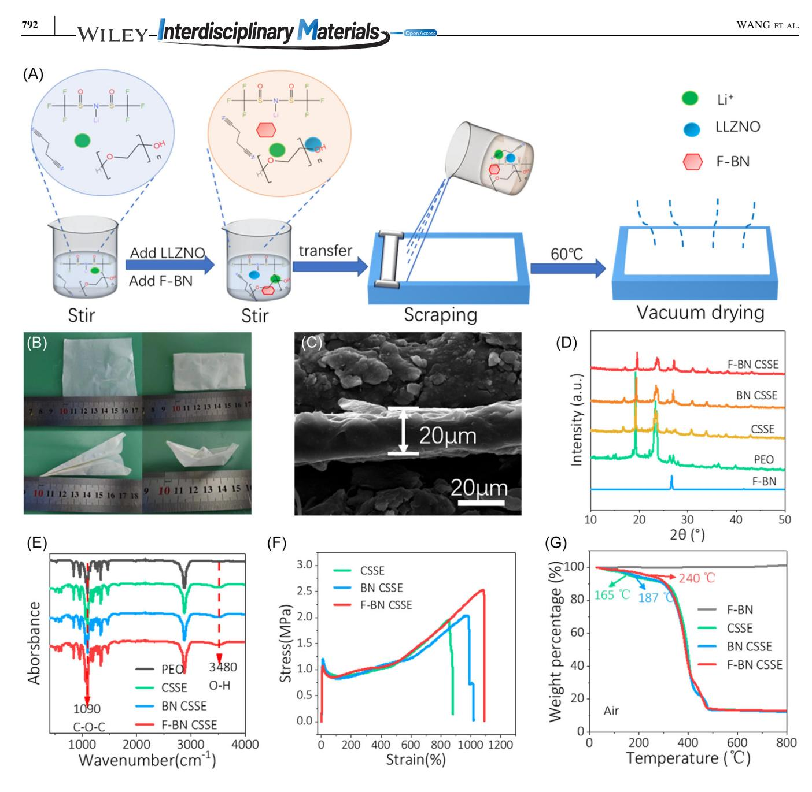
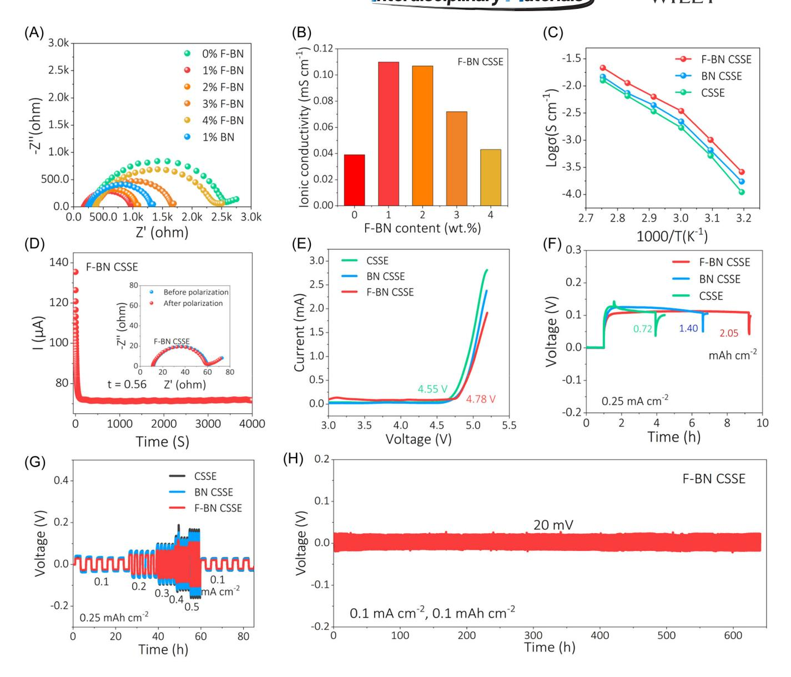
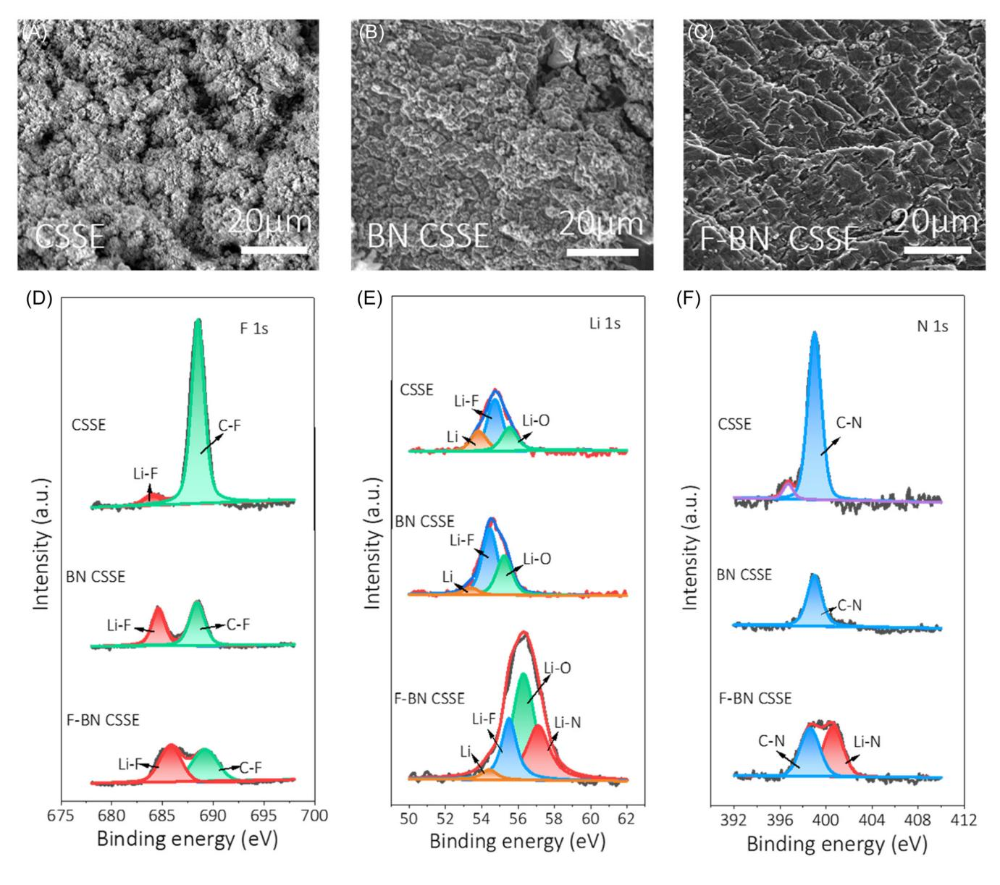
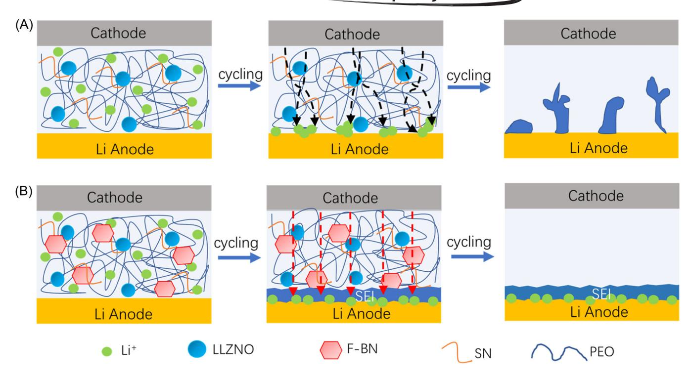
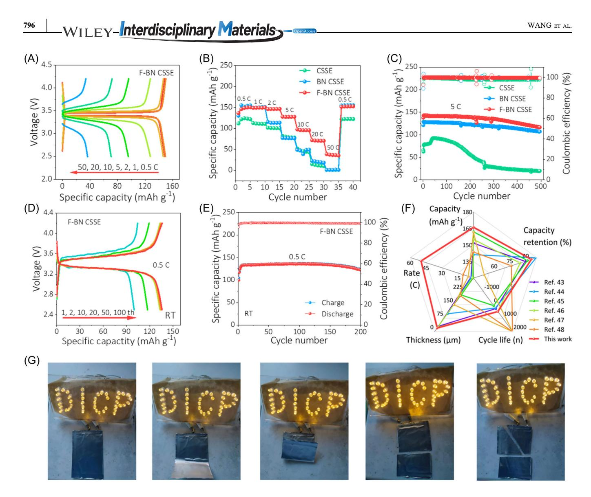

#### RESEARCH ARTICLE

# Fluorinated boron nitride nanosheet enhanced ultrathin and conductive polymer electrolyte for high‐rate solid‐state lithium metal batteries

## Linjun Wang1,2 | Haodong Shi1 | Yingpeng Xie2 | Zhong‐Shuai Wu1,[3](http://orcid.org/0000-0003-1851-4803)

1 State Key Laboratory of Catalysis, Dalian Institute of Chemical Physics, Chinese Academy of Sciences, Dalian, China

2 College of Chemical Engineering, Shenyang University of Chemical Technology, Economical and Technological Development Zone, Shenyang, China

3 Dalian National Laboratory for Clean Energy, Chinese Academy of Sciences, Dalian, China

#### Correspondence

Haodong Shi and Zhong‐Shuai Wu, State Key Laboratory of Catalysis, Dalian Institute of Chemical Physics, Chinese Academy of Sciences, 457 Zhongshan Rd, Dalian 116023, China. Email: [hdshi@dicp.ac.cn](mailto:hdshi@dicp.ac.cn) and [wuzs@dicp.ac.cn](mailto:wuzs@dicp.ac.cn)

#### Funding information

Dalian Innovation Support Plan for Young and Middle‐aged Science and Technology Talents Innovative, Grant/Award Number: 2022RQ033; Exploratory Research Project of Yanchang Petroleum International Limited and DICP, Grant/Award Number: yc‐hw‐2022ky‐01; Liaoning Province Applied Basic Research Program, Grant/Award Number: 2022JH2/ 101300210; Dalian National Laboratory For Clean Energy (DNL), CAS, DNL Cooperation Fund, CAS, Grant/Award Numbers: DNL202016, DNL202019; The Joint Fund of the Yulin University and the Dalian National Laboratory for Clean Energy, Grant/Award Numbers: YLU‐DNL Fund 2021002, YLU‐DNL Fund 2021009; National Key R&D Program of China, Grant/Award Number: 2022YFA1504100; Dalian Innovation Support Plan for High Level Talents, Grant/Award Number:

#### Abstract

Polyethylene oxide (PEO)‐based polymer solid electrolytes (PSE) have been pursued for the next‐generation extremely safe and high‐energy‐density lithium metal batteries due to their exceptional flexibility, manufacturability, and lightweight nature. However, the practical application of PEO‐PSE has been hindered by low ionic conductivity, limited lithium‐ion transfer number (tLi+), and inferior stability with lithium metal. Herein, an ultrathin composite solid‐state electrolyte (CSSE) film with a thickness of 20 μm, incorporating uniformly dispersed two‐dimensional fluorinated boron nitride (F‐BN) nanosheet fillers (F‐BN CSSE) is fabricated via a solution‐casting process. The integration of F‐BN effectively reduces the crystallinity of the PEO polymer matrix, creating additional channels that facilitate lithium‐ion transport. Moreover, the presence of F‐BN promotes an inorganic phase‐ dominated electrolyte interface film dominated by LiF, Li2O, and Li3N on the lithium anode surface, greatly enhancing the stability of the electrode‐ electrolyte interface. Consequently, the F‐BN CSSE exhibits a high ionic conductivity of 0.11 mS cm−1 at 30°C, high tLi+ of 0.56, and large electrochemical window of 4.78 V, and demonstrates stable lithium plating/ striping behavior with a voltage of 20 mV for 640 h, effectively mitigating the formation of lithium dendrites. When coupled with LiFePO4, the as‐assembled LiFePO4|F‐BN CSSE|Li solid‐state battery achieves a high capacity of 142 mAh g−1 with an impressive retention rate of 82.4% after 500 cycles at 5 C. Furthermore, even at an ultrahigh rate of 50 C, a capacity of 37 mAh g−1 is

This is an open access article under the terms of the Creative Commons Attribution License, which permits use, distribution and reproduction in any medium, provided the original work is properly cited.

© 2023 The Authors. Interdisciplinary Materials published by Wuhan University of Technology and John Wiley & Sons Australia, Ltd.

achieved. This study provides a novel and reliable strategy for the design of advanced solid‐state electrolytes for high‐rate and long‐life lithium metal batteries.

#### KEYWORDS

fluorinated boron nitride, high energy density, high rate, lithium metal batteries, solid‐state electrolyte

## 1 | INTRODUCTION

Lithium (Li) metal is regarded as the optimal choice of anode material for high‐energy‐density battery because of its high theoretical capacity (3860 mAh g−1 ) and lowest electrode potential (−3.04 V as compared to standard hydrogen electrode).[1–[5\]](#page-8-0) Nevertheless, the practical applicability of Li metal batteries has been intrinsically limited due to both safety concerns and well‐established challenges associated with Li anodes in organic electrolyte systems, such as Li dendrite formation, unstable thickening of solid electrolyte interphase (SEI), and "dead" Li generation.[\[6](#page-9-0)–9] To address these issues, solid‐state electrolytes have emerged as a promising alternative, offering a significant enhancement in safety by replacing the use of flammable organic solvents.[\[10](#page-9-1)–13]

Until now, polymer solid electrolytes (PSE), such as polyethylene oxide (PEO)‐based PSE, are considered the most promising for commercialization due to their advantageous properties, such as good flexibility, low density, high safety, good processability, and low cost.[14–[16\]](#page-9-2) However, there are still many problems existing in the PEO‐based PSE like poor ionic conductivity (10−7 –10−5 S cm−1 ) at room temperature (RT), and the weak mechanical strength renders them susceptible to puncture by lithium dendrites, causing a rapid battery failure.[17–[21](#page-9-3)] To address these limitations, the incorporation of organic–inorganic composite solid‐state electrolyte (CSSE) has been proposed to enhance the overall performance of electrolytes.[[17,22,23\]](#page-9-3) The CSSE combines the flexibility of polymers and good electrode contact, as well as high ionic conductivity similar to inorganic solid electrolytes.[\[23](#page-9-4)–25] Typically, PEO is blended with inorganic electrolytes, such as Li6.25Ga0.25La3Zr2O12, [\[26,27](#page-9-5)] Li1.3Al0.3Ti1.7P(O4)3, and Li10GeP2S12, [28–[31\]](#page-9-6) or inorganic fillers like SiO2 and MoO3. [[24,32,33](#page-9-7)] Nevertheless, the agglomeration between inorganic particles, poor compatibility between PEO and fillers, and unstable interface stability between CSSE with Li anode are the key limitations for the as‐ assembled solid‐state batteries. Therefore, it is urgently imperative to develop new functional inorganic fillers that can simultaneously achieve high lithium‐ion (Li+) conductivity and alleviate dendrite issues in solid‐state Li metal batteries (SSLMBs).

Two‐dimensional (2D) boron nitride (BN) is well‐ known for its favorable chemical/electrochemical and thermal stability, low electrical conductivity, chemical inertness, and high mechanical strength.[\[34,35](#page-9-8)] Moreover, the B atom in the BN can act as a Lewis acid, facilitating the dissociation of Lewis basic anions from Li salt, thereby reducing the concentration of Li+ for uniform deposition. Additionally, functionalization of BN with various functional groups can promote the generation of a stabilized SEI, which helps suppress the side reaction.[[36,37\]](#page-9-9) Therefore, BN is expected to be a promising filler for improving the comprehensive properties of SSLMBs.

In this study, 2D F‐BN nanosheets were for the first time incorporated into PEO‐based PSE to fabricate ultrathin (20 μm in thickness) freestanding CSSE film via a solution‐casting process. The introduction of F‐BN fillers effectively reduces the crystallinity of the PEO matrix, creating additional channels for rapid Li+ transport. Moreover, the fluoride functional groups in F‐BN promote the formation of a stable inorganic SEI rich in LiF, Li2O, and Li3N on the surface of the lithium anode, which contributes to reducing the interface impedance and inhibits the growth of Li dendrites. Consequently, F‐BN CSSE demonstrates a high Li+ conductivity of 0.11 mS cm−1 at 30°C and a large Li+ transference number (tLi+) of 0.56. The F‐BN CSSE also exhibits superior electrochemical stability during the Li stripping‐plating process for over 600 h at 0.1 mA cm−2 . The as‐assembled LiFePO4 (LFP)|F‐BN CSSE| Li solid‐state batteries deliver a high discharge capacity of 142 mAh g−1 at 5 C and retains 82.4% of its capacity after 500 cycles, with an average columbic efficiency of 99.9% at 60°C. In addition, our solid‐state pouch cell using F‐BN CSSE can readily power LED lights under folded and cutting conditions, demonstrating the potential application of CSSE for high‐safety SSLMBs.

## 2 | RESULTS AND DISCUSSION

The 2D F‐BN nanosheets (Supporting Information: Figure S1A) were synthesized via hydrothermal method using ammonium fluoride (NH4F) as the fluorinating agent.[[38](#page-10-0)] The crystallographic structure (average crystallite size: 7.6 nm) and chemical properties of F‐BN are confirmed through Raman and X‐ray diffraction (XRD) analyses. The peak at 1366 cm−1 represents the B–N bond (Supporting Information: Figure S1B), and the full width at half maxima of F‐BN is significantly larger than that of BN, indicating the few‐layer nature of F‐BN.[\[39\]](#page-10-1) Notably, the XRD pattern of F‐BN displays a peak at 2θ = 26.7° assigned to (002) crystal plane (JCPDS: No. 73‐2095) that shifts to a higher angle after fluorination (Supporting Information: Figure S1C). Additionally, X‐ray photoelectron microscopy (XPS) spectra were performed to reveal to molecular structure and atomic valence state of F‐BN (Supporting Information: Figure S1D‐F). Obviously, the peaks of the B–N bond are observed at 189.9 and 397.5 eV in the B 1s and N 1s spectra, respectively. Meanwhile, the presence of fluoride in F‐BN is confirmed by the appearance of peaks at 190.5 and 398.2 eV, which are attributed to B–F and N–F bonds in the F 1s spectrum (Supporting Information: Figure S1F).[\[40\]](#page-10-2)

As shown in Figure [1A](#page-3-0), the F‐BN CSSE film was prepared by solution‐casting technique. The film exhibits excellent mechanical flexibility, allowing it to be folded into various shapes, as shown in Figure [1B.](#page-3-0) Cross‐ sectional scanning electron microscope (SEM) images reveal that the thickness of electrolyte film is only 20 μm (Figure [1C](#page-3-0)), which is comparable to the commercial polypropylene separators. It is noted that this ultrathin electrolyte film is a crucial precondition for realizing high‐energy density solid‐state batteries.[\[11\]](#page-9-10) The XRD patterns presented in Figure [1D](#page-3-0) show the diffraction peaks of both F‐BN (26.7°, 40.8°, and 43.8°) and PEO (19° and 23°) in F‐BN CSSE, confirming the successful preparation of the composite electrolyte. Remarkably, the doping of F‐BN nanosheets leads to a significant decrease in the crystalline degree of PEO chains, thereby enhancing the movement of coordination Li+ along polymer chain segments. The FTIR analysis of the various CSSEs is presented in Figure [1E](#page-3-0). The peak at 3480 cm−1 corresponding to O–H of PEO appears more intense in F‐BN CSSE than in bare CSSE and PEO. This suggests an increased presence of O–H due to the partial destruction of the PEO crystalline structure after the addition of F‐BN. This effect is further supported by the significantly higher C–O–C stretching vibration (1090 cm−1 ) in F‐BN CSSE compared to CSSE and BN CSSE, indicating an increased presence of the –EO– group. The reduced crystallinity and increased freedom short chains of PEO facilitate the segmental motion of polymer chains, providing more pathways for Li+ transmission.[\[41\]](#page-10-3) The mechanical properties and macroscopic toughness play a critical role in inhibiting Li dendrites growth. As shown in Figure [1F](#page-3-0), when F‐BN is added to CSSE, both the strength and deformability are increased simultaneously. The tensile strength and tensile fracture values of F‐BN CSSE film reach 2.53 MPa and 1120%, respectively, surpassing those of bare CSSE (tensile strength 1.6 MPa and tensile fracture 920%). Figure [1G](#page-3-0) presents the thermogravimetric analysis (TGA) of electrolyte film. F‐BN CSSE film experiences 5% weight loss at 240°C, which is significantly higher than those of bare CSSE (165°C) and BN CSSE (187°C), indicative of enhanced thermal stability owing to the addition of F‐BN.

The ionic conductivities of F‐BN CSSE films with different weight ratios of F‐BN were obtained via electrochemical impedance spectroscopy (EIS) by assembling Li‖Li symmetric cells at 30°C, and the comparative results of the ionic conductivities are presented in Figure [2A](#page-4-0). Remarkably, all F‐BN CSSE films exhibit higher ionic conductivities compared to bare CSSE, and 1% F‐BN CSSE film demonstrates the highest Li+ conductivity up to 0.11 mS cm−1 at 30°C (Figure [2B,C\)](#page-4-0). This can be attributed to the well‐dispersed BN, which reduces the crystallinity of PEO and promotes the interaction with the Lewis basic anions from Li salt. However, at a high weight ratio (2%–4%) of F‐BN, a decrease in Li+ conductivity is observed due to the nanofiller agglomeration and free volume depletion (Supporting Information: Figure S2). Figure [2C](#page-4-0) and Supporting Information: Figure S3 show ionic conductivity versus temperature for different electrolytes. It can be seen that ionic conductivity increased with an increase of temperature because the Li+ movement in solid‐state electrolytes is higher at elevated temperatures. Furthermore, the Arrhenius plots of CSSE membranes display different slopes in the higher and lower temperature regions, indicating the gradual transformation of crystalline regions into amorphous regions as the temperature rises.[[42\]](#page-10-4) The tLi+ of CSSE is calculated using chronoamperometry combined with EIS, providing further evidence for the enhancement of the ion‐conductive pathways of CSSE with the addition of F‐BN filler. The calculated tLi+ of F‐BN CSSE reaches 0.56 (Figure [2D\)](#page-4-0), significantly higher than those of bare CSSE (0.3) and BN CSSE (0.33) (Supporting Information: Figure S4). Notably, this value also exceeds most reported values for PSE (tLi+ < 0.4),[\[43](#page-10-5)] such as PEO‐LiTFSI/ZIF (zeolitic imidazolate framework as the filler) and poly (DOL‐TTE)‐LP (crosslinked polymerization of DOL and trimethylolpropane triglycidyl ether (TTE) within a lithium nitrate‐ releasing mesoporous polymer).[[44,45\]](#page-10-6) High electrochemical stability of CSSE is crucial to match the high‐voltage cathode. However, PEO‐based polymer electrolytes typically begin to be oxidized and decomposed at 3.8 V, which significantly limits their application.[[46\]](#page-10-7) To this end, linear sweep voltammetry (LSV) is applied to analyze the

FIGURE 1 (A) Schematic diagram of preparation and (B) optical photographs of F‐BN CSSE films. (C) Cross‐sectional SEM image of F‐ BN CSSE film. (D) XRD patterns, (E) FTIR spectra of F‐BN, PEO, CSSE, BN CSSE, and F‐BN CSSE. (F) Stress–strain curves of the CSSE, BN CSSE, and F‐BN CSSE. (G) TGA analysis of F‐BN, CSSE, BN CSSE, and F‐BN CSSE. BN, boron nitride; CSSE, composite solid‐state electrolyte; F‐BN, fluorinated boron nitride; PEO, polyethylene oxide; SEM, scanning electron microscope; TGA, thermogravimetric analysis; XRD, X‐ray diffraction.

electrochemical stability of CSSE films. Remarkably, the electrochemical window of F‐BN CSSE reaches 4.78 V, which is much higher than those of CSSE (4.55 V) and BN CSSE (4.6 V) (Figure [2E](#page-4-0)), holding great potential for achieving high energy density batteries.

Furthermore, our F‐BN CSSE also demonstrates remarkable compatibility with Li metal anodes. To evaluate the stability of F‐BN CSSE toward Li metal, galvanostatic charge‐discharge tests were conducted in a Li|F‐BN CSSE|Li symmetric battery to evaluate the Li plating/stripping behavior and cycle stability (Supporting Information: Figure S5). The maximum Li deposition capacity of F‐BN CSSE reaches 2.05 mAh cm−2 , nearly three times higher than CSSE (0.75 mAh cm−2 ) and 1.5 times higher than that of BN CSSE (1.40 mAh cm−2 ) at 0.25 mA cm−2 , demonstrative of enhanced electrochemical stability and electrode compatibility of F‐BN CSSE (Figure [2F\)](#page-4-0). Importantly, a stable plating/stripping

WANG ET AL. | 793

FIGURE 2 (A) EIS plots of the CSSE films with 0, 1, 2, 3, 4 wt% F‐BN, and 1 wt% BN at 30°C. (B) Ionic conductivity of F‐BN CSSE films with different weight ratios of F‐BN at 30°C. (C) Arrhenius curves of the CSSE, BN CSSE, and F‐BN CSSE films. (D) Chronoamperometry curve for F‐BN CSSE with a polarization voltage of 10 mV. The inset shows EIS plots before and after the polarization. (E) Linear sweep voltammetry curves, (F) voltage profiles at 0.25 mA cm−2 , and (G) rate performance of L‖Li symmetric cells with CSSE, BN CSSE, and F‐BN CSSE films. (H) Cycling stability of Li‖Li symmetric cell with F‐BN CSSE film at 0.1 mA cm−2 . BN, boron nitride; CSSE, composite solid‐state electrolyte; EIS, electrochemical impedance spectroscopy; F‐BN, fluorinated boron nitride.

process is observed for the Li|F‐BN CSSE|Li cell at 0.5 mA cm−2 . In contrast, both Li|BN CSSE|Li and Li| CSSE|Li cells experience significant amplitude fluctuations at 0.5 mA cm−2 (Figure [2G\)](#page-4-0). Additionally, a stable charge/discharge voltage of 20 mV is maintained for Li|F‐ BN CSSE|Li cells at 0.1 mA cm−2 after 640 h (Figure [2H\)](#page-4-0).

SEM characterization was conducted to check the surface of Li anodes in Li||Li symmetric cells after 20 cycles, and their SEM images are displayed in Figure [3A](#page-5-0)–C. The surface of Li metals in contact with CSSE and BN CSSE exhibit uneven and cracked morphology (Figure [3A,B](#page-5-0)), attributed to the uneven Li deposition. In contrast, the Li metal with F‐BN CSSE displays relatively plane and smooth morphology, without Li dendrite growth (Figure [3C](#page-5-0)), indicating favorable compatibility with Li metal. Furthermore, the SEI of Li anode was examined by XPS measurements. The Li–F peak (685.8 eV) in the F 1s spectrum of F‐BN CSSE is significantly stronger than that of CSSE (Figure [3D\)](#page-5-0), indicating that F‐BN assists in the formation of a LiF‐rich SEI film on the Li metal surface. It is well‐known that the presence of the LiF is responsible for exceptional chemical

FIGURE 3 (A–C) SEM images of the cycled Li anode using (A) CSSE, (B) BN CSSE, and (C) F‐BN CSSE. (D–F) XPS spectra for (D) F 1s, (E) Li 1s, and (F) N 1s of the cycled Li metal surface in Li‖Li symmetric batteries using CSSE, BN CSSE, and F‐BN CSSE. BN, boron nitride; CSSE, composite solid‐state electrolyte; F‐BN, fluorinated boron nitride; XPS, X‐ray photoelectron microscopy.

stability and high mechanical strength of the SEI layer.[[36,47\]](#page-9-9) Additionally, compared to the weaker Li–O (55.3 eV) and Li–N peaks (55.6 eV) CSSE and BN CSSE, respectively, the Li–O peak of F‐BN CSSE battery is more prominent (Figure [3E\)](#page-5-0). Moreover, the N 1s spectrum reveals a peak located at 400.5 eV, corresponding to the presence of a Li–N bond, confirming the existence of Li3N on the surface of lithium metal with F‐BN CSSE (Figure [3F\)](#page-5-0). It is noted that Li3N is a fast Li conductor due to its outstanding stability with metal.[[48](#page-10-8)] Therefore, these stable inorganic SEI films containing LiF, Li2O, and Li3N contribute to high durability and low interface resistance, resulting in better cycling properties of Li metal batteries.

On the basis of the aforementioned results, the functional mechanism of F‐BN CSSE for high‐ performance Li metal batteries is depicted in Figure [4](#page-6-0). In PEO‐based PSE, Li+ transportation occurs through repeated "decomplexation–recomplexation" of Li+ and –EO– induced by segmental movement of the polymer's amorphous region.[[49](#page-10-9)] However, in the case of bare CSSE, Li dendrites rapidly form and propagate during the charge and discharge process, eventually penetrating the electrolyte due to the limited Li+ migration channels and weak mechanical strength (Figure [4A](#page-6-0)). The utilization of F‐BN CSSE achieves a dendrite‐free Li anode with uniform Li deposition, accomplished through two primary mechanisms. First, the addition of F‐BN significantly reduces the

FIGURE 4 Schematic illustration for Li deposition process with (A) CSSE and (B) F‐BN CSSE. CSSE, composite solid‐state electrolyte; F‐BN, fluorinated boron nitride; PEO, polyethylene oxide.

crystallinity of PEO, providing more –EO– segments for rapid transport of Li+, thus improving ionic conductivity and tLi+ of electrolyte. Second, the F‐BN with rich fluorine ions and surface defects facilitates the generation of an inorganic SEI film enriched with LiF, Li2O, and Li3N on the surface of Li anode. This not only facilitates the transport of Li+ at the interface between the electrolyte and Li anode but also prevents direct contact between them, thereby reducing the side reactions (Figure [4B\)](#page-6-0).

Next, LFP cathodes are incorporated into Li metal batteries to evaluate the F‐BN CSSE. The rate performance of LFP|F‐BN CSSE|Li batteries was examined from 0.5 to 50 C within a voltage window of 2.5‐4.2 V. Notably, the LFP|F‐BN CSSE|Li battery shows outstanding capacities of 150, 149, 146, 127, 96, 71 and 37 mAh g−1 at 0.5, 1, 2, 5, 10, 20 and 50 C, respectively (Figure [5A](#page-7-0)). Moreover, the capacity recovers to 153 mAh g−1 as the rate increases to 0.5 C, clearly higher than those of the LFP|CSSE|Li and LFP|BN CSSE|Li batteries (Figure [5B](#page-7-0) and Supporting Information: Figure S6). Even at a high rate of 5 C, LFP| F‐BN CSSE|Li delivers a capacity of 142 mAh g−1 , outperforming LFP|BN CSSE|Li (128 mAh g−1 ) and LFP|CSSE| Li (77 mAh g−1 ) (Supporting Information: Figure S7). After 500 cycles, LFP|F‐BN CSSE|Li sustains a steady capacity of 117 mAh g−1 with a retention rate of 82.4% (Figure [5C\)](#page-7-0). The higher capacity of LFP|F‐BN CSSE|Li is mainly attributed to its better interfacial stability and higher ionic conductivity. Furthermore, after 500 cycles, LFP|F‐BN CSSE|Li displays a superior capacity of 158 mAh g−1 with a retention of 95% at 0.5 C, while LFP|CSSE|Li and LFP|BN CSSE|Li batteries deliver an inferior capacity of 120 and 140 mAh g−1 with a retention of only 78% and 71%, respectively (Supporting Information: Figure S8). Remarkably, LFP|F‐BN CSSE|Li batteries deliver a satisfactory capacity of 142 mAh g−1 after 200 cycles without attenuation at 0.5 C at 30°C (Figure [5D,E\)](#page-7-0). It is worth noting that the electrochemical properties of our LFP|F‐BN CSSE|Li are superior to the majority of recently reported solid‐state batteries (Figure [5F](#page-7-0) and Supporting Information: Table S1), such as bifunctional regular‐random dual cross‐linking network solid polymer electrolyte (140.1 mAh g−1 at 0.5 C),[\[50](#page-10-10)] amine‐functionalized BN nanosheets‐ion gel (132.8 mAh g−1 at 0.2 C),[\[51\]](#page-10-11) and matrix and ionic liquid (150.4 mAh g−1 at 0.1 C).[\[52\]](#page-10-12) More importantly, the LFP|F‐ BN CSSE|Li pouch cell exhibits exceptional safety and practicality as it can power a string of DICP LED lights even when folded or cut in air (Figure [5G](#page-7-0)), highlighting the immense potential of F‐BN CSSE in solid‐state Li metal pouch batteries.

## 3 | CONCLUSION

In summary, we prepare ultrathin freestanding CSSE film using highly dispersed and surface‐functionalized F‐BN nanosheets as inorganic fillers for all solid‐state Li

FIGURE 5 (A) Galvanostatic charge and discharge (GCD) profiles of solid‐state LFP|F‐BN CSSE|Li batteries measured at 60°C. (B) Rate performance of LFP||Li batteries with CSSE, BN CSSE, and F‐BN CSSE at 60°C. (C) Cycling performance of LFP‖Li batteries with CSSE, BN CSSE, and F‐BN CSSE obtained at 60°C and 5 C. (D) GCD profiles and (E) corresponding cycling performance of solid‐state LFP|F‐BN CSSE|Li batteries with F‐BN CSSE at 30°C. (F) The electrochemical performances of LFP|F‐BN CSSE|Li batteries compared with the recently reported advanced electrolytes. (G) Optical photographs of the flexible LFP|F‐BN CSSE|Li pouch cells lighting LED lamps under bending and cutting conditions. BN, boron nitride; CSSE, composite solid‐state electrolyte; F‐BN, fluorinated boron nitride.

metal batteries. Owing to the fast Li+ migration channels, enhanced tensile strength as well as the stable inorganic‐ rich SEI film of the surface of the Li anode, the F‐BN CSSE demonstrates an improved Li+ conductivity and superior electrochemical stability. Consequently, a high current density of 0.5 mA cm−2 coupled with a stable plating/stripping process for over 600 h at 0.1 mA cm−2 is achieved for the Li|F‐BN CSSE|Li cell. The corresponding LFP|F‐BN CSSE|Li solid‐state battery demonstrates a superior capacity of 142 mAh g−1 at 5 C and 60°C, with retention of 82.4% after 500 cycles while maintaining an average columbic efficiency of 99.9%. Furthermore, even at an ultrahigh rate of 50 C, a capacity of 37 mAh g−1 is still attained. These outstanding results demonstrate the potential of F‐BN CSSE for the next‐generation high energy density and high safety Li‐metal batteries.

## 4 | EXPERIMENT SECTION

## 4.1 | Materials synthesis

### 4.1.1 | Preparation of F‐BN nanosheet

First, 0.2 g BN and 1.0 g ammonium fluoride (NH4F) were homogeneously mixed, and then transferred to a hydrothermal kettle. Next, 20 mL of deionized water was added, and the mixture was hydrothermally treated at 180°C for 24 h. Afterward, the solution was centrifuged at 3000 rpm for 5 min, and the resulting precipitate was washed with deionized water using ultrasonication for 20 min. Subsequently, the washed precipitate was centrifuged at 8000 rpm, and the ultrasonic washing was repeated three and four times until the pH of the supernatant reached approximately 7. Finally, the precipitate was washed two to three times with absolute ethanol, followed by centrifugation, and then dried in an oven at 60°C for 12 h to obtain F‐BN powder.

## 4.1.2 | Preparation of composite solid‐state electrolyte (CSSE) films

A total of 1.0 g PEO, 0.315 g LiTFSI, 0.45 g SN, 0.1315 g LLZNO and a certain amount of F‐BN or bare BN nanosheets were dissolved into 10 mL of acetonitrile, and the mixture was stirred magnetically at 200 rpm for 2 h until it became uniform and transparent. The uniformly mixed slurry was then set aside for later use. Using a spatula to evenly spread the solution on the polytetrafluoroethylene plate, allowing most of the acetonitrile to volatilize. Then, the plate was transferred to a vacuum drying oven at 60°C for 12 h to remove the remaining acetonitrile. After drying, the composite polymer electrolyte films (BN CSSE or F‐BN CSSE films) were peeled off from the polytetrafluoroethylene plate with the tweezers, cut into a diaphragm with a diameter of 19 mm using a microtome, and placed in a glove box for later use. The CSSE film without filler was also prepared using the above method.

## 4.1.3 | Preparation of LiFePO4 (LFP) cathode

A total of 80 mg LFP, 10 mg composite solid electrolyte, and 10 mg Ketjen black were dissolved in 200 μL acetonitrile, ground evenly and coated onto carbon‐ coated aluminum foil. Then, it was vacuum‐dried at 60°C for 12 h to obtain LFP cathode electrode. The mass loading of LFP is about 1 mg cm−2 .

## 4.2 | Materials characterization

The morphology and structure are measured by SEM (JEOL JSM‐7900F and FEI Quanta 200F), TEM (HITA-CHI HT770), XRD (Rigaku SmartLab), Raman spectrometer (Renishaw NanoWizard), FTIR spectrometer (Thermofisher scientific Nicolet iS50), and XPS (Thermo Escalab 250Xi+). The TGA analysis is measured by thermal gravity difference heat (PE Diamond TG/DTA), and stress–strain curve is measured by Tensile testing machine (Dongri Electric DR‐5010AS).

## 4.3 | Electrochemical measurement

Symmetric cell was composed of two lithium metal pellets with a diameter of 12 mm, and the as‐prepared CSSE films. Asymmetric cells of Li|CSSE|stainless steel were assembled and Linear sweep voltammetry (LSV) were conducted between 3.0 and 5.2 V with a scan rate of 1 mV s−1 . EIS was tested by the Zahner electrochemical workstation (Zennium Pro) in the frequency range of 500 kHz to 0.1 Hz by applying an AC amplitude of 10 mV. The ion transference number (tLi +) of the CSSE was determined by the steady‐state amperometric method. Electrochemical experiments were performed via 2025‐type coin cells using a lithium metal anode, solid‐state electrolyte film and LFP cathode. The LAND CT2001A battery system was used to test the GCD and voltage profiles of batteries from 2.5 to 4.2 V.

#### ACKNOWLEDGMENTS

This work was financially supported by the National Key R&D Program of China (Grant 2022YFA1504100), National Natural Science Foundation of China (Grant No. 22309177, 22125903), Liaoning Province Applied Basic Research Program (2022JH2/101300210), Dalian Innovation Support Plan for High Level Talents (2019RT09), Dalian Innovation Support Plan for Young and Middle‐aged Science and Technology Talents Innovative (2022RQ033), Dalian National Laboratory For Clean Energy (DNL), CAS, DNL Cooperation Fund, CAS (DNL202016, DNL202019), DICP (DICP I2020032, DICP I202222), The Joint Fund of the Yulin University and the Dalian National Laboratory for Clean Energy (YLU‐DNL Fund 2021002, YLU‐DNL Fund 2021009), and Exploratory Research Project of Yanchang Petroleum International Limited and DICP (yc‐hw‐2022ky‐01).

#### CONFLICT OF INTEREST STATEMENT

The authors declare no conflict of interest.

#### ORCID

Zhong‐Shuai Wu [http://orcid.org/0000-0003-](http://orcid.org/0000-0003-1851-4803) [1851-4803](http://orcid.org/0000-0003-1851-4803)

#### REFERENCES

- [1] Lee MJ, Han J, Lee K, et al. Elastomeric electrolytes for high‐ energy solid‐state lithium batteries. Nature. 2022;601:217‐222.
- [2] Ko S, Obukata T, Shimada T, et al. Electrode potential influences the reversibility of lithium‐metal anodes. Nat Energy. 2022;7:1217‐1224.

798 | WANG ET AL.

- [3] Ma Q, Fu S, Wu AJ, et al. Designing bidirectionally functional polymer electrolytes for stable solid lithium metal batteries. Adv Energy Mater. 2023;13:2203892.
- [4] Han Y, Liu B, Xiao Z, et al. Interface issues of lithium metal anode for high‐energy batteries: challenges, strategies, and perspectives. InfoMat. 2021;3:155‐174.
- [5] Zhang X, Sun C. Recent advances in dendrite‐free lithium metal anodes for high‐performance batteries. Phys Chem Chem Phys. 2022;24:19996‐20011.
- [6] Lu Y, Zhao C‐Z, Hu J‐K, et al. The void formation behaviors in working solid‐state Li metal batteries. Sci Adv. 2022;8:eadd0510.
- [7] Yi Q, Zhang W, Wang T, Han J, Sun C. A high‐performance lithium metal battery with a multilayer hybrid electrolyte. Energy Environ Mater. 2023;6:e12289.
- [8] Wang T, Zhang X, Yuan N, Sun C. Molecular design of a metal‐organic framework material rich in fluorine as an interface layer for high‐performance solid‐state Li metal batteries. Chem Eng J. 2023;451:138819.
- [9] Sun C, Liu J, Gong Y, Wilkinson DP, Zhang J. Recent advances in all‐solid‐state rechargeable lithium batteries. Nano Energy. 2017;33:363‐386.
- [10] Li ZC, Li TY, Deng YR, et al. 3D porous PTFE membrane filled with PEO‐based electrolyte for all solid‐state lithium‐ sulfur batteries. Rare Met. 2022;41:2834‐2843.
- [11] Gao X, Zheng X, Tsao Y, et al. All‐solid‐state lithium‐sulfur batteries enhanced by redox mediators. J Am Chem Soc. 2021;143:18188‐18195.
- [12] Liu Y, Liu H, Lin Y, et al. Mechanistic investigation of polymer‐based all‐solid‐state lithium/sulfur battery. Adv Funct Mater. 2021;31:2104863.
- [13] Wen P, Lu P, Shi X, et al. Photopolymerized gel electrolyte with unprecedented room‐temperature ionic conductivity for high‐energy‐density solid‐state sodium metal batteries. Adv Energy Mater. 2021;11:2002930.
- [14] Nguyen HL, Luu VT, Nguyen MC, et al. Nb/Al co‐doped Li7La3Zr2O12 composite solid electrolyte for high‐performance all‐solid‐state batteries. Adv Funct Mater. 2022;32:2207874.
- [15] Xi G, Xiao M, Wang S, Han D, Li Y, Meng Y. Polymer‐based solid electrolytes: material selection, design, and application. Adv Funct Mater. 2021;31:2007589.
- [16] Tuo K, Sun C, Liu S. Recent progress in and perspectives on emerging halide superionic conductors for all‐solid‐state batteries. Electrochem Energy Rev. 2023;6:17.
- [17] Fan LZ, He H, Nan CW. Tailoring inorganic‐polymer composites for the mass production of solid‐state batteries. Nat Rev Mater. 2021;6:1003‐1019.
- [18] Wan J, Xie J, Mackanic DG, Burke W, Bao Z, Cui Y. Status, promises, and challenges of nanocomposite solid‐state electrolytes for safe and high performance lithium batteries. Mater Today Nano. 2018;4:1‐16.
- [19] Zhang X, Fu C, Cheng S, et al. Novel PEO‐based composite electrolyte for low‐temperature all‐solid‐state lithium metal batteries enabled by interfacial cation‐assistance. Energy Storage Mater. 2023;56:121‐131.
- [20] Sheng J, Zhang Q, Sun C, et al. Crosslinked nanofiber‐ reinforced solid‐state electrolytes with polysulfide fixation effect towards high safety flexible lithium‐sulfur batteries. Adv Funct Mater. 2022;32:2203272.
- [21] Nakhanivej P, Yu X, Park SK, et al. Revealing molecular‐level surface redox sites of controllably oxidized black phosphorus nanosheets. Nat Mater. 2019;18:156‐162.
- [22] Zhu X, Wang K, Xu Y, et al. Strategies to boost ionic conductivity and interface compatibility of inorganic‐organic solid composite electrolytes. Energy Storage Mater. 2021;36:291‐308.
- [23] Jiang F, Wang Y, Ju J, et al. Percolated sulfide in salt‐ concentrated polymer matrices extricating high‐voltage all‐ solid‐state lithium‐metal batteries. Adv Sci. 2022;9:2202474.
- [24] Wang X, Huang S, Guo K, Min Y, Xu Q. Directed and continuous interfacial channels for optimized ion transport in solid‐state electrolytes. Adv Funct Mater. 2022;32:2206976.
- [25] Gao L, Luo S, Li J, Cheng B, Kang W, Deng N. Core‐shell structure nanofibers‐ceramic nanowires based composite electrolytes with high Li transference number for high‐ performance all‐solid‐state lithium metal batteries. Energy Storage Mater. 2021;43:266‐274.
- [26] Li Z, Guo X. Integrated interface between composite electrolyte and cathode with low resistance enables ultra‐ long cycle‐lifetime in solid‐state lithium‐metal batteries. Sci China Chem. 2021;64:673‐680.
- [27] Zagórski J, Silván B, Saurel D, Aguesse F, Llordés A. Importance of composite electrolyte processing to improve the kinetics and energy density of Li metal solid‐state batteries. ACS Appl Energy Mater. 2020;3:8344‐8355.
- [28] Siyal SH, Li M, Li H, Lan JL, Yu Y, Yang X. Ultraviolet irradiated PEO/LATP composite gel polymer electrolytes for lithium‐metallic batteries (LMBs). Appl Surf Sci. 2019;494: 1119‐1126.
- [29] Wang D, Xie H, Liu Q, et al. Low‐cost, high‐strength cellulose‐based quasi‐solid polymer electrolyte for solid‐ state lithium‐metal batteries. Angew Chem Int Ed. 2023;62: e202302767.
- [30] Kondori A, Esmaeilirad M, Harzandi AM, et al. A room temperature rechargeable Li2O‐based lithium‐air battery enabled by a solid electrolyte. Science. 2023;379:499‐505.
- [31] Pan K, Zhang L, Qian W, et al. A flexible ceramic/polymer hybrid solid electrolyte for solid‐state lithium metal batteries. Adv Mater. 2020;32:2000399.
- [32] Zhu Y, Cao J, Chen H, Yu Q, Li B. High electrochemical stability of a 3D cross‐linked network PEO@nano‐SiO2 composite polymer electrolyte for lithium metal batterie. J Mater Chem A. 2019;7:6832‐6839.
- [33] Lin D, Liu W, Liu Y, et al. High ionic conductivity of composite solid polymer electrolyte via in situ synthesis of monodispersed SiO2 Nanospheres in Poly(ethylene oxide). Nano Lett. 2016;16:459‐465.
- [34] Revabhai PM, Singhal RK, Basu H, Kailasa SK. Progress on boron nitride nanostructure materials: properties, synthesis and applications in hydrogen storage and analytical chemistry. J Nanostruct Chem. 2023;13:1‐41.
- [35] Ma KY, Zhang L, Jin S, et al. Epitaxial single‐crystal hexagonal boron nitride multilayers on Ni (111). Nature. 2022;606:88‐93.
- [36] Liu Z, Dibaji A, Li D, et al. Challenges and solutions in surface engineering and assembly of boron nitride nanosheets. Mater Today. 2021;44:194‐210.
- [37] Weng Q, Wang X, Wang X, Bando Y, Golberg D. Functionalized hexagonal boron nitride nanomaterials:

emerging properties and applications. Chem Soc Rev. 2016;45: 3989‐4012.

- [38] Bai Y, Zhang J, Wang Y, et al. Ball milling of hexagonal boron nitride microflakes in ammonia fluoride solution gives fluorinated nanosheets that serve as effective water‐ dispersible lubricant additives. ACS Appl Nano Mater. 2019;2: 3187‐3195.
- [39] Shan Q, Shi X, Wang X, Wu W. Preparation of functionalized boron nitride nanosheets by high‐gravity liquid phase exfoliation technology. Chem Eng Process. 2021; 169:108602.
- [40] Si H, Lian G, Wang A, et al. Large‐scale synthesis of few‐layer F‐BN nanocages with zigzag‐edge triangular antidot defects and investigation of the advanced ferromagnetism. Nano Lett. 2015;15a:8122‐8128.
- [41] Song C, Li Z, Peng J, et al. Enhancing Li ion transfer efficacy in PEO‐based solid polymer electrolytes to promote cycling stability of Li‐metal batteries. J Mater Chem A. 2022;10: 16087‐16094.
- [42] Xu J, Li J, Li Y, et al. Long‐life lithium‐metal all‐solid‐state batteries and stable Li plating enabled by in situ formation of Li3PS4 in the SEI layer. Adv Mater. 2022;34:e2203281.
- [43] Cui J, Du Y, Zhao L, et al. Thermal stable poly‐dioxolane based electrolytes via a robust crosslinked network for dendrite‐free solid‐state Li‐metal batteries. Chem Eng J. 2023;461:141973.
- [44] Lei Z, Shen J, Zhang W, et al. Exploring porous (zeolitic imidazolate frame work‐8) ZIF‐8 as an efficient filler for high‐performance poly(ethyleneoxide)‐based solid polymer electrolytes. Nano Res. 2020;13:2259‐2267.
- [45] Wen S, Luo C, Wang Q, et al. Integrated design of ultrathin crosslinked network polymer electrolytes for flexible and stable all‐solid‐state lithium batteries. Energy Storage Mater. 2022;47:453‐461.
- [46] Qiu J, Liu X, Chen R, et al. Enabling stable cycling of 4.2 V high‐voltage all‐solid‐state batteries with PEO‐based solid electrolyte. Adv Funct Mater. 2020;30:1909392.
- [47] Li T, Zhang XQ, Shi P, Zhang Q. Fluorinated solid‐electrolyte interphase in high‐voltage lithium metal batteries. Joule. 2019;3:2647‐2661.
- [48] Li Y, Hu A, Gan X, et al. Synergy of in‐situ heterogeneous interphases tailored lithium deposition. Nano Res. 2023;16: 8304‐8312.
- [49] Fan P, Liu H, Marosz V, et al. High performance composite polymer electrolytes for lithium‐ion batteries. Adv Funct Mater. 2021;31:2101380.
- [50] Fu F, Lu W, Zheng Y, et al. Regulating lithium deposition via bifunctional regular‐random cross‐linking network solid polymer electrolyte for Li metal batteries. J Power Sources. 2021;484:229186.
- [51] Zheng X, Wu J, Wang X, Yang Z. Cellulose‐reinforced poly (cyclocarbonate‐ether)‐based composite polymer electrolyte and facile gel interfacial modification for solid‐state lithium‐ ion batteries. Chem Eng J. 2022;446:137194.
- [52] Kim D, Liu X, Yu B, et al. Amine‐functionalized boron nitride nanosheets: a new functional additive for robust, flexible ion gel electrolyte with high lithium‐ion transference number. Adv Funct Mater. 2020;30:1910813.

#### SUPPORTING INFORMATION

Additional supporting information can be found online in the Supporting Information section at the end of this article.

How to cite this article: Wang L, Shi H, Xie Y, Wu Z‐S. Fluorinated boron nitride nanosheet enhanced ultrathin and conductive polymer electrolyte for high‐rate solid‐state lithium metal batteries. Interdiscip Mater. 2023;2:789‐799. [doi:10.1002/idm2.12121](https://doi.org/10.1002/idm2.12121)