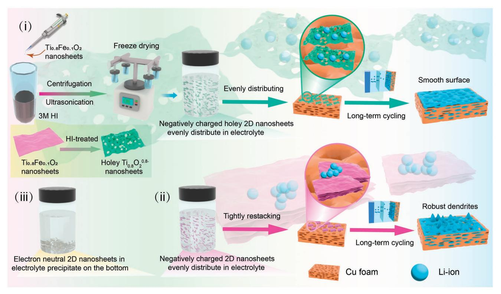
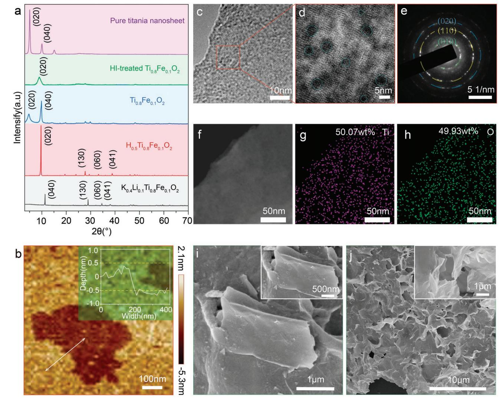
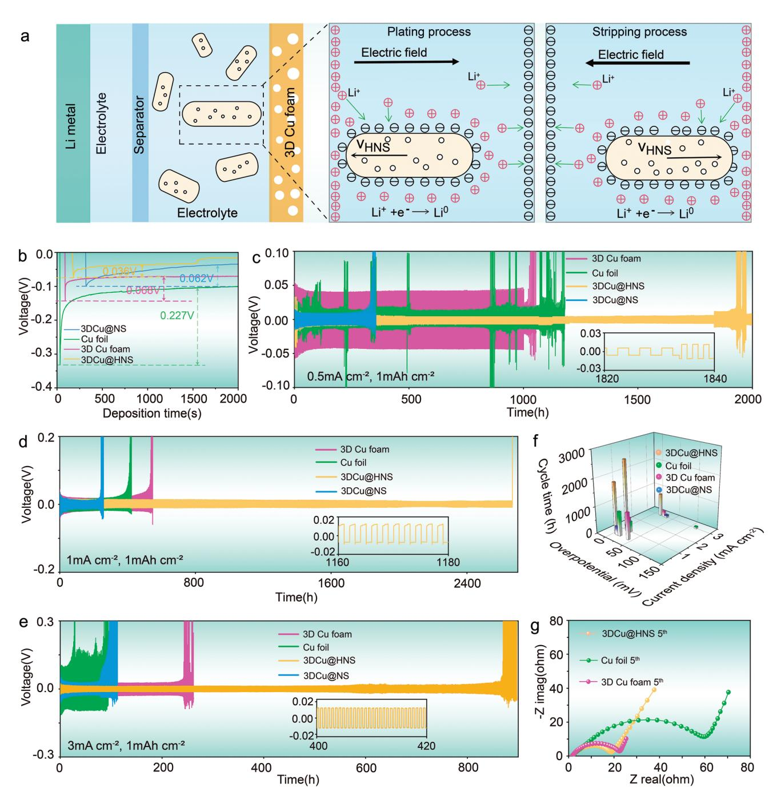
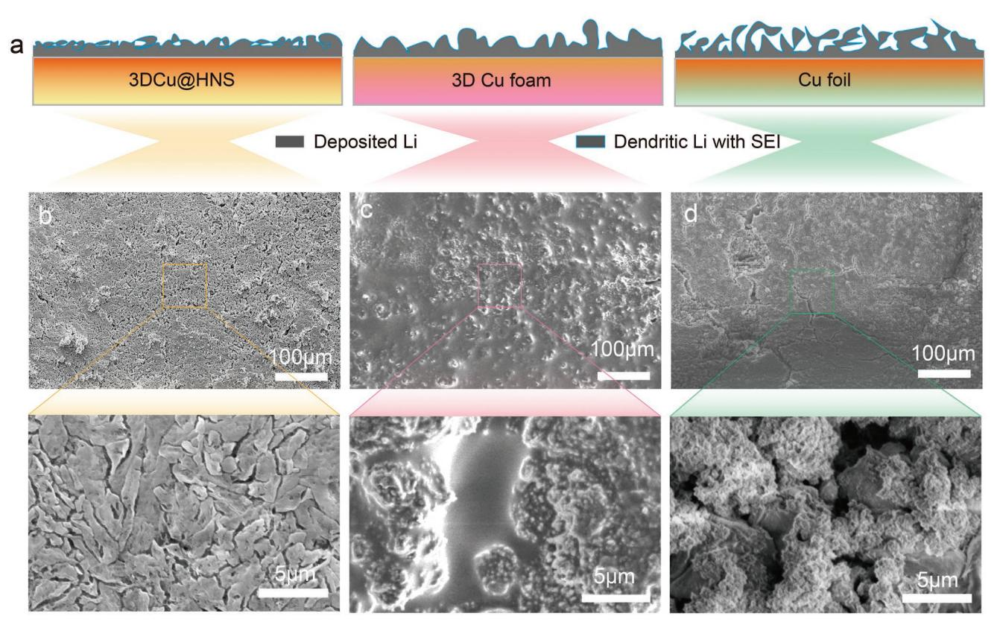
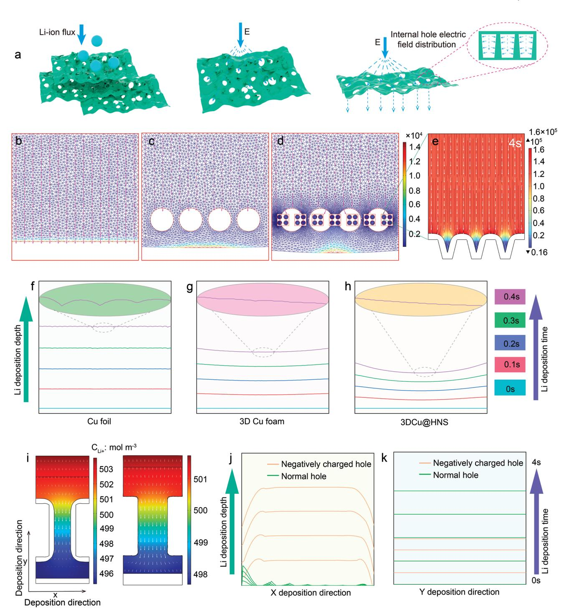
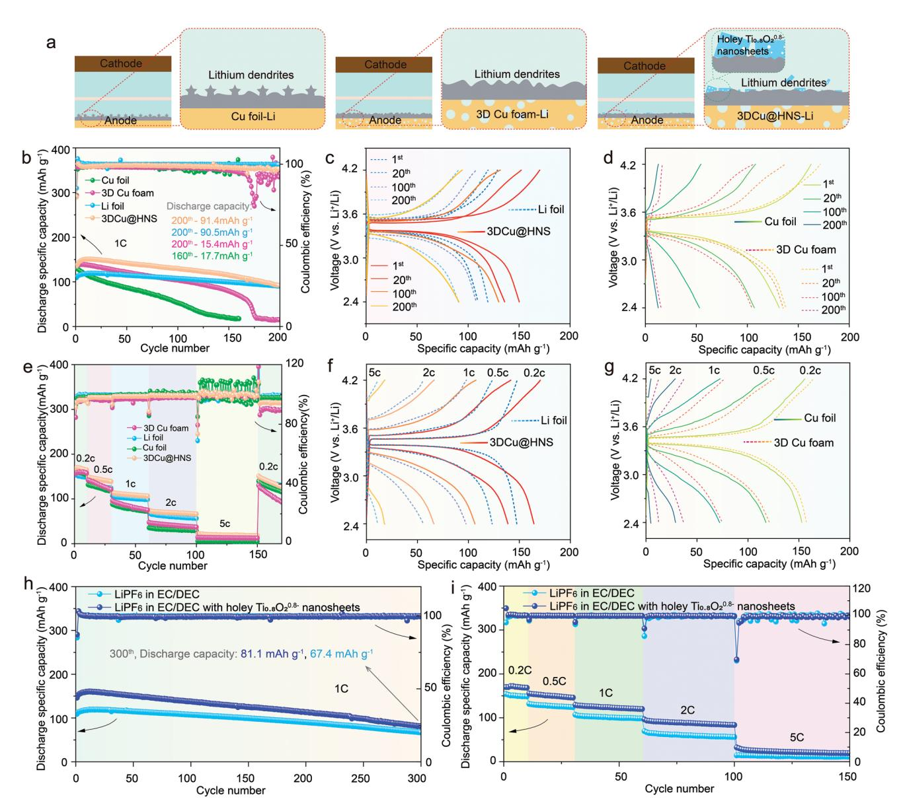

# **Negatively Charged Holey Titania Nanosheets Added Electrolyte to Realize Dendrite-Free Lithium Metal Battery**

*Geng Luo, Dongqing Liu, Jie Zhao, Arshad Hussain, Waseem Raza, Yanyan Wu, Fude Liu, and Xingke Cai\**

**Electrolyte modulation and electrode structure design are two common strategies to suppress dendrites growth on Li metal anode. In this work, a self-adaptive electrode construction method to suppress Li dendrites growth is reported, which merges the merits of electrolyte modulation and electrode structure design strategies. In detail, negatively charged titania nanosheets with densely packed nanopores on them are prepared. These holey nanosheets in the electrolyte move spontaneously onto the anode under electrical field, building a mesoporous structure on the electrode surface. The asformed porous electrode has large surface area with good lithiophilicity, which can efficiently transfer lithium ion (Li+) inside the electrode, and induce the genuine lithium plating/stripping. Moreover, the negative charges and nanopores on the sheets can also regulate the lithium-ion flux to promote uniform deposition of Li metal. As a result, the symmetric and full cells using the holey titania nanosheets containing electrolyte, show much better performance than the ones using electrolyte without holey nanosheets inside. This work points out a new route for the practical applications of Li-metal batteries.**

#### **1. Introduction**

With the increasing demands on the energy density of energy storage devices, the lithium metal anodes with high theoretical capacity (3860 mA h g−1 ) and ultra-low negative potential (-3.045 V versus standard hydrogen electrode) are considered as the ideal anode material for the next generation lithium battery storage systems.[1–5] However, its practical application is impeded by the two major problems, i.e., lithium dendrite

G. Luo, J. Zhao, A. Hussain, W. Raza, F. Liu, X. Cai Institute for Advanced Study Shenzhen University Shenzhen, Guangdong Province 518060, P. R. China E-mail: cai.xingke@szu.edu.cn D. Liu College of Mechatronics and Control Engineering Shenzhen University Shenzhen, Guangdong Province 518060, P. R. China Y. Wu School of Science and Ministry of Industry and Information Technology Key Laboratory of Micro-Nano Optoelectronic Information System Harbin Institute of Technology

Shenzhen, Guangdong Province 518055, P. R. China

The ORCID identification number(s) for the author(s) of this article can be found under https://doi.org/10.1002/smll.202206176.

#### **DOI: 10.1002/smll.202206176**

growth and unstable solid electrolyte interface (SEI), which leads to low coulombic efficiency, capacity fading, and safety issues.[6–10] To solve these problems, various strategies have been proposed, including electrode engineering, electrolyte design, artificial solid electrolyte layer construction, separator film modification, etc.[11–18]

Among all these strategies, the electrolyte modulation and electrode engineering are most effective and widely used. The rational modulation of the electrolyte can promote the robust SEI formation and improves the uniform lithium-ion flux. The related works include the design of high concentration electrolytes, dual-salt/ dual-solvent electrolyte, inorganic additive, organic additive, solid state electrolyte, and so on.[19–25] The electrode engineering is generally used to suppress the dendritic growth through regulating lithium-ion

flux on the anode surface.[26,27] The commonly applied methods include the building of 3D conductive host to decease the local current density and homogenize space charge distribution, and decorating the surface with lithiophilic sites to regulate the uniform lithium nucleation and growth.[28–31] However, either the electrolyte modulation or electrode design has its own advantages and disadvantages. Electrolyte modulation is simple, but not very effective to regulate the ion flux. Electrode engineering can more effectively regulate lithium-ion flux on the electrode surface, but the process is complicated. Therefore, we are thinking the possibility to combine the merits of these two strategies into one.

Considering the simplicity of adding additives into electrolyte, we propose a new method for the rational electrode design through the concept of electrolyte additive. By adding the materials used to construct the 3D electrode into the electrolyte, they will self-assemble into hierarchical structure on the current collector under the electrical field between the cathode and anode. In this case, the electrode modification will be much easier and the homogeneity of the modification on the Li metal anode can also be well controlled, even in large size anodes. However, to realize the proposed idea, several basic requirements should be satisfied: (1) The additives are supposed to be stable for a certain period in the common lithium battery electrolyte; (2) The additives should have charge to move under electric fields to realize self-adaptive electrode surface modification; (3) The

**Scheme 1.** Schematic illustration of the synthetic route of holey titania nanosheets and its advantages as the electrolyte additive compared to the neutral nanosheets and the charged nanosheets without nanopores on them. i) Holey nanosheets with negative charges, i) negatively charged nanosheets, and iii) neutral nanosheets.

additives should organize into suitable structure, which can effectively suppress the lithium dendrites growth.

In this work, we report a holey titania nanosheet, which can fully satisfy all these requirements. Firstly, the holey titania nanosheets are negatively charged because of the large number of Ti vacancies.[32] The electrostatic repulsion force among each nanosheet stabilize them in the high polarity electrolyte (**Scheme 1**). Secondly, the holey titania nanosheets have weak van der Waals force because of the pores on them, which can avoid their restacking into densely packed membrane during the deposition process.[32] Under the electric field between two electrodes, the holey titania nanosheets are stacked into hierarchical porous architecture on the anode. This morphology not only provides high dimensional space for lithium deposition, but also facilitates ion transport within the anode. Thirdly, the titania is lithiophilic and shows no volume change during the Li metal plating/ stripping process, which helps to induce the genuine nucleation of the Li metal and stabilize the SEI.[33,34] Moreover, the negative charges and the nanopores can also help to regulate the Li ion flux close to the current collector surface. As a result, by using the holey titania nanosheets dispersed electrolyte, both the Li/Li symmetric cells and the Li/ LiFePO4 full cell shows much better performance than the ones without them in the electrolyte.

#### **2. Results and Discussion**

The synthetic procedure of the 2D holey nanosheets includes two procedures, the preparation of 2D Ti0.8Fe0.1O2

nanosheets and construction of holey nanostructure on the 2D nanosheet. For the preparation of 2D Ti0.8Fe0.1O2 nanosheets, it includes the following three steps, i.e., the synthesis of alkaline metal contained layered precursor K0 .4Li0.1Ti0.8Fe0.1O2, proton exchange of the alkaline metal ions H0.5Ti0.8Fe0.1O2, and exfoliation of the protonated precursors into Ti0.8Fe0.1O2 nanosheet.[35] The fabrication of the nanopores on the Ti0.8Fe0.1O2 nanosheets was schematically illustrated in Scheme 1, and the photo-images of the samples during the process are shown in Figure S1 (Supporting Information). Firstly, the original Ti0.8Fe0.1O2 was slowly dropped into the HI acidic solution. Then, the sediments were repeatedly washed with ethanol to remove the produced I2. After the freeze-drying process, they were redispersed in the electrolyte for battery applications. The zeta potential of the as prepared HI-treated Ti0.8Fe0.1O2 nanosheet (holey titania nanosheet: Ti0.8O2 0.8−) in water is -38.6 mV, more negative than the original Ti0.8Fe0.1O2 nanosheet (-26.0 mV). According to the electron paramagnetic resonance (EPR) spectra and X-ray Photoelectron Spectroscopy(XPS) (Figure S2, Supporting Information), besides the peak for the oxygen vacancies, a peak corresponding to a g factor value of 1.985, which is related with Ti vacancies,[36] has appeared for the HI-treated Ti0.8Fe0.1O2 sample. It indicates the increased negativity should be due to the removal of the doped Fe atoms to form the vacancies. The good stability of the nanosheets was proven by the photo-images of the electrolyte with them inside. After standing for 4 h, there are negligible sediments at the bottom of the vial (Figure S3, Supporting Information). The good

**Figure 1.** a) The XRD patterns of the nanosheets at different synthetic stages. b) The AFM image and height profile of the holey  $Ti_{0.8}O_2^{0.8-}$  nanosheets. c) The TEM image of a single layer holey  $\text{Ti}_{0.8}\text{O}_2^{0.8-}$  nanosheet, d) the HAADF image of a single layer holey  $\text{Ti}_{0.8}\text{O}_2^{0.8-}$  nanosheet, e) corresponding SAED pattern, f) STEM images, and the corresponding elemental mapping of g) Ti and h) O of the single layer holey  $Ti_{0.8}O_2^{0.8}$  nanosheet. The SEM images of i) 2D  $\text{Ti}_{0.8}\text{Fe}_{0.1}\text{O}_2$  nanosheets and j) holey  $\text{Ti}_{0.8}\text{O}_2^{0.8-}$  nanosheets.

stability of the negatively nanosheets inside the electrolyte confirms the feasibility of the proposed idea.

Then, the material evolution during the synthetic process of the holey  $\text{Ti}_{0.8}\text{O}_2^{0.8-}$  nanosheets has been characterized by various techniques, including X-ray Powder Diffraction (XRD), Scanning Electron Microscopy (SEM), Atomic Force Microscopy (AFM) and Transmission Electron Microscopy (TEM). According to the XRD patterns in Figure 1a, the alkaline metal contained precursor  $K_{0.4}Li_{0.1}Ti_{0.8}Fe_{0.1}O_2$  exhibit layered structure with a peak around 11.3°, corresponding to a layer spacing of 0.78 nm. After protonation, the layer-structured  $H_{0.5}$ Ti0.8Fe0.1O2 was obtained and the (020) peak shifts towards lower angle, indicating the increase of layer spacing at the preexfoliation state.[37] After the mechanical shaking in tetrabutylammonium hydroxide (TBAOH) solution, the exfoliated Ti0.8Fe0.1O2 nanosheets solution was prepared. The XRD pattern of the filtrated Ti0.8Fe0.1O2 nanosheets membrane showed a (020) peak at  $4.7^{\circ}$ , corresponding to a large layer spacing of  $\approx$ 1.86 nm, which is due to the water molecules traption within the interlayer. This layer spacing is similar with the pure titania nanosheet membrane without Fe dopants (1.75 nm,  $2\theta \approx 5.0^{\circ}$ ). However, after the HI acid treatment, the layer spacing shifted to lower layer spacing of 1.0 nm ( $2\theta \approx 8.8^\circ$ ), corresponding to the removal of two water molecule layers. According to our previous report on the highly Fe doped nanosheets  $(Ti_{0.6}Fe_{0.4}O_2)$ ,[32] it is ascribed to the removal of the Fe atoms and the formation of nanopores on the nanosheets.

Afterwards, AFM and TEM have been used to characterize the microstructure and composition of the single sheet after acid treatment. The sheet still shows an integrated structure with a thickness  $\approx$ 1.0 nm, indicating the removal of the low contents of Fe (12.5 at%) would not damage the sheet morphology (Figure 1b). The TEM image demonstrates there are plenty of nanopores on the sheet surface (Figure 1c). The high-resolution TEM image in the high-angle annular dark field (HAADF) model indicates the nanopores are genuinely distributed on the sheets at the nanoscale level (Figure 1d). The crystal structure of the surrounding area can still be clearly identified. The selected area electron diffraction (SAED) pattern shows a d-spacing of 0.30, 0.24, and 0.15 nm, which can be indexed to (010), (110), and (020) crystal planes of titania nanosheets (Figure 1e), coinciding with the XRD results (Figure S4, Supporting Information).[38] Therefore, according to the SAED and high-resolution TEM image, the formation of these pores would not seriously destroy the in-plane structure of the nanosheets but bring defects on them (Figure 1d,e). The STEM image and their corresponding elemental mapping show even elemental distribution of Ti and O atoms of the HI acid treated Fe0.1Ti0.8O2 (Figure 1f–h) without Fe atoms inside. By contrast, the pristine 2D Ti0.8Fe0.1O2 nanosheet (Figure S5, Supporting Information) clearly shows the genuine distribution of Ti, Fe, and O atoms. This result confirms the nanopore formation is due to the removal of Fe atoms from the nanosheets, consistent with the EPR results. The holey titania nanosheet should have a general formula of Ti1-x□xO2 *δ*−, where □ represents metal vacancies.

The assembly behavior of the as obtained holey Ti0.8O2 0.8− nanosheets has been evaluated by dropping them onto the surface of copper foil, and drying them at room temperature prior to SEM observation (Figures 1i,j). The original 2D Ti0.8Fe0.1O2 nanosheets are densely packed into smooth surface. In contrast, the holey Ti0.8O2 0.8− nanosheets are assembled into a porous structure (Figure 1j). This difference on the assembly behavior is similar with our previous report,[ 32] which should be ascribed to the weakened van der Waals force between each holey nanosheet. To directly identify the deposition of the nanosheets on the electrodes under electric field, we added a voltage of ≈30 V between two Al foils, the deposition of the negatively charged holey titania nanosheets in a porous structure onto the anode can be clearly identified from the optical images and SEM images (Figure S6, Supporting Information). The mechanism for this deposition should be similar with the vermiculite sheet, where the small size cations (Li+/TBA+) adsorb on the surface of the negatively charged nanosheets and deposit together on the anode.[39] This experiment proves the feasibility to deposit the holey nanosheets on the surface of current collector by the electric field between two electrodes.

The densely distributed nanopores on the holey Ti0.8O2 0.8− nanosheets and their assembly behavior into hierarchical structure on the copper surface, can provide open channels to facilitate ion transportation and large surface area for the Li metal nucleation on the anode (Figure S7; Table S1, Supporting Information). On the other hand, the good lithiophilicity of the titania materials should also facilitate the Li metal nucleation on the holey titania nanosheet coated current collectors. Therefore, the assembly of the holey Ti0.8O2 0.8− nanosheets in the electrolyte onto the current collector should be able to efficiently suppress the lithium dendrites growth.

To examine the practicability of the strategy by adding the holey titania nanosheets into electrolyte to improve the performance of Li metal anode, we firstly checked the stability of the holey titania nanosheet containing electrolyte under the electrochemical voltage (Figure S8, Supporting Information). It shows even wider voltage window than the electrolyte without them inside, which means the nanosheet would not catalyze the decomposition of the electrolyte and be stable to couple with the conventional cathode materials to construct full cells. Then, the half cells with one electrode of Li metal anode and the other one is the Cu foil/3D Cu foam current collector have been assembled. These half cells were added with different electrolytes, i.e., with and without nanosheet additives. After the deposition of nanosheets on the Cu foam, different current collectors have been formed, including 3D Cu foam@titania nanosheets (3DCu@NS) and 3D Cu foam@holey Ti0.8O2 0.8− nanosheets (3DCu@HNS). In the meantime, the Cu foil and 3D Cu foam have been used for comparison in the symmetric cell configuration. All the half cells were firstly activated by cycling them between 0 V and 1.0 V at 50 µA for 5 cycles (Figure S9, Supporting Information). Then, for the plating/stripping process, the cells were tested at constant current densities of 0.5, 1.0, or 3.0 mA cm−2 with a fixed capacity of 1.0 mA h cm−2 .

The symmetric cell configuration using 3D Cu foam current collector and holey Ti0.8O2 0.8− nanosheets contained electrolyte, as well as the interaction between the electric field force and holey Ti0.8O2 0.8− nanosheets during plating/stripping processes are schematically illustrated in **Figure 2**a. During the first lithium plating process, the lithium ions move toward the anode (Cu foil/foam and Li foil) under the electric field. The negatively charged nanosheets stabilized in the electrolyte would adsorb large amount of positively charged lithium ions on the surface, pushing the nanosheets to be deposited on the current collector. During the following stripping process, the electric field is reversed, the deposited lithium was oxidized into Li+ ions and moved towards the Li counter electrode.[39] The deposited nanosheets assembled together due to the local high concentration of Li+. On the other hand, due to the weak van der Waals force between the holey nanosheets, they were assembled into a porous structure.

According to the lithium deposition profile in Figure 2b, the 3DCu@HNS current collector displays the smallest nucleation overpotential of 36 mV, much lower than the 62 mV for 3DCu@NS based symmetric cell, 68 mV for the 3D Cu foambased cell and 227 mV for the Cu foil based symmetric cell. This indicates the nucleation barrier of the 3D Cu foam can be effectively decreased by the deposition of titania nanosheets, especially the perforated ones. The nucleation overpotential is related with the number of nucleation sites and the energy barrier for the Li metal nucleation. It is reported that metal oxide matrix is lithiophilic.[40] The binding energy of Li with titania is much more negative (-2.34 eV) than that of Li with Cu substrate (-1.21 eV), which is a direct evidence for the lower Li metal nucleation energy barrier on titania nanosheets than on pure Cu foam.[34,41] On the other hand, the smaller Li metal nucleation overpotential for 3DCu@HNS than the 3DCu@NS should be due to their different assembly behavior in Figures 1i,j. The porous structure of the 3DCu@HNS could provide more nucleation sites than the 3DCu@NS. In addition, the more negative charges on the holey Ti0.8O2 0.8− nanosheets than the pristine titania nanosheets should help to attract more solvated lithium ions and co-deposit on the 3D Cu foam current collector, which further alleviates the nucleation barrier.

**www.advancedsciencenews.com**

**www.small-journal.com**

**Figure 2.** a) Schematic illustration of the interaction between the electric field force and holey Ti0.8O2 0.8− nanosheets during plating/stripping processes in 3DCu@HNS based symmetric cells. b) The nucleation overpotential profiles of different current collectors. Galvanostatic cycling of the symmetric cells using different current collectors with fixed Li plating/stripping capacity of 1.0 mAh cm−2 at different current densities: c) 0.5 mA cm−2 , d) 1.0 mA cm−2, and e) 3.0 mA cm−2. f) The 3D plot of the applied current densities, overpotentials and cycle life of the Cu foil, 3D Cu foam, 3DCu@ NS, and 3DCu@HNS. g) The Nyquist plot of EIS after the symmetric cells cycled after the 5th cycles.

The performance of the symmetric cells has been evaluated by the galvanostatic cycling profiles at different current densities (Figure 2c,e), where the overpotential and the cycling stability obtained from these traces can reflect the Li metal plating/stripping behaviors. The 3DCu@HNS based symmetric cells obviously exhibit low overpotentials and long cycle life, even at large current densities of 3.0 mA cm−2 . In contrast, the other three symmetric cells show larger overpotentials and obvious voltage fluctuations over short-term lifespan. The detailed overpotentials and cycle life of the four current collectors at different current densities are summarized in Figure 2f and Table S2 (Supporting Information). Impressively, the 3DCu@HNS based cells deliver equivalent ultra-low overpotentials of 6.0, 11.0, and 16.0 mV during the cycling at 0.5, 1.0, and 3.0 mA cm−2 , respectively, showing competitive electrochemical performance with other reported works (Table S3, Supporting Information). Such low overpotential at wide current density range has rarely been reported in literature, which demonstrates the superb rate capability and fast reaction kinetics at the 3DCu@HNS surface during the lithium plating/stripping process. This result should be beneficial from the large surface area of the 3DCu@HNS, the good Li ion transportation in the electrode surface due to the nanopores on the nanosheets and their hierarchical assembly, the good lithiophilicity of the holey titania nanosheets as well as the better ionic conductivity (0.92) of the electrolyte with the holey titania nanosheets inside (Figure S10; Table S4, Supporting Information).

On the other hand, the 3DCu@HNS based symmetric cell also shows ultra-long cycling lifespan, >2600 h when cycled at 1.0 mA cm−2 with a capacity of 1.0 mAh cm−2 . The cycling stability of the symmetric cell is related with the SEI stability and the lithium dendrites growth. The much better cycling stability of the 3DCu@HNS based cell can be ascribed to its good suppression on the Li dendrites growth and the formation of a stable SEI on the 3DCu@HNS. Our previous work indicates the hierarchical lithiophilic surface can induce the genuine plating of Li metal and the formation of flat SEI on the surface,[42] which should also be suitable to the current situation. Other possible contributions to the excellent stability will be discussed and confirmed in the later sections. Noteworthy, the 3DCu@NS based symmetric cell shows even poorer cycling stability than the pristine 3D Cu foam, and even the Cu foil, based ones. We can identify from Figure 1i that the pure titania nanosheets are densely stacked on the surface of the 3D Cu foam, blocking the contact of the deposited Li metal with the Cu current collector. As a result, the electron transportation from the deposited Li metal onto the current collector is quite difficult, reducing the reaction kinetics. Only the gap on the titania nanosheet film can facilitate the formation of Li metal, leading to the uneven deposition of the Li metal and the easy formation of Li metal dendrites. Therefore, all the results indicate the pores on the nanosheets, and their assembly behavior has a big influence on the Li metal plating/stripping behavior.

According to the above discussions, both the Li metal plating/stripping overpotential and cycling stability are tightly related with the interfacial reaction kinetics. Then, the electrochemical impedance spectroscopy (EIS) has been used to confirm their interfacial resistance after Li metal plating. The EIS spectra of the symmetric cells (Cu foil, 3D Cu foam, and 3DCu@HNS) were measured after the 5th and 50th cycles. The as obtained Nyquist plots were analyzed with Zview software and fitted with equivalent circuit (Figure S11, Supporting Information). The fitted values include three key resistances: *R*s refers to the ohmic resistance, *R*SEI relates to the resistance of SEI, and *R*ct is the charge transfer resistance. During the initial cyclic stage after 5 cycles, the 3DCu@HNS cell displays lower interfacial resistance (*R*SEI = 1.55 Ω) and charge transfer resistance (*R*ct = 16.86 Ω) than the Cu foil/3D Cu foam-based cell (Figure 2g; Table S5, Supporting Information). After 50 cycles (Figure S12, Supporting Information), the impedance of all electrodes decreases to smaller values. The *R*SEI and *R*ct of 3DCu@HNS cell are 1.02 Ω and 1.21 Ω, respectively, after 50 cycles, still lower than the values for the other two cells. The *R*SEI can indirectly reflect the quality of the SEI, which indicates a more stable SEI with lower resistance has been formed on the 3DCu@HNS to show longer cycle life. The *R*ct is a direct reflection of the reaction kinetics at the interface, which is related with the lithium dendrites growth. The smaller the *R*ct, the lower overpotential for cycling and the better suppression on Li dendrites growth. Therefore, the EIS study also indicates that the effectiveness of the holey titania nanosheets to suppress the Li dendrites growth and the formation of a stable SEI. Noteworthy, the ohmic resistance Rs of 3DCu@HNS based cell is 1.66 Ω, higher than that of Cu foil (1.51 Ω) and 3D Cu foam (1.31 Ω) after 50 cycles (Table S5, Supporting Information). This might be ascribed to the high void space of the 3DCu@HNS sample, which is filled with dead lithium upon long-term cycles (Figure S13, Supporting Information).[43]

To directly identify the influence of the holey titania nanosheets on the SEI formation and the Li dendrites growth, we further studied the morphology change by SEM from top and cross-section views of the Cu foil, 3D Cu foam and 3DCu@ HNS after plating/stripping for 100 cycles at 1.0 mA cm−2 with a capacity of 1.0 mA h cm−2 (**Figure 3**a and S14). For the Li plated 3DCu@HNS electrode, it displays a flat surface (Figure 3b), indicating the formation of uniform SEI and the genuine deposition of Li metal. By contrast, the surfaces of the other two electrodes are rather rough and even show cracks (Figures 3c,d). This agrees with the stable operation for the 3DCu@ HNS based symmetric cell with low voltage hysteresis but the shorter lifespan and larger overpotential for the Cu foil/3D Cu foam based symmetric cells in Figures 2c–f. The thickness of the Li metal on the surface of the current collectors have been checked by SEM to reflect the density of the Li metals. In Figure S14 (Supporting Information), the deposition thickness of the 3DCu@HNS electrode is 30.4 µm after repeated Li plating/stripping for 100 cycles, less than the 39.2 µm of Cu foil and 35.4 µm of 3D Cu foam. This result indicates the holey titania nanosheets also helps to induce the dense lithium deposition on the 3D Cu foam. In addition, we also characterized the influence of the holey nanosheets on the separator. During the cycling process, the holey nanosheets in the electrolyte would not attach on the separator to block the channel, but only deposit on the Li metal anode (Figure S15–S17, Supporting Information). It means the influence of the holey nanosheets on the separator performance can be excluded. Therefore, the above morphology comparison further verified that the holey titania nanosheets on the 3D Cu foam surface can not only promote the Li metal genuine deposition because of the increase nucleation sites by the large lithiophilic surface, but also optimize the Li ion flux close to the 3D Cu foam surface to deposit in a more compact and flat way.

Then, the regulation effect of the negatively charged 2D Ti0.8O2 0.8− nanosheets on the lithium-ion flux has been studied by COMSOL simulation to uncover the mechanism for inducing the genuine/dense Li metal deposition behavior (Figure S18, Supporting Information). At first, we consider the nanopore morphology of the holey titania nanosheets to modulate the lithium-ion flux and its deposition behavior through the regulation of the electrical field close to the current collector (**Figure 4**a). The deposition behavior on the Cu foil and 3D Cu foam structure has been used for comparison (Figures 4b,c).

**Figure 3.** a) Schematic illustrations of the three kinds of Li deposited current collectors. SEM images of b) 3DCu@HNS, c) 3D Cu foam, and d) Cu foil electrodes disassembled from the symmetric cells after 100 cycles.

With the introduction of porous architecture to the 3D Cu foam, the original vertical electric field will show an additional lateral proportion close to the pores, which is different from the case of the Cu foil (Figure S19a,b, Supporting Information). For the 3DCu@HNS sample, the introduction of the holey titania nanosheets will further introduce pores onto the surface of the 3D Cu foam. As a result, the lateral field was further increased (Figures 4d,e; Figure S19c). During the simulation process, the electrical field change with time close to the pores has also been considered (Figure S19d,e, Supporting Information). The simulated deposition profiles with time on the three kinds of current collectors are shown in Figures 4f–h, where the Li metal is deposited on the Cu foil surface and the pore edge of the 3D Cu foam and 3DCu@HNS. Typically, after 0.4 s deposition time, we can see the Li metal surface for 3DCu@HNS is much smoother than the Cu foil and 3D Cu foam. This result indicates that the effectiveness of the nanopores on the titania nanosheets to guide the genuine deposition of the lithium ions and suppress their vertical growth along *y*-axis into dendrites.

Second, we further calculated the lithium deposition behaviors after adding the negative charges onto the pores based on the models in Figure 4i. It is found that the negative charges can induce the Li ion flux to deposit both along the lateral and vertical directions (Figures 4j,k). By contrast, the neutral hole only shows vertical deposition of the Li metal. As a result, the negative charges can further suppress the Li dendrites growth along the *y*-axis by diverting the Li ion flux to deposit along the *x*-axis direction.

Therefore, based on the SEM results of the current collectors after cycling and COMSOL simulation results, the good suppression on the Li dendrites growth is not only related with the assembled large surface of the holey titania nanosheets and their good lithiophilicity, which can increase the number of nucleation sites and reduce the nucleation energy barrier, but also related with the nanopores and negative charges on the nanosheets, which can regulate the genuine deposition of the Li ion flux. As a result, the 3DCu@HNS based symmetric cells shows much better cycling stability and overpotential than the Cu foil/3D Cu foam based symmetric cells.

The effectiveness of 3DCu@HNS current collector to suppress the lithium dendrites growth was further examined in the Li/LiFePO4 (LFP) full cell. The cyclic performance and rate capability of the 3DCu@HNS based Li/LFP full cell is compared with the full cells using Li deposited Cu foil/3D Cu foam and Li foil as anodes and LFP as cathodes, as illustrated in the **Figure 5**a. According to the full cells cycled at 1.0 C in Figure 5b, the 3DCu@HNS based full cell displays initial capacity of 150.2 mA h g−1 , experiences a short-term activation, and sustains capacity retention of 63.3% after 200 cycles. Whereas, the Cu foil and 3D Cu foam based full cell exhibits lower specific capacities and degrade rapidly after 170 cycles. The Li foil based full cell shows a lower initial capacity than the 3D Cu foam and 3DCu@HNS based full cell, but better cycling stability than them. After 200 cycles, the Li foil based full cell shows a capacity retention of 79.0%. Their corresponding voltage profiles at the 1st, 20th, 100th, and 200th cycles during

**www.small-journal.com**

**www.small-journal.com**

**Figure 4.** a) Illustration of Li-ion redistribution behavior on the holey 2D Ti0.8O2 0.8− nanosheets-protected Li metal anode. COMSOL simulations of the lithium plating behaviors of the b) Cu foil, c) 3D Cu foam and d) 3DCu@HNS electrodes based symmetric cells at a current density of 1 mA cm−2 ; inplot arrows: the direction of electric field distribution (V/m), in-plot surface color: the Li-ion concentration distribution (mol m−3 ). e) The simulation for negatively charged holey structures of 2D Ti0.8O2 0.8− nanosheets discharging at 0.1 mA cm−2 after 4 s deposition; in-plot streamline: Li-ion flux, in-plot arrows: the direction of electric field distribution (V/m), in-plot surface color: the Li-ion concentration distribution (mol m−3 ). The simulation results of the morphological evolution of Li deposited current collectors: f) Cu foil, g) 3D Cu foam, and h) 3DCu@HNS. Simulation of the morphological evolution for i) the holey structures with (left)/without (right) negative charges at 1 µA m−2 for different periods (0–4s). Their corresponding simulative thickness in the j) *x*-direction and k) *y*-direction, respectively.

the cycling process at 1.0 C are compared in Figures 5c,d. The 3DCu@HNS based full cell displays lower overpotentials than those of the Cu foil and 3D Cu foam based full cells, and even lower than the Li foil based full cells, which means a smaller polarization and faster reaction kinetics happen on the 3DCu@ HNS. Therefore, the better initial capacity on the 3D Cu foam

**www.advancedsciencenews.com**

**www.small-journal.com**

**Figure 5.** The electrochemical performance of full cells assembled using different current collectors and electrolytes with/without holey titania nanosheets added. a) Schematic illustration of the lithium deposited interface morphology when applying different current collector as anodes. b) The cyclic performance of the full cells cycled at 1.0 C. Their corresponding specific voltage-capacity profiles of the c) 3DCu@HNS versus Li foil based full cells and d) Cu foil versus 3D Cu foam based full cells at 1st, 20th, 100th, and 200th cycles. e) The rate performance of the full cells (0.2, 0.5, 1.0, 2.0, and 5.0 C). Their corresponding capacity-voltage profiles from 0.2 to 5.0 C: f) 3DCu@HNS and Li foil based full cells, g) Cu foil and 3D Cu foam based full cells. h) The cycling performance of the Li foil based full cells using LiPF6 electrolyte with or without holey titania nanosheets cycled at 1.0 C. i) The rate performance of the Li foil based full cells using LiPF6 electrolyte with or without holey titania nanosheets from 0.2 to 5.0 C.

and 3DCu@HNS based full cell should be ascribed to the larger surface area of the current collectors, which can provide more plating/stripping sites than the Li foil. On the other hand, the large specific area of the 3DCu@HNS leads to the severe consumption of the electrolyte without Li compensation, which contributes to the continuous decrease of cycling capacity.

The rate capability in Figures 5e-g showed that the 3DCu@ HNS based full cells display specific capacities of 164.2, 138.7, 106.4, 66.2, and 18.1 mAh g−1 from 0.2 C to 5.0 C, higher than the other cells, which also reflects its better reaction kinetics. However, after 150 cycles, the capacity became lower than the Li foil based full cell, due to the poor cycling stability ascribed to the electrolyte consumption. Apparently, for practical applications, excessive Li is necessary to compensate the by-products formed on the large surface of the 3DCu@HNS.

To avoid the influence of the lack of Li on the battery performance, we also added the holey titania nanosheet containing LiTFSI/LiPF6 based electrolytes into Li foil/Li foil symmetric cell and Li foil/LiFePO4 full cell, respectively. According to the symmetric cell tests at 1.0/3.0 mA cm−2 with a fixed cycling capacity of 1.0 mAh cm−2 in Figure S20 (Supporting Information), the cell using holey titania nanosheet contained electrolyte displays

**www.small-journal.com**

obviously lower voltage hysteresis and longer cycle life than the one without holey titania nanosheets inside the electrolyte, demonstrating the universality of the holey titania nanosheets in electrolytes to improve various Li metal anode performance. The SEM images on the Li foil surfaces also indicate the titania nanosheets formed a hierarchical structure to suppress the surface roughness (Figure S21, Supporting Information). For the cyclic durability at 1.0 C (Table S6, Supporting Information) and rate capability from 0.2 to 5 C of Li foil||LiFePO4 full cells in Figures 5h,i; Figure S22,S23 (Supporting Information), the ones using holey titania nanosheets containing electrolyte show higher charge/discharge capacities than the ones using common electrolyte. We also tried this holey titania nanosheet contained electrolyte in the Li||NCM811 full cells, which shows a capacity of 141.2 mA h g−1 after 100 cycles at 1C, higher than the full cell without holey titania nanosheets in the electrolyte (122.2 mAh g−1 after 100 cycles at 1C, Figure S24, Supporting Information). The above results provide supportive evidence for the positive role of the holey titania nanosheet in promoting homogenous lithium plating/stripping, and improving the reaction kinetics no matter the electrode substrate.

#### **3. Conclusion**

In summary, we have introduced a simple and scalable strategy for high performance Li metal anode by adding the negatively charged holey titania nanosheets into the electrolyte. These nanosheets self-assembled on the anode under the electrical field between the two electrodes of the cell, leading to the formation of a hierarchical titania nanosheet surface with open Li ion channels. The large lithiophilic surface of the titania nanosheets modified electrode results in the great increase of the Li metal nucleation sites and the decrease of local current density; in addition, the negative charges and nanopores on the holey titania nanosheets can also regulate lithium-ion flux to show genuine deposit along both the lateral direction and the thickness direction. As a result, the Li dendrites growth has been greatly suppressed, and the Li metal plating/stripping kinetics has been accelerated. The advantages of such holey titania nanosheets containing electrolyte has been successfully displayed in different cells (Li/Li symmetric cell and Li/LiFePO4 full cell) with different electrolytes (LiTFSI and LiPF6 based electrolytes) and different anodes (3D Cu foam and Li foil), demonstrating the universality of such method to enhance the performance for Li metal-based batteries. Considering the simplicity and effectiveness of the current method, it may open up a new field to rationally design inorganic additives inside the electrolyte and enhance the Li metal battery performance. Moreover, given the current strategy is different from the conventional electrolyte modulation and electrode structure design strategy, but a combination of them, it points out the effectiveness of designing new strategies for the practical applications of Li-metal batteries.

## **Supporting Information**

Supporting Information is available from the Wiley Online Library or from the author.

#### **Acknowledgements**

This work was supported by Natural Science Foundation of China (No. 52003163 and 22105129), Guangdong Basic and Applied Basic Research Foundation (No. 2022A1515010670 and 2022A1515011048), Science and Technology Innovation Commission of Shenzhen (No. JCYJ20200109105618137 and 20200812112006001), and NTUT-SZU Joint Research Program (No. 2022005 and 2022015). The authors thank the help from electron microscopy center in Shenzhen University for checked the high-resolution images of holey nanosheets by the aberration corrected HAADF STEM.

# **Conflict of Interest**

The authors declare no conflict of interest.

#### **Data Availability Statement**

The data that support the findings of this study are available in the supplementary material of this article.

### **Keywords**

holey titania nanosheets, Li metal anodes, lithiophilicity, self-adaptive electrodes

> Received: October 8, 2022 Revised: November 26, 2022 Published online: January 1, 2023

- [1] T. Zhou, J. Shen, Z. Wang, J. Liu, R. Hu, L. Ouyang, Y. Feng, H. Liu, Y. Yu, M. Zhu, *Adv. Funct. Mater.* **2020**, *30*, 1909159.
- [2] J.-M. Tarascon, M. Armand, *Nature* **2001**, *414*, 359.
- [3] W. Xu, J. Wang, F. Ding, X. Chen, E. Nasybulin, Y. Zhang, J.-G. Zhang, *Energy Environ. Sci.* **2014**, *7*, 513.
- [4] Y. Guo, H. Li, T. Zhai, *Adv. Mater.* **2017**, *29*, 1700007.
- [5] D. Lin, Y. Liu, Y. Cui, *Nat. Nanotechnol.* **2017**, *12*, 194.
- [6] C. Wang, C. Yang, Z. Zheng, *Adv. Sci.* **2022**, *9*, 2105213.
- [7] C. Yang, K. Fu, Y. Zhang, E. Hitz, L. Hu, *Adv. Mater.* **2017**, *29*, 1701169.
- [8] C.-P. Yang, Y.-X. Yin, S.-F. Zhang, N.-W. Li, Y.-G. Guo, *Nat. Commun.* **2015**, *6*, 8058.
- [9] X. Gao, Y.-N. Zhou, D. Han, J. Zhou, D. Zhou, W. Tang, J. B. Goodenough, *Joule* **2020**, *4*, 1864.
- [10] Y. Cheng, X. Yang, M. Li, X. Li, X. Lu, D. Wu, B. Han, Q. Zhang, Y. Zhu, M. Gu, *Nano Lett.* **2022**, *22*, 4347.
- [11] Y. Guo, X. Chen, Y. Xie, Z. Shen, Y. Ling, X. Xue, Y. Tong, J. Wang, W. Zhang, J. Zhao, *Mater. Today Commun.* **2022**, *31*, 103597.
- [12] R. Chen, A. M. Nolan, J. Lu, J. Wang, X. Yu, Y. Mo, L. Chen, X. Huang, H. Li, *Joule* **2020**, *4*, 812.
- [13] Y. Guo, Q. Wu, L. Liu, G. Li, L. Yang, X. Wang, Y. Ma, Z. Hu, *Adv. Sci.* **2022**, *9*, 2200411.
- [14] S. Kim, T. K. Lee, S. K. Kwak, N.-S. Choi, *ACS Energy Lett.* **2022**, *7*, 67.
- [15] Z. Huang, Z. Li, M. Zhu, G. Wang, F. Yu, M. Wu, G. Xu, S.-X. Dou, H.-K. Liu, C. Wu, *Nano Lett.* **2021**, *21*, 10453.
- [16] Y. Zhou, X. Zhang, Y. Ding, J. Bae, X. Guo, Y. Zhao, G. Yu, *Adv. Mater.* **2020**, *32*, 2003920.
- [17] M. S. Kim, Z. Zhang, P. E. Rudnicki, Z. Yu, J. Wang, H. Wang, S. T. Oyakhire, Y. Chen, S. C. Kim, W. Zhang, D. T. Boyle, X. Kong,

**www.advancedsciencenews.com**

R. Xu, Z. Huang, W. Huang, S. F. Bent, L. W. Wang, J. Qin, Z. Bao, Y. Cui, *Nat. Mater.* **2022**, *21*, 445.

- [18] Z. Ju, Q. Xie, O. Sheng, X. Wu, Y. Tan, M. Hong, X. Tao, Z. Liang, *Nano Lett.* **2022**, *22*, 5473.
- [19] D. Kuai, P. B. Balbuena, *ACS Appl. Mater. Interfaces* **2022**, *14*, 2817.
- [20] J. Yang, M.-T. F. Rodrigues, S.-B. Son, J. C. Garcia, K. Liu, J. Gim, H. Iddir, D. P. Abraham, Z. Zhang, C. Liao, *ACS Appl. Mater. Interfaces* **2021**, *13*, 40502.
- [21] B. Jiang, H. Xu, X. Cheng, J. Li, H. Wang, Y. Liu, *ChemElectroChem* **2022**, *9*, 202101251.
- [22] S. Li, G. Sun, M. He, H. Li, *ACS Appl. Mater. Interfaces* **2022**, *14*, 20962.
- [23] Q. Zhao, S. Stalin, C.-Z. Zhao, L. A. Archer, *Nat. Rev. Mater.* **2020**, *5*, 229.
- [24] L.-Y. Chou, Y. Ye, H. K. Lee, W. Huang, R. Xu, X. Gao, R. Chen, F. Wu, C.-K. Tsung, Y. Cui, *Nano Lett.* **2021**, *21*, 2074.
- [25] D. Liu, Q. Yu, S. Liu, K. Qian, S. Wang, W. Sun, X.-Q. Yang, F. Kang, B. Li, *J. Phys. Chem. C* **2019**, *123*, 12797.
- [26] L. Ye, M. Liao, B. Wang, H. Peng, *Chem. Eur. J.* **2022**, *28*, 202103300.
- [27] Z. Huang, Z. Han, B. Jiang, Y. Zhang, S. Gu, C. Zhang, Z. Pan, H. Nishihara, Q.-H. Yang, W. Lv, *Adv. Mater. Interfaces* **2022**, *9*, 2200457.
- [28] J. Zhang, H. Chen, M. Wen, K. Shen, Q. Chen, G. Hou, Y. Tang, *Adv Funct Mater* **2022**, *32*, 2110110.
- [29] T. Liu, Y.-Q. Zhang, Y. Huang, R.-T. Wang, S.-Q. Zhou, P.-F. Sun, J.-J. Chen, *Adv. Energy Sustainability Res.* **2022**, *3*, 2100186.
- [30] C. Guo, Y. Guo, R. Tao, X. Liao, K. Du, H. Zou, W. Zhang, J. Liang, D. Wang, X.-G. Sun, S.-Y. Lu, *Nano Energy* **2022**, *96*, 107121.

- [31] Y. Lv, Q. Zhang, C. Li, C. Ma, W. Guan, X. Liu, Y. Ding, *ACS Sustainable Chem. Eng.* **2022**, *10*, 7188.
- [32] Y. Li, J. J. G. Moreno, Z. Song, D. Liu, M. Wang, A. Ramiere, Z. Feng, Q. J. Niu, T. Sasaki, X. Cai, *ACS Appl. Mater. Interfaces* **2022**, *14*, 18513.
- [33] M. Wagemaker, G. J. Kearley, A. A. van Well, H. Mutka, F. M. Mulder, *J. Am. Chem. Soc.* **2003**, *125*, 840.
- [34] J. Sun, Y. Cheng, H. Zhang, X. Yan, Z. Sun, W. Ye, W. Li, M. Zhang, H. Gao, J. Han, D.-L. Peng, Y. Yang, M.-S. Wang, *Nano Lett.* **2022**, *22*, 5874.
- [35] L. Wang, T. Sasaki, *Chem. Rev.* **2014**, *114*, 9455.
- [36] S.-M. Wu, X.-L. Liu, X.-L. Lian, G. Tian, C. Janiak, Y.-X. Zhang, Y. Lu, H.-Z. Yu, J. Hu, H. Wei, H. Zhao, G.-G. Chang, G. V. Tendeloo, L.-Y. Wang, X.-Y. Yang, B.-L. Su, *Adv. Mater.* **2018**, *30*, 1802173.
- [37] Y. Tian, J. G. Moreno, Z. Lu, L. Li, M. Hu, D. Liu, Z. Jian, X. Cai, *Chem. Eng. J.* **2021**, *407*, 127198.
- [38] X. Cai, N. Sakai, T. C. Ozawa, A. Funatsu, R. Ma, Y. Ebina, T. Sasaki, *ACS Appl. Mater. Interfaces* **2015**, *7*, 11436.
- [39] Q. Ma, X. Sun, P. Liu, Y. Xia, X. Liu, J. Luo, *Angew Chem. Int. Ed.* **2019**, *58*, 6200.
- [40] J. Pu, J. Li, K. Zhang, T. Zhang, C. Li, H. Ma, J. Zhu, P. V. Braun, J. Lu, H. Zhang, *Nat. Commun.* **2019**, *10*, 1896.
- [41] X. Chen, X.-R. Chen, T.-Z. Hou, B.-Q. Li, X.-B. Cheng, R. Zhang, Q. Zhang, *Sci. Adv.* **2019**, *5*, 7728.
- [42] G. Luo, X. Yin, D. Liu, A. Hussain, F. Liu, X. Cai, *ACS Appl. Mater. Interfaces* **2022**, *14*, 33400.
- [43] R. Mukherjee, A. V. Thomas, D. Datta, E. Singh, J. Li, O. Eksik, V. B. Shenoy, N. Koratkar, *Nat. Commun.* **2014**, *5*, 3710.

