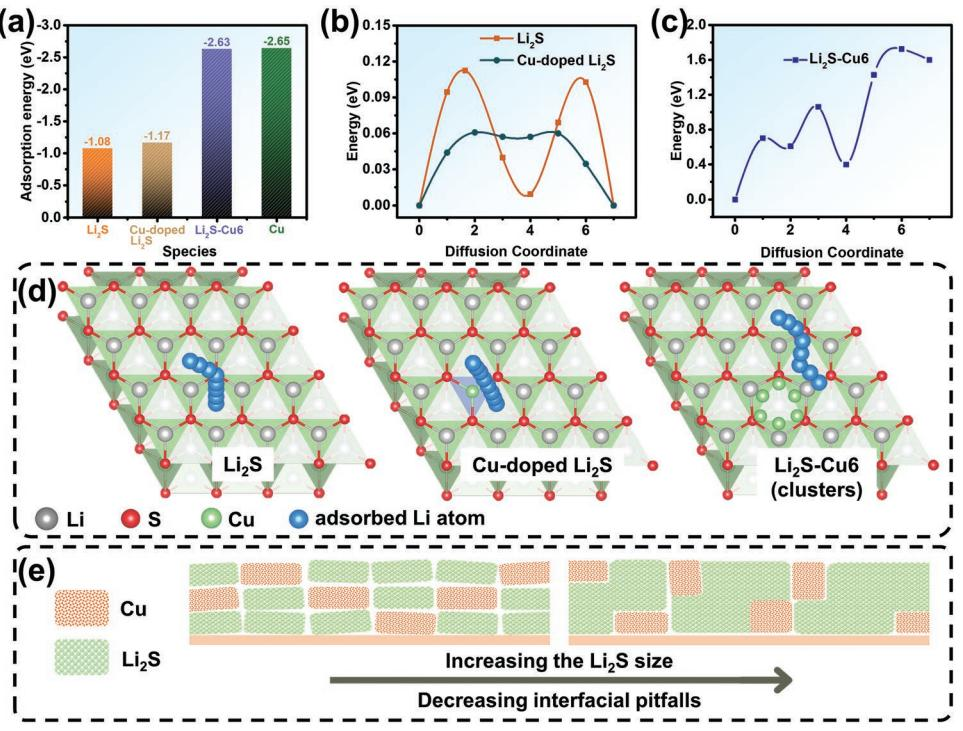
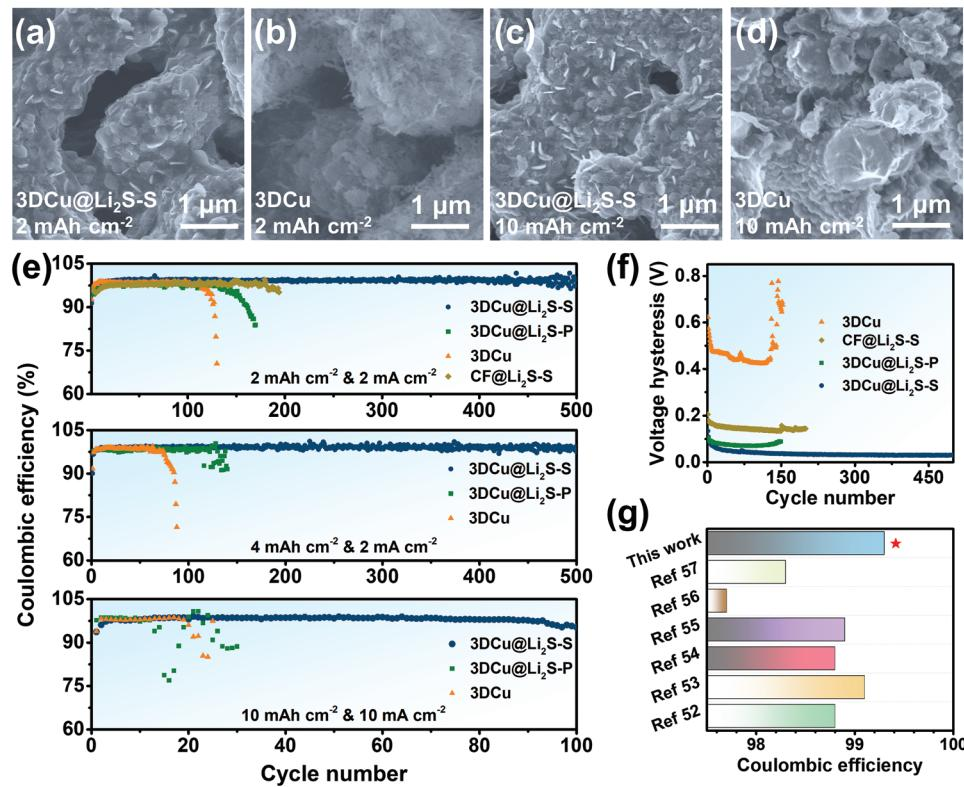
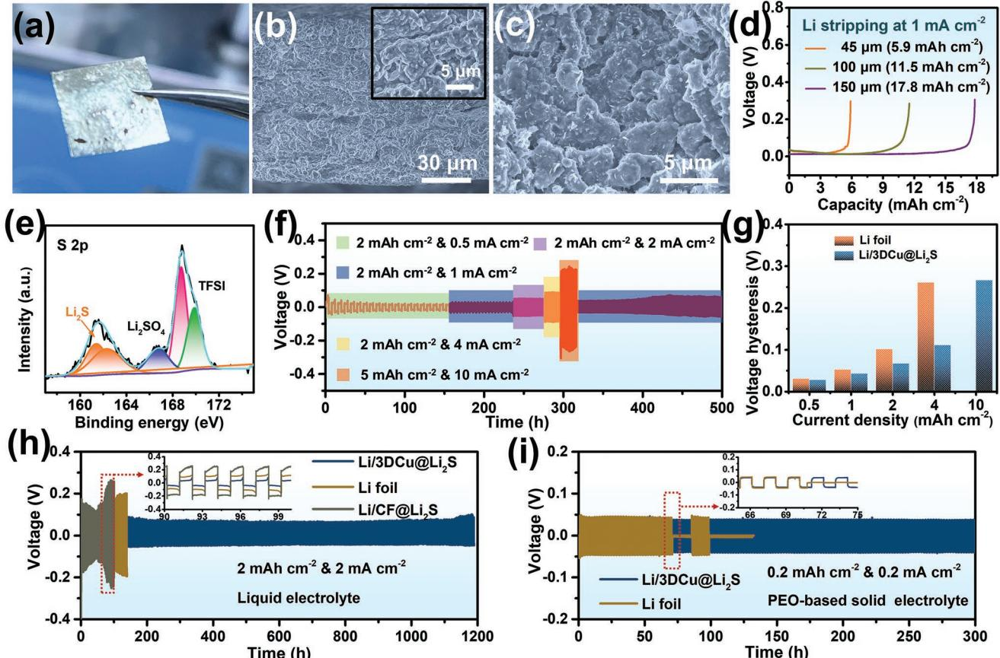
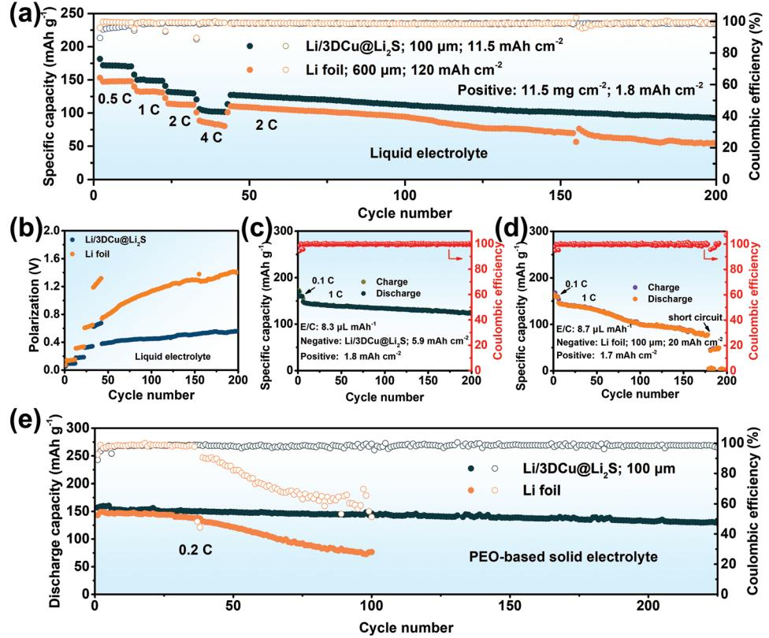

# **Decreasing Interfacial Pitfalls with Self-Grown Sheet-Like Li2S Artificial Solid-Electrolyte Interphase for Enhanced Cycling Performance of Lithium Metal Anode**

*Rui Zhang, Biao Chen, Chunsheng Shi,\* Junwei Sha, Liying Ma, Enzuo Liu, and Naiqin Zhao*

**Constructing a 3D composite Li metal anode (LMA) along with the engineering of artificial solid electrolyte interphase (SEI) is a promising strategy for achieving dendrite-free Li deposition and high cycling stability. The nanostructure of artificial SEI is closely related to the performance of the LMA. Herein, the self-grown process and morphology of in situ formed Li2S during lithiation of Cu***x***S is studied systematically, and a large-sized sheet-like Li2S layer as an artificial SEI is in situ generated on the inner surface of a 3D continuous porous Cu skeleton (3DCu@Li2S-S). The sheet-like Li2S layer with few interfacial pitfalls (Cu/Li2S heterogeneous interface) possesses enhanced diffusion of Li ions. And the continuous porous structure provides transport channels for lithium-ion transport. As a result, the 3DCu@Li2S-S presents a high Coulombic efficiency (99.3%), long cycle life (500 cycles), and high-rate performance (10 mA cm−2 ). Furthermore, Li/3DCu@Li2S anode fabricated by thermal infusion method inherits the synergistic advantages of sheet-like Li2S and continuous porous structure. The Li/3DCu@Li2S anode shows significantly enhanced cycling life in both liquid and solid electrolytes. This work provides a new concept to design artificial SEI for LMA with high safe and high performance.**

### **1. Introduction**

High-energy-density rechargeable batteries are attracting growing attention due to the urgent demand for long-range electric vehicles.[1–3] Rechargeable lithium metal batteries (LMBs) have been regarded as the most promising highenergy storage devices because the highest theoretical capacity (3860 mAh g−1 ) and lowest electrochemical potential (−3.04 V

| R. Zhang, B. Chen, C. Shi, J. Sha, L. Ma, E. Liu, N. Zhao                                                                          |
|------------------------------------------------------------------------------------------------------------------------------------|
| School of Materials Science and Engineering and Tianjin                                                                            |
| Key Laboratory of Composite and Functional Materials                                                                               |
| Tianjin University                                                                                                                 |
| Tianjin 300350, China                                                                                                              |
| E-mail: csshi@tju.edu.cn                                                                                                           |
| N. Zhao                                                                                                                            |
| Collaborative Innovation Centre of Chemical                                                                                        |
| Science and Engineering (Tianjin)                                                                                                  |
| Tianjin 300072, China                                                                                                              |
| The ORCID identification number(s) for the author(s) of this article can be found under https://doi.org/10.1002/smll.202208095. |

**DOI: 10.1002/smll.202208095**

vs the standard hydrogen electrode) of lithium metal anode (LMA).[4–6] Unfortunately, the practical application of LMA has been hindered by its high reactivity and large volume variation during cycling.[7,8] The uneven Li deposition and huge volume change cause dendritic Li growth and solid electrolyte interphase (SEI) fracture, leading to the side reactions between Li anode and electrolyte and consuming active materials.[9–12] Besides, the extreme growth of Li dendrites would result in an internal short circuit. And the Li dendrites are easily detached from the anode, causing loss of metallic Li ("dead Li").[13]

To address the Li dendrite issue, tremendous efforts have been made to achieve homogeneous Li deposition. Lithiophilic electrodes have been fabricated to guide uniform Li nucleation and suppress the Li dendrites.[14–17] Enhancing the stability of SEI film by modifying electrolytes, or fabricating an artificial SEI layer has

also been proved to avoid the side reactions and suppress the Li dendrites.[18–21] But the above-mentioned methods based on 2D LMA cannot alleviate the intrinsic structural volume change during Li plating/stripping. By comparison, 3D Li hosts have been utilized to fabricate 3D LMA, which provides a confined space for Li deposition without significant volume changes. Meanwhile, the 3D structure can alleviate the local current density and prevent charge accumulation even at a high current density, promoting uniform Li deposition and suppressing the Li dendrites.[22–24] Thus, 3D LMAs have been extensively investigated as an effective way to solve the problems of LMBs and achieve high areal capacity.[25,26]

However, the fragile and inhomogeneous electrolyte-derived SEI will cause Li and electrolyte depletion upon cycling, and 3D LMA with a high specific surface area may accelerate the consumption. To further improve the utilization and Coulombic efficiency (CE) of 3D LMA, it is necessary to fabricate homogeneous and robust artificial SEI. Up to now, various artificial SEI, such as organic polymer layer (including N-terminal alcohols, poly(vinylidene-co-hexafluoropropylene), and Nafion)[27–29] and inorganics-enriched SEIs (including Li2S, Li3P, Li3N, and LiF),[30–34] have been proved very effective in improving the CE

and suppressing the Li dendrites of LMA. Among these artificial SEIs, inorganic materials stand out in promoting homogeneous Li deposition due to their high ionic conductivity, low electronic conductivity, and high Young's modulus. Besides, the inorganics-enriched SEI with high ionic conductivity alleviates the accumulation of Li+ and realizes a more homogeneous Li deposition throughout the 3D LMA.[35] Furthermore, upon initial lithiation process, in situ self-grown inorganics-enriched SEI layer can be fabricated with a pre-designed coating layer, such as sulfide, nitride, and phosphide.[35–41] It has been considered a feasible and simple method for constructing artificial SEI on 3D LMAs. As a result, the modified 3D LMAs show much-enhanced cycling performance and CEs. Meanwhile, the in situ self-grown inorganics-enriched layer also shows positive effects on modifying the interface between LMA and solid-state electrolyte.[42–47] However, the self-grown process and nanostructure of the in situ formed inorganic materials in artificial SEI have been rarely investigated in previous works, although it is closely related to the performance of LMA.

Herein, continuous porous copper anchored with copper sulfide particles (3DCu@Cu*x*S) was fabricated for metallic Li storage. During the initial lithiation process, the Li2S protecting layer as an artificial SEI is in situ formed on the inner surface of a 3DCu skeleton. The growth behavior and microstructure of in situ self-grown Li2S have been investigated, which can provide insight into the design and fabrication of the self-grown artificial SEI layer. The morphological characteristics of self-grown Li2S are associated with the lithiation process: with the increase of lithiation overpotential, the size of the self-grown Li2S is decreased, along with the morphological transformation from sheets to nanoparticles. The self-grown sheet-like Li2S with larger-sized grains possess fewer interfacial pitfalls (Cu/Li2S heterogeneous interfaces), which can improve the diffusion of Li ions at the interface and promote homogeneous Li deposition. As a result, 3D Cu with self-grown sheet-like Li2S artificial SEI (3DCu@Li2S-S) as host for Li deposition exhibited a high CE of 99.3% for more than 500 cycles at 2 mA cm−2 with an areal capacity of 2 mAh cm−2. The CE of 99% can be maintained with 3DCu@Li2S electrode for nearly 100 cycles even increasing the areal capacity to 10 mAh cm−2 at 10 mA cm−2. Besides, Li/3DCu@Li2S composite anodes fabricated by thermal infusion method still hold sheet-like Li2S artificial SEI. The Li/3DCu@Li2S anode showed significantly enhanced cycling life and superior stability in both liquid and solid electrolytes. Full cells using the Li/3DCu@Li2S anodes and LiFePO4 (LFP) cathodes exhibit stable cycling stability (over 200 cycles) with both liquid and solid-state electrolytes. This work will provide new horizons and inspirations for designing an in situ-formed artificial SEI layer.

#### **2. Results and Discussion**

The in situ self-grown artificial Li2S protective layer was fabricated by the lithiation of Cu*x*S, and the reaction was according to the reaction formula.

2Li C+ → u S*x* Li2S C + *x* u (1)

Upon the lithiation process, metallic Cu clusters are generated along with the formation of Li2S. The Cu 2p X-ray photoelectron spectra (XPS) of 3DCu@Li2S exhibited the peaks of the metallic Cu (Cu0 ) state (Figure S1, Supporting Information). The binding energy of the Cu0 peaks of 3DCu@Li2S shifts to lower values as compared to the Cu0 peaks of the pristine 3DCu (Figure S1, Supporting Information), which confirms the formation of the heterogeneous Cu/Li2S interface and further indicates the Cu cluster can gain much more charge from the heterogeneous structure. Here, DFT calculations were carried out to prove the influence of metallic Cu in in situ formed artificial Li2S protective layer. The most stable Li2S(111) surface exposed by a Li atomic layer is constructed,[48] and the surface model is shown in Figures S2 and S3, Supporting Information. The Cu-doped Li2S(111) surface (Figure S4, Supporting Information) and Li2S surface anchored with Cu cluster (Li2S-Cu6) (Figure S5, Supporting Information) configurations are built to describe the Cu/Li2S heterogeneous interface. From the chargedensity difference of Li2S-Cu6 shown in Figure S6, Supporting Information, it can be seen that the electrons transfer from the Li2S surface to the Cu cluster, which is coincident with the shift of the Cu 2p XPS peaks. The interaction toward Li+ and ionic conductivity of artificial SEI is closely associated with the Li deposition morphology and kinetic behaviors. Therefore, **Figure 1**a gives the adsorption energies of Li2S, Cu-doped Li2S, Li2S-Cu6, and Cu surface toward Li atoms, and the stable adsorption sites are shown in Figures S7–S10, Supporting Information. The Li2S-Cu6 and Cu exhibit a higher *E*ad (−2.63 and −2.65 eV, respectively) than that of Li2S and Cu-doped Li2S (−1.08 and −1.17 eV, respectively), which means the Li ions tend to be adsorbed at Cu/Li2S heterogeneous interface. Besides, the Li diffusion barrier is an important factor of the artificial SEI layer. Herein, energy evolution curves of Li-ion diffusion on the Li2S, Cu-doped Li2S, and Li2S-Cu6 surfaces were also calculated to evaluate the diffusivity of Li-ion. The energy variances are exhibited in Figure 1b,c, and the corresponding pathway evolutions for Li diffusion on the Li2S, Cu-doped Li2S, and Li2S-Cu6 surfaces are shown in Figure 1d. The diffusion barrier of Li on the Li2S-Cu6 surface is 1.7 eV, which is much higher than Li2S and Cu-doped Li2S surface (0.11 and 0.06 eV, respectively), indicating the slower Li-ion diffusion at Cu/Li2S heterogeneous interface. Besides, the Li diffusion barrier energies in bulk Li2S were also calculated, the migration paths and corresponding barrier energies are shown in Figure S11, Supporting Information. The diffusion barrier energies in Li2S along [100], [110], and [111] are 0.73, 1.25, and 1.44 eV, which are lower than the Li diffusion barrier energy on the Li2S-Cu6 surface.

Based on above discussion, the Cu/Li2S heterogeneous interfaces will capture Li ions and impede the Li-ion diffusion, which serve as interfacial pitfalls that is harmful to artificial SEI. In order to decrease the heterogeneous interfaces, the size of Li2S should be increased (Figure 1e). Meanwhile, the largesized Li2S in the artificial SEI also provides an uninterrupted and fast Li+-diffusion pathway, promoting homogeneous Li deposition.

The self-grown process of Li2S is dependent on the nucleation rate and molar fluxes of source terms.[49,50] During the initial lithiation process, there are abundant S2− in Cu*x*S and abundant Li+ in the electrolyte. Thus, the morphology of

**Figure 1.** a) The adsorption energies of Li2S, Cu-doped Li2S, Li2S-Cu6, and Cu surface toward Li atoms. Energy evolution curves of Li+ diffusion along the b) Li2S and Cu-doped Li2S, c) Li2S-Cu6 surface, and d) the corresponding diffusion paths. e) Schematic illustrations of artificial SEI layer with different-sized Li2S.

self-grown Li2S is associated with the nucleation rate, which is relied on the lithiation rate. Here, a 3D electrode with a high specific surface area was fabricated to reduce the local current density and further slow the lithiation rate. First, continuous porous copper anchored with copper sulfides (3DCu@Cu*x*S) was fabricated, and the fabrication process is shown in **Figure 2**a. The nanoporous Cu (NPC) with continuous porous structure was prepared by chemical dealloying of Cu-Mn foil, and the pore size of NPC was 30–50 nm (Figure S12, Supporting Information). Subsequently, NPC was annealed at 860 °C for 3 min to get a 3D micrometer-scale porous Cu (3DCu) with continuous porous structure, which would provide ion transport channels during lithium plating/stripping (Figure 2b), and the pore size is about 1 µm (Figure S13, Supporting Information). The 3DCu exhibits a high specific surface area of 1.5 m2 g−1 (Figure S14, Supporting Information), and the areal mass of 3DCu is 30 mg cm−2. Thus, the local surface area of 3DCu is 450 cm2 per square centimeter. At last, the 3D Cu with Cu*x*S coating (3DCu@Cu*x*S) was fabricated by the oxidation and sulfuration process of 3DCu. X-ray diffraction (XRD) pattern confirms the formation of the Cu*x*S layer, and the main components of the Cu*x*S layer are CuS and Cu2S (Figure 2c). XPS analyses were performed to investigate the components of 3DCu@Cu*x*S (Figure S15, Supporting Information). 3DCu@Cu*x*S exhibits a thickness of 100 µm and inherits the continuous porous structure of 3DCu (Figure 2d). The inner surface of 3DCu@Cu*x*S is homogeneous with a dense Cu*x*S layer, and the Cu*x*S layer acts as a shell (Figure 2e). Transmission electron microscopy (TEM) images show a nanoparticle morphology of the CuS and Cu2S with an average diameter of ≈5 nm, and energy dispersive spectroscopy (EDS) mapping images exhibit that Cu and S elements are uniformly distributed (Figure S16, Supporting Information).

Figure 2f shows voltage profiles for the initial lithiation of 3DCu@Cu*x*S at different current densities. The plateau potential at 0.8–1.4 V is attributed to the lithiation process of Cu*x*S, which decreases from around 1.32 V at 0.1 mA cm−2 to 0.89 V at 15 mA cm−2 . Therefore, the lithiation overpotential observably increases with the increase of current density, causing enhanced kinetics and driving forces of nucleation. Thus, high nuclei density of Li2S can be realized with high lithiation overpotential. As shown in Figure 2g, at a high current density, higher nuclei density and growth kinetics produce small Li2S particles. In contrast, at a low current density, the nuclei density is relatively low. During the lithiation process, Li-ions migrate to the Li2S/Cu*x*S interface from electrolyte through Li2S nuclei, and Li-ions replace the Cu-ions in the Cu*x*S to in situ form the Li2S at the Li2S/Cu*x*S interface. The continuous growth of Li2S nuclei leads to larger Li2S. After lithiation, the XRD pattern displays a peak at about 27°, which is assigned as the (111) peak of Li2S (Figure S17, Supporting Information).

Figure 2h–k shows ex situ SEM images of in situ formed 3DCu@Li2S from 3DCu@Cu*x*S at different current densities. At current densities of 0.1 and 5 mA cm−2 (Figure 2h,i), Li2S growths are large and exhibit a sheet-like shape. Most Li2S sheets are parallel with the inner surface of the 3DCu substrate, and the thickness of the Li2S sheet is about 20 nm (Figure S18a, Supporting Information). The continuous porous structure of the 3D framework is maintained, and plenty of nanosheets are tightly and uniformly dispersed on the inner surface of

**Figure 2.** Schematic illustrations of a) the preparation of 3DCu@Cu*x*S and b) the continuous porous structure of the 3DCu@Li2S electrode. c) XRD pattern and d,e) cross-sectional SEM images of 3DCu@Cu*x*S. f) The voltage profiles of 3DCu@Cu*x*S electrodes during the initial lithiation process at different current densities. g) Schematic illustrating the self-grown process of Li2S at high and low overpotentials. The cross-sectional SEM images of 3DCu@Li2S obtained at h) 0.1, i) 5, j) 8, and k) 15 mA cm−2 .

3DCu@Li2S (Figure S18b, Supporting Information). And the self-growth process of sheet-like Li2S at a current density of 0.1 mA cm−2 was observed based on ex situ SEM (Figure S19, Supporting Information). At the beginning of lithiation process, the Cu*x*S particles expand and the boundaries of particles begin to disappear. After that, the sheet-like Li2S emerges and the gradually becomes dense and compact at the subsequent lithiation steps. With the current density increased up to 8 mA cm−2 (Figure 2j), a large proportion of Li2S growths show spherical particle morphology with a small size. When the current density increased to 15 mA cm−2 (Figure 2k), only spherical nanoparticles can be observed. Similarly, the transformation of the typical morphology of Li2S is also observed with Cu foil@Cu*x*S electrodes (Figure S20, Supporting Information). Due to the low specific surface area of Cu foil, the sheet-like Li2S only can be observed at an ultra-low current density of 0.01 mA cm−2 . Besides, the 3DCu@Cu*x*S electrode was lithiated at a constant voltage of 1.0 V, and the Li2S still shows spherical particle morphology with small size (Figure S21, Supporting Information), indicating the morphology of self-growth Li2S is closely related to overpotential and already formed Li2S particles cannot grow up. Meanwhile, 3DCu@Li3N electrodes with different-sized Li3N (range from 250 to 60 nm) were also fabricated with 3DCu@Cu3N at a different current density of initial lithiation (Figure S22, Supporting Information). Therefore, in situ self-grown inorganics-enriched layers with different sizes and morphologies are realized by controlling the lithiation overpotential.

The grain size of Li2S and Cu/Li2S heterogeneous interface is related to the performance of the artificial Li2S layer, and the nanostructures of self-growth Li2S layers were observed by TEM. The sheet-like Li2S was stripped from the Cu substrate by intense ultrasound with an ultrasonic cell crusher. STEM and corresponding EDS mapping images (Figure S23a–c, Supporting Information) show that the major elemental components of nanosheets are Cu and S, indicating that the sheets are in situ formed Li2S and Cu based on the conversion reaction of Cu*x*S with Li. The selected area electron diffraction (SAED) pattern (Figure S23d, Supporting Information) also demonstrates the formation of Li2S and Cu crystals. Figure S24, Supporting Information shows the TEM images of sheet-like Li2S fabricated at 0.1 mA cm−2 , which exhibit a large grain size of >50 nm. Cu nanoparticles could be observed at the edge of Li2S (Figure S24d–f, Supporting Information). Besides, Li2S nanoparticles obtained at 8 mA cm−2 were also characterized by TEM (Figure S25). The grain size of Li2S and Cu is about 10 nm, and

**Figure 3.** The cross-sectional SEM characterizations of a,c) 3DCu@Li2S-S and b,d) 3DCu electrodes after different lithium plating (a,b) 2 mAh cm−2; c,d) 10 mAh cm−2 ). e) The CEs of 3DCu@Li2S-S, 3DCu@Li2S-P, 3DCu, and CF@Li2S-S electrodes with a cycling capacity of 2 mAh cm−2 at 2 mA cm−2 (top), 4 mAh cm−2 at 2 mA cm−2 (middle), and 10 mAh cm−2 at 10 mA cm−2 (bottom). f) Evolution of average voltage hysteresis of 3DCu@Li2S-S, 3DCu@Li2S-P, 3DCu, and CF@Li2S-S electrodes with a cycling capacity of 2 mAh cm−2 at 2 mA cm−2. g) The CEs of different kinds of 3D electrodes for LMAs.

abundant Cu/Li2S interfaces are observed. Based on the above results, self-grown sheet-like Li2S exhibits an increased grain size, thus the Cu/Li2S interfaces are observably reduced, which will improve the Li+ diffusion kinetics of the artificial protective layer.

In addition, the in situ formed self-growth sheet-like Li2S layer is further investigated by XPS. Based on the S 2p, C 1s XPS spectra (Figure S26, Supporting Information), the artificial SEI layer of the 3DCu@Li2S-S electrode consisted of Li2S (161.1 and 162.1 eV in S 2p), sulfonate salts (165–171.5 eV in S 2p), Li2CO3 (289.2 eV in C 1s), RCO2Li (288.4 eV in C 1s), and RCH2OLi (286.2 eV in C 1s). Besides, F 1s XPS spectra showed a low relative content of LiF (≈4.7%). For comparison, the components of the SEI layer on 3DCu electrodes after lithiation were also investigated by XPS. The sulfonate salts, Li2CO3, RCO2Li, and RCH2OLi were verified by S 2p and C 1s XPS spectra, and F 1s XPS spectra exhibited a high relative content of LiF (≈88.2%) (Figure S27, Supporting Information). Thus, the Li2S became the dominant component in the SEI film of the 3DCu@Li2S-S electrode, which could improve the kinetics and stability of metallic lithium plating/stripping.

Furthermore, an in-depth XPS test was carried out to investigate the component distribution and stability of the sheet-like Li2S layer. We deposited 2 mAh cm−2 Li on the 3DCu@Li2S-S electrode. After Ar+ sputtering, the content of C decreases from 55.3% to 10.1%, and the S and Li become the main elements in SEI (Figure S28a, Supporting Information). Besides, the content of F decreases from 13.1% to 3.8%, but the content of LiF in the F 1s spectrum increases up to 52% after sputtering (Figure S28b, Supporting Information), which can be attributed to Li2S that accelerates the decomposition of TFSI− into LiF.[51] The S 2p and Li 1s XPS spectra at increasing sputtering time are given in Figure S28c,d, Supporting Information, the peak intensity of sulfonate salts (166–170 eV in S 2p spectra) and Li2CO3 decrease gradually, together with the increase of the content of Li2S, which means that Li2S becomes the main component of the SEI in the inner layer. Based on the above results, it can be concluded that the Li2S is coated by a layer of organic components (Li2CO3, sulfonate salts, organic salts, etc.), which originated from the electrolyte decomposition. Further sputtering (360 s) leads to the appearance of the Li0 signal (52.2 eV in Li 1S spectra), indicating that Li metal is deposited under the SEI. These results verify the successful fabrication of a sheet-like Li2S layer, and the component of the Li2S layer is stable after Li deposition.

To verify the advantages of the 3D porous Cu electrode with self-grown sheet-like Li2S artificial SEI (3DCu@Li2S-S), the morphology of Li deposition on the 3DCu@Li2S-S framework was investigated by ex situ SEM. For comparison, 3D porous Cu (3DCu) and 3D porous Cu with Li2S nanoparticle as artificial SEI (3DCu@Li2S-P) (Figure S29, Supporting Information) were fabricated. As shown in **Figure 3**a, when 2 mAh cm−2 of Li was plated

on 3DCu@Li2S-S, the skeleton of the framework maintains the original structure and morphology with homogeneous Li deposition. From the corresponding low-magnification SEM images (Figure S30a, Supporting Information), the 3DCu@Li2S-S framework exhibits a continuous porous structure. For comparison, after plating 2 mAh cm−2 of Li, plenty of mossy Li deposits on the skeleton of the 3DCu electrode (Figure 3b), and the porous structure is filled up with uneven Li deposition (Figure S30b, Supporting Information). 3DCu@Li2S-P electrode with 2 mAh cm−2 Li deposition exhibits an inhomogeneous inner surface (Figure S31, Supporting Information). When the Li plating capacity increased up to 4 mAh cm−2 , the continuous porous structure of the 3DCu@Li2S-S electrode still maintains (Figure S32a, Supporting Information), but the pore structure of 3DCu electrode is filled with large-sized lithium blocks (Figure S32b, Supporting Information). Besides, a porous structure can be observed from the SEM images of the top surface of the 3DCu@Li2S-S electrode after plating 4 mAh cm−2 of Li, indicating the Li deposition is restricted in the interior structure of 3D framework (Figure S33a, Supporting Information). But dendritic Li growth on the surface of the 3DCu electrode was observed from the SEM images (Figure S33b, Supporting Information). Meanwhile, after depositing 4 mAh cm−2 of Li, the inner surface of the 3DCu@Li2S-P electrode exhibits a lumpylooking surface (Figure S34, Supporting Information), because the Cu/Li2S interfaces in artificial SEI impede the Li-ion diffusion and cause inhomogeneous Li+ flux, leading to uneven Li deposition. Furthermore, when the Li plating capacity increased up to 10 mAh cm−2 , the metallic Li can still be evenly deposited on the 3DCu@Li2S-S electrode (Figure 3c and Figure S35, Supporting Information), but the porous structure of the 3DCu electrode is seriously damaged (Figure 3d). Furthermore, when the Li metal was stripped from the 3DCu@Li2S-S electrode (the cell was charged to 1 V), the inner surface retained its initial morphology (Figure S36, Supporting Information). The components of the in situ formed Li2S layer retain their original form even after 50 cycles, which is demonstrated by XPS measurement (Figure S37, Supporting Information). Besides, even after 50 and 200 cycles, the sheet-like Li2S layer still maintains its original morphology (Figure S38), indicating the in situ formed sheetlike Li2S SEI is stable during the Li plating/stripping process. The above discussion has demonstrated that self-grown sheetlike Li2S artificial SEI could promote uniformed Li deposition as we expect. The synergistic effect of continuous porous structure and sheet-like Li2S layer enables the homogeneous Li-ions distribution and fast Li-ions diffusion over the 3D framework, suppressing the agglomeration of metallic Li and improving the utilization of pore structure.

Coulombic efficiency (CE) is considered an indicator to evaluate the electrochemical properties of LMAs. In order to demonstrate the advantages of large-sized sheet-like Li2S, 3DCu and 3DCu@Li2S-P electrodes were fabricated. Meanwhile, Cu foam with sheet-like Li2S (CF@Li2S-S) (Figure S39, Supporting Information) was prepared with commercial copper foam to demonstrate the advantages of continuous porous Cu substrate. And the CF@Li2S-S electrode also can inhibit the Li dendrites (Figure S40, Supporting Information). Half cells with 3DCu@Li2S-S electrodes, as well as 3DCu@Li2S-P, 3DCu, and CF@Li2S-S electrodes for comparison, were assembled to measure the CEs. Figure 3e shows the CEs of different electrodes with a cycling capacity of 2 mAh cm−2 at 2 mA cm−2 (top), 4 mAh cm−2 at 2 mA cm−2 (middle), and 10 mAh cm−2 at 10 mA cm−2 (bottom). When measured at a relatively low current density (2 mA cm−2 ), the 3DCu@Li2S-S electrode exhibits a high average CE of 99.3% for more than 500 cycles with a cycling capacity of 2 mAh cm−2 at 2 mA cm−2 , which outperforms most of the reported values of electrodes for the LMAs (Figure 3g).[52–57] In comparison, the CEs of the cells with 3DCu@Li2S-P and 3DCu electrodes are 98% and 98.4%, respectively, and drop quickly after 100 cycles. The voltage hysteresis of the 3DCu@Li2S-S electrode is smaller than that of the 3DCu@Li2S-P, CF@Li2S-S, and 3DCu electrodes (Figure 3f and Figure S41, Supporting Information). The enhanced electrochemical performance of the 3DCu@Li2S-S electrode can be attributed to the stabilized sheet-like Li2S SEI. Besides, the nucleation overpotential of the 3DCu@Li2S-S electrode is 15 mV, which is lower than the 3DCu electrode (69 mV) (Figure S42, Supporting Information). The obviously reduced nucleation overpotential could be ascribed to the high Li-ion affinity and Li-ion diffusion coefficient of in situ formed sheet-like Li2S layer. Meanwhile, the sheet-like Li2S with a larger size possesses fewer Cu/Li2S interfaces, which can improve the diffusion of Li ions at the artificial SEI. Thus, the 3DCu@Li2S-S and CF@Li2S-S electrodes with sheet-like Li2S deliver a better cycling performance than 3DCu@Li2S-P with Li2S nanoparticles.

Moreover, further elevating the deposition capacity to 4 mAh cm−2 at 2 mA cm−2 , a high average CE of 99.3% can still be achieved with the 3DCu@Li2S-S electrode for 500 cycles, which is better than that of the 3DCu@Li2S-P and 3DCu electrodes. Even with a cycling capacity of 10 mAh cm−2 at 10 mA cm−2 , a high average CE of 98.7% was achieved for nearly 100 cycles with the 3DCu@Li2S-S electrode (Figure 3e). Meanwhile, high average CEs of 98.5%, 99.0%, and 99.1% could still be achieved with a cycling capacity of 4 mAh cm−2 at 4 mA cm−2 , 10 mAh cm−2 at 2 mA cm−2 , and 20 mAh cm−2 at 2 mA cm−2 respectively (Figure S43, Supporting Information). And the voltage profiles of the 3DCu@Li2S-S electrode can maintain stability at 2, 4, and 10 mA cm−2 , indicating excellent stability of the plating/stripping behavior (Figure S44, Supporting Information). Electrochemical impedance spectroscopy (EIS) measurements were performed to explore the electrochemical stability of the SEI. Figure S45, Supporting Information shows the EIS of the 3DCu@Li2S-S and the 3DCu electrodes at different cycles, the resistance of the 3DCu@Li2S-S electrode is much smaller and more stable than that of 3DCu, which can be attributed to the high ionic conductivity and stability of the sheet-like Li2S layer. Besides, the resistance of the 3DCu electrode gradually increases due to the unstable natural SEI layer.

The thermal infusion method, which infuses molten Li into a 3D lithiophilic framework, is considered an industrially adoptable technology to prepare 3D composite LMA for large-scale utilization. Herein, Li/3DCu@Li2S composite anodes were fabricated by infusing molten Li into the 3DCu@Cu*x*S frameworks, as shown in **Figure 4**a. During the thermal infusion process, a continuous Li2S layer was in situ formed in composite anodes based on chemical conversion.

$$
CuxS + 2Li (molten) \rightarrow Li2S + xCu
$$
 (2)

**Figure 4.** Characterizations and electrochemical performances of Li/3DCu@Li2S anodes prepared via thermal infusion methods. a) The photograph and b) cross-sectional SEM images of Li/3DCu@Li2S anodes. c) The cross-sectional SEM image of Li/3DCu@Li2S anode after 100 cycles with a cycling capacity of 2 mAh cm−2 at 2 mA cm−2 . d) The voltage–capacity curve of the Li/3DCu@Li2S anode during Li stripping process (charging to 0.3 V at 1 mA cm−2). e) S 2p XPS profile of Li/3DCu@Li2S anode after 100 cycles. f) Rate performance of Li/3DCu@Li2S anode measured at currents of 0.5, 1, 2, 4, and 10 mA cm−2 with a cycling capacity of 2 or 10 mAh cm−2. g) Average voltage hysteresis of symmetrical cells with Li/3DCu@Li2S anode and Li foil anode. h) The voltage-time curves of symmetrical cells with Li/3DCu@Li2S, Li foil, and Li/CF@Li2S anodes at 2 mA cm−2 with a capacity of 2 mAh cm−2, the electrolyte was liquid. i) The voltage-time curves of all-solid-state symmetrical cells with Li/3DCu@Li2S and Li foil anodes at 0.2 mA cm−2 with a capacity of 0.2 mAh cm−2, the electrolyte was PEO-based solid-state electrolyte (SSE), and the cell was tested at 60 °C.

The thickness of the Li/3DCu@Li2S is about 100 µm, and the composite anode inherits the continuous skeleton of the 3DCu@Cu*x*S framework (Figure 4b). Moreover, the continuous porous structure can be observed from the topview SEM images, and the surface of the Li/3DCu@Li2S is homogeneous and flat (Figure S46, Supporting Information). The Li/3DCu@Li2S anodes with different areal capacities were realized by controlling the thickness of 3DCu@Cu*x*S frameworks: 5.9, 11.5, and 17.8 mAh cm−2 at thicknesses of 45, 100, and 150 µm (Figure 4d). Furthermore, when the Li/3DCu@Li2S anode was cycled with a capacity of 2 mAh cm−2 after 100 cycles, numerous nanosheets tightly and uniformly coated on the inner surface of the Li/3DCu@Li2S anodes, which is similar to those in situ self-grown sheet-like Li2S of the 3DCu@Li2S-S (Figure 4c and Figure S47, Supporting Information). S 2p XPS profile of the Li/3DCu@Li2S anode after 100 cycles confirmed the formation of the Li2S layer (Figure 4e and Figure S48, Supporting Information). Hence, during cycling, the Li/3DCu@Li2S anode still holds the continuous porous structure and sheet-like Li2S layer.

Symmetric cells were prepared and tested to demonstrate the electrochemical stability of the Li/3DCu@Li2S anodes. Figure 4f exhibits the rate performance of a symmetric Li/3DCu@Li2S cell, which was cycled at 0.5, 1, 2, 4, and 10 mA cm−2. Even at a high current density of 10 mA cm−2, the symmetric Li/3DCu@Li2S cell shows a stable plating/stripping voltage profile and a low voltage hysteresis of 266 mV. In contrast, the symmetric cell with Li foil anode fails at the current density of 4 mA cm−2 , because of the fractures of SEI film and dendritic Li growth (Figure S49, Supporting Information). Besides, the voltage hysteresis of the symmetric cell with Li/3DCu@Li2S anode is 28, 43, 67, 111, and 266 mV at 0.5, 1, 2, 4, and 10 mA cm−2 respectively, which is much lower than that of the Li foil anode (Figure 4g). Meanwhile, Li/CF@Li2S anodes were fabricated for comparison, and the SEM images are shown in Figure S50, Supporting Information, which exhibited an irregular and nonuniform surface due to the huge pore size of Cu foam. The pore structure of the Li/CF@Li2S is filled up with metallic Li, and the skeleton cannot be distinguished from the bulk lithium. As a result, the Li/CF@Li2S as well as Li foil

**www.small-journal.com**

**Figure 5.** Electrochemical performance of LMBs with Li/3DCu@Li2S and Li foil anodes. a) Rate performance of Li/3DCu@Li2S||LFP and Li foil||LFP cells (liquid electrolyte), the electrolyte amount was flooded (60 µL per cell). b) Evolution of voltage polarization (hysteresis) of Li/3DCu@Li2S||LFP and Li foil||LFP cells. Cycling performances of c) Li/3DCu@Li2S||LFP and d) Li foil||LFP at 1 C with decreased electrolyte amount (8.3–8.7 µL mAh−2 ). e) Cycling performance of all-solid-state Li/3DCu@Li2S|PEO|LFP and Li foil|PEO|LFP cells at 60 °C.

anodes without continuous porous structure exhibit poor cycling life (about 100 h) and high voltage hysteresis (Figure 4h), when the symmetric cell was cycled with a capacity of 2 mAh cm−2 at 2 mA cm−2. But the symmetric Li/3DCu@Li2S cell maintains a stable voltage profile for nearly 1200 h, indicating highly reversible Li plating/stripping behavior on the Li/3DCu@Li2S anode. When the capacity increased to 4 mAh cm−2 at 4 mA cm−2, the symmetric Li/3DCu@Li2S cell also exhibits a stable cycling performance for more than 500 h (Figure S51, Supporting Information). Furthermore, to demonstrate the feasibility and advantages of the Li/3DCu@Li2S anode in all-solid-state batteries, the all-solid-state symmetric Li/3DCu@Li2S cells were assembled and tested with PEO-based solid polymer electrolyte. When the batteries were cycled at 0.1 mA cm−2 with a capacity of 0.1 mAh cm−2 , the Li/3DCu@Li2S|PEO|Li/3DCu@Li2S cell exhibits a stable voltage profile for 400 h, but the Li|PEO|Li cell fails after 50 h (Figure S52, Supporting Information). Besides, when the capacity increased to 0.2 mAh cm−2 at 0.2 mA cm−2 , the Li/3DCu@Li2S|PEO|Li/3DCu@Li2S cell delivers a stable hysteresis of 78 mV for more than 300 h (Figure 4i).

To investigate the properties and explore the potential application of the Li/3DCu@Li2S anodes fabricated by infusion method, full cells were fabricated by pairing Li/3DCu@Li2S, commercial LiFePO4 (LFP), and different electrolytes (liquid electrode and PEO-based SSE). The LFP cathodes with a high areal capacity of 1.8 mAh cm−2 were used in liquid Li/3DCu@Li2S||LFP and Li foil||LFP cells. As shown in **Figure 5**a, Li/3DCu@Li2S||LFP exhibits a reversible capacity of 170, 150, 132, and 106 mAh g−1 at 0.5, 1, 2, and 4 C, respectively, which is higher than Li foil||LFP cell (147, 133, 114, and 88 mAh g−1 at 0.5, 1, 2, and 4 C). Additionally, when the rate was finally turned to 2 C, the charge-specific capacity of the Li/3DCu@Li2S||LFP cell returns to 127 mAh g−1 and still can reach 93 mAh g−1 after 200 cycles. In contrast, under the same testing condition, the Li foil||LFP cell exhibits a low charge-specific capacity of 54 mAh g−1 after 200 cycles. To further verify the advantages of the Li/3DCu@Li2S anode in a full cell at high rates, the charge/discharge curves and evolution of voltage polarization of Li/3DCu@Li2S||LFP and Li foil||LFP cells are given and compared in Figure 5b and Figure S53, Supporting Information. The full cell with Li/3DCu@Li2S anode shows the polarization of 91, 172, 318, and 641 mV at 0.5, 1, 2, and 4 C, much lower than the cell with the Li foil anode (128, 311, 607, and 1201 mV at 0.5, 1, 2, and 4 C). The lower polarization demonstrates that the Li/3DCu@Li2S anode holds the synergistic advantages of continuous porous structure and sheet-like Li2S in improving the kinetics of Li deposition. Besides, the increase of polarization of the Li/3DCu@Li2S||LFP is much lower than the Li foil||LFP cell (Figure 5b), benefiting from the excellent structural stability of Li/3DCu@Li2S anode. To further increase the energy density of the full cells, the amount of electrolyte was restricted to 8.3 µL mAh−1 , the Li/3DCu@Li2S||LFP cell exhibits an initial specific capacity of 148.2 mAh g−1 and maintains cycling stability for 200 cycles at 1C (Figure 5c and Figure S54a, Supporting Information). But the Li foil||LFP cell exhibits a fast capacity fading and fails after 175 cycles under the condition of lean electrolyte (8.7 µL mAh−1 ) (Figure 5d and Figure S54b, Supporting Information). More importantly, under the condition of less Li and lean electrolyte (N/P: 0.62, E/C: 7.8 µL mAh−1 ), the Li/3DCu@Li2S||LFP cell also can deliver an initial specific capacity of 142.3 mAh g−1 and maintain stable at 0.3 C (Figure S55, Supporting Information). The Li/3DCu@Li2S||LFP cell with high-capacity cathode presents an energy density of 150.03 Wh kg−1 (Figure S55, Supporting Information), higher than that of the Li foil||LFP cell tested with high-capacity cathode under conventional conditions (≈41.45 Wh kg−1 , Figure 5a). Moreover, the all-solid-state LMBs with PEO-based SSEs, LFP cathodes, and Li/3DCu@Li2S (or Li foil) anodes were fabricated. When the Li foil was used to assemble the all-solid-state Li foil|PEO|LFP cell, the specific capacity, as well as the CE, decreases rapidly after 40 cycles. In contrast, the Li/3DCu@Li2S|PEO|LFP full cell shows a reversible capacity of 130 mAh g−1 at 0.2 C after 225 cycles, and the CE can maintain stability at 98.7%, indicating better stability of the Li/3DCu@Li2S anode during the cycling.

# **3. Conclusion**

**www.advancedsciencenews.com**

In summary, self-grown Li2S artificial SEI is in situ constructed on the inner surface of 3D continuous porous Cu by the lithiation of Cu*x*S. The relation between morphological characteristics of self-grown Li2S and lithiation overpotential is found: with the decrease of the local current density of the lithiation process, the lithiation overpotential is reduced, along with the size of self-grown Li2S being increased. The large-sized sheetlike Li2S artificial SEI with few interfacial pitfalls (Cu/Li2S interfaces) can improve the diffusion of Li ions at the artificial layer and promote homogeneous Li deposition. Meanwhile, the continuous porous structure of the 3D porous Cu skeleton provides ion transport channels during the lithium plating/stripping process. Therefore, high CE (99.3%) and long cycle life (500 cycles) without dendrite growth are achieved. The Li/3DCu@Li2S composite anode can be fabricated by infusing molten Li into the prefabricated 3D framework. The Li/3DCu@Li2S anode still holds synergistic advantages of sheet-like Li2S layer and structural design and shows significantly enhanced cycling life and low polarizations in both liquid and solid electrolytes. Full cells (LiFePO4 as the cathode) with Li/3DCu@Li2S anodes exhibit a higher capacity and better rate capability, indicating this designed composite anode is suitable for high-energy LMBs. Besides, different-sized Li3N also could be fabricated with 3DCu@Cu3N by controlling the current density of initial lithiation. This work proposes an idea for designing in situ-formed artificial SEI layer and presents a promising route to hasten the development of LMAs.

#### **4. Experimental Section**

*Preparation of 3DCu@CuxS, 3DCu@Li2S, and Li/3DCu@Li2S*: The fabrication process of nano-porous Cu (NPC) was fabricated by chemical de-alloying of Cu30Mn70 ingots, which had been reported in previous works.[58,59] Whereafter, the NPC was heated at 860 °C for 3 min under Ar (500 sccm) and H2 (200 sccm) flow to get a 3D micrometer-scale porous Cu (3DCu). And then the 3DCu was heated at 100 °C for 60 min in air. Na2S·9H2O (4.3 g) was added to deionized water (60 mL) followed by magnetic stirring for 2 h. The resultant solution and as-prepared 3DCu were transferred into a 100 mL Teflon-lined stainless-steel autoclave and heated at 90 °C for 12 h. Finally, the 3DCu@Cu*x*S sample was obtained by washing the sample with deionized water and drying it in a vacuum oven at 60 °C.

The 3DCu@Li2S was obtained after the lithiation of 3DCu@Cu*x*S. CR2032-type coin cells were assembled with Li foil and 3DCu@Cu*x*S electrodes in an Ar-filled glove box. Celgard separator (Celgard 2400, thickness 25 µm) was used, and the electrolyte was 1 M lithium bis- (trifluoromethane sulfonimide) (LiTFSI) in 1,3-dioxolane (DOL)/1,2 dimethoxyethane (DME) (volume ratio: 1:1) with 1 wt% LiNO3 additive. The cells were cycled between 0.01 and 1 V for 5 cycles at 0.1, 5, 8, and 15 mA cm−2 respectively, and 3DCu@Li2S were obtained after cycling (lithiation process).

Li/3DCu@Li2S was fabricated by the thermal infusion method. Solid lithium was put on a hotplate and heated at 300 °C to get molten lithium in an argon-filled glove box. The 3DCu@Cu*x*S was put into contact with the molten lithium, and the Li/3DCu@Li2S was obtained after the molten lithium was infused into 3DCu@Cu*x*S.

*Preparation of PEO-Based Solid-State Electrolyte*: LiTFSI (Aladdin) and PEO (Mv 600 000, Macklin) were added in acetonitrile (ACN, Aladdin) (EO/Li = 16/1 in molar ratio) followed by magnetic stirring for 24 h. The resultant slurry was transferred into a Teflon mold, and ACN was volatilized to form the PEO electrolyte. Then the PEO electrolyte was dried in a vacuum oven at 60 °C for 24 h. The thickness of the PEObased SSE was between 100 and 120 µm. All the PEO-based cells were tested at 60 °C.

*Structural Characterization*: Morphology and microstructures of the samples were observed by SEM (Hitachi S4800) and TEM (JEOL JEM-2100F). The element distribution was determined by an energy dispersive spectrometer (EDS) on TEM. The X-ray diffraction (XRD) patterns (Bruker D8 Advanced, Cu K*α* radiation) were taken to confirm the components of the samples. X-ray photoelectron spectroscopy (XPS) analyses were carried out by Kratos Axis Supra X-ray photoelectron spectrometer. The sputtering condition of Ar+ ion etching was 2 kV with a spot size of 2 × 2 mm2 , and the etching rate was 0.1 nm s−1 calibrated for Ta2O5.

*Electrochemical Measurements*: All the cells (coin cells, CR 2032) were assembled in an argon-filled glove box. CE was tested by the galvanostatic cycling of coin cells with working electrodes (3DCu@Li2S, 3DCu, and CF@Li2S) and counter electrodes (Li foil). The electrolyte (1 m LiTFSI in cosolvent of DOL and DME (volume ratio: 1:1) with 1% LiNO3) was 50 µL in each cell. A Celgard separator (Celgard 2400, thickness 25 µm) was used to separate the electrodes. The cells were first cycled between 0.01 and 1 V for 5 cycles. After that, in each galvanostatic cycling, a fixed amount of metallic Li was plated on the working electrodes and stripped away up to 1 V. Electrochemical impedance spectroscopy (EIS) measurements were performed using a Gamry Interface 1000 electrochemical workstation in the frequency range 0.1–100 kHz.

The symmetric cell was tested by the galvanostatic cycling of coin cells with the Li/3DCu@Li2S, Li/CF@Li2S, and Li foil electrodes. The liquid symmetric cell was assembled with Celgard separators (Celgard 2400, thickness 25 µm) and liquid electrolytes (1 M LiTFSI in cosolvent of DOL and DME (volume ratio: 1:1) with 1% LiNO3). The all-solid-state symmetric cell was assembled with a PEO-based solid-state electrolyte.

For the liquid full cell tests, 90 wt. % LiFePO4 (LFP, purchased from Canrd), 5 wt. % acetylene black, and 5 wt. % polyvinylidene fluoride (PVDF) were dispersed in N-Methyl Pyrrolidone (NMP). The mixed slurry was cast on the aluminum foil and dried. The LFP cathode was obtained after rolling. The mass loading of the active material was about 11.5 mg cm−2. For the all-solid-state full-cell tests, 70 wt% LFP, 20 wt% (PEO-LiTFSI), and 10 wt% acetylene black were dispersed in ACN. The

mixed slurry was cast on carbon aluminum foil and dried. The mass

loading of the active material was about 2 mg cm−2 . *Computational Details*: Vienna ab initio simulation (VASP) package was used to perform first-principles calculations based on density function theory (DFT). Electron–core interactions were described by using the projector-augmented wave (PAW) formalism. In order to describe van der Waals interactions at the interface, DFT-D3 proposed by Grimme was adopted. The Gaussian smearing method with a width of 0.05 eV was used, and the plane wave cutoff energy was chosen as 400 eV. The most stable (111) plane of Li2S was built with a six-layer slab, and the lowest three layers were fixed. A vacuum layer of 20 Å at the top of the surface of the model was introduced. A 5 × 5 × 1 *k*-point mesh was used for the Brillouin zone integrations. The adsorption energy (*E*ad) toward the Li atom was defined as follows.

$$
E_{\text{ad}} = E_{\text{total}} - E_{\text{Li}} - E_{\text{sub}} \tag{3}
$$

where *E*total, *E*Li, and *E*sub were the energy of Li2S, Cu-doped Li2S, and Li2S-Cu6 with Li atom, Li atom, and Li2S, Cu-doped Li2S, and Li2S-Cu6, respectively.

#### **Supporting Information**

Supporting Information is available from the Wiley Online Library or from the author.

# **Acknowledgements**

The calculations in VASP were performed on TianHe-1(A) at the National Supercomputer Center in Tianjin. The authors acknowledge the financial support from the National Natural Science Foundation of China (grant no. 51772206).

# **Conflict of Interest**

The authors declare no conflict of interest.

#### **Data Availability Statement**

The data that support the findings of this study are available from the corresponding author upon reasonable request.

# **Keywords**

dendrite-free, high Coulombic efficiency, inorganics-enriched solid electrolyte interphase, lithium metal anodes, self-grown

> Received: December 23, 2022 Revised: February 25, 2023 Published online: March 25, 2023

- [1] M. Asadi, B. Sayahpour, P. Abbasi, A. T. Ngo, K. Karis, J. R. Jokisaari,
	- C. Liu, B. Narayanan, M. Gerard, P. Yasaei, X. Hu, A. Mukherjee, K. C. Lau, R. S. Assary, F. Khalili-Araghi, R. F. Klie, L. A. Curtiss,
	- A. Salehi-Khojin, *Nature* **2018**, *555*, 502.
- [2] A. Manthiram, Y. Fu, S. H. Chung, C. Zu, Y. S. Su, *Chem. Rev.* **2014**, *114*, 11751.
- [3] B. Chen, X. Zhong, G. Zhou, N. Zhao, H. M. Cheng, *Adv. Mater.* **2022**, *34*, 2105812.
- [4] D. Lin, Y. Liu, Y. Cui, *Nat. Nanotechnol.* **2017**, *12*, 194.
- [5] X. B. Cheng, R. Zhang, C. Z. Zhao, Q. Zhang, *Chem. Rev.* **2017**, *117*, 10403.
- [6] Y. Guo, H. Li, T. Zhai, *Adv. Mater.* **2017**, *29*, 1700007.
- [7] D. Lin, Y. Liu, A. Pei, Y. Cui, *Nano Res.* **2017**, *10*, 4003.
- [8] C. Zhang, Z. Huang, W. Lv, Q. Yun, F. Kang, Q.-H. Yang, *Carbon* **2017**, *123*, 744.
- [9] H. Yang, J. Li, Z. Sun, R. Fang, D.-W. Wang, K. He, H.-M. Cheng, F. Li, *Energy Storage Mater.* **2020**, *30*, 113.
- [10] D. Kang, M. Xiao, J. P. Lemmon, *Batteries Supercaps* **2020**, *4*, 445.
- [11] K. Qin, K. Holguin, M. Mohammadiroudbari, J. Huang, E. Y. S. Kim, R. Hall, C. Luo, *Adv. Funct. Mater.* **2021**, *31*, 2009694.
- [12] T. Li, X.-Q. Zhang, P. Shi, Q. Zhang, *Joule* **2019**, *3*, 2647.
- [13] P. Zhai, L. Liu, X. Gu, T. Wang, Y. Gong, *Adv. Energy Mater.* **2020**, *10*, 2001257.
- [14] R. Zhang, X. R. Chen, X. Chen, X. B. Cheng, X. Q. Zhang, C. Yan, Q. Zhang, *Angew. Chem.* **2017**, *129*, 7872.
- [15] B. Yu, T. Tao, S. Mateti, S. Lu, Y. Chen, *Adv. Funct. Mater.* **2018**, *28*, 1803023.
- [16] X. Chen, X.-R. Chen, T.-Z. Hou, B.-Q. Li, X.-B. Cheng, R. Zhang, Q. Zhang, *Sci. Adv.* **2019**, *5*, aau7728.
- [17] Z. Yang, Y. Dang, P. Zhai, Y. Wei, Q. Chen, J. Zuo, X. Gu, Y. Yao, X. Wang, F. Zhao, J. Wang, S. Yang, P. Tang, Y. Gong, *Adv. Energy Mater.* **2022**, *12*, 2103368.
- [18] Y. Liao, L. Yuan, X. Liu, J. Meng, W. Zhang, Z. Li, Y. Huang, *Energy Storage Mater.* **2022**, *48*, 366.
- [19] N. Piao, S. Liu, B. Zhang, X. Ji, X. Fan, L. Wang, P.-F. Wang, T. Jin, S.-C. Liou, H. Yang, J. Jiang, K. Xu, M. A. Schroeder, X. He, C. Wang, *ACS Energy Lett.* **2021**, *6*, 1839.
- [20] J. Chen, Z. Li, N. Sun, J. Xu, Q. Li, X. Yao, J. Ming, Z. Peng, *ACS Energy Lett.* **2022**, *7*, 1594.
- [21] G. Zheng, S. Lee, H. Wang, W. Li, Z. Liang, S. Chu, Y. Cui, H.-W. Lee, K. Yan, H. Yao, *Nat. Nanotechnol.* **2014**, *9*, 618.
- [22] S. Jin, Y. Jiang, H. Ji, Y. Yu, *Adv. Mater.* **2018**, *30*, 1802014.
- [23] X. Zhang, Y. Yang, Z. Zhou, *Chem. Soc. Rev.* **2020**, *49*, 3040.
- [24] W. Guo, S. Liu, X. Guan, X. Zhang, X. Liu, J. Luo, *Adv. Energy Mater.* **2019**, *9*, 1900193.
- [25] T. S. Wang, X. Liu, Y. Wang, L. Z. Fan, *Adv. Funct. Mater.* **2020**, *31*, 2001973.
- [26] T. Le, C. Yang, Q. Liang, X. Huang, F. Kang, Y. Yang, *Small* **2021**, *17*, 2007231.
- [27] D. Kang, N. Hart, J. Koh, L. Ma, W. Liang, J. Xu, S. Sardar, J. P. Lemmon, *Energy Storage Mater.* **2020**, *24*, 618.
- [28] R. Xu, X.-Q. Zhang, X.-B. Cheng, H.-J. Peng, C.-Z. Zhao, C. Yan, J.-Q. Huang, *Adv. Funct. Mater.* **2018**, *28*, 1705838.
- [29] S. Li, J. Huang, Y. Cui, S. Liu, Z. Chen, W. Huang, C. Li, R. Liu, R. Fu, D. Wu, *Nat. Nanotechnol.* **2022**, *17*, 613.
- [30] G. Li, Y. Gao, X. He, Q. Huang, S. Chen, S. H. Kim, D. Wang, *Nat. Commun.* **2017**, *8*, 850.
- [31] Z. Jiang, H. J. Guo, Z. Zeng, Z. Han, W. Hu, R. Wen, J. Xie, *ACS Nano* **2020**, *14*, 13784.
- [32] C. Zhang, R. Lyu, W. Lv, H. Li, W. Jiang, J. Li, S. Gu, G. Zhou, Z. Huang, Y. Zhang, J. Wu, Q. H. Yang, F. Kang, *Adv. Mater.* **2019**, *31*, 1904991.
- [33] K. Chen, R. Pathak, A. Gurung, E. A. Adhamash, B. Bahrami, Q. He, H. Qiao, A. L. Smirnova, J. J. Wu, Q. Qiao, Y. Zhou, *Energy Storage Mater.* **2019**, *18*, 389.
- [34] X.-Q. Zhang, X. Chen, R. Xu, X.-B. Cheng, H.-J. Peng, R. Zhang, J.-Q. Huang, Q. Zhang, *Angew. Chem.* **2017**, *56*, 14207.
- [35] P. Zhai, Y. Wei, J. Xiao, W. Liu, J. Zuo, X. Gu, W. Yang, S. Cui, B. Li, S. Yang, Y. Gong, *Adv. Energy Mater.* **2020**, *10*, 1903339.
- [36] P. Qing, Z. Wu, Y. Chen, F. Tang, H. Yang, L. Chen, *J Energy Chem* **2022**, *72*, 149.
- [37] J. Pan, J. Li, H. Dong, Y. Fang, K. Shi, Q. Liu, *Chem. Eng. J.* **2022**, *447*, 137401.

**www.advancedsciencenews.com**

- [38] J. Zhu, J. Chen, Y. Luo, S. Sun, L. Qin, H. Xu, P. Zhang, W. Zhang, W. Tian, Z. Sun, *Energy Storage Mater.* **2019**, *23*, 539.
- [39] Z. Huang, C. Zhang, W. Lv, G. Zhou, Y. Zhang, Y. Deng, H. Wu, F. Kang, Q.-H. Yang, *J. Mater. Chem. A* **2019**, *7*, 727.
- [40] D. Lee, S. Sun, J. Kwon, H. Park, M. Jang, E. Park, B. Son, Y. Jung, T. Song, U. Paik, *Adv. Mater.* **2020**, *32*, 1905573.
- [41] J. Zhu, D. Cai, J. Li, X. Wang, X. Xia, C. Gu, J. Tu, *Energy Storage Mater.* **2022**, *49*, 546.
- [42] Y. Lin, T. Wang, L. Zhang, X. Peng, B. Huang, M. Wu, T. Zhao, *Nano Energy* **2022**, *99*, 107395.
- [43] N. Wu, Y. Li, A. Dolocan, W. Li, H. Xu, B. Xu, N. S. Grundish, Z. Cui, H. Jin, J. B. Goodenough, *Adv. Funct. Mater.* **2020**, *30*, 2000831.
- [44] J. Leng, H. Liang, H. Wang, Z. Xiao, S. Wang, Z. Zhang, Z. Tang, *Nano Energy* **2022**, *101*, 107603.
- [45] P. Zhai, Z. Yang, Y. Wei, X. Guo, Y. Gong, *Adv. Energy Mater.* **2022**, *12*, 2200967.
- [46] J. Xu, J. Li, Y. Li, M. Yang, L. Chen, H. Li, F. Wu, *Adv. Mater.* **2022**, *34*, 2203281.
- [47] A. Wang, J. Li, M. Yi, Y. Xie, S. Chang, H. Shi, L. Zhang, M. Bai, Y. Zhou, Y. Lai, Z. Zhang, *Energy Storage Mater.* **2022**, *49*, 246.
- [48] L. Guo, J. Li, H. Wang, N. Zhao, C. Shi, L. Ma, C. He, F. He, E. Liu, *Phys. Rev. Appl.* **2018**, *9*, 024010.
- [49] Z. Li, Y. Zhou, Y. Wang, Y.-C. Lu, *Adv. Energy Mater.* **2019**, *9*, 1802207.
- [50] Y. X. Ren, T. S. Zhao, M. Liu, P. Tan, Y. K. Zeng, *J. Power Sources* **2016**, *336*, 115.
- [51] O. Sheng, J. Zheng, Z. Ju, C. Jin, Y. Wang, M. Chen, J. Nai, T. Liu, W. Zhang, Y. Liu, X. Tao, *Adv. Mater.* **2020**, *32*, 2000223.
- [52] Q. Chen, Y. Wei, X. Zhang, Z. Yang, F. Wang, W. Liu, J. Zuo, X. Gu, Y. Yao, X. Wang, F. Zhao, S. Yang, Y. Gong, *Adv. Energy Mater.* **2022**, *12*, 2200072.
- [53] P. Zhai, T. Wang, H. Jiang, J. Wan, Y. Wei, L. Wang, W. Liu, Q. Chen, W. Yang, Y. Cui, Y. Gong, *Adv. Mater.* **2021**, *33*, 2006247.
- [54] K. H. Han, J. Y. Seok, I. H. Kim, K. Woo, J. H. Kim, G. G. Yang, H. J. Choi, S. Kwon, E. I. Jung, S. O. Kim, *Adv. Mater.* **2022**, *34*, 2203992.
- [55] P. Xu, X. Lin, Z. Sun, K. Li, W. Dou, Q. Hou, Z. Zhou, J. Yan, M. Zheng, R. Yuan, Q. Dong, *J. Energy Chem.* **2022**, *72*, 186.
- [56] M.-H. Ryou, S.-H. Kim, S.-W. Kim, S.-Y. Lee, *Energy Environ. Sci.* **2022**, *15*, 2581.
- [57] G. Luo, X. Yin, D. Liu, A. Hussain, F. Liu, X. Cai, *ACS Appl. Mater. Interfaces* **2022**, *14*, 33400.
- [58] R. Zhang, S. Wen, N. Wang, K. Qin, E. Liu, C. Shi, N. Zhao, *Adv. Energy Mater.* **2018**, *8*, 1800914.
- [59] K. Qin, E. Liu, J. Li, J. Kang, C. Shi, C. He, F. He, N. Zhao, *Adv. Energy Mater.* **2016**, *6*, 1600755.