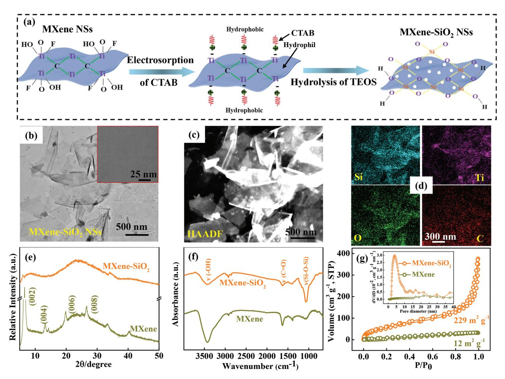
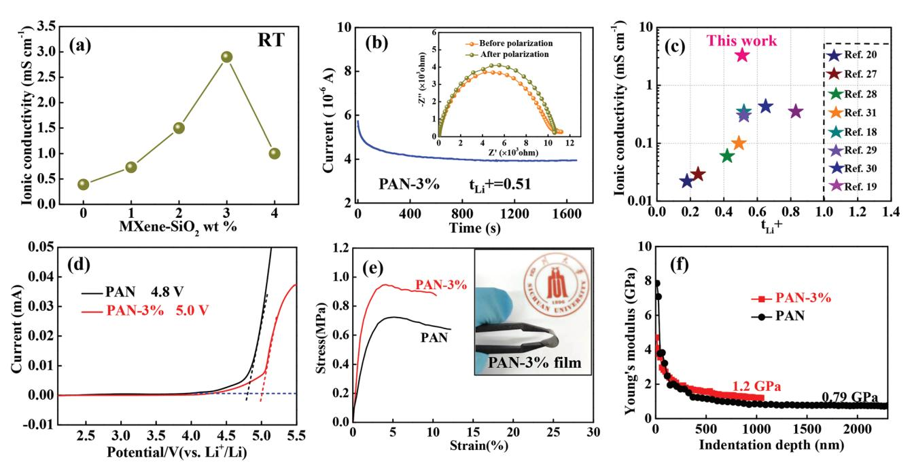
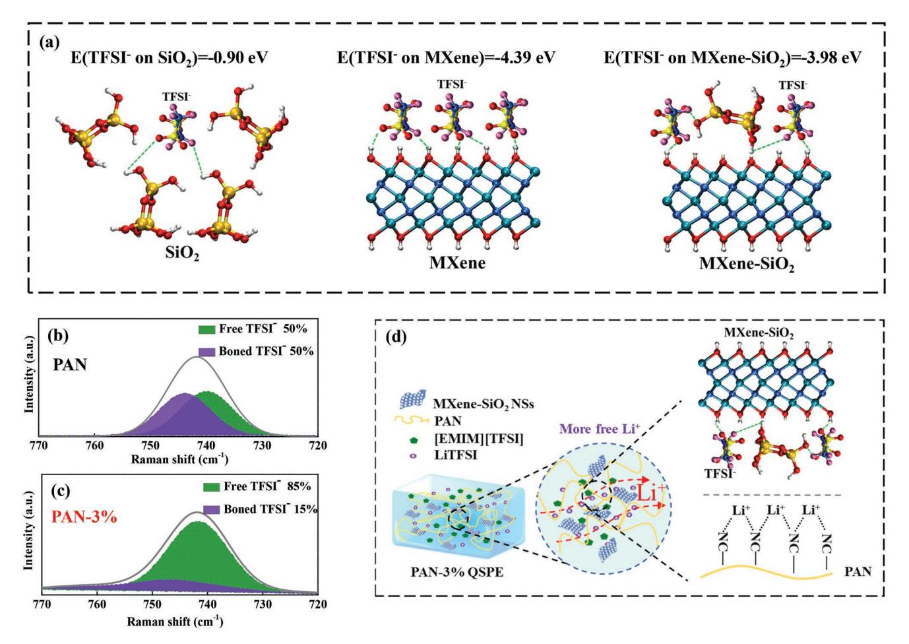
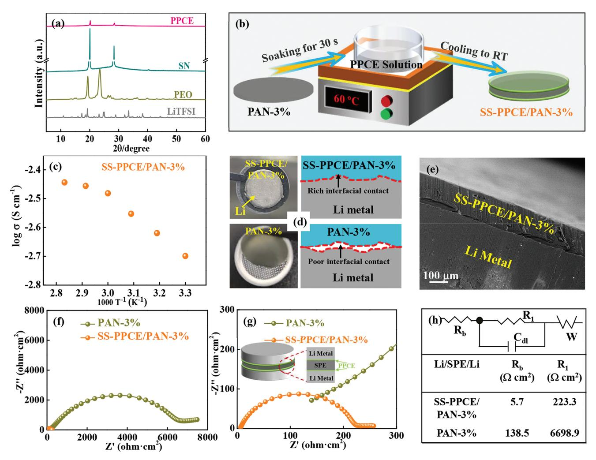
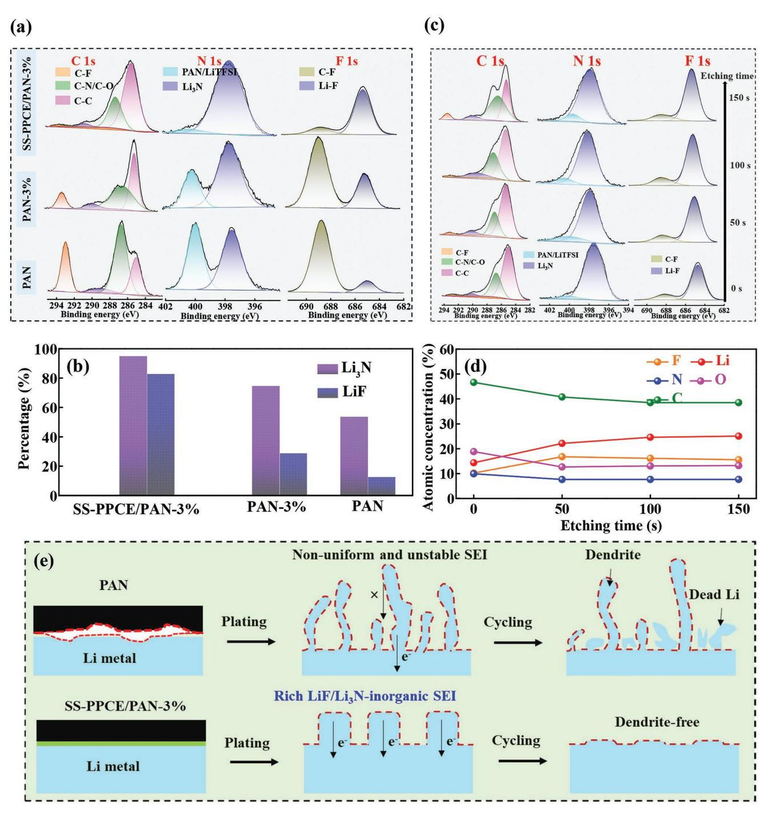
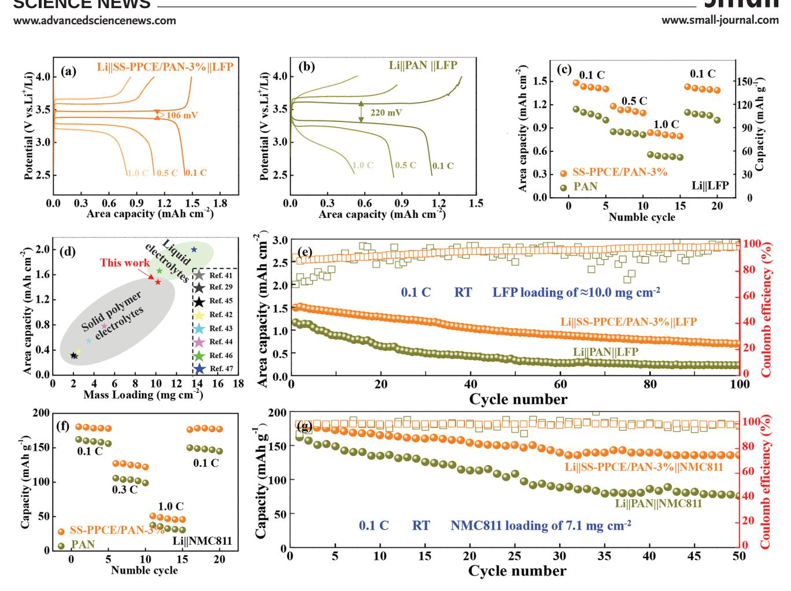
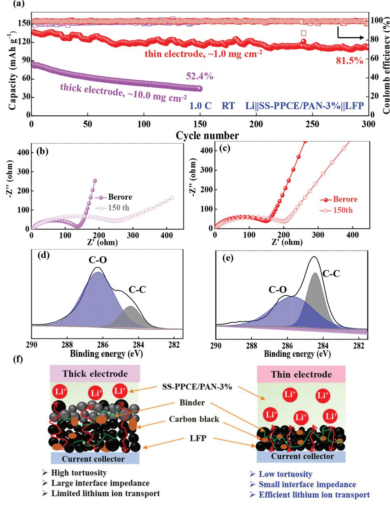

# **Sandwich-Structured Quasi-Solid Polymer Electrolyte Enables High-Capacity, Long-Cycling, and Dendrite-Free Lithium Metal Battery at Room Temperature**

*Qi Liu, Yongjie Dan, Miqiu Kong, Yanhua Niu,\* and Guangxian Li*

**The insufficient ionic conductivity, limited lithium-ion transference number (tLi+), and high interfacial impedance severely hinder the practical application of quasi-solid polymer electrolytes (QSPEs). Here, a sandwich-structured polyacrylonitrile (PAN) based QSPE is constructedin which MXene-SiO2 nanosheets act as a functional filler to facilitate the rapid transfer of lithium-ion in the QSPE, and a polymer and plastic crystalline electrolyte (PPCE) interface modification layer is coated on the surface of the PAN-based QSPE of 3 wt.% MXene-SiO2 (SS-PPCE/PAN-3%) to reduce interfacial impedance. Consequently, the synthesized SS-PPCE/PAN-3% QSPE delivers a promising ionic conductivity of ≈1.7 mS cm−1 at 30 °C, a satisfactory tLi+ of 0.51, and a low interfacial impedance. As expected, the assembled Li symmetric battery with SS-PPCE/PAN-3% QSPE can stably cycle more than 1550 h at 0.2 mA cm−2 . The Li**||**LiFePO4 quasi-solid-state lithium metal battery (QSSLMB) of this QSPE exhibits a high capacity retention of 81.5% after 300 cycles at 1.0 C and at RT. Even under the high-loading cathode (LiFePO4 ≈ 10.0 mg cm−2 ) and RT, the QSSLMB achieves a superior area capacity and good cycling performance. Besides, the assembled high voltage Li**||**NMC811(loading ≈ 7.1 mg cm−2 ) QSSLMB has potential applications in high-energy fields.**

# **1. Introduction**

With the continuous growth of electric vehicles and portable electronic devices, the pursuit of energy storage devices with high safety and excellent energy density has accelerated the development of quasi-solid-state lithium metal batteries (QSS-LMBs).[1–3] A critical component for QSSLMBs is lithiumion conducting solid-state electrolytes (SSEs).[4] Quasi-Solid polymer electrolytes (QSPEs) are considered as one of the most promising candidates because of their high flexibility, ease of mass production, lightweight, and low cost.[5,6] However, the

Q. Liu, Y. Dan, Y. Niu, G. Li College of Polymer Science and Engineering State Key Laboratory of Polymer Materials Engineering of China Sichuan University Chengdu 610065, China Q. Liu, M. Kong, G. Li School of Aeronautics and Astronautics Sichuan University Chengdu 610065, China E-mail: yhniu@scu.edu.cn The ORCID identification number(s) for the author(s) of this article can be found under https://doi.org/10.1002/smll.202300118.

## **DOI: 10.1002/smll.202300118**

unsatisfactory ionic conductivity and limited lithium-ion transference numbers (tLi+) of QSPEs at room temperature (RT) greatly limit their practical applications. Meanwhile, the poor stability of the electrolyte/Li metal interface, which causes the continuous growth of Li dendrites or moss-like Li in QSSLMBs during cycling, is also a big problem.[7–9] Therefore, there is a need to develop lithium-stable QSPE systems with satisfactory ionic conductivity and high tLi+ at RT.

Many polymer matrices including polyoxyethylene (PEO), polymethyl methacrylate, polyacrylonitrile (PAN), polyvinylidene fluoride, etc., have been widely used in QSSLMBs.[5] PAN contains polar and electron-withdrawing nitrile groups (CN), which has attracted much attention due to its excellent electrochemical stability, wide electrochemical window, good thermal stability, and considerable mechanical strength. In particular, the high antioxidant potential of PAN-based

electrolytes makes them suitable for high-voltage cathode materials to achieve high energy density.[10,11] Ionic conductivity of PAN-LiTFSI solid polymer electrolytes (SPEs)/QSPEs has been reported to be as high as ≈10−2 mS cm−1 . [12,13] But, from a practical point of view, the QSPEs/SPEs of lithium batteries should essentially have a higher ionic conductivity than 0.1 mS cm−1 to ensure reliable operation.[14]

Even though the introduction of a liquid plasticizer could effectively increase the ionic conductivity of QSPEs, it inevitably deteriorates the mechanical properties. As a result, QSPEs often suffer from ion conductivity inconsistencies and uneven ion distribution, and worse, dangerous lithium dendrites can form at the anode.[15] Fortunately, the prominent designability of polymer matrix structures and incorporation of inorganic fillers (i.e., inert fillers TiO2, Al2O3, SiO2 and metalorganic frameworks, etc., and active ion conducting materials Li6.4La3Zr1.4Ta0.6O12, Li1.3Al0.3Ti1.7(PO4)3 and Li10GeP2S12, etc.) into QSPEs/SPEs have recently been reported to be effective ways to improve some key performances of lithium battery such as the ionic conductivity without sacrificing other advantages.[16,17] However, these inorganic fillers with irregular morphology and relatively weak polymer-filler interaction result in aggregate and phase separation in the polymer matrix. Further, the QSPEs/SPEs are not rich enough in active interfaces between the zero- and 1D fillers and the polymer, and thus have limited enhancement of their ionic conductivity. Ideally, the 2D fillers have higher surface area than the zero- and 1D ones, which have higher filler-polymer active interfaces with the polymers. In addition, the QSPEs/SPEs containing high mechanical strength 2D fillers are relatively less likely to rupture under external forces than electrolyte films containing zero- and 1D fillers. Hence, the 2D fillers will be more effective in enhancing the comprehensive properties such as the electrochemical and mechanical properties of QSPEs/SPEs. 2D nanofillers with high specific surface area and abundant functional groups (such as OH), like graphene oxide, layered lithium montmorillonite, and MXene  $(Ti_3C_2T_x)$ , are favorable for the preparation of polymer electrolytes having high ionic conductivity up to 0.1 mS  $\text{cm}^{-1}$ .[18–20] Nevertheless, 2D fillers such as MXene has excellent electronic conductivity ( $\approx 10^3$  S cm-1) and is prone to aggregation, which greatly limits its use in polymer electrolytes.[21,22] Therefore, the development of MXene filler with low electronic conductivity and high polymer compatibility has a foreground potential to improve the electrochemical performance of polymer electrolytes. In addition, high interfacial impedance could be a serious problem needing to be resolved due to the poor interfacial contact between Li metal and PAN-based QSPEs/SPEs.[23,24]

In the present work, the MXene-SiO2 nanosheets (NSs) are prepared by controlled hydrolysis on the MXene surface, and its unique structure is favorable for the formation of Lewis acid-base interactions with LiTFSI in the PAN polymer electrolyte, enabling rapid Li+ transport at MXene-SiO2 NSs/polymer interface. For PAN-based QSPE of 3 wt.% MXene-SiO2, the optimal conductivity is 2.9 mS cm-1 at RT and displays a  $t_{Li}$ + value as high as 0.51. And a thin polymer and plastic crystalline electrolyte (PPCE) interface modification layer is coated on the surface of the PAN-3% electrolyte by immersion method to improve the problems of poor interfacial contact and high interfacial impedance between Li metal and PAN-3% QSPE. Finally, a sandwich-structured PAN-based QSPE is developed (SS-PPCE/PAN-3%) with a promising ionic conductivity of ≈1.7 mS cm-1. As a consequence, the assembled Li symmetric battery with SS-PPCE/PAN-3% OSPE exhibits a small overpotential (40.3 mV) and ultra-long/ stable Li stripping/plating cycles up to 1550 h with a current density of 0.2 mA  $\text{cm}^{-2}$  at RT. Remarkably, at a large current density of 1.0 mA cm-2, Li symmetric cell can still cycle for more than 800 h. The QSSLMB with a loading LiFePO4 (LFP, ≈1.0 mg cm-2) was assembled by using SS-PPCE/PAN-3% as electrolyte and separator can cycle for 300 cycles with a capacity retention rate of 81.5% and an average Coulombic efficiency of 99.2% at 1.0 C and at RT. Even the QSSLMBs of a high-loading LFP ( $\approx$ 10.0 mg cm-2) achieve a superior areal capacity of 1.48 mAh cm-2 at 0.1 C and at RT, and the retention rate is 80.0% after 30 cycles. The high voltage Li||NMC811(loading  $\approx$ 7.1 mg cm-2) QSSLMBs show a good cycling performance at 4.3 V. This study could shed new light on the design of QSSLMBs with long-cycle stability and attractive area capacity at high-loading cathode and RT.

## 2. Results and Discussion

MXene-SiO2 NSs were prepared by controlled hydrolysis of tetraethyl orthosilicate (TEOS) on the surface of MXene NSs

in Figure 1a, and detailed information is given in the Experimental Section.[25] The cationic surfactant cetyltrimethylammonium bromide (CTAB) was selected to electrostatically adsorb and self-assemble the highly negatively charged MXene, thereby guiding the in situ hydrolysis of TEOS on the surface of MXene (the hydrolysis process of TEOS is shown in Figure S1, Supporting Information),[26] and MXene-SiO2 NSs can be obtained by washing off CATB with ethanol. The microstructure of MXene-SiO2 NSs was characterized by transmission electron microscopy (TEM). As shown in Figure 1b, many monodispersed 2D MXene-SiO2 NSs with lateral dimensions ranging from 0.5 to 1  $\mu$ m is visible, similar to MXene NSs (Figure S2, Supporting Information). High-resolution TEM (HRTEM) further reveals that MXene-SiO2 NSs are amorphous state due to the full in situ growth of SiO2 on the surface of MXene NSs (Figure 1b, inset). Besides, the hybridization state of  $SiO2$  nanoparticles and MXene matrix was detected by using high-angle annular dark-field scanning TEM (HAADF-STEM) images. As described in Figure 1c, it can be seen that  $SiO2$  nanoparticles are uniformly anchored on the MXene NSs. Elements analysis further demonstrates the Si, Ti, O, and C elements evenly distributed on the MXene-SiO2 NSs surface, indicating the successful coupling of MXene NSs with  $SiO2$  (Figure 1d). In the X-ray diffraction (XRD) patterns, the disappearance of characteristic crystal peaks for MXene- $SiO2$  compared to MXene further indicates its amorphous state (Figure 1e), which is consistent with the TEM results. The Fourier transform infrared spectra (FTIR) of MXene-SiO2 NSs and MXene NSs are shown in Figure 1f. The MXene-SiO2 sample has a newly formed peak at 1076 cm $-1$ , corresponding to the anti-symmetric stretching of the Si-O-Si bond.[26] In the XPS results (Figure S3, Supporting Information), the small number of Si-C bonds further reveals that the possible formation of chemical bonds between SiO2 and MXene substrate, which is much stronger than the physical absorbance. Moreover, as exhibited in Figure 1g, one can see that the MXene-SiO2 NSs have a large surface area of up to 229 m2 g-1, which is  $\approx$ 19 times that of MXene NSs (12 m2 g-1). Four-probe resistivity measurement reveals the MXene-SiO2 NSs have a very low electronic conductivity of  $3.4 \times 10^{-4}$  S cm-1 (Figure S4, Supporting Information), which is 7 orders of magnitude lower than that of reported MXene NSs (10-3 S cm-1). Therefore, the abundant surface functional groups, large specific area, and low electronic conductivity of MXene-SiO2 afford it unique properties as suitable fillers for QSPEs.

The PAN-based QSPEs were fabricated by solvent casting technique. After solvent evaporation, vacuum drying, and cutting, PAN-based QSPEs films with different MXene-SiO2 contents were obtained, as referred in Figure S5 (Supporting Information). The effect of different MXene-SiO2 contents on the ionic conductivity of PAN-based QSPEs was tested by electrochemical impedance spectroscopy (EIS) at RT, as shown in Figure 2a and Figure S6 (Supporting Information). The ionic conductivity of PAN-based QSPEs increases with the increase of MXene-SiO2 content but decreases when the MXene-SiO2 content is higher than 3 wt.%. It is speculated that the agglomeration of the MXene- $SiO2$  filler may lead to the sudden decay of the ionic conductivity.[20] The highest ion conductivity (2.9 mS cm $-1$  at RT) is obtained at 3 wt.% MXene-SiO2 (referred to as PAN-3%), which is ≈10 times higher than that without

**www.small-journal.com**

**Figure 1.** a) Schematic diagram for the synthesis process of 2D MXene-SiO2 NSs. b) TEM images (Inset in: high-resolution TEM image), c) HAADF-STEM image, and d) elements mappings of MXene-SiO2 NSs. e) XRD patterns, f) FTIR spectra, and g) nitrogen adsorption/desorption isotherms (Inset in: pore size distribution) of MXene NSs and MXene-SiO2 NSs.

MXene-SiO2 (0.3 mS cm−1 ). It is worth noting that the excellent ionic conductivity of PAN-based QSPEs is closely related to the addition of ionic liquid (EMIMTFSI). Consider the optimal balance of ionic conductivity and mechanical properties of PAN-based QSPEs, the 1.38 g 2 m LiTFSI/EMIMTFSI as the optimal addition condition (as depicted in Figure S7, Supporting Information). Meanwhile, the PAN-3% QSPE has a relatively low electronic conductivity of 7.9 × 10−7 mS cm−1 (Figure S8, Supporting Information), which is greatly lower than its ionic conductivity, indicating that PAN-3% QSPE is an ideal ionic conductor. In addition, the ionic conductivity of the synthesized PAN-based QSPEs on the Arrhenius diagram shows linear temperature-dependent curves (Figure S9, Supporting Information), suggesting that elevated temperatures promote the migration of isolated ions.

It is well known, in addition to ionic conductivity, the tLi+ is also a key parameter for evaluating the Li+ transference ability and rate capability of the QSPEs. The tLi+ values of PAN-3% were measured and plotted in Figure 2b, the PAN-3% QSPE displays a tLi+ value as high as 0.51. Compared with the same types of SPEs/QSPEs, both the ionic conductivity and tLi+

of PAN-3% shows prominent improvement as depicted in Figure 2c and Table S1 (Supporting Information).[18–20,27–31] The improvement of ionic conductivity and tLi+ can be attributed to a large number of Lewis acid-base interactions between 2D MXene-SiO2 and LiTFSI (details are in Figure S10, Supporting Information). At the same time, MXene-SiO2 NSs can also reduce the crystallinity of the PAN matrix as evidenced by the XRD results (Figure S11, Supporting Information), therefore enhancing the motility of the chain segments. It is important to expand the electrochemical window to achieve high energy density lithium batteries while ensuring the ionic conductivity and tLi+ of QSPEs. As shown in Figure 2d, the linear sweep voltammetry (LSV) curves of the samples indicate that PAN-3% QSPE (≈5.0 V) has better electrochemical stability than PAN QSPE (≈4.8 V). The LSV results demonstrate that PAN-3% can well meet the voltage requirements of LFP and most of the available high-voltage cathode materials (e.g., LiNi1-x-yMnxCoyO2 (NMC)). In addition to excellent electrochemical performance, the PAN-3% QSPE also exhibits outstanding mechanical strength (yield stress of ≈0.95 MPa) (Figure 2e), and good mechanical flexibility (Figure 2e in inset). Besides, Young's modulus of

**Figure 2.** a) Dependence of ionic conductivity and MXene-SiO2 content at RT. b) The chronoamperometry profile of symmetric Li||PAN-3%||Li cell (Inset: EIS curves) at RT. c) The comparison of ionic conductivity and tLi+ for SPEs/QSPEs with different morphology fillers from recent literature. d) LSV profiles of PAN and PAN-3% QSPEs at 0.2 mV s−1 and at RT. e) Tensile stress-strain curves of PAN and PAN-3% QSPEs (Inset: The flexibility demonstration of PAN-3% film). f) Young's modulus of PAN-based QSPEs as a function of indentation depth.

PAN-based QSPEs has been conducted by nanoindentation. Figure 2f demonstrates Young's modulus of the PAN-based QSPEs as a function of indentation depth, the PAN QSPE exhibits Young's modulus value of 0.79 GPa. The introduction of MXene-SiO2 slightly increased to 1.2 GPa (PAN-3%). The good mechanical properties of PAN-3% QSPE can effectively prevent the growth of Li dendrites, which ensures its practical application in QSSLMBs. The good mechanical properties are mainly attributed to the hydrogen bonding between the MXene-SiO2 NSs and the PAN polymer matrix (Figure S12, Supporting Information). The thickness of the PAN-3% QSPE film is ≈90 µm (Figure S13, Supporting Information), and it can be seen from the field-emission scanning electron microscopy and EDS element mapping of the cross-section and surface that the MXene-SiO2 NSs are uniformly dispersed in the PAN polymer matrix, which further proves that the hydrogen bonding interaction of MXene-SiO2 NSs can be easily dispersed into PAN. Besides, the thermal stability of the PAN-3% and PAN QSPEs were investigated by the thermal gravimetric analyzer. The mass loss of PAN-3% QSPE at 80–300 °C is only 0.7%, which is much lower than that of PAN QSPE (7.6%) (Figure S14, Supporting Information). It is suggested that PAN-3% QSPE has good thermal stability, which provides a possibility for hightemperature QSSLMBs.

Density functional theory is applied to further analyze the interaction mechanism between MXene-SiO2 and LiTFSI. As depicted in **Figure 3**a, the adsorption energies of the TFSI− on MXene-SiO2 is ≈−3.98 eV, which is more negative than SiO2 (−0.90 eV), meaning that the MXene-SiO2 has a stronger adsorption ability for TFSI−. In addition, although MXene exhibits the strongest adsorption capacity for TFSI−, its application in electrolytes is somewhat hindered owing to its inherent high electronic conductivity. The strong interaction between MXene-SiO2 and TFSI− promotes the dissociation of lithium salts, thus freeing more Li+ in PAN-3% QSPE, which is very favorable for the ionic conductivity and tLi+. The chemical state of TFSI− was explored by fitting the Raman spectra of PAN and PAN-3% QSPEs (Figure 3b,c). The green peak (≈740 cm−1 ) is probably attributed to free TFSI− and the purple peak (≈745 cm−1 ) may be derived from bonded TFSI− aggregates. The proportion of free TFSI− in the PAN-3% QSPE (85%) is significantly higher than in PAN QSPE (50%). This change in the chemical state of TFSI− suggests that the introduction of MXene-SiO2 is beneficial for the dissociation of LiTFSI, which is consistent with the result of theoretical calculations and ionic conductivity and tLi+. Therefore, the electrochemical properties improvement of PAN-3% QSPE can be attributed to interactions between MXene-SiO2 and LiTFSI (Figure 3d).

As previously discussed, synthesized PAN-3% QSPE exhibits outstanding ionic conductivity, high tLi+, and excellent thermal stability, indicating that it is an ideal candidate for QSPE. Unfortunately, high interfacial impedance is a serious problem due to poor interfacial contact between Li metal and PAN-3% QSPE. Therefore, a thin PPCE is used as an interface modification layer to solve this problem.[32] The PPCE consists of an ion-conducting succinonitrile (SN)/LiTFSI mixture and poly- (ethylene oxide) (PEO) polymer (Figure S15, Supporting Information). SN is a common plastic crystal, displays an ionic conductivity of ≈1 mS cm−1 when mixed with a lithium salt with an SN to Li+ molar ratio of 20:1, and PEO polymer is incorporated in the PPCE to improve its processability.[33,34] It can be seen from the XRD pattern that the characteristic peaks of the

**www.small-journal.com**

**Figure 3.** a) The optimized molecular structure and adsorption energies (E) of the TFSI−on SiO2, MXene, and MXene-SiO2 surface by theoretical simulation and calculations. Raman spectra of b) PAN QSPE and c) PAN-3% QSPE. d) Schematic illustration of the mechanism of surface interaction of MXene-SiO2 in PAN-3% QSPE.

lithium salt disappear, indicating that it is completely dissolved in SN (**Figure 4**a). The PPCE is a solid state at RT, but a liquid state at 60 °C (Figure S16, Supporting Information). As illustrated in Figure 4b, a thin PPCE interface modification layer is coated on the surface of the PAN-3% electrolyte by immersion method to improve the interfacial contact between the PAN-3% QSPE and Li electrode. A sandwich-structured PANbased QSPE is developed (SS-PPCE/PAN-3%), and the ionic conductivity approached 1.7 and 3.6 mS cm−1 at 30 and 80°C (Figure 4c), respectively. Comparison of optical photographs and cross-sectional SEM images of the interfacial contact between PAN-3% QSPE and Li metal with and without PPCE interface modification (Figure 4d,e). It can be found, the SS-PPCE/PAN-3% QSPE has a nearly seamless contact with the Li electrodes, forming a stronger interface than PAN-3% QSPE. Figure 4f,g are the Nyquist plots of Li symmetric cells with PPCE modification layer (Li||SS-PPCE/PAN-3%||Li) and without PPCE modification layer (Li||PAN-3%||Li), which are significantly different. The equivalent circuit and fitting results of the Nyquist plots are shown in Figure 4h. The Ohmic resistances (*R*b) of Li symmetric cells with and without the PPCE modification layer are 5.7 and 138.5 Ω cm2 , respectively, indicating that the Li||SS-PPCE/PAN-3%||Li cell has a smaller internal resistance. Furthermore, the Li||PAN-3%||Li cell exhibits a large interfacial impedance (R1) of ≈6698.9 Ω cm2 . In sharp contrast, the total interfacial impedance of the Li||SS-PPCE/PAN-3%||Li cell dropped drastically by a factor of ≈30 times to 223.3 Ω cm2.

The continuous stripping/plating performance of Li-symmetric cells was investigated to evaluate the compatibility of QSPEs with Li electrodes at RT. As shown in **Figure 5**a, the Li||SS-PPCE/PAN-3%||Li symmetric cell delivers a small overpotential (40.3 mV) during cycling compared to the Li||PAN||Li (193.5 mV) and Li||PAN-3%||Li (112.9 mV) symmetric cells, which is mainly attributed to the good interfacial contact between SS-PPCE/PAN-3% and Li metal electrodes. Further, for Li||PAN||Li and Li||PAN-3%||Li symmetric cells, the voltage fluctuation as the cycle number increases in the process of Li stripping/plating cycle, is mainly due to the thickened gradually solid electrolyte interphase (SEI) film and the deterioration of electrode/electrolyte interface leads to nonuniform lithium deposition and dendrite growth. As a comparison, the voltage fluctuations during cycling of Li||SS-PPCE/PAN-3%||Li symmetric cell is stable, which shows that there is a stable interfacial reaction and uniform Li deposition. The critical current density test results are depicted in Figure 5b–e, the Li||SS-PPCE/PAN-3%||Li symmetric cell exhibits ultralong and stable stripping/plating

**Figure 4.** a) XRD patterns of PPCE, SN, PEO, and LiTFSI. b) Assembled schematic illustration of sandwich-structured PPCE/PAN-3% (SS-PPCE/ PAN-3%) QSPE in the glove box. c) Ionic conductivity of the SS-PPCE/PAN-3% QSPE as a function of temperature. d) Optical photos and schemes of contact between Li metal and QSPEs. e) The cross-sectional SEM image of the SS-PPCE/PAN-3%||Li metal interface. f) The EIS profiles and g) enlarged view (Inset: Schematic diagram of the Li symmetrical cell with SS-PPCE/PAN-3%) of Li symmetrical cells of PAN-3% and SS-PPCE/PAN-3% QSPEs. h) Equivalent circuits of Li symmetric cells.

cycle up to 1550 h with a current density of 0.2 mA cm−2 and a capacity of 0.2 mAh cm−2 at RT. Remarkably, at a large current density of 1.0 mA cm−2 and a capacity of 1.0 mAh cm−2 , the Li||SS-PPCE/PAN-3%||Li symmetric cell can still be cycled for more than 800 h, indicating that SS-PPCE/PAN-3% QSPE can withstand high current density and can effectively inhibit Li dendrite growth. Long stripping/plating cycling life and small voltage polarization verify that the SS-PPCE/PAN-3% QSPE can efficiently and uniformly conduct lithium ions. The surface morphology of Li metal was further analyzed by SEM after 80 h of stripping/plating cycling. In Figure 5f,g, Li||PAN||Li and Li||PAN-3%||Li symmetric cells have porous and loose Li metal surfaces, indicating Li+ diffusion is restrained and Li dendrite in the interface precipitation. By contrast, the Li metal in Li||SS-PPCE/PAN-3%||Li symmetric cell has a flat surface and a metallic sheen (Figure 5h), prove that Li deposition is uniform and stable. These results clearly demonstrate that the SS-PPCE/ PAN-3% QSPE has good mechanical properties, outstanding electrochemical stability, and high ionic conductivity, which can effectively suppress the growth of Li dendrites during ultra-long cycling of stripping/plating at RT.

Many SPEs/QSPEs often fail because of unstable interfaces with electrodes despite they have high ionic conductivity. For symmetric Li batteries with different QSPEs, the composition of SEI formed on the Li metal after 80 h was investigated by XPS. As shown in **Figure 6**a,b, all samples of different QSPEs show peaks related to fluoride and nitride, but there are some noteworthy differences. Compared with PAN (53.4% of Li3N, 12.7% of LiF) and PAN-3% (74.3% of Li3N, 28.5% of LiF), the SEI of SS-PPCE/PAN-3% has the highest content of Li3N and LiF with 94.7% and 82.7%, which can be evaluated according to the peak of F 1s and N 1s. Generally, LiF is generally regarded as a beneficial SEI component due to its high mechanical strength, large surface energy, and relatively small lattice constant, which endow SEI with good mechanical stability and exciting plastic deformation ability. While Li3N is a Li+ superconductor, which helps to enhance the ion transport properties of SEI and improve electrochemical reaction kinetics.[35,36] The

**www.small-journal.com**

**Figure 5.** a) Voltage profiles of the continued lithium striping/plating cycling of Li||PAN||Li, Li||PAN-3%||Li and Li||SS-PPCE/PAN-3%||Li cells with a current density of 0.2 mA cm−2 and a capacity of 0.2 mAh cm−2 at RT. b) Galvanostatic striping/plating cycles for Li||SS-PPCE/PAN-3%||Li cells with different current densities at RT. Selected voltage profiles of c) 100–110th, d) 600–610th and e) 900–910th. The SEM images of Li metal surface with f) Li||PAN||Li, g) Li||PAN-3%||Li, and h) Li||SS-PPCE/PAN-3%||Li cells after 80 h at a current density of 0.2 mA cm−2 .

LiF and Li3N-rich SEI layers are expected to optimize Li deposition behavior and prolong the lifetime of Li anodes, which will contribute to the superior performance of SS-PPCE/PAN-3% QSSLMBs. The depth information of the SEI layer was obtained by Ar-sputtering etching. This is a particularly effective technique for studying the solid electrolytes that are strongly attached to Li metal.[37] So, the SEI composition formed after cycling of SS-PPCE/PAN-3%-based Li electrode was characterized by depth XPS and Ar-sputtering. Before etching (0 s), the C 1s spectrum of the Li electrode shows a dominant C–C peak, indicating the presence of the polymer matrix (C1s spectrum in Figure 6c left). As the etching time increases (as the SEI approaches Li metal), the composition of the inorganic-organic hybrid SEI layer gradually changes (Figure 6d). First, with the increase of etching time, the polymer correlation peak in the C 1s spectrum decreases. But the inorganic compound (LiF) gradually increases with the etching time (F 1s spectra are shown in Figure 6c right). The results show that the SEI layer gradient structure is formed between the SS-PPCE/PAN-3% and Li metal. The schematic diagram of Li dendrite growth behaviors in Li||SS-PPCE/PAN-3%||Li and Li||PAN||Li symmetric cells based on XPS, SEM, and stripping/plating experiments, as is illustrated in Figure 6e. The Li||PAN||Li symmetric cell limited interfacial contact and irregular Li deposition, while a strong interfacial contact layer is produced in Li||SS-PPCE/PAN-3%||Li symmetric cell. In the subsequent cycling, SS-PPCE/PAN-3% induces the formation of a stable and Li3N/LiF-enriched layer, which promotes Li+ transfer and enables uniform Li deposition.

For high energy density QSSLMBs, there is a strong demand for full batteries with high cathode loading, limited source of Li metal anodes, and thin solid-state electrolytes.[37,38] In contrast to Li-ion batteries, solid electrolytes in QSSLMBs cannot spontaneously wet the electrodes like liquid electrolytes, resulting in discontinuous ion transport at the cathode/solid electrolyte interface.[39] Therefore, the most reported cathode loading for QSSLMBs is too low (usually 4 mg cm−2 ) to meet the requirements of practical energy-density batteries.[40] To demonstrate the practical applicability of the as-synthesized SS-PPCE/ PAN-3% and PAN QSPEs, the QSSLMBs with a high cathode loading LFP(≈10.0 mg cm−2 ) were assembled and evaluated at

**www.small-journal.com**

**Figure 6.** XPS analyzes the composition of the SEI on the cycled Li metal surface of the symmetric Li cells with different QSPEs at a current density of 0.2 mA cm−2 and a capacity of 0.2 mAh cm−2 after 80 h: a) The high-resolution C 1s, N 1s, and F 1s XPS spectra and b) the percentage of Li3N and LiF with different QSPEs. c) The high-resolution C 1s, N 1s, and F 1s XPS spectra and d) the quantified atomic ratios of different elements on the cycled Li metal surface with SS-PPCE/PAN-3% QSPE were measured after Ar-sputtering for 0, 50, 100, and 150 s. e) Schematic illustration of stripping/plating cycling with different QSPEs of PAN and SS-PPCE/PAN-3%.

RT. The charging-discharging curves at different rates of Li||SS-PPCE/PAN-3%||LFP cell and Li||PAN||LFP cell, as depicted in **Figure 7**a,b, respectively. The Li||SS-PPCE/PAN-3%||LFP and Li||PAN||LFP cells exhibit two well-defined potential plateaus, corresponding to the stable delithiation and lithiation processes. But, the Li||SS-PPCE/PAN-3%||LFP cell shows a lower overpotential of 106 mV than the Li||PAN||LFP cell (220 mV), indicating the excellent interfacial stability of SS-PPCE/ PAN-3% QSPE for LFP and Li anode. The rate performance of different QSSLMBs is shown in Figure 7c. Under the harsh conditions of high-loading cathode LFP (≈10.0 mg cm−2 ) and RT, the Li||SS-PPCE/PAN-3%||LFP battery can obtain a high

**Figure 7.** Electrochemical performances for Li||QSPEs||LFP QSSLMBs with LFP commercial loading of ≈10.0 mg cm−2 at RT: Charging-discharging curves at different rates of a) Li||SS-PPCE/PAN-3%||LFP cell and b) Li||PAN||LFP cell. c) Rate performance of Li||PAN||LFP and Li||SS-PPCE/PAN-3%||LFP cells. d) The comparison of area capacity and mass loading for different QSPEs/SPEs and representative liquid electrolytes. e) Cycling performance of Li||PAN||LFP and Li||SS-PPCE/PAN-3%||LFP cells at 0.1 C and at RT. Electrochemical performances for high voltage Li||QSPEs||NMC811 QSSLMBs with NMC811 loading of ≈7.1 mg cm−2 at RT: f) Rate performance and g) cycling performance of Li||PAN||NMC811 and Li||SS-PPCE/PAN-3%||NMC811 cells at 0.1 C.

discharge capacity of 147.8 mAh g−1 at 0.1 C, corresponding to a superior areal capacity of 1.48 mAh cm−2, which is one of the highest values reported in QSSLMBs. But, the Li||PAN||LFP battery demonstrates a low capacity of 114.4 mAh g−1 (areal capacity of 1.14 mAh cm−2) at the same current density, which is due to the large internal resistance and limited interfacial contact. The Li||SS-PPCE/PAN-3%||LFP battery can still deliver a capacity of 84.3 mAh g−1 (0.84 mAh cm−2 ) and 109.3 mAh g−1 (1.09 mAh cm−2) at 1.0 and 0.5 C, respectively. However, Li||PAN||LFP cell can only provide a capacity as low as 51.6 mAh g−1 (0.51 mAh cm−2 ) at 1.0 C. Furthermore, once the current density is restored to 0.1 C, the capacity of Li||SS-PPCE/PAN-3%||LFP battery can be recovered to 140.1 mAh g−1 (1.40 mAh cm−2), showing superior electrochemical stability. Figure 7d and Table S2 (Supporting Information) summarize and compare the performance of this studying and reported open literature, including different SPEs/QSPEs and representative liquid electrolytes. The Li||SS-PPCE/PAN-3%||LFP QSSLMB outperforms most previous reported research results in terms of both cathode LFP loading and areal capacity, even close to representative liquid state batteries, represents an important step toward the practical realization of high energy density QSSLMBs.[29,41–47]

The battery cycling tests were performed to examine their long-term stability at 0.1 C and RT. As shown in Figure 7e, the Li||SS-PPCE/PAN-3%||LFP battery has an initial capacity of 1.49 mAh cm−2 (149.0 mAh g−1 ) and a Coulombic efficiency (CE) of 91.1%, which is related to the formation of the SEI. The Li||SS-PPCE/PAN-3%||LFP battery still maintained a discharge capacity of 1.20 mAh cm−2 with a capacity retention rate of 80.0% after 30 cycles. Nevertheless, the Li||PAN||LFP cell has a low discharge capacity of 1.16 mAh cm−2 (115.9 mAh g−1 ) in the initial cycle, and the capacity retention dropped rapidly to 80.0% after 9 cycles. In addition, the capacity retention rates of Li||SS-PPCE/PAN-3%||LFP and Li||PAN||LFP batteries are 48.3% and 18.7% after 100 cycles, respectively. The charging-discharging curves of the Li||SS-PPCE/PAN-3%||LFP and Li||PAN||LFP cells after 100 cycles show obvious voltage polarization (Figure S17, Supporting Information), which could be attributed to the irreversible secondary reactions between the high loading LFP cathode and QSPEs during cycling, resulting in a rapid decay of battery capacity.

As previously discussed, the as-synthesized SS-PPCE/ PAN-3% QSPE possesses a high potential up to 5.0 V (vs Li+/Li), the high voltage QSSLMBs with NMC811 (loading 7.1 mg cm−2) were assembled and evaluated at RT. The charging-discharging curves of Li||SS-PPCE/PAN-3%||NMC811 cell and Li||PAN||NMC811 cell at different rates and operating potential 3.0–4.3 V, as depicted in Figure S18a,b (Supporting Information), respectively. The Li||SS-PPCE/PAN-3%||NMC811 battery shows a discharge capacity of 180.2 mAh g−1 at 0.1 C, as displayed in Figure 7f. But, the Li||PAN||NCM 811 battery demonstrates a low capacity of 162.5 mAh g−1 under the same conditions. However, with the increase of current density, the polarization voltage of Li||SS-PPCE/PAN-3%||NMC811 cell and Li||PAN||NMC811 cell gradually increases, which leads to the loss of capacity. The high-voltage battery cycling tests were performed to examine their long-term stability at 0.1 C and RT (Figure 7g). The Li||SS-PPCE/PAN-3%||NMC811 battery maintained a discharge capacity of 134.6 mAh g−1 with a capacity retention rate of 72.2% after 50 cycles, detailed charging and discharging curves as shown in Figure S18c (Supporting Information). In contrast, the Li||PAN||NMC811 battery represented a low capacity retention of 47.1% after 50 cycles (Figure S18d, Supporting Information) This strategy is one of the successful demonstrations of PAN-based polymer electrolytes under high voltage, high cathode loading, and RT conditions, indicating its potential application in the field of high energy batteries.

The preparation of thick electrodes by increasing the loading of active materials is one of the practical ways to increase the volume/specific energy density of QSLMBs. However, the use of thick electrodes with high loadings suffers from severe deterioration of electrochemical performance, such as short cycle life and low rate.[38] Previous reports tend to focus on the decay behavior of cathode materials for liquid batteries during cycling, but the decay behavior of high-loading cathode materials for QSSLMBs during cycling has not been studied.[48] To evaluate the effect of high loading on the electrochemical performance, a thick electrode with a loading of ≈10.0 mg cm−2 was fabricated using LFP. As a control group, a thin electrode with a loading of ≈1.0 mg cm−2 was prepared at the same time. The long-term stability of Li||SS-PPCE/PAN-3%||LFP QSSLMBs with different loading of LFP at 1.0 C and at RT, as shown in **Figure 8**a. The capacity of the thick electrode (loading ≈10.0 mg cm−2 ) shows only 52.4% of the initial capacity (≈85.5 mAh g−1 ) after 150 cycles, while the capacity retention of the thin electrode (loading ≈1.0 mg cm−2 ) demonstrates 85.0% (≈136.7 mAh g−1 ). Even after 300 cycles, the capacity retention of the Li||PPCE/ PAN-3%||LFP QSSLMB with a loading of ≈1.0 mg cm−2 can still be maintained at 81.5% and a high CE of 99.2%, indicating that the battery has a promising cycle performance at RT. Considering the areal capacity of QSSLMBs (Figure S19, Supporting Information), the capacity retention of thick electrodes is lower than that of thin electrodes. The initial areal capacity of the thick electrode is 0.85 mAh cm−2, which is higher than that of the thin electrode (0.14 mAh cm−2 ). However, after 150 cycles, the areal capacity of the thick electrode dropped sharply to 0.44 mAh cm−2. The cycling test results show that even for the same cathode system, increasing the loading of LFP will deteriorate the capacity retention rate.

The EIS well explains the degradation behavior of thick electrodes. Here we will deal with only the relative increase in the resistance value rather than the absolute resistance value changes. This is because the thick and thin electrodes cannot be directly compared owing to the differences in the height and loading mass of cathode LFP. The impedance of the thick electrode increases faster than that of the thin electrode during the cycle. An increase in charge transfer resistance (*R*ct) from the initial 135.3 to 261.5 Ω (relative increase amount of 93.3%) is observed in the thick electrode after 150 cycles (Figure 8b). But, on the thin electrode, the increase in Rct with 148.8 to 199.1 Ω (relative increase amount of 34.4%) is much smaller than that on the thick electrode (Figure 8c). The surge in the Rct confirms that the charge transfer of the Li||SS-PPCE/PAN-3%||LFP QSSLMB with a high loading of ≈10.0 mg cm−2 is inhibited, causing the local impedance to increase. The degradation behavior of the thick electrode was further analyzed by XPS (Figure 8d,e). The peak intensity of the CO bond of the thick electrode is much higher than that of the thin electrode after 150 cycles, illustrating that more organic by-products are formed in the thick electrode. Based on the above findings, a capacity decay mechanism model for high-loading LFP electrode of Li||SS-PPCE/PAN-3%||LFP QSSLMB is guessed, as exhibited in Figure 8f. At the initial stage of charging-discharging cycling, the reaction of the thick electrode is relatively uniform and there is no obvious concentration polarization. Along with side reactions and repeated charging-discharging, the impedance of lithium-ion transport in the interface of electrolyte/electrode is further increased, and the surface byproducts aggrandize the complexity of the lithium-ion diffusion path and aggravate the tortuosity of lithium-ion diffusion. Repeated by-product generation and impedance increasing cause irreversible capacity fading of Li||SS-PPCE/PAN-3%||LFP QSSLMB with a high loading of ≈10.0 mg cm−2.

# **3. Conclusion**

Herein, the SS-PPCE/PAN-3% QSPE is successfully synthesized based on inorganic filler MXene-SiO2 blending and PPCE interface modification. The 2D MXene-SiO2 not only can form a large number of Lewis acid-base interactions with LiTFSI but also can reduce the crystallinity of PAN matrix and improve the motility of its chain segments, thus improving the ionic conductivity of PAN-based QSPEs. After PPCE interface modification, the SS-PPCE/PAN-3% QSPE can induce the formation of a stable and Li3N/LiF-enriched layer, which promotes Li+ transfer and enables uniform Li deposition. As-synthesized SS-PPCE/PAN-3% QSPE shows good mechanical properties, excellent electrochemical stability, and high ionic conductivity, so as to achieve an ultra-long/stable Li stripping/plating cycle up to 1550 h with a current density of 0.2 mA cm−2 at RT. The assembled QSSLMB with a loading LiFePO4 (≈1.0 mg cm−2 ) by using SS-PPCE/PAN-3% as electrolyte and separator can cycle more than 300 cycles with a capacity retention rate of 81.5% and an average CE of 99.2% at 1.0 C and at RT. Even the QSSLMBs of a high-loading LiFePO4 (≈10.0 mg cm−2 ) achieve a superior areal capacity of 1.48 mAh cm−2 , and the capacity retention rate is 80% after 30 cycles at 0.1 C and at RT. The high voltage

**Figure 8.** Understanding capacity fading mechanism of Li||SS-PPCE/PAN-3%||LFP QSSLMB under different loading of LFP and at RT. a) Comparison of cycle life and coulombic efficiency with thick electrode (≈10.0 mg cm−2 ) and thin electrode (≈1.0 mg cm−2 ). Nyquist plots of b) thick electrode and c) thin electrode. XPS analysis of by-products on LFP surface after 150 cycles d) thick electrode and e) thin electrode. f) Li+ transfer schematic diagram in the charging-discharging cycling for thick electrodes and thin electrodes.

Li||NMC811(loading ≈7.1 mg cm−2) QSSLMBs have a good cycling performance at 4.3 V, indicating its potential application in the field of high-energy batteries. This strategy opens up new possibilities for the construction of next-generation QSSLMBs with long life, high safety, and outstanding energy density.

## **Acknowledgements**

Y.H.N. acknowledges the financial support from the National Natural Science Foundation of China with grant numbers 52073184 and 51873125 and the Scientific Research Foundation of International Cooperation and Exchanges of Sichuan Province with grant number 2019YFH0027.

# **Supporting Information**

Supporting Information is available from the Wiley Online Library or from the author.

# **Conflict of Interest**

The authors declare no conflict of interest.

#### **Data Availability Statement**

The data that support the findings of this study are available in the supplementary material of this article.

#### **Keywords**

dendrite-free, high cathode loading, lithium metal batteries, quasi-solid polymer electrolytes

> Received: March 3, 2023 Revised: March 12, 2023

Published online: April 3, 2023

- [1] P. Albertus, S. Babinec, S. Litzelman, A. Newman, *Nat. Energy* **2017**, *3*, 16.
- [2] B. S. Vishnugopi, E. Kazyak, J. A. Lewis, J. Nanda, M. T. McDowell, N. P. Dasgupta, P. P. Mukherjee, *ACS Energy Lett.* **2021**, *6*, 3734.
- [3] D. Tan, A. Banerjee, Z. Chen, Y. S. Meng, *Nat. Nanotechno.* **2020**, *15*, 170.
- [4] P. Ding, Z. Lin, X. Guo, L. Wu, Y. Wang, H. Guo, L. Li, H. Yu, *Mater. Today* **2021**, *51*, 449.
- [5] G. Xi, M. Xiao, S. J. Wang, D. M. Han, Y. N. Li, Y. Z. Meng, *Adv. Funct. Mater.* **2020**, *31*, 2007598.
- [6] Y. B. Song, H. Kwak, W. Cho, K. S. Kim, Y. S. Jung, K. H. Park, *Curr. Opin. Solid State Mater. Sci.* **2022**, *26*, 100977.
- [7] Q. Zhou, J. Ma, S. M. Dong, X. F. Li, G. L. Cui, *Adv. Mater.* **2019**, *31*, 1902029.
- [8] J. Kang, D. Y. Han, S. Kim, J. Ryu, S. Park, *Adv. Mater.* **2022**, *35*, 2203194.
- [9] T. Famprikis, P. Canepa, J. A. Dawson, M. S. Islam, C. Masquelier, *Nat. Mater.* **2019**, *18*, 1278.
- [10] P. Hu, J. Chai, Y. Duan, Z. Liu, G. Cui, L. Chen, *J. Mater. Chem. A* **2016**, *4*, 10070.
- [11] D. Zhou, D. Shanmukaraj, A. Tkacheva, M. Armand, G. Wang, *Chem* **2019**, *5*, 2326.
- [12] J. Z. Li, X. J. Huang, L. Q. Chen, *J. Electrochem. Soc.* **2000**, *147*, 2653.
- [13] B. Wu, L. Wang, Z. Li, M. Zhao, K. Chen, S. Liu, Y. Pu, J. Li, *J. Electrochem. Soc.* **2016**, *163*, A2248.
- [14] W. H. Meyer, *Adv. Mater.* **1998**, *10*, 439.
- [15] R. C. Agrawal, G. P. Pandey, *J. Phys. D Appl. Phys.* **2008**, *41*, 223001.
- [16] S. H. Cheng, C. Liu, F. Y. Zhu, L. Zhao, R. Fan, C. Y. Chung, J. N. Tang, X. R. Zeng, Y. B. He, *Nano Energy* **2021**, *80*, 105562.
- [17] K. He, S. H.-S. Cheng, J. Hu, Y. Zhang, H. Yang, Y. Liu, W. Liao, D. Chen, C. Liao, X. Cheng, Z. Lu, J. He, J. Tang, R. K. Y. Li, C. Liu, *Angew. Chem., Int. Ed.* **2021**, *60*, 12116.
- [18] Z. Hu, X. Zhang, S. Chen, *J. Power Sources* **2020**, *477*, 228754.
- [19] L. Chen, W. Li, L. Z. Fan, C. W. Nan, Q. Zhang, *Adv. Funct. Mater.* **2019**, *29*, 1901047.
- [20] Q. Pan, Y. Zheng, K. Sankalp, W. Huang, S. Wang, H. Qi, K. Seyong, Y. Tu, M. W. Barsoum, C. Li, *Nanoscale Adv.* **2019**, *1*, 395.

- [21] Q. Liu, A. R. Zhao, X. X. He, Q. Li, J. Sun, Z. B. Lei, Z. H. Liu, *Adv. Funct. Mater.* **2021**, *31*, 2010944.
- [22] M. Naguib, M. Kurtoglu, V. Presser, J. Lu, J. Niu, H. Min, L. Hultman, Y. Gogotsi, M. W. Barsoum, *Adv. Mater.* **2011**, *23*, 4248.
- [23] X. Wang, X. Hao, Y. Xia, Y. Liang, X. Xia, J. Tu, *J. Membrane Sci.* **2019**, *582*, 37.
- [24] J. Pan, P. Zhao, N. Wang, F. Huang, S. Dou, *Energy Environ. Sci.* **2022**,*15*, 2753.
- [25] S. B. Yang, X. L. Feng, K. Müllen, *Adv. Mater.* **2011**, *23*, 3575.
- [26] X. B. Hui, R. Z. Zhao, P. Zhang, C. X. Li, C. X. Wang, L. W. Yin, *Adv. Energy Mater.* **2019**, *9*, 1901065.
- [27] W. J. Tang, S. Tang, C. J. Zhang, Q. T. Ma, Q. Xiang, Y. W. Yang, J. Y. Luo, *Adv. Energy Mater.* **2018**, *8*, 1800866.
- [28] W. Liu, S. W. Lee, D. Lin, F. Shi, S. Wang, A. D. Sendek, Y. Cui, *Nat. Energy* **2017**, *2*, 17035.
- [29] M. Yao, Q. Q. Ruan, T. H. Yu, H. T. Zhang, S. J. Zhang, *Energy Storage Mater.* **2021**, *44*, 93.
- [30] M. Yao, H. Zhang, C. Xing, Q. Li, S. Zhang, *Energy Storage Mater.* **2021**, *41*, 51.
- [31] H. W. An, Q. S. Liu, J. L. An, S. T. Liang, X. F. Wang, Z. W. Xu, Y. J. Tong, H. Huo, N. Sun, Y. L. Wang, Y. F. Shi, J. J. Wang, *Energy Storage Mater.* **2021**, *43*, 358.
- [32] P. J. Alarco, Y. Abu-Lebdeh, A. Abouimrane, M. Armand, *Nat. Mater.* **2004**, *3*, 476.
- [33] Y. L. Liu, Y. Zhao, W. Lu, L. Q. Suna, L. Lin, M. Zheng, X. L. Sun, H. M. Xie, *Nano Energy* **2021**, *88*, 106205.
- [34] H. Gao, L. Xue, S. Xin, K. Park, J. B. Goodenough, *Angew. Chem., Int. Ed.* **2017**, *129*, 5541.
- [35] J. Tan, J. Matz, P. Dong, J. Shen, M. Ye, *Adv. Energy Mater.* **2021**, *11*, 2100046.
- [36] W. Liu, P. Liu, D. Mitlin, *Adv. Energy Mater.* **2020**, *10*, 2002297.
- [37] M. J. Lee, J. Han, K. Lee, Y. J. Lee, B. G. Kim, K. N. Jung, B. J. Kim, S. W. Lee, *Nature* **2022**, *601*, 217.
- [38] Y. Lin, M. Wu, J. Sun, L. Zhang, T. Zhao, *Adv. Energy Mater.* **2021**, *11*, 2101612.
- [39] X. Z. Chen, W. J. He, L. X. Ding, S. Q. Wang, H. H. Wang, *Energy Environ. Sci.* **2019**,*12*, 938.
- [40] K. J. Kim, J. L. M. Rupp, *Energy Environ. Sci.* **2020**,*13*, 4930.
- [41] H. Wang, T. Hou, H. Cheng, B. Jiang, H. Xu, Y. Huang, *J. Energy Chem.* **2022**, *71*, 218.
- [42] Z. Zhang, J. Wang, S. Zhang, H. Ying, Z. Zhuang, F. Ma, P. Huang, T. Yang, G. Han, W. Q. Han, *Energy Storage Mater.* **2021**, *43*, 229.
- [43] T. Jiang, P. He, G. Wang, Y. Shen, C. W. Nan, L. Z. Fan, *Adv. Energy Mater.* **2020**, *10*, 1903376.
- [44] J. Lopez, Y. Sun, D. G. Mackanic, M. Lee, A. M. Foudeh, M.-S. Song, Y. Cui, Z. Bao, *Adv. Mater.* **2018**, *30*, 1804142.
- [45] W. Zhang, J. Nie, F. Li, Z. L. Wang, C. Sun, *Nano Energy* **2018**, *45*, 413.
- [46] Y. Maeyoshi, D. Dong, M. Kubota, H. Ueda, H. Abe, *ACS Appl. Mater. Interfaces* **2019**, *11*, 25833.
- [47] C. Yan, H. R. Li, X. Chen, X. Q. Zhang, X. B. Cheng, R. Xu, J. Q. Huang, Q. Zhang, *J. Am. Chem. Soc.* **2019**, *141*, 9422.
- [48] K. Y. Park, J. W. Park, W. M. Seong, K. Yoon, K. Kang, *J. Power Sources* **2020**, *468*, 228369.