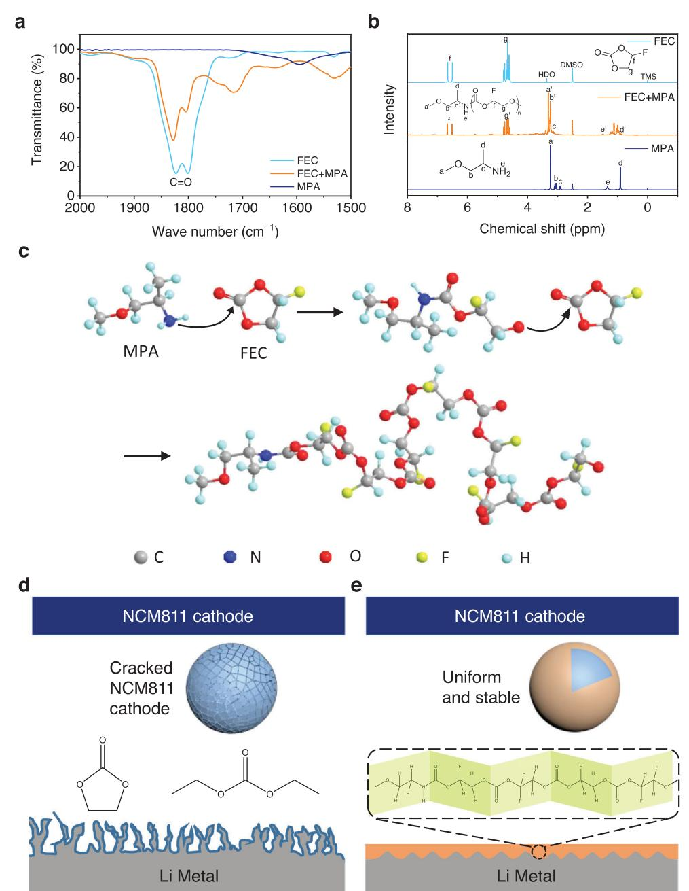
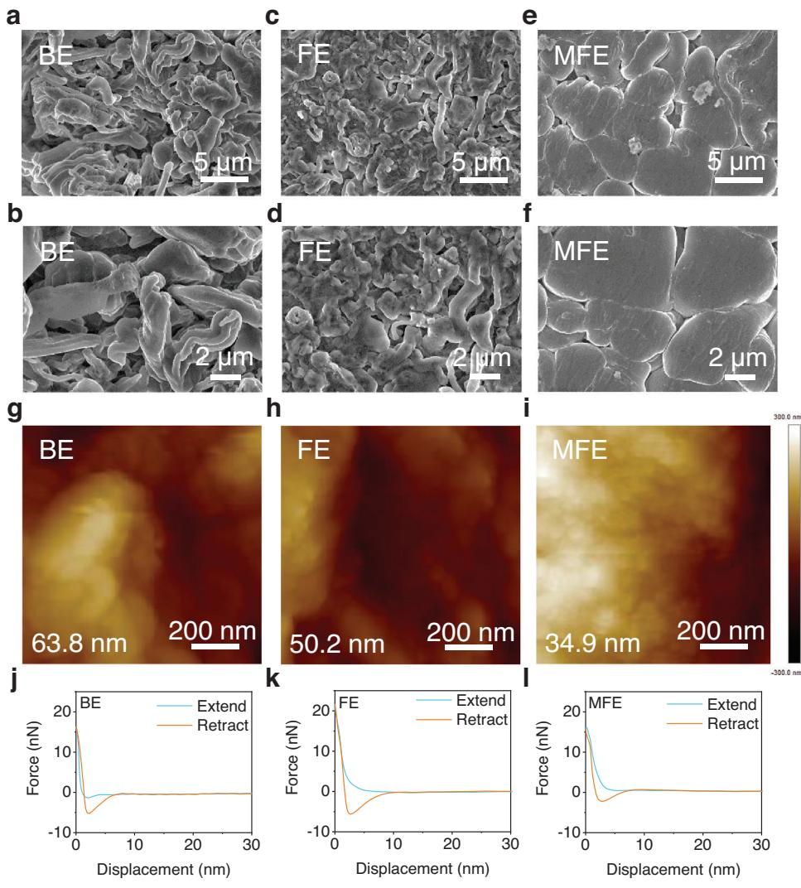
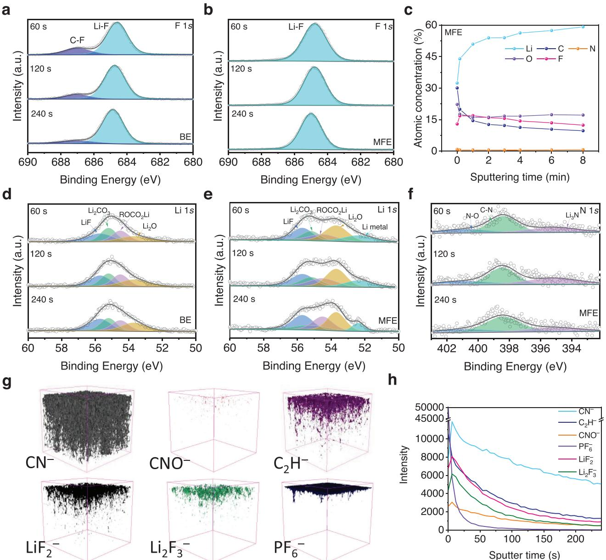
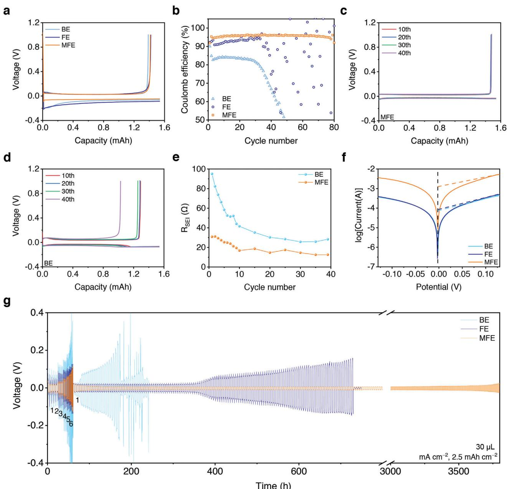
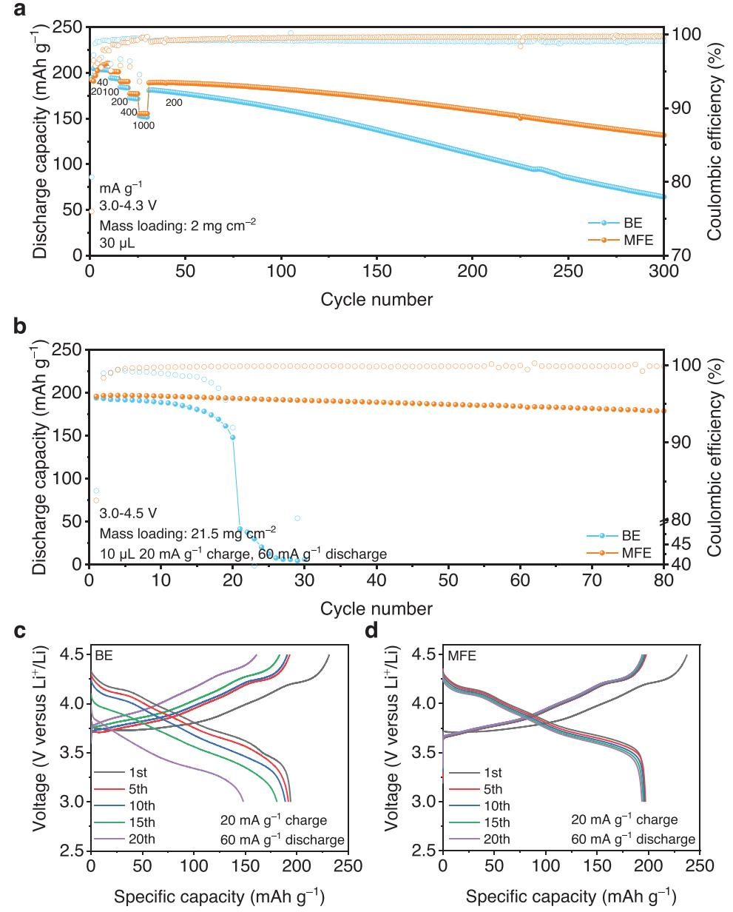
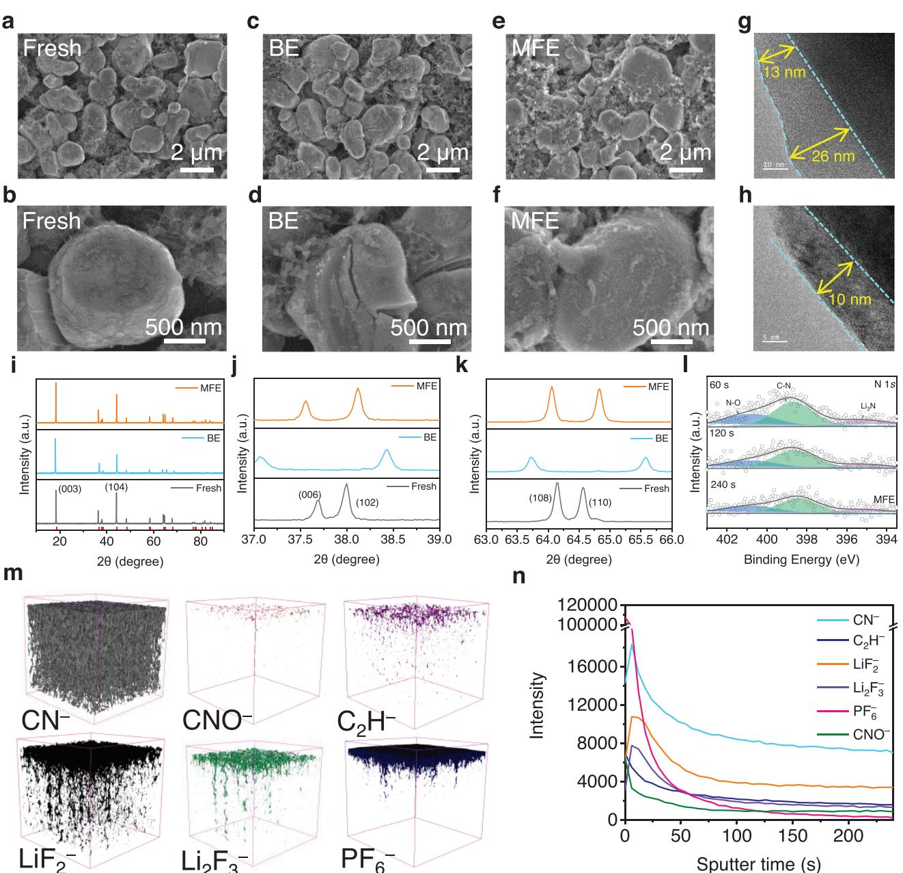

# **The Interaction in Electrolyte Additives Accelerates Ion Transport to Achieve High-Energy Non-Aqueous Lithium Metal Batteries**

*Zhaojie Li, Xueying Zheng, Siyang Ye, Chuan Ou, Yong Xie, Zhenbang Li, Fei Tian, Danni Lei,\* and Chengxin Wang\**

**Electrolyte engineering is a feasible strategy to realize high energy density lithium metal batteries. However, stabilizing both lithium metal anodes and nickel-rich layered cathodes is extremely challenging. To break through this bottleneck, a dual-additives electrolyte containing fluoroethylene carbonate (10 vol.%) and 1-methoxy-2-propylamine (1 vol.%) in conventional LiPF6-containing carbonate-based electrolyte is reported. The two additives can polymerize and thus generate dense and uniform LiF and Li3N-containing interphases on both electrodes' surfaces. Such robust ionic conductive interphases not only prevent lithium dendrite formation in lithium metal anode but also suppress stress-corrosion cracking and phase transformation in nickel-rich layered cathode. The advanced electrolyte enables Li||LiNi0.8Co0.1Mn0.1O2 stably cycle for 80 cycles at 60 mA g−1 with a specific discharge capacity retention of 91.2% under harsh conditions.**

## **1. Introduction**

Since its commercialization in 1991, lithium-ion batteries (LIBs) have brought great convenience to human beings in the past 30 years,[1] but with the increase in the power of portable electronic devices, the improvement of electric vehicle cruising range and large-scale energy storage such as power grids, traditional graphite anode materials, due to their low theoretical specific capacity (372 mAh g−1), are difficult to meet the practical requirements.[2] Lithium (Li) metal has the lowest redox potential (−3.04 V vs standard hydrogen electrode) and smaller density (0.534 g cm−3), making it a high theoretical specific capacity of 3860 mAh g−1 as an anode.[3] Combined with a high specific capacity cathode such as nickel (Ni)-rich cathode LiNi0.8Co0.1Mn0.1O2 (NCM), the energy density of the battery can be greatly improved. However, due to the extremely high reactivity of metallic Li, it will additionally react with common

E-mail: leidanni@mail.sysu.edu.cn; wchengx@mail.sysu.edu.cn

The ORCID identification number(s) for the author(s) of this article can be found under https://doi.org/10.1002/smll.202301005

**DOI: 10.1002/smll.202301005**

commercial electrolytes, resulting in uneven deposition of Li and growth of Li dendrites, and thus unstable performance and rapid capacity fading.[4] What's more, the compatibility of Ni-rich NCM and the conventional electrolyte is also very poor, resulting in phase transformation,[5] transition metal ion dissolution,[6] corrosion of conductive carbon,[7] and so on. Compared with various strategies such as surface coating,[8] separator modification[9] and electrolyte engineering[10] have received increasing attention from academia and industry because it does not require changing the battery manufacturing process. Therefore, it is critical to explore suitable electrolytes to tune the composition and structure of solid electrolyte interphase (SEI) at the anode side and a cathode-electrolyte interphase (CEI) at the cathode side at the same time.

In recent years, various significant studies on electrolyte design have been performed to enhance the interfacial compatibility between electrodes and electrolytes. Among the studies reported so far, ethers and carbonates are the two most common types of solvents used in electrolytes. Early studies focused on ether electrolytes for excellent compatibility with Li metal, superior Li+ transport kinetics due to the extremely low viscosity, and stable cycling of the cell at low temperatures, but unfortunately, ethers are generally unstable toward oxidation (*<*4.0 V vs Li/Li+) and highly flammable, greatly limiting their application in high-voltage cells. Carbonate electrolytes have higher oxidation potentials and have been successfully used in commercial LIBs, but the inherent reactivity of their carbonyl functional groups with Li metal can limit the Coulombic efficiency (CE) of Li plating/stripping to less than 90%, accompanied by the growth of Li dendrites, and porous SEI derived from carbonate solvent will lead to continuous solvent decomposition and the rapid failure of the cell during Li metal plating and stripping.[11] Highconcentration electrolytes can improve electrochemical stability by increasing the concentration of the bulk electrolyte and forcing down the amount of free solvent in the electric double layer. However, the extremely high salt concentration in the electrolyte comes at the cost of high viscosity and high cost, significantly hindering Li+ mobility and deteriorating the low-temperature performance of the cell.[12] The use of additives (typically *<* 10% by weight or volume percentage) in electrolytes is considered the

Z. Li, X. Zheng, S. Ye, C. Ou, Y. Xie, Z. Li, F. Tian, D. Lei, C. Wang State Key Laboratory of Optoelectronic Materials and Technologies School of Materials Science and Engineering Sun Yat-Sen (Zhongshan) University Guangzhou 510275, China

most feasible, cost-effective, and efficient way to circumvent the major problems hindering the development of Li metal batteries (LMBs) as innovative energy storage technologies.[13] It can improve the safety and cycle life of LMBs by forming a solid SEI layer on the Li metal surface to inhibit the generation of Li dendrites and the volume expansion of Li metal during cycling, and it can achieve fast Li+ transport and reduce the polarization potential and interfacial impedance of the cell.[14] The use of dual additives can even combine the advantages of both additives to further enhance the performance of LMBs. However, in the work reported so far, the dual additives mostly work separately, and the two additives themselves do not react and lack connection. For example, the addition of FEC and LiNO3 to the electrolyte can form an SEI layer containing both LiF and Li3N fast ion conductors,[15] which can effectively reduce the side reactions on the electrode surface at high voltages and provide fast transport channels for Li-ion diffusion,[16] but they react with Li metal to form LiF and Li3N separately, leading to the uneven spatial distribution of the two, which in turn affects the ability to withstand high currents and cycle life of the cell. Therefore, it is particularly important to generate multiple fast ion conductors simultaneously in the SEI layer and distribute them evenly in space.

Here, we report a dual additives electrolyte containing 10 vol.% fluoroethylene carbonate (FEC) and 1 vol.% 1-methoxy-2-propylamine (MPA) in a conventional electrolyte to construct a dense and uniform protective interphase containing LiF and Li3N on both Li metal and LiNi0.8Co0.1Mn0.1O2 (NCM811) surfaces. The synergistic effect of the two additives greatly promotes the electrode/electrolyte interface compatibility and achieves excellent cycle performances in Li||Li symmetric cells and Li||NCM811 full cells. Matching a thin Li anode with a commercial high-mass loading NCM811 cathode can realize high-energy-density LMBs (396.28 Wh kg−1 at coin-cell level). This work provides a simple and economical strategy to realize LMBs with high performance in commercial carbonate electrolytes.

## **2. Results and Discussion**

#### **2.1. Physicochemical Characterization of Electrolyte Solutions**

1 M LiPF6/ethylene carbonate (EC) and diethyl carbonate (DEC) (volume ratio 1:1) with 10 vol.% FEC and 1 vol.% MPA (MFE) were placed in a transparent polypropylene centrifuge tube and stored in a glove box filled with Ar, and allowed to stand at room temperature for 5 days. It can be observed that the color of the electrolyte turns from transparent to orange (Figure S1, Supporting Information), which indicates a chemical reaction has taken place. To explore the reaction mechanism between FEC and MPA, some MPA was added into an equal volume of FEC, and it can be clearly observed that a violent reaction occurred as soon as the two came into contact, and the colorless liquid quickly turned reddish-brown, produced a large number of bubbles, and released a lot of heat. The pH indicator shows that the gas is a weak alkaline gas with a pH value of ≈9 (Figure S2, Supporting Information). According to the elemental composition of the solution, it can be known that the main component of the gas is ammonia. When the reacted liquid was left standing for a period, it was found that the fluidity of the liquid decreased and it became very viscous, indicating that a polymerization reaction between FEC and MPA had occurred. We further characterized the reacted liquid by Fourier transform infrared (FTIR) spectroscopy, and the results showed that the detected peak at 3366 cm−1 assigned to –NH2 disappeared (Figure S3, Supporting Information), which confirmed the presence of –NH2 in MPA was converted into ammonia gas. As shown in **Figure 1**a, FEC has two C=O peaks with equal strength at 1828 and 1805 cm−1, while the strength of these two peaks of the liquid after the reaction decreases and the peak strength at 1805 cm−1 is lower, indicating that the chemical environment at C=O has changed, that is, the ring-opening reaction takes place on the carbonyl carbon. We also investigated the reaction products using 1H NMR spectroscopy (Figure 1b). In the 1H NMR spectrum of Figure 1b, the assignment of each peak of MPA is as follows: = 3.24 (a, s, 3H, O–CH3), = 3.07 (b, m, 2H, CH2), = 2.92 (c, m, 1H, CH), = 1.34 (e, br, s, 2H, NH2), = 0.91 (d, d, 3H, CH–CH3). The peak attribution of FEC is as follows: = 6.58 (f, dd, 1H, CH), = 4.68 (g, m, 2H, CH2). After the reactions of them, due to the electron-withdrawing effect of the acyloxy group, the peaks a′, b′, c′ move to the low field (compared with the peaks a, b, c). Meanwhile, due to the transition from –NH2 to –NH–, peak e′ shifts toward a lower field (compared to peak e) and changes from a single broad peak to a double peak. Due to the proton exchange effect of active hydrogen, its intensity decreases. Furthermore, the degree of polymerization of the reaction product when FEC: MPA = 10: 1 (by volume) was calculated through end-group analysis (Figure S4, Supporting Information). To eliminate the interference of HDO, the peak area ratio of peak g' (–CH2–) to peak d′ (–CH3) was used to calculate the degree of polymerization of the product as 165, which also confirmed the occurrence of the ring-opening polymerization reaction. We speculate that in this electrolyte system, MPA as an initiator initiated the ring-opening polymerization of FEC (Figure 1c).[17] The polymer molecular containing F and N elements may in situ generate on the surface of the Li anode and NCM cathode, and thus form a dense SEI/CEI layer containing LiF, Li3N, and organic polymers. Based on the findings discussed above, we schematically illustrate the possible SEI and CEI morphologies obtained employing the conventional electrolyte and FEC/MPA-containing functional electrolyte (MFE) in Li||NCM cells (Figure 1d,e).

#### **2.2. Morphological and Mechanical Characterizations of Li Depositions on Cu Substrates**

To understand the Li deposition behavior in different electrolytes, we assembled Li||Cu coin cells and used Cold Field Emission Scanning Electron Microscope (SEM) to observe the morphology of the deposited Li metal on the Cu. All Li||Cu coin cells were operated at a fixed current density of 0.5 mA cm−2 with a specific areal capacity limitation of 3 mAh cm−2 before cell disassembly and postmortem SEM measurements. For the cells with a basic electrolyte (BE, 1 M LiPF6 in EC/DEC (1:1 by volume)), the top views of the electroplated Li metal on the surface of the Cu electrode exhibit a typical dendritic morphology (**Figure 2**a,b). The dendritic Li metal increases the reaction area with the electrolyte, and thus the electrolyte is quickly consumed, "dead Li" (i.e., Li particles that are electronically disconnected from the current collector) is formed, and the cell exhibits a short cycle

**Figure 1.** Physicochemical characterizations of the electrolyte additives. Liquid FTIR (a) and 1H NMR (b) spectra of FEC, MPA, and their reaction products (FEC: MPA = 1: 1 by volume). c) Proposed MPA/FEC reaction mechanism. Schematic illustration of the protection mechanism of the SEI and CEI formed in BE (d) and MFE (e).

life and higher polarization potential. Even when 10% FEC was added to BE (FEC-containing electrolyte (FE)), inhomogeneous and loose Li dendrites were also observed (Figure 2c,d). In sharp contrast, uniform and dense Li deposits without dendrite are obtained with the use of MFE (Figure 2e,f) because the reaction between FEC and MPA generates a layer of viscoelastic liquid polymer, which can cover the uneven deposition area on the Li metal anode (LMA) surface through flow and rearrangement, so as to achieve uniform Li deposition.[18]

During lithiation/delithiation, SEI deformation is inevitable, but obviously, homogeneous SEI is conducive to the uniform deposition of Li and is also of vital importance to inhibit the formation of Li dendrites.[19] Through atomic force microscopy (AFM) evaluation, the root mean square height (*R*q) of the SEI formed in the MFE is 34.9 nm, lower than that in BE (63.8 nm) and FE (50.2 nm) (Figure 2g–i), indicating that the SEI film formed in MFE is flatter.[20] What's more, the force-displacement curves (Figure 2j–l) show that the SEI film formed in the MFE has the

**Figure 2.** Micromorphology and SEI properties of Li metal deposited onto a Cu substrate. SEM images (a–f), height maps (g–i), and force-displacement curves (j–l) of the deposited Li metal using the BE (a,b,g,j), FE (c,d,h,k) and MFE (e,f,i,l) at current densities of 0.5 and 3 mAh cm−2. "Extend" and "Retract" means the direction of motion of the cantilever with respect to the sample.

lowest adhesion force among the three groups, which further confirms that it is also the flattest at the atomic level. Even after multiple cycles, the SEI layer formed in the MFE (Figure S5, Supporting Information) electrolyte is still very uniform (*R*q = 40.9, 36.6, 36.5 nm) and becomes smoother (*R*q = 28.4, 32.1, 24.2 nm) as the cycle progresses, while that in BE (Figure S6, Supporting Information) and FE (Figure S7, Supporting Information) electrolytes is not uniform and stable enough. Such homogeneous SEI is instrumental in the uniform deposition of Li and can effectively prevent Li dendrites formation.

#### **2.3. Physicochemical Characterization of Li Metal Anode Interface**

To better understand the synergistic effect of the FEC-MPA dual additive in the electrolyte system, and to explore its effect on the chemical composition of the SEI layer of the LMA, highresolution in-depth X-ray photoelectron spectroscopy (XPS) was used to characterize the LMA cycled for 20 cycles (current density is 1 mA cm−2 and areal capacity is 1 mAh cm−2) in the Li||Li symmetric cell. At the initial stage of sputter etching (0 s, Figure S8, Supporting Information), the main components are the organicrelated species (C–F and ROCO2Li), which are mainly derived from carbonates. With the further increase of sputtering time (60–240 s), in the F 1*s* XPS spectra (**Figure 3**a,b), both BE and MFE have a LiF peak at 684.8 eV,[21] while only BE has a peak representing C–F at 687.0 eV,[10a] and this peak gradually disappears with the prolongation of the Ar+ etching time, which confirms that MPA and FEC can promote the production of more LiF. At the same etching rate, the Li content in MFE rises faster with time and the ratios of Li and F in MFE are higher than those in BE (Figure 3c; Figure S9, Supporting Information), indicating that the SEI layer generated in MFE electrolyte is thinner and the content of LiF is higher, which is also demonstrated in the XPS spectrum of Li 1*s* (Figure 3d,e). Compared

**Figure 3.** Ex situ postmortem physicochemical characterizations of Li metal electrodes cycled in symmetrical Li||Li cells. XPS F 1*s* spectra (a,b), atomic ratio of elements (c), XPS Li 1*s* spectra (d,e), XPS N 1*s* spectra (f) in the SEI at different XPS sputtering times. TOF-SIMS 3D reconstruction of the sputtered volume (g) and the depth profiling of several secondary ion fragments (h) of CN−, CNO−, C2H−, LiF2 −, Li2F3 − , and PF6 − on the Li surface. Li||Li cycling was obtained at a current density of 1 mA cm−2 and an areal capacity of 1 mAh cm−2 for each plating or stripping step.

with BE, the SEI layer of MFE has a higher proportion of LiF (55.7 eV)[22] to Li2O (53.7 eV),[10a] and the LiF-rich SEI can play a key role in the diffusion of Li+ and uniform deposition of Li. The abundant Li2O crystals make the SEI layer denser and have better passivation ability and ionic conductivity, which can also complement the irreversible loss of Li to a certain extent with the synergistic effect of fluorinated additives, offering the possibility to further reduce the use of Li and improve the energy density of the cell. Compared with homogeneous LiF/LiF and Li2O/Li2O, Li+ has a higher diffusion rate in the heterogeneous LiF/Li2O grain boundaries.[23] The MFE can also detect the signal of Li metal at 52.4 eV, indicating that the SEI layer is very thin and dense, and is in close contact with Li metal.[10a] The O 1*s* spectrum also shows a higher percentage of Li2O in the SEI layer of the MFE (Figure S10a,b, Supporting Information).[24] The MFE in the C 1*s* spectrum shows a higher content of C=C (Figure S10c,d, Supporting Information),[25] which may be generated by the reduction of FEC to VC.[26] Surprisingly, in the N 1*s* spectrum (Figure 3f), peaks representing Li3N (395.2 eV)[27] and N–O (400.8 eV)[28] were detected, which indicated that with the addition of MPA, Li3N with ultra-high Li-ion conductivity (10−3 S cm−1) was generated in the SEI layer of the MFE, which is favorable for the rapid transport of Li+, and N–O may be produced by oxidation of partial –NH2/–NH– during the cycling process. To further characterize the composition and distribution of the SEI layer, time-of-flight secondary ion mass spectrometry (TOF-SIMS) tests were performed (Figure 3g,h; Figures S11,S12, Supporting Information). On the Li metal surface, the composition of SEI mainly includes inorganic substances (represented by LiF2 −, Li3O+ , and Li3CO3 +), organic substances (represented by C2HO− and CHO2 −), and nitrogen-containing substances (represented by CN− and CNO−) involved in the reaction. The SEI layer formed in MFE is a very thin layer of organic and inorganic composite, which is conducive to the rapid diffusion and transport of Li+. The existence of CNO− further supports the hypothesis that −NH2 participates in the reaction and promotes the formation of polymers. In other words, the synergistic effect of FEC and MPA in the electrolyte provides LMA with a stable thin SEI layer composed of organic and inorganic substances, which helps to improve the cycle stability of LMA and the transfer rate of Li+.

#### **2.4. Electrochemical Measurements and Analysis of Li||Cu and Li||Li Coin Cells**

To further explore the reversibility of Li deposition in different electrolytes, we assembled Li||Cu batteries containing BE, FE, and MFE, all of which were first discharged to a fixed capacity of 1 mAh cm−2 at a current density of 1 mA cm−2, which allowed Li exfoliated from the LMA and deposited onto Cu foil, and then charged to 1 V at the same current density. The cell with MFE has the lowest Li deposition potential due to the improved solvation structure of the electrolyte and the formation of a thinner and denser SEI layer (**Figure 4**a). As shown in Figure 4b, the initial CE of the cell with BE was 90.1%, however, it dropped to 84.8% from the second cycle, and then rapidly dropped below 50% after 30 cycles. The CE of the cell with FE was more than 90% in the first 35 cycles and showed a large fluctuation after that. In contrast, the CE of the cells using MFE could remain stable for more than 80 cycles with an average value above 95%. Figure 4c,d and Figure S13 (Supporting Information) show the voltage curves of the batteries with MFE, BE, and FE, respectively. It can be observed that, with the progress of the cycle, the polarization potential of cell with MFE has been stable at ≈20 mV, while that of BE and FE is greater than 30 mV and tends to increase, indicating that MFE plays an important role in improving the deposition/stripping process of Li and achieving uniform deposition of Li. In order to visually demonstrate the morphological changes of LMAs during the cycling process, LMAs in various electrolytes were observed by ex situ SEM. Compare to fresh Li (Figure S14a,b, Supporting Information), the heterogeneous and loose whisker-shaped Li dendrites were observed in the BE sample (Figure S14c,d, Supporting Information) and FE sample (Figure S14e,f, Supporting Information). In the MFE electrolyte (Figure S14g,h, Supporting Information), Li appeared blocky and Li deposition was flatter and denser than in BE and FE, indicating that under the combined action of FEC and MPA dual additives, an even and stable SEI layer is formed on the surface of Li anode, greatly reducing the consumption of Li and electrolyte during the cycling process, achieving uniform deposition of Li metal and preventing the formation of Li dendrites. The thickness of LMAs at the Li plating stage after different cycles was measured (Figure S15, Supporting Information). During cycling, Li metal experienced volume expansion in all three electrolytes, but relatively speaking, in the MFE electrolyte, the volume expansion of Li metal was the smallest, indicating that the dual additives can react with the LMA to form a robust and highly elastic SEI layer and thus effectively buffer the volume expansion of the LMA. To further understand the stability of the SEI layer, we measured and fitted the electrochemical impedance spectroscopy (EIS) of Li||Li symmetric cells. The cell was charged and discharged at a current density of 1 mA cm−2 and a fixed deposition amount of 1 mAh cm−2, and the EIS spectrum was measured once after each cycle. The fitting results and the corresponding solid electrolyte interphase resistance (*R*SEI) values are shown in Figure S16 (Supporting Information) and Figure 4e. The semicircle of the Nyquist plots in the high-frequency region represents Li+ migration through the SEI.[20b] The *R*SEI of the cell after the first cycle in MFE is only 30.85 Ω, which is only one-third of that of BE (95.11 Ω). In the subsequent cycle, the *R*SEI of the cell with MFE is always much lower than that of BE. Moreover, the *R*SEI of the cell with MFE drops gradually and keeps stable, while that with BE decreased sharply and shows an upward trend after 30 cycles. This confirms that the reaction between FEC and MFE can generate a relatively uniform and dense thin SEI layer on the surface of LMA, which is conducive to the stable and fast transport of Li+. Figure 4f shows the Tafel curves of Li||Li symmetric cells with different electrolytes, and the exchange current density in MFE is 1.28 × 10−3 mA cm−2, which is significantly higher than BE (7.67 × 10−5 mA cm−2) and FE (8.37 × 10−5 mA cm−2), indicating that LMA has faster charge transfer dynamics in MFE.[29]

We also analyze and compare the cycling stability and rate performance of Li||Li symmetric cells in three electrolytes, BE, FE, and MFE. As shown in Figure 4g, while maintaining a constant capacity of 2.5 mAh cm−2, the current density was gradually increased from 1 to 6 mA cm−2. During this process, both the cells with BE and FE exhibited larger polarization than that with MFE, and when the current density returned to 1 mA cm−2, the cell with MFE continues to cycle stably for more than 3800 h, while the other two soon appear polarization increase, and then short-circuit. By gradually increasing the current density and deposition volume, as shown in Figure S17 (Supporting Information), the cell can still cycle stably in MFE for more than 1300 h when the deposition volume remains at 2.5 mAh cm−2 and the maximum current density is adjusted upward to 12 mA cm−2 (Figure S17a, Supporting Information). By adjusting the deposition amount upward to 3 mAh cm−2, the cells with BE and FE failed successively when the current density reached 12 mA cm−2 (Figure S17b, Supporting Information), while the cells with MFE still exhibited stable voltage profiles and low polarization potentials at high current densities and high Li deposition amounts. When cycled at a current density of 2 mA cm−2 (Figure S17c, Supporting Information), the cell with MFE could cycle for more than 800 h, while both BE and FE short-circuited after less than 200 h. This shows that the polymer produced by the reaction of two additives FEC and MPA can form a stable protective layer on the surface of LMA and react with Li metal to generate LiF and Li3N fast ion conductors uniformly distributed in space, which can not only reduce the reaction between Li metal and electrolyte and delay the consumption of electrolyte, but also realize the fast

**Figure 4.** Electrochemical characterizations of the Li||Cu and Li||Li cells with different electrolytes. Initial charge–discharge curves (a), Coulombic efficiency (b), and voltage profiles (c,d) of the Li||Cu cells. e) *R*SEI of the Li||Li cells with an increasing cycle number. f) Tafel curves of the Li||Li symmetric cells with different electrolytes derived from linear sweep voltammetry (LSV) tests. g) Rate capability of the Li||Li cells with different electrolytes at a capacity of 2.5 mAh cm−2.

transfer of Li ions, enhance the interface compatibility and effectively improve the cycle performance of LMBs.

#### **2.5. Electrochemical Characterization of Li||NCM811 Coin Cells**

To evaluate the effect of MFE on the cycling performance of full cells with the high-voltage cathode, we assembled Li||NCM811 full cells. The Li||NCM811 cell (the mass loading of NCM811 is 2 mg cm−2) cycled at current densities of 20 mA g−1, 40, 100, 200, 400, and 1000 mA g−1 for 5 cycles each, and finally stably cycled at a current density of 200 mA g−1. As shown in **Figure 5**a, the cell using MFE can stably cycle for more than 300 cycles while that using BE has appeared large capacity decay, and when the current density returns to 200 mA g−1 again, its discharge specific capacity still maintains 99.3% of that in the previous time, showing good cycle stability and excellent rate performance. It is noteworthy that the Coulomb efficiency of the cell with MFE is significantly lower than that with BE in the first five cycles, due to the further reaction of the Li metal with the reaction

**Figure 5.** Electrochemical energy storage of the Li||NCM811 cells with different electrolytes. a) Cycling performance of Li||NCM811 cells with different electrolytes at 20, 40, 100, 200, 400, and 1000 mA g−1 for 5 cycles and finally stabilized at 200 mA g−1 (same charging and discharging rates were used), and the cut-off voltage was 4.3 V. Cycling stability (b) and corresponding voltage profiles of the Li||NCM811 cells using the BE (c) and MFE (d) at a 4.5 V cut-off voltage, and the charging/discharging current were 20 mA g−1/60 mA g−1.

products of the two additives in the presence of current to produce the SEI layer containing LiF and Li3N, thus the cell with MFE needs to be activated during the first few cycles. In practice, one of the most basic conditions for a cell meeting commercial standards is to provide high energy density, which requires the use of thin Li metal sheets, high-loading cathodes, and limited electrolytes. However, achieving satisfactory performance under harsh conditions is a huge challenge. When using thin Li anode (≈21.9 μm, calculated from weighing and density of Li, Figure S18, Supporting Information), high mass loading NCM811 cathode (≈4 mAh cm−2), and limited electrolyte (10 μL) (N/P ≈ 1.13, E/C ≈ 2.75 g Ah−1), the LMB with MFE can provide a high specific capacity of 195.8 mAh g−1 with a capacity retention rate of 91.2% after 80 cycles (charge/discharge at a current density of 20 mA g−1/60 mA g−1) (Figure 5b). The calculated Li|MFE|NCM811 coin cell (without packaging materials) with a high energy density of 396.28 Wh kg−1 (Table S1, Supporting Information), reaching the advanced level in the field.[30] The charge–discharge voltage curves for different numbers of cycles show that the polarization of the cell with MFE is much smaller than that in BE (Figure 5c,d). EIS is also used to explore the resistance of the CEI layer (*R*CEI) of Li||NCM811 (21.5 mg cm−2) cell (Figure S19, Table S2, Supporting Information). After the first cycle, the *R*CEI of MFE is 38.15 Ω, while that of BE is 75.78 Ω. With the cycle going on, both increase slightly, but the *R*CEI in MFE is always smaller than that in BE, indicating that the CEI layer formed in the MFE electrolyte is more stable and more conducive to ion transport. To investigate the effect of the environmental temperature on the cycling performance of the cells assembled with various electrolytes (10 μL), we tested several Li||NCM811 (21.5 mg cm−2) cells in the 30–60 °C range (Figure S20, Supporting Information). When the temperature reaches 60 °C, the CE of the cell with BE shows a rapid decrease, and the MPA additive can improve the thermal stability of the electrolyte to a certain extent.

#### **2.6. Ex Situ Postmortem Physicochemical Characterizations of the NCM-Based Electrodes**

To further understand the cycling stabilization mechanism of Li||NCM811 full cells, we characterized the cycled NCM811 cathode for 20 cycles at the discharge state (mass loading: 21.5 mg cm−2, charge/discharge rate is 20 mA g−1/60 mA g−1, the voltage range is 3.0–4.5 V). From the SEM images, it can be observed that the fresh NCM811 electrodes exhibited intact spherical particles (**Figure 6**a,b), while the NCM811 cycled in BE showed severe cracks and produced some fine fragments (Figure 6c,d), caused by the volume expansion or contraction of the anisotropic lattice between grains during cycling, which will increase the interfacial area of the electrode, leading to rapid decomposition of the electrolyte and rapid decay of cell capacity.[31] In contrast, the particles of the NCM811 cathode cycled in MFE remained intact without cracking, and a dense coating was observed on the surface of the particles (Figure 6e,f). Further observation using transmission electron microscopy (TEM) (Figure 6g,h), the CEI layer produced in BE is thick and unevenly distributed. In contrast, the CEI layer formed in the MFE was thinner (≈10 nm), indicating that a thin CEI layer rich in LiF and Li3N with uniform distribution could be generated on the surface of the NCM811 cathode with the effect of both additives, which effectively inhibited the cracking of the NCM811 particles. In addition, we also compared the X-ray diffraction (XRD) patterns of the NCM811 cathode after cycling in BE and MFE (Figure 6i–k). Whether the peak intensity ratio of (003)/(104) diffraction peaks reflecting the degree of cation mixing,[32] or the separation degree of (006)/(102) peaks and (108)/(110) peaks accounting for the crystal structure of the cathode material[33] shows the NCM811 circulating in MFE is closer to the fresh NCM811 than that in the BE, so it can be concluded that the MFE electrolyte is beneficial to maintain the highly ordered hexagonal layered structure of the NCM811 cathode material and reduce the degree of cation mixing during cycling. Similarly, the composition of the CEI layer of the NCM811 cathode was investigated by XPS (Figure 6l). Similar to the case in LMA, Li3N, and nitrogen-containing organics can also be detected on the surface of the NCM811 cathode. From the F 1*s* spectra, the CEI layer formed in MFE mainly includes LiF, while that in BE still contains a large number of fluorinecontaining organics (Figure S21, Supporting Information). TOF-SIMS was used to further explore the composition of the CEI layer. As shown in Figure 6m,n and Figures S22,S23 (Supporting Information), the main inorganic component of the CEI layer formed in MFE is still LiF, accompanied by more nitrogencontaining organics, both of which are uniformly distributed on the surface of the NCM811 cathode, which again confirms that the simultaneous generation and uniform distribution of LiF and Li3N can be achieved under the synergistic effect of the dual additives.

## **3. Conclusion**

In conclusion, we developed an advanced non-aqueous carbonate electrolyte with FEC and MPA as additives. The polymerization reaction between two additives is beneficial to form a dense and uniform LiF, Li3N-containing SEI, and CEI layers on the LMA and NCM811 cathode, which enables rapid transport and uniform deposition of Li+ on the anode and inhibits the problems of structural deterioration and cation mixing on the cathode. By using a thin Li anode and a high mass loading NCM811 cathode, the Li|MFE|NCM811 cell can exhibit a capacity retention rate of 91.2% after 80 cycles, resulting in a calculated energy density of 396.28 Wh kg−1 at coin cell-level.

## **4. Experimental Section**

*Materials*: The commercial LiNi0.8Co0.1Mn0.1O2 (NCM811) electrode (cathode loading is 21.5 mg cm−2, active material ratio is 94.5 wt.%, the thickness is 70 μm) was provided by Guangdong Canrd New Energy Technology Co., Ltd. The NCM811 cathode with a mass loading of 2 mg cm−2 was prepared by following the steps. The mixture of 80 wt.% NCM811 powder, 10 wt.% acetylene black, and 10 wt.% polyvinylidene difluoride were manually ground in an agate mortar for 30 mins and then dissolved in *N*-methyl-2-pyrrolidone (NMP, Macklin) by stirring for 4 h to form a slurry. The electrode slurry was then pasted on Al foil (99.35%, 16 μm, HF-Kejing Co., Ltd., China) and dried at 80 °C under vacuum for 12 h. The basic electrolyte (BE) (1 m LiPF6 in EC and DEC (1:1 by volume) (H2O *<* 10 ppm)) and fluoroethylene carbonate (FEC) (H2O *<* 10 ppm) came from Suzhou Qianmin Chemical Reagent Company. 1-methoxy-2 propylamine (MPA, 99%, Sigma–Aldrich), was dried overnight with 4 Å molecular sieves (Sigma-Aldrich) and stored in an Ar-filled glove box (Mikrouna) (H2O *<* 0.01 ppm, O2 *<* 0.01 ppm) before use.

*Fabrication of the Cells*: The NCM811 cathode (diameter of 12 mm, thickness of 70 μm), matching commercial Li metal anode (99.95%, 400 μm, China Energy Lithium Co., Ltd.) or the thin Li metal anode (≈21.9 μm, rolled from Li block by hand), separator (Celgard 2500 porous polypropylene film) were assembled into CR2032 coin cells in an Ar-filled glove box. The amounts of electrolyte injected were 60 μL for the Li||Li and Li||Cu (9 μm Cu metal foil with a purity of 99.8% came from Guangdong Canrd New Energy Technology Co., Ltd.), 30 μL for Li||NCM811 (2 mg cm−2) and 10 μL for Li||NCM811(21.5 mg cm−2 coin cells, respectively. All the cells were tested with freshly prepared electrolyte solutions.

*Physicochemical Measurements*: The morphology and composition of the materials were analyzed using scanning electron microscopy (SEM, Regulus 8230, Hitachi, Japan) and transmission electron microscopy (TEM, FEI Tecnai G2 F30) at an acceleration of 300 kV. The surface chemical state of the Li metal anodes was analyzed through X-ray photoelectron spectroscopy (XPS, ESCALab Xi+), and the etching times were 0, 10, 60, 120, 180, 240, 360, and 480 s, while the etching times of the NCM811 cathodes were 0, 10, 60, 120, 240, 360 and 480 s. FTIR spectroscopy was performed with a Frontier FT-IR instrument at a resolution of 0.5 cm−1. Liquid-state 1H NMR spectroscopy was performed at 25 °C on a Bruker AVANCE III superconducting Fourier transform nuclear magnetic resonance 400 M instrument using deuterated Dimethyl sulfoxide (DMSO, Leyan) as solvent. XRD was conducted with an Empyrean powder X-ray

**Figure 6.** Physicochemical characterization of the cycled high-loading NCM811 cathodes with different electrolytes. SEM images of the fresh a,b) NCM811 cathode surface and after 20 cycles in the BE (c,d) and MFE (e,f). TEM analyses of the NCM811 particles after 20 cycles in the BE (g) and MFE (h). XRD of the NCM811 cathodes (i–k) before and after 20 cycles in the BE and MFE. XPS spectra of the N 1*s* (l) spectrum of the NCM811 cathodes in the MFE. TOF-SIMS 3D reconstruction of the sputtered volume (m) and the depth profiling of several secondary ion fragments (n) of CN−, CNO−, C2H−, LiF2 −, Li2F3 −, and PF6 − on the NCM811 surface after 20 cycles. All the cells were charged and discharged between 3.0 and 4.5 V at 20 and 60 mA g−1, respectively, for 20 cycles, and the voltage of the cell was 3.0 V before disassembly.

diffractometer using a Cu K radiation source. AFM measurements were performed with a Bruker Dimension Fastscan instrument. TOF-SIMS was performed with a PHI nanoTOF II times-of-flight SIMS instrument. Prior to analysis, the cells were disassembled in an Ar-filled glove box (Mikrouna) (H2O *<* 0.01 ppm, O2 *<* 0.01 ppm), and the electrode surfaces were rinsed with 1 mL of DEC (99.98%, H2O *<* 10 ppm, Suzhou Qianmin Chemical Reagent Company). After drying at 25 °C under vacuum for 30 min, the electrodes were transferred by the transfer sample holder (Thermo Fisher Scientific) with an Ar-filled or the vacuum container (in-house produced) to isolate the air.

*Electrochemical Characterizations*: To obtain the cycling and rate performance of the fabricated coin cells, they were placed in an incubator to maintain a constant operating temperature of 30 ± 1 °C and measured with a cell test system (LAND CT-2001A, Land Electronic Co., Ltd., Wuhan). Tafel curves of Li||Li symmetrical cells were performed at a scan rate of 0.1 mV s−1 between −0.13 and 0.13 V at 30 °C with an electrochemical workstation (IVIUM Vertex. One.). EIS was performed at 30 °C with an electrochemical workstation (VMP3 electrochemical workstation) (potentiostatic mode ranged from 10 mHz to 100 kHz at an amplitude of 5 mV, 10 data points per decade, and the open-circuit

30 s).

voltage time applied before carrying out the EIS measurements was

# **Supporting Information**

Supporting Information is available from the Wiley Online Library or from the author.

## **Acknowledgements**

This work was supported by the National Natural Science Foundation of China (Nos. 51972351, 51802361, 52222213), Guangdong Basic and Applied Basic Research Foundation (No. 2019B151502045), the Fundamental Research Funds for the Central Universities of China (No. 22lgqb01).

## **Conflict of Interest**

The authors declare no conflict of interest.

## **Data Availability Statement**

The data that support the findings of this study are available from the corresponding author upon reasonable request.

## **Keywords**

electrolyte additives, lithium metal batteries, uniform interphases

Received: February 6, 2023

- Revised: May 18, 2023
- Published online: May 28, 2023
- [1] a) M. Li, J. Lu, Z. Chen, K. Amine, *Adv. Mater.* **2018**, *30*, 1800561; b) N. Nitta, F. Wu, J. T. Lee, G. Yushin, *Mater. Today* **2015**, *18*, 252.
- [2] L. Wang, X. He, J. Li, W. Sun, J. Gao, J. Guo, C. Jiang, *Angew. Chem., Int. Ed.* **2012**, *51*, 9034.
- [3] a) Y. Zhao, T. Zhou, T. Ashirov, M. El Kazzi, C. Cancellieri, L. P. H. Jeurgens, J. W. Choi, A. Coskun, *Nat. Commun.* **2022**, *13*, 2575; b) J. Han, M. J. Lee, K. Lee, Y. J. Lee, S. H. Kwon, J. H. Min, E. Lee, W. Lee, S. W. Lee, B. J. Kim, *Adv. Mater.* **2022**, *35*, 2205194.
- [4] Y. Wu, D. Lei, C. Wang, *Mater. Today Phys.* **2021**, *18*, 100395.
- [5] K. Kim, D. Hwang, S. Kim, S. O. Park, H. Cha, Y.-S. Lee, J. Cho, S. K. Kwak, N.-S. Choi, *Adv. Energy Mater.* **2020**, *10*, 2000012.
- [6] D.-S. Ko, J.-H. Park, S. Park, Y. N. Ham, S. J. Ahn, J.-H. Park, H. N. Han, E. Lee, W. S. Jeon, C. Jung, *Nano Energy* **2019**, *56*, 434.
- [7] M. Metzger, C. Marino, J. Sicklinger, D. Haering, H. A. Gasteiger, *J. Electrochem. Soc.* **2015**, *162*, A1123.
- [8] a) F. Liu, Q. Xiao, H. B. Wu, L. Shen, D. Xu, M. Cai, Y. Lu, *Adv. Energy Mater.* **2018**, *8*, 1701744; b) T. Chen, F. Meng, Z. Zhang, J. Liang, Y. Hu, W. Kong, X. L. Zhang, Z. Jin, *Nano Energy* **2020**, *76*, 105068.
- [9] a) D. Lei, J. Benson, A. Magasinski, G. Berdichevsky, G. Yushin, *Science* **2017**, *355*, 267; b) M.-H. Ryou, D. J. Lee, J.-N. Lee, Y. M. Lee, J.-K. Park, J. W. Choi, *Adv. Energy Mater.* **2012**, *2*, 645.
- [10] a) Y. Zhang, Y. Wu, H. Li, J. Chen, D. Lei, C. Wang, *Nat. Commun.* **2022**, *13*, 1297; b) Z. Yu, H. Wang, X. Kong, W. Huang, Y. Tsao, D. G. Mackanic, K. Wang, X. Wang, W. Huang, S. Choudhury, Y. Zheng, C. V. Amanchukwu, S. T. Hung, Y. Ma, E. G. Lomeli, J. Qin, Y. Cui, Z. Bao, *Nat. Energy* **2020**, *5*, 526.
- [11] W. Zhang, Y. Lu, L. Wan, P. Zhou, Y. Xia, S. Yan, X. Chen, H. Zhou, H. Dong, K. Liu, *Nat. Commun.* **2022**, *13*, 2029.
- [12] G. A. Giffin, *Nat. Commun.* **2022**, *13*, 5250.
- [13] H. Zhang, G. Gebresilassie Eshetu, X. Judez, C. Li, L. M. Rodriguez-Martinez, M. Armand, *Angew. Chem., Int. Ed.* **2018**, *57*, 15002.
- [14] S. Tan, Z. Shadike, J. Li, X. Wang, Y. Yang, R. Lin, A. Cresce, J. Hu, A. Hunt, I. Waluyo, L. Ma, F. Monaco, P. Cloetens, J. Xiao, Y. Liu, X.-Q. Yang, K. Xu, E. Hu, *Nat. Energy* **2022**, *7*, 484.
- [15] a) X. Zhou, F. Zhang, X. Fu, N. Zhang, J. Huang, X. Cai, H. Ding, B. Li, L. Niu, S. Li, *Energy Storage Mater.* **2022**, *52*, 19; b) N. Piao, S. Liu, B. Zhang, X. Ji, X. Fan, L. Wang, P.-F. Wang, T. Jin, S.-C. Liou, H. Yang, J. Jiang, K. Xu, M. A. Schroeder, X. He, C. Wang, *ACS Energy Lett.* **2021**, *6*, 1839.
- [16] a) Y. Wang, F. Liu, G. Fan, X. Qiu, J. Liu, Z. Yan, K. Zhang, F. Cheng, J. Chen, *J. Am. Chem. Soc.* **2021**, *143*, 2829; b) G. Li, X. Duan, X. Liu, R. Zhan, X. Wang, J. Du, Z. Chen, Y. Li, Z. Cai, Y. Shen, Y. Sun, *Adv. Mater.* **2022**, *35*, 2207310.
- [17] D. Zhang, M. Liu, J. Ma, K. Yang, Z. Chen, K. Li, C. Zhang, Y. Wei, M. Zhou, P. Wang, Y. He, W. Lv, Q.-H. Yang, F. Kang, Y.-B. He, *Nat. Commun.* **2022**, *13*, 6966.
- [18] a) A. Li, P. Du, Z. Chen, R. Zhao, W. Huang, L. Zou, D. Huang, H. Chen, *Ionics* **2015**, *21*, 2431; b) K. Liu, A. Pei, H. R. Lee, B. Kong, N. Liu, D. Lin, Y. Liu, C. Liu, P.-c. Hsu, Z. Bao, Y. Cui, *J. Am. Chem. Soc.* **2017**, *139*, 4815.
- [19] P. Zhai, L. Liu, X. Gu, T. Wang, Y. Gong, *Adv. Energy Mater.* **2020**, *10*, 2001257.
- [20] a) H. Zhang, C. Shen, Y. Huang, Z. Liu, *Appl. Surf. Sci.* **2021**, *537*, 147983; b) D. Luo, L. Zheng, Z. Zhang, M. Li, Z. Chen, R. Cui, Y. Shen, G. Li, R. Feng, S. Zhang, G. Jiang, L. Chen, A. Yu, X. Wang, *Nat. Commun.* **2021**, *12*, 186.
- [21] G. E. Murch, R. J. Thorn, *J. Phys. Chem. Solids* **1980**, *41*, 785.
- [22] W. E. Morgan, J. R. Van Wazer, W. J. Stec, *J. Am. Chem. Soc.* **1973**, *95*, 751.
- [23] Z. Chen, B. Wang, Y. Li, F. Bai, Y. Zhou, C. Li, T. Li, *ACS Appl. Mater. Interfaces* **2022**, *14*, 28014.
- [24] F. Li, J. He, J. Liu, M. Wu, Y. Hou, H. Wang, S. Qi, Q. Liu, J. Hu, J. Ma, *Angew. Chem., Int. Ed.* **2021**, *60*, 6600.
- [25] L. El Ouatani, R. Dedryvere, C. Siret, P. Biensan, S. Reynaud, P. Iratcabal, D. Gonbeau, *J. Electrochem. Soc.* **2009**, *156*, A103.
- [26] A. L. Michan, B. S. Parirnalam, M. Leskes, R. N. Kerber, T. Yoon, C. P. Grey, B. L. Lucht, *Chem. Mater.* **2016**, *28*, 8149.
- [27] K. N. Wood, G. Teeter, *ACS Appl. Energy Mater.* **2018**, *1*, 4493.
- [28] T. Zheng, J. Xiong, X. Shi, B. Zhu, Y.-J. Cheng, H. Zhao, Y. Xia, *Energy Storage Mater.* **2021**, *38*, 599.
- [29] S. Han, Z. Li, Y. Zhang, D. Lei, C. Wang, *Energy Storage Mater.* **2022**, *48*, 384.
- [30] S. Li, W. Zhang, Q. Wu, L. Fan, X. Wang, X. Wang, Z. Shen, Y. He, Y. Lu, *Angew. Chem., Int. Ed.* **2020**, *59*, 14935.
- [31] T. R. Tanim, P. J. Weddle, Z. Yang, A. M. Colclasure, H. Charalambous, D. P. Finegan, Y. Lu, M. Preefer, S. Kim, J. M. J. A. E. M. Allen, *Adv. Energy Mater.* **2022**, *12*, 2202795.
- [32] H. Zhu, Z. Wang, L. Chen, Y. Hu, H. Jiang, C. Li, *Adv. Mater.* **2022**, *35*, 2209357.
- [33] U.-H. Kim, G.-T. Park, P. Conlin, N. Ashburn, K. Cho, Y.-S. Yu, D. A. Shapiro, F. Maglia, S.-J. Kim, P. Lamp, C. S. Yoon, Y.-K. Sun, *Energy Environ. Sci.* **2021**, *14*, 1573.

