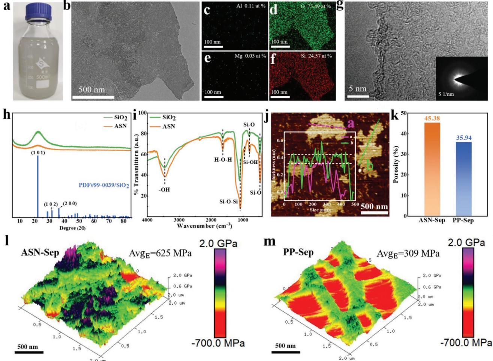
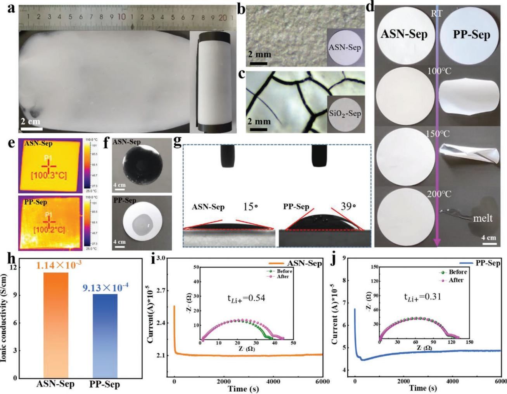
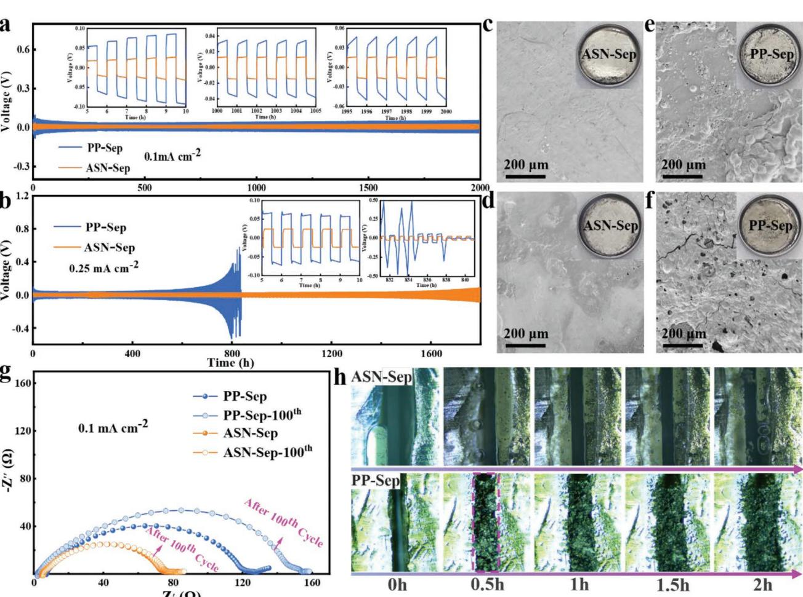
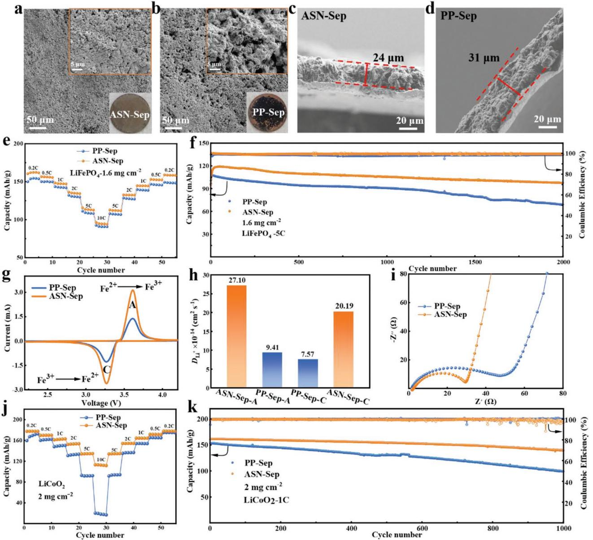
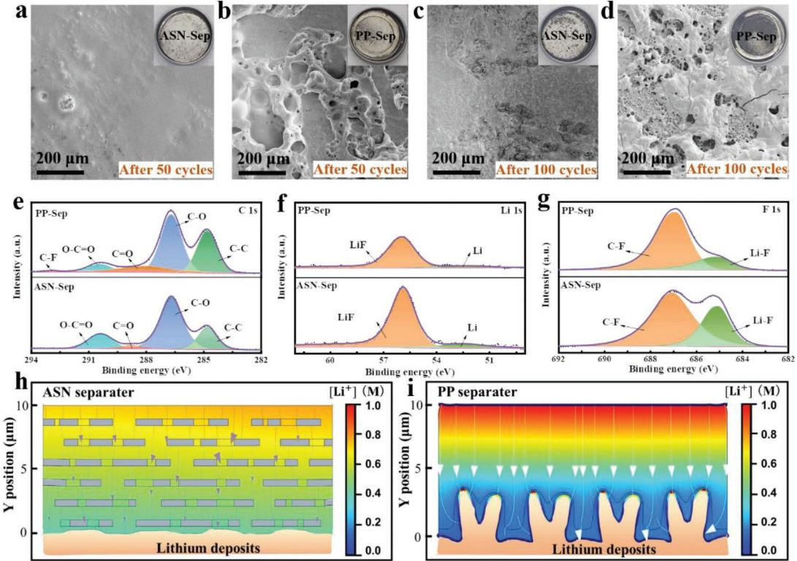

# **Clay-Originated Two-Dimensional Holey Silica Separator for Dendrite-Free Lithium Metal Anode**

*Chong Guo, Zhi-Hong Luo, Ming-Xia Zhou, Xinru Wu, Yan Shi, Qinyou An, Jiao-Jing Shao,\* and Guangmin Zhou\**

**Lithium metal anode is the ultimate choice to obtain next-generation highenergy-density lithium batteries, while the dendritic lithium growth owing to the unstable lithium anode/electrolyte interface largely limits its practical application. Separator is an important component in batteries and separator engineering is believed to be a tractable and effective way to address the above issue. Separators can play the role of ion redistributors to guide the transport of lithium ions and regulate the uniform electrodeposition of Li. The electrolyte wettability, thermal shrinkage resistance, and mechanical strength are of importance for separators. Here, clay-originated two-dimensional (2D) holey amorphous silica nanosheets (ASN) to develop a low-cost and eco-friendly inorganic separator is directly adopted. The ASN-based separator has higher porosity, better electrolyte wettability, much higher thermal resistance, larger lithium transference number, and ionic conductivity compared with commercial separator. The large amounts of holes and rich surface oxygen groups on the ASN guide the uniform distribution of lithium-ion flux. Consequently, the Li//Li cell with this separator shows stable lithium plating/stripping, and the corresponding Li//LiFePO4, Li//LiCoO2, and Li//NCM523 full cells also show high capacity, excellent rate performance, and outstanding cycling stability, which is much superior to that using the commercial separator.**

### **1. Introduction**

As the state-of-the-art energy storage system, lithium-ion batteries (LIBs) have long penetrated people's lives,[1,2] whereas

C. Guo, Z.-H. Luo, M.-X. Zhou, Y. Shi, J.-J. Shao School of Materials and Metallurgy Guizhou University Guiyang 550025, China E-mail: xjshao@gzu.edu.cn X. Wu, G. Zhou Tsinghua-Berkeley Shenzhen Institute & Tsinghua Shenzhen International Graduate School Tsinghua University Shenzhen 518055, China E-mail: guangminzhou@sz.tsinghua.edu.cn Q. An State Key Laboratory of Advanced Technology for Materials Synthesis and Processing Wuhan University of Technology Wuhan 430070, China

The ORCID identification number(s) for the author(s) of this article can be found under https://doi.org/10.1002/smll.202301428.

#### **DOI: 10.1002/smll.202301428**

LIBs based on intercalation chemistry can hardly meet the growing demand for higher energy density in the rapidly developing economy and society due to the limited specific capacity of the widelyused commercial graphite anodes. For this reason, lithium metal featuring high theoretical specific capacity (3860 mA h g−1 ) and the lowest redox potential (−3.04 V versus standard hydrogen electrode)[3,4] is considered as the "Holy Grail" anode for the next-generation lithium metal batteries (LMBs). However, the use of highly active lithium metal makes the "lithium dendrite issue" more serious in LMBs compared with LIBs. Dendritic lithium growth would bring poor electrochemical properties (for instance low Coulombic Efficiency (CE) and short cycling life) and a series of safety hazards (such as short circuits, thermal runaway, combustion, and explosion), as the result of the continuous consuming of electrolyte, irreversible deposition of lithium, and destruction of a separator.[5–7]

It has been proven to be very critical

to stabilize the lithium metal anode/electrolyte interface for obtaining long-cycling LMBs. Many strategies, such as electrolyte engineering, artificial solid electrolyte interphase (SEI) design, and separator engineering, have been widely used to address the above-mentioned issues.[8–11] Relatively speaking, separator engineering is a much easierto-operate strategy and is highly compatible with the existing battery assembly process. Through surface coating/modification or novel separator fabrication,[12–14] separator engineering is verified to be an effective way of realizing the uniform deposition of lithium and inhibiting the growth of lithium dendrites.[15–20] Separator not only serves as a barrier to prevent the direct physical contact of positive and negative electrodes, but also undertakes the mission of transferring electrolyte ions.[21–24] Commercial separators are porous polyolefin diaphragms. They are prone to thermal contraction at high temperature, easily leading to the short circuit of the battery. Also, low polarity makes these polyolefin separators have poor wettability to electrolyte, largely affecting the fast transport of electrolyte ions.[13,25–29] Many attempts have been made to coat polar inorganic materials (such as Al2O3, [30,31] SiO2, [32] boron nitride (BN),[33,34] Li6.4La3Zr1.4Ta0.6O12 (LLZTO)[35] ) onto the commercial polymer separators. Generally, these inorganic coating materials are conducive to improving the electrolyte wettability, shrinkage resistance, and mechanical strength of the separator. In addition, these coatings can also play the role of ion redistributors to guide the transport of lithium ions and regulate the uniform electrodeposition of Li, resulting in improved dendrite suppression effect and prolonged battery life.[36–38] Benefiting from the excellent high-temperature resistance and high polarity, SiO2 has been widely used as the coating materials.[39] Creatively, Goodenough et al.[40] directly spray-coated SiO2 nanoparticles on the surface of LiCoO2 (LCO) cathode to serve as the separator. The Li//LCO battery showed comparable cycle performance to that using a commercial separator under small volume of liquid electrolyte. Zhao et al.[41] assembled a layer of hollow mesoporous silica (HMS) spheres with a regular and close-packed arrangement on the LiFePO4 (LFP) cathode surface via drop-casting. The rich pore structure of HMS guided the uniform deposition of Li on the Li metal anode, realizing effective suppression toward the dendritic Li growth, and the assembled Li//LFP battery maintained a stable capacity without obvious capacity attenuation.

Thanks to the intrinsic structural characteristics, twodimensional (2D) materials have attracted enormous attention due to their considerable aspect ratio that makes them have good film-forming property.

Herein, vermiculite-originated 2D holey ASN with rich mesopores were fabricated and then used to develop an inorganic separator. Compared with the commercial polypropylene separator (PP-Sep), this ASN-Sep has higher porosity, larger Young's modulus, better electrolyte wettability, and excellent thermal stability. Li//Li symmetric cells with the ASN-Sep show stable cycling property for more than 2000 h with a small overpotential of 15 mV at 0.1 mA cm−2. When the current density increases to 0.25 mA cm−2 , it keeps a relatively low overpotential of 31 mV within 1500 h. At 1 mA cm−2 , the Li//Cu battery with the ASN-Sep shows higher CE, more stable cycling performance with lower overpotential, and thinner dead lithium deposition than that with PP-Sep. The Li//LiFePO4 battery exhibits remarkable rate capability of 119 mA h g−1 at 5C associated with a high capacity retention of 81.5% after 2000 cycles. The Li//LiCoO2 battery delivers a high discharge capacity of 161 mA h g−1 at 1C with a retention of 86.8% over 1000 cycles. Either at a high temperature of 50 °C or at a low temperature of 0 °C, the Li//LFP battery delivers higher discharge capacity and better cycling stability than that using PP-Sep. Characterizations, electrochemical measurements, and theoretical simulation reveal that the abundant mesopores on the 2D ASN endow the inorganic separator with a superior ability to guide the uniform distribution of Li ions and achieve flatten deposition of lithium. Overall, this contribution proposes a cost-effective, ecofriendly, and high temperature resistant inorganic separator to restrain dendritic Li growth for promoting the development of high-energy-density LMBs.

## **2. Results and Discussion**

To obtain the 2D ASN, vermiculite crystals (VS) (Figure S1, Supporting Information) were subjected to a series of ion exchange, dialysis purification, acid treatment, and centrifugation, finally a stable colloid suspension was received (**Figure 1**a, See details in Experiment Section).[42] The whole preparation process is environmentally friendly, since no toxic chemicals, gases, and raw materials are involved. While the main raw material of commercial PP separator is propylene that is mainly produced from liquefied gas obtained from petroleum refining and cracking, and we all know that the petrochemical industry has relatively serious environmental pollution issues.

The transmission electron microscopy (TEM) image (Figure S2a, Supporting Information) confirms the 2D morphology of the as-obtained ASN in the colloid, and many holes can be found from the TEM image with higher magnification (Figure S2b, Supporting Information). Based on the TEM energy dispersive spectroscopy (EDS) characterization results (Figure 1b-f), the 2D sheets are primarily composed of element O (75.49 at.%) and Si (24.37 at.%), indicating elements magnesium (Mg) and aluminum (Al) (Figure S3, Supporting Information) in the VS are selectively etched away during the above acid treatment and the as-resultant 2D colloids are actually silica, which is further confirmed by the inductively coupled plasma (ICP) test results (Table S4, Supporting Information). The highresolution TEM image (Figure 1g) and corresponding selective area electron diffraction (SAED) pattern (Inset in Figure 1g) show that the 2D holey nanosheets are amorphous. The X-ray diffraction (XRD) (Figure 1h) of the SiO2 powder purchased (PDF#99-0039) shows a strong characteristic absorption peak at 22°, which belongs to the plane (101) of tetragonal crystal system. It is found that ASN has a weak absorption peak at 22°, further indicating their similar crystal structure but the less ordered arrangement of Si and O in ASN. Compared with the Fourier transform infrared spectrum (FTIR) of the as-purchased SiO2 (Figure 1i), the ASN possess an additional absorption peak at 956 cm−1 that is assigned to the tensile vibration of Si-OH,[43] indicating the existence of surface -OH groups on the ASN. The XPS characterization results (Figure S4a-c, Supporting Information) also confirm the successful etching of the Mg and Al atoms during the transformation of VS to ASN. In the XPS survey spectrum of VS, the characteristic peaks attributed to elements O, Si, Al, Mg, and C are observed, whereas elements Al and Mg cannot be found in ASN. The XPS O 1s peak of VS (Figure S4d, Supporting Information) can be deconvoluted into Al−O, Mg−O, and Si−O bonds with binding energy at 529.7, 531.2, and 532.7 eV, respectively, whereas only the Si−O signal locating at 532.9 eV is detected in the O 1s peak of ASN, indicating the removal of Mg and Al. It is reported that the binding energy of Al 2p, Si 2p, and O 1s spectra in XPS of aluminosilicate system is related to the ratio of Si to Al, and the greater the ratio, the higher the binding energy.[44,45] In addition, the characteristic of SiO2 is that the binding energy of Si 2p and O 1s spectra is much higher. The disappearance of Mg and Al changes the chemical environment of Si and O, and thus the Si 2p (Figure S4e, Supporting Information) peaks in ASN shift to higher binding energies compared with those in VS. Although both ASN and the as-purchased SiO2 have the same elements O and Si, the XPS O 1s (Figure S4d, Supporting Information) and Si 2p (Figure S4e, Supporting Information) peaks of ASN located at lower binding energies than those of the as-purchased SiO2, which is likely due to the electron shielding effect of the surface hydroxyls (-OH) on ASN.

**Figure 1.** a) Photograph of the ASN suspension. b) TEM image of ASN, and c-f) the corresponding elemental mappings. g) High-resolution TEM image of ASN. Inset in (g): the corresponding SAED pattern of ASN. h) XRD patterns and i) FTIR spectra of the ASN and the silica nanoparticles aspurchased. j) AFM image and the corresponding height profiles of the ASN. k) Porosity and Young's modulus of the as-prepared l) ASN-Sep and the commercial m) PP-Sep.

Atomic force microscopy (AFM) characterization (Figure 1j and Figure S5, Supporting Information) further confirms the 2D morphology of ASN with their lateral size mainly ranging from 150 to 350 nm, and the height profiles (Inset in Figure 1j) reveal that the ASN sheets have a thickness of ≈0.45 nm that equals the sum of the diameters of one oxygen atom (≈0.15 nm) and one silicon atom (≈0.25 nm). Besides, the sharp drops in the height profiles indicate the black spots on the AFM image are holes on the sheets, being consistent with above TEM characterization results. It is proposed that these holes can work as additional ion transport channels and shorten ion transport distance perpendicular to the ASN-Sep. Mercury porosity analysis shows that the ASN-Sep has higher porosity (45.38%) (Figure 1k) than the PP-Sep (35.94%), the larger porosity can help reducing ion transport distance and resistance. In addition, AFM peakforce quantitative nanomechanical mapping (PF-QNM) demonstrates that the ASN-Sep possesses much higher average Young's modulus (625 MPa) (Figure 1l,m) than the PP-Sep (309 MPa). High mechanical strength is beneficial for inhibiting dendritic lithium growth and thereby enhancing battery safety.[46–49] It is worth noting that there are some irregular regions with lower Young's modulus for the ASN-Sep, which is ascribed to the gaps among the ASN sheets as the result of the uneven separator surface (Figure S6, Supporting Information). This may be the reason why the ASN-Sep shows poor toughness as verified by the tensile test (Figure S7, Supporting Information), in which the higher Young's modulus of ASN-Sep is further confirmed. Notably, vermiculite is a kind of low-cost natural clay mineral abundant in nature. The unit price of the ASN-Sep is calculated to be ≈27.89 RMB m−2 , which is lower than the market price of the commercial PP separator (29.5 RMB m−2) (Tables S2 and S3, Supporting Information, see details in Supporting Information).

**Figure 2**a shows the photo of a typical ASN-Sep bladecoating on the LiFePO4 cathode, which can be rolled (Inset in Figure 2a) without cracks appearing on the separator surface, indicating its excellent bendability. After being folded in half twice (Figure S10, Supporting Information), no cracks can be observed on the surface of ASN-Sep by naked eyes or even by optical microscope (Figure 2b). The superior mechanical **www.advancedsciencenews.com**

**Figure 2.** a) The digital photo of ASN-Sep coating on the LFP cathode, the inset is the rolled ASN-Sep. Optical microscope images of b) ASN-Sep and c) SiO2-Sep. d) Thermal stability test, e) infrared thermal imaging photos heated by a 100 °C point heat source after 10 min, and f) electrolyte infiltration photos of ASN-Sep and PP-Sep. g) Electrolyte contact angle test of the ASN-Sep and PP-Sep. h) The compared ionic conductivities of ASN-Sep and PP-Sep. Chronoamperometry profiles of Li//Li symmetric cells with the i) ASN-Sep and j) PP-Sep. Insets in (i-j): the Nyquist plots of the two symmetric cells before and after polarization.

flexibility of the ASN-Sep is attributed to the intrinsic large aspect ratio of 2D morphology that endows the ASN with excellent film-forming properties. In sharp contrast, the aspurchased SiO2 particle-coated separator (denoted as SiO2-Sep) (See details in Experiment Section, Supporting Information) of 30 µm (Figure S11a, Supporting Information) in thickness readily falls off the cathode surface (Figure S11b, Supporting Information), and many obvious cracks appear (Figure 2c). Even decreasing the thickness to 20 µm (Figure S11c, Supporting Information), cracks can be found under the optical microscope (Figure S11d). Thermal stability has been acknowledged as one of the most crucial properties of next-generation battery separators. The PP-Sep experiences obvious shrinkage when the temperature reaches 100 °C and completely decomposes at 200 °C (Figure 2d). By contrast, the ASN-Sep maintains structural integrity even when the temperature increases to 200 °C. ASN-Sep and PP-Sep were heated using a point heat source of 100 °C, and the temperature distribution of these two separators was observed by an infrared thermal imager (Figure 2e). Compared with PP-Sep, it is obvious that ASN-Sep obtained a more uniform heat distribution, which can avoid local thermal runaway during any short-circuiting of batteries and could provide better safety. In addition, ASN-Sep has better flame retardant ability than commercial PP separator as shown in the combustion test (Figure S12 and Video S1–3, Supporting Information) thanks to the intrinsic high-temperature stability of the 2D silica. The electrolyte wettability of the two separators to the electrolyte is evaluated by dropping a drop of electrolyte on the surfaces (Figure 2f). The electrolyte spreads rapidly on the surface of the ASN-Sep, whereas the electrolyte droplet can still be observed on the PP-Sep surface after 30 s. Compared with the PP-Sep, the much lower contact angle (Figure 2g) of the ASN-Sep is expected to bring fast ion transport kinetics, low impedance, and good rate performance for batteries.[50] To confirm the above assumption, stainless steel (SS)//SS coin cells using ASN-Sep and PP-Sep were assembled, respectively. Based

**www.small-journal.com**

on the electrochemical impedance spectroscopy (EIS) measurement results (Unless otherwise specified, all the following electrochemical tests were carried out at 30 °C), the ASN-Sep exhibits a higher ionic conductivity of 1.14 × 10−3 S cm−1 than that of the PP-Sep (9.13 × 10−4 S cm−1 ) (Figure 2h and Figure S13a, Supporting Information). Li//Li symmetric cells were further assembled to investigate the lithium ion transfer number (*t*Li+) of ASN-Sep and PP. The *t*Li+ was calculated to be 0.54 for the ASN-Sep (Figure 2i), which is much higher than that (0.31) of PP-Sep (Figure 2j). In addition, the electrochemical performance of this work is compared with those of previous reports for lithium metal batteries in Table S1 (Supporting Information). FTIR spectra (Figure S13b, Supporting Information) demonstrate that the signal at 967 cm−1 assigning to the Si–OH on the ASN gradually weakens with the increased temperature and almost vanishes at 500 °C, indicating the disappearance of the surface –OH groups. The separator based on the annealed ASN at 500 °C (denoted as ASN-500-Sep. See details in Supporting Information) was also prepared to study the effect of the surface –OH groups on the separator properties. It is found that the ASN-Sep and ASN-500-Sep have comparable ionic conductivity (Figure S13c, Supporting Information) and *tLi+* (Figure S13d,e, Supporting Information). It is suggested that the Grotthuss mechanism[51–53] governs the transport of Li ions in the ASN-Sep, in which coordinated hopping of Li ions between the exposed O atoms on the 2D surfaces of ASN accelerates the ionic mobility, and the high *tLi+* is ascribed to the surface O atoms on the ASN that promote the dissociation of lithium salts. Furthermore, the linear sweep voltammetry (LSV) curves of the Li//SS asymmetric coin cell demonstrate that the ASN-Sep and PP-Sep have comparable electrochemical stability windows (ESW) of ≈4.5 V (Figure S13f), further hinting at the great potential of the ASN-Sep as an alternative to the commercial PP-Sep.

To compare the dendritic lithium suppression ability of the ASN-Sep, the Li plating/stripping is investigated by testing the Li//Li symmetric cells using the PP-Sep and ASN-Sep as the separator, respectively. The cell with ASN-Sep exhibits a small overpotential (15 mV) and can be steadily cycled for over 2000 h at 0.1 mA cm−2 (**Figure 3**a), while the cell using PP-Sep shows a higher overpotential of 35 mV. As the current density increasing to 0.25 mA cm−2 (Figure 3b), the ASN-based cell still displays steady cyclability for 1500 h with a small overpotential of 31 mV, whereas significant voltage fluctuation is found for the PP-Sep-based cell only after 700 h together with a large overpotential (≈500 mV) after 830 h. In addition, ASN-Sep can circulate stably for 800 h and 300 h at 0.5 mA cm−2 and 1 mA cm−2 , respectively (Figure S14, Supporting Information). These results reveal that the ASN-Sep enables a highly reversible Li plating**/**stripping process, which is also confirmed by the SEM characterization on the Li surface (Figure 3c-f). The Li surface of the cycled ASN-based cells is still smooth after 100 cycles (Figure 3c) or 170 cycles (Figure 3d) at 0.1 mA cm−2 , and no dendrites can be observed. On the contrary, the surface of cycled PP-based cells shows rough and moss-like morphology after 100 cycles (Figure 3e) as well as obvious holes and cracks over 170 cycles (Figure 3f). These results demonstrate that the ASN-Sep can guide the uniform deposition of lithium. The electrochemical impedance spectroscopy spectra of both cells before and after cycling are compared (Figure 3g). The interfacial impedance of the ASN-Sep-based cell is 80 Ω before cycling and barely changes after 100 cycles at 0.1 mA cm−2 , while that of the PP-Sep-based cell increases from 127 to 153 Ω, indicating the much more stable electrolyte/electrode interface endowed by the ASN-Sep. The in situ optical microscopic (OM) observation was also performed on the lithium symmetric cells to investigate the Li plating/stripping process at 5 mA cm−2 (Figure 3h). For the ASN-Sep-based cell, almost no dendrites are observed after 2 h. By contrast, obvious dendrites (indicated by a pink dashed rectangle) appear after 0.5 h for the PP-Sepbased cell and grow rapidly until filling the gap between the two electrodes. These results demonstrate the excellent dendritic lithium suppression ability of the ASN-Sep, which is much superior to the commercial PP-Sep. It is suggested that the rich holes on the ASN play the role of Li+ redistributors and guide the uniform deposition of lithium, the excellent electrolyte wettability of ANS-Sep contributes to rapid ion transport, and the higher Young's modulus of ASN-Sep is beneficial for inhibiting the growth of lithium dendrites, which finally results in stable lithium plating/stripping and dendrite-free Li electrodes.

CE is an indicator to evaluate the lithium utilization during the plating/stripping cycling, and hence coin-type Li//Cu cells with ASN-Sep and PP-Sep were assembled. When the current density is 1 mA cm−2 (Figure S15a, Supporting Information), the cell based on ASN-Sep keeps the CE as high as 97% in the first 40 cycles, and then drops to 73% after 60 cycles. On the contrary, the CE of PP-based batteries declined rapidly from 90% at the beginning to 27% after 60 cycles. From the voltage profiles at 1 mA cm−2 (Figure S15b, Supporting Information), the discharge capacities of the Li//Cu cell using ASN-Sep are greater than those of the cell using PP-Sep after both 10th and 50th cycles. As shown in Figure S15c, Supporting Information, when the capacity is 0.2 mA h, the overpotential in the upper part of the voltage curve is taken as the reference. After 10 cycles, although the overpotential of cells with ASN-Sep and PP-Sep is ≈50 mV at 0.2 mA h, the overpotential of PP-Sep is unstable in the whole capacity range. After 50 cycles, the overpotential of the cell using ASN-Sep remained relatively stable (42 mV), while the overpotential of the cell using PP-Sep (76 mV) increased with the capacity. The average CE of Li//Cu cell is investigated according to the way reported by Aurbach et al.[54,55] The two cells show comparable average CE (Figure S16, Supporting Information). Furthermore, the surface morphology of Cu foil electrode and the thickness of the deposited Li are examined by SEM (Figure S17, Supporting Information). At 4 mA h cm−2 , the lithium deposit on the Cu foil surface of the ASN-Sep-based cell is relatively uniform and dense (**Figure 4**a) with a thickness of ≈24 µm (Figure 4c), whereas the cycled PP-Sep-based cell shows more rough, porous, and fluffy lithium deposit (Figure 4b) with ≈31 µm in thickness (Figure 4d) and obvious black substance on the Cu foil surface (Inset in Figure 4b). The element mappings corresponding to the deposited lithium are shown in Figure S18, Supporting Information. Ideally, the deposited Li with area capacity of 4 mA h cm−2 has a theoretical thickness of 19.4 µm with zero porosity, and thus the porosities of the deposited lithium are calculated to be 23.71% and 59.79% for ASN-Sep and PP-Sep, respectively. This observation suggests that ASN-Sep can guide the uniform deposition

**Figure 3.** Voltage curves of Li/Li symmetric cells cycled at a) 0.1 mA cm−2 and b) 0.25 mA cm−2 with the PP-Sep and ASN-Sep. SEM images of lithium electrode surface of ASN-Sep-based battery after c) 100 and d) 170 cycles. SEM images of lithium electrode surface of PP-Sep-based battery after e) 100 and f) 170 cycles. g) Nyquist plots of the symmetric cells using the PP-Sep and ASN-Sep before and after 100 cycles at 0.1 mA cm−2. h) In situ optical microscopic observation on the dendritic lithium growth in the symmetric cells using the ASN-Sep and PP-Sep.

of lithium ions, thus effectively inhibiting the formation of lithium dendrites in lithium metal rechargeable batteries.

**www.advancedsciencenews.com**

To evaluate the real application of the ASN-Sep, the Li//LFP coin cells were assembled. The weight ratio (Figure S19, Supporting Information) of ASN and the adhesive PVDF-HFP as well as the thickness of the ASN-Sep are optimized (Figures S20–21, Supporting Information). Ultimately, the ASN-Sep with 30 µm thick was selected for the later investigation. The galvanostatic charge-discharge (GCD) curves at different cycles (Figure S23a,b, Supporting Information) show the excellent cycling stability of the cell using ASN-Sep. The GCD profiles of the two cells at 1C (Figure S23c, Supporting Information) shows that the ASN-Sep-based cell has higher discharge capacity (149 mA h g−1 ) and smaller polarization voltage (0.082 V) than the PP-Sepbased cell (137 mA h g−1 , 0.087 V), indicating the rapid ion transport in the ASN-Sep based cell. Figure 4e compares their rate performance, the cell with ASN-Sep delivers higher discharge capacities than the PP-Sep-based cell at all the rates. Furthermore, the ASN-Sep-based cell shows stable longterm cycling performance and higher capacities during the cycling at 5C (Figure 4f). Notably, a slight increase of discharge capacity in the first dozen of cycles is observed during the long-term cycling at 5C, such a phenomenon is obvious under high C-rates and has also been reported in previous literature,[56] which is possibly attributed to the gradual infiltration of electrolyte into the cathode materials during the first few cycles. During the assembly of ASN-Sep-based cells, the electrolyte is dropped on surface of ASN-Sep that is coated on the cathode. Whereas the electrolyte is directly dropped on the cathode surface during the assembly of PP-Sep cell. The average CE of the ASN-Sep-based cell is higher (99.56%) than the PP-Sep-based cell (98.50%) over the 2000 cycles. In addition, the ASN-Sep retains a high capacity of 97 mA h g−1 after 2000 cycles, corresponding to the retention of 81.5%. By contrast, only 68 mA h g−1 and a retention of 63.6% are obtained for the PP-Sep-based cell after the cycling. At lower current densities of 0.2C, 0.5C, and 1C (Figures S24–S25, Supporting Information), the ASN-Sep-based battery also possess higher capacities and better cycling performance than the PP-Sepbased battery. It is proposed that the excellent electrolyte wettability and high porosity of ASN-Sep are responsible for the accelerated lithium ion transport, bringing about enhanced

**www.small-journal.com**

**www.advancedsciencenews.com**

**Figure 4.** Morphology of the Li deposition on Cu surface of a) ASN-Sep and b) PP-Sep. Thickness of the lithium deposition on Cu surface with the c) ASN-Sep and d) PP-Sep. e) The rate performance of PP-Sep and ASN-Sep. f) Long-term cycling performance of Li//LFP at 5C. g) CV curves at 0.5 mV s−1 , h) lithium-ion diffusion coefficient, and i) Nyquist plots of the Li**//**LFP cells with PP-Sep and ASN-Sep. j) Rate performance and k) long-term cycling property at 1C of the Li//LCO cells with PP-Sep and the ASN-Sep.

electrochemical kinetics, low interfacial impedance, and good rate performance.

The cyclic voltammetry (CV) curves of the Li//LFP cells at different scan rates are recorded (Figure S26a,b, Supporting Information). The cathodic peak at ≈3.3 V and anodic peak at ≈3.5 V are related to the electrochemical reaction between LFP and Li ions. The peak at 3.3 V corresponds to the reduction of Fe3+ to Fe2+ accompanied by the intercalation of Li ions, while the peak at 3.5 V is ascribed to the oxidation of Fe2+ to Fe3+ associated with the extraction of Li+. [57,58] At the same scan rate of 0.5 mV s−1 (Figure 4g), the peak current of the ASN-Sep-based battery is almost 1.5 times higher than that of the PP-Sep-based battery, indicating significantly enhanced reaction kinetics. The peak current (*Ip*) shows a linear relationship as a function of the square root of scan rate (*v*0.5) (Figure S26c, Supporting Information). The lithium-ion diffusion coefficient (*DLi+*) for the ASN-Sep-based cell is calculated to be much larger than that for the PP-Sep based cell (Figure 4h), indicating much faster Li ion diffusion kinetics endowed by the ASN-Sep.[59,60] As shown in the Nyquist plots (Figure 4i), the ASN-Sep-based cell shows smaller charge transfer resistance (27 Ω) than the PP-Sep-based cell (45 Ω), further indicating the faster electrochemical kinetics. To investigate the compatibility of the ASN-Sep with high-voltage cathodes, Li//LiCoO2 (Figure 4j-k) and Li//NCM523 (Figure S27,

Supporting Information) coin-type cells were also assembled. The Li//LiCoO2 and Li//NCM523 cells with ASN-Sep display better electrochemical performance than those with PP-Sep. Specifically, the Li//LiCoO2 cell with the ASN-Sep show has a much larger discharge capacity of 112 mA h g−1 at 10C and a higher initial discharge capacity of 161 mA h g−1 with better capacity retention (86.8%) over 1000 cycles at 1C than the PP-Sep based cell (28 mA h g−1 , 153 mA h g−1 , 64.8%). For the NCM523, the cell with ASN-Sep has higher discharge capacities at all C-rates (Figure S27a, Supporting Information), as well as better cycling performance at 1C over 330 cycles associated with higher initial discharge capacity (143 mA h g−1 ) and capacity retention (83.9%) (Figure S27b, Supporting Information) than that using PP-Sep (131 mA h g−1 , 80.9%). The electrochemical performance of the Li//LFP batteries with the ASN-Sep were also tested at a higher temperature of 50 °C (Figure S28, Supporting Information) and a lower temperature of 0 °C (Figure S29, Supporting Information). Under these extreme conditions, the electrochemical performance of the battery using ASN-Sep is still better than that of the battery using PP-Sep, because its excellent high-temperature resistance ensures that it does not have the shrinkage of micropores like polypropylene. Finally, the Li//LFP pouch cells were assembled to evaluate the real application of the ASN-Sep. The corresponding pouch cell has a stable open-circuit voltage (OCV) of 3.419 V (Figure S30a, Supporting Information) and can power a LEDs with "GZU" letters (Figure S30b). Under folded state (Figure S30c-d) and even rigorous conditions including corner-cut (Figure S30e-f and Video S4, Supporting Information) or nail piercing (Figure S30g-h and Video S5, Supporting Information), the pouch cells can still work normally, demonstrating its high safety.

SEI deriving from the side reaction between lithium metal anode (LMA) and electrolyte is an electronically-insulating but ion-conductive layer and plays a crucial role in battery performance. Hence, the surface morphologies of the Li metal anodes after 50 cycles at 1C are observed using SEM (**Figure 5**a,b). The Li surface in the cycled Li//LFP cell using ASN-Sep has a relatively smooth surface (Figure 5a), whereas that in the cycled cell using PP-Sep exhibits a rough surface with moss-like dendrites (Figure 5b). After cycling over 100 cycles at 1C, the cycled Li surface in the ASN-Sep-based cell only produces a small amount of dead lithium (Figure 5c), while the PP-based cell shows coarse moss-like dendrites, obvious holes, and cracks (Figure 5d), as well as a large amount of black dead lithium, is generated and visible to naked eyes (Inset of Figure 5d). The surface morphology of LMA in the Li//LCO cells after 50 cycles at 1C was also characterized by SEM. The lithium anode with the ASN-Sep has a relatively smooth surface (Figure S31a, Supporting Information), while the lithium anode with the PP-Sep shows a porous and loose rough surface (Figure S31b), further demonstrating the better dendritic inhibition ability of the ASN-Sep than the PP-Sep.

The chemical components of the cycled Li surface in the Li//LFP cells were analyzed by XPS. In the C 1s spectrum (Figure 5e) of the recycled PP-based cell shows C–C, C–O, C≐O, C≐O–C, and CF3 signals originating from the decomposition of electrolyte, together with weak C-F at 292.8 eV, by the contrast, no C-F signal is found for the ASN-Sep based cell, which is suggested that the surface oxygen groups on ASN contribute to the cleavage of C–F in the electrolyte.[61] In the Li 1s spectrum (Figure 5f), the peak area of Li–F signal for the ASN-Sep-based cell is significantly larger than that for the PP-Sepbased cell. The F 1s spectrum (Figure 5g) of the two samples have two peaks at 685.1 and 687.0 eV, belonging to Li–F and C–F bonds, respectively, associated with stronger Li–F peak for the ASN-Sep based cell. As we know, lithium fluoride (LiF) is a favorable constitute of SEI and contributes to realizing a stable electrode/electrolyte interface and inhibiting the lithium dendrites thanks to its high interfacial energy, high chemical stability, and a low Li+ diffusion barrier. It is believed that the surface oxygen groups on ASN possibly affect the decomposing mechanism of the electrolyte and guide the formation of LiF-rich SEI, which thus leads to the better electrochemical performance of ASN-Sep-based cells than that of PP-Sep-based cells.

The mechanism of ASN-Sep in promoting the uniform distribution of lithium ions and guiding them to deposit on the lithium electrode was simulated by using COMSOL Multiphysics 6.0 based on the finite element method (See details in Support Information simulation part). Figure 5h,i demonstrate the lithium-ion transport and deposition through the ASN-Sep and PP-Sep. The rich holes on the ASN serve as ion distributors that realize the uniform distribution-deposition of Li ions on the electrode surface and enable fast lithium ion flux by providing more channels, leading to a relatively stable Li/electrolyte interface and inhibiting the lithium dendrite growth effectively. While, the PP separator easily leads to uneven lithium ion flux, resulting in uncontrollable dendrite growth. The scheme (Figure S33, Supporting Information) demonstrates the influence mechanism of the ASN-Sep and PP-Sep on the lithiumion transport and lithium plating/stripping behavior. In ASN-Sep, lithium ions can migrate through both the holes in ASN and the interstitial voids between nanosheets, which realizes fast lithium ion flux and uniform lithium ion distribution, significantly enhancing electrochemical kinetics and inhibiting the dendritic lithium growth. In contrast, the low porosity, poor wettability, and limited transport channels in PP-Sep leads to uneven lithium deposit on the electrode surface.

#### **3. Conclusion**

In conclusion, an inorganic separator derived from 2D holey ASN originating from low-cost vermiculite clays is developed. Comprehensive simulation and characterization reveal that the abundant holes and surface oxygen groups on the ASN guide the homogeneous distribution of lithium-ion flux and uniform deposition of Li, as well as promote the cleavage of C-F and lead to the formation of LiF-rich SEI. Therefore, the formation of Li dendrites and the continuous consumption of electrolyte are well inhibited in the LMBs, and the ASN-Sep provides extremely stable Li electroplating/stripping for 2000 h at 0.1 mA cm−2 . Consequently, both the Li//LFP and Li//LCO batteries with the ASN-Sep show high capacity, excellent rate performance, and outstanding cycling stability, superior to that of the cell using the commercial PP separator. This work sheds light on the design of a novel inorganic separator with high-temperature resistance, large porosity, excellent

**Figure 5.** SEM images of the cycled lithium metal surfaces after a,b) 50 and c,d) 100 cycles in the cells with the ASN-Sep and PP-Sep. e) The XPS C 1s, f) Li 1s, and g) F 1s spectra of the cycled lithium anode surface in the LFP//Li cells. The simulated lithium ion concentration distribution profiles throughout the h) ASN-Sep and i) PP-Sep.

affinity to electrolyte, and effective dendritic lithium suppression ability for the application in lithium batteries.

#### **4. Experimental Section**

*Chemicals*: Commercial PVDF-HFP (*Mw* = 3 × 105 g mol−1 ) and PVDF(*Mw* = 3 × 105 g mol−1 ) were purchased from Aladdin; All these polymers were desiccated in a vacuum oven at 60 °C prior to use; N, N-dimethylformamide (DMF) and N-methyl-2-pyrrolidone (NMP) were purchased from Shanghai Aladdin Bio-Chem Technology Co., Ltd. LiFePO4, LiCoO2, NCM523 and organic electrolyte solution (1.0 m LiPF6 in EC:DMC:EMC = 1:1:1 Vol %) was purchased from Guangdong Canrd New Energy Technology Co., Ltd. Hydrochloric acid was purchased from Chongqing Chuandong Chemical (Group) Co., Ltd. Nano-silica was purchased from Aladdin with a purity of 99.5%. Vermiculite was purchased from Sigma-aldrich.

*Preparation of Two-Dimensional Holey Amorphous Silica Nanosheets (ASN)*: Two-dimensional (2D) vermiculite nanosheets were prepared from layered vermiculite crystals (VS) by a two-step ion exchange method. Specific method: vermiculite (10 g) crystals were stirred and peeled in saturated sodium chloride (NaCl) (300 mL) solution for 48 h (oil bath at 80 °C), then vacuum filtered with deionized (DI) water, washed several times, and drained. (Drain the water, no need to air dry). The rinsed and drained samples were added to (2 m) lithium chloride (LiCl) solution, stirred, and peeled for 48 h (oil bath at 80 °C), then vacuum filtered with deionized water, thoroughly washed, and then dialyzed until after detecting no chloride ion (silver nitrate solution), carry out suction filtration, and drain the excess water (the same can be done, no need to air dry). The drained samples were placed in a conical flask filled with hydrochloric acid (HCl) (150 mL, 36 wt.%), stirred continuously in an oil bath at 80 °C for 24 h, then rinsed with DI water to neutrality and drained (same as above). The drained samples were then placed in a conical flask containing HCl (150 mL, 36 wt.%) while magnetically stirred for 48 h for second acid treatment, and then rinsed with deionized water to neutrality, and the aqueous solution was subjected to centrifuge (1000 r min−1 , 10 min) to take the supernatant, freeze-dry to obtain a white powder, which is 2D holey amorphous silica nanosheets (ASN). In addition, the obtained ASN was heat-treated in a tube furnace at 200–600 °C to obtain samples named ASN-200, ASN-300, ASN-400, ASN-500, and ASN-600.

*Preparation of ASN-Sep, SiO*2*-Sep, and ASN-500-Sep*: The slurry for making LFP cathodes was prepared by mixing 80 wt.% LiFePO4, LiCoO2 and NCM523, 10 wt.% Super-P, and 10 wt.% polyvinylidene fluoride (PVDF) in NMP under vigorous stirring. The prepared slurry was cast on aluminum foil and dried under vacuum at 60 °C for 24 h. The mass loadings of LiFePO4, LiCoO2, and NCM523 were calculated to be 1.5-1.7, 2.0-2.2, and 2.5–2.7 mg cm−2, respectively. By adding ASN (200 mg) particles into DMF (2 mL) for ultrasonic dispersion, then adding PVDF-HFP (50 mg) and stirring at room temperature for 12 h, a homogeneous ASN slurry was obtained. Then the slurry was coated on aluminum foil (used for mercury porosity analysis and contact angle measurement), LFP cathode (used for manufacturing button cell), or cast on stainless steel (used for electrochemical characterization), and then dried in vacuum at 80 °C overnight to obtain a ASN separator (ASN-Sep). (The preparation method of SiO2-Sep and ASN-500-Sep is the same as above). In order to facilitate the subsequent test of the battery, ASN slurry was coated on the flexible substrate, and after drying, the flexible substrate was separated to obtain an independent ASN film.

*Characterizations*: Scanning electron microscope (SEM ZEISS MERLIN Compact) and Transmission electron microscope (TEM JEOL JEM 2100F) were used to characterize the surface morphology and microstructures of samples. Atomic force microscope (AFM Bruker

Dimension ICON) was employed to investigate the thickness and micro-morphology of the as-prepared vermiculite 2D nanosheets and AFM Peakforce Quantitative Nanomechanical Mapping (PF-QNM) (an atomic force microscopy (AFM) mode was used to provide a nanoscale map of deformation, adhesion, dissipation, modulus and morphology as a function of varying cure temperature and base-to-crosslinker ratio.) to measure Young's modulus. X-ray photoelectron spectroscopy (XPS) characterization was conducted on a Thermo Scientific K-Alpha X-ray photoelectron spectrometer using Al Ka X-rays as the excitation source. Thermogravimetric analysis was conducted by Thermal Gravimetric Analyzer (Mettler TGA 2) with a heating rate of 10 °C min−1 under nitrogen atmosphere. Mercury porosimetry analysis was conducted on an AutoPore V 9600 mercury porosimeter (Micromeritics Inc).

*Electrochemical Characterization*: Without special instructions, all electrochemical tests were carried out at 30 °C. The electrochemical properties of the ASN-Sep were studied on an electrochemical workstation (CH Instruments Ins 604D). The ionic conductivities of the ASN-Sep were measured in stainless-steel (SS)//ASN-Sep//SS symmetrical cells using electrochemical impedance spectroscopy (EIS). The ionic conductivity was calculated using the following equation:

$$
\sigma = \frac{L}{RS} \tag{1}
$$

where *R* is the bulk resistance, *L* is the thickness of ASN-Sep in the SS//SS symmetric cell, which is measured by SEM. *S* is the area of stainless-steel electrode.

AC impedance was measured from 106 to 0.1 Hz and DC polarization was measured with a polarization potential (*ΔV*) at 10 mV. Using Li**//**ASN-Sep//Li batteries to test the Li-ion transference number, use Equation (2) to calculate the Li-ion transference number:

$$
t_{\rm Li^{+}} = \frac{l_s \left( \Delta V - l_0 R_0 \right)}{l_0 \left( \Delta V - l_s R_s \right)} \tag{2}
$$

where *ΔV* is the DC voltage (0.01 V), *I0* and *IS* are the initial and steady-state currents, respectively, and *R0* and *RS* are the initial and steady-state resistances, respectively. Linear sweep voltammetry (LSV) was used to measure the electrochemical stability windows of the ASN in Li**//**ASN-Sep**//**SS asymmetric cells at a scan rate of 5 mV s−1 from 2 to 7 V. The charge-discharge tests of LFP**//**ASN-Sep**//**Li, LCO**//**ASN-Sep**//**Li, and NCM523**//**ASN-Sep**//**Li coin cells (CR 2032) using a battery cycling system (Neware Electric Co, China) at 1 C at 2.2-4.2, 3–4.45 and 3–4.3 V, respectively within the voltage range, and different C-rates (0.2C, 0.5C, 1C, 2C, 5C, and 10C) were applied to evaluate C-rate performance of the LFP/**/**ASN-Sep**//**Li cells. The electrolyte for Li//LFP batteries consists of 1 m LiPF6 in ethylene carbonate/ethyl methyl carbonate/ dimethyl carbonate (EC/EMC/DMC, 1:1:1 in volume). The electrolyte for Li//LCO batteries was purchased from Guangdong Canrd New Energy Technology Co., Ltd., model KLD-1376, and its main components are LiPF6, EC, propene carbonate (PC), EMC, (diethyl carbonate) DEC, (fluoroethylene carbonate) FEC, (1,3-propane sultone) PS, (adiponitrile) ADN, etc., but the specific composition ratio is unknown due to the confidentiality in the company. The electrolyte for Li//NCM523 was purchased from Guangdong Canrd New Energy Technology Co., Ltd., and the specific composition ratio cannot be obtained due to the confidentiality of the company.

The average coulombic efficiency was calculated by the method proposed by Aurbach.[54,55] In this method, a given amount of charge (*QT*) is used to deposit Li onto the Cu substrate first as a Li reservoir, then a smaller portion of this charge (*QC*) is used to cycle Li between working and counter electrodes for n cycles. After n cycles, a final exhaustive strip of the remaining Li reservoir is performed to the cut-off voltage. The final stripping charge (*QS*), corresponding to the quantity of Li remaining after cycling, is measured. The average CE over n cycles can be calculated. Briefly, a capacity of 2 mA h cm−2 Li deposition was first platted on the surface of Cu electrode. Then, the Li deposition with 0.5 mA h cm−2 was stripped and re-deposited at a current density of 0.5 mA h cm−2 for 10 cycles. The cell was stopped till the voltage exceeded 0.5 V versus Li//Li+ as the final stripping process. The following equation is employed for calculating the average cycling efficiency.

$$
CE_{avg} = \frac{nQ_C + Q_S}{nQ_C + Q_T}
$$
 (3)

#### **Supporting Information**

Supporting Information is available from the Wiley Online Library or from the author.

#### **Acknowledgements**

This work was financially supported by the National Natural Science Foundation of China (Grant Nos. 52062004 and 51972070), Guizhou Provincial High-Level Innovative Talents Project (Grant No. QKHPTRC-GCC[2022]013-1), Guizhou Provincial Science and Technology Projects (Grant Nos. QKHJC [2020]1Z042, QKHZC[2021] YB317, QKHJC[2020]1Y230), Cultivation Project of Guizhou University (Grant No. GDPY[2019]01) and Shenzhen Stabilization Support Program (WDZC20200824091903001).

#### **Conflict of Interest**

The authors declare no conflict of interest.

#### **Data Availability Statement**

The data that support the findings of this study are available from the corresponding author upon reasonable request.

#### **Keywords**

clay, lithium dendrites, lithium metal anodes, separator engineering, two-dimensional materials

> Received: February 16, 2023 Revised: March 29, 2023 Published online: May 1, 2023

- [1] Z. Jiang, H. Xie, S. Wang, X. Song, X. Yao, H. Wang, *Adv. Energy Mater.* **2018**, *8*, 1801433.
- [2] Y. Tian, G. Zeng, A. Rutt, T. Shi, H. Kim, J. Wang, J. Koettgen, Y. Sun, B. Ouyang, T. Chen, Z. Lun, Z. Rong, K. Persson, G. Ceder, *Chem. Rev.* **2020**, *121*, 1623.
- [3] X. B. Cheng, R. Zhang, C. Z. Zhao, Q. Zhang, *Chem. Rev.* **2017**, *117*, 10403.
- [4] W. Xu, J. L. Wang, F. Ding, X. L. Chen, E. Nasybutin, Y. H. Zhang, J. G. Zhang, *Environ Sci* **2014**, *7*, 513.
- [5] K. Xu, Y. Qin, T. Xu, X. Xie, J. Deng, J. Qi, C. Huang, *J. Membrane Sci.* **2019**, *592*, 117364.
- [6] Y. Z. Song, Y. Zhang, J. J. Yuan, C. E. Lin, X. Yin, C. C. Sun, B. K. Zhu, L. P. Zhu, *J. Electroanal. Chem.* **2018**, *808*, 252.
- [7] P. Jovanović, M. S. Mirshekarloo, M. R. Hill, A. F. Hollenkamp, M. Majumder, M. Shaibani, *Adv Mater.* **2021**, *6*, 2001136.

**www.advancedsciencenews.com**

- [8] W. Huang, H. Wang, D. T. Boyle, Y. Li, Y. Cui, *ACS Energy Lett.* **2020**, *5*, 1128.
- [9] D. Lin, Y. Liu, W. Chen, G. Zhou, K. Liu, B. Dunn, Y. Cui, *Nano Lett.* **2017**, *17*, 3731.
- [10] Y. Shen, Y. Zhang, S. Han, J. Wang, Z. Peng, L. Chen, *Joule* **2018**, *2*, 1674.
- [11] C. Bao, B. Wang, P. Liu, H. Wu, Y. Zhou, D. Wang, H. Liu, S. Dou, *Adv. Funct. Mater.* **2020**, *30*, 2004891.
- [12] J. Yang, R. Zhao, Y. Wang, Z. Hu, Y. Wang, A. Zhang, C. Wu, Y. Bai, *Adv. Funct. Mater.* **2023**, *33*, 2213510.
- [13] B. Boateng, X. Zhang, C. Zhen, D. Chen, Y. Han, C. Feng, N. Chen, W. He, *Nano Select* **2021**, *2*, 993.
- [14] J. Tan, J. Matz, P. Dong, M. Ye, J. Shen, *Energy Storage Mater.* **2021**, *42*, 645.
- [15] C. Qin, D. Wang, Y. Liu, P. Yang, T. Xie, L. Huang, H. Zou, G. Li, Y. Wu, *Nat. Commun.* **2021**, *12*, 7184.
- [16] J. Zeng, Q. Liu, D. Jia, R. Liu, S. Liu, B. Zheng, Y. Zhu, R. Fu, D. Wu, *Energy Storage Mater.* **2021**, *41*, 697.
- [17] C. Lin, X. Yang, P. Xiong, H. Lin, L. He, Q. Yao, M. Wei, Q. Qian, Q. Chen, L. Zeng, *Adv. Sci.* **2022**, *9*, 2201433.
- [18] G. Huang, S. Chen, P. Guo, R. Tao, K. Jie, B. Liu, X. Zhang, J. Liang, Y.-C. Cao, *Chem. Eng. J.* **2020**, *395*, 125122.
- [19] R. Zahn, M. F. Lagadec, M. Hess, V. Wood, *Acs Appl. Mater. Interfaces* **2016**, *8*, 32637.
- [20] S. Xu, T. Zhao, Y. Ye, T. Yang, R. Luo, L. Li, F. Wu, R. Chen, *Small* **2022**, *18*, 2104390.
- [21] J. Zhang, Y. Xiang, M. I. Jamil, J. Lu, Q. Zhang, X. Zhan, F. Chen, *J. Membrane Sci.* **2018**, *564*, 753.
- [22] X. Huang, R. He, M. Li, M. O. L. Chee, P. Dong, J. Lu, *Mater. Today* **2020**, *41*, 143.
- [23] K. Yuriar-Arredondo, M. R. Armstrong, B. Shan, W. Zeng, W. Xu, H. Jiang, B. Mu, *J. Membrane Sci.* **2018**, *546*, 158.
- [24] H. Li, D. B. Wu, J. Wu, L. Y. Dong, Y. J. Zhu, X. L. Hu, *Adv. Mater.* **2017**, *29*, 1703548.
- [25] Y. Wang, S. Wang, J. Fang, L.-X. Ding, H. Wang, *J. Membrane Sci.* **2017**, *537*, 248.
- [26] B. Zhang, Q. Wang, J. Zhang, G. Ding, G. Xu, Z. Liu, G. Cui, *Nano Energy* **2014**, *10*, 277.
- [27] J. Song, M. H. Ryou, B. Son, J. N. Lee, D. J. Lee, Y. M. Lee, J. W. Choi, J. K. Park, *Electrochim. Acta* **2012**, *85*, 524.
- [28] M. He, X. Zhang, K. Jiang, J. Wang, Y. Wang, *Acs Appl. Mater. Interfaces* **2014**, *7*, 738.
- [29] H. Xiang, J. Chen, Z. Li, H. Wang, *J. Power Sources* **2011**, *196*, 8651.
- [30] H. Liu, J. Xu, B. Guo, X. He, *Ceram. Int.* **2014**, *40*, 14105.
- [31] Y. Deng, X. Song, Z. Ma, X. Zhang, D. Shu, J. Nan, *Electrochim. Acta* **2016**, *212*, 416.
- [32] Z. Wang, F. Guo, C. Chen, L. Shi, S. Yuan, L. Sun, J. Zhu, *Acs Appl. Mater. Interfaces* **2015**, *7*, 3314.
- [33] M. M. Rahman, S. Mateti, Q. Cai, I. Sultana, Y. Fan, X. Wang, C. Hou, Y. Chen, *Energy Storage Mater.* **2019**, *19*, 352.
- [34] J. Z. Sheng, Q. Zhang, M. S. Liu, Z. Y. Han, C. Li, C. B. Sun, B. Chen, X. W. Zhong, L. Qiu, G. M. Zhou, *Nano Lett.* **2021**, *21*, 8447.
- [35] C. Z. Zhao, P. Y. Chen, R. Zhang, X. Chen, B. Q. Li, X. Q. Zhang, X. B. Cheng, Q. Zhang, *Sci. Adv.* **2018**, *4*, eaat3446.
- [36] X. Qi, Z. Zhang, C. Tu, C. Zhu, J. Wei, Z. Yang, *Appl. Surf. Sci.* **2021**, *541*, 148405.
- [37] W. Ye, J. Zhu, X. Liao, S. Jiang, Y. Li, H. Fang, H. Hou, *J. Power Sources* **2015**, *299*, 417.
- [38] K. Liu, D. Zhuo, H. W. Lee, W. Liu, D. Lin, Y. Lu, Y. Cui, *Adv. Mater.* **2017**, *29*, 1603987.
- [39] Q. Du, S. Shi, L. Zhang, Z. Yan, X. Zeng, J. Wu, W. Zhou, Z.-D. Huang, T. Masese, Y. Ma, *ChemNanoMat* **2022**, *8*, 202100392.
- [40] N. S. Grundish, C. D. Amos, A. Agrawal, H. Khani, J. B. Goodenough, *Adv. Funct. Mater.* **2019**, *29*, 1903550.
- [41] J. Wang, Y. Liu, Q. Cai, A. Dong, D. Yang, D. Zhao, *Adv. Mater.* **2021**, *34*, 2107957.
- [42] W.-Y. Li, Z.-H. Luo, X. Long, J.-Y. Long, C. Pang, H. Li, X. Zhi, B. Shi, J.-J. Shao, Y.-B. He, *Acs Appl. Mater. Interfaces* **2021**, *13*, 51107.
- [43] S. S. G. Santos, H. R. M. Silva, A. G. de Souza, A. P. M. Alves, E. C. da Silva Filho, M. G. Fonseca, *Appl. Clay Sci.* **2015**, *104*, 286.
- [44] A. A. Khassin, T. M. Yurieva, M. P. Demeshkina, G. N. Kustova, I. S. Itenberg, V. V. Kaichev, L. M. Plyasova, V. F. Anufrienko, I. Y. Molina, T. V. Larina, N. A. Baronskaya, V. N. Parmon, *Phys. Chem. Chem. Phys.* **2003**, *5*, 4025.
- [45] T. L. Barr, *Appl. Surf. Sci.* **1983**, *15*, 1.
- [46] C. Shen, G. Hu, L. Z. Cheong, S. Huang, J. G. Zhang, D. Wang, *Small Methods* **2017**, *2*, 1700298.
- [47] Q. Ma, Y. Xia, W. Feng, J. Nie, Y.-S. Hu, H. Li, X. Huang, L. Chen, M. Armand, Z. Zhou, *RSC Adv.* **2016**, *6*, 32454.
- [48] S. N. Xu, T. Zhao, Y. S. Ye, T. Y. Yang, R. Luo, L. Li, F. Wu, R. J. Chen, *Small* **2022**, *18*, 2104390.
- [49] D. D. Chen, S. Huang, L. Zhong, S. J. Wang, M. Xiao, D. M. Han, Y. Z. Meng, *Adv. Funct. Mater.* **2020**, *30*, 214390.
- [50] C. Ding, Y. Liu, L. K. Ono, G. Tong, C. Zhang, J. Zhang, J. Lan, Y. Yu, B. Chen, Y. B. Qi, *Energy Storage Mater.* **2022**, *50*, 417.
- [51] N. Agmon, *Chem. Phys. Lett.* **1995**, *244*, 456.
- [52] C. A. Wraight, *Biochim. Biophys. Acta* **2006**, *1757*, 886.
- [53] D. D. Ordinario, L. Phan, W. G. t. Walkup, J. M. Jocson, E. Karshalev, N. Husken, A. A. Gorodetsky, *Nat. Chem.* **2014**, *6*, 596.
- [54] D. Aurbach, Y. Gofer, J. Langzam, *J. Electrochem. Soc.* **1989**, *136*, 3198.
- [55] B. D. Adams, J. Zheng, X. Ren, W. Xu, J. G. Zhang, *Adv. Energy Mater.* **2017**, *8*, 1702097.
- [56] J. Wang, Y. P. Liu, Q. F. Cai, A. G. Dong, D. Yang, D. Y. Zhao, *Adv. Mater.* **2022**, *34*, 2107957.
- [57] J. Chen, Z. Cheng, Y. Liao, L. Yuan, Z. Li, Y. Huang, *Adv. Energy Mater.* **2022**, *n/a*, 2201800.
- [58] Z. Xiao, Y. Zhang, G. Hu, *J. Appl. Electrochem.* **2014**, *45*, 225.
- [59] J. Chen, H. Lu, X. Zhang, Y. Zhang, J. Yang, Y. Nuli, Y. Huang, J. Wang, *Energy Storage Mater.* **2022**, *50*, 387.
- [60] Q. C. Du, M. T. Yang, J. K. Yang, P. Zhang, J. Q. Qi, L. Bai, Z. Li, J. Y. Chen, R. Q. Liu, X. M. Feng, Z. D. Huang, T. Masese, Y. W. Ma, W. Huang, *Acs Appl. Mater. Interfaces* **2019**, *11*, 34895.
- [61] Y. Liu, X. Tao, Y. Wang, C. Jiang, C. Ma, O. Sheng, G. Lu, X. W. D. Lou, *Science* **2022**, *375*, 739.

