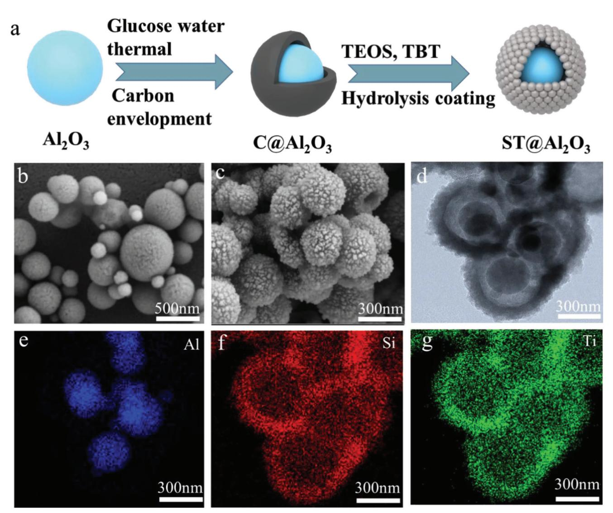
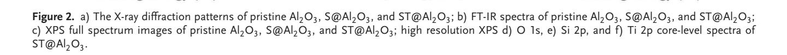
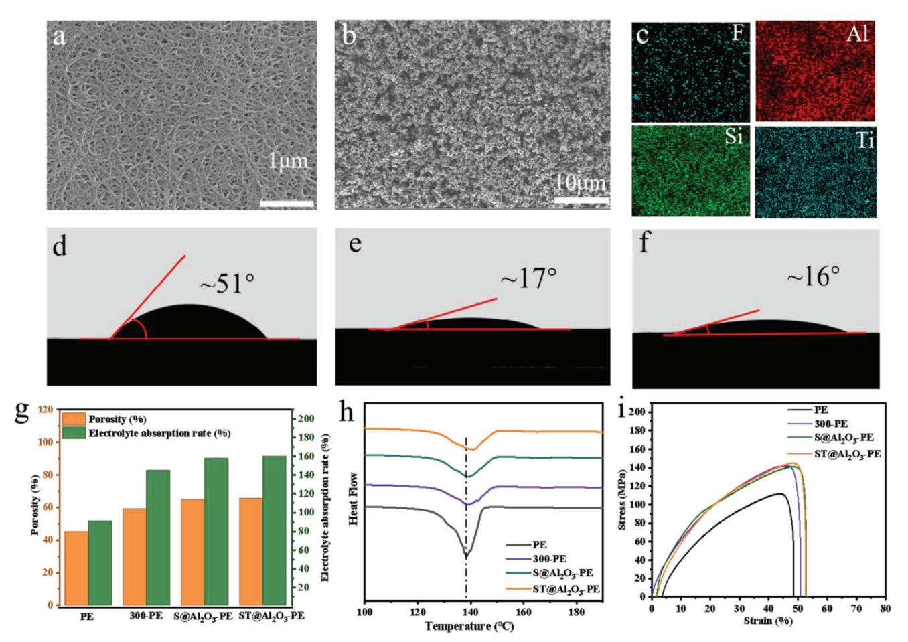
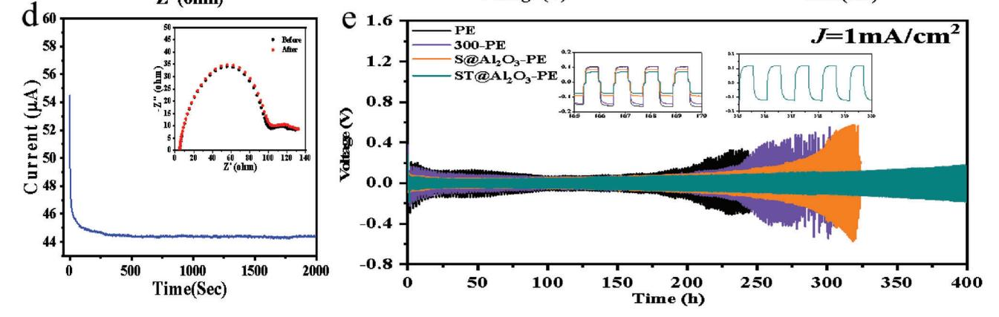
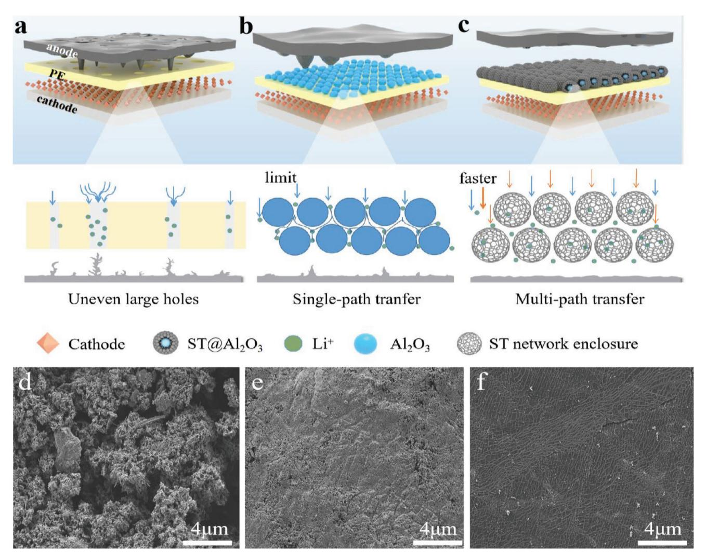

# **Yolk–Shell Structured ST@Al2O3 Enables Functional PE Separator with Enhanced Lewis Acid Sites for High-Performance Lithium Metal Batteries**

*Taotao Zhou, Wenhao Tang, Junwen Lv, Yirui Deng, Qiang Liu, Lei Zhang, and Ruiping Liu\**

**Commercial polymer separators usually have limited porosity, poor electrolyte wettability, and poor thermal and mechanical stability, which can deteriorate the performance of battery, especially at high current densities. In this work, a functional polyethylene (PE) separator is prepared by surface engineering a layer of Ti-doped SiO2@Al2O3 particles (denoted as ST@Al2O3-PE) with strong Lewis acid property and uniform porous structure on one side of the PE separator. On the other hand, ST@Al2O3 particles with abundant pore structures and large cavities can store a large amount of electrolyte, providing a shortened pathway for lithium-ion transport, and the Lewis acid sites and porous structure of the ST@Al2O3 can tune Li plating/stripping behavior and stabilize the lithium metal anode. The ST@Al2O3-PE separators exhibit better ionic conductivity (5.55 mS cm−1) and larger lithium-ion transference number (0.62). At a current density of 1 mA cm−2, Li/Li symmetric cells with ST@Al2O3-PE separator can be stably cycled for more than 400 h, and both lithium iron phosphate /Li cells and lithium cobaltate/Li cells with ST@Al2O3-PE separator have good cycling and rate performance. This work provides a new strategy for developing functional separators and promoting the application of lithium metal batteries.**

#### **1. Introduction**

Lithium metal batteries (LMBs) are one of the most excellent candidates for next-generation energy storage devices due to the ultra-high theoretical specific capacity (3860 mAh g−1) and a rather low electrochemical potential (−3.04 V) of lithium

T. Zhou, J. Lv, Q. Liu, R. Liu Department of Materials Science and Engineering China University of Mining & Technology (Beijing) Beijing 100083, P. R. China E-mail: 201402@cumtb.edu.cn W. Tang, Y. Deng, R. Liu School of Chemical & Environmental Engineering China University of Mining & Technology (Beijing) Beijing 100083, P. R. China L. Zhang Department of Mechanical Engineering University of Alaska Fairbanks PO Box, 755905, Fairbanks, AK 99775-5905, USA

The ORCID identification number(s) for the author(s) of this article can be found under https://doi.org/10.1002/smll.202303924

**DOI: 10.1002/smll.202303924**

anode. However, LMBs are facing various practical problems that need to be solved in commercialization.[1] During the charging and discharging process of LMBs, the inherent inhomogeneous surface of the Li anode acts as a "hot spot" that would lead to uneven Li deposition due to the tip-induced effect of the strong electric field, followed by Li dendrite formation, which would eventually deteriorate the Coulombic efficiency of the LMBs.[2,3] Moreover, the dendrites will inevitably puncture the conventional polyolefin separator, resulting in the direct contact between the positive and negative electrodes, the internal short-circuiting, and even thermal runaway of the battery.[4] In addition, when the battery is abused, its internal temperature rises, and the separators will shrink significantly when the temperature reaches the melting point of the polyolefin separators, which will also cause a short circuit of the battery,[5–7] and pose a serious safety hazard to the battery.[8,9]

To solve the above problems, researchers have proposed various strategies, including the construction of 3D lithium anodes, optimization of electrolytes,[1,5] design of functional separators and artificial solid-electrolyte interfaces (SEI), etc.[10] Among them, the internal short-circuiting of LMBs caused by both the formation of lithium dendrite and shrinkage of separator at high temperature may be solved simultaneously by construction of a functionalized separator. The polyolefin separators currently used in commercial LMBs have disadvantages such as low porosity, weak affinity to liquid electrolytes, and easy induction of lithium dendrites. Generally, an inorganic layer with hightemperature resistance is usually coated on the surface of the polyolefin separator to improve the thermal stability and electrolyte affinity of the separator. The nanoceramic particle coatings including Al2O3, SiO2, ZrO2, and TiO2 coatings, etc. have been applied to functionalize the polyolefin separators due to their high temperature resistance, low cost, and good compatibility with polymer matrix after being modified by functional groups.[11] The inorganic ceramic particles form a rigid skeleton in the composite film to prevent the separator from shrinking or even melting under high-temperature conditions.[12,13] However, the coated nano-sized inorganic particles will pass through the separator to block the lithium-ion conduction channel, which will reduce the lithium-ion conductivity of the separator.[14] Therefore, it is critical to develop functionalized separators with high mechanical strength, high temperature resistance, high lithiumion conductivity, large lithium transmission number, and the ability to induce uniform Li deposition behavior,[15] thereby improving the electrochemical performance and facilitating the large-scale commercialization of LMBs.[16,17]

Herein, we prepared a functional separator by coating the spherical yolk–shell structured Ti-doped SiO2@Al2O3 particles on the surface of separator. First, compared with the conventional PE and Al2O3-coated separators, ST@Al2O3-PE separators not only inherit the advantages of Al2O3-coated separators, such as high heat resistance and high mechanical strength, but also reduce the clogging of the pores of separators due to the traditional granular coating. Second, the uniform mesoporous channel and inner cavity of the ST@Al2O3 can not only store more electrolyte to conduct lithium ions, but also improve the solvation structure of the electrolyte, and finally adjust the transport flux of lithium ions and inhibit the growth of lithium dendrites. Third, ST@Al2O3 particles with enhanced Lewis acid property may adsorb more anions and remove HF inside the battery, thereby increasing the number of free lithium ions and reducing the HF damage to SEI. The as-prepared ST@Al2O3-PE separators exhibit higher ionic conductivity (5.55 mS cm−1), larger lithium-ion transference (0.62), smaller contact angle with electrolyte (16°), and better electrolyte absorption (160%), and the Li/ST@Al2O3- PE/Li symmetrical cells can be cycled stably for more than 400 h at a current density of 1 mA cm−2. This work provides a new route for modifying the separator to realize the applications of LMB with high safety.

# **2. Results and Discussion**

**Figure 1**a illustrates the preparation process of ST@Al2O3 particles. The Al2O3 particles were dispersed in the glucose solution, and a thin carbon layer was coated on the surface of Al2O3 particles after hydrothermal treatment. Then the titanium-doped silica nanoparticles were in situ formed on the surface of carbon layer by the hydrolysis of tetraethyl orthosilicate (TEOS) and tetrabutyl titanate (TBT) under hydrothermal treatment. After calcination, the yolk–shell structured ST@Al2O3 was successfully prepared. The pristine alumina has a regular spherical shape with a smooth surface and the particle size is around 300 nm (Figure 1b), while the surface of the silicon oxide-coated Al2O3 (S@Al2O3) particles (Figure S1a, Supporting Information) prepared with SiO2 coating was relatively rough, and the ST@Al2O3 particles prepared with the same Ti doping remained the regular spherical shape (Figure 1c), while the outer surface was rough and porous, indicating that the surface of Al2O3 particles was successfully coated. Transmission electron microscope (TEM) images of ST@Al2O3 further illustrate the yolk–shell structure of the particles (Figure 1d), and the Al elements are concentrated in the center of the particle, the Si and Ti elements originated from the hydrolysis of TEOS and TBT are concentrated in the outer layer of the particle, and the Al, Si, and Ti are homogeneously distributed in the particle, indicating that a Si─O─Ti network was formed (Figure 1e–g). The formation of cavities is a result of the removal of the original encapsulated carbon layer by high temperature; the formation of the porous structure is dependent on the cetyl methyl ammonium bromide (CTAB) template, as the CTAB will be dispersed and encapsulated on the outer surface of carbon-coated Al2O3 (C@Al2O3), and the CTAB template will be removed after high temperature calcination, thus allowing the formation of the pore structure.

To further characterize the structure of ST@Al2O3, X-ray diffraction (XRD) tests were carried out to analyze the phase composition of the materials (**Figure 2**a). The (221) crystal plane at 32.76°, the (040) crystal plane at 45.54° and the (406) crystal plane at 67.25° are the three characteristic peaks of the pristine Al2O3, and the peak intensity is reduced due to the successful coating on the surface of pristine Al2O3. The peaks of S@Al2O3 and ST@Al2O3 located at around 23° can be ascribed to the amorphous SiO2 and titanium-doped amorphous SiO2 after coating.[10,18] The failure to detect the characteristic peaks of TiO2 may be due to the formation of too little individual TiO2 during the hydrolysis process.

The N2 adsorption-desorption isotherms are given in Figure S2, Supporting Information. Type IV isotherms exist for both Al2O3 and ST@Al2O3, indicating the presence of a hierarchical porous structure. The BET-specific surface area of ST@Al2O3 is up to 377.07 m2 g−1, which is significantly higher than that of Al2O3 (12.02 m2 g−1). It is attributed to the removal of the intermediate carbon layer from the surface of Al2O3, exposing a multi-locus adsorbed porous structure that effectively increases the specific surface area of ST@Al2O3. Compared with the pore size distribution of Al2O3, the micropores, and mesopores are significantly increased in ST@Al2O3, and the pore volume increases from 0.059 to 0.876 cm3 g−1. The higher specific surface area, larger pore volume, and abundant micropores and mesopores of ST@Al2O3 may provide more space for electrolyte and more Lewis acid sites for adsorbing anions, thus increasing the lithium-ion transference number. Therefore, ST@Al2O3 with yolk–shell structure and high specific surface area can be used as a modified layer of the separator to achieve rapid diffusion of Li, effectively inhibit the growth of Li dendrites, and achieve improved electrochemical performance of Li-ion batteries.

In order to prove that the Si─O─Ti bond network was generated during the hydrolysis of TEOS and TBT, FT-IR tests were performed on Al2O3, S@Al2O3, and ST@Al2O3. As can be seen from FT-IR (Figure 2b) spectra, the bands of Al2O3 particles at 830.54, 699.77, and 578.89 cm−1 are attributed to the Al─O bond, and the band at 1631.99 cm−1 is attributed to the bending vibration of ─OH.[13,18]The Al─O bond-related vibration peaks were not observed in the FT-IR spectra of S@Al2O3 and ST@Al2O3, indicating that the Al2O3 particles were completely coated by SiO2 and Ti-doped SiO2, respectively. For the FT-IR spectrum of S@Al2O3, the bending vibration at 1632.17 cm−1 is attributed to ─OH. 1090.24, 810.54 and 462.88 cm−1 are typical Si─O─Si vibration peaks in SiO2. [19] The bending vibration peak of ─OH and Si─O─Si vibration peak were also observed in the FT-IR spectrum of ST@Al2O3, but a new characteristic peak appeared at 955.16 cm−1, indicating that Ti element successfully entered the SiO2 structure and formed a unique Si─O─Ti bond.[3,20]

X-ray photoelectron spectroscopy (XPS) was further used to analyze the elemental composition and chemical bonding of materials. Figure 2c shows that no characteristic peak of

**Figure 1.** a) Schematic diagram of the preparation process of ST@Al2O3; SEM image of b) pristine Al2O3, c) ST@Al2O3; d) TEM images of ST@Al2O3 particles; e–g) elemental mapping images of Al, O, and Ti in ST@Al2O3 particles.

elemental Al appears in the XPS full spectra of both S@Al2O3 and ST@Al2O3, indicating that the samples were well coated and Al2O3 was completely encapsulated in the core part of the materials. The presence of Ti spectrum of ST@Al2O3 demonstrates that Ti has successfully entered the interior of SiO2. The O 1s spectrum of ST@Al2O3 shows two characteristic peaks at 532.6 and 530.8 eV, corresponding to Si─O─Si and Si─O─Ti bonding, respectively (Figure 2d),[21] The Si 2p spectrum of ST@Al2O3 can be best fitted as two doublet lines at 103.6 and 102.1 eV (Figure 2e), where the binding energy (BE) is 103.5 eV, corresponding to the Si─O─Si bond, and the extra component peak appearing in the low BE of 1.5 eV may be assigned to the Si─O─Ti bond. It has been shown that the electron density transference from Ti to Si atoms through the intermediate O atoms leads to a decrease in the BE of Si atoms, which confirms the formation of Ti─O─Si bonds at the interface,[21,22] Figure 2f shows the highresolution spectra of Ti 2p[23] By fitting, it can be confirmed that Si and Ti elements mainly exist in SiO2 and TiO2 states.[24]

The surface morphology, contact angle, and ionic conductivity of the Al2O3-coated PE separators with particle sizes of 30, 300, and 500 nm were investigated and compared. As shown in Figure S3, Supporting Information, when the particle size of Al2O3 was 30 and 500 nm, the particles were not easy to disperse uniformly on the surface of PE, and there were a large number of agglomerates. The contact angles of the 300, 30, and 500 nm Al2O3-coated PE separators were 25°, 30°, and 31°, respectively (Figure S4, Supporting Information), yielding the best wettability of the 300 nm Al2O3-coated PE for the electrolyte. The EIS test was carried out after assembling the cells with different separators and the results are shown in Figure S5a, Supporting Information. It can be seen that the PE separator has the largest Rb of 2.01 ohm, while the 30-PE, 300-PE, and 500-PE separators have intrinsic impedances of 1.94, 1.70, and 1.85 ohm respectively. Figure S5b, Supporting Information can be calculated from the equation that the 300-PE separator has the largest ionic conductivity of 0.493 mS cm−1, while the 30-PE and 500-PE separators have the

conductivity of 0.415 and 0.453 mS cm−1 respectively, which are both greater than the 0.314 mS cm−1 of the PE separators, and the Al2O3 coating modification can improve the pore structure and electrolyte affinity of the separators, thus enhancing its ability to conduct ions. The linear sweep voltammetry (LSV) test is commonly used to characterize the electrochemical window of the separators and the results for PE separators and Al2O3-coated separators of different particle sizes are shown in Figure S6, Supporting Information. The PE separator and the coated separator have a similar curve trend, with the flow remaining at a steady level until 4.5V, indicating that the Al2O3-coated separator has electrochemical stability and a wide electrochemical window (4.5V) for Li-ion batteries operating at 4.5V. After 5V, the current starts to increase sharply and the LSV test results show that the Al2O3-coated modified separators have good electrochemical stability for Li-ion batteries. To test the lithium-ion transference number of different separators, a symmetric cell was assembled and the lithium-ion transfer number of different separators could be calculated (Figure S7, Supporting Information). 300-PE separators have a lithium-ion transfer number of 0.50, which is higher than the 0.41, 0.44, and 0.46 of PE, 30-PE, and 500-PE separators (Figure S8, Supporting Information). Al2O3 adsorbs anions from the electrolyte, increasing the number of freely moving lithium ions within the cell channels. The high lithium-ion migration number slows down the growth of lithium dendrites and improves the cycle life and safety of lithium-ion batteries.

The morphology of the pristine PE separators (**Figure 3**a), the S@Al2O3-PE separators (Figure S9, Supporting Information), and the ST@Al2O3-PE separators (Figure 3b) were characterized by scanning electron microscope (SEM). The fibrous structure with abundant pore channels of the pristine PE separator surface can be clearly observed, which can store a large amount of electrolyte and thus conduct lithium ions. After coating, the Al2O3 particles and ST@Al2O3 particles cover the surface of the PE separators uniformly and there is no massive agglomeration of nanoparticles, while the coating surface still retains a large number of pores. The Al, Si, and Ti elements are uniformly distributed on the surface of the separators, illustrating the successful preparation of S@Al2O3-PE and ST@Al2O3-PE separators. The crosssectional images of separators show that the thickness of the separators before and after coating is 12 and 16 μm, respectively (Figure S10, Supporting Information).

The affinity of the separators to the electrolyte directly affects the electrochemical performance of the cell. Figure 3 shows photographs of the contact angles of PE, 300-PE, S@Al2O3-PE, and ST@Al2O3-PE separators with electrolyte. The contact angle between the pristine PE separators (Figure 3d) and the electrolyte is ≈51°, while the contact angle between the 300-PE separators and the electrolyte is reduced to 25°, and the contact angles of the S@Al2O3-PE (Figure 3e) and ST@Al2O3-PE separators (Figure 3f) are further decreased to 17° and 16°, respectively. It can be attributed to the abundant pore structure of the coated

**Figure 3.** SEM image of a) PE separators, b) ST@Al2O3-PE separators; c) elemental mapping images of F, Al, Si, and Ti in ST@Al2O3-PE separator; contact angle of d) PE separators, e) S@Al2O3-PE separators, f) ST@Al2O3-PE separators; g) porosity and electrolyte uptake rate of different separators; h) the DSC curves of pristine PE and composite separators; i) tensile strength of different separators.

ST@Al2O3 particles, which can store electrolyte and thus reduce the contact angle,[25] The improved affinity of the separators to the electrolyte may accelerate the transportation of lithiumion, and finally enhance the electrochemical performance of the LMBs.[5,26]

The porosity of separators affects the electrolyte uptake rate and the lithium-ion conductivity. The porosity of the S@Al2O3- PE separator (64.9%) and ST@Al2O3-PE separators (65.5%) is larger than that of the PE separator (45.3%) and 300-PE separator (59.1%), which can be ascribed to the porous structure of the particles. The electrolyte uptake rates of S@Al2O3-PE separator and ST@Al2O3-PE separator are 158% and 160%, respectively, which are much larger than that of PE separator (91%) (Figure 3g and Table S1, Supporting Information). Due to the good electrolyte affinity and high porosity of S@Al2O3-PE separator and ST@Al2O3-PE separator, more electrolytes can enter the interior of the separator quickly. Compared to S@Al2O3-PE separator, the ST@Al2O3-PE separator can absorb more electrolytes due to the yolk–shell structure of the ST@Al2O3, which is of great help for improving the electrochemical performance of the battery.

The thermal shrinkage of the separators directly affects the safety of the LMB. As shown in Figure S11, Supporting Information, the unmodified PE separator will shrink at 130 °C due to its lower intrinsic melting point. Therefore, the PE separator will start to melt and the pore structure of the PE separator will shrink and collapse when the temperature rises to 130 °C, and PE separators transform into a completely transparent shape with a shrinkage rate of about 50% at 140 °C. For 300-PE, S@Al2O3-PE, and ST@Al2O3-PE separators, the separators maintain its original size and shape without deformation at 130 °C, and the separators shrink slightly at 140 °C, with a shrinkage rate of about 15% for S@Al2O3-PE and ST@Al2O3-PE separators, which is much lower than that of 50% for PE separators. Due to the support of the coated polytetrafluoroethylene (PVDF) and ST@Al2O3, the thermal stability of the ST@Al2O3-PE separators can be improved,[25,27] DSC curves were used to further illustrate the thermal safety of the separators (Figure 3h). The thermal behavior of the modified separators can be divided into two parts in the temperature range from 100 to 210 °C. The higher temperature of the curve for the ST@Al2O3-PE indicates that ST@Al2O3 coating improves the thermal stability of the separators and slows down its transition from the rubbery state to the viscous state. The mechanical strength of a battery separator plays a critical role in ensuring its safety. In order to prevent potential safety risks stemming from separator failure, lithium-ion battery separators must possess a certain level of

**Figure 4.** a) Nyquist plots of the batteries applying PE, 300-PE, S@Al2O3-PE, and ST@Al2O3-PE separators, respectively; b) LSV test pattern of different separators; c,d) lithium-ion transference numbers of PE and ST@Al2O3-PE separators; e) lithium stripping/deposition performance of Li/Li symmetric cells assembled with different separators at a current density of 1 mA cm2

mechanical strength. Figure 3i illustrates the stress–strain curves of PE, PE-Al2O3, S@Al2O3-PE, and ST@Al2O3-PE membranes. It clearly shows that the coated and modified PE separators exhibit significantly improved tensile strength and elongation at break compared to plain PE,[7,28] Specifically, the tensile strength of Al2O3-PE separator (143.2 MPa), S@Al2O3-PE separator (144.14 MPa), and ST@Al2O3-PE separator (148.94 MPa) was 28.4% and 32.6% higher, respectively, than that of the PE separator (112.27 MPa). Moreover, the elongation at break of the PE separator (48.64%) was observed to be lower compared to Al2O3-PE (51.16%), S@Al2O3-PE (53.21%), and ST@Al2O3-PE (53.28%) separators. These results demonstrate that the inorganic coating can significantly improve the mechanical properties of the separator, and the modified ST@Al2O3-PE membrane exhibited the most excellent tensile properties.[28]

High ionic conductivity can effectively reduce the polarization inside the battery, which is conducive to the stable stripping and deposition of lithium metal anodes and the fast charging and discharging capability of the battery.[10] From the Nyquist plot, the intrinsic impedances of S@Al2O3-PE and ST@Al2O3-PE are 1.68 Ω and 1.51 Ω, and the ionic conductivity is calculated to be 4.99 and 5.55 mS cm−1, respectively, which are greater than that of the PE separator (3.00 mS cm−1) and 300-PE separator (3.69 mS cm−1) (**Figure 4**a). On one hand, the porous spherical structure coating improves the contact angle and electrolyte uptake rate of the separator, also the lithium ions can transport more smoothly in the separator. On the other hand, the strong Lewis acid of ST@Al2O3 can adsorb PF6 − in the electrolyte,[29] which will also promote the ion conduction.[30] The electrochemical window of the separator was characterized by LSV test, as shown in Figure 4b, the LSV curves of S@Al2O3-PE and ST@Al2O3- PE separators are similar to those of PE separators, which are very flat at 4.3 V, indicating that the modified separators can withstand an operating voltage of 4.3 V. The LSV curve starts to increase sharply at around 5 V due to the rapid decomposition of solvent molecules in the electrolyte,[31–33] The lithium-ion transference number of ST@Al2O3-PE is 0.62, which is greater than that of PE (0.41), 300-PE (0.53) and S@Al2O3-PE (0.59) (Figure 4c,d and Figure S12, Supporting Information). The constructed ST with yolk–shell structure allows Li+ with a small size (0.15 nm) to pass through and redistributes its flux at the electrode/ST@Al2O3-PE interface, which facilitates the homogenization of the lithium plating/stripping behavior. In addition, the yolk–shell structured material can expose more Lewis acid sites, which can interact with the lithium salt in the electrolyte and enhance the Li+ mobility.[34,35]

To investigate the modulating effect of acidic sites on ion transport properties and to verify the interaction with lithium ions, the molecular interactions between the ST@Al2O3 with yolk– shell network and the electrolyte were investigated by solid-state nuclear magnetic resonance (SSNMR). Figure S13, Supporting Information shows the SSNMR signals of 19F and 7Li for LiPF6 − based electrolytes. For pure LiPF6 electrolytes, the sharp peaks originate from the isotropic diffusion of PF6 − and Li+ in the electrolyte. After the addition of ST@Al2O3, the widen of the corresponding peaks of 19F and 7Li verify the anisotropic character of LiPF6 interacting with ST@Al2O3. The addition of ST@Al2O3 decreases the peaks of 19F from −73.92 and −72.67 ppm to −73.36 and −71.76 ppm, and the signal of 7Li also shifts downward from −1.129 to −1.109 ppm due to the binding effect between the PF6 − anion and the acid site on the surface of ST@Al2O3. The chemical shift of 19F and 7Li suggests that the electron cloud density around PF6 − and Li+ decreases, which can be explained by the fact that the acid-base interaction of ST@Al2O3 with LiPF6 promotes the dissociation of LiPF6, and the PF6 − anions anchored by the acidic sites weaken their interaction with Li+ and promote the release of "free" Li+. This acid-base interaction-based regulation of the chemical environment of Li+ and PF6 − in the electrolyte facilitates the Li+ transport.

Lithium symmetric cells were assembled to further investigate the effect of modified separators on the behavior of lithium deposition (Figure 4e). At a current density of 1 mA cm−2, the cells with PE and 300-PE separators can be cycled for ≈200 and 250 h, respectively, and the polarization of the cells with S@Al2O3-PE separator starts to increase rapidly at 300 h. In contrast, the lithium symmetric battery with ST@Al2O3-PE separator remains stable after 400 h of cycling. The inset in Figure 4e shows that the minimum polarization is about 80 mV for the cell using ST@Al2O3-PE separator. At a current density of 0.5 mA cm−2, the polarization starts to increase after 600 h of stripping/deposition using the PE separator, while the symmetrical lithium cell with the ST@Al2O3-PE separator symmetric cells can reach a cycle life of over 1000 h, and the minimum polarization of the lithium symmetric cell using the ST@Al2O3-PE separator is ≈100 mV (Figure S14, Supporting Information). First, the uneven flux of lithium ions inside the cell with PE separator promotes the creation and growth of lithium dendrites, while the exposed Lewis acid sites on the outer surface of Al2O3 and inner surface of titanium-doped silica oxide can stabilize the anions in the electrolyte, facilitate the migration of lithium ions and guide the uniform deposition of lithium. Second, the cavity of the yolk– shell structure can store a large amount of electrolyte, which can achieve rapid ion diffusion. Third, the thin shell Si─O─Ti layer with abundant Lewis acid sites and excellent electrolyte uptake rate can desolvate lithium ions and trap anions. At the same time, Lewis acid site of ST@Al2O3 can adsorb and remove HF from the electrolyte, increasing the number of free lithium ions inside the cell and reducing the damage of HF to SEI, thus stabilizing the lithium stripping/deposition process.[29,36]

The effect of the separator on lithium-ion transport and Li plating behavior is shown in **Figure 5**. Due to their low porosity and wide pore size distribution, commercial PE separators cannot regulate ion transport, which will result in the nonuniform lithium-ion flux, especially uncontrollable lithium plating at high current densities (Figure 5a). Unlike the separators modified with Al2O3 particles, where Li ions diffuse mainly only through the interstitial spaces between Al2O3 particles (Figure 5b), lithium-ions can not only transfer through the interstitial spaces of ST@Al2O3, but also diffuse through the porous shell and hollow interior (Figure 5c). Furthermore, Al─O, Si─O, and Ti─O bonds are effective Lewis acid sites that have an important influence on ion transport.[37] On one hand, Lewis acid sites may reduce the solvation effect of Li+ ions. On the other hand, by constructing a spherical shell network structure, the bilayer shell with Lewis acid sites can effectively trap anions by charge attraction, thus creating an anion shield. The reduced solvation size of the Li+ solvent complexes and the increase in the Li+ mobility could be responsible for the high ionic conductivity and the high lithium-ion transference number,[38] which would allow a fast and uniform lithium-ion flux and thus greatly enhance the electrochemical kinetics while inhibiting the growth of Li dendrites.[10,36]

To verify the ability of the modified separators to regulate the lithium plating behavior, the surface morphology of the Li anodes of assembled cells with different separators was examined after 40 cycles. The Li metal electrode with PE separator has an extremely rough surface after cycling (Figure 5d), exhibiting typical irregular dendrite features with a severely cracked mossy morphology and an uncontrollable dendrite growth pattern, which will lead to the degradation of cell performance and internal short circuit problem.[39] The surface of the cycled Li electrode with Al2O3@PE is brighter compared to the PE separators, but a relatively rough surface can still be observed (Figure 5e). In contrast, the Li anodes with ST@Al2O3-PE separators maintain a uniform and smooth appearance after cycling, which is attributed to the formation of a fine morphology without Li dendrites (Figure 5f), confirming that the porous spherical shell promotes uniform Li deposition during cycling.[40]

The effect of the modified separator on the cycling performance of the battery was verified by conducting constant current charge/discharge tests on lithium iron phosphate (LFP)/Li cells with different separators (**Figure 6**a). After 200 cycles at 1 C, the discharge-specific capacity of the LFP/Li battery using the PE separator decreased from 128.9 to 120.9 mAh g−1, with a capacity retention rate of 94%. In contrast, the discharge-specific capacities of the battery using the modified separators were all maintained at a steady level, with 97% of capacity retention for the battery with ST@Al2O3-PE separator. In addition, the initial dischargespecific capacity of the battery with ST@Al2O3-PE separator was 146.9 mAh g−1, which was higher than that of the other three separators. Figure 6b and Figure S15, Supporting Information show the capacity–voltage curve of the battery with different separators. The polarization of the battery with ST@Al2O3-PE is the smallest and smoothest over 200 cycles. EIS results of LFP/Li cells after 200 cycles in Figure 6c show that the interfacial impedance of the battery using PE separator, 300-PE separator, S@Al2O3-PE separator, and ST@Al2O3-PE separator are 120, 80, 70 and 45 ohm, respectively. On one hand, the separator coated with ST@Al2O3 has higher porosity and electrolyte uptake rate, which can store more electrolytes and has the best interfacial contact between the separator and the electrode. On the other hand, the HF generated during cycling is harmful to the cell life of the battery, and it can be removed by ST@Al2O3, thus extending the cycle life of the battery.[1,16,39]

The rate performance of LFP/Li batteries assembled with different separators is shown in Figure 6d,e and Figure S16, Supporting Information. The discharge-specific capacity of the battery with ST@Al2O3-PE separator is 156.7, 151.8, 144.3, 125.8, and 113.4 mAh g−1 at 0.2, 0.5, 1, 3, and 5 C, respectively, the rate performance of the battery with ST@Al2O3-PE separator is superior to that of the battery with PE separators, especially at high current densities of 3 C and 5 C, and the charge/discharge plateau is very obvious even at a current density of 5 C. Lithium cobaltate (LCO)/Li cells with different separators were further

**Figure 5.** Schematic diagrams of ion transport and Li deposition behavior of different separators: a) PE, b) Al2O3@PE, and c) ST@Al2O3-PE. SEM images of the Li foil surface in the Li||LFP cells with d) PE, e) Al2O3@PE, and f) ST@Al2O3-PE after 40 cycles.

assembled and cycled (Figure S17, Supporting Information). The LCO/Li cell with ST@Al2O3-PE shows the best cycle and rate performance, with a capacity retention rate of 75% after 200 cycles at 1 C, which is higher than that of the 43% of the LCO/Li cell with PE separator. Comparing the performance of this work with other works (Table S2, Supporting Information), it can be found that the porosity of the material is improved significantly, and all electrochemical properties are significantly improved.

### **3. Conclusions**

In summary, the yolk–shell structured ST@Al2O3 was successfully prepared by hydrothermal method, and was further used to modify the PE separator. The unique yolk–shell structure of the ST@Al2O3 particles is capable of adsorbing more electrolyte and providing more ion transport paths, which ensures the uniform ion transport between the electrodes, thus significantly improving the electrochemical kinetics while suppressing dendrite growth. The abundant Lewis acid sites of the ST@Al2O3 particles may immobilize the anions in the electrolyte, and thus increase the lithium transference number. Also, the ST@Al2O3 particles can impart the PE separators with mechanical strength and thermal stability. As a result, the LMBs with ST@Al2O3-PE separators exhibit excellent rate capability and cycling stability. This work provides a new strategy to modify the separators and promote the application of LMBs.

# **4. Experimental Section**

*Materials*: TEOS, TBT, ammonia, and glucose were purchased from Sinopharm Holdings Chemical Reagent Co. -Al2O3 with a particle size of 30 nm was purchased from Maclean Biotechnology Co. -Al2O3 with the particle size of 300 and 500 nm were purchased from HengShi New Material Technology Co. Polyvinylpyrrolidone (PVP), CTAB, PVDF and nitrogen methyl-pyrrolidone (NMP) were purchased from Aladdin Biotechnology Co., Ltd. Polyethylene separators (PE) with the thickness of 12 μm was supplied by Hebei Cangzhou Pearl Plastics Co., Ltd. 1.0 m LiPF6 in ethylene carbonate/methylene carbonate/dimethyl carbonate (DMC) (1:1:1 by volume) was used as the liquid electrolyte. Lithium foils were purchased from Shanghai Songjing New Energy Technology Co., Ltd. LFP and LCO

**Figure 6.** a) Cycle performance test of LFP/Li cells assembled with different separators; b) capacity–voltage curve of LFP/ST@Al2O3/Li cells; c) EIS test profile of LFP/Li cells assembled with different separators after 200 cycles; d) multiplier performance test of LFP/Li cells assembled with different separators; e) capacity–voltage curve of LFP/ST@Al2O3/Li cells at different multipliers.

were purchased from Xiya Reagent Co., Ltd. All chemicals were used without further purification.

*Preparation of ST@Al2O3*: The preparation of titanium-doped silicacoated alumina particles used in the experiment mainly includes two steps. The first step was to prepare carbon-coated alumina using a hydrothermal method. First, Al2O3 particles (300 nm, 1 g) and PVP (4 g) were dispersed to 2 L of deionized water and stirred for 12 h. Then, 50 mg PVPtreated Al2O3 particles and 5 g glucose were added to 120 mL deionized water for ultrasonic dispersion, then transferred to a 200 mL high-pressure reactor and heated at 173 °C for 4 h, and naturally cooled to room temperature. C@Al2O3 were obtained by centrifugation, washing, and drying. The second step was to prepare the titanium-doped silica-coated alumina particles by hydrolysis method. First, 0.1g of C@Al2O3 was dispersed into a mixed solution of 80 mL ethanol, 20 mL deionized water, 1 mL ammonia, and 0.3 g CTAB, after which TEOS (0.4 g) and TBT (0.1 g) were diluted into 20 mL ethanol before being added dropwise to the C@Al2O3 dispersion and stirred continuously for 4 h. The solid product was obtained by vacuum filtration. The dried product was calcined in a muffle furnace at 550 °C for 6 h to remove the carbon layer and CTAB. ST@Al2O3 with porous spherical shell structure were obtained. When the coating material was a single TEOS, the prepared sample was S@Al2O3.

*Preparation of the Modified Separators*: The slurry was prepared by dispersing the ST@Al2O3 particles and PVDF at a mass ratio of 9:1 in NMP under continuous stirring for 6 h first, and then coated onto the surface of separators and dried in a vacuum drying oven at 70 °C for 4 h. The modified separators were denoted as 30-PE, 300-PE, 500-PE, S@Al2O3-PE, and ST@Al2O3-PE, respectively.

*Characterization*: XRD was carried out using Bruker AXS D8 at a scan range of 10–80° at a scan rate of 5° min−1. Fourier infrared spectroscopy was carried out on a Perkin Elmer Frontier to characterize the molecular structure and chemical composition of the sample. XPS was conducted on a Thermo Scientific K-Alpha with an operating voltage of 12 kV and a full spectrum scan step of 1 eV. Static contact angle tests were performed on different septa using a Data physics OCA20. SEM (ZEISS Gemini 300, SEM) with the energy spectrometer (OXFORD XPLORE30) and TEM (JEOL JEM-F200, TEM) were used to observe the microstructure of the sample.

Thermal shrinkage of the separators was evaluated by sandwiching the as-prepared separators (19 mm) between two slides and placing it in an oven at different temperatures for 30 min. The thermal stability of the separators was examined by calculating the area change of the separators, and the thermal shrinkage was calculated as follows.

Heat Shrink (%) = 
$$\frac{S_A - S_B}{S_A} \times 100\%$$
 (1)

where *S*A is the area of the separator before treatment, and *S*B is the area of the separator after treatment.

The separators (19 mm) were placed in an oven at 60 °C for 24, weighed, then immersed into the 1 m LiPF6 EC/DMC (1:1, v/v) electrolyte for 1 h, after the excess on the surface of the separator was wiped off with paper, weighed the mass again. The electrolyte uptake rate was calculated using the following Equation (2).

Electrolyte uptake rate (%) = 
$$\frac{W_B - W_A}{W_A} \times 100\%$$
 (2)

where *W*A is the mass of the separators after drying, and *W*B is the mass of the separators after wetting with electrolyte.

The porosity of the separators was evaluated by the *n*-butanol absorption method, where the porosity of the separators can be determined by calculating the ratio of the volume of absorbed *n*-butanol to the volume of the separators (Equation (3)).

Porosity (%) = 
$$\frac{M_B - M_A}{\rho \times S \times L} \times 100\%$$
 (3)

where *M*A is the original mass of the separators, *M*B is the mass after absorption of *n*-butanol, is the density of *n*-butanol, *S* is the area of the separators, and *L* is the thickness of the separators.

*Electrochemical Measurement*: The ionic conductivity () of the separators was tested using the electrochemical AC impedance method (EIS), where the CR2032 coin cell with separators was assembled in an Ar-filled glove box. AC impedance testing was carried out at a frequency of 0.1– 106 Hz with an applied AC amplitude of 10 mV to obtain a Nyquist plot, where the intersection of the curve with the horizontal coordinate was the intrinsic impedance of the cell RΩ, and then the ionic conductivity of the separators was calculated according to Equation (4).

$$\sigma = \frac{I}{R_{\Omega} \times S_{A}} \tag{4}$$

where *l* is the thickness of the separators, *R*Ω is the intrinsic impedance of the separators, and *S*A is the effective contact area (i.e. the area of the spacer, as the separators area was larger than the spacer).

Lithium-ion transport number (*t*Li+ ) was obtained by a DC polarization test and an electrochemical impedance test performed successively on a lithium metal symmetric battery. The DC polarization test was performed at an applied voltage of 10 mV and the electrochemical impedance test was performed at a frequency of 0.1 – 106 Hz with an applied AC amplitude of 10 mV, both using an Ivium multi-channel electrochemical workstation. The lithium-ion transport number was calculated according to Equation (5).

$$t_{\text{Li}+} = \frac{I_{\text{SS}} (\Delta V - I_{\text{O}} R_{\text{O}})}{I_{\text{O}} (\Delta V - I_{\text{SS}} R_{\text{SS}})}$$
(5)

whereΔ*V*is the applied perturbation voltage, *I*O and *R*O represent the initial current and the initial interfacial impedance, respectively, and *I*SS and *R*SS represent the steady state current and the steady state interfacial resistance, respectively.

The electrochemical window was obtained using LSV method. The CR2032 coin cell assembled in an Ar-filled glove box was subjected to linear scanning voltammetry testing using an Ivium multi-channel electrochemical workstation with a scan voltage range of 2.5–6 V and a scan rate of 2 mV s−1. LFP/Li and LCO/Li full cells with different separators were assembled and cycled on a Wuhan LAND equipment to evaluate the cycle and rate performance of the batteries. The LFP electrodes and LCO electrodes with an areal loading of about 2.5 mg cm−2 were prepared by coating the NMP slurry evenly onto the aluminum foil, in which the mass ratio of active materials, PVDF, and carbon black was 8:1:1. The voltage range was 2.8–4.2 V for LFP/Li cells and 2.7–4.2 V for LCO/Li cells.

### **Supporting Information**

Supporting Information is available from the Wiley Online Library or from the author.

#### **Acknowledgements**

T.Z. and W.T. contributed equally to this work. This work was supported by the National Natural Science Foundation of China (52272258), the Beijing Nova program (20220484214), the Key R & D and transformation projects in Qinghai Province (2021-HZ-808 and 2023-HZ-801) and the Key R & D and transformation projects in Hebei Province (21314401D), the Fundamental Research Funds for the Central Universities (2023ZKPYJD07), the Fundamental Research Funds of China University of Mining and Technology (Beijing)—Top Innovative Talents Cultivation Fund for Doctoral Students (BBJ2023033), and the American Chemical Society Petroleum Research Fund (PRF-59722-ND10).

# **Conflict of Interest**

The authors declare no conflict of interest.

# **Data Availability Statement**

The data that support the findings of this study are available from the corresponding author upon reasonable request.

# **Keywords**

high safety, Lewis acid, lithium metal batteries, separators, yolk–shell structures

> Received: May 10, 2023 Revised: July 10, 2023 Published online: August 3, 2023

- [1] X. Ji, Y. Zhang, M. Cao, Q. Gu, H. Wang, J. Yu, Z. H. Guo, X. Zhou, *J. Adv. Ceram.* **2022**, *11*, 835.
- [2] Y. Guo, Q. Wu, L. Liu, G. Li, L. Yang, X. Wang, Y. Ma, Z. Hu, Y. Guo, Q. Wu, L. Liu, G. Li, L. Yang, X. Wang, Z. Hu, Y. Ma, *Adv. Sci.* **2022**, *9*, 2200411.
- [3] H. Li, Z. Zhao, J. Li, J. Li, L. Zhao, J. Sun, X. Fan, *Chem. Res. Chin. Univ.* **2019**, *35*, 866.
- [4] M. F. Lagadec, R. Zahn, V. Wood, *Nat. Energy* **2019**, *4*, 16.
- [5] Q. An, H. en Wang, G. Zhao, S. Wang, L. Xu, H. Wang, Y. Fu, H. Guo, *Energy Environ. Mater.* **2023**, *6*, e12345.
- [6] L. Ding, N. Yan, S. Zhang, R. Xu, T. Wu, F. Yang, Y. Cao, M. Xiang, *ACS Appl. Mater. Interfaces* **2022**, *14*, 6714.
- [7] X. Zhang, N. Li, Z. Hu, J. Yu, Y. Wang, J. Zhu, *J. Membr. Sci.* **2019**, *581*, 355.
- [8] H. Bin Son, M. Shin, W. J. Song, D. Y. Han, S. Choi, H. Cha, S. Nam, J. Cho, S. Choi, S. Yoo, S. Park, *Energy Storage Mater.* **2021**, *36*, 355.
- [9] R. Xu, X. B. Cheng, C. Yan, X. Q. Zhang, Y. Xiao, C. Z. Zhao, J. Q. Huang, Q. Zhang, *Matter* **2019**, *1*, 317.
- [10] J. Wang, Y. Liu, Q. Cai, A. Dong, D. Yang, D. Zhao, J. Wang, Q. Cai, D. Yang, Y. Liu, A. Dong, D. Zhao, *Adv. Mater.* **2022**, *34*, 2107957.
- [11] L. Qian, Y. Zheng, T. Or, H. W. Park, R. Gao, M. Park, Q. Ma, D. Luo, A. Yu, Z. Chen, *Small* **2022**, *18*, 2205233.
- [12] Y. Xiao, A. Fu, Y. Zou, L. Huang, H. Wang, Y. Su, J. Zheng, *Chem. Eng. J.* **2022**, *438*, 135550.
- [13] B. Yuan, J. Liu, L. Dong, D. Chen, S. Zhong, Y. Liang, Y. Liu, Y. Ji, X. Wu, Q. Kong, J. Han, W. He, *Small* **2022**, *18*, 2107664.
- [14] Z. Liu, Y. Peng, T. Meng, L. Yu, S. Wang, X. Hu, *Energy Storage Mater.* **2022**, *47*, 445.
- [15] M. Zhou, J. Zhao, X. Wang, J. Shen, W. Tang, Y. Deng, R. Liu, *Chin. Chem. Lett.* **2023**, *34*, 107793.
- [16] W. W. Han, R. E. A. Ardhi, G. C. Liu, *Rare Met.* **2022**, *41*, 353.
- [17] K. Xu, X. Liang, L. L. Wang, Y. Wang, J. F. Yun, Y. Sun, H. F. Xiang, *Rare Met.* **2021**, *40*, 2810.
- [18] Y. Song, L. Wang, H. Cui, H. Liang, Q. Hu, D. Ren, Y. Yang, H. Zhang, H. Xu, X. He, *Adv. Energy Mater.* **2022**, *12*, 2201964.
- [19] F. Zheng, H. T. Li, Y. Z. Zheng, D. Wang, N. N. Yang, H. Y. Ding, X. Tao, *Rare Met.* **2022**, *41*, 1889.
- [20] X. Zhang, F. Zhang, K. Y. Chan, *Appl. Catal., A* **2005**, *284*, 193.
- [21] D. P. Wang, H. C. Zeng, *Chem. Mater.* **2009**, *21*, 4811.
- [22] S. Ullah, E. P. Ferreira-Neto, A. A. Pasa, C. C. J. Alcântara, J. J. S. Acuña, S. A. Bilmes, M. L. Martínez Ricci, R. Landers, T. Z. Fermino, U. P. Rodrigues-Filho, *Appl. Catal., B* **2015**, *179*, 333.
- [23] P. Xue, C. Guo, N. Wang, K. Zhu, S. Jing, S. Kong, X. Zhang, L. Li, H. Li, Y. Feng, W. Gong, Q. Li, *Adv. Funct. Mater.* **2021**, *31*, 2106417.
- [24] Z. Zhou, P. Dong, D. Wang, M. Liu, J. Duan, G. P. Nayaka, D. Wang, C. Xu, Y. Hua, Y. Zhang, *J. Alloys Compd.* **2019**, *781*, 362.

- [25] M. Zhang, K. Liu, Y. Gan, H. Wang, F. Liu, M. Bai, X. Tang, Z. Wang, S. Li, A. Shao, K. Zhou, T. Wang, Z. Wang, S. Yuan, Y. Ma, *Adv. Energy Mater.* **2022**, *12*, 2201390.
- [26] L. Tan, Y. Sun, C. Wei, Y. Tao, Y. Tian, Y. An, Y. Zhang, S. Xiong, J. Feng, *Small* **2021**, *17*, 2007717.
- [27] X. Wang, C. Zhao, B. Liu, S. Zhao, Y. Zhang, L. Qian, Z. Chen, J. Wang, X. Wang, Z. Chen, *Adv. Energy Mater.* **2022**, *12*, 2201960.
- [28] X. Song, Z. Wang, F. Zhao, Y. Sun, B. Cheng, J. Xing, *Adv. Mater. Interfaces* **2021**, *8*, 2100458.
- [29] L. Zhao, Z. Wu, Z. Wang, Z. Bai, W. Sun, K. Sun, *ACS Nano* **2022**, *16*, 20891.
- [30] Z. Wang, H. Wang, S. Qi, D. Wu, J. Huang, X. Li, C. Wang, J. Ma, *EcoMat* **2022**, *4*, e12200.
- [31] Q. Zhou, X. Yang, X. Xiong, Q. Zhang, B. Peng, Y. Chen, Z. Wang, L. Fu, Y. Wu, *Adv. Energy Mater.* **2022**, *12*, 2201991.
- [32] H. Zhang, R. Li, L. Chen, Y. Fan, H. Zhang, R. Zhang, L. Zheng, J. Zhang, S. Ding, Y. Wu, B. Ma, S. Zhang, T. Deng, L. Chen, Y. Shen, X. Fan, *Angew. Chem.* **2023**, *135*, e202218970.

- [33] Z. Huang, J. C. Lai, S. L. Liao, Z. Yu, Y. Chen, W. Yu, H. Gong, X. Gao, Y. Yang, J. Qin, Y. Cui, Z. Bao, *Nat. Energy* **2023**, *8*, 577.
- [34] L. Ren, A. Wang, X. Zhang, G. Li, X. Liu, J. Luo, *Adv. Energy Mater.* **2020**, *10*, 1902932.
- [35] H. Lu, D. Zhang, Q. Jin, Z. Zhang, N. Lyu, Z. Zhu, C. Duan, Y. Qin, Y. Jin, *Adv. Mater.* **2023**, *35*, 2300620.
- [36] G. Lin, K. Jia, Z. Bai, C. Liu, S. Liu, Y. Huang, X. Liu, *Adv. Funct. Mater.* **2022**, *32*, 2207969.
- [37] Y. Chen, Z. Yu, P. Rudnicki, H. Gong, Z. Huang, S. C. Kim, J. C. Lai, X. Kong, J. Qin, Y. Cui, Z. Bao, *J. Am. Chem. Soc.* **2021**, *143*, 18703.
- [38] J. Cao, D. Zhang, R. Chanajaree, Y. Yue, Z. Zeng, X. Zhang, J. Qin, *Adv. Powder Mater.* **2022**, *1*, 100007.
- [39] X. Dai, X. Zhang, J. Wen, C. Wang, X. Ma, Y. Yang, G. Huang, H. M. Ye, S. Xu, *Energy Storage Mater.* **2022**, *51*, 638.
- [40] D. Miranda, R. Gonçalves, S. Wuttke, C. M. Costa, S. Lanceros-Méndez, *Adv. Energy Mater.* **2023**, *13*, 2203874.