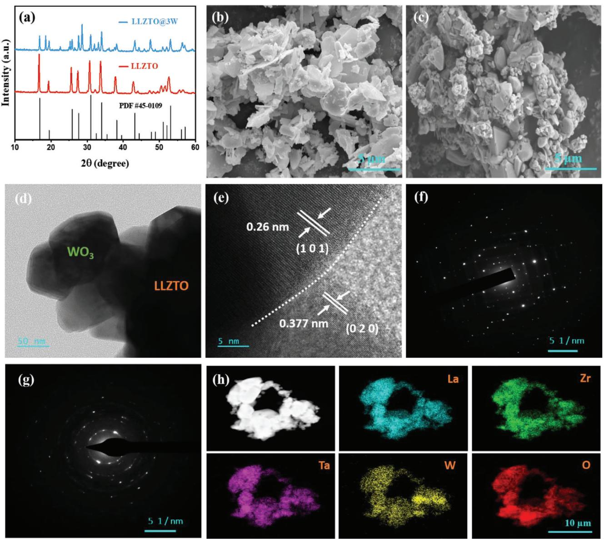
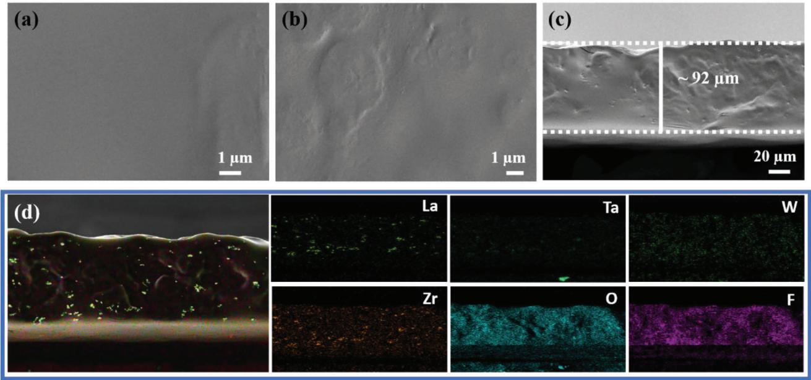
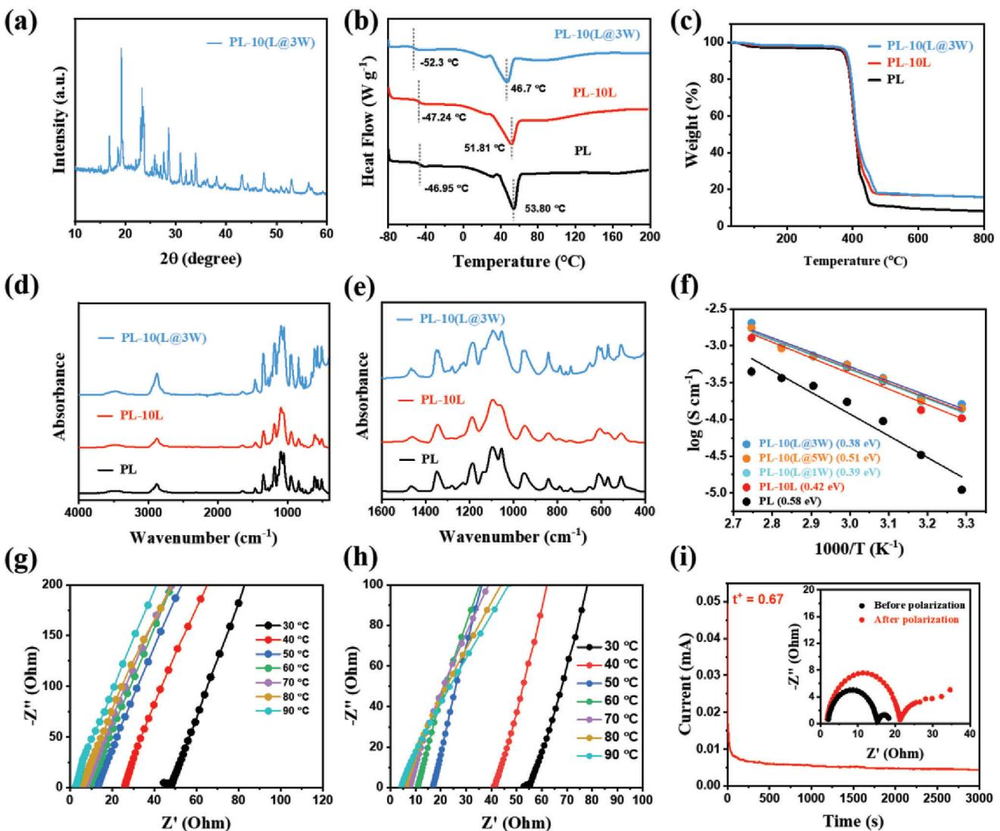
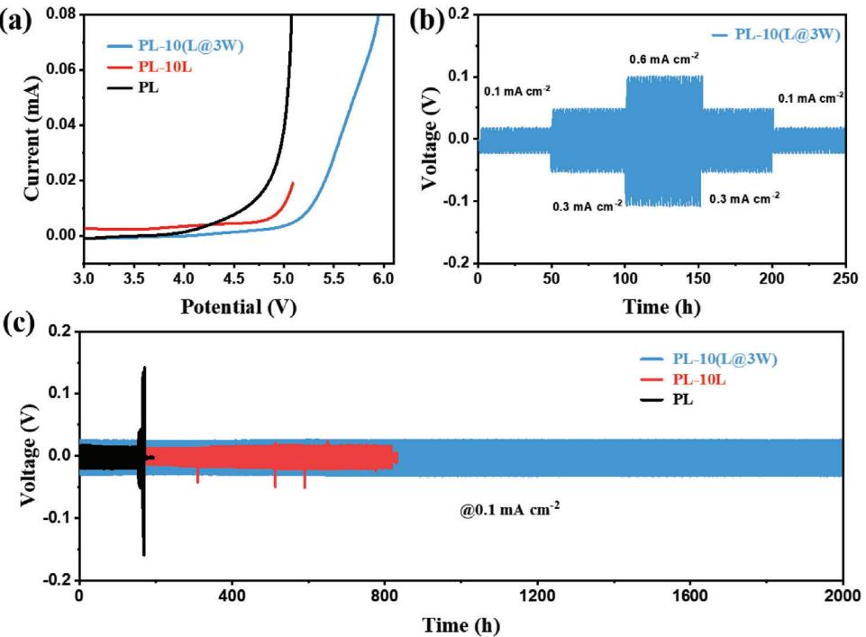
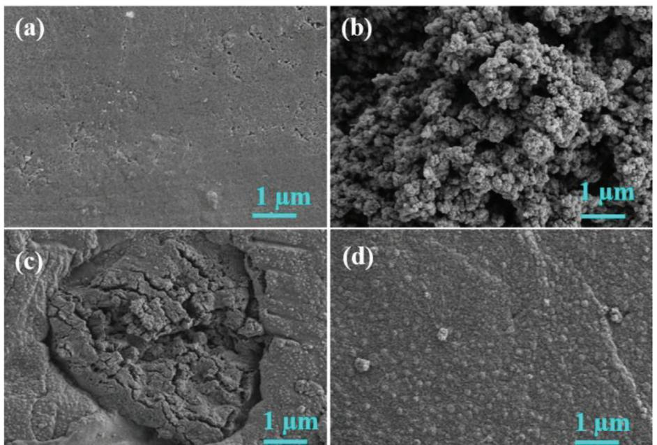
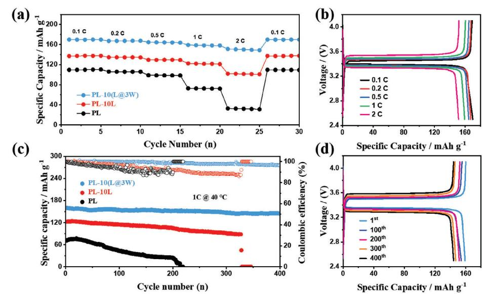

# **PEO-Based Solid Composite Polymer Electrolyte for High Capacity Retention All-Solid-State Lithium Metal Battery**

*Kashif Khan,\* Muhammad Bilal Hanif, Hu Xin, Arshad Hussain, Hina Ghulam Ali, Bowen Fu, Zixuan Fang, Martin Motola, Ziqiang Xu, and Mengqiang Wu\**

# **1. Introduction**

**The limited ionic conductivity at room temperature and the constrained electrochemical window of poly(ethylene oxide) (PEO) pose significant obstacles that hinder its broader utilization in high-energy-density lithium metal batteries. The garnet-type material Li6.4La3Zr1.4Ta0.6O12 (LLZTO) is recognized as a highly promising active filler for enhancing the performance of PEO-based solid polymer electrolytes (SPEs). However, its performance is still limited by its high interfacial resistance. In this study, a novel hybrid filler-designed SPE is employed to achieve excellent electrochemical performance for both the lithium metal anode and the LiFePO4 cathode. The solid composite membrane containing hybrid fillers achieves a maximum ionic conductivity of 1.9 × 10−4 S cm−1 and a Li+ transference number of 0.67 at 40 °C, respectively. Additionally, the Li/Li symmetric cells demonstrate a smooth and stable process for 2000 h at a current density of 0.1 mA cm−2. Furthermore, the LiFePO4/Li battery delivers a high-rate capacity of 159.2 mAh g−1 at 1 C, along with a capacity retention of 95.2% after 400 cycles. These results validate that employing a composite of both active and inactive fillers is an effective strategy for achieving superior performance in all-solid-state lithium metal batteries (ASSLMBs).**

K. Khan, Z. Xu, M. Wu

Yangtze Delta Region Institute (Huzhou) University of Electronic Science and Technology of China Huzhou, Zhejiang 313001, P. R. China E-mail: [kashif0101@yahoo.com;](mailto:kashif0101@yahoo.com) [mwu@uestc.edu.cn](mailto:mwu@uestc.edu.cn) K. Khan, H. Xin, B. Fu, Z. Fang, Z. Xu, M. Wu School of Materials and Energy University of Electronic Science and Technology of China Chengdu 611731, P. R. China M. B. Hanif, M. Motola Department of Inorganic Chemistry Faculty of Natural Sciences Comenius University Bratislava Bratislava 842 15, Slovakia A. Hussain Institute for Advanced Study Shenzhen University Guangdong 518060, China H. G. Ali Helmholtz-Institute Ulm – Electrochemical Energy Storage (HIU)

Helmholtzstraße 11, 89081 Ulm, Germany

The ORCID identification number(s) for the author(s) of this article can be found under<https://doi.org/10.1002/smll.202305772>

#### **DOI: 10.1002/smll.202305772**

Nowadays, lithium-ion batteries (LIBs) are extensively used in a plethora of devices including mobile phones, computers, and electric vehicles (EVs). Nevertheless, their narrow electrochemical window and safety issues lower the full potential of LIBs as energy storage devices due to nowadays' high energy demands.[1,2] As an alternative, All-solid-state lithium metal batteries (ASSLMBs; comprised of solid-state electrolytes and Li metal anode) are prone to meet the high energy density demands with better safety conditions.[3,4] The solidstate electrolyte of ASSLMB prevents the growth of Li dendrite in the Li metal anode during the cycling process and provides a more stable interface between the anode and electrolyte. The calculated high theoretical capacity of ≈3860 mAh g−1 and relatively low redox potential (−3.04 V vs standard hydrogen electrode) demonstrate the uniqueness of ASSLMBs.[5–7]

Currently, different types of solid electrolytes are being investigated, including

inorganic and SPE.[8–10] Among the different electrolytes, SPEs possess excellent characteristics which suitable for ASSLMBs (e.g., lightweight, high flexibility, low cost, and easy expansion).[11–13] Polyethylene oxide (PEO) based solid polymer electrolyte (SPE) is one of the most adopted polymer electrolytes for solid-state lithium metal batteries. However, its practical application is limited due to its relatively low ionic conductivity of (10−6≈10−8 S cm−1). This is due to their semi-crystalline nature.[14,15] Several strategies were developed to enhance the ionic conductivity in the polymer chains of PEO including liquid plasticizers,[16,17] crosslinking by UV-induced or thermal polymerization,[18–20] aligning polymer chains,[21,22] and incorporating ceramic fillers.[23–25] Among the different strategies, the addition of inorganic ceramic fillers seems to be the most promising as it significantly enhances ionic conductivity and improves the overall performance of ASSLMBs.

Generally, the scientific community distinguishes two sorts of ceramic fillers, i.e., active and inactive ones. Inactive fillers (e.g., Al2O3, SiO2, ZrO2, and TiO2,) solely increase the ionic conductivity of SPEs whereas active fillers in addition increase the Li-ion transference number.[26–31] Currently, Li7La3Zr2O12 (LLZO),[26,27,32] Li1.5Al0.5Ge1.5(PO4)3 (LAGP),[34,35] Li1.3Al0.3Ti1.7(PO4)3 (LATP) , [36] Li10GeP2S12 (LGPS)[37] and Li0.35La0.55TiO3 (LLTO)[38] are considered as promising active fillers.

Out of the available fillers, the garnet Li6.4La3Zr1.4Ta0.6O12 (LLZTO) has the uppermost ionic conductivity, which is ≈10−4 S cm−1. [33] Presently, there are only two identified crystal phases of LLZTO: the cubic and tetragonal phases.[39,40] The cubic phase of LLZTO is known for its superior ionic conductivity. The co-precipitation,[41] and sol-gel,[42] methods are typically used to synthesize cubic LLZTO. However, when exposed to air, LLZTO can form Li2CO3 and LiOH on its surface. This can lead to inadequate contact between electrodes, resulting in elevated interfacial resistance.[43] Additionally, it can cause the development of Li dendrites within LLZTO, which can potentially lead to short circuits.[44–46]

To address this limitation, various strategies have been suggested. One approach involves employing interface modifiers, such as applying thin coatings of conductive substances, to enhance interfacial contact and minimize resistance.[47–49] Another strategy involves utilizing surface modification techniques like plasma treatment or chemical functionalization to improve the chemical compatibility between LLZTO and the electrode materials.[50–53] Enhancing the functionality of LLZTO garnet fillers through surface modification has been recognized as a promising approach. Nevertheless, despite these endeavors, the interfacial resistance between SPEs and Li metal anodes is yet to be fully mitigated.

In this study, we propose a novel strategy to reduce the interfacial resistance of LLZTO. By combining LLZTO with a second material that possesses good electrical conductivity, such as carbon or metal, we can enhance the overall electrical conductivity of the LLZTO composite material, thereby reducing the interfacial resistance. LLZTO is known for its lithium-ion conduction properties, while tungsten trioxide (WO3) is a transition metal oxide with semiconducting characteristics. The hybrid of LLZTO and WO3 (LLZTO@xW) enhances the ionic conductivity and electrochemical stability of the solid-state electrolyte (SPE), thereby improving the overall performance of the battery. Additionally, the nanostructured WO3 within the LLZTO@xW composite creates a larger interfacial area, which reduces the resistance at the electrolyte/electrode interface and improves the transfer of Li+ ions. Moreover, the LLZTO component contributes to high lithium-ion conductivity, while the presence of tungsten trioxide enhances electronic conductivity and serves as a nucleation site for the formation of lithium-ion pathways. To assess their suitability for use in ASSLMBs, comprehensive characterization techniques such as X-ray diffraction (XRD), scanning electron microscopy (SEM), transmission electron microscopy (TEM), Fourier transform infrared spectroscopy (FTIR), differential scanning calorimetry (DSC), thermogravimetric analysis (TGA), and electrochemical impedance spectroscopy (EIS) were employed to analyze the materials.

#### **2. Experimental Section**

#### **2.1. Synthesis of LLZTO and Hybrid LLZTO@xW Fillers**

The solid-state method was employed to synthesized cubic Li6.4La3Zr1.4Ta0.6O12 (LLZTO) powder.[53] To elaborate, precise amounts of high-quality LiOH, La2O3, ZrO2, and Ta2O5, along with an additional excess amount of LiOH (15 wt.%) were used to compensate for lithium loss during high-temperature calcination. These precursor materials were then dispersed in an isopropanol medium and ball-milled for 36 h. The resulting mixture was subjected to drying at 60 °C for 12 h to remove the solvent, followed by calcination at 950 °C for a duration of 3 h. The end product was pulverized into a fine powder and subsequently sifted through 200-mesh sieves.

The as-prepared LLZTO powder was mixed with tungsten trioxide (WO3; synthesis through hydrothermal process,[54]) (1, 3, and 5 wt.%) using isopropyl alcohol as a medium. The mixture was ball milled for at least 12 h. The obtained composite mixture was kept in an oven at 60 °C for 12 h to evaporate the solvent and then calcined at 1100 °C for 6 h. Before utilization, the final product was transferred into a glove box filled with argon.

#### **2.2. Preparation of Solid Polymer Membrane**

The SPE was produced using the following process: Initially, PEO (Mw = 106) and LiTFSI in a molar ratio of (20:1) were dissolved in CH3CN (acetonitrile, Adamas-beta) via continuous stirring to obtain a clear solution. Next, the fillers were added to the transparent solution and stirred for 28 h to achieve a uniform solution. Then, the homogenous solution was bladecasted onto a PTFE mold. The wet layer was then kept for 24 h at 40 °C and subsequently placed in a high vacuum oven for 48 h at 60 °C to ensure complete solvent evaporation from the membrane. The resulting membranes were termed as a PL (*PEO/LiTFSI)*, PL-10L (*PEO/LiTFSI/10LLZTO)*, and PL-10(L@xW) (*PEO/LiTFSI/10(LLZTO@xW))* where x = 1, 3, and 5 wt.%. Following the production phase, the electrolyte membranes were relocated to a glove box containing argon and kept in storage for a minimum of 7 days before being employed.

#### **2.3. Fabrication of All-Solid-State Batteries**

The solid-state lithium metal-based battery comprises a Li metal anode, LiFePO4 cathode, and solid polymer electrolyte. To prepare the cathode, a mixture of commercial grade LiFePO4 (80 wt.%), PVDF (10 wt.%) binder, and Super P (10 wt.%), was introduced to *N*-methyl-2-pyrrolidone (NMP) and cast onto an aluminum foil. Afterward, the wet slurry was subjected to a drying process and then exposed to a temperature of 100 °C in a vacuum for 12 h. The resulting product was cut into a 12 mm diameter disk, and the active material loading was ≈3.4 mg cm−2. All batteries were assembled inside a glove box in CR-2032-coin cells and then placed in an oven for 12 h at 60 °C to minimize interfacial resistance between the electrode and electrolyte interfaces.

#### **2.4. Materials Characterization**

The SEM, using a ZEISS Meilin instrument, and TEM, using JEOL JEMF200 Meilin were employed to examine the morphology of both LLZTO and LLZTO@xW powders and composite electrolyte membranes. The crystal structures of the pristine LLZTO, composite LLZTO@xW hybrid fillers, and SPEs were analyzed by XRD: Bruker-D8 advanced X-ray Diffractometer. The confirmation of the crystallinity of the membranes was carried out by utilizing DSC (NETZSCH) equipment. The assessment was performed at 10 °C intervals over a temperature range spanning from −80 to 200 °C. The TGA curves using (Mettler TGA 2) were conducted under a nitrogen atmosphere at a heating rate of 10 °C min−1 from 30 to 800 °C to determine the membrane weight loss. FTIR (Nicolet 670, USA) was employed to analyze the chemical bonds and functional groups of the SPEs over the 4000–400 cm−1 range.

#### **2.5. Electrochemical Tests**

The Li transference number (*tLi*+ ) was obtained by running chronoamperometry and EIS impedance curves on a Li//Li symmetric cell configuration. The following equation (1) was used to calculate the transference number:[55]

$$
t_{Li^{+}} = \frac{I_{s} (\Delta V - I_{0} R_{0})}{I_{0} (\Delta V - I_{s} R_{s})}
$$
\n(1)

where *I*0 is the initial current,*Is* is the steady-state current, *R*0 and *Rs* represent the initial resistance and steady-state, respectively, and ΔV is the polarization potential. The EIS impedance spectra, before and after the polarization were recorded at a potential of 20 mV.

To obtain the ionic conductivity of the solid composite membranes, a symmetric cell configuration of SS//SS was utilized. The EIS was recorded with a frequency range of 0.1–10 MHz and an amplitude of 5 mV at temperatures ranging from 30–90 °C. The ionic conductivity was calculated using the following equation (2):

$$
\sigma = \frac{L}{R \times S} \tag{2}
$$

where *L* and *R* represent the thickness and resistance of the SPE, respectively, and *S* denotes the electrode area.

Linear sweep voltammetry (LSV) was performed on a Li//SS cell configuration to study the properties of the SPE. To examine the interfacial stability of the SPE, Li symmetric cells configuration was employed. The cells were cycled for 50 h at 0.1, 0.3, and 0.6 mA cm−2 for 1 h, and long-period stability was observed at 0.1 mA cm−2 for 2000 h.

The LiFePO4//Li battery underwent analysis using a LAND (CT2001A) system within a voltage range of 2.5–4.1 V. The battery's rate performance was assessed at various rates of 0.1 C, 0.2 C, 0.5 C, 1 C, and 2 C every 5 cycles, while its long-term cycling performance was evaluated for 400 cycles at a rate of 1 C.

## **3. Results and Discussion**

The XRD was carried out to investigate the crystal structure of LLZTO and composite LLZTO@3 W fillers, as shown in **Figure 1**a. The XRD pattern of LLZTO well matched with the cubic phase of LLZO (PDF#45-0109). Similarly, a cubic phase was observed in LLZTO@3 W which confirmed the structural stability of LLZTO after modification. The extra diffractions in LLZTO@3 W are attributed to WO3.

Morphology of LLZTO and LLZTO@3 W were characterized by SEM. Figure 1b,c shows representative SEM images of LLZTO and LLZTO@3 W, respectively. As presented, LLZTO particles are in submicron- and WO3 ones in nano-size.

Figure 1d shows a representative TEM image of LLZTO@3 W hybrid fillers. From the TEM figure, it is clear that LLZTO and WO3 particles are firmly combined, suggesting a strong interaction among the particles. The HR-TEM image of the LLZTO@3 W hybrid fillers are shown in Figure 1e. The lattice fringe of LLZTO@3 W hybrid fillers shows a d-spacing of 0.26 nm for LLZTO particles, aligning well with the (1 0 1) plane of the cubic phase of LLZTO. Similarly, the d-spacing for WO3 in the hybrid fillers is 0.377 nm and aligns with the (0 2 0) plane. Moreover, the corresponding SAED pattern of shows the SAED pattern of WO3 particles and confirms well-crystallized nanoparticle growth along the (0 2 0) and (2 0 0) planes, as shown in Figure 1f. Similarly, LLZTO exhibits a sequence of diffused diffraction rings, further confirming the crystalline nature of LLZTO (Figure 1g). This confirms that combining LLZTO with WO3 nanoparticles has no effect on the cubic phase of LLZTO.

Figure 1h illustrates a representative TEM image and the corresponding mapping of LLZTO@3 W hybrid fillers. The mapping reveals a uniform distribution of all elements, indicating that the composite process does not impact the even distribution of LLZTO particles.

The Fourier transform infrared (FTIR) spectroscopy was performed to check the bonding type between LLZTO@3 W, as shown in Figure S1 (Supporting Information). The peak at ≈3440 cm−1 corresponds to O-H stretching vibration, which is confirmed in both pristine LLZTO and LLZTO@3 W fillers. The strong peak at ≈1630 cm−1 and 952 cm−1 in LLZTO and LLZTO@3 W is attributed to C=O stretching vibration carbonyl group, while the peak at 2900 cm−1 is of −CH2 bond. The peaks at 1500–1300 cm−1 correspond to C-H bending vibrations in alkyl groups, which become maximized in the case of LLZTO@3 W hybrid fillers. The peak at 1120 cm−1 in pristine LLZTO is split into two new peaks at 1124 cm−1 and 1087 cm−1 in the case of LLZTO@3 W hybrid fillers, which correspond to the C-O stretching vibrations in ether groups. The FTIR analysis reveals that both pristine LLZTO and LLZTO@3 W hybrid fillers contain functional groups such as O–H, carbonyl (C=O), methylene (–CH2–), alkyl, and ether groups. The introduction of the hybrid filler seems to influence the material's composition by increasing the presence of alkyl and ether groups.

Further, the surface and cross-section morphology of the composite membrane was characterized. **Figure 2**a–c shows representative SEM images of the front, back, and cross-section of the PL-10(L@3 W) composite membrane, respectively. The SEM images exemplify the dense structure of the membrane, signifying good interfacial contact. The as-prepared composite membrane showed a thickness of ≈92 μm. Figure 2d shows EDS mapping of the cross-section of the PL-10(L@3 W) membrane which indicates proper dispersion of the hybrid fillers.

XRD was further performed to identify the crystal structure of the composite membranes. Figure S2 (Supporting Information)

**Figure 1.** a) XRD patterns of LLZTO and composite LLZTO@3 W hybrid fillers. SEM picture of b) pristine LLZTO fillers and c) LLZTO@3 W hybrid fillers. d,e) TEM image and HR-TEM of LLZTO@3 W hybrid fillers. SAED patterns of f) WO3 and g) LLZTO of LLZO@3 W hybrid fillers. h) Representative TEM image and corresponding elemental mapping of LLZTO@3 W hybrid fillers.

shows XRD patterns of pure PEO, PL, and PL-10L. The diffractions at ≈19° and ≈23° correspond to characteristic diffractions of PEO,[54] and are observed in all membranes. With the introduction of the LLZTO@3 W hybrid fillers to a solid polymer membrane, the characteristic diffractions of PEO weakened (**Figure 3**a), demonstrating the enlargement of the amorphous region in the PEO matrix as a result of the LLZTO@3 W hybrid fillers' disruptive impact on the crystallization of the polymer. The amorphous phase of PEO polymer is vital for the fast migration of lithium ions across the polymer membrane.[56]

The crystallinity of the composite membranes was verified through DSC analyses. Figure 3b displays the characteristic DSC curves of the PL, PL-10L, and PL-10(L@3 W) composite membranes. The glass transition temperature (*T*g) and melting temperature (*T*m) are critical factors that impact the overall ionic conductivity of a material. Normally, the transfer of Li+ ions take place within the amorphous portion of the polymer channel. Therefore, an expansion in the amorphous phase becomes essential. The *T*g and *T*m values decrease with the increasing amorphous nature of the polymer. The results shown in Figure 3b indicate that introducing LLZTO and LLZTO@3 W hybrid fillers to the PEO matrix led to a decrease in the *T*g and *T*m values of the PEO phase. The PL electrolyte had *T*g and *T*m values of −46.95 and 53.80 °C, respectively. In comparison, the PL-10L composite membrane had *T*g and *T*m values of −47.24 and 51.81 °C, respectively. The PL-10(L@3 W) membrane had the lowest *T*g (−52.3 °C) and *T*m (46.7 °C) values among all the membranes studied. This specifies an increase in the

**Figure 2.** Representative SEM images of PL-10(L@3 W) composite membrane; a) front, and b) backside, c,d) cross-sectional and corresponding elemental distributions mapping.

amorphous nature of the material, which is mainly attributed to the crystalline nature of both LLZTO and WO3. A summary of the thermal properties of all membranes can be found in Table S1 (Supporting Information).

The thermogravimetric analysis (TGA) was carried out in the temperature range from 30 to 800 °C to investigate the thermal stability of the composite membranes. Figure 3c shows the typical TGA curves of PL, PL-10L, and PL-10(L@3 W) composite membranes. All membranes exhibited a two-stage weight loss from 30 to 800 °C. In the first stage, when the temperature increased from 30 to 125 °C, all membranes showed a weight loss of ≈2%, attributed to water evaporation. The second stage involved an additional weight loss of ≈89% at 450 °C in the PL membrane due to the decomposition of PEO into carbon. While in PL-10L and PL-10(L@3 W) this loss was ≈81% and 80%, respectively. At 600 °C, the remaining weight of the PL-10L and PL-10(L@3 W) composite membranes was ≈16% and 19%, respectively, which confirms no decomposition of LLZTO fillers happened below 600 °C.

The interaction of LLZTO and hybrid LLZTO@3 W fillers on the PEO matrix was characterized via FTIR spectroscopy. Figure 3d,e shows FTIR spectra of PL, PL-10L, and PL-10(L@3 W) composite membranes. The characteristic peaks at ≈1334 cm−1 (asymmetric stretching of –SO2 −), 1240 cm−1 (symmetric stretching of –CF3), and 1201 cm−1 (asymmetric stretching of –CF3) belong to LiTFSI while the peaks at 1352, 1290, and 1245 cm−1 corresponded to PEO matrix as shown in Figure S3 (Supporting Information). These peaks are confirmed in all composite membranes. After embedding the pristine LLZTO and hybrid LLZTO@3 W fillers into the PEO matrix, the shift and splits of bands occurred. In detail, the peaks at 1350 cm−1 shifted to 1344 cm−1 in the PL-10L membrane while in PL-10(L@3 W) the peaks are split into three new additional peaks. Similarly, the peaks at 1230, 951, and 610 cm−1 split into new peaks in the PL-10(L@3 W) composite membrane. The peaks and corresponding assignments of PL, PL-10L, and PL-10(L@3 W) membranes are listed in Table S2 (Supporting Information). The new peaks in the PL-10(L@3 W) membrane are assigned to the splits of asymmetric and symmetric stretching of –SO2 − and –CF3. The splitting and shifting of the band stretching of –CF3 and –SO2 − in the PL-10(L@3 W) electrolyte are stronger than those in the PL-10L and PL electrolyte membranes, demonstrating the strong interactions of LLZTO@3 W, PEO, and LiTFSI in the PL-10(L@3 W) electrolyte, which efficiently promote the dissolution and dissociation of LiTFSI.

The release of Li+ from TFSI− groups interacting with LLZTO@3 W leads to an improvement in overall ionic conductivity. This conclusion was further supported by the Arrhenius plots of PL, PL-10L, and PL-10(L@xW) (1, 3, and 5 wt.%) membranes, as shown in Figure 3f. The PL-10(L@3 W) electrolyte having 3 wt.% WO3 provides sufficient additional sites for the coordination of ions and achieves the highest ionic conductivity as compared to other membranes. Furthermore, the activation energy of the PL-10(L@3 W) electrolyte membrane was calculated to be 0.38 eV, which is the lowest activation energy compared to other electrolyte membranes. The EIS impedance curves of PL-10(L@3 W) and PL-10L membranes are displayed in Figure 3g,h. The impedance of PL-10(L@3 W) electrolytes decreases as the temperature rises. The highest ionic conductivity, ≈1.96 × 10−4 S cm−1 at 40 °C, was observed for the PL-10(L@3 W) composite electrolyte. The detailed ionic conductivity of all membranes is listed in Table S3 (Supporting Information).

The chronoamperometry and impedance spectra curves were used to obtain the Li transference value (+). The results are presented in Figure 3i & Figure S4 (Supporting Information), where the chronoamperometry curves and impedance spectra (as inset) of PL-10(L@3 W) and PL-10L before and after polarization are **[www.advancedsciencenews.com](http://www.advancedsciencenews.com) [www.small-journal.com](http://www.small-journal.com)**

**Figure 3.** a) XRD pattern of PL-10(L@3 W) composite membrane. b) The DSC curves of PL, PL-10L, and PL-10(L@3 W) membranes. c) TGA curves of PL, PL-10L, and PL-10(L@3 W) membranes from 30—800 °C. FTIR spectrums of PL, PL-10L, and PL-10(L@3 W) membranes from; d) 4000–400 cm−1, and e) 1600-400 cm−1. f) Arrhenius plots of PL, PL-10L, and PL-10(L@xW) (x = 1, 3, and 5 wt.%) membranes. The impedance curves from 30–90 °C of; g) PL-10(L@3 W) membrane, and h) PL-10L membrane. i) Chronoamperometry and impedance curves of PL-10(L@3 W) membrane.

shown. The highest value of lithium-ion transference number was achieved by the PL-10(L@3 W) electrolyte, which was found to be 0.67 at 40 °C. In comparison, the PL-10L electrolyte achieved a much lower value of 0.21 at 40 °C. The increased lithium ion transference number is attributed to the LLZTO@3 W hybrid fillers, in which the LLZTO component provides high lithium-ion conductivity and the tungsten trioxide component acts as a nucleation site for the formation of lithium-ion pathways. Furthermore, the hybrid fillers reduce the size of the crystalline domains in the PEO matrix more effectively than the pristine LLZTO, which further enhances the mobility of the lithium ions. This confirms that hybrid fillers of LLZTO and WO3 materials dissociate LiTFSI ion pairs more effectively than pristine LLLZTO.

The electrochemical stability of the SPE was examined using linear sweep voltage (LSV) curves. **Figure 4**a displays the LSV curves of SS//Li cells that contained PL, PL-10L, and PL-10(L@3 W) SCPEs at 40 °C. In PL and PL-10L membranes the oxidation state occurs at 3.9 and 4.7 V, respectively. Whereas in PL-10(L@3 W) the oxidation occurs at 5.1 V. This increase in the current value is attributed to the decomposition voltage of the polymer matrix.[57] This observation serves as evidence for the argument that the incorporation of hybrid fillers into the PEO channel leads to an improvement in the electrochemical stability of the composite membrane.

The cycling stability of the SCPEs with Li metal anode was assessed by conducting galvanostatic cycling, using Li//Li cells configuration. At a current density of 0.1, 0.3, and 0.6 mA cm−2 at 40 °C, Figure 4b displays the Li profile of PL-10(L@3 W) composite electrolytes. The cells displayed a consistent and steady process at all current densities. The long-term stability of composite membranes was also evaluated at 0.1 mA cm−2 at 40 °C for **[www.advancedsciencenews.com](http://www.advancedsciencenews.com) [www.small-journal.com](http://www.small-journal.com)**

**Figure 4.** a) LSV curves of PL, PL-10L, and PL-10(L@3 W) membranes. Li-profile and long cycling of PL, PL-10L, and PL-10(L@3 W) membrane at; b) 0.1, 0.3, and 0.6 mA cm−2, c) 0.1 mA cm−2 for 2000 h at 40 °C.

2000 h. Figure 4c illustrates the long-term stability of Li symmetric cells configuration containing PL, PL-10L, and PL-10(L@3 W) composite membranes. Remarkably, the Li│(PL-10(L@3 W))│Li cell demonstrated excellent cycle stability and smooth operation for up to 2000 hours of cycling at 0.1 mA cm−2, without any significant fluctuation or short circuit. In contrast, the voltage of the Li//Li cell comprising PL SPE abruptly rose and began to fluctuate ≈153 h, ultimately leading to a short circuit. Similarly, the Li│(PL-10L)│Li cell also exhibited lesser cycling stability and ultimately short-circuited at ≈817 h. These results validate that the

**Figure 5.** SEM images of Li metal, a) before cycling, b) after cycling with PL electrolyte membrane, c) after cycling with PL-10L electrolyte membrane, d) after cycling with PL-10L(L@3 W) electrolyte membrane.

**Figure 6.** The LiFePO4//Li full battery performance of PL, PL-10L, PL-10(L@3 W) membranes, a) 0.1, 0.2, 0.5, 1, and 2 C, b) corresponding chargedischarge curves of PL-10(L@3 W) membrane. The long cycling of LFP battery of PL, PL-10L, and PL-10(L@3 W) membranes c) at 1 C for 400 cycles, and d) corresponding charge-discharge curves of PL-10(L@3 W) membrane.

addition of LLZTO@3 W hybrid fillers to the electrolyte membrane improved the cycling stability of the membrane. The primary reason for this improvement can be attributed to the robust interaction among LLZTO@3 W, PEO, and lithium salts, which is comparatively stronger than the interaction observed in pristine LLZTO. This interaction facilitates the rapid movement of a greater number of free lithium ions across the polymer channel.

Furthermore, the SEM images presented in **Figure 5**a–d demonstrate the initial state of pristine Li metal and the corresponding images captured after cycling. These images serve as additional confirmation that the LLZTO@3 W hybrid fillers membrane exhibits adequate mechanical strength, effectively preventing the growth of Li dendrites during extended cycling periods, in contrast to the pristine LLZTO counterpart.

The performance of the composite electrolytes in ASSLMBs was further examined using LiFePO4//Li cell configuration. The rate performance of all membranes was analyzed and presented in **Figure 6**a. It was observed that the LFP//Li battery with PL-10(L@3 W) electrolyte exhibited a higher specific capacity rate than PL and PL-10L at all rates. Specifically, the LiFePO4│(PL-10(L@3 W))│Li cell delivered initial capacities of ≈169.9, 167.2, 164.7, 159.2, and 150.8 mAh g−1 at 0.1, 0.2, 0.5, 1 C, and 2 C, respectively. The charge-discharge curves of the PL-10(L@3 W) electrolyte further confirmed the stable and smooth cycling process at various rates, as shown in Figure 6b. To evaluate the longterm stability of all membranes, LiFePO4 batteries were cycled at 1C for 400 cycles at 40 °C, as shown in Figure 6c. Following 400 cycles at a rate of 1 C, the PL-10(L@3 W) membrane retained its specific capacity of 144.3 mAh g−1. In contrast, the PL and PL-10L exhibited a short circuit after 213 and 327 cycles, respectively. Furthermore, the battery comprising of PL-10(L@3 W) membrane demonstrated the most stable and highest coulombic efficiency in comparison to the batteries with PL and PL-10L membranes. The use of hybrid fillers has been proven to be a highly effective approach in enhancing the overall electrochemical performance of ASSLMBs. This is supported by the minor polarization observed and the LiFePO4│(PL-10L@xW)│Li battery's excellent capacity retention rate throughout the entire cycling process.

# **4. Conclusions**

In conclusion, this study proposed a novel approach of utilizing hybrid fillers, combining active and inactive fillers, for SCPE membranes. The hybrid LLZTO@3 W fillers demonstrated superior ionic conductivity and lower crystallinity as compared to pristine LLZTO. The SCPE membrane containing hybrid fillers showed good interfacial stability with the Li metal anode and demonstrated a stable cycling performance for 2000 h. The LiFePO4//Li full battery containing composite electrolyte membrane achieved stable cycling for 400 cycles at 1C. These enhancements were attributed to the hybrid fillers, which exhibited a strong affinity to Li+ ions and lower interfacial resistance. Overall, this work suggests that the utilization of hybrid fillers comprising active and inactive fillers could reduce interfacial resistance and enhance the performance of ASSLMBs.

## **Supporting Information**

Supporting Information is available from the Wiley Online Library or from the author.

# **Acknowledgements**

This work was supported by the Key R & D program (#2019ZDZX0029 and #2020YFG0339) of Sichuan Province, and the China Postdoctoral Science Foundation (#2022M710619).

# **Conflict of Interest**

The authors declare no conflict of interest.

**[www.advancedsciencenews.com](http://www.advancedsciencenews.com) [www.small-journal.com](http://www.small-journal.com)**

# **Data Availability Statement**

The data that support the findings of this study are available on request from the corresponding author. The data are not publicly available due to privacy or ethical restrictions.

# **Keywords**

all-solid-state lithium metal batteries, hybrid fillers, ionic conductivity, polyethylene oxide, solid polymer electrolytes

Received: July 10, 2023

Revised: August 28, 2023

Published online: September 15, 2023

- [1] A. Yoshino, *Development of the lithium-ion battery and recent technological trends, in: Lithium-Ion Batteries*, Elsevier, Amsterdam, **2014**, pp. 1–20.
- [2] J. B. Goodenough, Y. Kim, *J. Power Sources* **2011**, *196*, 6688.
- [3] T. F. Miller, Z.-G. Wang, G. W. Coates, N. P. Balsara, *Acc. Chem. Res.* **2017**, *50*, 590.
- [4] A. Manthiram, X. Yu, S. Wang, *Nat. Rev. Mater.* **2017**, *2*, 1.
- [5] S. Chandrashekar, N. M. Trease, H. J. Chang, L.-S. Du, C. P. Grey, A. Jerschow, *Nat. Mater.* **2012**, *11*, 311.
- [6] R. Van Noorden, *Nature* **2014**, *507*, 26.
- [7] W. Xu, J. Wang, F. Ding, X. Chen, E. Nasybulin, Y. Zhang, J.-G. Zhang, *Energy Environ. Sci.* **2014**, *7*, 513.
- [8] J. Ding, R. Xu, C. Yan, Y. Xiao, Y. Liang, H. Yuan, J. Huang, *Chin. Chem. Lett.* **2020**, *31*, 2339.
- [9] J. B. Goodenough, P. Singh, *J. Electrochem. Soc.* **2015**, *162*, A2387.
- [10] J. Wan, J. Xie, D. G. Mackanic, W. Burke, Z. Bao, Y. Cui, *Mater. Today Nano* **2018**, *4*, 1.
- [11] L. Chen, Y. Li, S.-P. Li, L.-Z. Fan, C.-W. Nan, J. B. Goodenough, *Nano Energy* **2018**, *46*, 176.
- [12] J. Li, Y. Cai, H. Wu, Z. Yu, X. Yan, Q. Zhang, T. Z. Gao, K. Liu, X. Jia, Z. Bao, *Adv. Energy Mater.* **2021**, *11*, 2003239.
- [13] Q. Zhou, J. Ma, S. Dong, X. Li, G. Cui, *Adv. Mater.* **2019**, *31*, 1902029.
- [14] J. G. Kim, B. Son, S. Mukherjee, N. Schuppert, A. Bates, O. Kwon, M. J. Choi, H. Y. Chung, S. Park, *J. Power Sources* **2015**, *282*, 299.
- [15] S. K. Fullerton-Shirey, J. K. Maranas, *Macromolecules* **2009**, *42*, 2142.
- [16] C. Wang, K. R. Adair, J. Liang, X. Li, Y. Sun, X. Li, J. Wang, Q. Sun, F. Zhao, X. Lin, R. Li, H. Huang, L. Zhang, R. Yang, S. Lu, X. Sun, *Adv. Funct. Mater.* **2019**, *29*, 1900392.
- [17] L.-Z. Fan, Y.-S. Hu, A. J. Bhattacharyya, J. Maier, *Adv. Funct. Mater.* **2007**, *17*, 2800.
- [18] B. Rupp, M. Schmuck, A. Balducci, M. Winter, W. Kern, *Eur. Polym. J.* **2008**, *44*, 2986.
- [19] M. Falco, C. Simari, C. Ferrara, J. R. Nair, G. Meligrana, F. Bella, I. Nicotera, P. Mustarelli, M. Winter, C. Gerbaldi, *Langmuir* **2019**, *35*, 8210.
- [20] J. Mindemark, B. Sun, E. Törmä, D. Brandell, *J. Power Sources* **2015**, *298*, 166.
- [21] Q. Xiao, X. Wang, W. Li, Z. Li, T. Zhang, H. Zhang, *J. Membr. Sci.* **2009**, *334*, 117.
- [22] J. Zhang, L. Yue, P. Hu, Z. Liu, B. Qin, B. Zhang, Q. Wang, G. Ding, C. Zhang, X. Zhou, J. Yao, G. Cui, L. Chen, *Sci. Rep.* **2014**, *4*, 6272.
- [23] G. B. Appetecchi, F. Croce, J. Hassoun, B. Scrosati, M. Salomon, F. Cassel, *J. Power Sources* **2003**, *114*, 105.
- [24] X. Tao, Y. Liu, W. Liu, G. Zhou, J. Zhao, D. Lin, C. Zu, O. Sheng, W. Zhang, H.-W. Lee, Y. Cui, *Nano Lett.* **2017**, *17*, 2967.
- [25] J. Zhou, P. S. Fedkiw, *Solid State Ionics* **2004**, *166*, 275.
- [26] Y. Zheng, Y. Yao, J. Ou, M. Li, D. Luo, H. Dou, Z. Li, K. Amine, A. Yu, Z. Chen, *Chem. Soc. Rev.* **2020**, *49*, 8790.
- [27] F. Lv, Z. Wang, L. Shi, J. Zhu, K. Edström, J. Mindemark, S. Yuan, *J. Power Sources* **2019**, *441*, 227175.
- [28] L. Fan, S. Wei, S. Li, Q. Li, Y. Lu, *Adv. Energy Mater.* **2018**, *8*, 1.
- [29] D. Zhang, X. Xu, Y. Qin, S. Ji, Y. Huo, Z. Wang, Z. Liu, J. Shen, J. Liu, *Chem. – A Eur. J..* **2020**, *26*, 1720.
- [30] S. Li, S.-Q. Zhang, L. Shen, Q. Liu, J.-B. Ma, W. Lv, Y.-B. He, Q.-H. Yang, *Adv. Sci.* **2020**, *7*, 1903088.
- [31] F. Zheng, M. Kotobuki, S. Song, M. O. Lai, L. Lu, *J. Power Sources* **2018**, *389*, 198.
- [32] K. He, S. H.-S. Cheng, J. Hu, Y. Zhang, H. Yang, Y. Liu, W. Liao, D. Chen, C. Liao, X. Cheng, Z. Lu, J. He, J. Tang, R. K. Y. Li, C. Liu, *Angew. Chem., Int. Ed.* **2021**, *60*, 12116.
- [33] Z. Wan, D. Lei, W. Yang, C. Liu, K. Shi, X. Hao, L. Shen, W. Lv, B. Li, Q.-H. Yang, F. Kang, Y.-B. He, *Adv. Funct. Mater.* **2019**, *29*, 1805301.
- [34] C. Wang, Y. Yang, X. Liu, H. Zhong, H. Xu, Z. Xu, H. Shao, F. Ding, *ACS Appl. Mater. Interfaces* **2017**, *9*, 13694.
- [35] G. Hou, X. Ma, Q. Sun, Q. Ai, X. Xu, L. Chen, D. Li, J. Chen, H. Zhong, Y. Li, *ACS Appl. Mater. Interfaces* **2018**, *10*, 18610.
- [36] X. Yu, A. Manthiram, *ACS Appl. Energy Mater.* **2020**, *3*, 2916.
- [37] J. Zheng, P. Wang, H. Liu, Y.-Y. Hu, *ACS Appl. Energy Mater.* **2019**, *2*, 1452.
- [38] J. Bae, Y. Li, J. Zhang, X. Zhou, F. Zhao, Y. Shi, J. B. Goodenough, G. Yu, *Angew. Chem., Int. Ed.* **2018**, *57*, 2096.
- [39] T. Thompson, J. Wolfenstine, J. L. Allen, M. Johannes, A. Huq, I. N. David, J. Sakamoto, *J. Mater. Chem. A* **2014**, *2*, 13431.
- [40] D. Rettenwander, G. Redhammer, F. Preishuber-Pflügl, L. Cheng, L. Miara, R. Wagner, A. Welzl, E. Suard, M. M. Doeff, M. Wilkening, J. Fleig, G. Amthauer, *Chem. Mater.* **2016**, *28*, 2384.
- [41] C. Shao, H. Liu, Z. Yu, Z. Zheng, N. Sun, C. Diao, *Solid State Ionics* **2016**, *287*, 13.
- [42] X. Liu, Y. Li, T. Yang, Z. Cao, W. He, Y. Gao, J. Liu, G. Li, Z. Li, *J. Am. Ceram. Soc.* **2017**, *100*, 1527.
- [43] A. Sharafi, S. Yu, M. Naguib, M. Lee, C. Ma, H. M. Meyer, J. Nanda, M. Chi, D. J. Siegel, J. Sakamoto, *J. Mater. Chem. A* **2017**, *5*, 13475.
- [44] F. Han, A. S. Westover, J. Yue, X. Fan, F. Wang, M. Chi, D. N. Leonard, N. J. Dudney, H. Wang, C. Wang, *Nat. Energy* **2019**, *4*, 187.
- [45] R. Lv, W. Kou, S. Guo, W. Wu, Y. Zhang, Y. Wang, J. Wang, *Angew. Chem., Int. Ed.* **2022**, *61*, 202114220.
- [46] C. Liu, J. Wang, W. Kou, Z. Yang, P. Zhai, Y. Liu, W. Wu, J. Wang, *Chem. Eng. J.* **2021**, *404*, 126517.
- [47] J. Jiang, Y. Ou, S. Lu, C. Shen, B. Li, X. Liu, Y. Jiang, B. Zhao, J. Zhang, *Energy Storage Mater.* **2022**, *50*, 810.
- [48] B. Zhao, W. Ma, B. Li, X. Hu, S. Lu, X. Liu, Y. Jiang, J. Zhang, *Nano Energy* **2022**, *91*, 106643.
- [49] Y. Shi, Y. Liu, T. Ma, X. Hu, X. Liu, Y. Jiang, W. Li, J. Zhang, B. Zhao, *J. Colloid Interface Sci.* **2023**, *641*, 470.
- [50] J.-S. Lv, S.-K. Guo, Y.-B. He, *Modification strategies of Li7La3Zr2O12 ceramic electrolyte for high-performance solid-state batteries*, Vol. *3*, Tungsten. **2021**, pp. 260–278.
- [51] M. Jia, Z. Bi, C. Shi, N. Zhao, X. Guo, *J. Power Sources* **2021**, *486*, 229363.
- [52] J. Gao, W. Guo, Y. Yin, Z. Sun, B. Zhao, F. Shen, X. Han, *Mater. Lett.* **2020**, *280*, 128543.
- [53] K. Khan, H. Xin, B. Fu, M. Bilal Hanif, P. Li, B. Admasu Beshiwork, Z. Fang, M. Motola, Z. Xu, M. Wu, *J. Colloid Interface Sci.* **2023**, *642*, 246.
- [54] K. Khan, B. Fu, H. Xin, B. A. Beshiwork, M. B. Hanif, J. Wu, Z. Fang, J. Yang, T. Li, C. Chen, M. Motola, Z. Xu, M. Wu, *Ceram. Int.* **2022**, *49*, 4473.
- [55] J. Evans, C. A. Vincent, P. G. Bruce, *Polymer* **1987**, *28*, 2324.
- [56] H. Chen, D. Adekoya, L. Hencz, J. Ma, S. Chen, C. Yan, H. Zhao, G. Cui, S. Zhang, *Adv. Energy Mater.* **2020**, *10*, 1.
- [57] Y. Zhang, F. Chen, R. Tu, Q. Shen, L. Zhang, *J. Power Sources* **2014**, *268*, 960.