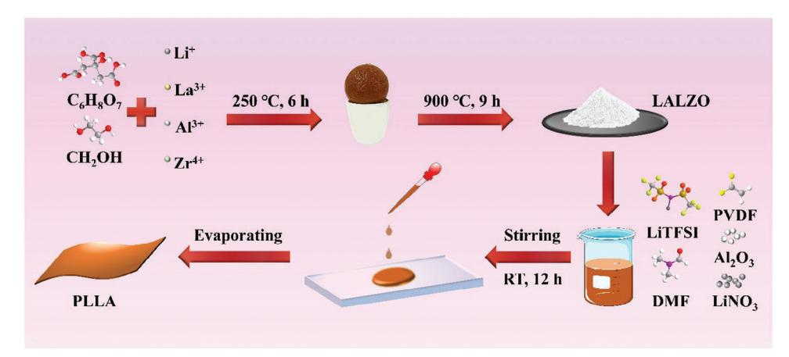
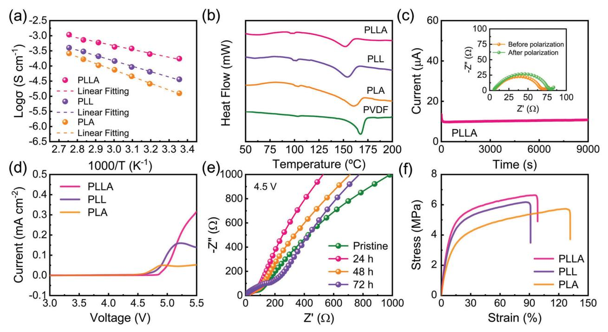
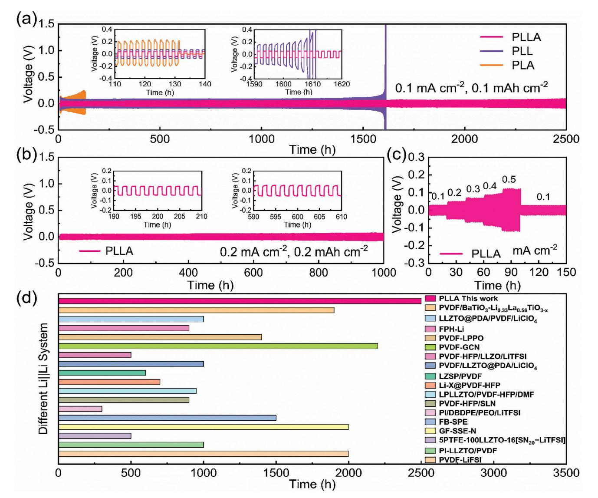
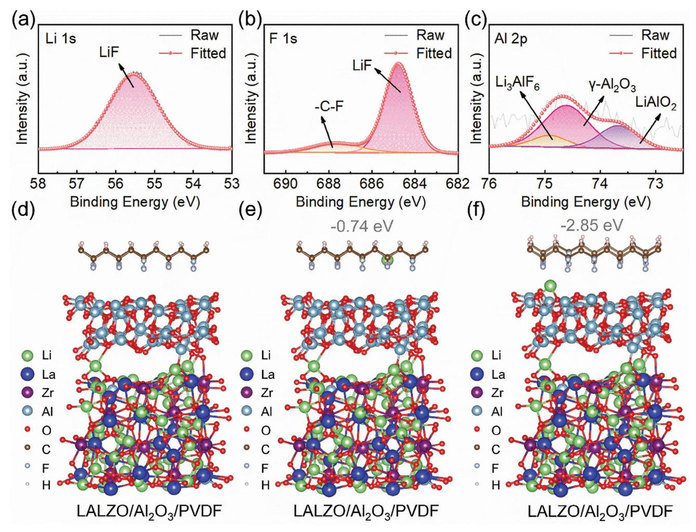
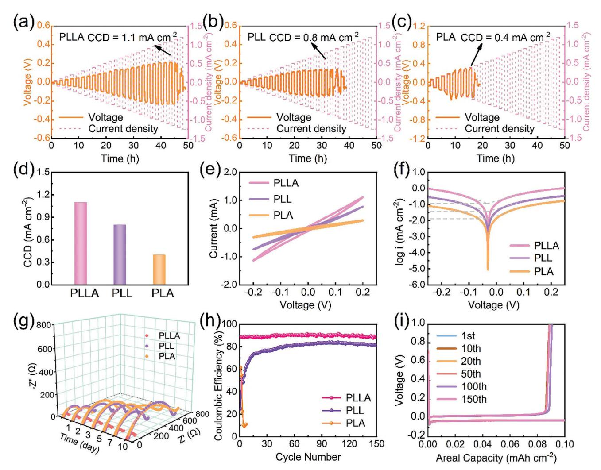
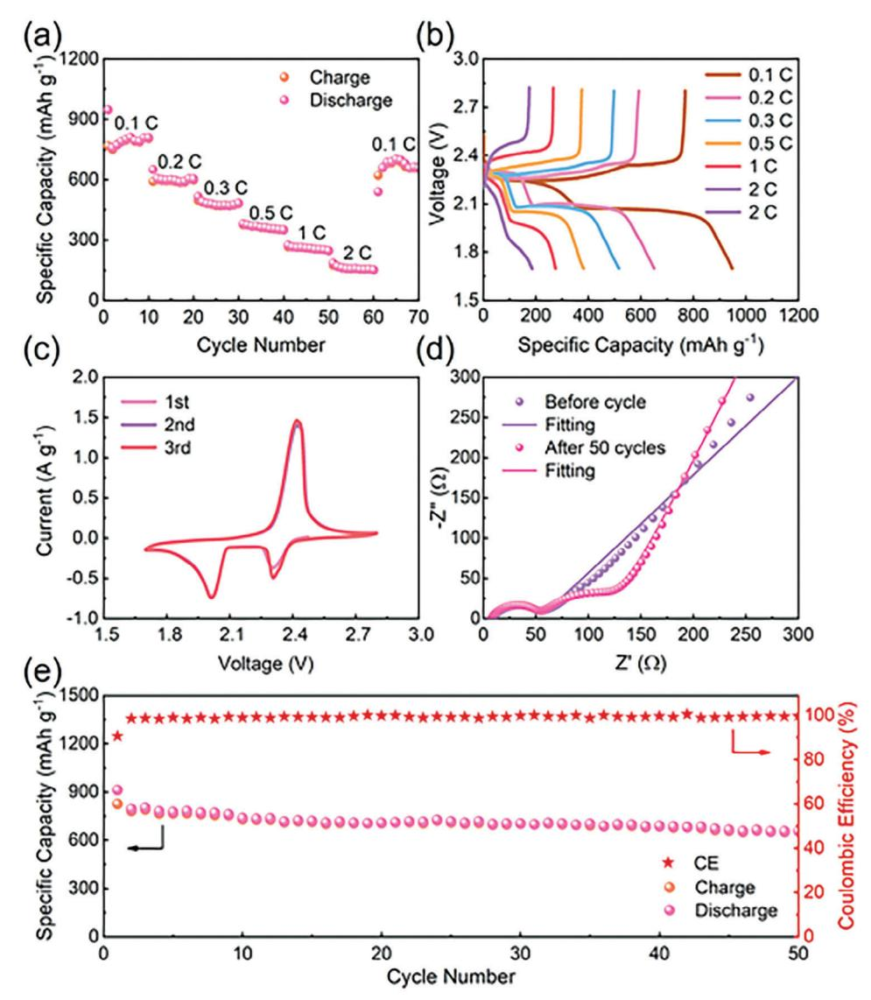

# **Dual Interface Compatibility Enabled via Composite Solid Electrolyte with High Transference Number for Long-Life All-Solid-State Lithium Metal Batteries**

*Mengyang Cui, Shiyang Fu, Shisheng Yuan, Bo Jin,\* Hui Liu, Yiyang Li, Nan Gao,\* and Qing Jiang\**

**The development of solid-state electrolytes (SSEs) effectively solves the safety problem derived from dendrite growth and volume change of lithium during cycling. In the meantime, the SSEs possess non-flammability compared to conventional organic liquid electrolytes. Replacing liquid electrolytes with SSEs to assemble all-solid-state lithium metal batteries (ASSLMBs) has garnered significant attention as a promising energy storage/conversion technology for the future. Herein, a composite solid electrolyte containing two inorganic components (Li6.25Al0.25La3Zr2O12, Al2O3) and an organic polyvinylidene difluoride matrix is designed rationally. X-ray photoelectron spectroscopy and density functional theory calculation results demonstrate the synergistic effect among the components, which results in enhanced ionic conductivity, high lithium-ion transference number, extended electrochemical window, and outstanding dual interface compatibility. As a result, Li||Li symmetric battery maintains a stable cycle for over 2500 h. Moreover, all-solid-state lithium metal battery assembled with LiNi0.6Co0.2Mn0.2O2 cathode delivers a high discharge capacity of 168 mAh g−1 after 360 cycles at 0.1 C at 25 °C, and all-solid-state lithium–sulfur battery also exhibits a high initial discharge capacity of 912 mAh g−1 at 0.1 C. This work demonstrates a long-life flexible composite solid electrolyte with excellent interface compatibility, providing an innovative way for the rational construction of next-generation high-energy-density ASSLMBs.**

M. Cui, S. Yuan, B. Jin, H. Liu, Y. Li, Q. Jiang Key Laboratory of Automobile Materials Ministry of Education School of Materials Science and Engineering Jilin University Changchun 130022, China E-mail: [jinbo@jlu.edu.cn;](mailto:jinbo@jlu.edu.cn) [jiangq@jlu.edu.cn](mailto:jiangq@jlu.edu.cn) S. Fu, N. Gao State Key Lab of Superhard Materials College of Physics Jilin University Changchun 130012, China E-mail: [gaon@jlu.edu.cn](mailto:gaon@jlu.edu.cn)

The ORCID identification number(s) for the author(s) of this article can be found under <https://doi.org/10.1002/smll.202307505>

#### **DOI: 10.1002/smll.202307505**

### **1. Introduction**

Lithium metal is widely considered as an ideal anode material owing to its lowest electrochemical potential (−3.04 V vs SHE) and high theoretical specific capacity (3860 mA h g−1).[\[1–4\]](#page-13-0) The advanced energy storage/conversion technology of lithium metal anode instead of graphite anode can significantly improve the energy density of batteries. However, as for lithium metal anode, there are a series of problems such as the growth of mossy and dendritic lithium, which punctures the separator and causes an internal short-circuit.[\[5\]](#page-13-0) At the same time, the traditional liquid organic electrolytes are flammable and may cause the battery to burn, or even explode.[\[6\]](#page-13-0) All these safety concerns have significantly hindered the development and application of lithium metal anode.[\[7\]](#page-13-0) The design of the new-generation lithium batteries with higher energy density and safety has become the pressing issue, and particularly, there is the increasing demand for electric vehicles and other large mobile electrical equipments.[\[8,9\]](#page-13-0)

Solid-state electrolytes (SSEs) can effectively prevent the growth of lithium dendrites because they can regulate the

deposition of lithium metal. In this way, the existing concern is solved by developing lithium metal batteries based on SSEs, which alleviates the issues in the field of security fundamentally.[\[8,10,11\]](#page-13-0) As a result, all-solid-state lithium metal batteries (ASSLMBs) have been widely studied as the nextgeneration energy storage/conversion systems with enhanced energy density and safety. The SSEs need to possess the following requirements to meet the practical application conditions when assembling ASSLMBs:[\[12,13\]](#page-13-0) First, high ionic conductivity and lithium-ion flux are the necessary conditions; Second, the wide electrochemical window and electrochemical stability are indispensable; Third, good contact with electrode and small interface impedance are required; Last but not least, sufficient flexibility, mechanical properties, and strength that can prevent lithium dendrites grow and adapt the volume change during charging and discharging cannot also be ignored. Solid inorganic electrolytes (SIEs) include garnet-type  $Li_7La_3Zr_2O_{12}$  (LLZO) or  $\text{Li}_{6.4}\text{La}_{3}\text{Zr}_{1.4}\text{Ta}_{0.6}\text{O}_{12}$ ,[14,15] NASICON-type  $\text{Li}_{1.3}\text{Al}_{0.3}\text{Ti}_{1.7}(\text{PO}_{4})_{3}$ (LATP),[16] perovskite-type Li0.34La0.56TiO3,[17] lithium phosphorus oxynitride film,[18] and  $\text{Li}_{6.55}P_{0.45}\text{Si}_{0.55}S_5\text{I}$ .[19] The SIEs possess high ionic conductivity ( $\geq 10^{-4}$  S cm-1 at ambient temperature). However, their brittleness and the hard-hard interfacial contact with the electrode lead to high interfacial impedance, which is not conducive to the occurrence of internal reactions in the battery.[11] Comparatively, an easy-preparation and light weight solid polymer electrolytes (SPEs) including polyethylene oxide (PEO), polyvinylidene fluoride (PVDF), and polymethylmethacrylate possess excellent flexibility, which is beneficial to forming a soft-hard interface with an electrode and reducing the interface resistance.[20,21] But it cannot be ignored that the low ionic conductivity ( $\approx 10^{-6}$ – $10^{-7}$  S cm-1 at ambient temperature), insufficient electrochemical stability, and relatively low mechanical strength limit their practical application.[11] To combine the advantages of SIEs and SPEs, the organic-inorganic composite solid electrolytes (CSEs) emerge. Particularly, by introducing inorganic fillers into the polymer matrix to achieve the organic-inorganic CSEs is the most effective strategy for strengthening SPEs.[22] A variety of inorganic fillers such as  $\text{Al}_2\text{O}_3$ ,[23] SiO2,[24] LLZO or Li6.75 La3Zr1.75Ta0.25O12 (LLZTO),[25,26] and  $\text{Li}_{1,4}\text{Al}_{0,4}\text{Ge}_{1,6}(\text{PO}_4)$ 3,[7] have been reported for the preparation of CSEs. The addition of inorganic fillers can decrease the crystallinity of the polymer, increase the mobility of the segments in the polymer, and further effectively improve the ionic conductivity.[27] Nowadays, PEO is considered as the most practical and promising polymer matrix, and widely studied because of its high dielectric constant, low cost, and fast transfer of Li+ through local relaxation and segmental movement in the polymer chain.[ $28,29$ ] Nevertheless, the limited ionic conductivity and Li+ transference number at room temperature (RT) have hindered its progress and practical implementation.[29,30] In the meantime, PVDF has strong electron-absorbing functional groups  $(-C-F)$ and large dielectric constant ( $\epsilon = 8.4$ ),[28] which contributes to dissolve lithium salt to a greater extent, and is considered as an outstanding polymer matrix for CSEs.[31] Besides, PVDF has better mechanical performance and thermal stability than PEO.[26] Nevertheless, PVDF possesses a small amorphous region and high crystallinity that leads to poor ionic conductivity of Li+.[28,32] Therefore, the CSEs can be constructed by introducing inorganic components into PVDF to achieve high ionic conductivity. Especially, garnet-type active Li+ conductor is one of the most practical and promising candidates owing to its high intrinsic conductivity and superior chemical stability against lithium metal anode. For example, Nan et al. reported the synergistic effect between PVDF matrix and LLZTO filler, leading to the improved performance of the flexible electrolyte film and a high ionic conductivity of  $\approx 5 \times 10^{-4}$  S cm-1 at 25 °C.[26] At the same time, they suggested that the different LLZTO contents had an important effect on the performance of the prepared CSEs. Herein, we propose that it is promising to add another inorganic filler in the mixture of PVDF matrix and LLZTO filler to achieve a high-performance composite solid electrolyte by the synergistic effect among the various components.

In this work, we have successfully synthesized the flexible composite solid electrolyte composed of PVDF matrix,  $\text{Li}_{6.25}\text{Al}_{0.25}\text{La}_3\text{Zr}_2\text{O}_{12}$  (LALZO), and Al2O3 by using a solutioncasting method (defined as PLLA). The electrochemical performance, mechanical properties, and non-flammability of PVDF matrix modified by LALZO and  $Al_2O_3$  are improved significantly. The synergistic coupling of PVDF with LALZO and  $Al_2O_3$  promotes the rapid transport of Li+. The experimental results indicate that such a thin (125  $\mu$ m) and flexible PLLA composite solid electrolyte exhibits a high ionic conductivity of  $1.89 \times 10^{-4}$  S cm-1 at 25  $^{\circ}$ C, a high ionic transference number (0.80) as well as an extended electrochemical window (4.85 V). Density functional theory (DFT) calculation results show that the as-prepared PLLA composite solid electrolyte exhibits an excellent ability to dissociate lithium salt and promote the solvation of lithium ions. Furthermore, the functionality and applicability of the PLLA composite solid electrolyte have been verified through the assembled high voltage NCM622||Li batteries and high theoretical capacity lithium–sulfur batteries with outstanding electrochemical performance.

### 2. Results and Discussion

The schematic illustration for the synthesis of LALZO and PLLA composite solid electrolytes is shown in **Figure 1**. The LALZO powers are prepared by a one-step conventional modified Pechini sol-gel method. It is noteworthy that the doping of Al plays an important role in stabilizing the cubic phase of the as-synthesized LALZO, which possesses higher ionic conductivity.[33] According to Figure S1a (Supporting Information), all the peaks in X-ray diffraction (XRD) pattern can be indexed to cubic LALZO, which matches well with the standard pattern of the known garnet-type oxide Li5La3Nb2O12 (PDF#80-0457),[34] indicating the successful synthesis of LALZO. Besides, the sample without Al doping was prepared using the same synthesis route as LALZO, and the raw materials were mixed according to the stoichiometric ratio of  $Li_7La_3Zr_2O_{12}$  (LLZO). The result of XRD (Figure S1b, Supporting Information) shows that the as-prepared LLZO matches well with the standard pattern of tetragonal LLZO (ICSD 24–6816). The asprepared LALZO presents cubic phase, indicating that the Al doping is the key to stable cubic phase. The PLLA composite solid electrolyte is prepared via a simple solution-casting method.[7,26] Specifically, PVDF, lithium bis(trifluoromethanesulfonyl)imide (LiTFSI), and LiNO3 are dissolved in an appropriate amount of N,N-dimethylformamide (DMF) to form an uniform solution. The addition of  $LiNO3$  in the electrolyte has been reported to promote the decomposition of LiTFSI to preferentially form LiF.[35] Meanwhile,  $LiNO_3$  can also provide increased free Li+ to improve the ionic conductivity.[36] Subsequently, LALZO with a particle size of  $\approx$ 5 µm (Figure S2, Supporting Information) and Al2O3 are added into the above solution, and continuously stirred until dispersed uniformly. Then the as-obtained solution is cast on the glass plate, and dried overnight at 60 °C to remove the solvent. LALZO is thermodynamic stable against lithium metal, therefore, it is selected as the main inorganic filler in this work. The addition of  $Al_2O_3$  makes the interface between lithium metal and LALZO wet, further improving the stability of lithium metal.[14]

Ionic conductivity ( $\sigma$ ) is considered as a critical parameter and standard to characterize ion conduction. To explore the optimal ratio of added LALZO and Al2O3, we first prepare a series of PLL-x CSEs (x is the weight percentage of LALZO,  $x = 5$ , 10, 15, 20, 25, and 30) containing different LALZO contents. The

**Figure 1.** Schematic illustration for the synthesis of Li6.25Al0.25La3Zr2O12 (LALZO) and PLLA composite solid electrolyte.

calculation results of Equation (2) demonstrates that PLL-15 shows the highest value at 25 °C (Figure S3, Table S1, Supporting Information). On this basis, a series of PLLA-y CSEs are obtained by adding Al2O3 with different weight percentages (*y* = 1, 2, 3, 4, and 5). When *y* = 2, the as-prepared composite solid electrolyte (defined as PLLA) displays the biggest value of 1.89 × 10−4 S cm−1 at 25 °C (Figure S4, Table S1, Supporting Information). Therefore, we take PLLA as the subject of subsequent research. It is seen that the as-prepared PLLA composite solid electrolyte has a thickness of 125 μm in Figure S5 (Supporting Information). Meanwhile, PLL-15 composite solid electrolyte (defined as PLL) and composite solid electrolyte only containing 15% Al2O3 (denoted as PLA) are also prepared for the follow-up study and comparison. It is worth noting that the as-prepared PLLA and PLL CSEs appear brown while the PLA composite solid electrolyte looks white (Figure S6, Supporting Information). It is because La atoms of LALZO are complexed with N atoms and C═O groups of solvent molecules derived from DMF, which enriches electrons at the N atoms. This behavior is similar to Lewis base, and results in alkaline-like environment (Figure S7, Supporting Information), which induces the chemical dehydrofluorination of PVDF chain segment.[\[26\]](#page-13-0) Therefore, the color of composite solid electrolytes with LALZO changes. Meanwhile, the strong Lewis acid–base interaction between the ion species in the polymer matrix and the surface of the inorganic filler facilitates the decomposition of lithium salt. As shown in scanning electron microscopy (SEM, JSM-6700, and TM4000) images in Figure S8 (Supporting Information), the as-prepared PLLA composite solid electrolyte exhibits different micro morphologies on its two surfaces. One side presents a smooth surface with minimal protuberances (Figure S8a, Supporting Information) while another side displays an enrichment of ceramic particles (Figure S8b, Supporting Information). This Janus structure arises from the different evaporation rates of solvent on two sides of the organic–inorganic composite slurry during the drying process on the glass plate. As a result, the polymer aggregates are generate on one side in contact with the glass plate while the inorganic ceramic accumulates on the opposite side. Thus a doublesided anisotropic PLLA composite solid electrolyte is formed. At the same time, pores are produced on two surfaces, and caused by the evaporation of the DMF solvent.[\[34\]](#page-13-0) PLL composite solid electrolyte has a similar microstructure to PLLA composite solid electrolyte (Figure S9, Supporting Information). However, the surface of PLA composite solid electrolyte shows a denser structure because the added Al2O3 possesses a particle size of only 20 nm (Figure S10, Supporting Information). Energy dispersive spectrometer (EDS) elemental mapping images of PLLA composite solid electrolytes are presented in Figure S11 (Supporting Information), confirming the uniform distribution of LALZO and Al2O3 in the as-prepared PLLA composite solid electrolyte.

**Figure [2](#page-3-0)**a shows the ionic conductivities of CSEs varying with temperatures from 25 to 90 °C. PLLA exhibits the highest value of 1.89 × 10−4 S cm−1 at 25 °C compared to the other two CSEs. The ionic conductivity increases as the temperature increases, eventually reaching to 10−3 S cm−1 at 90 °C. This phenomenon may be explained by the fact that high temperature causes ions to become more mobile and diffuse more easily, leading to an increase in the number of removable ions.[\[37\]](#page-13-0) The electronic conductivity () is measured in SS|PLLA|SS battery at 25 °C via the measurement of direct current (DC) polarization. The value is computed to be 7.14 × 10−11 S cm−1 by Equation (5), and much lower than the ionic conductivity, which plays the main role in the entire conductivity (Figure S12, Supporting Information). Moreover, the Arrhenius plots fitting well with the Vogel– Fulcher–Tammann equation are used to fit the ionic conductivities of CSEs.[\[38,39\]](#page-13-0) According to Equation (3), the slope of the curve is used to calculate the activation energy (*E*a) of Li+ transport in CSEs. PLLA composite solid electrolyte displays the lowest *E*a value of ≈0.23 eV, implying that the ionic barrier for Li+ transport is the lowest, which enhances ion transport, and is consistent with high ionic conductivity. The higher and lower *E*a are benefit for battery performance. The transportation of Li+ is achieved through the chain movement of the polymer, and the lower glass transition temperature (*T*g) is conducive to the rapid transport of Li+. To determine the melting point temperature (*T*m) and *T*g of CSEs, the differential scanning calorimeter (DSC) experiments were carried out. According to the DSC testing results, the *T*g and *T*m of PLLA, PLL, and PLA are lower than those of pure PVDF, indicating that the promoted mobility of PVDF segments is enabled by the addition of two fillers (Figure [2b\)](#page-3-0), which provides the direct evidence of improved ionic conductivity. Among them, since the content of inorganic fillers in PLLA is the highest, *T*g www.advancedsciencenews.com

CIENCE NEWS

Figure 2. a) Arrhenius plots of PLLA, PLL, and PLA CSEs. b) DSC curves of PLLA, PLL, PLA, and pure PVDF. c) Current-time curve of PLLA composite solid electrolyte at the polarization voltage of 10 mV, and inset is EIS diagrams before and after the polarization. d) LSV curves of PLLA, PLL, and PLA CSEs. e) The impedance spectra of SS|PLLA|Li battery upon time at bias voltage 4.5 V at 25 °C. f) Stress-strain curves of PLLA, PLL, and PLA CSEs.

and  $T_m$  decrease drastically, which also represents the most intense movement of the PVDF chain segment in PLLA. Furthermore, the lithium-ion transference number ( $t_{\text{Li}+}$ ) of CSEs is also calculated.  $t_{Li+}$  is a key parameter to prove the mobility of Li+. A solid-state electrolyte with high  $t_{\text{Li}+}$  value reflects more immobilized anions and free Li+,[40] and achieves the uniform transport and deposition of Li+, which contributes to avoid the formation and growth of lithium dendrite, thereby effectively improving the safety of batteries.  $[41,42]$  Figure 2c displays the chronoamperometry profile and the alternating current (AC) impedance results of Li|PLLA|Li battery before and after polarization. The corresponding  $t_{\rm Li\ +}$  values are calculated with the Bruce–Vincent– Evans equation.[39] On the basis of Equation (4), PLLA composite solid electrolyte shows the highest  $t_{\text{Li+}}$  value (0.80) at 25 °C while  $t_{i}$  values of PLL (Figure S13a, Supporting Information) and PLA CSEs (Figure S13b, Supporting Information) are 0.45 and 0.41, respectively. The high  $t_{i+1}$  value is because TFSI- anions are fixed by the composite solid electrolyte, which effectively limits the migration of TFSI- and thus further restricts side reactions occurring at the interface.[43] The limit of TFSI- releases the space charge at the interface and enhances the uniformity of lithium distribution.[41,44] As shown in Table S2 (Supporting Information), the PLLA composite solid electrolyte prepared in this work has a higher  $t_{i+}$  value than recently reported SSEs.

The electrochemical window is also tested to evaluate the electrochemical performance of CSEs for being used in lithium metal batteries. We utilize linear sweep voltammetry (LSV) to determine the electrochemical stability voltage of the as-prepared CSEs. As shown in Figure 2d, the electrochemical window of PLLA composite solid electrolyte is found to be 4.85 V, and higher than those of PLL (4.61 V) and PLA CSEs (4.53 V). We fur-

ther measure the impedance changes of CSEs during long-term high-voltage operation at a constant direct-current bias voltage of 4.5 V (Figure  $2e$ ; Figure S14, Supporting Information). The interface resistance of SS|PLLA|Li battery exhibits minimal changes over a period of 72 h. In contrast, the impedances of SS|PLL|Li and SS|PLA|Li batteries present a significant increase during the same testing period. These findings suggest that the PLLA composite solid electrolyte possesses a high oxidation potential, making it a suitable match with high-voltage cathode materials for high-energy-density batteries. According to Fourier transform infrared spectra (FT-IR, Figure S15, Supporting Information), solid polymer electrolyte (SPE) composed only of polymer and lithium salts (defined as PL) shows no significant change compared with pure PVDF, indicating that lithium salts are fully decomposed. As shown in Figure **S15** (Supporting Information),  $\beta$ -phase PVDF is observed at 840, 878, 1171, and 1232 cm-1.[45] The absorbance band at 840 cm-1 is assigned to a mixed mode of  $CH_2$  rocking and  $CF_2$  asymmetric stretching vibration.[46] The absorbance band at 878 cm-1 is ascribed to the amorphous phase of PVDF.[47] The bands at 1171 and 1232 cm-1 are attributed to  $CF_2$  stretching and  $-C-F$  stretching.[48] The absorbance bands at 613, 765, and 976 cm-1 are related to  $\alpha$ -phase PVDF.[46] The absorbance band at 613  $\text{cm}^{-1}$  is due to CF2 bending and CCC skeletal bending while the absorbance band at 765 cm-1 corresponds to  $CH_2$  rocking vibration.[46,48] It is worth noting that with the increasing of LALZO and Al2O3 contents, the peaks of  $\beta$ -phase PVDF become weaker while those of  $\alpha$ -phase PVDF appear. The inescapable conclusion is that the addition of LALZO and  $Al_2O_3$ affects the crystalline phase of PVDF from  $\beta$ -phase to  $\alpha$ -phase. Here  $\alpha$ -phase is the most thermodynamically stable among the various crystalline forms of PVDF,[49] therefore, the generation

of -phase is conducive to improving the structural stability of the as-prepared CSEs. It is observed in Figure S16 (Supporting Information) that PLLA composite solid electrolyte is bent at different angles without the obvious rupture, demonstrating that it has excellent mechanical properties and flexibility. Furthermore, Figure [2f](#page-3-0) shows the stress–strain curves of PLLA, PLL, and PLA CSEs. With the introduction of LALZO and Al2O3, the PLLA composite solid electrolyte shows a highly improved tensile strength of ≈6.62 MPa while elongation increases to 98.4%. The PLL composite solid electrolyte exhibits slightly lower tensile strength and elongation. However, the PLA composite solid electrolyte shows a significantly reduced tensile strength of 5.73 MPa and increased elongation of 131.7%. These results are owing to the difference in particle size and content of inorganic components added in CSEs. Due to the highest inorganic component content, the PLLA composite solid electrolyte exhibits the highest mechanical strength. While the PLA composite solid electrolyte shows the biggest elongation, which is attributed to the smaller size of the added Al2O3. Safety problem caused by the flammability of organic liquid electrolytes has been widely concerned. The PLLA composite solid electrolyte designed in this work avoids this shortcoming and displays the excellent nonflammability. As shown in Figure S17a (Supporting Information), the PLLA composite solid electrolyte retains its structure in the flammability test. In comparison, the PLL composite solid electrolyte exhibits less structural stability than the PLLA composite solid electrolyte when it is near the flame (Figure S17b, Supporting Information), while the PLA composite solid electrolyte catches fire instantly and burns fiercely, indicating its poor thermal stability (Figure S17c, Supporting Information). It also proves that the addition of LALZO improves the flame resistance of electrolytes. The nonflammable PLLA composite solid electrolyte effectively eliminates the risk of thermal runaway and improves the safety of ASSLMBs.

To evaluate the interfacial compatibility and the long-term cycling stability against the lithium anode, symmetric Li||Li and asymmetric Li||Cu batteries with different CSEs are assembled. A study on galvanostatic polarization as well as the reversibility of Li deposition/stripping is carried out to mimic the lithium deposition process in Li||Li symmetric batteries. The results of the voltage profile over time for the above symmetric batteries at a current density of 0.1 mA cm−2 and an areal capacity of 0.1 mAh cm−2 are shown in **Figure 3**[a.](#page-5-0) For PLA composite solid electrolyte, Li||Li symmetric battery suffers from large hysteresis (150 mV) and a sudden short circuit at approximately 130 h. For PLL composite solid electrolyte, Li||Li symmetric battery demonstrates moderate voltage hysteresis and stable cycle of≈1600 h. By contrast, it is evident that a symmetric battery with PLLA composite solid electrolyte indicates remarkable resistance to premature battery failure caused by dendrite growth, and exhibits consistent cycling for over 2500 h as well as reduces the overpotential to 40 mV. The efficiency of PLLA composite solid electrolyte in stabilizing lithium deposition is further investigated at 0.2 and 0.5 mA cm−2 (Figure [3b;](#page-5-0) Figure S18a, Supporting Information). Impressively, the Li|PLLA|Li symmetric batteries show no sign of the sharp increase in voltage or the sudden short circuit until 1000 h at a current intensity of 0.2 mA cm−2 and 300 h even at a high current intensity of 0.5 mA cm−2, respectively. The PLLA composite solid electrolyte prepared in this work possesses enhanced performance matching with lithium anode, compared to the various CSEs reported recently (Figure [3d;](#page-5-0) Table S3, Supporting Information). To assess the stableness of PLLA composite solid electrolyte versus current change in practice, the reversibility of lithium deposition is tested at step-varied currents from 0.1 to 0.5 mA cm−2. It is seen that Li|PLLA|Li symmetric battery shows high rate performance upon the gradual increase in current density (Figure [3c\)](#page-5-0). Further, the stability and rate tests for PLLA composite solid electrolyte are carried out at the fixed areal capacity of 1 mAh cm−2. Figure S18b (Supporting Information) shows the voltage profiles of Li deposition/stripping, in which the current density increases from 0.1 to 1 mA cm−2, and finally back to 0.1 mA cm−2. The polarization voltage increases with current density and the battery displays stable cycling without a short circuit even at 1 mA cm−2. Besides, at the fixed areal capacity of 1 mAh cm−2, the symmetric battery can stably cycle 100 h at 0.1 mA cm−2 (Figure S18c, Supporting Information), while it can also stably circulate more than 100 h at 1 mA cm−2 (Figure S18d, Supporting Information). The above results indicate that the PLLA composite solid electrolyte possesses enhanced lithium-ion flux and excellent interfacial compatibility with lithium metal. It is also consistent with the above-obtained *t*Li + .

A comparison of the surface morphology of lithium metal after cycling at a current density of 0.1 mA cm−2 is investigated by SEM images. The fresh Li foil surface demonstrates a smooth and dense morphology (Figure S19, Supporting Information). The obvious rough dendrites for PLA composite solid electrolyte after 100 h are observed (Figure S20a, Supporting Information), leading to the poor Li electrodeposition performance and rapid occurrence of short-circuiting. Besides, the uneven deposition domains with wrinkles are formed on lithium metal with PLL composite solid electrolyte after 1000 h (Figure S20b, Supporting Information). Conversely, it is obvious that the uneven lithium dendrite nucleation is alleviated on lithium anode with PLLA composite solid electrolyte after 1500 h (Figure S20c, Supporting Information), corresponding to the extended lifetime of Li||Li symmetric battery. The morphologies of the corresponding CSEs obtained from the above batteries after cycles are also observed by SEM images and digital photographs. It is seen in Figure S21 (Supporting Information) that the surface of PLLA does not change significantly. However, dark brown color is observed on the surface of PLL while the surface of PLA is adhered to the obvious massive material, and turns dark. Combined with the corresponding surface SEM images of lithium metals (Figure S20, Supporting Information), the massive material should be "dead Li". This color change comes from further loss of H and F of PVDF during the deposition/stripping process of lithium.[\[50\]](#page-13-0) Further, X-ray photoelectron spectroscopy (XPS) and DFT calculations are used to explore the reason of inhibiting the growth of lithium dendrite. **Figure 4**[a–c](#page-6-0) shows high-resolution XPS spectra of PLLA composite solid electrolyte cycled after 1500 h for Li||Li symmetric battery at 0.1 mA cm−2. In high-resolution Li 1s spectrum, an obvious peak at 55.7 eV is ascribed to F− from LiF (Figure [4a\)](#page-6-0), and an evident peak at 684.8 eV in high-resolution F 1s spectrum also corresponds to F− from LiF (Figure [4b\)](#page-6-0). The formation of LiF may be originated from the reaction of lithium metal with HF derived from the chemical dehydrofluorination of PVDF during cycling. LiF is contributed to regulate the uniform

**Figure 3.** a) Galvanostatic cycling curves of Li|PLLA|Li, Li|PLL|Li, and Li|PLA|Li symmetric batteries at a current density of 0.1 mA cm−2 and an areal capacity of 0.1 mAh cm−2. Insets: detailed voltage profiles at 110–140 h and 1590–1620 h. b) Galvanostatic cycling curve of Li|PLLA|Li symmetric battery at a current density of 0.2 mA cm−2 and an areal capacity of 0.2 mAh cm−2. Insets: detailed voltage profiles at 190–210 and 590–610 h. c) Rate performance of Li|PLLA|Li symmetric battery. d) Comparison of cycling stability of Li||Li symmetric battery based on PLLA composite solid electrolyte with other reported batteries with SSEs at 0.1 mA cm−2.

deposition and stripping of lithium, which is beneficial to improving the stability of lithium metal during cycling.[\[35,51\]](#page-13-0) Moreover, the peaks at 74.9 and 73.6 eV in high-resolution Al 2p spectrum are attributed to Al3+ from Li3AlF6 and LiAlO2 ionic conductors (Figure [4c\)](#page-6-0), respectively, which are also conducive to higher *t*Li + and crucial in stabilizing lithium metal.[\[52,53\]](#page-13-0) As for PLLA composite solid electrolyte, LiF, Li3AlF6, and LiAlO2 construct a more stable solid electrolyte interface (SEI) to inhibit the growth of lithium dendrites (Schematic illustration in Figure S20c, Supporting Information). The formation of Li3AlF6 and LiAlO2 is speculated as follows[\[53\]](#page-13-0) :

$$2Al2O3 + 6LiF = Li3AlF6+3LiAlO2$$
 (1)

DFT calculations are used to calculate the adsorption energy of Li+ in the electrolyte. We designed two structural models without and with Al2O3, and the side views for pristine LALZO/PVDF and LALZO/Al2O3/PVDF composite structures are shown in Figure S22 (Supporting Information) and Figure [4d,](#page-6-0) respectively. More impressively, it is found that partially Li atoms on the surface of LALZO form covalent bonds with O atoms in the Al2O3 layer. For LALZO/PVDF, the adsorption energy of Li+ on PVDF is −0.72 eV (Figure S23). Especially, for LALZO/Al2O3/PVDF, the adsorption energy slightly increases to −0.74 eV for Li+ on PVDF (Figure [4e\)](#page-6-0), and it significantly enhances to −2.85 eV for Li+ on the Al2O3 layer (Figure [4f\)](#page-6-0). These results indicate that the addition of Al2O3 changes the coordination environment of lithium ions compared to LALZO/PVDF and enriches Li+

**Figure 4.** High-resolution XPS spectra of a) Li 1s, b) F 1s, and c) Al 2p in PLLA composite solid electrolyte after 1500 h. d) Side view of pristine structure of LALZO/Al2O3/PVDF. e,f) Side views of Li adsorbed on LALZO/Al2O3/PVDF composite structure.

toward Al2O3. Therefore, the addition of Al2O3 improves the solvation ability of Li+, which promotes the dissociation of lithium salt and rapid Li+ migration in PLLA. This is also consistent with enhanced ion conductivity and high ion transference number of PLLA measured by the experiments. In summary, the as-prepared PLLA shows an outstanding ability to dissociate lithium salt, and at the same time, there are new components in the PLLA (Figure 4c), which are conducive to guiding lithium-ion deposition/stripping, so the excellent Li+ transport performance is achieved and lithium metal anode is stabilized.

Critical current density (CCD) is a key parameter to assess the interfacial ion transport ability and stability of symmetric batteries.[\[54\]](#page-13-0) The CCD of Li|PLLA|Li symmetric battery is higher than those of Li|PLL|Li and Li|PLA|Li symmetric batteries (**Figure 5**[a–d\)](#page-7-0), indicating that the interfacial stability between lithium metal and composite solid electrolyte is enhanced by the composite solid electrolyte with the addition of LALZO and Al2O3. Interestingly, the CCD of ASSLMBs reported in the literature varies widely. Impressively, compared to Li|PLL|Li and Li|PLA|Li symmetric batteries, Li|PLLA|Li symmetric battery exhibits stable overpotential along with the largest CCD of 1.1 mA cm−2, which is higher than those of most recently reported symmetric batteries listed in Table S3 (Supporting Information). Cyclic voltammetry (C–V) curves of Li||Li symmetric batteries (Figure [5e\)](#page-7-0) shows the typical centrosymmetric loops that reflect the highly reversible electrochemical behavior of assembled symmetric batteries. Li|PLLA|Li symmetric battery displays a more pronounced current than Li|PLL|Li and Li|PLA|Li symmetric batteries, implying that the reversible deposition and stripping ability of Li in Li|PLLA|Li symmetric battery is the strongest. From Tafel plots of Li||Li symmetric batteries, the exchange current density is estimated (Figure [5f\)](#page-7-0). Li|PLLA|Li symmetric battery exhibits a higher exchange current density (0.11 mA cm−2) compared with those of Li|PLL|Li and Li|PLA|Li symmetric batteries, further confirming the rapid Li+ transport on the surface of lithium metal and the enhanced redox kinetics.[\[55\]](#page-13-0)

The stability of the electrode–electrolyte interface plays a crucial role in determining the electrochemical performance of lithium metal batteries. To further assess the interfacial stability of the as-prepared different CSEs with lithium metal, the electrochemical impedance spectroscopy (EIS) is conducted on

**Figure 5.** a–c) Potential response of Li||Li symmetric batteries with PLLA, PLL, and PLA CSEs during CCD measurement. d) CCD of Li||Li symmetric batteries. e) CV curves and f) Tafel plots of Li||Li symmetric batteries with PLLA, PLL, and PLA CSEs. g) EIS profiles of PLLA, PLL, and PLA CSEs for different aging times. h) Coulombic efficiency of Li||Cu batteries with PLLA, PLL, and PLA CSEs at 0.1 mA cm−2. i) Voltage profiles of Li||Cu battery with PLLA composite solid electrolyte at 0.1 mA cm−2.

symmetric batteries at different storage times (Figure 5g). With the increase in the storage time, the interfacial impedance of Li|PLLA|Li presents a stable value of ≈98 Ω during 10 days, indicating that PLLA composite solid electrolyte shows excellent interfacial stability when contacting with lithium metal. By contrast, the interfacial resistances of Li|PLL|Li and Li|PLA|Li symmetrical batteries increase quickly. The high stability of Li|PLLA|Li symmetric battery is attributed to the flexible-rigid interface supplied by PLLA composite solid electrolyte, which effectively reduces the volume change and strengthens critical lithium-ion flux during cycling.[\[38\]](#page-13-0) Furthermore, Li||Cu batteries are cycled at a current density of 0.1 mA cm−2 and an areal capacity of 0.1 mAh cm−2 to demonstrate the stability of PLLA, PLL, and PLA CSEs during the Li deposition/stripping process (Figure 5h). Equation (6) is used to calculate the Coulombic efficiency (CE) of Li||Cu batteries. As expected, Li|PLLA|Cu battery retains the highest CE of more than 90% over 150 cycles, which is owing to high *t*Li + and stabilized interface. It is seen that Li|PLL|Cu battery takes ≈80 cycles before the CE reaches a steady value of only ≈80%. However, the CE value of Li|PLA|Cu battery is much lower, and sharply declines within a few cycles. These results indicate that PLL supplemented with LALZO better regulates the deposition and stripping of lithium than PLA supplemented with Al2O3. However, PLLA supplemented with Al2O3 on the basis of PLL inhibits the side reactions between lithium and electrolyte and maintains a higher reversibility of Li deposition/stripping than PLL. It is attributed to the fact that the further addition of Al2O3 in PLLA makes the prepared composite solid electrolyte more dense and stronger. Meanwhile, the overpotential between deposition and stripping curves is also an important parameter to evaluate the stability of interfacial resistance.[\[56\]](#page-13-0) As shown in Figure 5i, the stripping and deposition process of PLLA composite solid electrolyte is stable. The PLLA composite solid electrolyte has a low overpotential and almost remains unchanged during 150 cycles. Figure S24 (Supporting Information) displays voltage–capacity profiles during Li nucleation in Li||Cu batteries with different CSEs. All the voltage profiles show a drop in voltage at the beginning of lithium deposition, followed by the flat voltage plateau. The nucleation overpotential (*μ*n) is denoted as the difference between the tip voltage and the later stable mass transfer control platform during the Li deposition process.[\[57\]](#page-13-0) The PLLA composite solid electrolyte exhibits a much lower *μ*n value of ≈47.9 mV than PLL (56.1 mV) and PLA (69.7 mV) CSEs, which is ascribed to its faster charge transfer kinetics and lower nucleation energy barrier, indicating lower Li plating resistance.[\[37\]](#page-13-0) The above results imply that the PLLA composite solid electrolyte has the best chemical/electrochemical stability to lithium metal. The reason is as follows: First, the active lithium-ion conductor (LALZO) is added to the PLLA composite solid electrolyte, which effectively improves the ionic conductivity of the PLLA composite solid electrolyte; In addition, during the charge/discharge processes, the lithium metal surface forms a LiF protective layer, and the added Al2O3 reacts with LiF to form Li3AlF6 and LiAlO2 ionic conductors, which further enhances the ionic conductivity of the PLLA composite solid electrolyte; Finally, LiF, Li3AlF6, and LiAlO2 construct a more stable solid electrolyte interface (SEI).

The enhanced electrochemical window of the PLLA composite solid electrolyte allows it to be used at high voltage. Therefore, we use LiNi0.6Co0.2Mn0.6O2 (NCM622) as a cathode material, and the electrochemical performance of NCM622||Li batteries is systematically tested to demonstrate the functionality of PLLA composite solid electrolyte in practical applications. The feasibility of PLLA composite solid electrolyte is further investigated in NCM622||Li batteries at 3.0–4.3 V. It is worth noting that when assembling batteries, the ceramic-rich surface is chosen to matches with the cathode while the smooth surface is in touch with Li metal anode. The corresponding diagram is shown in Figure S25 (Supporting Information). The contact between two relatively rough surfaces on the cathode side and two relatively smooth surfaces on the anode side is beneficial to improving the contact between PLLA composite solid electrolyte and electrode, thus improving the dual interface compatibility. **Figure [6](#page-9-0)**a displays the galvanostatic intermittent titration technique (GITT) charge/discharge curves of NCM622||Li batteries with PLLA, PLL, and PLA CSEs. It is observed that no excessive oxidation or reduction is found in the GITT curve of NCM622|PLLA|Li battery, which delivers a higher discharge capacity, also proving that the electrochemical window of PLLA composite solid electrolyte is effectively enlarged through the addition of LALZO and Al2O3 in composite solid electrolyte.[\[7\]](#page-13-0) Furthermore, as shown in Figure S26 (Supporting Information), the Li+ diffusion coefficient (*D*Li + ) with respect to voltage for NCM622||Li battery is calculated based on Fick's second law by using the Weppner-Huggins equation and GITT curves.[\[58\]](#page-13-0) Using Equation (7), the calculated average values of *D*Li + for NCM622|PLLA|Li battery are 1.07 × 10−10 cm2 s−1 during discharge and 1.23 × 10−10 cm2 s−1 during charge, respectively. The calculated average values of *D*Li + for NCM622|PLL|Li and NCM622|PLA|Li are 6.43 × 10−11 and 4.98 × 10−11 cm2 s−1 during charge and 7.09 × 10−11 and 6.60 × 10−11 cm2 s−1 during charge, respectively. The battery assembled with PLLA composite solid electrolyte exhibits the highest value of *D*Li + , further indicating that the PLLA composite solid electrolyte much better matches with a high-voltage cathode. It is a noteworthy fact that the *D*Li + of NCM622|PLLA|Li battery exhibits a higher value during the charging process compared to the discharging process. It is attributed to the more synchronized multiphase transformation and rapid healing of the phase boundary during charging.[\[8\]](#page-13-0)

The rate performance of NCM622||Li batteries at different current densities from 0.1 to 2 C is shown in Figure [6b.](#page-9-0) NCM622|PLLA|Li battery exhibits excellent rate performance with discharge capacities of 157, 134, 125, 110, 82, and 48 mAh g−1 at 0.1, 0.2, 0.3, 0.5, 1, and 2 C, respectively. When the current density returns to 0.1 C, the NCM622|PLLA|Li battery also shows good capacity reversibility, indicating that the electrolyte does not decompose seriously at high current rates. It is seen that the rate performance of NCM622|PLLA|Li battery has been notably improved compared to the batteries assembled with PLL and PLA CSEs, which benefits from the improved Li+ conductivity and interfacial contact. The galvanostatic charge and discharge (GCD) curves of NCM622|PLLA|Li battery at different current densities of 0.1, 0.2, 0.3, 0.5, 1, and 2 C are shown in Figure [6c.](#page-9-0) With the increase in current density, the discharge voltage platform drops gradually. Correspondingly, the GCD curves of NCM622|PLL|Li and NCM622|PLA|Li batteries (Figure S27, Supporting Information) indicate that with the increase in current density, the discharge voltage platforms quickly drop and there is a significant polarization. Long-time cyclic stability is another important criterion to evaluate the applicability of CSEs in the assembled batteries. The cycling performance of NCM622||Li batteries using different CSEs prepared in this work at 25 °C at a low current density of 0.1 C is displayed in Figure [6d.](#page-9-0) The assembled NCM622|PLLA|Li battery exhibits a high discharge capacity of 180 mAh g−1 and high CE exceeding 99% after a few cycles of activation. After 360 cycles, a discharge capacity of 168 mAh g−1 is maintained, which is higher than the reported literatures (Table S4, Supporting Information). Figure [6e](#page-9-0) presents GCD curves of NCM622|PLLA|Li battery at 0.1 C during different cycles, demonstrating that the polarization effect of the battery is weak. To further understand the electrochemical performance of NCM622, the initial three CV cycles of NCM622|PLLA|Li battery are recorded at 3.0-4.3 V with a scan rate of 0.1 mV s−1 (Figure S28, Supporting Information). During the initial three cycles, the peak intensities of redox peaks remain unchanged basically, confirming the good reversibility of the electrochemical reaction. As can be seen from Figure [6f,](#page-9-0) the NCM622|PLLA|Li battery presents excellent long-term cycling performance during 350 cycles at 1 C, and the discharge capacity is kept at 112 mAh g−1 after 350 cycles. Compared with the excellent infiltration of liquid electrolyte to an electrode, the contact between solid-state electrolyte and electrode is relatively insufficient. Thus, in the early cycles, the electrode is constantly activated during cycling, which is reflected in an increase of capacity. This phenomenon is also reported the literature.[\[9,30\]](#page-13-0) The excellent discharge capacity benefits from the improved Li+ conductivity, higher Li+ transference number, and low resistance interfacial contact by PLLA composite solid electrolyte. NCM622|PLLA|Li battery is disassembled after being cycled at 1 C. SEM images of NCM622 electrodes before cycle and after cycles are shown in Figure S29a,d (Supporting Information). Compared with the NCM622 electrode before cycle (Figure S29a, Supporting Information), the surface of the NCM622 electrode has small cracks after cycles (Figure S29d, Supporting Information), which may be caused by the volumetric expansion of the electrode during cycling. NCM622 particles

**Figure 6.** a) GITT tests and b) rate performance of NCM622||Li batteries with PLLA, PLL, and PLA CSEs. c) GCD profiles of NCM622|PLLA|Li battery at different current densities from 0.1 to 2 C. d) Cycling performance and Coulombic efficiency of NCM622||Li batteries with PLLA, PLL, and PLA CSEs at 0.1 C (1 C = 172 mA g−1), and the insert is a "MIC"-shaped light strip lighted up by two NCM622|PLLA|Li batteries connected in series. e) GCD curves of NCM622|PLLA|Li batteries at 0.1 C during the different cycles. f) Cycling performance and Coulombic efficiency of NCM622||Li battery with PLLA composite solid electrolyte at 1 C.

are observed by SEM (Figure S29b,c; e,f, Supporting Information) and TEM images (Figure S30, Supporting Information). It is seen that the morphology and particle size of NCM622 after cycles are similar to those of fresh NCM622 before the cycle, indicating the stability of NCM622 during cycling. PLLA composite solid electrolyte and lithium metal anode after cycles are collected by SEM images to observe the surface morphologies (Figure S31, Supporting Information). As shown in Figure S31a,b (Supporting Information), the morphologies of two sides of the PLLA composite solid electrolyte after cycles are akin to those of fresh PLLA composite solid electrolyte before cycle (Figure S8, Supporting Information), and their is no obvious change. Compared to the fresh lithium metal anode before the cycle (Figure S19, Supporting Information), the lithium metal anode after cycles also displays a flat appearance (Figure S31c, Supporting Information), and no dendritic and mossy lithium is observed. Impressively, in Figure 6, the NCM622||Li battery with the PLLA composite solid electrolyte is stably cycled at 3.0–4.3 V, which strongly proves that the PLLA CSE prepared in this work can be used in the high-voltage batteries. Besides, it is observed that even at high NCM622 loadings (1.5 and 3.0 mg cm−2), the NCM622||Li batteries still deliver high discharge capacities (Figure S32, Supporting Information), indicating that the as-prepared PLLA composite solid electrolyte in this work has a good application prospect. Furthermore, the insert in Figure 6d demonstrates that a "MIC" shaped light strip is lighted up by two NCM622|PLLA|Li batteries connected in series, thus proving the possibility of practical application of the PLLA composite solid electrolyte in ASSLMBs.

According to the above experimental results, we have demonstrated the stability, and safety of the as-prepared PLLA composite solid electrolyte in contact with lithium metal anode, which makes it possible for lithium metal to replace commonly used graphite anode. Furthermore, lithium metal can be directly paired with a cathode possessing a high theoretical capacity to

**Figure 7.** a) Rate performance and b) GCD profiles of ASSLSB with PLLA composite solid electrolyte at different current densities. c) CV curves of ASSLSB with PLLA composite solid electrolyte at the scan rate of 0.1 mV s−1. d) EIS spectra of ASSLSB with PLLA composite solid electrolyte before cycling and after 50 cycles. e) Cycling performance and Coulombic efficiency of ASSLSB with PLLA composite solid electrolyte at 0.1 C.

construct a new-type energy storage/conversion system with high energy density. Therefore, we select an elemental sulfur with a high theoretical capacity of 1675 mAh g−1 as a cathode, match with lithium metal anode to assemble all-solid-state lithium–sulfur battery (ASSLSB), the relevant electrochemical performance tests are performed. Notably, to improve the electronic conductivity of sulfur, it is combined with multi-wall carbon nanotubes (MWCNTs) through a typical melt-diffusion method. The sulfur content of S/MWCNTs obtained by thermogravimetric analysis (TGA, Figure S33, Supporting Information) is 74.3%. Rate performance of ASSLSB ranging from 0.1 to 2 C is shown in **Figure 7**a. It is observed that the discharge capacity remains stable, reversible, as evidenced by the near-complete restoration of the initial capacity after the current density returns to 0.1 C. Figure 7b displays the GCD profiles of ASSLSB at different current densities. Despite the increasing polarization of the charge–discharge profiles as current density increases, the two-plateau conversion behavior is still preserved. To demonstrate the redox kinetics of ASSLSB with PLLA composite solid electrolyte, CV test is carried out at a scan rate of 0.1 mV s−1. The resulting CV curve of each cycle exhibits two distinct reduction peaks (Figure 7c), which are attributed to the conversion from S8 to long-chain lithium polysulfides (LiPSs), the subsequent reduction of long-chain LiPSs to insoluble Li2S2/Li2S. An obvious oxidation peak is also observed in each CV curve, corresponding to the conversion process from solid Li2S2/Li2S to S8. Figure 7e displays the cycling performance of ASSLSB with PLLA composite solid electrolyte at 0.1 C. The initial discharge capacity is 912 mAh g−1, the discharge capacity descends to 653 mAh g−1 after 50 cycles, with a capacity retention rate of 72%. The excellent cycling performance of ASSLSB is owing to the high Li+ transference number, and great ionic conductivity of PLLA composite

solid electrolyte. GCD curves of ASSLSB with PLLA composite solid electrolyte at different cycles (Figure S34, Supporting Information) demonstrate that the charge/discharge plateau voltages correspond to the redox peaks in Figure [7c.](#page-10-0) To investigate the electrochemical properties of ASSLSB with PLLA composite solid electrolyte, EIS of ASSLSB with PLLA composite solid electrolyte is conducted before cycling, after 50 cycles at 0.1 C, as depicted in Figure [7d.](#page-10-0) The corresponding fitted equivalent circuits are presented in Figure S35 (Supporting Information). Before cycling, the Nyquist plot is made up of a semicircle at the highfrequency region, and a straight line at the low-frequency region, which are attributed to charge transfer resistance (Rct), Warburg impedance (Zw) associated with Li+ diffusion, respectively.[\[59,60\]](#page-14-0) After 50 cycles, owing to the deposition of Li2S2/Li2S on the surface of the lithium anode, an insulating layer is formed, corresponding to the second semicircle shown in the impedance curve, which is denoted as Rin in the fitted equivalent circuit.[\[59\]](#page-14-0) The x-intercept (Z') in the Nyquist curve is ascribed to the resistance (Re) of the electrolyte, the constant phase element (CPE) stands for the interfacial capacitance. The above results provide the valuable insights into the electrochemical behavior of the ASSLSB with the PLLA composite solid electrolyte, highlight the potential of this system for use in high-performance energy storage/conversion applications. In addition, the assembled two all-solid-state lithium–sulfur batteries with PLLA composite solid electrolyte connected in series can light up an light-emitting diode (LED) light panel with "CMY" letters, proving the practical application possibility of PLLA composite solid electrolyte in ASSLSB (Figure S36, Supporting Information).

#### **3. Conclusion**

Herein, we have successfully demonstrated a flexible and nonflammable inorganic–organic composite solid electrolyte for a long-life all-solid-state lithium metal battery. The as-prepared PLLA composite solid electrolyte has sufficiently high ion conductivity (1.89 × 10−4 S cm−1) at room temperature, high Li+ transfer number (*t*Li + = 0.80), a lower activation energy of 0.23 eV, and an extended electrochemical window (up to 4.85 V) at 25 °C. More importantly, according to DFT calculation results, the PLLA composite solid electrolyte exhibits an excellent ability to dissociating lithium salt, which is conducive to achieving rapid Li+ transport. Accordingly, the PLLA composite solid electrolyte extends the stable cycling life of Li||Li symmetric battery up to 2500 h due to the effective suppression of Li dendrite growth. Meanwhile, the ceramic-rich surface of the PLLA composite solid electrolyte is chosen to contact with the cathode while the smooth surface is in touch with the Li anode, which improves the interface stability between the solid-state electrolyte and electrode. This unique structure provides a continuous conductive path for Li+ transfer, which makes the PLLA composite solid electrolyte possess excellent electrochemical performance, high structural stability, and durability. Therefore, an all-solid-state NCM622||Li battery with the PLLA composite solid electrolyte delivers a discharge capacity of 168 mAh g−1 after 360 cycles at 0.1 C with a high CE exceeding 99%. Furthermore, an all-solid-state lithium– sulfur battery with the PLLA composite solid electrolyte also exhibits an initial discharge capacity of 912 mAh g−1 at 0.1 C, with a capacity retention rate of 72% after 50 cycles. Impressively, the PLLA composite solid electrolyte prepared in this work is used to match not only with high voltage cathode but also with high theoretical capacity cathode, along with the solved challenges in lithium metal anode, providing an advanced technology to promote the development of next-generation energy storage/conversion systems with high-energy-density, extraordinary safety, and long cycling life.

### **4. Experimental Section**

*Preparation of LALZO Powders*: LALZO powders were synthesized by a sol–gel method. LiNO3 (Aladdin, 99.9%), Al(NO3)3·9H2O (Aladdin, 99.7%), La(NO3)3·6H2O (Aladdin, 99.9%), and ZrCl4 (Macklin, 98%) were weighed in terms of the stoichiometry of Li6.25Al0.25La3Zr2O12. The additional 10 wt.% LiNO3 was added to offset lithium loss at high temperature during the synthesis process. Then ethylene glycol and citric acid were equal to the molar amount of all metal ions, respectively, and added into the above mixture. Among them, ethylene glycol was used as a surface active agent, and citric acid was utilized as an organic complexing agent. The above mixture was dissolved in 10 mL deionized (DI) water, and vigorously stirred at 80 °C for 3 h. Then the clarified solution was transferred into a 50 mL corundum crucible and kept at 250 °C for 6 h to obtain a brown and fluffy precursor. After the as-prepared precursor was ground, the precursor was calcination at 900 °C for 9 h to obtain LALZO powders, which was stored in an Ar-filled glove box for later use.

*Preparation of CSEs*: PVDF (0.80 g, Alfa Aesar), 0.40 g LiTFSI (Aladdin, 99%), 0.024 g LiNO3, and different amounts of LALZO and Al2O3 (20 nm, Aladdin, 99.99%) were mixed in an appropriate amount of DMF (Aladdin, 99.9%), and stirred at room temperature for 12 h to get a uniform solution. Then the as-obtained solution was cast on the glass plate and vacuumdried at 60 °C overnight to remove the solvent. In the as-prepared CSEs, the sample with LALZO filler was named as PLL-x (x is the weight percentage of LALZO, *x* = 5, 10, 15, 20, 25, and 30), the sample with LALZO and Al2O3 fillers was denoted as PLLA-y (y is the weight percentage of Al2O3, *y* = 1, 2, 3, 4, and 5), and the sample only with Al2O3 was named as PLA. The specific compositions and ionic conductivities of different CSEs are listed in Table S1 (Supporting Information). For comparison, a solid polymer electrolyte defined as PL was synthesized from PVDF, LiTFSI, and LiNO3.

*Computational Method*: Adsorption energy results between substrate and Li+ were performed by DFT calculations, which were implemented using the Vienna Ab-initio Simulation Package (VASP).[\[61\]](#page-14-0) The valence electron and core ion interaction was described by the projected-augmented wave (PAW) method.[\[62\]](#page-14-0) The generalized gradient approximation (GGA) of Perdew–Burke–Ernzerhof (PBE) was applied to exchange-correlation functions.[\[63\]](#page-14-0) The plane-wave energy cutoff was set to 400 eV, and the Monkhorst-Pack method was used for the Brillouin zone sampling. The convergence thresholds of total energy and Hellmann–Feynman force were set to 10−4 eV and 0.03 eV Å−1, respectively. A slab model containing a 15 Å vacuum region was selected in the normal direction to minimize the interlayer interaction.

Based on the experimental Al-doped LLZO (LALZO) cubic crystal structure,[\[64,65\]](#page-14-0) a cubic LALZO bulk phase was built, which contained 188 atoms in a unit cell with the stoichiometric formula Li6.25Al0.25La3Zr2O12. Since Li-ions were partially occupied at 24d and 96 h sites, according to the experimentally observed occupations,[\[66\]](#page-14-0) and excluding the electrostatically unfavorable neighboring Li+ sites, the constructed several structures containing different distributions of Li+ and chose the lowest-energy structure as the representative structure of LALZO. Based on the previous results,[\[67\]](#page-14-0) the (001) surface was cleaved from the bulk phase. Then the composite structures of LALZO/PVDF and LALZO/Al2O3/PVDF were built.

To explore the interactions between Li+ and LALZO/PVDF or LALZO/Al2O3/PVDF composite structure, the adsorption energies of Li+ on the composite structures were calculated. The adsorption energy ( $E_2$ ) was calculated by the energy difference of the system after and before adsorption:  $E_a = E(Li^+ \text{composite structure}) - E(Li) - E(\text{composite})$ structure), where  $E(Li^+$ composite structure),  $E(Li)$ , and  $E(composite)$ structure) were the total energies of the Li adsorbed composite structure, the energy of a single Li atom, and the energy of the pristine composite structure, respectively. Based on this equation, a more negative  $E_a$  value indicated a stronger adsorption.

IENCE NEWS www.advancedsciencenews.com

Materials Characterizations: XRD patterns were performed to characterize the crystal structures by rigaku smartlab X-ray diffractometer with a  $2\theta$  range from 5 to 80°. SEM images were used to observe the morphologies by JSM-6700 and TM4000. Elemental analysis was conducted by an energy dispersive X-ray spectroscope (Bruker Esprit Compact). FT-IR spectra were carried out on a Nicolet 6700 spectrometer. DSC-60plus was utilized to measure the glass transition temperature  $(T_g)$  and melting point temperature ( $T_m$ ) of PLLA, PLL, PLA, and pure PVDF membranes. Stress-strain curves were tested by ZQ-990LB. XPS spectra were used to explore the valence of elements by ESCALAB-250Xi.

Electrochemical Characterizations: To evaluate the ionic conductivity  $(\sigma)$ , the composite solid electrolyte was sandwiched between two pieces of stainless steel (SS), which was tested via alternating current (AC) impedance analysis. The ionic conductivities of PLLA, PLL, and PLA CSEs were tested from 25 to 90 °C. The frequency range was from  $10^5$  to 0.1 Hz. Then  $\sigma$  value was calculated by electrochemical impendence spectroscopy (EIS) using Equation  $(2)$ , where *L* is the thickness of composite solid electrolyte,  $R_b$  presents the resistance value of composite solid electrolyte, and A is the effective contacting area between composite solid electrolyte and stainless steel.

$$\sigma = \frac{L}{AR_{\rm b}}$$
 (2)

 $E_2$  value was calculated by Equation (3) as follows:

$$\sigma(T) = \sigma_0 \exp\left(-\frac{E_a}{RT}\right)$$
 (3)

where  $\sigma_0$  is pre-exponential factor, *T* is the absolute temperature,  $E_2$  is the activation energy, and  $R$  is the ideal gas constant.[9]

Lithium-ion transference number ( $t_{Li}$  ) was measured with a combination measurements of AC impedance and DC polarization using the coin-type symmetric lithium battery. The initial  $(I_0)$  and steady currents  $(I_{cs})$  were recorded through Li||Li symmetric battery under a DC polarization voltage of 10 mV ( $\Delta V$ ). The interfacial resistances between composite solid electrolyte and lithium metal before  $(R_0)$  and after  $(R_{ss})$  polarization were obtained by AC impedance.  $t_{Li +}$  was calculated according to Bruce-Vincent–Evans Equation  $(4)$ .[38,39]

$$t_{Li+} = \frac{I_{ss}(\Delta V - I_0 R_0)}{I_0(\Delta V - I_{ss} R_{ss})}$$
 (4)

The electronic conductivity  $\gamma$  was measured with DC polarization by using the symmetric SS batteries.  $\gamma$  was calculated according to Equation (5),[41] where  $I_s$  is the steady current obtained by DC measurement under a polarization voltage of  $1.0 \text{ V } (U)$ , L is the thickness of composite solid electrolyte, and  $A$  is the effective contacting area between composite solid electrolyte and stainless steel.

$$\gamma = \frac{I_s L}{AU} \tag{5}$$

The electrochemical stability windows of CSEs were evaluated by LSV using three-electrode measurements. The stainless steel was used as the working electrode, and Li foil as the reference and counter electrode. The constant rate was 1 mV  $s^{-1}$  within the range of 3.0–5.5 V. All of the above electrochemical properties of CSEs were performed on the CHI650D electrochemical workstation (Shanghai Chenhua Instruments Ltd.).

To evaluate Li deposition/stripping performance and the dendrite suppression capability of CSEs, the galvanostatic polarization tests were conducted in Li||Li symmetric batteries as well as Li||Cu batteries, respectively. CE of Li||Cu battery was calculated according to Equation (6), where  $Q_s$ represents the stripping capacity, and  $\mathcal{Q}_{\text{P}}$  stands for the deposition capacity in the same cycle.[68]

$$CE = \frac{Q_s}{Q_p}$$
 (6)

The galvanostatic intermittent titration technique (GITT) was used to analyze the degree of chemical reactions between electrolyte and electrode. During one cycle, the batteries were charged and discharged at 0.1 C with a series of current pulses (30 min), and each followed by a relaxation time (2 h) until the voltage reached the upper or lower limit. The value of Li-ion diffusion coefficient ( $D_{Li}$ ) was determined from GITT by applying Fick's second law of diffusion.[8] The  $D_{Li}$ , value was calculated based on the following Equation (7), where  $\tau$  is the relaxation time, *L* is the thickness of the electrode,  $V_m$  is the molar volume of NCM622 in the electrode,  $n_m$  is the molar number of NCM622 in the electrode, A is the area of the electrode,  $\Delta E_s$  is the steady-voltage change after relaxation, and  $\Delta E_r$  is the voltage change during a constant current pulse.

$$D_{\text{Li+}} = \frac{4}{\pi \tau} \left(\frac{n_{\text{m}} V_{\text{m}}}{A}\right)^2 \left(\frac{\Delta E_{\text{S}}}{\Delta E_{\text{r}}}\right)^2 \tau \ll \frac{L^2}{D_{\text{Li+}}}$$
(7)

Battery Assembly and Electrochemical Measurements: For the assembly of NCM622||Li batteries, NCM622 was combined with acetylene black (AB) and PVDF with a mass ratio of 80:10:10 in N-methyl-2-pyrrolidone  $\left(\text{NMP}\right)$  under vigorous stirring for more than 6 h to obtain a homogeneous slurry. Then the slurry was evenly coated onto Al foil and dried at 60 °C in a vacuum overnight. The mass loading of active material was  $\approx\!$  1.1 mg  $cm^{-2}.$ For the assembly of all-solid-state lithium-sulfur batteries, S/MWCNTs with a ratio of 3:1 (mass ratio) between sulfur and MWCNTs was acquired through a typical melt-diffusion method. Normally, the mixture was blended evenly, and heated at 155 °C for 12 h to obtain S/MWCNTs. Then S/MWCNTs was mixed with AB and PVDF in NMP, and the mass ratio was 70:20:10. The subsequent preparation process is the same as that of NCM622 cathode. The mass loading of active material was  $\approx$ 0.5 mg cm-2. The as-obtained electrode slice was pressed into the wafers with the diameter of 12 mm, and then assembled into batteries in an argon-filled glove box ( $[O_2]$  < 1 ppm) using the as-prepared CSEs. The cycling performance of batteries was tested by LAND CT2001A battery equipment (Wuhan Jinno Electronics Ltd.) at 3.0–4.3 V for NCM622||Li batteries and 1.7–2.8 V for all-solid-state lithium-sulfur batteries at 25 °C, respectively. AC impedance measurements were performed by CHI650D electrochemical workstation in the frequency range of 0.01 Hz–100 kHz. CV tests of all-solid-state NCM622||Li battery and all-solid-state lithiumsulfur battery were executed using the CHI650D electrochemical workstation. The scan rate was 0.1 mV  $\rm s^{-1}.$  The voltage ranges were 3.0–4.3 V for NCM622||Li battery and 1.7–2.8 V for lithium-sulfur battery, respectively.

## **Supporting Information**

Supporting Information is available from the Wiley Online Library or from the author.

# Acknowledgements

This work was supported by the National Natural Science Foundation of China (No. 52130101) and the Project of Science and Technology Development Plan of Jilin Province in China (Nos. 20210402058GH and 20220201114GX).

# **Conflict of Interest**

The authors declare no conflict of interest.

#### **Data Availability Statement**

The data that support the findings of this study are available in the supplementary material of this article.

#### **Keywords**

composite solid electrolyte, density functional theory, electrochemical window, ionic conductivity, lithium-ion transference number, long-life

> Received: August 28, 2023 Revised: November 17, 2023 Published online: December 14, 2023

- [1] J. Liu, H. Yuan, H. Liu, C.-Z. Zhao, Y. Lu, X.-B. Cheng, J.-Q. Huang, Q. Zhang, *Adv. Energy Mater.* **2021**, *12*, 2100748.
- [2] Y. Jin, H. Lu, N. Lyu, X. Jiang, D. Zhang, Z. Zhang, J. Xu, B. Sun, K. Liu, H. Wu, *Small Methods* **2023**, *7*, 2201140.
- [3] Z. Chang, H. Yang, X. Zhu, P. He, H. Zhou, *Nat. Commun.* **2022**, *13*, 1510.
- [4] Z. Chang, Y. Qiao, H. Deng, H. Yang, P. He, H. Zhou, *Joule* **2020**, *4*, 1776.
- [5] N.-W. Li, Y.-X. Yin, C.-P. Yang, Y.-G. Guo, *Adv. Mater.* **2016**, *28*, 1853.
- [6] Y. Huang, F. Cheng, C. Cai, Y. Fu, *Small* **2023**, *19*, 2300076.
- [7] H. Duan, M. Fan, W.-P. Chen, J.-Y. Li, P.-F. Wang, W.-P. Wang, J.-L. Shi, Y.-X. Yin, L.-J. Wan, Y.-G. Guo, *Adv. Mater.* **2019**, *31*, 1807789.
- [8] J. Hu, C. Lai, K. Chen, Q. Wu, Y. Gu, C. Wu, C. Li, *Nat. Commun.* **2022**, *13*, 7914.
- [9] H. Liu, L. Xu, H. Tu, Z. Luo, F. Zhu, W. Deng, G. Zou, H. Hou, X. Ji, *Small* **2023**, *19*, 2301275.
- [10] M. J. Lee, J. Han, K. Lee, Y. J. Lee, B. G. Kim, K.-N. Jung, B. J. Kim, S. W. Lee, *Nature* **2022**, *601*, 217.
- [11] S. Xia, B. Yang, H. Zhang, J. Yang, W. Liu, S. Zheng, *Adv. Funct. Mater.* **2021**, *31*, 2101168.
- [12] J. Yue, M. Yan, Y.-X. Yin, Y.-G. Guo, *Adv. Funct. Mater.* **2018**, *28*, 1707533.
- [13] J. C. Bachman, S. Muy, A. Grimaud, H.-H. Chang, N. Pour, S. F. Lux, O. Paschos, F. Maglia, S. Lupart, P. Lamp, L. Giordano, Y. Shao-Horn, *Chem. Rev.* **2016**, *116*, 140.
- [14] S. Chen, J. Zhang, L. Nie, X. Hu, Y. Huang, Y. Yu, W. Liu, *Adv. Mater.* **2021**, *33*, 2002325.
- [15] H. Zheng, G. Li, J. Liu, S. Wu, X. Zhang, Y. Wu, H. Zhu, X. Huang, H. Liu, H. Duan, *Energy Storage Mater.* **2022**, *49*, 278.
- [16] Z. Yang, H. Yuan, C. Zhou, Y. Wu, W. Tang, S. Sang, H. Liu, *Chem. Eng. J.* **2020**, *392*, 123650.
- [17] Z. Jiang, S. Wang, X. Chen, W. Yang, X. Yao, X. Hu, Q. Han, H. Wang, *Adv. Mater.* **2020**, *32*, 1906221.
- [18] X. Zhang, E. Temeche, R. M. Laine, *Macromolecules* **2020**, *53*, 2702.
- [19] J. Zhang, L. Li, C. Zheng, Y. Xia, Y. Gan, H. Huang, C. Liang, X. He, X. Tao, W. Zhang, *ACS Appl. Mater. Interfaces* **2020**, *12*, 41538.
- [20] S. Xu, Z. Sun, C. Sun, F. Li, K. Chen, Z. Zhang, G. Hou, H.-M. Cheng, F. Li, *Adv. Funct. Mater.* **2020**, *30*, 2007172.
- [21] J. Wu, Z. Rao, Z. Cheng, L. Yuan, Z. Li, Y. Huang, *Adv. Energy Mater.* **2019**, *9*, 1902767.
- [22] Y. Fu, K. Yang, S. Xue, W. Li, S. Chen, Y. Song, Z. Song, W. Zhao, Y. Zhao, F. Pan, L. Yang, X. Sun, *Adv. Funct. Mater.* **2023**, *33*, 2210845.
- [23] R. Fang, H. Xu, B. Xu, X. Li, Y. Li, J. B. Goodenough, *Adv. Funct. Mater.* **2020**, *31*, 2001812.
- [24] D. Zhou, R. Liu, Y.-B. He, F. Li, M. Liu, B. Li, Q.-H. Yang, Q. Cai, F. Kang, *Adv. Energy Mater.* **2016**, *6*, 1502214.
- [25] W. Lu, M. Xue, C. Zhang, *Energy Storage Mater.* **2021**, *39*, 108.

- [26] X. Zhang, T. Liu, S. Zhang, X. Huang, B. Xu, Y. Lin, B. Xu, L. Li, C.-W. Nan, Y. Shen, *J. Am. Chem. Soc.* **2017**, *139*, 13779.
- [27] S. Li, S.-Q. Zhang, L. Shen, Q. Liu, J.-B. Ma, W. Lv, Y.-B. He, Q.-H. Yang, *Adv. Sci.* **2020**, *7*, 1903088.
- [28] Q. Yang, N. Deng, J. Chen, B. Cheng, W. Kang, *Chem. Eng. J.* **2021**, *413*, 127427.
- [29] L. Li, Y. Deng, G. Chen, *J. Energy Chem.* **2020**, *50*, 154.
- [30] J. Chen, H. Zhang, H. Chen, E. Xia, Y. Wu, Z. Li, *J. Power Sources* **2022**, *548*, 232109.
- [31] T. Pareek, S. Dwivedi, S. A. Ahmad, M. Badole, S. Kumar, *J Alloy. Compd.* **2020**, *824*, 153991.
- [32] X. Zhang, S. Wang, C. Xue, C. Xin, Y. Lin, Y. Shen, L. Li, C.-W. Nan, *Adv. Mater.* **2019**, *31*, 1806082.
- [33] C. A. Geiger, E. Alekseev, B. Lazic, M. Fisch, T. Armbruster, R. Langner, M. Fechtelkord, N. Kim, T. Pettke, W. Weppner, *Inorg. Chem.* **2011**, *50*, 1089.
- [34] Y. Xu, K. Wang, X. Zhang, Y. Ma, Q. Peng, Y. Gong, S. Yi, H. Guo, X. Zhang, X. Sun, H. Gao, S. Xin, Y.-G. Guo, Y. Ma, *Adv. Energy Mater.* **2023**, *13*, 2204377.
- [35] Z. Zhang, J. Wang, S. Zhang, H. Ying, Z. Zhuang, F. Ma, P. Huang, T. Yang, G. Han, W.-Q. Han, *Energy Storage Mater.* **2021**, *43*, 229.
- [36] L. Li, Y. Deng, H. Duan, Y. Qian, G. Chen, *J. Energy Chem.* **2022**, *65*, 319.
- [37] M. Yao, Q. Ruan, Y. Wang, L. Du, Q. Li, L. Xu, R. Wang, H. Zhang, *Adv. Funct. Mater.* **2023**, *33*, 2213702.
- [38] K. Zhang, F. Wu, X. Wang, S. Weng, X. Yang, H. Zhao, R. Guo, Y. Sun, W. Zhao, T. Song, X. Wang, Y. Bai, C. Wu, *Adv. Energy Mater.* **2022**, *12*, 2200368.
- [39] Z. Wang, L. Shen, S. Deng, P. Cui, X. Yao, *Adv. Mater.* **2021**, *33*, 2100353.
- [40] L. Du, B. Zhang, W. Deng, Y. Cheng, L. Xu, L. Mai, *Adv. Energy Mater.* **2022**, *12*, 2200501.
- [41] L. Chen, W. Li, L.-Z. Fan, C.-W. Nan, Q. Zhang, *Adv. Funct. Mater.* **2019**, *29*, 1901047.
- [42] X. Yi, Y. Guo, S. Chi, S. Pan, C. Geng, M. Li, Z. Li, W. Lv, S. Wu, Q.-H. Yang, *Adv. Funct. Mater.* **2023**, *33*, 2303574.
- [43] C.-Z. Zhao, X.-Q. Zhang, X.-B. Cheng, R. Zhang, R. Xu, P.-Y. Chen, H.- J. Peng, J.-Q. Huang, Q. Zhang, *Proc. Natl. Acad. Sci. USA* **2017**, *114*, 11069.
- [44] X.-R. Chen, B.-C. Zhao, C. Yan, Q. Zhang, *Adv. Mater.* **2021**, *33*, 2004128.
- [45] B. Luo, X. Wang, Y. Wang, L. Li, *J. Mater. Chem. A* **2014**, *2*, 510.
- [46] S. Lanceros-Méndez, J. F. Mano, A. M. Costa, V. H. Schmidt, *J. Macromol. Sci. B* **2001**, *40*, 517.
- [47] N. Wu, B. Jing, Q. Cao, X. Wang, H. Kuang, Q. Wang, *J. Appl. Polym. Sci.* **2012**, *125*, 2556.
- [48] E. Dyartanti, A. Purwanto, I. Widiasa, H. Susanto, *Membranes* **2018**, *8*, 36.
- [49] K. Chelakara Satyanarayana, K. Bolton, *Polymer* **2012**, *53*, 2927.
- [50] S. Bag, C. Zhou, P. J. Kim, V. G. Pol, V. Thangadurai, *Energy Storage Mater.* **2020**, *24*, 198.
- [51] J. Lang, Y. Long, J. Qu, X. Luo, H. Wei, K. Huang, H. Zhang, L. Qi, Q. Zhang, Z. Li, H. Wu, *Energy Storage Mater.* **2019**, *16*, 85.
- [52] M. Xie, X. Lin, Z. Huang, Y. Li, Y. Zhong, Z. Cheng, L. Yuan, Y. Shen, X. Lu, T. Zhai, Y. Huang, *Adv. Funct. Mater.* **2020**, *30*, 1905949.
- [53] H.-M. Wang, Z.-Y. Wang, C. Zhou, G.-R. Li, S. Liu, X.-P. Gao, *Sci. China Mater.* **2023**, *66*, 913.
- [54] G. Lu, M. Li, P. Chen, W. Zheng, Z. Yang, R. Wang, C. Xu, *Energy Environ. Sci.* **2023**, *16*, 1049.
- [55] T. Ma, Y. Ni, Q. Wang, J. Xiao, Z. Huang, Z. Tao, J. Chen, *Energy Storage Mater.* **2022**, *52*, 69.
- [56] M. Jia, P. Wen, Z. Wang, Y. Zhao, Y. Liu, J. Lin, M. Chen, X. Lin, *Adv. Funct. Mater.* **2021**, *31*, 2101736.
- [57] S. Yuan, J. L. Bao, C. Li, Y. Xia, D. G. Truhlar, Y. Wang, *ACS Appl. Mater. Interfaces* **2019**, *11*, 10616.

- [58] F. Wei, S. Wu, J. Zhang, H. Fan, L. Wang, V. W.-H. Lau, S. Hou, M. Zhang, J. Zhang, B. Liang, R. Zhao, *J. Mater. Chem. A* **2021**, *9*, 17039.
- [59] H. Liu, X. Yang, B. Jin, M. Cui, Y. Li, Q. Li, L. Li, Q. Sheng, X. Lang, E. Jin, S. Jeong, Q. Jiang, *Small* **2023**, *19*, 2300950.
- [60] H. Li, Y. Zhou, M. Zhao, B. Jin, Z. Wen, H. Xie, S. Dou, Q. Jiang, *Adv. Energy Mater.* **2020**, *10*, 1902695.
- [61] G. Kresse, J. Furthmüller, *Phys. Rev. B* **1996**, *54*, 11169.
- [62] P. E. Blöchl, *Phys. Rev. B* **1994**, *50*, 17953.
- [63] J. P. Perdew, K. Burke, M. Ernzerhof, *Phys. Rev. Lett.* **1996**, *77*, 3865.
- [64] Y. Li, J.-T. Han, C.-A. Wang, S. C. Vogel, H. Xie, M. Xu, J. B. Goodenough, *J. Power Sources* **2012**, *209*, 278.
- [65] S. Yu, R. D. Schmidt, R. Garcia-Mendez, E. Herbert, N. J. Dudney, J. B. Wolfenstine, J. Sakamoto, D. J. Siegel, *Chem. Mater.* **2016**, *28*, 197.
- [66] H. Xie, J. A. Alonso, Y. Li, M. T. Fernández-Díaz, J. B. Goodenough, *Chem. Mater.* **2011**, *23*, 3587.
- [67] J.-X. Wang, B.-Z. Sun, M. Li, M.-S. Wu, B. Xu, *Chin. Phys. B* **2023**, *32*, 068201.
- [68] B. D. Adams, J. Zheng, X. Ren, W. Xu, J.-G. Zhang, *Adv. Energy Mater.* **2018**, *8*, 1702097.