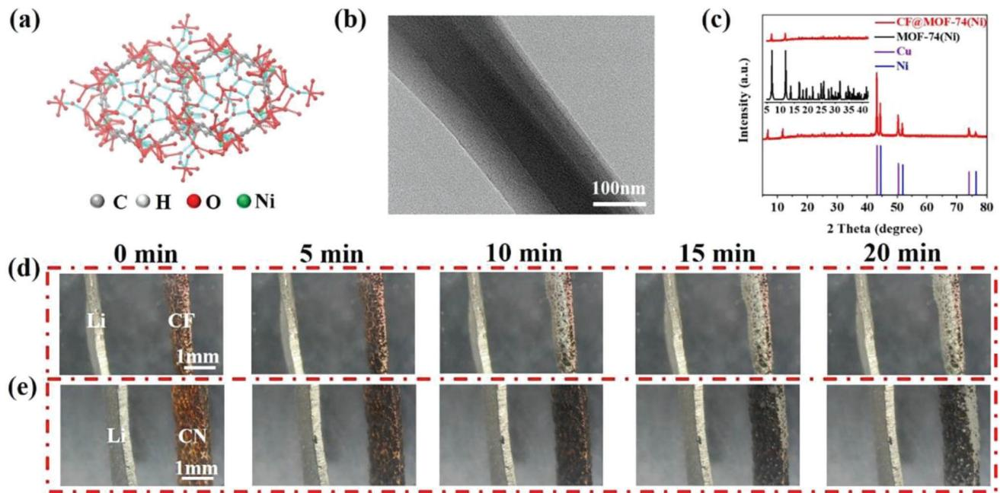
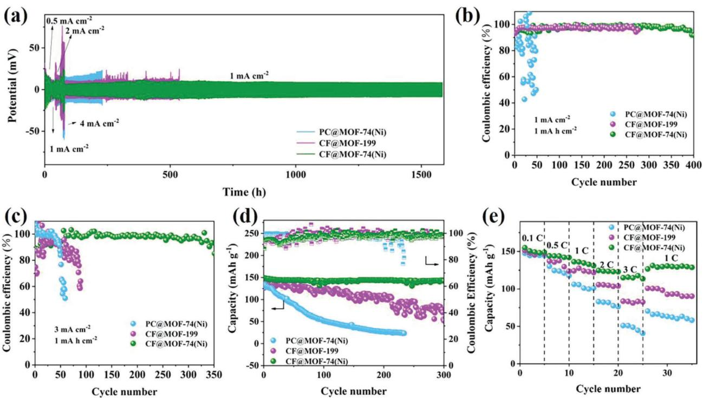
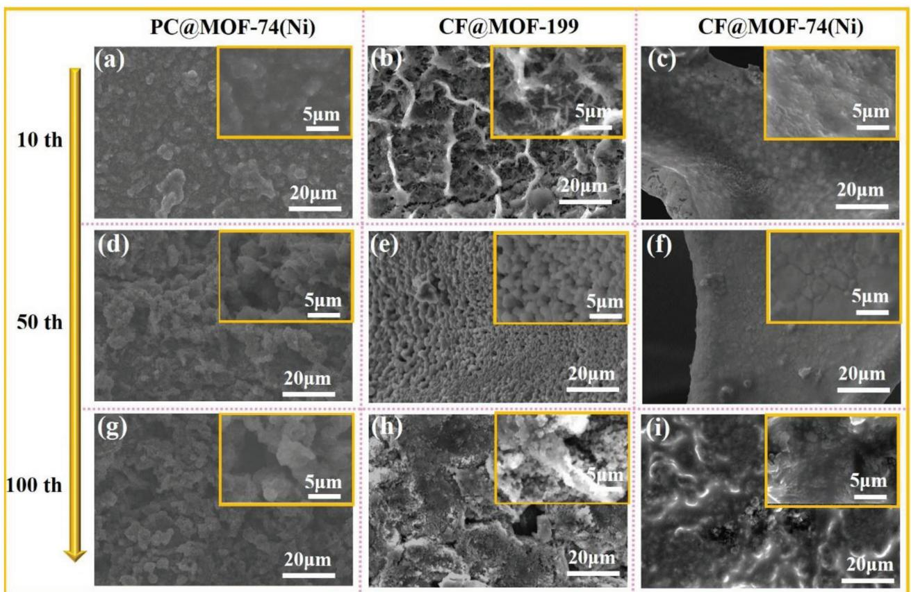
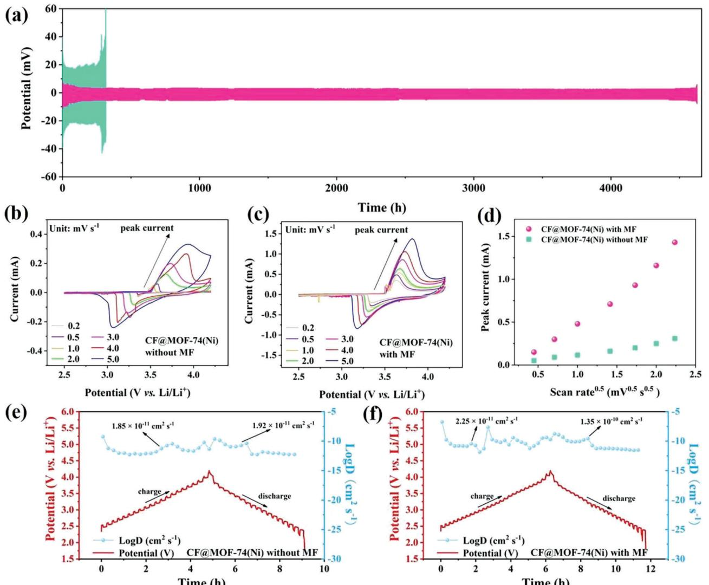
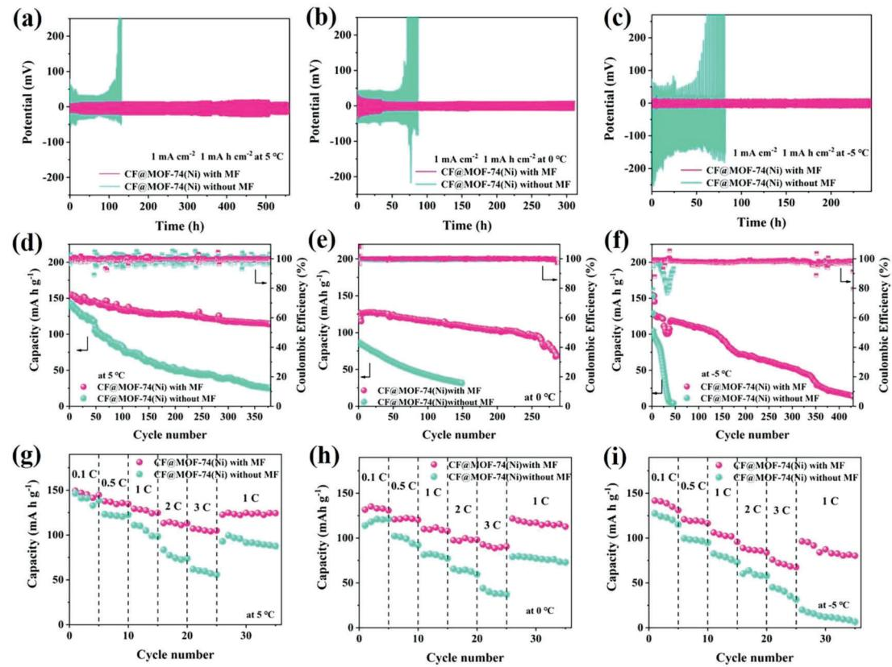

# **3D Magnetic Metal-Organic Frameworks Current Collectors Accelerate the Lithium-Ion Diffusion Rate for Superlong Cyclic Lithium Metal Anode**

*Haibo Chen, Jing Hu, Hang Li, Jianli Zhang, Qiang Chen, Guangya Hou, and Yiping Tang\**

**Lithium, is the most ideal anode material for lithium-based batteries. However, the overgrowth of lithium dendrites and the low lithium-ion diffusion rate at low temperatures limit the further application of lithium metal anodes. Here, the applied magnetic field is introduced inside the lithium metal anode by using a novel magnetic metal-organic framework as a current collector. The magnetic field can improve the conductivity of this novel current collector, thus accelerating the diffusion of lithium ions in the battery, an advantage that is particularly prominent at low temperatures. In addition, the current collector can stabilize the solid electrolyte interface and inhibit the growth of lithium dendrites, resulting in excellent electrochemical performance. The symmetrical cell at room temperature can exceed 4600 h with a hysteresis voltage of only 9 mV. After 300 cycles at room temperature, the capacity of full cell is still 142 mA h g−1, and it remains stable for 380 cycles at 5 °C (capacity above 120 mA h g−1). The strategy of constructing novel current collector with magnetic field can promote the further application of lithium batteries in extreme conditions such as low temperatures.**

#### **1. Introduction**

As lithium-based batteries continue to be used in electric vehicles, artificial intelligence and planetary/moon exploration, increasingly demanding requirements are placed on their properties, such as long cycle life (over 10 years for electric vehicles) and wide operating temperature windows (−10–70 °C or even wider).[1–3] Lithium (Li) metal, with characteristics of high theoretical capacity and low electrochemical potential, is recognized as an ideal anode material that promises to meet the above needs.[4,5] However, the low Li+ ion diffusion rate at low temperatures further blocks the application of Li metal batteries.[6,7] In addition, the growth of Li dendrites and unstable solid electrolyte interface (SEI) severely limit the capacity and cycling stability of

The ORCID identification number(s) for the author(s) of this article can be found under<https://doi.org/10.1002/smll.202307598>

**DOI: 10.1002/smll.202307598**

the batteries.[8,9] In order to suppress the growth of Li dendrites during cycling and further improve the ion migration rate of Li batteries at low temperatures, it is significative to select the suitable structures and materials for current collector.[10–12]

Metal-organic frameworks (MOF), with ultrahigh porosity, large specific surface area and easy functionalization, are considered as potential candidates that can be applied to different battery systems.[13,14] The MOF layer as a possible current collector structure can accommodate more electrolytes for fast Li+ ion diffusion, which is expected to reduce the impedance and improve the rate and cycling performance of Li batteries.[15,16] The downside is that the inherent inferior electron conductive of MOF cannot match the enrichment of Li+ ions at the reaction interface, limiting the practical application of current collectors in Li metal anodes.[17,18] Efforts such as bonding with graphene and annealing processes do

help improve the conductivity, but at the cost of a certain degree of damage to the original structure of the MOF.[17,19] Therefore, the importance of some strategies to improve the conductivity of the material without alteration of the original structure is highlighted. The introduction of magnetic field into the battery system is reported to allow flexible adjustment of the conductivity of the electrode material.[20,21] Especially for magnetic electrode materials, the carriers (charges) would move faster by the force exerted during the rotation of the magnetic domain.[22] In addition, the Lorentz force has a facilitating effect on the diffusion of Li+ ion in the electrolyte, which contributes to the depth of the electrochemical reaction.[23–25] This well illustrates the feasibility of applying an external magnetic field to modulate the degree of confinement and localization of the charge carriers at low temperatures cycling to improve the transport properties of cell.

Compared with non-magnetic MOF materials, magnetic MOF with magnetic field can introduce and promote the uniform distribution the micro-magnetic field in the battery system, which better enables the improvement of ion mobility and the reduction of interfacial transfer resistance. Meanwhile, magnetic MOF such as Ni-MOF similarly possess outstanding features of MOF materials, such as suppressing the huge volume change of Li

H. Chen, J. Hu, H. Li, J. Zhang, Q. Chen, G. Hou, Y. Tang College of Material Science and Engineering Zhejiang University of Technology Hangzhou 310014, P. R. China E-mail: [tangyiping@zjut.edu.cn](mailto:tangyiping@zjut.edu.cn)

**Figure 1.** a) Crystal structure and b) TEM image of MOF-74(Ni), and c) XRD pattern of CF@MOF-74(Ni), digital photographs of Li deposition after different deposition times for d) CF and e) CF@MOF-74(Ni) with magnetic field.

metal and showing high electronic conductivity with magnetic field.[26]

Herein, a conventional anode collector material, copper foam (CF), was chosen as the substrate to design the magnetic current collector by loading with MOF-74(Ni). The ultra-high porosity of MOF materials combined with the large specific surface area of CF effectively reduced the local current density and provided sufficient nucleation sites. In addition, the introduction of micro-magnetic field sufficiently improved the ion mobility of Li metal anode, inhibited the growth of Li dendrites and formed a stable SEI. As a result, CF@MOF-74(Ni) successfully achieved superlong cyclic performance for Li metal anode. The symmetric cells can cycle stably for more than 4600 h at 1 mA cm−2 and 1 mA h cm−2. For the battery assembled with CF@MOF-74(Ni), the Li+ ion mobility was increased ≈6 times compared to the normal mobility in the presence of a magnetic field. The high cyclic performance and rate capabilities of the cell at −5 °C compared to the cell without magnetic field was demonstrated, indicating that the strategy is effective for Li metal anode applications at low temperatures.

#### **2. Results and Discussion**

The crystal structure of MOF-74(Ni) with the characteristic of 3D skeleton is schematically shown in **Figure 1**a, and the TEM image shows a skeleton diameter of ≈120 nm (Figure 1b). Although the surface of CF is covered with MOF material after loading, the composite 3D structure ensures sufficient lithium storage space (Figure S1a, Supporting Information). As shown in Figure 1c, The XRD pattern of the synthesized material is shown in Figure 1c, where two sets of strong diffraction peaks (43.3°, 50.4°, and 73.1°) and (44.5°, 51.8°, and 76.4°) can be attributed to the CF substrate (PDF#04-0836)[31] and Ni (PDF#04-0850),[32] respectively. In addition, the diffraction peaks located at 6.5° and 11.7° in the low angle range confirm the successful loading of the MOF structure.[29,30] The XPS spectra of MOF-74(Ni) sample are shown in Figure S1b,c (Supporting Information). The peaks located at 856.5 and 875.5 eV can be attributed to the Ni 2p3/2 and 2p1/2 spin orbit, respectively.[33] More importantly, the apparent ferromagnetism of the synthesized MOF-74(Ni) is confirmed by magnet attraction, as shown in Figure S2 (Supporting Information). Meanwhile, compositional characterizations are also performed for the synthesized non-magnetic MOF material (Figure S3, Supporting Information). The XRD and XPS results indicates the successful loading of MOF-199 on CF.[34] SEM images show that CF@MOF-199 is a homogeneous spherical particle morphology, and the large specific surface area may be beneficial to inhibit the growth of lithium dendrites.

Moreover, the conductivity of the MOF material increases from 2.5 × 10−5 S cm−1 (without magnetic field) to 2 × 10−4 S cm−1 (with magnetic field) and reduces the internal resistance of the cell upon activation (from 10.78 Ω what to 5.25 Ω), shown in Figure S4 (Supporting Information). For Li deposition on CF and CF@MOF-74(Ni), we also confirmed by in situ optical observations (Figure 1d,e; Video S1 and S2, Supporting Information). Evidently, Li+ ions tend to accumulate at the top of CF and then grow as Li dendrites to form dendritic lithium metal layer, which is caused by the microscopically uneven surface of CF. For CF@MOF-74(Ni), the huge surface area of MOF-74(Ni) can provide a large number of nucleation sites, which alleviates the volume changes of Li.[28] The introduction of micro-magnetic fields of magnetic MOF can guide the deposition of mobile Li+ ions within the substrate. For the schematic diagram (Figure S5, Supporting Information), the effect of CF@MOF-74(Ni) to inhibit

**Figure 2.** a) Rate performance of different current collectors as the symmetric cells for lithium metal anode, b,c) CE of different current collectors for lithium metal anode at 1 and 3 mA cm−2 with the capacity of 1 mA h cm−2, d) discharge capacity and CE of different current collectors as the full cells at a current density of 1 C, e) rate capability of the full cells at various rates ranging from 0.1 to 3 C.

the growth of Li dendrite can be preferably comprehended. All the above results indicate that magnetic field can indeed improve the conductivity of MOF and inhibit the growth of Li dendrites.

To evaluate the performance of MOF-74(Ni) with a large specific surface area under the action of an external magnetic field in terms of cyclic stability, electrochemical performance tests were carried out with CF@MOF-74(Ni), CF@MOF-199, and MOF-74(Ni) loaded on planar copper (PC@MOF-74(Ni)) as current collectors (**Figure 2**). The symmetrical cells were cycled at different current densities as shown in Figure 2a. Li with a capacity of 2 mA h cm−2 was first deposited on the current collectors. During the test, the first decreases and then increases in overpotential that occurs at 0.5 mA cm−2 is consistent with the growth process of Li dendrites.[35] For the symmetric cell with CF@MOF-74(Ni), it exhibits the best rate performance with the lowest overpotential and can cycle stably for more than 1600 h. However, the voltage of symmetric cell with PC@MOF-74(Ni) increases rapidly with increasing current density, representing the growth of Li dendrites, which may be due to material stripping failure caused poor interfacial contact between MOF and copper foil.[36] The CF@MOF-199 symmetric cell can cycle for 550 h with voltage fluctuations after ≈300 h, laterally indicating that the non-magnetic MOF with magnetic field equally contributes to the plating/stripping of Li on the current collector. In contrast, without magnetic field, the symmetric cells with three current collectors show a low level of performance (Figure S6, Supporting Information). The Coulombic efficiency (CE) for different current collectors is shown in Figure 2b. At a current density of 1 mA cm−2 and a capacity of 1 mA h cm−2, the CE of CF@MOF-74(Ni) remained above 95% after 400 cycles, while CF@MOF-199 is the second highest (260 cycles). Unfortunately, PC@MOF-74(Ni) has difficulty in achieving high Li plating/stripping efficiency. When the current density was increased to 3 mA cm−2 (Figure 2c), CF@MOF-74(Ni) still exhibited the great cyclic performance (350 cycles for CE of 95%). Moreover, typical first cycle voltage profiles are shown in Figure S7 (Supporting Information). Obviously, there is a voltage difference between the Li plating/stripping voltage plateaus, called voltage hysteresis, which is mainly controlled by the current density, charge transfer resistance, and interfacial properties.[37] The results show that CF@MOF-74(Ni) possesses the lowest hysteresis voltage at current densities of 1 and 3 mA cm−2, which are 49 and 130 mV, respectively. This suggests that the larger surface area of the CF@MOF-74(Ni) current collector can reduce the actual current density and provide a larger space between the current collector and electrolyte, and also confirms that the micro-magnetic field can effectively stabilize the cyclic performance of cell.

To further explore potential practical applications, three full cells were assembled with current collectors loaded with excess Li as the anode and LiFePO4 as the cathode. As shown in Figure 2d, the initial capacity of CF@MOF-74(Ni) full cell is 149 mA h g−1 and remains at 142 mA h g−1 after 300 cycles (a single-cycle decay rate of only 0.016%). On the contrary, the capacity of CF@MOF-199 full cell fluctuates violently during cycling, with a capacity of only 52 mA h g−1 after 300 cycles (a single-cycle decay rate of only 0.214%). Even worse, the capacity of PC@MOF-74(Ni)

**Figure 3.** SEM images of a,d,g) PC@MOF-74(Ni), b,e,h) CF@MOF-199 and c,f,i) CF@MOF-74(Ni) as current collectors for lithium metal anode after 10, 50, and 100 cycles at 1 mA cm−2, 1 mA h cm−2, respectively.

continues to go low since the beginning of the cycle (a singlecycle decay rate of only 0.351%), exhibiting the worst cycling stability. In addition, the capacity of CF@MOF-74(Ni) can be maintained at a high level at different current densities, showing a good rate capability (Figure 2e). The results indicate that with magnetic field, the current collector with a large specific surface area loaded with magnetic MOF material can indeed play a role in stabilizing the internal structural stability in the long-term galvanostatic charging-discharging test of full cell, so that the capacity can be maintained at a high level (above 140 mA h g−1).[38]

To further visualize the deposition phenomenon of Li and the growth of Li dendrites on the current collector, SEM images for the samples after cycling with magnetic field are shown in **Figure 3**. Compared with the cases of the current collector surfaces after only 10 cycles without magnetic field (Figure S8– S10, Supporting Information), the Li growth on the three current collector surfaces is significantly more uniform and denser under the magnetic field. In particular, CF@MOF-74(Ni) shows the flattest surface, confirming the remarkable effect of using it as a current collector to inhibit the growth of Li dendrites (Figure 3c). Moreover, the Li deposition on the surface of CF@MOF-74(Ni) remains very smooth and dense when the cycle number increases to 50 (Figure 3f). Even after 100 cycles, the growth of Li dendrites on CF@MOF-74(Ni) is still effectively suppressed with magnetic field (Figure 3i). However, the Li dendrites on the top of CF@MOF-199 gradually increases as the cycle proceeds (Figure 3b,e,h), while PC@MOF-74(Ni) performance worse (Figure 3a,d,g), which exactly explains the above comparative results of electrochemical properties.

In this work, as shown in **Figure 4**a, we were surprised to find that the symmetric cell with magnetized CF@MOF-74(Ni) current collector can cycle stably for more than 4600 h with extremely low overpotential (≈9 mV), which is much higher than the cell without magnetic field under the same conditions (320 h). Moreover, the result is also much higher than that of symmetric cells assembled with CF@MOF-199 (1740 h) and PC@MOF-74(Ni) (450 h) (Figure S11, Supporting Information). Compared to the recently reported cell data with several strategies for current collectors (see **Table 1**), we note that CF@MOF-74(Ni) excels in both cyclic stability and voltage hysteresis.

At the root, the magnetic field can help to improve the ion diffusion rate. To specifically characterize the effect of magnetic field on Li+ ion diffusion process within the cell, the Cyclic voltammetry (CV) curves at different scan rates were tested, as shown in Figure 4b,c. As the scan rate increases, the oxidation peak moves toward the high voltage and the reduction peak moves to the low voltage in response to the magnetic field, which should be caused by an increase in the polarization effect.[39] Clearly, the shape of the CV curve with magnetic field is well maintained when the scan rate is increased from 0.2 to 5 mV, except that the

**Figure 4.** a) The cyclic performance of CF@MOF-74(Ni) for lithium metal anodes with (without) magnetic field with a fixed capacity of 1 mA h cm−2 at 1 mA cm−2. The CV curves of CF@MOF-74(Ni) for LIBs at different scan rates b) without magnetic field and c) with magnetic field. d) Corresponding relationship between CV peak current of cell and scan rate0.5. The GITT results of CF@MOF-74(Ni) e) without magnetic field and f) with magnetic field. MF in the figure represents "magnetic field".

|  |  |  | Table 1. Comparison of the cyclic performance of several strategies for lithium metal anode. |  |
|--|--|--|----------------------------------------------------------------------------------------------|--|
|--|--|--|----------------------------------------------------------------------------------------------|--|

| Strategies                                                            | Current density and capacity | Cyclic performance | Voltage hysteresis | Ref.    |
|-----------------------------------------------------------------------|---------------------------------|-----------------------|-----------------------|---------|
| Lithiophilic magnetic current collector                               | 2 mA cm−2 and 1 mA h cm−2       | 560 hours             | 24 mV                 | [24]    |
| Graphene network nested Cu foam                                       | 1 mA cm−2 and 1 mA h cm−2       | 1300 hours            | 30 mV                 | [27]    |
| strained copper current collectors                                    | 2 mA cm−2 and 1 mA h cm−2       | 200 hours             | 36 mV                 | [31]    |
| ion/electron-conductive N-doped 3D carbon fiber                       | 1 mA cm−2 and 1 mA h cm−2       | 1200 hours            | 34 mV                 | [37]    |
| oriented graphene foam current collector                              | 1 mA cm−2 and 1 mA h cm−2       | 120 hours             | 40 mV                 | [47]    |
| tris(pyrrolidinophosphine) oxide (TPPO) electrolyte additive agent | 3 mA cm−2 and 3 mA h cm−2       | 1000 hours            | 50 mV                 | [48]    |
| This work                                                             | 1 mA cm−2 and 1 mA h cm−2       | 4600 hours            | 9 mV                  | Present |

oxidation peak increases smoothly from 3.64 to 3.82 V. However, the CV curve without magnetic field fluctuates continuously, implying the unstable cycling of the cell.[40] In addition, with magnetic field, the peak current is 1.31 mA at 5 mV s−1, while it is only 0.26 mA without magnetic field, which proves that magnetic field contributes to the depth of electrochemical reaction. Figure 4d shows that the peak current is linearly related to the square root of scan rate.[41–43] The Randles-Sevcik equation is as follows for (1):

$$
I_p = (2.686 \times 10^5) \, n^{1.5} S \, D^{0.5} C \, V^{0.5} \tag{1}
$$

In the equation, Ip, D, and V represent peak current, Li+ ion diffusion coefficient, and scanning rate, respectively. For n, S, and C, they are generally considered constants, representing the number of electrons participating in the electrochemical reaction, effective electrode area, and lithium concentration in the electrolyte, respectively. Therefore, the slope of Ip/v0.5 is positively correlated with D. The slope of the above straight line should be positively correlated with the Li+ ion diffusion coefficient.[44] Apparently, the Li+ ion diffusion coefficient within the cell is significantly increased with the introduction of the magnetic field, which is certainly beneficial to inhibit the growth of Li dendrites and promote the cycling stability of cell.

In addition, galvanostatic intermittent titration techniques (GITT) test was performed on the cell to visualize the changes of Li+ ion diffusion rate during charging and discharging, as shown in Figure 4e,f.[45] It can be seen that with magnetic field, the test period of cell is significantly longer, which corresponds to a relatively larger cell capacity.[46] The charging process of the cell corresponds to the movement of Li+ ions toward the anode, and we find that the diffusion coefficients are essentially similar with/without magnetic field (≈2.25 × 10−11/1.85 × 10−11 cm2 s−1). However, during subsequent discharge, the mobility of Li ions with magnetic field (1.35 × 10−10 cm2 s−1) is much higher than that of the cell without magnetic field (1.92 × 10−11 cm2 s−1), ≈7 times. The ions are more susceptible to the Lorentz force generated by magnetic and electric field as well as to the multiple magnetohydrodynamic (MHD) effect. This strongly suggests that magnetic field and magnetic MOF materials can effectively improve the ion diffusion coefficient in the cell and also the electrochemical performance of cell.

To further reveal the enhancement effect of CF@MOF-74(Ni) as a current collector on the performance of the half-cell, EIS test was performed on the half-cell to investigate the charge transfer resistance. After 10 cycles, the charge transfers internal resistance of CF@MOF-74(Ni) half-cell decreases significantly compared to that before the cycle, especially the decrease is more pronounced with the magnetic field, indicating a more stable internal structure of cell (Figure S12a, Supporting Information).[35] Figure S12b,c (Supporting Information) show that both CF@MOF-199 and PC@MOF-74(Ni) current collectors exhibit similar results. Further, the charge transfer internal resistance shows a continuous downward trend with cycling (Figure S13, Supporting Information), which may be related to the formation of a stable SEI film within the cell.[36] This suggests that the magnetic MOF material and the introduction of the external magnetic field may be a proven method to form a high level of stable SEI film and reduce the internal resistance of cell.

The low temperature environment has plagued the practical application of Li-ion batteries. In fact, ion diffusion within the cell and charge-transfer across the electrode-electrolyte interfaces are significantly impeded at low temperatures.[49] For the application of CF@MOF-74(Ni) current collectors, measuring the electrochemical performances in low temperature environments possesses the great significance. We assembled the symmetric cell with this current collector and evaluated its low temperature (5, 0, −5 °C) galvanostatic cycling performance with/without magnetic field, respectively. In the absence of a magnetic field, the symmetric cell could not maintain a stable long cycle at 5 °C (**Figure 5**a). However, in the presence of a magnetic field, the cell can stably cycle for more than 560 h with a very low overpotential, and when the temperature is lowered to 0 and −5 °C, the cell can stably cycle for more than 320 and 280 h, respectively (Figure 5b,c). This means that even in the face of low temperature environments, magnetic field still provides an improvement in the mobility of Li+ ion within the cell, ensuring the stable cycling.

The cycling and rate performance of full cells at low temperatures were also tested, as shown in Figure 5d–i. At 5 °C, the full cell can be cycled stably for ≈380 cycles and its capacity can be maintained above 120 mA h g−1 with magnetic field (a singlecycle decay rate of only 0.055%). In contrast, the capacity of the full cell without magnetic field drops to 25 mA h g−1 after 350 cycles (a single-cycle decay rate of only 0.219%). At 0 °C, the full cell with magnetic field do not start to fluctuate drastically until after 250 cycles and its capacity remains ≈70 mA h g−1 (a single-cycle decay rate of only 0.157%), but in the absence of magnetic field, the capacity drops to 30 mA h g−1 after 180 cycles (a single-cycle decay rate of only 0.4%). Even when the temperature comes to −5 °C, the magnetic field still has a boosting effect on the electrochemical performance of the full battery. The capacity slowly decreases as the cycle proceeds under the effect of the magnetic field, but still operates for up to 450 cycles (a single-cycle decay rate of only 0.185%), while under the no-field condition, the battery capacity decays rapidly within 50 cycles (a single-cycle decay rate of only 1.96%). Similarly, the rate performance of cell with magnetic field all surpass the cell without magnetic field when the temperature drops from 5 °C to −5 °C (Figure 5g–i). The results indicate that an external magnetic source can effectively improve the cyclic stability of both symmetric and full cell in the low temperature range. However, the effectiveness of the novel strategy at lower temperatures is limited by ion diffusion and charge-transfer, which at least provides a possible avenue to address practical applications at low temperatures.

Nevertheless, the effect of CF@MOF-74(Ni) in low temperature range on improving the battery performance deserves further in-depth study. First, for ion diffusion, it can be found that the diffusion coefficient of the cell with magnetic field (6.22 × 10−12 cm2 s−1) is much higher than that of the cell without magnetic field (3.39 × 10−13 cm2 s−1) at 0 °C, as shown in Figure S14 (Supporting Information), which explains the low overpotential of the symmetric cell with magnetic field. Furthermore, the study of interface charge transfer and SEI with (without) magnetic field can be explored to improve the electrochemical performance at low temperatures. In particular, the stability of SEI can be demonstrated through interface charge

**Figure 5.** The cyclic performance of CF@MOF-74(Ni) for lithium metal anodes with a fixed capacity of 1 mA h cm−2 at 1 mA cm−2 with (without) magnetic field at a) 5, b) 0, c) −5 °C. e) Discharge capacity and CE of CF@MOF-74(Ni) as the full cells at a current density of 1C with (without) magnetic field at d) 5, e) 0, f) −5 °C. Rate capability of CF@MOF-74(Ni) as the full cells with (without) magnetic field at g) 5, h) 0, i) −5 °C at various rates ranging from 0.1 to 3 C.

transfer, morphology and composition analysis.[50] The EIS curves of CF@MOF-74(Ni) at 0 °C are shown in Figure S15 (Supporting Information). The overlapping semicircles in the highand middle-frequency ranges in the Nyquist plots are attributed to the SEI layer resistance (*R*sei) and charge transfer resistance (*R*ct).[51] Obviously, at 0 °C, the *R*ct of cell decreases from ≈70 Ω to 10 Ω when the cycle number increases, which proves that a dense SEI is formed inside the cell with magnetic field (Figure S15a, Supporting Information). However, without magnetic field, the *R*sei of the cell first decreases and then increases, implying that the formation and destruction of SEI is repeated (Figure S15b, Supporting Information). At 0 °C, the SEM images of the current collector after cycling can also clearly show that the deposition of Li with magnetic field is denser than without magnetic field, which promotes the superlong cyclic performance of cell (Figure S16, Supporting Information). Subsequently, XPS results of CF@MOF-74(Ni) after 100 cycles with magnetic field show that the SEI contains LiF, which may also be responsible for the stability of the SEI inside the cell (Figure S17 and S18, Supporting Information).[52] However, the results for CF@MOF-74(Ni) without magnetic field show that SEI is unstable, resulting in poor electrochemical performance.

In addition, to further investigate the application of magnetic field and MOF materials on different substrates, electrochemical performance tests were carried out using MOF-74(Ni) loaded on nickel foam (NF) as the current collector (Figure S19, Supporting Information). The results show that NF@MOF-74(Ni) current collector with magnetic field significantly improves CE, cyclic and rate performance, and it forms the stable SEI film and internal cell structure, which effectively inhibits the growth of lithium dendrites (Figure S20–S24, Supporting Information). The magnetic field is obviously of general significance for the improvement of cell performance.

#### **3. Conclusion**

In conclusion, with magnetic field, CF@MOF-74(Ni) with the large specific surface area can introduce micro-magnetic field and provide sufficient nucleation sites, which can effectively improve the ion mobility of Li metal anode and form a dense SEI layer within the cell. As a result, CF@MOF-74(Ni) successfully achieves the superlong cyclic performance for lithium metal anode as the current collector. At 1 mA h cm−2 and 1 mA cm−2, the half-cell can cycle more than 390 cycles with a CE above 95%. The symmetric cells can stably cycle for more than 4600 h, where the overpotential throughout keeps below 9 mV. Remarkably, the high cyclic performance of cell is confirmed even over the low temperatures range with magnetic field, and the full cells exhibit excellent cyclic performance and rate capabilities. This novel strategy for constructing magnetic MOF current collectors

demonstrates the practical application of high energy batteries at room and low temperatures.

#### **4. Experimental Section**

*Materials Preparation–Preparation of CF@MOF-74(Ni) or PC@MOF-74(Ni)*: CF or planar copper with a diameter of 15 mm was washed with 0.1 mol L−1 dilute hydrochloric acid, ethanol and deionized water, dried and set aside. Subsequently, three pieces of CF or planar copper were immersed in a solution containing 2,5-dihydroxyterephthalic acid (0.48 g), electrolytic nickel powder (1.44 g), deionized water (20 mL) and tetrahydrofuran (20 mL), then hydrothermally heated in an oven at 180 °C for 24 h. CF@MOF-74(Ni) or PC@MOF-74(Ni) current collector was finally obtained by washing with ethanol and deionized water and drying in an oven at 60 °C for 12 h.

*Materials Preparation–Preparation of CF@MOF-199*: CF with a size of 20 mm × 50 mm was prepared and cleaned. Subsequently, it was immersed in a 100 mL solution containing sodium hydroxide (2.8 g) and sodium persulfate (2.28 g) and kept for 20 min. The obtained sample was then rinsed with deionized water and transferred to a solution containing 1,3,5-benzenetricarboxylic acid (10 mg), polyvinylpyrrolidone (100 mg), deionized water (2.5 mL) and N, N-dimethylformamide (2.5 mL), then reacted for 10 min. Finally, the sample was removed and washed several times with ethanol and deionized water and dried overnight to obtain CF@MOF-199.

*Material Characterization*: X-ray diffraction (XRD) was employed to characterize the phase structures by RIGAKU D/Max 2550 PC. Field emission electron microscopy (FESEM) was performed at 10 kV for micromorphology analysis by Hitachi S-4700, Hitachi, Japan. The surface chemical state and composition were characterized by X-ray photoelectron spectroscopy (XPS) analysis by Kratos AXIS Ultra DLD. The high-resolution transmission electron microscope (HRTEM) micrographs were acquired on a Tecnai G2 F30 (Philips-FEI, Co. Ltd) instrument. In addition, the cells were disassembled in an argon-filled glove box after a specified cycle number. The current collectors were washed gently with diethyl carbonate (DEC) to remove residual electrolyte and lithium salts for SEM and XPS tests.

*Electrochemical Characterizations*: The CR2032 coin cell was assembled in the argon-filled glove box. Current collectors were used as the working electrodes, and Li foil was used as the counter electrode. A solution of 1,3-dioxolane/1,2-dimethoxyethane (v: v = 1:1) containing 1 mol L−1 LiTFSI with 1% of LiNO3 was used as an electrolyte (≈80 μL). For the full cell tests, current collectors deposited with limited Li-metal was used as the anode and LiFePO4 as the cathode. A total of 80 wt.% LiFePO4, 10 wt.% super P carbon black, and 10 wt.% polyvinylidene difluoride was sufficiently dried and mixed in 1-methyl-2-pyrrolidinone (NMP) solvent. The slurry was then coated onto Al foil and dried in a vacuum oven at 80 °C for 12 h. A 1 mol L−1 LiPF6 (EC/DEC/EMC, v: v: v = 1:1:1, 60 μL) was used as electrolyte. The diameter of current collector and Li foil was 15 mm. Cyclic performance and rate capabilities were tested by NEWARE battery test system. The magnetic flux density of external magnetic field for the cell tests was 50 mT. When the test temperature was not mentioned, it defaults to 25 °C. Electrochemical impedance spectra (EIS) were obtained with electrochemical workstation by CHI760D, which the frequency was from 0.01 to 105 Hz with the 10 mV of AC voltage amplitude. For GITT experiments, a short current pulse of current density 1 C was applied for a transient time in a voltage range of 2.5 to 4.2 V, followed by a relaxation time of 30 mins by CHI760D. CV was performed using a CHI760D instrument under various scan rates (0.2, 0.5, 1, 2, 3, 4, 5 mV s−1 for LIBs, respectively) in a voltage window of 2.5 to 4.2 V as the discharge-charge tests.

### **Supporting Information**

Supporting Information is available from the Wiley Online Library or from the author.

# **Acknowledgements**

This study was financially supported by National Natural Science Foundation of China (U1802254, 52271039, 51871201), Zhejiang Provincial Natural Science Foundation of China (LZ22E010002).

# **Conflict of Interest**

The authors declare no conflict of interest.

# **Data Availability Statement**

The data that support the findings of this study are available from the corresponding author upon reasonable request.

# **Keywords**

lithium metal anodes, lithium-ion diffusion rate, metal-organic frameworks, micro-magnetic field, superlong cyclic performance

> Received: August 31, 2023 Revised: October 10, 2023 Published online: October 18, 2023

- [1] J. Xiang, Y. Zhang, B. Zhang, L. Yuan, X. Liu, Z. Cheng, Y. Yang, X. Zhang, Z. Li, Y. Shen, J. Jiang, Y. Huang, *Energy Environ. Sci.* **2021**, *14*, 3510.
- [2] T. Waldmann, B-I. Hogg, M. Wohlfahrt-Mehrens, *J. Power Sources* **2018**, *384*, 107.
- [3] T. Waldmann, M. Kasper, M. Wohlfahrt-Mehrens, *Electrochim. Acta* **2015**, *178*, 525.
- [4] Y. Liu, Y. Cui, *Joule* **2017**, *1*, 649.
- [5] C. Jin, T. Liu, O. Sheng, M. Li, T. Liu, Y. Yuan, J. Nai, Z. Ju, W. Zhang, Y. Liu, Y. Wang, Z. Lin, J. Lu, X. Tao, *Nat. Energy* **2021**, *6*, 378.
- [6] X. Zhang, L. Zou, Y. Xu, X. Cao, M. H. Engelhard, B. E. Matthews, L. Zhong, H. Wu, H. Jia, X. Ren, P. Gao, Z. Chen, Y. Qin, C. Kompella, B. W. Arey, J. Li, D. Wang, C. Wang, J.-G. Zhang, W. Xu, *Adv. Energy Mater.* **2020**, *10*, 2000368.
- [7] R. Chen, W. Qu, J. Qian, N. Chen, Y. Dai, C. Guo, Y. Huang, L. Li, F. Wu, *J. Mater. Chem. A* **2017**, *5*, 24677.
- [8] L. Li, S. Basu, Y. Wang, Z. Chen, P. Hundekar, B. Wang, J. Shi, Y. Shi, S. Narayanan, N. Koratkar, *Science* **2018**, *359*, 1513.
- [9] A. Jana, S. I. Woo, K. S. N. Vikrant, R. E. García, *Energ. Environ. Sci.* **2019**, *12*, 3595.
- [10] D. Li, H. Hu, B. Chen, W.-Y. Lai, *Small* **2022**, *18*, 2200010.
- [11] S. Jin, Y. Jiang, H. Ji, Y. Yu, *Adv. Mater.* **2018**, *30*, 1802014.
- [12] B. Sun, Q. Zhang, W. Xu, R. Zhao, H. Zhu, W. Lv, X. Li, N. Yang, **2022**, *94*, 106937.
- [13] H. Zhao, L. Sheng, L. Wang, H. Xu, X. He, *Energy Storage Mater.* **2020**, *33*, 360.
- [14] J. Qian, Y. Li, M. Zhang, R. Luo, F. Wang, Y. Ye, Y. Xing, W. Li, W. Qu, L. Wang, L. Li, Y. Li, F. Wu, R. Chen, *Nano Energy* **2019**, *60*, 866.
- [15] Y. Jiang, H. Zhao, L. Yue, J. Liang, T. Li, Q. Liu, Y. Luo, X. Kong, S. Lu, X. Shi, K. Zhou, X. Sun, *Electrochem. Commun.* **2021**, *122*, 106881.
- [16] Z.-J. Zheng, Q. Su, Q. Zhang, X.-C. Hu, Y.-X. Yin, R. Wen, H. Ye, Z.-B. Wang, Y.-G. Guo, *Nano Energy* **2019**, *64*, 103910.
- [17] X. Li, S. Zheng, L. Jin, Y. Li, P. Geng, H. Xue, H. Pang, Q. Xu, *Adv. Energy Mater.* **2018**, *8*, 1800716.
- [18] G. Cui, G. Li, D. Luo, Y. Zhang, Y. Zhao, D. Wang, J. Wang, Z. Zhang, X. Wang, Z. Chen, *Nano Energy* **2020**, *72*, 104685.

- [19] Y.-J. Tang, H. Zheng, Y. Wang, W. Zhang, K. Zhou, *Adv. Funct. Mater.* **2021**, *31*, 2102648.
- [20] C.-H. Wu, *The European Physical Journal B* **2019**, *92*, 25.
- [21] P. Zare, H. Rezania, *J. Magn. Magn. Mater.* **2019**, *481*, 183.
- [22] J.-Q. Wang, G. Xiao, *J. Appl. Phys.* **1996**, *79*, 5587.
- [23] K. Shen, X. Xu, Y. Tang, *Nano Energy* **2022**, *92*, 106703.
- [24] J. Zhang, H. Chen, M. Wen, K. Shen, Q. Chen, G. Hou, Y. Tang, *Adv. Funct. Mater.* **2022**, *32*, 2110110.
- [25] K. Shen, Z. Wang, X. Bi, Y. Ying, D. Zhang, C. Jin, G. Hou, H. Cao, L. Wu, G. Zheng, Y. Tang, X. Tao, J. Lu, *Adv. Energy Mater.* **2019**, *9*, 1900260.
- [26] X. Hou, D. Mao, H. Ma, Y. Ai, X. Zhao, J. Deng, D. Li, B. Liao, *Mater. Lett.* **2015**, *161*, 309.
- [27] W. Zhu, W. Deng, F. Zhao, S. Liang, X. Zhou, Z. Liu, *Z. Liu, Energy Storage Mater.* **2019**, *21*, 107.
- [28] Y. Fan, J. Liao, D. Luo, Y. Huang, F. Sun, J. Nan, *Chem. Eng. J.* **2023**, *453*, 139903.
- [29] W. Zhou, Z. Xue, Q. Liu, Y. Li, J. Hu, G. Li, *Chem. Sus. Chem.* **2020**, *13*, 5647.
- [30] C. Chen, X. Feng, Q. Zhu, R. Dong, R. Yang, Y. Cheng, C. He, *Inorg. Chem.* **2019**, *58*, 2717.
- [31] L. Qin, Y. Wu, M. Shen, B. Song, Y. Li, S. Sun, H. Zhang, C. Liu, J. Chen, *Energy Storage Mater.* **2022**, *44*, 278.
- [32] T. Xu, X. Hou, S. Liu, B. Liu, *Micropor. Mesopor. Mat.* **2018**, *259*, 178.
- [33] W.-Q. Zhou, B.-J. Xi, X.-W. Chang, B. Wang, X.-Q. Wu, S. Li, Y.-P. Wu, D.-S. Li, *Molecules* **2022**, *27*, 2113.
- [34] Y. Wang, C. Yang, C. Zhang, M. Duan, H. Wang, H. Fan, Y. Li, J. Shangguan, J. Lin, *Fuel* **2022**, *319*, 123845.
- [35] W. Zhang, Q. Fan, D. Zhang, L. Liu, S. Liu, Z. Fang, W. Li, X. Li, M. Li, *Nano Energy* **2022**, *102*, 107677.
- [36] G. Zhang, X. Deng, J. Li, J. Wang, G. Shi, Y. Yang, J. Chang, K. Yu, S.-S. Chi, H. Wang, P. Wang, Z. Liu, Y. Gao, Z. Zheng, Y. Deng, C. Wang, *Nano Energy* **2022**, *95*, 107014.
- [37] J. Man, K. Liu, H. Zhang, Y. Du, J. Yin, X. Wang, J. Sun, *J. Power Sources* **2021**, *489*, 229524.
- [38] J. Gracia, R. Sharpe, J. Munarriz, *J. Catal.* **2018**, *361*, 331.
- [39] J. Zhang, C. Du, Z. Dai, W. Chen, Y. Zheng, B. Li, Y. Zong, X. Wang, J. Zhu, Q. Yan, *ACS Nano* **2017**, *11*, 10599.
- [40] C. Day, K. Greig, A. Massey, J. Peake, D. Crossley, R. A. W. Dryfe, *ChemSusChem* **2020**, *13*, 1046.
- [41] J. Waelder, R. Vasquez, Y. Liu, S. Maldonado, *J. Am. Chem. Soc.* **2022**, *144*, 6410.
- [42] N. Qin, L. Jin, G. Xing, Q. Wu, J. Zheng, C. Zhang, Z. Chen, J. P. Zheng, *Adv. Energy Mater.* **2023**, *13*, 2204077.
- [43] Z. Tie, Y. Zhang, J. Zhu, S. Bi, Z. Niu, *J. Am. Chem. Soc.* **2022**, *144*, 10301.
- [44] T. R. L. C. Paixão, *ChemElectroChem* **2020**, *7*, 3414.
- [45] Z. H. Cui, X. X. Guo, H. Li, *Energ. Environ. Sci.* **2014**, *8*, 182.
- [46] A. Nickol, T. Schied, C. Heubner, M. Schneider, A. Michaelis, M. Bobeth, G. Cuniberti, *J. Electrochem. Soc.* **2020**, *167*, 090546.
- [47] Y. Ma, B. Yao, M. Zhang, H. Bai, G. Shi, *J. Mater. Chem. A* **2018**, *6*, 15603.
- [48] P. Xiao, R. Luo, Z. Piao, C. Li, J. Wang, K. Yu, G. Zhou, H.-M. Cheng, *ACS Energy Lett.* **2021**, *6*, 3170.
- [49] A. Gupta, A. Manthiram, *Adv. Energy Mater.* **2020**, *10*, 2001972.
- [50] Y. Li, Y. Qi, *Energ. Environ. Sci.* **2019**, *12*, 1286.
- [51] D.-S. Lee, D.-M. Lee, S.-W. Yoo, J.-H. Kim, H.-D. Jeong, *J. Ind. Eng. Chem.* **2019**, *80*, 479.
- [52] O. B. Chae, L. Rynearson, B. L. Lucht, *ACS Energy Lett.* **2022**, *7*, 3087.