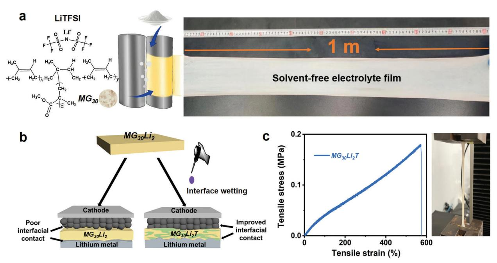
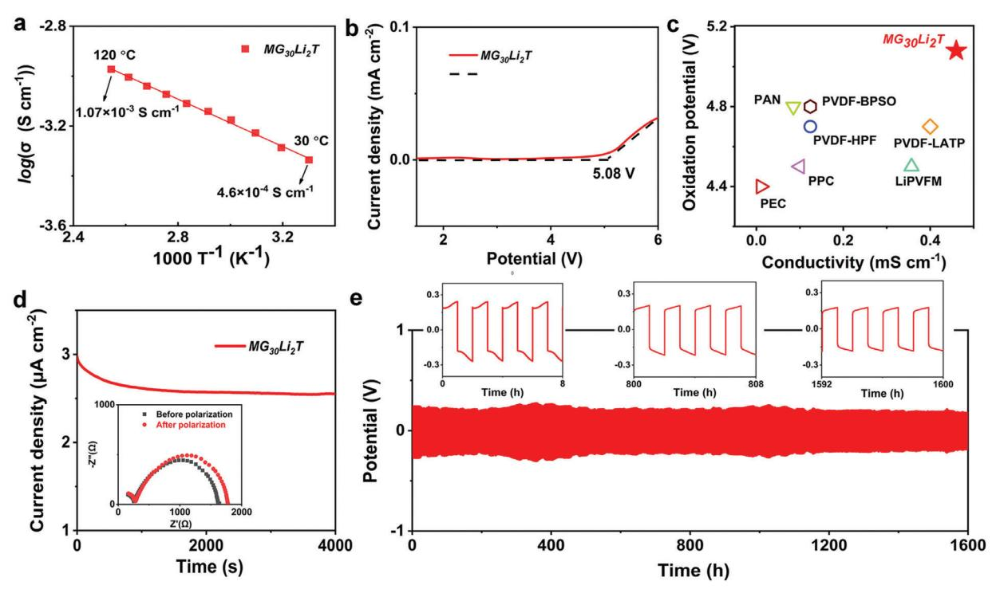
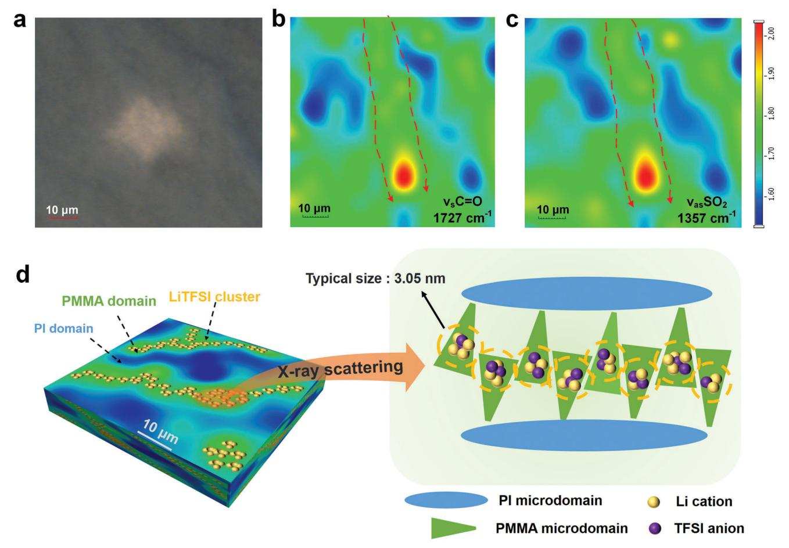
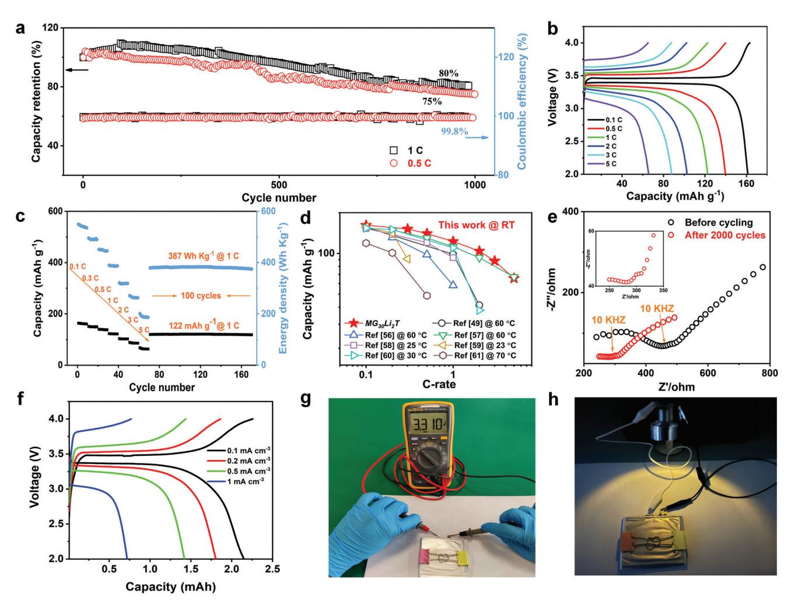

# **Elastomeric Electrolyte for High Capacity and Long-Cycle-Life Solid-State Lithium Metal Battery**

*Zekun Zhou, Zengren Tao, Ruiyong Chen, Zhen Liu,\* Zhenhang He, Lei Zhong, Xin Li, Guixiang Chen, and Peng Zhang\**

**High room-temperature ionic conductivity and good compatibility with lithium metal and cathode materials are prerequisites for solid-state electrolytes used in lithium metal batteries. Here, the solid-state polymer electrolytes (SSPE) are prepared by combining the traditional two-roll milling technology with interface wetting. The as-prepared electrolytes consisting of elastomer matrix and high-mole-loading of LiTFSI salt show a high room temperature ionic conductivity of 4.6×10−4 S cm−1, a good electrochemical oxidation stability up to 5.08 V, and improved interface stability. These phenomena are rationalized with the formation of continuous ion conductive paths based on sophisticated structure characterization including synchrotron radiation Fourier-transform infrared microscopy, wide- and small-angle X-ray scattering. Moreover, at room temperature, the Li||SSPE||LFP coin cell shows a high capacity (161.5 mAh g−1 at 0.1 C), long-cycle-life (retaining 50% capacity and 99.8% Coulombic efficiency after 2000 cycles), and good C-rate compatibility up to 5 C. This study, therefore, provides a promising solid-state electrolyte that meets both the electrochemical and mechanical requirements of practical lithium metal batteries.**

#### **1. Introduction**

Nowadays our daily lives have been greatly changed by the popular application of portable electronic devices and electric vehicles, the success of which is highly relying on the invention and large-scale commercialization of lithium (Li) batteries, especially the Li-ion batteries,[1,2] In the past decades, the performances (such as energy density, power density, and safety) of the Li-ion batteries have been improved significantly to approach the theoretical limits. To meet the keep on the growing

**DOI: 10.1002/smtd.202201328**

demand for sa, high-performance, and cost-effective battery materials and devices,[3,4] polymer-based solid-state lithium metal battery (LMB) emerges as one of the most practical and reliable options.[5–8] Solid-state polymer electrolytes hold the promise to mitigate the safety issue by the effective suppression of the Li dendrite growth.[9,10] Despite the numerous solid-state polymer materials (such as polyethylene oxide (PEO), polypropylene oxide , polymethyl methacrylate (PMMA), polyacrylonitrile (PAN), polyurethane , polyvinylidene fluoride (PVDF) and so on[5,11,12]) used for the battery electrolyte, few of them can fulfill the requirements of solid-state LMB, that is, achieving acceptable ionic conductivity (Li *>* 10−4 S cm−1[13]), electrochemical stability and mechanical properties of the solid electrolytes, as well as good compatibility with Li metal and cathode materials.[14] Developing

new and high-performance solid-state polymer electrolytes usually suffers from the dilemma that the improvements in ion conduction were made at the expense of mechanical strength.[11,15]

Rubbery or elastomeric electrolytes have been actively studied for application in solid-state LMBs because of their comprehensive properties in balancing mechanical properties and functionality. On one side, elastomers are widely used as substrates of flexible electronics due to their excellent mechanical properties.[16] On the other side, the elastomer matrix is well known for its capability to disperse functional fillers like nanoparticles and salts,[17] and the resulting products are popular in our daily life. In addition, several protocols have been developed in the laboratory for the preparation of elastomeric electrolytes. For example, Angell et al. introduced the high salt concentration into the polymer electrolyte to lower the glass transition temperature, that is, fabricating rubbery electrolytes.[18] Recently, Lee et al.[19] and Choudhury et al.[20] have polymerized in situ different monomers to fabricate the solid-state elastomeric electrolytes for LMBs. Moreover, many cost-effective, mature, and reliable processing protocols (e.g., mixing, molding, and calendaring) have been developed during the preparation of elastomer composite.[21,22] Some of them could be easily adapted to the large-scale manufacturing process of current Li-ion battery production which will help to minimize the cost.[22–24] For example, nitrile butadiene rubber recently was used to prepare a lithium conductor with a high

Z. Zhou, Z. Tao, Z. Liu, Z. He, L. Zhong, X. Li, G. Chen, P. Zhang Key Laboratory for Polymeric Composite and Functional Materials of Ministry of Education School of Materials Science and Engineering Sun Yat-sen University Guangzhou 510275, China E-mail: [liuzh287@mail.sysu.edu.cn;](mailto:liuzh287@mail.sysu.edu.cn) [zhangpeng3@mail.sysu.edu.cn](mailto:zhangpeng3@mail.sysu.edu.cn) R. Chen Department of Chemistry University of Liverpool Liverpool L7 3NY, UK

The ORCID identification number(s) for the author(s) of this article can be found under<https://doi.org/10.1002/smtd.202201328>

IENCE NEWS www.advancedsciencenews.com

**Figure 1.** a) Schematic illustration of the preparation process of solvent-free, meter scale, thin ( $\approx$ 150 µm), and all-solid-state polymer electrolyte. b) Schematic illustration of the improved interfacial compatibility in the resulting battery cell due to the interface wetting with the THF solution of LiTFSI. c) Stress-strain curve of the MG30Li2T sample and a photo image showing a typical view of the sample during tensile measurement.

room-temperature ionic conductivity of  $2.7 \times 10^{-4}$  S cm-1, and the corresponding solid-state lithium/LiFePO4 battery had a high capacity of 146 mAh  $g^{-1}$ .[17]

In this work, a block copolymer, PMMA grafted to polyisoprene (i.e.,  $MG_{30}$ ) was chosen as the elastomer matrix. Because  $MG_{30}$  could integrate the dual functions of solid polymer electrolyte, that is, dissolving the Li salt and conducting Li+ in the PMMA microdomain (i.e., functional unit), as well as providing dimensional stability (i.e., structure unit) via microphase segregation among PMMA and polyisoprene (PI) segments.[15] In addition, to enable the cost-effective preparation of multifunctional electrolytes, we developed a new processing protocol by combing the two-roll milling technology with interface wetting,[25,26] that is, wetting the roll-milled all-solid-state elastomeric electrolytes with tetrahydrofuran (THF) solution of bis(trifluoromethane) sulfonimide lithium (LiTFSI). The as-prepared elastomeric electrolytes (MG30Li2T) show good ionic conductivity, high-voltage oxidation stability, and good contact with the solid electrodes, which enables excellent rate performance and the ultralong-cyclelife of the resulting LMB. To correlate the micro- and nano-scale structural features to the good electrochemical performance of  $MG_{30}Li_2T$ , a set of complementary structure characterizations based on synchrotron light was employed. Furthermore, the LMB pouch cell was fabricated to demonstrate the promising practical applications of these elastomeric electrolytes.

#### 2. Results and Discussion

#### 2.1. Solid-State Elastomeric Electrolyte

To prepare the solid-state electrolyte in a scalable and environmentally benign way, we adapted the polymer melting processing technology for the electrolytes' preparation. In general, the salt instead of the traditional fillers like carbon nanotube[27] and layered silicate[28] was mixed with the polymer matrix in the melt state. As shown in **Figure 1a**, the dried LiTFSI salt was compounded with the masticated MG30 at 90 °C. The sample was denoted as  $MG_{30}Li_n$ , where for instance  $n = 2$  indicated the molar ratio of Li to MMA was 2. One major advantage of mill mixing was the high shear developed at the mill nip that broke up agglomerates[24] and dispersed the salt evenly in the polymer matrix. Especially benefits the preparation of electrolytes with high salt loading and high room temperature ionic conductivity, which is generally rationalized by the transition from "salt-in-polymer" ( $n < 1$ ) to "polymerin-salt" ( $n \ge 1$ ) with the increase of salt content.[18,29,30] Meanwhile, by referring to our recent work that very high-salt loading brought practical processing obstacles and damaged the electrolyte membranes' mechanical stability,[31] we took the  $MG_{30}Li_2$ as the study subject. The other advantage of mill mixing was filming the as-prepared electrolyte into a meter-scale long, thin ( $\approx$ 150 µm) membrane, as shown in Figure 1a.[22] The production of the electrolyte membrane was solvent-free and environmentally benign.[23] These processes are compatible with that of large-scale Li-ion battery production.

The as-prepared thin electrolyte membrane was used for battery assembly after wetting with the THF solution of LiTFSI on both sides, that is, interface wetting. For clarity reasons, the  $MG_{30}Li_2$  sample after interface wetting was denoted as  $MG_{30}Li_2T$ . Interface wetting with a liquid electrolyte is widely used for the assembly of solid-state LMBs, to mitigate interface resistance and improve battery performance.[25,32] The THFsolution of LiTFSI was chosen for the interface wetting, due to the following considerations. First, it is reported that THF is a good solvent for PI, PMMA, and LiTFSI.[29,30] Second, Chen et al. demonstrated www.advancedsciencenews.com

IENCE NEWS

**Figure 2.** Electrochemical characterization of the  $MG_{30}Li_2T$  electrolyte. a) The ionic conductivity of the  $MG_{30}Li_2T$  in a symmetric SS|| $MG_{30}Li_2T$ ||SS cell, as a function of temperature. b) Linear sweep voltammetry profile of the  $MG_{30}Li_2T$  in an asymmetric SS|| $MG_{30}Li_2T$ ||Li cell at a scanning rate of 1 mV s-1 at 27 °C, the high-potential oxidation value was determined by taking the intersection of the extensions (the black dash lines) of linear parts of the LSV curve. c) Comparison of the ionic conductivity and decomposition potential of  $MG_{30}Li_2T$  in this work and other polymer-based solid-state electrolytes in the previous reports.[35,36,43–47] d) Polarization profile of a Li||MG30Li2T||Li cell at  $27 \, ^{\circ}$ C; the inset provides the impedance spectra of the cell before and after polarization. e) Li plating/stripping potential profile of a Li| $MG_{30}Li_2T$ ||Li cell at 0.1 mA cm-2 and RT; the insets correspond to the local potential profiles from 0 to 8 h, 800 to 808 h, and 1592 to 1600 h, with each cycle lasted for 2 h.

that the THF could promote the formation of a stable electrode/electrolyte interface in the lithium battery.[33] Thus, the MG30Li2 membrane was wetted with THF solution of LiTFSI to improve the interfacial compatibility. Meanwhile, it should be noted that the THF wetting would not dominate the ionic conductivity of  $\rm MG_{30} Li_2T$  (Figure S1, Supporting Information). In addition, both MG30Li2 and MG30Li2T are free-standing films while the latter shows better extensibility, as demonstrated in Figure S2, Supporting Information. For a quantitative study, the mechanical elasticity of the electrolytes was characterized with tensile testing. Figure 1c shows that  $MG_{30}Li_2T$  has high extensibility about 560%, while that of  $MG_{30}Li_2$  and  $MG_{30}$  are 302% and 207%, respectively (Figure S3, Supporting Information). Thus, it is concluded that the wetting process not only inherits the mechanical robustness of the elastomer matrix but also softens the electrolyte surface. These structural features of the elastomer matrix are ideal for the assembly of solid-state batteries as demonstrated by the previous reports.[19,34] In addition, the wetting treatment enables the transition of LiTFSI from crystalline to amorphous clusters, and enhances the interaction between LiTFSI and PMMA, which will be discussed below.

#### 2.2. Structure-Property Correlation

In contrast to the previous reports that the solid-state polymer electrolyte membrane usually shows poor mechanical stability, the  $MG_{30}Li_2T$  shows both high ionic conductivity (Figure 2a) and good mechanical stability (Figure 1c). To understand this, the electrochemical properties like ionic conductivity ( $\sigma$ ), electrochemical stability window (ESW), and Li-ion transference number  $(t_{i+})$  of the electrolytes were characterized by electrochemical impedance spectroscopy (EIS), linear sweeping voltammetry (LSV) and direct current (DC) polarization measurements, respectively.

Figure 2a shows the room-temperature  $\sigma$  of MG30Li2T is 4.6  $\times$  10-4 S cm-1, which is slightly better than the previously reported values, that is,  $1.24 \times 10^{-4}$  S cm-1[35] and  $8.5 \times 10^{-5}$  S cm-1[36] for PVDF- and PAN-based electrolytes, respectively. In addition, the  $\sigma$  value of MG30Li2T electrolyte increases with the temperature increase. For example, its  $\sigma$  value at 120 °C is 1.07  $\times$  10-3 S cm-1, indicating good thermal stability of the solid-state elastomeric electrolyte. This phenomenon agrees well with the previous findings.[31] Moreover, the temperature dependence of electrolyte's  $\sigma$  was fitted with the Arrhenius equation and the activation energy ( $E_a$ ) of the MG30Li2T was calculated to be 0.103 eV, which is beneficial for the  $Li^+$  transport.[5,20] By comparison, the  $E_2$  value of typical liquid electrolytes is more than 0.24 eV.[37] Moreover, 0.103 eV is lower than that of the reported polymer electrolytes (>  $0.12$  eV),[19] as indicated in Table S1, Supporting Information. In addition, Figure 2b indicates the  $MG_{30}Li_2T$  electrolyte has an oxidation stability value up to 5.08 V, which agrees well with that (5.14  $V^{[12]}$ ) of the previously reported PMMA electrolyte. By comparison with the literature reports about polymer

electrolytes such as PVDF-HPF, PAN, PPC, and so on, as shown in Figure 2c, a wider ESW value was confirmed in MG30Li2T, implying that it should have better electrochemical oxidation stability at high voltage. This phenomenon can be attributed to the good electrochemical stability of PMMA at high LiTFSI loading, as reported by Chen et al.[38]

Figure 2d shows the DC polarization data of MG30Li2T electrolyte in a symmetric Li cell. By combining with the EIS data of the sample before and after polarization measurement, a *tLi*+ value of 0.46 was extracted by following the Bruce–Vincent method.[39] The *tLi*+ value of MG30Li2T is relatively high in the solid-state polymer electrolytes, for example, *tLi*+ value of the PEO-based electrolyte is in the range of 0.2 to 0.5.[40] In addition, the galvanostatic cycling of the Li||MG30Li2T||Li cell at a current density of 0.1 mA cm−2 was performed to further study the interfacial stability of the MG30Li2T against lithium-metal electrodes upon repeated plating/stripping. As shown in Figure 2e, the cell can be cycled at a capacity of 0.1 mAh cm−2 at room temperature (RT) for 1600 h without a dendrite-induced short circuit or noticeable increase in over-potential. In addition, the Li||MG30Li2T||Li cell also shows great cycling stability for 200 h with a constant current density from 0.05 to 0.5 mA cm−2 (Figure S4, Supporting Information). The stable cycling performance results confirm the good compatibility of MG30Li2T with Li anode and the formation of stable solid electrolyte interface (SEI),[41] which could mitigate the uncontrolled Li dendrite growth and electrode/electrolyte interface incompatibility problems.[42] To prove the hypothesis, the growth of the SEI on the surface of the Li anode after 1000 h cycling was characterized with ex situ SEM. The SEI layer showed flat, densely packed, small grains after 1000 h cycling, and no uncontrolled Li dendrite growth was observed (Figure S5, Supporting Information). A similar phenomenon was found in Li anodes after successive cycling at different current densities from 0.5 through 1 to 1.5 mA cm−2, 50 cycles each. In the following, we explore the fundamentals behind the good electrochemical performance of the MG30Li2T electrolyte with a set of complementary structural characterization protocols like FTIR microscopy, and small- and wide-angle X-ray scattering with synchrotron light.

FTIR microscopy is a powerful structure characterization protocol by combining spectral characterization of FTIR with a spatial resolution of light microscopy. Recently it has been used in the study of battery material, especially in characterizing the solid electrolyte interfaces, Li plating and transport, and electrolyte decomposition.[48] In this work, the FTIR microscopy result is used to demonstrate the formation of an ion conductive path and its correlation with the materials' preparation and electrochemical property. **Figure 3**a shows the optical microscopy image of the scanned area in the MG30Li2T membrane by FTIR mapping in transmission mode. For the spatial distribution analysis of the chemicals in the MG30Li2T membrane, the 1721 and 1357 cm−1 peaks' signal, corresponding to the stretching vibration of C=O (i.e., ʋs (C=O)) in PMMA and asymmetric stretching vibration of SO2 (i.e., ʋas (SO2)) in LiTFSI, respectively, as indicated in the Figure S6, Supporting Information, were chosen.

The transmission FTIR mapping results of 1721 and 1357 cm−1 peaks are shown in Figure 3b,c, respectively. The red area on the map indicates enrichment of the corresponding chemical and vice versa for the blue area. Figure 3b indicates that the PMMA formed torturous and continuous microdomains, as indicated with the dashed arrow. By comparison, LiTFSI formed continuous microdomains (Figure 3c and Figure S7, Supporting Information), too. Moreover, their spatial distribution areas almost overlap with each other. Considering that the LiTFSI will enrich at the PMMA microdomain due to the good compatibility, we infer that the LiTFSI formed a continuous ion-conductive path in the as-prepared MG30Li2T sample.

To verify our hypothesis, the crystalline information and microstructure of the MG30Li2T sample were characterized with grazing incidence wide-angle X-ray scattering (GIWAXS) and small-angle X-ray scattering (SAXS) with synchrotron light (Figure S8a,b, Supporting Information). Crystalline peaks have been observed around the scattering vector *q* = 18 nm−1 in the MG30Li2 and LiTFSI, which could be attributed to the crystalline signal of LiTFSI clusters enriched in PMMA microdomains. In contrast, there is no obvious crystalline peak observed in the GI-WAXS data of the MG30Li2T sample, indicating that the crystalline LiTFSI clusters, as found in MG30Li2, were destroyed after interface wetting. Moreover, SAXS data of the MG30Li2T sample indicates amorphous LiTFSI clusters with a size around 3.05 nm estimated by the pair-distance distribution function analysis (Figure S8c, Supporting Information). Thus, we summarized that the ion-conducting network of MG30Li2T was consisting of amorphous clusters containing LiTFSI and MG30, as schematically illustrated in Figure 3d.

As shown in Figure 3d, the LiTFSI selectively aggregated with the PMMA microdomains due to polar interaction, enhancing the microphase separation with PI microdomains that ionconductive path formed in MG30Li2T. Moreover, it is found that interface wetting, as indicated in Figure 1b, plays a vital role in the formation of the continuous ion-conductive path in MG30Li2T. The FTIR microscopy results of MG30Li2 (Figure S9, Supporting Information) indicate the LiTFSI formed isolated clusters that would not help much with the ion transport, as confirmed by the low room-temperature ionic conductivity of 1.7 × 10−6 S cm−1 (Figure S10, Supporting Information). In contrast, the MG30Li2T sample shows continuous ion-conductive paths as marked with arrows in Figure 3d and high room-temperature ionic conductivity of 4.6 × 10−4 S cm−1. In addition, the glass transition temperature (*T*g) of PMMA (i.e., 130 °C in MG30 and 85 °C in MG30Li2) disappeared in MG30Li2T (DSC data in Figure S11, Supporting Information), which is in consistence with the proposed hybridization of PMMA and LiTFSI in Figure 3d. The change in *T*g agrees well with the enhanced segmental mobility and ionic conductivity in MG30Li2T mentioned above.[19] It is rationalized that the existence of continuous ion-conductive paths would improve the homogenous deposition of the Li crystal during striping/plating cycling of the cell, and thus an excellent cycling life of Li||MG30Li2T||Li cell was achieved (Figure 2e). These unique features imply that the MG30Li2T shows potential for assembling high-performance LMBs, as mentioned in the following.

#### **3. High-Capacity and Long-Cycle-Life Lithium Metal Battery**

We investigated the applications of MG30Li2T in solid-state LMB, by assembling Li||MG30Li2T||LFP batteries in both coin and pouch cells. The coin cells were galvanostatically charged and discharged between 2 and 4 V at 27 °C. **Figure 4**a shows that the cells

**Figure 3.** a) Optical image of the scanned area in MG30Li2T membrane by FTIR mapping. b) FTIR map showing the intensity distribution of the 1721 cm−1 peak (PMMA). c) FTIR map showing the intensity distribution of the 1357 cm−1 peak (LiTFSI). d) Schematic illustration drawing showing the ionic-conductive paths in MG30Li2T, consisting of amorphous clusters of LiTFSI and PMMA. In panels (b) and (c), the dashed arrows are used to guide the eye to the existence of long-range continuous microstructures.

have a long cycle life, that is, with 75% and 80% capacity retention after 1000 cycles at 0.5 and 1 C, respectively. By comparison, the cycle life of the Li||MG30Li2T||LFP coin cell is superior to the reported solid-state LIB and LMB based on polymer electrolytes, such as PAN/PEO and PTFE-LLZTO.[49,50] More details about the comparison with the literature reports can be found in Table S3, Supporting Information. In addition, the long cycle life of Li||MG30Li2T||LFP coin cell could be found by retaining 50% capacity and 99.8% Coulombic efficiency (CE) after 2000 cycles, as shown in Figures S12 and S13, Supporting Information, respectively. Moreover, Figure 4a and Figure S12, Supporting Information show that the Li||MG30Li2T||LFP cell retains a high CE value close to 100%, indicating very few losses of Li+ during battery cycling. This phenomenon is consistent with the long cycle life of the Li||MG30Li2T||LFP cell. Note the Li+ stripped from the Li anode compensates the Li+ loss during cycling and endows the LMB cell high capacity retention after thousands of cycling.[51]

Figure 4b shows the rate performance of the Li||MG30Li2T||LFP coin cell from 0.1 to 5 C. The coin cell shows the typical voltage profile of the LiFePO4 cathode, that is, with a plateau centered at 3.4 V (vs Li+/Li[52]) at 0.1 C and a low charge/discharge voltage hysteresis of 60 mV. Moreover, Figure 4b shows the coin cell has high discharge capacities of 161.5, 140, 122, 102, 88, and 65.5 mAh g−1 at corresponding Crate of 0.1, 0.5, 1, 2, 3, and 5 C, respectively. Especially, the 161.5 is close to the theoretical capacity of 170 mAh g-1 for LiFePO4. [53] All these prove the Li||MG30Li2T||LFP cell has good rate capacity. Meanwhile, Figure 4c demonstrates that the Li||MG30Li2T||LFP cell shows high capacity (e.g., 161.5 mAh g−1 at 0.1 C and 122 mAh g−1 at 1 C) and improved gravimetric energy density (e.g., 547 Wh kg−1 at 0.1 C and 387 Wh kg−1 at 1 C) values. Note the gravimetric energy density values were calculated with the mass of active materials (i.e., LFP). Moreover, the coin cell shows good stability in both gravimetric energy density and capacity when the C-rate was decreased from 5 to 1 C and cycling 100 times. By comparison, these values are higher than those previously reported for the LFP-based solid-state lithium metal batteries (Figure 4d). In addition, we expect that the energy density of the cells can be further increased by using the lithium nickel manganese cobalt oxide (NMC) cathode, which can run at a higher working voltage than LFP. However, the exploration of the NMC cell is out of the scope of the present work.

CIENCE NEWS

www.advancedsciencenews.com

**Figure 4.** a) Cycling performance of Li||MG30Li2T||LFP coin cells as a function of cycling number in the voltage range of 2–4 V at 27 °C. b) Charge-discharge profiles of the coin cell with C-rate varying from 0.1 and 5 C at 27 °C. c) Rate performances of Li||MG30Li2T||LFP coin cells at 27 °C. d) Comparison of capacity and C-rate of Li||MG30Li2T||LFP coin cells at 27 °C with previously reported solid-state LFP batteries at RT or elevated temperature.[49,56–61] e) Electrochemical impedance plots of the battery before and after cycling. f) Charge-discharge curves of a pouch cell at different current densities at 27 °C. g) Photo image showing the open circuit voltage of a pouch cell. h) Photo image indicating a fully charged Li| $|MG_{30}Li_2T|$ |LFP pouch cell can light up a 3 V LED lamp. In panel (e), the zoomed image from the selected area at high frequency is included as an insert.

To explore the principles of the cells' good performance, the integrity of the electrode/electrolyte interface before and after 2000 cycling was characterized with EIS. Figure 4e shows that, after 2000 cycling, the bulk resistance of  $\text{Li}$ ||MG30Li2T||LFP coin cell gets smaller than that before cycling measurement. This phenomenon agrees well with the Li plating/stripping experimental results of a Li $||MG_{30}Li_2T||$ Li cell (Figure 2e), which can be rationalized by the fact that the  $MG_{30}Li_2T$  formed robust and electrochemically stable interfaces with the electrodes. The interface enabled stable ion transport without short circuit.[41] A similar finding recently has been reported by Lee et al. in elastomer-based solid-state lithium batteries.[19] In addition, the thermal stability of the coin cell was studied with GCD measurements between 2 and 4 V at elevated temperatures (i.e., 30, 50, and 80 °C). With the C-rate set at 1 C, the cell's capacity increased from 122 to 151 mAh  $g^{-1}$  when the temperature changed from 30 to 80 °C (Figure S14, Supporting Information). This phenomenon indicates the good thermal stability of the Li $||MG_{30}Li_2T||$ LFP battery.[54]

Considering the good mechanical flexibility and high electrochemical performance of the  $MG_{30}Li_2T$  electrolytes, we explored their practical applications by investigating the  $Li||MG_{30}Li_2T||LFP$  cell's performance in pouch cells. For simplicity reasons, the Li $||MG_{30}Li_2T||$ LFP pouch cell was packed in a single unit (size:  $30 \times 50$  mm2). Figure 4f shows the typical charge and discharge profiles of the pouch cell at varying current densities from 0.1 to 1 mA  $\text{cm}^{-3}$ . The pouch cell shows a capacity of 2.15 mAh with a current density of 0.1 mA cm-3 and a good volume energy density of 13.11 mWh cm-3, which are comparable to those of commercial micro-batteries.[55] In addition, the pouch cell shows the typical voltage profile of the  $LiFePO4$  cathode, similar to that of the coin cell. Figure 4g shows the voltage of open circuits of the single pouch cell is 3.33 V, measured by a multimeter. Moreover, it can be used to light the LED lamp (Figure 4h) with nominal power and voltage values of 3 W and 3 V, respectively, indicating the attractive potential for practical applications.

# **4. Conclusion**

In summary, we have designed and successfully prepared a class of elastomeric electrolytes with high loading of Li salts, which successfully integrates the mechanical advantages of the rubber matrix with the functionality of the salt. In addition, the two-roll mixing was combined with the interface wetting for the preparation of elastomeric electrolytes. The elastomeric electrolytes have desired properties in good mechanical properties, high ionic conductivity, improved electrochemical properties, and low interface resistance. Moreover, the elastomeric electrolytes enabled the Li||MG30Li2T||LFP battery to better performances, including high capacity performance (161.5 mAh g−1 at 0.1 C @ RT), long-cyclelife (retaining 50% capacity and 99.8% Coulombic efficiency after 2000 cycles) and good C-rate compatibility up to 5 C. An indepth structure analysis based on spectroscopy measurements with synchrotron light helped us to attribute these unique features to the establishment of continuous ion-conductive paths in the elastomeric electrolytes. These findings are expected to help the design of SPEs be suitable for next-generation energy storage systems.

# **5. Experimental Section**

*Materials*: A commercial 30% poly(methyl methacrylate)-graft-natural rubber (MG30, Chinese Academy of Tropical Agricultural Sciences, Zhanjiang, China) was chosen as the elastomer material. Chemicals including bis(trifluoromethane) sulfonimide lithium (LiTFSI, 99%), N-Methyl-2 pyrrolidone (NMP), and tetrahydrofuran (THF) were purchased from Aladdin Industry Co., Ltd., China. Materials including lithium iron phosphate (LiFePO4), poly(vinylidene fluoride) (PVDF; *M*w = 455 000 Da), Super P carbon black, lithium metal foil, stainless steel (SS) plate, aluminum foil, copper foil, nickel foil, 2025-type coin cell components (i.e., case, gasket, spacer, wave spring, and cap), and plastic coated aluminum soft pack (dimension: 30 × 50 mm2) were purchased from Guangdong Canrd new energy technology Co., Ltd., China. All these materials were used as received. A commercial LED lamp with nominal power and voltage values of 3 W and 3 V, respectively, was used for the pouch cell lighted bulb experiment.

*Preparation of Solid-State Electrolyte*: MG30 rubber and LiTFSI were dried in a vacuum oven at 110 °C for 3 h and then compounded with a two-roll mill (type: 401CE-160, ZhuoSheng Machinery Equipment Co., Ltd., China), with the operating temperature set at 90 °C. A series of solidstate electrolyte samples (i.e., MG30Li*n*, *n* denotes the molar ratio of Li and MMA) were prepared. In a typical case of MG30Li2, 51.66 g LiTFSI was homogeneously dispersed in 30 g MG30 under violent mixing. The thickness of the as-prepared electrolyte membrane was around 150 μm. To remove the disturbances of moisture and so on, the MG30Li2 membrane samples were sealed in the cellophane and kept in an argon-filled glovebox (water and oxygen concentration *<* 0.1 ppm) before further treatment. In addition, the MG30Li2 membrane was wetted with THF solution of LiTFSI (1 g mL−1) on both sides, that is, MG30Li2T. In a typical case of MG30Li2T, a MG30Li2 membrane (diameter: 18 mm) was wetted with ca. 9 μL (i.e., ≈1.77 μL cm−2) salt solution. Note the THF wetting did not mean the MG30Li2T behaves like a liquid electrolyte since the THF-based liquid electrolyte showed much lower temperature (boiling temperature 66 °C) and electrochemical stability (up to 4 V) values.[29,62]

*Assembly of All-Solid-State Lithium Metal Battery*: The cathodes were prepared by casting a well-mixed slurry of 70 wt% LiFePO4, 10 wt% Super P, 10 wt% LiTFSI, and 10 wt% PVDF dispersed in NMP onto the Al current collector. The cathode was denoted as LFP. The electrodes were dried in vacuum at 80 °C for 24 h. The coin or pouch cells of Li||MG30Li2T||LFP were assembled in an argon-filled glove box, with the oxygen and moisture concentration below 0.1 ppm. The load density values of the active materials LiFePO4 were estimated to be 1.6 and 2.0 mg cm−2 for the coin cell and pouch cell, respectively. In addition, the area/thickness values of the Li metal anodes are 1.54 cm2/50 μm (coin cell) and 15 cm2/30 μm (pouch cell), respectively.

*Synchrotron Radiation Infrared Microscopy Characterization*: The Fourier transform infrared (FTIR) spectroscopy measurements of polymer electrolyte membranes were carried out at the BL01B beamline of SSRF (Shanghai, China).[63] The beamline was equipped with a Nicolet 6700 Fourier transform infrared spectrometer and a Nicolet Continuum infrared microscope, in conjunction with a mercury cadmium telluride (MCT-A, 650 cm−1 cutoff) detector cooled with liquid nitrogen and IR radiation from a bending magnet source. The range of measurements was set from 4000 to 650 cm−1 at a spectral resolution of 4 cm−1. The spectra were measured with a beam aperture of 10 × 10 μm2 in place. To avoid the moisture effect, the sample was sealed in a bottle filled with dry nitrogen before being transferred onto the BaF2 crystal sheet for the FTIR measurement in transmission mode with 64 scan data averaging statistics. The FTIR measurements were made in the mapping mode, that is, running individual measurements in a prespecified grid size (10 × 10 positions) in a chosen region of the sample. For the data analysis, the bands of interest (like 1721 and 1357 cm−1) in the IR spectra were chosen for integration, and an intensity map was generated to show the intensity of the integrated band. Moreover, the intensity map was correlated back to its position in the measured grid.

*Small-Angle X-Ray Scattering*: Small-angle X-ray scattering (SAXS) measurements with synchrotron light were undertaken at the BioSAXS BL19U2 beamline of the Shanghai Synchrotron Radiation Facility (SSRF, Shanghai, China), equipped with a PILATUS 1 M detector. The X-ray wavelength was 1.033 Å. Sample-to-detector distance values were calibrated with silver behenate to 2210 ± 1 mm. To avoid the moisture effect, the sample was sealed in 3 M scotch tape and in a bottle filled with dry nitrogen. The SAXS data analysis was undertaken with a RAW software package (version 2.3.1).[64]

*Grazing Incidence Wide-Angle X-Ray Scattering*: Synchrotron radiation grazing incidence wide-angle X-ray scattering (GIWAXS) measurements were undertaken at the BL16B beamline of the Shanghai Synchrotron Radiation Facility (SSRF, Shanghai, China), equipped with a PILATUS 1 M detector. The X-ray wavelength was 1.24 Å. Sample-to-detector distance values were calibrated with silver behenate to 497.08 ± 1 mm. For the GI-WAXS measurements, the electrolyte membrane was held on the silicon wafer and was measured at a grazing-incidence angle of 0.5°.

*Electrochemical Measurement*: Electrochemical impedance spectroscopy (EIS) and lithium-ion transference number (*tLi*+ ), linear sweeping voltammetry (LSV), and direct current (DC) polarization measurements were carried out with an electrochemical workstation (CHI760, CH Instruments, Inc., Shanghai). The ionic conductivity () of the polymer electrolytes was derived from the EIS measurements of a SS||electrolyte||SS symmetric cell, with a frequency set from 1 MHz to 0.1 Hz. In addition, the activation energy (*E*a) of the electrolyte was estimated by Arrhenius fitting of the values at a set temperature from 30 to 120 °C, 10 °C per step. The temperature control was achieved with a homemade Peltier heater. The *tLi*+ values were measured with a voltage of 10 mV at 27 °C and were calculated by following the Bruce–Vincent method,[29,39] with a Li||electrolyte||Li symmetric cell. LSV measurement was carried out using Li||electrolyte||SS asymmetric cells from 1.5 to 6 V versus Li/Li+ at a scanning rate of 1 mV s−1 at 27 °C. In addition, the critical current density of the MG30Li2T electrolyte was determined to be 1.5 mA cm−2, based on the Galvanostatic cycling measurement of the Li||MG30Li2T||Li cell (Figure S15, Supporting Information). Long-term cycling of symmetrical Li||electrolyte||Li cells was conducted in coin cells (2025 type) at current density varying from 0.05 to 0.5 mA cm−2 (2 h per cycle) at room temperature. The galvanostatic charge-discharge (GCD) measurements and cycling test of the battery cells were carried out with a battery analyzer (LAND-CT2001A, Wuhan LAND Electronics Co., Ltd., China). GCD measurements were performed in the voltage range of 2–4 V at a constant C-rate, varying from 0.1 to 5 C at room temperature. Note 1 C was defined as 170 mA g−1 for all samples for simplicity. The GCD measurements of coin cells at elevated temperatures were carried out

with the assistance of a homemade Peltier heater. Cycling tests of the coin cells were undertaken in the voltage range of 2–4 V with constant C-rate, that is, 0.5 and 1 C at room temperature. Note battery cells were not activated before the cycling test. The resistance of the pouch cell was measured with a digital multimeter (Fluke 17B+, Fluke Corporation, USA).

*Tensile Stressing Measurement*: Mechanical tensile-stress measurements were carried out using a SUST universal testing machine (Zhuhai Sansi Taijie Electrical Equipment Co., Ltd, China) at an extension rate of 2 mm min−1.

*Scanning Electron Microscopy Measurement*: The scanning electron microscopy (SEM) measurement was undertaken with a FESEM FEI Quanta 400F instrument (FEI, Inc., USA). A symmetrical Li||electrolyte||Li cell after 1000 h cycling was discharged and then disassembled carefully in the glove box. The disassembled battery components were sealed in a bottle filled with dry argon before the SEM measurements. In addition, for the cross-section analysis, the battery electrode was cut with a sharp scalpel blade in the glove box.

# **Supporting Information**

Supporting Information is available from the Wiley Online Library or from the author.

#### **Acknowledgements**

The authors acknowledge the financial supports from the National Natural Science Foundation of China (No. U2032101 and 11905306), Fundamental Research Funds for the Central Universities (No. 19lgpy14), "100 Top Talents Program" of Sun Yat-Sen University (No. 11905306), and Opening Fund of CAS Key Laboratory of Engineering Plastics (Institute of Chemistry, China). Prof. Dongbai Sun is acknowledged for his continuing support of this project. A portion of this work is based on the data obtained at BL19U2, BL01B, and BL16B, SSRF, China.

# **Author Contributions**

P.Z. and Z.Z conceived the idea. P.Z. and Z.L. supervised the project. Z.Z., P.Z., and Z.L. prepared the electrolyte films. Z.Z. and Z.T. fabricated the Li/MG30Li2T/LFP and Li/MG30Li2T/Li coin cells and collected electrochemical measurement data of the coin cells; R.C. assisted in electrochemical measurement data collection and analysis. P.Z., Z.Z., and Z.L. conducted synchrotron radiation Micro-FTIR, SAXS, and GIWAXS measurements and the data analysis; Z.Z. conducted the DSC and tensile stressing measurements and P.Z. wrote the manuscript. L.Z assisted in pouch cell fabrication; Z.Z. conducted the GCD measurements of the pouch cells. Z.H., X.L., and G.C. assisted in the synchrotron measurement. All authors discussed and commented on the manuscript.

# **Conflict of Interest**

The authors declare no conflict of interest.

# **Data Availability Statement**

The data that support the findings of this study are available from the corresponding author upon reasonable request.

#### **Keywords**

elastomers, lithium metal batteries, polymer-in-salt, solid-state electrolytes, structure–property correlation

Received: October 15, 2022 Revised: January 14, 2023 Published online: February 19, 2023

- [1] M. Armand, J. M. Tarascon, *Nature* **2008**, *451*, 652.
- [2] M. S. Whittingham, *Proc. IEEE Inst. Electr. Electron. Eng.* **2012**, *100*, 1518.
- [3] J. M. Tarascon, M. Armand, *Nature* **2001**, *414*, 359.
- [4] R. K. Gupta, *Solid State Batteries Volume 1: Emerging Materials and Applications*, ACS Publications, Washington, DC **2022**.
- [5] J. Li, Y. Cai, H. Wu, Z. Yu, X. Yan, Q. Zhang, T. Z. Gao, K. Liu, X. Jia, Z. Bao, *Adv. Energy Mater.* **2021**, *11*, 2003239.
- [6] J. Lopez, D. G. Mackanic, Y. Cui, Z. Bao, *Nat. Rev. Mater.* **2019**, *4*, 312.
- [7] W. Xu, J. Wang, F. Ding, X. Chen, E. Nasybulin, Y. Zhang, J. G. Zhang, *Energy Environ. Sci.* **2014**, *7*, 513.
- [8] D. Brandell, J. Mindemark, G. Hernández, *Polymer-Based Solid State Batteries*, De Gruyter, Berlin **2021**.
- [9] J. Janek, W. G. Zeier, *Nat. Energy* **2016**, *1*, 16141.
- [10] C. Niu, H. Lee, S. Chen, Q. Li, J. Du, W. Xu, J. G. Zhang, M. S. Whittingham, J. Xiao, J. Liu, *Nat. Energy* **2019**, *4*, 551.
- [11] H. Duan, M. Fan, W.-P. Chen, J. Y. Li, P. F. Wang, W. P. Wang, J. L. Shi, Y. X. Yin, L. J. Wan, Y.-G. Guo, *Adv. Mater.* **2019**, *31*, 1807789.
- [12] M. A. Cabañero Martínez, N. Boaretto, A. J. Naylor, F. Alcaide, G. D. Salian, F. Palombardini, E. Ayerbe, M. Borras, M. Casas-Cabanas, *Adv. Energy Mater.* **2022**, *12*, 2201264.
- [13] J. B. Goodenough, Y. Kim, *Chem. Mater.* **2010**, *22*, 587.
- [14] A. Manthiram, X. Yu, S. Wang, *Nat. Rev. Mater.* **2017**, *2*, 16103.
- [15] K. Xu, *Chem. Rev.* **2014**, *114*, 11503.
- [16] G. S. Jeong, D. H. Baek, H. C. Jung, J. H. Song, J. H. Moon, S. W. Hong, I. Y. Kim, S. H. Lee, *Nat. Commun.* **2012**, *3*, 977.
- [17] Y. Shi, N. Yang, J. Niu, S. Yang, F. Wang, *Adv. Sci.* **2022**, *9*, 2200553.
- [18] C. A. Angell, C. Liu, E. Sanchez, *Nature* **1993**, *362*, 137.
- [19] M. J. Lee, J. Han, K. Lee, Y. J. Lee, B. G. Kim, K. N. Jung, B. J. Kim, S. W. Lee, *Nature* **2022**, *601*, 217.
- [20] S. Choudhury, S. Stalin, D. Vu, A. Warren, Y. Deng, P. Biswal, L. A. Archer, *Nat. Commun.* **2019**, *10*, 4398.
- [21] N. R. Board of Consultants and Engineers, *The Complete Book on Rubber Processing and Compounding Technology*, Asia Pacific Business Press Inc., New Delhi **2016**.
- [22] M. Balaish, J. C. Gonzalez-Rosillo, K. J. Kim, Y. Zhu, Z. D. Hood, J. L. M. Rupp, *Nat. Energy* **2021**, *6*, 227.
- [23] Y. Li, Y. Wu, Z. Wang, J. Xu, T. Ma, L. Chen, H. Li, F. Wu, *Mater. Today* **2022**, *55*, 92.
- [24] Y. Lu, C. Z. Zhao, H. Yuan, J.-K. Hu, J.-Q. Huang, Q. Zhang, *Matter* **2022**, *5*, 876.
- [25] X. Yu, L. Wang, J. Ma, X. Sun, X. Zhou, G. Cui, *Adv. Energy Mater.* **2020**, *10*, 1903939.
- [26] W. Zhang, S. Yang, S. Heng, X. Gao, Y. Wang, W. Zhang, Q. Qu, H. Zheng, *Funct. Mater. Lett.* **2020**, *13*, 2051041.
- [27] M. Moniruzzaman, K. I. Winey, *Macromolecules* **2006**, *39*, 5194.
- [28] E. P. Giannelis, *Adv. Mater.* **1996**, *8*, 29.
- [29] A. Pelz, T. S. Doerr, P. Zhang, P. W. de Oliveira, M. Winter, H. D. Wiemhoefer, T. Kraus, *Chem. Mater.* **2019**, *31*, 277.
- [30] T. S. Dörr, A. Pelz, P. Zhang, T. Kraus, M. Winter, H. D. Wiemhöfer, *Chemistry* **2018**, *24*, 8061.
- [31] Z. Zhou, Z. Tao, L. Zhang, X. Zheng, X. Xiao, Z. Liu, X. Li, G. Liu, P. Zhao, P. Zhang, *ACS Appl. Mater. Interfaces* **2022**, *14*, 32994.
- [32] Z. Liu, H. Li, M. Zhu, Y. Huang, Z. Tang, Z. Pei, Z. Wang, Z. Shi, J. Liu, Y. Huang, C. Zhi, *Nano Energy* **2018**, *44*, 164.
- [33] J. Chen, X. Fan, Q. Li, H. Yang, M. R. Khoshi, Y. Xu, S. Hwang, L. Chen, X. Ji, C. Yang, H. He, C. Wang, E. Garfunkel, D. Su, O. Borodin, C. Wang, *Nat. Energy* **2020**, *5*, 386.

- [34] P. Ding, Z. Lin, X. Guo, L. Wu, Y. Wang, H. Guo, L. Li, H. Yu, *Mater. Today* **2021**, *51*, 449.
- [35] W. Liu, C. Yi, L. Li, S. Liu, Q. Gui, D. Ba, Y. Li, D. Peng, J. Liu, *Angew. Chem., Int. Ed.* **2021**, *60*, 12931.
- [36] H. Gao, N. S. Grundish, Y. Zhao, A. Zhou, J. B. Goodenough, *Energy Mater. Adv.* **2021**, *2021*, 1932952.
- [37] Y. Kondo, T. Abe, Y. Yamada, *ACS Appl. Mater. Interfaces* **2022**, *14*, 22706.
- [38] L. Chen, S. Venkatram, C. Kim, R. Batra, A. Chandrasekaran, R. Ramprasad, *Chem. Mater.* **2019**, *31*, 4598.
- [39] P. G. Bruce, J. Evans, C. A. Vincent, *Solid State Ionics* **1988**, *28–30*, 918.
- [40] Y. Zhao, L. Wang, Y. Zhou, Z. Liang, N. Tavajohi, B. Li, T. Li, *Adv. Sci.* **2021**, *8*, 2003675.
- [41] M. Liu, S. Zhang, E. R. H. van Eck, C. Wang, S. Ganapathy, M. Wagemaker, *Nat. Nanotechnol.* **2022**, *17*, 959.
- [42] C. Yang, L. Zhang, B. Liu, S. Xu, T. Hamann, D. McOwen, J. Dai, W. Luo, Y. Gong, E. D. Wachsman, L. Hu, *Proc. Natl. Acad. Sci. U. S. A.* **2018**, *115*, 3770.
- [43] H. Li, Y. Du, X. Wu, J. Xie, F. Lian, *Adv. Funct. Mater.* **2021**, *31*, 2170307.
- [44] L. Chen, L. Z. Fan, *Energy Storage Mater.* **2018**, *15*, 37.
- [45] Y. Li, F. Ding, Z. Xu, L. Sang, L. Ren, W. Ni, X. J. Liu, *J. Power Sources* **2018**, *397*, 95.
- [46] L. Liu, D. Zhang, J. Zhao, J. Shen, F. Li, Y. Yang, Z. Liu, W. He, W. Zhao, J. Liu, *ACS Appl. Energy Mater.* **2022**, *5*, 2484.
- [47] Z. Li, J. Mindemark, D. Brandell, Y. Tominaga, *Polymer J.* **2019**, *51*, 753.
- [48] L. Meyer, N. Saqib, J. Porter, *J. Electrochem. Soc.* **2021**, *168*, 090561.
- [49] Y. Ma, J. Wan, Y. Yang, Y. Ye, X. Xiao, D. T. Boyle, W. Burke, Z. Huang, H. Chen, Y. Cui, Z. Yu, S. T. Oyakhire, Y. Cui, *Adv. Energy Mater.* **2022**, *12*, 2103720.

- [50] T. Jiang, P. He, G. Wang, Y. Shen, C. W. Nan, L. Z. Fan, *Adv. Energy Mater.* **2020**, *10*, 1903376.
- [51] J. Xiao, Q. Li, Y. Bi, M. Cai, B. Dunn, T. Glossmann, J. Liu, T. Osaka, R. Sugiura, B. Wu, J. Yang, J.-G. Zhang, M. S. Whittingham, *Nat. Energy* **2020**, *5*, 561.
- [52] L. X. Yuan, Z. H. Wang, W. X. Zhang, X. L. Hu, J.-T. Chen, Y.-H. Huang, J. B. Goodenough, *Energy Environ. Sci.* **2011**, *4*, 269.
- [53] B. L.-H. Hu, F. Y. Wu, C. T. Lin, A. N. Khlobystov, L. J. Li, *Nat. Commun.* **2013**, *4*, 1687.
- [54] Y. Wu, S. Wang, H. Li, L. Chen, F. Wu, *InfoMat* **2021**, *3*, 827.
- [55] N. A. Kyeremateng, R. Hahn, *ACS Energy Lett.* **2018**, *3*, 1172.
- [56] J. Wu, Z. Rao, Z. Cheng, L. Yuan, Z. Li, Y. Huang, *Adv. Energy Mater.* **2019**, *9*, 1902767.
- [57] P. N. Didwal, R. Verma, A. G. Nguyen, H. Ramasamy, G. H. Lee, C. J. Park, *Adv. Sci.* **2022**, *9*, 2105448.
- [58] H. Wang, Q. Wang, X. Cao, Y. He, K. Wu, J. Yang, H. Zhou, W. Liu, X. Sun, *Adv. Mater.* **2020**, *32*, 2001259.
- [59] D. Yu, X. Pan, J. E. Bostwick, C. J. Zanelotti, L. Mu, R. H. Colby, F. Lin, L. A. Madsen, *Adv. Energy Mater.* **2021**, *11*, 2003559.
- [60] S. Zhang, T. Liang, D. Wang, Y. Xu, Y. Cui, J. Li, X. Wang, X. Xia, C. Gu, J. Tu, *Adv. Sci.* **2021**, *8*, 2003241.
- [61] M. Jia, P. Wen, Z. Wang, Y. Zhao, Y. Liu, J. Lin, M. Chen, X. Lin, *Adv. Funct. Mater.* **2021**, *31*, 2101736.
- [62] S. A. Campbell, C. Bowes, R. S. McMillan, *J. Electroanal. Chem. Interfacial Electrochem.* **1990**, *284*, 195.
- [63] X. Zhou, J. Zhong, J. Dong, L. Kong, G. Liu, Y. Tang, *Infrared Phys. Technol.* **2018**, *94*, 250.
- [64] J. B. Hopkins, R. E. Gillilan, S. Skou, *J. Appl. Crystallogr.* **2017**, *50*, 1545.