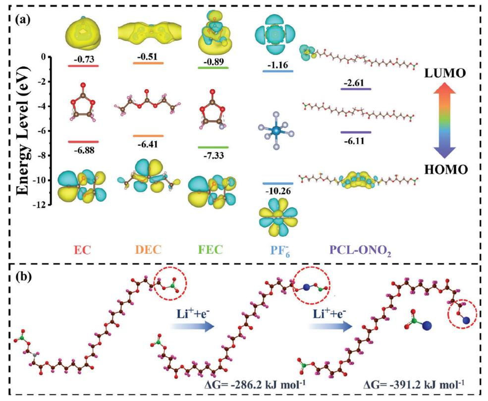
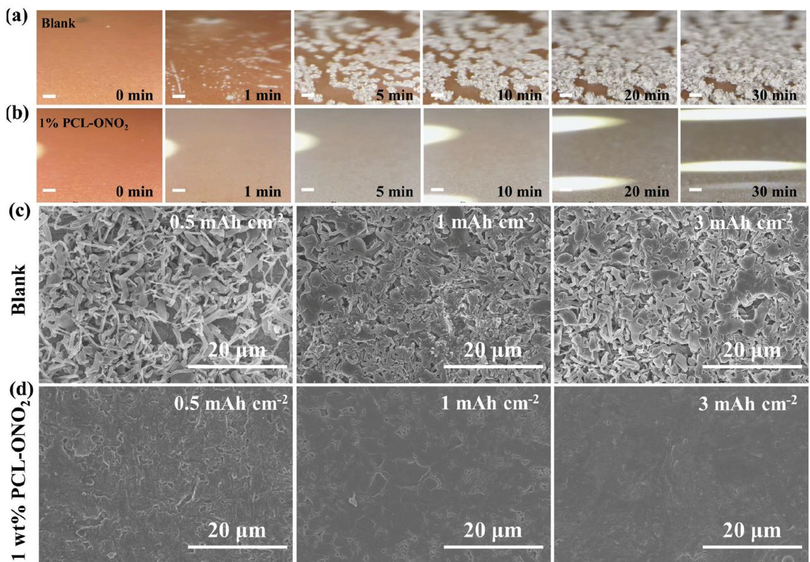
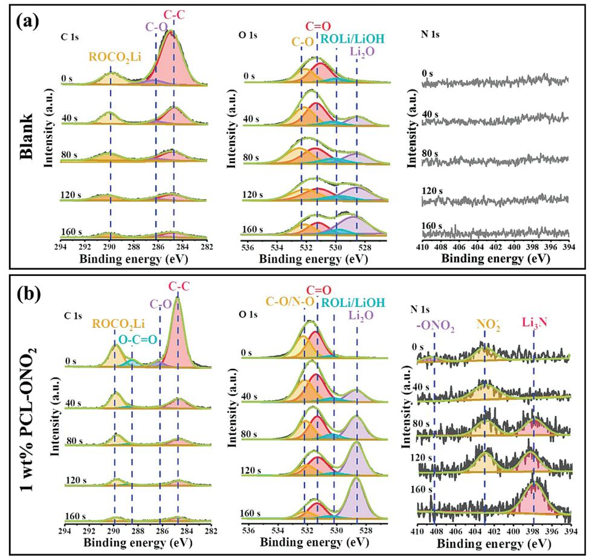
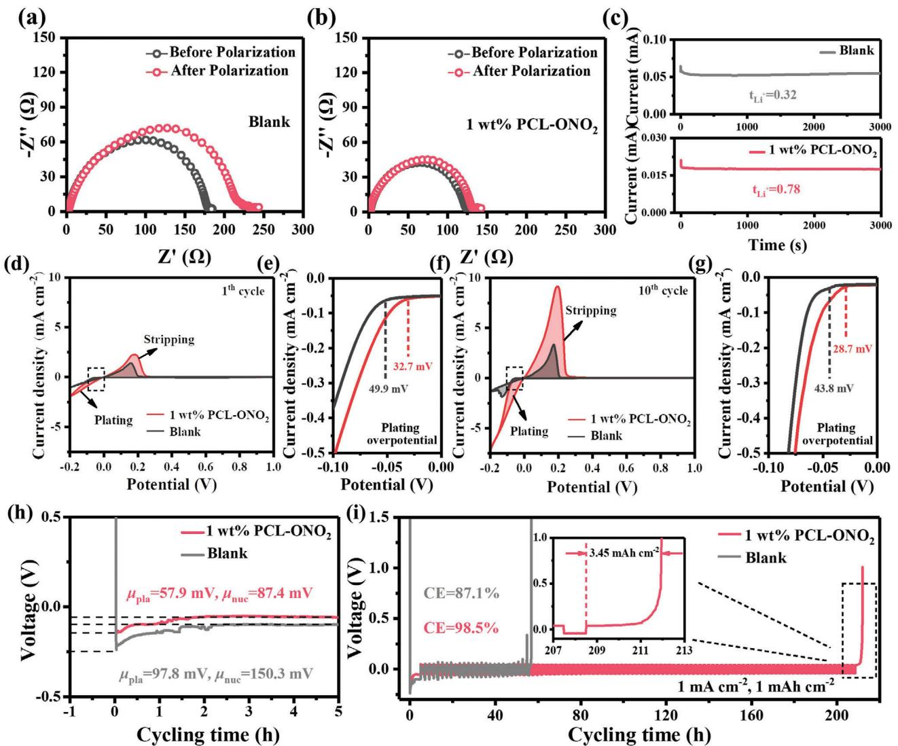
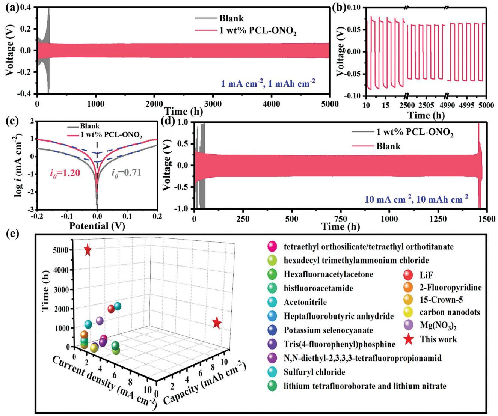
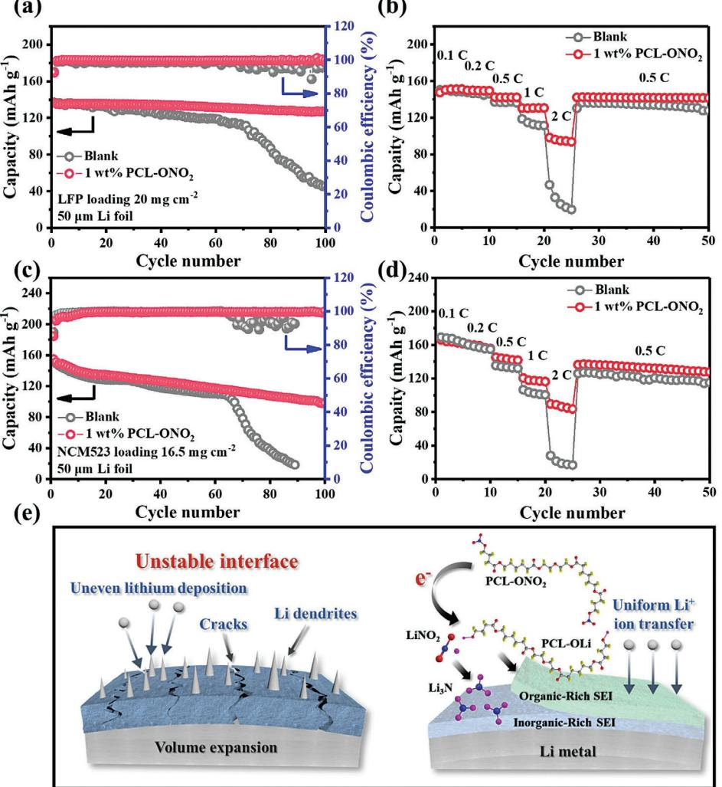

# **Organic Nitrate Additive for High-Rate and Large-Capacity Lithium Metal Anode in Carbonate Electrolyte**

*Chao Chen, Qingfeng Zhou, Xiaodan Li, Bote Zhao, Yunhua Chen, and Xunhui Xiong\**

**Lithium nitrate has been widely used to improve the interfacial stability of Li metal anode in ether electrolyte. However, the low solubility limits its application in carbonate electrolytes for high-voltage Li metal batteries. Herein, nitrated polycaprolactone (PCL-ONO2), which is prepared via the acylation of polycaprolactone diol (PCL-diol) followed by the grafting of nitrate group, has been proposed as an electrolyte additive to introduce high-concentration NO3 − into carbonate electrolytes for the first time. The theoretical calculations and X-ray photoelectron spectroscopy depth profiling demonstrate that the PCL-ONO2 additive preferentially reacts with Li metal and in situ constructs a stable dual-layered solid electrolyte interphase film, presenting an inner nitride-rich layer and an outer flexible PCL-based layer on the surface of Li metal anode. As a result, the Li metal anode delivers an impressive long-term cycling performance over 1400 h at an elevated area capacity of 10.0 mAh cm−2 and an ultrahigh current density of 10.0 mA cm−2 in the Li symmetrical cells. Moreover, the PCL-ONO2 additive enables the full cells constructed by coupling high-loading LiFePO4 (20.0 mg cm−2) or LiNi0.5Co0.2Mn0.3 (16.5 mg cm−2) cathode and thin Li metal anode (≈50 μm) to demonstrate greatly improved cycling stability and rate capability.**

## **1. Introduction**

The rapid development of electric vehicles in the recent years imposes increasing researches on high-energy-density lithium-ion batteries . Therefore, Li metal anode has regained lots of attentions owing to the ultrahigh theoretical specific capacity (3860 mAh g−1) and the lowest redox potential (−3.04 V vs standard hydrogen electrode).[1–5] Unfortunately, the poor reversibility and the uncontrollable dendrite growth still limit the commercial application of Li metal anode. Specifically, the high activity of Li metal induces the formation of a SEI at the interface of Li

C. Chen, Q. Zhou, X. Li, B. Zhao, X. Xiong School of Environment and Energy Guangdong Provincial Key Laboratory of Advanced Energy Storage Materials South China University of Technology Guangzhou 510006, China E-mail: [esxxiong@scut.edu.cn](mailto:esxxiong@scut.edu.cn) Y. Chen School of Materials Science and Engineering South China University of Technology Guangzhou 510640, China

The ORCID identification number(s) for the author(s) of this article can be found under<https://doi.org/10.1002/smtd.202300839>

**DOI: 10.1002/smtd.202300839**

metal/electrolyte.[6–9] This natural SEI usually contains two layers, in which the outer organic-rich layer could ensure the efficient Li+ diffusion from electrolyte and also provide flexibility to accommodate the volume variations, while the inner inorganic-rich layer can avoid the deposition of Li+ on surface of SEI as well as suppress the continuous side reactions between Li metal and electrolyte. However, the structural and compositional heterogeneity of the native SEI leads to the uneven deposition of Li ions, especially at large current densities, resulting in the rapid Li dendrite generation, fast deterioration of Coulombic efficiency (CE) and even safety concerns.[10–13] Therefore, the rational design and construction of stable SEI on the Li metal surface has been a promising strategy to solve these problems of Li metal anode.

As the decomposition products of electrolytes, the structure and composition

of SEI layer highly depend on the electrolytes, and therefore the homogeneity of SEI can be optimized by adjusting the solvents, Li salts, and additives. Among these strategies, the introduction of additives has been considered as the most effective and convenient method.[14–16] Notably, LiNO3 has been regarded as a magic electrolyte additive for Li–S batteries, which can efficiently inhibit the "shuttle effect" of Li polysulfide and simultaneously homogenize the Li deposition via forming high ionic conductive nitride-rich SEI.[17–19] However, as a sacrificial additive, the solubility of LiNO3 in carbonate-based electrolytes is as low as 0.012 m,[20] which cannot support the formation of nitriderich SEI and then severely limits its application in high-voltage LMBs. To increase the solubility of LiNO3 in carbonate electrolytes, CuF2, [21] tris(pentafluorophenyl)borane,[22] Sn(OTf )2, [23] and pyridine[24] have been proposed as solubilizers. However, the effect of the possible electrochemical reactions of solubilizers on the stability of LMBs still remains unclear. Thereafter, solid LiNO3 has also been introduced in carbonate electrolytes by pre-impregnating on porous separator or encapsulating in polymer gel,[20] nanocapsules[25] or covalent organic frameworks,[26] which can continuous release LiNO3 to the electrolyte when the soluble LiNO3 in electrolyte is consumed. However, the solubility of LiNO3 in the ester-based electrolyte in this strategy has not increased. Despite of these significant progresses, the LiNO3 derived SEI layers rich in nitride compounds on Li metal surface usually have no enough flexibility to accommodate the huge and repeated volume changes during the plating/stripping processes, and therefore most of the Li anodes cannot deliver ultralong cycle stability at high current density (≥10 mA cm−2) and large areal capacity (≥10 mAh cm−2) in carbonate electrolyte. Stimulated by the unique structure of the native SEI on surface of Li metal anode, the construction of a dual-layered structure to overcome the shortage of LiNO3-derived SEI layer could be the ideal design. However, the development of an advanced additive that can simultaneously construct a dual-layered SEI layer with inner nitride-rich layer and outer flexible layer on Li metal surface remains a key challenge. As a common substrate for solidstate electrolytes, polycaprolactone (PCL) has good solubility and degradability, which can play a role in dissociating lithium salts and conducting Li ions efficiently.[27–29] Thus, PCL can be used as a substrate for introducing nitrate into an ester-based electrolyte.

Herein, nitrated polycaprolactone (PCL-ONO2), which is prepared via the acylation of polycaprolactone diol (PCL-diol) followed by the grafting of nitrate groups, has been proposed as a new electrolyte additive to achieve the introduction of highconcentration NO3 − into carbonate electrolytes. The theoretical calculations and X-ray photoelectron spectroscopy (XPS) depth profiling reveal that PCL-ONO2 will preferentially react with the Li metal to form a dual-layered SEI with inner nitride-rich layer and outer flexible organic-rich layer. The rigid nitride-rich layer can suppress Li dendrite growth, inhibit solvent penetration as well as facilitate the rapid transfer of Li ions. Besides, the outer PCL-based flexible layer can effectively accommodate the volumetric fluctuations and inhibit the peeling of the inner inorganicrich layer during the long-term cycling. Benefit from the incorporation of PCL-ONO2 additive, the Li metal anode in symmetric cell can deliver an extremely stable cycle performance for 5000 h in carbonate electrolyte at a current density of 1.0 mA cm−2 and an areal capacity of 1.0 mAh cm−2. Remarkably, unprecedented cycle stability over 1400 h can be achieved even at an ultra-high current density of 10.0 mA cm−2 and an areal capacity of 10.0 mAh cm−2. In addition, the cycling performance and rate capability of the full batteries constructed by coupling the high-loading LiFePO4 cathode (20 mg cm−2) or NCM523 cathode (16.5 mg cm−2) with thin Li foil (≈50 μm) are remarkably enhanced. This work provides a new insight into the electrolyte additive design for practical LMBs.

### **2. Results and Discussion**

PCL-ONO2 was synthesized through the acylation of both ends of PCL-diol with 4-bromobutyryl chloride followed by the replacement of the terminal bromine with AgNO3 to access nitrate groups (Figure S1, Supporting Information).[30] The successful preparation of PCL-ONO2 is verified by 13C NMR (Figure S2, Supporting Information) and 1H NMR spectra (Figure S3, Supporting Information), in which the peaks at 72.05 and 27.68 ppm in the 13C NMR spectra are assigned to ─CH2─ONO2, ─CH2─CH2─ONO2 in the 4-(nitrooxy)butanoyl ester unit, respectively, while the peak at 4.50 ppm in the 1H NMR spectra is assigned to the protons of ─CH2─ONO2. Meanwhile, the characteristic peak of ─ONO2 can be obviously observed at 1645 cm−1 in the FTIR spectrum of PCL-ONO2 (Figure S4, Supporting Information),[31] indicating that the nitrate groups have been successfully grafted at both ends of the PCL chains. As a filmforming additive, it should possess a lower value of the lowest unoccupied molecular orbital (LUMO) and a higher value of the highest occupied molecular orbital (HOMO), which enables the preferential decomposition at the interface of electrode/electrolyte to form a stable SEI layer.[32,33] Therefore, the LUMO and HOMO values of PCL-ONO2 were first obtained by density functional theory (DFT) calculations, as shown in **Figure 1**a. Compared with other solvents and anions in the electrolyte, PCL-ONO2 has a lower LUMO value (−2.61 eV) and a higher HOMO value (−6.11 eV), indicating that PCL-ONO2 has a higher electron affinity energy. As a result, PCL-ONO2 will preferentially decompose to form an interfacial film than other components in the electrolyte. Then the Gibbs free energies (Δ*G*) of the reactions between Li metal and different components in electrolyte were calculated. The Δ*G* of the reaction between PCL-ONO2 and Li metal is calculated to be −286.2 and −391.2 kJ mol−1, respectively (Figure 1b; Figure S5, Supporting Information). Meanwhile, the calculated Δ*G* values of the decomposition reactions of FEC (−217.9 kJ mol−1), EC (−123.4 kJ mol−1) and DMC (−102.4 kJ mol−1) solvents are significantly higher than that of PCL-ONO2 (Figure S6, Supporting Information), suggesting that the reactivity between Li and PCL-ONO2 is higher. Based on the Δ*G* values of different reactions, the possible reaction processes between Li metal and PCL-ONO2 can be described as the following two steps. As displayed in Figure S5 (Supporting Information), a single Li+ and electron attack the ─ONO2 bond in PCL-ONO2, and subsequently another Li+ and electron break the Li─O bond to generate PCL-OLi and LiNO2. Therefore, DFT calculations show that PCL-ONO2 additive will preferentially react with Li metal and form a thin and compact layer on Li surface through Li─O bond when it contacts with Li metal.

Based on the theoretical calculation results, PCL-ONO2 could be a promising electrolyte additive to stabilize Li metal anode in carbonate electrolyte, in which the solubility of PCL-ONO2 can be as high as 20 wt.% owing to the high solubility of PCL in organic solvents (Figure S7, Supporting Information). Meanwhile, the PCL-ONO2 additive has no remarkable effect on the electrochemical window of the carbonate electrolyte (Figure S8, Supporting Information). To investigate the effect of PCL-ONO2 additive on Li deposition behavior, the morphological evolution of Li deposition on bare Cu at a current density of 2.0 mA cm−2 is visualized via in situ optical microscopy. As shown in **Figure 2**a and Movie S1 (Supporting information), uneven Li deposition is observed on the Cu foil after plating for 1 min in blank carbonate electrolyte. The uneven Li deposition keeps growing in the subsequent plating process. After plating for 30 min, the Cu foil is fully covered by a mass of moss-like Li deposit. In sharp contrast, the plated Li metal is uniformly distributed on the whole surface of the Cu foil when 1 wt.% PCL-ONO2 was introduced into the electrolyte (Figure 2b). After deposition for 30 min, no obvious Li dendrite can be observed. These results indicate that PCL-ONO2 additive can effectively facilitate the uniform deposition of Li+ in the carbonate electrolyte.

Scanning electron microscopy (SEM) was then used to study the detailed morphology of Li deposition on Cu foil in carbonate electrolytes with or without PCL-ONO2 additive. After deposition for 0.5 h at a current density of 1.0 mA cm−2 in blank electrolyte,

**Figure 1.** a) The calculated HOMO and LUMO energy levels of different compositions in carbonate electrolyte and PCL-ONO2. b) Possible reaction mechanism between Li metal and PCL-ONO2 additive and the corresponding calculated Δ*G* value.

the plated Li metal shows a needle-like morphology (Figure 2c). The large surface area will accelerate the side reactions between Li metal and the electrolyte, and then deteriorate the cycle life. With the plating process proceeds, the deposited Li manifests a porous structure due to the formation of numerous whiskerlike Li. In comparison, the morphology of the plated Li is significantly different when 1 wt.% PCL-ONO2 is introduced into the electrolyte. The plated Li at different areal capacities exhibits a dense and smooth surface without any Li dendrites (Figure 2d). Besides, a thin and homogeneous layer can be clearly observed on the surface of Li deposition. Obviously, both dendritic and mossy Li are drastically prevented by PCL-ONO2 additive, which is likely attributed to the SEI layer formed by the preferential decomposition of PCL-ONO2.

X-ray photoelectron spectroscopy (XPS) depth profiling analysis was performed to obtain the chemical components of PCL-ONO2-derived SEI layer. As shown in **Figure 3**a, the outer surface of the native SEI in blank electrolyte is rich in organic products, such as ROCO2Li (289.9 eV in C 1s XPS spectra) and ROLi (529.8 eV in O 1s spectra),[34] which are contributed by the decomposition products of the solvents (Figure S9, Supporting Information). After Ar+ etching for 40 s, the inorganic Li2O is exposed to the detection area and its content experiences a gradual increase in the following etching, indicating the SEI formed in the blank carbonate electrolyte agrees well with the widely reported "mosaic model". The PCL-ONO2-derived SEI on Li metal is also featured with a dual-layered structure, as displayed in Figure 3b and Figure S10 (Supporting Information). The remarkable difference from the native SEI is the components of outer layer and inner layer, which has been demonstrated by the C 1s and N 1s XPS spectra. As shown in C 1s XPS spectrum of PCL-ONO2-derived SEI, the peak located at 288.5 eV is belonged to the O─C═O from PCL.[35,36] Besides, strong signal of ─ONO2 from PCL-ONO2 is also appeared in the N 1s XPS spectrum of outer surface region of the SEI layer. All these demonstrate that PCL-ONO2 additive has participated in the formation of SEI layer. As a polymer with chain architecture, the PCL has superior flexibility and ductility,[37–39] and can effectively buffer the volume changes during the plating/stripping processes. In the O 1s XPS spectra of PCL-ONO2-derived SEI layer, the Li2O content in SEI experiences a remarkable increase with the increase etching time, and the ratio of Li2O is much higher than that in the native SEI after etching for 40 s or long time, indicating that the PCL-ONO2 additive can increase the Li2O ratio in the SEI. In the N 1s XPS spectra in the native SEI form in blank electrolyte, no any N signal can be detected in the whole etching process. However, different N signals are observed in the PCL-ONO2-derived SEI during the whole etching process. The -ONO2 and NO2 − in the top surface of SEI layer come from the original PCL-ONO2 and the reaction product between PCL-ONO2 and Li metal (Figure S9, Supporting Information), respectively. Meanwhile, the inner NO2 − in this SEI is observed to decrease and the content of Li3N experiences a gradual increase as the etching time increases, which is caused by the further chemical reaction between NO2 − with Li (Figure S9, Supporting Information). Obviously, the O 1s and N 1s XPS spectra demonstrate that the major components in the inner layer of

**Figure 2.** In situ optical images of Li deposition on Cu foil in a) blank electrolyte and b) PCL-ONO2-containing electrolyte in Li||Cu cells for different minutes (Scale bar, 200 μm). SEM images of Li deposition on Cu foil in c) blank electrolyte and d) PCL-ONO2-containing electrolyte.

the PCL-ONO2-derived SEI are Li3N, Li2O and LiNO2. Therefore, the introduction of PCL-ONO2 into carbonate electrolyte successfully constructs a dual-layered SEI on Li metal anode with outer organic-rich layer and inner ionic inorganic-rich layer.

The effect of PCL-ONO2 additive on the Li+ diffusion in the Li||Li symmetric cells was evaluated by measuring the Liion transference number (*tLi*+ ). The *tLi*+ can be calculated by the constant current polarization method and electrochemical impedance spectroscopy (EIS) in symmetric cells, and the results are shown in **Figure 4**a–c. The *tLi*+ value is as high as 0.78 after introducing PCL-ONO2 additive, which is much higher than that in blank electrolyte (0.32). The enhanced *tLi*+ can be attributed to the coordination between the Li+ and the ester carbonyl group of PCL in the top surface of SEI layer, leading to a weakened interaction between Li ions and anions in electrolyte. Meanwhile, the addition of PCL-ONO2 can slightly improve the ionic conductivity of the electrolyte (Figure S11, Supporting Information). A high *tLi*+ can reduce the Li+ concentration gradient at the interface, thus facilitating the fast transport and the uniform deposition of Li+.

Except for the enhanced *tLi*+ in the PCL-ONO2-containing electrolyte, the Li deposition kinetics were also evaluated in Li||Cu cells by the cyclic voltammetry (CV) in the potential range of −0.2∼1.0 V. As shown in Figure 4d, all CV curves show a pair of redox peaks in the voltage range of −0.2∼0.3 V, corresponding to the Li platting (negative scan) and stripping (positive scan) reactions, respectively. In the first cycle, the cells in PCL-ONO2 containing electrolyte exhibit higher peak reduction current and larger peak areas than those in blank carbonate electrolyte, indicating Li+ can be plated onto the Cu foil with higher efficiency owing to the existence of PCL-ONO2 additive. Furthermore, the nucleation overpotential in the electrolyte with PCL-ONO2 is reduced by 17.2 mV compared with that in blank electrolyte (Figure 4e). The peak current of Li plating in blank electrolyte is only 1.3 mA cm−2 at the 10th cycle, while the peak current in the PCL-ONO2-containing electrolyte is as high as 7.2 mA cm−2 (Figure 4f), indicating greatly enhanced reaction kinetics. Even after 10 cycles, the nucleation overpotential of Li plating in additive-containing electrolyte is still lower than that in blank electrolyte (Figure 4g). Therefore, CV curves demonstrate that the PCL-ONO2 additive can efficiently facilitate the conversion reaction between Li+ and Li in carbonate electrolyte, which is achieved by constructing a dual-layered SEI on Li metal anode.

Then the Li plating/stripping cycles on Cu foil in PCL-ONO2 containing electrolyte and in blank electrolyte were investigated. Aurbach's method was used to simulate the Li plating/stripping process of a Li excess anode as well as minimize the effect of Cu foil.[40] Therefore, 5.0 mAh cm−2 of Li metal is plated on the Cu foil before the Li plating/stripping cycling and then

**Figure 3.** XPS depth profiling results of C 1s, O 1s, and N 1s spectra of SEI layers formed in a) blank electrolyte and b) PCL-ONO2-containing electrolyte.

1.0 mAh cm−2 of Li metal is plated/stripped per cycle at a current density of 1.0 mA cm−2. Finally, the remaining Li on Cu after 10 cycles can be completely stripped to 1.0 V to calculate the cycling CE. As shown in Figure 4h, the PCL-ONO2 additive can decrease the Li nucleation overpotential from 86.4 to 55.6 mV, which agrees well with CV results. Meanwhile, the cycling CE is calculated to be 92.1% after 10 cycles in PCL-ONO2 containing electrolyte, while the cycling CE in blank electrolyte is only 90.3% (Figure S12, Supporting Information), indicating that PCL-ONO2 additive contributes to the higher reversibility of Li plating/stripping. Furthermore, the long-term cycling CEs in the electrolytes with and without PCL-ONO2 additive were also studied (Figure 4i). The remained reversible Li capacity after 100 cycles in PCL-ONO2-containing electrolyte is 3.45 mAh cm−2 and the average CE is calculated to be 98.5%. In contrast, the Li deposited on Cu in blank electrolyte is completely consumed at the 26th cycle, and average CE is calculated to be 87.1%. The greatly improved average CE indicates the PCL-ONO2-derived SEI layer can suppress the side reaction at the interface of Li metal/electrolyte and increase the reversibility of Li metal anode.

To evaluate the effect of PCL-ONO2 additive on the interfacial stability of Li metal anode, the cycling stability of Li metal anode in the Li||Li symmetric cells was studied. As shown in Figure S13 (Supporting Information), the additive concentrations in the carbonate electrolyte have a remarkable effect on the electrochemical performances of the symmetric cell, and the Li metal anode in the 1 wt.% PCL-ONO2-containing electrolyte shows the best electrochemical performances in terms of cycle life and plating/stripping overpotential. **Figure 5**a exhibits the Li plating/stripping curves of the symmetric cells with and without 1 wt.% PCL-ONO2 additive at a current density of 1.0 mA cm−2 and an area capacity of 1.0 mAh cm−2. The symmetric cell without PCL-ONO2 additive only delivers a stable cycling for 200 h, and then the overpotential experiences a rapid increase in the following cycles due to the unstable Li/electrolyte interface and the accumulation of broken SEI on Li metal anode. In contrast, the symmetric cell with PCL-ONO2 additive can maintain a highly stable plating/stripping performance for 5000 h with a low overpotential of 60.2 mV (Figure 5b). This is because the PCL-ONO2 derived dual-layered SEI has high ionic conductivity as well as excellent structural stability in the long-term cycles, which is also proved by the electrochemical impedance spectroscopy (EIS) evolution of the Li||Li symmetric cells and the SEM images of cycled Li metal anode. The interfacial impedance of the symmetric cell in PCL-ONO2-containing electrolyte remains stable at ≈8.5 Ω from 10th cycle (Figure S14, Supporting Information). **[www.advancedsciencenews.com](http://www.advancedsciencenews.com) [www.small-methods.com](http://www.small-methods.com)**

**Figure 4.** EIS curves of Li||Li symmetric cells in a) the blank electrolyte and b) the 1 wt% PCL-ONO2-containing electrolyte in pristine state and after polarization at 10 mV; c) Chronoamperometric curves of Li symmetric cells in different electrolytes; d) CV curves of Li||Cu cells in blank electrolyte and the 1 wt% PCL-ONO2-containing electrolyte at 1st cycle and e) the corresponding plating overpotential; f) CV curves of Li||Cu cells in the blank electrolyte and the 1 wt% PCL-ONO2-containing electrolyte at 10th cycle and g) the corresponding plating overpotential; h) The magnified view of the Li nucleation potential on Cu foil in different electrolytes; i) The Li plating/stripping CE during the long-term cycling.

In contrast, the interfacial impedance of the symmetric cell in blank electrolyte experiences a gradual increase after 10 cycles, indicating an unstable Li/electrolyte interface. Similar phenomena are observed in the SEM images of cycled Li metal anode in different electrolytes. The Li metal anode cycled in PCL-ONO2 containing electrolyte shows smooth, dense surface, while the anode cycled in additive-free electrolyte demonstrates a porous surface covered by a large number of Li dendrites and dead Li (Figure S15, Supporting Information).

When the current density of the symmetric cell is increased to 10.0 mA cm−2, Li metal anode in the PCL-ONO2-containing electrolyte can still maintain a stable cycle for 2500 h with a low overpotential of 144.5 mV (Figure S16, Supporting Information). However, huge voltage fluctuations appeared from 85 h for the symmetrical cells in additive-free electrolyte, which is ascribed to the continuous Li dendrite formation and frequent internal short circuit. Obviously, the PCL-ONO2 additive shows more powerful role in stabilizing Li metal anodes at higher plating/stripping current density. The greatly boosted high-rate capability in PCL-ONO2-containing electrolyte is also verified by the Tafel curves (Figure 5c). The Tafel curves manifest the exchange current density of Li||Li symmetric cell in the PCL-ONO2-containing electrolyte is much higher than that in bare electrolyte, indicating that PCL-ONO2-derived dual-layered SEI has higher charge transfer kinetics and faster Li-ion transport. When the symmetrical cells are cycled at an elevated current density of 10.0 mA cm−2 and areal capacity of 10.0 mAh cm−2 to meet the practical demands, the Li metal anode in PCL-ONO2-containing electrolyte **[www.advancedsciencenews.com](http://www.advancedsciencenews.com) [www.small-methods.com](http://www.small-methods.com)**

**Figure 5.** a) Voltage profiles of Li||Li symmetric cell in blank electrolyte and in the 1 wt.% PCL-ONO2-containing electrolyte at 1.0 mA cm−2 and a capacity of 1.0 mAh cm−2 and b) Tthe corresponding enlarged voltage profiles in PCL-ONO2-containing electrolyte for different cycles. c) Tafel curves of Li||Li symmetric cells in different electrolytes at a scan rate of 1.0 mV s−1. d) Voltage profiles of Li||Li symmetric cell in different electrolyte at current density of 10.0 mA cm−2 and high capacity of 10.0 mAh cm−2. e) The comparison of cycle life of Li||Li symmetric cells using 1 wt.% PCL-ONO2 as additive with the representative additives (Data is obtained from Table S1 in Supporting Information).

can keep stable voltage curves for 1400 h with a low overpotential of 230.4 mV (Figure 5d; Figure S17, Supporting Information), which is far superior to the previously reported additives in carbonate electrolytes (Figure 5e). In vast contrast, the Li||Li symmetric cell in blank electrolyte shows severe potential fluctuations and short-circuits after cycling for 54 h. Besides, the Li metal anode cycled in PCL-ONO2-containing electrolyte shows smooth and dense surface even at large current density and areal capacity (Figure S18, Supporting Information). Meanwhile, the Li||Li symmetric cell in PCL-idol-containing electrolyte delivers stable cycling for 600 h, and voltage fluctuation can also be observed in subsequent cycles (Figure S19, Supporting Information). It is evident that the nitro groups in the PCL-ONO2 additive play a key role in improving the cycling stability of Li metal anode. These results support PCL-ONO2 additive can efficiently homogenize the Li deposition and maintain the structural stability of Li metal anode under high-rate and high-areal-capacity cycling.

To prove the practical application of PCL-ONO2 additive in LMBs, the full cells were fabricated with high-loading LiFePO4 cathode (20.0 mg cm−2) and thin Li foil (50 μm), and the cycling performance and rate performance were evaluated in the different carbonate electrolytes in the voltage of ≈2.0–4.0 V. As shown in **Figure 6**a, the LFP||Li cell without PCL-ONO2 additive shows rapid capacity deterioration during the cycling process, and a low capacity of 40.5 mAh g−1 with a retention ratio of 32.9%, as well as sharp fluctuating CEs, is obtained after 100 cycles at 0.5 C. The fast capacity degradation is mainly attributed to more severe dendritic Li growth and more rapid increase of cell polarization

**Figure 6.** a) The cycle performances at 0.5 C and b) the rate performances of LFP||Li cells in blank electrolyte and PCL-ONO2-containing electrolyte. c) The cycle performances at 0.5 C and d) the rate performances of NCM523||Li cells in blank electrolyte and PCL-ONO2-containing electrolyte. e) Schematic diagram of Li plating/stripping behaviors and SEI changes in different electrolytes.

when the cell is operated under the practical conditions. In vast contrast, the cell in PCL-ONO2-containing electrolyte demonstrates an impressive capacity retention of 93.2% after 100 cycles at 0.5 C with stable CEs over 99% throughout the whole cycling processes. Besides, the full battery with PCL-ONO2 additive has more stable interface impedance (Figure S20, Supporting Information) and higher discharge capacities at all the current densities from 0.2 to 2 C (Figure 6b). To further demonstrate the reliability and practicality of PCL-ONO2 additive at high voltage, the full cells constructed by coupling high-loading NCM532 cathode (16.5 mg cm−2) and thin Li foil were cycled in different carbonate electrolytes in the voltage range of ≈2.8–4.3 V. As shown in Figure 6c, the capacity retention ratio of the full cell without PCL-ONO2 is only 12.1% after 89 cycles. However, the cell with additive achieves a high retention ratio of 63.7%, which confirms that the PCL-ONO2-derived SEI on Li metal anode is stable at high operating voltages. Consistently with LFP||Li, the PCL-ONO2 additive can enhance rate performance of NCM523||Li especially at high current densities (Figure 6d). To visually highlight the advantages of the PCL-ONO2 additive, Figure 6e illustrates the Li+ deposition process in different electrolytes. In contrast to the fragile SEI formed in blank electrolyte, PCL-ONO2 additive reacts preferentially with Li metal to form a dual-layer SEI with inner nitride-rich layer and outer flexible organic-rich layer. The rigid nitride-rich SEI layer can facilitate the rapid transport of Li ions, suppress the growth of Li dendrite and inhibit the side reaction between Li metal and electrolyte. In addition, the outer organicrich layer can effectively mitigate the stress fluctuations caused by volume expansion. Benefiting from the synergistic effect of two layers, the PCL-ONO2-derived SEI enables the Li metal anode to demonstrate greatly enhanced charge-discharge reversibility and structural integrity during the long-cycling processes in the symmetric cells and full cells.

# **3. Conclusion**

In summary, PCL-ONO2 has been proposed as a new electrolyte additive to introduce a high-concentration NO3 − into the

**[www.advancedsciencenews.com](http://www.advancedsciencenews.com) [www.small-methods.com](http://www.small-methods.com)**

carbonate electrolytes. The DFT calculations and experimental data demonstrate that the PCL-ONO2 additive will preferentially react with the Li metal to build a stable dual-layered SEI, in which the inner inorganic SEI layer composed of Li2O, LiN*x*O*y*, and Li3N can inhibit Li dendrite growth and promote rapid Liion transfer, while the outer PCL-based SEI layer can effectively buffer the volume fluctuations during the long-term cycling. Thanks to the PCL-ONO2 additive, Li metal anode in symmetrical batteries can achieve an unprecedented cycle stability of over 1400 h at an ultrahigh current density of 10.0 mA cm−2 and an areal capacity of 10.0 mAh cm−2. Furthermore, the full cells in 1 wt.% PCL-ONO2 electrolyte show significantly improved cycle stability and rate performances. This work opens a new avenue for introducing high-concentration LiNO3-based additive in carbonate electrolytes for high-performance Li metal anode.

### **Supporting Information**

Supporting Information is available from the Wiley Online Library or from the author.

#### **Acknowledgements**

The authors gratefully acknowledge the financial support from National Natural Science Foundation of China (51874142), Tip-top Scientific and Technical Innovative Youth Talents of Guangdong Special Support Program (2019TQ05L903), and Young Elite Scientists Sponsorship Program by CAST (2019QNRC001).

Figure 4 and the corresponding caption have been corrected on 22 December 2023, after initial online publication of the Version of Record.

### **Conflict of Interest**

The authors declare no conflict of interest.

#### **Data Availability Statement**

The data that support the findings of this study are available from the corresponding author upon reasonable request.

#### **Keywords**

dual-layered SEI, electrolyte additives, lithium metal anodes, organic nitrate, stable interfaces

> Received: July 6, 2023 Revised: September 19, 2023 Published online: October 15, 2023

- [1] J.-M. Tarascon, *Nat. Chem.* **2010**, *2*, 510.
- [2] P. Bai, J. Li, F. R. Brushett, M. Z. Bazant, *Energy Environ. Sci.* **2016**, *9*, 3221.
- [3] J. Shim, H. J. Kim, B. G. Kim, Y. S. Kim, D.-G. Kim, J.-C. Lee, *Energy Environ. Sci.* **2017**, *10*, 1911.
- [4] C. Chen, Q. Liang, Z. Chen, W. Zhu, Z. Wang, Y. Li, X. Wu, X. Xiong, *Angew. Chem. - Int. Ed.* **2021**, *60*, 26718.
- [5] C. Chen, J. Zhang, B. Hu, Q. Liang, X. Xiong, *Nat. Commun.* **2023**, *14*, 4018.
- [6] S. Choudhury, R. Mangal, A. Agrawal, L. A. Archer, *Nat. Commun.* **2015**, *6*, 10101.
- [7] C. Fang, J. Li, M. Zhang, Y. Zhang, F. Yang, J. Z. Lee, M.-H. Lee, J. Alvarado, M. A. Schroeder, Y. Yang, B. Lu, N. Williams, M. Ceja, L. Yang, M. Cai, J. Gu, K. Xu, X. Wang, Y. S. Meng, *Nature* **2019**, *572*, 511.
- [8] D. Lin, Y. Liu, Y. Cui, *Nat. Nanotechnol.* **2017**, *12*, 194.
- [9] C. Chen, Q. Liang, G. Wang, D. Liu, X. Xiong, *Adv. Funct. Mater.* **2022**, *32*, 2107249.
- [10] K. Xu, *Chem. Rev.* **2014**, *114*, 11503.
- [11] W. Xu, J. Wang, F. Ding, X. Chen, E. Nasybulin, Y. Zhang, J.-G. Zhang, *Energy Environ. Sci.* **2014**, *7*, 513.
- [12] Y. Liu, D. Lin, P. Y. Yuen, K. Liu, J. Xie, R. H. Dauskardt, Y. Cui, *Adv. Mater.* **2017**, *29*, 1605531.
- [13] J. Langdon, A. Manthiram, *Adv. Funct. Mater.* **2021**, *31*, 2010267.
- [14] Y. Zhang, Y. Wu, H. Li, J. Chen, D. Lei, C. Wang, *Nat. Commun.* **2022**, *13*, 1297.
- [15] D. Zhang, M. Liu, J. Ma, K. Yang, Z. Chen, K. Li, C. Zhang, Y. Wei, M. Zhou, P. Wang, Y. He, W. Lv, Q.-H. Yang, F. Kang, Y.-B. He, *Nat. Commun.* **2022**, *13*, 6966.
- [16] J. Zheng, M. H. Engelhard, D. Mei, S. Jiao, B. J. Polzin, J.-G. Zhang, W. Xu, *Nat. Energy* **2017**, *2*, 17012.
- [17] S. Liu, X. Ji, N. Piao, J. Chen, N. Eidson, J. Xu, P. Wang, L. Chen, J. Zhang, T. Deng, S. Hou, T. Jin, H. Wan, J. Li, J. Tu, C. Wang, *Angew. Chem. - Int. Ed.* **2021**, *60*, 3661.
- [18] N. Piao, S. Liu, B. Zhang, X. Ji, X. Fan, L. Wang, P.-F. Wang, T. Jin, S.-C. Liou, H. Yang, J. Jiang, K. Xu, M. A. Schroeder, X. He, C. Wang, *ACS Energy Lett.* **2021**, *6*, 1839.
- [19] J. Fu, X. Ji, J. Chen, L. Chen, X. Fan, D. Mu, C. Wang, *Angew. Chem. - Int. Ed.* **2020**, *59*, 22194.
- [20] Y. Liu, D. Lin, Y. Li, G. Chen, A. Pei, O. Nix, Y. Li, Y. Cui, *Nat. Commun.* **2018**, *9*, 3656.
- [21] C. Yan, Y.-X. Yao, X. Chen, X.-B. Cheng, X.-Q. Zhang, J.-Q. Huang, Q. Zhang, *Angew. Chem. - Int. Ed.* **2018**, *57*, 14055.
- [22] S. Li, W. Zhang, Q. Wu, L. Fan, X. Wang, X. Wang, Z. Shen, Y. He, Y. Lu, *Angew. Chem. - Int. Ed.* **2020**, *59*, 14935.
- [23] W. Zhang, Q. Wu, J. Huang, L. Fan, Z. Shen, Y. He, Q. Feng, G. Zhu, Y. Lu, *Adv. Mater.* **2020**, *32*, 2001740.
- [24] D. Liu, X. Xiong, Q. Liang, X. Wu, H. Fu, *Chem. Commun.* **2021**, *57*, 9232.
- [25] Q. Liu, Y. Xu, J. Wang, B. Zhao, Z. Li, H. B. Wu, *Nano-Micro Lett.* **2020**, *12*, 176.
- [26] Y. Wen, J. Ding, Y. Yang, X. Lan, J. Liu, R. Hu, M. Zhu, *Adv. Funct. Mater.* **2022**, *32*, 2109377.
- [27] W. Ye, M. Zaheer, L. Li, J. Wang, H. Xu, C. Wang, Y. Deng, *J. Electrochem. Soc.* **2020**, *167*, 110532.
- [28] P.-M. Jalbert, B. Commarieu, J.-C. Daigle, J. P. Claverie, K. Zaghib, *J. Electrochem. Soc.* **2020**, *167*, 080527.
- [29] Y. Huang, Z. Shi, H. Wang, J. Wang, Z. Xue, *Energy Storage Mater.* **2022**, *51*, 1.
- [30] D. Zhu, J. Hou, M. Qian, D. Jin, T. Hao, Y. Pan, H. Wang, S. Wu, S. Liu, F. Wang, L. Wu, Y. Zhong, Z. Yang, Y. Che, J. Shen, D. Kong, M. Yin, Q. Zhao, *Nat. Commun.* **2021**, *12*, 4501.
- [31] S. Yang, X. Zheng, M. Qian, H. Wang, F. Wang, Y. Wei, A. C. Midgley, J. He, H. Tian, Q. Zhao, *Front. Bioeng. Biotechnol.* **2021**, *9*, 770121.
- [32] Y. Luo, T. Li, H. Zhang, W. Liu, X. Zhang, J. Yan, H. Zhang, X. Li, *Angew. Chem. - Int. Ed.* **2021**, *60*, 11718.
- [33] Z. Piao, R. Gao, Y. Liu, G. Zhou, H.-M. Cheng, *Adv. Mater.* **2023**, *35*, 2206009.
- [34] H. Ye, Y.-X. Yin, S.-F. Zhang, Y. Shi, L. Liu, X.-X. Zeng, R. Wen, Y.-G. Guo, L.-J. Wan, *Nano Energy* **2017**, *36*, 411.

- [35] X. Zhou, Z. Jia, X. Zhang, B. Wang, W. Wu, X. Liu, B. Xu, G. Wu, *J. Mater. Sci. Technol.* **2021**, *87*, 120.
- [36] X. Zhu, J. Gu, J. Zhu, Y. Li, L. Zhao, J. Shi, *Adv. Funct. Mater.* **2015**, *25*, 3847.
- [37] L. Zhou, Y.-M. Zhai, M.-B. Yang, W. Yang, *ACS Sustainable Chem. Eng.* **2019**, *7*, 15617.
- [38] Y. Li, M. Liu, S. Duan, Z. Liu, S. Hou, X. Tian, G. Cao, H. Jin, *ACS Appl. Energ. Mater.* **2021**, *4*, 2318.
- [39] Z. Zhang, L. Zhang, Y. Liu, T. Yang, Z. Wang, X. Yan, C. Yu, *J. Mater. Chem. A* **2019**, *7*, 23173.
- [40] B. D. Adams, J. Zheng, X. Ren, W. Xu, J.-G. Zhang, *Adv. Energy Mater.* **2018**, *8*, 1702097.