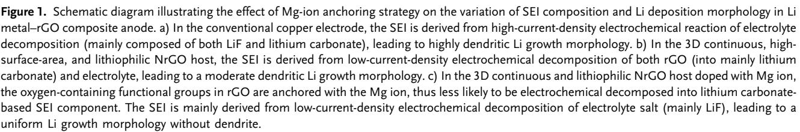
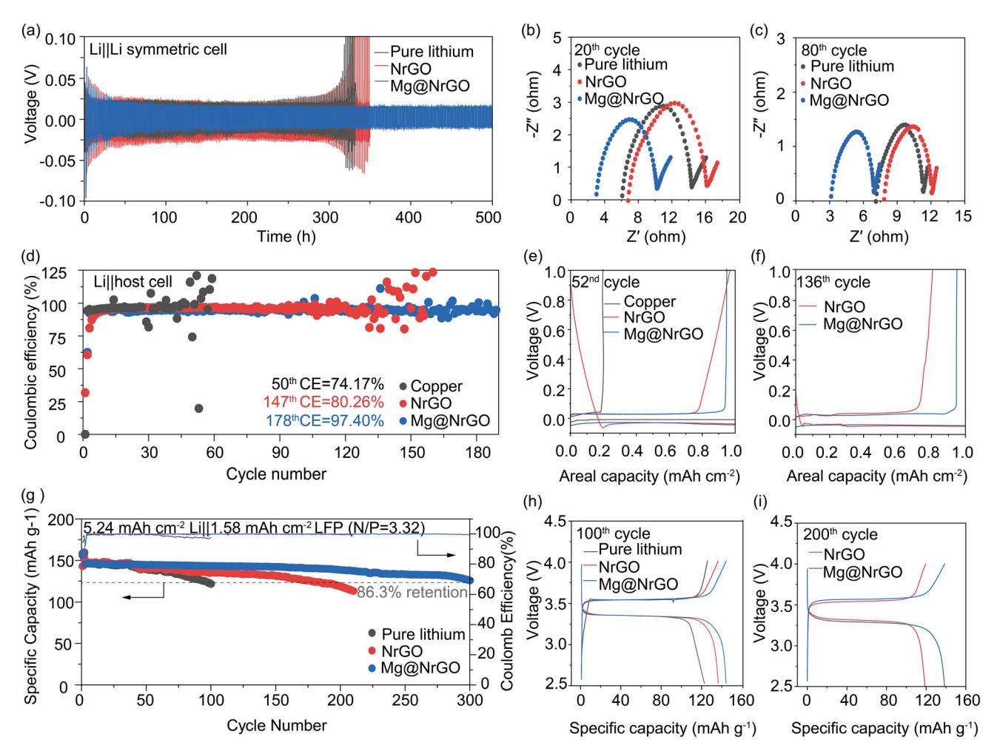
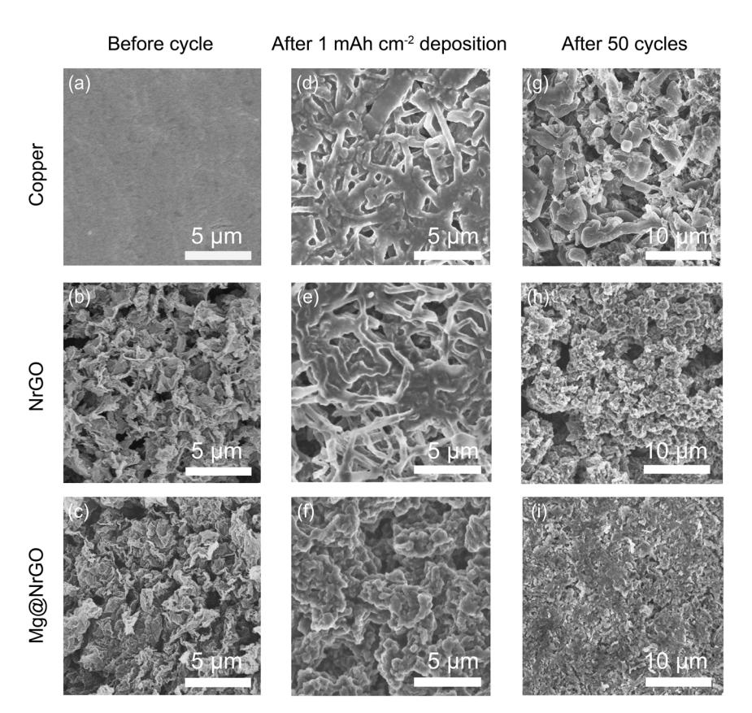
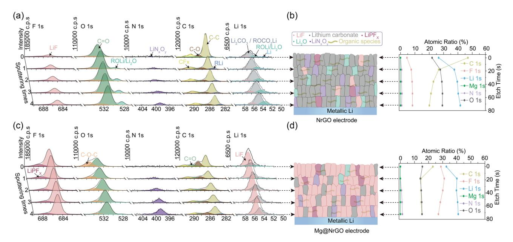

# **Magnesium Anchoring Strategy for Stabilizing Graphene-Hosted Lithium Metal Battery**

Yaoyao Liu, Chao Cui, Lequan Deng, Zhaofen Wang, Lutan Dong, Huitong Dong, Xiaoru Zhao, Ke-Peng Song, Yuanhua Sang, Hong Liu,\* Shuhua Wang,\* and Hao Chen\*

Lithium metal-graphene host composite is a promising anode material for high-energy-density Li battery owing to its three-dimensional structure, microlevel controllable thickness and ultrahigh specific capacity. However, we discover that the hydroxyl/carboxyl functional groups in the reduced graphene oxide (rGO) host are likely to be reduced into lithium carbonate composition in the solid-electrolyte interphase (SEI), which resulted in severe lithium dendrite growth that deteriorate its electrochemical performances. Here, we develop a magnesium anchoring strategy that selectively bond the Mg ion with the hydroxyl/carboxyl groups in rGO host, generating an electrolyte-derived lithium fluoride-dominant SEI instead of oxygen groups-derived, lithium carbonatedominant SEI. By anchoring 0.60% of Mg in the rGO host using a facile compositing-pyrolysis approach, Li dendrite growth in anode can be significantly suppressed, and the cycling stability of Li metal full cells can be prolonged by 200%. These findings give new insight into the mechanism of SEI formation in Li metal anode, and provide a new design strategy for restraining the reduced reaction of hydroxyl/carboxyl groups in graphene to stabilize the composite anode of lithium metal battery.

# 1. Introduction

High-energy-density and long-cycle-life lithium (Li) battery is one of the most critical demands from the ever-increasing market of portable electronics, electric vehicles, and sustainable energy consumption.[1,2] Li metal is one of the most promising anode materials in Li battery due to its highest electrode capacity  $(3860 \text{ mAh g}^{-1})$  and lowest electrode potential  $(-3.04 \text{ V} \text{ vs stan})$ dard hydrogen electrode) among all anode candidates,[3-5] offering

E-mail: hongliu@sdu.edu.cn; wangshuhua2019@sdu.edu.cn; haochen@sdu.edu.cn

The ORCID identification number(s) for the author(s) of this article ð can be found under https://doi.org/10.1002/sstr.202300345.

#### DOI: 10.1002/sstr.202300345

a prospect of achieving a cell-level energy density of  $\geq$ 500 Wh kg-1 that nearly doubles the energy density of current Li-ion batteries.[4,6] However, the Li metal anode is limited by severe anodic side reactions, especially the low Li plating/stripping reversibility and Li dendrite growth issues. $[3,7]$  These issues lead to short cycle life and severe safety concerns, significantly hindering the practical application of Li metal battery.[8]

To solve these problems, several efficacious strategies have been developed to suppress the side reactions in Li metal anode, including high surface area and lithiophilic carbonaceous host to decrease the local current density in anode,[9,10] artificial solid-electrolyte interphase to mitigate the Li–electrolyte side reaction,  $[11-13]$  relatively inert electrolyte molecule design to reduce its reactivity against Li metal, [14,15] robust solid electrolyte design to suppress Li dendrite growth,  $^{[16-18]}$  and cell pressure tailor-

ing to decrease the amount of dead Li.[19] Among those strategies, the lithiophilic reduced graphene oxide (rGO)-based host materials offer unique advantages of fabricating microlevel ultrathin and mechanical robust Li metal-rGO composite foil for both prelithiation and energy-dense Li metal battery applications.[20-25] However, the oxygen-containing function groups (including hydroxyl -OH, carboxyl -COOH, and epoxyl C-O-C groups) in the rGO host are very likely to be electrochemically reduced with chemical bond ruptured in anode, generating

K.-P. Song School of Chemistry and Chemical Engineering Shandong University Ji'nan 250100, P. R. China  $H$  Liu Institute for Advanced Interdisciplinary Research (IAIR) University of Jinan Jinan 250022, P. R. China H. Chen

Shandong Research Institute of Industrial Technology Ji'nan 250101, P. R. China

Y. Liu, C. Cui, L. Deng, Z. Wang, L. Dong, H. Dong, X. Zhao, K.-P. Song, Y. Sang, H. Liu, S. Wang, H. Chen

State Key Laboratory of Crystal Materials

**Shandong University** 

Ji'nan 250100, P. R. China

© 2023 The Authors. Small Structures published by Wiley-VCH GmbH. This is an open access article under the terms of the Creative Commons Attribution License, which permits use, distribution and reproduction in any medium, provided the original work is properly cited.

less-stable lithium carbonate species (Li2CO3 and lithium ethylene decarbonate, LEDC) in SEI that contribute to Li dendrite growth and cycling irreversibility.[26] To date, the mechanism and resolution of host decomposition-involved SEI composition variations have rarely been proposed or addressed. This has severely limited the cycling life and practical applications of host Li metal composite anode for high-energy-density Li metal batteries.

Here, we discover that the decomposition of hydroxyl/carboxyl functional groups in rGO host is highly related with the formation of lithium carbonate species in SEI and propose a Mg-ion anchoring strategy to selectively bond with the hydroxyl/carboxyl functional groups against decomposition, thus suppressing the host-derived lithium carbonate-dominant SEI, mitigating the dendritic Li growth, and improving the cycling stability of rGO host–Li metal composite anode (Figure 1). The SEI on conventional copper electrode is derived from electrolyte decomposition in high-current-density electrochemical reaction (mainly composed of both LiF and lithium carbonate), leading to highly dendritic Li growth morphology (Figure 1a). The rGO host can effectively reduce this high-current electrochemical reaction to a certain extent, but we find that the oxygen-containing functional groups in rGO host can decompose into the weak-passivating lithium carbonate species in SEI to aggravate the irreversible dendritic Li deposition (Figure 1b). However, Mg ion can selectively bond with the oxygen functional groups in rGO, mitigating the formation of oxygen groups-derived lithium carbonate species in the SEI. Therefore, the formation of electrolyte

salt-derived, high-interfacial-energy, and strong passivating lithium fluoride (LiF)-based SEI component is promoted, enabling more uniform and reversible Li plating/stripping in Li metal anode (Figure 1c). Using this Mg-ion anchoring strategy, the cycling stability of rGO host-based Li metal symmetric cells and full cells can be prolonged by 38.5% and 200.0%, respectively, along with more uniform Li deposition morphology and stable impedance in electrode. These discoveries raise a new understanding on the mechanism of SEI formation and SEI composition tuning in Li metal anode, which gives indispensable guidance on building energy-dense and stable cycling Li metal battery.

# 2. Results and Discussions

The fabrication processes of nitrogen-doped, reduced graphene oxide (NrGO), and Mg-ion-anchored and nitrogen-doped, reduced graphene oxide (Mg@NrGO) are shown in Figure 2a, in which melamine (C3H6N6), formaldehyde (HCHO), and graphene oxide (GO) were mixed in aqueous solution and heated in an oil bath to form melamine formaldehyde resin layers coated on the surface of graphene oxide sheets (Figure S1, Supporting Information). As source of Mg ion, Mg(NO3)2·6H2O salt was also added in the aqueous solution during mixing, which is anchored to GO by electrostatic forces and coordination bonding.[27] After freeze drying and high-temperature pyrolysis, the melamine formaldehyde resin (nitrogen source)-coated graphene oxide sheets were reduced into NrGO layers, while Mg(NO3)2·6H2O

[www.advancedsciencenews.com](http://www.advancedsciencenews.com) [www.small-structures.com](http://www.small-structures.com)

Figure 2. Preparation and characterization of NrGO and Mg@NrGO. a) Schematic diagram of the preparation processes of NrGO and Mg@NrGO. b) Top-view SEM image of NrGO. c) Top-view SEM image of Mg@NrGO. d) XPS spectra of NrGO and Mg@NrGO. e) Mg 1s XPS spectra of NrGO and Mg@NrGO. f ) O 1s XPS spectra of NrGO and Mg@NrGO. g) HRTEM image of NrGO. h) HRTEM image of Mg@NrGO. i) High-resolution HAADF– STEM image of Mg@NrGO, the bright spots of Mg ion are marked by yellow circles. j) HAADF–STEM image of Mg@NrGO. k) EDS mapping images of Mg@NrGO.

additive was decomposed into Mg ion that is uniformly distributed on the surface of NrGO sheet through Mg–O–C coordination structure. The above method was also used to synthesize NrGO without the addition of Mg (NO3)2·6H2O.[28]

X-Ray diffraction (XRD) spectra (Figure S2, Supporting Information) and Raman spectra (Figure S3, Supporting Information) show that NrGO and Mg@NrGO have similar graphitic compositions with abundant defects,[29] while the absence of magnesium-based characteristic peaks in the XRD spectra of Mg@NrGO supports the existence of Mg ions or Mg single atoms instead of agglomerated crystalline Mg nanoparticles. Scanning electronic microscopy (SEM) images also confirmed that NrGO (Figure 2b) and Mg@NrGO (Figure 2c) have similar microscale porous and 3D continuous structure, constructed by 2D layered graphene sheets (Figure S4, Supporting

Information). Atomic force microscope (AFM) images further demonstrate the ultrathin layered structure of the graphene sheets in both NrGO and Mg@NrGO (Figure S5, Supporting Information). Energy-dispersive spectrometer (EDS) mapping images show that carbon, oxygen, and nitrogen elements are uniformly distributed in both NrGO and Mg@NrGO (Figure S6, Supporting Information), while Mg element is also evenly dispersed in Mg@NrGO. X-Ray photoelectron spectroscopy (XPS) spectra show overlapped carbon- (285 eV), oxygen- (531 eV), and nitrogen (400 eV)-based peaks in NrGO and Mg@NrGO that suggest their similar chemical composition (Figure 2 d), while Mg@NrGO exhibits a clear Mg-based peak (1302 eV) that proves the existence of Mg elements with atomic ratio of 0.60% (Figure 2e and S7, Supporting Information). The increased intensity of the C–O–Mg peak in the O 1s XPS spectra

(Figure 2f), the decreased intensity of the O-H peaks in the infrared spectra (Figure S8, Supporting Information), and density functional theory simulation results (Figure S9, Supporting Information) of Mg@NrGO compared with NrGO demonstrate that these Mg species are coordinated with the oxygen-based functional groups in Mg@NrGO, instead of being bonded with the nitrogen-based functional groups (as shown by the similar peak intensity in the N 1s XPS spectra in Figure S10, Supporting Information). These results are consistent with each other that confirmed the same nitrogen/oxygen-codoped graphene-based substrate composition of NrGO and Mg@NrGO, while Mg@NrGO is further doped with Mg ions through Mg-O-C coordination.

The nanoscale structures of fabricated electrodes were further investigated by high-resolution transmission electron microscope (HRTEM). Both NrGO (Figure 2g) and Mg@NrGO (Figure 2h) showed clear crumpled graphene sheet structure, while no nanosized particle was detected on the surface of Mg@NrGO that confirmed the absence of Mg agglomerates. High-angle-annular dark-field scanning transmission electron microscopy (HAADF-STEM) image exhibited that several bright spots (marked by yellow circle) were evenly and separately distributed on the NrGO substrate (Figure 2i and S11, Supporting Information).[30,31] These bright spots depict that these Mg ions are mainly presented in the form of single atoms bonded with oxygen functional groups. The EDS mapping images also show the even distribution of carbon, nitrogen, oxygen, and magnesium elements in Mg@NrGO (Figure 2j,k and S12, Supporting Information). These HRTEM results demonstrate that the Mg ions are uniformly anchored in Mg@NrGO, which can be used to stabilize the oxygen-containing functional groups and provide additional lithiophilicity.[32]

To investigate the effect of Mg-ion anchoring strategy for suppressing Li dendrite growth, Li||Li symmetric cells were first assembled using pure Li foils as counter electrodes and three kinds of pure Li, NrGO, and Mg@NrGO electrodes as working electrodes. Metallic Li  $(12 \text{ mAh cm}^{-2})$  was electrochemically deposited into the NrGO and Mg@NrGO electrodes before cell assembling, and ether electrolyte (1  $M$  bistrifluoromethanesulfonimide lithium salt (LiTFSI) in 1:1  $vv^{-1}$  1,3-Dioxolane (DOL)/ 1,2-Dimethoxyethane (DME) electrolyte with  $1\%$  LiNO3 as additive) was used. Figure 3a shows that the overpotentials of Li||Li cell and Li||NrGO cell illustrate obvious voltage increasement and fluctuation after around 160 cycles (i. e., from 23 mV at 8th cycle to 3840 mV at 161th cycle for Li||Li cell and from 26 mV at 15th cycle to 2000 mV at 174th cycle for Li||NrGO cells), while the overpotential of the Li||Mg@NrGO cell remained at  $\approx$ 16 mV even after 250 cycles. In other symmetric cells at higher current density (Figure S13, Supporting Information) or using carbonate electrolyte (Figure S14, Supporting Information), the Li Mg@NrGO cell also illustrates better cycling stability than  $\text{Li}$ Li cell and Li|NrGO cell. These symmetric cell data suggest the successful Li dendrite growth suppression and anode stabilization function of Mg@NrGO host, over those of pure Li and NrGO host. Electrochemical impedance spectra (EIS) also exhibit that Mg@NrGO electrodes had lower charge transfer resistance than pure Li and NrGO electrodes, at both  $20^{\text{th}}$  cycle (6.61  $\Omega$  for Mg@NrGO, 8.87  $\Omega$  for NrGO and 7.84  $\Omega$  for pure Li (Figure 3b and S15, Supporting Information) and 80th cycle (3.45  $\Omega$  for

Mg@NrGO, 3.87  $\Omega$  for NrGO, and 3.74  $\Omega$  for pure Li (Figure 3c and S15, Supporting Information), supporting the enhanced anode stabilization function of Mg@NrGO host.

In addition, the Li plating/stripping Coulombic efficiency (CE) characterization also exhibits obvious performance improvement based on the Mg-ion anchoring strategy. Pure copper electrode exhibits obvious CE decay and fluctuation after only 50 cycles (Figure 3d), showing the large amount of Li loss in the voltage profiles at 52nd cycle (Figure 3e and S16, Supporting Information). Even though the NrGO host can partially prolong the anode stability to 130 cycles with CE of around 95.44%, its voltage profiles also show obvious Li loss and CE decay after 136th cycle (Figure 3f and S16, Supporting Information). Importantly, the Mg ion incorporated in Mg@NrGO host can successfully improve the anode cycling stability to 180 cycles, with CE retained at around 95.02% and stable voltage profiles (Figure S17, Supporting Information). Compared with NrGO, the Mg@NrGO electrode also illustrates lower discharge capacity before zero voltage in the initial cycles (Figure S18, Supporting Information), suggesting less amount of host-participated SEI generation caused by Mg anchoring effect. These comparisons between Mg@NrGO, NrGO, and pure Li/copper anodes indicate that the Mg ion in the Mg@NrGO host plays a key role in improving the CE and cycling performance of Li metal anode.

To further verify the advantages of the Mg@NrGO host for Li metal battery,[8] lithium iron phosphate (LFP)-based full cells with limited amount of Li metal anodes  $(5.24 \text{ mAh cm}^{-2})$  of pre-deposited Li) were assembled using low negative-topositive-electrode capacity ratio of 3.32.[4] As shown in Figure 3g, the LFP full cells using copper or NrGO anode (with predeposited Li metal) show fast capacity decay since the 100th cycle (Figure 3h and S19, Supporting Information) and less than 80% capacity retention after 200 cycles (Figure 3i and S19, Supporting Information). In comparison, the Mg@NrGO||LFP full cell can retain 86.3% of original capacity even after 300 cycles (Figure S20, Supporting Information). In other kinds of LFPbased full cells using conventional carbonate electrolyte, the full cell with Mg@NrGO host anode also exhibited 250% prolonged cycle life compared with pure Li and NrGO (Figure S21, Supporting Information). This significant improvement of full cell cycling stability should be attributed to the enhanced Li cycling reversibility contributed by Mg ion and Mg@NrGO host,[8] suggesting the effectiveness of Mg ion for stabilizing graphene-based host of Li metal anode.

SEM were utilized to illustrate the morphologies of Li deposition into Cu electrode (Figure 4a), NrGO (Figure 4b), and Mg@NrGO host (Figure 4c), thus revealing the effect of the Mg ion on the stability of graphene-based Li metal host (Figure S22, Supporting Information). On the pure Cu electrode (Figure 4d), the deposited Li  $(1 \text{ mAh cm}^{-2})$  showed a highly dendritic, wire-shaped morphology with diameter of around  $0.35-0.56 \mu m$ , due to the highly irreversible and dendritic Li growth behavior. In the NrGO host, a few amounts of metallic Li were deposited as particles (0.59–2.13  $\mu$ m in diameter) on the surface of the 3D NrGO framework (Figure 4e), while a large amount of wire-shaped Li dendrites  $(0.49-0.63 \mu m$  in diameter) still existed that demonstrate the insufficient suppression of uneven Li growth. In comparison, metallic Li grains  $(1.20-4.50 \,\mu\text{m})$  in diameter) were uniformly deposited in

**4DVANCED** SC www.advancedsciencenews.com

www.small-structures.com

**Figure 3.** Electrochemical performances of rGO host-based anodes. a) Polarization voltage profiles of LillLi cells, with counter electrode of pure metallic Li and working electrode using pure Li, NrGO, or Mg@NrGO. 12 mAh cm-2 of metallic Li was electrochemically deposited into the NrGO and Mg@NrGO electrode before cycling. The cycling areal capacity and current density was 1 mAh cm-2 and 1 mA cm-2, respectively. b) EIS spectra of the symmetric cells after 20 cycles. c) EIS spectra of the symmetric cells after 80 cycles. d) CE cycling of Li deposition into different electrodes, under cycling areal capacity and current density of 1 mAh cm-2 and 1 mA cm-2, respectively. e) Voltage curves of CE cycling at 52nd cycle. f) Voltage curves of CE cycling at 136th cycle. g) Cycling performances of Li||LFP full cell using different anodes, at current density of 0.5 C. h) Charge and discharge curves of the Li||LFP full cells at the 100th cycle. i) Charge and discharge curves of the Li|LFP full cells at the 200th cycle.

Mg@NrGO host without any observation of Li dendrites (Figure 4f), supporting the prominent effect of Mg ion for uniformizing Li deposition. Such a comparison was also more obvious when the Li deposition capacity was further enhanced to  $2 \text{mAh cm}^{-2}$  (Figure S23, Supporting Information). After 50 repeated Li plating/stripping cycles, the deposited Li on pure copper electrode exhibited a highly porous and dendritic structure (Figure 4g), while NrGO electrode showed a highly porous, small Li grain-composed  $(1.10-2.70 \mu m)$  in diameter, Figure 4h) structure. In comparison, Mg@NrGO electrode illustrates a relatively uniform surface with the diameter of most Li grains to be  $4.07-11.43 \mu m$  (Figure 4i). These SEM images prove that NrGO can partially suppress the dendritic growth in Li metal anode, while Mg ion can further improve the uniformity of Li deposition significantly, which is highly beneficial to the cycling reversibility of Li metal anode.[33]

To investigate the mechanism of how Mg ion affects the SEI structure and Li cycling reversibility, XPS was utilized to investigate the SEI component in anode, which is fundamentally important for determining the anode performance (Figure 5a).[34] In the XPS depth profiles of NrGO and Mg@NrGO electrodes, C 1s spectra showed neglectable difference, suggesting minor variation in the organic carbon-based component in their SEI. Meanwhile, Mg element was not detected in the Mg 1s XPS spectra of Mg@NrGO electrode (Figure S24, Supporting Information), confirming that Mg ion was strongly bonded with the NrGO substrate and could not be dissolved into electrolyte or SEI.  $\text{LiN}_{x}O_{y}$  (398.5 eV) was detected in the N 1s spectra of both NrGO and Mg@NrGO. This demonstrates the presence of nitrogen-doped rGO host-derived species in the SEI, because that nitrogen-containing composition only exists in the NrGO host rather than electrolyte or other battery component. In the Li

Figure 4. SEM images of Li deposited on Cu, NrGO, and Mg@NrGO electrodes after first cycle deposition and 50 cycles. Top-view SEM images of a) Cu, b) NrGO, and c) Mg@NrGO electrodes before cycling. Top-view SEM images of d) Cu, e) NrGO, and f ) Mg@NrGO electrodes after 1 mAh cm2 of Li deposition. Top-view SEM images of g) Cu, h) NrGO, and i) Mg@NrGO electrode after 50 cycles.

Figure 5. XPS depth profile of NrGO and Mg@NrGO electrode after Li deposition, along with schematic illustration of SEI composition and structure. a) XPS depth profiles of NrGO electrode deposited with Li. b) Reconstructed chemical composition and distribution of SEI in NrGO electrode from XPS depth profiles, along with the summary of atomic ratio under different etching time. c) XPS depth profiles of Mg@NrGO electrode deposited with Li. d) Reconstructed chemical composition and distribution of SEI in Mg@NrGO electrode from XPS depth profiles, along with the summary of atomic ratio under different etching times.

1s, C 1s, and O 1s spectra (Figure 5a), NrGO shows much higher intensity in the Li carbonate-related peaks (i.e., 55 eV in Li 1s spectra, 289 eV in C 1s spectra, and 531 eV in O 1s spectra)[34,35] and Li2O-related peaks (53.4 eV in Li 1s spectra and 528 eV in O 1s spectra), [34] along with low-intensity LiF-related peaks (56.0 eV in Li 1s spectra and  $685 \text{ eV}$  in F 1s spectra). This illustrates a lithium carbonate-dominant (LEDC and  $\text{Li}_2\text{CO}_3$ )[26,36] SEI structure in the NrGO electrode, as further confirmed by the quantitative statistic results on the element percentage distribution in SEI (Li, C, and O as the most dominant elements, Figure 5b). In comparison, Mg@NrGO showed high-intensity LiF-related peaks (56 eV in Li 1s spectra, and 685 eV in F 1s spectra, Figure 5c), while low intensity in Li carbonate-related peaks (55 eV in Li 1s spectra, 289 eV in C 1s spectra, and 531 eV in O 1s spectra) and neglectable Li2O-related peaks. This proves a LiF-dominant SEI structure in the Mg@NrGO electrode, which is also confirmed by the quantitative element percentage distribution results (Li and F as the most dominant elements, Figure 5d). As LiF has much higher surface energy,[37] better electronic insulation and chemical stability than Li carbonate, the LiF-rich SEI in Mg@NrGO electrode is consistent with its improved electrochemical performances compared with NrGO electrode. Considering the only difference between NrGO and Mg@NrGO hosts lies in the presence of anchored Mg ion, these significant variations in SEI composition between NrGO and Mg@NrGO electrode should be attributed to strong bonding between Mg ion and oxygen-containing functional groups in NrGO host that suppresses the formation of oxygen groupsderived carbonate decomposition products in the SEI of Mg@NrGO electrode, which accounts for the enhanced LiF concentration in SEI and improved anode performances.

### 3. Conclusion

In summary, we demonstrate for the first time a significant correlation between the oxygen-containing functional group in reduced graphene oxide host with the formation of lithium carbonate species in SEI, which deteriorates the dendritic Li growth behavior and poor cycling stability in Li metal-graphene host composite anode. We also develop an Mg-ion anchoring strategy that utilizes Mg ion to preferentially bond with the oxygen functional groups in reduced graphene oxide, thus suppressing the formation of oxygen groups-derived lithium carbonate-dominant composition and generating an electrolyte-derived lithium fluoride-dominant component in SEI. Benefiting from the Mg-ion anchoring effect, the Mg ion-stabilized lithium metalgraphene composite anode achieves 250 stable cycles in the symmetric cell, 300 cycles in full cell, and dendrite-free uniform Li deposition morphology, far surpassing the unstable cycling (150 cycles in symmetric cell and 200 cycles in full cell) and highly dendritic Li deposition structure in pure lithium metal-graphene composite anode. We believe that this new insight into host-participated SEI formation mechanism and proposed ionanchoring strategy can not only provide fundamental understandings on the mechanism and design principle of stable Li-metal composite anodes, but also guidance for multiple composite electrode-based electrochemical reaction systems in the future.

## 4. Experimental Section

*Material Preparation*: GO suspension (10 mg mL $-1$ , 20 mL, purchased from GaoxiTech Co. Ltd.) was mixed with deionized water (120 mL) and magnesium nitrate hexahydrate (Mg ( $NO_3$ )2·6H2O, 100 mg), stirred for 30 min, and then sonicated for 30 min to obtain the mixed solution. Formaldehyde solution (18 wt% in  $H_2O$ , 7 mL), melamine (5 g), and deionized water (60 mL) were added into a three-necked flask, heated in an oil bath at 80 °C, and stirred continuously until the solution became transparent. Then, the two kinds of solutions were mixed, transferred to the flask, and kept at 80 °C for 6 h. Then, the brown solid was obtained by extraction and cleaning and freeze-dried at  $-40$  °C. Finally, the solid powder was pyrolyzed at 600 °C for 2 h under vacuum (with a heating rate of  $2 \text{ °C min}^{-1}$ ) and cooled to room temperature to obtain Mg@NrGO powder. NrGO was prepared in the same way as the above procedure without the addition of  $Mg(NO_3)_2 \cdot 6H_2O$  during synthesis.

Material Characterization: The structure and morphology of the samples were examined by XRD (Rigaku smartlab), Cu K $\alpha$  radiation ( $\lambda = 1.5418$  Å), field-emission scanning electron microscopy (FESEM, HITACSI S-4800), AFM (Dimension Icon), and high-resolution field-emission transmission electron microscopy (TEM, Thermofisher F200XG2). The chemical composition and elemental changes of Mg@NrGO were analyzed by XPS (ESCALAB 250). HAADF-STEM, Thermofisher, characterization, and EDS elemental characterization were performed on a Thermofisher Spectra 300 equipped with a spherical aberration corrector at an accelerating voltage of 60 kV. Argon-ion etching (XPS, Thermo Scientific K-Alpha) was used to analyze the SEI chemical composition and elemental changes, and sample transferring was applied using a vacuum transfer vessel. The sputtering process helped to remove the characterized surface from the material layer by layer and exhibited the inner layer. The binding energies were calibrated with respect to the C 1s peak at 284.6 eV.

Electrochemical Performance Test: Electrode Fabrication: NrGO or Mg@NrGO was mixed with PVDF (weight ratio of 5:1) and then stirred in the methyl pyrrolidone solution until uniformly mixed. The slurry was then blade coated on copper sheets and dried under vacuum at 60 °C, to prepare NrGO and Mg@NrGO electrode.

Electrochemical Performance Test: Symmetric Cell: 12 mAh  $cm^{-2}$  of metallic Li was electrochemically deposited on Cu, NrGO, and Mg@NrGO electrodes; then the symmetric Li cells were assembled using pure Li as counter electrode and Li containing Cu, NrGO, or Mg@NrGO as working electrode. One layer of Celgard separator (Celgard 2325, 25 µm thick) was used to separate the working electrode and the counter electrode, and 70  $\mu$ L electrolyte was added. Two types of electrolyte systems were used: 1) carbonate electrolyte of  $1M$  LiPF6 (Lithium Hexafluorophosphate) in 1:1  $vv^{-1}$  EC (Ethylene carbonate) and DEC (Diethyl carbonate) (purchased from Canrd Company) with 1% VC (Vinylene Carbonate) and 10% FEC (Vinylene Carbonate) as additives and 2) ether electrolyte of 1 M bistrifluoromethanesulfonimide lithium salt (LiTFSI) in 1:1  $v v^{-1}$  1,3-Dioxolane (DOL)/1,2-Dimethoxyethane (DME) electrolyte with 1% LiNO3 as additive. Battery cycling data were collected with a LAND eight-channel battery tester at room temperature. After assembling and rest for 24 h, battery cycling was then performed by controlling constant areal capacity (1 mAh  $cm^{-2}$ ) for Li plating and stripping during each cycle, at a constant cycling current density of  $1 \text{ mA cm}^{-2}$ . The change in interfacial impedance at 20th and 80th during cycling was investigated by EIS using an electrochemical station (CHI660E) within a frequency range of 10 mHz-100 kHz.

Electrochemical Performance Test: Half Cell: Half cells were assembled with pure Li flakes as counter electrodes, while Cu, NrGO, and Mg@NrGO electrodes without predeposited Li were used as working electrodes. One layer of Celgard 2325 separator was used to separate the working electrode and the counter electrode, and  $70 \mu L$  carbonate electrolyte was added. After assembling and rest for 24 h, battery cycling was then performed by controlling constant areal capacity for Li plating and cutoff potential for Li stripping during each cycle. The CE was defined as the Li-stripping capacity divided by the Li-plating capacity.

Electrochemical Performance Test: Full Cell: The anode was prepared by electrochemically depositing 5.24 mAh cm2 of Li metal into the Cu, NrGO, Mg@NrGO electrodes in sacrificial cells. Lithium iron phosphate electrode (LFP, areal capacity of 1.58 mAh cm2 , purchased from Canrd Company) was used as the cathode. One layer of Celgard 2325 separator was used to separate the cathode and anode, and 70 μL LHCE electrolyte 1.87 g bisfluoromethanesulfonimide lithium salt (LiFSI) in 1.25 mL 1,2 Dimethoxyethane (DME) with 4.54 mL 1,1,2,2-Tetrafluoroethyl-2,2,3, 3-tetrafluoropropylether (TTE) was added. The negative: positive electrode capacity ratio in this Li||LFP full cell was 3.32. The Li||LFP full cells were tested between 2.5 and 4.0 V under a constant current density of 0.5 C.

## Supporting Information

Supporting Information is available from the Wiley Online Library or from the author.

### Acknowledgements

Y.L. and C.C. contributed equally to this work. This project was supported by the Shandong Provincial Natural Science Foundation for Excellent Young Scientists Fund Program (Overseas) (grant no. 2022HWYQ-051), Shandong Provincial Natural Science Foundation (ZR2023ZD52), the Taishan Scholars Program, the Qilu Young Scholar Funding of Shandong University, National Natural Science Foundation of China (grant no. 51902187), National Natural Science Foundation of China (grant no. 52072224), Natural Science Foundation of Shandong Province (ZR2020YQ35), Young Elite Scientist Sponsorship Program by CAST(YESS, 2019 QNRC001), and the Youth Innovation Team Project of Shandong Provincial Education Department (2021KJ093).

## Conflict of Interest

The authors declare no conflict of interest.

# Data Availability Statement

Research data are not shared.

# Keywords

composite lithium metal anodes, graphene, magnesium anchoring, solid– electrolyte interphases

- Received: September 5, 2023
  - Revised: October 22, 2023
- Published online: November 21, 2023
- [1] M. Armand, J. M. Tarascon, Nature 2008, 451, 652.
- [2] S. Chu, A. Majumdar, Nature 2012, 488, 294.
- [3] D. Lin, Y. Liu, Y. Cui, Nat. Nanotechnol. 2017, 12, 194.
- [4] J. Liu, Z. Bao, Y. Cui, E. J. Dufek, J. B. Goodenough, P. Khalifah, Q. Li, B. Y. Liaw, P. Liu, A. Manthiram, Y. S. Meng, V. R. Subramanian, M. F. Toney, V. V. Viswanathan, M. S. Whittingham, J. Xiao, W. Xu, J. Yang, X.-Q. Yang, J.-G. Zhang, Nat. Energy 2019, 4, 180.
- [5] X.-B. Cheng, R. Zhang, C.-Z. Zhao, Q. Zhang, Chem. Rev. 2017, 117, 10403.
- [6] G. Zhou, H. Chen, Y. Cui, Nat. Energy 2022, 7, 312.

- [7] G. M. Hobold, J. Lopez, R. Guo, N. Minafra, A. Banerjee, Y. Shirley Meng, Y. Shao-Horn, B. M. Gallant, Nat. Energy 2021, 6, 951.
- [8] J. Xiao, Q. Li, Y. Bi, M. Cai, B. Dunn, T. Glossmann, J. Liu, T. Osaka, R. Sugiura, B. Wu, J. Yang, J.-G. Zhang, M. S. Whittingham, Nat. Energy 2020, 5, 561.
- [9] H. Chen, A. Pei, J. Wan, D. Lin, R. Vilá, H. Wang, D. Mackanic, H.-G. Steinrück, W. Huang, Y. Li, A. Yang, J. Xie, Y. Wu, H. Wang, Y. Cui, Joule 2020, 4, 938.
- [10] D. Lin, Y. Liu, Z. Liang, H.-W. Lee, J. Sun, H. Wang, K. Yan, J. Xie, Y. Cui, Nat. Nanotechnol. 2016, 11, 626.
- [11] M. D. Tikekar, S. Choudhury, Z. Tu, L. A. Archer, Nat. Energy 2016, 1, 16114.
- [12] J. Sun, S. Zhang, J. Li, B. Xie, J. Ma, S. Dong, G. Cui, Adv. Mater. 2023, 35, 2209404.
- [13] D. M. Kang, N. Hart, J. Koh, L. G. Ma, W. B. Liang, J. Xu, S. Sardar, J. P. Lemmon, Energy Storage Mater. 2020, 24, 618.
- [14] H. Wang, Z. Yu, X. Kong, S. C. Kim, D. T. Boyle, J. Qin, Z. Bao, Y. Cui, Joule 2022, 6, 588.
- [15] Z. Yu, P. E. Rudnicki, Z. Zhang, Z. Huang, H. Celik, S. T. Oyakhire, Y. Chen, X. Kong, S. C. Kim, X. Xiao, H. Wang, Y. Zheng, G. A. Kamat, M. S. Kim, S. F. Bent, J. Qin, Y. Cui, Z. Bao, Nat. Energy 2022, 7, 94.
- [16] S. Xia, X. Wu, Z. Zhang, Y. Cui, W. Liu, Chem. 2019, 5, 753.
- [17] J. Xu, J. Li, Y. Li, M. Yang, L. Chen, H. Li, F. Wu, Adv. Mater. 2022, 34, 2203281.
- [18] H. Wang, J. Song, K. Zhang, Q. Fang, Y. Zuo, T. Yang, Y. Yang, C. Gao, X. Wang, Q. Pang, D. Xia, Energy Environ. Sci. 2022, 15, 5149.
- [19] C. Fang, B. Lu, G. Pawar, M. Zhang, D. Cheng, S. Chen, M. Ceja, J.-M. Doux, H. Musrock, M. Cai, B. Liaw, Y. S. Meng, Nat. Energy 2021, 6, 987.
- [20] H. Chen, Y. Yang, D. T. Boyle, Y. K. Jeong, R. Xu, L. S. de Vasconcelos, Z. Huang, H. Wang, H. Wang, W. Huang, H. Li, J. Wang, H. Gu, R. Matsumoto, K. Motohashi, Y. Nakayama, K. Zhao, Y. Cui, Nat. Energy 2021, 6, 790.
- [21] A. Wang, S. Tang, D. Kong, S. Liu, K. Chiou, L. Zhi, J. Huang, Y.-Y. Xia, J. Luo, Adv. Mater. 2018, 30, 1703891.
- [22] L. Dong, L. Nie, W. Liu, Adv. Mater. 2020, 32, 1908494.
- [23] Y. Zhang, J. Sun, W. Liu, Z. Niu, Y. Yan, L. Qiao, N. Wu, Adv. Mater. Interfaces 2022, 9, 2200752.
- [24] T. Wang, P. Zhai, D. Legut, L. Wang, X. Liu, B. Li, C. Dong, Y. Fan, Y. Gong, Q. Zhang, Adv. Energy Mater. 2019, 9, 1804000.
- [25] R. Zhang, X.-R. Chen, X. Chen, X.-B. Cheng, X.-Q. Zhang, C. Yan, Q. Zhang, Angew. Chem. Int. Ed. 2017, 56, 7764.
- [26] B. Han, Z. Zhang, Y. Zou, K. Xu, G. Xu, H. Wang, H. Meng, Y. Deng, J. Li, M. Gu, Adv. Mater. 2021, 33, 2100404.
- [27] X. Zhao, W. Gao, W. Yao, Y. Jiang, Z. Xu, C. Gao, ACS Nano 2017, 11, 9663.
- [28] P. Wang, B. Xi, Z. Zhang, M. Huang, J. Feng, S. Xiong, Angew. Chem. Int. Ed. 2021, 60, 15563.
- [29] H. Chen, F. Guo, Y. J. Liu, T. Q. Huang, B. N. Zheng, N. Ananth, Z. Xu, W. W. Gao, C. Gao, Adv. Mater. 2017, 29, 1605958
- [30] H. Liu, X. Chen, X.-B. Cheng, B.-Q. Li, R. Zhang, B. Wang, X. Chen, Q. Zhang, Small Methods 2019, 3, 1800354.
- [31] Z. Yang, Y. Dang, P. Zhai, Y. Wei, Q. Chen, J. Zuo, X. Gu, Y. Yao, X. Wang, F. Zhao, J. Wang, S. Yang, P. Tang, Y. Gong, Adv. Energy Mater. 2022, 12, 2103368.
- [32] S.-H. Wang, J. Yue, W. Dong, T.-T. Zuo, J.-Y. Li, X. Liu, X.-D. Zhang, L. Liu, J.-L. Shi, Y.-X. Yin, Y.-G. Guo, Nat. Commun. 2019, 10, 4930.
- [33] C. Fang, J. Li, M. Zhang, Y. Zhang, F. Yang, J. Z. Lee, M.-H. Lee, J. Alvarado, M. A. Schroeder, Y. Yang, B. Lu, N. Williams, M. Ceja, L. Yang, M. Cai, J. Gu, K. Xu, X. Wang, Y. S. Meng, Nature 2019, 572, 511.

[www.advancedsciencenews.com](http://www.advancedsciencenews.com) [www.small-structures.com](http://www.small-structures.com)

- [34] Y. Li, Y. Li, A. Pei, K. Yan, Y. Sun, C.-L. Wu, L.-M. Joubert, R. Chin, A. L. Koh, Y. Yu, J. Perrino, B. Butz, S. Chu, Y. Cui, Science 2017, 358, 506.
- [35] D. Lin, Y. Liu, Y. Li, Y. Li, A. Pei, J. Xie, W. Huang, Y. Cui, Nat. Chem. 2019, 11, 382.
- [36] L. Wang, A. Menakath, F. Han, Y. Wang, P. Y. Zavalij, K. J. Gaskell, O. Borodin, D. Iuga, S. P. Brown, C. Wang, K. Xu, B. W. Eichhorn, Nat. Chem. 2019, 11, 789.
- [37] X. Fan, X. Ji, F. Han, J. Yue, J. Chen, L. Chen, T. Deng, J. Jiang, C. Wang, Sci. Adv. 2018, 4, eaau9245.