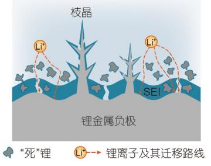
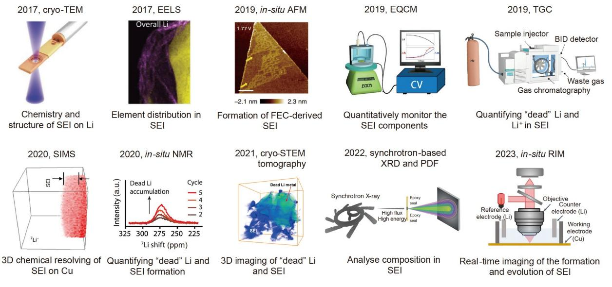
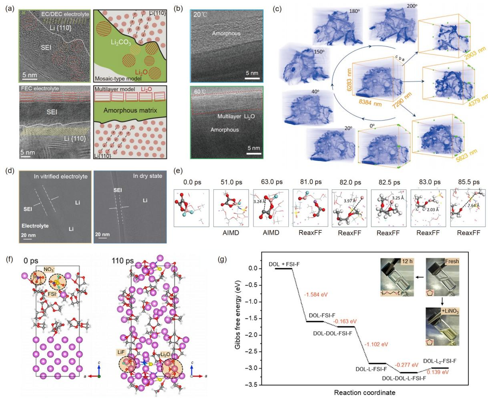
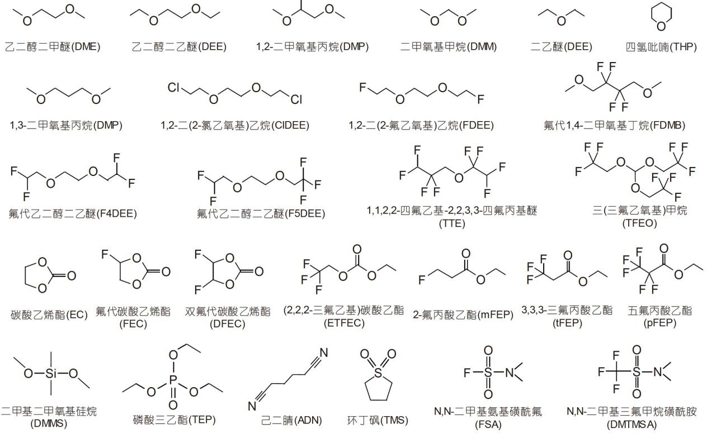
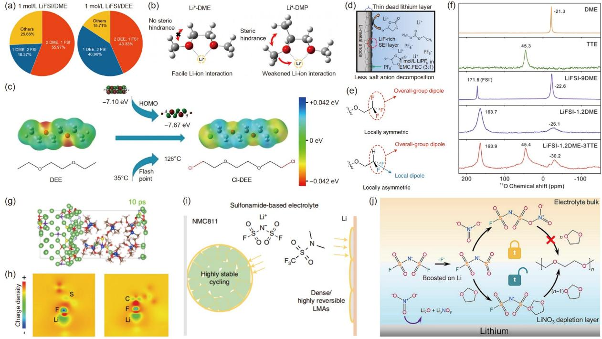
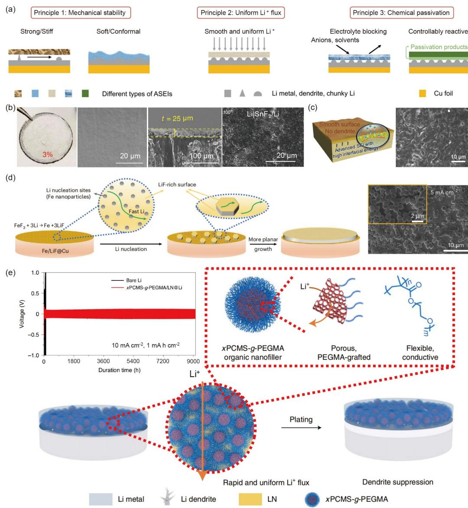
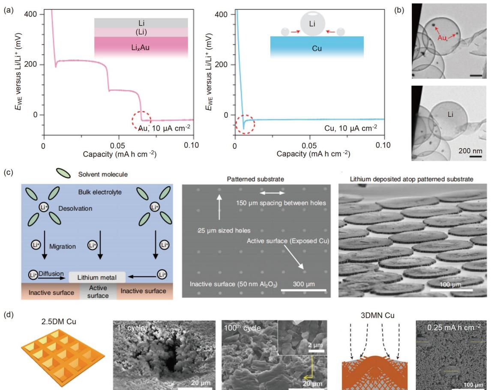
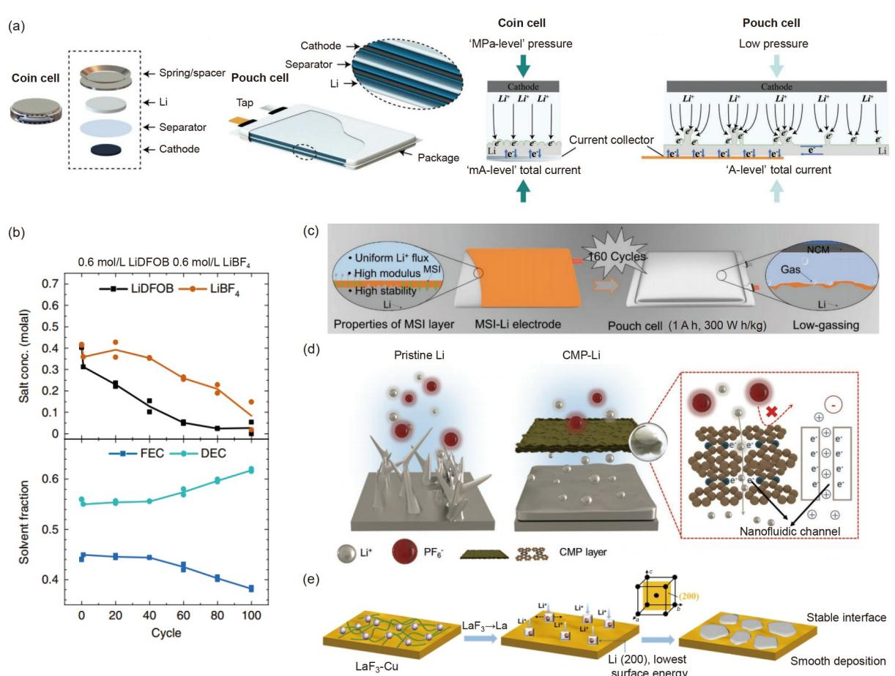

自然科学基金项目进展专栏 评 述

# 锂金属负极固体电解质界面膜的理解与改性策略

李宛峡[†](#page-0-0) , 李新鹏[†](#page-0-0) , 陈亚威, 揭育林, 曹瑞国, 焦淑红[\\*](#page-0-1)

中国科学技术大学化学与材料科学学院材料科学与工程系, 合肥 230026 † 同等贡献

\* 联系人, E-mail: jiaosh@ustc.edu.cn

2023-05-31 收稿, 2023-09-06 修回, 2023-09-18 接受, 2023-09-20 网络版发表 国家自然科学基金(52225105, 22279127)资助

摘要 锂金属负极因具有较高的比容量和较低的电极电势, 被认为是最有发展前景的电池负极材料之一. 然而, 不 稳定的锂金属负极固体电解质界面膜和严重的锂枝晶生长问题限制了锂金属负极的实际应用. 认识和理解锂金属 负极固体电解质界面膜的组成与结构, 并将其与锂金属生长行为建立有效的关联, 是解决锂金属负极不稳定问题 的关键. 本文综述了近年来有关锂金属负极固体电解质界面膜的表征技术和调控策略, 并介绍了锂金属软包电池 的界面研究现状. 本文对锂金属负极的实际应用具有一定的指导意义.

关键词 锂金属负极, 固体电解质界面膜, 锂金属枝晶, 锂金属电池

电动汽车领域的快速发展对电池体系的能量密度 和使用寿命提出了更高的要求. 目前, 电动汽车使用的 动力电池以锂(lithium, Li)离子电池为主. 锂离子电池 采用石墨作为负极, 在充放电过程中, 锂离子通过电解 液在正负极之间来回迁移, 并在正负极表面嵌入和脱嵌. 然而, 石墨负极的理论比容量较低(372 mA h g −1 ) [\[1\],](#page-12-0) 导 致锂离子电池的能量密度难以超过300 W h kg−1[\[2\],](#page-12-1) 限 制了未来电动汽车长续航里程的发展需求(>1000 km)[\[3](#page-12-2),[4\]](#page-12-3). 因此, 要实现能量密度的大幅提升, 必须开发新型电池 体系. 近年来, 具有更高能量密度的电池体系受到了广 泛的关注和研究, 如全固态锂金属电池[[5~](#page-12-4)[8](#page-12-5)]、锂硫电 池[\[9](#page-12-6)[~12](#page-12-7)]、锂氧电池[[13](#page-12-8)[~15](#page-13-0)]等. 这些高比能电池体系使用 锂金属作为负极, 是由于锂金属具有3860 mA h g −1 的 高理论比容量和较低的电化学电位(−3.04 V vs. 标准 氢电极) [\[16\]](#page-13-1). 当匹配高容量正极如富锂锰基材料时, 锂 金属电池可实现500 W h kg−1 的能量密度[\[17\]](#page-13-2), 而锂硫电 池则可实现600 W h kg−1 的能量密度[\[18\]](#page-13-3).

然而, 锂金属负极的实际应用仍面临着两个关键

难题: 不稳定的固体电解质界面膜(solid electrolyte interphase, SEI)的形成[\[19\]](#page-13-4)和锂金属的不均匀沉积/剥离过 程[\[20](#page-13-5)[,21\]](#page-13-6). 一方面, 因为锂金属具有较强的反应活性, 在 电池运行时会与电解液发生剧烈的化学和电化学反应, 所以在锂金属负极上会形成一层由氟化锂(LiF)、碳酸 锂(Li2CO3)、氧化锂(Li2O)等无机物和烷氧基碳酸锂 (ROCO2Li)等有机物组成的SEI[[22](#page-13-7)[,23\]](#page-13-8). 良好的SEI能够有 效钝化锂金属表面, 抑制锂金属负极与电解液的持续 副反应. 然而, 在传统碳酸酯电解液中形成的SEI机械 稳定性较差, 在充放电过程中会因为锂金属负极的剧 烈膨胀收缩而发生破裂, 导致活性锂的暴露和电解液 的持续消耗. 另一方面, 锂金属的不均匀沉积会导致严 重的锂枝晶生长, 这些锂枝晶通常具有较高的比表面 积, 将进一步加剧活性锂和电解液的消耗. 锂枝晶还极 易刺透隔膜连通电池正负极, 造成电池短路, 进而诱发 一系列安全问题. 此外, 锂金属的不均匀剥离行为会导 致部分活性锂与基底失去导电连接, 从而形成电化学 惰性的"死"锂, 造成电池可逆容量的损失, 导致锂金属

引用格式**:** 李宛峡, 李新鹏, 陈亚威, 等. 锂金属负极固体电解质界面膜的理解与改性策略. 科学通报, 2024, 69: 1298–1314 Li W X, Li X P, Chen Y W, et al. Understanding and modifying strategies for lithium metal anode solid electrolyte interphase (in Chinese). Chin Sci Bull, 2024, 69: 1298–1314, doi: [10.1360/TB-2023-0521](https://doi.org/[object XPathResult])

负极库仑效率和循环寿命的下降. 在锂沉积/剥离过程 中, 锂离子首先通过SEI, 进而在电解液和电极之间来 回迁移. 因此, SEI的组成和结构对锂的沉积/剥离行为 起着决定性作用([图](#page-1-0)1). 理解SEI的形成、演变过程和认 识SEI成分及结构与电池性能之间的关系是解决以上 问题的关键.

近年来, 多种新型表征和分析手段被用来研究锂 金属负极固体电解质界面膜, 使得人们对其组分与结 构有了初步的认识([图](#page-1-1)2). 2017年, Li等人[\[24\]](#page-13-9)通过冷冻电 子显微镜(cryo-electron microscopy, cryo-EM)观察了锂 金属和SEI在不同电解液体系中的原子级纳米结构. Han等人[\[25\]](#page-13-10)利用基于冷冻扫描透射电子显微镜(cryoscanning transmission electron microscopy, cryo-STEM) 的电子能量损失谱(electron energy loss spectroscopy, EELS), 得到了SEI中各元素的空间分布信息. 他们通 过分析氧化态和金属态锂元素的分布, 表征了SEI和锂 金属的分布情况. 此外, 气相色谱滴定(titration gas chromatography, TGC)[\[28\]](#page-13-11)等谱学方法可以实现对SEI中 特定组分的定量分析. 然而, 这些表征手段是在非原位 状态下进行的, 环境的变化可能会导致SEI中一些关键 信息的丢失. 相比之下, 原位表征手段如原子力显微镜 (atomic force microscopy, AFM)[\[26\]](#page-13-12)、二次离子质谱(sec-

[图](#page-1-0) **1** (网络版彩色)锂金属负极面临的关键问题 **[Figure](#page-1-0) 1** (Color online) The key issues of lithium metal anodes

ondary ion mass spectroscopy, SIMS)[\[29\]](#page-13-13)、核磁共振 (nuclear magnetic resonance, NMR)[[30](#page-13-14),[34](#page-13-15)]等, 能够在一定 程度上避免制样过程中的样品损伤, 并实现对电极界 面变化过程的原位观察. 然而, 目前发展的常规实验手 段在空间和时间分辨率上仍然有较大的局限性, 而且 难以通过单一的实验方法来解析复杂的界面反应机理 以及界面成分和结构. 理论计算的发展进一步推动了 研究者对电极界面的理解与认识. 例如密度泛函理论 (density functional theory, DFT), 可以对界面反应进行 模拟, 有助于理解界面形成机理; 分子动力学(molecular dynamics, MD)模拟可以预测界面锂离子传输路径; 利用机器学习(machine learning, ML)可以筛选实验方

[图](#page-1-1) **2** (网络版彩色)SEI的先进表征: 冷冻透射电子显微镜[\[24\]](#page-13-9)、电子能量损失谱[\[25\]](#page-13-10)、原位原子力显微镜[\[26\]](#page-13-12)、电化学石英晶体微天平[\[27\]](#page-13-16)、气相色 谱滴定[\[28\]](#page-13-11)、二次离子质谱[\[29\]](#page-13-13)、原位核磁共振[\[30\]](#page-13-14)、冷冻扫描透射电子显微镜断层扫描成像[\[31\]](#page-13-17)、基于同步加速器的X射线衍射和对分布函 数[\[32\]](#page-13-18)、原位反射干涉显微镜[\[33\]](#page-13-19). 1 ppm=1 μg/g

**[Figure](#page-1-1) 2** (Color online) Advanced characterizations of SEI: cryo-TE[M\[24\],](#page-13-9) EEL[S\[25\],](#page-13-10) *in-situ* AFM[\[26\],](#page-13-12) electrochemical quartz crystal microbalance (EQCM)[\[27\],](#page-13-16) TG[C\[28\]](#page-13-11), SIM[S\[29\],](#page-13-13) *in-situ* NM[R\[30\]](#page-13-14), cryo-STEM tomography[\[31\],](#page-13-17) synchrotron-based X-ray diffraction (XRD) and pair distribution function (PDF)[\[32\],](#page-13-18) and *in-situ* reflection interference microscopy (RIM)[\[33\].](#page-13-19) 1 ppm=1 μg/g

案, 简化实验过程. 理论计算与实验的紧密结合将是未 来高能量密度锂金属电池界面研究的重要手段与策略.

基于对锂金属负极固体电解质界面膜的认识和理 解, 锂金属负极界面稳定性提升的策略大致可以分为3 个方向: 电解液成分调控、人工SEI设计以及集流体结 构设计. 其中, 电解液成分调控是最直接高效的调控手 段. 通过改变电解液的组成和比例, 能够直接影响界面 反应过程, 进而改善SEI的成分和结构, 从而抑制活性 锂与电解液的持续消耗和锂枝晶的生长, 实现高库仑 效率和高循环寿命的锂金属负极.

本文以SEI结构组分调控为中心, 综述了近年来有 关认识锂金属负极固体电解质界面膜的表征技术, 对 解决锂金属负极关键问题的策略进行了分类总结, 并 从应用层面介绍了软包锂金属电池中界面稳定性的研 究进展, 最后对未来锂金属负极实用化进行了总结和 展望.

## **1** 锂金属负极固体电解质界面膜的理解

锂金属负极固体电解质界面膜是决定锂金属沉积 形貌的关键因素. 为了提高锂金属负极的库仑效率和 循环稳定性, 对于SEI成分和结构的表征至关重要. 然 而, SEI的厚度通常只有几到几十个纳米, 且在充放电 过程中还存在动态演变过程, 这对其精确的表征和分 析带来了极大的挑战. 近年来, 多种先进的表征技术被 应用到锂金属电池领域研究中, 使得人们对SEI有了初 步的了解. 其中, cryo-EM技术得到了广泛认可和应用. 与传统电子显微镜技术不同, cryo-EM技术在制样时对 样品进行超低温冷冻, 保证样品本身的结构不被破坏, 从而最大程度地实现无损检测. Li等人[\[24\]](#page-13-9)利用cryo-EM 研究发现, 在不同电解液中形成的SEI具有截然不同的 成分与结构. 在传统碳酸酯基(碳酸乙烯酯(EC)/碳酸二 乙酯(DEC))电解液中, Li2O和Li2CO3的晶粒(直径 ~3 nm)随机分散在SEI的非晶相中, SEI整体呈现出有 机/无机非均匀分布的马赛克(mosaic)结构. 而在电解 液中添加少量氟代碳酸乙烯酯(FEC)后, 观察到SEI呈 现多层结构([图](#page-3-0)3(a)), 内层为非晶聚合物基质, 外层为 锂氧化物的大晶粒(直径~15 nm). 上述结果表明, 锂金 属表面SEI的成分及结构差异可能是导致锂金属负极 循环性能差异的主要原因. Wang等人[\[35\]](#page-13-20)同样结合cryo-EM, 从原子尺度上揭示了锂金属负极在高温下循环性 能改善的原因. 在60°C下, 醚类电解液中形成的SEI呈 现多层结构, 且具有良好的机械稳定性, 能够抑制副反 应的持续发生, 从而实现了锂金属负极较低的界面阻 抗和较好的循环稳定性([图](#page-3-0)3(b)). Han等人[\[31\]](#page-13-17)利用cryo-STEM断层扫描成像技术对锂剥离后的SEI形貌进行了 三维重构. 结果显示, 当活性锂完全剥离后, SEI发生了 一定程度的皱缩和扭曲, 但仍保持着完整的框架结构 ([图](#page-3-0)3(c)), 说明SEI具有较好的稳定性, 保证了较高的锂 金属沉积/剥离库仑效率. 值得注意的是, 在上述结果 中, SEI样品在表征过程中往往脱离了原有的液态环 境, 导致其由"湿"态向"干"态转变, 这一转变可能影响 SEI的结构和特性, 导致实验结果与实际情况存在较大 的偏差. Zhang等人[\[36\]](#page-13-21)采用薄膜玻璃化方法, 在原有的 液态环境中直接对样品进行"冷冻", 得以锁住一些SEI 的敏感且关键的信息, 保证了实验结果最大程度接近 实际情况. 结果表明, SEI在电解液环境中均处于溶胀 状态([图](#page-3-0)3(d)), 并且在不同的电解液中形成的SEI在干态 时会出现不同程度的收缩, SEI在湿态和干态的溶胀比 取决于电解液的化学性质, 并且与锂金属负极的循环 性能密切相关. SEI的溶胀比越高, 说明在该电解液中 形成的SEI稳定性和锂金属的循环稳定性越差.

SEI的形成和演变过程伴随着复杂的化学和电化 学反应, 运用常规的实验手段理解界面反应机理具有 较大的困难. 随着计算机技术的飞速发展, 理论计算可 以在界面反应机理预测和界面设计方面提供理论指导. 与传统研究手段不同, 理论计算可以同时在时间尺度 和空间尺度实现对界面反应机理的推导, 因此逐渐成 为锂金属电池界面研究的重要辅助工具. 分子动力学 模拟对于理解电解液在锂金属负极表面的界面反应过 程具有重要意义. Liu等人[\[37\]](#page-13-22)应用从头算和反应力场 (hybrid *ab initio* and reactive force field methods, HAIR)方法模拟了在1 ns时间尺度内, 双三氟甲磺酰亚 胺锂(LiTFSI)/二氟草酸硼酸锂(LiDFOB)-乙二醇二甲 醚(DME)双盐电解液在锂金属表面的动态分解过程([图](#page-3-0) [3](#page-3-0)(e)). 结果显示, TFSI− 阴离子在15 ps时优先脱去一个 –CF3, 并进一步分解产生LiF和·NSO2CF3自由基, 抑制 DFOB− 阴离子的过度还原. 其次, DFOB− 阴离子分解释 放的B原子呈现缺电子状态, 会引发DME分子末端烷 基断裂, 从而引发DME聚合并形成具有交联结构的B-C聚合物. 这一模拟结果清晰地阐明了该体系中聚合型 SEI的形成过程. 本课题组[\[38\]](#page-13-23)应用基于量子力学的分子 动力学(quantum mechanics based molecular dynamics, QM-MD)方法模拟了双氟磺酰亚胺锂(LiFSI)/硝酸锂 (LiNO3)-1,3-二氧五环(DOL)电解液的界面分解过程.

[图](#page-3-0) **3** (网络版彩色)利用冷冻电子显微镜表征SEI的研究进展. (a) 在EC/DEC基电解液和FEC基电解液中分别形成的SEI的原子分辨率图像和示 意图[\[24\];](#page-13-9) (b) 用冷冻电子显微镜分别在20和60°C下观测到的SEI纳米结构分布图[\[35\];](#page-13-20) (c) 基于cryo-STEM断层扫描技术的锂剥离后SEI壳的三维重 构图像[\[31\];](#page-13-17) (d) 当SEI保持湿态或干态时, 锂枝晶上SEI的厚度变化[\[36\]](#page-13-21). SEI形成过程的理论计算: (e) 从头算分子动力学(AIMD)以及从头算和反应 力场混合(HAIR)模拟得到的DFOB− 和DME的分解图示[\[37\]](#page-13-22); (f) LiFSI/LiNO3-DOL电解液在0和110 ps下的HAIR-MD模拟图示[\[38\]](#page-13-23); (g) 利用DFT计 算FSI-F自由基引发DOL开环聚合的Gibbs自由能谱[\[38\]](#page-13-23)

**[Figure](#page-3-0) 3** (Color online) Advances in the characterization of SEI using cryo-EM. (a) The atomic-resolution images and the schematic of the SEI in EC/ DEC electrolyte and FEC electrolyt[e\[24\];](#page-13-9) (b) the distribution images of SEI nanostructures observed by cryo-EM at 20 and 60°C[\[35\];](#page-13-20) (c) the 3D reconstruction images of SEI husk after Li stripping based on cryo-STEM tomography[\[31\]](#page-13-17); (d) the thickness of SEI on Li metal dendrite in wet or dry state[\[36\]](#page-13-21). Theoretical calculations of SEI formation process: (e) The decomposition diagrams of DFOB− and DME obtained from *ab initio* molecular dynamics (AIMD) and HAIR simulations[\[37\];](#page-13-22) (f) HAIR-MD simulation diagram of LiFSI/LiNO3-DOL electrolyte at 0 and 110 ps[\[38\];](#page-13-23) (g) the Gibbs free energy profile of ring-opening polymerization of DOL initiated by FSI-F radicals (calculated by DFT)[\[38\]](#page-13-23)

计算发现, 在锂金属界面处, FSI− 中的一个S–F键容易 断裂, 形成一个F− 和一个FSO2NSO2·自由基(记为FSI-F), 紧接着NO3 − 中N–O和N=O键也在界面处迅速断裂, 形成Li2O和氮化锂(Li3N). 进一步利用HAIR方法延长 时间尺度, 发现FSI-F中N–S键发生裂解, 形成LiF和 Li2O. 在110 ps后, DOL发生开环过程并分解生成 Li2O、CO2、乙烯(C2H4)等([图](#page-3-0)3(f)). DFT计算结果 ([图](#page-3-0)3(g))显示, 电解液中的NO3 − 与FSI-F的结合能明显 强于DOL分子, 因此NO3 − 能够优先捕获FSI-F, 极大地 抑制体相中DOL的聚合; 而在界面处由于NO3 − 的分解 消耗, FSI-F将引发DOL聚合, 形成的聚合物-无机SEI 可以有效抑制锂枝晶的形成. 近年来, 机器学习方法开 始应用在锂电池领域[\[39](#page-13-24)~[42\]](#page-13-25). 机器学习在分析大量实验 结果和模拟数据方面具有天然优势, 可以帮助开发具 有更高精度、更大时间和空间尺度的电池界面反应机 制模拟, 避免了传统实验方法试错成本高、时间周期 长等问题. 同时, 机器学习在对电极材料开发、电解质 性能预测、电池状态预测方面具有广泛的应用前景, 为实验方案设计和筛选、简化实验过程提供了依据. 然而, 为了进一步发挥理论计算的效用, 仍需要将实验 与理论计算紧密地结合起来, 通过实验结果与计算结 果的交叉验证, 不断优化理论计算模型.

## **2** 锂金属负极关键问题和解决策略

#### **2.1** 先进电解液设计

电解液作为离子传输的媒介, 是电池的"血液". 在 锂金属电池中, 电解液与锂金属负极之间化学和电化 学反应耦合产生的SEI, 极大地影响着锂金属负极的循 环稳定性. 通过合理的电解液成分设计, 可以显著改变 锂离子(Li+ )的溶剂化结构, 进而调控SEI的成分和结构, 实现高库仑效率、长循环寿命的锂金属负极. 一些常 见溶剂以及先进溶剂的分子结构式如[图](#page-4-0)4所示.

#### 2.1.1 弱溶剂化电解液

弱溶剂化电解液(weakly solvating electrolytes, WSEs)是提高锂金属负极界面稳定性的一种有效策略. 在弱溶剂化电解液中, 溶剂溶解锂盐的能力较差, 因而 形成了阴离子主导的Li+ 溶剂化结构, 如接触离子对 (contact ion pairs, CIPs)、离子聚集体(aggregates, AGGs). 此时, 锂负极表面将以阴离子分解为主, 形成 富含无机物的SEI, 这有助于锂金属负极循环稳定性的 提升. 对比高浓电解液(high-concentration electrolytes, HCEs)和局部高浓电解液(localized high-concentration electrolytes, LHCEs)的策略, WSEs因溶剂本征的弱溶 剂化特性, 在较低的锂盐浓度下就能实现与HCEs和 LHCEs同等的稳定锂金属负极的效果, 可以较大地降 低电解液成本, 因而受到研究者的广泛关注. 目前, 新 型弱溶剂化电解液的设计主要针对溶剂分子的结构设 计及官能团取代.

以常见的醚类溶剂DME为例, 通过调控溶剂分子 的空间构型可以显著影响其与Li+ 的配位能力, 从而起 到调控SEI的成分和结构的效果. Chen等人[\[43\]](#page-13-26)报道了一

[图](#page-4-0) **4** 常见的锂金属电池电解液的溶剂分子结构式

**[Figure](#page-4-0) 4** Molecular structural formulas of solvents in the electrolytes of lithium metal batteries

种延长DME分子链末端烷基长度以增加空间位阻的分 子设计策略, 得到了具有弱溶剂化能力的乙二醇二乙 醚(DEE)分子. [图](#page-5-0)5(a)反映了DME和DEE两种溶剂与阴 离子的相对配位能力, 一共有3种可能的溶剂化结构, 分别是结构1(2个溶剂分子, 1个FSI− )、结构2(1个溶剂 分子, 2个FSI− )和结构3(其他). 在1 mol/L LiFSI-DME 电解液中, 结构1(55.97%)占比最大; 在1 mol/L LiFSI-DEE中结构1(43.33%)和结构2(40.96%)占据整体的极 大部分. 结果表明, 在Li+ 的内溶剂化鞘层中, DME与 Li+ 的配位程度比DEE强, 说明DEE的溶剂化能力弱于 DME. 因此, 具有由阴离子主导的溶剂化结构的DEE 基电解液在锂金属表面生成富含LiF、Li2O等无机物 的SEI, 极大地提升了锂金属负极的循环稳定性. Park等 人[\[44\]](#page-13-27)通过在DME分子上引入甲基官能团, 得到了具有 低介电常数的1,2-二甲氧基丙烷(DMP)分子. 相比于 DME分子, 甲基的引入增加了空间位阻, 削弱了DMP 分子的Li+ 溶剂化能力([图](#page-5-0)5(b)), 形成了阴离子主导的 Li+ 溶剂化结构, 进而形成了富含无机物的SEI, 显著抑 制了枝晶生长并提高了锂金属负极循环稳定性. 研究 表明, DME分子的强溶剂化作用来源于乙二醇中间段 和Li+ 配位时所形成的五元环结构. 破坏乙二醇中间段, 可以显著抑制其强溶剂化作用[\[45\]](#page-14-0). Ma等人[\[46\]](#page-14-1)开发了一 种基于二甲氧基甲烷(DMM)的弱溶剂化电解液. 由于 DMM分子中–O–C–O–中间段的构成, 其与Li+ 配位时

[图](#page-5-0) **5** (网络版彩色)先进电解液的设计思路与原理. 弱溶剂化电解液通过改变锂离子溶剂化结构调控界面性质. (a) MD模拟中1 mol/L LiFSI-DME和DEE电解液Li+ 内溶剂化鞘层的组成[\[43\].](#page-13-26) (b) DME和DMP与锂离子的相互作用示意图[\[44\]](#page-13-27). (c) DEE、ClDEE的分子静电势图和理论氧化 势[\[50\].](#page-14-2) 氟代溶剂通过调控SEI结构, 减少锂枝晶沉积. (d) FEC基电解液在锂负极表面形成富LiF的SEI[\[53\]](#page-14-3). (e) –CF3和–CHF2的空间构型和偶极子方 向[\[58\].](#page-14-4) (f) 不同溶剂和电解液的17O-NMR谱图[\[59\].](#page-14-5) 杂原子基电解液设计和界面调控. (g) 1.5 mol/L LiFSI-DMMS电解液在锂界面上的AIMD模拟 图[\[61\].](#page-14-6) (h) DFT计算得到的Li-FSA和Li-FEC的电荷密度差分图[\[67\]](#page-14-7). (i) 磺胺基电解液作用机理示意图[\[68\]](#page-14-8). 含硝酸锂添加剂电解液影响SEI成分. (j) SEI形成的"锁定与解锁"聚合机制[\[38\]](#page-13-23)

**[Figure](#page-5-0) 5** (Color online) Ideas and principles for designing advanced electrolytes. Weakly solvation electrolytes modulate the interfacial properties by changing the Li+ solvation structure. (a) Composition of the inner solvated shell layer of Li+ in 1 mol/L LiFSI-DME and DEE electrolytes from MD simulations[\[43\]](#page-13-26). (b) Schematic representation of the interaction of DME and DMP with Li[+\[44\].](#page-13-27) (c) Molecular electrostatic potential diagrams and theoretical oxidation potentials of DEE and ClDEE[\[50\].](#page-14-2) Fluorinated solvents reduce Li dendrite by regulating SEI structure. (d) The FEC based electrolyte forms a LiF-rich SEI layer on the surface of lithium metal anode[\[53\].](#page-14-3) (e) Spatial configuration and dipole direction of –CF3 and –CHF2 [\[58\]](#page-14-4). (f) 17O-NMR spectra of different solvents and electrolytes[\[59\]](#page-14-5). Design and interface regulation of heteroatom-based electrolytes. (g) AIMD simulation of 1.5 mol/L LiFSI-DMMS electrolyte at the lithium interfac[e\[61\].](#page-14-6) (h) Difference plot of charge density of Li-FSA and Li-FEC calculated by DFT[\[67\]](#page-14-7). (i) Schematic diagram of the mechanism of action of sulfonamide-based electrolytes[\[68\].](#page-14-8) LiNO3-based electrolytes affect SEI composition. (j) The ''locking and unlocking'' polymerization mechanism of the SEI formation[\[38\]](#page-13-23)

呈现出四元环结构, 计算显示, 该结构中Li–O键具有更 大的键长和更弱的结合能, 导致Li+ 和溶剂的配位较弱. Holoubek等人[\[47\]](#page-14-9)采用了具有单醚键的二乙醚(DEE)分 子, 由于螯合作用的缺失, 该分子呈现出较弱的溶剂化 能力和去溶剂化能垒, 保证了较好的界面去溶剂化动 力学, 实现了–40°C时高达99%的锂金属负极库仑效率. Zhang等人[\[48\]](#page-14-10)开发了具有单醚键的环状分子四氢吡喃 (THP), 该分子具有较大的极性, 呈现出较强的空间位 阻和较弱的溶剂化能力. Chen等人[\[49\]](#page-14-11)亦证明, 相比于五 元环结构, 六元环结构也呈现出弱配位的性质, 进而开 发了基于1,3-二甲氧基丙烷(DMP)的电解液, 实现了锂 金属负极的稳定循环. 对溶剂分子进行官能团取代能 够显著改变其溶剂化能力, 如氟代、氯(Cl)代等. Tan等 人[\[50\]](#page-14-2)和Ruan等人[\[51\]](#page-14-12)对DEE分子末端乙基上的H分别进 行了F取代和Cl取代. 由于F和Cl均具有较强的电负性, 能够显著调控溶剂分子的电子云分布情况, 因此F和Cl 的引入影响了DEE与锂离子的配位能力, 得到了FDEE 和ClDEE分子. 此外, 这两种溶剂均具有较强的氧化稳 定性([图](#page-5-0)5(c)), 能够促进锂金属电池循环稳定性的提升.

#### 2.1.2 氟代电解液

氟代电解液一直是锂电池电解液领域的研究热点. 常用的锂盐包括六氟磷酸锂(LiPF6)、LiFSI等. 在电解 液中, 这些锂盐分子上的氟原子均以阴离子的形式存 在, 并参与电极界面的反应过程, 形成含有LiF的界面 层. LiF具有优异的物理化学稳定性、机械稳定性以及 较高的Li+ 迁移率, 在电解液中具有较低的溶解度, 并且 能够诱导Li+ 的均匀沉积[\[52\],](#page-14-13) 从而提高锂金属负极的循 环性能. 相较于设计新型含氟锂盐分子, 氟化溶剂分子 的设计与合成更加简单高效, 并且对锂金属负极钝化 及保护效果更为显著. 研究者通过调控溶剂分子的氟 化位点和氟化程度, 得到了具有不同物化性质的氟化 溶剂分子.

由于氟原子具有较强的吸电子作用, 对溶剂分子 进行氟取代后, 溶剂分子溶解锂盐的能力会显著下降. 如果合理调控氟化溶剂的氟化程度, 在电解液中将形 成由阴离子主导的Li+ 溶剂化结构, 此时在锂负极表面 将以阴离子的分解为主, 形成富含LiF等无机物的SEI. 这类氟代溶剂的作用机理和弱溶剂化溶剂相同, 可以 将该部分氟代溶剂看作弱溶剂化溶剂的一种. 因有大 量针对这类氟代溶剂开展的实验研究, 所以本节对该 部分氟代溶剂进行专门的介绍. 将碳酸酯类溶剂如EC 中的氢原子替换成氟原子, 可以得到FEC、双氟代碳 酸乙烯酯(DFEC)等氟代溶剂分子. 不同于EC, FEC和 DFEC能够在锂金属表面诱导形成一层富含无机物的 稳定SEI([图](#page-5-0)5(d))[\[53\],](#page-14-3) 有效抑制了电解液在电极表面的 副反应[\[54](#page-14-14)[,55\]](#page-14-15). Zhang等人[\[56\]](#page-14-16)通过MD模拟发现, (2,2,2-三 氟乙基)碳酸乙酯(ETFEC)能够优化Li+ 的溶剂化结构, 使得更多阴离子参与Li+ 溶剂化鞘层, 有利于富LiF界面 的形成. 基于该链状氟代碳酸酯溶剂的全氟电解液成 功提升了锂金属负极的循环性能. Mao等人[\[57\]](#page-14-17)以丙酸 乙酯(EP)为基础, 研究了基于不同氟代程度溶剂的电 解液对锂金属负极循环性能的影响. 结果显示, 由于氟 代程度的增加, 2-氟丙酸乙酯(mFEP)、3,3,3-三氟丙酸 乙酯(tFEP)以及五氟丙酸乙酯(pFEP)三种氟代酯的溶 剂化能力呈现下降的趋势. 尽管在电解液中, 它们均能 诱导富阴离子溶剂化结构和富LiF界面层的形成, 但是 随着氟代程度增加, 电解液的离子电导率被削减, 这影 响了Li+ 的离子传输. 综合结果显示, 基于中等程度氟代 的tFEP全氟电解液呈现出最优的锂金属负极电化学性 能. 以醚类溶剂为例, Yu等人[\[45\]](#page-14-0)以DME分子为基础, 在 主链上修饰了两个–CF2–基团, 得到了氟代1,4-二甲氧 基丁烷(FDMB)分子. MD模拟结果显示, 与DME基电 解液(2.31:1)对比, FDMB基电解液中的Li+ 溶剂化鞘层 具有更高的阴离子/溶剂比(3.29:1), 富阴离子的溶剂化 结构促进了均匀且整体非晶SEI的形成, 因此, FDMB基 电解液的锂金属沉积形貌呈现出紧密排列的扁平状, 实现了高达99.53%的库仑效率. Yu等人[\[58\]](#page-14-4)进一步系统 地研究了氟代醚溶剂的氟原子数量和氟代位点对锂金 属负极循环稳定性、电解液氧化稳定性和离子电导率 的影响. 结果显示, 比较被部分氟化的–CHF2基团取代 的氟代溶剂(F4DEE)和被全氟化–CF3基团取代的氟代 溶剂(F5DEE), 前者配备的氟代电解液具有更高的离子 电导性和优异的稳定性. 这是由于–CHF2基团中的局部 偶极作用增加了溶剂分子极性([图](#page-5-0)5(e)), 不仅保证了一 定程度的溶剂化能力, 还提高了电解液的离子电导率. 分别配备1.2 mol/L LiFSI-F4DEE和1.2 mol/L LiFSI-F5DEE电解液, 经过锂铜电池的测试发现, 锂金属负极 的平均库仑效率能够达到99.9%, 并且第2圈循环的库 仑效率就能达到99.3%.

此外, 高度氟化的溶剂分子如1,1,2,2-四氟乙基-2,2,3,3-四氟丙基醚(TTE)等具有较弱的极性, 几乎不参 与溶剂化结构, 这种溶剂常用作稀释剂添加到HCEs中, 不仅可以降低电解液的黏度, 还可以提高电解液的离 子电导率, 此时得到的电解液即为LHCEs. Ren等人[\[59\]](#page-14-5) 报道了一种先进的LHCE(1LiFSI-1.2DME-3TTE(摩尔 比)). 与HCE(1LiFSI-1.2DME(摩尔比))相比, 17O的核磁 结果显示, LHCE中的TTE不会进入Li+ 的溶剂化鞘层, 因而不会改变原HCE的Li+ 溶剂化鞘层中Li+ 与FSI− 的 相互作用形式([图](#page-5-0)5(f)). 该LHCE与锂金属负极具有更好 的兼容性, 得到了99.3%的平均库仑效率. Cao等人[\[60\]](#page-14-18)报 道了一种基于三(三氟乙氧基)甲烷(TFEO)稀释剂的 LHCE(1LiFSI-1.2DME-3TFEO(摩尔比)), cryo-EM结果 显示, 在该电解液中, 锂金属负极表面形成了具有一体 式非晶结构的SEI. 该SEI显著地提高了锂金属负极界 面稳定性, 能够有效抑制锂枝晶生长. 然而, 高度氟代 的稀释剂对SEI形成的影响尚未有一个清晰的解释.

2.1.3 杂原子基电解液

杂原子基溶剂已被广泛证明其在提高锂金属电池 循环稳定性和安全性方面的积极作用. 硅氧烷类溶剂 中的Si–O键具有较高的化学稳定性, 因此其与锂金属 负极之间的副反应较弱, 有利于稳定锂金属负极. 此 外, Si的3d轨道能够参与Si–O共轭, 并显著提高溶剂的 抗氧化能力, 具有较好的高电压锂金属电池应用前景. Huang等人[\[61\]](#page-14-6)用Si–O键取代醚分子中的C–O键, 获得了 具有较小静电势的二甲基二甲氧基硅烷(DMMS)溶剂. 在低盐浓度下, 基于DMMS的电解液呈现出阴离子分 解为主导的界面分解动力学, 构筑了富含LiF和Li2O的 SEI([图](#page-5-0)5(g)), 能够显著抑制锂枝晶生长, 并实现了高达 99.8%的库仑效率.

除此之外, 含磷、氮、硫等杂原子的溶剂也被广 泛报道. 其中, 磷基溶剂具有优异的阻燃性质, 可以显 著提升锂金属电池的安全性. 磷基溶剂如磷酸三乙酯 (TEP)[[62](#page-14-19),[63](#page-14-20)]、氮基溶剂如己二腈(ADN)[\[64\]](#page-14-21)、硫基溶剂如 环丁砜(TMS)[\[65](#page-14-22)[,66\]](#page-14-23)等, 这些溶剂通常具有较低的HOMO 能级和LUMO能级, 一般作为稳定正极的添加剂使用, 而与锂金属负极的兼容性较差, 存在严重的界面副反 应, 因此在电解液中, 它们的添加量往往受到限制. 近 年来, LHCEs策略的发展使得这些溶剂在锂金属电池 中的应用空间大为提升, 不仅能够稳定高电压正极, 同 时和锂金属之间的反应活性得到了有效的降低. 此外, 这些电解液能够在锂金属负极表面生成富含磷、氮或 硫等成分的SEI, 能够有效抑制锂枝晶生长并提高锂金 属负极循环的稳定性.

分子结构设计能够显著提高杂原子基溶剂与锂金 属负极的兼容性. Xue等人[[67,](#page-14-7)[68](#page-14-8)]分别将FSI− 和TFSI− 阴 离子的有效结构移植到溶剂分子上, 设计了两种含氟 磺酰胺溶剂: N,N-二甲基氨基磺酰氟(FSA)和N,N-二甲 基三氟甲烷磺酰胺(DMTMSA). 当FEC和FSA分子分别 锚定在锂表面后, FEC中F–C键的相互作用力仍很强, 而FSA中F–S键的相互作用明显减弱, 这说明FSA中的 F容易脱落并形成LiF([图](#page-5-0)5(h)). 得益于稳定的SEI, 即便 在低盐浓度电解液中, 这两种磺酰胺溶剂仍然能够实 现致密均匀的锂沉积形貌以及高度可逆的锂金属负极 ([图](#page-5-0)5(i)).

2.1.4 含硝酸锂添加剂电解液

硝酸锂被认为是锂金属电池电解液中最有效的添 加剂之一. NO3 − 参与到锂离子溶剂化结构中, 能够在负 极表面发生原位分解, 形成Li*x*N、LiN*x*O*y*、Li2O等无机 产物, 极大地改善锂金属沉积/剥离行为, 从而实现锂金 属负极的高库仑效率[\[69\].](#page-14-24) 硝酸锂在醚基电解液中具有 较高的溶解度, 可以在改善负极性能的同时提升醚基 电解液的高电压稳定性[\[70](#page-14-25)[,71\]](#page-14-26). 然而, 常见的碳酸酯类溶 剂因具有较小的古特曼给体数, 碱性较弱, 难以将硝酸 锂解离. 因此, 硝酸锂在碳酸酯类溶剂中的溶解度较低, 无法发挥其作用[\[72\].](#page-14-27) 本课题组[\[73\]](#page-15-0)运用共溶剂策略, 采用 高供体数溶剂γ-丁内酯(GBL)成功地将硝酸锂添加剂 引入到碳酸酯基电解液中. 结果表明, 硝酸锂在电解液 中会优先分解, 产生富含Li2O和Li3N的界面层, 从而实 现无锂枝晶沉积, 实现了高达98.8%的库仑效率.

硝酸锂不仅作为有益的成膜添加剂, 也是调控界 面可控聚合的重要阻聚剂. 本课题组[\[38\]](#page-13-23)采用DOL作为 溶剂, 通过界面原位聚合的策略, 实现了高锂金属库仑 效率(99.73%). 在电解液中, 大量存在的硝酸锂能够抑 制DOL的聚合, 从而维持电解液的高电导率; 在锂金属 界面, 因硝酸锂的持续消耗, 使得DOL的聚合启动, 最 终形成有机-无机复合SEI. 这种原位构筑的富含高聚物 的SEI([图](#page-5-0)5(j))具有极高的拉伸强度, 可以抑制锂枝晶的 产生并实现高库仑效率. 另外, 我们对文献中先进电解 液的配方和对应的锂金属负极循环性能在表S1进行了 总结.

#### **2.2** 人工**SEI**设计

基于对SEI的成分与结构的认识, 为了进一步解决 锂金属负极与电解液化学和电化学反应形成的SEI均 匀性、循环稳定性较差等问题, 人们提出设计人工SEI 的策略. 该策略通过人为设计SEI的组成和结构, 使得 SEI具有特定的物理与化学性质, 进而有效地保护锂金 属负极. Yu等人[\[74\]](#page-15-1)认为, 一个理想的人工SEI应满足以 下3个关键要素: (1) 具有高机械稳定性; (2) 具有平稳并 且均匀的锂离子传输能力; (3) 具有化学惰性, 以减轻 锂金属与电解液之间的副反应([图](#page-8-0)6(a)). 目前, 人工SEI 的设计思路大致分为3种方向: 一是无机人工SEI, 这类 人工SEI富含无机颗粒, 因此具有较高的机械强度, 可 以有效抑制锂枝晶的形成; 二是聚合物人工SEI, 聚合 物的柔韧性较好, 可以适应电极的体积变化, 能够提升 循环稳定性; 三是无机-聚合物复合型人工SEI, 无机物 和有机物的结合可以实现优势互补, 可以进一步调控 锂负极的生长形态, 稳定锂金属负极.

一些含锂无机化合物, 如LiF[\[75\]](#page-15-2)、Li2O[[76~](#page-15-3)[78\]](#page-15-4)、 Li3N[[79](#page-15-5)[,80](#page-15-6)]等, 已被证明对锂金属负极具有良好的保护

[图](#page-8-0) **6** (网络版彩色)人工SEI修饰得到稳定锂金属负极. (a) 一个成功的人工SEI应具有的3个关键要素[\[74\]](#page-15-1). (b) SnF2与锂反应后, 锂表面形成的人 工SEI的光学图和SEM图像. 锂对称电池循环100圈后沉积锂的SEM图像[\[81\].](#page-15-7) (c) 富SrF2的SEI因其高界面能诱导平滑锂沉积[\[82\].](#page-15-8) (d) Fe/LiF人工 SEI在高电流密度下实现无枝晶沉积[\[83\].](#page-15-9) (e) 全有机人工SEI的结构和锂沉积行为示意图及锂对称电池长循环性能图[\[84\]](#page-15-10)

**[Figure](#page-8-0) 6** (Color online) Stable Li metal anode is obtained by artificial SEI modification. (a) The three key properties of a successful artificial SEI[\[74\]](#page-15-1). (b) Optical and SEM images of artificial SEIs formed on the Li surface after the reaction of SnF2 with Li. SEM images of Li metal after 100 cycles in Li||Li cell[s\[81\].](#page-15-7) (c) The SEI rich in SrF2 can induce smooth Li deposition due to its high interfacial energ[y\[82\].](#page-15-8) (d) The Fe/LiF artificial SEI layer achieves dendrite-free deposition at high current densit[y\[83\].](#page-15-9) (e) Schematic of the structure of the all-organic SEI layer and Li plating behaviour and the long cycle performance of Li||Li cell[\[84\]](#page-15-10)

作用. 它们在电解液中具有较低的溶解度和优异的化 学、机械稳定性, 能够调节锂金属表面的界面能以抑 制锂枝晶的形成, 从而实现较高的锂负极库仑效率. Pathak等人[\[81\]](#page-15-7)将氟化锡(SnF2 )直接混合在1 mol/L LiPF6-EC/DEC(1/1体积比)电解液中, 并将该电解液直 接滴在锂金属表面, 观察到锂表面由银色金属光泽迅 速变为深灰色, 干燥后呈现白色. 形成的人工SEI由 LiF、Sn和Sn-Li合金组成, 不仅保证了锂离子的快速 扩散, 抑制锂枝晶的生长, 还能通过可逆的Sn-Li合金 同时实现锂存储和底部镀锂([图](#page-8-0)6(b)). Liu等人[\[82\]](#page-15-8)通过 高温合成Sr-Li合金, 再将合金浸泡在2 mol/L LiFSI-DME中, 即在表面形成富含氟化锶(SrF2)、LiF的人工 SEI([图](#page-8-0)6(c)). 该界面层在不同电荷状态(stage of charge, SOC)下均能保持稳定, 且与锂金属之间的界面能相差 较大, 显著抑制了枝晶的形成. Wu等人[\[83\]](#page-15-9)利用热蒸镀 法在铜上获得一层200~300 nm的氟化铁(FeF3), 其和锂 的反应能够原位形成一层富含LiF和纳米级Fe颗粒的 SEI, LiF帮助实现快速锂传输, Fe位点则诱导锂均匀成 核, 在高电流密度下实现致密锂沉积([图](#page-8-0)6(d)).

聚合物人工SEI有良好的柔韧性, 能够通过机械拉 伸以适应锂金属负极的体积变化, 从而实现无枝晶锂 生长. Li等人[\[84\]](#page-15-10)报道了一种全有机保护层. 他们将一种 合成纳米球(*x*PCMS-*g*-PEGMA)作为纳米有机填料, 与 单离子导电的锂化Nafion(LN)有效复合, 获得了坚固并 且具有结构完整性的全有机人工保护膜. [如图](#page-8-0)6(e)所 示, 纳米球内部的刚性超交联骨架多孔*x*PCMS和外部 柔软的PEGMA链均可以显著提高LN膜的机械稳定 性, 同时提供充足的离子扩散通道, 实现高Li+ 迁移数. 在高电流密度和大面容量的测试条件下, 使用该膜组 装的Li对称电池实现了长达1年的稳定锂沉积/剥离 循环.

#### **2.3** 集流体设计

集流体的结构设计也被认为是有效抑制锂枝晶、 提升锂金属负极库仑效率的策略之一. 理想的集流体 应具备以下特征: (1) 良好的机械稳定性和导电性; (2) 具有化学稳定性, 避免与电池其他组分发生化学反应. 尽管锂枝晶的生长在热力学角度上无法避免, 但是, 可 以通过合理设计集流体从动力学方面改变锂金属的成 核生长行为, 从而抑制锂枝晶的生长.

亲锂位点可以诱导锂在集流体上均匀成核, 诱使 锂金属呈二维平面生长, 从而提高库仑效率. Yan等 人[\[85\]](#page-15-11)选用了11种常见的基底元素(铂、铝、镁、锌、 银、金(Au)、硅、锡、碳、镍、铜(Cu)), 对锂在其上 的成核生长行为进行了系统性研究. 结合不同元素和 锂的二元相图, 研究发现, 锂在金、银等可以与锂形成 合金的基底元素上的成核势垒较小; 而在不能与锂形 成合金的基底如铜上, 锂的成核势垒较大([图](#page-10-0)7(a)). 基 于此, 该工作创新性地设计了一种内侧均匀分布金纳 米颗粒的空心碳球, 将其作为负极集流体. 在锂沉积过 程中, 锂金属生长在空心碳球内部([图](#page-10-0)7(b)). 这种空心碳 球既阻止了锂金属的枝晶生长, 也限制了锂的体积膨 胀. 该策略使得锂金属负极在碳酸酯电解液中能够稳 定循环300周, 平均库仑效率高达98%. Oyakhire等人[\[86\]](#page-15-12) 发现, 锂金属的成核行为与集流体的电阻密切相关, 如 [图](#page-10-0)7(c)所示, 在低电阻集流体上, 锂倾向于以高比表面 积的形态进行沉积; 而在高电阻材料修饰的集流体上, 由于电阻大的位置电荷转移势垒较大, 限制了锂的形 核位置, 因此锂倾向于以低比表面积的形态沉积.

将集流体由二维平面向三维框架转变, 即设计三 维集流体, 可以增大电解液与集流体之间的接触面积, 均匀Li+ 流, 从而起到抑制锂枝晶的生长以及减缓锂金 属体积膨胀的作用. Yang等人[\[87\]](#page-15-13)设计了具有2.5维微结 构(2.5-dimensional microstructure, 2.5DM)的铜基集流 体, 其独特的微观结构能够使锂金属在沉积时溶聚, 即 使在长时间循环后也可以诱导致密的锂沉积. 他们进 一步利用电沉积方法在商用铜网上沉积了铜纳米棒来 增加铜网的分层结构, 增大的比表面积有效降低了电 流密度, 可以发现锂均匀沉积在铜纳米棒上, 不仅有效 减缓了循环过程中锂负极的体积膨胀, 而且减少了死 锂的产生, 提高了锂金属负极的库仑效率([图](#page-10-0)7(d)).

## **3** 软包电池中锂金属负极固体电解质界面膜 研究现状

锂金属电池的研发涉及各种容量级别, 包括实验 室研究的扣式电池(<0.01 A h)、面向实际应用的软包 和柱状电池(0.01~10 A h)以及已见诸报道的原型电池 (>100 A h). 然而, 目前对锂金属负极失效机理和界面 稳定性提升的研究多聚焦在容量尺度较小的扣式电池 中, 在软包电池中的研究鲜有报道. 由于软包电池使用 铝制软包装壳, 电池包的初始压力较小, 因此锂金属生 长易呈现疏松多孔的趋势, 这将加速电解液消耗和副 反应产物生成, 导致电池动力学下降和容量快速衰减, 最终造成电池失效([图](#page-11-0)8(a))[\[88\].](#page-15-14) 同时, 在外部压力较小

[图](#page-10-0) **7** (网络版彩色)集流体的改性设计. (a) 在金和铜基底上沉积锂的电压-容量曲线. *E*WE指工作电极的电势[\[85\].](#page-15-11) (b) 含金碳壳内锂沉积过程的原 位TEM图[\[85\]](#page-15-11). (c) 在高电阻基底上锂金属沉积机理示意图及沉积0.5 mA h cm−2 锂后的SEM图像[\[86\]](#page-15-12). (d) 2.5维微结构铜基底和3维微-纳米结构纳 米棒铜网基底上锂沉积/剥离的SEM图像[\[87\]](#page-15-13)

**[Figure](#page-10-0) 7** (Color online) Modified design of current collectors. (a) Voltage-capacity profiles of galvanostatic Li deposition on gold and copper substrates. *E*WE refers to the potential of the working electrod[e\[85\].](#page-15-11) (b) *In-situ* TEM images of the Li deposition process inside carbon shells with Au nanoparticle[s\[85\]](#page-15-11). (c) Illustration of lithium metal deposition on a high resistive substrate and SEM image of 0.5 mA h cm−2 Li depositio[n\[86\].](#page-15-12) (d) SEM images of Li platting/stripping behavior on 2.5DM Cu and 3-dimensional micro and nanostructured (3DMN) Cu substrates[\[87\]](#page-15-13)

时, 锂金属易生长出枝晶, 极易穿透隔膜并造成电池短 路, 导致电池热失控, 甚至引发爆炸等安全事故. 通过 调控界面成分结构和锂金属沉积生长行为, 可以显著 提高锂金属软包电池的安全性. 电解液调控是提升锂 金属软包电池循环稳定性和能量密度的有效策略.

目前, 先进电解液的开发普遍使用一定量的低介 电常数溶剂充当稀释剂以调节电解液的黏度和离子电 导, 即LHCEs. 其独特的溶剂化结构提升了电解液与电 极之间的兼容性, 从而有效提高了锂金属软包电池的 循环稳定性. Niu等人[\[63\]](#page-14-20)于2019年报道了一种LHCE (LiFSI-TEP/BTFE), 其有效抑制了在Li/LiNi0.6Mn0.2- Co0.2O2(NMC622)软包电池(1 A h)正负极界面的不可 逆消耗, 且具有较好的氧化稳定性. 在电解液用量和正 极容量比值(electrolyte amout to cathode capacity ratio, E/C ratio)即E/C比为3 g A h−1 的条件下, 实现了 >300 W h kg−1 的能量密度以及超过200圈的稳定循环. 在后续研究中, 其团队优化了参数条件, 使用具有更高 比容量的LiNi0.8Mn0.1Co0.1O2(NMC811)正极、更薄的 锂箔(20 μm)以及<2 g A h −1 的E/C比, 并使用更高效的 1LiFSI-1.2DME-3TTE(摩尔比)电解液, 实现了具有 360 W h kg−1 能量密度的锂金属软包电池(2 A h), 并能 够实现600圈的稳定循环[\[89\]](#page-15-15). 在电池循环过程中, 电解 液的成分和分布会经历复杂的演变, 且伴随着动态的 界面反应过程. 因此, 明确循环过程中电解液成分的演 变过程, 对于帮助理解界面反应和设计高性能电解液 配方至关重要. Niu等人[\[63\]](#page-14-20)研究了改变E/C比对Li/

[图](#page-11-0) **8** (网络版彩色)软包锂金属电池中界面问题及改性策略. (a) 纽扣电池和软包电池结构的比较[\[88\].](#page-15-14) (b) 电解液成分在锂金属软包电池循环过 程中的消耗分解[\[91\].](#page-15-17) (c) MSI-Li组装的软包电池界面稳定且产气少[\[92\]](#page-15-18). (d) 有无CMP层的锂沉积过程及CMP纳米流控通道中锂离子的选择性运 输示意图[\[93\].](#page-15-19) (e) 在LaF3-Cu电极上镀锂的示意图[\[94\]](#page-15-20)

**[Figure](#page-11-0) 8** (Color online) Interface issues and modification strategies in Li metal pouch cells. (a) Comparison of the structure of coin cell and pouch cell[\[88\]](#page-15-14). (b) Electrolyte components consumption of Li metal pouch cell during cyclin[g\[91\].](#page-15-17) (c) The pouch cell assembled with MSI-Li has a stable interface and low gas production[\[92\].](#page-15-18) (d) Schematic of the Li deposition process with or without a CMP layer and the selective transport of Li+ in the CMP nanofluidic channel[\[93\]](#page-15-19). (e) Schematic diagram of Li plating on LaF3-Cu electrod[e\[94\]](#page-15-20)

NMC622锂金属软包电池循环性能的影响. 结果显示, 当E/C比为3 g A h −1 时, 锂金属软包电池仅能维持12圈 的稳定循环; 而当E/C比增加到6 g A h −1 时, 循环15圈 后容量开始缓慢降低. 此外, 在E/C比为3 g A h −1 情况 下, 在已经接近零容量的电池中重新注入电解液后, 可 以恢复~50%的容量, 这说明由于电解液耗尽导致的界 面动力学恶化是锂金属软包电池失效的主要机制. 由 于循环后的锂金属呈现出疏松多孔的形貌, 空隙间电 解液的耗尽将会导致SEI逐渐干燥且具有较高的电阻, 严重阻碍离子传输, 从而导致电池失效. Dahn团队[\[90](#page-15-16)[,91](#page-15-17)] 借助NMR技术, 揭示了基于LiDFOB和四氟硼酸锂 (LiBF4)的双盐电解液在软包电池中循环前后的成分变 化. 结果表明, 相比于溶剂的消耗, 锂盐的消耗更为严 重, 造成了循环容量的急剧下降, 这表明电池失效更多 与锂盐的消耗有关. 通过正负极拆分分析显示, 锂盐在 锂金属负极侧的消耗速率要显著高于正极侧([图](#page-11-0)8(b)). 这说明, 锂金属软包电池的失效主要受制于锂盐在锂 金属负极侧的快速消耗.

对锂金属进行预处理形成一层人工界面层, 也可 以有效提升锂金属负极的循环稳定性. 相比于电解液 分解产生的SEI, 人工界面层能够减轻电解液与锂金属 直接接触的消耗, 而且其化学成分更加均匀且简单, 有 助于均匀Li+ 传输并抑制锂枝晶生长. Gao等人[\[92\]](#page-15-18)通过 将锂金属直接浸润在原硅酸四乙酯溶液中, 在锂表面 形成了一层由有机硅烷和无机Li*x*SiO*y*组成的多功能硅 烷化薄膜(multifunctional silanization interface, MSI). 该 薄膜能够促进更快、更均匀的Li+ 传输([图](#page-11-0)8(c)), 在 3.38 mA h cm−2 正极面容量、50 μm薄锂、E/C比为 2.7 g A h −1 的条件下, 实现了300 W h kg−1 能量密度的 Li/LiNi0.5Mn0.3Co0.2O2(NMC532)锂金属软包电池 (1 A h). Zhang等人[\[93\]](#page-15-19)在锂金属负极表面修饰了一层具 有二维纳米片结构的共轭微孔聚合物(conjugated microporous thermosetting polymer, CMP), 该CMP可以进 一步转化为具有纳米通道的界面膜, 能够有效抑制锂 枝晶的生长([图](#page-11-0)8(d)), 在4 mA h cm−2 正极面容量、 50 μm薄锂、E/C比为2.5 g A h −1 的条件下实现了>400 W h kg−1 能量密度的Li/NMC811软包电池(10 A h). Zhang等人[\[94\]](#page-15-20)报道了通过镧(La)掺杂的方法调控锂金 属生长取向, 实现了锂金属的二维平面沉积([图](#page-11-0)8(e)). La 掺杂降低了锂金属负极和电解液之间的反应性, 提升了 界面的循环稳定性. 该掺杂层的应用在5.77 mA h cm−2 正极面容量、50 μm薄锂、E/C比为1.76 g A h −1 的条件 下实现了>425 W h kg−1 能量密度的锂金属软包电池 (3.1 A h).

## **4** 总结与展望

实现高能量密度锂金属电池的商业应用是动力能 源领域的目标之一, 但是锂金属负极严重的界面问题 阻碍了其实际应用. 锂金属负极固体电解质界面膜是 影响锂金属成核生长行为的关键因素. 认识和理解界 面组成、结构以及形成过程, 合理调控界面组成结构 以实现稳定锂金属负极, 是未来储能领域的研究重点. 本文综述了近年来有关锂金属负极固体电解质界面膜 的理解和改性策略的进展, 对于锂金属负极固体电解 质界面膜的认识与理解有重要意义.

为解决锂金属负极的关键问题, 在锂金属电池的 研究过程中, 需关注以下问题: (1) 目前, 我们对SEI的 组成、结构、离子和电子电导特性、机械性能等特征 以及SEI形成机理的认识依然有限. 未来的研究需注重 解析SEI特性以及其对锂成核生长行为的影响. (2) 锂 金属电池电解液的成分对SEI的成分和结构有直接影 响, 应在分子水平上更合理地设计电解液的锂盐、溶 剂和添加剂, 从而提高锂金属负极的界面稳定性. 同时 应面向实际应用需求, 保证电解液在高低温环境、高 电压下的使用稳定性及安全性. (3) 运用多种界面稳定 手段协同调控锂金属负极稳定性, 如人工SEI设计、集 流体结构设计、隔膜修饰等. (4) 锂金属电池在实验室 的测试应限制在实际应用参数范围, 如高载量正极 (>4 mA h cm−2 )、低负极使用量(<50 μm)以及低E/C比 (<3 g A h −1 )等严苛条件.

## 参考文献

- 1 Zhang H, Eshetu G G, Judez X, et al. Electrolyte additives for lithium metal anodes and rechargeable lithium metal batteries: Progress and perspectives. [Angew](https://doi.org/10.1002/anie.201712702) Chem Int Edit, 2018, 57: 15002–15027
- 2 Wu Y, Xie L, Ming H, et al. An empirical model for the design of batteries with high energy density. ACS [Energy](https://doi.org/10.1021/acsenergylett.0c00211) Lett, 2020, 5: 807–816
- 3 Li W, Erickson E M, Manthiram A. High-nickel layered oxide cathodes for lithium-based automotive batteries. Nat [Energy](https://doi.org/10.1038/s41560-019-0513-0), 2020, 5: 26–34
- 4 Zhang Y, Zuo T T, Popovic J, et al. Towards better Li metal anodes: Challenges and strategies. Mater [Today,](https://doi.org/10.1016/j.mattod.2019.09.018) 2020, 33: 56–74
- 5 Zhang X, Wang S, Xue C, et al. Self-suppression of lithium dendrite in all-solid-state lithium metal batteries with poly(vinylidene difluoride)-based solid electrolytes. Adv [Mater](https://doi.org/10.1002/adma.201806082), 2019, 31: e1806082
- 6 Tan D H S, Banerjee A, Chen Z, et al. From nanoscale interface characterization to sustainable energy storage using all-solid-state batteries. [Nat](https://doi.org/10.1038/s41565-020-0657-x) [Nanotechnol,](https://doi.org/10.1038/s41565-020-0657-x) 2020, 15: 170–180
- 7 Zhao Q, Stalin S, Zhao C Z, et al. Designing solid-state electrolytes for safe, energy-dense batteries. Nat Rev [Mater](https://doi.org/10.1038/s41578-019-0165-5), 2020, 5: 229–252
- 8 Xu B, Li X, Yang C, et al. Interfacial chemistry enables stable cycling of all-solid-state Li metal batteries at high current densities. J Am [Chem](https://doi.org/10.1021/jacs.1c00752) Soc, 2021, 143: 6542–6550
- 9 Chen Y, Wang T, Tian H, et al. Advances in lithium-sulfur batteries: From academic research to commercial viability. Adv [Mater](https://doi.org/10.1002/adma.202003666), 2021, 33: e2003666
- 10 Zhao M, Chen X, Li X, et al. An organodiselenide comediator to facilitate sulfur redox kinetics in lithium-sulfur batteries. Adv [Mater](https://doi.org/10.1002/adma.202007298), 2021, 33: e2007298
- 11 Lee B J, Zhao C, Yu J H, et al. Development of high-energy non-aqueous lithium-sulfur batteries via redox-active interlayer strategy. Nat [Commun](https://doi.org/10.1038/s41467-022-31943-8), 2022, 13: 4629
- 12 Li Z, Sami I, Yang J, et al. Lithiated metallic molybdenum disulfide nanosheets for high-performance lithium–sulfur batteries. Nat [Energy](https://doi.org/10.1038/s41560-022-01175-7), 2023, 8: 84–93
- 13 Kwak W J, Rosy W J, Sharon D, et al. Lithium-oxygen batteries and related systems: Potential, status, and future. [Chem](https://doi.org/10.1021/acs.chemrev.9b00609) Rev, 2020, 120: 6626–

- Chi X, Li M, Di J, et al. A highly stable and flexible zeolite electrolyte solid-state Li-air battery. [Nature,](https://doi.org/10.1038/s41586-021-03410-9) 2021, 592: 551–557
-  Kondori A, Esmaeilirad M, Harzandi A M, et al. A room temperature rechargeable Li2O-based lithium-air battery enabled by a solid electrolyte. [Science,](https://doi.org/10.1126/science.abq1347) 2023, 379: 499–505
- Xu W, Wang J, Ding F, et al. Lithium metal anodes for rechargeable batteries. Energy [Environ](https://doi.org/10.1039/C3EE40795K) Sci, 2014, 7: 513–537
-  Yu R, Wang C, Duan H, et al. Manipulating charge-transfer kinetics of lithium-rich layered oxide cathodes in halide all-solid-state batteries. [Adv](https://doi.org/10.1002/adma.202207234) [Mater,](https://doi.org/10.1002/adma.202207234) 2023, 35: e2207234
- Zhou G, Chen H, Cui Y. Formulating energy density for designing practical lithium-sulfur batteries. Nat [Energy](https://doi.org/10.1038/s41560-022-01001-0), 2022, 7: 312–319
-  Aurbach D. Review of selected electrode-solution interactions which determine the performance of Li and Li ion batteries. J Power [Sources](https://doi.org/10.1016/S0378-7753(00)00431-6), 2000, 89: 206–218
- Yoshimatsu I, Hirai T, Yamaki J. Lithium electrode morphology during cycling in lithium cells. J [Electrochem](https://doi.org/10.1149/1.2095351) Soc, 1988, 135: 2422–2427
-  Sun F, Liu H J, Ni L, et al. Growth mechanisms of Li dendrite and the suppression strategies (in Chinese). [Chin](https://doi.org/10.1360/TB-2020-0702) Sci Bull, 2021, 66: 1046–1056 [孙 富, 刘海君, 倪玲, 等. 锂枝晶的生长理论模型及其抑制方法. 科学通报, 2021, 66: 1046–1056]
- Cheng X, Zhang R, Zhao C, et al. A review of solid electrolyte interphases on lithium metal anode. [Adv](https://doi.org/10.1002/advs.201500213) Sci, 2016, 3: 1500213
-  Zheng J, Lochala J A, Kwok A, et al. Research progress towards understanding the unique interfaces between concentrated electrolytes and electrodes for energy storage applications. [Adv](https://doi.org/10.1002/advs.201700032) Sci, 2017, 4: 1700032
-  Li Y, Li Y, Pei A, et al. Atomic structure of sensitive battery materials and interfaces revealed by cryo-electron microscopy. [Science](https://doi.org/10.1126/science.aam6014), 2017, 358: 506–510
-  Han B, Li X, Wang Q, et al. Cryo-electron tomography of highly deformable and adherent solid-electrolyte interphase exoskeleton in Li-metal batteries with ether-based electrolyte. Adv [Mater,](https://doi.org/10.1002/adma.202108252) 2022, 34: e2108252
-  Wan J, Hao Y, Shi Y, et al. Ultra-thin solid electrolyte interphase evolution and wrinkling processes in molybdenum disulfide-based lithium-ion batteries. Nat [Commun,](https://doi.org/10.1038/s41467-019-11197-7) 2019, 10: 3265
- Liu T, Lin L, Bi X, et al. *In situ* quantification of interphasial chemistry in Li-ion battery. Nat [Nanotechnol](https://doi.org/10.1038/s41565-018-0284-y), 2019, 14: 50–56
- Fang C, Li J, Zhang M, et al. Quantifying inactive lithium in lithium metal batteries. [Nature,](https://doi.org/10.1038/s41586-019-1481-z) 2019, 572: 511–515
-  Zhou Y, Su M, Yu X, et al. Real-time mass spectrometric characterization of the solid-electrolyte interphase of a lithium-ion battery. [Nat](https://doi.org/10.1038/s41565-019-0618-4) [Nanotechnol,](https://doi.org/10.1038/s41565-019-0618-4) 2020, 15: 224–230
-  Gunnarsdóttir A B, Amanchukwu C V, Menkin S, et al. Noninvasive *in situ* NMR study of "dead lithium" formation and lithium corrosion in fullcell lithium metal batteries. J Am [Chem](https://doi.org/10.1021/jacs.0c10258) Soc, 2020, 142: 20814–20827
-  Han B, Li X, Bai S, et al. Conformal three-dimensional interphase of Li metal anode revealed by low-dose cryoelectron microscopy. [Matter](https://doi.org/10.1016/j.matt.2021.09.019), 2021, 4: 3741–3752
-  Tan S, Kim J M, Corrao A, et al. Unravelling the convoluted and dynamic interphasial mechanisms on Li metal anodes. Nat [Nanotechnol](https://doi.org/10.1038/s41565-022-01273-3), 2021, 18: 243–249
-  Feng G, Jia H, Shi Y, et al. Imaging solid-electrolyte interphase dynamics using operando reflection interference microscopy. Nat [Nanotechnol](https://doi.org/10.1038/s41565-023-01316-3), 2023, 18: 780–789
- Xiang Y, Tao M, Zhong G, et al. Quantitatively analyzing the failure processes of rechargeable Li metal batteries. Sci [Adv,](https://doi.org/10.1126/sciadv.abj3423) 2021, 7: eabj3423
-  Wang J, Huang W, Pei A, et al. Improving cyclability of Li metal batteries at elevated temperatures and its origin revealed by cryo-electron microscopy. Nat [Energy,](https://doi.org/10.1038/s41560-019-0413-3) 2019, 4: 664–670
- Zhang Z, Li Y, Xu R, et al. Capturing the swelling of solid-electrolyte interphase in lithium metal batteries. [Science](https://doi.org/10.1126/science.abi8703), 2022, 375: 66–70
- Liu Y, Yu P, Sun Q, et al. Predicted operando polymerization at lithium anode via boron insertion. ACS [Energy](https://doi.org/10.1021/acsenergylett.1c00907) Lett, 2021, 6: 2320–2327
-  Jie Y, Xu Y, Chen Y, et al. Molecular understanding of interphase formation via operando polymerization on lithium metal anode. Cell Rep [Phys](https://doi.org/10.1016/j.xcrp.2022.101057) [Sci](https://doi.org/10.1016/j.xcrp.2022.101057), 2022, 3: 101057
- Jordan M I, Mitchell T M. Machine learning: Trends, perspectives, and prospects. [Science,](https://doi.org/10.1126/science.aaa8415) 2015, 349: 255–260
- Diddens D, Appiah W A, Mabrouk Y, et al. Modeling the solid electrolyte interphase: Machine learning as a game changer? Adv Mater Interfaces, 2022, 9: 2101734
- Ko S, Obukata T, Shimada T, et al. Electrode potential influences the reversibility of lithium-metal anodes. Nat [Energy,](https://doi.org/10.1038/s41560-022-01144-0) 2022, 7: 1217–1224
-  Sun Q, Xiang Y, Liu Y, et al. Machine learning predicts the X-ray photoelectron spectroscopy of the solid electrolyte interface of lithium metal battery. J Phys [Chem](https://doi.org/10.1021/acs.jpclett.2c02222) Lett, 2022, 13: 8047–8054
-  Chen Y, Yu Z, Rudnicki P, et al. Steric effect tuned ion solvation enabling stable cycling of high-voltage lithium metal battery. J Am [Chem](https://doi.org/10.1021/jacs.1c09006) Soc, 2021, 143: 18703–18713
-  Park E, Park J, Lee K, et al. Exploiting the steric effect and low dielectric constant of 1,2-dimethoxypropane for 4.3 V lithium metal batteries. [ACS](https://doi.org/10.1021/acsenergylett.2c02003) [Energy](https://doi.org/10.1021/acsenergylett.2c02003) Lett, 2022, 8: 179–188
-  Yu Z, Wang H, Kong X, et al. Molecular design for electrolyte solvents enabling energy-dense and long-cycling lithium metal batteries. [Nat](https://doi.org/10.1038/s41560-020-0634-5) [Energy,](https://doi.org/10.1038/s41560-020-0634-5) 2020, 5: 526–533
-  Ma T, Ni Y X, Wang Q R, et al. Optimize lithium deposition at low temperature by weakly solvating power solvent. Angew Chem Int Edit, 2022, 61: e202207927
- Holoubek J, Liu H, Wu Z, et al. Tailoring electrolyte solvation for Li metal batteries cycled at ultra-low temperature. Nat [Energy](https://doi.org/10.1038/s41560-021-00783-z), 2021, 6: 303–313
-  Zhang J, Li Q, Zeng Y, et al. Weakly solvating cyclic ether electrolyte for high-voltage lithium metal batteries. ACS [Energy](https://doi.org/10.1021/acsenergylett.3c00181) Lett, 2023, 8: 1752–
-  Chen S, Fan J J, Cui Z, et al. Unveiling the critical role of ion coordination configuration of ether electrolytes for high voltage lithium metal batteries. [Angew](https://doi.org/10.1002/anie.202219310) Chem Int Edit, 2023, 62: e202219310
-  Tan L J, Chen S Q, Chen Y W, et al. Intrinsic nonflammable ether electrolytes for ultrahigh-voltage lithium metal batteries enabled by chlorine functionality. Angew Chem Int Edit, 2022, 61: e202203693
-  Ruan D, Tan L, Chen S, et al. Solvent versus anion chemistry: Unveiling the structure-dependent reactivity in tailoring electrochemical interphases for lithium-metal batteries. [JACS](https://doi.org/10.1021/jacsau.3c00035) Au, 2023, 3: 953–963
-  Huang W, Wang H, Boyle D T, et al. Resolving nanoscopic and mesoscopic heterogeneity of fluorinated species in battery solid-electrolyte interphases by cryogenic electron microscopy. ACS [Energy](https://doi.org/10.1021/acsenergylett.0c00194) Lett, 2020, 5: 1128–1135
-  Park S J, Hwang J Y, Yoon C S, et al. Stabilization of lithium-metal batteries based on the *in situ* formation of a stable solid electrolyte interphase layer. ACS Appl Mater [Interfaces](https://doi.org/10.1021/acsami.8b04592), 2018, 10: 17985–17993
-  Markevich E, Salitra G, Chesneau F, et al. Very stable lithium metal stripping-plating at a high rate and high areal capacity in fluoroethylene carbonate-based organic electrolyte solution. ACS [Energy](https://doi.org/10.1021/acsenergylett.7b00300) Lett, 2017, 2: 1321–1326
-  Su C C, He M, Amine R, et al. Cyclic carbonate for highly stable cycling of high voltage lithium metal batteries. Energy [Storage](https://doi.org/10.1016/j.ensm.2018.11.003) Mater, 2019, 17: 284–292
-  Zhang W, Yang T, Liao X, et al. All-fluorinated electrolyte directly tuned Li+ solvation sheath enabling high-quality passivated interfaces for robust Li metal battery under high voltage operation. Energy [Storage](https://doi.org/10.1016/j.ensm.2023.02.027) Mater, 2023, 57: 249–259
- Mao M, Ji X, Wang Q, et al. Anion-enrichment interface enables high-voltage anode-free lithium metal batteries. Nat [Commun](https://doi.org/10.1038/s41467-023-36853-x), 2023, 14: 1082
-  Yu Z, Rudnicki P E, Zhang Z, et al. Rational solvent molecule tuning for high-performance lithium metal battery electrolytes. Nat [Energy](https://doi.org/10.1038/s41560-021-00962-y), 2022, 7: 94–106
- Ren X, Zou L, Cao X, et al. Enabling high-voltage lithium-metal batteries under practical conditions. [Joule](https://doi.org/10.1016/j.joule.2019.05.006), 2019, 3: 1662–1676
-  Cao X, Ren X, Zou L, et al. Monolithic solid-electrolyte interphases formed in fluorinated orthoformate-based electrolytes minimize Li depletion and pulverization. Nat [Energy](https://doi.org/10.1038/s41560-019-0464-5), 2019, 4: 796–805
-  Huang Y, Li R, Weng S, et al. Eco-friendly electrolytes via a robust bond design for high-energy Li metal batteries. Energy [Environ](https://doi.org/10.1039/D2EE01756C) Sci, 2022, 15: 4349–4361
- Chen S, Zheng J, Yu L, et al. High-efficiency lithium metal batteries with fire-retardant electrolytes. [Joule,](https://doi.org/10.1016/j.joule.2018.05.002) 2018, 2: 1548–1558
-  Niu C, Lee H, Chen S, et al. High-energy lithium metal pouch cells with limited anode swelling and long stable cycles. Nat [Energy,](https://doi.org/10.1038/s41560-019-0390-6) 2019, 4: 551–
-  Zheng T, Xiong J, Shi X, et al. Cocktail therapy towards high temperature/high voltage lithium metal battery via solvation sheath structure tuning. Energy [Storage](https://doi.org/10.1016/j.ensm.2021.04.002) Mater, 2021, 38: 599–608
-  Maeyoshi Y, Ding D, Kubota M, et al. Long-term stable lithium metal anode in highly concentrated sulfolane-based electrolytes with ultrafine porous polyimide separator. ACS Appl Mater [Interfaces](https://doi.org/10.1021/acsami.9b05257), 2019, 11: 25833–25843
-  Ren X, Chen S, Lee H, et al. Localized high-concentration sulfone electrolytes for high-efficiency lithium-metal batteries. [Chem,](https://doi.org/10.1016/j.chempr.2018.05.002) 2018, 4: 1877–
-  Xue W, Shi Z, Huang M, et al. FSI-inspired solvent and "full fluorosulfonyl" electrolyte for 4 V class lithium-metal batteries. Energy [Environ](https://doi.org/10.1039/C9EE02538C) Sci, 2020, 13: 212–220
-  Xue W, Huang M, Li Y, et al. Ultra-high-voltage Ni-rich layered cathodes in practical Li metal batteries enabled by a sulfonamide-based electrolyte. Nat [Energy,](https://doi.org/10.1038/s41560-021-00792-y) 2021, 6: 495–505
-  Zhao Q, Utomo N W, Kocen A L, et al. Upgrading carbonate electrolytes for ultra-stable practical lithium metal batteries. [Angew](https://doi.org/10.1002/anie.202116214) Chem Int Edit, 2022, 61: e202116214
- Wang H, Zhang J, Zhang H, et al. Regulating interfacial structure enables high-voltage dilute ether electrolytes. Cell Rep [Phys](https://doi.org/10.1016/j.xcrp.2022.100919) Sci, 2022, 3: 100919
-  Zhang W, Lu Y, Wan L, et al. Engineering a passivating electric double layer for high performance lithium metal batteries. Nat [Commun](https://doi.org/10.1038/s41467-022-29761-z), 2022, 13:
-  Liu Y, Lin D, Li Y, et al. Solubility-mediated sustained release enabling nitrate additive in carbonate electrolytes for stable lithium metal anode. Nat [Commun,](https://doi.org/10.1038/s41467-018-06077-5) 2018, 9: 3656
- 73 Jie Y, Liu X, Lei Z, et al. Enabling high-voltage lithium metal batteries by manipulating solvation structure in ester electrolyte. [Angew](https://doi.org/10.1002/anie.201914250) Chem Int [Edit](https://doi.org/10.1002/anie.201914250), 2020, 59: 3505–3510
- 74 Yu Z, Cui Y, Bao Z. Design principles of artificial solid electrolyte interphases for lithium-metal anodes. Cell Rep [Phys](https://doi.org/10.1016/j.xcrp.2020.100119) Sci, 2020, 1: 100119
- 75 Zhao Y, Zhou T, Mensi M, et al. Electrolyte engineering via ether solvent fluorination for developing stable non-aqueous lithium metal batteries. Nat [Commun,](https://doi.org/10.1038/s41467-023-35934-1) 2023, 14: 299
- 76 Kim M S, Zhang Z, Rudnicki P E, et al. Suspension electrolyte with modified Li+ solvation environment for lithium metal batteries. Nat [Mater](https://doi.org/10.1038/s41563-021-01172-3), 2022, 21: 445–454
- 77 Li T, Zhang X, Yao N, et al. Stable anion-derived solid electrolyte interphase in lithium metal batteries. [Angew](https://doi.org/10.1002/anie.202107732) Chem Int Edit, 2021, 60: 22683– 22687
- 78 Xu R, Ding J, Ma X, et al. Designing and demystifying the lithium metal interface toward highly reversible batteries. Adv [Mater,](https://doi.org/10.1002/adma.202105962) 2021, 33: e2105962
- 79 Li Y, Sun Y, Pei A, et al. Robust pinhole-free Li3N solid electrolyte grown from molten lithium. [ACS](https://doi.org/10.1021/acscentsci.7b00480) Cent Sci, 2018, 4: 97–104
- 80 Kim M S, Zhang Z, Wang J, et al. Revealing the multifunctions of Li3N in the suspension electrolyte for lithium metal batteries. ACS [Nano](https://doi.org/10.1021/acsnano.2c12470), 2023, 17: 3168–3180
- 81 Pathak R, Chen K, Gurung A, et al. Fluorinated hybrid solid-electrolyte-interphase for dendrite-free lithium deposition. Nat [Commun](https://doi.org/10.1038/s41467-019-13774-2), 2020, 11: 93
- 82 Liu S, Ji X, Yue J, et al. High interfacial-energy interphase promoting safe lithium metal batteries. J Am [Chem](https://doi.org/10.1021/jacs.9b11750) Soc, 2020, 142: 2438–2447
- 83 Wu Z, Wang C, Hui Z, et al. Growing single-crystalline seeds on lithiophobic substrates to enable fast-charging lithium-metal batteries. Nat [Energy](https://doi.org/10.1038/s41560-023-01202-1), 2023, 8: 340–350
- 84 Li S, Huang J, Cui Y, et al. A robust all-organic protective layer towards ultrahigh-rate and large-capacity Li metal anodes. Nat [Nanotechnol](https://doi.org/10.1038/s41565-022-01107-2), 2022, 17: 613–621
- 85 Yan K, Lu Z, Lee H W, et al. Selective deposition and stable encapsulation of lithium through heterogeneous seeded growth. Nat [Energy,](https://doi.org/10.1038/nenergy.2016.10) 2016, 1: 16010
- 86 Oyakhire S T, Zhang W, Shin A, et al. Electrical resistance of the current collector controls lithium morphology. Nat [Commun](https://doi.org/10.1038/s41467-022-31507-w), 2022, 13: 3986
- 87 Yang I, Jeong J, Seok J Y, et al. Structurally tailored hierarchical Cu current collector with selective inward growth of lithium for high-performance lithium metal batteries. Adv [Energy](https://doi.org/10.1002/aenm.202202321) Mater, 2022, 13: 2202321
- 88 Duan X, Wang L, Li G, et al. Revealing the intrinsic uneven electrochemical reactions of Li metal anode in Ah-level laminated pouch cells. [Adv](https://doi.org/10.1002/adfm.202210669) Funct [Mater,](https://doi.org/10.1002/adfm.202210669) 2022, 33: 2210669
- 89 Niu C, Liu D, Lochala J A, et al. Balancing interfacial reactions to achieve long cycle life in high-energy lithium metal batteries. Nat [Energy](https://doi.org/10.1038/s41560-021-00852-3), 2021, 6: 723–732
- 90 Louli A J, Eldesoky A, Weber R, et al. Diagnosing and correcting anode-free cell failure via electrolyte and morphological analysis. Nat [Energy](https://doi.org/10.1038/s41560-020-0668-8), 2020, 5: 693–702
- 91 Weber R, Genovese M, Louli A J, et al. Long cycle life and dendrite-free lithium morphology in anode-free lithium pouch cells enabled by a dualsalt liquid electrolyte. Nat [Energy,](https://doi.org/10.1038/s41560-019-0428-9) 2019, 4: 683–689
- 92 Gao Y, Guo M, Yuan K, et al. Multifunctional silanization interface for high-energy and low-gassing lithium metal pouch cells. Adv [Energy](https://doi.org/10.1002/aenm.201903362) Mater, 2019, 10: 1903362
- 93 Zhang K, Liu W, Gao Y, et al. A high-performance lithium metal battery with ion-selective nanofluidic transport in a conjugated microporous polymer protective layer. Adv [Mater,](https://doi.org/10.1002/adma.202006323) 2021, 33: e2006323
- 94 Zhang Y H, Zhao P Y, Nie Q N, et al. Enabling 420 Wh kg−1 stable lithium-metal pouch cells by lanthanum doping. Adv Mater, 2023, 35: e2211032

#### 补充材料

表**S1** 先进电解液配方及其锂金属负极电化学性能

本文以上补充材料见网络版csb.scichina.com. 补充材料为作者提供的原始数据, 作者对其学术质量和内容负责.

**Summary for** "锂金属负极固体电解质界面膜的理解与改性策略"

## **Understanding and modifying strategies for lithium metal anode solid electrolyte interphase**

Wanxia Li[†](#page-16-0) , Xinpeng L[i†](#page-16-0) , Yawei Chen, Yulin Jie, Ruiguo Cao & Shuhong Jia[o\\*](#page-16-1)

*Department of Materials Science and Engineering, College of Chemistry and Materials Science, University of Science and Technology of China, Hefei 230026, China*

† Equally contributed to this work

\* Corresponding author, E-mail: jiaosh@ustc.edu.cn

The lithium metal anode (LMA) is considered the most promising anode material due to its high specific capacity and low electrode potential.The energy density is doubled by replacing the graphite anode in a lithium-ion battery with LMA. However, the formation of an unstable solid electrolyte interphase (SEI) and dendrite growth of LMA limit the practical applications of lithium metal batteries.

A well-formed SEI can effectively passivate the lithium metal surface, preventing further reactions between LMA and electrolyte. However, the mechanical stability of the SEI formed in a general electrolyte is poor. The SEI ruptures due to the violent expansion and contraction of the LMA, resulting in continuous electrolyte consumption. Meanwhile, the inhomogeneous deposition of lithium metal can cause severe dendrite growth. Lithium dendrites have a high specific surface area, which increases active lithium and electrolyte consumption. Once the lithium dendrites pierce the separator, safety issues arise. Furthermore, the inhomogeneous stripping behavior of lithium metal can cause partially active lithium to lose its conductive connection with the substrate, resulting in a loss of reversible capacity. This results in lower coulombic efficiency and shorter cycle life for LMA. During the platting/stripping process, lithium ions first pass through the SEI. Therefore, the composition and structural distribution of the SEI have a decisive effect on the deposition/ dissolution behavior of lithium. Understanding the composition and structure of SEI is crucial for solving the historical challenges of LMA.

In recent years, researchers have made significant progress towords understanding SEI through advanced characterization and analysis tools, such as cryo-electron microscopy, titration gas chromatography, atomic force microscopy, and nuclear magnetic resonance. However, the conventional experimental methods developed so far have considerable spatial and temporal resolution limitations. It is difficult to understand the interfacial reaction mechanism and the effect of interfacial composition on ion transport using a single experimental method. A combination of experiments and theoretical calculations, such as density functional theory, can simulate the interfacial reaction and help understand the mechanism of interface formation. Molecular dynamics simulation can be used to predict the interfacial lithium-ion transport paths. The experimental process can be simplified using machine learning to screen the experimental design. In the future, the close integration of theoretical calculations and experiments will be a major driving force for developing high energy density lithium metal batteries. This review summarizes the characterization techniques and regulation strategies of SEI, such as electrolyte optimization design, artificial SEI, and current collector design. Among them, we focused on the electrolyte composition design, the most direct and efficient means. By changing the composition and ratio of the electrolyte, the interfacial reaction process can be directly affected to form a stable SEI, which inhibits the continuous consumption of active lithium and the growth of dendrites. Simultaneously, we introduced the current state of interphase research in lithium metal pouch cells. This review has a certain guiding significance for LMA toward practical applications.

#### **lithium metal anode, solid electrolyte interphase, lithium dendrite, lithium metal batteries**

doi: [10.1360/TB-2023-0521](https://doi.org/10.1360/TB-2023-0521)