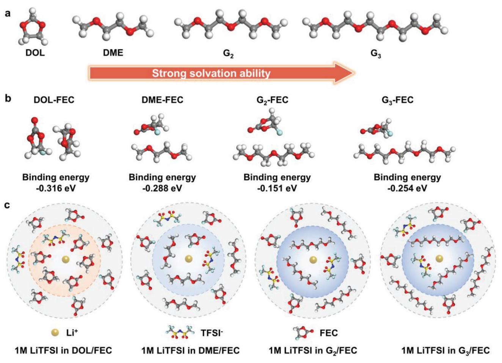
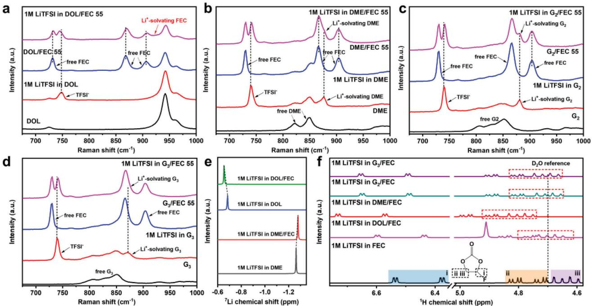
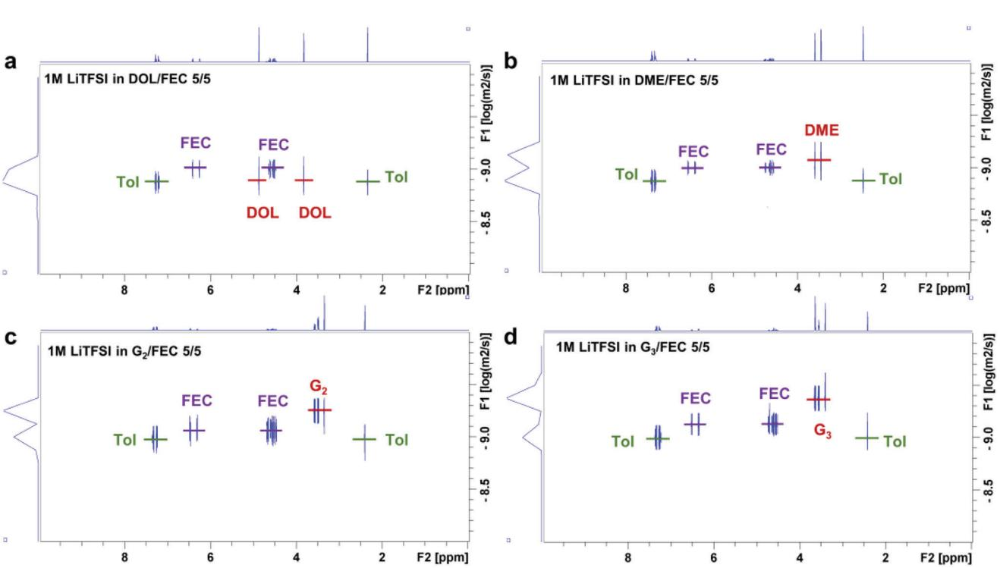
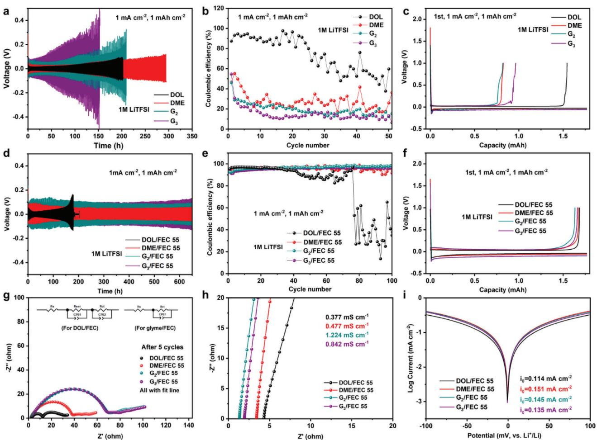
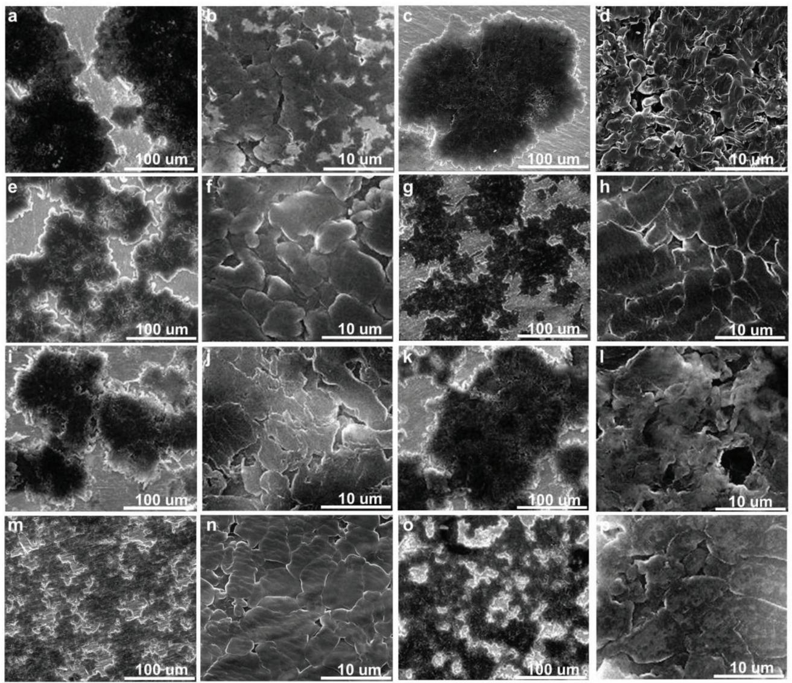
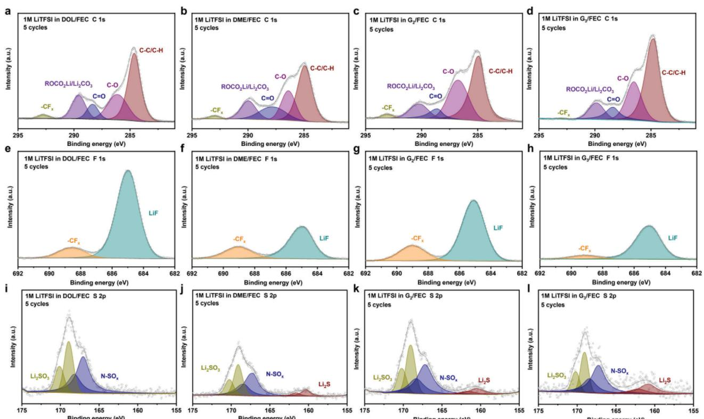
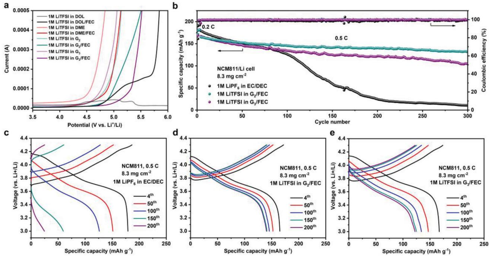

# **Tuning the FEC-Related Electrolyte Solvation Structures in Ether Solvents Enables High-Performance Lithium Metal Anode**

*Yaru Zhang, Fan Li, Yu Cao, Min Yang, Xinpeng Han, Yi Ji, Kuizhi Chen, Lixin Liang, Jie Sun,\* and Guangjin Hou\**

**Lithium metal is the most promising high-energy-density anode. However, it is incompatible with high-voltage cathodes in ether solvents due to their narrow electrochemical window. Herein, fluoroethylene carbonate (FEC) co-solvent is introduced to regulate the Li+ solvation structures in ether solvents, including cyclic ether (1,3-dioxolane [DOL]) and linear glymes with different chain lengths (1,2-dimethoxyethane [DME], diglyme [G2] and triglyme [G3]). The apparently different effects of ether solvents on solvation ability and interaction strength with FEC are revealed. FEC plays a diverse role and function in 1 m lithium bis(trifluoromethanesulfonyl)imide (LiTFSI)-ether/FEC electrolyte, thus relevant batteries perform distinct performances due to various ionic dynamics and solid-electrolyte interphase. The Li+-solvation structures are explored by Raman and nuclear magnetic resonance spectroscopies. Specifically, part of FEC molecules are inserted into the first solvation shell in 1 m LiTFSI-DOL/FEC because of the weak solvation ability of DOL and strong interaction of DOL-FEC, leading to few coordinated TFSI− and sluggish interfacial kinetics. In sharp contrast, FEC as a weak coordinated solvent almost exclusively occupies the second solvation sheath in 1 m LiTFSI-glyme/FEC, favoring TFSI− coordination and rapid de-solvation dynamics. Ultimately, the LiNi0.8Co0.1Mn0.1O2/Li battery in G2/FEC presents the most excellent performance, derived from abundant free-FEC and rapid ionic kinetics.**

#### lithium metal anode is considered to be the most ideal anode. Many researchers have been concentrated on developing high-energy-density lithium metal anode pairing with high-capacity cathode such as LiNi0.8Co0.1Mn0.1O2 (NCM811).[\[1,2\]](#page-10-0) However, due to the heterogeneous Li plating/stripping, the lithium dendrites severely affect the Coulombic efficiency (CE) and cycling performance of the battery.[\[3,4\]](#page-10-0) Additionally, it is inevitable that highly active lithium metal reacts with organic electrolytes to form the solid-electrolyte interphase (SEI).[\[5\]](#page-10-0) The electrochemical performance of the battery is highly related to the composition and stability of SEI. The fragile SEI consistently consumes limited electrolyte and metallic lithium, resulting in poor performance.[\[6,7\]](#page-10-0)

Numerous strategies have been provided to suppress the lithium dendrites and construct the effective SEI layer, thus improving the electrochemical performance of Li metal batteries (LMBs).[\[8,9\]](#page-10-0) Among them, electrolyte optimization is one of the most convenient and practical approaches without altering the existing production process and equipment.[\[10\]](#page-10-0) As for

### **1. Introduction**

With an ultrahigh theoretical capacity of 3860 mAh g−1 and a low redox potential of 3.04 V (vs standard hydrogen electrode), the

Y. Zhang, F. Li, M. Yang, Y. Ji, K. Chen, L. Liang, G. Hou State Key Laboratory of Catalysis Dalian National Laboratory for Clean Energy Dalian Institute of Chemical Physics Chinese Academy of Sciences Dalian 116023, China E-mail: [ghou@dicp.ac.cn](mailto:ghou@dicp.ac.cn) Y. Zhang, F. Li University of Chinese Academy of Sciences Beijing 100049, China

The ORCID identification number(s) for the author(s) of this article can be found under <https://doi.org/10.1002/adfm.202315527>

**DOI: 10.1002/adfm.202315527**

electrolyte engineering, it is common to adjust the composition and concentration, for instance, increasing the molarity of lithium salts to prepare the high-concentration electrolytes (HCEs),[\[11,12\]](#page-10-0) adding the diluent into HCEs to design the localized

Y. Cao, X. Han, J. Sun School of Chemical Engineering and Technology Tianjin University Tianjin 300072, China E-mail: [jies@tju.edu.cn](mailto:jies@tju.edu.cn) J. Sun Quzhou Institute for Innovation in Resource Chemical Engineering Quzhou 324000, China

high-concentration electrolytes (LHCEs)[\[13,14\]](#page-10-0) and introducing the additive or co-solvent into the conventional electrolyte.[\[15,16\]](#page-10-0) Nevertheless, the HCEs significantly increase the cost of electrolytes, and the production process of diluent used in LHCEs is too complicated.[\[17\]](#page-10-0) With regard to the additive or co-solvent in electrolyte modification, the fluorinated solvent such as fluoroethylene carbonate (FEC) is the most common and efficient component.[\[18,19\]](#page-11-0) For instance, Cheng et al. reported the electrolyte recipe of 1 m lithium hexafluorophosphate (LiPF6) dissolution in the mixture of FEC and bis(2,2,2-trifluoroethyl) carbonate (3/7) solvents.[\[20\]](#page-11-0) Amine et al. synthesized a fluorinated diglyme analog solvent (FDG), and Li-metal batteries based on FEC and FDG solvents with LiPF6 salt enabled stable cycling performance.[\[21\]](#page-11-0) In these previous electrolyte designs, FEC was chosen as an additive or co-solvent for the following two main reasons. First, FEC has a low lowest unoccupied molecular orbital energy level originating from the strong electron-withdrawing property of the F atom.[\[22,23\]](#page-11-0) As a result, FEC can decompose in priority to form the robust LiF-rich SEI. Generally, LiF with high interfacial energy and great mechanical stability is one of the significant inorganic SEI components, which facilitates Li+ plating along the Li/SEI interface thus depressing the lithium dendrite.[\[24,25\]](#page-11-0) Second, FEC can widen the electrolyte window because the low highest occupied molecular orbital energy level obstructs its oxidation process.[\[26,27\]](#page-11-0) Therefore, the incorporation of FEC in the ether solvents boosts the lithium anode stability against the high-voltage cathode. Nonetheless, the introduction of FEC into electrolytes still has some deficiencies. Initially, the reduction of FEC not only generates the effective LiF in SEI, but also inevitably produces the carbonaceous compounds (Li2CO3, ROCO2Li, etc.) at the same time.[\[28\]](#page-11-0) During the long-term Li plating/stripping process, these carbonaceous components continuously accumulate in SEI, hindering the ionic interfacial diffusion and negating the advantage of the fluorinated compound.[\[29,30\]](#page-11-0) In addition, FEC owns the characterization of high viscosity and low ionic conductivity, which is harmful to the rapid ionic dynamics of bulk electrolyte and interfacial transport.[\[31,32\]](#page-11-0) More importantly, most research only focuses on the significant impact of FEC on SEI chemistry but few concentrate on its profound function in regulating the electrolyte solvation structure, especially when FEC works as the co-solvent. In fact, the electrolyte solvation structure plays a crucial role in the electrochemical performance of the battery. It can determine the SEI components by influencing the decomposition order of electrolyte ingredients. Simultaneously, the ionic diffusion and interfacial transfer kinetics are highly correlated with the Li+-solvation structure.[\[33,34\]](#page-11-0) One of the objective reasons for lacking research on the coordination of FEC is the short of powerful experimental tools to explore the solvent sheath. It raises the question of what kind of solvent is compatible with lithium metal anode in the mixture of FEC co-solvent from the view of electrolyte coordination structure? First, ether solvent has the intrinsic merits of low viscosity and high solubility of lithium salt,[\[35\]](#page-11-0) which is suitable with lithium anode and complementary to FEC co-solvent.[\[36\]](#page-11-0) Furthermore, the cyclic ether and linear ether represent apparently different solvation abilities as reported in previous references,[\[37,38\]](#page-11-0) and exhibit various interaction strength with FEC molecule obtained from our simulation result. Besides, the lithium bis(trifluoromethanesulfonyl)imide (LiTFSI) salt owns a high ionic conductivity and could provide the valid F source for SEI.[\[39,40\]](#page-11-0) Therefore, it is greatly significant for a series of LiTFSI-ether/FEC electrolytes to unveil the role of FEC co-solvent in solvation structure and electrochemical performance of batteries.

Herein, we systematically studied the effects of different cyclic ether and linear ethers on the FEC-involved solvation structure and the relative battery performance. 1,3-dioxolane (DOL) and 1,2-dimethoxyethane (DME), as the selected examples of cyclic and linear ethers, were respectively mixed with FEC co-solvent and 1 m LiTFSI salt. Note that the two ether solvents present semblable physical parameters including viscosity, dielectric constant, and donor number (DN), as shown in Table S1 (Supporting Information), which excludes the influence of these inherent physical parameters on solvation structure and electrochemistry properties.[\[31,35,41\]](#page-11-0) It is found that DME has a much stronger coordination ability and lower binding energy with FEC compared with DOL. The Li+-solvent coordination was measured by Raman and nuclear magnetic resonance (NMR) spectroscopies, particularly the internally referenced diffusion-ordered spectroscopy (IR-DOSY).[\[38,42\]](#page-11-0) It is revealed that in the electrolyte of 1 m LiTFSI-DOL/FEC, partial FEC molecules participate in the first solvation sheath, leading to slow diffusion dynamics and a large amount of adverse carbonaceous compounds in SEI. In contrast, negligible FEC takes part in the Li+-coordination in 1 m LiTFSI-DME/FEC, resulting in excellent electrochemical performance due to the rapid ionic kinetics and improved SEI components. In addition, the effect of the chain length of glyme, including DME, diglyme (G2), and triglyme (G3), on the solvation structure and electrochemical performance was further investigated. Ultimately, the NCM811/Li cells in 1 m LiTFSI-G2/FEC harvested the most excellent electrochemical performance because of much more free-FEC in solvation sheath than 1 m LiTFSI-DME/FEC and better dynamic property than 1 m LiTFSI-G3/FEC.

### **2. Results and Discussion**

#### **2.1. The Design Criterions of 1 m LiTFSI-Ether/FEC Electrolytes and Hypothetical Solvation Structures**

A series of 1 m LiTFSI-ether/FEC electrolytes are used to investigate the distinct role and function of FEC molecules in modulating the solvent coordination structure and electrochemical performance of LMBs, and the corresponding design criteria are as follows. Initially, ether solvents are compatible with lithium metal anodes and able to compensate for the intrinsic drawbacks of low ionic conductivity and high viscosity of FEC. Second, cyclic and linear ethers exhibit diverse solvation abilities according to previous reports,[\[38,43\]](#page-11-0) which is beneficial to regulate the coordination position of FEC in solvation sheath. In this work, cyclic ether solvent (DOL) and a series of linear ether solvents (DME, G2, and G3) are respectively mixed with the same volumetric FEC co-solvent and 1 m LiTFSI salt to form the corresponding electrolytes. In particular, the volume ratio of ether/FEC in electrolyte is set to 5/5 from the view of tuning solvation structures via FEC co-solvent and performing moderate diffusion dynamics of bulk electrolyte simultaneously. These selected ether solvents exhibit apparently different solvation abilities, as shown in **Figure 1**[a.](#page-2-0) Concretely, cyclic ether DOL has a much weaker coordination capacity in the Li+ solvation

**Figure 1.** The electrolyte design analyzes the crucial role of FEC in regulating the solvation structure. a) The comparison of solvation capacities of various ether solvents. b) The optimized structural models and corresponding binding energies between different ethers and FEC molecules are calculated by DFT. c) The hypothetical solvation structures of relevant 1 m LiTFSI-ether/FEC electrolytes.

sheath compared with chain glyme DME because of the polar difference.[\[44,45\]](#page-11-0) In terms of glyme (DME, G2, and G3), the number of O atoms coordinated with Li+ gradually raises with the increase of linear chain length, thus the solvation ability is improved accordingly.[\[41,46,47\]](#page-11-0) Note that fluorinated solvent generally has weak Li+-solvent coordination, which results from the electron-withdrawing effect of the F atom decreases the electron density of the coordinating site.[\[48–50\]](#page-11-0) In addition to the difference in the solvation ability of the solvent itself, the influence of interaction strength between ether and FEC molecular on the solvation structure is also taken into account.[\[34\]](#page-11-0) The optimized structural models and binding energies of ether-FEC were calculated by density-functional theory (DFT), and the results are shown in Figure 1b. The binding energies of DOL-FEC, DME-FEC, G2- FEC, and G3-FEC are −0.316, −0.288, −0.151, and −0.254 eV, respectively. Considering the inherent solvation abilities of solvents and these binding energies, the coordination structures of 1 m LiTFSI-ether/FEC electrolytes can be speculated reasonably (Figure 1c). In 1 m LiTFSI-DOL/FEC, due to the weak solvation ability of DOL and the strong interaction of DOL-FEC, in addition to the participation of DOL in the primary Li+ solvation sheath, partial FEC molecules might also directly coordinate with Li+. However, the coordination surrounding in the case of 1 m LiTFSI-DME/FEC is very different from that of 1 m LiTFSI-DOL/FEC. Because DME has a much stronger coordination capacity and weaker interaction with FEC compared with DOL, the FEC molecules in 1 m LiTFSI-DME/FEC may almost be located in the second solvation structure and a large number of DME molecules can join in the first solvation sheath. The free FEC can be beneficial to the ionic de-solvation process.[\[51\]](#page-11-0) In addition, we further analyzed the possible Li+-solvent structures of the FEC co-solvent mixture with long-chain glyme (G2 and G3). The 1 m LiTFSI-G2/FEC and 1 m LiTFSI-G3/FEC should have more free-FEC molecules and coordinated glyme in contrast with 1 m LiTFSI-DME/FEC, due to the stronger coordination ability of longer chain glyme and lower binding energy with FEC. Specifically, the 1 m LiTFSI-G3/FEC is supposed to have less coordinated FEC than 1 m LiTFSI-G2/FEC in terms of the solvation capacities of ether solvents, however, the binding energy of G3-FEC is higher than G2-FEC. As a result, the coordination environments in 1 m LiTFSI-G2/FEC and 1 m LiTFSI-G3/FEC might be quite similar, devoting more glyme and less even no FEC in the primary solvation sheath in comparison with 1 m LiTFSI-DME/FEC.

**Figure 2.** The analysis of Li+-solvent coordination in various 1 m LiTFSI-ether/FEC electrolytes. a–d) The Raman spectra of relevant solvents and electrolytes in DOL/FEC, DME/FEC, G2/FEC, and G3/FEC, respectively. e) The 7Li NMR spectra of corresponding electrolytes. f) The 1H NMR spectra of different electrolytes.

#### **2.2. Characterizations of Solvation Structures of LiTFSI-Ether/FEC Electrolytes**

In order to clarify the facticity of the above-mentioned hypothetical models of Li+-solvent coordination in diverse 1 m LiTFSIether/FEC electrolytes, the Raman spectroscopy and NMR experiments were carried out. The Raman spectra of the relative solvents and electrolytes are respectively displayed in **Figure 2**a–d. The free FEC in DOL/FEC solvent has three bands centered at 730, 860, and 906 cm−1, indicating the ring breathing mode, C─F stretching vibration, and ring skeletal deformation of FEC molecule, respectively.[\[52,53\]](#page-11-0) The extra peak at 922 cm−1 in 1 m LiTFSI-DOL/FEC represents the Li+-solvating FEC (Figure 2a).[\[53,54\]](#page-11-0) The coordinated FEC can be clearly observed in the enlarged fitting result ranging from 891 to 961 cm−1 (Figure S1, Supporting Information), demonstrating that some FEC molecules join in the first solvation structure. It is consistent with the blueshift of three bands of free FEC in DOL/FEC after dissolving LiTFSI salt.[\[55,56\]](#page-11-0) The band located at ≈740 cm−1 is specified to the coupled CF3 bending and S-N stretching of TFSI−. [\[57–59\]](#page-11-0) It gets redshift after introducing FEC co-solvent in 1 m LiTFSI-DOL, indicating the decreased anions incorporation in Li+-solvation.[\[60\]](#page-11-0) This phenomenon could be explained by partial FEC molecules occupying the limited space in the primary solvation sheath, thereby preventing the coordination of anions with Li+. The varieties of coordination circumstances by adding FEC co-solvent in 1 m LiTFSI-glyme are much different from that in 1 m LiTFSI-DOL. There is no peak at 922 cm−1 in 1 m LiTFSI-DME/FEC (Figure 2b), meaning that FEC does not directly participate in the Li+-solvation structure but is located at the second solvation sheath. Meanwhile, the slight blueshift of band of TFSI− (≈740 cm−1) identifies more anions incorporation in the Li+-solvent structure after the addition of FEC co-solvent in 1 m LiTFSI-DME. The alteration of the solvation environment can be reasonably thought of as the case that FEC molecules insert into the second solvent sheath in 1 m LiTFSI-DME/FEC, which appears to compress the confined Li+-solvent space, thus increasing the opportunity of anions contact with Li+. [\[60\]](#page-11-0) Briefly, the FEC co-solvent in 1 m LiTFSI-DME/FEC works as another kind of "diluent".[\[51,60\]](#page-11-0) The situations in 1 m LiTFSI-G2/FEC and 1 m LiTFSI-G3/FEC are highly similar to 1 m LiTFSI-DME/FEC (Figure 2c,d).[\[61\]](#page-11-0) In order to further analyze the solvation structures in the various electrolytes, NMR experiments were carried out. The 7Li NMR spectra display a downfield shift after the addition of FEC co-solvent in 1 m LiTFSI-DOL (Figure 2e), suggesting the decreased electron density around Li+ because of the reduced coordinated anions in the Li+-solvation. In contrast, the condition in 1 m LiTFSI-DME/FEC is completely different, showing more anions coordination in the solvation structure when introducing FEC co-solvent.[\[62–64\]](#page-11-0) These results are in accordance with that of Raman spectra. Moreover, 1H NMR measurements can further give insight into the coordination surroundings of solvents in electrolytes (Figure 2f). Compared with 1 m LiTFSI-FEC electrolyte, the 1H resonance peaks (labeled in ii and iii) of FEC in 1 m LiTFSI-DOL/FEC overlap significantly. In contrast, the chemical shifts between ii and iii peaks in 1 m LiTFSIglyme/FEC increase obviously in comparison with 1 m LiTFSI-FEC. The distinctly different situations in 1 m LiTFSI-DOL/FEC and 1 m LiTFSI-glyme/FEC demonstrate their diverse coordination environments of FEC. The results from 1H NMR are correlated with Raman spectroscopy that DOL and FEC are involved in the primary solvation structure in 1 m LiTFSI-DOL/FEC, and

**Figure 3.** The 1H DOSY NMR spectra of diverse electrolytes with toluene as the internal reference. a) 1 m LiTFSI in DOL/FEC. b) 1 m LiTFSI in DME/FEC. c) 1 m LiTFSI in G2/FEC. d) 1 m LiTFSI in G3/FEC.

FEC molecules are free in the solvent sheath of 1 m LiTFSIglyme/FEC. In addition, the nearly identical chemical shifts in 1 m LiTFSI-G2/FEC and 1 m LiTFSI-G3/FEC demonstrate that their coordination environments are very similar.

#### **2.3. Internally Referenced Diffusion-Ordered Spectroscopy to Further Reveal the Exact Coordination Ratio of Solvents**

IR-DOSY NMR serves as a powerful approach to deeply understanding the solvation structure via calculating the electrolyte diffusion coefficient (D) and coordination ratio ().[\[38,42,65\]](#page-11-0) In this method, toluene is used as an internal reference which is noncoordination in electrolytes due to its low polarity and DN.[\[50\]](#page-11-0) The 1H DOSY of diverse solvents and electrolytes are depicted in Figure S2 (Supporting Information) and **Figure 3**a–d, and the corresponding diffusion coefficients are obtained using the T1/T2 analysis module as shown in Figures S3–S14 (Supporting Information). The final calculated results are summarized in Tables S2–S5 (Supporting Information). Giving the example of DME/FEC solvent and 1 m LiTFSI-DME/FEC electrolyte, the related data is specifically illustrated in Figure 3b and Figures S2b, S6–S8 and Table S3 (Supporting Information). The diffusion coefficients of toluene and DME are almost the same in the pristine DME/FEC solvent. However, DME diffuses much slower than toluene after adding the lithium salt, indicating that a large number of DME molecules participate in the first solvation sheath. In terms of FEC, the diffusion coefficient of FEC in the pristine DME/FEC solvent is much smaller than that of DME, but after introducing the 1 m LiTFSI salt, it diffuses even faster than DME demonstrating that much fewer FEC than DME coordinates in the Li+-solvation. As identified by the calculated result in Table S3 (Supporting Information), only 2.45% of FEC molecules are in the primary solvent sheath but 51.4% of DME is incorporated in the Li+-solvation in 1 m LiTFSI-DME/FEC. The coordination results from DOSY in 1 m LiTFSI-DME/FEC remarkably agree with the radial distribution functions (RDFs) and coordination numbers calculated from molecular dynamics (MD) simulation that the average coordination number of DME is 2.94, whereas that of FEC is only 0.033 (Figure S15, Supporting Information).[\[54\]](#page-11-0) The situation in DOL/FEC is very different from DME/FEC, denoting their diverse solvation structures. As shown in Table S2 (Supporting Information), 20.8% of FEC and 23.7% of DOL unitedly join in the solvation structure. The coordinating environments in 1 m LiTFSI-G2/FEC and 1 m LiTFSI-G3/FEC are quite similar (Tables S4 and S5, Supporting Information), in agreement with the results in Figure [2f,](#page-3-0) indicating that there are even fewer coordinated FEC molecules than that in 1 m LiTFSI-DME/FEC. Therefore, the real solvation structures in various 1 m LiTFSIether/FEC electrolytes are consistent with our above-mentioned hypothetical models in Figure [1c.](#page-2-0)

#### **2.4. The Electrochemical Performance of Relative Batteries with 1 m LiTFSI-Ether/FEC Electrolytes**

Batteries were assembled to investigate the impact of FEC cosolvent in diverse electrolytes on electrochemistry properties. As shown in **Figure 4**[a,](#page-5-0) all the Li/Li symmetric batteries using single ether solvents including DOL, DME, G2, and G3,

**Figure 4.** Electrochemical performance and dynamics property in diverse electrolytes. a) The cycling behaviors of Li/Li symmetric cells at 1 mA cm−2 and 1 mAh cm−2 using single ether solvent. b) The performance of Li/Cu asymmetric cells at 1 mA cm−2 and 1 mAh cm−2 in single ether solvent. c) The charge/discharge curves of Li/Cu cells in the first cycle with single ether solvent. d) The cycling behaviors of symmetric cells in the corresponding 1 m LiTFSI-ether/FEC electrolytes. e) The performance of Li/Cu cells using 1 m LiTFSI-ether/FEC electrolytes. f) The relevant charge/discharge curves of Li/Cu cells in the first cycle. g) The Nyquist plots of symmetric cells after 5 cycles. h) The electrochemical impedance spectra of the SS/electrolyte/SS cells in various electrolytes and the calculated ionic conductivities. i) The Tafel curves of symmetric cells in 1 m LiTFSI-ether/FEC electrolytes.

respectively, present poor electrochemical performance with a gradually raised overpotential and a short cycling lifespan. The larger overpotential with the increased chain length of linear ether may stem from the raised viscosity of glyme solvent. The viscosities of DME, G2, and G3 are 0.5, 1.1, and 1.89 cP, respectively.[\[31\]](#page-11-0) The Li/Cu asymmetric cells are used to evaluate the Coulombic efficiencies (CEs) of Li metal anode, which are very low in single ether electrolyte, as shown in Figure 4b. The corresponding charge/discharge curves of the first cycle are consistent with the poor CEs (Figure 4c). Then the FEC cosolvent was used to regulate the electrochemical performance of single ether electrolytes. Initially, the effect of different volume ratios of FEC co-solvent on electrochemistry has been investigated (Figure S16, Supporting Information). The volume ratio of DME/FEC 5/5 displays the best performance with high CEs and low overpotential. Too much FEC is harmful to the ionic dynamics of bulk electrolytes because of its high viscosity and low ionic conductivity, while too few FEC can not play the great function of tailoring Li+-solvent structure. The electrochemical results agree with our assumption in terms of the volume ratio of ether/FEC. The electrochemistry property has apparent improvement in the relative 1 m LiTFSI-glyme/FEC (5/5). Compared with a single G2 solvent, the Li+ plating/stripping curves become smooth and normal in 1 m LiTFSI-G2/FEC (Figure S17, Supporting Information). Moreover, the symmetric cells in 1 m LiTFSI-glyme/FEC perform excellent cycling lifespan even over 600 h with stable overpotential (Figure 4d). However, symmetric battery in 1 m LiTFSI-DOL/FEC still endows poor electrochemical performance. The results suggest the beneficial "free FEC" in Li+-solvation sheath. Note that the asymmetric cells with these electrolytes exhibit the same trend as the symmetric batteries. Specifically, the average Coulombic efficiency (ACE) was measured based on Aurbach method.[\[66\]](#page-11-0) It is only 77.1% in 1 m LiTFSI-DME, but the ACE clearly increases to 98.23% in 1 m LiTFSI-DME/FEC (Figure S18, Supporting Information). In addition, the CEs in glyme/FEC extraordinarily increase to *>*95%, while the CEs in DOL/FEC decrease significantly after 40 cycles (Figure [4e\)](#page-5-0). Furthermore, the CEs of G2/FEC and G3/FEC are much more stable and higher than that of DME/FEC especially in the subsequent cycles, probably due to the presence of more free-FEC in their Li+-coordination. The obvious improvement of CEs in glyme/FEC also can be demonstrated in Figure [4f.](#page-5-0)

The ionic dynamics property plays a pivotal role in the electrochemical performance of cells, thus the analysis of the difference in kinetics between glyme/FEC and DOL/FEC is indispensable and meaningful. The 7Li DOSY measurements give the specific diffusion coefficients of lithium ions in bulk electrolytes (Figures S5, S8, S11, S14 and Tables S2–S5, Supporting Information).[\[67\]](#page-11-0) The diffusion coefficient in 1 m LiTFSI-DME/FEC (3.912 × 10−10 m2 s−1) is slightly higher than 1 m LiTFSI-DOL/FEC (3.771 × 10−10 m2 s−1), meaning that free FEC in Li+-solvation favors the Li+ diffusion in bulk electrolyte. Notably, this result basically eliminates other factors on the diffusion coefficient due to the similar physical parameters (viscosity, dielectric constant, and DN) between DME and DOL.[\[35,68\]](#page-11-0) The low diffusion rates in 1 m LiTFSI-G2/FEC and 1 m LiTFSI-G3/FEC mainly result from the increased viscosity of glyme. As shown in Figure S19 (Supporting Information), the viscosities are 3.6, 5.45, and 8.37 cP for 1 m LiTFSI-DME/FEC, G2/FEC and G3/FEC, respectively. Additionally, the dynamics property can be revealed from electrochemical methods. The nucleation overpotentials of Li/Cu cells in diverse electrolytes are shown in Figure S20 (Supporting Information). The battery with 1 m LiTFSI-DOL/FEC shows the largest overpotential, compared with the cases of 1 m LiTFSI-glyme/FEC, suggesting that the free FEC is good at smooth and uniform deposition of lithium ions.[\[53\]](#page-11-0) Moreover, the Nyquist plots of symmetric cells before and after cycles were used to measure the resistance evolution in various electrolytes, as shown in Figure S21 (Supporting Information) and Figure [4g,](#page-5-0) and the fitting data is shown in Tables S6 and S7 (Supporting Information). Before cycling, the cell in DME/FEC has the smaller charge transfer resistance (Rct) than that in DOL/FEC, indicating the advantage of free FEC in solvation structure. The Rct in G2/FEC and G3/FEC is slightly larger than that in DME/FEC, probably due to the higher viscosity of electrolyte. After 5 cycles, the cell in DOL/FEC shows an obvious resistance of SEI (Rsei), whereas that in glyme/FEC has no evident Rsei. The difference between DOL/FEC and glyme/FEC possibly results from the variation of their solvation structures, and a large number of coordinated FEC molecules in DOL/FEC decompose into carbonaceous compounds, hindering the Li+ diffusion in SEI and forming a large Rsei. The Li+ conductivities of electrolytes were calculated from the electrochemical impedance spectroscopy (EIS) curves of stainless steel (SS)/electrolyte/SS cells, and those of 1 m LiTFSI-DOL/FEC, DME/FEC, G2/FEC, and G3/FEC are 0.377, 0.477, 1.224, and 0.842 mS cm−1, respectively (Figure [4h\)](#page-5-0). The 1 m LiTFSI-G2/FEC and G3/FEC perform better ionic conductivities than those of DME/FEC and DOL/FEC. The larger exchange current densities (i0) calculated from Tafel curves in 1 m LiTFSI-glyme/FEC also confirm their more rapid ionic kinetics in contrast with 1 m LiTFSI-DOL/FEC (Figure [4i\)](#page-5-0).[\[69,70\]](#page-11-0) The slightly larger nucleation overpotentials, Rct, and smaller i0 in 1 m LiTFSI-G2/FEC and 1 m LiTFSI-G3/FEC than 1 m LiTFSI-DME/FEC possibly come from the increased intrinsic viscosity of glyme. In summary, FEC locating at the second solvent sheath (free FEC) can improve the ionic diffusion rate and favor the interfacial de-solvation process.

### **2.5. The Morphologies of Plated Li in Different 1 m LiTFSI-Ether/FEC Electrolytes**

The electrochemical performance of the battery is highly correlated with the morphology of plated Li. Thus, the scanning electron microscope (SEM) images of Li+ plating on Cu substrate are used to evaluate various kinds of electrolytes. The morphologies in cases of single ether solvent depict the severely stacked Li and bare Cu foil, especially in the glyme electrolytes (**Figure 5**[a,c,i,k\)](#page-7-0), illustrating the rough surface and the uneven deposition of lithium ions. It is the main reason for the generation and growth of lithium dendrites during the consistent cycles. On the contrary, after adding FEC co-solvent in single ether electrolytes, the plated Li displays homogeneous distribution and smooth surface with less exposed Cu substrate (Figure [5e,g,m,o\)](#page-7-0), which benefits for reducing dendrites and improving CEs. Particularly, the Li deposition shows a more uniform feature in the 1 m LiTFSI-G2/FEC and 1 m LiTFSI-G3/FEC, compared with 1 m LiTFSI-DME/FEC, further demonstrating the advantage of free FEC in the Li+-solvation. In addition, from a more microscopic view, the plated Li consists of messy Li filaments or whiskers, even undesired holes in a single glyme solvent (Figure [5d,j,l\)](#page-7-0). After adding FEC co-solvent, the Li+ plating on Cu foil exhibits totally distinct characteristics with large Li grains and extremely densepacked surface (Figure [5h,n,p\)](#page-7-0). Surprisingly, in the case of 1 m LiTFSI-DOL, the morphology shows the merit of a uniform surface with chunky Li (Figure [5b\)](#page-7-0), agreeing with the initial high CEs of the asymmetric cell (Figure [4b\)](#page-5-0). The morphology of plated Li in 1 m LiTFSI-DOL/FEC is similar to that in 1 m LiTFSI-DOL (Figure [5f\)](#page-7-0).

#### **2.6. The Effect of Diverse Solvation Structures on Solid-Electrolyte Interphase Components**

The solvation structure not only plays a crucial role in ionic transport dynamics, but also has a profound impact on SEI chemistry. The X-ray photoelectron spectroscopy (XPS) was used to explore the difference in SEI components of various electrolytes (**Figure [6](#page-8-0)**). The C 1s spectra of the SEI layer in all the cases consist of -CFx, ROCO2Li/Li2CO3, C═O, C─O, and C─C/C─H,[\[69,71,72\]](#page-11-0) but the specific contents of every component are quite distinct (Figure [6a–d\)](#page-8-0). There is more ROCO2Li/Li2CO3 in 1 m LiTFSI-DOL/FEC compared with other 1 m LiTFSIglyme/FEC electrolytes. It is in agreement with the large ratio of LiF/CFx in the F 1s spectrum (Figure [6e\)](#page-8-0),[\[73,74\]](#page-11-0) which arises from the preferential decomposition of FEC in the first solvation sheath for 1 m LiTFSI-DOL/FEC.[\[75,76\]](#page-11-0) Apart from LiF, the simultaneously generated carbonaceous compounds (Li2CO3, ROCO2Li, etc.) in 1 m LiTFSI-DOL/FEC continuously accumulate in SEI during the long-term cycles, hindering the interfacial ion diffusion and negating the advantage of the fluorinated compound.[\[28,29,71\]](#page-11-0) However, the moderated carbonaceous compounds and LiF were detected in the 1 m LiTFSI-glyme/FEC electrolytes (Figure [6b–d,f–h\)](#page-8-0), mainly derived from the reduction of

**Figure 5.** The morphologies of Li+ plating on Cu foil in different electrolytes at 0.05 mA cm−2 and 0.5 mAh cm−2. The SEM images in corresponding electrolytes a,b) 1 m LiTFSI in DOL, c,d) 1 m LiTFSI in DME, e,f) 1 m LiTFSI in DOL/FEC, g,h) 1 m LiTFSI in DME/FEC, i,j) 1 m LiTFSI in G2, k,l) 1 m LiTFSI in G3, m,n) 1 m LiTFSI in G2/FEC and o,p) 1 m LiTFSI in G3/FEC.

free FEC in their Li+-solvation.[\[74\]](#page-11-0) In addition, the ratio of LiF/CFx in 1 m LiTFSI-G2/FEC and 1 m LiTFSI-G3/FEC is larger than 1 m LiTFSI-DME/FEC, which is one of the reasons for the better electrochemical performance of cells, suggesting the advantage of more free-FEC molecules in the solvation sheath. Another stark difference in the SEI composition between these four electrolytes is depicted in S 2p spectra (Figure [6i–l\)](#page-8-0).[\[71,74,77,78\]](#page-11-0) Only Li2SO3 and N-SOx were present in the 1 m LiTFSI-DOL/FEC electrolyte. In sharp contrast, there are additional characteristic peaks of inorganic Li2S observed in the 1 m LiTFSI-glyme/FEC electrolyte, derived from the deep decomposition of TFSI−. [\[74,79\]](#page-11-0) The Li2S in the SEI layer is conductive for the ionic transport because of its high ionic conductivity and higher stability than inorganic Li2CO3, [\[71,80,81\]](#page-11-0) which indicates the advantage of SEI in 1 m LiTFSI-glyme/FEC due to the free FEC in solvation structure.

#### **2.7. The Electrochemical Performance of LiNi0.8Co0.1Mn0.1O2/Li Cells**

As mentioned above, the batteries in 1 m LiTFSI-glyme/FEC exhibit excellent electrochemical performance including high CEs and rapid ionic dynamics compared with those in 1 m LiTFSI-DOL/FEC, which is related to the free FEC in the Li+-solvation. Subsequently, the NCM811/Li cells were assembled to further evaluate these 1 m LiTFSI-glyme/FEC electrolytes. Initially, the linear sweep voltammetry (LSV) measurements are conducted to reveal the electrochemical stability window of electrolytes. All the electrochemical windows have apparent improvements after adding FEC co-solvent (**Figure 7**[a\)](#page-8-0). Even though the electrochemical window of 1 m LiTFSI-DOL/FEC is similar to that of 1 m LiTFSI-G2/FEC, it cannot be matched with the NCM811

**Figure 6.** XPS analysis on Cu foils of Li/Cu cells with different electrolytes after 5 cycles at 1 mA cm−2 and 1 mAh cm−2. a–d) C 1s spectra, e–h) F 1s spectra, and i–l) S 2p spectra in 1 m LiTFSI-DOL/FEC, 1 m LiTFSI-DME/FEC, 1 m LiTFSI-G2/FEC, and 1 m LiTFSI-G3/FEC, respectively.

**Figure 7.** The electrochemical performance of NCM811/Li cells with various electrolytes. a) The LSV profiles of Li/SS batteries using different electrolytes. b) The long-term cycling performance of cells with high mass-loading NCM811 cathode at 0.5 C. c–e) The corresponding charge/discharge curves in 1 m LiPF6-EC/DEC, 1 m LiTFSI-G2/FEC, and 1 m LiTFSI-G3/FEC, respectively.

cathode due to the poor electrochemical performances of batteries, as shown in Figure [4.](#page-5-0) Besides, the 1 m LiTFSI-G2/FEC and 1 m LiTFSI-G3/FEC electrolytes perform broader electrochemical windows and higher CEs than 1 m LiTFSI-DME/FEC, which facilitates to be paired with high-voltage cathode such as NCM811 (Figure S22, Supporting Information). The cell using a high mass-loading NCM811 cathode in the commercial 1 m LiPF6-EC/DEC displays a significant attenuation at 0.5 C after 100 cycles and the capacity retention is only 6.0% after 300 cycles (Figure [7b\)](#page-8-0). Nevertheless, batteries in 1 m LiTFSI-G2/FEC and 1 m LiTFSI-G3/FEC endow brilliant cycling performance, and the relevant capacity retention after 300 cycles is 80.0% and 62.4%, respectively. The reason why G2/FEC has better cycling stability than G3/FEC comes from the better CEs in Li/Cu cells (Figure [4e\)](#page-5-0), as well as more superior dynamic properties including ionic conductivity, Li+ diffusion rate, and exchange current density (Table S8, Supporting Information) due to the lower viscosity of G2 with shorter chain length. Moreover, the corresponding charge/discharge curves demonstrate that the cells in 1 m LiTFSI-G2/FEC and 1 m LiTFSI-G3/FEC harvest a smaller voltage gap than that in 1 m LiPF6-EC/DEC, especially in the following cycles (Figure [7c–e\)](#page-8-0), which is closely correlated with the high compatibility of glyme with FEC co-solvent. What's more, the NCM811/Li cells with high cathode capacity (1.47 mAh cm−2) and thin Li foil (50 μm) were assembled to further evaluate the electrochemical performance and the possibility of practical application of electrolytes. As shown in Figure S23a (Supporting Information), the NCM811/Li cell using the 1 m LiTFSI-G2/FEC electrolyte displays a capacity retention of 84.0% after 200 cycles at 0.5 C, and that in 1 m LiTFSI-G3/FEC is 76.0%, which is much better than that of the commercial EC/DEC electrolyte. The NCM811/Li cell in EC/DEC exhibits slightly better rate performance than the glyme/FEC electrolytes (Figure S23b, Supporting Information). In addition, the role and function of FEC in solvation structure and electrochemical performance have been further extrapolated in tetraglyme (G4)/FEC and cyclic ether tetrahydrofuran (THF)/FEC, as shown in Figures S24 and S25 (Supporting Information). The free FEC of solvation sheath in 1 m LiTFSI-G4/FEC remarkably improves the electrochemical performance compared with 1 m LiTFSI-G4. However, in cyclic THF/FEC, the significantly more coordinated FEC of solvation structure still results in poor performance and not much improvement.

### **3. Conclusion**

The Li+ solvation structures of FEC-related electrolytes in a series of ether solvents, including cyclic ether (DOL) and linear glymes with different chain lengths (DME, G2, and G3), as well as their influence on the electrochemical performance have been comprehensively investigated. The different effect of ether solvents on the solvation capacities and the interaction strength with FEC is revealed. The co-solvent FEC plays completely distinct roles in the solvation structures of different 1 m LiTFSIether/FEC electrolytes, which leads to disparate electrochemical performance due to various ionic dynamics and SEI chemistry. First, stemming from the weak solvation ability of DOL and the strong interaction between DOL and FEC, partial FEC molecules are involved in the primary solvation structure in 1 m LiTFSI-DOL/FEC, resulting in few anion coordination and sluggish ionic dynamics. Moreover, the coordinated FEC preferentially decomposes into a large amount of carbonaceous compounds (Li2CO3, ROCO2Li, etc.), thus negating the advantage of LiF in SEI during long-term cycles. In the case of 1 m LiTFSI-DME/FEC, FEC as the weak coordinated solvent almost only locates in the second solvation sheath, facilitating TFSI− coordination and rapid de-solvation process. Additionally, the deep reduction of TFSI− generates the effective inorganic Li2S, and the decomposition of free FEC forms moderate LiF and carbonaceous compounds in SEI, which favors the interfacial ionic transport and the robust stable SEI. In brief, the free FEC tunes the Li+-solvation sheath of electrolyte in correlation with the rapid ionic dynamics and the efficient SEI. Besides, the impact of the chain length of linear ether, including DME, G2, and G3, on solvation structure and electrochemical performance was further investigated. The 1 m LiTFSI-G2/FEC and 1 m LiTFSI-G3/FEC electrolytes have more free-FEC molecules than 1 m LiTFSI-DME/FEC, and 1 m LiTFSI-G2/FEC shows rapider dynamics property. As a result, the battery using a high mass-loading NCM811 cathode in 1 M LiTFSI-G2/FEC performed even better cycling performance than the commercial electrolyte. In summary, our work illustrates the profound impact of FEC co-solvent on tailoring the solvation sheath and the electrochemical performance, so that the strategy of tuning the electrolyte coordination structure can be further developed in high energy density LMBs.

### **4. Experimental Section**

*Materials*: The chemicals of lithium bis(trifluoromethanesulfonyl)imide (LiTFSI, battery grade, 99.9%), fluoroethylene carbonate (FEC, battery grade, 99.9%), 1,3-dioxolane (DOL, battery grade, 99.9%), 1,2-dimethoxyethane (DME, battery grade, 99.9%), diglyme (G2, battery grade, 99.8%), triglyme (G3, battery grade, 99.8%), tetraglyme (G4, battery grade, 99.8%), tetrahydrofuran (THF, battery grade, 99.9%) and commercial electrolyte 1 m LiPF6 in EC:DEC = 1:1 Vol% were purchased from *DodoChem*. The coated NCM811 cathode was purchased from *Canrd*. The surface density of the coating layer is 8.3 mg cm−2, and the percentage of active material is 94.5%. The electrode was punched into a circle with a diameter of 14 mm. The lithium anode (500 μm, 15 mm) was purchased from *China Energy Lithium Co., Ltd*. The lithium foil (50 μm) was purchased from *Canrd*, then cut into a small circle with a diameter of 15 mm as the Li metal anode. The NCM811 (SY3106) was paired with 500 μm Li and the NCM811 (SY3108, 1.47 mAh cm-2) was paired with 50 μm Li.

*Electrolyte Preparation*: All the prepared process was in the argon-filled glovebox. First, the solvents were mixed with corresponding volume ratios (such as 3/7, 5/5, 7/3, v/v). Then, 1 mol lithium salt (LiTFSI) was added to the relative solvents to achieve the electrolytes.

*Electrochemical Measurements*: The Li/Li, SS/SS symmetric cell, Li/Cu, Li/SS asymmetric cell, and Li/NCM811 cells were assembled with 2032 coin cells. And the separator is polypropylene (PP, celgard 2500). The assemble process was in the argon-filled glovebox. The symmetric and asymmetric cells were tested at the current density of 1 mA cm−2 with the capacity of 1 mAh cm−2. The Aurbach method was used to unveil the average Coulombic efficiency (ACE) of Li/Cu asymmetric cells. First, the Li plated on the Cu foil with 5 mAh cm−2 at 1 mA cm−2, then the stripping process was at 1 mA cm−2 with the cutoff voltage of 1.0 V. Second, the cell was measured at 1 mA cm−2, 1 mAh cm−2 for 10 cycles. The galvanostatic charging/discharging voltage of NCM811/Li cells was 3.0–4.3 V. The electrochemical impedance spectroscopy (EIS), linear sweep voltammetry (LSV), and Tafel curves were carried out on CHI660 electrochemical workstation. The Li+ conductivities of electrolytes were calculated from the EIS

curves of SS/electrolyte/SS batteries on a CHI660 electrochemical workstation in the frequency range of 1–106 Hz with an AC amplitude of 5 mV by the Equation (1)

$$
\sigma = \frac{L}{R \times A} \tag{1}
$$

where *L*, *A*, and *R* represent the thickness of the separator, the area of the SS electrode, and the bulk resistance of the electrode obtained from the impedance spectra, respectively.

*Characterizations*: The Raman spectra of diverse electrolytes and solvents were tested from NanoWizard. The nuclear magnetic resonance (NMR) measurement was carried out on Bruker AVANCE Ш 400 MHz Liquid NMR. The external coaxial insert with 1 m LiCl in D2O was served as the reference. The scanning electron microscope (SEM) images of plated Li were characterized by Quanta 200F (*FEI*). The X-ray photoelectron spectroscopy (XPS) was explored by ESCALAB250xi (*ThermoFisher*). The viscosities of electrolytes were measured by a viscosity meter (LICHEN, LC-NDJ-1T).

*Internally Referenced Diffusion-Ordered Spectroscopy*: The toluene was added to the relevant solvents and electrolytes serving as the internal reference.[\[42\]](#page-11-0) The 1 m LiCl in D2O was sealed into an external coaxial insert and placed in the NMR tube to lock the magnetic field and calibrate the chemical shift. All the preparation processes of samples were in the argon-filled glovebox. The 1H-DOSY and 7Li-DOSY were acquired via the stebpgp1s program, including stimulated echo, bipolar gradient pulses for diffusion, and spoil gradients. The corresponding attenuation profiles and diffusion coefficients were obtained from the T1/T2 analysis module for the following D- analysis.

*Diffusion Coefficient-Coordination Ratio Analysis*: Using the electrolyte of 1 m LiTFSI-DOL/FEC 55 as the example to clarify the D- analysis. The diffusion coefficient (D1) can be calculated via Equation (2) (Stokes– Einstein Equation), where k is the Boltzmann constant, *T*1 is the temperature, 1 is the viscosity of solvents and *r*1 is the hydrodynamic radius.

$$
D_1 = kT_1/6\pi r_1 \eta_1 \tag{2}
$$

After adding the lithium salt (LiTFSI), the viscosity (1) and hydrodynamic radius (*r*1) could be clearly varied. However, the internal reference toluene is non-coordination in the Li+-solvation structure due to its low polarity. The hydrodynamic radius of toluene is the same as before introducing the lithium salt. So, the Equation (3) can be obtained for the following calculation. Then, the diffusion coefficient from free DOL in the electrolyte can be obtained from Equation (4). The *D*1 and *D*2 are achieved from the *T*1/*T*2 analysis. The diffusion coefficient of Li+ obtained from 7Li-DOSY can take place from coordinated DOL for simplification (Equation 6). Thus, the coordinated percentage () of DOL in the electrolyte can be counted through Equation (5).

$$
\frac{D_{1T}}{D_{2T}} = \frac{\frac{kT_1}{6\pi r \eta_1}}{\frac{kT_2}{6\pi r \eta_2}} = \frac{T_1 \eta_2}{T_2 \eta_1}
$$
(3)

$$
D_{\text{free DOL}} = \frac{T_2 \eta_1}{T_1 \eta_2} \ D_1 \tag{4}
$$

$$
D_2 = D_{co-DOL} \alpha + D_{free\,DOL} \left(1 - \alpha\right) \tag{5}
$$

$$
D_{Li} = D_{co-DOL} \tag{6}
$$

*Theoretical Simulation*: The first principles of density functional theory (DFT) were calculated with Materials Studio (MS) using DMol3 module with the functional LDA and PWC at the fine quality.

## **Supporting Information**

Supporting Information is available from the Wiley Online Library or from the author.

### **Acknowledgements**

The authors are grateful for the financial support from the National Natural Science Foundation of China (Grant Nos. 22325405 and 22321002), the LiaoNing Revitalization Talents Program (XLYC1807207), and DICP I202104.

### **Conflict of Interest**

The authors declare no conflict of interest.

### **Data Availability Statement**

The data that support the findings of this study are available from the corresponding author upon reasonable request.

### **Keywords**

ether solvents, FEC co-solvent, Li metal anode, NCM811, solvation structure

> Received: December 6, 2023 Revised: February 19, 2024 Published online: March 11, 2024

- [1] J.-M. Tarascon, M. Armand, *Nature* **2001**, *414*, 359.
- [2] J. Liu, Z. Bao, Y. Cui, E. J. Dufek, J. B. Goodenough, P. Khalifah, Q. Li, B. Y. Liaw, P. Liu, A. Manthiram, Y. S. Meng, V. R. Subramanian, M. F. Toney, V. V. Viswanathan, M. S. Whittingham, J. Xiao, W. Xu, J. Yang, X.-Q. Yang, J.-G. Zhang, *Nat. Energy* **2019**, *4*, 180.
- [3] W. Xu, J. Wang, F. Ding, X. Chen, E. Nasybulin, Y. Zhang, J.-G. Zhang, *Energy Environ. Sci.* **2014**, *7*, 513.
- [4] D. Aurbach, E. Zinigrad, Y. Cohen, H. Teller, *Solid State Ion* **2002**, *148*, 405.
- [5] K. Xu, *Chem. Rev.* **2004**, *104*, 4303.
- [6] D. Lin, Y. Liu, Y. Cui, *Nat. Nanotechnol.* **2017**, *12*, 194.
- [7] P. Zhai, L. Liu, X. Gu, T. Wang, Y. Gong, *Adv. Energy Mater.* **2020**, *10*, 2001257.
- [8] Y.-N. Li, C.-Y. Wang, R.-M. Gao, F.-F. Cao, H. Ye, *Energy Storage Mater.* **2021**, *38*, 262.
- [9] Y. Guo, H. Li, T. Zhai, *Adv. Mater.* **2017**, *29*, 1700007.
- [10] S. Yuan, T. Kong, Y. Zhang, P. Dong, Y. Zhang, X. Dong, Y. Wang, Y. Xia, *Angew. Chem., Int. Ed.* **2021**, *60*, 25624.
- [11] Y. Yamada, A. Yamada, *J. Electrochem. Soc.* **2015**, *162*, A2406.
- [12] D. J. Eyckens, L. C. Henderson, *Front Chem* **2019**, *7*, 263.
- [13] S. Chen, J. Zheng, D. Mei, K. S. Han, M. H. Engelhard, W. Zhao, W. Xu, J. Liu, J. G. Zhang, *Adv. Mater.* **2018**, *30*, 1706102.
- [14] X. Ren, S. Chen, H. Lee, D. Mei, M. H. Engelhard, S. D. Burton, W. Zhao, J. Zheng, Q. Li, M. S. Ding, M. Schroeder, J. Alvarado, K. Xu, Y. S. Meng, J. Liu, J.-G. Zhang, W. Xu, *Chem* **2018**, *4*, 1877.
- [15] T. Li, X.-Q. Zhang, P. Shi, Q. Zhang, *Joule* **2019**, *3*, 2647.
- [16] X.-Q. Zhang, X.-B. Cheng, X. Chen, C. Yan, Q. Zhang, *Adv. Funct. Mater.* **2017**, *27*, 1605989.

- [17] R. Deng, F. Chu, F. Kwofie, Z. Guan, J. Chen, F. Wu, *Angew. Chem., Int. Ed.* **2022**, *61*, e202215866.
- [18] Y. Jin, N. H. Kneusels, P. Magusin, G. Kim, E. Castillo-Martinez, L. E. Marbella, R. N. Kerber, D. J. Howe, S. Paul, T. Liu, C. P. Grey, *J. Am. Chem. Soc.* **2017**, *139*, 14992.
- [19] D. Aurbach, E. Markevich, G. Salitra, *J. Am. Chem. Soc.* **2021**, *143*, 21161.
- [20] P. Xiao, Y. Zhao, Z. Piao, B. Li, G. Zhou, H.-M. Cheng, *Energy Environ. Sci.* **2022**, *15*, 2435.
- [21] C.-C. Su, J. Shi, R. Amine, M. He, S.-B. Son, J. Guo, M. Jiang, K. Amine, *Nano Energy* **2023**, *110*, 108335.
- [22] K. Xu, *Chem. Rev.* **2014**, *114*, 11503.
- [23] J. B. Goodenough, Y. Kim, *Chem. Mater.* **2009**, *22*, 587.
- [24] Q. Zhao, S. Stalin, L. A. Archer, *Joule* **2021**, *5*, 1119.
- [25] X. Fan, L. Chen, O. Borodin, X. Ji, J. Chen, S. Hou, T. Deng, J. Zheng, C. Yang, S.-C. Liou, K. Amine, K. Xu, C. Wang, *Nat. Nanotechnol.* **2018**, *13*, 715.
- [26] Z. Zhang, L. Hu, H. Wu, W. Weng, M. Koh, P. C. Redfern, L. A. Curtissb, K. Amine, *Energy Environ. Sci.* **2013**, *6*, 1806.
- [27] L. Hu, Z. Zhang, K. Amine, *Electrochem. Commun.* **2013**, *35*, 76.
- [28] P. Biswal, J. Rodrigues, A. Kludze, Y. Deng, Q. Zhao, J. Yin, L. A. Archer, *Cell Rep Phys Sci* **2022**, *3*, 100948.
- [29] P. Biswal, A. Kludze, J. Rodrigues, Y. Deng, T. Moon, S. Stalin, Q. Zhao, J. Yin, L. F. Kourkoutis, L. A. Archer, *P. Natl. Acad. Sci.* **2020**, *118*, e2012071118.
- [30] P. Biswal, S. Stalin, A. Kludze, S. Choudhury, L. A. Archer, *Nano Lett.* **2019**, *19*, 8191.
- [31] J. Scheers, S. Fantini, P. Johansson, *J. Power Sources* **2014**, *255*, 204.
- [32] S. Yuan, K. Ding, X. Zeng, D. Bin, Y. Zhang, P. Dong, Y. Wang, *Adv. Mater.* **2023**, *35*, 2206228.
- [33] H. Cheng, Q. Sun, L. Li, Y. Zou, Y. Wang, T. Cai, F. Zhao, G. Liu, Z. Ma, W. Wahyudi, Q. Li, J. Ming, *ACS Energy Lett.* **2022**, *7*, 490.
- [34] X. Chen, Q. Zhang, *Acc. Chem. Res.* **2020**, *53*, 1992.
- [35] M. Zhou, P. Bai, X. Ji, J. Yang, C. Wang, Y. Xu, *Adv. Mater.* **2021**, *33*, 2003741.
- [36] T. D. Pham, A. Bin Faheem, J. Kim, H. M. Oh, K. K. Lee, *Small* **2022**, *18*, 2107492.
- [37] Y. Huang, R. Li, S. Weng, H. Zhang, C. Zhu, D. Lu, C. Sun, X. Huang, T. Deng, L. Fan, L. Chen, X. Wang, X. Fan, *Energy Environ. Sci.* **2022**, *15*, 4349.
- [38] C. C. Su, M. He, R. Amine, Z. Chen, K. Amine, *Angew. Chem., Int. Ed.* **2018**, *57*, 12033.
- [39] Y. Zou, F. Cheng, Y. Lu, Y. Xu, C. Fang, J. Han, *Small* **2023**, *19*, 2203394.
- [40] Y. Li, K. W. Wong, Q. Dou, W. Zhang, K. M. Ng, *ACS Appl. Energy Mater.* **2018**, *1*, 2664.
- [41] Y. X. Yao, X. Chen, C. Yan, X. Q. Zhang, W. L. Cai, J. Q. Huang, Q. Zhang, *Angew. Chem., Int. Ed.* **2021**, *60*, 4090.
- [42] C. C. Su, M. He, R. Amine, Z. Chen, K. Amine, *J. Phys. Chem. Lett.* **2018**, *9*, 3714.
- [43] S. Zhu, J. Chen, *Energy Storage Mater.* **2022**, *44*, 48.
- [44] X. Chen, X.-Q. Zhang, H.-R. Li, Q. Zhang, *Batteries Supercaps* **2019**, *2*, 128.
- [45] J. Ming, Z. Cao, Q. Li, W. Wahyudi, W. Wang, L. Cavallo, K.-J. Park, Y.-K. Sun, H. N. Alshareef, *ACS Energy Lett.* **2019**, *4*, 1584.
- [46] Y. Li, F. Wu, Y. Li, M. Liu, X. Feng, Y. Bai, C. Wu, *Chem. Soc. Rev.* **2022**, *51*, 4484.
- [47] D. Di Lecce, V. Marangon, H.-G. Jung, Y. Tominaga, S. Greenbaum, J. Hassoun, *Green Chem.* **2022**, *24*, 1021.
- [48] X. Zheng, L. Huang, X. Ye, J. Zhang, F. Min, W. Luo, Y. Huang, *Chem* **2021**, *7*, 2312.
- [49] S. C. Kim, S. T. Oyakhire, C. Athanitis, J. Wang, Z. Zhang, W. Zhang, D. T. Boyle, M. S. Kim, Z. Yu, X. Gao, T. Sogade, E. Wu, J. Qin, Z. Bao, S. F. Bent, Y. Cui, *P. Natl. Acad. Sci.* **2023**, *120*, e2214357120.
- [50] C.-C. Su, M. He, R. Amine, T. Rojas, L. Cheng, A. T. Ngo, K. Amine, *Energy Environ. Sci.* **2019**, *12*, 1249.
- [51] C. Luo, Q. Liu, X. Wang, Y. Tian, Z. Liu, F. Kang, B. Li, *Nano Energy* **2023**, *109*, 108323.
- [52] G. Yang, I. N. Ivanov, R. E. Ruther, R. L. Sacci, V. Subjakova, D. T. Hallinan, J. Nanda, *ACS Nano* **2018**, *12*, 10159.
- [53] X. Wang, S. Wang, H. Wang, W. Tu, Y. Zhao, S. Li, Q. Liu, J. Wu, Y. Fu, C. Han, F. Kang, B. Li, *Adv. Mater.* **2021**, *33*, 2007945.
- [54] G. Park, K. Lee, D.-J. Yoo, J. W. Choi, *ACS Energy Lett.* **2022**, *7*, 4274.
- [55] G. Zhang, X. Deng, J. Li, J. Wang, G. Shi, Y. Yang, J. Chang, K. Yu, S.-S. Chi, H. Wang, P. Wang, Z. Liu, Y. Gao, Z. Zheng, Y. Deng, C. Wang, *Nano Energy* **2022**, *95*, 107014.
- [56] Z. Hou, P.-F. Wang, X. Sun, W. Li, C. Sheng, P. He, *J. Electro. Mater.* **2022**, *51*, 4772.
- [57] Z. Wang, W. Gao, X. Huang, Y. Mo, L. Chen, *J. Raman Spectrosc.* **2001**, *32*, 900.
- [58] M. Herstedt, M. Smirnov, P. Johansson, M. Chami, J. Grondin, L. Servant, J. C. Lassègues, *J. Raman Spectrosc.* **2005**, *36*, 762.
- [59] Q. Pang, A. Shyamsunder, B. Narayanan, C. Y. Kwok, L. A. Curtiss, L. F. Nazar, *Nat. Energy* **2018**, *3*, 783.
- [60] Q. Sun, Z. Cao, Z. Ma, J. Zhang, H. Cheng, X. Guo, G.-T. Park, Q. Li, E. Xie, L. Cavallo, Y.-K. Sun, J. Ming, *ACS Energy Lett.* **2022**, *7*, 3545.
- [61] C. Wu, T. Li, C. Liao, Q. Xu, Y. Cao, L. Li, J. Yang, *J. Electrochem. Soc.* **2017**, *164*, A1321.
- [62] P. Lai, B. Huang, X. Deng, J. Li, H. Hua, P. Zhang, J. Zhao, *Chem. Eng. J.* **2023**, *461*, 141904.
- [63] M. S. Kim, Z. Zhang, P. E. Rudnicki, Z. Yu, J. Wang, H. Wang, S. T. Oyakhire, Y. Chen, S. C. Kim, W. Zhang, D. T. Boyle, X. Kong, R. Xu, Z. Huang, W. Huang, S. F. Bent, L.-W. Wang, J. Qin, Z. Bao, Y. Cui, *Nat. Mater.* **2022**, *21*, 445.
- [64] Y. Lu, W. Zhang, S. Liu, Q. Cao, S. Yan, H. Liu, W. Hou, P. Zhou, X. Song, Y. Ou, Y. Li, K. Liu, *ACS Nano* **2023**, *17*, 9586.
- [65] F. Cataldo, *Chem* **2015**, *4*, 92.
- [66] B. D. Adams, J. Zheng, X. Ren, W. Xu, J. G. Zhang, *Adv. Energy Mater.* **2017**, *8*, 1702097.
- [67] J. Jang, J. S. Shin, S. Ko, H. Park, W. J. Song, C. B. Park, J. Kang, *Adv. Energy Mater.* **2022**, *12*, 2103955.
- [68] C. Xing, H. Chen, S. Qian, Z. Wu, A. Nizami, X. Li, S. Zhang, C. Lai, *Chem* **2022**, *8*, 1201.
- [69] Z. Wang, F. Qi, L. Yin, Y. Shi, C. Sun, B. An, H. M. Cheng, F. Li, *Adv. Energy Mater.* **2020**, *10*, 1903843.
- [70] Q. Zhao, Z. Tu, S. Wei, K. Zhang, S. Choudhury, X. Liu, L. A. Archer, *Angew. Chem., Int. Ed.* **2018**, *57*, 992.
- [71] P. Li, H. Zhang, J. Lu, G. Li, *Angew. Chem., Int. Ed.* **2023**, *62*, e202216312.
- [72] R. Yu, Z. Li, X. Zhang, X. Guo, *Chem. Commun.* **2022**, *58*, 8994.
- [73] D. Aurbach, E. Pollak, R. Elazari, G. Salitra, C. S. Kelley, J. Affinito, *J. Electrochem. Soc.* **2009**, *156*, A694.
- [74] S. Kim, K. Y. Cho, J. Kwon, K. Sim, D. Seok, H. Tak, J. Jo, K. Eom, *Small* **2023**, *19*, 2207222.
- [75] L. Suo, W. Xue, M. Gobet, S. G. Greenbaum, C. Wang, Y. Chen, W. Yang, Y. Li, J. Li, *P. Natl. Acad. Sci.* **2018**, *115*, 1156.
- [76] A. L. Michan, B. S. Parimalam, M. Leskes, R. N. Kerber, T. Yoon, C. P. Grey, B. L. Lucht, *Chem. Mater.* **2016**, *28*, 8149.
- [77] C. Xu, B. Sun, T. Gustafsson, K. Edström, D. Brandell, M. Hahlin, *J. Mater. Chem. A* **2014**, *2*, 7256.
- [78] X.-Q. Zhang, X. Chen, L.-P. Hou, B.-Q. Li, X.-B. Cheng, J.-Q. Huang, Q. Zhang, *ACS Energy Lett.* **2019**, *4*, 411.
- [79] B. S. Parimalam, B. L. Lucht, *J. Electrochem. Soc.* **2018**, *165*, A251.
- [80] H. Chen, A. Pei, D. Lin, J. Xie, A. Yang, J. Xu, K. Lin, J. Wang, H. Wang, F. Shi, D. Boyle, Y. Cui, *Adv. Energy Mater.* **2019**, *9*, 1900858.
- [81] B. Han, Z. Zhang, Y. Zou, K. Xu, G. Xu, H. Wang, H. Meng, Y. Deng, J. Li, M. Gu, *Adv. Mater.* **2021**, *33*, 2100404.