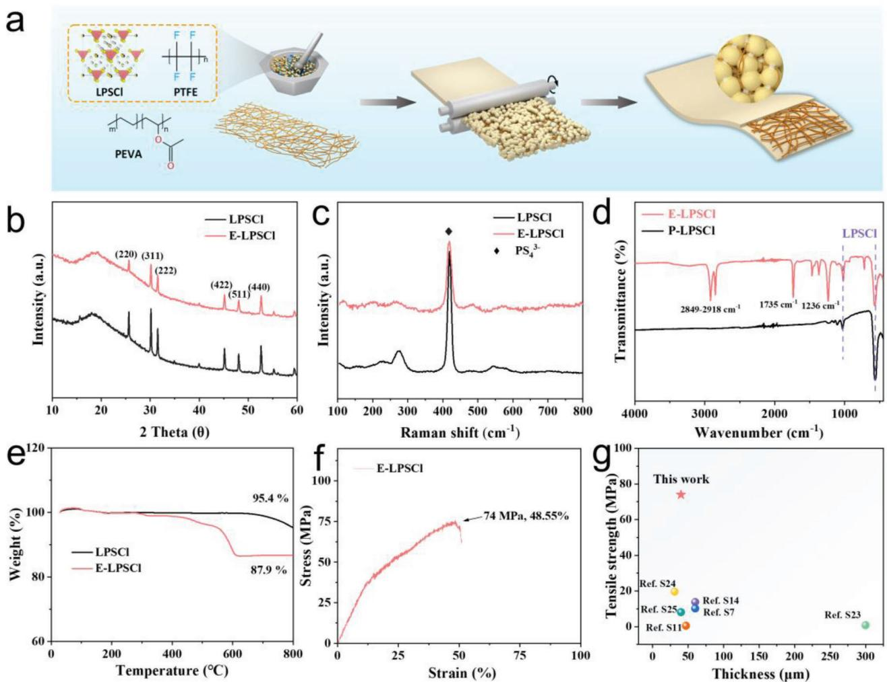
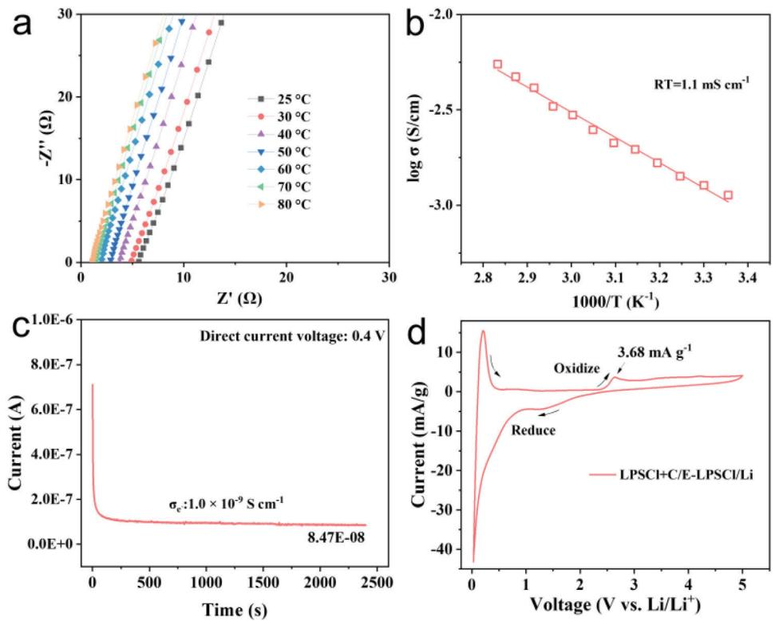
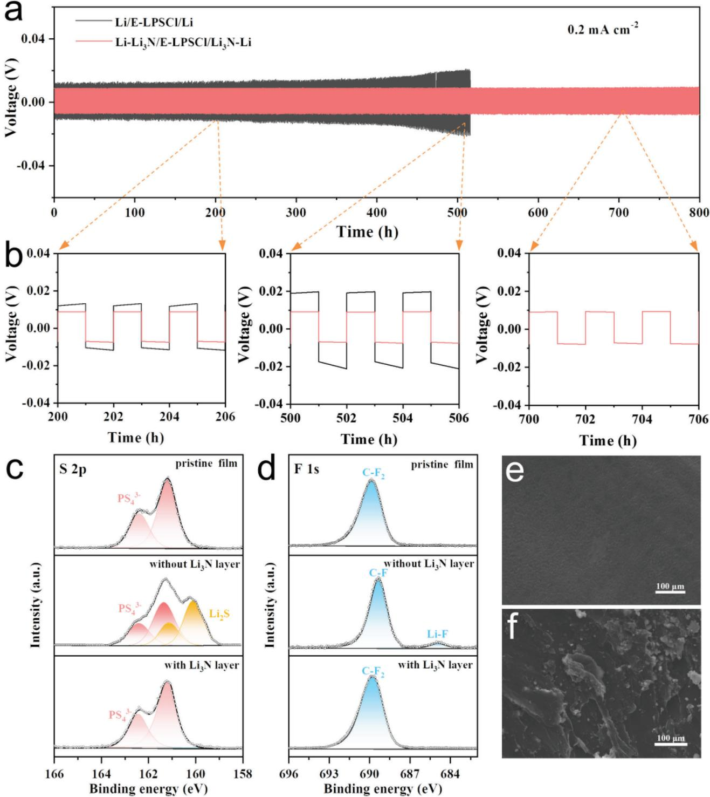
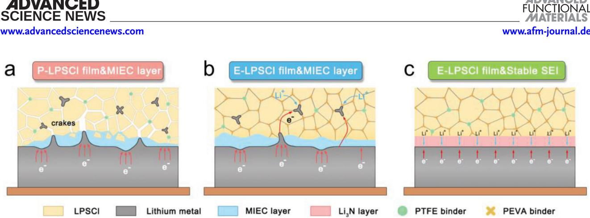
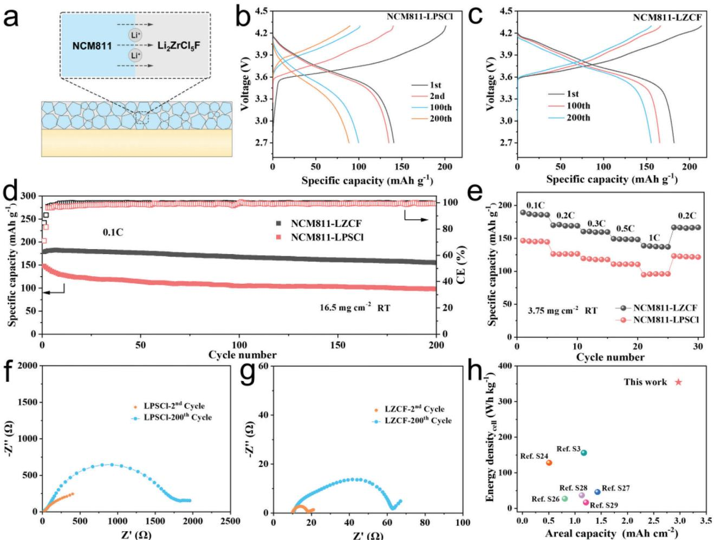

# **High Ionic Conductive, Mechanical Robust Sulfide Solid Electrolyte Films and Interface Design for All-Solid-State Lithium Metal Batteries**

*Dabing Li, Hong Liu, Chao Wang, Chong Yan, Qiang Zhang,\* Ce-Wen Nan, and Li-Zhen Fan\**

**All-solid-state lithium batteries (ASSLBs) are considered a**

**promising technology for next-generation energy storage systems due to their inherent safety. However, the conventional laboratory-scale ASSLBs reported to date are based on pellet-type structures with thick solid electrolyte layers, leading to challenges related to low energy densities and poor electrochemical performance. In this study, porous adhesive poly(ethylene vinyl acetate) (PEVA) scaffolds and polytetrafluoroethylene (PTFE) binders are utilized to interweave sulfide solid electrolytes into freestanding films with an ultra-low thickness of 40 μm, high ionic conductivity of 1.1 mS cm−1, and a high tensile strength of 74 MPa. To mitigate the reduction reaction between the PTFE binder and the lithium metal anode, a Li3N-rich solid electrolyte interphase (SEI) in situ on lithium metal is formed, and the assembled symmetric cell shows excellent cycling stability within 800 h at the current density of 0.2 mA cm−2 and room temperature. Additionally, the ASSLBs using oxidatively stable Li2ZrCl5F in the composite cathode and the prepared solid electrolyte film demonstrate exceptional cycling performance and fast-charging capability, with a high cell-level energy density of 354.4 Wh kg−1. The ASSLBs prepared by coupling E-LPSCl film and stable interface design exhibit excellent electrochemical performance and a high cell-level energy density.**

State Key Laboratory of New Ceramics and Fine Processing School of Materials Science and Engineering Tsinghua University Beijing 100084, China C. Yan Shanxi Research Institute for Clean Energy Tsinghua University Taiyuan 030032, China Q. Zhang Beijing Key Laboratory of Green Chemical Reaction Engineering and Technology Department of Chemical Engineering Tsinghua University Beijing Beijing 100084, China E-mail: [zhang-qiang@mails.tsinghua.edu.cn](mailto:zhang-qiang@mails.tsinghua.edu.cn) The ORCID identification number(s) for the author(s) of this article can be found under <https://doi.org/10.1002/adfm.202315555>

**DOI: 10.1002/adfm.202315555**

#### **1. Introduction**

Rechargeable lithium-ion batteries (LIBs) are extensively employed for energy storage across various applications, spanning from portable electronic devices to electric vehicles.[\[1\]](#page-10-0) However, current LIBs faced grave safety risks such as thermal runaway accidents due to flammable liquid electrolytes, and the limited theoretical energy density of graphite anodes severely retards their future applications. All-solidstate lithium batteries (ASSLBs) with solid electrolytes (SEs) are seen as promising for next-generation energy storage devices owing to enhanced safety, potentially enabling the practical utilization of lithium metal anodes to construct highenergy-density batteries.[\[2–6\]](#page-10-0) Among various SEs, sulfide electrolytes have shown superior ion conductivity of 10−3–10−2 S cm−1 at room temperature (RT).[\[7–11\]](#page-10-0) Furthermore, sulfide SEs are mechanically ductile compared to oxide SEs, which significantly reduces interfacial resistance when

in contact with the battery components.

Although much progress has been made so far in high ionic conductivity sulfide SEs, the bottleneck for high-performance ASSLBs is the excessively thick solid electrolyte (SE) layers resulting in sluggish Li+ kinetics and low overall energy density of ASSLBs.[\[12\]](#page-10-0) As a key component of the ASSLBs, the SE layer is rather thick (typically more than 0.5 mm) to ensure the long-term cycling of the ASSLBs. Most reported lab-scale ASSLBs provided unpractical overall energy densities (*<* 50 Wh kg−1), and thick SE pellets with long Li+ diffusion pathways displayed extremely high areal resistance (*>* 100 Ω cm2).[\[13\]](#page-10-0) To improve the high energy and power densities of ASSLBs, it is imperative to exploit scalable production technologies for sulfide SE films (*<* 50 μm) with desirable ionic conductivity, high electrochemical stability, and robust mechanical properties.[\[13,14\]](#page-10-0) However, due to the relatively low fracture toughness of sulfide SEs, reducing the thickness of the sulfide SE layer will face the risk of internal shortcircuit failure.[\[15\]](#page-10-0) Therefore, the mechanical properties of sulfide SE films should be emphasized, as this parameter is crucial for the practical assembly and operation of ASSLBs under low operating pressure or no operating pressure conditions.

D. Li, C. Wang, L.-Z. Fan

Beijing Advanced Innovation Center for Materials Genome Engineering Beijing Key Laboratory for Advanced Energy Materials and Technologies University of Science and Technology Beijing Beijing 100083, China E-mail: [fanlizhen@ustb.edu.cn](mailto:fanlizhen@ustb.edu.cn) H. Liu, C.-W. Nan

Specifically, the common way to compensate for the mechanical weaknesses of sulfide SE films is to increase their flexibility. Several approaches have been utilized to address these aforementioned issues, such as template (scaffold) support,[\[16–19\]](#page-10-0) the binder-assisted methods in solution casting,[\[20,21\]](#page-10-0) and the recently published dry-film approach.[\[22\]](#page-10-0) The solution casting process is the common way to fabricate sheet-type electrodes in LIBs. However, sulfide SE is susceptible to nucleophilic attacks from polar functional groups in organic solvents, leading to the loss of crystal structure.[\[23\]](#page-10-0) The solution casting approach is thus limited to a few non-polar solvents, such as heptane, xylene, anisole, etc. Additionally, some organic solvents also pose issues of toxicity and high recovery costs. Compared to the solution casting approach, the solvent-free method is considered the most applicable way for preparing high-performance sulfide ultra-thin films.[\[22\]](#page-10-0) It avoids the significant decrease in the ionic conductivity of sulfide SEs, which is caused by the harmful side reactions of polar solvents and the accumulation of binders during solvent evaporation. However, the dry-film process also has its drawbacks, one of which is that the main polytetrafluoroethylene (PTFE) binder cannot guarantee sufficient adhesion to sulfide SE due to its limited viscoelasticity. Despite dry processing is feasible, studies have shown that the tensile strength of prepared sulfide films is less than 1 MPa.[\[24\]](#page-10-0) The low mechanical strength makes it difficult to inhibit crack propagation in highspecific energy electrode materials (such as silicon, sulfur, and lithium electrodes) owing to repeated volume changes during cycling. Moreover, PTFE binder reacts readily with lithium metal to convert to a mixed ion-electron conducting interphase.[\[25\]](#page-10-0) Integrating PTFE-sulfide SE films into high-energy batteries still presents many challenges.

Currently, lithium (Li) metal anodes remain the ultimate choice for LIBs, offering a high theoretical capacity (3860 mAh g−1) and a low electrochemical potential of −3.04 V versus the standard hydrogen electrode.[\[26,27\]](#page-10-0) However, previous research has focused more on the thickness of sulfide film while overlooking the stability of the ultrathin film to the Li metal anodes. In sulfide-based ASSLBs, typical inorganic components such as LiF, Li3N, LiI, Li2O, etc., exhibit kinetic stability with Li metal and contribute to the stability of suppressing Li dendrites.[\[25,28\]](#page-10-0) According to the calculation results, the interfacial adhesion energy of solid electrolyte interphase (SEI) plays a pivotal role in effectively inhibiting Li dendrite growth.[\[29\]](#page-10-0) Among various SEI components, Li3N has a high ionic conductivity of ≈ 10–3 S cm–1, low electronic conductivity, and the highest interfacial adhesion energy toward Li metal (1.36 J m−2).[\[30,31\]](#page-10-0) The SEI with a higher interfacial adhesion energy value ensures good contact between SEs and Li metal during the Li stripping. As the thickness of SE film decreases, not only electrochemical-mechanical issues but also the interface has to be considered to realize the implementation of ASSLBs with Li metal anode and the SE films.

Herein, we report a scalable approach for fabricating a 40 μmthick free-standing sulfide SE film reinforced with porous and sticky poly(ethylene vinyl acetate) (PEVA) scaffold. The non-polar polymer backbone of the PEVA binders interacts with the polar groups of sulfide SEs, thereby enabling the sulfide SE film with high mechanical properties. The Li5.7PS4.7Cl1.3@PTFE/PEVA (denoted as E-LPSCl) film, fabricated using a solvent-free process, displays an ionic conductivity of 1.1 mS cm−1 at RT and an exceedingly high tensile strength of up to 74 MPa. The excellent mechanical strength makes the composite film suitable for large-scale industrial production, such as roll-to-roll production processes. Furthermore, a homogeneous Li3N-rich protective layer was formed in situ by manipulating the reaction of azidotrimethyl silane (C3H9SiN3) with Li metal. Benefiting from the enhanced mechanical properties and the designed Li3N-rich SEI protective layer, the Li3N-Li/E-LPSCl/Li3N-Li symmetric cell delivers a high critical current density (CCD) value of 1.0 mA cm−1, and it maintains a long-term lithium plating/stripping cycle of 800 h at the current density of 0.2 mA cm−2 and RT. Additionally, the well-configured NCM811-Li2ZrCl5F/Li3N-Li ASSLBs capitalizing the fabricated E-LPSCl film displays a high initial Coulombic efficiency (ICE) of 85.1% and long cycling performance of 86.7% capacity retention after 200 cycles at 0.1C and RT conditions.

## **2. Results and Discussion**

#### **2.1. Synthesis and Structure of Sulfide Films**

The lithium argyrodite Li6-*x*PS5-*x*Cl1+*x* is considered state-ofthe-art Li+ conductors due to their high ionic conductivity (*>* 1 mS cm−1) and improved deformability (Young's modulus ≈ 30 GPa) while retaining improved stability to Li metal.[\[32\]](#page-10-0) In the study, the chlorine-rich sulfide SEs were synthesized using a typical solid-phase sintering method.[\[33\]](#page-10-0) The X-ray diffraction (XRD) patterns show that the series of SEs belongs to a cube-type argyrodite with an *F*—43m space group and the main diffraction peaks continually shift to higher diffraction angles with increasing Cl substitution (Figure S1a,b, Supporting Information). The overall ionic conductivity derived from Nyquist plots exhibits a linear growth with the rise in Cl concentration. Notably, Li5.4PS4.4Cl1.6 demonstrates the highest ionic conductivity at RT, reaching 8.1 mS cm−1 (Figure S1c, Supporting Information). It has been reported that a high degree of Cl−/S2- structural greatly affects the lattice softness, leading to faster ion transport in Li6PS5Cl.[\[34\]](#page-10-0) Due to the urgent requirement for high-safety all-solid-state Li metal cells, it is crucial to explore the electrochemical stability of Li6-*x*PS5-*x*Cl1+*x* SEs toward the Li metal anodes. The CCD value represents the maximum current density per unit area at which the growth of lithium dendrites will not cause a short circuit within the SEs. The variation trend of CCD value for the series of Li6-*x*PS5-*x*Cl1+*x* is shown in Figure S2 (Supporting Information). Among various doped SEs, Li5.4PS4.4Cl1.6 exhibits the lowest CCD value of 0.4 mA cm−2. Notably, a moderate Cl concentration of Li5.7PS4.7Cl1.3 reaches the highest CCD value over 1 mA cm−2 and possesses a high ionic conductivity of 4.8 mS cm−1 at RT (Figure S3, Supporting Information). Several SEI components (e.g., Li2S, LiCl, etc.) are electronically insulating but ionically conducting, which blocks the electron pathway to prevent further decomposition of sulfide SEs. In Li5.7PS4.7Cl1.3, an appropriate concentration of LiCl and Li2S-dominated interphase layer is the decisive factor for avoiding a sustained (electro)chemical parasitic reaction between Li and sulfide SEs.[\[35\]](#page-10-0) Considering Li5.7PS4.7Cl1.3 has the highest electrochemical interface stability towards Li metal, we chose it for subsequent experiments. The electronic conductivity of Li5.7PS4.7Cl1.3 is 1.6 × 10−8 S

cm−1 at RT (Figure S4, Supporting Information). As displayed in Figure S5 (Supporting Information), the magnified SEM image shows that the particle sizes of ball-milled Li5.7PS4.7Cl1.3 (LPSCl) powders are ≈ 5 μm.

Given that the use of SE films in ASSLBs is in common with the separators used in LIBs, certain requirements need to be fulfilled, such as ionic conductivity, electrical insulation, electrochemical stability, and especially mechanical stability, etc. The facile dry process for preparing sulfide SE film exhibits retained ionic conductivity and thin layers. However, the physical and electrochemical stability of the sulfide SE film has not been evaluated clearly. As illustrated in Figure S6a (Supporting Information), the ionic conductivity of as-prepared sulfide films gradually decreases as the PTFE ratio increases from 0.2 to 2 wt%. The ionic conductivity of the 99.5 wt% LPSCl and 0.5 wt% PTFE (denoted as P-LPSCl film) reaches 3.6 mS cm−1 at RT. The increasing ioninsulating PTFE binders physically wrap around the LPSCl particles and impede ion transport with the SEs. Generally, ultra-thin SE films should have high mechanical toughness to ensure stable and effective operation in the ASSLBs. It is worth noting that the tensile strength of the P-LPSCl film is only 1.2 MPa (Figure S6b, Supporting Information), which is similar to other test results in the literature.[\[24\]](#page-10-0) In addition, the SEM image of the P-LPSCl film shows poor mechanical integrity at a macroscopic scale after hot calendaring (Figure S6c, Supporting Information). The crake extension is not improved by the subsequent cold-pressing process due to the absence of soft components (Figure S6d, Supporting Information). It can be foreseen that reducing the thickness of the SE film makes it more susceptible to short circuits due to mechanical failures.

Fourier-transform infrared (FTIR) was utilized to characterize the changes in the PTFE binders and P-LPSCl film upon contact with Li metal for three days. As can be seen in Figure S7a (Supporting Information), the peak of the C─F bond weakens, while the C═C bond forms in the reduced PTFE powders, indicating the formation of electron-conductive SP2 carbon species after the defluorination. The same trend of reduction can be observed in the P-LPSCl film (Figure S7b, Supporting Information). Compared to the pristine P-LPSCl film, the electronic conductivity of the reduced P-LPSCl film increases from 7.4 × 10−9 to 7.1 × 10−7 S cm−1 at RT (Figure S8, Supporting Information). The chemical decomposition of the PTFE simultaneously alters the electronic conductivity of the SE film.

To address the above challenges, we utilized a scalable approach for fabricating a free-standing sulfide SE film reinforced with porous and sticky poly(ethylene vinyl acetate) (PEVA) scaffold. Mechanically compliant PEVA porous films were chosen as a skeleton to reinforce the LPSCl-PTFE mixture, as it provides great thermal stability, strong adhesion properties, and a low areal density of 0.91–0.93 g cm−3. [\[36\]](#page-10-0) The porosity and tortuosity of the scaffold material have a large effect on the homogeneity of the prepared sulfide films. The digital photo and SEM image of PEVA shows a mesh structure with randomly distributed fibers as well as large opening sizes, demonstrating its effective ionic conductor embedding capability (Figure S9a,b, Supporting Information). The stress-strain curve of the PEVA porous films is displayed in Figure S9c (Supporting Information), where the tensile strength value of 239 MPa proves its excellent adhesive properties. The fabrication process of E-LPSCl films is illustrated in **Figure 1**[a.](#page-3-0) A self-supporting PEVA-reinforced sulfide SE film was prepared by rolling the P-LPSCl mixture and PEVA scaffold (≈ 15 μm) several times using the hot calendaring machine at 50 °C.

Figure [1b](#page-3-0) compares the XRD pattern of the thin film and LP-SCl SEs. The diffraction peaks of E-LPSCl films are comparable to pristine argyrodite LPSCl particles and no newborn phases are detected in the SE films, indicating that the incorporation of PEVA backbone and PTFE binders into sulfide-based SEs does not change the phase structure or the grain size of LPSCl. Raman spectra in Figure [1c](#page-3-0) also confirm this conclusion. The peaks at 276, 419, and 545 cm−1 are ascribed to the tetrahedral PS4 3− unit in LPSCl particles, whereas the PEVA porous films and the PTFE binders have a negligible side effect on the argyrodite-type LPSCl. Figure [1d](#page-3-0) shows the FTIR spectra of the PEVA and E-LPSCl film. PEVA has ester side chains that are linked to the non-polar hydrocarbon backbone in the structure. The characteristic absorbance bands at 2917 and 2849 cm−1 are related to the vibration of the CH2 group in the PEVA structure. The peaks at 1735 cm−1 belong to the C═O bonds, and those at 1236 cm−1 can be ascribed to C─O─C bonds in the PEVA structure. By interacting with the groups of sulfide particles, the nonpolar polymer backbone and a small number of polar functional groups in PEVA confer favorable cohesion and adhesion in the prepared films. Thermal stability is important to both the safety and performance of ASSLBs. Based on the results of the thermogravimetric analysis in Figure [1e,](#page-3-0) the PEVA porous film is stable up to ≈280 °C and constitutes only 7.5% of the mass of the thin sulfidebased film. Benefiting from the high mechanical compliance of porous PEVA films, the thin E-LSPCl film shows an ultrahigh tensile strength of 74 MPa (Figure [1f\)](#page-3-0). The mechanical properties of the E-LPSCl film show superiorities to other representative works in the literature (Figure [1g\)](#page-3-0), and the detailed parameters are presented in Tables S1 and S2 (Supporting Information). All of the LPSCl particles are interweaved by PTFE and PEVA fibers to form a flexible sulfide film, as illustrated in the optical photographs of the E-LPSCl film (Figure S10a–c, Supporting Information). The SEM image in Figure S10d (Supporting Information) indicates that the thickness of the free-standing E-LPSCl film is ≈ 40 μm. The intimate and densified contact of the SEs with the PEVA porous fibers can be observed in Figure S10d–e (Supporting Information), which indicates the successful infiltration of sulfide SEs into the pores of the PEVA substrate. FTIR measurements were applied to investigate the possible side reactions between LPSCl, PTFE, and PEVA binders by examining the structural changes of E-LPSCl films before and after storage at 60 °C for 1 month. The results show that no difference between the aged and pristine samples was observed, indicating the chemical compatibility between PEVA and LPSCl SEs (Figure S11, Supporting Information).

The assembly of sulfide SEs on the PEVA backbone constructs robust mechanical properties and continuous ion transport channels in the thin sulfide film. The ionic conductivities of the E-LPSCl film were probed using AC electrochemical impedance spectroscopy (EIS) measurements. **Figure [2](#page-4-0)**a depicts the Nyquist plots of the E-LPSCl from 25 to 80 °C. Impressively, the thin sulfide SE film possesses an ultra-low resistance of 5.6 Ω at RT. An ionic conductivity of 1.1 mS cm−1 is determined after subtracting the resistance of outer wires and mold of 1 Ω. Based

**Figure 1.** Structural properties and performance of the prepared E-LPSCl film. a) Schematic illustration of the fabrication process for ultrathin sulfide electrolyte film. b) XRD patterns and c) Raman spectra of LPSCl SEs and E-LPSCl film. d) FT-IR spectra of thin P-LPSCl and E-LPSCl film. e) Thermogravimetric analysis of LPSCl powders and E-LPSCl film. f) Tensile stress-strain curve of prepared thin E-LPSCl film. g) Comparison of the thickness and tensile strength of E-LPSCl film with other reported films in the literature.

on the Arrhenius plots in Figure [2b,](#page-4-0) the activation energy Ea of E-LPSCl film is ≈ 0.3 eV, which is slightly higher than pristine LPSCl (0.28 eV). The areal resistance of the thin film is calculated to be 3.63 Ω cm2 at RT, and the ion conductance is as high as 217.49 mS. The significant reduction in ionic transport impedance from thick pellets to the E-LPSCl film provides the basis for the manufacture of high-energy-density ASSLBs. Additionally, the electronic conductivity of sulfide SEs plays a pivotal role in determining the cycling stability of Li metal.[\[37\]](#page-10-0) The enhanced electronic conductivity of sulfide SEs promotes the formation of Li dendrites. As illustrated in Figure [2c,](#page-4-0) the electronic conductivity of the E-LPSCl film reaches 1.0 × 10−9 S cm−1, representing a ≈ 16-fold reduction compared to pristine LPSCl SEs. To assess the electrochemical window of LPSCl, cyclic voltammetry (CV) measurements were performed using an asymmetric cell configuration of Li/SE/SE+carbon black, where the introduced carbon black provided sufficient electron transport to monitor the reaction potential. As shown in Figure [2d,](#page-4-0) the CV curve of LPSCl indicates poor oxidation stability with an onset potential of ≈2.6 V (vs Li/Li+), which is consistent with previous reports of lithium argyrodite-type SEs.[\[38,39\]](#page-10-0) In addition, the CV plot exhibits a maximum anodic current of 3.68 mA g−1 in the following potential range (2.6-5 V), showing irreversible self-decomposition of LPSCl particles.

Considering SE films are usually subjected to high pressure in the ASSLBs during the cycling, compression experiments of LP-SCl thick layer and E-LPSCl film were conducted to further test their mechanical stability. As shown in Figure S12a (Supporting Information), the thick SE layer illustrates a fracture point at a low stress of 0.19 MPa (6.5% reduction in thickness) due to the intrinsically high brittleness of the sulfide electrolyte. However, thin E-LPSCl film undergoes three stages during axial compression: elastic deformation, plastic deformation, and densification. As shown in Figure S12b (Supporting Information), even at high compressive stress of 80 MPa, there was no rupture of the SE film with the high deformation of 90% reduction in thickness.

**Figure 2.** Electrochemical performance of the thin E-LPSCl film. a) Variable-temperature Nyquist plots of E-LPSCl film with a thickness of 40 μm. b) Arrhenius plot of E-LPSCl film. c) Electronic conductivity test for E-LPSCl film. d) CV plot of the E-LPSCl film based on SEs+C/E-LPSCl/Li configuration.

The enhanced mechanical properties are attributed to the strong binding ability of the PEVA binder and LPSCl particles. Furthermore, the electrochemical performance of the prepared E-LPSCl film was first examined in a Li/Si half cell with a voltage range of 0.05-1.5 V (vs Li+/Li). The mass loading of the Si active material is 0.5 mg cm−2. Figure S13a presents the galvanostatic charge and discharge profiles of the Si/E-LPSCl film/Li half-cell at the first four cycles at the rate of 0.1 C. Notably, high discharge and charge capacities of 3339.8 and 2930.7 mAh g−1 were achieved in the first cycle and the initial Coulombic efficiency (ICE) is as high as 87.8%. The long-term cycling performance of the Li/Si half cell at rates of 0.1 C is shown in Figure S13b (Supporting Information). After 50 cycles, there remains a remarkable discharge capacity of 1713.9 mAh g−1. The excellent electrochemical stability demonstrates the great advantage of the mechanically stabilized E-LPSCl film in adapting to the colossal volume change of Si anode materials during cycling.

#### **2.2. Li Metal Compatibility of Sulfide Films**

The electrochemical stability and compatibility of the Li/SE interface are critical factors influencing the overall performance of ASSLBs. To alleviate the continued reduction reaction between PTFE and Li, a Li3N-rich SEI was constructed in situ on the Li metal. Azido-trimethyl silane C3H9SiN3 was known as an ideal electrolyte additive in Li metal batteries for inducing a conductive SEI and dense Li+ deposit morphology on the Li metal surface.[\[40,41\]](#page-10-0) Inspired by this, azido-trimethyl silane C3H9SiN3 (≈20 μL) was directly drop-coated on the fresh Li foil to form a Li3N-rich SEI interlayer, as schematically shown in **Figure 3**[a.](#page-5-0) Optical images of Li metal show a darkening of the color after 5 m of contact between C3H9SiN3 and Li metal in an Ar atmosphere (Figure S14a,b, Supporting Information).

The components of the artificial interphase were analyzed by XRD patterns (Figure [3b\)](#page-5-0), which show that Li3N (PDF#46-1201) is the main crystalline phase on the Li foils. Azide (N3 −) tends to react with the Li metal in situ to form a Li3N passivation layer.[\[34\]](#page-10-0) XPS analysis was further carried out to detect the main components of SEI. As can be seen in Figure [3c,](#page-5-0) a prominent N 1s signal is detected at 398.8 eV, which is attributed to the Li3N species. The SEM image of C3H9SiN3-treated Li foil presents a compact and stable SEI layer (Figure S14b, Supporting Information), and the EDS spectra depict a uniform distribution of N elements (Figure S14c, Supporting Information). The cross-sectional SEM image of the artificial SEI layer indicates a thickness of ≈ 3 μm, as displayed in Figure S14d (Supporting Information). To evaluate the applicability of the Li3N SEI layer, lithium symmetric batteries were assembled using an LPSCl thick layer with Li3N modified Li or bare lithium on both sides. Notably, the CCD value of the Li3N-Li/LPSCl pellets/Li3N-Li is 1.8 mA cm−2 (Figure S15a, Supporting Information). Benefiting from the excellent reaction kinetics of Li3N, the Li3N-Li/LPSCl pellets/Li3N-Li cell maintains a stable cycling performance within 1000 h at a high current density of 1.0 mA cm−2 (Figure S15b, Supporting Information). In sharp contrast, under the same test condition, the Li/LPSCl pellets/Li

**Figure 3.** Modification and electrochemical stability assessment of the Li/SEs interface. a) Schematic illustration of forming a Li3N-rich SEI layer on the Li metal. b) The XRD patterns of pristine Li and C3H9SiN3–treated Li metal. c) N 1s spectra of C3H9SiN3–treated Li metal. The CCD detection of d) P-LPSCl film and e) E-LPSCl film with Li metal. f) The CCD measurement of E-LPSCl film with Li3N-Li anode.

experience short circuits after a few hours of cycling (Figure S15c, Supporting Information). The enhanced electrochemical performance of the Li3N interface constructed on the Li metal exhibits great potential for stabilizing the sulfide SE and Li anode.

To assess the electrochemical stability of the sulfide thin films towards Li metal, the Li/Li symmetric cells were assembled and measured at the current ramping test from 0.1 to 1.5 mA cm−2. In Figure 3d, the Li symmetric cell with the P-LPSCl film experienced a sharp voltage drop at 0.3 mA cm−2, suggesting that the formation of Li dendrites leads to a short circuit. By contrast, the Li/E-LPSCl film/Li cell maintains stable cycles when the current density reaches 0.7 mA cm−2 (Figure 3e). The results proved the importance of ensuring the mechanical stability of SE films to integrate Li metal with thin SE film. Impressively, the Li-Li3N/E-LPSCl film/Li-Li3N symmetric cell exhibits a superior CCD value of 1.0 mA cm−2 (Figure 3f), which is comparable to that of the pristine LPSCl pellet. This scenario confirms that the designed protective Li3N SEI layer effectively suppresses Li dendrite formation and mitigates the side reaction between the PTFE binder and Li metal.

The long-term cycling performance of the Li/P-LPSCl film/Li symmetric cell was tested under a current density of 0.1 mA cm−2 and a cut-off capacity of 0.1 mAh cm−2 (Figure S16, Supporting Information). Despite an initial overpotential as low as 3 mV in the symmetric cells, the overpotential drops rapidly and a micro-short circuit occurs after 20 h of cycling. As shown in Figure S17b (Supporting Information), a large amount of black by-products appeared on the surface of the P-LPSCl film, indicating the severe reaction between Li metal and P-LPSCl film. However, the Li/E-LPSCl film/Li symmetric cell exhibits stable lithium plating/stripping behavior over 510 h under a current density of 0.2 mA cm−2 and a cut-off capacity of 0.2 mAh cm−2, accompanied by a marginal increase in overpotential from 12 to 20 mV (**Figure 4**[a,b\)](#page-6-0). The improved cycling performance is ascribed to the enhanced mechanical stability of the sulfide film and a simultaneous decrease in electronic conductivity, resulting in less lithium filament and crake propagation during the plating/stripping process. Static charge-discharge tests were also conducted on the Li-Li3N/E-LPSCl film/Li-Li3N symmetric cell at the current density of 0.2 mA cm−2 and a cut-off capacity of 0.2 mAh cm−2. Notably, the symmetric cell possesses stable cycling within 800 h with a low overpotential of 9 mV (Figure [4a,b\)](#page-6-0), evidencing the high ion conductance and electrochemical stability of the designed SEI layer.

As shown in Figure [4c,d,](#page-6-0) both the appearance of the Li2S peak in the S 2p spectra and the emergence of the LiF peak in the F 1s spectra indicate the degradation of the E-LPSCl film upon exposure to the Li metal anode. With the Li3N SEI layer, it can be seen that there is no significant change in the bond energies of S 2p spectra and F 1s spectra from E-LPSCl film, proving that a uniform Li+ electrodeposition occurs during cycling. It can be observed in Figure [4e](#page-6-0) that the Li3N-rich interphase is rather dense and smooth and without notable signs of Li dendrites after cycling for 50 h. Furthermore, no huge crakes and voids are observed on the surface of the E-LPSCl film after 50 h of cycling (Figure S17c, Supporting Information). In contrast, mossy Li dendrites can be observed on the surface of bare Li metal from the Li/E-LPSCl/Li symmetric cell after cycling for 50 h (Figure 3f). In Figure S17d (Supporting Information), crakes and Li dendrites are also observed on the surface of the E-LPSCl film, demonstrating the partial reduction reaction between the E-LPSCl film and Li metal. At a high current density of 0.5 mA cm−2, the Li-

**Figure 4.** Electrochemical stability properties E-LPSCl film with pristine Li/modified Li metal anode. a) Galvanostatic cycling of Li/E-LPSCl/Li symmetric cell and Li3N-Li/E-LPSCl/Li3N-Li symmetric cell at 0.2 mA cm−2 under 25 °C, and b) sectional cycling profile corresponding to different cycling times. XPS spectra of c) S 2p, d) F 1s for pristine E-LPSCl films, E-LPSCl films without Li3N layer after cycling over 50 h at 0.2 mA cm−2, and E-LPSCl films with artificial Li3N SEI layer after cycling over 50 h at 0.2 mA cm−2. The SEM images of Li metal surface morphology from the Li symmetric cells assembled with e) Li3N-Li metal and f) pristine Li metal after 50 h of cycling at 0.2 mA cm−2.

**Figure 5.** Schematic diagram of lithium deposition and dendrite growth. a) P-LPSCl film and mixed ion-electronic conductive layer (MIEC). b) E-LPSCl membrane and MIEC layer. c) E-LPSCl membrane with Li3N modification layer.

Li3N/E-LPSCl film/Li-Li3N cell can also stably cycle for 400 h (Figure S18, Supporting Information). As shown in **Figure 5**a, when the film of SEs becomes thinner, lithium dendrites are more likely to reach the counter electrode due to the mechanical defects of the thin SE film, greatly increasing the risk of shortcircuit in lithium-metal batteries.[\[42,43\]](#page-10-0) In addition, the poor reduction stability of thin electrolyte film is noteworthy, and the reaction between the PTFE binder and Li metal anode is similar to that of the sulfide Li10GeP2S12 with lithium metal,[\[44\]](#page-10-0) which may produce a mixed ion-electronic conductive (MIEC) layer, leading to the continuation of the side reaction (Figure 5b). In conclusion, the degraded mechanical stability and the formation of the MIEC layer exacerbate the failure of the SE/Li interface. Benefiting from the high mechanical performance of the sulfide film and Li3N SEI layer in this work, we realized a highly electrochemically stable ultra-thin film for Li metal anode applications (Figure 5c).

#### **2.3. Electrochemical Performance of the ASSLBs**

Another challenge in achieving high-energy-density sulfidebased ASSLBs is the preparation of thick cathode electrodes with high loading densities (*>*2 mAh cm−2). However, the severe space charge layer formed between sulfide SEs and oxide CAMs results in retarded ion conduction.[\[45\]](#page-10-0) Sulfide-based SEs also have the drawback of a narrow electrochemical stability window. The electrochemical byproducts with poor Li+ migration within cathode-SEs interfaces severely limit the electrochemical performance of the resulting ASSLBs.

To address these challenges, the halide SEs Li3MCl6 (M═Sc, Y, In, etc.) have emerged as attractive alternatives due to their flexibility, intrinsic high oxidation stability, and moderate ionic conductivity.[\[46,47\]](#page-10-0) Earlier reported halide SEs such as Li3InCl6, and Li3YCl6, are oxidatively stable yet still contain rare and costly elements. An earth-abundant and cost-effective halide-based SE, Li2ZrCl6 (LZC), has been reported with its remarkable ionic conductivity and outstanding compatibility with 4 V-class CAMs.[\[48\]](#page-10-0) Recently, experimental and computational results have proved that F-doped SEs can further increase the electrochemical oxidation limit.[\[49\]](#page-10-0) Guided by this, the microcrystalline halide-based SEs Li2ZrCl6 (LZC) and Li2ZrCl5F (LZCF) were prepared via a facile ball milling process.

The XRD spectra of LZC and LZCF are displayed in Figure S19a (Supporting Information). All the diffraction peaks of the prepared samples are indexed with Li3YCl6-like structure (ICSD No. 29 962) and no impurity peaks appeared. From the XRD results, the main peaks of Li2ZrCl5F are shifted to a higher 2 angle due to the replacement of the Cl portion by F with a smaller ionic radius (F−: 133 pm *<* Cl−: 181 pm). The Nyquist plots are displayed in Figure S19b (Supporting Information), and the ionic conductivities of as-milled LZC and LZCF at room temperature are 4.8 × 10−4 and 3.5 × 10−4 S cm−1, respectively. As shown in Figure S19c, The Ea of LZCF is 0.38 eV, and the Ea of LZC is 0.35 eV. Direct current polarization was also performed to assess the electronic conductivity. The electronic conductivity of LZCF is measured to be 6.5 × 10−10 S cm−1 at RT (Figure S19d, Supporting Information), which is lower than that of Li2ZrCl6 (2.4 × 10−9 S cm−1 at RT). Furthermore, the electrochemical stability of LZC and LZCF powders is shown in Figure S20 (Supporting Information). Li-In alloy electrodes instead of Li metal were used as counter/reference electrodes to avoid the severe side reaction between halide SE with Li metal. Notably, the LSV plot of LZCF indicates a small integrated current of 0.28 mAV g−1 up to 5.0 V (vs Li+/Li), which is much smaller than that of LZC SEs. Despite sacrificing some ionic conductivity, it's anticipated that F-containing chloride SEs could remarkably improve the actual oxidation stability in the composite cathode.

The SEM images of LZCF powders with a particle size of ≈1–3 μm, slighter smaller than the milled LPSCl particles (Figure S21a, Supporting Information). In ASSLBs, a rational particle size ratio () of the cathode to the sulfide SEs is essential for constructing sufficient ionic diffusion channels in the composite cathode. A larger facilitates better utilization of the CAMs and enables higher cathode loading.[\[50\]](#page-10-0) The EDS mapping of the LZCF particles reveals a homogeneous distribution of Zr, Cl, and F elements, indicating a complete reaction of the precursors (Figure S21b–d, Supporting Information). The electrochemical properties of LZC and LZCF were tested in combination with uncoated LCO active materials in all-solid-state cells. The test results as shown in Figure S22 (Supporting Information). At 0.2C and high cut-off voltages of 4.5 V (vs Li+/Li), the ASSLBs with LZCF SE exhibit a more stable cycling performance than the electrodes with LZC. Finally, the LCO employing LZCF SE exhibits a high initial Coulombic efficiency of 92.1% and shows a long cycle life of 96.5% capacity retention after 100 cycles (Figure S22a,b,

**Figure 6.** Electrochemical Performance of NCM811@LPSCl/E-LPSCl film/Li3N-Li and NCM811@LZCF/E-LPSCl film/Li3N-Li ASSLBs. a) Schematic illustrating great compatibility at the NCM811/Li2ZrCl5F interface. Galvanostatic voltage profiles of b) NCM811@LPSCl/E-LPSCl film/Li3N-Li and c) NCM811@LZCF/E-LPSCl film/Li3N-Li at 0.1C and RT. d) Long-term cycling stability and Coulombic efficiency at 0.1C and RT. e) Rate performances at RT. EIS evolution at the 2nd and 200th cycles of f) NCM811@LPSCl/E-LPSCl film/Li3N-Li and g) NCM811@LZCF/E-LPSCl film/Li3N-Li. h) Comparison of energy density and areal capacity for ASSLBs employing E-LPSCl membranes in this work with previously reported results.

Supporting Information). At higher C-rates (Figure S22c, Supporting Information), the electrodes using LZCF outperform those using LZC, emphasizing to great oxidation tolerance of LZCF SE.

A typical 4 V-class cathode active material (CAMs) of LiNi0.8Co0.1Mn0.1O2 (NCM811) is considered the leading candidate cathode material due to its desirable specific capacity (*>*200 mAh g−1) and high operating potential of ≈3.7 V.[\[51–53\]](#page-10-0) In this work, the NCM811 has a polycrystalline microstructure and a relatively smooth surface with particle sizes of 8– 10 μm (Figure S23, Supporting Information). A mixture of SEs and uncoated NCM811 was prepared via a facile mechanical ball-milling method in the composite cathode fabrication process. In the study, the mass loading of the composite cathode was 16.5 mg cm−2. To evaluate the applicability of thin SEs film and halide-based SEs in ASSLBs, the three-cell architecture of LZCF@NCM811/E-LPSCl film/Li3N-Li, LPSCl@NCM811/E-LPSCl film/Li3N-Li, LPSCl@NCM811/LPSCl thick pellets/Li3N- Li were fabricated. The assembled ASSLBs were tested in the voltage range of 2.7-4.3 V (vs Li+/Li) at 0.1C and RT. **Figure 6**c compares the galvanostatic charge and discharge profiles of the LZCF@NCM811/E-LPSCl film/Li3N-Li cell at the rate of 0.1C. The ASSLBs with NCM811@LZCF composite electrode deliver a discharge capacity of 182 mAh g−1 and a high ICE of 85.1%. In contrast, the ASSLBs with NCM811@LPSCl composite electrode display a lower discharge capacity of 148 mAh g−1 and an ICE of 70% (Figure 6b). The enhanced specific capacity and ICE can be attributed to the excellent chemical compatibility between halide SEs LZCF and uncoated NCM811 particles.

As shown in Figure 6d, the long-term cycling of ASSLBs was also assessed. At the current rate of 0.1C, the ASSLBs with the LZCF@NCM811 cathode and E-LPSCl film deliver excellent stability with a capacity retention of 86.7% after 200 cycles. However, the capacity retention of ASSLBs with LPSCl@NCM811 cathode and E-LPSCl film drops to 66.7% after 200 cycles. The cycling stability of the ASSLBs is remarkably improved by using LZCF SEs in the cathode composite. In addition, the long-term stability of the E-LPSCl film in full cells was also confirmed at 0.2C and 80 °C. As shown in Figure S24 (Supporting Information), the full cell delivers stable capacity retention of 95.3% with a reversible capacity of 183.2 mAh g−1 after 100 cycles, which demonstrates impressive electrochemical stability at higher operating temperatures. To investigate the interfacial degradation, XPS was conducted to probe the NCM811/SEs interface. The Zr 3d and F 1s XPS spectra of the NCM811@LZCF composites are collected, where no changes in the binding energy are observed before and after 200 cycles (Figure S25, Supporting Information). It reinforces that the LZCF@NCM811 cathode experiences little to no oxidation. From the P 2p and S 2p spectra of the NCM811@LPSCl composites, it can be deduced that LPSCl decomposes into trilithium phosphide (Li3P), lithium sulfide (Li2S), and other substances after 200 cycles (Figure S26, Supporting Information). Compared to the LPSCl SEs, the lower ionic conductivity and the change in molar volume of these decomposition products not only cause contact loss but also lead to elevated ion transport impedance and degraded cycling performance.[\[54\]](#page-11-0) EIS was conducted after the first, and 200 cycles of the cells, and the Nyquist plots are shown in Figure [6f,g.](#page-8-0) The high-frequency region is assigned to the bulk SEs resistance and the intermediatefrequency range is ascribed to interfacial resistance. After the first cycle, the interfacial resistance of LZCF@NCM811/E-LPSCl film/Li3N-Li is 8 Ω with marginal growth to 52 Ω after 200 cycles. The value is less than that of LPSCl@NCM811/E-LPSCl film/Li3N-Li cell even after the first cycle, which is consistent with the XPS results.

It should be noted, however, that by applying thick LPSCl sheets, the ASSLBs with the NCM811@LPSCl composite cathode show the lowest reversible specific capacity of 141.3 mAh g−1 and ICE of 66.9% at 0.1C and RT (Figure S27a, Supporting Information). After 200 cycles, the cell shows a low discharge capacity of 70.8 mAh g−1 and capacity retention of 50.2% (Figure S27b, Supporting Information). As shown in Figure S27c (Supporting Information), the interfacial resistance of NCM811- LPSCl/LPSCl thick layer/Li3N-Li is 935.5 Ω, which dramatically increases to 3105 Ω after 200 cycles. The increased thickness of the SE layer greatly enhances the polarization and capacity decay of the ASSLBs, rendering them unacceptable for practical batteries.

To further evaluate the fast-charging capability of the E-LPSCl film in the ASSLBs, we performed galvanostatic tests at various current densities. Note that the CCD value of the E-LPSCl film is not sufficient for cycling at high current densities, the mass loading of the composite cathode was thus limited to 3.75 mg cm−2. At higher C-rates, the specific discharge capacities of ASSLBs with NCM811@LZCF composite cathode are 189.3, 169.8, 160.3, 149.4, and 138.0 mAh g−1 at current rates of 0.1, 0.2, 0.3, 0.5, and 1 C, respectively, which is much higher than those of the ASSLBs with NCM811@LPSCl as cathode material (Figure [6e\)](#page-8-0). The F-doped halide strategy is expected to realize large-scale applications in high electrochemical stability sulfide-based ASSLBs.

The specific parameters for evaluating gravimetric and volumetric energy densities in the whole device are listed in Table S4 (Supporting Information). As illustrated in Figure [6h,](#page-8-0) the energy density and the areal capacity of reported sulfide-based ASSLBs were evaluated. With the reduction of SEs thickness from 800 μm (thick sheets) to 40 μm (E-LPSCl film), the gravimetric energy densities of NCM811@LZCF/E-LPSCl film/Li3N-Li cell increase dramatically from 65.4 to 354.4 Wh kg−1. This value is much higher than the results using conventional thick SE layers and other reported thin SEs. Moreover, an all-solid-state lithium metal pouch battery was assembled using a dry film process. As shown in Figure S28a (Supporting Information), NCM811 cathode film (a mixture of NCM811 and LZCF with a cathode loading of 9.4 mg cm−2), E-LPSCl film, and lithium metal foil were prepared to assemble an all-solid-state lithium metal pouch battery. This pouch cell provides a high initial capacity of 1.68 mAh cm−2 and maintains 1.49 mAh cm−2 after 50 cycles at 0.1 C (see Figure S28b, Supporting Information), displaying the high electrochemical stability of E-LSPCl film. The E-LPSCl films realized through a facile hot-pressing strategy and rational SEI layer design provide a new route for fast-charging and high-safety ASSLBs.

# **3. Conclusion**

We used a solvent-free method to fabricate flexible and ultrathin (40 μm-thick) sulfide-based SE films with mechanically pliable and chemically compatible PEVA skeletons. The prepared sulfide films exhibit an excellent ionic conductivity of 1.1 mS cm−1, an electronic conductivity of 1.0 × 10−9 S cm−1, and a remarkable tensile strength of 74 MPa. Benefiting from the high mechanical strength of E-LPSCl film and designed protective Li3N-rich SEI on Li metal, the Li-Li3N/E-LPSCl film/Li-Li3N symmetric cell demonstrates a superior CCD value of up to 1.0 mA cm−2 and maintains stable cycling for 800 cycles at 0.2 mA cm−2 and RT. Meanwhile, the high oxidative stability chloride-based Li2ZrCl5F as a composite cathode additive in the ASSLBs facilitates the reaction kinetic and long-term cycling. Moreover, using thin SEs film, the assembled ASSLBs deliver an ultrahigh cell-level energy density of 354.4 Wh kg−1 based on the total weight of the battery components. These results showcase the significance of cathode composite design and highlight the need to consider the mechanical properties and interfacial stability of ultrathin sulfide SE films to achieve safe, fast-charging, and high-energy-density ASSLBs.

# **Supporting Information**

Supporting Information is available from the Wiley Online Library or from the author.

# **Acknowledgements**

This work was financially supported by the National Key R&D Program of China (2022YFB3803505), the National Natural Scientific Foundation of China (U21A2080), the Shanxi Key Research and Development Program (202102060301011), the Natural Science Foundation of Beijing Municipality (Z200011) and the Fundamental Research Funds for the Central Universities (GJJ2022-03).

# **Conflict of Interest**

The authors declare no conflict of interest.

### **Data Availability Statement**

The data that support the findings of this study are available from the corresponding author upon reasonable request.

#### **Keywords**

all-solid-state batteries, argyrodite sulfide electrolyte, Li metal compatibility, solid electrolyte film

> Received: December 6, 2023 Revised: January 23, 2024 Published online: March 7, 2024

- [1] B. Dunn, H. Kamath, J.-M. Tarascon, *Science* **2011**, *334*, 928.
- [2] K. J. Kim, M. Balaish, M. Wadaguchi, L. Kong, J. L. M. Rupp, *Adv. Energy Mater.* **2020**, *11*, 2002689.
- [3] L.-Z. Fan, H. He, C.-W. Nan, *Nat. Rev. Mater.* **2021**, *6*, 1003.
- [4] D. Wu, L. Chen, H. Li, F. Wu, *Prog. Mater Sci.* **2023**, *139*, 101182.
- [5] L. Wang, X. Sun, J. Ma, B. Chen, C. Li, J. Li, L. Chang, X. Yu, T.-S. Chan, Z. Hu, M. Noked, G. Cui, *Adv. Energy Mater.* **2021**, *11*, 2100881.
- [6] T. Ma, Z. Wang, D. Wu, P. Lu, X. Zhu, M. Yang, J. Peng, L. Chen, H. Li, F. Wu, *Energy Environ. Sci.* **2023**, *16*, 2142.
- [7] Y. Seino, T. Ota, K. Takada, A. Hayashi, M. Tatsumisago, *Energy Environ. Sci.* **2014**, *7*, 627.
- [8] N. Kamaya, K. Homma, Y. Yamakawa, M. Hirayama, R. Kanno, M. Yonemura, T. Kamiyama, Y. Kato, S. Hama, K. Kawamoto, A. Mitsui, *Nat. Mater.* **2011**, *10*, 682.
- [9] Y. Kato, S. Hori, T. Saito, K. Suzuki, M. Hirayama, A. Mitsui, M. Yonemura, H. Iba, R. Kanno, *Nat. Energy* **2016**, *1*, 16030.
- [10] P. Lu, Y. Xia, G. Sun, D. Wu, S. Wu, W. Yan, X. Zhu, J. Lu, Q. Niu, S. Shi, Z. Sha, L. Chen, H. Li, F. Wu, *Nat. Commun.* **2023**, *14*, 4077.
- [11] Y. Wang, H. Qu, B. Liu, X. Li, J. Ju, J. Li, S. Zhang, J. Ma, C. Li, Z. Hu, C.-K. Chang, H.-S. Sheu, L. Cui, F. Jiang, E. R. H. van Eck, A. P. M. Kentgens, G. Cui, L. Chen, *Nat. Commun.* **2023**, *14*, 669.
- [12] Y. Liang, H. Liu, G. Wang, C. Wang, Y. Ni, C. W. Nan, L. Z. Fan, *InfoMat* **2022**, *4*, e12292.
- [13] J. Wu, L. Yuan, W. Zhang, Z. Li, X. Xie, Y. Huang, *Energy Environ. Sci.* **2021**, *14*, 12.
- [14] X. Yang, K. R. Adair, X. Gao, X. Sun, *Energy Environ. Sci.* **2021**, *14*, 643.
- [15] F. P. McGrogan, T. Swamy, S. R. Bishop, E. Eggleton, L. Porz, X. Chen, Y. M. Chiang, K. J. Van Vliet, *Adv. Energy Mater.* **2017**, *7*, 1602011.
- [16] Y. J. Nam, S. J. Cho, D. Y. Oh, J. M. Lim, S. Y. Kim, J. H. Song, Y. G. Lee, S. Y. Lee, Y. S. Jung, *Nano Lett.* **2015**, *15*, 3317.
- [17] D. H. Kim, Y.-H. Lee, Y. B. Song, H. Kwak, S.-Y. Lee, Y. S. Jung, *ACS Energy Lett.* **2020**, *5*, 718.
- [18] T. Jiang, P. He, G. Wang, Y. Shen, C. W. Nan, L. Z. Fan, *Adv. Energy Mater.* **2020**, *10*, 1903376.
- [19] G. L. Zhu, C. Z. Zhao, H. J. Peng, H. Yuan, J. K. Hu, H. X. Nan, Y. Lu, X. Y. Liu, J. Q. Huang, C. He, J. Zhang, Q. Zhang, *Adv. Funct. Mater.* **2021**, *31*, 2101985.
- [20] Y.-G. Lee, S. Fujiki, C. Jung, N. Suzuki, N. Yashiro, R. Omoda, D.-S. Ko, T. Shiratsuchi, T. Sugimoto, S. Ryu, J. H. Ku, T. Watanabe, Y. Park, Y. Aihara, D. Im, I. T. Han, *Nat. Energy* **2020**, *5*, 299.
- [21] Y.-T. Chen, M. Duquesnoy, D. H. S. Tan, J.-M. Doux, H. Yang, G. Deysher, P. Ridley, A. A. Franco, Y. S. Meng, Z. Chen, *ACS Energy Lett.* **2021**, *6*, 1639.
- [22] F. Hippauf, B. Schumm, S. Doerfler, H. Althues, S. Fujiki, T. Shiratsuchi, T. Tsujimura, Y. Aihara, S. Kaskel, *Energy Storage Mater.* **2019**, *21*, 390.
- [23] D. H. S. Tan, A. Banerjee, Z. Deng, E. A. Wu, H. Nguyen, J.-M. Doux, X. Wang, J.-h. Cheng, S. P. Ong, Y. S. Meng, Z. Chen, *ACS Appl. Energy Mater.* **2019**, *2*, 6542.
- [24] D. J. Lee, J. Jang, J. P. Lee, J. Wu, Y. T. Chen, J. Holoubek, K. Yu, S. Y. Ham, Y. Jeon, T. H. Kim, J. B. Lee, M. S. Song, Y. S. Meng, Z. Chen, *Adv. Funct. Mater.* **2023**, *33*, 2301341.
- [25] Z. Zhang, L. Wu, D. Zhou, W. Weng, X. Yao, *Nano Lett.* **2021**, *21*, 5233.
- [26] W. Li, M. Li, P.-H. Chien, S. Wang, C. Yu, G. King, Y. Hu, Q. Xiao, M. Shakouri, R. Feng, B. Fu, H. Abdolvand, A. Fraser, R. Li, Y. Huang, J. Liu, Y. Mo, T.-K. Sham, X. Sun, *Sci. Adv.* **2023**, *9*, eadh4626.
- [27] W. Yan, Z. Mu, Z. Wang, Y. Huang, D. Wu, P. Lu, J. Lu, J. Xu, Y. Wu, T. Ma, M. Yang, X. Zhu, Y. Xia, S. Shi, L. Chen, H. Li, F. Wu, *Nat. Energy* **2023**, *8*, 800.
- [28] X. Fan, X. Ji, F. Han, J. Yue, J. Chen, L. Chen, T. Deng, J. Jiang, C. Wang, *Sci. Adv.* **2018**, *4*, eaau9245.
- [29] M. Yang, Y. Liu, A. M. Nolan, Y. Mo, *Adv. Mater.* **2021**, *33*, 2008081.
- [30] U. v. Alpen, *J. Solid State Chem.* **1979**, *29*, 379.
- [31] H. Su, Y. Liu, Y. Zhong, J. Li, X. Wang, X. Xia, C. Gu, J. Tu, *Nano Energy* **2022**, *96*, 107104.
- [32] H. J. Deiseroth, S. T. Kong, H. Eckert, J. Vannahme, C. Reiner, T. Zaiss, M. Schlosser, *Angew. Chem., Int. Ed.* **2008**, *47*, 755.
- [33] H. Liu, Q. Zhu, C. Wang, G. Wang, Y. Liang, D. Li, L. Gao, L. Z. Fan, *Adv. Funct. Mater.* **2022**, *32*, 2203858.
- [34] P. Adeli, J. D. Bazak, K. H. Park, I. Kochetkov, A. Huq, G. R. Goward, L. F. Nazar, *Angew. Chem., Int. Ed.* **2019**, *58*, 8681.
- [35] D. Zeng, J. Yao, L. Zhang, R. Xu, S. Wang, X. Yan, C. Yu, L. Wang, *Nat. Commun.* **2022**, *13*, 1909.
- [36] W. Jiang, L. Yan, X. Zeng, X. Meng, R. Huang, X. Zhu, M. Ling, C. Liang, *ACS Appl. Mater. Interfaces* **2020**, *12*, 54876.
- [37] F. Han, A. S. Westover, J. Yue, X. Fan, F. Wang, M. Chi, D. N. Leonard, N. J. Dudney, H. Wang, C. Wang, *Nat. Energy* **2019**, *4*, 187.
- [38] F. Han, Y. Zhu, X. He, Y. Mo, C. Wang, *Adv. Energy Mater.* **2016**, *6*, 1501590.
- [39] T. K. Schwietert, V. A. Arszelewska, C. Wang, C. Yu, A. Vasileiadis, N. J. J. de Klerk, J. Hageman, T. Hupfer, I. Kerkamm, Y. Xu, E. van der Maas, E. M. Kelder, S. Ganapathy, M. Wagemaker, *Nat. Mater.* **2020**, *19*, 428.
- [40] S.-J. Park, J.-Y. Hwang, Y.-K. Sun, *J. Mater. Chem. A* **2019**, *7*, 13441.
- [41] M. Baloch, D. Shanmukaraj, O. Bondarchuk, E. Bekaert, T. Rojo, M. Armand, *Energy Storage Mater.* **2017**, *9*, 141.
- [42] M. Otoyama, M. Suyama, C. Hotehama, H. Kowada, Y. Takeda, K. Ito, A. Sakuda, M. Tatsumisago, A. Hayashi, *ACS Appl. Mater. Interfaces* **2021**, *13*, 5000.
- [43] T. Krauskopf, F. H. Richter, W. G. Zeier, J. Janek, *Chem. Rev.* **2020**, *120*, 7745.
- [44] S. Wenzel, S. Randau, T. Leichtweiß, D. A. Weber, J. Sann, W. G. Zeier, J. Janek, *Chem. Mater.* **2016**, *28*, 2400.
- [45] N. Ohta, K. Takada, L. Zhang, R. Ma, M. Osada, T. Sasaki, *Adv. Mater.* **2006**, *18*, 2226.
- [46] T. Asano, A. Sakai, S. Ouchi, M. Sakaida, A. Miyazaki, S. Hasegawa, *Adv. Mater.* **2018**, *30*, 1803075.
- [47] H. Kwak, S. Wang, J. Park, Y. Liu, K. T. Kim, Y. Choi, Y. Mo, Y. S. Jung, *ACS Energy Lett.* **2022**, *7*, 1776.
- [48] K. Wang, Q. Ren, Z. Gu, C. Duan, J. Wang, F. Zhu, Y. Fu, J. Hao, J. Zhu, L. He, C.-W. Wang, Y. Lu, J. Ma, C. Ma, *Nat. Commun.* **2021**, *12*, 4410.
- [49] S. Zhang, F. Zhao, S. Wang, J. Liang, J. Wang, C. Wang, H. Zhang, K. Adair, W. Li, M. Li, H. Duan, Y. Zhao, R. Yu, R. Li, H. Huang, L. Zhang, S. Zhao, S. Lu, T. K. Sham, Y. Mo, X. Sun, *Adv. Energy Mater.* **2021**, *11*, 2100836.
- [50] T. Shi, Q. Tu, Y. Tian, Y. Xiao, L. J. Miara, O. Kononova, G. Ceder, *Adv. Energy Mater.* **2019**, *10*, 1902881.
- [51] Z. Liu, A. Yu, J. Y. Lee, *J. Power Sources* **1999**, *81–82*, 416.

- [52] X. Zhu, H. Yu, L. Cheng, F. Xu, Z. Wang, L.-Z. Fan, *J. Materiomics* **2023**, *9*, 82.
- [53] X. Zhu, L. Cheng, H. Yu, F. Xu, W. Wei, L.-Z. Fan, *J. Materiomics* **2022**, *8*, 649.
- [54] J. Jang, Y.-T. Chen, G. Deysher, D. Cheng, S.-Y. Ham, A. Cronk, P. Ridley, H. Yang, B. Sayahpour, B. Han, W. Li, W. Yao, E. A. Wu, J.- M. Doux, L. H. B. Nguyen, J. A. S. Oh, D. H. S. Tan, Y. S. Meng, *ACS Energy Lett.* **2022**, *7*, 2531.