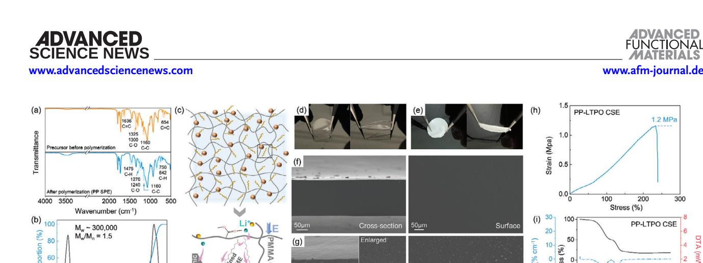
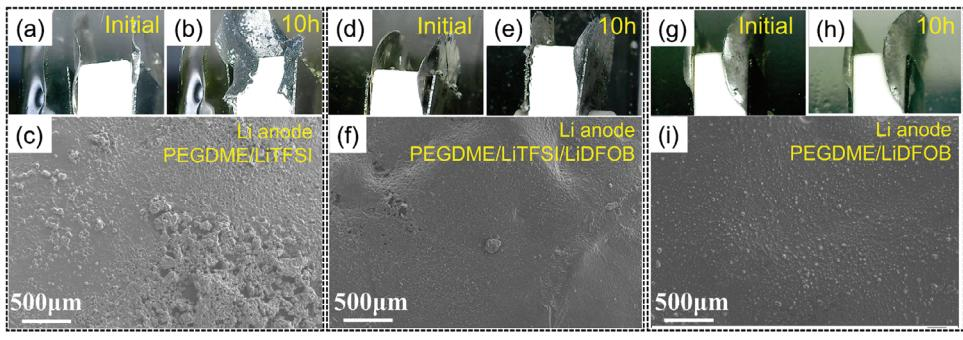
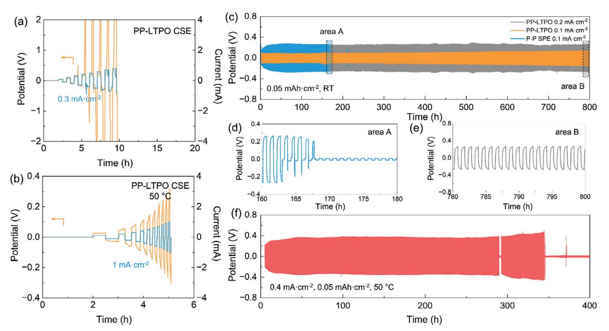
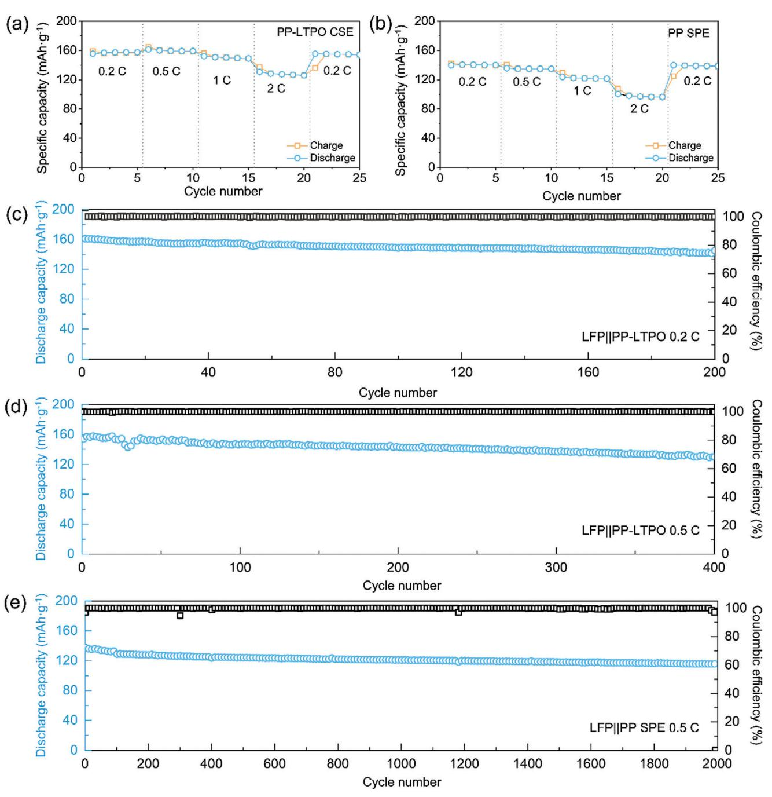

# **In-Situ Polymerization Confined PEGDME-Based Composite Quasi-Solid-State Electrolytes for Lithium Metal Batteries**

*Rong-Ao Tong, Yilei Huang, Chang Feng, Yanhao Dong,\* and Chang-An Wang\**

**Solid-state lithium metal batteries are under development for higher energy density and better safety. A key is to develop new electrolyte systems that are readily processible and capable to improve electrochemical cycling stability. In this study, A quasi-solid-state composite electrolyte based on low-molecular-weight polyethylene glycol dimethyl ether (PEGDME) in situ confined within polymerized methyl methacrylate (PMMA) backbone is designed and presented. The new design of the polymer matrix, together with Li+-conducting ceramic fillers and appropriate lithium salts, has satisfactory Li-ionic conductivity (1.1 × 10−4 S cm−1 at 30 C and 1.0 × 10−3 S cm−1 at 80 °C), good electrochemical stability (***>***4.7 V vs Li+/Li), and high compatibility with lithium metal anode, enabling room-temperature operation and stable long-term cycling of both Li||Li symmetric cells and lithium-metal full cells (including LiFePO4 or LiCoO2 cathode). This work can extend the design boundaries of composite electrolytes meaningfully, and the idea of in situ polymerization limiting applies to almost all low-molecular-weight polymers, high-molecular-weight backbones, ceramic fillers, lithium salts, and additives in future development of room-temperature solid-state lithium metal batteries.**

### **1. Introduction**

Solid-state lithium metal batteries are considered as the essential pathway to address safety concerns and further increase the energy density of state-of-the-art lithium-ion batteries. The development of solid-state electrolytes (SSEs) plays a pivotal role.[\[1–3\]](#page-9-0) To lower the cell impedance due to ion transport through the electrolyte layer and across the electrochemical interfaces, SSEs should have reasonable ionic conductivity above at least 10−4 S cm−1 at the operation temperature range and ensure good contacts at the electrode/electrolyte interfaces during service.[\[4,5\]](#page-9-0) In addition, SSEs need to be electrochemically stable at both the high-voltage cathode side and the low-voltage anode side.[\[6,7\]](#page-9-0) Lastly, SSEs should be easy to synthesize and process on a large scale and remain mechanically robust.

The ORCID identification number(s) for the author(s) of this article can be found under <https://doi.org/10.1002/adfm.202315777>

**DOI: 10.1002/adfm.202315777**

Single-component SSEs with either allceramic or all-polymer phases, however, are difficult to satisfy all the requirements. For example, polymer electrolytes are mechanically flexible and do not have the hard-onhard contact issue at electrode/electrolyte interfaces, but they typically have low ionic conductivity and need to be operated at elevated temperatures.[\[8–10\]](#page-9-0) (e.g., *>*40 °C). Oxide ceramic electrolytes have high ionic conductivity and wide electrochemical stability windows, but they are brittle and undergo degradations both at electrode/electrolyte interfaces and inside the electrolytes.[\[11–14\]](#page-9-0) Sulfide electrolytes are soft and can be pressed for densification, but their chemical and electrochemical stabilities are poor.[\[15\]](#page-10-0) Considering these factors, it has been proposed that composite solid-state electrolytes (CSEs, also termed as hybrid solid-state electrolytes) are a promising pathway to the development of practical solid-state lithium metal batteries.[\[16–18\]](#page-10-0)

In the majority of "ceramic in polymer"

CSE systems, the ceramic phase serves as both a rapid Li-ion pathway and mechanical reinforcement, while the polymer primarily functions as structural support and interface contact.[\[19–21\]](#page-10-0) It has been reported that the agglutination of the inorganic phase particles will limit the improvement of the conductivity of the composite electrolyte, so some literatures focus on improving the homogeneity of the two-phase recombination in the composite electrolyte by means of interface modification.[\[22,23\]](#page-10-0) Nevertheless, in accordance with the percolation effect, the polymer phase should play a crucial role in governing the overall conductivity and interfacial properties of CSEs.[\[24\]](#page-10-0) Conventional high-molecular-weight polymers such as polyethylene oxide (PEO), polyvinylidene difluoride (PVDF), and polycarbonate (PC) exhibit negligible ionic conductivity at ambient temperature due to their unique Li-ion migration mechanism.[\[25\]](#page-10-0) Based on this, the optimal operating temperature of lithium batteries does not correspond with their actual service conditions, thereby compromising mechanical strength and increasing the risk of short-circuits. This inherent contradiction in highpolymer electrolytes presents a formidable challenge.[\[26,27\]](#page-10-0) Polymer gelation offers a well-established solution to the aforementioned challenges, wherein the carbonate-based liquid electrolyte is absorbed within the formed polymer framework.[\[28\]](#page-10-0) The plasticization effect of this absorption process leads to the formation of extensive amorphous regions, thereby facilitating rapid Li-ion

R.-A. Tong, Y. Huang, C. Feng, Y. Dong, C.-A. Wang State Key Lab of New Ceramics and Fine Processing School of Materials Science and Engineering Tsinghua University Beijing 100084, P. R. China E-mail: [dongyanhao@tsinghua.edu.cn;](mailto:dongyanhao@tsinghua.edu.cn)[wangca@tsinghua.edu.cn](mailto:wangca@tsinghua.edu.cn)

conduction.[\[29\]](#page-10-0) However, it is crucial to address safety concerns associated with organic liquid electrolytes due to their low boiling point and flammability.[\[30\]](#page-10-0) Therefore, the selection and design of modified polymer systems continue to represent a significant research direction. Moreover, in comparison to simple physical adsorption in two phases, chemical preparation methods such as crosslinking or copolymerization exert a positive influence on enhancing the stability of the polymer system and tailoring its molecular structure and weight.[\[31,32\]](#page-10-0) Consequently, this approach facilitates the achievement of relatively safe and optimal overall performance.[\[33,34\]](#page-10-0)

In this study, we focus on the development of an in situ polymerization confined low-molecular-weight polyether-based solid-state electrolyte, which is suitable for a wide range of ceramic composite systems. This is achieved through a straightforward two-step bulk-polymerization process. The novel integrated preparation process presents a more feasible alternative to the traditional PMMA-based gel-electrolyte, as it eliminates the intricate and hazardous dissolution, molding, and soaking procedures in THF solvent and carbonate electrolytes. Moreover, it effectively addresses the safety risks associated with conventional ex-situ gel-electrolytes such as non-uniform soaking and liquid leakage.[\[30\]](#page-10-0) The polymerized high-molecular weight polymethyl methacrylate (PMMA) in the electrolyte functions as a robust backbone phase, imparting self-supporting strength, while simultaneously enhancing the oxidation resistance of the electrolyte on the cathode side as a polyester matrix.[\[35\]](#page-10-0) The confined low-molecular-weight polyethylene glycol dimethyl ether (PEGDME) acts as the primary functional phase, synergistically facilitating rapid Li-ion transport alongside other phases, while also functioning as a plasticizer for the PMMA glass phase to enhance mechanical properties. Its remarkable segmental motion capability can greatly enhance the ionic conductivity of the electrolyte. The lithium difluoro oxalate borate (LiDFOB) is selected as the exclusive source of free Li-ions, enabling the formation of a fluorine-rich solid electrolyte interphase (SEI) protective layer at the interface with the Li-metal anode. This effectively suppresses the undesired reaction between PEGDME and Li-metal anode, thereby enhancing the stability of the polymer matrix on the anode side through interfacial engineering.[\[36\]](#page-10-0) Therefore, the electrolyte prepared in this study demonstrates high ionic conductivity and possesses a wide electrochemical window, showcasing exceptional electrochemical stability and low interfacial resistance toward Li-metal electrodes. The Li-ion transference number of this polymer electrolyte can reach up to 0.68. The electrochemical stability and long-cycle performance of the electrolyte can be further enhanced and reinforced through its composition with conductive LiTa2PO8 (LTPO). The quasi-solid-state electrolyte prepared in this study demonstrates exceptional long-term cycling performance in Li-symmetric batteries and exhibits outstanding discharge capacity and cycle stability in lithium metal batteries at room temperature (equivalent to 30 °C in this study).

#### **2. Reaction Mechanism and the Polymer Matrix Composition**

The ratio of PEGDME and MMA monomers played a pivotal role in determining the state and overall performance of the polymerized system. Figure S2 (Supporting Information) visually illustrates the observed changes before and after pre-polymerization with varying ratios of PEGDME and MMA. The increase in the proportion of MMA led to a macroscopic transition of the polymerized system from a semi-solid state to gel-solid-state and eventually to a glassy state. The polymerized group with a high proportion of PEGDME exhibited significant liquid-phase residues, which posed challenges in achieving sufficient strength for the formation of a free-standing solid-state electrolyte. Conversely, the group with a high proportion of MMA lacked sufficient confined PEGDME as both plasticizer and Li-ion fast channel, resulting in a significant amount of rigid and brittle PMMA glass phase within the electrolyte. This impeded further processing and led to various performance issues. Figure S3 (Supporting Information) shows the ionic conductivity of polymer electrolytes with different monomer ratios. The was only 1.7 × 10−5 S cm−1 at RT when the MMA:C2H4O ratio was set to 1:2, which is far from meeting the needs of practical service. The increase of the PEGDME proportion rapidly enhanced the ionic conduction. The at RT reached 7.4 × 10−5 S cm−1 at the ratio of 1:3, which basically satisfied the application requirement. Although the increase in PEGDME proportion could further facilitate the ionic conduction (1.1 × 10−4 S cm−1 at 1:4), the short-circuit risk originating from the poor mechanical strength cannot be ignored while longterm cycling. Therefore, the PEGDME 3:1 MMA group, which demonstrated superior comprehensive mechanical properties, was selected as the polymer matrix in this study.

The chemical reactions between the components and their molecular structures were confirmed through analysis of the FT-IR spectra of solutions at each stage of polymerization. The comparison of the enlarged FT-IR spectra before and after the polymerization of the precursor, as depicted in **Figure 1**[a,](#page-2-0) demonstrates the disappearance of absorption peaks at 1636 cm−1 (c = c) and 654 cm−1 (C-H), which correspond to the C═C bond of MMA. This observation signifies the cleavage of C═C bonds during polymerization. Additionally, the C-O absorption peaks associated with the C─O─C bond at 1325 and 1300 cm−1 exhibited a significant reduction after polymerization. The FT-IR spectrum analysis revealed a distinct absorption peak around 1475 cm−1 in the polymerized PEGDME-PMMA polymer electrolyte (marked as PP SPE) sample, which can be attributed to the vibrational mode (C-H) associated with CH2 groups. This observation suggests that C─C molecular chains have been formed. Additional evidence supporting this includes noticeable changes in both chemical shift and broadening of c-c peak (≈1160 cm−1), along with pronounced peaks corresponding to C-H vibrations at 842 and 750 cm−1. Meanwhile, the disappeared C─O peaks exhibited a chemical shift toward lower wavenumbers (≈1276 and 1240 cm−1), indicating a decrease in bond strength and alteration in the chemical environment. Consequently, this can be concluded as a typical addition polymerization reaction. However, it was observed that the absorption peaks of PEGDME did not undergo significant changes post-polymerization, particularly the intense C-O peak corresponding to the C─O─C ether bond at ≈1080 cm−1. This suggests that PEGDME did not participate in the reaction. The molecular weight distribution profile of the PP SPE, as determined by GPC analysis, is depicted in Figure [1b.](#page-2-0) The initial peak, exhibiting a Mn value of ≈ 249 and a polydispersity index of 1.1, represents the molecular weight distribution attributed to PEGDME present in the raw materials. The second

**Figure 1.** a) The FT-IR spectra comparison of the composite precursor (before the polymerization) and the polymerized electrolyte (PP SPE). b) The molecular weight distribution of the PP SPE. c) The schematic diagram of the PEGDME@PMMA-based composite electrolyte prepared in this work and the internal Li-ion conduction pathways. d) and e) are digital photos of the PP SPE and PP-LTPO CSE, respectively. f) and g) are SEM images of the surface and the cross-section of the PP SPE and PP-LTPO CSE, respectively. h) The DMA test result of PP-LTPO CSE at RT. i) The TG-DTA curves of the PP-LTPO CSE.

peak, indicating an Mw of ≈ 300000 and a polydispersity index of 1.5, signifies the molecular weight distribution of polymerized PMMA. The observed bimodal distribution in this study provides evidence that the PEGDME molecules remained in a lowmolecular-weight polyether state, refraining from participating in the reaction and instead being confined within the polymerized PMMA backbone. The overall reaction process involves the continuous free radical polymerization of MMA monomer initiated by an initiator. During the pre-polymerization stage, there is a rapid growth of molecular chains accompanied by a significant increase in system viscosity. Subsequently, in the postpolymerization stage, further growth and cross-linking of molecular chains lead to the formation of a network structure of polymer chains. The low-molecular-weight PEGDME chains were effectively confined within the solidified PMMA backbone at this stage. Subsequently, the radical reaction was terminated, leading to the formation of a homogeneous bulk electrolyte in a gel solidstate.

The polymerization process can be efficiently monitored by continuously measuring the system's impedance during the entire reaction. The coin cell was assembled using the precursor solution as the electrolyte, along with a polypropylene separator, and subjected to continuous testing of its ionic impedance over a period of time. The corresponding results are presented in Figure S4 (Supporting Information). The ionic impedance gradually increased during the initial 10 h post-polymerization period at 50 °C, accompanied by a transition in the Nyquist plots from liquid-phase to solid-phase conduction, indicating the stabilization of viscosity and elongation of polymer chains. The impedance exhibited a further increase as the temperature reached 100 °C and subsequently stabilized after being maintained at room temperature for 12 h. At this point, the electrolyte underwent cross-linking polymerization, leading to no additional alterations in impedance and indicating the completion of the polymerization process.

The interaction between ceramic fillers and polymer components was a key focus of this study. Figures S5 and S6 (Supporting Information) present the comparative analysis of FT-IR spectra between PP SPE and the CSE with LTPO composition (marked as PP-LTPO CSE), as well as the molecular weight distribution diagram of PP-LTPO CSE, respectively. Importantly, the incorporation of ceramic phases had no significant impact on the molecular structure of both the polymer and electrolyte. However, the experimental observations revealed that the inclusion of ceramic filler resulted in a deceleration of viscosity increase within the system, indicating a reduction in reaction rate and potentially leading to an elevation in polymerization degree as per reaction kinetics. Therefore, the incorporation of ceramic fillers significantly enhanced the molecular weight of the polymer, resulting in a concomitant increase in polydispersity. This phenomenon can be attributed to the dispersion of ceramic particles, which hinder both free radical and segmental chain reactions, thereby causing uneven chain growth. The molecular weight distribution of PEGDME remained unaffected, while the XRD patterns in Figure S7 (Supporting Information) demonstrated that the composition and polymerization process had no impact on the crystal structure of both CSE and pristine LTPO ceramic fillers (powder). These findings suggest that the ceramic phase was physically composited into the PEGDME@PMMA matrix without any additional chemical reactions.

Based on the preceding discussion, Figure 1c illustrates the schematic diagram of the CSE developed in this study. PMMA molecular chains form a network structure while PEGDME chains are confined within the backbone due to intermolecular forces. The ceramic fillers are uniformly dispersed throughout the polymer matrix. The digital photographs in Figure 1d,e demonstrate the exceptional flexibility and tensile ductility of these electrolytes at room temperature. The SEM images of the PP SPE and PP-LTPO CSE are presented in Figure 1f,g, respectively. The PP SPE displays a sleek morphology from its surface and cross-section, and is devoid of any detectable porosity defects arising from post-polymerization. Within the matrix, the ceramic fillers in CSEs are evenly distributed, exhibiting no visible agglomeration when examined on the cross-section. The uniform

**Figure 2.** a) The temperature-dependent ionic conductivity of PEGDME@PMMA polymer electrolyte, in which the molecular weight of PEGDME is different. b) The ionic conductivity comparison of the PP SPE, PP-LTPO CSE, and PP-ZrO2 CSE, the composite ratio of CSEs is 10 wt.%. c) The polarization current curve and the interfacial resistance change of PP SPE||Li symmetric battery under constant-voltage at 35 °C. d) The LSV curves of the PP SPE and PP-LTPO CSE at RT with the voltage sweeping rate of 0.1 mV s−1. e) and f) are *C–V* curves of the PP SPE and PP-LTPO CSE against Li||SS counter electrodes, respectively at RT with the voltage sweeping rate of 1 mV s−1. g) and h) are EIS Nyquist plots of Li-symmetric batteries with PP SPE and PP-LTPO CSE, respectively and the corresponding calculated interfacial resistance against Li-anode at various temperatures.

structure and morphology facilitate the homogeneous distribution of the internal electric field within the electrolyte, thereby preventing non-uniform current density and charge accumulation that may result in abnormal lithium deposition and overall performance degradation.[\[37,38\]](#page-10-0) The stress-strain curve of the DMA test of PP-LTPO CSE at RT in Figure [1h](#page-2-0) presents two different stages. Stage one corresponds to the relaxation motion (creep) of the matrix polymer chains, and stage two corresponds to the elastic-plastic deformation under the strengthening mechanism of the ceramic filler. It can withstand up to 250% tensile strain with the corresponding fracture strength of 1.2 MPa, which indicates the good deformation resistance and flexible mechanical properties of CSE.

The TG-DTA test of PP-LTPO CSE was performed in an inert atmosphere to evaluate the thermal stability, as shown in Figure [1i.](#page-2-0) The TG curve of the electrolyte shows two main weight loss processes at ≈ 270 and 390 °C, respectively with the rise of temperature, corresponding to the obvious heat absorption on the DTA curve. It is inferred that the first weight loss process is related to the volatilization of PEGDME (boiling point *>* 250 °C) and the pyrolysis of lower-molecular-weight PMMA (the theoretical proportion of PEGDME is 48 wt.%), while the second weight loss process corresponds to the decomposition of polymer skeleton and lithium salt. Therefore, the PEGDME and PMMA basis maintain their respective thermal properties, and the structural thermal stability of the CSE is up to 270 °C. Although the suitable service temperature of CSE is affected by the composition of oligomers, its thermal stability is still at a reasonable level and meets the needs of practical applications.

#### **3. Electrochemical Properties**

The properties of polymer matrix are the basis of the electrochemical performance of composite electrolytes. Therefore, the ionic conductivity of PP SPE was first tested and the results are shown in **Figure 2**a. The at 30 and 80 °C are 7.8 × 10−5 and 8.6 × 10−4 S cm−1, respectively. The calculated ion migration activation energy (Ea) is 0.45 eV, which is 30% higher than that of Li-based polymer electrolyte (close to 0.7 eV). The comparison result showed that Li+ ions meet lower migration resistance in the polymer matrix, which is related to the good molecular chain movement ability of PEGDME. To further prove this, the PP SPE with the higher-molecular-weight PEGDME (Mn = 500) was prepared and its at 30 °C is only 5.6 × 10−6 S cm−1 with the Ea of 0.59 eV. This confirms that the average molecular weight of the polymer has a direct effect on the ionic conductivity. In other words, smaller polymer chains are subject to lower intermolecular forces and the tendency to crystallization and thus have better segment motility activity, so the Li+ ions complex with it is easier for intrachain or interchain transition.

The glassy state of PMMA is typically maintained at room temperature, resulting in its inherent brittleness and limited capacity for Li-ion migration. However, the DSC curves of PP SPE in Figure S8 (Supporting Information) exhibits the absence of a characteristic sharp endothermic peak at ∼100 °C, indicating significant molecular chain flexibility and an amorphous state for the PMMA backbone due to the plasticization effect of PEGDME. The presence of this property not only enhances the flexibility of the electrolyte but also reduces resistance to bulk ion migration. Moreover, the DSC curves of CSE exhibit no glass transition point for PMMA. The existence of carbonyl groups on the flexible PMMA molecular chains also contributes to the dissociation of lithium salt,[\[39\]](#page-10-0) thereby further increasing the abundance of free Li-ions. The synergistic effect elucidated above constitutes a pivotal factor in promoting the high ionic conductivity of the polymer electrolyte matrix.

According to effective medium theory, the ionic conductivity of composite electrolyte will continuously enhance with the increase of the composite proportion before the percolation effect transition. As shown in Figure [2b,](#page-3-0) the of PP-10 wt.% LTPO CSE reach the highest of 1.1 × 10−4 S cm−1 at 30 °C and 1.0 × 10−3 S cm−1 at 80 °C, respectively. The corresponding Ea (0.41 eV) is lower than that of PP SPE. The comparison with PP-10 wt.% ZrO2 CSE, as well as the low percolation transition point shown in Figure S9 (Supporting Information) illustrates that: a) The composition of high-conductive ceramic phase can still improve the of the PP-based electrolyte by establishing the new Li+ fast migration channel. b) Due to the good properties of a polymer matrix, there is no mechanism for inorganic fillers to enhance the by destroying the regular arrangement of chain segments to create amorphous regions. Conversely, inactive fillers such as ZrO2 reduce the conductivity after composition because they impede or prolong the Li+ migration path. This also explains the low optimal composite proportion of LTPO. Therefore, there are mainly two types of Li+ conduction channels within the PP-LTPO CSE, as shown in Figure [1c.](#page-2-0)

The Li-ion transfer number of the PP SPE at 35 °C, as determined by the Bruce–Vincent method, was found to be 0.68 (Figure [2c\)](#page-3-0), which is significantly higher than that observed for PEO/LiTFSI (or LiClO4)-based electrolytes (typically *<*0.5). This enhanced cationic transference number holds great potential in mitigating polarization effects and improving battery rate performance.[\[40,41\]](#page-10-0)

The LSV curves of PP SPE and PP-LTPO CSE are depicted in Figure [2d.](#page-3-0) Considering the difference of the responding delay and current intensity caused by the interface factor of the plate electrode, the responding current density is first normalized. The PP SPE exhibits a stable electrochemical window up to 4.4 V versus Li/Li+, while the PP-LTPO CSE demonstrates extended electrochemical stability up to 4.7 V versus Li/Li+. These results are much higher than that of general polyether electrolytes represented by PEO (3.8 V vs Li/Li+). The enhanced electrochemical stability can be attributed to the inherent oxidation resistance of the PMMA backbone at high voltages and the protective effect provided by the methyl-terminated structure of PEGDME.[\[42\]](#page-10-0) Furthermore, ensuring the stability of the electrolyte on the anode side is crucial for practical applications. The *C–V* test was conducted within a potential range of 0 ≈ 4 V, and the resulting curves are presented in Figure [2e,f.](#page-3-0) The *C–V* curves of the five sweeping cycles of PP-LTPO CSE reveal that there are no response peaks attributed to other continuous side reactions. The dual oxidation-reduction peaks representing the electrochemical reaction of Li/Li+ at the electrode interface remained stable and reproducible, indicating the electrochemical stability between PP-LTPO CSE and Li-metal anode under low-voltage conditions. Moreover, the *C–V* curves of PP SPE demonstrated its robustness against the Li-metal anode.

The PEGDME, as a low-molecular-weight polyether electrolyte in the liquid phase at room temperature, demonstrates chemical instability and susceptibility to side reactions with the Limetal anode. Ensuring stability at the electrode interface critically depends on the specific composition of lithium salt within the electrolyte.[\[43\]](#page-10-0) The Li-symmetric cell model was fabricated in a transparent quartz mold using PEGDME250-based electrolytes with varying compositions of lithium salts. Subsequently, the lithium deposition cycle test was conducted at a current density of 0.1 mA cm−2, resulting in a deposition amount of 0.05 mAh cm−2 per cycle (Figure S10, Supporting Information). After a 10 h cycling test, significant structural damage was observed in the Limetal electrode when operating with an electrolyte solely composed of LiTFSI, as illustrated in **Figure 3**[a–c.](#page-5-0) The SEM image unveiled significant pore formation caused by the side reaction of hydrogen evolution and an irregular coral-like deposition. However, the LiTFSI/LiDFOB composite lithium salt group effectively mitigated macroscopic electrode damage and substantially reduced uneven lithium deposition observed in the SEM image, despite the presence of residual surface pore defects (Figure [3d–f\)](#page-5-0). Furthermore, the exclusive utilization of LiDFOB salt effectively eradicated both hydrogen evolution and electrode damage of the Li-metal during cycling. Moreover, the SEM image exhibited a homogeneous deposition of Li without any accompanying structural defects (Figure [3g–i\)](#page-5-0). The findings presented in this study demonstrate that LiDFOB effectively suppresses side reactions and mitigates corrosive damage to Li-metal electrodes when compared to the commonly employed LiTFSI in low-molecularweight polyether electrolytes. This is primarily attributed to the formation of a more continuous and denser solid-electrolyte interphase (SEI) layer at the negative electrode interface through the decomposition of LiDFOB, which mainly consists of compounds such as LiF, lithium borate, and lithium borofluorate (detailed shown in the XPS spectra in Figure S11, Supporting Information).[\[36,44\]](#page-10-0) As a result, it facilitates homogeneous lithium deposition while concurrently safeguarding the anode.

### **4. Electrochemical Performance and Interfacial Compatibility of Li||Li Symmetric Cells**

The ionic transfer resistance at the electrode interface is a critical determinant of battery performance. Figure [2g,h](#page-3-0) illustrates the Nyquist plots of the Li-symmetric battery with different electrolytes, accompanied by their corresponding calculated interfacial resistance (Ri ) at various temperatures. The interfacial resistance primarily depends on the contact condition and compatibility between the polymer matrix and Li-metal anodes for '0-3′ type composite electrolyte. The incorporation of a ceramic phase in CSE resulted in a lower overall interfacial impedance compared to PP SPE, thereby increasing the proportion of lower molecular weight chains within the polymer matrix. Consequently, this led to enhanced electrolyte flexibility and facilitated closer contact with the electrode. The presence of additional regions with shorter molecular chains, along with the dispersion of ceramic fillers near the interface, also contribute to an enhanced migration coefficient of Li-ions and a more uniform charge density within the electrolyte, thereby facilitating rapid ion transfer at the interface. The PP-LTPO CSE exhibited an interfacial resistance of ≈ 200 Ω cm2 at room temperature, which could be further reduced to less than 100 Ω cm2 at temperatures above 40 °C, indicating exceptional interfacial properties and practical significance in relation to Li-metal anode.

The PP-LTPO CSE exhibited a critical current density (CCD) of 0.3 mA cm 2 during the charge-discharge test, which utilized a fixed cycle time and gradient current density (**Figure 4**[a\)](#page-5-0). The potential curves of CSEs under high current density revealed a significant failure mechanism related to polarization, indicating that the primary limitation on CCD was the internal resistance (mainly caused by concentration polarization near the

**Figure 3.** Digital photos of the Li-electrodes before and after 10 h of the Li-deposition cycling test and SEM morphology images of the Lielectrodes after the deposition cycling test. The corresponding electrolyte composition is indicated in Figure: a–c) PEGDME/LiTFSI electrolyte. d–f) PEGDME/LiTFSI/LiDFOB electrolyte. g–i) PEGDME/LiDFOB electrolyte.

interface under high current density conditions), rather than short-circuiting resulting from abnormal Li-deposition. Therefore, an additional CCD test was conducted at 50 °C using a fixed amount of Li deposition for one cycle to evaluate the uniformity of Li deposition in symmetric batteries. The result depicted in Figure 4b demonstrates that stable deposition cycles can be maintained even at a current density of at least 1 mA cm−2, without experiencing abnormal polarization or short-circuiting. This observation emphasizes the favorable condition of the electrode-CSE interface, which promotes the homogenization of electric fields and uniform Li-deposition, effectively suppressing the growth of Li-dendrites. The Li-symmetric batteries employing PP-based CSE demonstrated exceptional long-term stability, with a cycle life exceeding 800 h at RT. This was achieved by utilizing a current density of 0.1 mA cm−2 and a half-cycle deposition amount of 0.05 mAh cm−2 (Figure 4c). The same stable long-term cycle could also be achieved under the current density condition of 0.2 mA cm−2. The stable cycle of the PP-LTPO electrolyte symmetric battery can also reach more than 800 h at 0.2 mA cm−2 current density. For higher current density conditions, considering the CCD test results, the cycle test is carried out at 50 °C to avoid the influence of polarization failure, and the deposition amount of a single cycle is kept constant. At the current density of 0.4 mA cm−2, as shown in Figure 4d, the symmetric battery

**Figure 4.** The CCD test results of the PP-LTPO||Li-symmetric batteries with a fixed charge/discharge time at RT a) and a fixed charge/discharge deposition amount at 50 °C b), respectively. c) The long-term cycle time-potential curves of the PP SPE||Li-symmetric battery and the PP-LTPO CSE||Li-symmetric batteries at RT (30 °C) and different current densities, respectively. d) and e) are the enlarged graphs of certain potential curves in area A and area B in Figure c), respectively. f) The long-term cycle time potential curve of the PP-LTPO CSE||Li-symmetric battery at 50 °C and the current density of 0.4 mA cm−2.

could still maintain a stable cycle for ≈ 300 h. The composition of ceramic fillers in this study enhanced the cycle life of symmetric batteries by providing mechanical reinforcement to the electrolyte and facilitating stable Li-deposition on electrodes. This effectively prevented short-circuits caused by Li-dendrite formation.

Figure S12 (Supporting Information) shows the SEM morphology of the electrode surface of Li-symmetric batteries with PP-LTPO CSE after 100 cycles at different current densities. Under the premise of the same deposition amount, although the roughness of the anode surface slightly degrades with the increase of granular deposition, the overall ion deposition behavior is not significantly affected, that is, the deposited Li distribution on the interface is still uniform, and controllable, and there is no trend for the formation of dendrite-like morphology. These results show that the compatibility between electrolyte and Lianode can prompt the uniform lithium deposition during the cycle. There is no significant abnormal deposition process due to poor dynamic conditions at the interface even under highcurrent-density conditions.

#### **5. Li-Metal Full Batteries Operated at Room Temperature**

The PEGDME@PMMA-based electrolytes exhibited exceptional overall performance in Li-metal full batteries. **Figure 5**[a,b](#page-7-0) illustrates the rate performance of Li-metal batteries with LiFePO4 cathodes at 30 °C (The cut-off potential range is 2.8–3.8 V). The discharge specific capacity (mass-energy density) of the LFP battery containing PP-LTPO CSE achieved a remarkable value of 157 mAh g−1 at 0.2 C, whereas that of PP SPE was comparatively lower, ≈ 140 mAh g−1 at 0.2 C. The difference in discharge capacity can be attributed to the positive impact of enhanced ionic conductivity and reduced interface resistance resulting from the composition of the ceramic phase. Additionally, it is worth noting that the electrolyte exhibits excellent rate performance. The PP-LTPO CSE shows minimal degradation in discharge capacity at current densities below 1C, with specific capacities of 150 mAh g−1 at 1 C and 130 mAh g−1 at 2 C, respectively. This rate-capacity relationship is particularly remarkable for solid-state batteries operating at room temperature. Furthermore, the discharge capacity demonstrated excellent reproducibility and did not exhibit a rapid decay trend under all tested rate conditions. Moreover, similar discharge capacity trends were observed for PP-SPE under various rate conditions as well, as illustrated in Figure [5b.](#page-7-0) The obtained results validate the significance of the high Li+ transfer number in the polymer matrix for mitigating polarization and enhancing battery performance.

The long-term cycle test results of the Li-metal batteries are presented in Figure [5c,d.](#page-7-0) The Li-metal full batteries assembled in this study demonstrated satisfactory discharge-specific capacity and superior long-cycle stability. The LFP||Li metal battery with PP-LTPO CSE exhibited an initial maximum discharge capacity of 161 mAh g−1 at a rate of 0.2 C and ambient temperature. Subsequently, the capacity retention rate reached a remarkable 91% over the course of 200 cycles, while consistently maintaining a coulombic efficiency above 99% during the extensive cycle test, thereby demonstrating exceptional electrochemical stability within the battery (Figure [5c\)](#page-7-0). The initial discharge capacity of the LFP metal battery at 0.5 C was determined to be 158 mAh g−1, which aligns with the observed rate performance outcomes. Moreover, even after 400 cycles, the capacity retention rate remained high at 87% (Figure [5d\)](#page-7-0). The excellent long-term cycle stability can be attributed to the superior electrochemical stability and stable interfacial ion transfer and deintercalation/intercalation behaviors of the polymer matrix. For comparison, we also conducted cycling tests on LFP metal batteries assembled with PP SPE. The battery demonstrated exceptional cycle stability over an extended cycling period, as illustrated in Figure [5e](#page-7-0) and Figure S13 (Supporting Information), respectively. After 600 cycles at a current density of 0.2 C, the capacity retention reached an impressive value of 91% (from 145 to 132 mAh g−1). Furthermore, even after undergoing super longterm cycling of 2000 cycles at a rate of 0.5 C, the battery still exhibited remarkable capacity retention with a value of 86% (from 135 to 116 mAh g−1). The comparison of cycling test results between SPE and CSE batteries revealed that the polymer system developed in this study played a pivotal role in achieving highly stable long-term battery cycles. Consequently, the inherent stability properties and mechanical strength provided by the PMMA backbone enabled the polymer matrix itself to independently achieve a stable long cycle, albeit with reduced discharge capacity.

The excellent cycle stability of PP-LTPO electrolyte in LFP batteries can be attributed to two aspects, one is the establishment and stability of the interface phase in the early cycle. As shown in **Figure 6**[a,](#page-8-0) the impedance spectrum of the PP-LTPO||LFP battery before and after the first cycle at 0.2C, RT and the fitting results of the middle and low frequency region (the electrolyte bulk resistance is simplified as ohmic impedance Re here) show that the internal interface impedance R1 of the battery decreases significantly from ≈ 432 to 301 Ω after the first cycle, while the charge transfer impedance R2 did not much change (540 Ω to 516 Ω). This indicates that the SEI/CEI phase with good ionic conductivity and interfacial compatibility is established at the electrode-electrolyte interface inside the battery, thus promoting the ion diffusion and protecting the interface from side reactions (Figure [6b\)](#page-8-0).

The SEM images in Figure [6c,d](#page-8-0) illustrate the cross-sectional view of LFP metal batteries with PP-LTPO CSE before and after cycling test for 200 cycles, revealing a well-established interface between the initial electrolyte and electrode prior to cycling. In comparison, there was no occurrence of interfacial decontact or active materials stripping at the cathode side due to volume change during Li+ deintercalation/intercalation on the cross-section. This observation is particularly evident on the Limetal anode side, which also exhibited a uniform and flat morphology without any abnormal deposition of Li. Therefore, the electrolyte remained intact without any morphological damage or structural deformation. These phenomena serve as evidence that optimal interface conditions and a homogeneous internal charge density ensure the stability between the solid-state electrolyte and electrodes over extended cycling periods, facilitating rapid and uniform transfer and deposition of Li-ions. Consequently, this stability contributes to maintaining capacity, discharge voltage (polarization), and battery efficiency.

The lithium metal battery was assembled with LCO cathode and PP-LTPO composite electrolyte to evaluate the performance **[www.advancedsciencenews.com](http://www.advancedsciencenews.com) [www.afm-journal.de](http://www.afm-journal.de)**

**Figure 5.** a) and b) are the rate performance of the LFP||PP-LTPO CSE||Li-metal battery and the LFP||PP SPE||Li-metal battery at RT (30 °C), respectively. c–e) are long-term cycle discharge capacity/ coulombic efficiency performance of the LFP||PP-LTPO CSE||Li-metal batteries at 0.2 C c), 0.5 C d), and the LFP||PP SPE||Li-metal battery at 0.5 C e), respectively at RT (30 °C).

of the high-voltage battery. During the test process, the battery was first cycled for 2 cycles at room temperature (30 °C), 0.1 C for formation, and then underwent long-term cycling at 0.2 C. The cut-off voltage range is 3.0–4.35 V. Results As shown in Figure S14 (Supporting Information), the maximum initial specific discharge capacity of the LCO battery is 148 mAh g-1, and its capacity retention after 100 cycles is 85%. The theoretical specific capacity of the LCO battery at 4.35 V cutoff voltage is ≈ 160 mAh g−1. We believe that the bottleneck of discharge capacity and cycling life of PP-LTPO||LCO battery lies in the wetting condition of the electrolyte-cathode and the overall conductivity (including electrolyte conduction and ionic diffusion conduction within the electrode), which is related to the intrinsic properties of electrolyte, which proves the potential of PEGDME-PMMA-based electrolytes applied for high-voltage cathodes.

**[www.advancedsciencenews.com](http://www.advancedsciencenews.com) [www.afm-journal.de](http://www.afm-journal.de)**

**Figure 6.** a,b) The fitted EIS Nyquist plots comparison of the LFP||PP-LTPO CSE||Li-metal battery before and after the first cycle at RT (30 °C), 0.2 C. c) The corresponding schematic diagram of the EIS fitting model. c) and d) are SEM images of the cross-section of the LFP||PP-LTPO CSE||Li-metal battery before and after 200 cycles at RT (30 °C) and 0.2 C, respectively.

#### **6. Generalization with other Ceramic Fillers**

The polymer matrix designed in this study can also be applied to other composite electrolytes containing different ceramic fillers, as illustrated in Figure S15 (Supporting Information). The prepared CSEs with 10 wt.% Li6.4La3Zr1.4Ta0.6O12 fillers, denoted as PP-LLZT, exhibited the highest conductivity of 8.1 × 10−5 S cm−1 at 30 °C and 8.2 × 10−4 S cm−1 at 80 °C. A series of electrochemical tests demonstrated the excellent electrochemical stability of PP-LLZT CSE and its compatibility with the lithium metal negative electrode interface. Furthermore, the lithium symmetric battery and LFP lithium metal battery tests showcased its remarkable advantages in terms of long-cycle stability and dischargespecific capacity. Detailed instructions and figure illustrations are provided in Figures S16–S21 (Supporting Information) The performance results of the extended PP-LLZT CSE demonstrate that the polymer electrolyte system based on PEGDME@PMMA exhibits wide applicability, enabling further development of composite solid-state electrolytes with a strong performance foundation and various customized property advantages.

#### **7. Conclusion**

The present study designed a quasi-solid-state electrolyte system based on in situ polymerization of confined low-molecularweight polyether (PEGDME250) with high-molecular-weight polyester (PMMA) backbone, aiming to comprehensively evaluate the electrochemical properties of the polymer matrix and composite electrolytes. The results demonstrated that the polymer matrix design exhibited favorable ionic conductivity and exceptional electrochemical stability, along with optimal Li+ transfer number and desirable Li-metal anode interface conditions. Consequently, the electrolytes designed manifested outstanding rate performance and discharge capacity in the Li-metal battery test. Specifically, it exhibited exceptional suitability for fulfilling the requirements of ultra-stable, long-term cycle service at room temperature. These distinctive characteristics primarily stem from the solid performance foundation established by the PEGDME@PMMA polymer matrix. This work uses lowpolymerized polyether as the conductive functional phase, which has better thermal stability, electrochemical stability, and lower safety risk than the general quasi-solid electrolyte with carbonatebased electrolyte. If cost and green chemistry requirements are taken into account, then there will also be advantages, which is meaningful for improving the application value of quasi-solid composite electrolytes.

#### **8. Experimental Section**

*Preparation of the Electrolytes*: Methyl methacrylate (MMA, 99.0%, Aladdin) and polyethylene glycol dimethyl ether (PEGDME, Mn ≈ 250, Sigma–Aldrich) were pretreated with a molecular sieve to remove moisture. The two solvents were then mixed and magnetically stirred in a glass bottle at the molar ratio of 1:3 (MMA:C2H4O). Lithium difluoro oxalate borate (LiDFOB, Macklin) was added to the solution simultaneously as the Li-salt at the molar ratio of 1:10 (DFOB−:C2H4O) and stirred at RT to completely dissolve. After that 2-methylpropionitrile (AIBN) as the polymerization initiator was added to the solution at 0.08 wt.% of MMA and continued stirring until it was completely dissolved. The garnet-type Li6.4La3Zr1.4Ta0.6O12 and NASICON-type LiTa2PO8 ceramics used in this work were synthesized by solid-phase reaction method,[\[45,46\]](#page-10-0) and fully refined by 350 rpm planet ball-milling for 24 h in isopropanol solvent and vacuum dried to obtain a submicron-size ceramic powder. For the preparation of CSEs with ceramic phases, the ceramic powder was added to the solution at a mass ratio of 9:1 (Total mass of MMA and PEGDME: ceramic powder, meaning a composition ratio of ≈10 wt.%), and then stirred and mixed accompanied by ultrasonic deagglomeration for 30 min, which was

marked as PP-ceramic CSE. For the pure solid-state polymer electrolyte group without the ceramic phase (marked as PP SPE), the compositing step was skipped. Subsequently, the solution was subjected to oil-bathing at 90 °C while continuously stirring for 45 min to induce solidification of the mixture, thereby initiating a pre-polymerization process. Subsequently, it was transferred to a drying oven and stored at 50 °C for 24 h. Then, the temperature was increased to 100 °C and maintained for 2 h. Finally, the system was transferred and stored in an argon-filled glove box at room temperature to complete the post-polymerization process thoroughly. The two-step polymerization process yielded a solid-state electrolyte with a certain degree of viscoelasticity. The prepared SPE and CSE blocks were then placed between two PTFE films and subjected to warm-pressing at 70 °C and 10 MPa, resulting in the formation of a uniform electrolyte membrane with an approximate thickness of 100 μm. Subsequently, the membrane was cut into Φ19mm discs for subsequent testing and characterization purposes. Additionally, the prepared electrolytes were stored within an argon-filled glove box. A detailed depiction of the aforementioned preparation steps can be found in Figure S1 (Supporting Information).

*Physical and Chemical Property Characterization*: X-ray diffraction (XRD, Bruker D8 Advance) was used to characterize the crystal structure information of the ceramic phase before and after the composition and the macrocrystalline state of the polymer phase in an electrolyte. A scanning electron microscope (SEM, Zeiss JSM-7001F) was used to observe the surface and section morphology of the electrolyte, and the sample was prepared by embrittlement method with liquid-nitrogen. Fourier transform infrared spectroscopy (FT-IR, Nicolet IS10) and gel permeation chromatography (GPC, Shimadzu) were operated to characterize the molecular structure and molecular weight of polymers, respectively, to infer the reactions of components in the polymerization-composition process and the molecular weight distribution in the product. The glass transition temperature and crystallization of the polymer phase in the electrolyte were studied by differential scanning calorimetry (DSC, Netzsch STA 449 F5). The thermal stability of the material was evaluated by thermogravimetric-differential thermal analysis (TG-DTA, Netzsch STA 449 F5). The mechanical property of the electrolyte was evaluated by dynamic mechanical-thermal analysis (DMA, TA DMA 850). The stress-strain curve of the CSE membrane (stripe sample) was tested by cantilever unidirectional tensile mode at RT, and kept the constant loading speed of 1 mm min−1 during the test until the sample fracture.

*Electrochemical Characterization and Battery Test*: The electrochemical properties testing in this study employed 2032-type coin cells, which were assembled with various electrode materials. The electrolyte's ionic conductivity was determined and calculated using electrochemical impedance spectroscopy (EIS) performed on an advanced electrochemical workstation (EC-Lab SP300) according to formula = *D/RbA*, where Rb is the block resistance of the electrolyte in a symmetric battery with two stainless steel blocking electrodes, which was determined by the real-axis intercept on the EIS spectrum. D is the thickness of the electrolyte and A is the effective contact area of two electrodes. The electrochemical window and the lowpotential stability against the Li-metal electrode of electrolytes were determined through linear sweep voltammetry (LSV) and cyclic voltammetry (CV), respectively. In the LSV and *C–V* tests, stainless steel was employed as the working electrode, while Li-metal served as the counter electrode in the battery. The Li+ cation transfer number of the polymer electrolyte matrix was determined using the Bruce-Vincent method with a Li-symmetric battery. Additionally, Li-symmetric batteries were assembled to assess the interfacial resistance (Ri ) between the electrolytes and Li-metal electrodes, thereby evaluating ion transfer conditions at the anode interface. Ri was derived from the intercept of the semicircle observed in the medium and low-frequency regions on the real axis of the EIS spectrum. Li-symmetric batteries were also employed to evaluate the critical current density (CCD) of electrolytes at ambient temperature and assess the long-term cycling stability under continuous Li deposition-consumption conditions at the anode.

The specific capacity and long-cycle capability of electrolytes in lithium metal batteries at room temperature were evaluated using LiFePO4 (LFP) and LiCoO2 (LCO) cathodes with the LAND battery test system. The weight composition of the LFP cathode in this study is 0.7 LFP: 0.1 catholyte: 0.1 Super P: 0.1 PVDF, where the catholyte consisted of PEO and LiTFSI (PEO Mv ≈ 100 000, EO:TFSI− = 10 in molar ratio), and that of LCO cathode is 0.8 LCO: 0.1 PVDF: 0.09 Super P: 0.01 CNT. The cathode slurry was coated onto the Al-foil after thoroughly mixing these raw materials in the N-Methyl-Pyrrolidone (NMP) solvent. Subsequently, the coated cathode underwent complete drying in a vacuum oven and was rolled into a uniform-thickness cathode sheet. The prepared cathodes exhibited an active material load of ≈ 1.4 mg cm−2 each. Li-metal batteries were assembled using these prepared cathodes, electrolytes, and Li-metal anodes, followed by testing at room temperature.

# **Supporting Information**

Supporting Information is available from the Wiley Online Library or from the author.

# **Acknowledgements**

This work was financially supported by the National Natural Science Foundation of China (NSFC-No. 52173257, 52372064 and 51872159).

# **Conflict of Interest**

The authors declare no conflict of interest.

# **Data Availability Statement**

The data that support the findings of this study are available in the supplementary material of this article.

## **Keywords**

composite electrolytes, polymer electrolytes, room-temperature operation, solid-state batteries

> Received: December 11, 2023 Revised: March 8, 2024 Published online: April 2, 2024

- [1] J. B. Goodenough, Y. Kim, *Chem. Mater.* **2010**, *22*, 587.
- [2] M. Li, J. Lu, Z. W. Chen, K. Amine, *Adv. Mater.* **2018**, *30*, 1800561.
- [3] C. P. Yang, K. Fu, Y. Zhang, E. Hitz, L. B. Hu, *Adv. Mater.* **2017**, *29*, 201701169.
- [4] J. C. Bachman, S. Muy, A. Grimaud, H. H. Chang, N. Pour, S. F. Lux, O. Paschos, F. Maglia, S. Lupart, P. Lamp, L. Giordano, Y. Shao-Horn, *Chem. Rev.* **2016**, *116*, 140.
- [5] F. Zheng, M. Kotobuki, S. F. Song, M. O. Lai, L. Lu, *J. Power Sources* **2018**, *389*, 198.
- [6] A. Manthiram, X. W. Yu, S. F. Wang, *Nat. Rev. Mater.* **2017**, *2*, 16103.
- [7] Z. H. Gao, H. B. Sun, L. Fu, F. L. Ye, Y. Zhang, W. Luo, Y. H. Huang, *Adv. Mater.* **2018**, *30*, 1705702.
- [8] F. Wu, K. Zhang, Y. R. Liu, H. C. Gao, Y. Bai, X. R. Wang, C. Wu, *Energy Storage Mater.* **2020**, *33*, 26.
- [9] D. Zhou, D. Shanmukaraj, A. Tkacheva, M. Armand, G. X. Wang, *Chem* **2019**, *5*, 2326.
- [10] G. M. Zhou, F. Li, H. M. Cheng, *Energy Environ. Sci.* **2014**, *7*, 1307.
- [11] J. M. Tarascon, M. Armand, *Nature* **2001**, *414*, 359.

**[www.advancedsciencenews.com](http://www.advancedsciencenews.com) [www.afm-journal.de](http://www.afm-journal.de)**

- [12] C. W. Wang, K. Fu, S. P. Kammampata, D. W. McOwen, A. J. Samson, L. Zhang, G. T. Hitz, A. M. Nolan, E. D. Wachsman, Y. F. Mo, V. Thangadurai, L. B. Hu, *Chem. Rev.* **2020**, *120*, 4257.
- [13] L. H. Chen, R. A. Tong, J. X. Zhang, H. L. Wang, G. Shao, Y. H. Dong, C. A. Wang, *Angew. Chem.-Int. Ed.* **2023**, *62*, 202305099.
- [14] Y. H. Dong, I. W. Chen, J. Li, *Chem. Mat.* **2022**, *34*, 5749.
- [15] K. H. Park, Q. Bai, D. H. Kim, D. Y. Oh, Y. Z. Zhu, Y. F. Mo, Y. S. Jung, *Adv. Energy Mater.* **2018**, *8*, 1800035.
- [16] J. Y. Wan, J. Xie, X. Kong, Z. Liu, K. Liu, F. F. Shi, A. Pei, H. Chen, W. Chen, J. Chen, X. K. Zhang, L. Q. Zong, J. Y. Wang, L. Q. Chen, J. Qin, Y. Cui, *Nat. Nanotechnol.* **2019**, *14*, 705.
- [17] S. Li, S. Q. Zhang, L. Shen, Q. Liu, J. B. Ma, W. Lv, Y. B. He, Q. H. Yang, *Adv. Sci.* **2020**, *7*, 1903088.
- [18] F. Croce, G. B. Appetecchi, L. Persi, B. Scrosati, *Nature* **1998**, *394*, 456.
- [19] L. Chen, Y. T. Li, S. P. Li, L. Z. Fan, C. W. Nan, J. B. Goodenough, *Nano Energy* **2018**, *46*, 176.
- [20] X. W. Yu, A. Manthiram, *Energy Storage Mater.* **2021**, *34*, 282.
- [21] M. Liu, S. N. Zhang, E. R. H. van Eck, C. Wang, S. Ganapathy, M. Wagemaker, *Nat. Nanotechnol.* **2022**, *17*, 959.
- [22] Z. Y. Huang, W. Y. Pang, P. Liang, Z. H. Jin, N. Grundish, Y. T. Li, C. A. Wang, *J. Mater. Chem. A* **2019**, *7*, 16425.
- [23] R. A. Tong, H. L. Luo, L. H. Chen, J. X. Zhang, G. Shao, H. L. Wang, C. A. Wang, *Chem. Eng. J.* **2022**, *442*, 136154.
- [24] J. A. Isaac, D. Devaux, R. Bouchet, *Nat. Mater.* **2022**, *21*, 1412.
- [25] Z. Li, J. L. Fu, X. Y. Zhou, S. W. Gui, L. Wei, H. Yang, H. Li, X. Guo, *Adv. Sci.* **2023**, *10*, 2201718.
- [26] Z. G. Xue, D. He, X. L. Xie, *J. Mater. Chem. A* **2015**, *3*, 19218.
- [27] C. W. Sun, J. Liu, Y. D. Gong, D. P. Wilkinson, J. J. Zhang, *Nano Energy* **2017**, *33*, 363.
- [28] A. M. Stephan, *Eur. Polym. J.* **2006**, *42*, 21.
- [29] J. Z. Sheng, Q. Zhang, C. B. Sun, J. X. Wang, X. W. Zhong, B. Chen, C. Li, R. H. Gao, Z. Y. Han, G. M. Zhou, *Adv. Funct. Mater.* **2022**, 32.
- [30] J. Y. Song, Y. Y. Wang, C. C. Wan, *J. Power Sources* **1999**, *77*, 183.
- [31] K. R. Guo, J. R. Wang, Z. Shi, Y. Wang, X. L. Xie, Z. G. Xue, *Angew. Chem.-Int. Ed.* **2023**, *62*, 202213606.
- [32] M. A. Susan, T. Kaneko, A. Noda, M. Watanabe, *J. Am. Chem. Soc.* **2005**, *127*, 4976.
- [33] L. Fan, S. Y. Wei, S. Y. Li, Q. Li, Y. Y. Lu, *Adv. Energy Mater.* **2018**, *8*, 1702657.
- [34] J. S. Mi, J. B. Ma, L. K. Chen, C. Lai, K. Yang, J. Biao, H. Y. Xia, X. Song, W. Lv, G. M. Zhong, Y. B. He, *Energy Storage Mater.* **2022**, *48*, 375.
- [35] U. Ali, K. J. B. Abd Karim, N. A. Buang, *Polymer Rev.* **2015**, *55*, 678.
- [36] S. Jurng, Z. L. Brown, J. Kim, B. L. Lucht, *Energy Environ. Sci.* **2018**, *11*, 2600.
- [37] J. F. Qian, W. Xu, P. Bhattacharya, M. Engelhard, W. A. Henderson, Y. H. Zhang, J. G. Zhang, *Nano Energy* **2015**, *15*, 135.
- [38] R. Xu, Y. Xiao, R. Zhang, X. B. Cheng, C. Z. Zhao, X. Q. Zhang, C. Yan, Q. Zhang, J. Q. Huang, *Adv. Mater.* **2019**, *31*, 1808392.
- [39] D. Guo, D. B. Shinde, W. Shin, E. Abou-Hamad, A. H. Emwas, Z. P. Lai, A. Manthiram, *Adv. Mater.* **2022**, *34*, 2201410.
- [40] Y. He, C. Wang, P. Zou, R. Lin, E. Hu, H. L. Xin, *Angew. Chem. Int. Ed.* **2023**, *63*, 202319427.
- [41] Y. Wei, T. H. Liu, W. J. Zhou, H. Cheng, X. T. Liu, J. Kong, Y. Shen, H. H. Xu, Y. H. Huang, *Adv. Energy Mater.* **2023**, *13*, 2203547.
- [42] X. F. Yang, M. Jiang, X. J. Gao, D. Bao, Q. Sun, N. Holmes, H. Duan, S. Mukherjee, K. Adair, C. T. Zhao, J. W. Liang, W. H. Li, J. J. Li, Y. Liu, H. Huang, L. Zhang, S. G. Lu, Q. W. Lu, R. Y. Li, C. V. Singh, X. L. Sun, *Energy Environ. Sci.* **2020**, *13*, 1318.
- [43] S. Choudhury, Z. Y. Tu, A. Nijamudheen, M. J. Zachman, S. Stalin, Y. Deng, Q. Zhao, D. Vu, L. F. Kourkoutis, J. L. Mendoza-Cortes, L. A. Archer, *Nat. Commun.* **2019**, *10*, 3091.
- [44] B. S. Parimalam, B. L. Lucht, *J. Electrochem. Soc.* **2018**, *165*, A251.
- [45] K. Liu, J. T. Ma, C. A. Wang, *J. Power Sources* **2014**, *260*, 109.
- [46] B. Huang, B. Y. Xu, J. X. Zhang, Z. H. Li, Z. Y. Huang, Y. T. Li, C. A. Wang, *J. Mater. Sci.* **2021**, *56*, 2425.