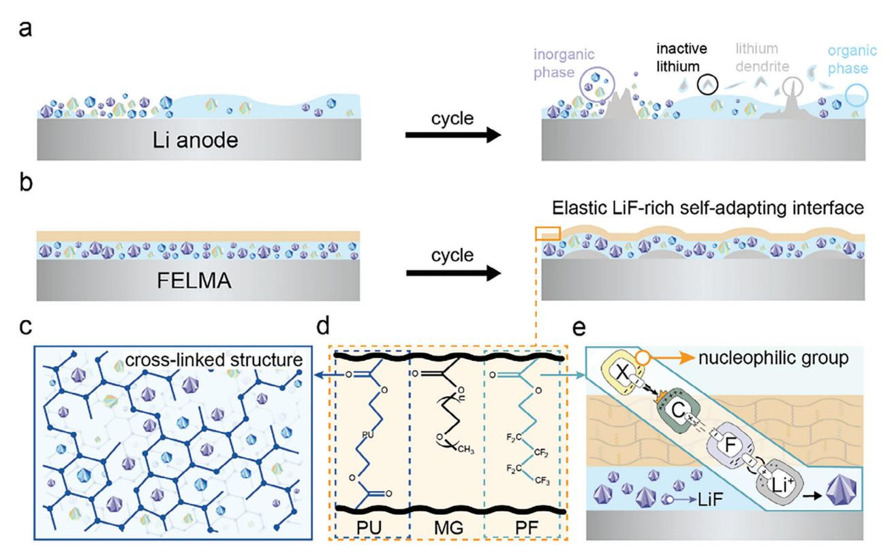
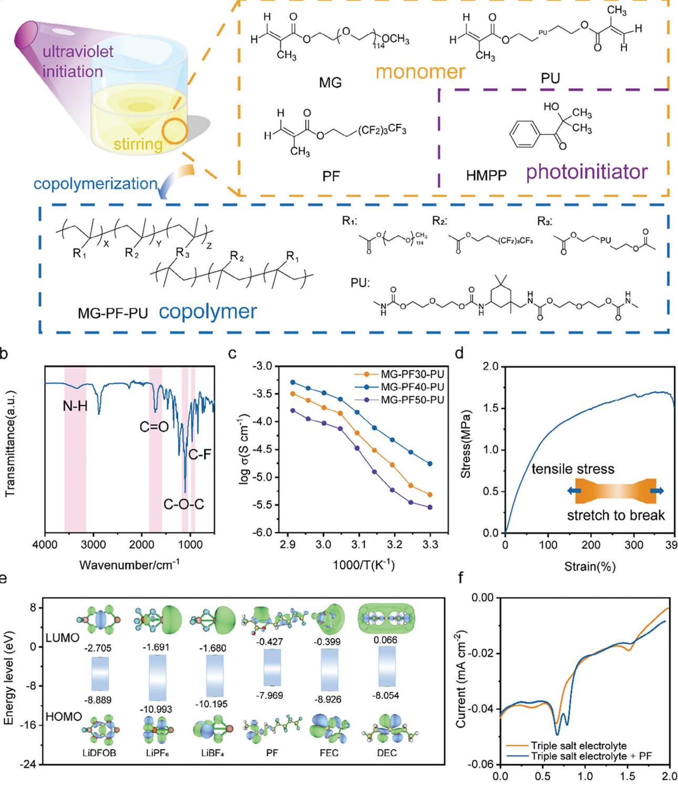
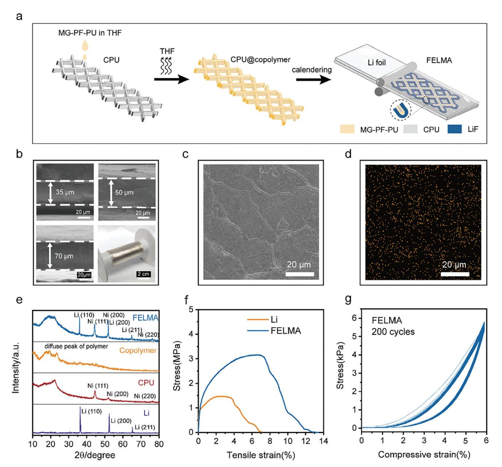
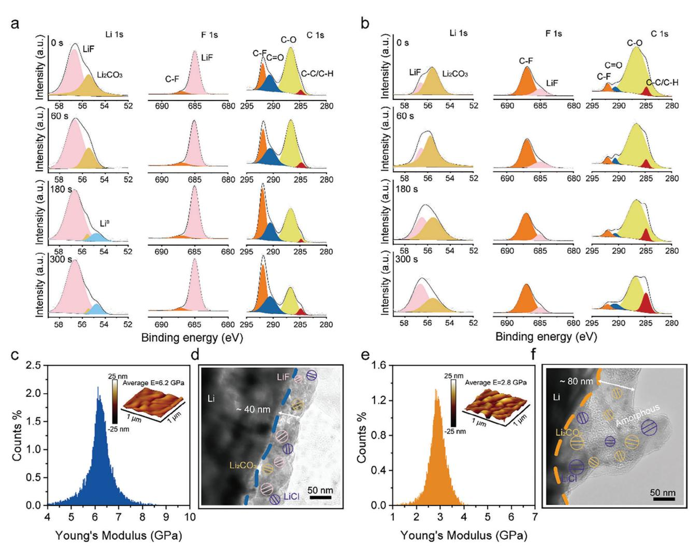
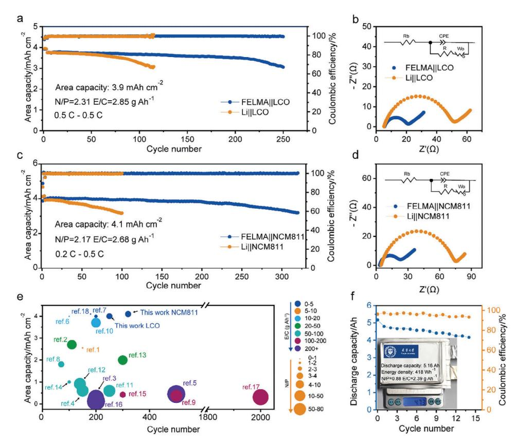

# **Functional Copolymer Derived Self-Adapting LiF-Rich Interphase Toward Deep Cycling Lithium Metal Batteries**

*Aoxuan Wang, Yanxin Nie, Yumeng Zhao, Dehua Xu, Linxue Zhang, Zhengfei Zhao, Libin Ren, Shoubin Zhou, Xingjiang Liu,\* and Jiayan Luo\**

**Lithium metal batteries (LMBs) are the best candidates for high-energy density system. However, the unstable solid electrolyte interphase (SEI) caused by notorious lithium dendrite growth and huge volume fluctuation under practical conditions hinders its commercialization. Here, a functional copolymer composed of monomer is designed with ordered −CF2− groups grafted to viscoelastic backbone to provide homogeneous and self-adapting in situ LiF-rich interface. Hence, the robust interface facilitates rapid Li+ flux and suppresses dendritic Li growth. Furthermore, an elastic composite lithium metal anode (FELMA) based on the designed functional copolymer is fabricated through a cost-effective approach. The FELMA shows excellent cycle stability with ultra-low volume expansion rate of 0.16% per cycle after 200 cycles at the condition of 3 mA cm−2–3 mAh cm−2. The full batteries assembled with high-loading LiNi0.8Co0.1Mn0.1O2 (NCM811, 4.1 mAh cm−2) cathode can maintain 80% capacity retention after 320 cycles under N/P = 2.17 and E/C = 2.68 g Ah−1, with the cycling life increased by 220% than Li||NCM811. A prototype 418 Wh kg−1 pouch cell (5.16 Ah) with N/P ratio of 0.88 and E/C ratio of 2.39 g Ah−1 shows stable cycling.**

A. Wang, Y. Nie, Y. Zhao, L. Zhang, Z. Zhao, X. Liu Key Laboratory for Green Chemical Technology of Ministry of Education School of Chemical Engineering and Technology Tianjin University Tianjin 300072, China E-mail: [xjliu@nklps.org](mailto:xjliu@nklps.org) D. Xu, L. Ren, X. Liu National Key Laboratory of Science and Technology on Power Sources Tianjin Institute of Power Sources Tianjin 300384, China S. Zhou Hua Fu High Technology Energy Storage CO., LTD Yangzhou 225600, China J. Luo Shanghai Key Lab of Advanced High-temperature Materials and Precision Forming State Key Lab of Metal Matrix Composites School of Materials Science and Engineering Shanghai Jiao Tong University Shanghai 200240, China E-mail: [jyluo@sjtu.edu.cn](mailto:jyluo@sjtu.edu.cn) J. Luo Shanghai Jiao Tong University Shaoxing Research Institute of Renewable Energy and Molecular Engineering Shaoxing 312000, China

The ORCID identification number(s) for the author(s) of this article can be found under <https://doi.org/10.1002/adfm.202401462>

### **DOI: 10.1002/adfm.202401462**

### **1. Introduction**

Lithium-ion batteries (LIBs) play an indispensable role in energy electrification worldwide.[\[1\]](#page-9-0) While the specific energy of state-of-the-art LIBs based on intercalation chemistry of graphite anode is approaching the limit of 350 Wh kg−1, it is urgent to develop high-energy-density battery systems.[\[2\]](#page-9-0) Among various anode candidates, the lithium metal anode (LMA) stands out for its high specific capacity (3860 mAh g−1), low density (0.53 g cm−3), and the lowest electrochemical potential (−3.04 V vs the standard hydrogen electrode).[\[3\]](#page-9-0) When matched with the intercalation (LTMO) or conversion type (S or O2) cathodes, the energy density of lithium metal batteries (LMBs) can be dramatically increased.[\[4\]](#page-9-0) However, the LMBs suffer a short lifespan owing to the instability of the Li-metal anode. The inherent highly reactive nature of lithium could lead to the

formation of unstable interphases during cycling, thus inducing electrolyte depletion, the "dead" lithium layer generation as well as an increase of the cell impedance.[\[5\]](#page-9-0) During lithium plating at hash conditions, morphological heterogeneities and the brittle nature of the interphases cause uneven lithium deposition and dendritic lithium formation, which may trigger huge volume fluctuation and battery short circuits.

To alleviate the above issues, tremendous efforts have been put in place to stabilize the interphases between the electrolyte and metallic lithium. Recently, fluorinated SEI with LiF as a key component has been widely adapted to improve the cycling performance of Li metal anode by ensuring better surface morphology and serving as a robust barrier to suppress Li dendrite growth.[\[6\]](#page-10-0) The fluorinating SEI can be derived from fluorinated salts[\[7\]](#page-10-0) fluorinated solvents,[\[8\]](#page-10-0) fluorinated additives,[\[9\]](#page-10-0) and fluorinated solid electrolytes.[\[10\]](#page-10-0) However, the fluorinated SEI composed of dispersed inorganic species constructed by the fluorinated monomer molecules and Li salts cannot well render durable stability of Li-metal anodes due to its mechanical weakness, especially under practical deep cycling conditions where the Li capacity of anode and cathode are nearly balanced in the battery.[\[11\]](#page-10-0) Therefore, designing and constructing elastic and self-adapting fluorinated interphases is necessary to further improve the stability of LMBs.

**Figure 1.** Schematic diagram of the designed copolymer. a) Schematic diagram of Li anode with an unevenly distributed interface. b) Schematic diagram of FELMA with an elastic self-adapting LiF-rich interface. c) Schematic diagram of a cross-linked structure formed by PU monomer. d) Schematic diagram of the structure of MG-PF-PU. e) Schematic diagram of the possible reaction mechanism of in situ formation of LiF by PF monomer.

In this contribution, the functional copolymer was specially designed and synthesized to construct robust fluorinated SEI. The copolymer with the high F content monomer can in situ derive homogeneous LiF, which is anchored by the viscoelastic monomer, and the monomer containing polar functional group can provide high ionic conductivity. Thus, an elastic lithium composited lithium metal anode (FELMA) with a self-adapting LiFrich interface was constructed by incorporating lithium metal and the 3D conductive polyurethane (CPU) coated with the designed copolymer through mechanical rolling. The symmetrical battery assembled by FELMA can achieve a stable cycle of 550 cycles at the condition of 3 mA cm−2–3 mAh cm−2 while maintaining the single cycle volume expansion rate of 0.16%. When matched with a high-loading NCM811 cathode (4.1 mAh cm−2), the capacity retention rate can still reach 80% after 320 cycles even under the harsh condition of N/P = 2.17 and E/C = 2.68 g Ah−1. In the process of practical application, the 5.16 Ah pouch cell with ultra-low N/P ratio of 0.88 and E/C ratio of 2.39 g Ah−1 assembled by FELMA and NCM811 possesses the energy density of 418 Wh kg−1 and exhibits remarkably cycling performance.

#### **2. Results and Discussion**

#### **2.1. Design Copolymer**

Due to the serious side reaction between lithium metal and electrolyte, the distribution of components in SEI on the surface of LMA is particularly uneven, and the penetration of lithium dendrite is more likely to occur in the inorganic particles region with loose contact and the organic phase region with poor mechanical properties, resulting in irreversible electrolyte and active lithium loss (**Figure 1**a). In order to solve these problems faced by LMAs, we introduced a copolymer (MG-PF-PU) into the composited lithium metal anode to form an elastic, self-adapting, and LiF-rich interphase in situ, which can ensure the stability of the interface during cycles (Figure 1b). The structure of MG-PF-PU is shown in Figure 1d, the copolymer can achieve versatility through different chain segments with unique functions. First of all, as for 3,3,4,4,5,5,6,6,6-nonafluorohexyl methacrylate (PF), the strong nucleophilic group in the battery system can attack its C─F bond and break it, while the strong electrophilic group Li+ combines with fluoride anions to generate inorganic LiF in situ (Figure 1e),[\[12\]](#page-10-0) and the possible reaction mechanism is shown in Figure S4 (Supporting Information). The abundant inorganic components in the SEI acquired by reaction in situ play an important role in accelerating the ion transport at the interface and enhancing its stability. However, excessive inorganic particles cannot withstand the larger volume fluctuation of the electrode because of the poor interaction force between them.[\[13\]](#page-10-0) Therefore, the highly viscoelastic polyurethane methacrylate (PU) which can participate in the copolymerization reaction through its double bonds at both ends to form a cross-linked structure was introduced to anchor the inorganic particles in a fixed position and adapt to the localized uneven deposition (Figure 1c). Finally, polyethylene glycol114 methacrylate (MG) with high ionic conductivity was introduced to provide a fast ion transport pathway. In summary, we construct an elastic, self-adapting, and LiF-rich interface at the interface of LMA by introducing a copolymer.

#### **2.2. Synthesis and Characterization of MG-PF-PU**

In this part, we synthesized the copolymer by ultraviolet lightinduced polymerization and characterized the corresponding physical and chemical properties. **Figure [2](#page-3-0)**a shows the synthesis process of MG-PF-PU. The detailed synthesis methods of monomers and copolymers are presented in Figures S1–S3 (Supporting Information). Fourier transform infrared spectroscopy (FT-IR) and nuclear magnetic resonance spectrum (NMR) were conducted to confirm the synthesis of copolymer. The characteristic peaks of N-H (3341 cm−1), C═O (1725 cm−1), C─O─C (1106 cm−1), and C─F (962 cm−1) are shown in Figure [2b,](#page-3-0) which are the functional groups of MG-PF-PU. Figure S5a–d (Supporting Information) shows the 1H NMR spectra of MG, PF, PU, and MG-PF-PU in CDCl3. The chemical shifts of ═CH2 in MG, PF, and PU at 6.06 and 5.50 ppm disappear in the spectrum of MG-PF-PU but convert to the resonances at 1.03 and 0.90 ppm, which represent ─CH2. Except for that, other proton peaks in the monomer still appear in the spectrum of MG-PF-PU. Furthermore, as seen in Figure S5e,f (Supporting Information), the expected signals from fluorine atoms of PF are also present in the 19F NMR spectrum of MG-PF-PU. All these spectroscopic data indicate that the MG-PF-PU has been synthesized successfully.

To achieve the trifunctionality of the copolymer, it is important to tune the feedings of PF, PU, and MG segments to achieve the synergistic effect of high F content, high mechanical strength, and high ion conductivity. According to the previous work,[\[14\]](#page-10-0) the ratio of MG and PU was set to be 1:2. The additional amounts of PF were controlled to be 30, 40, and 50 wt%, which were denoted as MG-PF30-PU, MG-PF40-PU, and MG-PF50-PU, respectively. The temperature-dependent ionic conductivities of the three copolymers are shown in Figure [2c.](#page-3-0) The ionic conductivities increase with the increasing temperature in the range of 30–70 °C, but their growth rates slow down due to the increase of amorphous regions in the electrolyte membrane above 55 °C.[\[15\]](#page-10-0) Moreover, the ionic conductivity doesn't linearly decrease with the increasing fluorine-containing contents from 30 to 50 wt%, and the highest ionic conductivity is obtained at the content of 40 wt%. It can be inferred that the moderate amount of PF containing high dielectric constant fluorine can promote the dissociation of lithium salts, while, hindering the migration of lithium ions when it is excessive, leading to the decrease of ionic conductivity.[\[16\]](#page-10-0) As for the copolymer with fluoropolymer at the content of 40 wt%, its ionic conductivity reaches 5.11 × 10−4 S cm−1 at 70 °C, which is considerably higher than conventional fluoropolymers (Table S3, Supporting Information). When the testing temperature steppes across the melting point of the copolymer (55 °C), the activation energy (*Ea*) is calculated to be 0.196 eV by Equation S2 (Supporting Information). The increase in ionic conductivity should be attributed to the penetrations of amorphous polyoxyethylene (PEO) domains and fluorinated interfaces where the high-speed movement of Liions is not disrupted. In addition, the copolymer also exhibits higher oxidative and thermal stability (Figures S6–S8, Supporting Information). Therefore, the copolymer MG-PF40-PU was selected for the subsequent study.

The mechanical properties of MG-PF40-PU were investigated by tensile testing experiment at room temperature (Figure [2d\)](#page-3-0). The fracture deformation of the copolymer reaches 390% with a fracture strength of 1.7 MPa, which is ≈5 times of PEO electrolyte.[\[17\]](#page-10-0) The strong stretchability of MG-PF40-PU is based on the ═CH2 double bonds at both ends of the PU monomer participating in the copolymerization reaction, making the copolymer have a cross-linked structure. The strong adhesion strength (32 KPa) between copolymer and lithium metal can ensure close contact in the composite electrode (Figure S9, Supporting Information).

The highest occupied molecular orbital (HOMO) and lowest unoccupied molecular orbital (LUMO) energy levels are used to denote the redox stabilities of the solvent molecules, lithium salts, and PF polymer monomers. Figure [2e](#page-3-0) shows the LUMO and HOMO energy levels of the components in triple salt electrolyte (0.2 m lithium hexafluorophosphate (LiPF6), 0.2 m lithium tetrafluoroborate (LiBF4) and 0.8 m lithium difluoro(oxalato)borate (LiDFOB) in fluoroethylene carbonate/diethyl carbonate (FEC:DEC, 1:2 by volume)) and PF via density functional theory (DFT) calculation, exported through Multiwfn.[\[18\]](#page-10-0) The LUMO energy levels of LiDFOB, LiPF6, and LiBF4 are −2.075, −1.691, and −1.680 eV, respectively, which are lower than solvent molecules and PF, indicating that the anions of lithium salts preferentially decompose and participate in the formation of the SEI dominated by inorganic components. It is worth noting that the LUMO energy level of PF (−0.427 eV) is lower than that of the two solvent molecules (FEC, −0.399 eV; DEC −0.066 eV), which indicates that PF is preferentially to decompose than FEC and DEC to participate in the formation of SEI. The simulation results are also verified by the following experiments. The reduction potentials of triple salt electrolytes with/without PF were measured by linear sweep voltammetry (LSV) from 2.0 to 0 V at 1 mV s−1 (Figure [2f\)](#page-3-0). The reduction peaks at 1.51 and 0.67 V belong to LiDFOB and FEC, respectively.[\[19\]](#page-10-0) The new peaks at 0.79 V of triple salt electrolyte with PF are generated by the reduction of PF, which takes precedence over FEC. The above results indicate that PF can be involved in the formation of SEI through a reduction reaction.

#### **2.3. Construction and Characterization of FELMA**

To verify the effectiveness of the copolymer on LMA, we prepared copolymer@Li by the mean of a mechanical roller press (Figure S10, Supporting Information). As expected, both the symmetrical and full batteries equipped with it show better electrochemical performance than pure Li (Figure S11, Supporting Information). On this basis, we loaded the copolymer onto the surface of the 3D skeleton to achieve its uniform distribution and maintain the stability of the structure during the stripping/platting of lithium metal. A suitable skeleton is the prerequisite for constructing a stable composite lithium anode. The CPU was chosen due to its 3D skeleton, low density, and high elastic properties, its detailed physical properties are shown in Figure S12 (Supporting Information). Therefore, we constructed an elastic composite

**Figure 2.** Synthesis and physicochemical properties characterization of MG-PF-PU. a) Schematic of synthesizing MG-PF-PU by visible light-driven photocontrolled radical polymerization. b) The FT-IR spectroscopy of MG-PF-PU. c) Ionic conductivities of MG-PF-PU with LiTFSI containing different amounts of PF in the temperature range from 30 to 70 °C. d) The fracture strength and deformation of MG-PF-PU. e) The LUMO and HOMO levels of PF and all components in the triple salt electrolyte. f) LSV curves of triple salt electrolyte with/without PF scanned from 2.0 to 0 V at 1 mV s−1.

**Figure 3.** Construction and characterization of FELMA. a) The schematic diagram of the preparation process of FELMA. b) The SEM images of FELMA with different thicknesses and the optical picture of large-size FELMA foil. c) The SEM image of Li foil after interacting with PF solvent and d) its relevant EDS mapping. e) The X-ray diffraction pattern of Li, CPU, MG-PF40-PU, and FELMA. f) The fracture strength test of Li and FELMA. g) The cyclic compression test of FELMA with the compressive strain of 6%.

lithium metal anode (FELMA) based on MG-PF40-PU and CPU, as shown in **Figure 3**a. First, the MG-PF40-PU dispersion liquid in tetrahydrofuran (THF) was uniformly dropped onto the surface of the CPU and then placed in a vacuum oven at 80 °C to evaporate the solvent to obtain the CPU@copolymer. The scanning electron microscope (SEM) images of the CPU with/without copolymer and their relevant energy spectrum analysis (EDS) mapping are shown in Figure S13 (Supporting Information). The uniform distribution of the F element proves that the copolymer is uniformly coated on the surface of the skeleton. Finally, the Li foil and the CPU@copolymer were combined by repeated roller compression to construct FELMA. It is worth noting that the introduced artificial copolymer interface distributes in 3D body phase evenly, which is different from the common 2D plane construction. The simple and efficient composite electrode preparation method can achieve precise control of thickness and largescale production (Figure 3b). By adjusting the ratio of lithium metal, CPU, and copolymer as well as the thickness of the electrode, FELMA with different area capacities and mass-specific capacities can be prepared to realize the application in different scenarios (Figure S14, Supporting Information). The FELMA with a thickness of 50 μm, an area capacity of 6.02 mAh cm−2 and a specific capacity of 2127.9 mAh g−1 was selected for further study.

In order to verify the possibility of a direct reaction between lithium metal and PF, the fresh lithium foil was stored in PF solvent for 24 h. Then, its surface morphology and elemental analysis were carried out after cleaning with dimethyl ether (DME) solvent. The SEM image of the surface of lithium after the reaction is shown in Figure [3c,](#page-4-0) and the uniform distribution of the F element on the surface indicates the reaction between them (Figure [3d\)](#page-4-0). In addition, the high LiF content in the XPS spectra of F 1s indicates that LiF is generated by the in situ reaction between PF and lithium metal (Figure S15, Supporting Information). At the same time, the results of element analysis on the surface of FELMA show that the F element is uniformly distributed on the electrode surface (Figure S16, Supporting Information). The diffraction peaks of different crystal faces of Li, CPU, copolymer, and FELMA are shown in Figure [3e.](#page-4-0) FELMA only reflects the characteristic diffraction peaks of the three materials without other new peaks, which indicates good compatibility among them.

During cycling, along with the deposition and dissolution of lithium metal, the pressure of the battery will also change accordingly. Preferential deformation of the softer skeleton can release the pressure generated during the deposition of lithium, and its good elasticity enables it to return the initial state during the dissolution of lithium metal.[\[14\]](#page-10-0) The fracture strength tests of Li and FELMA are shown in Figure [3f.](#page-4-0) As for FELMA, its deformation at fracture is 6.76%, which is 1.84 times that of pure Li. At the same time, its fracture strength reaches 3.16 MPa, which is 2.15 times that of pure Li. The deformation range of FELMA was controlled to 6% of the electrode thickness, and the cyclic compression test was carried out. After cyclic compression of 200 times, the electrode can still restore to its initial state, as shown in Figure [3g.](#page-4-0) The highly elastic FELMA can effectively release the stress inside the battery, inhibit the volume expansion of the electrode, and stabilize the SEI.

#### **2.4. Composition and Structure of the SEI**

The composition, mechanical properties, and structure were characterized to confirm that the copolymer can participate in the formation of LiF-rich, highly Young's modulus, and inorganicdominated SEI. Previous theoretical calculations and experimental studies have confirmed that the C─F bond in PF will break due to the attack of nucleophiles and then combine with Li+ to form LiF during the cycles. The composition of the SEI layers on different anodes collected from the symmetric FELMA||FELMA and Li||Li batteries after 50 cycles at a current density of 3 mA cm−2 and with a capacity of 3 mAh cm−2 was investigated by X-ray photoelectron spectroscopy (XPS), which were shown in **Figure 4**[a,b.](#page-6-0) In the Li 1s spectra, there are three peaks of Li0, Li2CO3, and LiF at 54.76, 55.45, and 56.66 eV. For FELMA, the Li0 signal appears after 180 s of Ar sputtering, while disappears the Li0 signal even after 300 s of sputtering on the SEI of the Li anode. From the peak intensity, with the increase of sputtering time, the content of LiF dominates the SEI of FELMA and remains constant, which is always higher than that of Li anode. The results indicate that the introduction of fluorinated copolymer leads to a thinner and LiF-rich SEI. In the F 1s spectra, the peaks appeared at 685.0 and 687.2 eV representing LiF and C─F respectively. The LiF component dominates and is much larger than the organic component represented by C─F in the spectra of FELMA, while the content of LiF in the Li anode is always relatively low. In the C 1s spectra, the peaks of C─C/C─H, C─O, C═O, and C─F are located at 284.80, 286.66, 290.63, and 291.94 eV. First of all, the peak intensity of C─C/C─H, C─O, and C═O gradually decreases with the increase of sputtering time in the SEI of FELMA. At the same time, the content of C─F hardly changes and is higher than that on the surface of Li anode, indicating that the fluorinated copolymer affects the composition of SEI. Combining the spectra of Li 1s, F 1s, and C 1s, it is not difficult to conclude that the bottom of SEI of FELMA is mainly composed of inorganic LiF, which originates from the spontaneous reaction of fluoropolymer and Li, as well as the decomposition of lithium salts and solvents. In contrast, the thicker organic componence-dominated SEI on the surface of the Li anode hardly changed with the increase of sputtering time. On this basis, in order to eliminate the influence of fluorinated lithium salts and solvents on SEI components, a fluorine-free electrolyte (1 m lithium perchlorate (LiClO4) in dioxolan/dimethyl ether (DOL: DME = 1:2 by volume)) was used to replace 0.2 m LiPF6, 0.2 m LiBF4 and 0.8 m LiDFOB in FEC/DEC (1:2 by volume) electrolyte. The corresponding SEI composition is presented in Figures S17 and S18 (Supporting Information). In summary, the introduction of fluorinated copolymer makes the SEI on the electrode surface thinner and dominated by inorganic LiF, which is of great significance for improving ion transport, mechanical properties, and stability during charge–discharge cycles.

With the information gained through the atomic force microscope (AFM), we are able to approach the mechanical properties and surface morphology of the SEI on the FELMA and Li anode. A high average Young's modulus of 6.2 GPa is obtained from the SEI of FELMA, which is higher than the threshold value (6 GPa) to impede dendritic Li growth according to the previous work.[\[20\]](#page-10-0) High Young's modulus and rapid ion transport ability of the inorganic component dominated SEI of FELMA promote a more uniform and flat deposition morphology, as shown in Figure [4c.](#page-6-0) In contrast, as shown in Figure [4e,](#page-6-0) the average Young's modulus of the SEI dominated by organic components formed on the surface of Li anode is only 2.8 GPa, far less than that of FELMA. The slower ion transport and poorer mechanical strength deteriorate the homogeneous deposition of Li+, thus, its surface is covered with wrinkles. Based on the AFM results, the LiF-rich SEI layer of FELMA can provide a high Young's modulus to adapt to the excessive local pressure at the interface.

Cryo-Transmission electron microscopy (cryo-TEM) was employed to further characterize the detailed structure and distribution of the inorganics and organics. Metallic Li was deposited on the Cu grid with/without covered copolymer with an area capacity of 0.2 mAh cm−2 at a current density of 0.1 mA cm−2 for cryo-TEM observation, using 1 m LiClO4 in DOL/DME (1:2 by volume) electrolyte. As shown in Figure [4d,](#page-6-0) the SEI on the Cu grid covered with copolymer is highly crystalline with a LiF-dominated hybrid layer including LiF, Li2CO3, and LiCl. The high-resolution TEM images are also given to further prove the existence of crystalline components, in which the lattice spacings of LiF (111), LiCO3 (021), and LiCl (220) are 0.232, 0.227, and 0.181 nm,

**Figure 4.** Composition and structure of the SEI layers on the surface of FELMA and Li anode. The XPS spectra of Li 1s, F 1s, and C 1s for a) FELMA and b) bare Li after 50 cycles at 3 mA cm−2 with capacity of 3 mAh cm−2 at different sputtering times. The Young's modulus distribution of the SEI on the surface of c) FELMA and e) Li anode, and their corresponding surface morphology are shown in the small diagram inside. Cryo-TEM images of the SEI layer formed on d) copolymer-Cu in Li||copolymer-Cu and f) Cu in Li||Cu.

respectively (Figure S19, Supporting Information). The thinner thickness (≈40 nm) and smoother surface also indicate its stability during lithium deposition. However, the SEI with a thickness of ≈80 nm on the bare Cu shows an entirely different morphology, in which the amorphous phase dominates the SEI, and a small amount of inorganic crystalline phases are scattered randomly (Figure 4f). In summary, the introduction of MG-PF40- PU contributes to the formation of LiF-dominated, mechanically stronger, and inorganic evenly distributed SEI, which is beneficial to the stable cycling of FELMA.

#### **2.5. The Volume Changes of Electrode**

In situ, and ex situ experiments were conducted to investigate the ability of FELMA to inhibit the volume expansion of the electrode under the condition of high current-high capacity. Under the condition of 3 mA cm−2–3 mAh cm−2, the Li||Li symmetrical cell experiences a short circuit after 100 cycles. In contrast, the cycling life of FELMA||FELMA symmetric cell increases 5.5 times (550 cycles) at a constant overpotential of 50 mV (**Figure 5**[a\)](#page-7-0). When the current density is increased to 25 mA cm−2, the FELMA symmetric cell can cycle stably for more than 9000 cycles under 1 mAh cm−2 (Figure S20, Supporting Information). Moreover, the symmetric cell using 50 μm FELMA with a capacity of 6.778 mAh can realize 84% capacity retention after 100 cycles under 50% DOD and 0.5 C rate (Figure S21, Supporting Information), indicating its feasibility to match with a high-loading positive electrode. As shown in the results of electrochemical impendence spectroscopy (EIS), the interface impedances of FELMA||FELMA after different cycles are smaller than Li||Li, which indicates the faster Li+ migration in the interface of FELMA. The exchange current density of FELMA||FELMA cells is 37.52 mA cm−2, which is significantly higher than that of Li||Li cells, indicating faster transfer dynamics at the interface (Figure S22, Supporting Information).

**Figure 5.** Volume changes of FELMA and Li anode after cycling. a) Galvanostatic cycling performance of symmetric cells at a current density of 3 mA cm−2 with capacity of 3 mAh cm−2. b) Nyquist plots of symmetric cells prepared with FELMA and pure Li after different cycles at 3 mA cm−2 with capacity of 3 mAh cm−2. c) Cross-section and top-view SEM images of FELMA and pure Li after different cycles at 3 mA cm−2 with capacity of 3 mAh cm−2. d) Comparison of recent literature on the volume expansion of composite lithium electrodes from three aspects: area capacity, single cycle volume expansion rate and current density. e) Voltage-capacity curves of pouch cell of FELMA||NCM811 with the capacity of 125 mAh and f) its corresponding real-time pressure changes. g) The real-time pressure changes of pouch cells based on the Li anode.

**Figure 6.** Electrochemical performance of full batteries. a) Cycling performance of the LCO full cells with FELMA and pure Li. b) Nyquist plots of LCO full cells after 10 cycles. c) Cycling performance of the NCM811 full cells with FELMA and pure Li. d) Nyquist plots of NCM811 full cells after 10 cycles. e) Comparison of the area capacity, cycle number, N/P ratio, and E/C ratio between this work and previously composite lithium metal anode batteries. f) The cycling performance and optical picture of the 5.16 Ah pouch cell.

Ex situ SEM was used to characterize the ability of FELMA to inhibit the volume expansion. The cross-section SEM images of FELMA and pure Li after 0/10/50/100/200 cycles and top-view SEM images are shown in Figure [5c.](#page-7-0) As for FELMA, it can be seen that the thickness only increases from 50 to 66 μm after 200 cycles with a single cycle volume expansion rate of 0.16% with uniform and dense deposition morphology. As for pure Li, the uneven lithium deposition and dissolution results in continuous thickness increase with a single cycle volume expansion rate of 1.86% after 100 cycles, which is ≈10 times larger than FELMA. The recent works of lithium composite anode on inhibiting the volume expansion of electrodes are compared in Figure [5d](#page-7-0) from three perspectives: single cycle volume expansion rate, area capacity, and current density. In comparison, our work shows the smallest single-cycle volume expansion rate under the condition of high current-high capacity during cycling.

An in situ pressure detection device was conducted to detect the pressure change of the pouch cells during the charge/discharge process in real-time, which can further indicate the anode volume fluctuation during cycling (Figure S23, Supporting Information). The voltage-capacity curves of FELMA||NCM811 are presented in Figure [5e.](#page-7-0) The initial external pressure on the pouch cells was set as 40 kPa. After the first charging process, the pressure of FELMA||NCM811 increases by 6.12 kPa, which is only 17.6% of Li||NCM811. Meanwhile, the pressure of FELMA||NCM811 only increases by 1.38 kPa after 5 cycles, which is 6.4% of Li||NCM811 (Figure [5f,g\)](#page-7-0). All the above results show that the elastic substrate and stable interface of FELMA play an important role in retraining the volume expansion of the electrode.

#### **2.6. Electrochemical Performance of Full Batteries**

For achieving high energy density batteries in practical applications, it is necessary to match a high-loading cathode and control the N/P and E/C at a low level. The LiCoO2 (LCO, 3.9 mAh cm−2) and LiNi0.8Co0.1Mn0.1O2 cathode (NCM811, 4.1 mAh cm−2) were used as the cathodes, the FELMA (50 μm) and pure Li (30 μm) were used as the anode to assemble the full batteries. The FELMA||LCO full cell, with N/P ratio of 2.31 and E/C ratio of 2.85 g Ah−1, can exhibit 260 cycles with 80% capacity retained at 0.5 C, which is 100% longer than the cell with pure Li anode (**Figure 6**a). The EIS measurements were conducted to characterize the interface property, and the lower impendence of FELMA||LCO shows its faster ion transport ability and better interfacial stability after 10 cycles, which is attributed to the LiF-rich SEI on the surface of FELMA (Figure 6b). As for FELMA||NCM811 with N/P ratio of 2.17 and E/C ratio of 2.68 g Ah−1, the capacity retention can still reach 80% after 320

cycles at 0.2 C/0.5 C charge/discharge conditions, which is 200% longer than Li||NCM811 (Figure [6c\)](#page-8-0). In addition, it shows a much better rate of performance (Figure S24, Supporting Information). The lower interfacial impedance of FELMA||NCM811 illustrates the faster SEI ion transport kinetics (Figure [6d\)](#page-8-0). The interface impedance after 300 cycles only increases from 17.4 Ω in 10 cycles to 23.2 Ω, which indicates the excellent stability of the SEI on the surface of FELMA (Figure S25, Supporting Information). Figure [6e](#page-8-0) compares the recent works on lithium composite anode from N/P ratio, E/C ratio, area capacity, and cycle numbers. It is not difficult to find that the FELMA displays the best cycling stability with a deep charge–discharge cycling even under the harsh conditions of low N/P and E/C. In order to take full advantage of the conductive skeleton and the spontaneously formed LiFrich self-healing interface, a FELMA||lithium-free cathode full cell was conducted (Figure S26, Supporting Information). Its excellent performance further proves the significant advantages of the composite lithium anode.

To couple with practical use, FELMA||NCM811 pouch cell (5.16 Ah) with lean electrolyte (2.39 g Ah−1) and an ultra-low N/P ratio (0.88) was assembled and evaluated to demonstrate the effectiveness of FELMA. The FELMA||NCM811 pouch cell achieves a specific energy of 418 Wh kg−1 and exhibits remarkable cycling performance (Figure [6f\)](#page-8-0). Furthermore, a 380 Wh kg−1 pouch cell with a capacity of 2.27 Ah was also assembled and maintained a capacity retention of 96.6% after 15 cycles at 0.1 C charge/0.1 C discharge (Figure S27, Supporting Information). It is noteworthy that, the FELMA prepared in this work has a greater degree of improvement than the previous work in both inhibiting electrode volume expansion and improving the battery cycle performance (Figures S28 and S29, Supporting Information).[\[14\]](#page-10-0)

### **3. Conclusion**

In summary, we have successfully synthesized a tri-functional copolymer by photo-triggered polymerization and verified the ability to undergo an in situ reaction to produce LiF, high viscoelasticity, and theoretically high ionic conductivity. We construct an elastic composite lithium metal anode (FELMA) with a self-adapting LiF-rich interface based on an elastic conductive polyurethane skeleton loaded with copolymer through mechanical rolling. Due to the addition of PF, the LiF-rich SEI dominated by inorganic components with a higher Young's modulus of 6.2 GPa is formed on the surface of FELMA. At the same time, the FELMA shows outstanding advantages in inhibiting volume expansion with a single circle volume expansion rate of 0.16% under the condition of 3 mA cm−2–3 mAh cm−2, which is ≈10% of the pure Li anode. In the practical application process, the full batteries assembled by FELMA and high-loading NCM811 cathode (4.1 mAh cm−2) still have 80% capacity retention rate after 320 stable cycles under the harsh condition of N/P = 2.17 and E/C = 2.68 g Ah−1, and even if the depth of discharge of FELMA reaches 50%, it can still cycle 260 times stably. The 5.16 Ah pouch cell with ultra-low N/P ratio of 0.88 and E/C ratio of 2.39 g Ah−1 assembled by FELMA possesses the energy density of 418 Wh kg−1 and exhibits remarkably cycling performance. The excellent performance of FELMA is attributed to the self-adapting LiFrich interface derived by the copolymer and the elastic conductive skeleton. Therefore, the modification strategy for lithium metal anode also has far-reaching guiding significance for other secondary battery systems.

## **Supporting Information**

Supporting Information is available from the Wiley Online Library or from the author.

### **Acknowledgements**

A.W. and Y.N. contributed equally to this work. This work was supported by National Key Research and Development Program of China (No. 2021YFB2500100), National Natural Science Foundation of China (No. 22278308 and 22109114), the Carbon Peaking and Carbon Neutrality Technology Innovation Special Fund of Jiangsu Province (Grant number: BE2022041) and Open Foundation of Shanghai Jiao Tong University Shaoxing Research Institute of Renewable Energy and Molecular Engineering (Grant number: JDSX2022023).

## **Conflict of Interest**

The authors declare no conflict of interest.

### **Data Availability Statement**

The data that support the findings of this study are available from the corresponding author upon reasonable request.

### **Keywords**

composited lithium metal anode, copolymer, LiF, low volume expansion, self-adapting SEI

> Received: January 24, 2024 Revised: March 27, 2024 Published online: April 17, 2024

[1] M. Li, J. Lu, Z. Chen, K. Amine, *Adv. Mater.* **2018**, *30*, 1800561.

- [3] a) S. Tan, J. M. Kim, A. Corrao, S. Ghose, H. Zhong, N. Rui, X. Wang, S. Senanayake, B. J. Polzin, P. Khalifah, J. Xiao, J. Liu, K. Xu, X. Q. Yang, X. Cao, E. Hu, *Nat. Nanotechnol.* **2023**, *18*, 243; b) Y. Meng, D. Zhou, R. Liu, Y. Tian, Y. Gao, Y. Wang, B. Sun, F. Kang, M. Armand, B. Li, G. Wang, D. Aurbach, *Nat. Energy* **2023**, *8*, 1023.
- [4] a) Q. Zhang, S. Sun, M. Zhou, L. Hou, J. Liang, S. Yang, B. Li, X. Zhang, J. Huang, *Angew. Chem., Int. Ed.* **2023**, *62*, 202306889; b) Y. Xie, J. Cao, X. Wang, W. Li, L. Deng, S. Ma, H. Zhang, C. Guan, W. Huang, *Nano Lett.* **2021**, *21*, 8579; c) P. G. Bruce, S. A. Freunberger, L. J. Hardwick, J. M. Tarascon, *Nat. Mater.* **2012**, *11*, 19; d) H. Su, Z. Chen, M. Li, P. Bai, Y. Li, X. Ji, Z. Liu, Z. Liu, J. Sun, J. Ding, M. Yang, X. Yao, C. Mao, Y. Xu, *Adv. Mater.* **2023**, *35*, 2301171; e) F. Wu, S. Fang, M. Kuenzel, A. Mullaliu, J. K. Kim, X. Gao, T. Diemant, G. T. Kim, S. Passerini, *Joule* **2021**, *5*, 2177; f) Y. Xia, P. Zhou, X. Kong, J. Tian, W. Zhang, S. Yan, W. Hou, H. Zhou, H. Dong, X. Chen, P. Wang, Z. Xu, L. Wan, B. Wang, K. Liu, *Nat. Energy* **2023**, *8*, 934; g) C. Niu, H. Pan, W. Xu, J. Xiao, J. Zhang, L. Luo, C. Wang, D. Mei, J. Meng, X. Wang, Z. Liu, L. Mai, J. Liu, *Nat. Nanotechnol.* **2019**, *14*, 594.

[2] a) J. Cao, G. Qian, X. Lu, X. Lu, *Small* **2023**, *19*, 2205653; b) S. Kim, G. Park, S. J. Lee, S. Seo, K. Ryu, C. H. Kim, J. W. Choi, *Adv. Mater.* **2023**, *35*,2206625.

- [5] B. Jagger, M. Pasta, *Joule* **2023**, *7*, 2228.
- [6] a) J. Tan, J. Matz, P. Dong, J. Shen, M. Ye, *Adv. Energy Mater.* **2021**, *11*, 2100046; b) Y. Liu, X. Tao, Y. Wang, C. Jiang, C. Ma, O. Sheng, G. Lu, X. Lou, *Science* **2022**, *375*, 739.
- [7] a) Y. Wang, F. Liu, G. Fan, X. Qiu, J. Liu, Z. Yan, K. Zhang, F. Cheng, J. Chen, *J. Am. Chem. Soc.* **2021**, *143*, 2829; b) J. Li, H. Hu, W. Fang, J. Ding, D. Yuan, S. Luo, H. Zhang, X. Ji, *Adv. Funct. Mater.* **2023**, *33*, 2303718.
- [8] W. Zhang, T. Yang, X. Liao, Y. Song, Y. Zhao, *Energy Storge Mater* **2023**, *57*, 249.
- [9] a) J. Xie, S. Sun, X. Chen, L. Hou, B. Li, H. Peng, J. Huang, X. Zhang, Q. Zhang, *Angew. Chem., Int. Ed.* **2022**, *61*, 202204776; b) Y. Tan, G. Lu, J. Zheng, F. Zhou, M. Chen, T. Ma, L. Lu, Y. Song, Y. Guan, J. Wang, Z. Liang, W. Xu, Y. Zhang, X. Tao, H. Yao, *Adv. Mater.* **2021**, *33*, 2102134.
- [10] X. Wang, C. Zhang, M. Sawczyk, J. Sun, Q. Yuan, F. Chen, T. Mendes, P. Howlett, C. Fu, Y. Wang, X. Tan, D. Searles, P. Kral, C. Hawker, A. Whittaker, M. Forsyth, *Nat. Mater.* **2022**, *21*, 1057.
- [11] a) H. Wang, Z. Yu, X. Kong, W. Huang, Z. Zhang, D. G. Mackanic, X. Huang, J. Qin, Z. Bao, Y. Cui, *Adv. Mater.* **2021**, *33*, 2008619; b) X. Cao, X. Ren, L. Zou, M. H. Engelhard, W. Huang, H. Wang, B. E. Mattews, H. Lee, C. Niu, B. W. Arey, Y. Cui, C. Wang, J. Xiao, J. Liu, W. Xu, J. Zhang, *Nat. Energy* **2019**, *4*, 796.
- [12] a) A. Nova, R. M. Balleste, A. Lledos, *Organometallics* **2012**, *31*, 1245; b) M. Bergeron, T. Johnson, J. Paquin, *Angew. Chem., Int. Ed.* **2011**, *50*, 11112; c) S. Xu, H. Duan, J. Shi, T. Zuo, X. Hu, S. Lang, M. Yan, J. Liang, Y. Yang, Q. Kong, X. Zhang, Y. Guo, *Nano Res.* **2020**, *13*, 430.
- [13] Q. Zhang, X. Zhang, J. Wan, N. Yao, T. Song, J. Xie, L. Hou, M. Zhou, X. Chen, B. Li, R. Wen, H. Peng, Q. Zhang, J. Huang, *Nat. Energy* **2023**, *8*, 725.
- [14] D. Xu, N. Zhou, A. Xuan, Y. Xu, X. Liu, S. Tang, J. Luo, *Adv. Mater.* **2023**, *35*, 2302872.
- [15] Y. Sun, X. Zhang, C. Ma, N. Guo, Y. Liu, J. Liu, H. Xie, *J. Power Sources* **2021**, *516*, 230686.
- [16] Y. Wang, S. Chen, Z. Li, C. Peng, Y. Li, W. Feng, *Energy Storage Mater* **2022**, *45*, 474.
- [17] Y. Ji, K. Yang, M. Liu, S. Chen, X. Liu, B. Yang, Z. Wang, W. Huang, Z. Song, S. Xue, Y. Fu, L. Yang, T. S. Miller, F. Pan, *Adv. Funct. Mater.* **2021**, *31*, 2104830.
- [18] T. Lu, F. Chen, *J. Comput. Chem.* **2012**, *33*, 580.
- [19] P. Bai, X. Ji, J. Zhang, W. Zhang, S. Hou, H. Su, M. Li, T. Deng, L. Cao, S. Liu, X. He, Y. Xu, C. Wang, *Angew. Chem., Int. Ed.* **2022**, *61*, 202202731.
- [20] M. D. Tikekar, L. A. Archer, D. L. Koch, *Sci. Adv.* **2016**, *2*, 1600320.