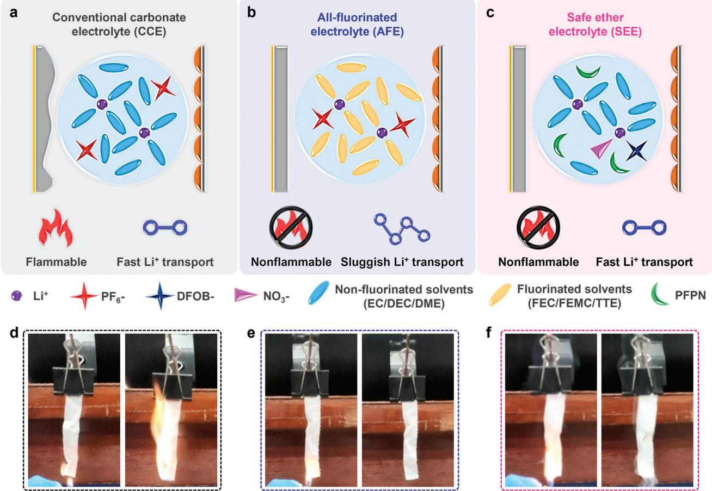
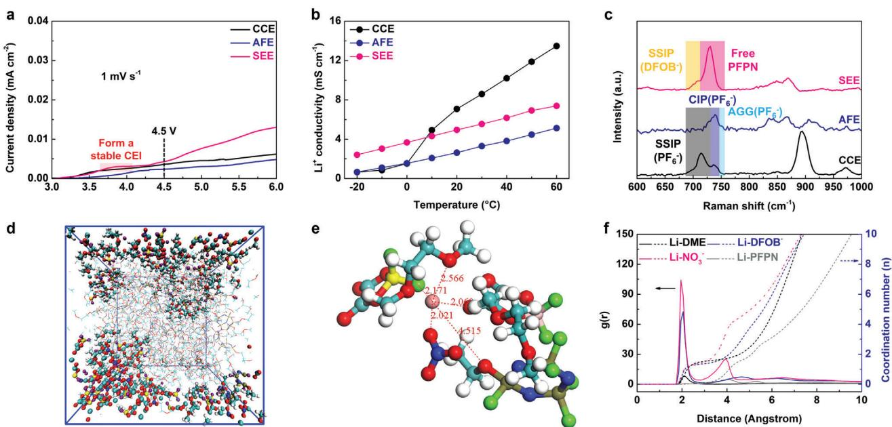
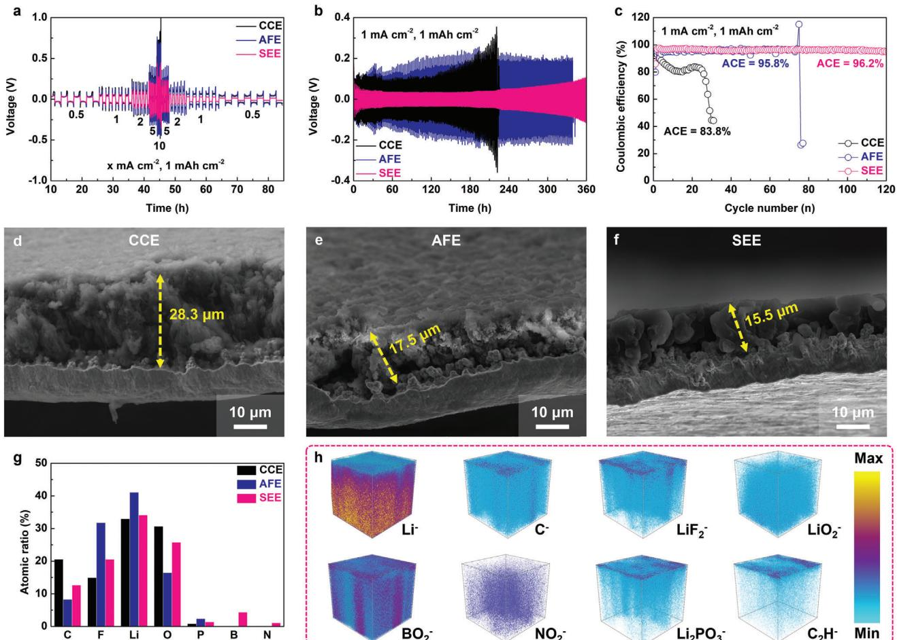
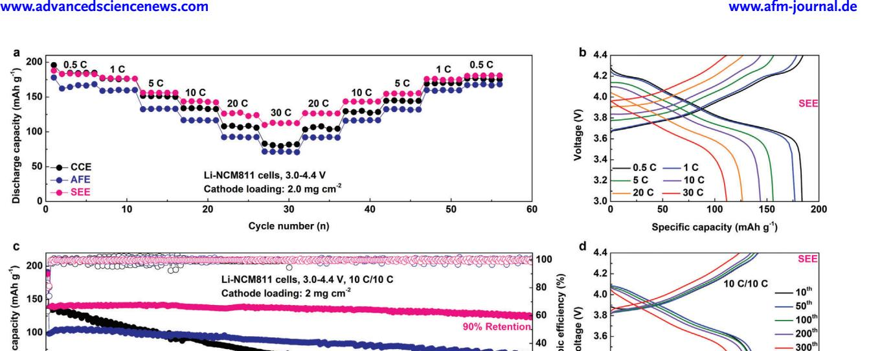
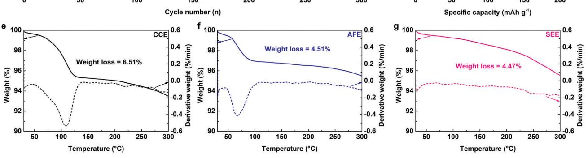
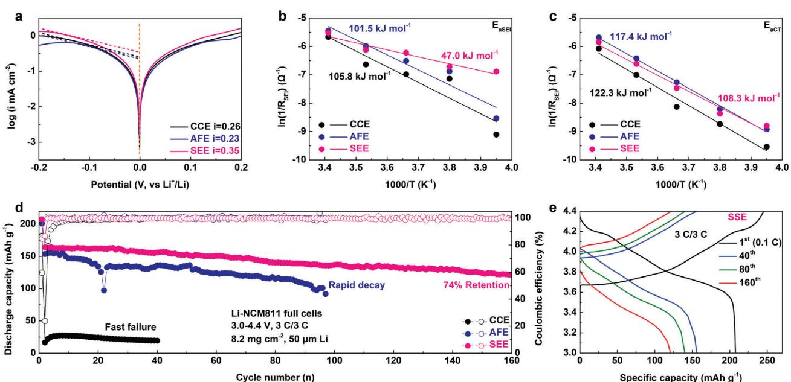

# **A Safe Ether Electrolyte Enabling High-Rate Lithium Metal Batteries**

*Tao Yang, Liang Li, Jiahang Zou, Yiqing Yao, Qingan Zhang, Zhipeng Jiang,\* and Yongtao Li\**

**High-energy-density lithium metal batteries (LMBs) hold enormous potential for future energy storage systems but are plagued by poor cycling stability and safety concerns, especially under high-rate conditions. The addition of fluorinated solvents to the electrolyte is effective in enhancing the stability of the lithium metal anode (LMA) and improving safety for LMBs. However, the extensive introduction of fluorinated solvents is not conducive to the transport of lithium-ions (Li+), thereby negatively affecting the rate performance of LMBs. Herein, a safe ether electrolyte (SEE) is designed that exhibits both high Li+ conductivity and nonflammability, while maintaining high compatibility with the LMA. Li–LiNi0.8Mn0.1Co0.1O2 (NMC811) cells utilizing SEE can demonstrate remarkable electrochemical performance, delivering a discharge capacity of 113.1 mAh g−1 at rates as high as 30 C and maintaining 90% of their initial capacity over 300 cycles at 10 C. Moreover, a practical Li-NCM811 full cell assembled with SEE achieves stable cycling at 3 C.**

#### **1. Introduction**

Utilizing metallic lithium (Li) directly as the anode material in lithium metal batteries (LMBs) holds considerable potential for surpassing lithium-ion batteries (LIBs) in terms of energy density, thereby offering transformative opportunities for portable electronics, electric vehicles, and grid energy storage.[\[1,2\]](#page-6-0) However, the widespread adoption of LMBs is currently hampered by their limited cycle life and poor safety.[\[3,4\]](#page-6-0) The uneven deposition of Li-ions (Li+) during cycling promotes the uncontrolled growth of Li dendrites and the accumulation of dead Li.[\[5,6\]](#page-7-0) Additionally, the inherent instability of the native solid electrolyte interphase (SEI) on the lithium metal anode (LMA) results in reduced

Anhui University of Technology

Maanshan 243002, China

E-mail: [jzp1994@ahut.edu.cn;](mailto:jzp1994@ahut.edu.cn) [liyongtao@ahut.edu.cn](mailto:liyongtao@ahut.edu.cn)

Z. Jiang, Y. Li

Key Laboratory of Efficient Conversion and Solid-state Storage of Hydrogen & Electricity of Anhui Province Maanshan 243002, China

The ORCID identification number(s) for the author(s) of this article can be found under <https://doi.org/10.1002/adfm.202404945>

**DOI: 10.1002/adfm.202404945**

Coulombic efficiency (CE) and active material dissolution.[\[7,8\]](#page-7-0) These challenges undermine the long-term cycling stability of LMBs and pose significant safety risks.[\[9,10\]](#page-7-0) The electrolyte, serving as the "blood" of LMBs, possesses a unique solvation structure and interfacial chemistry that not only directly determines the composition of the SEI but also significantly influences the plating/stripping behavior of Li+. [\[11,12\]](#page-7-0) Furthermore, as the most flammable component within batteries, the electrolyte is closely associated with battery safety.[\[13,14\]](#page-7-0) There is an urgent need to develop novel electrolytes that combine high performance with high safety.

A common strategy is to fluorinate the electrolyte, introducing a large amount of high-boiling, nonflammable fluorinated solvents to replace conventional

low-boiling, flammable solvents.[\[15,16\]](#page-7-0) For instance, Wang et al. designed an all-fluorinated electrolyte based on fluoroethylene carbonate (FEC), 3,3,3-fluoroethylmethyl carbonate (FEMC), and 1,1,2,2-tetrafluoroethyl-2′, 2′, 2′-trifluoroethyl ether (HFE), which not only exhibits high cycling stability toward LMA but also is a nonflammable electrolyte.[\[17\]](#page-7-0) On one hand, the introduction of F atoms can weaken the binding ability of the solvent to Li+, allowing more anions to be distributed in the inner solvation layer of the electrolyte, thus forming a weakly solvating electrolyte (WSE) capable of forming an anion-induced interface.[\[18,19\]](#page-7-0) Deng et al. utilized monofluoride bis(2-fluoroethyl) ethers (BFE) as a single solvent to prepare a weakly solvating electrolyte, enabling stable cycling of Li–LiNi0.8Co0.1Mn0.1O2 (NCM811) full cells under practical conditions.[\[20\]](#page-7-0) On the other hand, fluorine-rich solvents can also serve as diluents to construct a unique "solvent-in-salt" system, namely localized high-concentration electrolytes (LHCEs), reducing the concentration polarization of the electrolyte, thereby further enhancing the CE of LMA.[\[21,22\]](#page-7-0) The Zhang group designed a series of LHCEs using different solvent/diluent systems, improving the CE of metallic Li to 99.5%.[\[23–25\]](#page-7-0) While introducing a large amount of F into the solvent can simultaneously contribute to forming a LiF-rich interface to enhance the cycling performance of LMBs and improve the nonflammability of the electrolyte, the strong electron-withdrawing ability of F atoms can significantly reduce the solvating ability of the solvent to Li+, thereby decreasing the conductivity of the electrolyte and severely limiting the rate performance of the battery.[\[26,27\]](#page-7-0) Therefore, there is an urgent need to develop a novel electrolyte that combines high

T. Yang, L. Li, J. Zou, Y. Yao, Q. Zhang, Z. Jiang, Y. Li

School of Materials Science and Engineering and Low-Carbon New Materials Research Center

Key Laboratory of Green Fabrication and Surface Technology of Advanced Metal Materials of Ministry of Education

**Figure 1.** Schematic diagrams comparing the performance of LMBs and the corresponding flammability tests using different electrolytes. a, d) CCE, b, e) AFE, and c, f ) SEE.

Li compatibility and high safety while not sacrificing the battery's high-rate ability.

In this study, we designed a safe ether electrolyte (SEE) composed of 1 m lithium difluoro (oxalate) borate (LiDFOB) + 0.5 m lithium nitrate (LiNO3) in 1,2-dimethoxyethane (DME) and ethoxy(pentafluoro)cyclotriphosphazene (PFPN) with a volume ratio of 7:3. The design of this electrolyte is based on the following considerations: 1) The main solvent in the electrolyte is DME, which possesses strong solvating ability and a high donor number (DN) value, ensuring the conductivity of the electrolyte and the rate performance of the battery. 2) The introduction of nonsolvated PFPN in the electrolyte acts as a flame-retardant component, making the electrolyte nonflammable and significantly enhancing its safety. 3) The incorporation of LiDFOB and LiNO3 optimizes the interfacial properties of the high-voltage cathode and LMA, respectively, enhancing the compatibility of the electrolyte with LMBs. Integrating these advantages, the Li-NCM811 cell using SEE exhibits a high discharge specific capacity of 113.1 mAh g−1 at a high-rate of 30 C and can stably cycle over 300 times at 10 C with a capacity retention of 90%. Furthermore, Li-NCM811 full cells based on SEE demonstrate stable cycling over 160 cycles at a high-rate of 3 C under practical conditions (8.2 mg cm−2, 50 μm Li).

# **2. Results and Discussion**

We selected conventional carbonate electrolyte (CCE), composed of 1 m lithium hexafluorophosphate (LiPF6) in ethylene carbonate (EC) and diethyl carbonate (DEC) with a volume ratio of 5:5, and all-fluorinated electrolyte (AFE), 1 m LiPF6 in FEC/FEMC/1,1,2,2-tetrafluoroethyl-2,2,3,3-tetrafluoropropyl ether (TTE) with a volume ratio of 2:6:2, as control groups. As shown in **Figure 1**a,d, due to the presence of a large amount of flammable organic solvents, CCE exhibits extremely flammable behavior in flammability tests, thus indicating poor safety. Besides, carbonates typically exhibit poor stability toward the LMA, thereby failing to form a dense Li deposition morphology.[\[28\]](#page-7-0) In contrast, the significant incorporation of fluorinated solvents endows good nonflammability to the AFE electrolyte (Figure 1b,e). AFE also demonstrates significantly enhanced stability toward the LMA compared to CCE. However, fluorination treatment of electrolytes is not a one-size-fits-all solution. Unlike the solvent-separated ion pairs (SSIPs)-rich structure in CCE, the weak solvating ability of fluorinated solvents leads to incomplete dissociation of Li salts in AFE, tending to form contact ion pairs (CIPs) or aggregates (AGGs).[\[29\]](#page-7-0) Such solvation structures are detrimental to Li+ transport, thereby significantly reducing the

**Figure 2.** a) LSV plots and b) Li+ conductivity of various electrolytes. c) Raman spectra for the studied electrolytes. d) MD simulation snapshots cell, e) the partial Li+ solvation structure, and f) the corresponding radial distribution functions of SEE. Colors: Li, pink; O, red; H, white; C, light blue; N, blue; B, yellow; F, green; P, dark green.

bulk conductivity of the electrolyte.[\[30\]](#page-7-0) The SEE was designed to combine the advantages of both electrolytes mentioned above, with nonflammable properties and fast Li+ transport capabilities, while also demonstrating excellent compatibility with metallic Li (Figure [1c\)](#page-1-0). The flammability tests show that the introduction of PFPN endows SEE with a unique self-extinguishing ability, enabling it to maintain nonflammability even under rapidly increasing temperatures (Figure [1f\)](#page-1-0).[\[31\]](#page-7-0) We tested the flammability of various fluorinated solvents (FEC, FEMC, TTE, and PFPN) mixed with DME in different volume ratios. The results showed that PFPN can ensure the safety of ether electrolytes with a minimum addition amount (30 vol%), thereby allowing a large amount of DME to exist in the electrolyte to fully dissociate Li salts (Figures S1 and S2, Supporting Information). When the volume content of PFPN is 30%, 1 m LiDFOB and 0.5 m LiNO3 can be fully dissolved in a DME/PFPN (7:3) mixture solvent and SEE can be stably stored for more than 72 h without Li salt precipitation or color changes (Figure S3, Supporting Information). Therefore, we controlled the ratio of DME and PFPN at 7:3 in subsequent studies.

We further conducted systematic investigations on the physicochemical properties of the aforementioned electrolytes. Linear sweep voltammetry (LSV) plots of Li-Al cells indicate that all studied electrolytes can maintain good stability at high voltages (4.5 V), ensuring the feasibility of selecting the studied electrolytes for assembling Li-NCM811 cells (**Figure 2**a). We observed an obvious oxidation peak in the SEE at 3.7 V, which originates from the decomposition of LiDFOB at the cathode, forming a stable cathode electrolyte interphase (CEI) and ensuring the high-voltage stability of SEE.[\[32\]](#page-7-0) The Li+ conductivity test results of electrolytes at different temperatures indicate that CCE exhibits the highest conductivity compared to others when the temperature is above 10 °C (Figure 2b). As the temperature decreases, the conductivity of CCE decreases rapidly, even falling below that of AFE. This is attributed to the higher solidification point of the carbonate solvent, which easily solidifies at low temperatures, significantly reducing the conductivity of CCE.[\[33–35\]](#page-7-0) In contrast, the solidification points of fluorinated solvents and DME are lower. Therefore, no significant conductivity transition is observed within the temperature range of −20 to 60 °C. Importantly, the conductivity of SEE is significantly higher than that of AFE under the aforementioned temperature range. At 30 °C, the Li+ conductivities of SEE and AFE are 5.54 and 3.29 mS cm−1, respectively. The conductivity of SEE has a significant advantage compared to that of most fluorinated electrolytes reported in the literature (Table S1, Supporting Information). Besides, SEE also exhibits a higher transference number of Li+ (tLi +) compared with CCE and AFE, which is 0.58 (Figure S4, Supporting Information). According to Sand's time model, a high tLi + is beneficial in inhibiting Li dendrites.[\[36\]](#page-7-0) The Li+ conductivity and tLi + of electrolytes are closely related to their solvation structure, hence, we further tested the Raman spectra of different electrolyte systems. The Raman spectrum of CCE shows that the Raman shift of LiPF6 is mainly located at 714 cm−1, indicating that LiPF6 is fully dissociated to form SSIP (Figure 2c).[\[37\]](#page-7-0) In the Raman spectrum of AFE, the Raman shift of LiPF6 is mainly located at 740 and 750 cm−1, which are the characteristic peaks of CIP and AGG of LiPF6, respectively.[\[38\]](#page-7-0) This suggests that the weak solvation ability of fluorinated solvents is not conducive to the dissociation of LiPF6. Similarly, a characteristic peak of SSIP of LiDFOB located at 708 cm−1 was detected in SEE, indicating that SEE can effectively dissociate LiDFOB.[\[39\]](#page-7-0) Additionally, free PFPN signals at 730 cm−1 were detected in the Raman spectrum of SEE, suggesting that PFPN is mainly distributed in the outer solvation shell, like the function of a diluent.[\[40\]](#page-7-0) We further visualize the solvation structure of SEE using molecular dynamics (MD)

**Figure 3.** a) Rate and b) long-term cycling tests of Li–Li symmetric cells using various electrolytes. (Test conditions are x mA cm−2, 1, and 1, and 1 mAh cm−2, respectively). c) Li–Cu half-cell tests using different electrolytes. (Test conditions: 1 mA cm−2, 1 mAh cm−2). Side-view SEM images of deposited Li using d) CCE, e) AFE, and f) SEE. (Deposited condition is 0.5 mA cm−2 for 3 mAh cm−2). g) XPS elemental distribution of deposited Li using studied electrolytes. h) TOF-SIMS 3D views of deposited Li using SEE.

simulation, as depicted in Figure [2d.](#page-2-0) The distance between PFPN and the central Li+ is significantly greater than that between Li+ and NO3 −, DFOB−, and DME, measuring 4.515, 2.021, 2.171, and 2.060 Å, respectively (Figure [2e\)](#page-2-0). The corresponding radial distribution functions (RDFs) show that NO3 −, DFOB−, and DME are primarily distributed in the inner layer of SEE, which facilitates Li+ fast transport primarily (Figure [2f\)](#page-2-0).[\[41\]](#page-7-0) The presence of free PFPN contained in the outer solvation layer grants SEE its nonflammable properties.

Rate tests of Li–Li symmetric cells show that compared to CCE and AFE, the cell assembled with SEE exhibits the lowest overpotential at different current densities from 0.5 to 10 mA cm−2, indicating that the SEI formed in SEE facilitates Li+ transport (**Figure 3**a). Long-term cycling tests of Li–Li symmetric cells further demonstrate that the SEI generated in SEE exhibits excellent interfacial stability, enabling stable cycling of Li–Li symmetric cells over 360 h under conditions of 1 mA cm2 and 1 mAh cm2 (Figure 3b). This performance has certain advantages compared to other nonflammable electrolytes (Table S2, Supporting Information). In contrast, the cell based on CCE exhibits a significant increase in polarization after 120 h, possibly due to the SEI formed in CCE primarily originating from solvent decomposition, which has poor stability and is susceptible to degradation after multiple cycles. Li–Li symmetric cells assembled with AFE show high overpotential, attributed to the SEI in AFE containing a large amount of LiF, which is considered to have high stability but poor Li+ transport properties.[\[42\]](#page-7-0) Furthermore, Li–Cu half-cells were assembled and tested with different electrolytes to evaluate the CEs for LMAs. As depicted in Figure 3c, under test conditions of 1 mA cm−2 and 1 mAh cm−2, the cell assembled with CCE exhibits an average Coulombic efficiency (ACE) of only 83.8%, and the cell rapidly fails after 30 cycles. Introduction of fluorinated solvents in AFE increases the ACE to 95.8%, extending stable cycling to 70 times. Significantly, Li–Cu half-cells based on SEE can remain stable over 120 cycles with an ACE of 96.2%. Even when tested under high current density (2 mA cm−2) and large areal capacity conditions (2 mAh cm−2), SEE still shows significantly improved CE compared to CCE (Figure S5, Supporting Information). These results demonstrate that SEE provides good stability for metallic Li, which can be explained by morphological analysis of deposited Li.[\[43\]](#page-7-0) As shown in Figure 3d and Figure S6a (Supporting Information), Li deposited on the

**Figure 4.** a) Rate and c) long-term cycling tests of Li-NCM811 cells using different electrolytes. (Test conditions are 0.5 C,1 C,5 C, 10 C, 20 C, 30 C, and 10 C/10 C, respectively, 3.0–4.4 V, 1 C = 180 mA g−1). b) and d) are the related voltage profiles of Li-NCM811 cells using SEE. TG-DTG curves of cycled NCM811 cathodes using studied electrolytes. e) CCE, f) AFE, and g) SEE.

CCE exhibits numerous pores and cracks, with a thickness of up to 28.3 μm when the deposition areal capacity is controlled at 3 mAh cm−2. This indicates a loose deposition structure that increases the specific surface area of Li in contact with the electrolyte, leading to numerous side reactions.[\[44\]](#page-7-0) In contrast, Li deposited in AFE and SEE exhibits a dense deposition morphology, with thicknesses of 17.5 and 15.5 μm, respectively (Figure [3e,f\)](#page-3-0). Furthermore, top-view SEM images reveal that compared to AFE, Li deposited in SEE can aggregate to form densely packed and large grains, attributed to the introduction of LiNO3, which promotes the spherical growth of metallic Li (Figure S6b,c, Supporting Information).[\[45\]](#page-7-0) We further conducted a systematic surface analysis of deposited Li in SEE to determine the composition and structure of the SEI. X-ray photoelectron spectroscopy (XPS) results are consistent with the discussion above, showing that the SEI formed in CCE contains a massive amount of C element, while the SEI formed in AFE contains an abundance of F element (Figure [3g;](#page-3-0) Figures S7 and S8, Supporting Information). Additionally, the SEI formed in SEE also contains phosphorus, boron, and nitrogen elements, originating from the decomposition of PFPN, LiDFOB, and LiNO3, respectively (Figure S9, Supporting Information). XPS B 1*s* and N 1*s* spectra indicate that the SEI formed in SEE is rich in LiBOx and Li3N, which are beneficial for rapid Li+ transport and enhance the stability of the SEI.[\[46,47\]](#page-7-0) The structure of the SEI is further visualized by time-offlight-secondary ion mass spectrometry (TOF-SIMS), as shown in Figure [3h](#page-3-0) and Figures S10 and S11 (Supporting Information), revealing abundant signals of inorganic ion fragments, including LiF2 −, LiO2 −, BO2 −, and Li2PO3 −, representing LiF, Li2O, LiBOx, and Li2PO4, respectively, which constitute the main components of the SEI. Moreover, the distribution of signals for Li−, C−, and C2H− suggests that organic components mainly distribute on the outer surface of the SEI. Importantly, signals of NO2 − suggest the dispersed distribution of decomposition products of LiNO3, such as LiNxOy and Li3N, in the SEI, and these compositions enable the provision of a rapid Li+ transport channel.[\[48\]](#page-7-0)

We assembled Li-NCM811 cells to evaluate the electrochemical performance of the above electrolytes in LMBs. Consistent with the previous discussion, rate tests indicate that the Li-NCM811 using AFE exhibits the poorest rate performance, with dischargespecific capacities all lower than those of the cells using CCE and SEE at different rates (**Figure 4**a). Notably, SEE demonstrates superior rate performance and the most stable CE, discharging specific capacities at 0.5 C, 1 C, 5 C, 10 C, 20 C, and 30 C, which are 183.8, 176.9, 156.1, 144.0, 126.7, and 113.1 mAh g−1, respectively (Figure 4b; Figures S12 and S13, Supporting Information). Although the Li+ conductivity of SEE is lower than that of CCE, it exhibits superior rate performance in Li-NCM811 cells. A similar phenomenon can also be observed in a series of control experiments. As shown in Figure S14 (Supporting Information), although a higher DME content can significantly improve the conductivity of the electrolyte, the rate performance of the Li-NCM811 cell using SEE with DME/PFPN (9:1) is worse than that of SEE with DME/PFPN (7:3). This shows that the rate performance of the battery not only depends on the conductivity of the electrolyte but is also closely related to the Li+ transport dynamics at the interface, which will be further discussed later. Besides, we also studied the effects of using different Li salt components and different LiNO3 concentrations on the SEE performance. As shown in Figure S15 (Supporting Information), the SEE electrolyte using LiDFOB and LiNO3 single salts exhibited poor Coulombic efficiency and rate performance, indicating that LiDFOB and LiNO3 have a synergistic effect and can improve the LMA performance and rate performance of Li-NCM811 cells.[\[32,41\]](#page-7-0) Further tests showed that the optimal concentration of LiNO3 was 0.5 m, a higher LiNO3 addition amount (0.7 m) was not conducive to the transport of Li+, while a lower LiNO3 additive (0.3 m) could not fully protect the LMA (Figure S16, Supporting Information). Long-term cycling tests reveal that the discharge capacity of Li-NCM811 cells assembled with AFE under the cycling condition of 10 C is ≈100 mAh g−1, whereas those assembled with SEE can achieve a higher discharge capacity of over 140 mAh g−1 (Figure [4c\)](#page-4-0). Furthermore, although the initial discharge capacities of Li-NCM811 cells assembled with CCE and SEE are nearly similar, the poor LMA stability of CCE leads to rapid capacity decay, with a capacity retention of only 48% after 150 cycles. In contrast, cells assembled with AFE and SEE can cycle over 300 times with capacity retentions of 62% and 90%, respectively, proving good compatibility of AFE and SEE with metallic Li (Figure [4d;](#page-4-0) Figure S17, Supporting Information). Even under conventional rate conditions of 1 C, the Li-NCM811 cell using SEE displays the best cycling stability compared with CCE and AFE (Figure S18, Supporting Information). Thanks to the high low-temperature conductivity of SEE, the Li-NCM811 battery assembled using SEE has the best capacity utilization and the highest capacity retention rate when tested at −20 °C (Figure S19, Supporting Information). Specifically, it still has a discharge-specific capacity of 90 mAh g−1 after 100 cycles. Furthermore, we conducted thermogravimetric analysis (TGA) tests on the cycled NCM811 cathodes to evaluate the thermostability of the CEI derived from various electrolytes.[\[49\]](#page-7-0) As depicted in Figure [4e,f,](#page-4-0) when heated to 300 °C, the cycled NCM811 cathodes using CCE, AFE, and SEE exhibit mass losses of 6.51%, 4.51%, and 4.47%, respectively. The CEI formed after cycling in CCE suggests a significant presence of solvent decomposition products, which are prone to rapid decomposition upon heating, while the CEI formed after cycling in AFE and SEE may contain more nonflammable inorganic components, thereby providing higher safety for LMBs. It is worth noting that the corresponding derivative thermogravimetry (DTG) curves indicate no obvious mass loss temperature for the cycled NCM811 cathodes in SEE, suggesting the formation of a homogeneous and stable CEI on the NCM811. In contrast, the fastest decomposition rates of 0.54 and 0.41 °C min−1 occur at 68 and 109 °C for the cycled NCM811 cathodes in CCE and AFE, respectively. This could be due to the CEI formed after cycling in CCE primarily consisting of a hybrid CEI, which can fully decompose at 100 °C, whereas the NCM811 formed after cycling in AFE tends to form a double-layer CEI, and only the outer organic layer partially decomposes at 70 °C.[\[43,50\]](#page-7-0)

The rate performance of LMBs depends not only on the bulk conductivity of the electrolyte but also closely relates to the de-solvation and transport behaviors of Li+ at the interface of LMA.[\[51\]](#page-7-0) Therefore, we assembled Li–Li symmetric cells using different electrolytes and conducted a series of kinetics tests. Tafel plots demonstrate that Li–Li symmetric cells based on the SEE exhibit the highest exchange current density at 0.35 mA cm−2, while the cells based on CCE and AFE show low exchange current densities of 0.26 and 0.23 mA cm−2, respectively (**Figure 5**[a\)](#page-6-0). This indicates that the SEI formed in SEE has the fastest Li+ deposition kinetics.[\[52\]](#page-7-0) Besides, we conducted electrochemical impedance spectroscopy (EIS) tests on Li–Li symmetric cells at various temperatures and calculated the corresponding activation energies (Ea) for SEI formation (EaSEI) and charge transfer (EaCT) based on the Arrhenius equation by fitting the values of RSEI and RCT. [\[53\]](#page-7-0) As depicted in Figure [5b](#page-6-0) and Figure S20 (Supporting Information), the LMA in SEE exhibits the lowest EaSEI of only 47.0 kJ mol−1, while the EaSEI of the LMA in CCE and AFE is significantly higher at 105.8 and 101.5 kJ mol−1, respectively. Similarly, the metallic Li in SEE also shows the lowest EaCT at 108.3 kJ mol−1 (Figure [5c\)](#page-6-0). These results further confirm that the introduction of LiNO3 not only generates a large amount of Li3N/LiNxOy, which facilitates fast Li+ transport for SEI but also regulates the solvation structure of the electrolyte, promoting the de-solvation process of Li+ at the interface, ultimately enhancing the rate performance of LMBs.[\[54\]](#page-7-0) Finally, to evaluate the effectiveness of SEE in practical LMBs, we assembled Li-NCM811 full cells under practical conditions (8.2 mg cm−2, 50 μm Li) and tested their cycling stability under high-rate conditions (3 C charge and 3 C discharge). As shown in Figure [5d](#page-6-0) and Figure S21a (Supporting Information), CCE cannot cycle normally under such harsh test conditions, and the cell quickly fails after the initial activation cycle. Li-NCM811 full cells assembled with AFE can only cycle stably for fewer than 100 cycles, with rapid capacity decay and significant fluctuations in CE (Figure S21b, Supporting Information). In contrast, Li-NCM811 full cells based on SEE can cycle stably for 160 times, maintaining a capacity retention of 74%, and exhibit the lowest polarization behavior in the corresponding voltage profile (Figure [5e\)](#page-6-0). This rate performance is superior to that of most previously reported fluorinated electrolytes and other nonflammable electrolytes (Tables S1 and S2, Supporting Information). The impedance tests of the Li-NCM811 full cells during cycling show that the Li-NCM811 full cell using SEE exhibits high interfacial impedance after the initial cycle activation, but its interfacial impedance gradually decreases during subsequent cycles (Figure S22, Supporting Information). The interfacial impedance of the Li-NCM811 full cell based on CCE and AFE shows an increasing trend during the cycling process, indicating that the generated interface is gradually destroyed, which is not conducive to battery cycling.[\[55\]](#page-7-0) Besides, we conducted a series of characterizations on the NCM811 cathode after cycling. X-ray diffraction (XRD) patterns and SEM test results show that SEE can effectively maintain the crystal structure of NCM811 and reduce the aggregation of side reaction products on the surface

**Figure 5.** a) Tafel plots of studied electrolytes. The Arrhenius fitting line and the corresponding activation energies are compared based on the temperature-dependence EIS plots in Li–Li symmetrical cells using different electrolytes. b) EaSEI, c) EaCT. d) Cycling performance of Li-NCM811 full cell using studied electrolytes. (8.2 mg cm−2, 50 μm Li, 3 C/3 C, 3.0–4.4 V, 1 C = 185 mA g−1). e) The related voltage profile of Li-NCM811 full cells in cycling tests using SEE.

of NCM811 during the cycling process (Figures S23 and S24, Supporting Information).[\[56,57\]](#page-7-0) The corresponding XPS results further confirmed that a LiF-rich CEI was generated on the surface of the NCM811 cathode after cycling in SEE, which can inhibit the decomposition of the solvent (Figures S25–S27, Supporting Information).[\[58\]](#page-7-0) The above results suggest that the SEE with fast Li+ transport kinetics and good cycling stability can achieve high-rate LMBs.

### **3. Conclusion**

In summary, we have designed a safe ether electrolyte that combines the advantages of the high conductivity of conventional carbonate electrolytes and the nonflammability property of allfluorinated electrolytes. Moreover, this SEE exhibits high compatibility with LMA, ultimately achieving stable cycling of LMBs under high-rate conditions. The Li-NCM811 cells assembled with SEE can deliver discharge capacities exceeding 110 mAh g−1 at a rate of 30 C and enable stable cycling over 300 times at 10 C in long-term cycling tests. Even under practical conditions, Li-NCM811 full cells based on SEE can maintain stability over 160 cycles at 3 C. This work not only provides a profound reflection on the shortcomings of fluorinated electrolytes that are currently widely studied but also provides a reliable solution for the development of fast-charging LMBs.[\[59\]](#page-7-0)

### **Supporting Information**

Supporting Information is available from the Wiley Online Library or from the author.

# **Acknowledgements**

This work was financially supported by the National Natural Science Foundation of China (Nos. 22308003 and 52171197), the Natural Science Foundation of Anhui Province (No. 2308085QB50), the Natural Science Foundation of Anhui Provincial Education Department (Nos. KJ2021A0393, 2022AH020033, and 2022AH010025), Anhui Provincial Natural Science Foundation for Excellent Youth Scholars (No. 2108085Y16), and Gansu Provincial Science and Technology Major Projects (No. 21ZD8JA005).

# **Conflict of Interest**

The authors declare no conflict of interest.

# **Data Availability Statement**

The data that support the findings of this study are available from the corresponding author upon reasonable request.

### **Keywords**

electrolyte, ether, high-rate, lithium metal batteries, nonflammable

Received: March 21, 2024 Revised: May 22, 2024 Published online: June 19, 2024

[1] J. Lee, S. H. Jeong, J. S. Nam, M. Sagong, J. Ahn, H. Lim, I. D. Kim, *EcoMat* **2023**, *5*, 12416.

[2] T. Wulandari, D. Fawcett, S. B. Majumder, G. E. Poinern, *Battery Energy* **2023**, *2*, 20230030.

- [3] Q. Yang, N. Jiang, Y. Shao, Y. Zhang, X. Zhao, Y. Zeng, J. Qiu, *Sci. China Chem.* **2022**, *65*, 2351.
- [4] Z. Zhao, X. Zhao, Y. Zhou, S. Liu, G. Fang, S. Liang, *Adv. Powder Mater.* **2023**, *2*, 100139.
- [5] J. Liu, Y. Zhang, J. Zhou, Z. Wang, P. Zhu, Y. Cao, Y. Zheng, X. Zhou, C. Yan, T. Qian, *Adv. Funct. Mater.* **2023**, *33*, 2302055.
- [6] C. Wang, J. Zhu, Y. Jin, J. Liu, H. Wang, Q. Zhang, *Mater. Horiz.* **2023**, *10*, 3218.
- [7] J. Wang, L. Wang, H. Xu, L. Sheng, X. He, *Green Energy Environ.* **2024**, *9*, 454.
- [8] S. Qian, H. Chen, M. Zheng, Y. Zhu, C. Xing, Y. Tian, P. Yang, Z. Wu, S. Zhang, *Energy Storage Mater.* **2023**, *57*, 229.
- [9] M. Zhao, Y. Lv, S. Zhao, Y. Xiao, J. Niu, Q. Yang, J. Qiu, F. Wang, S. Chen, *Adv. Mater.* **2022**, *34*, 2206239.
- [10] Y. Wu, C. Wang, C. Wang, Y. Zhang, J. Liu, Y. Jin, Q. Zhang, H. Wang, *Mater. Horiz.* **2024**, *11*, 388.
- [11] C. Liu, F. Guo, Q. Yang, H. Mi, C. Ji, N. Yang, J. Qiu, *Small Methods* **2023**, *7*, 2201398.
- [12] P. Xiao, X. Yun, Y. Chen, X. Guo, P. Gao, G. Zhou, C. Zheng, *Chem. Soc. Rev.* **2023**, *52*, 5255.
- [13] J. Yu, C. Yu, X. Song, Q. Zhang, Z. Wang, Y. Xie, Y. Liu, W. Li, Y. Ding, J. Qiu, *J. Am. Chem. Soc.* **2023**, *145*, 13828.
- [14] X. Mu, H. Ding, Y. Wu, H. Hu, B. Yu, *Small Struct.* **2023**, *4*, 2300179.
- [15] D. T. Boyle, S. C. Kim, S. T. Oyakhire, R. A. Vilá, Z. Huang, P. Sayavong, J. Qin, Z. Bao, Y. Cui, *J. Am. Chem. Soc.* **2022**, *144*, 20717.
- [16] Z. Yu, P. E. Rudnicki, Z. Zhang, Z. Huang, H. Celik, S. T. Oyakhire, Y. Chen, X. Kong, S. C. Kim, X. Xiao, H. Wang, Y. Zheng, G. A. Kamat, M. S. Kim, S. F. Bent, J. Qin, Y. Cui, Z. Bao, *Nat. Energy* **2022**, *7*, 94.
- [17] X. Fan, L. Chen, O. Borodin, X. Ji, J. Chen, S. Hou, T. Deng, J. Zheng, C. Yang, S.-C. Liou, K. Amine, K. Xu, C. Wang, *Nat. Nanotechnol.* **2018**, *13*, 715.
- [18] Q. Zheng, Y. Yamada, R. Shang, S. Ko, Y. Y. Lee, K. Kim, E. Nakamura, A. Yamada, *Nat. Energy* **2020**, *5*, 291.
- [19] Y. Zhao, T. Zhou, Baster, D. M. E. K, J. W. Choi, A. Coskun, *ACS Energy Lett.* **2023**, *8*, 3180.
- [20] G. Zhang, J. Chang, L. Wang, J. Li, C. Wang, R. Wang, G. Shi, K. Yu, W. Huang, H. Zheng, T. Wu, Y. Deng, J. Lu, *Nat. Commun.* **2023**, *14*, 1081.
- [21] X. Zhang, Z. Cui, A. Manthiram, *Adv. Funct. Mater.* **2024**, *34*, 2309591.
- [22] X. Fan, X. Ji, L. Chen, J. Chen, T. Deng, F. Han, J. Yue, N. Piao, R. Wang, X. Zhou, X. Xiao, L. Chen, C. Wang, *Nat. Energy* **2019**, *4*, 882.
- [23] X. Ren, L. Zou, X. Cao, M. H. Engelhard, W. Liu, S. D. Burton, H. Lee, C. Niu, B. E. Matthews, Z. Zhu, C. Wang, B. W. Arey, J. Xiao, J. Liu, J.-G. Zhang, W. Xu, *Joule* **2019**, *3*, 1662.
- [24] X. Cao, X. Ren, L. Zou, M. H. Engelhard, W. Huang, H. Wang, B. E. Matthews, H. Lee, C. Niu, B. W. Arey, Y. Cui, C. Wang, J. Xiao, J. Liu, W. Xu, J.-G. Zhang, *Nat. Energy* **2019**, *4*, 796.
- [25] X. Ren, S. Chen, H. Lee, D. Mei, M. H. Engelhard, S. D. Burton, W. Zhao, J. Zheng, Q. Li, M. S. Ding, M. Schroeder, J. Alvarado, K. Xu, Y. S. Meng, J. Liu, J.-G. Zhang, W. Xu, *Chem* **2018**, *4*, 1877.
- [26] Y. Wang, Z. Wu, F. M. Azad, Y. Zhu, L. Wang, C. J. Hawker, A. K. Whittaker, M. Forsyth, C. Zhang, *Nat. Rev. Mater.* **2024**, *9*, 119.
- [27] Z. Li, Y. Chen, X. Yun, P. Gao, C. Zheng, P. Xiao, *Adv. Funct. Mater.* **2023**, *33*, 2300502.
- [28] J. Liu, S. Ihuaenyi, R. Kuphal, J. Salinas, L. Xie, L. Yang, U. Janakiraman, M. E. Fortier, C. Fang, *J. Electrochem. Soc.* **2023**, *170*, 010535.
- [29] Y. Wang, Z. Li, Y. Hou, Z. Hao, Q. Zhang, Y. Ni, Y. Lu, Z. Yan, K. Zhang, Q. Zhao, F. Li, J. Chen, *Chem. Soc. Rev.* **2023**, *5*, 2713.
- [30] Q. Yang, X. Qu, H. Cui, X. He, Y. Shao, Y. Zhang, X. Guo, A. Chen, Z. Chen, R. Zhang, D. Kong, Z. Shi, J. Liu, J. Qiu, C. Zhi, *Angew. Chem. Int. Ed.* **2022**, *61*, 202206471.
- [31] H. Zhang, Z. Zeng, S. Wang, Y. Wu, C. Li, M. Liu, X. Wang, S. Cheng, J. Xie, *Nano Res.* **2024**, *17*, 2638.
- [32] Z. Jiang, Y. Deng, J. Mo, Q. Zhang, Z. Zeng, Y. Li, J. Xie, *Nano Lett.* **2023**, *23*, 8481.
- [33] R. Hou, S. Guo, H. Zhou, *Adv. Energy Mater.* **2023**, *13*, 2300053.
- [34] X. Meng, Y. Liu, M. Guan, J. Qiu, Z. Wang, *Adv. Mater.* **2022**, *34*, 2201981.
- [35] X. Zhu, C. Ji, Q. Meng, H. Mi, Q. Yang, Z. Li, N. Yang, J. Qiu, *Small* **2022**, *18*, 2200055.
- [36] C. Brissot, M. Rosso, J. N. Chazalviel, S. Lascaud, *J. Power Sources* **1999**, *81*, 925.
- [37] T. Doi, R. Masuhara, M. Hashinokuchi, Y. Shimizu, M. Inaba, *Electrochim. Acta* **2016**, *209*, 219.
- [38] T. T. Hagos, B. Thirumalraj, C. J. Huang, L. H. Abrha, T. M. Hagos, G. B. Berhe, H. K. Bezabh, J. Cherng, S. Chiu, W. Su, B. J. Hwang, *ACS Appl. Mater. Interfaces* **2019**, *11*, 9955.
- [39] H. Zhou, B. Liu, D. Xiao, C. Yin, J. Li, *J. Mater. Sci.: Mater. Electron.* **2019**, *30*, 5098.
- [40] L. Chen, Q. Nian, D. Ruan, J. Fan, Y. Li, S. Chen, L. Tan, X. Luo, Z. Cui, Y. Cheng, C. Li, X. Ren, *Chem. Sci.* **2023**, *14*, 1184.
- [41] Z. Jiang, T. Yang, C. Li, J. Zou, H. Yang, Q. Zhang, Y. Li, *Adv. Funct. Mater.* **2023**, *33*, 2306868.
- [42] Z. Li, L. Wang, X. Huang, X. He, *Small* **2024**, *20*, 2305429.
- [43] Z. Piao, P. Xiao, R. Luo, J. Ma, R. Gao, C. Li, J. Tan, K. Yu, G. Zhou, H.-M. Cheng, *Adv. Mater.* **2022**, *34*, 2108400.
- [44] Q. Wang, C. Zhao, S. Wang, J. Wang, M. Liu, S. Ganapathy, X. Bai, B. Li, M. Wagemaker, *J. Am. Chem. Soc.* **2022**, *144*, 21961.
- [45] X. Li, R. Zhao, Y. Fu, A. Manthiram, *EScience* **2021**, *1*, 108.
- [46] S. Jiao, X. Ren, R. Cao, M. H. Engelhard, Y. Liu, D. Hu, D. Mei, J. Zheng, W. Zhao, Q. Li, N. Liu, B. D. Adams, C. Ma, J. Liu, J.-G. Zhang, W. Xu, *Nat. Energy* **2018**, *3*, 739.
- [47] C. Liao, L. Han, W. Wang, W. Li, X. Mu, Y. Kan, J. Zhu, Z. Gui, X. He, L. Song, Y. Hu, *Adv. Funct. Mater.* **2023**, *33*, 2212605.
- [48] W. Zhang, Y. Lu, L. Wan, P. Zhou, Y. Xia, S. Yan, X. Chen, H. Zhou, H. Dong, K. Liu, *Nat. Commun.* **2022**, *13*, 2029.
- [49] Q. Zhou, S. Dong, Z. Lv, G. Xu, L. Huang, Q. Wang, Z. Cui, G. Cui, *Adv. Energy Mater.* **2020**, *10*, 1903441.
- [50] J.-M. Kim, M. H. Engelhard, B. Lu, Y. Xu, S. Tan, B. E. Matthews, S. Tripathi, X. Cao, C. Niu, E. Hu, S.-M. Bak, C. Wang, Y. S. Meng, J.-G. Zhang, W. Xu, *Adv. Funct. Mater.* **2022**, *32*, 2207172.
- [51] C. Yan, H. R. Li, X. Chen, X.-Q. Zhang, X.-B. Cheng, R. Xu, J.-Q. Huang, Q. Zhang, *J. Am. Chem. Soc.* **2019**, *141*, 9422.
- [52] P. Li, Z. Zhang, Z. Zhao, X. Zhang, H. Zhang, G. Li, *Angew. Chem. Int. Ed.* **2024**, *63*, 202319090.
- [53] R. Jow, S. S. Zhang, K. Xu, J. Allen, *ECS Trans.* **2007**, *3*, 51.
- [54] Z. Jiang, C. Li, T. Yang, Y. Deng, J. Zou, Q. Zhang, Y. Li, *ACS Energy Lett.* **2024**, *9*, 1389.
- [55] M. Mao, B. Huang, Q. Li, C. Wang, Y. B. He, F. Kang, *Nano Energy* **2020**, *78*, 105282.
- [56] Y. Li, Q. Qu, L. Lv, J. Shao, H. Zheng, *Adv. Funct. Mater.* **2024**, 2314100.
- [57] Y. Lei, X. Xu, J. Yin, K. Xi, L. Wei, J. Zheng, Y. Wang, H. Wu, S. Jing, Y. Gao, *Small* **2024**, 2400365.
- [58] Q. Yang, Z. Yao, C. Lai, C. Li, *Energy Storage Mater.* **2022**, *50*, 819.
- [59] A. M. Li, O. Borodin, T. P. Pollard, W. Zhang, N. Zhang, S. Tan, F. Chen, C. Jayawardana, B. Lucht, E. Hu, X.-Q. Yang, C. Wang, *Nat. Chem.* **2024**, *16*, 922.

