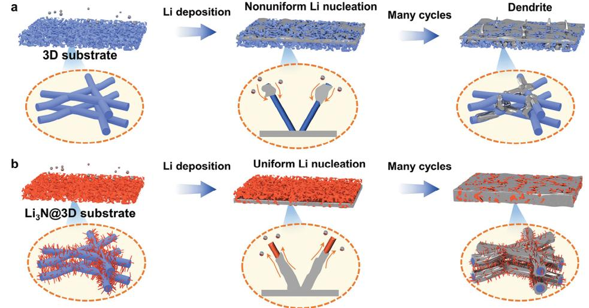
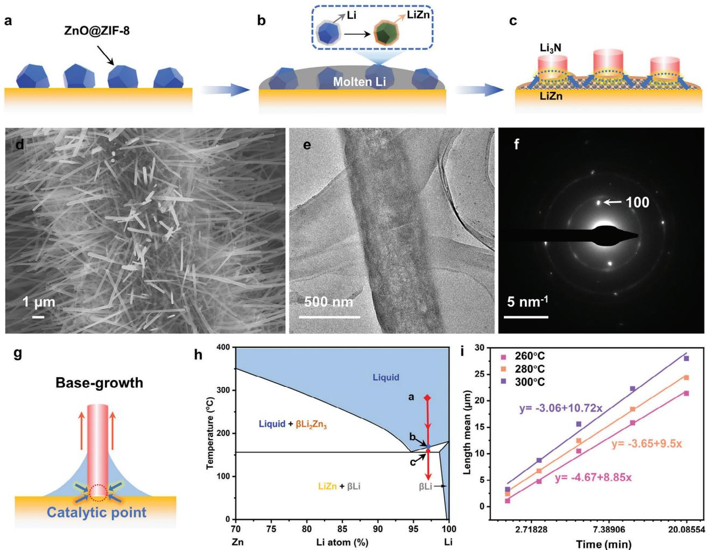
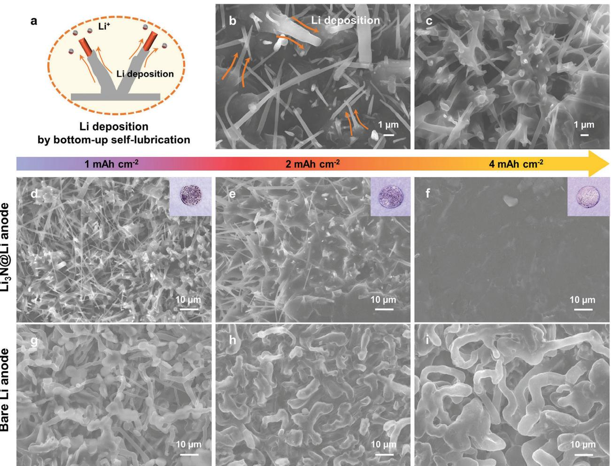
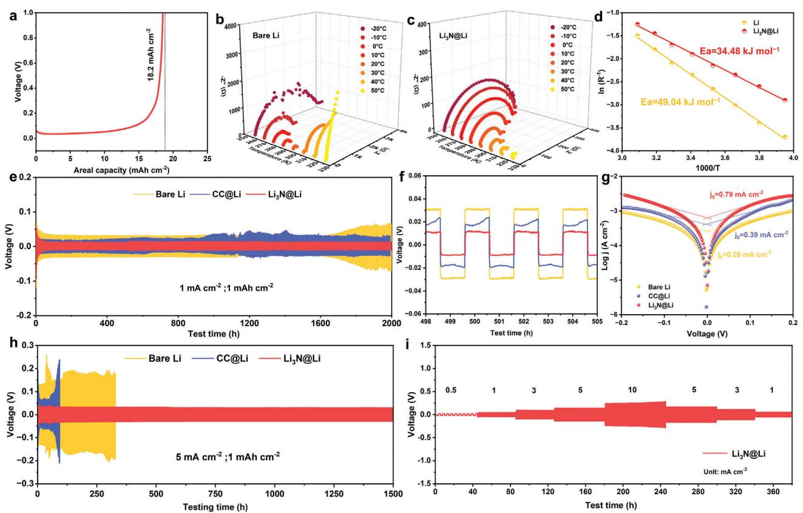
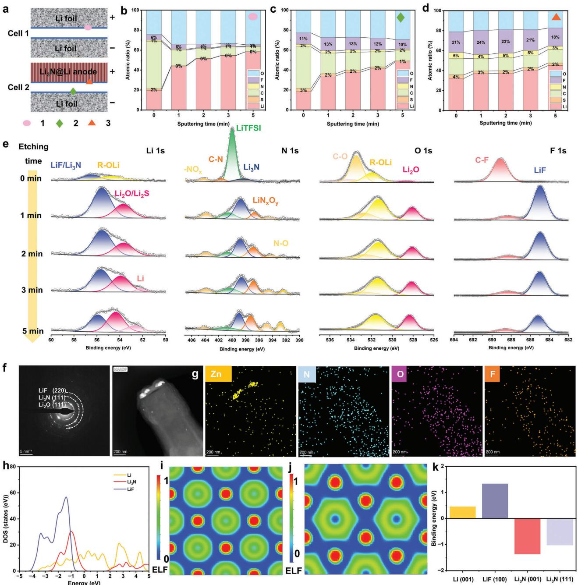
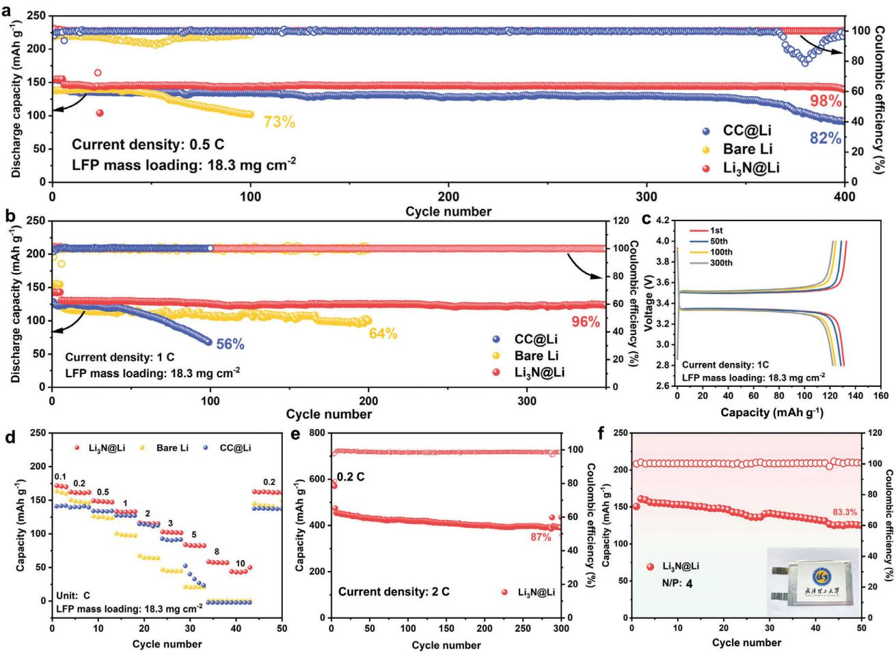

# **Catalytic Growth of Ionic Conductive Lithium Nitride Nanowire Array for Dendrite-Free Lithium Metal Anode**

*Chunli Shen, Jiashen Meng, Mengyu Yan, Xiaobin Liao, Hong Wang, Wencong Feng, Yongkun Yu, Cheng Zhou, Minjian Gong, Liqiang Mai, and Xu Xu\**

**The development of an artificial solid-electrolyte interphase (SEI) has been recognized as the most efficient strategy to overcome the safety concerns associated with the lithium metal anode (LMA). Inorganic-rich SEIs on the LMA are crucial for suppressing Li dendrites. Among the prevalent SEI inorganic compounds observed for LMA, lithium nitride (Li3N) is often found in the SEIs of high-performance LMA. Herein, the Li3N nanowire array is successfully synthesized and the catalytic base-growth mechanism is thoroughly investigated. The fast ionic conductor Li3N nanowires act as pillars to control the nucleation and growth of lithium metal along the vertical direction of the nanowire by bottom-up self-lubrication, which fundamentally prevents the dendrite growth. The Li3N is characterized by abundant lithiophilic nucleation sites, which effectively reduces the local current density, and facilitates homogeneous Li+ flux. Symmetric cells utilizing the Li3N@Li anode have demonstrated excellent stability, featuring uniform deposition without dendrite formation. Additionally, high-capacity retentions of 98% at 0.5 C after 400 cycles and impressive high-rate performance at 31.1 mA cm−2 have been realized in high-loading Li3N@Li||LFP cells. The universal preparation of the Li3N nanowires with various precursors and substrates is further explored, which is expected to be applied in solid-state batteries and hydrogen storage.**

C. Shen, J. Meng, M. Yan, X. Liao, H. Wang, W. Feng, Y. Yu, C. Zhou, M. Gong, L. Mai, X. Xu State Key Laboratory of Advanced Technology for Materials Synthesis and Processing School of Materials Science and Engineering Wuhan University of Technology Wuhan, Hubei 430070, P. R. China

E-mail: [xuxu@whut.edu.cn](mailto:xuxu@whut.edu.cn)

X. Xu

Hubei Longzhong Laboratory Wuhan University of Technology (Xiangyang Demonstration Zone) Xiangyang, Hubei 441000, P. R. China

X. Xu Hainan Institute Wuhan University of Technology Sanya 572000, P. R. China

The ORCID identification number(s) for the author(s) of this article can be found under <https://doi.org/10.1002/adfm.202406445>

**DOI: 10.1002/adfm.202406445**

## **1. Introduction**

Lithium metal anode (LMA) has attracted much attention due to its exceptional properties, including an ultra-high theoretical capacity (3860 mAh g−1) and ultra-low electrochemical potential (−3.04 V vs standard hydrogen electrode).[\[1\]](#page-8-0) Unlike traditional lithium-ion batteries (LIBs) that rely on lithium-ion (Li+) intercalation mechanisms, lithium-metal batteries (LMBs) operate through lithium deposition and stripping procedures, offering a theoretical specific capacity ten times higher than that of commercial graphite anodes.[\[2\]](#page-8-0) Nonetheless, the lowest unoccupied molecular orbital of the liquid electrolyte lies below the Fermi level of lithium metal.[\[3\]](#page-8-0) The high reactivity of lithium metal continuously consumes electrolytes, forming a fragile solid electrolyte interface (SEI) film.[\[4\]](#page-8-0) Unfortunately, the native SEI film is unable to accommodate the substantial volume change throughout the Li deposition and stripping process, leading to the unsatisfied cycling stability of the lithium metal anode. The 3D current collectors (such as metal foams, and carbon scaffolds) have a larger surface area than planar collectors, which is beneficial to reducing the local current

density and alleviating stress fluctuation during the volume changes of the LMAs. However, during lithium deposition, due to high interfacial activity and short surface Li+ transport distance, lithium tends to nucleate at the top of the 3D current collectors (top growth), resulting in uneven metal lithium deposition and local growth of lithium dendrites (**Figure 1**[a\)](#page-1-0).[\[5\]](#page-8-0)

Li3N possesses excellent lithiophilicity, high ionic conductivity (≈10−3 S cm−1 at room temperature), high Young's modulus (189 GPa), and thermodynamic stability against Li metal, which have been showing great promise for the protection of lithium metal anode.[\[6\]](#page-8-0) Many strategies have been proposed to create a Li3N protection layer, in which the most straightforward one is forming a Li3N layer on the lithium metal anode by the direct interaction between lithium metal and nitrogen gas (6Li + N2 → 2 Li3N).[\[7\]](#page-8-0) The formation of dendritic lithium can be effectively inhibited by the Li3N protective layers, which also effectively minimize side reactions and prevent Li from coming into contact with the electrolyte.[\[6b\]](#page-8-0) Even so, these pure Li3N layers mainly exist

**Figure 1.** Schematic illustration of Li deposition in a blank 3D current collector a), and a 3D current collector with Li3N nanowire arrays b).

in the form of thin films, and these brittle films cannot withstand the repeated volume change of the LMA during cycling without breaking. Except the pure phase Li3N layer, the more commonly used method to construct the Li3N-rich protection layer is through the reaction between lithium metal with transition metal nitrides (such as Cu3N,[\[8\]](#page-8-0) Fe3N,[\[9\]](#page-8-0) AlN,[\[10\]](#page-8-0) Ni3N [\[11\]](#page-8-0) ) and other nitrogen-rich components (such as C3N4, [\[12\]](#page-8-0) TAPC,[\[13\]](#page-8-0) nitrogen-doped graphene,[\[14\]](#page-8-0) electrolytes additives[\[15\]](#page-8-0) ). The resulting products through the reactions can maintain the morphology and distribution of the precursors, which enriches the diversity and designability of the construction of the Li3N-rich modified lithium metal anodes. For example, Cu3N nanowires were rolled onto the lithium metal using a rolling way, and a Li3N@Cu nanowires layer was formed on the surface of LMA to protect it. However, in the Li3N-rich composites, Li3N mainly exists in the form of nanoparticles embedded in the matrices and the composition is difficult to be precisely controlled. More importantly, the fast ionic transport pathways contributed by Li3N are disrupted, thus the advantage of Li3N cannot be fully exploited. The preparation of the pure phase Li3N with controllable morphology would be desirable for the modification of a high-performance LMA. However, due to the intrinsic hexagonal crystal structure of the stable Li3N phase, the nanostructured Li3N has been rarely reported.[\[16\]](#page-8-0)

Herein, we proposed a catalytic base-growth mechanism to fabricate a Li3N nanowire array in a 3D current collector for suppressing dendrite growth and achieving a homogenous Li deposition by bottom-up self-lubrication (Figure 1b). Compared to the blank 3D current collector, the one with Li3N nanowires array has significant advantages as follows. First, the Li3N has abundant lithiophilic nucleation sites, which efficiently lower the local current density, enabling the homogeneous Li+ flux during Li plating/stripping. Second, Li3N can provide rapid continuous ionic transport pathways to induce lithium metal deposition along the vertical direction of the nanowire by bottom-up self-lubrication. Last, Li3N nanowire array with a small diameter and high lengthto-diameter ratio can accommodate large volume variation and effectively maintain its structural integrity. With this strategy, stable cycles in both dendrite-free symmetric cells and fast-charging Li-LiFePO4 (LFP) full cells are realized.

#### **2. Results and Discussion**

#### **2.1. The Growth Mechanism of the Li3N Nanowire Array**

The Li3N nanowire arrays grow in the carbon cloth (CC) substrate through a facile heating procedure. It involves the use of ZIF-8 as the organic nitrogen source and the lithiophilic coating ZnO for the wetting of molten lithium (**Figure 2**[a;](#page-2-0) Figure S1, Supporting Information). The lithiophilic ZnO first reacts with molten lithium metal to produce liquid LiZn alloy. Due to the low activation energy of the heterogeneous nucleation of the LiZn alloy droplets, N atoms from ZIF-8 are preferentially deposited at the alloy catalytic site to react with lithium metal (Figure [2b\)](#page-2-0). When the solubility reaches the limit, the lithium nitride will precipitate out of the droplet (Figure [2c\)](#page-2-0). The LiZn alloy remains in the Li-rich liquid substrate as heterogeneous nucleation sites of the Li3N nanowires array. Compared to the reported preparation method of Li3N nanowires, the temperature and reaction times decrease from 750 °C and 6 days to 260 °C and 5 min, respectively, and the ordinary pressure is used instead of the high vacuum, making it possible for large-scale applications.[\[16\]](#page-8-0) Figure S2 (Supporting Information) shows an Xray diffraction (XRD) analysis of the Li3N nanowire array on the CC substrates. The major diffraction peaks at 22.9°, 28.2°, 36.6°, 46.9°, and 49.9° correspond to the (001), (100), (101), (002), and (110) planes of -Li3N. Figure [2d](#page-2-0) shows the scanning electron microscopic (SEM) image of nanowires grown from CC as the substrate, resulting in a uniform coverage of the carbon fiber. The average diameter and length of the nanowires are ≈400 nm and ≈10 μm after 5 min of reaction at the temperature of 260 °C.

To examine the structure of the nanowires in more detail, transmission electron microscopy (TEM) was used and Cryo-TEM using liquid nitrogen was found to be necessary to stabilize the nanowires. The TEM results show that the Li3N has a

**Figure 2.** a–c) Schematic illustration of the synthesis of the Li3N. d) SEM image of the Li3N grown times at 5 min. e) TEM images of the Li3N. f) The Li3N correspond to the locations of the SAED pattern. g) Generation mechanism of Li3N. h) Phase diagrams of Li-Zn. i) An empirical equation of nanowire growth controlled by diffusion at different temperatures.

smooth surface with a uniform diameter (Figure 2e). The selected area electron diffraction (SAED) in Figure 2f clearly shows that the single crystalline Li3N nanowire grows along the *<*100*>* orientation. The EDS analysis result shows that the N element is uniformly dispersed in the nanowire, and the element of O is attributed to LiOH from the exposure of the nanowire to the atmosphere during the sample preparation (Figure S3, Supporting Information). In the X-ray photoelectron spectroscopy (XPS) experiments, a vacuum transfer holder was employed to transfer the samples without any exposure to the atmosphere. The Li 1s spectrum can be fitted into the Li─N bonding (54.7 eV) and the Li─Li bonding (55.6 eV) (Figure S4a, Supporting Information). The binding energies of 284.7, 286.5, and 289.3 eV match with the C─C, C─O, and C═O bonds, respectively (Figure S4b, Supporting Information). The N 1s XPS spectrum of Li─N bonding (388.8 eV) is attributed to the Li3N (Figure S4c, Supporting Information). The O 1s spectrum can be fitted into the C─O and C═O bonds (Figure S4d, Supporting Information).[\[17\]](#page-8-0) Li─O and O─H species were not observed in the XPS spectra, which proved that the LiOH on the surface of the Li3N nanowire found in the TEM was generated by the reaction with the atmosphere during the transfer process.

The nucleation and growth process of the nanowires were further investigated by systematic experiments. The liquid alloy acts as a catalyst that transforms lithium nitride into a crystalline solid that grows as a nanowire above the liquid droplet, and this growth pattern is named the "catalytic base-growth mechanism" (Figure 2g). Figure S5 (Supporting Information) shows the SEM images of nanowires grown from 1 to 60 min, the roots of the nanowires are relatively coarse including a nucleating point at different growth times. Surprisingly, the nanowire length was larger than 30 μm with a growth time of only 60 min. In Figure 2h, the large quantities of Li metal were excess in the preparation process at the point of a, and this liquid is composed of Li and LiZn alloy at 260 °C in the Li─Zn phase diagram.[\[18\]](#page-8-0) Upon cooling, the solid Li metal phase and LiZn alloy phase separate at the points of b and c. By constructing a dynamic growth model of nanowires, the empirical equation for the growth of the nanowires controlled by diffusion was analyzed at different temperatures of 260, 280, and 300 °C (Figure [2i\)](#page-2-0). We observed that with the increase in temperature, the length of the nanowires gradually increases under the same growth time, and the slope on behalf of the growth rate of the nanowires.

To further demonstrate the universality of the preparation method of the Li3N nanowire array by catalytic base-growth mechanism, other substrates, and organic nitrogen sources were also tested under the same conditions. Figure S6 (Supporting Information) shows the SEM images of the Li3N nanowire array grown from 3D Cu/CP/Ti foil as substrates, respectively. There were slight differences in the morphology of the Li3N on different substrates. The result was mainly due to the anisotropy of nanowires growing on different substrates. The different organic N sources precursor (ZIF-8/PDA/PPY) were first coated on the CC for the growth of the Li3N nanowire array (Figure S7, Supporting Information). As shown in Figure S8 (Supporting Information), the N1s XPS spectra show that the N of these organic nitrogen sources has the same characteristics, and pyridine-N and pyrrole-N are the main components. Figure S9 (Supporting Information) shows the SEM images of the Li3N grown from different organic N sources precursors at CC substrate, respectively. The Li3N nanowire array has uniform diameters and covers the entire surface of the carbon fiber. Figure S10 (Supporting Information) shows the XRD patterns of the Li3N nanowire array grown with different organic nitrogen sources and on different substrates, which all well correspond to the -Li3N phase.

#### **2.2. Electrochemical Performances of the Symmetric Cells**

During the preparation process, extra lithium metal was reserved after cooling to form the Li3N@Li composite, which can be directly used as the anode (Figure S11, Supporting Information). The cycling stability of lithium metal batteries (LMBs) relies on the Li plating/stripping behavior of the Li3N@Li anode. The ionic conductor Li3N nanowires array plays a crucial role by acting as pillars that facilitate the plating and stripping of lithium metal along their vertical direction through a bottom-up self-lubrication mechanism. This unique mechanism fundamentally prevents the growth of dendrites, as depicted in **Figure 3**[a.](#page-4-0) The SEM images show that Li metal preferentially deposits at the bottom of nanowires at the beginning of the deposition process. As the amount of Li deposition increases, Li metal is self-lubricated and deposited along the nanowires from the bottom up (Figure [3b,c\)](#page-4-0). The Li3N@Li anode displays ultrasmooth Li surfaces without any evident Li dendrites with the Li deposition capacity increasing from 1 to 4 mAh cm−2 (Figure [3d–f\)](#page-4-0). This is in obvious contrast to the bare Li anode, which displays a significant presence of Li filaments or dendrites (Figure [3g–i\)](#page-4-0). Cross-sectional SEM images show that the volume of Li3N@Li anode remains no significant change after plating with different capacities of Li metal (Figure S12, Supporting Information). After the 100th cycle, when Li metal is stripped reversibly from the Li3N@Li anode, the nanowire structure is clearly observed without damage (Figure S13, Supporting Information). Thus, the dendrite-free and structurally stable features of the Li3N@Li anode show great promise for the electrochemical performance of LMBs.

The lithium metal content of Li3N@Li anode can be easily controlled by adjusting the extra lithium metal during the preparation process. In the design of high-energy density batteries, maintaining a limited negative/positive (N/P) ratio is crucial to ensure a low Li metal content that matches with commercial Licontaining cathodes. So, the Li3N@Li anode with the specific capacity of 18.2 mAh cm−2 was chosen for testing the electrochemical performances (**Figure 4**[a\)](#page-5-0). To assess the Li-ion transport kinetics, temperature-dependent electrochemical impedance spectroscopy (EIS) was conducted in symmetric cells using Li3N@Li and bare Li foil. The Li3N@Li cells exhibited significantly lower impedance across a range of temperatures from −20 to 50 °C (Figure [4b,c\)](#page-5-0). Moreover, using the Arrhenius law calculated the activation energy (Ea) of lithium-ion migration from the SEI of Li3N@Li and bare Li electrodes (Figure [4d\)](#page-5-0). The Li3N@Li cell displayed a lower Ea (34.48 kJ mol−1) than the bare Li cell (49.04 kJ mol−1), which indicates high ionic conductivity of Li3N can provide the lowest energy barrier for efficient ion transportation in Li3N@Li anode.[\[19\]](#page-8-0) To evaluate the protection mechanism of the Li3N@Li during plating and stripping cycling, the average coulombic efficiencies (ACE) of different anodes were measured. After the entire lithium stripping process, Li3N@Li and CC@Li anodes were without Li metal. Then, the calculated ACE of Li3N@Li is 99.86%, which is higher than 99.78% of the CC@Li anode after 100 cycles at 1 mA cm−2 and 1 mAh cm−2 (Figure S14, Supporting Information).

To demonstrate the effectiveness of the Li3N nanowire array in improving the Li anode, the Li3N@Li, and bare Li electrodes were assembled with symmetric cells to test the electrochemical performances. In Figure [4e,](#page-5-0) the Li3N@Li electrode exhibits cycling over 2000 h at 1 mA cm−2 (1 mAh cm−2). The Li3N@Li electrode shows an overpotential of 11 mV for over 500 h, much lower than the 31 and 24 mV of bare Li and CC@Li electrodes, respectively (Figure [4f\)](#page-5-0). In Figure S15 (Supporting Information), the Li3N@Li electrode shows low overpotential and excellent long-term stability. To gain further insight into the factors contributing to the excellent electrochemical performance of the Li3N@Li electrode, Tafel plots, and chronoamperometry were conducted (Figure [4g\)](#page-5-0). The exchange current density of the Li3N@Li electrode is 0.79 mA cm−2, which is higher than the bare Li electrode and CC@Li electrode (0.28 and 0.39 mA cm−2). The results demonstrate that the Li3N@Li electrode can improve electrochemical reaction kinetics.[\[20\]](#page-8-0) In Figure [4h,](#page-5-0) the Li3N@Li electrode can sustain charge/discharge more than 1500 h with lower overpotential at 5 mA cm−2 (1 mAh cm−2). In Figure [4i,](#page-5-0) the Li3N@Li and bare Li electrodes assembled with symmetric cells cycled under different current densities. The Li3N@Li electrode displayed low voltage polarization of 15, 38, 85, 131, and 229 mV at the current densities of 0.5, 1, 3, 5, and 10 mA cm−2, respectively.

#### **2.3. Interfacial Component Analysis**

To gain an insight into the high-rate performance and high cyclic stability of Li3N@Li and bare Li, the chemical composition of SEI formed in different electrolytes was explored by XPS with depth profiling at locations 1, 2, and 3 in **Figure 5**[a.](#page-6-0) Figure [5b–d](#page-6-0) reveals the changes in element content in SEI under different

**Figure 3.** a) Schematic illustration of Li deposition behavior. b,c) SEM image of electrochemical Li deposition. SEM images of the Li3N@Li anode after plating 1 mAh cm−2 d), 2 mAh cm−2 e), and 4 mAh cm−2 f) of Li metal at the first cycle. SEM images of the bare Li anode after plating 1 mAh cm−2 g), 2 mAh cm−2 h), and 4 mAh cm−2 i) of Li metal at the first cycle.

sputtering times. After 2 min sputtering, the Li, O, and C in location 1 were the main elements with total content higher than 95%, indicating the majority of organic species from the decomposition of the electrolyte. After sputtering for 2 min for the Li3N@Li anode, the C content in location 3 was very low and eventually achieved an approximately constant value. This observation implies that the SEI layers generated on the Li3N@Li anode are more uniform in composition and contain a higher proportion of inorganic species. The F element content in the SEI formed on the Li3N@Li anode was found to be high, reaching up to 21%. As the sputtering time increased to 1, 2, 3, and 5 min, the F element content in the SEI decreased slightly, with values of 24%, 23%, 21%, and 18% in the respective in-depth areas. In contrast, the content of F element in SEI formed in bare Li anode is much less (*<*5% at location 1, *<*10% at location 2).[\[21\]](#page-8-0) The abundant N and S species in the Li3N@Li anode can regulate the uniform Li-ion flux on the electrode surface and reduce nucleation overpotential. The SEI composition of the Li3N@Li anode mainly consisted of LiF, Li3N, and Li2O inorganic constituents (Figure [5e;](#page-6-0) Figures S16 and S17, Supporting Information). These results suggest that the Li3N nanowire array participates in the formation of SEI and regulates the compositional homogeneity for stabilizing lithium metal anodes. The SEM image reveals that the Li3N nanowire array keeps the original morphology after cycles. Moreover, the morphology and composition were further studied with HRTEM characterization. The SAED image exhibits multiple diffraction rings, providing further evidence for the presence of LiF, Li3N, and Li2O components (Figure [5f\)](#page-6-0). The HRTEM image and element mappings further confirm that LiF, Li3N, and Li2O are uniformly dispersed in the nanowire (Figure [5g\)](#page-6-0).

The density of states (DOS) was calculated on nanostructured Li, Li3N, and LiF electronic properties. The low Li 1s state near Fermi level in Li3N and LiF, indicates the anode rich in Li3N and LiF have low electron transfer and inertness (Figure [5h\)](#page-6-0). In addition, we analyzed the electron transfer molecules and performed electron local functional analysis (ELF) on the model with the raw Li (001), LiF (100), Li3N (001), and Li3N (111) surfaces (Figure S18, Supporting Information). On a raw Li metal surface, the electrolyte has a high electron affinity and absorbs free

**Figure 4.** a) Full Li stripping curves of Li3N@Li anodes charged to 1.0 V versus Li/Li+. Temperature-dependent EIS spectra of bare Li b) and Li3N@Li anode c) symmetrical cells. d) Arrhenius plots of the resistance corresponding to Li+ transport through SEI of Li3N@Li anode and bare Li anode. e,f) Symmetric cells assembled with Li3N@Li anode, CC@Li anode, and bare Li anode with current density fixed at 1 mA cm−2 and 1 mAh cm−2. g) Tafel curves of Li3N@Li anode and bare Li anode symmetric cells. h) Symmetric cells assembled with Li3N@Li anode, CC@Li anode, and bare Li anode with the current density fixed at 5 mA cm−2 and 1 mAh cm−2. i) Rate performance at the current density from 0.5 to 10 mA cm−2 with a fixed areal capacity of 1 mAh cm−2 in symmetric cells.

electrons from surface Li atoms. In Li3N (001), Li3N (111), and LiF (100) systems, the electron transfer is effectively inhibited and has excellent stability (Figure [5i,j;](#page-6-0) Figure S19, Supporting Information). To prove that the uniform lithium deposition can be guided along the surfaces of the Li3N nanowires array, binding energies were computed for LiF, Li3N, and Li via density functional theory (DFT). Figure [5k](#page-6-0) illustrates the adsorption sites of Li on Li (001), LiF (100), Li3N (001), and Li3N (111) surfaces and the corresponding adsorption energy. On the Li (001) and LiF (100) surfaces, Li is adsorbed at the Li bridge site with adsorption energies of 0.49 and 1.32 eV, respectively. Conversely, on the Li3N (001) and Li3N (111) surfaces, the most stable adsorption site for Li is the N-top site, with adsorption energies of −0.88 and −1.23 eV, respectively. The DFT results indicate that it is thermodynamically more favorable for Li to bind with Li3N rather than with Li.

#### **2.4. Electrochemical Performance Evaluation of the Full Cells**

To assess the potential application of the Li3N@Li anode, full cells were tested using a high mass-loading (≈18.3 mg cm−2) LiFePO4 (LFP) cathode and the sulfur/carbon (S/C) cathode in coin cells.[\[22\]](#page-8-0) In **Figure 6**[a,](#page-7-0) all three types of cells initially exhibited similar discharge capacities at 0.5 C. However, the Li3N@Li||LFP battery demonstrated an impressive capacity retention ratio of 98% after 400 cycles, surpassing the bare Li||LFP and CC@Li||LFP cells, which showed capacity retentions of 73% and 82%, respectively. The Li3N@Li||LFP battery displayed a higher initial discharge capacity of 130 mAh g−1 and had an ultrahigh capacity retention ratio of 96% at 1 C after 350 cycles (Figure [6b\)](#page-7-0). In the charge/discharge curves of the 1st, 50th, 100th, and 300th cycles, the typical discharge and charge plateaus are clearly observed with litter polarization change (Figure [6c\)](#page-7-0). The Li3N@Li||LFP cell has a higher rate performance than the bare Li||LFP and CC@Li||LFP cells (Figure [6d\)](#page-7-0). The Li3N@Li||LFP cell has discharge capacities of 170, 163, 149, 133, 116, 103, 84, 58, and 50 mAh g−1 in relation to an increase in current density from 0.1 to 10 C. Notably, even at a high current density of 10 C (31.1 mA cm−2), and the full cell can still work properly at such condition. Upon returning to a current density of 0.2 C, the reversible capacity recovered to 162 mAh g−1, demonstrating the better stability of the Li3N@Li||LFP cell. The voltagecapacity profile demonstrated that the full cell using Li3N@Li anode obtained more stable cycling and showed much-reduced overpotentials (Figures S20 and S21, Supporting Information).

**Figure 5.** a) Illustrations of Li||Li cell (denoted as cell 1) and Li||Li3N@Li cell (denoted as cell 2). b–d) Atomic concentrations of O, F, N, C, S, and Li and at the three locations marked in figure (a). e) High-resolution Li 1s, N 1s, O 1s, and F 1s XPS spectra of SEI of Li3N@Li anodes after 20 cycles with different Ar+ sputtering times at location 3. f) SAED pattern of a Li3N nanowire after 20 cycles. g) HRTEM image and corresponding EDS mapping images of a Li3N nanowire after 20 cycles. h) DOS of Li, Li3N, and LiF. The 2D ELFs of i) LiF and j) Li3N surface. k) Calculated Li adatom binding energies for Li (001), LiF (100), Li3N (001), and Li3N (111) surfaces.

In Figure [6e,](#page-7-0) the Li3N@Li||S cell delivers a high capacity retention of 87% at 2 C after 300 cycles. To further exhibit the advantage of Li3N@Li anode for practical applications, an LFP pouch cell was assembled and tested. The pouch cell achieved a higher initial discharge capacity of 150 mAh g−1 at 0.2 C with low polarization and a capacity retention ratio of 83% after 50 cycles (Figure [6f\)](#page-7-0). The high capacity and excellent cycling performance can be attributed to dendrite-free Li plating/ stripping.[\[23\]](#page-8-0)

## **3. Conclusion**

In summary, a Li3N nanowire array was successfully synthesized under facile conditions and the catalytic base-growth

**Figure 6.** a) Cycling performance of Li3N@Li||LFP, CC@Li||LFP, and bare Li||LFP full cells at 0.5 C. b) Cycling performance of Li3N@Li||LFP, CC@Li||LFP, and bare Li||LFP full cells at 1 C. c) Charge/discharge curves of Li3N@Li||LFP battery at different cycles. d) Rate performance of Li3N@Li||LFP, CC@Li||LFP, and bare Li||LFP full cells from 0.1 C and 10 C. e) Cycling performance of Li3N@Li||S full cell at 2 C. f) Cycling performance of Li3N@Li||LFP pouch cell at 0.2 C.

mechanism was proposed. The single crystalline Li3N nanowire grows along*<*100*>*orientation and has a high length-to-diameter ratio. The high ionic conductivity Li3N nanowire array can mitigate the nonuniform ion flux and Li deposit from the bottom up along the nanowires, and achieve self-lubrication lithium deposition. Besides, the Li3N nanowire array is uniformly grown on a 3D current collector, showing extraordinary structural stability in the process of Li deposition/stripping with dendrite-free behavior. As expected, the Li3N@Li anode assembled with a symmetrical cell has dendrite-free behavior in the process of Li deposition/stripping. When paired with high-loading (18.3 mg cm−2) LFP cathodes, the full cell operates stably with a fast charge rate at 10 C (31.1 mA cm−2). Moreover, the universal preparation of the Li3N nanowires with various precursors and substrates is further explored, which may open up new possibilities for the practical application of such intriguing material in different fields.

# **Supporting Information**

Supporting Information is available from the Wiley Online Library or from the author.

## **Acknowledgements**

This work was supported by the National Natural Science Foundation of China (Grant No. 52127816), the Hubei Provincial Natural Science Foundation of China (2022CFB355), the National Key Research and Development Program of China (Grant No. 2020YFA0715000), the National Energy-Saving and Low-Carbon Materials Production and Application Demonstration Platform Program (TC220H06N).

#### **Conflict of Interest**

The authors declare no conflict of interest.

## **Data Availability Statement**

The data that support the findings of this study are available from the corresponding author upon reasonable request.

#### **Keywords**

based-growth, catalytic mechanism, lithium metal batteries, lithium nitride nanowire, solid electrolyte interface

Received: April 16, 2024 Revised: May 8, 2024

- Published online: May 25, 2024
- [1] a) X.-B. Cheng, R. Zhang, C.-Z. Zhao, Q. Zhang, *Chem. Rev.* **2017**, *117*, 10403; b) L. Chen, X. Fan, X. Ji, J. Chen, S. Hou, C. Wang, *Joule* **2019**, *3*, 732; c) Y. Xie, Y. Huang, Y. Zhang, T. Wu, S. Liu, M. Sun, B. Lee, Z. Lin, H. Chen, P. Dai, Z. Huang, J. Yang, C. Shi, D. Wu, L. Huang, Y. Hua, C. Wang, S. Sun, *Nat. Commun.* **2023**, *14*, 2883.
- [2] a) D. Lin, Y. Liu, Y. Cui, *Nat. Nanotechnol.* **2017**, *12*, 194; b) X. Ma, L. Azhari, Y. Wang, *Chem* **2021**, *7*, 2843; c) S. Yuan, T. Kong, Y. Zhang, P. Dong, Y. Zhang, X. Dong, Y. Wang, Y. Xia, *Angew. Chem., Int. Ed.* **2021**, *60*, 25624; d) A. Wang, S. Tang, D. Kong, S. Liu, K. Chiou, L. Zhi, J. Huang, Y. Y. Xia, J. Luo, *Adv. Mater.* **2017**, *30*, 1703891; e) J. Duan, Y. Zheng, W. Luo, W. Wu, T. Wang, Y. Xie, S. Li, J. Li, Y. Huang, *Natl Sci Rev* **2020**, *7*, 1208.
- [3] a) J. Tan, J. Matz, P. Dong, J. Shen, M. Ye, *Adv. Energy Mater.* **2021**, *11*, 2100046; b) S. Sarkar, V. Thangadurai, *ACS Energy Lett.* **2022**, *7*, 1492; c) X. Zheng, L. Huang, X. Ye, J. Zhang, F. Min, W. Luo, Y. Huang, *Chem* **2021**, *7*, 2312; d) K. Steinberg, X. Yuan, C. K. Klein, N. Lazouski, M. Mecklenburg, K. Manthiram, Y. Li, *Nat. Energy.* **2023**, *8*, 138.
- [4] P. Zhai, T. Wang, H. Jiang, J. Wan, Y. Wei, L. Wang, W. Liu, Q. Chen, W. Yang, Y. Cui, Y. Gong, *Adv. Mater.* **2021**, *33*, 2006247.
- [5] a) N. W. Li, Y. Shi, Y. X. Yin, X. X. Zeng, J. Y. Li, C. J. Li, L. J. Wan, R. Wen, Y. G. Guo, *Angew. Chem., Int. Ed.* **2018**, *57*, 1505; b) S. Huang, K. Long, Y. Chen, T. Naren, P. Qing, X. Ji, W. Wei, Z. Wu, L. Chen, *Nano-Micro Lett.* **2023**, *15*, 235.
- [6] a) W. Li, G. Wu, C. M. Araújo, R. H. Scheicher, A. Blomqvist, R. Ahuja, Z. Xiong, Y. Feng, P. Chen, *Energy Environ. Sci.* **2010**, *3*, 1524; b) M. Baloch, D. Shanmukaraj, O. Bondarchuk, E. Bekaert, T. Rojo, M. Armand, *Energy Stor. Mater.* **2017**, *9*, 141; c) Y. Li, Y. Sun, A. Pei, K. Chen, A. Vailionis, Y. Li, G. Zheng, J. Sun, Y. Cui, *ACS Cent. Sci.* **2018**, *4*, 97; d) K. Park, J. B. Goodenough, *Adv. Energy Mater.* **2017**, *7*, 1700732.
- [7] a) Y. J. Zhang, W. Wang, H. Tang, W. Q. Bai, X. Ge, X. L. Wang, C. D. Gu, J. P. Tu, *J. Power Sources* **2015**, *277*, 304; b) H. Li, L. Li, J. Zheng, H. Huang, H. Zhang, B. An, X. Geng, C. Sun, *ChemSusChem* **2023**, *16*, 202202220.
- [8] D. Lee, S. Sun, J. Kwon, H. Park, M. Jang, E. Park, B. Son, Y. Jung, T. Song, U. Paik, *Adv. Mater.* **2020**, *32*, 1905573.
- [9] H. Huang, S. Gao, A.-M. Wu, K. Cheng, X.-N. Li, X.-X. Gao, J.-J. Zhao, X.-L. Dong, G.-Z. Cao, *Nano Energy* **2017**, *31*, 74.
- [10] J. Zhu, D. Cai, J. Li, X. Wang, X. Xia, C. Gu, J. Tu, *Energy Stor. Mater.* **2022**, *49*, 546.
- [11] Y. Xu, Y. Zhou, T. Li, S. Jiang, X. Qian, Q. Yue, Y. Kang, *Energy Stor. Mater.* **2020**, *25*, 334.
- [12] S. Ye, L. Wang, F. Liu, P. Shi, H. Wang, X. Wu, Y. Yu, *Adv. Energy Mater.* **2020**, *10*, 2002647.
- [13] Z. Chen, W. Chen, H. Wang, C. Zhang, X. Qi, L. Qie, F. Wu, L. Wang, F. Yu, *Nano Energy* **2022**, *93*, 106836.
- [14] S.-Q. Li, L. Zhang, T.-T. Liu, Y.-W. Zhang, C. Guo, Y. Wang, F.-H. Du, *Adv. Mater.* **2022**, *34*, 2201801.
- [15] a) P. Zhou, W. Hou, Y. Xia, Y. Ou, H.-Y. Zhou, W. Zhang, Y. Lu, X. Song, F. Liu, Q. Cao, H. Liu, S. Yan, K. Liu, *ACS Nano* **2023**, *17*, 17169; b) J. Yang, M. Li, Z. Sun, X. Lian, Y. Wang, Y. Niu, C. Jiang, Y. Luo, Y. Liu, Z. Tian, Y. Long, K. Zhang, P. Yu, J. Zhang, Z. Wang, G. Wu, M. Gu, W. Chen, *Energy Environ. Sci.* **2023**, *16*, 3837.
- [16] N. Tapia-Ruiz, A. G. Gordon, C. M. Jewell, H. K. Edwards, C. W. Dunnill, J. M. Blackman, C. P. Snape, P. D. Brown, I. MacLaren, M. Baldoni, E. Besley, J. J. Titman, D. H. Gregory, *Nat. Commun.* **2020**, *11*, 4492.
- [17] C. Gao, Z. Jiang, S. Qi, P. Wang, L. R. Jensen, M. Johansen, C. K. Christensen, Y. Zhang, D. B. Ravnsbæk, Y. Yue, *Adv. Mater.* **2022**, *34*, 2110048.
- [18] a) Q. Li, Y. Liu, Z. Zhang, J. Chen, Z. Yang, Q. Deng, A. V. Mumyatov, P. A. Troshin, G. He, N. Hu, *Energy Environ. Mater.* **2023**, e12618; b) S. Jin, Y. Ye, Y. Niu, Y. Xu, H. Jin, J. Wang, Z. Sun, A. Cao, X. Wu, Y. Luo, H. Ji, L.-J. Wan, *J. Am. Chem. Soc.* **2020**, *142*, 8818.
- [19] G. Wang, Y. Liang, H. Liu, C. Wang, D. Li, L.-Z. Fan, *Interdisciplinary Materials* **2022**, *1*, 434.
- [20] G. Li, X. Duan, X. Liu, R. Zhan, X. Wang, J. Du, Z. Chen, Y. Li, Z. Cai, Y. Shen, Y. Sun, *Adv. Mater.* **2022**, *35*, 2207310.
- [21] N. Yang, Y. Cui, H. Su, J. Peng, Y. Shi, J. Niu, F. Wang, *Angew. Chem., Int. Ed.* **2023**, *62*, e202304339.
- [22] a) B. Sun, Q. Zhang, W. Xu, R. Zhao, H. Zhu, W. Lv, X. Li, N. Yang, *Nano Energy* **2022**, *94*, 106937; b) D. Yu, Q. Zhu, L. Cheng, S. Dong, X. Zhang, H. Wang, N. Yang, *ACS Energy Lett.* **2021**, *6*, 949.
- [23] a) Z. Han, H.-R. Ren, Z. Huang, Y. Zhang, S. Gu, C. Zhang, W. Liu, J. Yang, G. Zhou, Q.-H. Yang, W. Lv, *ACS Nano* **2023**, *17*, 4453; b) Y. Yuan, L. Chen, Y. Li, X. An, J. Lv, S. Guo, X. Cheng, Y. Zhao, M. Liu, Y.-B. He, F. Kang, *Energy Mater. Devices* **2023**, *1*, 9370004.