# **Understanding and Design of Cathode–Electrolyte Interphase in High-Voltage Lithium–Metal Batteries**

*Wanxia Li, Zixu He, Yulin Jie, Fanyang Huang, Yawei Chen, Yuan Wang, Wenqiang Zhang, Xingbao Zhu, Ruiguo Cao,\* and Shuhong Jiao\**

**The development of lithium–metal batteries (LMBs) has emerged as a mainstream approach for achieving high-energy-density energy storage devices. The stability of electrochemical interfaces plays an essential role in realizing stable and long-life LMBs. Despite extensive and comprehensive research on the lithium anode interface, there is limited focus on the cathode interface, particularly regarding high-voltage transition metal oxide cathode materials. In this review, the challenges associated with developing stable high-voltage cathode materials are first discussed. Characterization techniques for understanding the composition and structure of the cathode–electrolyte interphase (CEI) are then introduced. Subsequently, recent developments in electrolyte design and interface modification for constructing a stable CEI are summarized. Finally, perspectives on future research trends for understanding and developing the high-voltage CEI are discussed. This review can offer valuable guidance for understanding and designing the high-voltage CEI, pushing forward the development of high-energy-density LMBs.**

# **1. Introduction**

Lithium–ion batteries (LIBs) have been widely used in portable electronic devices, electric vehicles, and renewable energy storage systems due to their high-energy–density and no memory effect.[\[1\]](#page-21-0) However, the current state-of-the-art LIBs still fall short in terms of energy density, typically lower than 300 Wh kg−1, which fails to meet the urgent demand for higher energy batteries (*>*400 Wh kg−1) driven by the societal trend toward electrification.[\[2,3\]](#page-21-0) This gap can be bridged by employing lithium metal anodes (LMAs) paired with high-voltage intercalation cathodes in lithium-metal batteries (LMBs).[\[4–6\]](#page-22-0) Nickel-rich layered oxides (NRLOs) and lithium-rich layered oxides (LRLOs) are

Hefei Gotion High-Tech Power Energy Co., Ltd Hefei 230011, China

**DOI: 10.1002/adfm.202406770**

considered the pivotal cathode materials for enhancing battery energy density with theoretical specific capacities reaching 250– 300 mAh g−1. [\[7–11\]](#page-22-0) Moreover, increasing the charging cutoff voltage of the cathode materials is a simple and efficient approach to achieve higher energy density.[\[9\]](#page-22-0) For instance, raising the charging cutoff voltage of LiNi0.8Mn0.1Co0.1O2 (NMC811) from 4.2 to 4.4 V can notably elevate its discharge capacity from ≈210 to ≈240 mAh g−1. [\[12\]](#page-22-0) However, this method poses significant challenges of severe structural degradation in cathodes, including dissolution of transition metal ions (TMs), oxidative side reactions, cracking, oxygen loss, and phase transition to a rock salt structure (**Figure [1](#page-1-0)**). These issues lead to irreversible capacity loss, voltage decline, thermal instability, and shorter cycle life of the battery.[\[13–16\]](#page-22-0) Addressing the challenges posed by high voltage and new cathode

materials necessitates the construction of a robust cathodeelectrolyte interphase (CEI). It not only prevents parasitic reactions on the cathode surface but also suppresses severe TMs dissolution while expanding the electrochemical window of the electrolyte.

The structure and composition of the CEI are determined by several factors, including the electrolyte formula, properties of the cathode material, and operating conditions of the battery. These operating conditions encompass parameters such as temperature, current density, charge/discharge cutoff voltage, rate, and cycling protocols.[\[17,18\]](#page-22-0) Extensive research on the CEI has revealed its crucial role in influencing battery performance and lifespan.[\[19\]](#page-22-0) In the electrolyte, solvent, and salt molecules preferentially adsorb onto the electrode surface, forming a physical adsorption layer known as the electric double layer (EDL).[\[20\]](#page-22-0) During the battery operation, a series of complex chemical and electrochemical reactions occur between the electrolyte components and the cathode surface. These interactions culminate in the formation of the CEI, a critical layer composed of various substances including Li2O, LiF, Li2CO3, and organic compounds, as depicted in **Figure [2](#page-1-0)**. [\[21\]](#page-22-0) In this review, we specifically delve into the liquid– solid interface between the cathode and electrolyte.

The proper selection of electrolyte systems is critical for establishing a stable CEI. However, it is necessary to strike a balance to mitigate the electrolyte's impact on the solid electrolyte interface (SEI), given the severe interfacial side reactions and

W. Li, Z. He, Y. Jie, F. Huang, Y. Chen, Y. Wang, R. Cao, S. Jiao Hefei National Laboratory for Physical Science at the Microscale Department of Materials Science and Engineering University of Science and Technology of China Hefei 230026, China E-mail: [rgcao@ustc.edu.cn;](mailto:rgcao@ustc.edu.cn) [jiaosh@ustc.edu.cn](mailto:jiaosh@ustc.edu.cn) W. Zhang, X. Zhu

The ORCID identification number(s) for the author(s) of this article can be found under <https://doi.org/10.1002/adfm.202406770>

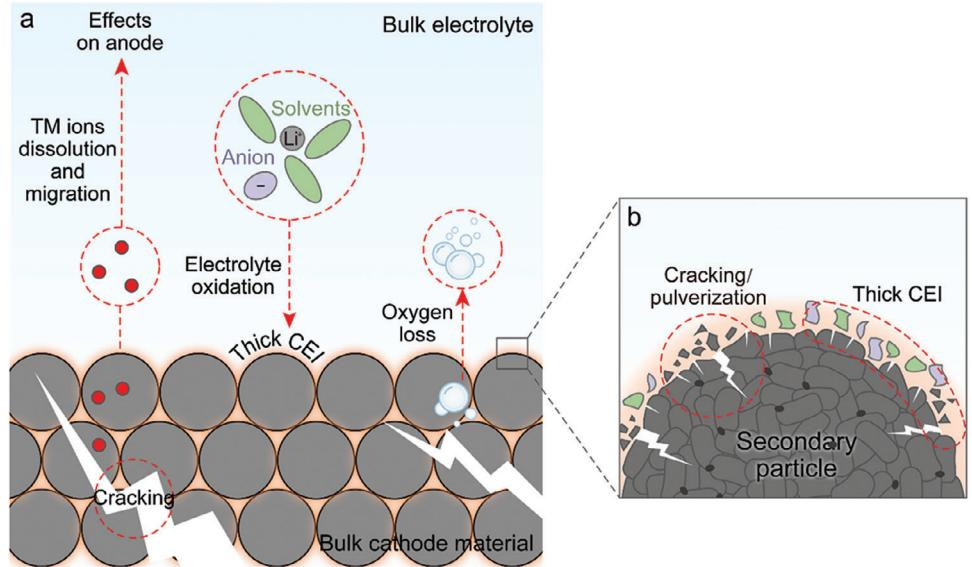

**Figure 1.** Challenges faced by the high-voltage cathode interface.

dendrite growth issues associated with LMAs.[\[22,23\]](#page-22-0) Carbonatebased and ether-based electrolytes are two commonly studied types.[\[24\]](#page-22-0) Carbonate-based electrolytes have a broader electrochemical window but fail to form a stable SEI on the LMA. Conversely, ether-based electrolytes demonstrate relatively stable LMA cycling performance (Coulombic efficiency*>*95%), but suffer from significant oxidative side reactions on the cathode side when the voltage exceeds 4.0 V, resulting in the formation of an unstable CEI and reducing the cycling stability of the cathode.[\[25\]](#page-22-0) Therefore, researchers are still striving to find an ideal electrolyte that can maintain thermodynamic stability on both high-voltage cathodes and high-active LMAs, while establishing stable CEI and SEI to realize high-energy LMBs.[\[26\]](#page-22-0)

During electrochemical processes, the composition and structure of the CEI undergo dynamic changes, posing significant challenges to the understanding of CEI. Previous research uti-

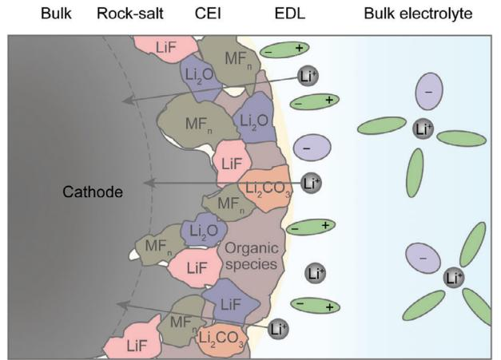

**Figure 2.** Schematic diagram of CEI structure and composition during the charging process.

lized conventional methods to investigate the properties of the CEI, such as impedance spectroscopy, scanning electron microscopy (SEM), and transmission electron microscopy (TEM). With the continuous development and application of advanced characterization techniques like cryogenic electron microscopy (cryo-EM) and atomic force microscopy (AFM), our understanding of the CEI has become more comprehensive.[\[27–30\]](#page-22-0) In addition, in situ characterization techniques have further provided insights into the interface. For instance, techniques like in situ X-ray absorption spectroscopy (XAS) and in situ TEM enable real-time characterization during electrochemical processes.[\[31,32\]](#page-22-0) Moreover, advancements in computer technology have facilitated the use of multiscale simulation methods in CEI studies. By coupling simulations from the atomic scale to the macroscopic scale, these methods reveal the structure, dynamic behavior, and performance of the interface.[\[33\]](#page-22-0) The integration of multiple characterization techniques allows for a more holistic understanding of the CEI.

The study of the CEI offers valuable guidance and insights for developing high-performance batteries. In this review, we comprehensively summarize the electrolyte formulations applied to high-voltage cathode materials and delve into the beneficial electrolyte components that contribute to the formation of a stable CEI. Specific electrolyte components, such as boron-based additives and fluorine-based solvents, have been identified to promote CEI stability and resistance to oxidation. Through the rational selection and optimization of these components, we can improve the properties of the CEI, thereby enhancing the cycle stability and capacity retention of both the cathode and the battery. We provide a detailed analysis of the underlying mechanisms and effective formulation strategies related to these electrolyte components. Furthermore, we summarize methods for modifying the cathode material interface to further enhance the stability and electrochemical performance of the CEI. By employing approaches such as surface coatings and structural manipulation, the composition and structure of the CEI can be regulated,

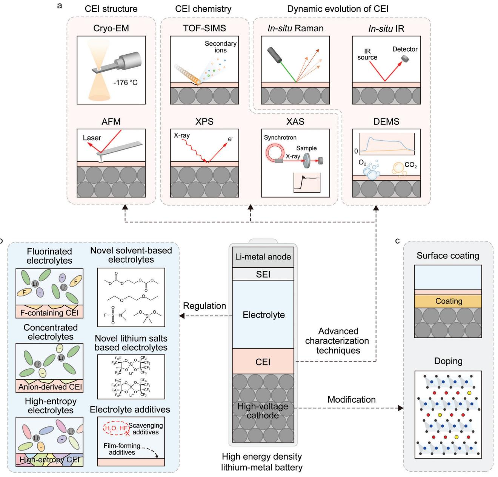

**Figure 3.** Schematic diagrams illustrating a) advanced characterization techniques for understanding the CEI and several methods for b) electrolyte regulations and c) high-voltage cathode modifications.

resulting in improved battery cycle life and energy density. Overall, this review systematically explores the design principles and strategies for the CEI, providing valuable guidance for understanding and controlling CEI formation (**Figure 3**). The insights of this review hold significant academic and practical value for advancing battery technology and its applications.

# **2. The Challenges of High-Voltage Cathode Interface**

The challenges of high-voltage cathode interface can be discussed from two perspectives: 1) the thermodynamic stability of electrolyte and cathode material. It is desirable for both cathode and electrolyte to exhibit intrinsic stability under high cutoff voltages. However, undesired side reactions at the cathode/electrolyte interface are often unavoidable, resulting in the formation of a CEI layer. 2) The passivation capability and structural stability of the CEI. An ideal CEI should effectively passivate the high-voltage cathode interface, preventing further parasitic reactions. Furthermore, it can also maintain structural stability during battery cycling, enabling excellent cathode electrochemical performance. However, the composition and structure of the CEI are dynamically changing and can be influenced by multiple factors, such as SEI-to-CEI crosstalk. In this chapter, we will discuss in detail the high-voltage challenges of electrolytes and cathode materials, as well as SEI-to-CEI crosstalk.

# **2.1. Electrolyte Decomposition**

In the early development stage of LMBs, the CEI received less attention as the focus was primarily on addressing LMA-related challenges and utilizing low-voltage cathode materials with simpler electrochemical behavior, with factors such as cycle life and safety taking precedence.[\[22,34\]](#page-22-0) However, in pursuit of achieving higher energy density in LMBs and ensuring the stability of highvoltage cathodes, it is crucial to prioritize the study of the CEI. Commonly used solvents, such as carbonates and ethers, each possess unique advantages for their application in LMBs. Commercial carbonate-based electrolytes are typically used within a working voltage range of 2.5–4.3 V, exhibiting good electrochemical performance and oxidative stability suitable for various cathode materials such as lithium iron phosphate (LiFePO4), lithium nickel manganese cobalt oxide (LiNxMyC1−x−yO2, NMC), and LiCoO2 (LCO). However, when batteries require higher voltage outputs (*>* 4.3 V), the performance of commercial carbonatebased electrolytes becomes limited.[\[35\]](#page-22-0) Under high voltage conditions, carbonate-based electrolytes are prone to oxidative decomposition reactions, resulting in the formation of gases and solid byproducts. For instance, in the case of 1 m lithium hexafluorophosphate (LiPF6) ethylene carbonate (EC)/ethyl methyl carbonate (EMC) (3:7 by weight, m represents molarity), EC and EMC can be oxidized to generate acidic substances which will further corrode the cathode surface. These degradation products may further undergo oxidation to form ultimate oxidized products such as CO2. [\[36,37\]](#page-22-0) Moreover, carbonate-based electrolytes are highly reactive toward LMAs, leading to the formation of a porous SEI and continuous electrolyte decomposition, which accelerates the deterioration of LMAs.[\[38\]](#page-22-0) On the other hand, ethers, such as 1,2-dimethoxyethane (DME) and 1,3-dioxolane (DOL), have lower viscosity and better compatibility with LMAs compared to carbonates. Nonetheless, they are susceptible to oxidative decomposition at high potentials (*>*4.0 V), which leads to the formation of a thick and insulating CEI, resulting in poor cycling performance.[\[24\]](#page-22-0) Therefore, when selecting a high-voltage electrolyte system, it is imperative to meticulously consider the advantages and disadvantages of each solvent and choose the one that is most suitable for the application.

In most electrolyte studies, researchers typically obtain information about the redox properties and electrochemical behavior of solvents and lithium (Li) salts by calculating or experimentally determining their highest occupied molecular orbital (HOMO) and lowest unoccupied molecular orbital (LUMO).[\[39\]](#page-22-0) However, studies have indicated that the HOMO and LUMO of the electrolyte do not directly correlate with its electrochemical window, often leading to an overestimation of the electrolyte's oxidation stability.[\[40\]](#page-22-0) As an illustration, the calculated HOMO energies of EC and dimethyl carbonate (DMC) are −10.51 and −9.64 eV, respectively, which suggests that the oxidation potentials are 7.87 and 7.07 V (vs absolute vacuum scale), indicating no oxidation will occur during battery operation.[\[41\]](#page-22-0) In fact, this can be misleading as practical electrolytes have interactions among various components (solvents, Li salts, additives, etc.), which significantly influence the electrochemical behavior. Therefore, a comprehensive analysis integrating experimental and computational methods is necessary when studying the redox properties of electrolytes.

Different cutoff voltages induce distinct decomposition processes of the same electrolyte, resulting in variations in interface composition. A higher cutoff voltage leads to stronger cathode– electrolyte side reactions, increasing the organic components within the CEI and destabilizing the interface structure and composition, thereby shortening the cathode cycle life.[\[15\]](#page-22-0) However, there are instances where higher cutoff voltages, such as 4.5 or 4.7 V, can improve the cycle life of certain cathode materials like NMC811.[\[42\]](#page-22-0) The organic components experience complete oxidation and decomposition, while the inorganic components increase, providing enhanced antioxidation properties and higher mechanical strength to suppress particle cracking and prevent crosstalk between the cathode and anode.

# **2.2. Surface Degradation of Cathodes**

The voltage determines the energy storage capability of the cathode materials and the energy density of the batteries. However, an excessively high cutoff voltage can induce a series of irreversible side reactions on the cathode surface. Under the high cutoff voltage, the complete Li insertion/extraction processes cause expansion and contraction of the crystal structures on the cathode surface, leading to lattice distortion and strain accumulation.[\[43\]](#page-22-0) These strain accumulations can result in damage to the crystal structure, including lattice dislocations, fractures, and cracks. Moreover, the cathode surface undergoes a phase transition, leading to the formation of a rock salt phase, which impedes the transport of ions and electrons, such as the formation of Co3O4 on the cycled LCO.[\[44,45\]](#page-22-0) NRLOs also face significant structural instability issues at high cutoff voltages, such as Li/Ni mixing, causing phase transition, further resulting in capacity loss and decreased Li+ migration. Furthermore, the dissolution of TMs (such as Co, Ni, Mn, and Fe) not only reacts with the electrolyte to generate soluble complexes but also catalyzes the irreversible decomposition of the electrolyte. These TMs can migrate to the anode surface, thus influencing the formation and stability of the SEI.[\[46,47\]](#page-22-0) Our previous investigation into the effects of TMs dissolution and migration on LMAs revealed that the high cutoff voltage led to a rapid loss of reversible capacity in NMC.[\[48\]](#page-22-0) Moreover, the dissolution and migration of TMs had irreversible adverse effects on the LMA, such as disrupting the composition of the SEI and inducing Li dendrite growth. The dissolution and migration of TMs indirectly deteriorated the cycling stability and caused capacity loss in the battery. Additionally, LRLOs encounter significant problems of lattice oxygen release at the high cutoff voltage, generating peroxides, oxygen radicals, and excited state singlet oxygen.[\[49,50\]](#page-22-0) The loss of lattice oxygen further contributes to a decrease in working voltage and capacity, posing a severe challenge for these layered cathode materials. Therefore, it is important to strike a balance between the upper cutoff voltage and the stability of the cathode to ensure long-term cycling performance.

By considering the characteristics of the cathode materials and the anticipated battery lifespan, the selection of an appropriate cutoff voltage can facilitate higher energy density of the battery. Furthermore, optimizing various aspects, including the composition and microstructure of the cathode material, as well as the electrolyte composition, can further enhance the energy density of the battery while ensuring its stability and cycle life.

# **2.3. SEI-to-CEI Crosstalk**

In the field of LIBs, extensive research has demonstrated the existence of crosstalk between the CEI and SEI. The crosstalk can lead to dynamic changes in ion transport, chemical reactions, composition, and structure of the CEI and SEI during battery operation, but most of these changes are detrimental.[\[51–55](#page-22-0)] Although there is limited research on the interaction between the CEI and SEI in the LMBs, the significance of the crosstalk cannot be overlooked.

Unlike other anodes such as graphite, LMA intrinsically possesses extremely high electrochemical/chemical reactivity. This leads to severe decomposition of electrolyte components on the Li metal surface. Through systematic studies in Li||high-nickel cathode cells, Landon et al.[\[56\]](#page-22-0) found that reduction products of the carbonate-based electrolyte, such as POF2OH and polycarbonates, crossed over to the cathode, thereby altering the composition of CEI. In advanced ether-based electrolytes, FSI− preferentially defluorinated on the Li metal surface, while the remaining sulfur and nitrogen-containing derivatives crossed over to the cathode, adversely affecting its performance.[\[46\]](#page-22-0) Furthermore, the composition of SEI has an undeniable influence on the dynamic changes of CEI. Zhang et al.[\[57\]](#page-22-0) discovered that in the cycling process of high-voltage Li||LCO cells, the CEI underwent alternating growth and collapse. X-ray photoelectron spectroscopy (XPS) analysis revealed that after discharge, the CEI suffered from rapid growth, primarily due to the considerable deposition of Li2CO3, LiF, and organic compounds. Moreover, the major constituents contributing to CEI were found to be consistent with the SEI components, indicating a strong crosstalk between SEI and CEI.

Although the research on SEI-to-CEI crosstalk is limited at present, it is recognized that SEI and CEI are strongly correlated and not independent components. A comprehensive understanding and investigation of the interaction between CEI and SEI are crucial for improving the performance and stability of LMBs. Future studies should further explore the crosstalk between CEI and SEI to uncover their intricate dynamics and enhance our knowledge of battery degradation mechanisms.

# **3. Advanced Characterization Techniques for Understanding Interfacial Chemistry and Structure**

Understanding and comprehending the CEI plays a vital role in constructing a more reliable CEI and improving battery performance. However, characterizing the CEI presents significant challenges due to the following reasons: 1) Complex composition: The CEI consists of various components, including electrolyte constituents and interfacial reaction products. 2) Multiple coupled reactions: The interplay of multiple reactions results in time-dependent physicochemical properties of the CEI. 3) Ultrathin: The CEI is extremely thin, requiring high-resolution techniques to obtain detailed information. 4) Influence of operating conditions: The CEI is affected by factors such as temperature, current density, and cycle number, rendering its static and dynamic characterization more intricate.[\[18,58–60\]](#page-22-0) Powerful tools for the characterization are pivotal in understanding the CEI and guiding the design of a more robust CEI to enhance battery performance.

During the early stages of research, scientists gained an initial understanding of the CEI through various characterization techniques.[\[61\]](#page-22-0) In 1985, Goodenough et al.[\[62\]](#page-22-0) directly observed evidence of the CEI using impedance spectroscopy and EM. Subsequently, Kanamura et al.[\[63\]](#page-22-0) detected the presence of carboxylate species in the CEI through in situ infrared spectroscopy. In 2004, Thomas et al.[\[64\]](#page-22-0) identified the decomposition products of LiPF6 on the surface of CEI. Komaba et al.[\[65\]](#page-22-0) revealed the mechanism of Li2CO3 generation at the cathode interface. As more advanced instruments are applied to explore the CEI, researchers' understanding of the CEI has become increasingly comprehensive. In general, the chemical composition, structure, and dynamic evolution process of the CEI are crucial to its properties and mechanisms. In this chapter, a comprehensive review of the relevant literature on CEI detection using advanced techniques in recent years is compiled. Additionally, we elucidate the distinct roles played by different instruments in comprehending and identifying the CEI based on their underlying principles, with a particular emphasis on gaining insights into various properties of the CEI.

# **3.1. Nanoscale Characterization Techniques for Interfacial Chemistry**

# *3.1.1. Time of Flight Secondary Ion Mass Spectrometry (TOF-SIMS)*

TOF-SIMS is a vital technique for analyzing the chemical constituents and composition profile of the CEI. By bombarding the sample surface with primary ions, secondary ions carrying composition-related information are generated (**Figure 4**[a\)](#page-5-0).[\[66\]](#page-22-0) These secondary ions undergo different displacements in the flight system due to their varying mass-to-charge ratios, resulting in a graph depicting the relationship between mass-to-charge ratios and ion quantities. Additionally, the utilization of focused ion beam (FIB) sputtering enables the detection of compositional information at different depths.

However, the information obtained from TOF-SIMS regarding the CEI is highly intricate and localized.[\[67\]](#page-22-0) Corrosion occurs at the cathode interface, where TMs dissolve from the interface and react with the electrolyte to form inorganic compounds. TOF-SIMS can detect these compounds, including ions such as MnF3 −, FeF2 −, FeF3 −, MnF2 −, NiF3 −, and NiO−. [\[21,68,69\]](#page-22-0) Simultaneously, solvents and anions in the electrolyte undergo oxidation reactions at the cathode interface, resulting in the adherence of certain products to the cathode. These ion fragments identified through TOF-SIMS include CH3O−, C2HO−, C3O2F−, C2F−, LiF2 − and PO2 −. [\[70,71\]](#page-23-0) The composition and spatial arrangement of these components exert a substantial influence on the CEI.

From an alternative standpoint, these components provide insights into the reactivity of diverse constituents and reaction pathways, enabling the exploration of the electrolyte's role in CEI formation.[\[72,73\]](#page-23-0) Wen et al.[\[74\]](#page-23-0) analyzed the role of lithium difluoro(oxalate)borate (LiDFOB) and lithium bis(oxalate)borate

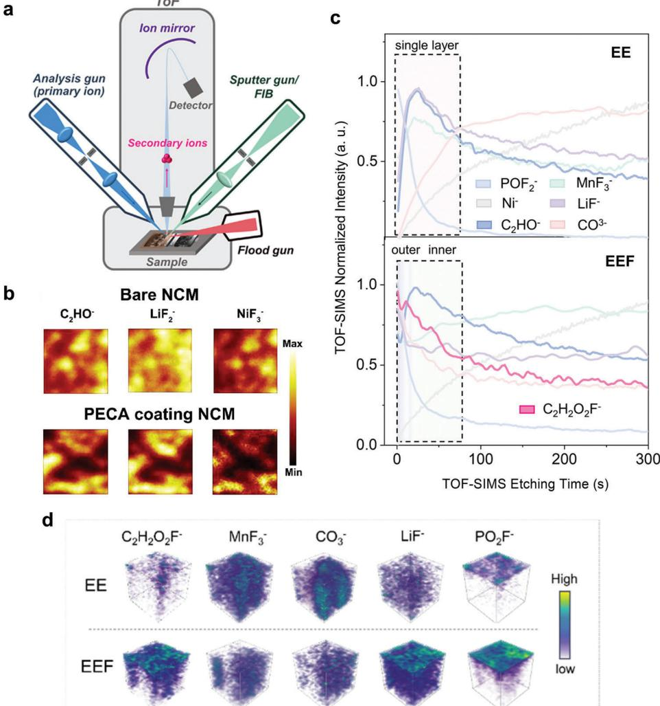

**Figure 4.** Analysis of the composition and structure of CEI using TOF-SIMS. a) Schematic diagram of TOF-SIMS. Reproduced with permission.[\[66\]](#page-22-0) Copyright 2023, American Institute of Physics Publishing. b) 3D render of NMC and PECA coating NMC detected by TOF-SIMS. Reproduced with permission.[\[77\]](#page-23-0) Copyright 2023, Elsevier. c), d) TOF-SIMS characterization of the cycled cathodes in EE and EEF. Reproduced with permission.[\[78\]](#page-23-0) Copyright 2024, Wiley-VCH GmbH.

(LiBOB) in the CEI formation by distinguishing the signals of BF2 − and BO−. Liu et al.[\[75\]](#page-23-0) added trimethyl borate (TMB) into 1 m LiPF6 in fluoroethylene carbonate (FEC)/EMC/triethyl phosphate (TEP) (1:1:2 by volume) electrolyte. TOF-SIMS spectra of NMC811 revealed a uniform distribution of BO2 −, primarily attributed to the decomposition of TMB. Additionally, the content of PO2 − significantly decreased, suggesting the inhibition of TEP decomposition. Lai et al.[\[76\]](#page-23-0) introduced 0.5 vol% of 2-(ethyl(methyl)amino)-1,3,2-dioxaphospholane 2-oxide (EMPA) into a commercial baseline electrolyte. TOF-SIMS analysis of NMC111 after three cycles revealed a lower surface concentration of fragments and a uniform distribution of polymerized fragment ions, including PO3 −, C3N−, and C2NH−. Wang et al.[\[77\]](#page-23-0) employed polar functional groups to adsorb -cyanoacrylate ester (ECA) onto transition metal sites of NMC and initiate polymerization, resulting in the formation of a poly -cyanoacrylate ester (PECA) coating. As shown in Figure 4b, the subsequent testing of the cathode after 300 cycles demonstrated that PECA effectively mitigated the presence of fragments such as C2HO−, LiF2 −, and NiF3 −, indicating excellent protection provided by the coating.

Particularly, Zhang et al.[\[78\]](#page-23-0) added 20 vol% 1,1,2,2 tetrafluoroethyl-2,2,3,3-tetrafluoropropyl ether (TTE) into 1 m LiPF6 in EC/EMC (3:7 by volume, named as EE electrolyte) to obtain EEF electrolyte. TOF-SIMS analysis demonstrated the detection of a specific ion fragment, C2H2O2F−, derived from the decomposition of TTE (Figure 4c). The analysis of secondary ion distribution with sputtering time revealed distinct characteristics in the CEI structure between the EE and EEF electrolytes. In the EE electrolyte, POF2 − was predominantly present in the outer layer, while other fragments exhibited uniform distribution, indicating a single-layer CEI structure. In contrast, the EEF electrolyte exhibited a double-layer configuration. The outer layer primarily consisted of PO2F− and LiF−, while the inner layer comprised C2HO−, MnF3 −, and

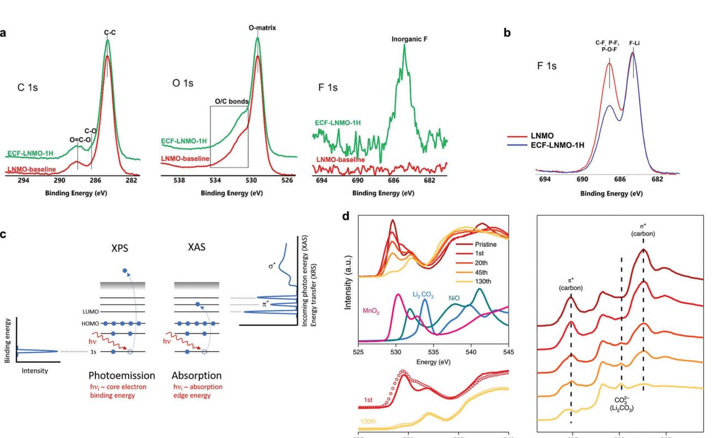

**Figure 5.** XPS and XAS for CEI detection. a) XPS spectrum of LNMO cathode with LiF on the surface and b) XPS spectrum of the LNMO after 100 cycles. Reproduced with permission.[\[84\]](#page-23-0) Copyright 2022, Wiley-VCH GmbH. c) Principal diagrams of XAS and XPS. Reproduced with permission.[\[89\]](#page-23-0) Copyright 2022, John Wiley & Sons, Ltd. d) XAS spectra of the structural evolution of Li1.2Ni0.15Co0.1Mn0.55O2 cathode during cycling. Reproduced with permission.[\[94\]](#page-23-0) Copyright 2018, Springer Nature.

C2H2O2F− (Figure [4d\)](#page-5-0). This observation was attributed to the preferential decomposition of TTE on the surface, resulting in the formation of low-polymerization cross-linked products that evenly covered the cathode surface and slowed down other side reactions.

### *3.1.2. X-Ray Photoelectron Spectroscopy (XPS)*

XPS analysis of the CEI shares similarities with TOF-SIMS but has distinct limitations and focuses on different aspects. Unlike TOF-SIMS, XPS is unable to detect hydrogen or helium elements and does not provide molecular information. Its primary emphasis is on analyzing chemical bond details.[\[79\]](#page-23-0) When a sample's surface is irradiated with a photon beam, electrons in specific atomic orbitals of an element can absorb photons, resulting in their emission from atomic nuclei with distinct kinetic energy.[\[80\]](#page-23-0) These emitted electrons possess characteristic energies corresponding to monochromatic excitation sources and specific atomic orbitals. Consequently, qualitative analysis of elemental species in a substance can be performed based on the binding energies of photoelectrons.[\[81\]](#page-23-0) Moreover, due to variations in chemical environments, XPS spectra may exhibit peak shifts in inner-shell electron binding energies, facilitating the determination of valence states and bonding information for elements.[\[82\]](#page-23-0)

For example, Bondarchuk et al.[\[83\]](#page-23-0) distinguished the differences in surface structure and composition of commonly used electrodes LiNi0.3Mn0.3Co0.3O2 (NMC333), LiNi0.5Mn0.3Co0.2O2 (NMC532), LiNi0.6Mn0.2Co0.2O2 (NMC622) and NMC811 by XPS. Thapaliya et al.[\[84\]](#page-23-0) utilized electrochemical techniques to in situ fabricate a LiF layer on the surface of LiNi0.5Mn1.5O4 (LNMO) (referred to as ECF-LNMO-1H), resulting in stable cycling at a high voltage of 4.9 V. High-resolution XPS spectra were obtained for C 1s, O 1s, and F 1s, revealing three main features corresponding to C─C, C─O, and O─C─O bonds in both LNMO and ECF-LNMO-1H samples (**Figure 5**a). The O 1s spectrum exhibited a prominent peak at ≈529.0 eV, attributed to the Li─Ni─Mn─O bond, while spectral intensities ranging from 530.0 to 534.0 eV were typically assigned to O/C bond formation. Notably, ECF-LNMO-1H displayed a distinct Li–F signal in the F 1s spectrum. In the XPS F 1s spectra of the two cathodes after 100 cycles (Figure 5b), the intensity of the Li–F peak remained similar for both LNMO and ECF-LNMO-1H samples. However, the peaks formed by C– F, P–F, and P–O–F were significantly reduced in ECF-LNMO-1H, suggesting the suppression of organic decomposition on its surface.

Furthermore, XPS can effectively demonstrate the variations in CEI formation among different electrolytes. Yang et al.[\[85\]](#page-23-0) formulated a mixture comprising 2 m lithium bis(trifluoromethanesulphonyl)imide (LiTFSI), 1.5 m LiDFOB, 0.5 m lithium tetrafluoroborate (LiBF4), and 5 vol% FEC in DME

(referred to as CETHER-3). In comparison to the electrolyte without LiBF4 and FEC, XPS spectroscopy revealed a reduced intensity of C–C/C–H signals at the cycled NMC622 surface within CETHER-3, indicating suppressed decomposition of DME. Moreover, the enhanced SO3 2− signal on the cycled NMC622 surface within CETHER-3 suggested higher Li2SO3 content in the CEI, which inhibited harmful phase transitions on the cathode surface. Deng et al.[\[86\]](#page-23-0) incorporated FEC, hydrofluoroether (HFE), and a small amount of LiDFOB into the LiPF6-sulfolane (TMS) electrolyte to tailor a high-performance CEI. XPS results obtained at different sputtering times revealed that the enhanced electrolyte produced a CEI with high ionic conducting sulfur constituents, in addition to the presence of LiF and boride-containing species. Ishfaq et al.[\[87\]](#page-23-0) developed a novel fluorinated ether, namely 2,2-bis(trifluoromethyl)-1,3-dioxolane (BTFD), as a diluent in a DME-based electrolyte. XPS spectroscopy analysis of the cycled NMC811 cathode revealed notable and different observations when using BTFD-based electrolytes. Specifically, the Li–F to C–F/S–F peak ratio showed an increasing trend, and the Mn–O intensity in the O 1s spectrum exhibited a lower value. These findings suggest that the BTFDbased electrolytes promoted enhanced decomposition of lithium bis(fluorosulfonyl)imde (LiFSI) at the interface, resulting in a higher generation of LiF and a reduced presence of organic compounds in the CEI. As a result, the cathode experienced improved protection in BTFD-based electrolytes.

# *3.1.3. X-Ray Absorption Spectroscopy (XAS)*

XAS is primarily utilized for determining material composition and atomic structure.[\[88\]](#page-23-0) Figure [5c](#page-6-0) provides a schematic diagram illustrating the principles of both XPS and XAS techniques.[\[89\]](#page-23-0) When X-rays interact with a sample, the inner-shell electrons of the sample atoms absorb photon energy and undergo transitions. Unlike XPS, which requires electron excitation into free electrons, XAS relies on the specific absorption of energy by electrons with different energy levels in various elements, enabling element identification. The absorption edge corresponds to the energy at which photoelectrons are absorbed, with *K*, *L*, *M*, or *N* edges appearing for transitions from principal quantum numbers n = 1, 2, 3, or 4, respectively. However, there may be a shift of several eV in the exact position of absorption edges in terms of energy. As atomic valence states increase and the electron count in the outermost shell decreases, the shielding effects on innershell electrons weaken, causing an upward shift of the edge toward higher energies. This information can be utilized to determine changes in the valence states of sample atoms.[\[90,91\]](#page-23-0)

Changes in the valence states of elements at the cathode interface can serve as an indicator for determining the composition information of the CEI.[\[92,93\]](#page-23-0) Hu et al.[\[94\]](#page-23-0) employed XAS to investigate Li1.2Ni0.15Co0.1Mn0.55O2 and examine the variations in valence states of different elements during cycling (Figure [5d\)](#page-6-0). The authors observed a continuous decrease in the average valence states of TMs with increasing cycle numbers. In the O *K*-edge spectra, the peak at 528–533 eV resulted from the hybridization between oxygen 2*p* and transition metal 3*d* states upon excitation of oxygen core–shell electrons. Initially, the cathode exhibited strong signals resembling transition metal oxides. However, cycling resulted in a decline in the valence states of TMs on the electrode surface and a weakened hybridization between 2*p* and 3*d* states. Simultaneously, a CEI formed on the cathode surface, causing a downward shift in the O *K*-edge. The C *K*-edge XAS spectrum displayed peaks at 284.8 and 292.6 eV, which were attributed to antibonding and antibonding from carbon additive, indicating continuous decomposition of the carbon additive during cycling. Tan et al.[\[33\]](#page-22-0) also employed XAS to demonstrate that the lithium difluorophosphate (LiDFP) additive can stabilize the surface valence state of the cycled cathode.

# **3.2. Analytical Techniques for Interfacial Structure**

# *3.2.1. Transmission Electron Microscopy (TEM)*

Electron microscopy plays an indispensable role in characterizing the microstructure and composition of materials, making it a ubiquitous tool in battery research.[\[95\]](#page-23-0) **Figure [6](#page-8-0)**a illustrates the fundamental principle of TEM.[\[96\]](#page-23-0) In TEM, an electron beam is projected in a parallel manner onto an extremely thin CEI, allowing transmitted electrons to carry detailed structural information from within the CEI. These electrons are precisely focused onto an imaging plane, generating an image that exhibits brightness and contrast. This technique enables the observation of thickness-related information regarding the CEI, as distinguishable differences between CEI elements and the crystal structures of cathodes.[\[92,97,98\]](#page-23-0)

Fan et al.[\[99\]](#page-23-0) employed TEM to observe the formation of a conformal and dense CEI on the surface of LiCoPO4 in the fully fluorinated electrolyte. Furthermore, by incorporating lithium tetrafluoro(fluoromalonato)phosphate (LFMP) into the electrolyte, a uniform, and continuous CEI was observed on NCM811, even after three cycles at 100 °C. The parallel incident light in TEM can lead to coherent scattering as electrons pass through the crystal, allowing for the collection of electron diffraction patterns for compositional analysis.[\[100\]](#page-23-0) Lu et al.[\[101\]](#page-23-0) incorporated LiF into LRLO and observed by TEM that LiF on the surface of LRLO was exposed (111) with a lattice spacing of 2.33 Å. Zhang et al.[\[102\]](#page-23-0) observed significant differences in the diffraction patterns between the rock-salt phase and the layered structure.

Figure [6b](#page-8-0) illustrates the principle of scanning transmission electron microscopy (STEM), which utilizes a focused electron beam for sample transmission, offering higher penetration power and improved image resolution compared to TEM.[\[96\]](#page-23-0) High-angle annular dark-field (HAADF) STEM imaging mode is commonly used to achieve non-coherent imaging and mitigate phase interference by detecting scattered electrons from higher angles. HAADF-STEM provides atomic-level compositional information, with image contrast approximately proportional to the square of the atomic number. The crystal structure of the cathode surface in HAADF-STEM exhibits significant dissimilarity compared to that of the interior due to the dissolution of TMs, resulting in structural degradation. This region is referred to as the dissolved salt phase, which plays a crucial role in the formation of the CEI.

However, the composition of the CEI primarily consists of light elements. Imaging light elements like Li using HAADF-STEM can be challenging due to their low scattering intensity.

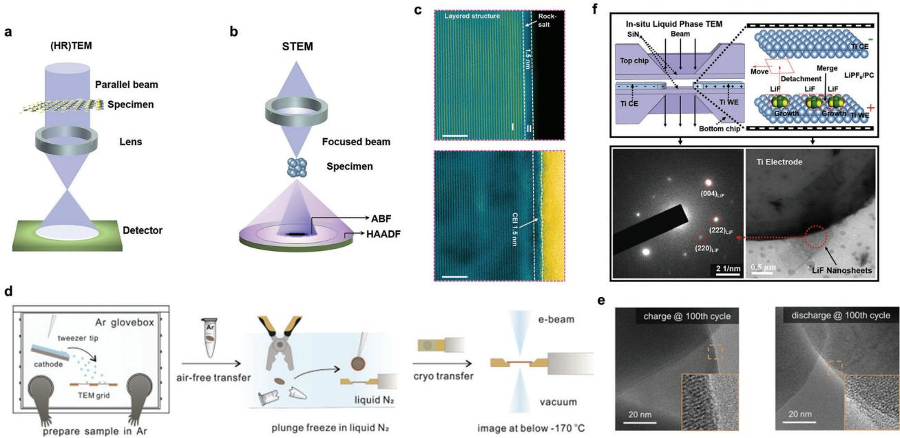

**Figure 6.** Nanoscale observations of CEI using TEM. The schematic diagrams of a) TEM and b) STEM. Reproduced with permission.[\[96\]](#page-23-0) Copyright 2021, Elsevier. c) HAADF-STEM observation of rock-salt layer and ABF-STEM observation of CEI. Reproduced with permission.[\[107\]](#page-23-0) Copyright 2023, Wiley-VCH GmbH. d) Schematic diagram of cryo-EM operation and e) cryo-EM images of cathode particles in different charge/discharge states. Reproduced with permission.[\[27\]](#page-22-0) Copyright 2021, Elsevier. f) In situ TEM observation of the growth behavior of LiF on the cathode surface. Reproduced with permission.[\[31\]](#page-22-0) Copyright 2022, Elsevier.

Conversely, annular bright-field (ABF) STEM imaging collects small-angle scattered electrons, reducing the reliance on atomic numbers and enabling simultaneous visualization of light and heavy elements. In observations of the CEI, both types of images are often combined, with HAADF-STEM used for cathode crystal structure characterization and ABF-STEM for CEI characterization.[\[32,103–106\]](#page-22-0) In Figure 6c, Wang et al.[\[107\]](#page-23-0) conducted characterization of cycled NMC811 in an advanced electrolyte. The results from HAADF-STEM and ABF-STEM revealed a thickness of only 1.5 nm for both the rock salt phase and the CEI.

However, misinterpretations can occur in TEM testing due to the potential damage caused by high-energy electron interactions with the sample surface, leading to structural and compositional changes in the SEI and CEI.[\[108,109\]](#page-23-0) Cryo-EM was initially employed by Li et al.[\[110\]](#page-23-0) to investigate the battery interface. Cryo-EM involves freezing the sample at ultralow temperatures to preserve its structure and enable nondestructive testing. By freezing the samples with liquid nitrogen, the surrounding liquid environment transforms into a glassy state, minimizing interference from vacuum and electron beams (Figure 6d). However, cryo-EM analysis revealed no detection of the CEI on the NMC surface after the 100th charge and discharge cycles, suggesting that the CEI may not uniformly coat each positive particle during cycling (Figure 6e).[\[27\]](#page-22-0) The thickness of the CEI can be precisely determined from the cryo-EM images. However, it exhibits significant variation across different cathodes and electrolytes.[\[111–113\]](#page-23-0) Alvarado et al.[\[114\]](#page-23-0) observed that LNMO electrodes in 1.2 m LiPF6 in EC/EMC (3:7 by weight, m represents molality) and 3 m LiFSI-TMS electrolytes had CEI thicknesses not exceeding 1 nm after 50 cycles.

In situ TEM is a crucial technique for observing the formation process of the CEI. However, due to the specific testing conditions required by TEM, meticulous design of in situ cells becomes necessary.[\[115,116\]](#page-23-0) Zhang et al.[\[31\]](#page-22-0) fabricated an in situ cell on a TEM holder using patterned titanium electrodes (90 nm thickness) as both the working electrode (WE) and counter electrode (CE) (Figure 6f). They investigated the behavior of LiPF6 propylene carbonate (PC) electrolyte during battery operation and observed nucleation and gradual growth of LiF during the charging process. However, when the formed LiF was terminated by F on the titanium electrode, interface reconstruction induced by the electronegativity of F could result in detachment and movement of LiF flakes during electrochemical reactions. Liu et al.[\[117\]](#page-23-0) utilized in situ heating TEM to demonstrate the excellent thermal stability of LCO coated with Li4Mn5O12 (named Li4Mn5O12-LCO). With increasing temperature, a layer of CEI formed on the surface of LCO, causing irreversible changes within its crystal lattice structure. In contrast, no significant morphological changes were observed for Li4Mn5O12-LCO, even at 500 °C.

### *3.2.2. Atomic Force Microscope (AFM)*

AFM is a technique that utilizes molecular interaction forces between a probe and a sample to accurately assess sample properties. AFM images are constructed from numerous measurement points (256 × 256 or 512 × 512), where the probe continuously approaches the sample surface, undergoes deformation, and high-precision measurements are enabled by an amplified laser. Height information is obtained by recording the probe displacement at each specific point once a predetermined

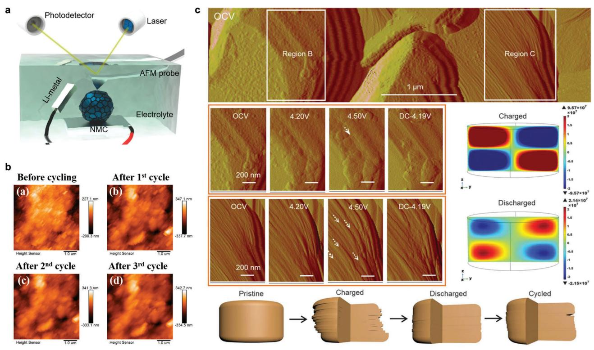

**Figure 7.** In situ AFM investigation of CEI formation and cathode interface evolution. a) Schematic diagram of in situ AFM. Reproduced with permission.[\[120\]](#page-23-0) Copyright 2021, Elsevier. b) Observation of the formation process of CEI using in situ AFM. Reproduced with permission.[\[131](#page-24-0)] Copyright 2022, Multidisciplinary Digital Publishing Institute. c) Surface structure and morphology evolution by in situ AFM for single-crystalline NMC76. Reproduced with permission.[\[28\]](#page-22-0) Copyright 2020, The American Association for the Advancement of Science.

threshold is reached.[\[118\]](#page-23-0) AFM can also evaluate various physical properties of samples, including mechanical strength (mechanical microscopy) and conductivity (conductive microscopy).[\[119\]](#page-23-0) Notably, AFM can be conveniently integrated with an in situ battery setup, as it does not require a vacuum environment (**Figure 7**a).[\[120\]](#page-23-0)

AFM modulus test provides valuable insights into the composition and structural information of the CEI. Recent literature shows significant variations in modulus values influenced by different cathode materials, electrolytes, and testing conditions. Generally, a CEI with higher inorganic content and a more uniform distribution exhibits a larger modulus and superior performance.[\[117,121–125\]](#page-23-0) Hwang et al.[\[126\]](#page-24-0) demonstrated the thickness and uniformity changes of the CEI on LiMn2O4 (LMO) with increasing cycles. Zeng et al.[\[127\]](#page-24-0) confirmed a gradual stabilization of the CEI modulus with increasing cycles. Furthermore, Yang et al.[[128\]](#page-24-0) characterized the morphology, modulus, and conductivity of LRLOs under various charge–discharge states, establishing a correlation between nanoscale morphology and macroscopic charge–discharge behavior.

The formation process of the CEI can be directly observed using in situ AFM. Lu et al.[\[129\]](#page-24-0) investigated the behavior of LCO under high voltage and found no significant alteration in the crystal plane during the charging process. However, at the particle edges, a thin film composed of fibrous structures emerged at 4.5 V and disappeared when the voltage dropped to 3 V. Tian et al.[\[130\]](#page-24-0) found similarities between the static process and the charging and discharging process. This was demonstrated by the continuous growth of nanocrystals on the surface of NMC622 and the appearance of new particles, accompanied by blurred boundaries between these nanocrystals. For LRLO, when charged to 4.3 V, a rapid formation of a passivation layer occurred on the surface of LRLO, coinciding with the appearance of an obvious oxidation peak in linear sweep voltammetry (LSV). After three cycles, a uniform CEI covered the surface of LRLO (Figure 7b).[\[131\]](#page-24-0) Chen et al.[\[132\]](#page-24-0) performed a comparative analysis of in situ AFM images of LRLO cycled in two different electrolytes. The surface morphology of the cathode also exhibited certain alterations when exposed to liquid environments. In the carbonate-based electrolyte, several particles were observed on the surface of LRLO up to 4.5 V, without significant changes in morphology. In contrast, LRLO immersed in the fully fluorinated electrolyte was enveloped by a uniform CEI layer. This observation suggests that the fully fluorinated electrolyte provides effective protection for LRLO.

In situ AFM analysis has also revealed the formation of microcracks and gliding steps on the surface of cathode materials in different charge or discharge states, providing insights into the structural changes during battery operation. Bi et al.[\[28\]](#page-22-0) utilized in situ AFM to investigate the surface changes of the single crystal LiNi0.76Mn0.14Co0.1O2 (NMC76) in different charge or discharge states (Figure 7c). During the charging process from open circuit voltage (OCV) up to 4.5 V, microcracks were observed on the lateral surface of the cathode, which disappeared during the discharge process. Additionally, step-like features emerged on

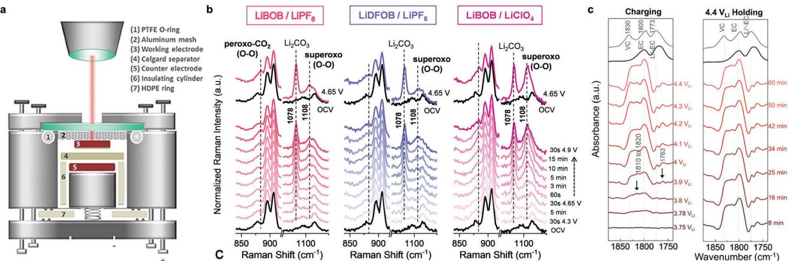

**Figure 8.** In situ spectroscopies capture the surface evolution process on the cathode. a) Cell design for in situ Raman spectroscopy. Reproduced with permission.[\[135\]](#page-24-0) Copyright 2018, Frontiers. b) In situ Raman investigation of the inhibitory effect of LiDFOB and LiBOB on superoxide formation of LRLO cathode. Reproduced with permission.[\[141\]](#page-24-0) Copyright 2022, Elsevier. c) In situ FT-IR spectra on NMC811 surface. Reproduced with permission.[\[147\]](#page-24-0) Copyright 2020, Royal Society of Chemistry.

the lateral surface starting from a charging potential of 4.2 V, attributed to uneven movement between adjacent layers. At ≈4.5 V, wider gliding steps with a width of ≈85 nm were observed. When the cell potential dropped to ≈4.19 V, several wide sliding steps narrowed down, indicating the restoration of atomic layers to their initial positions.

## **3.3. In Situ Techniques for Monitoring Interfacial Dynamic Evolution**

#### *3.3.1. Raman Spectroscopy*

Raman spectroscopy utilizes laser light to irradiate a sample, causing nonelastic collisions between photons and molecules in the sample.[\[133,134\]](#page-24-0) The analysis of the scattered light spectrum provides valuable insights into the composition of the sample. **Figure 8**a illustrates that in situ Raman experiments can be performed to observe real-time changes in interface composition during battery operation by designing the battery structure accordingly.[\[135\]](#page-24-0) Heber et al.[\[136\]](#page-24-0) conducted a study on the alterations in the surface composition of LCO during the charge and discharge processes. Initially, distinct peaks corresponding to the lattice structure of LCO were observed. However, after six cycles, no signal indicative of LCO was detected on the surface, suggesting complex reconstruction on the cathode surface. Additionally, Li2CO3 signals increased during discharge and decreased during charge. Liu et al.[\[137\]](#page-24-0) revealed the significant formation of LiF (≈410 cm−1) on the surface of LCO during the charging process, which remained stable throughout the entire discharge process through in situ Raman spectroscopy.

By analyzing in situ Raman spectra, insights into the variations in the molecular and crystalline structures of the cathode material can be gained. As the cathode undergoes electrochemical reactions, such as Li insertion and extraction, changes occur in the bonding environment and lattice vibrations of the cathode material. These structural alterations manifest as shifts in the Raman peaks, alterations in peak intensities, and the emergence or disappearance of specific vibrational modes.[\[138,139\]](#page-24-0) Baazizi et al.[\[140\]](#page-24-0) revealed through in situ Raman spectroscopy that the symmetric Mn–O stretching vibration peak ≈625 cm−1 weakened during the charging process of LMO, indicating the Li extraction process in LMO. Another spectral peak appeared ≈600 cm−1, attributed to -MnO2, indicating the formation of -MnO2 after Li extraction from LMO.

Raman spectroscopy is an effective method for detecting the formation of O─O bonds and peroxides in the lattice of LRLOs during charge–discharge processes.[\[50\]](#page-22-0) Zhang et al.[\[141\]](#page-24-0) added 2 wt.% of LiBOB or LiDFOB to the base electrolyte (1.2 m LiPF6 in EC/EMC, 3:7 by volume). In situ Raman spectroscopy analysis demonstrated that the addition of boron-based additives significantly reduced the intensity of the O─O peak, providing evidence for the suppressive effect of LiBOB and LiDFOB on peroxide formation. However, when LiPF6 was replaced with LiClO4, with the addition of LiBOB in the electrolyte, there was no significant change observed in the O─O peak (Figure 8b). This suggests that the inhibitory effect of LiBOB on O─O bond formation may require synergistic interaction with LiPF6.

### *3.3.2. Infrared Spectroscopy*

Infrared spectroscopy is a powerful technique that reveals unique details about the molecules present in a sample.[\[142\]](#page-24-0) It operates by measuring the absorption of infrared light caused by the vibrations of chemical bonds. These bond vibrations are influenced by the force constants and atomic masses, which are closely related to the specific structural characteristics of the molecules. Therefore, infrared spectroscopy holds significant value in studying the molecular structure and chemical composition of various substances. The Fourier transform infrared spectroscopy (FT-IR) technique involves passing interfered light through a sample, selectively absorbing certain wavelengths of light, while the transmitted light carries valuable information about the sample. The resulting interferogram undergoes rapid Fourier transform

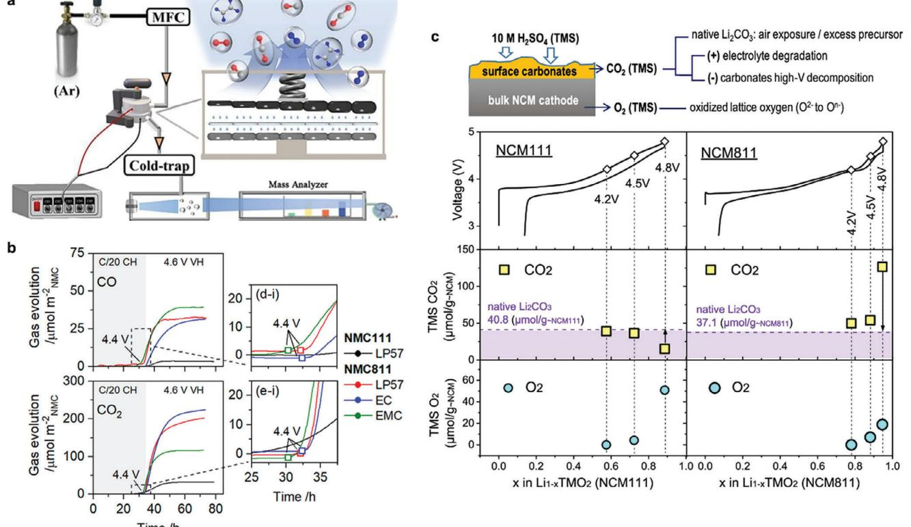

**Figure 9.** Detection of gas evolution using DEMS for obtaining cathode interface information. a) Schematic diagram of DEMS. Reproduced with permission.[\[148\]](#page-24-0) Copyright 2023, Wiley-VCH GmbH. b) Time-dependent formation of CO and CO2 generated on the surface of the NMC cathode due to electrolyte oxidation. Reproduced with permission.[\[151\]](#page-24-0) Copyright 2022, American Chemical Society. c) Analysis of O2 generated by lattice oxygen oxidation in bulk NMC and Li2CO3 content in CEI using TMS. Reproduced with permission.[\[158\]](#page-24-0) Copyright 2022, American Chemical Society.

processing, providing absorbance or transmittance data that vary with frequency or wavelength.[\[143,144\]](#page-24-0)

In situ FT-IR analysis provides a comprehensive understanding of interface evolution processes.[\[145,146\]](#page-24-0) Zhang et al.[\[147\]](#page-24-0) utilized in situ FT-IR spectroscopy to investigate the dehydrogenation reaction of carbonate-based electrolytes on the NMC811 surface. They employed density functional theory (DFT) simulations to determine the infrared peak frequencies of EC (1804 cm−1) and its dehydrogenation products De-H EC (1827 cm−1), vinylene carbonate (VC, 1832 cm−1), and oligomer C6H8O6 (1755 and 1813 cm−1). The in situ FT-IR results indicated that oxidation of the electrolyte occurred on the charged NMC811 electrode at a voltage of 3.8 V. EC underwent dehydrogenation on the cathode surface, resulting in the formation of De-H EC by removing one hydrogen atom. De-H EC can further remove another hydrogen atom to generate VC or combine with another EC molecule to form oligomers (Figure [8c\)](#page-10-0).

#### *3.3.3. Differential Electrochemical Mass Spectroscopy (DEMS)*

DEMS is a real-time technique that combines electrochemical cells with mass spectrometry to extract and detect gases produced during the charging and discharging processes (**Figure 9**a).[\[148\]](#page-24-0) This method, similar to online electrochemical mass spectroscopy (OEMS), allows for the identification of gases generated at the cathode interface, including those resulting from electrolyte decomposition and cathode degradation. The specific reaction pathways vary depending on the voltage states, cathode materials, and electrolytes.[\[149\]](#page-24-0) By utilizing DEMS to monitor gas generation in batteries, a more comprehensive understanding of the reactions occurring at the cathode interface can be achieved.[\[150\]](#page-24-0)

DEMS is a valuable tool for evaluating the impact of electrolytes on the cathode interface. Using DEMS, researchers effectively showcased the incompatibility between EC and highvoltage NMC811.[\[151\]](#page-24-0) Figure 9b demonstrated that charging voltage exceeding 4.4 V led to severe side reactions between NMC811, NMC111, and EC-containing electrolytes, resulting in the release of CO and CO2. Guo et al.[\[152\]](#page-24-0) compared gas generation during the charging process of conventional electrolytes and advanced electrolytes on NRLO.[\[152\]](#page-24-0) DEMS analysis revealed that the conventional carbonate-based electrolyte exhibited a significantly higher gas production rate of 204 μmol g−1 compared to advanced electrolytes. Conversely, the advanced electrolyte containing 1H,1H,5H-octafluoropentyl 1,1,2,2-tetrafluoroethyl ether (OTE) demonstrated the lowest gas production rate at only 71 μmol g−1, indicating the crucial role of diluents in regulating the chemical properties of the CEI. Furthermore, DEMS can provide a means to investigate the reactions on the cathode interface under various conditions. Gas evolution behavior during charge and discharge processes was compared for three cathode materials, LCO, LiNiO2 (LNO), and Li2MnO3. [\[153\]](#page-24-0) LCO showed negligible O2 generation even at a voltage of 5 V. In contrast, LNO exhibited higher activity in electrolyte degradation but quickly became passivated after several cycles due to the deposition of a substantial degradation layer. Moreover, Li2MnO3 experienced more pronounced O2 generation, likely attributed to electrolyte decomposition and O2 loss from the cathode. In a separate study, Sim et al.[\[154\]](#page-24-0) conducted in situ gas analysis on nine NRLOs, revealing that the intensity of gas release strongly depended on the cathode composition.

Combining DEMS with titration (titration mass spectrometry, TMS) is an effective method.[\[155,156\]](#page-24-0) Cycled cathodes are placed in a gas collection chamber, and the addition of H2SO4 reacts with Li2CO3, Li2O2, and other components in the CEI, resulting in the production of O2, CO2, and other gases. The analysis of gas types and quantities produced by DEMS can be used to predict the composition of CEI. Kaufman et al.[\[157\]](#page-24-0) established a relationship between gas production and cracking in NRLOs. DEMS detection revealed that gas generation occurred only when the cathode lattice transformed from the second hexagonal phase (H2) to the third hexagonal phase (H3). Immediate appearance of CO2 was observed upon the addition of 10 m H2SO4 to the cycled cathode, indicating the presence of Li2CO3 in CEI. Zhang et al.[\[158\]](#page-24-0) conducted a systematic investigation of TMS and OMES applications in various battery systems, including LRLOs and NRLOs candidates, Li–O2 batteries, and a graphite anode. Comparing fresh NMC811 with NMC811 exposed to air for one month, the latter produced a significant amount of CO2 during the TMS test, suggesting the transformation of compounds like Li2O2 on the NMC surface into Li2CO3 in an air atmosphere. As shown in Figure [9c,](#page-11-0) throughout the cycling process of the cathodes, electrolyte decomposition resulted in an increase in Li2CO3 content, which was subsequently electrochemically oxidized. Comparing CO2 generation between NMC111 and NMC811 at different voltages, it was observed that CO2 production decreased for NMC111 at 4.8 V, indicating accelerated electrochemical decomposition of Li2CO3. In contrast, CO2 production significantly increased for NMC811 at 4.8 V, suggesting severe electrolyte decomposition.

In conclusion, we have provided a comprehensive table presenting the advantages of different characterization techniques for the analysis of CEI structure and composition (**Table 1**). It should be noted that the specific benefits may vary depending on experimental conditions, sample characteristics, and research goals. Researchers should carefully choose the appropriate techniques based on the specific requirements and consider the complementary information provided by different techniques.

# **3.4. Theoretical Simulation for Interfacial Reaction Process**

In recent years, first-principles calculations have become an important method in the field of batteries.[\[159\]](#page-24-0) For instance, a deeper understanding of the physicochemical characteristics of the electrolyte can be obtained by calculating electrolyte solvation structure, radial distribution functions, coordination numbers, and oxidative stability.[\[160–162\]](#page-24-0) Additionally, some studies simulate cathode materials to investigate Li+ conduction and the oxidation states of TMs during charge and discharge processes.[\[163–165\]](#page-24-0) However, simulating the CEI **Table 1.** The advantages of various characterization techniques for CEI structure and composition analysis.

| CEI information   | Technique                        | Advantages                                                                                                                                                    |
|-------------------|----------------------------------|---------------------------------------------------------------------------------------------------------------------------------------------------------------|
| Chemistry         | TOF-SIMS                         | High spatial resolution; provides spatial composition and molecular structure information; capable of detecting light elements and organic compounds |
|                   | XPS                              | High chemical resolution; provides elemental composition and chemical state information; nondestructive analysis                                     |
|                   | XAS                              | Provides absorption edge and structural information of elements; characterizes chemical states and coordination environments                         |
| Structure         | TEM                              | High-resolution imaging; allows observation of the microstructure and interface morphology of CEIs                                                      |
|                   | STEM                             | High-resolution imaging and spectroscopic information; enables the determination of element spatial distribution                                     |
|                   | Cryo-EM                          | Reveals nanoscale structure of CEIs                                                                                                                           |
|                   | AFM                              | High-resolution surface topography imaging; capable of detecting charge distribution and force variations                                               |
| Dynamic evolution | In situ Raman spectroscopy    | Enables real-time monitoring of CEI structural changes and chemical reactions                                                                           |
|                   | In situ infrared spectroscopy | Provides in situ monitoring of CEI composition and molecular transformations                                                                            |
|                   | In situ DEMS                     | Enables real-time detection of gas evolution during CEI formation and decomposition                                                                     |

is complex and challenging due to its dynamic evolution in composition and components during battery cycling. As a result, current research primarily focuses on the decomposition reaction pathways of the electrolyte at the cathode surface.

The cathode interface acts as a boundary condition for the electrolyte, resulting in significant differences in electrolyte properties between the interface and the bulk in theoretical simulations. One notable example is the simulation of the EDL on the cathode surface. Wang et al.[\[166\]](#page-24-0) introduced a small amount of LiNO3 into 1 m LiTFSI DME. Theoretical calculations demonstrated that the addition of LiNO3 led to the occupation of the inner layer of the EDL by NO3 −. Consequently, most ether molecules were excluded from the EDL, resulting in the enhancement of the oxidative stability of the dilute ether electrolyte. Chen et al.[\[167\]](#page-24-0) reported similar findings. They successfully elucidated the correlation between the EDL structure and oxidation resistance of electrolytes by introducing the concept of the functional area, denoted as "*d*". By employing (3,3,3-trifluoropropyl) trimethoxysilane (TFTMS) as a solvent, they constructed a narrow and anion-rich *d* area, which can suppress the electrolyte decomposition by forming an inorganic-rich interphase.

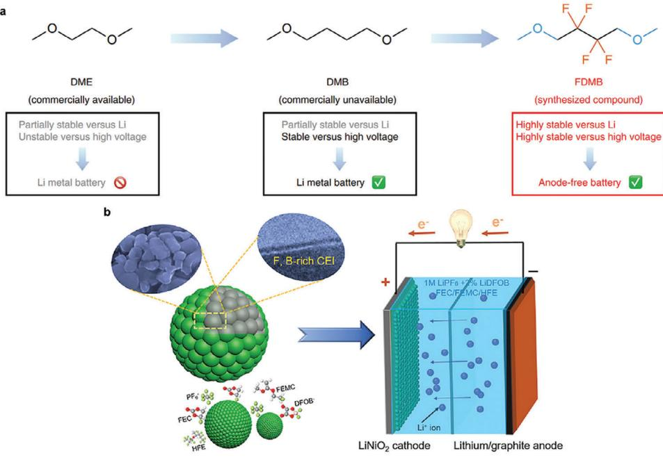

**Figure 10.** Design concepts of fluorinated electrolytes. a) Design approach of fluorinated molecule FDMB. Reproduced with permission.[\[174\]](#page-24-0) Copyright 2020, Springer Nature. b) The F- and B-rich CEI formed by a full-fluoride electrolyte on cobalt-free LNO. Reproduced with permission.[\[182\]](#page-24-0) Copyright 2019, Elsevier.

The decomposition reactions of electrolyte components at the cathode surface can also be investigated through computational calculations. Xu et al.[\[168\]](#page-24-0) used DFT calculations to study the decomposition process of EC on the surface of NMC. The simulation results indicated that the open-circuit reaction of EC on the cathode surface occurred rapidly, and was independent of the cathode voltage. Similarly, Okuno et al.[\[169\]](#page-24-0) simulated the possible decomposition reaction pathways of EC on the surface of LNMO. The results revealed that the pristine LNMO (100) surface exhibited low reactivity toward EC decomposition. However, during the delithiation process, the bidentate oxygen atoms formed on the LMNO surface acted as active sites, initiating nucleophilic attacks on the carbonyl carbon and methylene groups of EC molecules, leading to their decomposition.

# **4. Electrolyte Regulation and Surface Modification for Constructing Robust CEIs**

### **4.1. Fluorinated Electrolytes**

Ether-based electrolytes exhibit better cathodic stability compared to carbonate-based electrolytes.[\[170\]](#page-24-0) However, they are difficult to work at the high-voltage cathode due to their oxidation stability being lower than 4.0 V. To achieve higher energy density of LMB devices, it is necessary to design ether-based electrolytes with high anodic stability. The use of fluorinated salts, solvents, and additives has become a common strategy. Moreover, fluorinated components in the electrolyte are expected to decompose at the cathode surface at a high cutoff voltage, forming a series of stable fluorides such as LiF and fluorinated organic compounds, thereby forming a robust protective CEI.[\[171\]](#page-24-0) LiF, in particular, is a good electronic insulator with excellent anodic stability (6.4 V vs Li+/Li).[\[172\]](#page-24-0) Its compact distribution in the CEI can effectively isolate the cathode from the bulk electrolyte and reduce electron tunneling after reaching a critical thickness. In addition, fluorinated electrolytes also offer advantages such as high oxidative stability, favorable interface composition and kinetics, good thermal stability, and good flame retardancy. Here, we will primarily focus on the application of fluorinated solvents.

The number and location of fluorine in the molecules needs to be considered as these parameters have varying degrees of impact on the ability of solvents to dissociate salts.[\[173\]](#page-24-0) Furthermore, unreasonable designs may decrease the ionic conductivity of fluorinated electrolytes, leading to a decline in the rate capability. Yu et al.[\[174\]](#page-24-0) introduced ─CF2─ groups into the carbon framework of DME, which elongated the carbon chain and introduced fluorine to enhance the inertness of DME. The obtained fluorinated 1,4-dimethoxylbutane (FDMB) molecule exhibited increased resistance to oxidation (oxidation potential *>*6 V) while maintaining good ionic conductivity (**Figure 10**a). The FDMB-based electrolyte achieved the stable cycling of hundreds of mAh Cu||NMC532 pouch cells for 100 cycles with 80% capacity retention. Similarly, Zhao et al.[\[175,176\]](#page-24-0) introduced ─CF3 groups into the carbon frameworks of DME and DOL to obtain 1,1,1-trifluoro-2,3-dimethoxypropane (TFDMP) and 4-(trifluoromethyl)1,3-dioxolane (TFDOL) molecules, respectively. The oxidation potential of TFDMP-based electrolytes and TFDOL-based electrolytes increased to more than 4.8 V. Yu et al.[\[177\]](#page-24-0) found that partially fluorinated ─CHF2 groups are more suitable choices for ether solvent molecules compared to fully fluorinated ─CF3 groups. By introducing ─CHF2 groups on both sides of 1,2-diethoxyethane (DEE) molecules, a family of fluorinated-1,2-diethoxyethane (including F4DEE and F5DEE) was obtained. The 1.2 m LiFSI-F4DEE or F5DEE electrolytes formed a robust CEI that inhibited the cracking of NMC811. Further tailoring the fluorination degree to synthesize monofluoroether solvents, 1,2-bis(2-fluoroethoxy) ethane (FDEE) and bis(2 fluoroethyl) ethers (BFE), which contain ─CH2F group. Compared to ─CHF2 and ─CF3 groups, the interaction between ─CH2F and Li ions (Li+) was stronger, enabling fast Li+ transport and maximizing the ionic conductivity of fluorinated electrolytes while maintaining high oxidation stability. In addition, monofluoro electrolytes promoted the formation of a thin and uniform LiF-rich CEI on high-voltage NMC cathodes, ensuring fast interface kinetics and providing reliability under wide temperature, high-rate, and high-voltage operation conditions.[\[178,179\]](#page-24-0) Highly fluorinated solvents, such as TTE, can be regarded as diluents in the electrolyte. The roles of the diluent in the electrolyte will be further discussed in Section 4.2.

Although traditional carbonate electrolytes (1 m LiPF6 in a mixture of cyclic carbonates and linear carbonates) have achieved great commercial success in LIBs, they still face thermodynamic instability issues above 4.3 V, making them incompatible with advanced cathodes such as Li-rich Mn-based layered oxides (LMLOs). Fan et al.[\[180\]](#page-24-0) designed a fully fluorinated flame-retardant carbonate-based electrolyte (1 m LiPF6 FEC: 3,3,3-fluoroethylmethyl carbonate (FEMC):HFE, 2:6:2 by weight), which effectively suppressed the dissolution of TMs and hindered the oxidation of the electrolyte by constructing highly fluorinated interface. As a result, this electrolyte supported longterm cycling of NMC811 (Coulombic efficiency of ≈99.93%, 450 cycles, 4.4 V) and LiCoPO4 (Coulombic efficiency of ≈99.81%, 1000 cycles, 5.0 V) in Li metal pouch cells. Through accelerating rate calorimetry (ARC) and operando synchrotron high-energy X-ray diffraction (HEXRD) testing, it was demonstrated that the LiF-rich interface formed by this electrolyte improved the thermal stability at both material and pouch cell levels.[\[181\]](#page-24-0) Deng et al.[\[182\]](#page-24-0) added LiDFOB additive to this electrolyte. The F- and B-rich CEI enabled cobalt-free LNO to maintain over 80% capacity retention after 400 cycles at 4.4 V, reducing Ni dissolution and suppressing the structural transformation (Figure [10b\)](#page-13-0).

By introducing fluorine, the charge distribution and solvent polarity can be altered, thereby influencing the coordination state between solvents and Li+. It can change the micro-solvation structures of Li+, thereby affecting the formation of the interface. Mao et al.[\[183\]](#page-24-0) proposed a fluorinated linear carboxylic ester, ethyl 3,3,3-trifluoropropanoate (FEP). By precisely controlling the solvation structure, more anions are aggregated in the inner Helmholtz plane (IHP). As a result, the anions were preferentially decomposed rather than the solvents, resulting in an inorganic-rich CEI and preventing decomposition of the solvents. Moreover, the CEI also inhibited the side reactions between electrode and electrolyte, reduced the cracks in NMC secondary particles, and the dissolution of TMs. Both LCO and NCM811 exhibited stable cycling performance over 100 cycles with minimal voltage decay.

While fluorinated solvents have significant potential in improving the performance of LMBs, they also present certain drawbacks and challenges. For instance, fluorinated solvents tend to be expensive, have high density, and pose safety concerns. Therefore, the benefits and potential risks associated with the use of fluorinated solvents need to be carefully weighed.[\[184\]](#page-25-0) In the Li battery systems, fluorine chemistry is a widely researched topic, including fluorinated Li salts, fluorinated solvents, fluorinated additives, and so on. For more detailed information on fluorine chemistry in the electrolyte, it is recommended to refer to other reviews for a more comprehensive understanding.[\[185–187\]](#page-25-0)

# **4.2. Concentrated Electrolytes**

In order to achieve higher energy density, LMBs have regained researchers' attention. However, commonly used lowconcentration electrolytes contain a large number of free solvent molecules, which can easily undergo oxidation–reduction reactions at interfaces. To address these issues, the strategy of highconcentration electrolytes (HCEs) has been proposed. HCEs reduce the content of active solvents, thereby minimizing interfacial side reactions. Increasing the amount of Li salt leads to the formation of a first Li+ solvation sheath dominated by anions.[\[188\]](#page-25-0) A large accumulation of anions at the cathode/electrolyte interface results in the formation of inorganic-rich CEI derived from anion decomposition, thus enabling high reversibility and stable cycling of the battery devices. Liu et al.[\[69\]](#page-22-0) discovered that increasing the concentration of LiPF6 in the conventional carbonatebased electrolyte to 3 m resulted in a uniform and robust LiFrich CEI. This is in stark contrast to the heterogeneous and fragile organic-rich CEI formed in the dilute electrolyte (**Figure [11](#page-15-0)**a). The LiF-rich CEI not only effectively suppressed the dissolution of TMs but also stabilized the cathode structure. Fan et al.[\[189\]](#page-25-0) further enhanced the stability of the carbonate-based electrolyte by raising the LiFSI salt concentration to 10 m, resulting in a high F-rich interface. This F-rich interface exhibited oxidation resistance at a high cutoff voltage of 4.6 V, enabling stable cycling of Li||NMC622 batteries for 100 cycles with 80% capacity retention.

Ether-based electrolytes offer improved stability on the LMA compared to carbonate-based electrolytes, effectively mitigating the challenges associated with LMAs. However, ethers generally exhibit low oxidation stability and are unsuitable for high-voltage cathodes, leading to severe oxidative side reactions at the interface and hindering the realization of high-energy, high-voltage LMBs. Jiao et al.[\[190\]](#page-25-0) employed a dual-salt combination consisting of LiTFSI and LiDFOB in a 4 m concentration DME-based electrolyte. This effectively passivated the catalytic surfaces of NMC111 at a high voltage of 4.3 V, reducing the oxidative side reactions of DME. Moreover, unlike the poor thermal stability and sensitivity to moisture exhibited by LiPF6, the high concentration of LiTFSI was found to suppress aluminum current collector corrosion. The synergistic effect of LiTFSI and LiDFOB facilitated the formation of a thin (4 nm) and LiF-rich CEI (Figure [11b\)](#page-15-0), overcoming the limitations of ether-based electrolytes in achieving stability at high-voltage cathodes.[\[191\]](#page-25-0) Ren et al.[\[104\]](#page-23-0) further improved the high-voltage stability of the electrolyte by using a single salt electrolyte formulation (4 m LiFSI-DME). STEM and high-resolution transmission electron microscopy (HRTEM) revealed that the CEI thickness of NMC111 was only 4–9 nm after 50 cycles at 4.5 V, with an increased abundance of LiF. This confirmed that the electrolyte effectively minimized adverse side reactions, and the thin CEI formed in this electrolyte provided effective protection for NMC111.

However, the utilization of HCEs presents certain drawbacks, including high cost due to the extensive use of Li salts and high

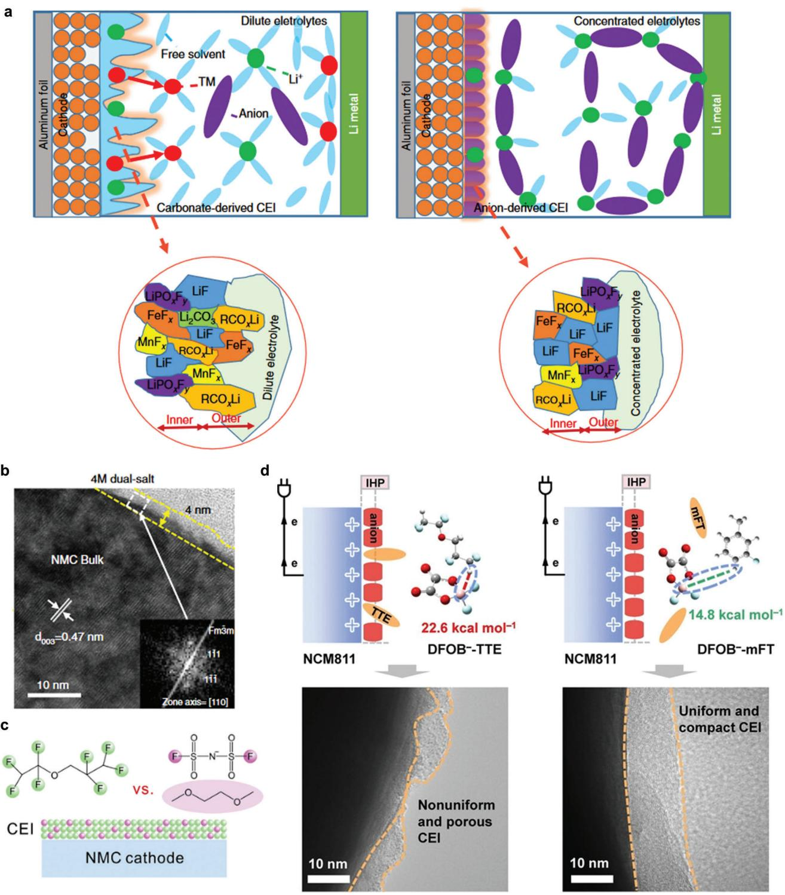

**Figure 11.** Influence of Li+ solvation structures on CEI formation in HCEs or LHCEs. a) Li+ solvation structures and corresponding CEI formation in dilute and concentrated electrolytes. Reproduced with permission.[\[69\]](#page-22-0) Copyright 2020, Springer Nature. b) TEM image of NMC811 cycled in the dualsalt concentrated electrolyte. Reproduced with permission.[\[191\]](#page-25-0) Copyright 2018, Springer Nature. c) Formation mechanism of TTE-derived CEI in LHCE. Reproduced with permission.[\[194\]](#page-25-0) Copyright 2019, Elsevier. d) Impact of the strength of anion-diluent interactions on the cathode's IHP structure and CEI formation in LHCE, along with corresponding HRTEM images of cycled NMC811. Reproduced with permission.[\[201\]](#page-25-0) Copyright 2023, Wiley-VCH GmbH.

viscosity that hampers ion diffusion in the electrolyte.[\[192\]](#page-25-0) Researchers have introduced co-solvents, known as diluents, into HCEs to reduce costs and enhance ion conductivity. Diluents are typically considered unable to dissolve Li salts and do not participate in the Li+ solvation sheath, thus preserving the advantages of HCEs. This type of electrolyte is referred to as localized high-concentration electrolytes (LHCEs). The ratio of salt– solvent–diluent is crucial as it greatly influences the oxidation stability of the electrolyte. This behavior is attributed to the solvation structure of Li+/anion pairs in the electrolyte.[\[111,193\]](#page-23-0) Ren et al.[\[194\]](#page-25-0) suggested that TTE was not truly inert but significantly contributed to the formation of the CEI as shown in Figure [11c](#page-15-0) based on the characterization of XPS and TOF-SIMS. In HCEs, the decomposition of FSI− is believed to be driven by intermediates of DME. However, the presence of TTE inhibits the oxidative decomposition of DME, leading to a reduction in corrosive acidic byproducts. Moreover, most studies have employed a salt–solvent–diluent ratio of 1:1.2:3 (mole ratio) to design LHCEs. However, this design approach overlooks the varying solubility of Li salts in different solvents and the necessity of localized saturation for electrolyte stability.[\[111,195\]](#page-23-0) Additionally, the influence of different diluents on the micro-solvation structure has been neglected. With the growing realization that traditional HFE diluents can participate in interfacial reactions, it is important to re-evaluate the impact of diluents on the Li+ coordination structure.[\[152,196\]](#page-24-0) Cui et al.[\[197\]](#page-25-0) finely adjusted the mole ratio of LiFSI:DME:TTE to 1:9:27 (mole ratio). A lower amount of LiFSI reduced the interactions between Li+ and the solvent molecules. The hydrogen bond between CF2-H(TTE) and O(DME) anchored the DME molecule and limited the interfacial reactivity of the free DME molecule. HRTEM showed that with decreased salt concentration, the molecular anchoring diluent electrolyte (MADE) had the thinnest CEI and a smooth cathode surface even after 50 cycles. It maintained 88.5% capacity retention for 100 cycles in Li||NMC811 cells.

The Li+ desolvation at the cathode/electrolyte interface is one of the kinetic barriers. During the desolvation process, solvent molecules are released and continue to decompose, which reduces the cathodic stability of the electrolyte. These adverse effects can be reduced by choosing appropriate diluents. Zhang et al.[\[198\]](#page-25-0) designed a bipolar solvent molecule, 1,1,2,2,3,3,4,4 octafluoro-5-methoxypentane (OFE), with an ion-dissociative polar head and a highly fluorinated nonpolar tail. OFE molecules competitively dissociated Li+ through weak coordination interactions, reducing the decomposition of free solvent molecules on the cathode during desolvation. The thin CEI (1–2 nm) rich in LiF formed by the decomposition of FSI− and OFE reduced side reactions at the high-voltage cathode interface. The authors demonstrated that this competitive solvation electrolyte could stabilize high-voltage LMB effectively. Recently, Efaw et al.[\[199\]](#page-25-0) revealed a unique micelle-like structure in the LiFSI/DME/tris(2,2,2 trifluoroethyl) orthoformate (TFEO)-LHCE, where the solvent acted as a surfactant between the diluent and the salt. This micellar structure led to an increased formation of more coordinated ion-pair aggregates (AGG+) at the center of the salt–solvent clusters, enhancing the binding between anions and cations and thus forming a more stable interface. Wu et al.[\[200\]](#page-25-0) studied the influence of different diluents on the Li+ solvation structure using LiFSI/DME/diluent systems. They defined the interaction between anions and diluents by the positive maximum of the electrostatic potential energy (*Emax*) to predict the highvoltage performance of different diluent-LHCEs. The interaction between 2H,3H-decafluoropentane (HFC), and FSI− was minimal, resulting in a relatively stable Li+ coordination structure and better oxidative stability compared to conventional diluent-LHCEs. Such HFC-LHCE enabled excellent cycling performance of 4.4 V Li||NMC811 cells with capacity retention *>*80% after 800 cycles. Fang et al.[\[201\]](#page-25-0) suggested that the interaction between anion-diluent in the IHP affected the formation of CEI. Through DFT calculations, they found that the binding energy between m-fluorotoluene (mFT) and FSI− was lower than that between TTE and FSI−. The Li+ solvation structure of mFT-LHCE had a higher proportion of anions in the IHP, forming a stable CEI rich in inorganic components, which significantly suppressed the adverse reactions of the high-voltage cathode during cycling (Figure [11d\)](#page-15-0).

Most of diluents have disadvantages such as high cost, high density, and high viscosity. Xie and co-workers reported fluorobenzene (FB) and its derivatives (1,3,5-trifluorobenzene) as novel diluents.[\[202–205\]](#page-25-0) FB-based LHCEs showed superiority in terms of cost, density, viscosity, ionic conductivity, and wettability.[\[206\]](#page-25-0)

Furthermore, some solvents such as phosphates, nitriles, and sulfones exhibit good oxidative stability due to their lower HOMO and LUMO levels. However, they show strong reactivity toward LMAs and SEI. Through the electrolyte design strategies of HCEs or LHCEs, these reactive solvents can be effectively utilized in high-voltage LMB devices.[\[207–212\]](#page-25-0)

# **4.3. High-Entropy Electrolytes**

An ideal CEI should possess several key properties: 1) chemically and electrochemically stable, 2) high ionic conductivity, 3) electronic insulation, and 4) good interface contact and ion transfer between the cathode and electrolyte.[\[213\]](#page-25-0) However, no single Li salt, solvent, or additive forms a CEI that simultaneously meets all these requirements. High-entropy electrolytes (HEEs) have emerged as a promising solution. By combining multiple Li salts, solvents, and additives in the electrolyte, a wider range of performance advantages can be achieved to meet the demands of an ideal CEI. The addition of multiple electrolyte components increases the entropy and decreases the Gibbs free energy of the electrolyte system. Consequently, the liquid-phase temperature, stability, and ionic conductivity of the electrolyte are all improved.[\[214\]](#page-25-0) It should be noted that the definition of entropy in HEEs is still ambiguous.[\[113,215\]](#page-23-0) In thermodynamics, entropy is a physical quantity that describes the disorder or randomness of a system. It is a key concept in the second law of thermodynamics, representing the increase in the system's energy during irreversible processes. Entropy is typically associated with the state and energy distribution of a system. However, the concept of "high entropy" in HEEs is not entirely identical to the thermodynamic concept of entropy. HEEs refer to electrolyte solutions composed of multiple components, where the molar ratios of the components are relatively uniform, without a clearly dominant component. This mixed electrolyte exhibits a highly homogeneous composition, providing the battery with broader

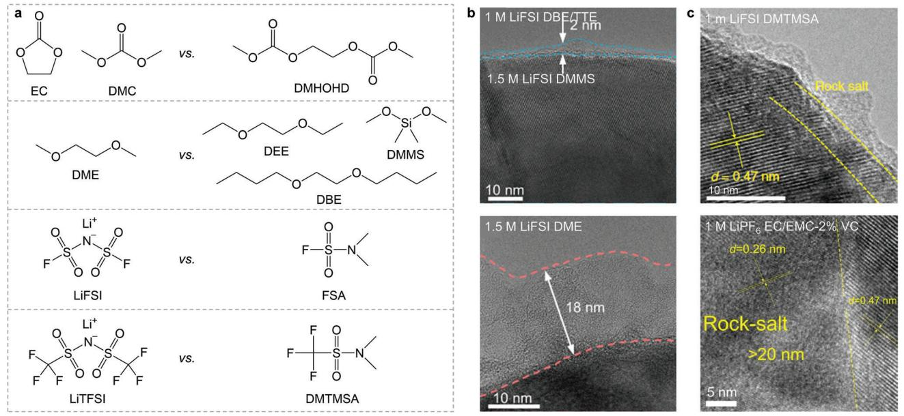

**Figure 12.** Characterization of CEIs formed in novel electrolytes. a) Molecular structures of novel solvents compared to commonly used solvents/salts. b) HRTEM images of NMC811 cycled in DMMS-based electrolyte, DME-based electrolyte, c) DMTMSA-based electrolyte, and carbonate-based electrolyte. Reproduced with permission.[\[222\]](#page-25-0) Copyright 2022, Royal Society of Chemistry. Reproduced with permission.[\[225\]](#page-25-0) Copyright 2021, Springer Nature.

chemical and electrochemical stability and improving its performance and cycle life.

HEEs facilitate Li+ diffusion by modulating the microsolvation structure, which is particularly advantageous at low temperatures.[\[216\]](#page-25-0) Wang et al.[\[112\]](#page-23-0) reported a HEE with multi-salts (0.15 m LiFSI+0.15 m LiTFSI+0.15 m LiDFOB+0.15 m LiNO3 in DME). The presence of multiple anionic groups in the electrolyte led to diverse solvation structures, reducing the solvation intensity between Li+ and solvents/anions, thereby promoting Li+ diffusion and the formation of a stable CEI. Even at a total Li salt concentration of 0.6 m, this HEE demonstrated stable cycling for 100 cycles (capacity retention *>*90%) in Li||NMC811 cells at 4.3 V. Kim et al.[\[217\]](#page-25-0) reported an HEE that consists of three solvents and two co-solvents (1 m LiFSI in DME/DEE/diethylene glycol dimethyl ether (DEGDME)/TTE/bis(2,2,2-trifluoroethyl) ether (BTFE) = 2:1:1:16:16 by volume). The diversity of solvent molecules formed a unique Li+ microsolvation structure. The small-sized clusters in the HEE improved the ionic conductivity and fast-charging capabilities. The F-rich CEI reduced cathode particle cracking during cycling. This HEE enabled stable cycling at 2 C (6.2 mA cm−2) in anode-free Cu||NMC622 pouch cells at 4.4 V. The strategy of HEEs has brought new possibilities and challenges, opening up new directions for achieving high performance, high stability, and high safety in LMBs.

#### **4.4. Novel Solvent-Based Electrolytes**

The carbon-oxygen double bond in carbonates and the carbon– oxygen bond in ethers exhibit strong coordination with Li+. However, the carbon–oxygen double bond is prone to reduction, forming Li2CO3 and other organic compounds, while the carbon– oxygen bond is relatively weaker and more prone to breakage, leading to oxidative reactions. These problems can be overcome by the rational design of the solvent structure. For example, substituting hydrogen atoms with the fluorine group, sulfone group, or elongating the carbon chain can be employed.[\[218,219\]](#page-25-0) These structural modifications enhance the stability of the solvents, alter the Li+ solvation structure, and reduce the occurrence of electrode–electrolyte side reactions. Molecular structures of novel solvents and commonly used solvents/salts are shown in **Figure 12**a. Zhang et al.[\[220\]](#page-25-0) designed a novel carbonate molecule, dimethyl 2,5-dioxahexanedioate (DMDOHD). Due to the two carbonyl groups, DMDOHD exhibited higher polarity and solubility, enabling the stabilization of LNMO at 5 V. The unique chemical structure of DMDOHD weakened its interaction with Li+, effectively promoting the formation of an anion-derived interface and limiting side reactions at the high-voltage cathode interface. Chen et al.[\[221\]](#page-25-0) substituted the methoxy groups on DME with larger ethoxy groups to obtain DEE. The elongated carbon chain created steric hindrance, weakening the coordination interaction between DEE and Li+ while enhancing oxidation stability. 4 m LiFSI-DEE achieved 182 cycles until 80% capacity retention in Li||NMC811 cells at 4.4 V, whereas 4 m LiFSI-DME only achieved 94 cycles. Wang et al.[\[107\]](#page-23-0) discovered that replacing the terminal methyl groups with *n*-butyl groups in glycol diethers resulted in ethylene glycol diethyl ether (EGEE)-based electrolytes, which not only improved comprehensive stability but also formed an inorganic-rich CEI with only 1.5 nm thin (Figure [6c\)](#page-8-0), alleviating surface phase transition and structural degradation of NMC811, leading to stable cycling of high-voltage Li||NMC811 cells.

Carbon and silicon both belong to the group-IV elements, with silicon having a lower electronegativity than carbon. Silicon possesses vacant 3d orbitals, which can accept lone pairs from neighboring atoms through conjugation. Huang et al.[\[222\]](#page-25-0) discovered that the Si─O bond had higher bond energy than the C─O bond. By replacing the C─O bond in ether with the Si─O bond, siloxane could exhibit better redox stability than ether. The authors investigated a series of siloxane solvents, including tetraethyl orthosilicate (TEOS), methyltriethoxysilane (MTES), dimethyldiethoxysilane (DMES), and dimethyldimethoxysilane (DMMS). By comparing the electrostatic potential minima (EPM) among these siloxane solvents and commonly used ether solvents and carbonate solvents, it was found that siloxane-based electrolytes reduced the desolvation energy of Li+, and improved the interfacial kinetics and oxidation stability. As a result, the interfacial side reaction was reduced and the CEI was only 2 nm thin (Figure [12b\)](#page-17-0). Such electrolytes demonstrated stable cycling for 350 cycles in Li||NMC811 cells, with 80% capacity retention at 4.3 V. Researchers proposed a series of silicon-based electrolytes, which aimed to provide excellent battery cycling performance at high voltages similar to fluorine-based electrolytes while reducing negative environmental impacts and offering better economic feasibility.[\[71,167,223,224\]](#page-23-0)

The solvation structure dominated by FSI− or TFSI− inhibits solvent decomposition and promotes the formation of an inorganic-rich interface. Inspired by this concept, Xue et al.[\[225,226\]](#page-25-0) sought and identified neutral solvent molecules, *N*,*N*-dimethylsulfamoyl fluoride (FSA) and *N*,*N*dimethyltrifluoromethane-sulfonamide (DMTMSA), containing the fluorosulfonyl groups similar to FSI− and TFSI−. These solvents are liquid at room temperature and capable of dissolving a sufficient amount of Li salt. The FSA-based and DMTMSA-based electrolytes exhibited wide electrochemical stability windows, so the interface side reactions were reduced (Figure [12c\)](#page-17-0). They enabled stable cycling of Li||NMC811 cells at high cutoff voltages of 4.5 and 4.7 V, respectively. These solvents with unique structures enhanced the oxidative stability of the electrolytes, leading to the formation of Li+ solvation structures primarily dominated by the anions and the formation of robust CEIs. This provides a new approach to the design of novel electrolytes.

## **4.5. Novel Lithium Salts Based Electrolytes**

In previous studies, strategies for constructing stable CEIs have primarily focused on investigating solvent oxidation and decomposition mechanisms, as well as designing novel solvent molecules. However, the role of Li salts has received relatively less attention, despite evidence demonstrating their significant influence on the CEI stability and performance. Commonly used Li salts, such as LiPF6, are prone to P─F bond breakage and the formation of hydrofluoric acid (HF) under high temperature and voltage conditions, resulting in CEI and cathode surface corrosion. To address these issues, Li et al.[\[227\]](#page-25-0) substituted the vulnerable P─F bonds with more stable C─F bonds and introduced aluminum atoms into the anion center, enabling the in situ formation of an aluminum-rich CEI that enhanced cathode interface structural stability. This approach achieved stable cycling of 4.3 V Li||LCO batteries for 150 cycles with a capacity retention of 95.5%. Furthermore, Chen et al.[\[228\]](#page-25-0) replaced the aluminum center in the anion with a boron center, which tended to form a fast ion-conductive interface. They designed and synthesized a novel lithium salt called lithium perfluoropinacolatoborate (LiFPB). Compared to LiPF6-based electrolytes, the LiFPB- based electrolyte exhibited superior high-voltage cycling stability (4.5 V Li||LCO) due to the formation of an organic–inorganic composite CEI induced by LiFPB. This CEI layer was advantageous for improving cathode structural stability and cycle performance. Although research on the design and application of new Li salts is limited, their role in addressing the stability of highvoltage CEI in LMBs cannot be overlooked. Considering the economic benefits, the development and application of new Li salts are urgently needed.

# **4.6. Electrolyte Additives**

The addition of functional additives into electrolytes can effectively form a robust CEI, which can address safety concerns with high-voltage cathodes. This simple strategy not only brings significant economic benefits but also positively impacts the long-term performance of the battery. Most functional additives can be broadly classified into two categories: film-forming additives and scavenging additives. Film-forming additives can facilitate the in situ formation of a functional CEI with specific components. Scavenging additives capture detrimental species in the system, such as H2O, HF, and reactive oxygen species, thereby suppressing adverse chemical reactions or enhancing the electrochemical stability of the electrolyte to protect the CEI. Commonly used additives include boron-containing additives,[\[229–231\]](#page-25-0) fluorine-containing additives,[\[232\]](#page-25-0) phosphorus-containing additives,[\[233\]](#page-25-0) unsaturated carbonate additives,[\[234\]](#page-25-0) sulfur-containing additives,[\[235\]](#page-25-0) nitrogencontaining additives,[\[38,236\]](#page-22-0) silicon-containing additives,[\[146,237\]](#page-24-0) and so on. When adding additives to the electrolyte, it's important to note that some may negatively impact the LMA and SEI, requiring careful control of their concentration in the electrolyte. Moreover, the same additive may have different effects in various cathode systems.[\[233,236,238,239\]](#page-25-0) Therefore, it's crucial to evaluate the specific performance of each additive in its intended application.

Film-forming additives typically have lower oxidation potentials than the bulk electrolyte, allowing them to preferentially decompose at the interface to form a stable CEI. Liang et al.[\[240\]](#page-26-0) utilized LiDFOB to in situ construct an amorphous CEI with ion-conductive LixBOyFz as the major component (**Figure [13](#page-19-0)**a). The amorphous CEI provided good chemical compatibility between high-voltage NMC and the electrolyte, reducing interface side reactions. COMSOL Multiphysics concentration field simulation revealed that this amorphous CEI significantly reduced interface polarization and improved kinetics. Wu et al.[\[123\]](#page-23-0) reported a fluorine and boron-containing additive, 2,4,6-tris(3,4,5 trifluorophenyl)boroxin (TTFPB). The strong interaction between TTFPB and PF6 − caused TTFPB to preferentially enter the first shell structure and decompose at a low oxidation potential to form a LiBxOy/LiF-rich CEI. Such the CEI enabled stable cycling of Li||LCO cells at a high cutoff voltage of 4.6 V for 100 cycles with capacity retention of 73.6% at 70 °C. Zhao et al.[\[241\]](#page-26-0) employed 1,3,6-hexanetricarbonitrile (HTCN) and tris(trimethylsilyl)phosphate (TMSP) as binary additives and proposed an in situ "anchoring and pouring" mechanism. HTCN molecules with three nitrile groups tightly anchored on the surface of LRLO to form a framework, while TMSP acted as

**Figure 13.** Working mechanisms of certain additives for constructing robust CEIs. a) The schematic diagram of amorphous CEI formation with LiDFOB additive. Reproduced with permission.[\[240\]](#page-26-0) Copyright 2020, Wiley-VCH GmbH. b) The "anchoring and pouring" mechanism of HTCN and TMSP to form the CEI. Reproduced with permission.[\[241\]](#page-26-0) Copyright 2020, Wiley-VCH GmbH. c) The CEI formation mechanism with/without LiHMDS additive in Li||NMC811 cells. Reproduced with permission.[\[102\]](#page-23-0) Copyright 2022, Springer Nature. d) Schematic illustration of conventional EDL and adaptive and passivated EDL. Reproduced with permission.[\[243\]](#page-26-0) Copyright 2022, Springer Nature.

an oxidizing sacrificial agent to shape the CEI at high voltage (Figure [13b\)](#page-19-0). Their synergistic effect effectively suppressed TMs dissolution and significantly improved the electrochemical performance of high-voltage LRLO.

The irreversible side reactions between LiPF6 and its initial decomposition product PF5 and trace amounts of water in the electrolyte result in the generation of HF.[\[228\]](#page-25-0) HF can corrode the cathode surface, particularly NRLOs and LRLOs, leading to unnecessary dissolution of TMs and damage to the CEI. Therefore, the addition of scavenging additives to remove impurities and byproducts such as PF5, H2O, and HF can stabilize the CEI.[\[242\]](#page-26-0) Zhang et al.[\[102\]](#page-23-0) reported the use of lithium hexamethyldisilazide (LiHMDS) as an electrolyte additive. LiHMDS acted as an HF and H2O scavenger and promoted the formation of a chemically and electrochemically robust CEI. After adding 1000 ppm H2O to the baseline electrolyte, the authors found that there were two peaks corresponding to PO2F2 − and HF in the 19F NMR spectra. However, when 0.6 wt.% LiHMDS was added, the peaks for PO2F2 − and HF disappeared, indicating that H2O was more likely to react with LiHMDS than with PF6 −. Operando XRD characterization revealed that the CEI derived from LiHMDS successfully suppressed the transition of the NMC811 surface from a layered structure to a rock salt phase (Figure [13c\)](#page-19-0). Particularly, LRLO experiences irreversible oxygen loss and severe accumulation of reactive oxygen species at high SOC due to its inherent characteristics, which are often overlooked in conventional CEI designs. Zhang et al.[\[141\]](#page-24-0) introduced 2 wt.% LiBOB as a boroncontaining additive. The synergistic effect between LiBOB and LiPF6 resulted in the sustained release of LiDFOB and eliminated superoxol species and harmful HF. Furthermore, LiBOB was found to form long-chain crosslinked polymer precursors that adhered to the cathode surface, enhancing protective effects that cannot be achieved by directly adding LiDFOB additives. Li-BOB achieved a triple benefit of superoxol anion elimination, HF elimination, and the construction of a uniform and dense CEI, improving the cycling stability of LRLO.

In addition to film-forming additives and scavenging additives, there are other additives that serve specific purposes, such as LiNO3, which can effectively regulate the electrochemical stability of the EDL. Zhang et al.[\[243\]](#page-26-0) formed an adaptive and passivating EDL on the surface of the high-voltage cathode (4.3 V-NMC811) by adding 0.3 m LiNO3 into 1 m LiFSI-DME electrolyte. Unlike the traditional EDL, this Li+-rich EDL exhibited strong coordination between Li+ and free solvents during charging, effectively preventing the decomposition of the bulk solvents (Figure [13d\)](#page-19-0).

The addition of additives in conventional carbonate-based electrolytes has been validated as an effective way to construct a stable CEI in response to the challenges posed by high-voltage cathodes. This way does not require any changes to existing factory infrastructure and is still considered one of the most economical and efficient ways.

As shown in **Table 2**, we have provided a concise summary of the roles of common components in the CEI for enhancing the electrochemical performance of high-voltage cathodes in LMBs. However, further research is needed to gain a deeper understanding of the mechanistic roles played by different components within the CEI. By conducting in-depth investigations into these different components, we can gain better insights into **Table 2.** The roles of common components in the CEI in enhancing the electrochemical performance of high-voltage cathodes in LMBs.

| Species                           | Roles                                                             | Reference |
|-----------------------------------|-------------------------------------------------------------------|-----------|
| Fluorine-containing species    | Accommodate volume change of the cathode                       | [229]     |
|                                   | Suppress the structural collapse and microcrack of the cathode | [122]     |
|                                   | Inhibit interfacial side reactions                                | [229]     |
|                                   | High-voltage resistant                                            | [180,189] |
|                                   | Fast Li+ transport                                                | [178,179] |
| Boron-containing                  | Inhibit TMs dissolution                                           | [244]     |
| species                           | Inhibit interfacial side reactions                                | [230,245] |
| Sulfone-containing species     | High-voltage resistant                                            | [125]     |
| Nitrogen-containing species    | Fast Li+ transport                                                | [246]     |
| Phosphorous-containing species | Inhibit TMs dissolution                                           | [247]     |

their contributions to the CEI's structure and stability. Subsequently, we can develop corresponding strategies to enhance the performance and stability of the CEI, thereby providing crucial guidance and solutions to address CEI-related issues under highvoltage conditions.

# **4.7. Interfacial Modification**

To address the challenges of the cathode under high voltage, the cathode interface can be modified in various ways. One approach is to introduce protective coatings, such as oxides. These coatings act as additional barrier layers, preventing impurities and moisture in the electrolyte from infiltrating the cathode.[\[248\]](#page-26-0) Another approach is to add specific additives, such as metal ions or stabilizers, in the synthesis process to modify the structure and chemical properties of the cathode material, thereby improving its resistance to high voltage.[\[249,250\]](#page-26-0) These modification methods can enhance the stability of the cathode material, suppress undesired side reactions, and improve the cycling performance of the battery.

Due to the complex reactions between the cathode and the electrolyte, it is challenging to precisely control the composition of the CEI by designing the electrolyte formulation. The construction of artificial CEI by physical or chemical methods offers a higher specific protective function. Li et al.[\[251\]](#page-26-0) employed the atomic layer deposition (ALD) method to introduce a robust Al2O3 layer on the surface of LNMO. The Al2O3 layer reacted with HF to form stable Al–F and Al–O–F compounds that prevented further erosion. EC in the electrolyte, rather than PF6 −, exhibits stronger coordination with Co4+ on the delithiated LCO surface, resulting in an organic-dominated CEI. Liu et al.[\[117\]](#page-23-0) coated the LCO surface with a spinel Li4Mn5O12 layer. This coating modified the anion content in the IHL, thereby enabling the formation of a F-rich CEI. Zhao et al.[\[252\]](#page-26-0) constructed an epitaxial entropyassisted coating layer on the surface of LiNi0.9Co0.05Mn0.05O2 (Ni90). During high-temperature annealing, some Ni, Co, and Mn from Ni90 diffused to react with the precursor of the oxide coating (ZrO2, Nb12WO33), forming an epitaxial layer. This epitaxial layer contained multiple elements, increasing the entropy of the system. This unique coating effectively enhanced the structural stability of the Ni90 under extreme operating conditions, while its higher ion conductivity ensured the dynamic transport of Li+.

Doping with elements can address the issue of microcracks in cathode material caused by structural instability.[\[253\]](#page-26-0) This can reduce electrolyte penetration and suppress adverse interfacial side reactions. Additionally, doping elements may also alter the interaction between the cathode and electrolyte, thereby influencing the formation and stability of the CEI.[\[254\]](#page-26-0) Ou et al.[\[7\]](#page-22-0) conducted Al/Zr co-doping on single-crystal NMC. Based on the results of 3D spatial distribution, the doped Al ions were well incorporated into the lattice of the NMC, while the low solubility Zr ions accumulated on the surface of the NMC. This synergistic effect of Al and Zr not only inhibited Li/Ni cation mixing but also significantly improved the structural stability and electrochemical performance of the NMC. Specifically, the aggregation of Zr on the surface of the doped cathode could mitigate the side reactions between the cathode and electrolyte by facilitating the formation of a stable CEI.

# **5. Conclusion and Perspective**

The stability and reliability of the CEI in high-voltage LMBs are crucial for battery performance and cycle life. Recent research has made significant progress in understanding the formation mechanisms, composition, and structure of the CEI, as well as the design of novel strategies. In this review, we present basic characterization methods for CEI structure and composition and classify the strategies for constructing robust CEIs. Future directions and explorations for building functional CEIs to achieve excellent high-voltage cathode performances can focus on the following key points:

- 1) Understanding the electrolyte oxidation and cathode surface degradation mechanisms: Electrolyte oxidation and decomposition may lead to the formation of unstable interfacial products. Cathode surface degradation may involve structural damage, oxidation reactions, and TMs dissolution, further contributing to electrolyte decomposition and CEI instability. By deeply studying and comprehending these mechanisms, appropriate measures can be taken to suppress oxidation decomposition and cathode surface degradation, thereby enhancing CEI stability and battery cycle life.
- 2) Understanding the crosstalk between CEI and other battery components such as anode and SEI: There exists a close interaction between battery components such as anode, SEI, and CEI. The anode and SEI can influence CEI formation and stability, while CEI properties and stability can also impact the anode and SEI. Therefore, when studying and designing CEI, it is necessary to consider the characteristics of anode and SEI and ensure that their interaction does not adversely affect CEI stability.
- 3) Development of characterization techniques: In situ characterization techniques, such as in situ electrochemical testing, imaging, and spectroscopy, can provide real-time obser-

vations of CEI formation and evolution without disrupting its structure and composition.

- 4) Application of artificial intelligence (AI) methods to problemsolving and research acceleration: AI has increasingly found applications in battery research. Machine learning and deep learning techniques can analyze and extract patterns and rules from a large volume of experimental data, enabling predictions. High-throughput screening can be used to accelerate material and battery testing processes.
- 5) Designing low-fluorine/fluorine-free electrolytes: Fluorinecontaining electrolytes have drawbacks such as high cost, high density, and environmental hazards. Designing lowfluorine/fluorine-free electrolytes provides alternative solutions with higher safety and sustainability.
- 6) Combination of multiple strategies for constructing a stable CEI: Single strategies often fail to meet the requirements for long-term stability. To construct a stable CEI, it is usually necessary to combine multiple strategies. These strategies may include optimizing electrolyte composition, rational design of surface modifications for the cathode material, and optimizing battery operating conditions. By considering multiple strategies for constructing a stable CEI and integrating them, synergistic effects can be achieved, leading to improved CEI stability and battery performance.

In conclusion, through in-depth research on the formation mechanisms and optimization strategies of CEI, combined with appropriate cathode material selection, electrolyte design, and interface modification, we can further advance battery technology and achieve higher energy density, longer lifespan, and more reliable and safer LMBs.

# **Acknowledgements**

W.L and Z.H. contributed equally to this work. The authors appreciate the financial support of the Natural Science Foundation of China (Grant No. 52225105, 22279127, 52072358, U21A2082, 22309173), the National Key Research and Development Program of China (Grant No. 2022YFA1504102), and the Strategic Priority Research Program of the Chinese Academy of Sciences (Grant No. XDB0450302). S.J. and R.C. also appreciate the financial support from the Hefei Gotion High Tech Co. Ltd.

# **Conflict of Interest**

The authors declare no conflict of interest.

# **Keywords**

cathode–electrolyte interphase, high-voltage cathodes, lithium–metal batteries

> Received: April 20, 2024 Revised: May 21, 2024 Published online: June 10, 2024

[1] M. S. Whittingham, *Chem. Rev.* **2004**, *104*, 4271.

[2] C.-Y. Wang, T. Liu, X.-G. Yang, S. Ge, N. V. Stanley, E. S. Rountree, Y. Leng, B. D. McCarthy, *Nature* **2022**, *611*, 485.

- [3] H. Li, *Joule* **2019**, *3*, 911.
- [4] Y. Jie, C. Tang, Y. Xu, Y. Guo, W. Li, Y. Chen, H. Jia, J. Zhang, M. Yang, R. Cao, Y. Lu, J. Cho, S. Jiao, *Angew. Chem.* **2024**, *136*, 202307802.
- [5] D. Lin, Y. Liu, Y. Cui, *Nat. Nanotechnol.* **2017**, *12*, 194.
- [6] J. Liu, Z. Bao, Y. Cui, E. J. Dufek, J. B. Goodenough, P. Khalifah, Q. Li, B. Y. Liaw, P. Liu, A. Manthiram, Y. S. Meng, V. R. Subramanian, M. F. Toney, V. V. Viswanathan, M. S. Whittingham, J. Xiao, W. Xu, J. Yang, X.-Q. Yang, J.-G. Zhang, *Nat. Energy* **2019**, *4*, 180.
- [7] X. Ou, T. Liu, W. Zhong, X. Fan, X. Guo, X. Huang, L. Cao, J. Hu, B. Zhang, Y. Chu, G. Hu, Z. Lin, M. Dahbi, J. Alami, K. Amine, C. Yang, J. Lu, *Nat. Commun.* **2022**, *13*, 2319.
- [8] Z. Wei, Z. Shi, X. Wen, X. Li, B. Qiu, Q. Gu, J. Sun, Y. Han, H. Luo, H. Guo, Y. Xia, C. Yin, P. Cai, Z. Liu, *Mater. Today Energy* **2022**, *27*, 101039.
- [9] W. Li, E. M. Erickson, A. Manthiram, *Nat. Energy* **2020**, *5*, 26.
- [10] L. Zeng, H. Liang, B. Qiu, Z. Shi, S. Cheng, K. Shi, Q. Liu, Z. Liu, *Adv. Funct. Mater.* **2023**, *33*, 2213260.
- [11] J. Liu, J. Wang, Y. Ni, K. Zhang, F. Cheng, J. Chen, *Mater. Today* **2021**, *43*, 132.
- [12] K. Märker, P. J. Reeves, C. Xu, K. J. Griffith, C. P. Grey, *Chem. Mater.* **2019**, *31*, 2545.
- [13] C. Zhan, T. Wu, J. Lu, K. Amine, *Energy Environ. Sci.* **2018**, *11*, 243.
- [14] A. Manthiram, *Nat. Commun.* **2020**, *11*, 1550.
- [15] P. J. West, C. D. Quilty, Z. Wang, S. N. Ehrlich, L. Ma, C. Jaye, D. A. Fischer, X. Tong, A. M. Kiss, E. S. Takeuchi, A. C. Marschilok, K. J. Takeuchi, D. C. Bock, *J. Phys. Chem. C* **2023**, *127*, 7054.
- [16] C. Zu, H. Yu, H. Li, *InfoMat* **2021**, *3*, 648.
- [17] X.-F. Zang, F. Chen, Y. Jiang, M. Su, R. Deng, T. Li, *J. Power Sources* **2023**, *580*, 233447.
- [18] F. Meng, H. Zhang, X. Xiong, X. Li, R. Wu, Q. Han, B. Qin, B. Yuan, R. Hu, *Small* **2024**, *20*, 2304806.
- [19] J. Nakayama, H. Zhou, J. Izumi, K. Watanabe, K. Suzuki, F. Nemoto, N. L. Yamada, R. Kanno, M. Hirayama, *Adv. Mater. Interfaces* **2024**, *11*, 2300780.
- [20] A. Groß, S. Sakong, *Curr. Opin. Electrochem.* **2019**, *14*, 1.
- [21] W. Li, A. Dolocan, P. Oh, H. Celio, S. Park, J. Cho, A. Manthiram, *Nat. Commun.* **2017**, *8*, 14589.
- [22] W. Xu, J. Wang, F. Ding, X. Chen, E. Nasybulin, Y. Zhang, J.-G. Zhang, *Energy Environ. Sci* **2014**, *7*, 513.
- [23] H. Wu, H. Jia, C. Wang, J. Zhang, W. Xu, *Adv. Energy Mater.* **2021**, *11*, 2003092.
- [24] K. Xu, *Chem. Rev.* **2004**, *104*, 4303.
- [25] Y. Jie, X. Ren, R. Cao, W. Cai, S. Jiao, *Adv. Funct. Mater.* **2020**, *30*, 1910777.
- [26] C. Yan, R. Xu, Y. Xiao, J.-F. Ding, L. Xu, B.-Q. Li, J.-Q. Huang, *Adv. Funct. Mater.* **2020**, *30*, 1909887.
- [27] Z. Zhang, J. Yang, W. Huang, H. Wang, W. Zhou, Y. Li, Y. Li, J. Xu, W. Huang, W. Chiu, Y. Cui, *Matter* **2021**, *4*, 302.
- [28] Y. Bi, J. Tao, Y. Wu, L. Li, Y. Xu, E. Hu, B. Wu, J. Hu, C. Wang, J.-G. Zhang, Y. Qi, J. Xiao, *Science* **2020**, *370*, 1313.
- [29] H.-J. Guo, H.-X. Wang, Y.-J. Guo, G.-X. Liu, J. Wan, Y.-X. Song, X.-A. Yang, F.-F. Jia, F.-Y. Wang, Y.-G. Guo, R. Wen, L.-J. Wan, *J. Am. Chem. Soc.* **2020**, *142*, 20752.
- [30] J. Zhang, J. Wen, W.-D. Liu, X. Cui, Y. Chen, *Sci. China Mater.* **2022**, *65*, 2613.
- [31] Q. Zhang, J. Ma, L. Mei, J. Liu, Z. Li, J. Li, Z. Zeng, *Matter* **2022**, *5*, 1235.
- [32] X. Ren, X. Zhang, Z. Shadike, L. Zou, H. Jia, X. Cao, M. H. Engelhard, B. E. Matthews, C. Wang, B. W. Arey, X. Yang, J. Liu, J. Zhang, W. Xu, *Adv. Mater.* **2020**, *32*, 2004898.
- [33] S. Tan, Z. Shadike, J. Li, X. Wang, Y. Yang, R. Lin, A. Cresce, J. Hu, A. Hunt, I. Waluyo, L. Ma, F. Monaco, P. Cloetens, J. Xiao, Y. Liu, X.-Q. Yang, K. Xu, E. Hu, *Nat. Energy* **2022**, *7*, 484.
- [34] X.-B. Cheng, R. Zhang, C.-Z. Zhao, Q. Zhang, *Chem. Rev.* **2017**, *117*, 10403.
- [35] H. Wan, J. Xu, C. Wang, *Nat. Rev. Chem.* **2023**, *8*, 30.
- [36] M. Moshkovich, M. Cojocaru, H. E. Gottlieb, D. Aurbach, *J. Electroanal. Chem.* **2001**, *497*, 84.
- [37] M. Metzger, C. Marino, J. Sicklinger, D. Haering, H. A. Gasteiger, *J. Electrochem. Soc.* **2015**, *162*, A1123.
- [38] Y. Jie, X. Liu, Z. Lei, S. Wang, Y. Chen, F. Huang, R. Cao, G. Zhang, S. Jiao, *Angew. Chem., Int. Ed.* **2020**, *59*, 3505.
- [39] J. B. Goodenough, Y. Kim, *Chem. Mater.* **2010**, *22*, 587.
- [40] P. Peljo, H. H. Girault, *Energy Environ. Sci.* **2018**, *11*, 2306.
- [41] T. A. Barnes, J. W. Kaminski, O. Borodin, T. F. I. Miller, *J. Phys. Chem. C* **2015**, *119*, 3865.
- [42] F. Cheng, W. Zhang, D. Qin, S. Sun, Y. Xu, Q. Li, C. Fang, J. Han, Y. Huang, *Nano Energy* **2023**, *115*, 108699.
- [43] W. M. Dose, J. K. Morzy, A. Mahadevegowda, C. Ducati, C. P. Grey, M. F. L. D. Volder, *J. Mater. Chem. A* **2021**, *9*, 23582.
- [44] L. Wang, B. Chen, J. Ma, G. Cui, L. Chen, *Chem. Soc. Rev.* **2018**, *47*, 6505.
- [45] X. Wang, X. Wang, Y. Lu, *Ind. Eng. Chem. Res.* **2019**, *58*, 10119.
- [46] J. Langdon, A. Manthiram, *Adv. Mater.* **2022**, *34*, 2205188.
- [47] J. Betz, J. Brinkmann, R. Nölle, C. Lürenbaum, M. Kolek, M. C. Stan, M. Winter, T. Placke, *Adv. Energy Mater.* **2019**, *9*, 1900574.
- [48] W. Li, Y. Jie, Y. Chen, M. Yang, Y. Chen, X. Li, Y. Guo, X. Meng, R. Cao, S. Jiao, *Nano Res.* **2023**, *16*, 8417.
- [49] J. Zhao, X. Zhang, Y. Liang, Z. Han, S. Liu, W. Chu, H. Yu, *ACS Energy Lett.* **2021**, *6*, 2552.
- [50] X. Li, Y. Qiao, S. Guo, Z. Xu, H. Zhu, X. Zhang, Y. Yuan, P. He, M. Ishida, H. Zhou, *Adv. Mater.* **2018**, *30*, 1705197.
- [51] Y. Song, L. Wang, L. Sheng, D. Ren, H. Liang, Y. Li, A. Wang, H. Zhang, H. Xu, X. He, *Energy Environ. Sci.* **2023**, *16*, 1943.
- [52] T. Joshi, K. Eom, G. Yushin, T. F. Fuller, *J. Electrochem. Soc.* **2014**, *161*, A1915.
- [53] R. Jung, F. Linsenmann, R. Thomas, J. Wandt, S. Solchenbach, F. Maglia, C. Stinner, M. Tromp, H. A. Gasteiger, *J. Electrochem. Soc.* **2019**, *166*, A378.
- [54] S.-B. Son, D. Robertson, Y. Tsai, S. Trask, A. Dunlop, I. Bloom, *J. Electrochem. Soc.* **2020**, *167*, 160508.
- [55] C. Zhan, J. Lu, A. Jeremy Kropf, T. Wu, A. N. Jansen, Y.-K. Sun, X. Qiu, K. Amine, *Nat. Commun.* **2013**, *4*, 2437.
- [56] J. Langdon, A. Manthiram, *Adv. Funct. Mater.* **2021**, *31*, 2010267.
- [57] J.-N. Zhang, Q. Li, Y. Wang, J. Zheng, X. Yu, H. Li, *Energy Storage Mater.* **2018**, *14*, 1.
- [58] Z. Cui, Z. Guo, A. Manthiram, *Angew. Chem., Int. Ed.* **2023**, *62*, 202313437.
- [59] M. Mao, B. Huang, Q. Li, C. Wang, Y.-B. He, F. Kang, *Nano Energy* **2020**, *78*, 105282.
- [60] N. Phattharasupakun, P. Bunyanidhi, P. Chiochan, N. Chanlek, M. Sawangphruk, *Electrochem. Commun.* **2022**, *139*, 107309.
- [61] J. Xu, *Nano-Micro Lett.* **2022**, *14*, 166.
- [62] M. G. S. R. Thomas, P. G. Bruce, J. B. Goodenough, *J. Electrochem. Soc.* **1985**, *132*, 1521.
- [63] K. Kanamura, S. Toriyama, S. Shiraishi, M. Ohashi, Z. Takehara, *J. Electroanal. Chem.* **1996**, *419*, 77.
- [64] T. Eriksson, A. M. Andersson, C. Gejke, T. Gustafsson, J. O. Thomas, *Langmuir* **2002**, *18*, 3609.
- [65] N. Yabuuchi, K. Yoshii, S.-T. Myung, I. Nakai, S. Komaba, *J. Am. Chem. Soc.* **2011**, *133*, 4404.
- [66] T. Lombardo, F. Walther, C. Kern, Y. Moryson, T. Weintraut, A. Henss, M. Rohnke, *J. Vac. Sci. Technol. A* **2023**, *41*, 053207.
- [67] E. M. Erickson, W. D. Li, A. Dolocan, A. Manthiram, *ACS Appl. Mater. Interfaces* **2020**, *12*, 16451.
- [68] R. Sim, L. Su, A. Dolocan, A. Manthiram, *Adv. Mater.* **2024**, *36*, 2311573.

- [69] W. Liu, J. Li, W. Li, H. Xu, C. Zhang, X. Qiu, *Nat. Commun.* **2020**, *11*, 3629.
- [70] F. Cheng, J. Xu, P. Wei, Z. Cheng, M. Liao, S. Sun, Y. Xu, Q. Li, C. Fang, Y. Lin, J. Han, Y. Huang, *Adv. Sci.* **2023**, *10*, 2206714.
- [71] C. Sun, R. Li, C. Zhu, L. Chen, S. Weng, C. Liu, T. Deng, L. Chen, X. Wang, X. Fan, *ACS Energy Lett.* **2023**, *8*, 4119.
- [72] Z. Wang, R. Han, H. Zhang, D. Huang, F. Zhang, D. Fu, Y. Liu, Y. Wei, H. Song, Y. Shen, J. Xu, J. Zheng, X. Wu, H. Li, *Adv. Funct. Mater.* **2023**, *33*, 2215065.
- [73] X. Zhang, J. Zhao, G.-H. Lee, Y. Liang, B. Wang, S. Liu, E. Wang, W. Yang, H. Yu, *Adv. Energy Mater.* **2023**, *13*, 2202929.
- [74] S. X. Wen, Y. M. Han, P. Wang, D. N. Zhao, X. C. Cui, L. J. Zhang, S. Y. Li, *ACS Appl. Energy Mater.* **2021**, *4*, 12525.
- [75] J. D. Liu, X. Li, J. D. Huang, G. J. Yang, J. M. Ma, *Adv. Funct. Mater.* **2024**, *34*, 2312762.
- [76] J. Lai, Y. Huang, X. Zeng, T. Zhou, Z. Peng, Z. Li, X. Zhang, K. Ding, C. Xu, Y. Ying, Y.-P. Cai, R. Shang, J. Zhao, Q. Zheng, *ACS Energy Lett.* **2023**, *8*, 2241.
- [77] S. Wang, K. Liang, H. Zhao, B. Zhou, J. He, P. Wei, Z. Ding, J. Li, X. Huang, Y. Ren, *Energy Storage Mater.* **2023**, *63*, 103027.
- [78] B. D. Zhang, H. T. Zhang, H. Y. Luo, H. M. Hua, X. H. Wu, Y. L. Chen, S. Y. Zhou, J. H. Yin, K. Zhang, H. G. Liao, Q. S. Wang, Y. G. Zou, Y. Qiao, S. G. Sun, *Angew. Chem.-Int. Ed.* **2024**, *63*, 202316790.
- [79] G. Cherkashinin, K. Nikolowski, H. Ehrenberg, S. Jacke, L. Dimesso, W. Jaegermann, *Phys. Chem. Chem. Phys.* **2012**, *14*, 12321.
- [80] M. Hekmatfar, A. Kazzazi, G. G. Eshetu, I. Hasa, S. Passerini, *ACS Appl. Mater. Interfaces* **2019**, *11*, 43166.
- [81] S. Liu, L. Wang, C. Zhang, B. Chu, C. Wang, T. Huang, A. Yu, *J. Power Sources* **2019**, *438*, 226979.
- [82] B. Heidrich, L. Pritzlaff, M. Börner, M. Winter, P. Niehoff, *J. Electrochem. Soc.* **2022**, *169*, 030533.
- [83] O. Bondarchuk, A. P. LaGrow, A. Kvasha, T. Thieu, E. Ayerbe, I. Urdampilleta, *Appl. Surf. Sci.* **2021**, *535*, 147699.
- [84] B. P. Thapaliya, A. Y. Borisevich, H. M. Meyer III, X.-G. Sun, C. A. Bridges, S. Dai, *Adv. Mater. Interfaces* **2022**, *9*, 2201600.
- [85] J. Yang, X. Li, K. Qu, Y. Wang, K. Shen, C. Jiang, B. Yu, P. Luo, Z. Li, M. Chen, B. Guo, M. Wang, J. Chen, Z. Ma, Y. Huang, Z. Yang, P. Liu, R. Huang, X. Ren, D. Mitlin, *Carbon Energy* **2023**, *5*, e275.
- [86] X. Deng, J. Li, P. Lai, S. Kuang, J. Liu, P. Dai, H. Hua, P. Dong, Y. Zhang, Y. Yang, J. Zhao, *Chem. Eng. J.* **2023**, *465*, 142907.
- [87] H. A. Ishfaq, C. C Cardona, E. Tchernychova, P. Johansson, R. Dominko, S. Drvariˇc Talian, *Energy Storage Mater.* **2024**, *69*, 103375.
- [88] W. Yang, T. P. Devereaux, *J. Power Sources* **2018**, *389*, 188.
- [89] D. Ketenoglu, *X-Ray Spectrom.* **2022**, *51*, 422.
- [90] Q. Li, R. Qiao, L. A. Wray, J. Chen, Z. Zhuo, Y. Chen, S. Yan, F. Pan, Z. Hussain, W. Yang, *J. Phys. Appl. Phys.* **2016**, *49*, 413003.
- [91] P. Ghigna, E. Quartarone, *J. Phys. Energy* **2021**, *3*, 032006.
- [92] W. Zhang, V. Koverga, S. Liu, J. Zhou, J. Wang, P. Bai, S. Tan, N. K. Dandu, Z. Wang, F. Chen, J. Xia, H. Wan, X. Zhang, H. Yang, B. L. Lucht, A.-M. Li, X.-Q. Yang, E. Hu, S. R. Raghavan, A. T. Ngo, C. Wang, *Nat. Energy* **2024**, *9*, 386.
- [93] E. Björklund, C. Xu, W. M. Dose, C. G. Sole, P. K. Thakur, T.-L. Lee, M. F. L. De Volder, C. P. Grey, R. S. Weatherup, *Chem. Mater.* **2022**, *34*, 2034.
- [94] E. Y. Hu, X. Q. Yu, R. Q. Lin, X. X. Bi, J. Lu, S. M. Bak, K. W. Nam, H. L. L. Xin, C. Jaye, D. A. Fischer, K. Amine, X. Q. Yang, *Nat. Energy* **2018**, *3*, 690.
- [95] H. Wang, Z. Yu, X. Kong, S. C. Kim, D. T. Boyle, J. Qin, Z. Bao, Y. Cui, *Joule* **2022**, *6*, 588.
- [96] Y. Lin, M. Zhou, X. Tai, H. Li, X. Han, J. Yu, *Matter* **2021**, *4*, 2309.
- [97] X. Wang, S. Wang, H. Wang, W. Tu, Y. Zhao, S. Li, Q. Liu, J. Wu, Y. Fu, C. Han, F. Kang, B. Li, *Adv. Mater.* **2021**, *33*, 2007945.
- [98] Z. Li, H. Rao, R. Atwi, B. M. Sivakumar, B. Gwalani, S. Gray, K. S. Han, T. A. Everett, T. A. Ajantiwalay, V. Murugesan, N. N. Rajput, V. G. Pol, *Nat. Commun.* **2023**, *14*, 868.
- [99] J. W. Park, D. H. Park, S. Go, D. H. Nam, J. Oh, Y. K. Han, H. Lee, *Energy Storage Mater.* **2022**, *50*, 75.
- [100] Y. Zhang, Y. Wu, H. Li, J. Chen, D. Lei, C. Wang, *Nat. Commun.* **2022**, *13*, 1297.
- [101] L. Di, C. Yufang, S. Weiwei, X. Wei, Y. Shuaiyu, L. Shiqiang, Z. Lanlan, Z. Yanshuang, Y. Tianyan, X. Peitao, Z. Chunman, *Adv. Energy Mater.* **2023**, *13*, 2301765.
- [102] D. Zhang, M. Liu, J. Ma, K. Yang, Z. Chen, K. Li, C. Zhang, Y. Wei, M. Zhou, P. Wang, Y. He, W. Lv, Q.-H. Yang, F. Kang, Y.-B. He, *Nat. Commun.* **2022**, *13*, 6966.
- [103] X. Cao, P. Gao, X. Ren, L. Zou, M. H. Engelhard, B. E. Matthews, J. Hu, C. Niu, D. Liu, B. W. Arey, C. Wang, J. Xiao, J. Liu, W. Xu, J.-G. Zhang, *Proc. Natl. Acad. Sci* **2021**, *118*, 2020357118.
- [104] X. Ren, L. Zou, S. Jiao, D. Mei, M. H. Engelhard, Q. Li, H. Lee, C. Niu, B. D. Adams, C. Wang, J. Liu, J.-G. Zhang, W. Xu, *ACS Energy Lett.* **2019**, *4*, 896.
- [105] X. Cao, X. D. Ren, L. F. Zou, M. H. Engelhard, W. Huang, H. S. Wang, B. E. Matthews, H. Lee, C. J. Niu, B. W. Arey, Y. Cui, C. M. Wang, J. Xiao, J. Liu, W. Xu, J. G. Zhang, *Nat. Energy* **2019**, *4*, 796.
- [106] X. Cao, L. Zou, B. E. Matthews, L. Zhang, X. He, X. Ren, M. H. Engelhard, S. D. Burton, P. Z. El-Khoury, H.-S. Lim, C. Niu, H. Lee, C. Wang, B. W. Arey, C. Wang, J. Xiao, J. Liu, W. Xu, J.-G. Zhang, *Energy Storage Mater.* **2021**, *34*, 76.
- [107] Z. Wang, C. Chen, D. Wang, Y. Zhu, B. Zhang, *Angew. Chem., Int. Ed.* **2023**, *62*, 202303950.
- [108] Y. Li, W. Huang, Y. Li, W. Chiu, Y. Cui, *ACS Nano* **2020**, *14*, 9263.
- [109] F. Xia, W. Zeng, H. Peng, H. Wang, C. Sun, J. Zou, J. Wu, *J. Mater. Sci. Technol.* **2023**, *154*, 189.
- [110] Y. Li, Y. Li, A. Pei, K. Yan, Y. Sun, C.-L. Wu, L.-M. Joubert, R. Chin, A. L. Koh, Y. Yu, J. Perrino, B. Butz, S. Chu, Y. Cui, *Science* **2017**, *358*, 506.
- [111] J. Holoubek, H. Liu, Q. Yan, Z. Wu, B. Qiu, M. Zhang, S. Yu, S. Wang, J. Zhou, T. A. Pascal, J. Luo, Z. Liu, Y. S. Meng, P. Liu, *ACS Appl. Mater. Interfaces* **2023**, *15*, 45764.
- [112] Q. Wang, C. Zhao, J. Wang, Z. Yao, S. Wang, S. G. H. Kumar, S. Ganapathy, S. Eustace, X. Bai, B. Li, M. Wagemaker, *Nat. Commun.* **2023**, *14*, 440.
- [113] Q. Wang, C. Zhao, Z. Yao, J. Wang, F. Wu, S. G. H. Kumar, S. Ganapathy, S. Eustace, X. Bai, B. Li, J. Lu, M. Wagemaker, *Adv. Mater.* **2023**, *35*, 2210677.
- [114] J. Alvarado, M. A. Schroeder, M. H. Zhang, O. Borodin, E. Gobrogge, M. Olguin, M. S. Ding, M. Gobet, S. Greenbaum, Y. S. Meng, K. Xu, *Mater. Today* **2018**, *21*, 341.
- [115] Q. Chang, Y. X. Angel Ng, D. Yang, J. Chen, T. Liang, S. Chen, X. Zhang, Z. Ou, J. Kim, E. H. Ang, H. Xiang, X. Song, *ACS Mater. Lett.* **2023**, *5*, 1506.
- [116] Z. Sun, J. Pan, W. Chen, H. Chen, S. Zhou, X. Wu, Y. Wang, K. Kim, J. Li, H. Liu, Y. Yuan, J. Wang, D. Su, D.-L. Peng, Q. Zhang, *Adv. Energy Mater.* **2024**, *14*, 2303165.
- [117] J. Liu, J. Wang, Y. Ni, J. Liu, Y. Zhang, Y. Lu, Z. Yan, K. Zhang, Q. Zhao, F. Cheng, J. Chen, *Angew. Chem., Int. Ed.* **2022**, *61*, 202207000.
- [118] Z. He, W. Li, Y. Chen, F. Huang, Y. Jie, X. Li, R. Cao, S. Jiao, *Battery Energy* **2024**, *3*, 20230045.
- [119] M. Wang, Z. Song, J. Bi, H. Li, M. Xu, Y. Gong, Y. Zhou, Y. Zhao, K. Yang, *Battery Energy* **2023**, *2*, 20230006.
- [120] J. Hu, L. Li, E. Hu, S. Chae, H. Jia, T. Liu, B. Wu, Y. Bi, K. Amine, C. Wang, J. Zhang, J. Tao, J. Xiao, *Nano Energy* **2021**, *79*, 105420.
- [121] Y. Yang, H. Wang, C. Zhu, J. Ma, *Angew. Chem., Int. Ed.* **2023**, *62*, 202300057.
- [122] X. Hu, Y. Li, J. Liu, Z. Wang, Y. Bai, J. Ma, *Sci. Bull.* **2023**, *68*, 1295.

- [123] D. Wu, C. Zhu, H. Wang, J. Huang, G. Jiang, Y. Yang, G. Yang, D. Tang, J. Ma, *Angew. Chem., Int. Ed.* **2024**, *63*, 202315608.
- [124] H. Sheng, X.-H. Meng, D.-D. Xiao, M. Fan, W.-P. Chen, J. Wan, J. Tang, Y.-G. Zou, F. Wang, R. Wen, J.-L. Shi, Y.-G. Guo, *Adv. Mater.* **2022**, *34*, 2108947.
- [125] Y. Li, M. Liu, K. Wang, C. Li, Y. Lu, A. Choudhary, T. Ottley, D. Bedrov, L. Xing, W. Li, *Adv. Energy Mater.* **2023**, *13*, 2300918.
- [126] J. Hwang, H. Jang, *J. Electrochem. Soc.* **2015**, *162*, A103.
- [127] K. Y. Zeng, J. Zhu, *Mech. Mater.* **2015**, *91*, 323.
- [128] S. Yang, J. X. Wu, B. G. Yan, L. Li, Y. Sun, L. Lu, K. Zeng, *J. Power Sources* **2017**, *352*, 9.
- [129] W. Lu, J. Zhang, J. Xu, X. Wu, L. Chen, *ACS Appl. Mater. Interfaces* **2017**, *9*, 19313.
- [130] J.-X. Tian, H.-J. Guo, J. Wan, G.-X. Liu, R. Wen, L.-J. Wan, *Sci. China Chem.* **2023**, *66*, 2921.
- [131] M. Chen, Y. Huang, Z. Shi, H. Luo, Z. Liu, C. Shen, *Materials* **2022**, *15*, 3662.
- [132] M. Chen, W. Wang, Z. Shi, Z. Liu, C. Shen, *Appl. Surf. Sci.* **2022**, *600*, 154119.
- [133] W. Zhu, D. Liu, A. Paolella, C. Gagnon, V. Gariépy, A. Vijh, K. Zaghib, *Front. Energy Res.* **2018**, *6*, 66.
- [134] H. Lv, X. Zhu, J. Mei, Y. Xia, B. Wang, *Nano Res.* **2024**, *17*, 1384.
- [135] E. Flores, P. Novák, E. J. Berg, *Front. Energy Res.* **2018**, *6*, 82.
- [136] M. Heber, C. Hess, *Surf. Interface Anal.* **2022**, *54*, 847.
- [137] J. Liu, B. Yuan, N. He, L. Dong, D. Chen, S. Zhong, Y. Ji, J. Han, C. Yang, Y. Liu, W. He, *Energy Environ. Sci.* **2023**, *16*, 1024.
- [138] G. Singh, W. C. West, J. Soler, R. S. Katiyar, *J. Power Sources* **2012**, *218*, 34.
- [139] R. E. Ruther, A. F. Callender, H. Zhou, S. K. Martha, J. Nanda, *J. Electrochem. Soc.* **2014**, *162*, A98.
- [140] M. Baazizi, M. Karbak, M. Aqil, S. Sayah, M. Dahbi, F. Ghamouss, *ACS Appl. Mater. Interfaces* **2023**, *15*, 40385.
- [141] B. D. Zhang, L. L. Wang, X. T. Wang, S. Y. Zhou, A. Fu, Y. W. Yan, Q. S. Wang, Q. S. Xie, D. L. Peng, Y. Qiao, S. G. Sun, *Energy Storage Mater.* **2022**, *53*, 492.
- [142] Y. Deng, S. Dong, Z. Li, H. Jiang, X. Zhang, X. Ji, *Small Methods* **2018**, *2*, 1700332.
- [143] M. Weiling, F. Pfeiffer, M. Baghernejad, *Adv. Energy Mater.* **2022**, *12*, 2202504.
- [144] M. M. Amaral, C. G. Real, V. Y. Yukuhiro, G. Doubek, P. S. Fernandez, G. Singh, H. Zanin, *J. Energy Chem.* **2023**, *81*, 472.
- [145] B. J. Tremolet de Villers, S.-M. Bak, J. Yang, S.-D. Han, *Batteries Supercaps* **2021**, *4*, 778.
- [146] Y. Chen, Q. He, Y. Mo, W. Zhou, Y. Zhao, N. Piao, C. Liu, P. Xiao, H. Liu, B. Li, S. Chen, L. Wang, X. He, L. Xing, J. Liu, *Adv. Energy Mater.* **2022**, *12*, 2201631.
- [147] Y. Zhang, Y. Katayama, R. Tatara, L. Giordano, Y. Yu, D. Fraggedakis, J. G. Sun, F. Maglia, R. Jung, M. Z. Bazant, Y. Shao-Horn, *Energy Environ. Sci.* **2020**, *13*, 183.
- [148] S. Kim, H.-S. Kim, B. Kim, Y.-J. Kim, J.-W. Jung, W.-H. Ryu, *Adv. Energy Mater.* **2023**, *13*, 2301983.
- [149] R. Sim, A. Manthiram, *Adv. Energy Mater.* **2024**, *14*, 2303985.
- [150] Y. Wang, R. Huang, J. Hou, A. Li, W. Han, W. Ai, C. Yang, Q. Wang, Y. Zhang, X. Li, *J. Energy Storage* **2024**, *87*, 111414.
- [151] W. M. Dose, W. Q. Li, I. Temprano, C. A. O'Keefe, B. L. Mehdi, M. F. L. De Volder, C. P. Grey, *ACS Energy Lett.* **2022**, *7*, 3524.
- [152] Z. Guo, Z. Cui, R. Sim, A. Manthiram, *Small* **2023**, *19*, 2305055.
- [153] J. K. Papp, N. Li, L. A. Kaufman, A. J. Naylor, R. Younesi, W. Tong, B. D. McCloskey, *Electrochim. Acta* **2021**, *368*, 137505.
- [154] R. Sim, Z. H. Cui, A. Manthiram, *ACS Energy Lett.* **2023**, *8*, 5143.
- [155] S. E. Renfrew, B. D. McCloskey, *ACS Appl. Energy Mater.* **2019**, *2*, 3762.
- [156] M. J. Crafton, T.-Y. Huang, Y. Yue, R. Giovine, V. C. Wu, C. Dun, J. J. Urban, R. J. Clément, W. Tong, B. D. McCloskey, *ACS Appl. Mater. Interfaces* **2023**, *15*, 18747.
- [157] L. A. Kaufman, T.-Y. Huang, D. Lee, B. D. McCloskey, *ACS Appl. Mater. Interfaces* **2022**, *14*, 39959.
- [158] H. Zhang, J. Chen, Y. Hong, X. Wu, X. Huang, P. Dai, H. Luo, B. Zhang, Y. Qiao, S.-G. Sun, *Nano Lett.* **2022**, *22*, 9972.
- [159] N. Yao, X. Chen, Z.-H. Fu, Q. Zhang, *Chem. Rev.* **2022**, *122*, 10970.
- [160] A. Wang, L. Wang, Y. Wu, Y. He, D. Ren, Y. Song, B. Zhang, H. Xu, X. He, *Adv. Energy Mater.* **2023**, *13*, 2300626.
- [161] S. C. Kim, S. T. Oyakhire, C. Athanitis, J. Wang, Z. Zhang, W. Zhang, D. T. Boyle, M. S. Kim, Z. Yu, X. Gao, T. Sogade, E. Wu, J. Qin, Z. Bao, S. F. Bent, Y. Cui, *Proc. Natl. Acad. Sci* **2023**, *120*, 2214357120.
- [162] Y.-C. Gao, N. Yao, X. Chen, L. Yu, R. Zhang, Q. Zhang, *J. Am. Chem. Soc.* **2023**, *145*, 23764.
- [163] R. S. Ledwaba, D. C. Sayle, P. E. Ngoepe, *ACS Appl. Energy Mater.* **2020**, *3*, 1429.
- [164] M. Neumann, S. E. Wetterauer, M. Osenberg, A. Hilger, P. Gräfensteiner, A. Wagner, N. Bohn, J. R. Binder, I. Manke, T. Carraro, V. Schmidt, *Int. J. Solids Struct.* **2023**, *280*, 112394.
- [165] C. Sangrós Giménez, C. Schilde, L. Froböse, S. Ivanov, A. Kwade, *Energy Technol.* **2020**, *8*, 1900180.
- [166] H. Wang, J. Zhang, H. Zhang, W. Li, M. Chen, Q. Guo, K. C. Lau, L. Zeng, G. Feng, D. Zhai, F. Kang, *Cell Rep. Phys. Sci.* **2022**, *3*, 100919.
- [167] L. Chen, H. Zhang, R. Li, S. Zhang, T. Zhou, B. Ma, C. Zhu, X. Xiao, T. Deng, L. Chen, X. Fan, *Chem* **2024**, *10*, 1196.
- [168] S. Xu, G. Luo, R. Jacobs, S. Fang, M. K. Mahanthappa, R. J. Hamers, D. Morgan, *ACS Appl. Mater. Interfaces* **2017**, *9*, 20545.
- [169] Y. Okuno, K. Ushirogata, K. Sodeyama, G. Shukri, Y. Tateyama, *J. Phys. Chem. C* **2019**, *123*, 2267.
- [170] D. T. Boyle, W. Huang, H. Wang, Y. Li, H. Chen, Z. Yu, W. Zhang, Z. Bao, Y. Cui, *Nat. Energy* **2021**, *6*, 487.
- [171] L. Suo, W. Xue, M. Gobet, S. G. Greenbaum, C. Wang, Y. Chen, W. Yang, Y. Li, J. Li, *Proc. Natl. Acad. Sci* **2018**, *115*, 1156.
- [172] W. D. Richards, L. J. Miara, Y. Wang, J. C. Kim, G. Ceder, *Chem. Mater.* **2016**, *28*, 266.
- [173] Z. Yu, W. Yu, Y. Chen, L. Mondonico, X. Xiao, Y. Zheng, F. Liu, S. T. Hung, Y. Cui, Z. Bao, *J. Electrochem. Soc.* **2022**, *169*, 040555.
- [174] Z. Yu, H. Wang, X. Kong, W. Huang, Y. Tsao, D. G. Mackanic, K. Wang, X. Wang, W. Huang, S. Choudhury, Y. Zheng, C. V. Amanchukwu, S. T. Hung, Y. Ma, E. G. Lomeli, J. Qin, Y. Cui, Z. Bao, *Nat. Energy* **2020**, *5*, 526.
- [175] Y. Zhao, T. Zhou, M. Mensi, J. W. Choi, A. Coskun, *Nat. Commun.* **2023**, *14*, 299.
- [176] Y. Zhao, T. Zhou, D. Baster, M. El Kazzi, J. W. Choi, A. Coskun, *ACS Energy Lett.* **2023**, *8*, 3180.
- [177] Z. Yu, P. E. Rudnicki, Z. Zhang, Z. Huang, H. Celik, S. T. Oyakhire, Y. Chen, X. Kong, S. C. Kim, X. Xiao, H. Wang, Y. Zheng, G. A. Kamat, M. S. Kim, S. F. Bent, J. Qin, Y. Cui, Z. Bao, *Nat. Energy* **2022**, *7*, 94.
- [178] G. Zhang, J. Chang, L. Wang, J. Li, C. Wang, R. Wang, G. Shi, K. Yu, W. Huang, H. Zheng, T. Wu, Y. Deng, J. Lu, *Nat. Commun.* **2023**, *14*, 1081.
- [179] D. Ruan, L. Tan, S. Chen, J. Fan, Q. Nian, L. Chen, Z. Wang, X. Ren, *JACS Au* **2023**, *3*, 953.
- [180] X. Fan, L. Chen, O. Borodin, X. Ji, J. Chen, S. Hou, T. Deng, J. Zheng, C. Yang, S.-C. Liou, K. Amine, K. Xu, C. Wang, *Nat. Nanotechnol.* **2018**, *13*, 715.
- [181] Y. Wu, X. Feng, X. Liu, X. Wang, D. Ren, L. Wang, M. Yang, Y. Wang, W. Zhang, Y. Li, Y. Zheng, L. Lu, X. Han, G.-L. Xu, Y. Ren, Z. Chen, J. Chen, X. He, K. Amine, M. Ouyang, *Energy Storage Mater.* **2021**, *43*, 248.
- [182] T. Deng, X. Fan, L. Cao, J. Chen, S. Hou, X. Ji, L. Chen, S. Li, X. Zhou, E. Hu, D. Su, X.-Q. Yang, C. Wang, *Joule* **2019**, *3*, 2550.

- [183] M. Mao, X. Ji, Q. Wang, Z. Lin, M. Li, T. Liu, C. Wang, Y.-S. Hu, H. Li, X. Huang, L. Chen, L. Suo, *Nat. Commun.* **2023**, *14*, 1082.
- [184] S. Park, S. Kim, J.-A. Lee, M. Ue, N.-S. Choi, *Chem. Sci.* **2023**, *14*, 9996.
- [185] N. von Aspern, G.-V. Röschenthaler, M. Winter, I. Cekic-Laskovic, *Angew. Chem., Int. Ed.* **2019**, *58*, 15978.
- [186] Y. Wang, X. Yang, Y. Meng, Z. Wen, R. Han, X. Hu, B. Sun, F. Kang, B. Li, D. Zhou, C. Wang, G. Wang, *Chem. Rev.* **2024**, *124*, 3494.
- [187] Z. Li, Y. Chen, X. Yun, P. Gao, C. Zheng, P. Xiao, *Adv. Funct. Mater.* **2023**, *33*, 2300502.
- [188] Y. Yamada, J. Wang, S. Ko, E. Watanabe, A. Yamada, *Nat. Energy* **2019**, *4*, 269.
- [189] X. Fan, L. Chen, X. Ji, T. Deng, S. Hou, J. Chen, J. Zheng, F. Wang, J. Jiang, K. Xu, C. Wang, *Chem* **2018**, *4*, 174.
- [190] K. Qian, Y. Liu, X. Zhou, D. Gosztola, H. Nguyen, T. Li, *Energy Storage Mater.* **2021**, *41*, 222.
- [191] S. Jiao, X. Ren, R. Cao, M. H. Engelhard, Y. Liu, D. Hu, D. Mei, J. Zheng, W. Zhao, Q. Li, N. Liu, B. D. Adams, C. Ma, J. Liu, J.-G. Zhang, W. Xu, *Nat. Energy* **2018**, *3*, 739.
- [192] Y. Yamada, A. Yamada, *J. Electrochem. Soc.* **2015**, *162*, A2406.
- [193] J. Holoubek, K. Yu, J. Wu, S. Wang, M. Li, H. Gao, Z. Hui, G. Hyun, Y. Yin, A. U. Mu, K. Kim, A. Liu, S. Yu, T. A. Pascal, P. Liu, Z. Chen, *Proc. Natl. Acad. Sci* **2023**, *120*, 2310714120.
- [194] X. Ren, L. Zou, X. Cao, M. H. Engelhard, W. Liu, S. D. Burton, H. Lee, C. Niu, B. E. Matthews, Z. Zhu, C. Wang, B. W. Arey, J. Xiao, J. Liu, J.-G. Zhang, W. Xu, *Joule* **2019**, *3*, 1662.
- [195] H. Jia, J.-M. Kim, P. Gao, Y. Xu, M. H. Engelhard, B. E. Matthews, C. Wang, W. Xu, *Angew. Chem., Int. Ed.* **2023**, *62*, 202218005.
- [196] R. Wang, J. Li, B. Han, Q. Wang, R. Ke, T. Zhang, X. Ao, G. Zhang, Z. Liu, Y. Qian, F. Pan, I. Lynch, J. Wang, Y. Deng, *J. Energy Chem.* **2024**, *88*, 532.
- [197] Z. Cui, Z. Jia, D. Ruan, Q. Nian, J. Fan, S. Chen, Z. He, D. Wang, J. Jiang, J. Ma, X. Ou, S. Jiao, Q. Wang, X. Ren, *Nat. Commun.* **2024**, *15*, 2033.
- [198] G. Zhang, J. Li, S.-S. Chi, J. Wang, Q. Wang, R. Ke, Z. Liu, H. Wang, C. Wang, J. Chang, Y. Deng, J. Lu, *Adv. Funct. Mater.* **2024**, *34*, 2312413.
- [199] C. M. Efaw, Q. Wu, N. Gao, Y. Zhang, H. Zhu, K. Gering, M. F. Hurley, H. Xiong, E. Hu, X. Cao, W. Xu, J.-G. Zhang, E. J. Dufek, J. Xiao, X.-Q. Yang, J. Liu, Y. Qi, B. Li, *Nat. Mater.* **2023**, *22*, 1531.
- [200] Z. Wu, R. Li, S. Zhang, L. Lv, T. Deng, H. Zhang, R. Zhang, J. Liu, S. Ding, L. Fan, L. Chen, X. Fan, *Chem* **2023**, *9*, 650.
- [201] M. Fang, B. Du, X. Zhang, X. Dong, X. Yue, Z. Liang, *Angew. Chem., Int. Ed.* **2024**, *63*, 202316839.
- [202] H. Zhang, Z. Zeng, F. Ma, X. Wang, Y. Wu, M. Liu, R. He, S. Cheng, J. Xie, *Adv. Funct. Mater.* **2023**, *33*, 2212000.
- [203] H. Zhang, Z. Zeng, R. He, Y. Wu, W. Hu, S. Lei, M. Liu, S. Cheng, J. Xie, *Energy Storage Mater.* **2022**, *48*, 393.
- [204] Z. Jiang, Z. Zeng, X. Liang, L. Yang, W. Hu, C. Zhang, Z. Han, J. Feng, J. Xie, *Adv. Funct. Mater.* **2021**, *31*, 2005991.
- [205] Z. Han, S. Li, M. Sun, R. He, W. Zhong, C. Yu, S. Cheng, J. Xie, *J. Energy Chem.* **2022**, *68*, 752.
- [206] R. He, K. Deng, D. Mo, X. Guan, Y. Hu, K. Yang, Z. Yan, H. Xie, *Angew. Chem., Int. Ed.* **2024**, *63*, 202317176.
- [207] Y. Maeyoshi, D. Ding, M. Kubota, H. Ueda, K. Abe, K. Kanamura, H. Abe, *ACS Appl. Mater. Interfaces* **2019**, *11*, 25833.
- [208] X. Ren, S. Chen, H. Lee, D. Mei, M. H. Engelhard, S. D. Burton, W. Zhao, J. Zheng, Q. Li, M. S. Ding, M. Schroeder, J. Alvarado, K. Xu, Y. S. Meng, J. Liu, J.-G. Zhang, W. Xu, *Chem* **2018**, *4*, 1877.
- [209] T. Zheng, J. Xiong, X. Shi, B. Zhu, Y.-J. Cheng, H. Zhao, Y. Xia, *Energy Storage Mater.* **2021**, *38*, 599.
- [210] S. Chen, J. Zheng, L. Yu, X. Ren, M. H. Engelhard, C. Niu, H. Lee, W. Xu, J. Xiao, J. Liu, J.-G. Zhang, *Joule* **2018**, *2*, 1548.
- [211] C. Niu, H. Lee, S. Chen, Q. Li, J. Du, W. Xu, J.-G. Zhang, M. S. Whittingham, J. Xiao, J. Liu, *Nat. Energy* **2019**, *4*, 551.
- [212] J. Fu, X. Ji, J. Chen, L. Chen, X. Fan, D. Mu, C. Wang, *Angew. Chem.* **2020**, *132*, 22378.
- [213] F. Wu, J. Dong, L. Chen, L. Bao, N. Li, D. Cao, Y. Lu, R. Xue, N. Liu, L. Wei, Z. Wang, S. Chen, Y. Su, *Energy Storage Mater.* **2021**, *41*, 495.
- [214] M. Li, C. Wang, Z. Chen, K. Xu, J. Lu, *Chem. Rev.* **2020**, *120*, 6783.
- [215] X. Zhao, Z. Fu, X. Zhang, X. Wang, B. Li, D. Zhou, F. Kang, *Energy Environ. Sci.* **2024**, *17*, 2406.
- [216] W. Zhang, H. Xia, Z. Zhu, Z. Lv, S. Cao, J. Wei, Y. Luo, Y. Xiao, L. Liu, X. Chen, *CCS Chem* **2020**, *3*, 1245.
- [217] S. C. Kim, J. Wang, R. Xu, P. Zhang, Y. Chen, Z. Huang, Y. Yang, Z. Yu, S. T. Oyakhire, W. Zhang, L. C. Greenburg, M. S. Kim, D. T. Boyle, P. Sayavong, Y. Ye, J. Qin, Z. Bao, Y. Cui, *Nat. Energy* **2023**, *8*, 814.
- [218] J. Wu, Z. Gao, Y. Tian, Y. Zhao, Y. Lin, K. Wang, H. Guo, Y. Pan, X. Wang, F. Kang, N. Tavajohi, X. Fan, B. Li, *Adv. Mater.* **2023**, *35*, 2303347.
- [219] S. Chen, J. Fan, Z. Cui, L. Tan, D. Ruan, X. Zhao, J. Jiang, S. Jiao, X. Ren, *Angew. Chem., Int. Ed.* **2023**, *62*, 202219310.
- [220] X. Zhang, P. Xu, J. Duan, X. Lin, J. Sun, W. Shi, H. Xu, W. Dou, Q. Zheng, R. Yuan, J. Wang, Y. Zhang, S. Yu, Z. Chen, M. Zheng, J.-F. Gohy, Q. Dong, A. Vlad, *Nat. Commun.* **2024**, *15*, 536.
- [221] Y. Chen, Z. Yu, P. Rudnicki, H. Gong, Z. Huang, S. C. Kim, J.-C. Lai, X. Kong, J. Qin, Y. Cui, Z. Bao, *J. Am. Chem. Soc.* **2021**, *143*, 18703.
- [222] Y. Huang, R. Li, S. Weng, H. Zhang, C. Zhu, D. Lu, C. Sun, X. Huang, T. Deng, L. Fan, L. Chen, X. Wang, X. Fan, *Energy Environ. Sci.* **2022**, *15*, 4349.
- [223] H. Zhang, R. Li, L. Chen, Y. Fan, H. Zhang, R. Zhang, L. Zheng, J. Zhang, S. Ding, Y. Wu, B. Ma, S. Zhang, T. Deng, L. Chen, Y. Shen, X. Fan, *Angew. Chem.* **2023**, *135*, 202218970.
- [224] D. Lu, X. Lei, S. Weng, R. Li, J. Li, L. Lv, H. Zhang, Y. Huang, J. Zhang, S. Zhang, L. Fan, X. Wang, L. Chen, G. Cui, D. Su, X. Fan, *Energy Environ. Sci.* **2022**, *15*, 3331.
- [225] W. Xue, M. Huang, Y. Li, Y. G. Zhu, R. Gao, X. Xiao, W. Zhang, S. Li, G. Xu, Y. Yu, P. Li, J. Lopez, D. Yu, Y. Dong, W. Fan, Z. Shi, R. Xiong, C.-J. Sun, I. Hwang, W.-K. Lee, Y. Shao-Horn, J. A. Johnson, J. Li, *Nat. Energy* **2021**, *6*, 495.
- [226] W. Xue, Z. Shi, M. Huang, S. Feng, C. Wang, F. Wang, J. Lopez, B. Qiao, G. Xu, W. Zhang, Y. Dong, R. Gao, Y. Shao-Horn, J. A. Johnson, J. Li, *Energy Environ. Sci.* **2020**, *13*, 212.
- [227] L. Li, G. Xu, S. Zhang, S. Dong, S. Wang, Z. Cui, X. Du, C. Wang, B. Xie, J. Du, X. Zhou, G. Cui, *ACS Energy Lett.* **2022**, *7*, 591.
- [228] G. Chen, L. Qiao, G. Xu, L. Li, J. Li, L. Li, X. Liu, Z. Cui, S. Zhang, S. Cheng, C. Han, S. Wang, X. Zhou, G. Cui, *Angew. Chem., Int. Ed.* **2024**, *136*, 202400797.
- [229] P. Bai, X. Ji, J. Zhang, W. Zhang, S. Hou, H. Su, M. Li, T. Deng, L. Cao, S. Liu, X. He, Y. Xu, C. Wang, *Angew. Chem., Int. Ed.* **2022**, *61*, 202202731.
- [230] C. Yang, M. Zheng, R. Qu, H. Zhang, L. Yin, W. Hu, J. Han, J. Lu, Y. You, *Adv. Mater.* **2024**, *36*, 2307220.
- [231] Z. Piao, H.-R. Ren, G. Lu, K. Jia, J. Tan, X. Wu, Z. Zhuang, Z. Han, C. Li, R. Gao, X. Tao, G. Zhou, H.-M. Cheng, *Angew. Chem., Int. Ed.* **2023**, *62*, 202300966.
- [232] H. Wang, J. Liu, G. Jiang, J. Huang, D. Wu, G. Yang, J. Ma, *Adv. Energy Mater.* **2024**, *14*, 2400067.
- [233] A. Fu, J. Lin, J. Zheng, D.-Y. Wu, Z. Zhang, P. Yan, Y. Su, C. Xu, J. Hao, H. Zheng, H. Duan, Y. Ding, J. Yan, S. Huang, C. Liu, C. Tang, X. Fang, Y. Yang, *Nano Energy* **2024**, *119*, 109095.
- [234] K. Zhang, J. Chen, W. Feng, C. Wang, Y. Zhou, Y. Xia, *J. Power Sources* **2023**, *553*, 232311.
- [235] S. Kim, J. H. Jeon, K. Park, S. H. Kweon, J.-H. Hyun, C. Song, D. Lee, G. Song, S.-H. Yu, T. K. Lee, S. K. Kwak, K. T. Lee, S. Y. Hong, N.-S. Choi, *Adv. Mater.* **2024**, 2401615.
- [236] A. Fu, J. Lin, Z. Zhang, C. Xu, Y. Zou, C. Liu, P. Yan, D.-Y. Wu, Y. Yang, J. Zheng, *ACS Energy Lett.* **2022**, *7*, 1364.

- [237] J. Zhang, P.-F. Wang, P. Bai, H. Wan, S. Liu, S. Hou, X. Pu, J. Xia, W. Zhang, Z. Wang, B. Nan, X. Zhang, J. Xu, C. Wang, *Adv. Mater.* **2022**, *34*, 2108353.
- [238] F. Li, J. He, J. Liu, M. Wu, Y. Hou, H. Wang, S. Qi, Q. Liu, J. Hu, J. Ma, *Angew. Chem., Int. Ed.* **2021**, *60*, 6600.
- [239] Q. Liu, Z. Chen, Y. Liu, Y. Hong, W. Wang, J. Wang, B. Zhao, Y. Xu, J. Wang, X. Fan, L. Li, H. Wu, *Energy Storage Mater.* **2021**, *37*, 521.
- [240] J. Liang, X. Zhang, X. Zeng, M. Yan, Y. Yin, S. Xin, W. Wang, X. Wu, J. Shi, L. Wan, Y. Guo, *Angew. Chem., Int. Ed.* **2020**, *59*, 6585.
- [241] J. Zhao, Y. Liang, X. Zhang, Z. Zhang, E. Wang, S. He, B. Wang, Z. Han, J. Lu, K. Amine, H. Yu, *Adv. Funct. Mater.* **2021**, *31*, 2009192.
- [242] J.-G. Han, K. Kim, Y. Lee, N.-S. Choi, *Adv. Mater.* **2019**, *31*, 1804822.
- [243] W. Zhang, Y. Lu, L. Wan, P. Zhou, Y. Xia, S. Yan, X. Chen, H. Zhou, H. Dong, K. Liu, *Nat. Commun.* **2022**, *13*, 2029.
- [244] Y. Min Kim, J. In Choi, B. Keun Park, J. Woo Han, J.-W. Lee, H. Kim, K. Jae Kim, *Chem. Eng. J.* **2024**, *486*, 150354.
- [245] G. Chen, L. Qiao, G. Xu, L. Li, J. Li, L. Li, X. Liu, Z. Cui, S. Zhang, S. Cheng, C. Han, S. Wang, X. Zhou, G. Cui, *Angew. Chem.* **2024**, *136*, 202400797.
- [246] J. Liu, M. Wu, X. Li, D. Wu, H. Wang, J. Huang, J. Ma, *Adv. Energy Mater.* **2023**, *13*, 2300084.
- [247] Y. Qian, Y. Kang, S. Hu, Q. Shi, Q. Chen, X. Tang, Y. Xiao, H. Zhao, G. Luo, K. Xu, Y. Deng, *ACS Appl. Mater. Interfaces* **2020**, *12*, 10443.
- [248] W. Zeng, F. Liu, J. Yang, B. Zhang, F. Cao, W. Tian, J. Wang, R. Yu, F. Xia, H. Peng, J. Ma, Z. Wang, S. Mu, J. Wu, *Energy Storage Mater.* **2023**, *54*, 651.
- [249] Z. Hao, X. Gou, H. Ma, Z. Yang, Z. Hao, G. Yang, Y. Lu, Q. Zhao, H. Jin, Q. Zhang, Z. Yan, J. Chen, *Sci. China Mater.* **2023**, *66*, 3424.
- [250] Y. Zhang, G. Ding, J. Li, J. Liu, S. Huang, F. Cheng, *Sci. China Mater.* **2023**, *66*, 2582.
- [251] W. Li, D. Cheng, R. Shimizu, Y. Li, W. Yao, G. Raghavendran, M. Zhang, Y. Meng, *Energy Storage Mater.* **2022**, *49*, 77.
- [252] C. Zhao, C. Wang, X. Liu, I. Hwang, T. Li, X. Zhou, J. Diao, J. Deng, Y. Qin, Z. Yang, G. Wang, W. Xu, C. Sun, L. Wu, W. Cha, I. Robinson, R. Harder, Y. Jiang, T. Bicer, J.-T. Li, W. Lu, L. Li, Y. Liu, S.-G. Sun, G.-L. Xu, K. Amine, *Nat. Energy* **2024**, *9*, 345.
- [253] N.-Y. Park, M.-C. Kim, S.-M. Han, G.-T. Park, D.-H. Kim, M.-S. Kim, Y.-K. Sun, *Angew. Chem., Int. Ed.* **2024**, *63*, 202319707.
- [254] W. Zhao, L. Zou, H. Jia, J. Zheng, D. Wang, J. Song, C. Hong, R. Liu, W. Xu, Y. Yang, J. Xiao, C. Wang, J.-G. Zhang, *ACS Appl. Energy Mater.* **2020**, *3*, 3369.

**Wanxia Li** is a current Ph.D. candidate at the University of Science and Technology of China (USTC). She obtained her Bachelor's degree from Nanjing University of Science and Technology in 2020. Her primary research focus is on the regulation of organic liquid electrolytes and in situ characterization of electrode/electrolyte interfaces in lithium metal batteries.

**Zixu He** is a current Ph.D. candidate at the University of Science and Technology of China (USTC). He graduated from the School of the Gifted Young of the University of Science and Technology of China with a Bachelor's degree. Subsequently, he joined Professor Shuhong Jiao's group for further study. His main research interests include lithium metal anode, calcium metal anode, and electrolyte development, with a particular interest in studying electrochemical interface behavior using atomic force microscopy (AFM).

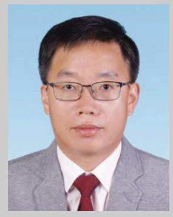

**Ruiguo Cao** is a full professor at the University of Science and Technology of China (USTC). He completed his Ph.D. in Physical Chemistry at Peking University in 2010, followed by two periods of postdoctoral research at the Ulsan Institute of Science and Technology (UNIST) in South Korea and Pacific Northwest National Laboratory (PNNL). The current research interests in his group include materials design and synthesis for electrocatalysis and energy storage applications and also mechanism study at electrochemical interfaces.

**Shuhong Jiao** is a full professor at the University of Science and Technology of China (USTC). She received her Ph.D. degree in Physical Chemistry from Peking University in 2011. She joined the University of Science and Technology of China in 2017, after finishing her postdoctoral training at Peking University and Pacific Northwest National Laboratory (PNNL) from 2011–2017, respectively. Her research interests mainly focus on electrolyte design and mechanism understanding for advanced energy storage devices.