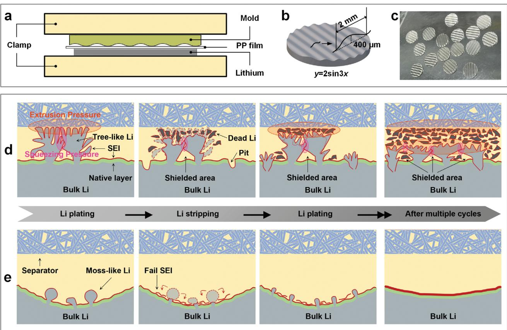
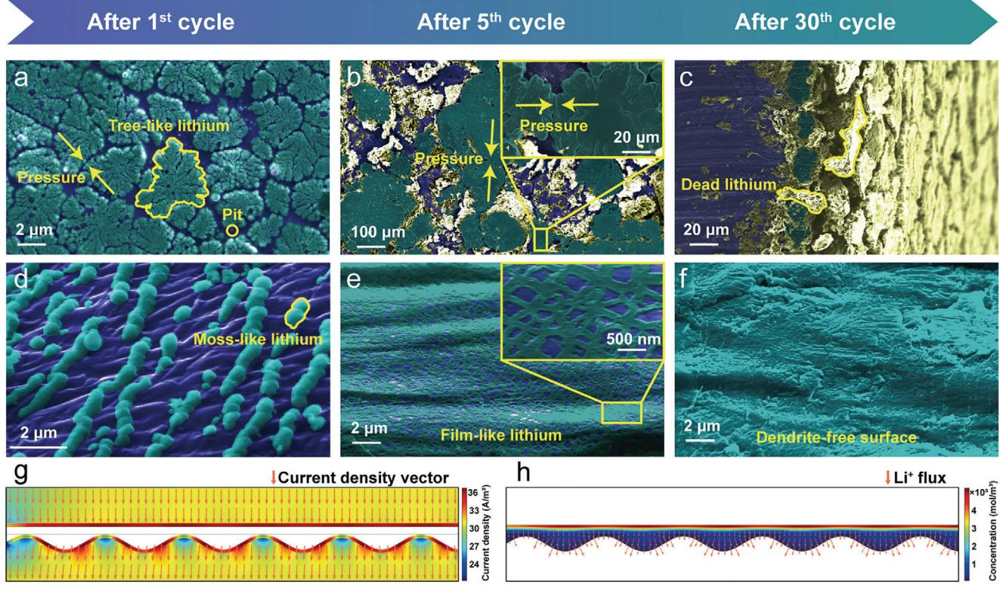
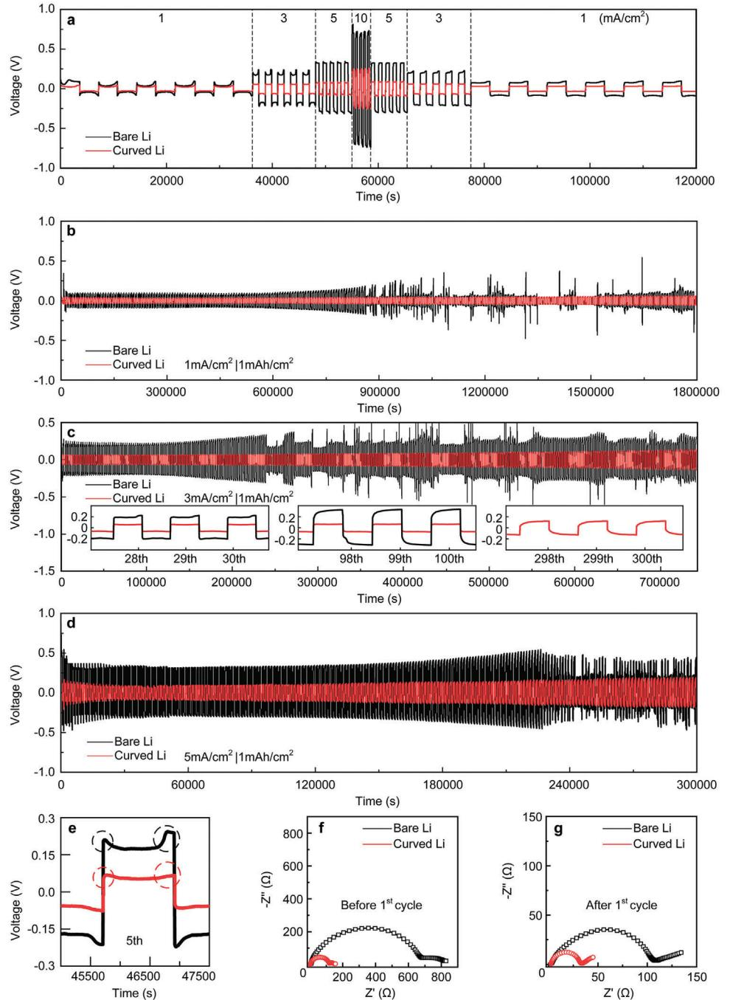
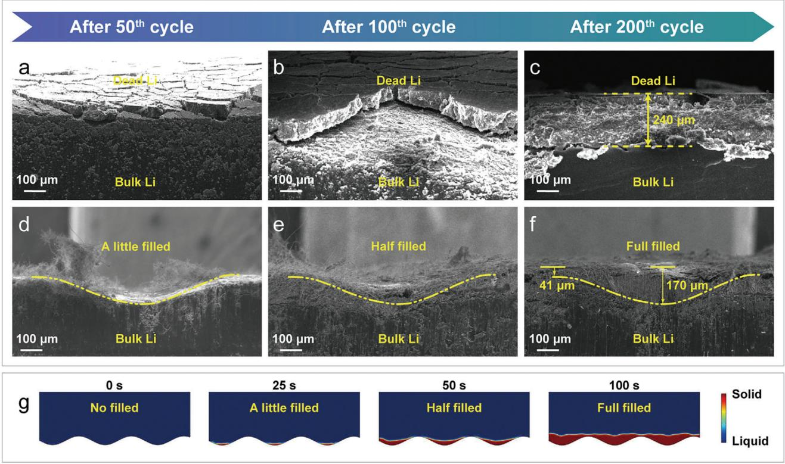
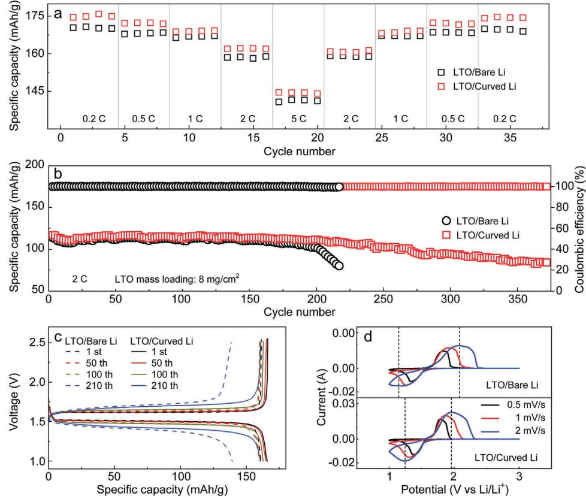

# **New Understanding toward Lithium Morphologic Evolution in Lithium Metal Batteries**

*Chun Wang, Xuyang Wu, Wei Yuan,\* Xiaoqing Zhang, Simin Jiang, Bote Zhao, Yu Chen, Guanhua Zhang, Yubin Zeng, Qing Liu, Furui Gu, Yong Tang, and Yingxi Xie*

**The generation of dendrites is a common issue of lithium metal battery, while the failure mechanism is still uncovered especially at low current densities/capacities. To better understand the mechanical factors caused by lithium morphologic evolution in the whole dynamic process of a cycle, this study proposes a failure mechanism of the lithium metal anode under a safe condition of rather low current density/capacity. The anode and the electrolyte fail to maintain effective contact throughout the dynamic cycling process due to the accumulation and extrusion of lithium deposits. To guarantee effective contact, a facile and low-cost mechanical stamping method for lithium metal anode modification is accordingly presented. The curved lithium electrode can stably cycle for more than 300 cycles at 3 mA cm−2. This study is believed to provide a more in-depth understanding toward the evolvement of lithium morphology to boost practical use of the lithium metal anodes.**

### **1. Introduction**

The traditional lithium-ion batteries (LIBs) with a relatively low energy density cannot meet the ever-increasing demands of highenergy-density batteries for portable electronics, electric vehicles, and large-scale energy storage. Lithium metal batteries (LMBs) are promising alternatives to the traditional LIBs using commercial graphite anode (372 mAh g−1) owing to its ultra-high theoretical specific capacity of lithium (3860 mAh g−1). Oxygen,

C. Wang, X. Wu, W. Yuan, X. Zhang, S. Jiang, Q. Liu, F. Gu, Y. Tang, Y. Xie School of Mechanical and Automotive Engineering South China University of Technology Guangzhou 510640, P. R. China E-mail: [mewyuan@scut.edu.cn](mailto:mewyuan@scut.edu.cn) B. Zhao, Y. Chen School of Environment and Energy South China University of Technology Guangzhou 510640, P. R. China G. Zhang School of Mechanical and Vehicle Engineering Hunan University Changsha 410082, P. R. China Y. Zeng School of Power and Mechanical Engineering Wuhan University Wuhan 430072, P. R. China

The ORCID identification number(s) for the author(s) of this article can be found under <https://doi.org/10.1002/adfm.202408758>

**DOI: 10.1002/adfm.202408758**

sulfur, selenium and other elements have been used as promising high-capacity cathodes for LMBs. The plating/stripping reaction in LMBs cycling remains unaffected by the lithium-ions diffusion rate of the anode material. This allows for faster reaction rates, enabling the fast-charging required for energy storage and conversion devices.[\[1\]](#page-8-0) However, the uneven plating/stripping of lithium and the side reactions resulting from the high reactivity of lithium inevitably lead to low coulombic efficiency (CE) of LMBs and random dendrite growth of lithium.[\[4\]](#page-8-0) During the cycling process, a large amount of dead lithium will form on the surface of the lithium metal anode, except for the dendrite, which is wrapped by the solid electrolyte interface (SEI), consuming a large

amount of electrolyte. Meanwhile, the dead lithium cannot participate in the electrochemical reaction, resulting in severe capacity loss and low CE. In addition, the continuous dendrite growth is very likely to puncture the separator, leading to the battery short circuit and even fire and explosion.

To improve the life and safety of LMBs for practical use, it is essential to understand the lithium evolution and with it growth mechanism of dead lithium and dendrite. The Sand's time model provides a dependable theory for the behavior of lithium metal anodes.[\[2,3\]](#page-8-0) However, Sand's time model deviates in the low current density region.[\[4\]](#page-8-0) Tree-like dendrites are also generated below the diffusion-limited current or critical current density.[\[5–7\]](#page-8-0) With the development of inspection techniques, in-situ optical equipment has been used to observe the formation of dendrites. Thereafter, Sand's capacity has been proposed and the important effect of capacity on dendrite formation has been also confirmed.[\[7\]](#page-8-0) However, in many studies, lithium metal anodes are subject to obvious failure with dendrites generated below Sand's capacity.[\[8–12\]](#page-8-0) This phenomenon implies that there exist some factors directly affecting the dendrite generation in addition to reaction and transport limitations. Additional factors affecting dendrite generation may be related to the mechanical factors, assuming adequate control of the electric and ionic concentration fields at room temperature.

It is believed that dendrites cannot form if the shear modulus of the solid state electrolyte (SSE) is more than twice that of the lithium metal.[\[13,14\]](#page-8-0) However, the critical current density of Li7La3Zr2O12, a representative SSE with an excellent performance, is less than 1 mA cm−2. [\[15\]](#page-8-0) In contrast, the liquid

**Figure 1.** Schematics of the curved lithium electrode design. a) Fabrication process. b,c) Model, photograph of resulting electrode. Schematics of lithium plating/stripping evolution process of d) bare and e) curved lithium electrodes.

electrolyte exceeds 4 mA cm−2, [\[16\]](#page-8-0) indicating that the use of SSE is more prone to dendrite formation. This contradicts the previous understanding of dendrite generation mechanism. In fact, changes in stack pressure and internal stress have a significant impact on dendrite initiation and propagation during cell cycling.[\[17,18\]](#page-8-0) Due to the huge volume change of lithium, the pressure and stress brought by lithium deposits exerts a considerable influence on the dendrite generation at the narrow interface of lithium anode/separator. Therefore, it is insufficient to consider the lithium growth mechanism only from the initial stage. The whole plating/stripping stage must be carefully considered in accompany with the dynamic change of lithium deposit morphology.

With this background, this study aims to disclose the important role of lithium deposit morphologic evolution in the formation of dendrites at the anode below the ultimate current density/capacity, which provides a new insight into the growth behavior of lithium. We also propose an anode surface design considering the morphologic evolution that can eliminate the extrusion of lithium deposits at the interface of lithium anode/separator to achieve an effective contact between the electrolyte and active surface of the anode. The profile and geometry of the anode surface are achieved by a facile and low-cost stamping method as shown in **Figure 1**a. The as-received curved lithium electrode (CLE) will not deform under assembly pressure as shown in Figures S1 and S2 (Supporting Information). The CLE realizes uniform lithium plating/stripping without dendrite formation. The symmetric cell can be stably cycled for more than 300 times at 3 mA cm−2, 1 mAh cm−2, and the full cell with Li4Ti5O12 (LTO) electrode can be stably cycled for more than 350 times. Overall, this work illuminates a new understanding of lithium growth behavior, as well as providing a new method for inhibiting dendrites, which can help refresh related concepts and strategies of electrode design to make more applicable LMBs.

#### **2. Results and Discussion**

#### **2.1. Lithium Plating/Stripping Behaviors on the Bare and Curved Lithium Electrode**

By analyzing and summarizing the current theories of anode lithium behavior and experimental results from direct observation, we rationally propose a new hypothesis of lithium deposit evolution behavior on the surface of lithium metal anode. As shown in Figure 1d, large tree-like dendrites rapidly appear on the bare lithium electrode (BLE) after lithium is unevenly nucleated and deposited on the surface of the bulk lithium. Thereafter, the adjacent growing and enlarged tree-like dendrites squeeze each other and extrude against the separator, forming a large number of shielded areas at the bottom of dendrites that are

**Figure 2.** Lithium plating/stripping evolution process of bare and curved lithium electrodes. a–c) SEM images of bare lithium electrode after first plating process, 5 cycles, 30 cycles at 3 mA cm−2 for a capacity of 1 mAh cm−2. d–f) SEM images of curved lithium electrode after first plating process, 5 cycles, 30 cycles at 3 mA cm−2 for a capacity of 1 mAh cm−2. g) Simulations of current density and h) lithium-ion concentration of curved lithium electrode.

considered nonreactive. After multiple cycles, dead lithium and pitting appear in large quantities, and eventually the anode completely becomes ineffective. In contrast, the CLE can achieve uniform lithium nucleation and deposition due to the formation of electrolyte storage area, which helps avoid extrusion between the lithium deposits and separator to achieve a nearly ideal film-like deposition. The wave-like surface of the CLE is gradually filled with active lithium after multiple cycles.

To verify the aforementioned hypothesis, we characterized the lithium deposition on the surfaces of bare and curved lithium electrodes at different cycles. Notably, the separator was removed from the electrode surface after battery disassembly. During the process of assembly and disassembly, the separator with inherent flexibility and low yield strength was pressed thin and flat, without affecting the morphology of the lithium deposits (The separator deformation was tested as shown in Figure S3, Supporting Information). **Figure 2**a,d shows that the bare and curved lithium electrodes have completely different deposition morphologies in the initial stage of deposition. The lithium deposition on the bare sample looks like a tree with branches, which is originated from the growth of lithium nucleate points and subsequent extrusion of lithium deposits. In contrast, the lithium deposition on the curved sample is moss-like, which is attributed to the uniform nucleation and deposition of lithium because of sufficient contact between the electrolyte and curved electrode.

The initial morphology of lithium deposition plays an important role in the lithium plating/stripping behaviors of electrodes. The BLE has a rough surface with many mountain-like areas randomly distributed on its surface because of the manufacturing processes.[\[19,20\]](#page-8-0) Owing to the tip effect, the mountain-like areas on the rough surface can be a preferential location for lithium plating/stripping.[\[21,22\]](#page-8-0) Whether a coin cell or a pouch cell, the positive and negative electrodes are aligned and compressed under a considerable pressure level to minimize the ion migration distance. The separator sandwiched by the positive and negative electrodes bears a very large pressure. Due to the presence of mountain-like areas, the flexible separator (PP separators, glass fiber separators, etc.) will deform while some separator pores will be blocked under the condition of excessive extrusion, forming unique areas with less or even zero electrolyte.

After lithium is deposited at the mountain-like areas, tree-like deposition occurs due to the non-uniform deposition of lithium for lack of electrolyte. The tree-like lithium produced by subsequent extrusion of lithium deposits has a large specific surface area with many branches stretching out (Figure 2a). The direct contact between these surfaces with the electrolyte will consume a large amount of electrolyte to form a solid electrolyte interphase (SEI) film, aggravating the starvation of electrolyte due to pressure-related factors. Meanwhile, the huge volume change of tree-like lithium also makes the electrolyte at the top of the treelike lithium almost empty during the lithium deposition. In this stage, the increasing pressure further sharpens the large tree-like lithium deposits at the edges, as shown in Figure 2b. These sharp locations with a local concentration of electric field are highly susceptible to forming dendritic lithium that might pierce the separator so as to cause battery failure.

Due to the effect of mutual squeezing of adjacent tree-like lithium, the active lithium region at the root of tree-like lithium will be covered, resulting in the formation of several shielded areas without electrochemical reaction, as shown in Figure [1.](#page-1-0) These shielded areas tend to reduce the amount of active lithium for real reaction. The effective current density of the local blocks formed by the adjacent tree-like lithium increases, thus making it easier to form sharp dendrites. This will accelerate the failure of lithium metal anode. Since each bifurcated lithium dendrite on the tree-like lithium has a fractal structure grown from the primary lithium nucleate point, there is always a location where the lithium dendrite has the weakest connection with the treelike lithium, which may be the starting point of growth or an intermediate location with a small diameter. When the polarity is switched, the lithium dendrites break from the weak points due to uneven lithium stripping, thereby leading to the formation of dead lithium floating on the top of the tree-like lithium and also the area nearby. Dead lithium wrapped by SEI consumes a large amount of electrolyte and loses electrical contact with the anode, which is no longer effective in the reaction and likely to block the efficient lithium-ion transport. The remaining portion of the tree-like lithium that fails to be stripped entirely will adhere onto the bulk lithium in a state of large lithium lumps with irregular surfaces.

Due to the existence of shielded areas and their resulting localized preferential stripping of the anode, the lithium stripping process also generates pits on the surface of bulk lithium, which leads to a greater roughness on the lithium surface. After continuous uneven plating/stripping, plenty of dead lithium is generated at the interface of electrode/separator.[\[23,24\]](#page-8-0) Therefore, the lithium-ion migration path is lengthened or severely blocked. Meanwhile, the large consumption of electrolyte and the increase of dead lithium as well as tree-like lithium at this narrow interface will increase the pressure between the positive and negative electrodes, thus inducing a high stress inside the electrode, as well as forming cracks in this dead lithium layer between the bulk lithium and separator, as shown in Figure [2c.](#page-2-0)

The relationship between the cation concentration and dendrite generation time follows Sand's formula[\[2,25\]](#page-8-0)

$$
t_{\text{Sand}} = \pi D \frac{\left(z_c c_0 F\right)^2}{4\left(J t_a\right)^2} \tag{1}
$$

where *t*Sand is the time until dendrites start to appear, *D* is the apparent diffusion coefficient (*D* = 3.0–3.5 × 10−6 cm2 s−1 for smallcurrent relaxation),[\[26,27\]](#page-8-0) *z*c is the charge number of the cation (*z*c = 1 for Li ion), *c*0 is the initial bulk cation concentration, *F* is the Faraday's constant, *J* is the current density, and *t*a = 0.62 is the transference number of associated anions.[\[7\]](#page-8-0) When the current density is constant, the decrease in the value of *c*0 will make the dendrites more likely to be generated.

However, almost all the open literatures only consider the lack of electrolyte cations due to the concentration polarization of lithium-ion caused by the low diffusion coefficient of lithium ions under the condition of high current densities. As a result, the effect of electrolyte starvation itself on the dendrite growth on the surface of lithium anode is usually neglected although the extrusion of lithium deposits at the interface of electrode/separator and the existence of shielded areas at the root of tree-like lithium may also induce lithium dendrite. When the contact between the electrolyte and lithium becomes poor due to the mutual extrusion between the electrodes or the extrusion of tree-like lithium, a dendrite-prone environment is likely to be formed. The slow diffusion rate of lithium-ions will cause a large ion concentration gradient in the depleted electrolyte areas, thus forming many random locations with low-concentration electrolyte at the interface of electrode/separator and producing many random dendrites.

The above rationale may fill a knowledge gap to interpret the failure mechanism of lithium anode at a low current density/capacity. It is noted that many studies have observed lithium plating and stripping processes through in situ optical microscopy.[\[7,24,28–32\]](#page-8-0) However, these experiments are mostly conducted without adding any pressure on the lithium anode samples. There is still ample space above these lithium anode samples to be in well contact with the adequate electrolyte in the absence of additional pressure. This gives the reason why lithium is only presented in the moss-like form at a low current density/capacity during the in situ optical observations, while the sharp tree-like lithium appears in coin cells or pouch cells.[\[33,34\]](#page-8-0)

The curved lithium electrodes are pressed against the counter electrode at the raised peaks. Due to the extrusion effect, there is little electrolyte storage areas at the peaks, making it impossible for lithium-ions to migrate smoothly. Electrochemical reactions hardly occur here. The valley provides ample space for the electrolyte to fill in efficiently. During constant-current charging and discharging, the effect of the electric field allows lithium ions to migrate uniformly inside the valley towards the bottom for reduction. Therefore, lithium will preferentially be plated/stripped within the valley, which is also confirmed by simulation results.[\[24\]](#page-8-0) As shown in Figure [2g,h,](#page-2-0) lithium-ions are preferentially deposited within the valley due to the higher current density and Li+ flux. The enlarged space provided by the valley allows the surface inside to be protected from the squeezed pressure of the electrode. The valley is filled with adequate electrolyte to form several independent stable regions with uniform Li+ flux on the surface of the CLE. During the initial deposition, the lithium forms continuous moss-like lithium nucleates within these regions, as shown in Figure [2d.](#page-2-0) After multiple cycles, the film-like lithium forms on the surface of anode, as shown in Figure [2e.](#page-2-0) Due to the uniform Li+ flux and good contact with the electrolyte within the enlarged storage regions, the mosslike lithium formed on the surface of the CLE can be almost uniformly stripped without forming pits.[\[35,36\]](#page-8-0) This is beneficial to achieving the stable operation of lithium electrode over time (Figure [2e,f\)](#page-2-0).

#### **2.2. Electrochemical Performance Evaluation of the Curved Lithium Electrode**

In order to validate the significance of none-extrusion lithium deposits and effective contact between the electrolyte and electrode for the stable cycling of the anode, we assembled symmetrical cells using two identical curved lithium electrodes for performance testing. **Figure [3](#page-4-0)**a shows the voltage profiles of lithium

**Figure 3.** Electrochemical performances of symmetric cells using bare and curved lithium electrodes. a) Comparison of voltage profiles for cells using bare and curved lithium electrodes during lithium plating/stripping processes under various current rates ranging from 1 to 10 C, where 1 C is 1 mA cm−2. b–d) Long-term cycling processes of bare and curved lithium symmetric cells with current densities of 1, 3, and 5 mA cm−2 and a plating/stripping capacity of 1 mA cm−2. e) Comparison of voltage profiles for cells using bare and curved lithium electrodes at the fifth cycle with a current density of 3 mA cm−2 and a plating/stripping capacity of 1 mA cm−2. f,g) EIS curves of cells with bare and curved electrodes before cycling and after the first cycle.

plating/stripping process from 1 to 10 C for the bare and curved lithium electrodes. Compared with the symmetric cell with a BLE, the cell using the curved one shows a much lower overpotential value with a flat and stable voltage plateau at different current densities. This can be attributed to the fact that the curved sample can provide a larger active surface area due to its more abundant surface morphology. Therefore, the charge transfer resistance and interfacial polarization at the interface of the CLE are smaller than the bare at the same current density. The symmetric cell based on the CLE shows steadily increasing overpotential values of 41, 64, 94, and 248 mV at 1, 3, 5, and 10 C, respectively. In contrast, the cell using the BLE exhibits rapidly increasing overpotential values of 91, 230, 326, and 716 mV under the same conditions. The outstanding rate performance of the symmetric cell based on curved sample proves the beneficial effect of 3D surface with a larger surface area.

Figure [3b](#page-4-0)−d compares the long-term cycling performances of the symmetric cells based on the bare and curved lithium electrodes at different current densities of 1, 3, and 5 mA cm−2 with a constant areal capacity of 1 mAh cm−2. As the current density increases, the cell using a bare electrode exhibits gradually increasing polarization until an abrupt voltage drop at 5 mA cm−2 emerges. The subsequent haphazard voltage curves identify the uncontrolled lithium dendrites and multiple internal shorts at the anode surface.[\[37,38\]](#page-8-0) This problem is mainly caused by the fluctuation of electrode shape/volume in the host-less plating/stripping of the BLE, the random lithium nucleation position, and the preferential growth of lithium in the nucleated position. However, the symmetric cell with a curved sample can stably run for more than 300 cycles at 3 mA cm−2. Even when the current density is as high as 5 mA cm−2, the cell can still stably cycle for more than 200 times without dendrite-induced failure. The inset in Figure [3c](#page-4-0) compares the voltage profiles of the two symmetrical cells at different cycles. It can be seen that the voltage plateau of the cell using the CLE is quite stable without any sharp peaks. This indicates that the CLE is more stable during cycling without generation of lithium dendrite. All these results demonstrate that the CLE with a 3D surface profile can effectively inhibit the lithium dendrites and dead lithium by forming an effective electrolyte storage area to facilitate sufficient and effective contact with the electrolyte.

Figure [3e](#page-4-0) displays the voltage profiles for cells with two kinds of electrodes at the fifth cycle at a current density of 3 mA cm−2. The two peaks of the voltage profiles are marked with circles. The first peak represents the instantaneous nucleation of lithium, while the subsequent decrease is primarily caused by the deposition of lithium on the positive electrode.[\[23,24\]](#page-8-0) Unevenly deposited lithium, such as lithium dendrites with a large surface area, can significantly reduce overpotential in the early stage.[\[24\]](#page-8-0) When the growth of lithium dendrites on the positive electrode and the accumulation of dead lithium on the counter electrode reaches a certain level, the adverse effect of lithium dendrites and dead lithium appears. The uncontrollable tree-like dendrite growth on the positive electrode leads to shield of many active areas on its surface, while a certain amount of dead lithium is generated on the counter electrode due to uneven plating/stripping. These factors increase the local current density at both electrodes. Therefore, the overpotential begins to rise again until reaching the second peak. In comparison with the BLE, the CLE produces a much lower voltage plateau and peak value, indicating that it has a more uniform and regular lithium deposition/stripping behavior during cycling. This can be confirmed by the fact that no pitting and dendritic lithium can be observed on the surface of the curved lithium electrodes (Figure [2\)](#page-2-0). We also measured electrochemical impedance spectra (EIS) of symmetric cells with both bare and curved lithium electrodes, as shown in Figure [3f,g.](#page-4-0) The highfrequency semicircles denote the interfacial impedance values of charge transfer. The interfacial impedance values of both the bare and curved lithium electrodes before cycling are ≈660 and ≈210 Ω (Figure [3f\)](#page-4-0), which decrease to ≈110 and ≈35 Ω after the first cycle (Figure [3g\)](#page-4-0), respectively. The smaller overall impedance of the cell with a CLE indicates that it owns a thinner SEI and better charge transfer kinetics than the bare sample. The slope of the straight line in the low-frequency region can be used to evaluate the lithium-ion transference number. A larger absolute value of the slope relates to an increase of the lithiumion transference number.[\[39,40\]](#page-8-0)

As shown in Figure [3f,](#page-4-0) the symmetric cell using a CLE exhibits a larger lithium-ion transference number than the cell with a bare electrode. Compared with the bare sample, the curved always has multiple grooved areas fully infiltrated by the electrolyte. These areas are more able to ensure quick supply of lithium ions, thereby effectively reducing the internal resistance. Consequently, the concentration polarization at the interface of the CLE turns smaller, and the lithium deposition/stripping is more uniform than the BLE. Consequently, the cells with a CLE are supposed to retain a more stable long-cycling performance.

#### **2.3. Electrochemical Cycling Stability**

The SEM images of the bare and curved lithium electrodes after the long-cycling process are shown in **Figure [4](#page-6-0)**. As depicted in Figure [4a–c,](#page-6-0) an increasingly thick dead lithium layer forms on the surface of the BLE. A thick dead lithium layer of 240 μm can be observed for the BLE after 100 cycles. Due to the considerable volume change of tree-like lithium (1 mAh cm−2) and the increasing pressure between the positive and negative electrodes caused by the gradually thickening dead lithium layer, the dead lithium layer is repeatedly compressed during each lithium plating/stripping process. This will further produce a denser dead lithium layer, as well as a longer but more tortuous ion transport path. In Figure [4a,b,](#page-6-0) there appear many cracks on the surface of the dead lithium layer, which is caused by the pressure from the increased thickness of the dead lithium layer and the stress from the tree-like lithium extrusion. In addition, a big and continuous crack can be identified at the interface between the dead lithium layer and bulk lithium in the presence of shielded areas and pits (Figure [4c\)](#page-6-0). The poor morphology of the BLE after long-term cycling supports our understanding toward the lithium failure mechanism under the condition of low current density/capacity. The CLE after the long-cycling process is endowed with obviously different morphology and structure. The valley of the CLE is slowly filled with active lithium with the increase of cycles because of the sufficient electrolyte contact and low local current density. After 200 cycles, it is fully filled with active lithium firmly bonded to the bulk lithium and is free from dendrites and dead lithium. The dendrite-free morphology of the CLE validates the importance of adequate electrolyte contact and free squeezing pressure for stable operation of the lithium anode. The above experimental results are also verified by the phase field simulations of the lithium deposition process in the case of using a CLE as shown in Figure [4g.](#page-6-0) [\[41\]](#page-8-0)

Full cells were prepared to assess the electrochemical performances of lithium metal electrodes. As shown in **Figure 5**[a,](#page-7-0) the cell based on the CLE delivers a better rate performance than that using the BLE. In addition, the curved sample exhibits superior cycling stability at 2 C, which can retain a higher capacity retention of 81% after 350 cycles. In contrast, the discharge capacity of the BLE quickly decays and keeps a capacity retention

**Figure 4.** SEM images of bare and curved lithium electrodes after cycling. Side view of BLE: a) after 50 cycles at 3 mA cm−2 for a capacity of 1 mAh cm−2; b) after 100 cycles at 3 mA cm−2 for a capacity of 1 mAh cm−2. c) Cross-section of BLE after 100 cycles at 3 mA cm−2 for a capacity of 1 mAh cm−2. Cross-section of curved lithium electrode: d) after 50 cycles at 3 mA cm−2 for a capacity of 1 mAh cm−2; e) after 100 cycles at 3 mA cm−2 for a capacity of 1 mAh cm−2; f) after 200 cycles at 3 mA cm−2 for a capacity of 1 mAh cm−2. g) Phase field simulations of the lithium deposition process of curved lithium electrode.

of less than 75% after 200 cycles. Figure [5c](#page-7-0) presents the voltage profiles for full cells at various cycles (1st, 50th, 100th, and 210th). Meanwhile, the cyclic voltammetry (CV) profiles of the full cells at various scan rates ranging from 0.5 to 2 mV s−1 are shown in Figure [5d.](#page-7-0) Evidently, the minor plateau separation and peak separation can be identified for the full cell based on the CLE which suffers from small polarization.[\[42,43\]](#page-8-0) Such a polarization difference becomes more pronounced with the increase of cycles, confirming the better cyclic reversibility of the CLE since it prevents from loss of active lithium during cycling. The minor polarization of the CLE originates from its small charge transfer resistance, which is consistent with the EIS results.

### **3. Conclusions**

In this study, a new understanding of failure mechanism for lithium metal anode at a low current density/capacity is disclosed. Owing to the narrow space between the positive and negative electrodes, the extrusion pressures from the adjacent lithium deposits and separator/lithium that cause the lack of electrolyte play an important role in the deterioration of lithium anode. Based on this mechanism, a new strategy of anode morphologic induction based on the scalable stamping method has been developed to efficiently fabricate the curved lithium electrodes. The sub-millimeter scale of curved structure ensures consistent ample batch preparation. The valley on the surface of the CLE provides ample space for the lithium deposits without any squeezing pressure and stores adequate electrolyte to ensure sufficient supply of lithium ions. The symmetrical cell with the CLE can be stabilized at a low overpotential for more than 300 cycles at 3 mA cm−2. The full cell with the CLE yields a high discharge capacity, an excellent rate performance and a stable cycling performance. The excellent performance of the CLE is ascribed to the enlarged active area of the 3D surface and the effective retention of the active area in the absence of dendrite generation. The significant performance improvement of the curved lithium anode demonstrates that constructing an electrolyte storage area at the anode is an effective method to enhance the electrochemical performance of LMBs. This study presents a novel use of traditional mechanical stamping method, and sheds light on a new perspective for the research of other metal electrode systems.

## **4. Experimental Section**

*Preparation of the Stamping Mold to Create Curved Surface on the Electrode*: The curved surface stamping mold (CSSM) was fabricated using a projection micro stereolithography-based 3D printing technique (BMF Nano Materials Technology Co., Ltd.). The printing material was an acrylic photosensitive resin called "HTL" developed by the BMF Nano Materials

**Figure 5.** Electrochemical performances of full cells using bare and curved lithium electrodes. a) The rate performances of full cells using bare lithium and curved lithium electrodes under various current densities from 0.2 to 5 C (1 C = 175 mA g−1). b) Long-term cycling performances of full cells using bare and curved lithium electrodes at 2 C. The full cell was first activated at 0.2 C for two cycles. c) Voltage profiles of full cells using bare lithium and curved lithium electrodes at a current rate of 2 C at the 1st, 50th, 100th, and 210th cycle. d) CV profiles at various scan rates from 0.5 to 2 mV s−1. All LTO electrodes have a mass loading of 8 mg cm−2.

Technology Co., Ltd. First, a 3D CSSM model (established with Solidworks software) was turned into planar slices by using a slicing software (Cura), which was imported into the 3D printer. The CSSM was then printed by curing the resin layer-by-layer and exposed to 405 nm UV light. Finally, the printed CSSM was treated with cleaning, post-curing, and vacuum drying before experiments. The base of CSSM was a cube with a height of 1 mm, a length and width of 19 mm, a curved surface at the top, and the top curve equation of the section was defined as y = 0.2\*sin(3*x*).

*Preparation of the Curved Lithium Electrode*: The entire stamping manufacturing process of the curved lithium electrode was conducted in an argon-filled glove box (Mikarouna Universal). First, a piece of polypropylene (PP) film (thickness = 25 μm) was laid flat on the plane of the fixed jaw of the vertical vise, and then a circular lithium sheet (diameter = 12 mm, thickness = 0.9 mm) was placed in the center above the PP film. Then, a slightly larger PP film was placed on the lithium sheet. Finally, the CSSM was aligned to the lithium sheet and placed on the PP film. The PP film was added to prevent the lithium sheet from sticking to the mold or jaw plane. The curved lithium electrode was prepared by stamping the CSSM on the surface of lithium sheet. The surface of the curved lithium sheet consisted of continuous undulating peaks and valleys with a height difference of ≈400 μm and a spacing of ≈2 mm between the adjacent peaks.

*Electrochemical Measurements*: The symmetrical cells and full cells were assembled inside an argon-filled glove box (Mikarouna Universal). 1 m LiPF6 dissolved in cosolvent of ethylene (EC) and dimethyl carbonate (DMC) (1:1 vol %) was used as the electrolyte. A fixed amount (150 μL) of electrolyte was used in each coin cell to standardize the measurement. Glass fibers (Whatman GF/A) was used as the separator. The two electrodes of the symmetrical cells were identical with bare lithium or curved lithium on both sides. The full cells used LTO as the cathodes. To prepare LTO electrodes, LTO, conductive black agent, and poly-(vinylidene difluoride) binder were mixed at a weight ratio of 8:1:1 in N-methyl-2-pyrrolidone (NMP). The mixture was thoroughly stirred in a mixer defoamer (HASAI 1000g) to form a homogeneous slurry. The slurry was pasted on aluminum foil and then dried in a vacuum oven at 80 °C for 12 h. The areal loading of active materials was ≈8 mg cm−2 (total areal capacity of ≈1.4 mAh cm−2). Galvanostatic charge/discharge cycling tests were conducted on the LAND Battery Tester (LANHE CT2001A). The cycling tests of full cells were in a voltage range of 1–2.5 V. CV curves were measured on an electrochemical workstation (CHI660E) at a scan rate of 0.5, 1, and 2 mV s−1, respectively. EIS was evaluated on an electrochemical workstation (AUTO-LAB PGSTAT302N) in a frequency range between 10−2 and 105 Hz with an AC amplitude of 5 mV.

*Characterization*: SEM characterizations of the electrodes were conducted using a FESEM (ZEISS Merlin) with an accelerating voltage of 5 kV. The cells were dissembled to study the cycled electrode morphology, and the cycled electrode was rinsed in pure DMC to remove the lithium salts and impurities.

*Calculation*: Finite element analysis simulation was used to simulate the electrode current density distribution and Li+ flux of the curved lithium electrode and phase field simulations using COMSOL Multiphysics 6.1 software. In the electrodeposition simulation, multiple physical field coupling was conducted using tertiary current distributions and deformation geometry. The detailed calculation process is described in the Supporting Information.

# **Supporting Information**

Supporting Information is available from the Wiley Online Library or from the author.

### **Acknowledgements**

This work was financially supported by the National Natural Science Foundation of China (Nos. U22A20193 and 51975218), TCL Science and Technology Innovation Fund (No. 20231751), and Fundamental Research Funds for the Central Universities (No. 2022ZYGXZR101).

## **Conflict of Interest**

The authors declare no conflict of interest.

## **Data Availability Statement**

The data that support the findings of this study are available from the corresponding author upon reasonable request.

#### **Keywords**

curved surface, dendrite, failure, lithium anode, lithium metal battery

Received: May 21, 2024 Revised: June 17, 2024 Published online: July 26, 2024

- [1] Y. Mu, Y. Chu, L. Pan, B. Wu, L. Zou, M. Han, T. Zhao, L. Zeng, *Int. J. Extreme Manuf.* **2023**, *5*, 042008.
- [2] H. J. Sand III, *London, Edinburgh, and Dublin Philos. Mag. J. Sci.* **1901**, *1*, 45.
- [3] A. J. Bard, L. R. Faulkner, *Electrochem. Methods* **2001**, *2*, 580.
- [4] M. Rosso, T. Gobron, C. Brissot, J. N. Chazalviel, S. Lascaud, *J. Power Sources* **2001**, *97*, 804.
- [5] J. Steiger, D. Kramer, R. Mönig, *Electrochim. Acta* **2014**, *136*, 529.
- [6] J.-i. Yamaki, S.-i. Tobishima, K. Hayashi, S. Keiichi, Y. Nemoto, M. Arakawa, *J. Power Sources* **1998**, *74*, 219.
- [7] P. Bai, J. Li, F. R. Brushett, M. Z. Bazant, *Energy Environ. Sci.* **2016**, *9*, 3221.
- [8] Z. Su, J. Zhang, J. Jin, S. Yang, G. Li, *Chem. Eng. J.* **2022**, *430*, 132865.
- [9] D. Li, C. Xie, Y. Gao, H. Hu, L. Wang, Z. Zheng, *Adv. Energy Mater.* **2022**, *12*, 2200584.
- [10] J. Di, J.-L. Yang, H. Tian, P. Ren, Y. Deng, W. Tang, W. Yan, R. Liu, J. Ma, *Adv. Funct. Mater.* **2022**, *32*, 2200474.
- [11] W. Zeng, C. Yang, H. Zhu, G. Wang, J. Li, J. Ye, W. Zhang, G. Zhang, H. Duan, *J. Alloys Compd.* **2023**, *938*, 168542.
- [12] Y. Cheng, Z. Wang, J. Chen, Y. Chen, X. Ke, D. Wu, Q. Zhang, Y. Zhu, X. Yang, M. Gu, Z. Guo, Z. Shi, *Angew. Chem., Int. Ed.* **2023**, *135*, 202305723.
- [13] J. Janek, W. G. Zeier, *Nat. Energy* **2016**, *1*, 16141.
- [14] C. Monroe, J. Newman, *J. Electrochem. Soc.* **2005**, *152*, A396.
- [15] L. Porz, T. Swamy, B. W. Sheldon, D. Rettenwander, T. Frömling, H. L. Thaman, S. Berendts, R. Uecker, W. C. Carter, Y.-M. Chiang, *Adv. Energy Mater.* **2017**, *7*, 1701003.
- [16] J. Qian, W. A. Henderson, W. Xu, P. Bhattacharya, M. Engelhard, O. Borodin, J.-G. Zhang, *Nat. Commun.* **2015**, *6*, 6362.
- [17] Z. Ning, G. Li, D. L. R. Melvin, Y. Chen, J. Bu, D. Spencer-Jolly, J. Liu, B. Hu, X. Gao, J. Perera, C. Gong, S. D. Pu, S. Zhang, B. Liu, G. O. Hartley, A. J. Bodey, R. I. Todd, P. S. Grant, D. E. J. Armstrong, T. J. Marrow, C. W. Monroe, P. G. Bruce, *Nature* **2023**, *618*, 287.
- [18] Z. Shen, J. Huang, Y. Xie, D. Wei, J. Chen, Z. Shi, *ChemSusChem* **2024**, *17*, 202301777.
- [19] J. Becking, A. Gröbmeyer, M. Kolek, U. Rodehorst, S. Schulze, M. Winter, P. Bieker, M. C. Stan, *Adv. Mater. Interfaces* **2017**, *4*, 1700166.
- [20] W. Tang, X. Yin, Z. Chen, W. Fu, K. P. Loh, G. W. Zheng, *Energy Storage Mater.* **2018**, *14*, 289.
- [21] Y. Okajima, Y. Shibuta, T. Suzuki, *Comput. Mater. Sci.* **2010**, *50*, 118.
- [22] H. Xiao, Y. Li, R. Chen, T. Xie, P. Xu, H. Zhu, J. He, W. Zheng, S. Huang, *eScience* **2023**, *3*, 100134.
- [23] K.-H. Chen, K. N. Wood, E. Kazyak, W. S. LePage, A. L. Davis, A. J. Sanchez, N. P. Dasgupta, *J. Mater. Chem. A.* **2017**, *5*, 11671.
- [24] K. N. Wood, E. Kazyak, A. F. Chadwick, K.-H. Chen, J.-G. Zhang, K. Thornton, N. P. Dasgupta, *ACS Cent. Sci.* **2016**, *2*, 790.
- [25] M. Rosso, C. Brissot, A. Teyssot, M. Dollé, L. Sannier, J.-M. Tarascon, R. Bouchet, S. Lascaud, *Electrochim. Acta* **2006**, *51*, 5334.
- [26] A. Nyman, M. Behm, G. Lindbergh, *Electrochim. Acta* **2008**, *53*, 6356.
- [27] L. O. Valøen, J. N. Reimers, *J. Electrochem. Soc.* **2005**, *152*, A882.
- [28] W. Chen, S. Li, C. Wang, H. Dou, X. Zhang, *Energy Environ. Mater.* **2023**, *6*, e12412.
- [29] W. Tang, X. Yin, S. Kang, Z. Chen, B. Tian, S. L. Teo, X. Wang, X. Chi, K. P. Loh, H.-W. Lee, G. W. Zheng, *Adv. Mater.* **2018**, *30*, 1801745.
- [30] W. Li, H. Yao, K. Yan, G. Zheng, Z. Liang, Y.-M. Chiang, Y. Cui, *Nat. Commun.* **2015**, *6*, 7436.
- [31] P. C. Howlett, D. R. MacFarlane, A. F. Hollenkamp, *J. Power Sources* **2003**, *114*, 277.
- [32] J. Steiger, D. Kramer, R. Mönig, *J. Power Sources* **2014**, *261*, 112.
- [33] Y. Chen, M. Yue, C. Liu, H. Zhang, Y. Yu, X. Li, H. Zhang, *Adv. Funct. Mater.* **2019**, *29*, 1806752.
- [34] H. Zhang, X. Liao, Y. Guan, Y. Xiang, M. Li, W. Zhang, X. Zhu, H. Ming, L. Lu, J. Qiu, Y. Huang, G. Cao, Y. Yang, L. Mai, Y. Zhao, H. Zhang, *Nat. Commun.* **2018**, *9*, 3729.
- [35] A. M. Hafez, Y. Jiao, J. Shi, Y. Ma, D. Cao, Y. Liu, H. Zhu, *Adv. Mater.* **2018**, *30*, 1802156.
- [36] H. Shi, J. Qin, K. Huang, P. Lu, C. Zhang, Y. Dong, M. Ye, Z. Liu, Z. S. Wu, *Angew. Chem., Int. Ed.* **2020**, *132*, 12245.
- [37] Y. Lu, Z. Tu, L. A. Archer, *Nat. Mater.* **2014**, *13*, 961.
- [38] K. Dong, S. Wang, H. Zhang, J. Wu, *Mater. Res. Bull.* **2013**, *48*, 2079.
- [39] G. Bieker, M. Winter, P. Bieker, *Chem. Chem. Phys.* **2015**, *17*, 8670.
- [40] Z. Liang, K. Yan, G. Zhou, A. Pei, J. Zhao, Y. Sun, J. Xie, Y. Li, F. Shi, Y. Liu, D. Lin, K. Liu, H. Wang, H. Wang, Y. Lu, Y. Cui, *Sci. Adv.* **2019**, *5*, eaau5655.
- [41] X. Wu, W. Yuan, Y. Wu, C. Wang, L. Xue, Y. Zhou, X. Zhang, S. Jiang, B. Zhao, Y. Chen, C. Yang, L. Ding, Y. Tang, X. Ding, *Adv. Energy Mater.* **2024**, *14*, 2304204.
- [42] S.-S. Chi, Y. Liu, W.-L. Song, L.-Z. Fan, Q. Zhang, *Adv. Funct. Mater.* **2017**, *27*, 1700348.
- [43] F. Wu, G. Tan, R. Chen, L. Li, J. Xiang, Y. Zheng, *Adv. Mater.* **2011**, *23*, 5081.

