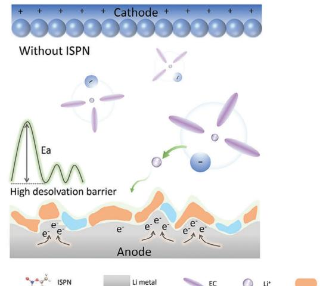
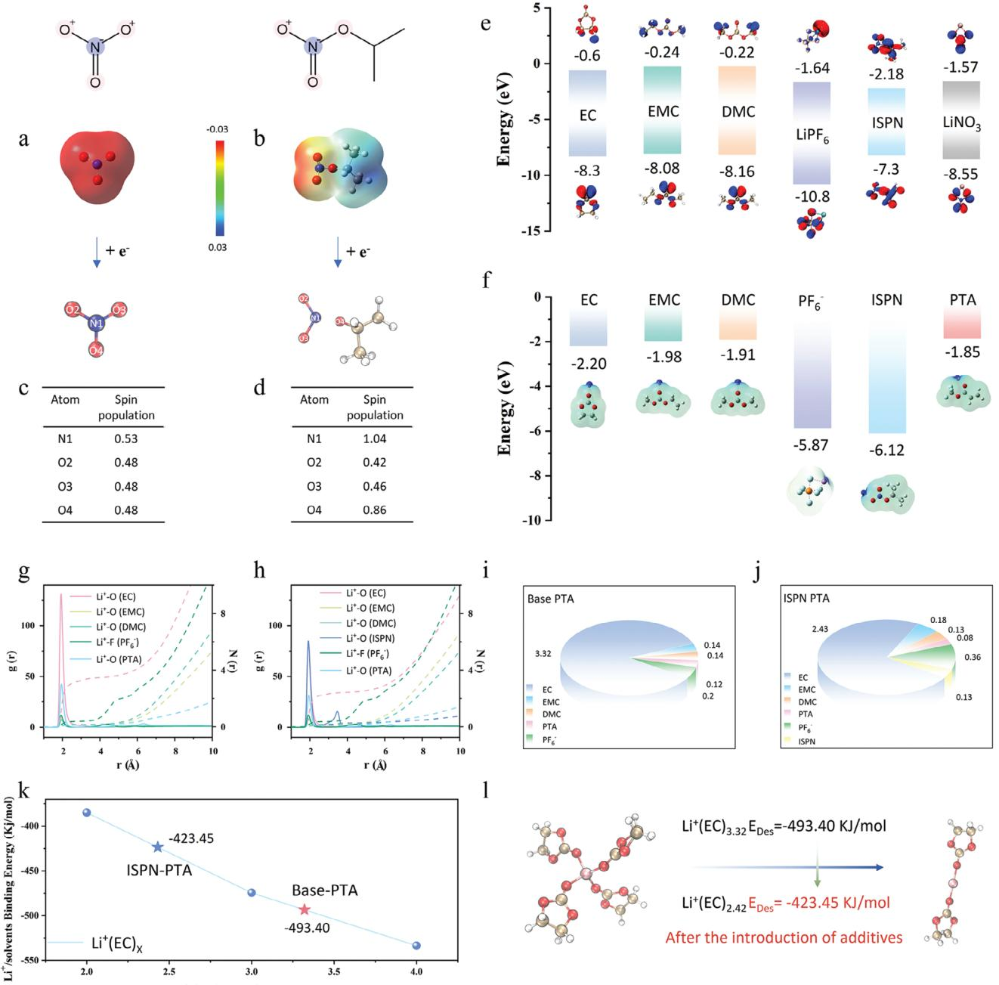
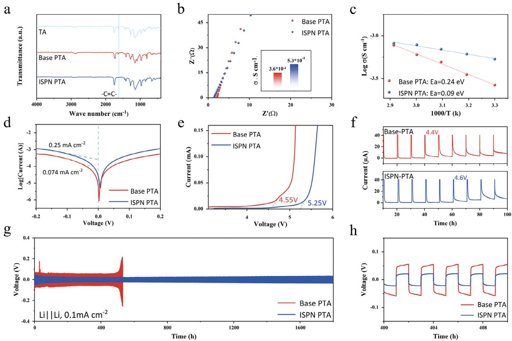
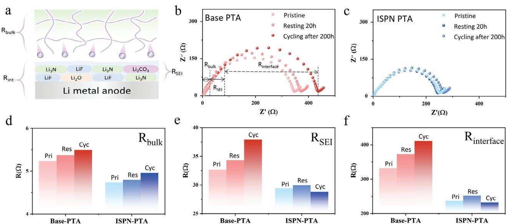
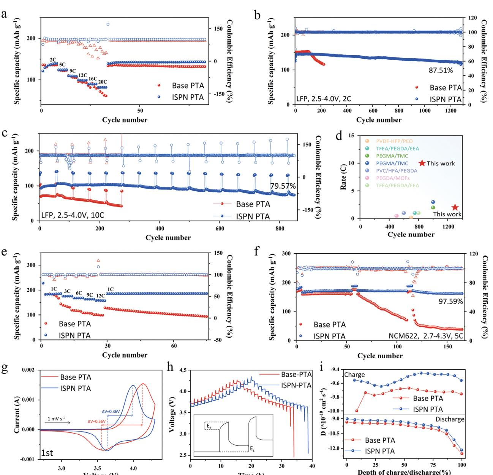
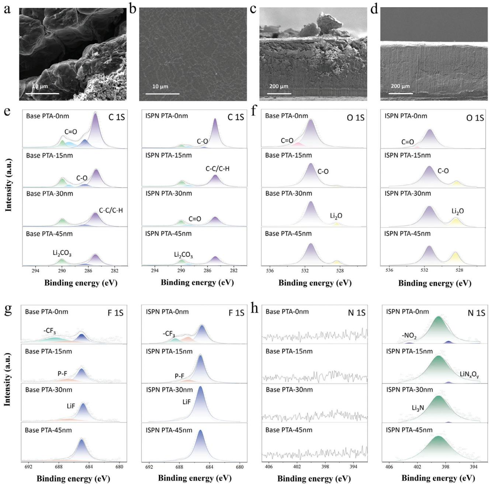
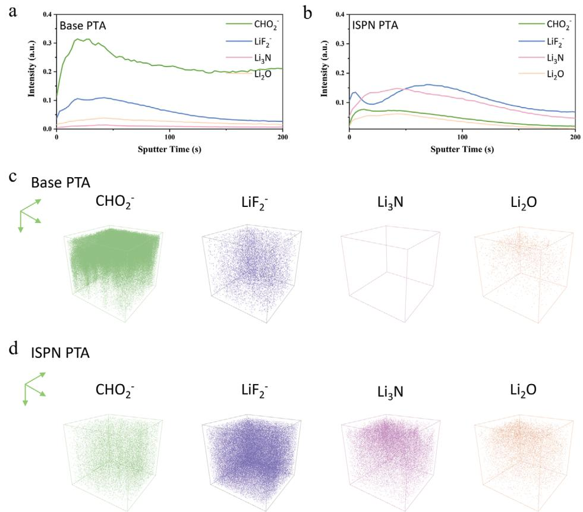

# **New Nitrate Additive Enabling Highly Stable and Conductive SEI for Fast-Charging Lithium Metal Batteries**

*Kexin Su, Piao Luo, Yuanlong Wu, Xin Song, Lianzhan Huang, Shaocong Zhang, Huiyu Song, Li Du, and Zhiming Cui\**

**Polyester-based electrolytes formed via in situ polymerization, have been regarded as one of the most promising solid electrolyte systems. Nevertheless, it is still a great challenge to address the issue of their high reactivity with metallic lithium anode by optimizing the components and properties of solid electrolyte interphase (SEI). Herein, a new class of N-containing additive, isopropyl nitrate (ISPN) that can be miscible with ester solvents is demonstrated, and a chemically stable and ion-conductive LiF-Li3N composite SEI is constructed. In addition, ISPN can induce the formation of anion-enriched solvation structures and reduces the desolvation barrier of Li+, resulting in fast transport of Li+. With the addition of ISPN, ionic conductivity of the electrolyte has nearly doubled, reaching as high as 5.3 × 10−4 S cm−1. What's more, the LiFePO4 (LFP)|ISPN-PTA|Li cell exhibits exceptional cycle stability and fast charging capabilities, maintaining stable cycling for 850 cycles at 10 C rate. Even when paired with the high-voltage cathode, the LiNi0.6Co0.2Mn0.2O2 (NCM622)|ISPN-PTA|Li cell achieves an impressive capacity retention of 97.59% after 165 cycles at 5 C. This study offers a novel approach for ester-based polymer electrolytes, paving the way toward the development of stable and high-energy Li metal battery technologies.**

## **1. Introduction**

Solid-state lithium metal batteries (SSLMB) have been considered as the candidate for the next generation power system for

K. Su, P. Luo, Y. Wu, L. Huang, H. Song, L. Du, Z. Cui The Key Laboratory of Fuel Cell Technology of Guangdong Province School of Chemistry and Chemical Engineering South China University of Technology Guangzhou 510641, China E-mail: [zmcui@scut.edu.cn](mailto:zmcui@scut.edu.cn) X. Song Guangdong Provincial Key Laboratory of Advanced Energy Storage Materials School of Materials Science and Engineering South China University of Technology Guangzhou 510641, China

S. Zhang

School of Software Engineering South China University of Technology Guangzhou 510006, China

The ORCID identification number(s) for the author(s) of this article can be found under <https://doi.org/10.1002/adfm.202409492>

**DOI: 10.1002/adfm.202409492**

their outstanding performance in energy density and safety.[\[1,2\]](#page-10-0) The polymer electrolytes formed via in-situ polymerization, have attracted increasing attention and been regarded as one of the most promising solid electrolyte systems because of their excellent compatibility with electrodes and the current battery industry processes.[\[3,4\]](#page-10-0) Generally, in situ polymerized electrolytes can be mainly divided into two categories: polyether-based electrolytes and polyester-based electrolytes. Compared to polyether-based electrolytes, polyesterbased electrolytes have improved oxidation resistance under high voltage conditions when paired with LiNi*x*Co*y*Mn*z*O2 (NCM) cathodes, providing a wider operating voltage range and higher energy-density for lithium metal batteries. However, polyesterbased electrolytes suffer from the high reactivity with lithium metal, resulting in unstable solid electrolyte interphase (SEI) and inevitable dendrite growth. Previous studies show the SEI properties especially chemical stability and ionic conductivity, play a

critical role on the performance of Li metal anode.[\[5\]](#page-10-0) The SEI between polyester-based electrolytes and lithium metal typically consists of the organic byproducts from solvent decomposition and poorly ion-conductive inorganic materials, such as Li2CO3. [\[6\]](#page-10-0) The organic byproducts usually have fragile mechanical strength and thus cannot withstand the volumetric expansion of lithium metal during cycling, resulting in continuous fracturing and rebuilding of the SEI, and the consumption of the electrolyte and active lithium, while the extremely low ionic conductivity of Li2CO3 induces high interfacial impedance and uneven charge distribution at the interface, which triggers uneven nucleation of lithium metal.[\[7–12\]](#page-10-0)

To address the above issues, many attempts have been made to optimize the composition of the SEI.[\[13–15\]](#page-10-0) Wang[\[16\]](#page-10-0) and Sun et al.[\[17\]](#page-10-0) have pioneered LiF-rich SEI, effectively inhibiting electron tunneling and minimizing interface side reactions. Nonetheless, recent research points out that the low ionic conductivity of LiF layer leads to sluggish interfacial dynamics and uneven lithium deposition, while the high ion-conductive Li3N induced by LiNO3 is widely considered an effective way to compensate the drawbacks of LiF.[\[12,18–22\]](#page-10-0) However, the application of LiNO3 in polyester-based electrolytes is hindered by its extremely low solubility.[\[23\]](#page-10-0) In addition, the symmetric resonance

**Figure 1.** Schematic diagram of the interaction mechanism of ISPN.

structure of LiNO3 is highly stable, making it susceptible to competitive reactions with other components in the electrolyte, thus complicating its reduction process.[\[24,25\]](#page-10-0) Most efforts focus on enhancing LiNO3 solubility including the use of cosolvents with high dielectric constants and Lewis acids, such as CuF2, [\[26\]](#page-10-0) tetramethylurea,[\[27\]](#page-11-0) and Sn(OTf )2. [\[28\]](#page-11-0) Nonetheless, the solubility of LiNO3 in ester-based electrolytes remains limited. On the other hand, these highly polar solvents could react vigorously with the lithium anode while transition metal Lewis acids may induce complex metal deposition, leading to short-circuiting.[\[7,23,29\]](#page-10-0) Therefore, it is highly desirable to explore novel N-containing additive and address the issue of solubility in ester-based electrolytes and is prone to form Li3N-rich SEI.

In this study, we propose a new class of liquid organic N-containing additive, isopropyl nitrate (ISPN) that possesses unique advantages: First, ISPN can be miscible with ester solvents, addressing the issue of the extremely low solubility of LiNO3 in ester-based electrolytes. Second, ISPN can not only construct stable and ion-conductive LiF-Li3N composite SEI, but also reduces the desolvation barrier of Li+, facilitating the fast transport of Li+ in the bulk electrolyte and interface between electrolyte and anode. With the addition of ISPN, the Li||LFP cell exhibits exceptional cycle stability and fast charging capabilities, maintaining stable cycling for 850 cycles at 10 C rate. Even when paired with the NCM622 cathode, the cell achieves an impressive capacity retention of 97.59% after 165 cycles at 5 C. The DFT analysis in combination with molecular dynamics simulations elucidates the underlying mechanism of isopropyl nitrate to optimize SEI and solvation structure. As shown in **Figure 1**, ISPN can disrupt the inherent resonance structure of NO3 −, and thus enhance its compatibility with ester electrolyte and promote the formation of Li3N. The introduction of ISPN facilitates the incorporation of LiPF6 into the initial solvation sheath, resulting in situ formation of a highly stable and conductive Li3N-LiF enriched interface. Moreover, the introduction of ISPN also diminishes the preferential coordination of EC and lowers the dissolution barrier, and thus significantly enhances Li+ migration in the bulk electrolyte and the interface of the electrolyte/ electrode.

### **2. Result and Discussion**

#### **2.1. The Rational Design of Highly Stable and Conductive SEI**

To investigate the relationship between the resonance structures of NO3 and its reducibility, a comparative analysis of NO3 − and ISPN is performed by electrostatic potential calculations and spin population. The electrostatic potential calculations reveal that the potential is evenly distributed and lower across the three oxygen atoms of NO3 − (**Figure 2**[a\)](#page-2-0). In contrast, the incorporation of isopropyl groups diversifies the electron cloud distribution within the nitrate group, leading to an uneven potential distribution across the ISPN molecule (Figure [2b\)](#page-2-0). This demonstrates variability in the reactivity among the three N─O bonds in ISPN. Further calculations of the single electron reduction process are conducted and accompanied by spin population. Spin population refers to the distribution of unpaired electrons across atoms within a molecule, indicating the capacity of atoms to accept electrons during reduction. The spin distribution of NO3 − (Figure [2c\)](#page-2-0) is identical across the three oxygen atoms (0.48), with the negative charge primarily localized on the nitrogen atom (0.53). Due to the resonance structure of NO3 −, accepting a single electron only changes the bond lengths within N─O bonds without breaking the chemical bonds. Conversely, the nonresonant N─O bond (N1─O4) breaks after the single electron reduction process in ISPN. The spin distribution for the nonresonant oxygen atom (O4) is 0.86, while for the resonant oxygen atoms (O2 and O3), the distributions are 0.42 and 0.46, respectively (Figure [2d\)](#page-2-0). The spin analysis result demonstrates that the nonresonant structure enables ISPN to exhibit higher reductivity than NO3 −, making it an ideal sacrificial additive to decompose on the lithium metal anode and modulate the composition of the SEI.

To further verify the reduction capability of ISPN and the regulation of SEI components in the electrolyte system, we performed calculations on the highest occupied molecular orbital (HOMO) and lowest unoccupied molecular orbital (LUMO) energies within the electrolyte system (Figure [2e\)](#page-2-0). Typically, a molecule with a lower LUMO energy is more receptive to accepting electrons and is more likely to undergo reduction.[\[30\]](#page-11-0) Our

**Figure 2.** a,b) Molecule structure and electrostatic potential of NO3 − and ISPN. c,d) Spin population analysis of a single-electron reduction process of NO3 − and ISPN. e) Calculated HOMO and LUMO of the solvents, Li salts, and additives. f) The binding energy and electrostatic potential of the Li+-solvent/anion complex. Calculated radial distribution functions (g(r)) and coordination numbers (n(r)) for g) Base-PTA and h) ISPN-PTA electrolyte based on molecular dynamics (MD) simulations. i,j) Coordination numbers of solvent molecules in Base-PTA and ISPN-PTA. k) Corresponding linear curve of the desolvation barrier. Li+(EC)3.32, Li+(EC)2.43 values were calculated via linear interpolation. l) Calculated desolvation energies for Base-PTA and ISPN-PTA electrolyte based on molecular dynamics (MD) simulations.

research findings indicate that LiPF6 has a notably low LUMO energy level of −1.64 eV, suggesting a high propensity for reduction and a preference for decomposing on the lithium anode surface to form LiF. Both LiPF6 and ISPN demonstrate lower LUMO levels than other solvent molecules and polymer units, leading to preferential decomposition at the interface. This process results in the formation of LiF-Li3N enriched SEI with robust electron insulation properties, effectively reducing the likelihood of side reactions involving other solvents and polymers on the lithium surface.

Notably, ISPN could interact with the components of the electrolyte, which enables the optimization of the solvation

structure. Herein, we quantified the binding energies between Li+ and various components in the electrolyte using density functional theory (DFT). It reveals that ISPN exhibits significantly higher binding energy with Li+, indicating its potential involvement in the Li+ solvation structure (Figure [2f\)](#page-2-0). Aimed to clarify the impact of ISPN on the solvation structure of the electrolyte system, molecular dynamics (MD) simulations were used to analyze the radial distribution function (RDF) (g(r)) and coordination numbers (n(r)) of each component around Li+ (Figure [2g,h](#page-2-0) and Figure S1, Supporting Information).[\[31\]](#page-11-0) First solvation shell is identified at ≈2.65 Å, with the PF6 − anion situated in the second solvation shell at about 4.2 Å, forming separated ion pairs (SIP). In the Base-PTA system, ethylene carbonate (EC) is the predominant solvent in the first Li+ solvation shell, with a high coordination number of 3.32, followed by the polymer PTA (0.12) and the solvents diethyl carbonate (DEC) (0.14) and ethyl methyl carbonate (EMC) (0.14) (Figure [2g,i\)](#page-2-0). However, the introduction of ISPN significantly alters this solvation structure. The coordinating dominance of EC decreases substantially (Figure [2h\)](#page-2-0), with its coordination number reduced to 2.43 (Figure [2j\)](#page-2-0). Moreover, ISPN exhibits adsorption capabilities toward PF6 − (Figure S2, Supporting Information), thereby introducing a small amount of PF6 − into the solvation sheath as ISPN enters the first solvation sheath, with its coordination number rising from 0.2 to 0.36, leading to an anion enriched solvation structure. Through detailed nuclear magnetic resonance (NMR) characterization, deeper understanding of how ISPN regulates interactions between Li+ ions, solvents, and anions within the solvation structure can be gained. In the 7Li NMR spectra of Base-PTA and ISPN-PTA, the 7Li signal shifts downfield, indicating a reduced electron cloud density (shielding effect) around Li, thereby confirming a decrease in solvent–Li ion coordination (Figure S3a, Supporting Information). Besides, the 19F spectrum of PF6 − in the ISPN-PTA shifts downfield (Figure S3b, Supporting Information), indicating a reduced electron cloud density around F, which demonstrates that the enhanced electrostatic force between PF6 − and Li+. The desolvation kinetics of Li+ is crucial for the transport of ion and deposition. Accordingly, we used quantum chemical simulations to assess the desolvation process of Li+–(solvent) complexes (Figure [2k,l\)](#page-2-0). Initial DFT calculations assessed the desolvation barriers for Li+(EC)*n* (*n* = 1–3) by determining their binding energies (Figure S4, Supporting Information). Coupled with solvent coordination numbers obtained from MD simulations, we derived the desolvation barriers for Li+(EC)3.32 and Li+(EC)2.43. Our findings indicate that with ISPN, the desolvation barrier of Li+(EC) is reduced from −493.40 to −423.45 kJ mol−1, suggesting enhanced deposition kinetics for Li+, effectively minimizing radial growth of lithium and enhancing ionic conductivity.

#### **2.2. Polymer Electrolyte Design and Electrochemical Performance Evaluation**

In order to evaluate the electrochemical performance of ISPN, we designed a solid polymer electrolyte using an in situ polymerized polyester-based network. We employed acrylic 2,2,2 trifluoroethyl ester (TFEA) as the monomer and trimethylolpropane ethoxylate triacrylate (TGMET) as the crosslinker, along with a PE separator, initiating free-radical polymerization via heating and 2,2′-azobis(2-methylpropionitrile) (AIBN), forming a crosslinked polymer structure (PTA) (Figure S5, Supporting Information). The monomer and crosslinker were blended in a 9:1 ratio, with AIBN accounting for 1 wt% of the monomer mixture, and the precursor solution underwent in situ thermal polymerization at 60 °C for 6 h. Initially, the precursor solution is a colorless, transparent liquid, which upon heating, transformed into a colorless, homogeneous, transparent solid (Figure S6, Supporting Information). To optimize the ISPN additive concentration, electrochemical impedance spectroscopy (EIS) measurements were conducted to the prepared ISPN-PTA samples with 0.5, 1, and 2 wt% of ISPN, yielding ionic conductivities of 4.7 × 10−4, 5.3 × 10−4, and 4.47 × 10−4 S cm−1 at room temperature, respectively (Figure S7, Supporting Information). With the increase in additive content, ionic conductivity improves, likely because interactions between ISPN and the polymer reduce its crystallinity, thereby enhancing the mobility of the polymer chains. However, at 2 wt% loading, the abundance of O─N groups in ISPN impeded lithium diffusion within ISPN-PTA, reducing conductivity. Furthermore, to assess oxidation voltages aligned with ionic conductivity results, linear sweep voltammetry (LSV) tests showed the highest oxidation potential at 1 wt% (Figure S8, Supporting Information). Consequently, the optimal ISPN concentration is fixed at 1 wt%, selected for further research. In addition, the solubility of LiNO3 and ISPN in the precursor solution at 1 wt% was also tested (Figure S9, Supporting Information). We found that LiNO3 is nearly insoluble in the precursor solution, whereas ISPN demonstrates good solubility. Consequently, electrolytes with and without ISPN were chosen as the experimental and control groups respectively. Formulations with ISPN are designated ISPN-PTA, while those without ISPN are termed Base-PTA.

Fourier-transform infrared (FTIR) spectroscopy was used to analyze the changes in the C═C chemical bonds before and after in situ polymerization, as shown in **Figure [3](#page-4-0)**a and Figure S10 (Supporting Information). The infrared absorption band at 1640 cm−1, corresponding to the stretch vibrations of the C═C bonds in TFEA and TGMET, disappears after polymerization, confirming the high degree of polymerization of the polymer. The conversion of TFEA after thermal initiation was determined using nuclear magnetic resonance hydrogen spectroscopy (1H-NMR). In Figure S11 (Supporting Information), peak of 4.86 ppm is the hydrogen in the C═C bond environment of TFEA. It was calculated that 97.5% of TFEA was converted. In addition, scanning electron microscopy (SEM) examined the morphology of the PE film before and after polymerization (Figure S12, Supporting Information) and the EDS mapping confirms the various elements on the polymerized PE membrane are uniformly distributed (Figure S13, Supporting Information). The electrolyte precursor effectively fills the pores in the PE film, resulting in smooth and dense surface of PE-PTA, thereby facilitating the formation of a structure with high stability and a continuous ionic conduction network. The XRD spectra of Base-PTA and ISPN-PTA exhibit an amorphous structure, characterized only by broad peaks, which indicates that the lithium salts are well-complexed with the polymer matrix (Figure S14, Supporting Information).

In addition, the crystalline peak intensity is weaker in ISPN-PTA compared to Base-PTA, due to the interactions between the NO3 groups in ISPN and the polymer chains, which enhance the mobility of the polymer segments. Ionic conductivity was

**Figure 3.** a) FTIR spectra of Base-PTA and ISPN-PTA with wavenumber range of 400–4000 cm−1. b) Ionic conductivity of Base-PTA and ISPN-PTA. c) Arrhenius plots of the ionic conductivities of the solid polymer electrolytes at 30–70 °C. d) Tafel plots of Li plating/stripping in various electrolytes obtained from Li||Li symmetric cells. e) Linear sweep voltammogram curves of Base-PTA and ISPN-PTA at a scan rate of 1 mV s−1. f) Electrochemical floating analysis of the cells assembled with NCM622 cathode for Base-PTA and ISPN-PTA. g) Cycling performances of Li||Li symmetric cells with Base-PTA and ISPN-PTA at 0.1 mA cm−2. h) Cycling performances of Li||Li symmetric cells with Base-PTA and ISPN-PTA from 400 to 410 h.

measured using alternating current impedance spectroscopy at room temperature (28 °C) for both Base-PTA and ISPN-PTA (Figure 3b and Figure S15, Supporting Information). The ionic conductivity of ISPN-PTA, which reaches 5.3 × 10−4 S cm−1, slightly surpasses that of Base-PTA at 3.6 × 10−4 S cm−1. This improvement is attributed to the reduction in polymer crystallinity. Moreover, ISPN-PTA manifests a higher lithium transference number (*t*Li+) of 0.68 than Base-PTA (0.41) (Figure S16, Supporting Information). This improvement is attributed to the formation of Li3N with high ionic conductivity on the lithium anode surface, effectively reducing the migration barrier for Li+ between the polymer and the lithium anode. Adhering to Arrhenius behavior, conductivity–temperature relationship of the SPEs shows activation energies of 0.24 eV for Base-PTA and 0.09 eV for ISPN-PTA (Figure 3c). This reduction in activation energy indicates that ISPN-PTA lowers the migration barrier for Li+, optimizes the solvation structure and reduces desolvation barrier. Further studies on electrochemical kinetics using a Li||Li symmetric cell have measured the exchange current density (*i*0). As shown in Figure 3d, the Tafel plot for ISPN-PTA displays an *i*0 value of 0.25 mA cm−2, triple that of the base electrolyte with 0.074 mA cm−2, indicating that the SEI in ISPN-PTA enhances interfacial transfer dynamics. In addition, Raman spectra (from 741 to 749 cm−1) confirm that the introduction of ISPN significantly increases free EC, weakening the coordination dominance of EC (Figure S17, Supporting Information).

The electrochemical stability of Base-PTA and ISPN-PTA was assessed using LSV as shown in Figure 3e. Base-PTA exhibits no significant oxidation peaks below 4.55 V (vs Li+/Li), while ISPN-PTA reaches an oxidation voltage of 5.25 V. To further explore the impact of the composite SEI on the oxidative stability of the electrolyte, electrochemical float tests were conducted to measure the leakage currents during constant voltage charging (Figure 3f). When paired with Li(Ni0.6Co0.2Mn0.2)O2 (NCM622) and charged at a constant 4.4 V, Base-PTA exhibits turbulent currents. In contrast, ISPN-PTA maintains stable currents between 4.1 and 4.5 V, with low leakage currents even at 4.6 V. These results further suggest that the construction of the composite SEI contributes to the improved electrochemical stability of the electrolyte.

In Li||Li symmetric cells, polarization current generation is influenced by various processes. Key sources of polarization at the anode include electrodissolution of existing lithium dendrites (*I*den), dissolution of planar bulk lithium (*I*bulk), and surface pitting (*I*pit). At the cathode, critical processes involve the

**Figure 4.** a) Lithium ions deposition behavior at lithium metal surface and electrochemical resistance distribution during cell charge/discharge cycling. b,c) Typical Nyquist plots of Li|Base-PTA|Li and Li|ISPN-PTA|Li at different cycle times. Resistance comparison of Base-PTA and ISPN-PTA, including d) Bulk impedance *R*Bulk, e) SEI Impedance *R*SEI, and f) Interfacial impedance *R*Interface.

electrodeposition on the surfaces of lithium dendrites (*I*grow) and currents related to dendrite nucleation (*I*nuc). Analyzing Li||Li symmetric cells thus provides a comprehensive understanding of electrochemical characteristics on both the anode and cathode sides of the lithium metal. Figure S18 (Supporting Information) shows that critical current density (CCD) tests on the symmetric ISPN-PTA cell demonstrates an increase from 0.3 to 1.7 mA cm−2, indicating that ISPN-PTA shows improved capability in inhibiting dendrite formation and potential for cycling stably under high current densities. Further interfacial stability investigations of Li||Li symmetric cells involved long-term cycling performance tests. The Li|ISPN-PTA|Li cell shows stable electrochemical cycling performance at a current density of 0.1 mA cm−2, with polarization voltage consistently maintained at 0.02 V for over 1900 h (Figure [3g,h\)](#page-4-0). After cycling, the cell impedance slightly decreased (Figure S19, Supporting Information). In contrast, the Li|Base-PTA|Li cell displays a polarization voltage of 0.05 V. The elevated polarization voltage in Base-PTA is attributed to the thick and uneven SEI at the Li/electrolyte interface. Concentration polarization leads to performance degradation in Base-PTA cell, with polarization voltage sharply increasing and rapid shortcircuiting occurring after just 500 h, likely due to slow interfacial kinetics that causes uneven lithium deposition and subsequent dendrite puncture. Furthermore, the cycling performance of the Li|ISPN-PTA|Li cell was evaluated under high current densities of 0.5 and 1 mA cm−2. The Li|ISPN-PTA|Li cell shows stable electrochemical cycling performance at a current density of 0.5 mA cm−2 for over 500 h, while it could cycle for over 300 h at a current density of 1 mA cm−2 (Figure S20, Supporting Information). Tests on the roughness of surface morphology and mechanical properties of lithium deposition in symmetric cells were conducted by atomic force microscopy (AFM). The findings show that lithium deposition is uniform in ISPN-PTA, while it appears rough with more dendrite formation in Base-PTA (Figure S21a,b, Supporting Information). Moreover, the mechanical properties of the lithium surface in ISPN-PTA significantly surpass those in Base-PTA (Figure S21c,d, Supporting Information). This suggests that the inorganic-rich SEI in ISPN-PTA is more conducive to handle the volumetric changes of lithium metal during cycling.

#### **2.3. The Composite SEI Accelerates Interfacial ion Transport**

To more thoroughly investigate the dynamics of SEI formation from assembly to cycling stability in symmetric cells, EIS measurements were conducted on the cells at various stages: pristine, after resting for 20 h, and post 200 h of cycling. As depicted in Figure S22 (Supporting Information), the impedance of the Base-PTA symmetric cell significantly increases after 200 h of cycling, which is attributed to the low ionic conductivity of the single-LiF SEI, thus increasing the migration barrier for Li+. Conversely, the ISPN-PTA cell showed only a slight increase in impedance after 20 h of rest, but a decrease after 200 h of cycling compared to the initial measurements, suggesting that the SEI formed significantly reduces the cell impedance.

As illustrated in **Figure 4**a, the movement of Li+ on the lithium metal surface typically involves several key processes: a) migration of Li+ within the polymer matrix; b) desolvation of Li+ at the SEI layer; and c) deposition of Li+ across the SEI layer onto the lithium metal surface.[\[32\]](#page-11-0) In Li||Li symmetric cells, the dynamics of the Li+ interface can be explored through EIS. In this analysis, the ultra-high frequency region reflects the mass transfer resistance within the polymer (*R*bulk). During the desolvation process, the transport resistance of Li+ at the SEI (*R*SEI) and the charge transfer impedance (*R*CT) typically overlap in the mid and high-frequency ranges, resulting in a composite surface resistance (*R*Interface).[\[33\]](#page-11-0) This behavior was modeled in the equivalent circuit shown in Figure S23 (Supporting Information). The Nyquist plots demonstrate the impedance changes in the symmetric Li||Li cells using Base-PTA and ISPN-PTA before and after cycling (Figure [4b,c\)](#page-5-0). Throughout the experiments, ISPN-PTA displays no significant impedance changes, whereas a clear upward trend in *R*bulk is observed in the Base-PTA cells, likely due to concentration polarization within the electrolyte (Figure [4d\)](#page-5-0). After resting for 20 h, both cell types exhibited a slight increase in *R*SEI (Figure [4e\)](#page-5-0). After 200 h of cycling, the *R*SEI of ISPN-PTA decreased to 28.8 Ω, evidencing the formation of a high ionic conductivity SEI. In addition, after 200-h cycling, the *R*interface of Base-PTA escalated to 410.92 Ω, whereas it decreases to 231.91 Ω for ISPN-PTA (Figure [4f\)](#page-5-0).

#### **2.4. The Performance of Bilayer SEI in Practical Li Metal Batteries**

We constructed Li||LFP full cells utilizing both Base-PTA and ISPN-PTA electrolytes and conducted tests at room temperature within the voltage range of 2.5–4.0 V to evaluate their rate and cycling performances. **Figure [5](#page-7-0)**a illustrates that LFP|Base-PTA|Li cell exhibits notably lower discharge capacities and, with a marked reduction in capacity as current density increased. In contrast, the LFP|ISPN-PTA|Li cell displays a stable voltage plateau, minimal overpotentials, and superior rate performance, achieving discharge capacities of 139, 124, 108.9, 99, 89.2, and 81.9 mAh g−1 at 2, 5, 9, 12, 16, and 20 C rates, respectively. Notably, the LFP|ISPN-PTA|Li cell maintains specific capacities at extremely high rates and almost fully recovers its capacity when reverted to the original current density of 2 C, demonstrating remarkable capacity recovery. Moreover, it shows no capacity degradation after 50 cycles at the original current density, indicating exceptional cycling stability. The data clearly show that the LFP|ISPN-PTA|Li cell exhibits stable cycling behavior, maintaining an impressive specific capacity of 132 mAh g−1 and an average Coulombic efficiency (CE) of 99.9% at 2 C. After 1300 cycles, it exhibits a remarkable capacity retention rate of 87.51% (Figure [5b\)](#page-7-0). In addition, after cycling, there is a significant reduction in impedance (Figure S24, Supporting Information). Conversely, the LFP|Base-PTA|Li cell presents a lower discharge capacity of 120 mAh g−1 and a decreased CE of 95.4%, underlining the rapid degradation of the cell due to disordered lithium dendrite growth, which prompts continuous growth of inactive lithium and persistent electrolyte decomposition. Considering the specific capacities maintained by ISPN at high rates, we further tested the performance of the Li||LFP cell at 10 C rate.

After initial activation at a low rate of 1 C for five cycles, a high-rate fast charging test at 10 C was conducted. To enhance cell lifespan, 5 cycles of 1 C discharge are performed after every 50 cycles of high-rate discharge. After 850 cycles, the LFP|Base-PTA|Li cell achieved a remarkable capacity retention of 79.57% (Figure [5c](#page-7-0) and Figure S25, Supporting Information). Even compared with previously reported LFP-based solid-state LMBs, electrochemical performance of LFP|ISPN-PTA|Li cell is still impressive (Figure [5d\)](#page-7-0).[\[34–40\]](#page-11-0) However, the LFP|Base-PTA|Li cell capacity exhibits rapid decline after merely 100 cycles and a mere 46.2% capacity retention after 300 cycles, primarily due to uneven electrodeposition of Li+ causing significant volumetric changes at the lithium anode. This leads to the rupture of the fragile SEI, triggering numerous side reactions and continuous electrolyte consumption. Moreover, in full cells fabricated using LFP cathodes with a high areal capacity of 13.5 mg cm−2, the LFP|ISPN-PTA|Li cell cycles stably for 100 cycles, whereas LFP|Base-PTA|Li cell exhibits severe polarization after only 40 cycles, leading directly to cell failure (Figure S26, Supporting Information).

With the confirmed superior high-voltage stability of ISPN-PTA, the NCM622||Li cells were assembled to evaluate the effect of hybrid SEI on the performance of full cells at a voltage range of 2.7–4.3 V. The NCM622|ISPN-PTA|Li cell showcases outstanding specific capacities and capacity recovery. The discharge capacities at rates of 1, 3, 6, 9, and 12 C are recorded 165, 157.5, 151.5, 147.1, and 143.3 mAh g−1, and the cell manages to cycle stably for 50 cycles without any decay when returns to 1 C (Figure [5e\)](#page-7-0). In contrast, the NCM622|Base-PTA|Li cell has a rapid capacity decay with increasing charge–discharge rates, and upon returning to 1 C, the discharge capacity cannot fully recover, with only a 70% capacity retention after 50 cycles. Furthermore, during cycle stability tested at 1 C, the discharge capacity of NCM622|Base-PTA|Li cell quickly falls to 58% of its initial capacity after 185 cycles. By comparison, the NCM622|ISPN-PTA|Li cell maintains a 75.4% capacity retention after 600 cycles (Figure S27, Supporting Information). To verify the rapid interface kinetics of the ISPN-PTA electrolyte, we also tested the NCM622|ISPN-PTA|Li cell at a 2 C rate. Following 435 cycles, the NCM622|ISPN-PTA|Li cell maintains a capacity retention rate of 80% along with a high Coulombic efficiency of 99.4% (Figures S28 and S29, Supporting Information). Notably, at a 5 C cycling rate, the NCM622|ISPN-PTA|Li cell exhibits an outstanding cycling stability. The NCM622|ISPN-PTA|Li cell is first subjects to five activation cycles at a 1 C rate, where it achieved an impressive discharge specific capacity of 160.1 mAh g−1 during the first cycle. When cycled at 5 C, the NCM622|ISPN-PTA|Li cell starts with an initial discharge specific capacity of 149.9 mAh g−1. Remarkably, it maintains a capacity of 146.1 mAh g−1 even after 165 cycles, corresponding to a capacity retention of 97.59% (Figure [5f](#page-7-0) and Figure S30, Supporting Information). In addition, the redox properties of NCM622|| Li cells were investigated using cyclic voltammetry (CV). The NCM622|ISPN-PTA|Li cell demonstrates a narrower potential window, exhibiting lower concentration polarization (Figure [5g\)](#page-7-0). Results from the galvanostatic intermittent titration technique (GITT) and the calculated Li+ diffusion coefficients (*D*Li+) indicate that cathodes cycled with the ISPN-PTA electrolyte exhibits lower charge and discharge polarization voltages and higher *D*Li+ (Figure [5h,i\)](#page-7-0).

To further validate the effectiveness of the LiF-Li3N composite SEI, we assessed the cyclability of the NCM811|ISPN-PTA|Li cells. During a pre-cycling process at 0.1 C, the discharge capacity of the NCM811|ISPN-PTA|Li cell was recorded at 197.3 mAh g−1. In subsequent cycling at 0.5 C, the NCM811|ISPN-PTA|Li cell maintains a stable discharge capacity of ≈180 mAh g−1 over 150 cycles, with a capacity retention remaining around 81.18% (Figure S31, Supporting Information). In addition, the NCM811|ISPN-PTA|Li cell using NCM811 cathodes with a high areal capacity of 10.8 mg cm−2 could maintain a 82.50% capacity retention after 90 cycles at 0.3 C (Figure S32, Supporting Information).

Moreover, ISPN-PTA is proved to possess excellent safety and feasibility in the solid-state lithium metal pouch cells. Figure S33 (Supporting Information) presents the different states of the pouch cell lighting up LED lamps. Upon bending, piercing, and

**Figure 5.** a) Rate performance in LFP|Base-PTA|Li and LFP|ISPN-PTA|Li cells. b) Long-term cycling performance in LFP|Base-PTA|Li and LFP|ISPN-PTA|Li cells at 2 C. c) Long-term cycling performance in LFP|Base-PTA|Li and LFP|ISPN-PTA|Li cells at 10 C. d) Comparison of the electrochemical performance of LFP|ISPN-PTA|Li cells with recent reported work. e) Rate performance in NCM622|Base-PTA|Li and NCM622|ISPN-PTA|Li cells. f) Long-term cycling performance in NCM622|Base-PTA|Li and NCM622|ISPN-PTA|Li cells at 5 C. g) Initial cycles of cyclic voltammograms of NCM622||Li at a scan rate of 1 mV s−1 between 2.7 and 4.3 V. h) Charge–discharge voltage profiles of GITT technique measurements after 50 cycles and i) corresponding logDLi+ of NCM622 cathode in different electrolytes.

cutting, no burning or explosion occurred, and the LED lamps remained illuminated.

#### **2.5. Demonstration of Composite SEI Formation for Enhanced Protection of Li Metal Anodes**

To deeply understand the influence of ISPN on Li deposition behavior, **Figure 6**[a,b](#page-8-0) illustrates the surface morphologies of lithium anodes in the Li|Base-PTA|Li and Li|ISPN-PTA|Li cells, respectively, after 200 h of cycling at 0.1 mA cm−2. In the Li|Base-PTA|Li cell, the lithium anode exhibits mossy lithium deposits with noticeable cracks following constant current charge– discharge cycles, which results from uneven lithium deposition and suboptimal Li+ ion transfer dynamics. Notably, a smooth and dense Li deposition layer forms in the Li|ISPN-PTA|Li cell, demonstrating its great compatibility with Li compared to Base-PTA. ISPN-PTA effectively alleviates the uneven growth of

**Figure 6.** SEM analysis of the Li metal obtained from Li||Li symmetric cells after 50 cycles: top image of samples cycled with the a) Base-PTA and b) ISPN-PTA electrolytes, cross-sectional images of samples cycled with the c) Base-PTA and d) ISPN-PTA electrolytes. e–h) The comparison of XPS C 1s, O 1s, F 1s, and N 1s spectra of Li-metal anodes after 50 cycles in Li||Li symmetric cells with various etching time in different electrolytes.

lithium dendrites, thus facilitating an extended stable cycle life. Furthermore, cross-sectional SEM images (Figure 6c,d) reveal that the lithium deposition in the Li|Base-PTA|Li cell is sparse and uneven, caused by volumetric expansion of the lithium metal anode. This issue stems from the single LiF-SEI layer in the Li|Base-PTA|Li cell, which slows Li+ dynamics at the interface and leads to uneven lithium deposition. In addition, the SEI in the Li|Base-PTA|Li cell, rich in organic components, lacks the enough mechanical strength to buffer significant volumetric changes during lithium deposition. In contrast, Figure 6d shows that the Li deposition layer in the Li|ISPN-PTA|Li cell is uniform and dense, attributed to the inorganic-rich composite SEI that provides robust mechanical strength and rapid interface dynamics, enabling fast Li+ deposition and stripping.

X-ray photoelectron spectroscopy (XPS) was used to analyze the chemical composition of the SEI in different electrolyte systems. In the C 1s spectra, peaks for C─C/C─H, C─O, C═O, and Li2CO3, likely originating from organic decomposition products

**Figure 7.** a,b) ToF-SIMS depth profiles of the Base-PTA and ISPN-PTA derived SEIs after 100 h cycles. c,d) 3D reconstruction of the Base-PTA and ISPN-PTA derived SEIs represented.

of the electrolyte, are evident (Figure [6e\)](#page-8-0). In ISPN-PTA system, these peaks show lower intensity compared to those in Base-PTA system, and this difference becomes more pronounced upon increasing sputtering depth. This indicates that an even SEI formed in the Li|ISPN-PTA|Li cell inhibits the further decomposition of electrolyte components.

This conclusion is further supported by the O 1s spectra (Figure [6f\)](#page-8-0), where the C═O peak intensity from the decomposition products in ISPN-PTA is significantly lower than in Base-PTA. In addition, as sputtering depth increases, the intensity of the Li2O peak in ISPN-PTA progressively increases, substantially exceeding that in Base-PTA. The presence of Li2O is likely due to the decomposition of ISPN. Moreover, compared to the widely recognized insulating layer of LiF, an Li2O layer offers less restriction to Li+ transport, has a lower diffusion barrier, and lower interface resistance, which is more conducive to rapid and uniform Li plating/striping.[\[41\]](#page-11-0)

In the F 1s spectra, a peak for CF3 appears on the surface layer, likely due to the residue of the polyester-based electrolyte formed by in situ polymerization on the lithium anode surface (Figure [6g\)](#page-8-0). However, the intensity of the CF3 peak is significantly stronger in Base-PTA than in ISPN-PTA, supporting the notion that the electrolyte components decompose on the lithium anode surface more prevalently in Base-PTA system. Furthermore, in ISPN-PTA, the intensity of the LiF peak increases with sputtering depth, indicating the formation of an SEI dominated by LiF near the lithium anode. The preferential decomposition of LiPF6 at the lithium metal surface aligns with the results from DFT calculations.

More importantly, in the ISPN-PTA electrolyte system, an additional peak of Li3N appears in the SEI, confirming the efficient reduction of ISPN at the anode (Figure [6h\)](#page-8-0). Moreover, peaks of incompletely decomposed ─NO2 and LiO*x*N*y* are also present in the surface layer, but these signals diminish with increased sputtering depth. The signal intensity of the Li3N peak remains almost constant, indicating a uniform distribution of Li3N throughout the SEI. Li3N, known for its exceptionally low Li+ diffusion barrier, high ionic conductivity, and low electronic conductivity,[\[42\]](#page-11-0) ensures rapid Li+ transport across the anode/electrolyte interface. This facilitates dendrite-free Li deposition and supports the rapid charging and discharging capability.

Time-of-flight secondary ion mass spectrometry (ToF-SIMS) provides a detailed spatially resolved depth profile of the SEI chemical composition. Depth profiles from the ToF-SIMS analysis of Base-PTA and ISPN-PTA electrolytes after 100 cycles are shown in **Figure 7**a,b. In the outer layer of the SEI, the concentration of CHO2 − (representing organic materials) is higher than that of LiF2 − (representing LiF). In contrast, ISPN-PTA system has higher levels of LiF2 − and lower levels of CHO2 −. Similar investigations of the SEI formed in Base-PTA system reveal an outer layer enriched with CHO2 − and less LiF2 −, suggesting continuous side reactions between the Li anode and

ester-based solvents. This indicates that the polymer backbone and solvent molecules react with the Li anode at the interface after the Li+ transportation across the bulk electrolyte. In addition, a strong Li3N signal appears in the SEI formed by ISPN-PTA, displaying a uniform distribution as the sputtering depth increasing. The illustrations include a 3D rendering of top-down sputtering depth, confirming the formation of a composite LiF-Li3N SEI (Figure [7c,d\)](#page-9-0). In addition, a Li2O signal can be observed in Figure [7,](#page-9-0) which is consistent with the XPS results.

## **3. Conclusion**

In summary, we design a novel N-containing additive (ISPN) with a distinctive non-resonant structure and excellent solubility in ester electrolytes, effectively addressing the serious side reaction issues between ester-based polymer electrolyte systems and lithium metal anodes. The introduction of ISPN has achieved the in situ formation of an LiF-Li3N enriched SEI in ester-based polymer electrolyte. On the other hand, DFT and MD simulations have demonstrated that ISPN optimizes the Li+ solvation structure and facilitates rapid Li desolvation at the anode interface. The rapid interface kinetics enhances the performance of LFP and NCM622 batteries under high rate. The LFP||Li full cell exhibits excellent rate performance and capacity recovery at 20 C. Furthermore, the LFP||Li full cell can stably cycle 850 times at 10 C, while the high-voltage NCM622 cathode retains 97.59% of its capacity after 165 cycles at 5 C. This work provides an effective strategy for building a Li3N-rich SEI using a new nitrate-based ester, achieving stable and fast-charging SSLMBs, as well as potential perspective in energy storage.

## **Supporting Information**

Supporting Information is available from the Wiley Online Library or from the author.

## **Acknowledgements**

K.S., P.L., and Y.W. contributed equally to this work. This work was financially supported by the National Natural Science Foundation of China (22072048, 22372062) and Guangdong Provincial Department of Science and Technology (2022A0505050013). The authors acknowledge Beijing PARATERA Technology Co. Ltd. for providing high-performance and AI computing resources for contributing to the research results reported within this paper. URL: [http://cloud.paratera.com.](http://cloud.paratera.com)

## **Conflict of Interest**

The authors declare no conflict of interest.

## **Data Availability Statement**

The data that support the findings of this study are available from the corresponding author upon reasonable request.

## **Keywords**

additives, fast-charging, in situ polymerization, lithium metal batteries, solid electrolyte

- [1] Y. Zheng, Y. Yao, J. Ou, M. Li, D. Luo, H. Dou, Z. Li, K. Amine, A. Yu, Z. Chen, *Chem. Soc. Rev.* **2020**, *49*, 8790.
- [2] J. C. Bachman, S. Muy, A. Grimaud, H.-H. Chang, N. Pour, S. F. Lux, O. Paschos, F. Maglia, S. Lupart, P. Lamp, L. Giordano, Y. Shao-Horn, *Chem. Rev.* **2016**, *116*, 140.
- [3] M. Sun, Z. Zeng, W. Zhong, Z. Han, L. Peng, S. Cheng, J. Xie, *Batter. Supercaps* **2022**, *5*, 202200338.
- [4] V. Vijayakumar, B. Anothumakkool, S. Kurungot, M. Winter, J. R. Nair, *Energy Environ. Sci.* **2021**, *14*, 2708.
- [5] Q. Wang, Z. Yao, C. Zhao, T. Verhallen, D. P. Tabor, M. Liu, F. Ooms, F. Kang, A. Aspuru-Guzik, Y.-S. Hu, M. Wagemaker, B. Li, *Nat. Commun.* **2020**, *11*, 4188.
- [6] X. Zhang, X. Chen, X. Cheng, B. Li, X. Shen, C. Yan, J. Huang, Q. Zhang, *Angew. Chem., Int. Ed.* **2018**, *57*, 5301.
- [7] X. Wang, S. Li, W. Zhang, D. Wang, Z. Shen, J. Zheng, H. L. Zhuang, Y. He, Y. Lu, *Nano Energy* **2021**, *89*, 106353.
- [8] Z. Wang, L. Hou, Z. Li, J. Liang, M. Zhou, C. Zhao, X. Zeng, B. Li, A. Chen, X. Zhang, P. Dong, Y. Zhang, J. Huang, Q. Zhang, *Carbon Energy* **2023**, *5*, e283.
- [9] Y. Tan, Z. Liu, J. Zheng, Z. Ju, X. He, W. Hao, Y. Wu, W. Xu, H. Zhang, G. Li, L. Zhou, F. Zhou, X. Tao, H. Yao, Z. Liang, *Adv. Mater.* **2024**, *36*, 2404815.
- [10] K. Xu, *Chem. Rev.* **2004**, *104*, 4303.
- [11] S. Kim, S. O. Park, M.-Y. Lee, J.-A. Lee, I. Kristanto, T. K. Lee, D. Hwang, J. Kim, T.-U. Wi, H.-W. Lee, S. K. Kwak, N.-S. Choi, *Energy Storage Mater.* **2022**, *45*, 1.
- [12] Z. Zhang, J. Wang, S. Zhang, H. Ying, Z. Zhuang, F. Ma, P. Huang, T. Yang, G. Han, W.-Q. Han, *Energy Storage Mater.* **2021**, *43*, 229.
- [13] P. Zhou, Y. Xia, W. Hou, S. Yan, H.-Y. Zhou, W. Zhang, Y. Lu, P. Wang, K. Liu, *Nano Lett.* **2022**, *22*, 5936.
- [14] J. Wang, Y. Yamada, K. Sodeyama, C. H. Chiang, Y. Tateyama, A. Yamada, *Nat. Commun.* **2016**, *7*, 12032.
- [15] J. Holoubek, H. Liu, Z. Wu, Y. Yin, X. Xing, G. Cai, S. Yu, H. Zhou, T. A. Pascal, Z. Chen, P. Liu, *Nat. Energy* **2021**, *6*, 303.
- [16] J. Chen, X. Fan, Q. Li, H. Yang, M. R. Khoshi, Y. Xu, S. Hwang, L. Chen, X. Ji, C. Yang, H. He, C. Wang, E. Garfunkel, D. Su, O. Borodin, C. Wang, *Nat. Energy* **2020**, *5*, 386.
- [17] H. Peng, T. Long, J. Peng, H. Chen, L. Ji, H. Sun, L. Huang, S. Sun, *Adv. Energy Mater.* **2024**, *14*, 2400428.
- [18] Y. Wang, T. Li, X. Yang, Q. Yin, S. Wang, H. Zhang, X. Li, *Adv. Energy Mater.* **2024**, *14*, 2303189.
- [19] S. Yuan, S. Cao, X. Chen, J. Wei, Z. Lv, H. Xia, J. Li, H. Zhang, L. Liu, C. Tian, L. Chen, W. Zhang, Z. Xing, H. Li, S. Li, Q. Zhu, X. Feng, X. Chen, *Adv. Mater.* **2024**, *36*, 2311327.
- [20] Z. Wen, W. Fang, F. Wang, H. Kang, S. Zhao, S. Guo, G. Chen, *Angew. Chem., Int. Ed.* **2024**, *63*, 202314876.
- [21] Q. Wang, Y. Ma, Y. Wang, X. He, D. Zhang, Z. Li, H. Sun, Q. Sun, B. Wang, L.-Z. Fan, *Chem. Eng. J.* **2024**, *484*, 149757.
- [22] D. Chai, H. Yan, X. Wang, X. Li, Y. Fu, *Adv. Funct. Mater.* **2024**, *34*, 2310516.
- [23] Q. Zhao, N. W. Utomo, A. L. Kocen, S. Jin, Y. Deng, V. X. Zhu, S. Moganty, G. W. Coates, L. A. Archer, *Angew. Chem.* **2022**, *134*, 202116214.
- [24] L. Hou, N. Yao, J. Xie, P. Shi, S. Sun, C. Jin, C. Chen, Q. Liu, B. Li, X. Zhang, Q. Zhang, *Angew. Chem., Int. Ed.* **2022**, *61*, 202201406.
- [25] S. Zhang, H. Liu, Z. Liu, Y. Zhao, J. Yan, Y. Zhang, F. Liu, Q. Liu, C. Liu, G. Sun, Z. Wang, J. Yang, Y. Ren, *Adv. Funct. Mater.* **2024**, [https:](https://onlinelibrary.wiley.com/doi/10.1002/adfm.202401377) [//onlinelibrary.wiley.com/doi/10.1002/adfm.202401377.](https://onlinelibrary.wiley.com/doi/10.1002/adfm.202401377)

- [26] C. Yan, Y. Yao, X. Chen, X. Cheng, X. Zhang, J. Huang, Q. Zhang, *Angew. Chem., Int. Ed.* **2018**, *57*, 14055.
- [27] Z. Piao, P. Xiao, R. Luo, J. Ma, R. Gao, C. Li, J. Tan, K. Yu, G. Zhou, H. Cheng, *Adv. Mater.* **2022**, *34*, 2108400.
- [28] W. Zhang, Q. Wu, J. Huang, L. Fan, Z. Shen, Y. He, Q. Feng, G. Zhu, Y. Lu, *Adv. Mater.* **2020**, *32*, 2001740.
- [29] W. Chen, Y. Hu, W. Lv, T. Lei, X. Wang, Z. Li, M. Zhang, J. Huang, X. Du, Y. Yan, W. He, C. Liu, M. Liao, W. Zhang, J. Xiong, C. Yan, *Nat. Commun.* **2019**, *10*, 4973.
- [30] S. Gu, S. Zhang, J. Han, Y. Deng, C. Luo, G. Zhou, Y. He, G. Wei, F. Kang, W. Lv, Q. Yang, *Adv. Funct. Mater.* **2021**, *31*, 2102128.
- [31] L. Sheng, Q. Wang, X. Liu, H. Cui, X. Wang, Y. Xu, Z. Li, L. Wang, Z. Chen, G.-L. Xu, J. Wang, Y. Tang, K. Amine, H. Xu, X. He, *Nat. Commun.* **2022**, *13*, 172.
- [32] H. Zhou, Y. Ou, S. Yan, J. Xie, P. Zhou, L. Wan, Z. Xu, F. Liu, W. Zhang, Y. Xia, K. Liu, *Angew. Chem., Int. Ed.* **2023**, *62*, 202306948.
- [33] C. Wang, X. Zhao, D. Li, C. Yan, Q. Zhang, L. Fan, *Angew. Chem., Int. Ed.* **2024**, *63*, 202317856.
- [34] S. Qin, Z. Wang, Y. Ren, Y. Yu, Y. Xiao, J. Chen, J. Zhang, S. Zhang, C. Sun, J. Xiao, L. Zhang, W. Hu, H. Yang, *Nano Energy* **2024**, *119*, 109075.
- [35] K. Guo, S. Li, J. Wang, Z. Shi, Y. Wang, Z. Xue, *ACS Energy Lett.* **2024**, *9*, 843.
- [36] Y. Liu, P. Wang, Z. Yang, L. Wang, Z. Li, C. Liu, B. Liu, Z. Sun, H. Pei, Z. Lv, W. Hu, Y. Lu, G. Zhu, *Adv. Mater.* **2024**, *36*, 2400970.
- [37] S. Qin, Y. Cao, J. Zhang, Y. Ren, C. Sun, S. Zhang, L. Zhang, W. Hu, M. Yu, H. Yang, *Carbon Energy* **2023**, *5*, e316.
- [38] Y. Jin, R. Lin, Y. Li, X. Zhang, S. Tan, Y. Shuai, Y. Xiong, *Angew. Chem., Int. Ed.* **2024**, *63*, 202403661.
- [39] H. Wang, Q. Wang, X. Cao, Y. He, K. Wu, J. Yang, H. Zhou, W. Liu, X. Sun, *Adv. Mater.* **2020**, *32*, 2001259.
- [40] Y. Gao, G. Wu, W. Fang, Z. Qin, T. Zhang, J. Yan, Y. Zhong, N. Zhang, G. Chen, *Angew. Chem., Int. Ed.* **2024**, *63*, 202403668.
- [41] H. Jiang, J. Liu, B. Tang, Z. Yang, X. Liang, X. Yu, Y. Gao, J. Wei, Z. Zhou, *Adv. Funct. Mater.* **2024**, *34*, 2306399.
- [42] W. Cao, W. Chen, M. Lu, C. Zhang, D. Tian, L. Wang, F. Yu, *J. Energy Chem.* **2023**, *76*, 648.