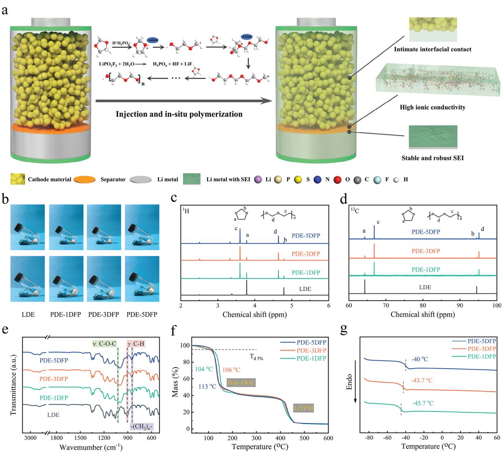
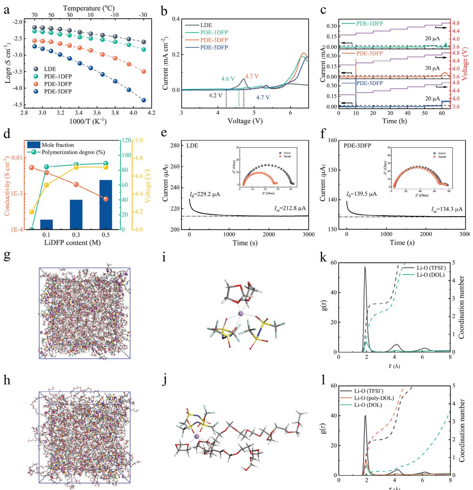
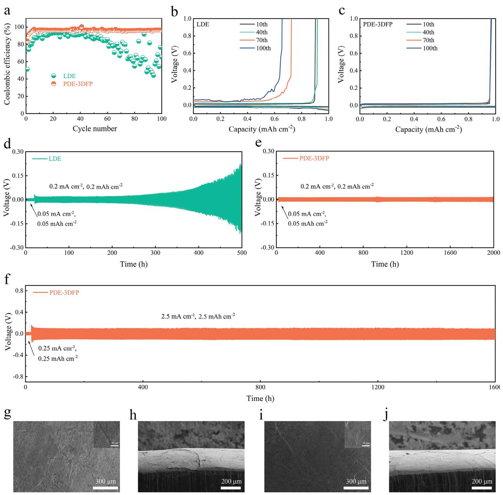
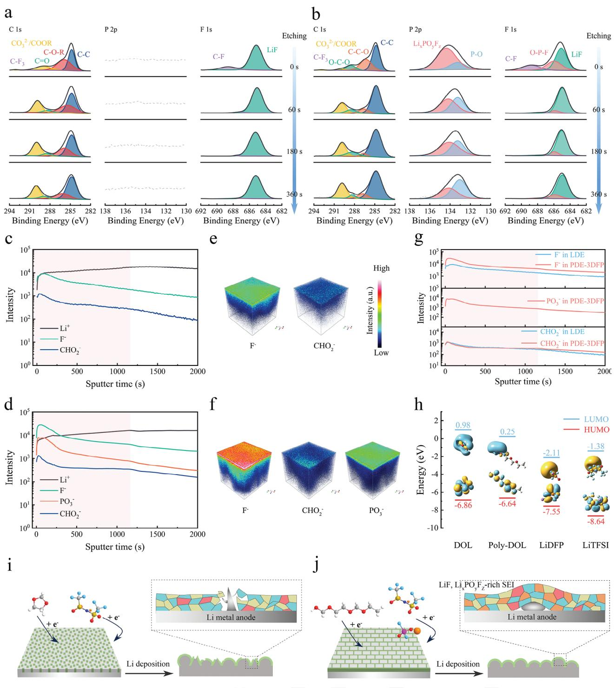
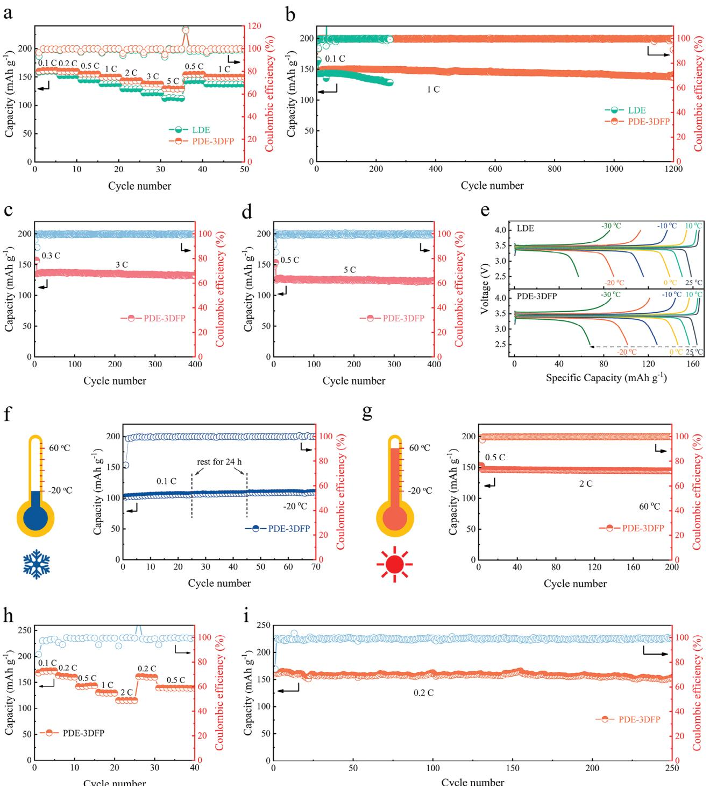

# **Interphase Optimum via Synergistic Effect of Poly(1,3-dioxolane) Electrolytes and Lithium Difluorophosphate for Stable Lithium Metal Batteries**

*Anyi Hu, Zhu Liao, Qirui Yang, Jun Huang, Zhuangzhuang Wei, Yukun Sun, Enyou Zhao, Zhengxi Zhang,\* Li Yang,\* Nagahiro Saito, and Akihiro Orita*

**Solid polymer electrolytes (SPEs) hold great promise for future applications of high-energy lithium metal batteries (LMBs). Unfortunately, inadequate room-temperature ionic conductivity, sluggish interfacial charge transport, and uncontrolled electrode/electrolyte interface reactions severely limit their widespread applications. Herein, poly(1,3-dioxolane) electrolytes (PDEs) are prepared in situ by introducing lithium difluorophosphate (LiDFP, LiPO2F2) as a multifunctional additive, which not only achieves excellent ionic conductivity but facilitates interfacial charge transport. Meanwhile, a high-mechanicalstability organic–inorganic hybrid solid electrolyte interphase (SEI) is formed by the synergistic effect of PDEs and LiDFP. The enrichment of LiF and LixPOyFz species in SEI formed by the preferential reduction of LiDFP ensures outstanding mechanical stability, and the ring-opening polymerization of 1,3-dioxolane provides the SEI excellent adaptability to the repetitive volume changes of lithium metal anode, which mitigates crack and regeneration of SEI and reduces side reactions between active Li and electrolytes. Therefore, based on PDEs, the symmetric Li cell enables steady cycling for 2000 h. The Li-LiFePO4 cell achieves superior long-term cycling stability (over 1200 cycles) and wide operating temperature (−20 ∼ 60 °C). Also, the Li-LiNi0.6Mn0.2Co0.2O2 exhibits favorable cycling stability. This study provides solutions to ongoing pain point issues of SPEs and facilitates practical applications of SPEs in high-energy LMBs.**

## **1. Introduction**

With the rapid growth of portable mobile devices, electric vehicles, and other technological advancements, the need for

**DOI: 10.1002/adfm.202410282**

high-energy-density electrical energy storage and conversion devices is becoming increasingly critical, thus necessitating the integration of lithium metal anodes with an exceptional theoretical specific capacity of 3860 mAh g−1 and the lowest potential of −3.04 V versus the standard hydrogen electrode.[\[1\]](#page-9-0) Nevertheless, the practical applications of lithium metal anodes have been plagued by safety concerns stemming from the uncontrolled formation of lithium dendrites when undergoing repeated stripping and plating cycles in traditional liquid electrolytes.[\[2\]](#page-9-0) The substitution of conventional organic liquid electrolytes with solid polymer electrolytes (SPEs) has been considered an effective strategy to tackle the paramount safety concerns associated with lithium metal batteries (LMBs).[\[3\]](#page-9-0) Unfortunately, challenges such as low room-temperature ionic conductivity, sluggish interfacial transport, and inadequate electrode/electrolyte interfacial compatibility have been hindering their broader applications.[\[4\]](#page-9-0)

In response to the challenges hinder-

ing the widespread use of SPEs, "in situ polymerization" techniques for solid-state batteries have emerged.[\[5\]](#page-9-0) The in situ liquid-solid transition process within the battery establishes an adhesive and intimate connection between the electrolyte and electrode particles, significantly enhancing electrolyte/electrode interfacial contact and ensuring the integrated structure of the battery. The in situ polymerization of 1,3-dioxolane (DOL),[\[6\]](#page-9-0) vinyl ethylene carbonate (VEC),[\[7\]](#page-9-0) and fluoroethylene carbonate (FEC)[\[8\]](#page-9-0) for the production of polymer electrolytes has been thoroughly explored in recent studies, offering innovative approaches for simultaneously achieving outstanding room temperature ionic conductivity and exceptional interfacial charge transport. Nevertheless, the limited lifespan of LMBs due to the deficient solid electrolyte interphase (SEI) formed by the reaction of Li metal with the electrolyte continues to hinder their further advancement.[\[9\]](#page-9-0) In efforts to develop a favorable SEI, extensive strategies have been conducted, including optimizing the structure and proportion of lithium salts,[\[10\]](#page-9-0) incorporating electrolyte additives,[\[11\]](#page-9-0) and engineering artificial SEI layers.[\[12\]](#page-9-0) Lithium difluorophosphate (LiDFP, LiPO2F2), a

A. Hu, Z. Liao, Q. Yang, J. Huang, Z. Wei, Y. Sun, E. Zhao, Z. Zhang, L. Yang School of Chemistry and Chemical Engineering Frontiers Science Center for Transformative Molecules Shanghai Jiao Tong University Shanghai 200240, P. R. China E-mail: [zhengxizhang@sjtu.edu.cn;](mailto:zhengxizhang@sjtu.edu.cn) [liyangce@sjtu.edu.cn](mailto:liyangce@sjtu.edu.cn) N. Saito Department of Chemical Systems Engineering Nagoya University Nagoya 4648603, Japan A. Orita Showa Denko Materials Co., Ltd Tokyo 100–6606, Japan The ORCID identification number(s) for the author(s) of this article can be found under <https://doi.org/10.1002/adfm.202410282>

commonly used additive in commercial electrolytes, has been extensively examined for its ability to form a robust SEI to prohibit parasitic reactions at the electrolyte/electrode interface to enhance the cycling and rate performance of lithium-ion batteries, even under extreme temperatures.[\[13\]](#page-9-0) Regrettably, LiDFP-derived SEI lacks the elasticity required to adapt to large volume changes of electrodes during cycling. To balance the rigidtity of LiDFP-derived SEI, organic co-additives, which can form organic components in SEI, are often employed to realize the desired elasticity of the SEI.[\[14\]](#page-9-0) Interestingly, the abundance of polymer chains in poly(1,3-dioxolane)-based electrolytes can contribute organic components to the SEI.

Inspired by the aforementioned findings, the ring-opening polymerization of DOL is achieved by incorporating LiDFP as a multifunctional additive. Simultaneously, an organic–inorganic hybrid SEI rich in inorganic components is established, ensuring stability and durability. Notably, the optimized PDE exhibits an impressive high ionic conductivity of 1.79 mS cm−1 at 25 °C and a wide electrochemical stability window of 4.7 V. Meanwhile, the preferential reduction of LiDFP promotes the formation of an SEI rich in LiF and LixPOyFz species, enhancing the ionic conductivity and mechanical strength of the SEI. Additionally, the ring-opening polymerization of the DOL provides SEI with excellent adaptability to repeated volume changes in lithium metal anodes. The high-mechanical-stability SEI generated by the synergistic action of LiDFP and the poly-DOL-based electrolyte mitigates the crack and reconstruction of SEI, further decelerating the consumption rate of active Li and electrolytes (**Figure 1**[a\)](#page-2-0). These results allow highly stable lithium stripping/plating cycling for over 1600 h at 2.5 mAh cm−2. Moreover, the Li-LiFePO4 batteries demonstrate superior long-term cycling stability with a high capacity retention ratio of 93.8% after 1200 cycles and a wide operating temperature (−20–60 °C). Also, Li- LiNi0.6Mn0.2Co0.2O2 batteries display capacity retention of 95.1% over 250 cycles. This work provides new insights to address persistent pain points for SPEs.

## **2. Results and Discussion**

#### **2.1. Characterization of Structure, Physical and Chemical Properties and Electrochemical Performance**

A cationic ring-opening polymerization mechanism could be used to describe the fundamental chemical process of LiDFPinduced polymerization of DOL (Figure [1a\)](#page-2-0). In the presence of a trace of water in the electrolyte, LiDFP initially decomposed into H3PO4, HF, and LiF,[\[13c,15\]](#page-9-0) and then hydrogen ions generated from the self-ionization of H3PO4 attacked the DOL monomer, converting it into a highly active second oxonium ion, which resulted in an extended polymer chain. Consequently, in the presence of LiDFP, the flowable DOL precursor solution containing 2 m LiTFSI could be converted into a colorless and transparent quasi-solid electrolyte poly(1,3-dioxolane) electrolyte (PDE) at a proper temperature (Figure [1b\)](#page-2-0). Here, we defined certain specific samples. The liquid DOL electrolytes, quasi-solid poly(1,3 dioxolane) electrolytes with the addition of 0.1, 0.3, and 0.5 m LiDFP were named LDE, PDE-1DFP, PDE-3DFP, and PDE-5DFP respectively. Nuclear magnetic resonance (NMR) tests were employed to analyze the structural changes in the hydrogen spectra of the resulting quasi-solid polymer electrolytes. The appearance of new peaks labeled c, d for H in the other three samples compared to LDE suggested successful ring-opening polymerization of DOL (Figure [1c\)](#page-2-0), which was highly consistent with the previously reported structure of poly-DOL.[\[16\]](#page-9-0) The 13C NMR spectra further confirmed the polymer structure (Figure [1d\)](#page-2-0). Meanwhile, when the concentration of LiDFP was increased from 0.1 to 0.3 m and 0.5 m, the proportion of poly-DOL could be determined from the integrated area of 1H NMR spectra as 84.4%, 87.4%, and 89.0%, respectively. Additionally, the structural evolution of these PDEs was further analyzed using Fourier transform infrared spectroscopy (FTIR). As shown in Figure [1e,](#page-2-0) compared with LDE, the C─H out-of-plane vibration (red) in the other three PDE samples almost disappeared, and instead, a new peak belonging to the long-chain structure of Poly-DOL appeared at 845 cm−1 (purple), and the position of the C─O─C vibration peak was shifted from 1030 to 1000 cm−1 (green), which further proved the success of the DOL ring-opening polymerization.[\[6c,9a\]](#page-9-0) In the Raman spectra (Figure S1, Supporting Information), the ring stretch belonging to DOL almost disappeared with the increase of LiDFP content. Meanwhile, the vibration of C─O and CH2 belonging to linear poly-DOL polymer appeared, further indicating the polymerization of DOL.[\[6b\]](#page-9-0) The thermal stability of PDEs was also investigated by Thermogravimetric analysis (TGA) (Figure [1f\)](#page-2-0). All three PDEs showed a significant improvement in thermal stability with decomposition temperatures above 100 °C compared to the previously reported liquid DOL electrolyte.[\[9a\]](#page-9-0) Differential scanning calorimetry (DSC) was used to examine the phase transition behavior of PDEs. Figure [1g](#page-2-0) showed the DSC thermograms of PDE-1DFP, PDE-3DFP, and PDE-5DFP with glass transition temperatures (Tg) of −45.7, −43.7, and −40 °C, respectively, whose surprisingly low Tg provided the basis for the high ionic conductivity of PDEs at operating temperatures.

The variation of ionic conductivity with temperature for LDE and PDEs with different LiDFP content in the range of −30 to 70 °C was shown in **Figure 2**[a.](#page-3-0) The measured data were fitted using the Vogel-Tamman-Fulcher (VTF) model, and the fitting results (dashed lines) showed that the variation of ionic conductivity over the measured temperature range for all samples was consistent with the VTF behavior. As expected, the ionic conductivity of all the samples increased with increasing temperature, which was attributed to the polymer chain segments being more mobile and the carriers moving faster at higher temperatures. Also, the ionic conductivity of PDE decreased with increasing LiDFP content. Although the ionic conductivity of PDEs was lower than that of LDE, PDEs still exhibited impressively high room temperature ionic conductivities, with the room temperature ionic conductivities of PDE-1DFP, PDE-3DFP, and PDE-5DFP reaching 3.84 × 10−3, 1.79 × 10−3, and 0.71 × 10−3 S cm−1, respectively, which could meet the practical application requirements of batteries. More surprisingly, PDEs displayed satisfactory ionic conductivity despite the extreme temperature of −20 °C (Table S2, Supporting Information). In addition, linear scanning voltammetry (LSV) tests were performed to investigate the oxidation limit and reduction limit of as-prepared PDEs. Both the ring-opening polymerization of DOL and the incorporation of LiDFP contributed to the oxidation limit of PDEs. The LSV curves showed that PDEs possessed high oxidation potentials (Figure [2b\)](#page-3-0), with the oxidation potentials of PDE-1DFP, PDE-3DFP, and PDE-5DFP

**Figure 1.** Mechanism and characterization of PDEs. a) Schematic diagram of the polymerization mechanism and advantages of PDEs. b) Digital photographs of LDE and the PDEs. c, d) Hydrogen (c) and carbon (d) NMR spectra of LDE and the PDEs. e) FTIR spectra of LDE and the PDEs. f) TGA profiles of PDEs. g) DSC curves of LDE and the PDEs.

reaching 4.6, 4.7, and 4.7 V, respectively, which is significantly higher than that of LDE (4.2 V), exhibiting the potential to match with high-voltage cathode materials. In addition, the reduction potentials of all three PDE samples were below 0 V, showing excellent reduction stability and indicating that all prepared PDEs exhibited wide electrochemical windows (Figure S3, Supporting Information). The electrochemical floating experiments were used to perform more rigorous tests of the oxidative stability of the in situ formed PDEs. The results in Figure [2c](#page-3-0) showed that PDE-1DFP, PDE-3DFP, and PDE-5DFP displayed very low leakage currents (less than 20 μA) at voltages lower than 4.6, 4.7, and 4.7 V, respectively, which were consistent with the results measured by LSV. In conclusion, as shown in Figure [2d,](#page-3-0) as the increase of LiDFP content, the ionic conductivity of PDE decreased and the oxidative stability limit enhanced due to the reduction of the DOL residue. It should be noted that the LiDFP content was 0.5 m, the polymerization of the electrolyte was excessively rapid, which could affect the effectiveness of the electrolyte in wetting the electrode. Therefore, to "weigh" the options, PDE-3DFP was used as the electrolyte in subsequent electrochemical tests. Furthermore, the lithium-ion transference number (*tLi*+ ) for PDEs (Figure [2e,f;](#page-3-0) Figure S4, Supporting Information) estimated according to the method proposed by Bruce et al. were 0.52, 0.55, and 0.63, respectively, which were higher than the 0.29 for LDE. Molecular dynamics (MD) simulations were employed to further investigate the solvation structure of electrolytes with and without LiDFP additive. Figure [2g–j](#page-3-0) shows the snapshots of the simulated electrolytes. According to the calculated

**Figure 2.** Electrochemical analysis of PDEs. a) Temperature-dependent ionic conductivity of LDE and PDEs from −30 to 70. b) LSV curves of LDE and PDEs with a range of voltages from 3 to 6.5 V at room temperature. c) Electrochemical floating test of PDEs using NCM622 cathodes at 25 °C. d) Comparison of LDE and PDEs. e,f) Chronoamperometry profile of Li/LDE/Li cell (e) and Li/PDE-3DFP/Li cell (f) at 25 °C; inset: the impedance responses of the cells under initial/steady-state conditions. g, h) Snapshots of LDE (g) and PDE-3DFP (h) obtained by MD simulation at 25 °C. The Li+ and their first coordinated shells are presented by ball and stick model, while the wireframes stand for free solvents. i,j) Li+ coordination structures of LDE (i) and PDE-3DEP (j). Balls with various colors represent different atoms; Color code: red, O; blue, N; yellow, S; brown, P; cyan, F; violet, Li; grey, C; white, H. k,l) Calculated radial distribution functions (g(r), solid lines) and coordination numbers (n(r)), dash lines) for LDE (k) and PDE-3DFP (l).

radial distribution functions (RDF, g(r), solid lines) and coordination numbers (CN, n(r), dash lines) in Figure 2k,I, the dominated peaks of g(r) appear at 1.9 Å for Li─O (TFSI−), Li─O (DOL) and Li─O (poly-DOL) in PDE-3DFP (Figure 2l), indicating that the majority of Li+ ions in the PDE-3DFP were in contact with the TFSI− anion, the residual DOL, and the poly-DOL skeleton. Furthermore, the comparison of the RDF and CN results of the two electrolytes also demonstrated that the coordination effect of Li+ with TFSI− in PDE-3DFP was weaker, thus facilitating the dissociation of LiTFSI to release more Li+. [\[6c,9c,17\]](#page-9-0)

**Figure 3.** a–c) Coulombic efficiency (a) and corresponding voltage profiles of Li/Cu batteries with LDE (b) and PDE-3DFP(c) with a current density of 1 mA cm−2. d,e) Curves of Li/LDE/Li (d) and Li/PDE-3DFP/Li (e) symmetrical batteries at room temperature with a current density of 0.2 mA cm−2. f) Curves of Li/PDE-3DFP/Li symmetrical battery at room temperature with a current density of 2.5 mA cm−2. g,h) Top-view (g) and cross-section (h) SEM images of Li metal after 100 cycles in LDE. i, j) Top-view (i) and cross-section (j) SEM images of Li metal after 100 cycles in PDE- 3DFP.

To further investigate the state of TFSI−, the Raman spectra of LDE and PDE-3DFP were investigated by Gasussian-Lorentzian fitting (Figure S5, Supporting Information).[\[6c,18\]](#page-9-0) The content of "free TFSI−" of 49% in LDE was calculated readily. For comparison, the content of "free TFSI−" in PDE-3DFP reached 64%, indicative of more free Li ions in the polymer system, which was consistent with our results from MD simulations. In conclusion, in PDE-3DFP, Li+ dissociated more easily with TFSI−, which enhanced the number of free Li+ in the polymer system, and TFSI− have some interactions with the poly-DOL skeleton, limiting the movement of TFSI−, ultimately facilitating the transport of Li+.

#### **2.2. Lithium Stripping/Plating Behavior and Interfacial Stability**

The impact of various electrolytes on the stripping/plating behavior of Li+ was evaluated with asymmetric Li/Cu cells, as shown in **Figure 3**a–c. The initial Coulombic efficiency value of the cell with LDE was only 51.3% and fluctuated significantly after 40 cycles. Conversely, the initial Coulombic efficiency value of the cell with PDE-3DFP was 83.9% and remained stable within 100 cycles, and the average Coulombic efficiency reached 96.1%, which was much higher than that of the cell with LDE (80.4%), indicating that the plating/stripping behaviors of Li+ were more homogeneous in the Li/Cu cell using PDE-3DFP. To further evaluate the electrochemical stability of different electrolytes for lithium metal, symmetric lithium cells were assembled to examine the reversibility of the lithium plating and stripping process. As can be seen in Figure [3d,](#page-4-0) after 250 h of cycling, a marked gradual increase in polarization was observed in the cell with LDE, implying that the deposition and stripping process of Li during cycling was more challenging. Furthermore, after 350 h of cycling, a significant increase in overpotential polarization was seen in the cell with LDE, suggesting a rapid rise in internal resistance and eventual cell failure. Whereas the system with PDE-3DFP demonstrated stable lithium stripping/plating behavior and excellent compatibility between the electrodes and electrolyte interfaces, with a low over-potential of about 10 mV and no discernible polarization increasing or short-circuiting even after 2000 h (Figure [3e\)](#page-4-0). When the current density increased to 2.5 mA cm−2, the overpotential stabilizes at about 100 mV for 1600 h (Figure [3f\)](#page-4-0). The morphology of Li metal after cycling under 0.2 mA cm−2 was also observed with a scanning electron microscope. Following cycling, the surface of lithium metal in contact with LDE was rough and had some cracks (Figure [3g,h\)](#page-4-0). In contrast, after cycling, the lithium metal in contact with PDE-3DFP showed a flat and dense shape without any visible cracks or lithium dendrite growth (Figure [3i,j\)](#page-4-0), which might be due to the formation of a more robust SEI using the electrolyte of PDE-3DFP.

To further validate the impact of various electrolytes in the lithium stripping/plating process, X-ray photoelectron spectroscopy (XPS) was used to verify the SEI composition formed on cycled Li metal in Li/Li symmetric cells (**Figure 4**[a,b;](#page-6-0) Figures S7 and S8, Supporting Information). In the C 1s spectrum of the Li anode cycled in LDE, the peaks of COOR and CO3 2− groups resulted from DOL decomposition. In PDE-3DFP, the C 1s peaks of C─C─O and O─C─O were measured, which came from poly-DOL formed by the LiDFP-initiated polymerization.[\[6a–c,19\]](#page-9-0) Moreover, the strengths of COOR and CO3 2− groups on the surface of Li metal in PDE-3DFP were weaker than those in LDE at all etching depths, suggesting that the decomposition of the electrolyte was suppressed to a certain extent after DOL ring-opening polymerization. LiF signals were detected in the F 1s XPS spectra of both LDE and PDE-3DFP. LiF in LDE was derived from the decomposition of TFSI−, whereas LiF in PDE-3DFP included preferential reduction of LiDFP in addition to the decomposition of TFSI−. The formation of F-rich SEI film played a crucial role in improving the stability of the electrode/electrolyte interface.[\[6c,13a,b\]](#page-9-0) Meanwhile, P element signals were also detected in the PDE-3DFP compared to that in the LDE, suggesting that LixPOyFz and P─O generated from the decomposition of LiDFP were involved in the construction of the SEI. LixPOyFz and P─O compounds facilitated the Li+ transfer kinetics in the SEI film, reduced the charge transfer impedance of the lithium electrode, and formed a stable and robust SEI,[\[13b,c,14a,c,20\]](#page-9-0) which improved the stability of the lithium metal anode. To further investigate the distribution of different components in SEI films in different electrolytes, the anode surfaces were etched and examined using time-of-flight secondary ion mass spectrometry (TOF-SIMS), wherein CHO2 − represented the organic component, PO3 −, and F− represented the P-rich and F-rich inorganic components, respectively. As can be seen in Figure [4c–f](#page-6-0) and Figures S9 and S10 (Supporting Information), the surfaces of lithium metal cycled in both electrolytes were enriched with F− fragments, while PO3 − fragments were also enriched in PDE-3DFP. The inorganic component was higher than the organic component in both, indicating that organic–inorganic hybridized SEI enriched with inorganic components were constructed in both electrolytes. As a comparison, it could be seen from Figure [4g](#page-6-0) that the intensity of CHO2 − fragments on the Li metal surface was approximately the same in both electrolytes, whereas the intensity of F− fragments in PDE-3DFP was higher, and extra PO3 − fragments appeared. The presence of more inorganic components promoted the mechanical properties of SEI.[\[6c,9b,c,13a\]](#page-9-0) To further evaluate the physicochemical properties of SEI, the Young's modulus distributions of lithium metal surfaces cycled in different electrolytes were measured using atomic force microscopy (AFM). As shown in Figures S11 and S12, the inclusion of LiDFP results in a higher average Young's modulus value for the lithium metal surface cycled in PDE-3DFP (5.1 GPa) compared to the lithium metal surface cycled in LDE (3.9 GPa). This difference contributes to more effective inhibition of lithium dendrite growth by the SEI produced in PDE-3DFP. To better study the SEI formation process of PDE-3DFP, density functional theory (DFT) had been employed to calculate the highest occupied molecular orbital (HOMO) and the lowest unoccupied molecular orbital (LUMO) energy levels of all components. It could be seen from Figure [4h](#page-6-0) that LiDFP exhibited the lowest LUMO energy level among all the components, indicating the preferential reduction of LiDFP compared to the other components, which was particularly important to building a protective layer on the anode. In summary, the conventional organic–inorganic hybrid SEI with lower mechanical stability was formed in the liquid DOL electrolyte (Figure [4i\)](#page-6-0). During lithium deposition, low mechanical stability SEI was unable to withstand large volume changes, thus leading to SEI rupture and regeneration, which resulted in continued electrolyte depletion and formation of lithium dendrites. Whereas in poly-DOL-based polymer electrolytes, the incorporation of LiDFP both triggered the in situ polymerization of DOL and promoted the formation of stable and robust organic–inorganic hybrid SEI enriched with more inorganic components on the Li metal surface (Figure [4j\)](#page-6-0). More F-rich inorganic components and extra P-rich inorganic components enhanced the mechanical properties of the SEI, and due to the synergistic effect of the poly-DOL-based electrolyte, which provided a certain amount of organic components compared to other LiDFP-induced-generated SEI and thus also enhanced the toughness of the SEI, such organic–inorganic hybrid SEI reduced the appearance of cracks, lowered the depletion of the active Li and the electrolyte, and inhibited the formation of Li dendrites.

#### **2.3. Battery Performance**

LiFePO4 (LFP), the most widely used cathode material, was combined with PDE-3DFP to create LMBs with excellent battery

**Figure 4.** a,b) Corresponding XPS spectra of C 1s, P 2p and F 1s for Li metal cycled in LDE (a) and PDE-3DFP (b). c–f) The structure of SEI investigated by ToF-SIMS. (c,d) Depth sputtering profiles of various secondary ions analyzed by ToF-SIMS in LDE (c) and PDE-3DFP (d). e) The 3D views of F− and CHO2 − in the ToF-SIMS sputtered volumes of LDE. f) The 3D views of F−, CHO2 − and PO3 − in the ToF-SIMS sputtered volumes of PDE-3DFP. g) The corresponding ToF-SIMS depth profiles of F−, PO3 − and CHO2 − in different electrolytes. h) DFT calculation result of each component in the PDE-3DFP. i,j) Scheme of the evolution of SEI during Li deposition in LDE (i) and PDE-3DFP (j).

**Figure 5.** a) Galvanostatic rate performance from 0.1 C to 5 C for Li-LFP cells with LDE and PDE-3DFP at 25 °C. b) Cycle performance under 1 C (there were five initial cycles under 0.1 C) for Li/LFP cells with LDE and PDE-3DFP at 25 °C. c, d) Cycle performance under 3 C (c) and 5 C (d) (there were three initial cycles under 0.3 C or 0.5 C) for Li-LFP cells with PDE-3DFP at 25 °C. e) Corresponding charge/discharge profiles under 0.1 C for Li/LFP cells with LDE and PDE-3DFP at 25, 10, 0, −10, −20, and −30 °C, respectively. f) Cycle performance under 0.1 C for Li/LFP cell with PDE-3DFP at −20 °C. g) Cycle performance under 2 C for Li/LFP cell with PDE-3DFP at 60 °C. h) Galvanostatic rate performance from 0.1 C to 1 C for Li/NCM622 cell PDE-3DFP at 25 °C. The cut-off voltage is 4.3 V. i) Cycle performance under 0.2 C for Li/NCM622 cell with PDE-3DFP at 25 °C.

performance. The Li-LFP cell with PDE-3DFP demonstrated a high initial discharge capacity of 160.1 mAh g−1 under 0.1 C and excellent rate performance at room temperature (**Figure 5**[a\)](#page-7-0), delivering stabilized discharge capacities of 160.1, 160.2, 155, 149.8, 143.3, 138, and 129.5 mAh g−1 with the current density increasing from 0.1 to 0.2, 0.5, 1, 2, 3, and 5 C (1 C = 170 mAh g−1), respectively. However, at the same current density, the cells with LDE only showed discharge capacities of 158.7, 152.3, 145.2, 137.9, 129.3, 122.1, and 112.4 mAh g−1, respectively. In comparison to LDE, it could be seen that cells using PDE enhance rate performance significantly. The discharge capacity of the cell recovered to 154.2 mAh g−1 when the current density was restored to 0.5 C, demonstrating excellent reversibility of the cell built with PDE-3DFP (Figure [5a;](#page-7-0) Figure S14, Supporting Information). Additionally, the remarkable performance of the Li/PDE-3DFP/LFP cell was further emphasized by a long-term life cycle measurement under 1 C. According to Figure [5b,](#page-7-0) after five cycles of 0.1 C low current activation, the cell using PDE-3DFP exhibited an initial discharge capacity of 146.6 mAh g−1 under 1 C, and a discharge capacity of 137.5 mAh g−1 after 1200 cycles, with a high capacity retention of 93.8%. For comparison, the initial discharge capacity of the cell with LDE was 142.7 mAh g−1 under 1 C after 5 cycles of low current activation under 0.1 C. The discharge capacity degraded to 128.4 mAh g−1 with a capacity retention of 90% after only about 250 cycles. In addition, the cells constructed with PDE-3DFP showed less variation in the charge/discharge plateau (Figure S15, Supporting Information), suggesting that such cells maintained relatively low polarization throughout their lengthy life cycle. Moreover, the capacity retention of cells using PDE-3DFP was as high as 98.2% and 98.3% after 400 cycles under 3 C and 5 C, respectively, as shown in Figure [5c,d,](#page-7-0) demonstrating the enormous potential of PDE-3DFP for applications. Notably, the excellent ionic conductivity of PDE-3DFP gave it the potential to be employed over a wide temperature range. The LFP cells assembled with PDE-3DFP possessed amazing low-temperature performance. As shown in Figure [5e,](#page-7-0) the initial discharge capacities of LFP cells employing PDE-3DFP were 156.7, 146.4, 127.8, 101.4, and 67.7 mAh g−1 at temperatures ranging from 10 °C down to 0, −10, −20, and −30 °C, respectively, whereas those of LFP cells employing LDE were only 150.3, 139.2, 115.6, 89, and 57.3 mAh g−1, respectively, at the same temperatures. To further verify the low-temperature performance of Li/PDE-3DFP/LFP, a cycle test at −20 °C was performed on the cell. As shown in Figure [5f,](#page-7-0) the battery maintained a reversible capacity of over 100 mAh g−1 at −20 °C. And the battery was not negatively affected by being left at −20 °C for 24 h on two occasions during the cycle, demonstrating the excellent potential of the PDE-3DFP for low-temperature applications. When operated at 60 °C, the battery retained 98.6% of its capacity after 200 cycles under 2 C (Figure [5g\)](#page-7-0). LFP cells equipped with PDE-3DFP could operate stably in both high and low-temperature environments, demonstrating the wide temperature range application potential of PDE-3DFP. In addition, PDE-3DFP could also be employed in high-voltage lithium metal batteries due to its wide electrochemical window. The cells equipped with PDE-3DFP possessed acceptable rate performance (Figure [5h\)](#page-7-0). Impressively, the Li/PDE-3DFP/NCM622 cell exhibited remarkable cycling performance at room temperature. A capacity retention of 95.1% was attained after 250 cycles with a current density of 0.2 C at the

**[www.advancedsciencenews.com](http://www.advancedsciencenews.com) [www.afm-journal.de](http://www.afm-journal.de)** charge–discharge voltage range of 3.0−4.3 V (Figure [5i;](#page-7-0) Figure S16, Supporting Information), indicating the favorable compatibility of PDE-3DFP with high-voltage cathode materials. In addition, single-layer pouch LMBs were also assembled to elucidate the practical application of PDE-3DFP in LMBs. The results showed that the pouch battery equipped with PDE-3DFP could provide normal discharge capacity at 0.5 C under 25 °C (Figure S17a, Supporting Information). Considering the possible practical application scenarios, we tested the pouch battery assembled with PDE-3DFP under various mechanical abuse conditions. It is observed that, whether in a flat state or subjected to folding, curling, or cutting, the assembled Li/PDE-3DFP/LFP cells can power LED light (Figure S17b, Supporting Information). **3. Conclusion** In conclusion, a LiDFP-driven strategy was employed to obtain

high-performance LMBs based on poly(1,3-dioxolane). The in situ ring-opening polymerization strategy ensures an integrated structure of the cell and reduces the interfacial impedance between the electrodes and the electrolyte. Meanwhile, the synergistic effect of both in situ solidification of 1,3-dioxolane and the preferential reduction of LiDFP induces the formation of an organic–inorganic hybrid SEI enriched with LiF and LixPOyFz species, thus ensuring the outstanding mechanical stability of the SEI and their excellent adaptability to the repeated volume changes in the lithium-metal anode, which mitigates the cracking and regeneration of the SEI and reduces the side-reactions between the activated lithium and the electrolyte. The optimized PDE-3DFP exhibits excellent room-temperature ionic conductivity (1.79 × 10−3 S cm−1 at 25 °C), a wide electrochemical stability window (4.7 V), and a favorable Li+ transference number (0.55). Furthermore, combined with the advantages of high-mechanicalstability SEI, the symmetric Li-Li battery stably cycles for over 2000 h at 0.2 mAh cm−2. The Li-LiFePO4 battery exhibits ultrastable cycling stability over 1200 cycles at 1 C and 25 °C with a superior capacity retention of 93.8% and outstanding cycling stability at −20 °C. Additionally, the Li-NCM622 battery demonstrates exceptional capacity retention during long-term cycling at room temperature. Despite a simple LiDFP-driven strategy, it provides a pathway to existing pain points in polymer electrolytes and realizes the exceptional electrochemical performance of LMBs.

### **4. Experimental Section**

Detailed electrolyte preparation and battery assembly methods, characterizations, electrochemical measurements, DFT calculations and molecular dynamics simulation methods are presented in Supporting Information.

## **Supporting Information**

Supporting Information is available from the Wiley Online Library or from the author.

# **Acknowledgements**

The authors are indebted to the National Key Research and Development Program (No. 2019YFE0122500), the Natural Science Foundation of Shanghai (No. 21ZR1434800), the National Natural Science Foundation of China (No. 22178216), and Showa Denko Materials Co., Ltd. The authors are grateful to the Instrumental Analysis Center of Shanghai Jiao Tong University for materials characterization.

# **Conflict of Interest**

The authors declare no conflict of interest.

# **Data Availability Statement**

The data that support the findings of this study are available from the corresponding author upon reasonable request.

# **Keywords**

in situ polymerization, lithium metal batteries, solid electrolyte interphase, synergistic effect, wide operating temperature

> Received: June 13, 2024 Revised: August 28, 2024

Published online: September 20, 2024

- [1] a) J. M. Tarascon, M. Armand, *Nature* **2001**, *414*, 359; b) X.-B. Cheng, R. Zhang, C.-Z. Zhao, Q. Zhang, *Chem. Rev.* **2017**, *117*, 10403; c) B. Liu, J.-G. Zhang, W. Xu, *Joule* **2018**, *2*, 833.
- [2] a) G. Zheng, S. W. Lee, Z. Liang, H.-W. Lee, K. Yan, H. Yao, H. Wang, W. Li, S. Chu, Y. Cui, *Nat. Nanotechnol.* **2014**, *9*, 618; b) Q.-K. Zhang, X.-Q. Zhang, J. Wan, N. Yao, T.-L. Song, J. Xie, L.-P. Hou, M.-Y. Zhou, X. Chen, B.-Q. Li, R. Wen, H.-J. Peng, Q. Zhang, J.-Q. Huang, *Nat. Energy* **2023**, *8*, 725; c) K. Mu, D. Wang, W. Dong, Q. Liu, Z. Song, W. Xu, P. Yao, Y. a. Chen, B. Yang, C. Li, L. Tian, C. Zhu, J. Xu, *Adv. Mater.* **2023**, *35*, 2304686.
- [3] a) A. Manthiram, X. Yu, S. Wang, *Nat. Rev. Mater.* **2017**, *2*, 16103; b) G. Liu, J. Shi, M. Zhu, W. Weng, L. Shen, J. Yang, X. Yao, *Energy Storage Mater.* **2021**, *38*, 249.
- [4] a) X. Yang, K. R. Adair, X. Gao, X. Sun, *Energy Environ. Sci.* **2021**, *14*, 643; b) P. Ding, Z. Lin, X. Guo, L. Wu, Y. Wang, H. Guo, L. Li, H. Yu, *Mater. Today* **2021**, *51*, 449; c) X. Lu, Y. Wang, X. Xu, B. Yan, T. Wu, L. Lu, *Adv. Energy Mater.* **2023**, *13*, 2301746; d) L. P. Hou, Y. Li, Z. Li, Q. K. Zhang, B. Q. Li, C. X. Bi, Z. X. Chen, L. L. Su, J. Q. Huang, R. Wen, X. Q. Zhang, Q. Zhang, *Angew. Chem., Int. Ed.* **2023**, *62*, 202305466.
- [5] a) H. Wu, B. Tang, X. Du, J. Zhang, X. Yu, Y. Wang, J. Ma, Q. Zhou, J. Zhao, S. Dong, G. Xu, J. Zhang, H. Xu, G. Cui, L. Chen, *Adv. Sci.* **2020**, *7*, 2003370; b) D. Zhang, Y. Liu, Z. Sun, Z. Liu, X. Xu, L. Xi, S. Ji, M. Zhu, J. Liu, *Angew. Chem., Int. Ed.* **2023**, *62*, 202310006; c) Q. Liu, L. Wang, X. He, *Adv. Energy Mater.* **2023**, *13*, 2300798; d) Y. Liu, H. Zou, Z. Huang, Q. Wen, J. Lai, Y. Zhang, J. Li, K. Ding, J. Wang, Y.-Q. Lan, Q. Zheng, *Energy Environ. Sci.* **2023**, *16*, 6110.
- [6] a) F.-Q. Liu, W.-P. Wang, Y.-X. Yin, S.-F. Zhang, J.-L. Shi, L. Wang, X.- D. Zhang, Y. Zheng, J.-J. Zhou, L. Li, Y.-G. Guo, *Sci. Adv.* **2018**, *4*, eaat5383; b) Q. Zhao, X. Liu, S. Stalin, K. Khan, L. A. Archer, *Nat. Energy* **2019**, *4*, 365; c) J. Xiang, Y. Zhang, B. Zhang, L. Yuan, X. Liu, Z. Cheng, Y. Yang, X. Zhang, Z. Li, Y. Shen, J. Jiang, Y. Huang, *Energy Environ. Sci.* **2021**, *14*, 3510; d) H. Yang, B. Zhang, M. Jing, X. Shen, L. Wang, H. Xu, X. Yan, X. He, *Adv. Energy Mater.* **2022**, *12*, 2201762.
- [7] a) Z. Lin, X. Guo, Z. Wang, B. Wang, S. He, L. A. O'Dell, J. Huang, H. Li, H. Yu, L. Chen, *Nano Energy* **2020**, *73*, 104786; b) P. Li, S. Wang, J. Hao, X. Wang, S.-M. Hao, Y. Lu, H. Li, W. Zhou, Y. Li, *Angew. Chem., Int. Ed.* **2023**, *62*, 202309613.
- [8] J. Liu, X. Shen, J. Zhou, M. Wang, C. Niu, T. Qian, C. Yan, *ACS Appl. Mater. Interfaces* **2019**, *11*, 45048.
- [9] a) Q. Liu, B. Cai, S. Li, Q. Yu, F. Lv, F. Kang, Q. Wang, B. Li, *J. Mater. Chem. A* **2020**, *8*, 7197; b) L. Guo, F. Huang, M. Cai, J. Zhang, G. Ma, S. Xu, *ACS Appl. Mater. Interfaces* **2021**, *13*, 32886; c) T. Yang, W. Zhang, Y. Liu, J. Zheng, Y. Xia, X. Tao, Y. Wang, X. Xia, H. Huang, Y. Gan, X. He, J. Zhang, *Small* **2023**, *19*, 2303210.
- [10] a) A. J. Louli, A. Eldesoky, R. Weber, M. Genovese, M. Coon, J. deGooyer, Z. Deng, R. T. White, J. Lee, T. Rodgers, R. Petibon, S. Hy, S. J. H. Cheng, J. R. Dahn, *Nat. Energy* **2020**, *5*, 693; b) H. Zhang, X. Judez, A. Santiago, M. Martinez-Ibañez, M. Á. Muñoz-Márquez, J. Carrasco, C. Li, G. G. Eshetu, M. Armand, *Adv. Energy Mater.* **2019**, *9*, 1900763.
- [11] a) F. Li, J. He, J. Liu, M. Wu, Y. Hou, H. Wang, S. Qi, Q. Liu, J. Hu, J. Ma, *Angew. Chem., Int. Ed.* **2021**, *60*, 6600; b) L.-P. Hou, N. Yao, J. Xie, P. Shi, S.-Y. Sun, C.-B. Jin, C.-M. Chen, Q.-B. Liu, B.-Q. Li, X.-Q. Zhang, Q. Zhang, *Angew. Chem., Int. Ed.* **2022**, *61*, e202201406.
- [12] a) C. Chen, Q. Liang, G. Wang, D. Liu, X. Xiong, *Adv. Funct. Mater.* **2022**, *32*, 2107249; b) F. Zhao, P. Zhai, Y. Wei, Z. Yang, Q. Chen, J. Zuo, X. Gu, Y. Gong, *Adv. Sci.* **2022**, *9*, 2103930.
- [13] a) H. Zheng, H. Xiang, F. Jiang, Y. Liu, Y. Sun, X. Liang, Y. Feng, Y. Yu, *Adv. Energy Mater.* **2020**, *10*, 2001440; b) T. D. Pham, A. Bin Faheem, S. Y. Chun, J. R. Rho, K. Kwak, K. K. Lee, *Adv. Energy Mater.* **2021**, *11*, 2003520; c) S. Tan, Z. Shadike, J. Li, X. Wang, Y. Yang, R. Lin, A. Cresce, J. Hu, A. Hunt, I. Waluyo, L. Ma, F. Monaco, P. Cloetens, J. Xiao, Y. Liu, X.-Q. Yang, K. Xu, E. Hu, *Nat. Energy* **2022**, *7*, 484.
- [14] a) L. Ma, L. Ellis, S. L. Glazier, X. Ma, J. R. Dahn, *J. Electrochem. Soc.* **2018**, *165*, A1718; b) X. Zheng, G. Fang, Y. Pan, Q. Li, M. Wu, *J. Power Sources* **2019**, *439*, 227081; c) A. Wang, L. Wang, H. Liang, Y. Song, Y. He, Y. Wu, D. Ren, B. Zhang, X. He, *Adv. Funct. Mater.* **2023**, *33*, 2211958.
- [15] D. Zhao, L. Song, J. Wang, J. Zhang, X. Cui, P. Wang, J. Sun, X. Cai, J. Huang, N. Zhang, L. Zhang, S. Li, *J. Power Sources* **2022**, *549*, 232147.
- [16] A. Hu, Z. Liao, J. Huang, Y. Zhang, Q. Yang, Z. Zhang, L. Yang, S.-i. Hirano, *Chem. Eng. J.* **2022**, *448*, 137661.
- [17] D. Chen, M. Zhu, P. Kang, T. Zhu, H. Yuan, J. Lan, X. Yang, G. Sui, *Adv. Sci.* **2021**, *9*, 2103663.
- [18] M. Yao, Q. Ruan, T. Yu, H. Zhang, S. Zhang, *Energy Storage Mater.* **2022**, *44*, 93.
- [19] Y. Liu, Y. Xu, *Chem. Eng. J.* **2022**, *433*, 134471.
- [20] Y. Li, B. Cheng, F. Jiao, K. Wu, *ACS Appl. Mater. Interfaces* **2020**, *12*, 16298.