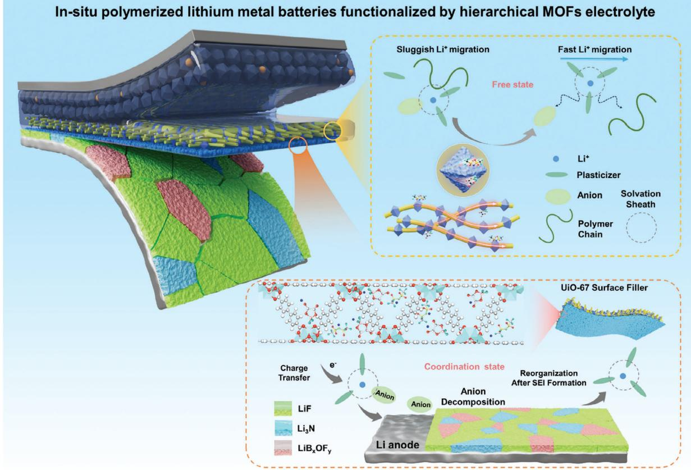
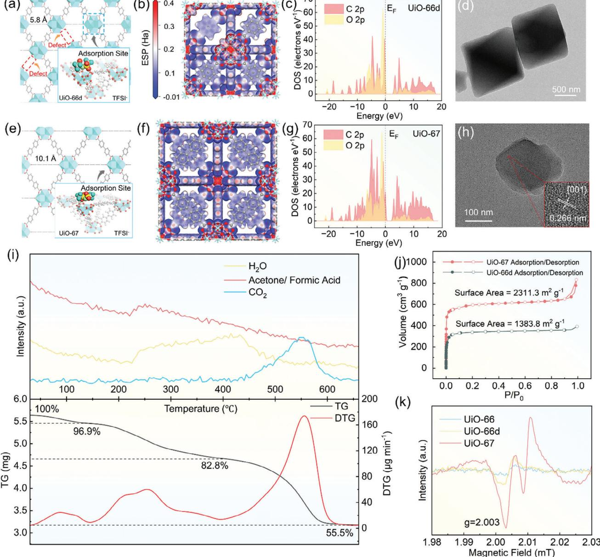
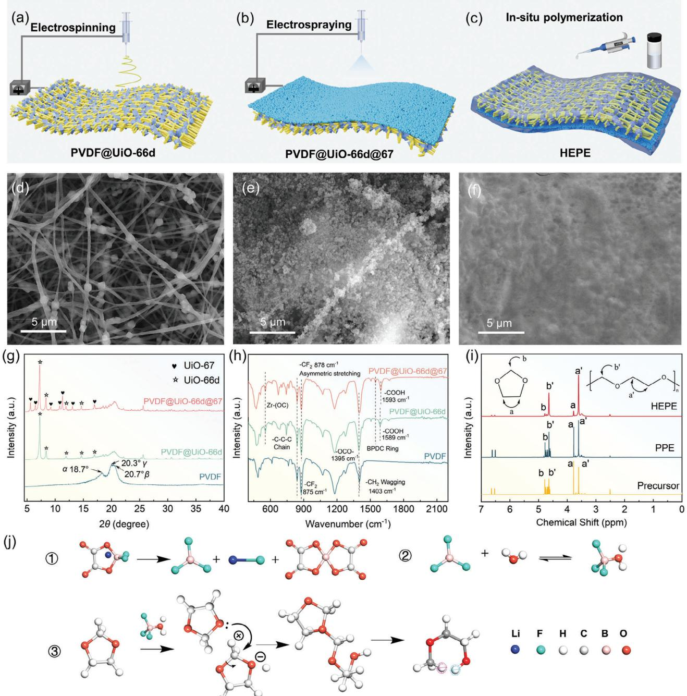
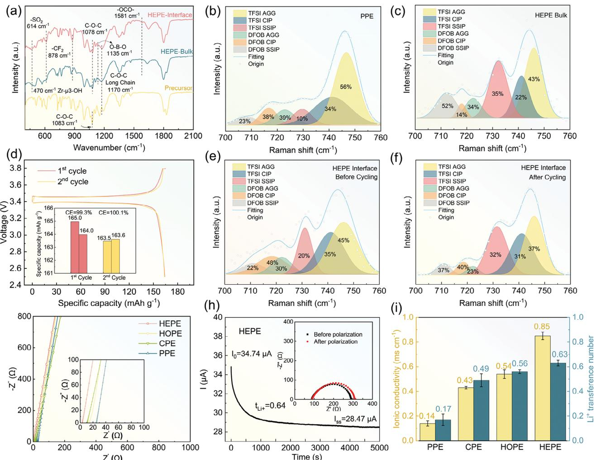
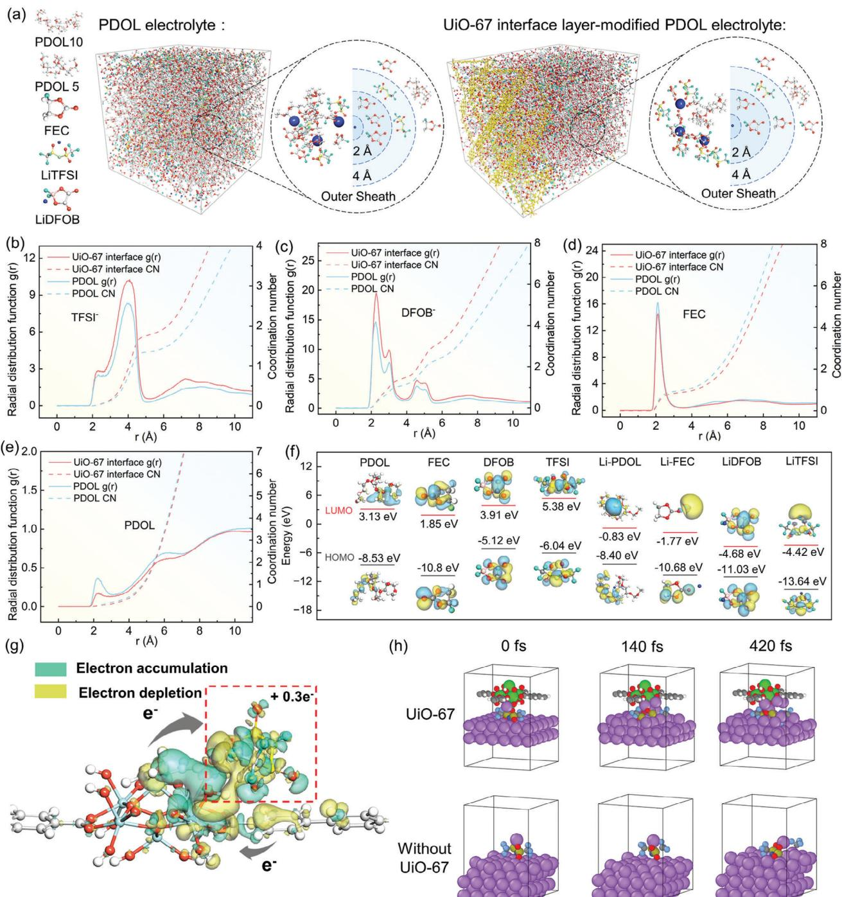

# **Decoupling Interfacial Stability and Ion Transport in Solid Polymer Electrolyte by Tailored Ligand Chemistry for Lithium Metal Battery**

*Ruifan Lin, Yingmin Jin,\* Yumeng Li, Mengyu Fu, Yuxin Gong, Lei Lei, Yong Zhang, Jijian Xu,\* and Yueping Xiong\**

**Achieving fast ion transport kinetics and high interfacial**

**stability simultaneously is challenging for polymer electrolytes in solid-state lithium batteries, as the coordination environment optimal for Li+ conduction struggles to generate desirable interphase chemistry. Herein, the adjustable property of organic ligands is exploited in metal–organic frameworks (MOFs) to develop a hierarchical composite electrolyte, incorporating heterogeneous and spatially confined MOF nanofillers into a poly-1,3-dioxolane matrix. The defect-engineered University of Oslo-66 MOFs (UiO-66d) with tailored Lewis acidity can separate ion pairs and optimize Li+ migration through weakened solvation effects, thereby enhancing ion conductivity by over sixfold (0.85 mS cm−1@25 °C). At the lithium anode side, a densified University of Oslo-67 MOFs (UiO-67) layer with conjugated electrons facilitates anion participation in the solvation sheath, promoting anion reduction and thereby forming LiF/Li3N-dominated solid electrolyte interphase for isotropic Li deposition. The as-assembled Li||LiFePO4 full cell delivers superior cycling stability with 92.7% of capacity retained over 2000 cycles at 2 C. Notably, the developed electrolyte demonstrates excellent compatibility with high-voltage cathodes, achieving 80% capacity retention with LiNi0.5Co0.2Mn0.3O2 over 630 cycles. This work provides valuable insights into decoupling transport and interfacial challenges in solid-state lithium batteries, paving the way for advanced battery technologies.**

#### **1. Introduction**

Lithium metal battery (LMB) technology is one of the most promising next-generation secondary batteries due to its use of

R. Lin, Y. Jin, Y. Li, M. Fu, Y. Gong, L. Lei, Y. Zhang, Y. Xiong MIIT Key Laboratory of Critical Materials Technology for New Energy Conversion and Storage School of Chemistry and Chemical Engineering Harbin Institute of Technology Harbin 150001, China E-mail: [jinyingmin@hit.edu.cn;](mailto:jinyingmin@hit.edu.cn) [ypxiong@hit.edu.cn](mailto:ypxiong@hit.edu.cn) R. Lin, J. Xu Department of Chemistry

City University of Hong Kong Hong Kong 999077, China E-mail: [jijianxu@cityu.edu.hk](mailto:jijianxu@cityu.edu.hk)

The ORCID identification number(s) for the author(s) of this article can be found under <https://doi.org/10.1002/adfm.202421880>

**DOI: 10.1002/adfm.202421880**

Li metal as the anode, which offers a high theoretical capacity (3860 mAh g−1) and the lowest electrochemical potential (−3.04 V vs Standard Hydrogen Electrode).[\[1\]](#page-15-0) These characteristics make LMBs attractive for applications requiring high energy density. Nevertheless, the enhanced energy density comes with challenges, including the uncontrollable lithium dendrite growth and interfacial side reactions, which raise safety concerns.[\[2\]](#page-15-0) The huge volume change of hostless lithium anode during consecutive Li plating/stripping imposes capacity loss and a shortened lifespan, greatly impeding its practical implementation. Replacing volatile and flammable liquid electrolytes with solid electrolytes is considered as a promising approach to overcome these drawbacks.[\[3\]](#page-15-0)

Among various kinds of solid-state electrolytes, solid polymer electrolytes (SPEs) have gained extensive attention owing to their desirable interfacial compatibility, adequate ionic conductivity, and great filmforming properties.[\[4\]](#page-15-0) Within the realm of SPEs, ether-based poly-1,3-dioxolane

(PDOL) electrolytes stand out for their high ionic conductivity and excellent interfacial stability. What is particularly compelling is that PDOL electrolytes support the preparation through in situ polymerization reaction of the DOL monomers within the battery, featuring tightly bonded electrode/electrolyte interfaces and excluding the undesirable evaporation of toxic solvents that are usually confronted in the traditional solutioncasting method. Enlightened by this, He and co-workers utilized yttria-stabilized zirconia nanoparticles to induce the in situ polymerization of DOL, rendering a remarkable room-temperature ionic conductivity of 2.75 × 10−4 S cm−1 as well as a high Li+ transference number of 0.64,[\[5\]](#page-15-0) which had surpassed most of the ether-based polymer electrolytes.[\[6\]](#page-15-0) Liu and co-workers proposed the in situ polymerization of PDOL electrolyte to achieve stable and compatible electrolyte/electrolyte interface.[\[7\]](#page-15-0) Compared with the ex situ prepared PDOL electrolyte, the in situ polymerization technique would manifest a lower *T*g as well as an enriched amorphous phase of PDOL at the interface region, both of which contribute to improved interfacial contact and ion transportation. Despite these advances, the ionic

conductivity of state-of-the-art SPEs remains insufficient, which can be ascribed to the strong binding force between the polymer chain and Li+ as well as the high crystallinity of polymer matrix. To enhance ionic transport, introducing solid fillers into SPEs has become a particularly attractive strategy. It is well established that the interfacial reaction between functional sites on fillers and polar groups of polymer chain exerts a substantial effect on regulating the coordination state of Li+, upon which the obstacle of sluggish Li+ migration would be well conquered due to the increased concentration of free-state Li+ in the local environment.

While remarkable progress has been accomplished in regulating the ionic transport capability of bulk SPEs, the stability of the solid electrolyte interphase (SEI) at the Li metal anode remains a critical challenge. According to the solvation structure theory proposed by Liu and Wang, the ion conduction process in electrolytes involves solvated Li+ diffusing in bulk electrolyte, desolvation of Li+ at electrode interface, the formation of interphase, and the subsequent Li+ diffusion through interphase layer toward electrode.[\[8\]](#page-15-0) In view of this, high-concentration electrolytes that enhance anion participation in Li+ solvation sheath have been developed to regulate the interfacial electrochemical kinetics and suppress the lithium dendrites.[\[9\]](#page-15-0) Inspired by these insights, establishing an inorganic-dominated SEI derived from the anion-enriched solvation structure holds great promise in obtaining the highly reversible Li metal anode for PDOL-based solid-state lithium metal batteries (SSLMBs). However, achieving rapid Li+ transport while simultaneously forming a stable SEI remains a complex challenge. Increasing the proportion of uncoordinated Li+ by weakening the coupling effect of anions and polymer chains renders a rapid Li+ transportation, but it may hinder the formation of anion-derived SEI. In addition, it has been widely accepted that even though the enrichment of anions in Li+ solvation sheath functions well in regulating uniform Li deposition behavior,[\[10\]](#page-15-0) the strongly coordinated Li+ may also result in an adverse impact of sluggish diffusion kinetics which needs to be minimized.[\[11\]](#page-15-0) Therefore, balancing Li+ transport kinetics and interfacial stability is fundamental to constructing high-performance SSLMBs.

Inspired by the existing literature and our prior research, we have been aware of that metal–organic framework (MOF) materials endowed with abundant open metal sites, regulatable framework structures, and modifiable properties, present substantial potential in tailoring the ionic coordination environment in polymer electrolytes.[\[12\]](#page-15-0) For example, Long and co-workers utilized the coordination effect of exposed metal sites on Cu–MOF-74 to facilitate the Li+ migration in a polyethylene oxide (PEO) electrolyte by leveraging the strong Lewis acidity of exposed metal sites.[\[13\]](#page-15-0) Li and co-workers employed the unique nanoscale framework of zeolitic imidazolate frameworks-8 (ZIF-8) MOF materials to selectively restrict the free migration of anions and form an ion-conductive interphase layer, enabling a reversible Li deposition/stripping cycle for 1000 h.[\[14\]](#page-15-0) Wang and co-workers developed a customized MOF material which was functionalized by carboxyl and amine groups, thereby establishing a staggered arrangement of filler structure via amide bonds between acid and amino groups to facilitate Li+ transportation.[\[15\]](#page-15-0) These examples highlight the promise of MOF-based fillers for SPEs, while the underlying mechanism of how the solvation structure and interphase component are tailored by customizable MOFs remains unexplored.

Herein, we propose a PDOL hierarchical polymer electrolyte (HEPE) configuration incorporating University of Oslo (UiO) MOF fillers to decouple ionic transport and interfacial stability for high-performance SSLMBs. By focusing on ligand engineering, we introduce defect-engineered UiO-66 with reinforced Lewis acidity to modulate the coordination of Li+ with polymer chains and anion species. This approach reduces ionic coupling, thereby improving bulk-phase conductivity. To facilitate the formation of anion-derived SEI, we utilize UiO-67 MOFs, densified with conjugated electrons to promote the decomposition of anions into LiF/Li3N-rich SEI, effectively inhibiting dendrite growth. This novel approach of tailoring MOF fillers offers a promising solution for reconciling the trade-off between ion transport kinetics and interface chemistry in SPEs. The resulting HEPE demonstrates an improved ionic conductivity of 0.85 mS cm−1@25 °C and stable lithium cycling over 2000 h. Furthermore, Li|HEPE|LiFePO4 cells retain 92.7% capacity after 2000 cycles at 2 C, with 92.1% capacity retention even after 1000 cycles at 4 C. Even when paired with high-voltage cathodes at an upper cutoff voltage of 4.3 V, HEPE enables stable cycling performance for over 630 cycles. This study might shed light on the fundamental understanding of how the solvation structure of polymer electrolytes can be customized effectively by tailored ligands of MOF fillers, advancing the development of SSLMBs with both high energy density and extended cycle life.

# **2. Results and Discussion**

#### **2.1. Preparation and Design Principles of HEPE**

Generally, a less solvated state of Li+ with a weakened coupling effect of both anions and polymer backbone is highly desired for PDOL-based electrolytes to meet the requirement of rapid Li+ transport response during fast charging/discharging. However, the lack of anion participation in solvation structure may exert an adverse impact on the cycle longevity of lithium anode, as the prerequisite of forming inorganic-dominated SEI would therefore be compromised. Confronting this dilemma, a spatially confined solvation structure must be explored for the simultaneous modification of ionic conduction in bulk phase and interfacial compatibility with Li metal anode. In the current study, employing the electrospinning, electrospraying, and in situ polymerization technique, a hierarchical composite polymer electrolyte is well constructed by the prior establishment of a supportive nanofiber framework and the subsequent integration of a PDOL conductive matrix. As demonstrated in the working mechanism of proposed HEPE in **Figure [1](#page-2-0)**, benefitted from the steric hindrance effect in the electrospinning process, electrospun polyvinylidene fluoride (PVDF) nanofiber membrane with high porosity is employed as the physical carrier of hierarchical UiO-derived fillers to ensure the spatial confinement of different MOF materials to play their respective roles. As such, the defect-engineered UiO-66d with reinforced Lewis acidity is incorporated onto individual PVDF fibers via co-electrospinning in advance, followed by electrospraying the organic-linker-modulated UiO-67 particles on previous PVDF@UiO-66d nanofiber membrane to yield the final demonstration of PVDF@UiO-66d@67 framework, with UiO-67 layer

**Figure 1.** The composition and functional mechanism of hierarchical MOF electrolyte.

closely packed on one side. After being integrated with the in situ polymerized PDOL conductive matrix, the homogeneously dispersed UiO-66d fillers on 1D-oriented PVDF fiber would manifest as Li+ transport accelerators for bulk polymer electrolytes. In addition, the UiO-67 filler with densified conjugated electrons and enlarged pore size plays a crucial part in reserving anionenriched solvation structure for Li metal anode surface, which also behaves as a catalytic center to promote the prior decomposition of anions via supplemented charge transfer from benzene rings of UiO-67 for establishing inorganic-rich SEI chemistry. As presented in Figure 1, after accomplishing the formation of anion-derived SEI, a reorganization of Li+ solvation structure near UiO-67 layer is expected, which would then convert into the same coordination state as that in the bulk phase electrolyte, therefore, would not affect the interface Li+ flux during subsequent cycles. As such, customized Li+ coordination environments at different locations of polymer electrolyte could be realized to obtain the highly conductive bulk phase and reversible Li plating/stripping simultaneously.

#### **2.2. Characterization of the Customized UiO Filler and Hierarchical Framework**

UiO-66d and UiO-67 fillers were synthesized via the selfassembly reaction of ZrCl4 with different organic ligands according to their individual structural expectation, namely 1,4 benzenedicarboxylic acid and 4,4-biphenyldicarboxylic acid, respectively. Despite both UiO-66d and UiO-67 sharing the same metal site, distinct pore channel side lengths of 5.8 and 10.1 Å as a consequence of the different benzene ring numbers could still be obtained for UiO-66d and UiO-67, respectively (**Figure 2**[a,e\)](#page-3-0). To investigate the electron trajectory variation between the two frameworks, the density of state (DOS) and partial density of state (PDOS) analysis were further performed and presented in Figure S1 (Supporting Information) and Figure [2c,g.](#page-3-0) The DOS results in Figure S1 (Supporting Information) indicate that both UiO-66d and UiO-67 MOFs exhibit electronic insulating characteristics based on the wide bandgap, emphasizing the eligibility of utilizing UiO-66d and UiO-67 as nanofillers for polymer electrolytes without the risk of electron shuttling. Combined with the interpretation of PDOS results in Figure [2c,g,](#page-3-0) the 2p orbitals of the benzene ring C atom in both the frameworks show distinct peaks in the energy interval between −8 and 0 eV, which also overlaps with the broad 2p orbital of O atom. This could be regarded as convincible evidence for the typical bonding phenomenon between C and O atoms in the UiO family, which is also indicative of the potential charge transfer ability and the accompanying charge storage function. In particular, the charge transfer ability can be quantified by integrating the overlapping area ratio of UiO-66d and UiO-67, where a 25% area ratio increase could be delivered by UiO-67 in comparison with that of

**Figure 2.** DFT calculation on crystal structure and the anion adsorption behavior of a) UiO-66d and e) UiO-67, electrostatic potential of b) UiO-66d and f) UiO-67, partial density of state of C and O 2p obit in c) UiO-66d and g) UiO-67. TEM images of d) UiO-66d and h) UiO-67. i) TGA/MS test of UiO-66d. j) N2 adsorption/desorption isotherms of UiO-66d and UiO-67. k) EPR spectra of UiO-66, UiO-66d, and UiO-67.

UiO-66d, indicating a stronger charge transfer activity for UiO-67 (Table S1, Supporting Information). Besides, the electrostatic potential (ESP) maps of UiO-66d and UiO-67 in Figure 2b,f further reveal the charge delocalization and localization phenomenon of Zr, O, and C atoms, which inherits all the specific features from the UiO family. Specifically, the negative charges on the benzene ring would transfer to the oxygen atoms at both ends through the conjugation effect, endowing oxygen atoms with the most negative electrostatic potential in both the frameworks. It could also be noticed that the highest potential is achieved at Zr atoms based on the dipolar effect, guaranteeing a stronger Lewis acidity of the surface metal site to modulate the ion-coupling state. Besides, owing to the introduction of an additional benzene ring on UiO-67 as an organic linker, the electrostatic potential in O atoms is much lower than that of UiO-66d as a consequence of promoted charge transfer from conjugated electrons to O atoms. To quantify the different regulation effects of UiO-66d and UiO-67 on Li+ solvation structure, density functional theory (DFT) was utilized to decipher the interaction mechanism between UiO and anion species. As shown in Figures 2a,e and S2 (Supporting Information), the preferable adsorption behavior of both bistriflimide anion (TFSI−) and difluoro(oxalato)borate anion (DFOB−) on the metal sites of (001) crystal plane of UiO-66d and UiO-67 could be found, manifesting much higher adsorption energy of −6.53 and −6.37 eV for TFSI− and DFOB− adsorbed on UiO-66d, in comparison with that of TFSI− (−1.75 eV) and DFOB− (−4.09 eV) adsorbed on UiO-67. Collectively, the above theoretical calculation results unanimously confirm the regulatory role of UiO-66d in bulk phase electrolytes in facilitating the decoupling of Li+─anion ion pairs by effective anion adsorption, and the customized functioning mechanism of UiO-67 deposition layer in reserving Li+─anion aggregation for desirable SEI configuration has also been illuminated.

The crystal structures of UiO-66d and UiO-67 were confirmed through X-ray diffraction (XRD) analysis (Figure S3, Supporting Information). Both the diffraction peaks of UiO-66d and UiO-67 could be well assigned to their simulated patterns, affirming the successful synthesis of UiO materials with ideal face-centered cubic topology.[\[16\]](#page-15-0) In particular, a slight shift of diffraction peaks representative of the (111), (002), (022), and (113) facets toward the lower 2 degree is found in UiO-67. Compared with UiO-66d, the increased lattice parameter of UiO-67 correlates well with the enlarged pore size of framework structure as a consequence of biphenyl-4,4′-dicarboxylic acid (BPDC) introduced additional benzene ring.[\[17\]](#page-15-0) Scanning electron microscopy (SEM) and transmission electron microscope (TEM) characterizations were further performed on the two spatially confined MOFs and shown in Figure [2d,h](#page-3-0) and Figure S4 (Supporting Information). The UiO-66d nanocrystal displays an octahedral morphology with a uniform size of 700 nm, whereas the particle size of UiO-67 ranges from 270 to 350 nm with the expression of spherical shape. Enlightened by the above observation, it is informative that UiO-67 with smaller particle size aids in forming a compact and uniform electrospraying layer at Li metal anode side to adjust the interfacial Li plating behavior. By contrast, the larger particle size of UiO-66d in bulk electrolyte would facilitate the exposure of more open metal sites to interact with polymer electrolyte. Besides, an interplanar spacing of 0.266 nm representative of the {001} crystal face of UiO-67 could be clearly distinguished from the high resolution transmission electron microscope (HR-TEM) image in Figure [2h,](#page-3-0) which offers convincible evidence for the exposed lattice plane of UiO nanocrystal in the following theoretical calculation section.

Moreover, a combined thermogravimetry analysis/mass spectrometer (TGA/MS) experiment was conducted to ascertain the defect number in the as-prepared UiO-66d nanocrystals. As depicted in Figure [2i,](#page-3-0) after experiencing a slight weight loss of 3.1% during the initial period, a subsequent weight loss trend from 140 to 400 °C is observed in the TGA curve, assigning to the removal of adsorption species from UiO domains. This could be further identified through the synchronized mass spectrometer signal in Figure [2i,](#page-3-0) where a clear affiliation of physisorbed acetone solvent and water released from the UiO framework during the initial weight loss is affirmed, followed by the generation of formic acid. Notably, the residual formic acid in pristine UiO-66d could be ascribed to its prior utilization in the crystal formation process, which would act as a modulator to replace the organic linker and coordinate with the metal nodes, thus forming ligand defects on targeted UiO-66d after thermal activation. Considering the high Lewis acidity of open metal sites on UiO-66d after defect generation, a great challenge remains for completely eliminating liquid reagents during activation treatment. Beyond 400 °C, a substantial weight loss of 27.3% (with regards to the starting weight) could be observed. Integrated with the appearance of a CO2 signal in the corresponding MS curve, the framework begins to collapse at this moment and the complete decomposition of UiO-66d into ZrO2 is accomplished at 700 °C. Recognizing the composition of UiO-66 as Zr6O6+*x*(Benzene-1,4-dicarboxylic acid)6−*x*, where *x* represents the number of linker deficiencies per Zr6 formula unit, the defect ratio of the as-designed UiO-66d can be calculated based on the starting and ending weights in TGA curve. The correlative calculation details on linker deficiency are shown in the Supporting Information, in which a structural configuration of one metal node connected to 2.5 organic linkers can be interpreted for UiO-66d, representing the existence of 3.5 linker defects in the designed structure, which validates the successful defect-engineering strategy on UiO-66d.

The pore volume and pore size of pristine UiO-66, UiO-66d, and UiO-67 were investigated using N2 adsorption/desorption isotherms at 77 K. As depicted in Figure [2j,](#page-3-0) the surface area of UiO-66d is determined as 1383 m2 g−1, which is significantly larger than that of saturated UiO-66 crystal (≈500 m2 g−1).[\[18\]](#page-15-0) This can be interpreted as the irregular pores and additional surface area created by defects in UiO-66d, which greatly increase the specific surface area of UiO particles, thereby providing more interaction sites for the polymer matrix. Meanwhile, a twofold increase of BET theory surface area is encountered for UiO-67, achieving a relatively higher value of 2981 m2 g−1. Benefiting from the greater pore volume and smaller particle size of UiO-67, the resultant larger surface area is of great significance to SEI reconfiguration. Pore size distribution analysis in Figure S5 (Supporting Information) further demonstrates a high alignment of micropore size and micropore volume of UiO-67 with simulation results (7.0 Å, 1.01 m3 g−1), which are also larger than those of UiO-66d (6.1 Å, 0.51 m3 g−1). To our delight, the smaller micropore size of UiO-66d with more tortuous micropore channels inside bulk electrolyte would facilitate the recognition and trapping of TFSI− (7.9 Å in length and 2.6 Å in width) and DFOB− ions (5.1 Å in length and 3.1 Å in width) while allowing the fast transport of small Li+ ions (with a diameter of 1.8 Å), thus modifying the Li+ solvation structure toward less anion coordination for fast diffusion. On the contrary, UiO-67 with larger pore size and moderate Lewis acidity of metal sites, exhibits a weaker spatial confinement effect on Li+─anion ion pairs, thereby reserving anion-enriched solvation sheath for Li anode.

Additionally, the intrinsic characteristic of the organic linker is also considered as an essential criterion for modulating the ion coordination environment and interfacial reaction kinetics, which is of great value for recognizing the working mechanism of hierarchical host–guest architecture. Unlike the well-known Lewis acidity of metal nodes that can easily induce electron cloud deformation, the benzene ring as an organic linker of UiO can provide conjugated electrons to promote the decomposition of Li+─anion aggregation on Li metal anode surface through supplemented charge transfer. More importantly, except for the additional conjugated electrons, choosing the suitable MOFs with certain characteristics such as moderate Lewis acidity of metal sites, larger pore size and pore channel could further allow more anions to go through electrolyte/anode interface, thereby reserving a diverse ion-coupling environment with enhanced anion participation in Li+ solvated sheath for SEI formation. To assess the application feasibility of the UiO family as interface rectifier, electron-paramagnetic resonance (EPR) tests were further performed to provide exclusive insights into their different electronic structures.[\[19\]](#page-15-0) As shown in Figure [2k,](#page-3-0) owing to the existence of unpaired electrons caused by linker defects or conjugated electrons, distinct electronic off-domains with the Lorentz line at *g* = 2.003 could be observed in all of UiO-66d, UiO-66, and UiO-67 samples. Informed by the relatively stronger EPR signal of defect-engineered UiO-66d compared with that of its inherent framework of UiO-66, a prominent expression of unpaired electrons that stems from the linker defects could be realized in UiO-66d. Even though UiO-66 also contains a benzene ring as part of the organic ligand and can interact with Li-salt anions, a more pronounced peak intensity is achieved in UiO-67 which indicates that the conjugated electrons would be much more concentrated in the UiO framework with an additional benzene ring. Apprehending the above information, the desirable electronic environment, suitable pore structure, and superior charge storage ability make UiO-67 the perfect choice for interface reorganization.

The PVDF@UiO-66d@67 nanofiber membrane with UiO-66d loaded on PVDF fibers and UiO-67 coated on one side of nanofiber membrane was obtained through co-electrospinning and the subsequent electrospraying, as exhibited in the schematic illustration in **Figure 3**[a,b.](#page-6-0) This unique morphology could be jointly confirmed through the SEM and energy-dispersive X-ray spectroscopy (EDS) mapping image of PVDF@UiO-66d@67 in Figures [3d,e](#page-6-0) and S6 (Supporting Information). Owing to the steric hindrance of electrospun fibers and the withstand of electric field force during electrospinning, each one of UiO-66d nanofiller would situate on individual PVDF nanofibers with considerable distance separated between adjacent UiO-66d particles. Serving as the solvation sheath regulator within bulk electrolytes, the homogeneous distribution of UiO-66d under the linear alignment regulation of PVDF nanofibers makes an indispensable contribution to the realization of a 3D rapid Li+ network. Given the high chemical stability, the UiO-66d nanofillers on composite nanofiber skeleton undergo no morphology change after experiencing the secondary electrospinning process, in comparison with its primitive form as freshly synthesized MOFs (Figures [2d](#page-3-0) and S4b (Supporting Information)). In addition, SEM image in Figure [3e](#page-6-0) illustrates the morphology of electrosprayed side of PVDF@UiO-66d@67 membrane, where a dense deposition layer of closely packed UiO-67 particles is captured. Combined with the EDS line scan results collected on the cross-sectional area of PVDF@UiO-66d@67 nanofiber (Figure S6b, Supporting Information) in which an enrichment of Zr element on the side of UiO-67 layer is presented, the hierarchical structure of PVDF@UiO-66d@67 nanofiber skeleton can be well identified. In addition, with the assistance of UiO particles enriched with pores and metal sites, favorable liquid precursor affinity could also be achieved in PVDF@UiO-66d@67 nanofiber membrane (Figure S7, Supporting Information)), which is of great significance to the subsequent integration with PDOL electrolyte matrix.

XRD analysis was utilized to characterize the phase composition of PVDF@UiO-66@67 (Figure [3g\)](#page-6-0). Compared to the pure PVDF electrospun membrane, characterized diffraction peaks ascribing to (111), (002), and (022) crystal plane of UiO-66d and UiO-67 could be observed in PVDF@UiO-66d@67 fiber membrane. Additionally, the coexistence of , , and phases of PVDF at 2 = 18.7°, 20.3°, and 20.7°, respectively, could be found in the XRD pattern of pristine electrospun PVDF fiber membrane. Under the influence of MOF integration, an enhanced PVDF polarity is encountered in both PVDF@UiO-66d and PVDF@UiO-66d@67 nanofiber membrane, which could be informed by the transformation of PVDF phase toward -dominated structure. Fourier transform infrared (FT-IR) spectroscopy was further conducted to elucidate the molecular structural evolution of composite nanofiber membranes. As illustrated in Figures [3h](#page-6-0) and S8 (Supporting Information), except for those characteristic peaks of UiO that overlapped with PVDF backbone (C─C chain at 840 cm−1, ─CF2 at 875 cm−1, and ─CH2 at 1403 cm−1), distinguishable vibrations at 552 and 1583 cm−1 correlating with Zr─(OC) asymmetric stretching and ─COOH group of UiO-66d could be observed in PVDF@UiO-66d.[\[20\]](#page-15-0) Notably, compared with pristine UiO-66d nanocrystals, distinct blueshifts of representative Zr─(OC) and ─COOH vibration in UiO-66d toward 555 and 1589 cm−1, respectively, can be found in PVDF@UiO-66d, accompanied with the noticeable blueshift of PVDF chain vibration from 875 toward 878 cm−1. This particular interaction between UiO-66d and PVDF further ensures the unique distribution pattern of UiO-66d particles on PVDF supportive skeleton. What is noteworthy is that after the deposition of UiO-67 interfacial layer, the typical vibration of benzene ring on UiO emerges distinctively at 1546 cm−1 in PVDF@UiO-66d@67. This can be convincible evidence for the successful introduction of an additional benzene ring in UiO-67. In addition, owing to the densification of conjugated electrons in UiO-67, the representative vibration of ─COOH at 1593 cm−1 in PVDF@UiO-66d would undergo a noticeable decoupling in PVDF@UiO-66d@67 which features the emergence of benzene ring vibration on a more redshifted region.

#### **2.3. Preparation and Physiochemical Characterization of the HEPE Electrolyte**

As presented in the schematic illustration in Figure [3c,](#page-6-0) the final HEPE electrolyte is obtained by injecting PDOL precursor into PVDF@UiO-66d@UiO-67 nanofiber membrane, which is then left for 48 h to complete the ring-opening polymerization and a freestanding 95 μm thick polymer membrane could be obtained afterward. The cationic polymerization mechanism initiated by LiDFOB is illustrated in Figure [3j,](#page-6-0) encompassing the reversible decomposition of LiDFOB, the introduction of protonated H by interaction between Lewis acidic BF3 and residual H2O, and the ring-opening reaction facilitated by nucleophilic attack.[\[21\]](#page-16-0) The successful completion of polymerization reaction can be inferred from Figure S9 (Supporting Information), where a robust and solidified polymer network is demonstrated. In addition, the completion of polymerization was further monitored by the evolution of cell impedance in real time. As demonstrated in the EIS spectra in Figure S10 (Supporting Information), a complete polymerization reaction could be informed by the eventual stabilization of cell impedance after 48 h of standing. As exhibited in the SEM image of PVDF@UiO-66d@67/PDOL HEPE in Figure [3f,](#page-6-0) considering the high liquid affinity of the nanofiber skeleton, the liquid monomer precursor would penetrate the 3D nanofiber

**Figure 3.** Schematic illustration of the preparation procedure of a) PVDF@UiO-66d nanofiber, b) PVDF@UiO-66d@67 nanofiber, and c) hierarchical polymer electrolyte (HEPE). SEM images of the d) bulk phase and e) interfacial UiO-67-layer of PVDF@UiO-66d@67 nanofiber framework, f) HEPE. g) XRD patterns and h) FT-IR spectra of PVDF, PVDF@UiO-66d, and PVDF@UiO-66d@67 nanofiber. i) 1H-NMR spectra of HEPE, PPE, and PDOL precursor. j) Schematic illustration of the in situ polymerization pathways of PDOL.

framework sufficiently and then forms a compact structure after completing the in situ polymerization process.

The polymerization degree of PDOL was further investigated by hydrogen nuclear magnetic resonance (1H NMR). As presented in Figure 3i, the chemical shifts at 3.78 and 4.78 ppm correspond to the hydrogen atoms linked to carbon atoms at *a* and *b* positions of pristine DOL monomer, respectively, while the peak splitting in the range of 4.50–4.80 ppm correlates with H environment in fluoroethylene carbonate (FEC) plasticizer (7). After completing the cation-initiated polymerization interaction, additional peaks at 3.60 ppm (*a*′) and 4.71 ppm (*b*′) emerge in the 1H NMR spectra of the polymer matrix scrapped from HEPE electrolyte, assigning to the H atoms in polymerized PDOL chain. Upon peak deconvolution and integration of H atom, the

**Figure 4.** a) FT-IR spectra of precursor solution and polymerized HEPE. Deconvoluted Raman spectra of b) PPE and c) HEPE bulk. d) Voltage curves of Li|HEPE|LFP battery at the first and second cycles. Deconvoluted Raman spectra of HEPE interface e) before and f) after cycling in Li|HEPE|LFP battery. g) Nyquist plots of the in situ polymerized electrolytes. h) DC polarization curve of Li|HEPE|Li cell with the inset of Nyquist plots collected before and after polarization. i) Comparison of ionic conductivity and Li+ transference number of different electrolytes.

conversion ratio of DOL monomer in the final PDOL electrolyte is determined to be 95%. Whereas the PVDF/PDOL electrolyte (PPE, without the introduction of UiO nanofillers) exhibits a relatively low DOL monomer conversion rate of 80%, under the same polymerization procedure as HEPE. This distinguished outcome further demonstrates the promoted polymerization degree of PDOL with the assistance of strong Lewis acidic Zr4+ sites on UiO-66d and UiO-67. To our gratification, the enhanced polymerization degree of PDOL long-chain would strengthen the antioxidation ability of polyether electrolytes to pair with high-voltage cathodes. Besides, the successful accomplishment of the polymerization reaction could also be supported by the significantly improved mechanical robustness of composite electrolytes. As shown in Figure S11 (Supporting Information), a higher tensile strength of 13.7 MPa could be achieved for the robust HEPE membrane, in comparison with its counterpart PPE which only delivers a tensile strength of 7.4 MPa.

To explore the structural evolution of PDOL electrolytes after accomplishing the ring-opening reaction, FT-IR spectroscopy was tested. As illustrated in **Figure 4**a, by comparing the FT-IR spectrum of DOL-based precursor with both sides of polymerized HEPE, a new peak at 1170 cm−1 corresponding to C─O─C long chain in PDOL appears after completing the polymerization process.[\[22\]](#page-16-0) In addition, it is worth notifying that the C─O─C stretching vibration peak in HEPE further undergoes a redshift from 1083 to 1078 cm−1 due to the ring-opening polymerization, thereby validating the successful transformation from DOL monomer to PDOL long chain in the targeted electrolyte.[\[23\]](#page-16-0) Meanwhile, by comparing the FT-IR spectra of PPE (Figure S12, Supporting Information) and HEPE, a distinct blueshift of C─O─C vibration from 1057 to 1078 cm−1 representing a weakened PDOL─Li+ coupling can be observed in HEPE, which indicates a positive influence of the introduced UiO fillers on establishing Li+ highways for PDOL electrolytes.

In consideration of the high crystallinity of the PDOL network after polymerization as well as the inadequate lithium salt dissociation capability of DOL unit, the ionic conductivity of PDOL electrolyte still could not meet the practical criterion.[\[24\]](#page-16-0) In this scenario, FEC was further introduced into the PDOL matrix to improve the ionic transport kinetics of electrolytes.

#### **2.4. Solvation Structure Analysis and Electrochemical Performance of the HEPE Electrolyte**

According to the Debye–Hückel theory, achieving a larger number of free ions and a smaller solvation sheathe volume in gel polymer electrolyte is advantageous for achieving higher conductivity.[\[25\]](#page-16-0) Besides, the movement of free anions in the opposite direction of Li+ would not only impede the charge transfer efficiency, but also promote the dendrite growth due to the accompanied decrease in sand's time. In this case, UiO-66d with modulated Lewis acidity of the open metal site is designed to immobilize lithium-salt anions, rendering a less solvated structure for rapid Li+ diffusion. Therefore, the ion-coupling environment in PDOL-based electrolytes supported by different nanofiber skeletons was first investigated by FT-IR spectra for indepth information. As evidenced in the FT-IR spectra of UiO-66d and bulk phase of HEPE, the stretching vibration of Zr─3─OH metal site in UiO-66d redshifts from 485 to ≈470 cm−1 after being incorporated in PDOL electrolyte. Meanwhile, in the FT-IR spectra of PPE and HEPE, the specific peaks standing for TFSI− and DFOB− at 611 and 1132 cm−1 blueshift to 614 and 1135 cm−1, respectively. The opposite peak shift tendency indicates an underlying interaction between metal sites of UiO-66d and lithium-salt anions. Raman spectroscopy was further conducted on blank PPE and HEPE to comprehend the coordination states of Li+ and anions under the influence of UiO-66d (Figure [4b,c\)](#page-7-0). Generally, the coupling state of Li+─anion in solvation structure can be classified into the three typical types including solventseparated ion pair (SSIP), contact ion pair (CIP, with one cation interacting with one anion), and aggregate (AGG, with two or more cations interacting with one anion). As the coupling environment of DFOB− and TFSI− would be directly reflected in the peak evolution of Raman shift at 720 and 740 cm−1, respectively, the relative ratio of SSIP, CIP, and AGG state for Li+─DFOB− and Li+─TFSI− coordinations in different electrolytes could be obtained based on the result of peak deconvolution and integration. As for the blank PPE electrolyte without UiO, the major coordination form of Li+─DFOB− lies in CIP and AGG states at 717 and 722 cm−1, accounting for 38% and 39% of the total amount, while the AGG state serves as the dominant species in Li+─TFSI− coordination, rendering a predominant proportion of 59% at 746 cm−1 (Figure [4b\)](#page-7-0). This indicates that despite the presence of plasticizer in polymer matrix would enhance Li salt dissociation to a certain extent, the aggregation of Li+─DFOB− and Li+─TFSI− in bulk electrolyte remains challenging. Under this circumstance, only limited improvement in ionic mobility can be expected, as a relatively high proportion of Li+ would be tightly bonded by anions in the solvation sheath which would hinder its migration. In striking contrast, an obvious transformation of the ionic coupling state can be detected in the Raman spectra of bulk phase HEPE, where the proportion of SSIP for both Li+─DFOB− and Li+─TFSI− exhibits a considerable increase to 52% and 35%, respectively (Figure [4c\)](#page-7-0). Besides, a decreased AGG proportion from 39% to 34% for Li+─DFOB− and from 56% to 43% for that of Li+─TFSI− could also be obtained from the deconvolution results. As the defect-enriched UiO-66d nanofiller would exert a strong adsorption effect on Li-salt anions via reinforced Lewis acidic sites, the coupling state of Li+─anion in PDOL electrolyte would transform from AGG and CIP to SSIP in bulk phase of HEPE, thus forming a competitive Zr─anion coordination structure to decouple the ion pairs in solvation sheath. Consequently, a favorable prerequisite for the rapid Li+ conduction process within the resultant polymer electrolyte would be realized by the 3D PVDF@UiO-66d fiber framework.

Furthermore, FT-IR and Raman spectroscopy were conducted on the UiO-67 side of HEPE to investigate the solvation structure and evolution mechanism at the interface region of Li metal anode. As illustrated in the FT-IR spectra in Figure [4a,](#page-7-0) a redshift from 1589 to 1581 cm−1 is observed for the ─OCO─ symmetric stretching of BPDC organic ligand on UiO-67 within the interface layer of HEPE, in comparison with that of the pristine UiO-67 nanocrystals. This phenomenon suggests that an elongation of ─OCO─ bond length caused by the certain decrease of electron cloud density on connected benzene ring is encountered by UiO-67 when being incorporated with PDOL electrolyte. In consideration of the higher density of conjugated electron clouds on benzene ring of UiO-67, a foreseeable electron transfer tendency from benzene ring to the positively charged solvation structure could be expected. Enlightened by this intrinsic characteristic of UiO-67, Raman spectra were also used to study the solvation structure near UiO-67 interfacial layer and its reorganization after SEI formation (Figure [4e,f\)](#page-7-0). Different from the deconvoluted Raman spectra collected on the bulk phase of HEPE, the proportion of CIP state for Li+─DFOB− and Li+─TFSI− configurations on the UiO-67 side of HEPE increases to 48% and 35%, respectively, while the SSIP state of those two ion-coupling pairs undergoes a respective decrease to 22% and 20%. Particularly, the transformation of the dominant ion-coupling structure can be ascribed to the weaker anion recognition capability of UiO-67, along with its larger framework structure to permit the existence of ion pairs in solvation structure. Hence, a hierarchical solvation structure has been endowed with the designed HEPE in this work, with the expression form of SSIPdominated bulk phase and CIP-enriched interface region. Even though the coupling form of SSIP is beneficial to ionic conduction, the lower lowest unoccupied molecular orbital (LUMO) energy level of the coordinated solvent in solvation sheath would lead to its prior decomposition on Li metal anode, rendering the formation of organic-enriched SEI layer which could not inhibit the dendrite growth.[\[26\]](#page-16-0) In striking contrast, increasing the proportion of CIP coupling state in the interface region of HEPE would ensure the preferential reduction of DFOB− and TFSI− anions in the inner shell of solvation structure, thereby establishing a dense inorganic-dominated SEI film to realize homogeneous Li deposition. As jointly evidenced by the high Coulombic efficiency (99.3% and 100.1% achieved at the first and second cycles, respectively) and the corresponding structural evolution of HEPE during the cycling test of Li|HEPE|lthium iron phosphate (LFP) battery (Figure [4d,f\)](#page-7-0), a solvation-structure-involved SEI formation mechanism with the less assumption of Li+ has been realized under the influence of UiO-67. By comparing the Raman spectra in Figure [4e,f,](#page-7-0) the coupling form of Li+─DFOB− ion pair undergoes a transformation from SSIP:CIP:AGG = 22%:48%:30% to 37%:40%:23% after the first two cycles, along with the change of Li+─TFSI− coordination state from the initial proportion of SSIP:CIP:AGG = 20%:35%:45% to 32%:31%:37%. Inferred from the above information, a preferential reduction of the spatially confined anion-enriched solvation sheath is realized for the formation of desirable SEI chemistry which ensures the highly efficient Li plating/stripping. It is worth notifying that after the sacrifice of anion species during SEI growth, a reorganization of ion coordination state toward SSIP-dominated solvation sheath is expected for the interface region of HEPE, which further guarantees the fast Li+ diffusion kinetics across Li metal anode interface in the subsequent cycles. Notably, compared with TFSI−, Li+─DFOB− ion pairs are more involved in the SEI formation process which can be elucidated from the obvious decrease in its relative proportion (from 26% to 12%, according to the total integration of Li+─DFOB− and Li+─TFSI−) after two cycles of Li||LFP full cell. This can be attributed to the preferential reduction of Li+─DFOB− species on Li metal anode, which will be studied in the next section.

To better distinguish the different regulation effects exerted by the spatially confined UiO nanofillers, electrochemical impedance spectroscopy (EIS) analysis at room temperature was performed on PDOL-based electrolytes with various internal structures (Figures [4g](#page-7-0) and S13 (Supporting Information)). According to the comparison of ionic conductivity in Figure [4i,](#page-7-0) the introduction of UiO family renders a prominent increase of ionic conductivity for PDOL electrolytes. Specifically, the blank PPE sample in the absence of UiO nanofiller only delivers an ionic conductivity of 0.14 mS cm−1 at 25 °C, and a gradual increase to 0.54 mS cm−1 could be achieved under the modification of UiO-66d in bulk phase of electrolyte (PVDF@UiO-66d/PDOL electrolyte, denoted as CPE). In addition, a further improvement to 0.85 mS cm−1 is expected for the proposed HEPE with UiO-66d in bulk phase and UiO-67 layer at interfacial region. It is noteworthy that the slight decrease of ionic conductivity to 0.43 mS cm−1 would be encountered for the hierarchical polymer electrolyte when utilizing UiO-66d particles as regulators for both bulk phase and interface layer of electrolyte (PVDF@UiO-66d@66d/PDOL electrolyte, namely HOPE). Informed by the above information, the incorporation of UiO-66d into the bulk phase of fiber network could weaken the coordination of Li+ with anions/polymer chain, even under the unfavorable condition of higher PDOL polymerization degree. This corresponds well with the design rational in this work utilizing the reinforced Lewis acidity of metal sites on UiO fillers to establish higher Li+ motions through a weakened solvation sheath. Different from the interconnected PDOL matrix which can well-infiltrate the open pores of PVDF@UiO-66d nanofiber in bulk phase of CPE, the polymer phase at interfacial region remains rather decentralized due to the existence of a dense UiO-66d layer. Therefore, further introducing highly compact UiO-66d particles on the anode side of CPE results in a reduced ionic transport kinetics in HOPE, since the prominent steric hindrance effect exerted by UiO-66d with smaller pore size and enhanced Lewis acidity makes it difficult for Li+ solvation structure to be desolvated and transport through. While replacing it with UiO-67 particles results in a favorable enhancement in ionic mobility for HEPE, signifying the reserved space for Li+ solvated sheath to diffuse through the larger pore channels in interfacial rectifying layer. Taking the moderate Lewis acidity of metal sites on UiO-67 into consideration which cannot promote the polymerization of PDOL chains or separate ion pairs effectively, the interfacial UiO-67 may behave as general solid plasticizer to promote the chain segmental motions of PDOL.

To better evaluate ion transport efficiency, DC polarization combined with EIS measurement was performed on the proposed electrolyte within a symmetric Li||Li cell configuration to obtain the Li+ transference number (*t*Li+). As depicted in Figures [4h](#page-7-0) and S14 (Supporting Information), an evident increase in *t*Li+ is encountered for HEPE and HOPE, achieving a preferable *t*Li+ of 0.63 and 0.56, respectively, significantly higher than that of PPE (0.17). Considering the close *t*Li+ value achieved in CPE (0.49) that is comparable to HEPE and HOPE, the primary anion-recognizing capability of HEPE could be assigned to the bulk phase UiO-66d framework. As presented in the comparison diagram in Figure [4i,](#page-7-0) being endowed with both high ionic conductivity and satisfactory Li+ transference number, HEPE with optimized framework structure of spatially confined UiO fillers demonstrates promising feasibility in ensuring the homogeneous Li+ flux of SSLMBs. To assess the compatibility between the proposed electrolyte and high-voltage cathodes, the electrochemical stability of the electrolyte was examined via linear sweep voltammetry within the configuration of Li||stainless-steel cell. As illustrated in Figure S15 (Supporting Information), the oxidation potential of the electrolyte is determined at the potential when the current density reaches 5 μA cm−2. It can be clearly seen that the best high-voltage resistance among various structures of polymer electrolyte is achieved in HEPE, rendering a highest oxidative decomposition potential of 5.67 V (vs Li+/Li). In comparison, a relatively lower oxidative potential of 5.11 V is delivered by the blank PPE. The reason for this difference may lie in the promoted polymerization of DOL monomer induced by the open metal sites of UiO-66d with reinforced Lewis acidity, which endows the resultant electrolyte with more long-chain PDOL molecule to reduce the highest occupied molecular orbital (HOMO) energy level of polymer matrix.

DFT and molecular dynamic (MD) calculations were carried out to elucidate the particular role of interfacial UiO-67 in reserving Li+─anion ion pairs for SEI formation on atomic level. The corresponding MD snapshots on PDOL electrolyte and the UiO-67/PDOL composite system are shown in **Figure 5**[a,b,](#page-10-0) and the correlative radial distribution function and coordination number (CN) of PDOL (Li─O), FEC (Li─O), DFOB− (Li─B), and TFSI− (Li─N) to Li+ in these two systems are further presented in Figure [5b–e](#page-10-0) to obtain the accurate solvation structure. In both the bulk phase of PDOL electrolyte and UiO-67/PDOL interface region, a sandwich-solvated sheath can be delivered by the two kinds of anions, with a distribution pattern of DFOB− mainly involved in the inner core of solvation shell and TFSI− gathered in the outer sheath. Besides, it is worth notifying that an enhanced *g*(*r*) peak intensity of both Li+─TFSI− and Li+─DFOB− coordination is illustrated in UiO-67/PDOL interface region in comparison with that of bulk phase PDOL, rendering a higher coordination number of 1.7 and 1.3 for Li─NTFSI and Li─BDFOB, respectively, compared with that of 1.3 and 1.0 for Li─NTFSI and

**Figure 5.** Molecular dynamic (MD) models and calculated solvation structures of a) blank PDOL electrolyte and UiO-67/PDOL interface region of HEPE, radial distribution function and coordination number of b) Li─NTFSI, c) Li─BDFOB, d) Li─OFEC, and e) Li─OPDOL. f) The highest occupied molecular orbital (HOMO) and the lowest unoccupied molecular orbital (LUMO) energy of components in the electrolyte. g) The electron density difference of UiO-67/LiTFSI system during spontaneous charge transfer, h) the AIMD simulation snapshots of TFSI on the surface of lithium metal with and without the modification of UiO-67 layer.

Li─BDFOB in bulk phase PDOL. While in complete contrast, the introduction of UiO-67 would reduce the participation of FEC and PDOL in solvation sheath, featuring a decreased CN of 0.12 and 0.83 for Li─O (PDOL) and Li─O (FEC) at UiO-67/PDOL interface region, in comparison with that of bulk phase PDOL electrolyte (0.18 for the CN of PDOL to Li+ and 0.92 for that of FEC). Apprehending the above simulation results, the introduced UiO-67 layer on the anode side of HEPE promotes more lithium-salt anions to enter the inner layer of the solvation structure, meanwhile extruding the original FEC and PDOL molecule to the outer sheath of the solvation shell. Typically, an anion-enriched coordination structure is kinetically favorable for the desolvation process on Li metal anode, and the enhanced anion participation for SEI formation would generate more inorganic products such as LiF and Li3N, which have long been recognized as desirable SEI components to improve the electrochemical/mechanical stability of Li metal anode. In this case, the reduction resistance of different components in HEPE was evaluated by the calculation of LUMO energy. As shown in Figure [5f,](#page-10-0) in comparison with the free species in electrolyte matrix including DFOB−, TFSI−, FEC, and PDOL, a significantly decreased LUMO energy could be expected for those substances after being coordinated with Li+, with the lowest value achieved in Li+─TFSI− and Li+─DFOB− ion pairs. To the best of our knowledge, accommodating concentrated Li+─TFSI− and Li+─DFOB− coordination for Li metal anode interface via electrosprayed UiO-67 modification layer would make a fundamental contribution to facilitating the prior decomposition of anion species, thereby ensuring the generation of inorganic-enriched SEI film for uniform Li deposition. Besides, by incorporating the UiO-67 interfacial rectifier, the extrusion of FEC species out of the Li+ solvation sheath further decreases the reduction activity of FEC solvent, making it more stable during Li+ reduction and SEI formation. It is worth notifying that the lower LUMO energy level of Li+─DFOB− ion pair compared with that of Li+─TFSI− corresponds well with the deconvolution results on Raman spectra during battery cycling, which explains the enhanced involvement of Li+─DFOB− in SEI formation.

The charge storage and transfer capability of the proposed UiO-67 interface filler were also investigated by DFT and ab initio molecular dynamics (AIMD) calculations. As illustrated in Figure [5g,](#page-10-0) the interaction between UiO-67 and LiTFSI was first examined through the calculation of charge density difference. Informed by the evolution of electron cloud density on atomic level, a prominent electron migration from the benzene ring of UiO-67 crystal to the oxygen atoms connected to metal site could be detected with the presence of LiTFSI. Upon this charge transfer tendency, a subsequent electron migration from UiO-67 to TFSI− group via Li atom in between is further realized, manifesting a concentrated electron cloud on TFSI with the increase of 0.3*e*−. This phenomenon further verified that the densification of conjugated electrons on the organic linker of UiO-67 via optimal benzene ring configuration functions well in providing supplemented electron density for TFSI−, thus facilitating the decomposition of ion pairs on Li metal anode. In this case, LiTFSI decomposition behavior on the surface of lithium was elucidated from AIMD simulation (Figure [5h\)](#page-10-0). After 140 fs of simulation, the LiTFSI molecule near UiO-67 presents a clear tendency to cleave a ─CF3 cluster, while the single LiTFSI without UiO-67 around remains intact during the same simulation time. Only after 420 fs of simulation did the individual LiTFSI begins to stretch and split the ─CF3 group, while its counterpart of LiTFSI under the impact of UiO-67 has already decomposed into the final product of Li3N, LiF, and other debris at that time. Inferred from the above characterization and simulation results, UiO-67, designed with larger pore channels, moderate Lewis acidity on metal sites, and most importantly, densified with conjugated electrons, not only behaves as an interfacial rectifier to reserve Li+─anion aggregation for the inner solvation sheath near Li metal anode, but also acts as a catalytic center for interfacial anion decomposition via an enhanced charge transfer process, thereby promoting the formation of an inorganic-rich SEI layer to stabilize the Li metal anode in practical application.

Li symmetric cells were assembled and cycled to investigate the compatibility between the developed electrolytes and Li metal anode. As shown in Figure S16 (Supporting Information), both Li|CPE|Li and Li|HEPE|Li cells exhibit low voltage polarization of ≈0.02 V and flat voltage platforms under the condition of 0.1 mA cm−2 and 0.1 mAh cm−2. By contrast, an obvious increase of voltage response to 0.2 V along with severe fluctuation is delivered by Li|PPE|Li cell, indicating the sluggish ionic transport and high energy barrier for nucleation. As it turns out, a sudden voltage drop is observed in Li|PPE|Li cell after 281 h of operation, illustrating the uncontrolled dendrite propagation as a consequence of fragile SEI. What is gratifying is that the polymer electrolyte reinforced by bulk phase UiO-66d nanofillers would prolong the cycle life of Li||Li cell to a greater extent, as the Li|CPE|Li cell would only encounter a soft short-circuit phenomenon induced by the partial penetration of Li dendrite at 368 h of cycling. Benefitting from the interphase regulation effect of UiO-67, further development of interfacial UiO-67 layer endows the HEPE with a competitive cycling life over 2000 h in symmetric Li cell. Hence, both rapid Li+ conduction within bulk electrolytes and a favorable ion-coupling environment for SEI formation behave as indispensable necessities in regulating Li deposition behavior. As exhibited in Figure S17 (Supporting Information), even under a higher current density of 0.2 mA cm−2 (with a capacity of 0.2 mAh cm−2), the HEPE could still ensure the high cycling stability of symmetric Li cell without short circuit. To elucidate the morphology evolution of deposited Li, lithium foils after 200 h of cycling in Li|CPE|Li and Li|HEPE|Li cells were characterized by SEM. As shown in Figure S18a (Supporting Information), rugged morphology of Li deposition layer constituted by numerous dendrites and dead Li can be observed on the surface of Li electrode dissembled from Li|CPE|Li cell. By contrast, the lithium anode cycled with HEPE delivers a relatively flat and smooth surface morphology, demonstrating that a more uniform Li deposition behavior along with a well-eliminated interfacial side reaction can be expected with UiO-67 layer at presence (Figure S18b, Supporting Information).

#### **2.5. Full-Cell Performance and Characterization of Interphase Chemistry**

To verify the practical feasibility of the proposed electrolyte in fullcell application, HEPE was assembled with LiFePO4 cathode and lithium metal anode to conduct the galvanostatic cycling at different C-rates (**Figure [6](#page-12-0)**). As presented in Figure S19a (Supporting

**Figure 6.** a) Long-term cycling performance of Li|HEPE|LFP batteries at 2 C and 4 C, and b) the corresponding evolution of voltage profiles at 4 C, c) long-term cycling performance of Li|HEPE|NCM523 battery in the voltage range of 2.8–4.3 V, and d) the corresponding evolution of voltage profiles, e) full-cell performance comparison based on HEPE in this work with other reported polymer electrolytes in recent publications.

Information), a remarkable capacity of 168, 160, 153, 137, and 124 mAh g−1 is delivered by Li|HEPE|LFP battery at 0.1 C, 0.3 C, 0.5 C, 1 C, and 2 C, respectively. Furthermore, the satisfactory rate capability of HEPE can be reflected in the instant capacity recovery to 168 mAh g−1 after the current switches back to 0.1 C, along with the negligible overpotential variation at different C-rates (Figure S19b, Supporting Information). By contrast, the PPE battery not only delivers a lower capacity at all current densities, but also endures a more severe capacity fluctuation (Figure S19c, Supporting Information). This further emphasizes the significance in enhancing ionic transport capability of bulk electrolytes for fast charge/discharge operation of SSLMBs.

Besides, long-term cycling tests of Li||LFP full cells were carried out at 0.5 C, 1 C, 2 C, and 4 C at room temperature. As expected, optimal performance is delivered by Li|HEPE|LFP battery at 0.5 C, with an initial capacity of 156 mAh g−1 and a capacity retention of 80.6% achieved over 730 cycles, along with a superior average Coulombic efficiency (CE) of ≈100.1% throughout the whole cycling course (Figure S20a, Supporting Information). Furthermore, only a slight increase of voltage polarization during long-term cycling could be found in the corresponding voltage profiles (Figure S20b, Supporting Information), verifying the desirable interfacial stability via the development of hierarchical MOF structure. When replacing HEPE with PPE, a greatly shortened lifetime of 120 cycles terminated by internal short circuit is encountered for Li|PPE|LFP, as a consequence of the sluggish ion transport and poor interfacial stability of the unmodified PVDF/PDOL electrolyte. To distinguish the independent role of bulk phase UiO-66d as ion-coordination regulator and interface UiO-67 layer as SEI reorganizer, performance evaluation on full cell based on CPE and HOPE was also carried out. As demonstrated in Figure S20a (Supporting Information), in comparison with the blank PVDF/PDOL electrolyte, even though a distinct improvement in reversible capacity is realized in the Li|CPE|LFP battery, severe CE fluctuation still occurs after 280 cycles which finally leads to the short-circuit failure at the 415th cycle. Elucidated from the uncontrolled dendrite growth in the case of PVDF@UiO-66d/PDOL electrolyte without interface reorganization, the role of UiO-67 layer in regulating Li deposition behavior has been verified. At a higher current density of 1 C (Figure S21, Supporting Information), excellent cycling stability could still be ensured for the Li|HEPE|LFP battery with 81% of capacity retained over 2000 cycles. While as for the composite electrolytes with only UiO-66d in bulk phase or with UiO-66d in both bulk phase and interface region, distinct overcharge-induced CE fluctuation is encountered, indicating the existence of certain safety risks in Li|CPE|LFP and Li|HOPE|LFP batteries. Even after 2000 cycles at 2 C, the Li||LFP battery based on HEPE would still deliver a desirable capacity performance relative to 92.7% of the initial value (133.1 mAh g−1), along with a remarkable CE of ≈99.9% (Figure [6a\)](#page-12-0). However, as presented in Figure S22 (Supporting Information), Li|CPE|LFP battery delivers severe CE fluctuation which subsequently declines to nearly 0 after 79 cycles, and the occurrence of the first short-circuit phenomenon would be postponed to the 244th cycle when introducing dense UiO-66d layer at Li metal anode interface. What surprises us is that even at 4 C, superior cycling reversibility could still be maintained for Li|HEPE|LFP battery (Figure [6a,b\)](#page-12-0), with the manifestation of a slight capacity decline to 100 mAh g−1 at the initial cycle due to the enlarged polarization at higher current density. Nonetheless, a promising capacity retention of 92.1% over 1000 cycles, along with a high CE of ≈99.99%, can still be delivered by Li|HEPE|LFP battery. Comparing with other reported polymer electrolytes in recent researches, the proposed HEPE in this work exploiting hierarchical MOFs architecture design exhibits advanced electrochemical properties in terms of rate capability and cycling stability (Figure [6e\)](#page-12-0).[\[27\]](#page-16-0)

To further confirm the high-voltage compatibility of the designed HEPE, Li|HEPE|LiNi0.5Co0.2Mn0.3O2 (NCM523) batteries were further assembled and cycled in the voltage range of 2.8– 4.3 V. As shown in Figure [6c,d,](#page-12-0) an ideal capacity of 166 mAh g−1 could be delivered by NCM523 cathode at 1 C when matching with HEPE, accompanied by the desirable capacity retention of 80% over 630 times of cycling. Although its compatibility with high-nickel cathode is still unsatisfactory, its mechanism still reveals possible paths for future applications.[\[28\]](#page-16-0) Generally, longer PDOL chains with more repeated units are highly desired to improve the high-voltage compatibility of electrolytes due to the decreased HOMO energy level.[\[12\]](#page-15-0) Owing to the defect-engineered UiO-66d with reinforced Lewis acidity which also acts as a catalytic center to promote the ring-opening polymerization of the DOL unit, a significantly enhanced oxidation resistance of the highly polymerized PDOL matrix would be ensured for HEPE which manages to inhibit the interfacial side reaction, providing substantial application feasibility for polyether-based electrolyte toward SSLMBs with high energy density.

To gain deep insight into the regulative effect of UiO-67 layer on interphase chemistry, X-ray photoelectron spectroscopy (XPS) depth profiling was utilized to characterize the SEI composition on Li metal anode after cycling with HEPE and CPE (**Figure 7**[a–d\)](#page-14-0). As shown in the F 1s and Li 1s spectra of Li metal anode dissembled from Li|CPE|LFP battery after 200 cycles (Figure [7b\)](#page-14-0), deconvoluted XPS peaks representing LiF can be recognized at 684.9 eV (F 1s) and 56.3 eV (Li 1s), originating from the reduction product of FEC and LiTFSI on Li metal anode.

Apart from that, characteristic signals assigned to Li2CO3 are also detected at 55.7 eV in Li 1s and 531.5 eV in O 1s spectra. Except for LiF as a reduction product, the decomposition of LiTFSI on Li metal anode also results in the generation of Li3N species, as presented in deconvoluted peaks at 54.8 eV in Li 1s and 399.6 eV in N 1s. Additional XPS signal at 686 eV in F 1s spectra and 55.3 eV in Li 1s spectra can be well-indexed into the specific bond in LiB*x*OF*y*, which is generally considered as a common reduction product of LiDFOB. With the increasing of etching depth, the LiF content experiences a slight decrease in the case of CPE, along with a clear decreasing trend for Li3N component. However, as exhibited in the normalized proportion for SEI component in Figure [7d,](#page-14-0) the relative concentration of Li2CO3 remains stable during the whole etching depth. This suggests a proportional relationship between the content of LiF and Li2CO3 component as decomposition products of FEC, along with a lesser contribution from Li3N derived from LiTFSI decomposition. In particular, the existence of prominent Li2O peaks at 528.3 eV in O 1s spectra and 53.6 eV in Li 1s spectra, along with the characteristic peak at 52.3 eV in Li 1s spectra representative of Li metal further indicates the presence of fractured "dead lithium" within SEI. Furthermore, the content of LiB*x*OF*y* exhibits the variation trend of first increasing and then decreasing upon Ar+ etching, indicating the random decomposition pattern of LiDFOB on lithium. Apprehending the above information, even though the regulation of solvation structure with less participation of anions and PDOL chains would greatly contribute to rapid Li+ transport kinetics of CPE, the developed Li+─FEC coordination in the inner solvation sheath further leads to an undesirable SEI chemistry due to the preferential decomposition of FEC into LiF and Li2CO3. Consequently, the unconsolidated SEI structure with considerable Li2CO3 debris distributed beneath LiF/LiB*x*OF*y*/Li3N component further leads to an interphase chemistry that is unable to inhibit electron leakage, thereby explaining the severe interfacial degradation of Li|CPE|LFP battery resulting from uncontrolled dendrite penetration.

In contrast to CPE, a distinct increase trend in both LiF and Li3N concentration upon Ar+ etching is observed in the case of HEPE (Figure [7a,c\)](#page-14-0). Besides, similar variation trend could also be presented by LiB*x*OF*y* specie as the etching depth goes deeper. It is worth notifying that the relative proportion of Li2CO3 in SEI is not only lower but also reveals a decreasing tendency with the increase of etching depth, in comparison with that of Li metal cycled with CPE. Enlightened by the above regularity, it can be inferred that the hierarchical SEI chemistry with small amount of Li2CO3 situated in the outer layer and LiF/Li3N-enriched inner layer as a consequence of anions' preferential reduction and wellinhibited FEC decomposition, is established for HEPE-modified lithium anode. As depicted in the schematic illustration of SEI chemistry in Figure [7e,](#page-14-0) being endowed with excellent Li+ conductivity, mechanical robustness, and electron-insulating properties, the enrichment of Li3N and LiF in the inner layer of SEI film would make a great contribution to suppressing dendrite growth and alleviating interfacial degradation, thereby improving the Coulombic efficiency of lithium anode with regulated deposition behavior. To further conduct a high-resolution and in-depth analysis of the SEI structure, time of flight secondary ion mass spectrometry (TOF-SIMS) test was applied to the Li metal anode cycled with HEPE. As shown in the 3D renders in Figure [7f,](#page-14-0)

**Figure 7.** XPS depth profiles on Li metal anodes after cycling in a) Li|HEPE|LFP and b) Li|CPE|LFP battery. Normalized ratio of SEI components according to the Li 1s XPS depth profiles on Li metal anodes after cycling in c) Li|HEPE|LFP and d) Li|CPE|LFP battery. e) Schematic illustration of SEI configuration derived from different electrolytes. f) TOF-SIMS depth profiles of inorganic component in HEPE-derived SEI.

an enriched concentration of inorganic components in the bottom layer of SEI can be informed by the distribution of all three negative secondary ions. This result further supports the establishment of optimal SEI configuration through the hierarchical structural design of MOF fillers in this work.

# **3. Conclusions**

In summary, we propose a hierarchical UiO nanofiber framework configuration to modify the PDOL electrolyte, achieving a spatially confined solvation structure that significantly extends cycle longevity and enhances rate performance of SSLMBs. The asdesigned HEPE exhibits a substantial enhancement in Li+ transport kinetics, with a superb ionic conductivity of 0.85 mS cm−1 and *t*Li+ of 0.63 achieved at room temperature. This improvement is attributed to the defect engineering strategy exploiting the reinforced Lewis acidity of unsaturated Zr4+ sites on UiO-66d to weaken the solvation effect of PDOL chain and anions. Theoretical calculations and structural characterizations reveal that the concentrated UiO-67 layer on the Li metal anode, with its modulable linker design, creates an anion-enriched ion-pair coordination environment and, thereby, a uniform Li deposition behavior without the compromise of interfacial Li+ diffusion. The conjugated electrons of organic linkers facilitate the formation of a LiF/Li3N-dominated inorganic SEI via the preferable decomposition of anion species under the expedited charge transfer from UiO-67 to interfacial solvation structure. By successfully decoupling Li+ transport within bulk electrolyte and interface stabilization, the Li|HEPE|LFP full cell achieves outstanding performance. It delivers a high capacity retention of 92.7% over 2000 cycles at 2 C, and maintains 92.1% of its initial capacity after 1000 cycles at 4 C. When paired with high-voltage cathodes, HEPE enables stable cycling over 630 cycles, demonstrating its robustness in harsher conditions. This study offers valuable insights into ligand-engineered MOFs for the structural optimization of composite polymer electrolytes, paving the way for practical applications in SSLMBs.

### **Supporting Information**

Supporting Information is available from the Wiley Online Library or from the author.

## **Acknowledgements**

This work was financially supported by the Heilongjiang Postdoctoral Fund (Grant No. LBH-Z23150).

# **Conflict of Interest**

The authors declare no conflict of interest.

## **Data Availability Statement**

The data that support the findings of this study are available from the corresponding author upon reasonable request.

# **Keywords**

hierarchical ligand engineering, in situ polymerized electrolyte, SEI reconstruction, solvation structure, UiO MOFs

> Received: November 12, 2024 Revised: November 30, 2024 Published online: December 29, 2024

- [1] a) H. Wan, J. Xu, C. Wang, *Nat. Rev. Chem.* **2024**, *8*, 30; b) J. Kang, D.-Y. Han, S. Kim, J. Ryu, S. Park, *Adv. Mater.* **2023**, *35*, 2203194.
- [2] J. Wang, H. Hu, S. Duan, Q. Xiao, J. Zhang, H. Liu, Q. Kang, L. Jia, J. Yang, W. Xu, H. Fei, S. Cheng, L. Li, M. Liu, H. Lin, Y. Zhang, *Adv. Funct. Mater.* **2022**, *32*, 2110468.
- [3] P. S. Lu, Z. M. Zhou, Z. X. Xiao, J. Z. Lu, J. X. Zhang, G. T. Hu, W. L. Yan, S. J. Xia, S. T. Zhang, Z. Q. Wang, H. Li, C. H. Wang, F. Wu, X. L. Sun, *Joule* **2024**, *8*, 635.
- [4] a) Y. Jin, X. Zong, X. Zhang, Z. Jia, H. Xie, Y. Xiong, *Energy Storage Mater.* **2022**, *49*, 433; b) Y. Jin, R. Lin, Y. Li, X. Zhang, S. Tan, Y. Shuai, Y. Xiong, *Angew. Chem., Int. Ed.* **2024**, *63*, 202403661.
- [5] H. Yang, B. Zhang, M. X. Jing, X. Q. Shen, L. Wang, H. Xu, X. H. Yan, X. M. He, *Adv. Energy Mater.* **2022**, *12*, 2201762.
- [6] a) X. Ban, W. Zhang, N. Chen, C. Sun, *J. Phys. Chem. C* **2018**, *122*, 9852; b) A. Wang, D. Pei, Z. Liu, S. Huang, G. Cao, H. Jin, S. Hou, *ACS Appl. Energy Mater.* **2023**, *6*, 8221; c) J. Shen, Z. Lei, C. Wang, *Chem. Eng. J.* **2022**, *447*, 137503.
- [7] S. Zheng, Y. Chen, K. Chen, S. Yang, R. Bagherzadeh, Y.-E. Miao, T. Liu, *J. Mater. Chem. A* **2022**, *10*, 19641.
- [8] Q. Q. Liu, L. G. Wang, *Adv. Energy Mater.* **2023**, *13*, 2301742.
- [9] a) J. Ming, Z. Cao, W. Wahyudi, M. Li, P. Kumar, Y. Wu, J.-Y. Hwang, M. N. Hedhili, L. Cavallo, Y.-K. Sun, L.-J. Li, *ACS Energy Lett.* **2018**, *3*, 335; b) J. Xu, V. Koverga, A. Phan, A. min Li, N. Zhang, M. Baek, C. Jayawardana, B. L. Lucht, A. T. Ngo, C. Wang, *Adv. Mater.* **2024**, *36*, 2306462.
- [10] a) M. Ma, F. Shao, P. Wen, K. Chen, J. Li, Y. Zhou, Y. Liu, M. Jia, M. Chen, X. Lin, *ACS Energy Lett.* **2021**, *6*, 4255; b) C. Jing, K. Dai, D. Liu, W. Wang, L. Chen, C. Zhang, W. Wei, *Sci. Bull.* **2024**, *69*, 209.
- [11] a) Q. Zhou, J. Jian, C. Kang, W. Tang, W. Zhao, Y. Wang, J. Yan, C. Fu, H. Huo, P. Zuo, *Nano Energy* **2023**, *117*, 108892; b) Q. Kang, Z. Zhuang, Y. Liu, Z. Liu, Y. Li, B. Sun, F. Pei, H. Zhu, H. Li, P. Li, Y. Lin, K. Shi, Y. Zhu, J. Chen, C. Shi, Y. Zhao, P. Jiang, Y. Xia, D. Wang, X. Huang, *Adv. Mater.* **2023**, *35*, 2303460.
- [12] R. Lin, Y. Jin, X. Zhang, Y. Li, Y. Zhang, Y. Xiong, *Chem. Eng. J.* **2024**, *479*, 147558.
- [13] Z. Zhang, L. Tian, H. Zhang, H. Xu, P. Dong, Y. Zhang, D. Long, *ACS Appl. Energy Mater.* **2022**, *5*, 1095.
- [14] S. Cui, X. Wu, Y. Yang, M. Fei, S. Liu, G. Li, X.-P. Gao, *ACS Energy Lett.* **2022**, *7*, 42.
- [15] G. Lu, H. Wei, C. Shen, F. Zhou, M. Zhang, Y. Chen, H. Jin, J. Li, G. Chen, J. Wang, S. Wang, *ACS Appl. Mater. Interfaces* **2022**, *14*, 45476.
- [16] a) N. X. Zhu, Z. W. Wei, C. X. Chen, D. Wang, C. C. Cao, Q. F. Qiu, J. J. Jiang, H. P. Wang, C. Y. Su, *Angew. Chem., Int. Ed.* **2019**, *58*, 17033; b) J. Zhang, Y. Zhang, Z. Zhou, Y. Gao, *New J. Chem.* **2022**, *46*, 8779.
- [17] V. V. Butova, A. P. Budnyk, A. A. Guda, K. A. Lomachenko, A. L. Bugaev, A. V. Soldatov, S. M. Chavan, S. Øien-Ødegaard, U. Olsbye, K. P. Lillerud, C. Atzori, S. Bordiga, C. Lamberti, *Cryst. Growth Des.* **2017**, *17*, 5422.
- [18] J. Yu, X. Wang, G. Lu, H. Xie, X. Xie, J. Sun, *J. Hazard. Mater.* **2024**, *469*, 134055.
- [19] C. Du, W. Feng, S. Nie, X. Su, H. Liu, J. Feng, J. Sun, C. Hu, S. Dong, *Appl. Catal., B* **2022**, *310*, 121298.

- [20] a) Y. L. Liu, Y. Li, J. T. Xu, Z. Q. Fan, *ACS Appl. Mater. Interfaces* **2010**, *2*, 1759; b) R. Xu, Y. Kang, W. Zhang, X. Zhang, B. Pan, *Angew. Chem., Int. Ed.* **2022**, *61*, 202115443.
- [21] F.-Q. Liu, W.-P. Wang, Y.-X. Yin, S.-F. Zhang, J.-L. Shi, L. Wang, X.- D. Zhang, Y. Zheng, J.-J. Zhou, L. Li, Y.-G. Guo, *Sci. Adv.* **2018**, *4*, eaat5383.
- [22] Z. H. Huang, M. X. Jing, P. Q. Wang, W. W. Shao, Z. P. Zhang, G. Zhang, X. Q. Shen, *Ceram. Int.* **2023**, *49*, 5510.
- [23] H. Yang, M. X. Jing, H. P. Li, W. Y. Yuan, B. Deng, Q. Y. Liu, B. W. Ju, X. Y. Zhang, S. Hussain, X. Q. Shen, X. H. Yan, *Chem. Eng. J.* **2021**, *421*, 129710.
- [24] M. Alamgir, R. D. Moulton, K. M. Abraham, *Electrochim. Acta* **1991**, *36*, 773.
- [25] A. E. Gerdroodbar, H. Alihemmati, S.-A. Safavi-Mirmahaleh, M. Golshan, R. Damircheli, S. N. Eliseeva, M. Salami-Kalajahi, *J. Energy Storage* **2023**, *74*, 109311.
- [26] a) P. Xiao, X. Yun, Y. Chen, X. Guo, P. Gao, G. Zhou, C. Zheng, *Chem. Soc. Rev.* **2023**, *52*, 5255; b) Y. S. Cohen, Y. Cohen, D. Aurbach, *J. Phys. Chem. B* **2000**, *104*, 12282.
- [27] a) J. Yang, R. Li, P. Zhang, J. Zhang, J. Meng, L. Li, Z. Li, X. Pu, *Energy Storage Mater.* **2024**, *64*, 103088; b) L. Xu, S. Li, H. Tu, F. Zhu, H. Liu, W. Deng, J. Hu, G. Zou, H. Hou, X. Ji, *ACS Nano* **2023**, *17*, 22082; c) L. Tang, B. Chen, Z. Zhang, C. Ma, J. Chen, Y. Huang, F. Zhang, Q. Dong,

G. Xue, D. Chen, C. Hu, S. Li, Z. Liu, Y. Shen, Q. Chen, L. Chen, *Nat. Commun.* **2023**, *14*, 2301; d) J.-P. Hoffknecht, A. Wettstein, J. Atik, C. Krause, J. Thienenkamp, G. Brunklaus, M. Winter, D. Diddens, A. Heuer, E. Paillard, *Adv. Energy Mater.* **2023**, *13*, 2202789; e) Z. Ren, J. Li, M. Cai, R. Yin, J. Liang, Q. Zhang, C. He, X. Jiang, X. Ren, *J. Mater. Chem. A* **2023**, *11*, 1966; f) S. Lv, X. He, Z. Ji, S. Yang, L. Feng, X. Fu, W. Yang, Y. Wang, *Adv. Energy Mater.* **2023**, *13*, 2302711; g) J. Zhou, X. Wang, J. Fu, L. Chen, X. Wei, R. Jia, L. Shi, *Small* **2024**, *20*, 2309317; h) Z. L. Tian, L. Hou, D. D. Feng, P. Y. Wu, Y. C. Jiao, *ACS Nano* **2023**, *17*, 3786; i) S. Y. Qin, Y. P. Cao, J. Y. Zhang, Y. X. Ren, C. Sun, S. N. Zhang, L. Y. Zhang, W. Hu, M. N. Yu, H. Yang, *Carbon Energy* **2023**, *5*, e316; j) D. Wang, H. Xiea, Q. Liu, K. X. Mu, Z. N. Song, W. J. Xu, L. Tian, C. Z. Zhu, J. Xu, *Angew. Chem., Int. Ed.* **2023**, *62*, 202302767; k) J. Li, H. Zhang, Y. Cui, H. Da, Y. Cai, S. Zhang, *Nano Energy* **2022**, *102*, 107716; l) Y. Shan, L. Li, X. Chen, S. Fan, H. Yang, Y. Jiang, *ACS Energy Lett.* **2022**, *7*, 2289.

[28] a) P. Xu, Y.-C. Gao, Y.-X. Huang, Z.-Y. Shuang, W.-J. Kong, X.-Y. Huang, W.-Z. Huang, N. Yao, X. Chen, H. Yuan, C.-Z. Zhao, J.-Q. Huang, Q. Zhang, *Adv. Mater.* **2024**, *36*, 2409489; b) Y. Liu, H. Zou, Z. Huang, Q. Wen, J. Lai, Y. Zhang, J. Li, K. Ding, J. Wang, Y.-Q. Lan, Q. Zheng, *Energy Environ. Sci.* **2023**, *16*, 6110; c) Y. Liu, Y. Xu, *Chem. Eng. J.* **2022**, *433*, 134471; d) D. Chen, T. Zhu, M. Zhu, S. Yuan, P. Kang, W. Cui, J. Lan, X. Yang, G. Sui, *Energy Storage Mater.* **2022**, *53*, 937.