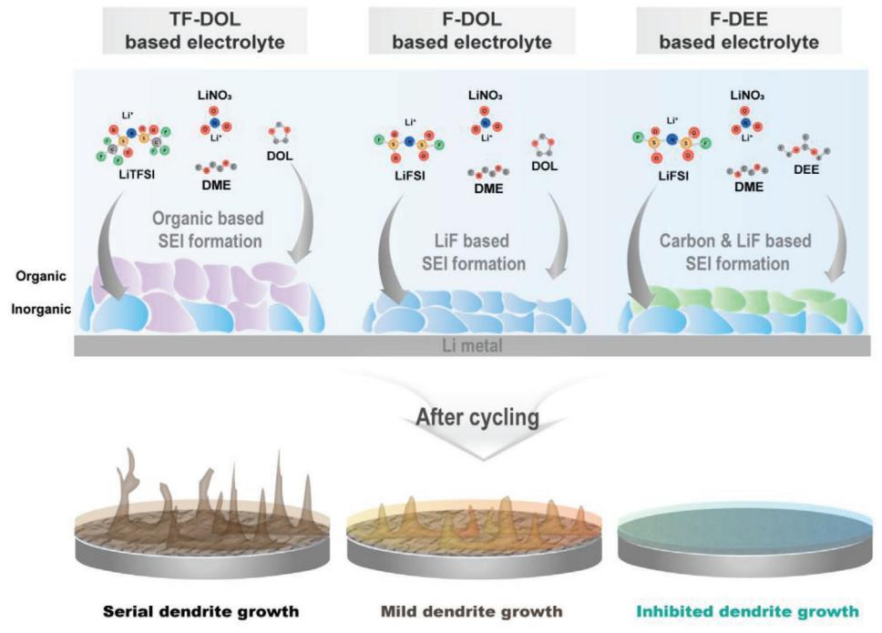
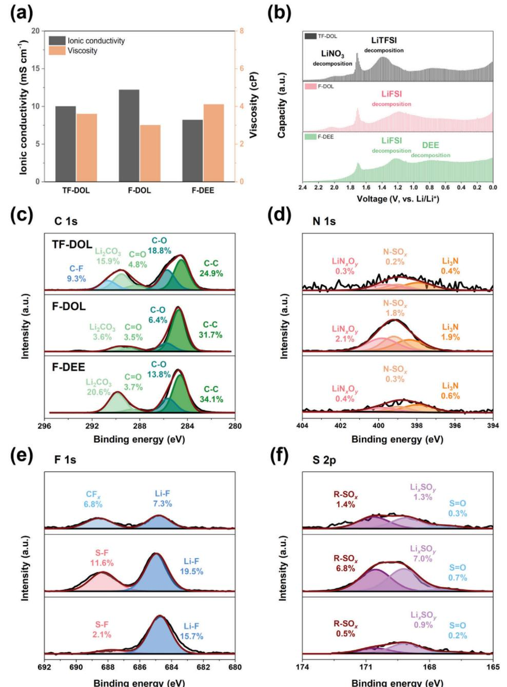
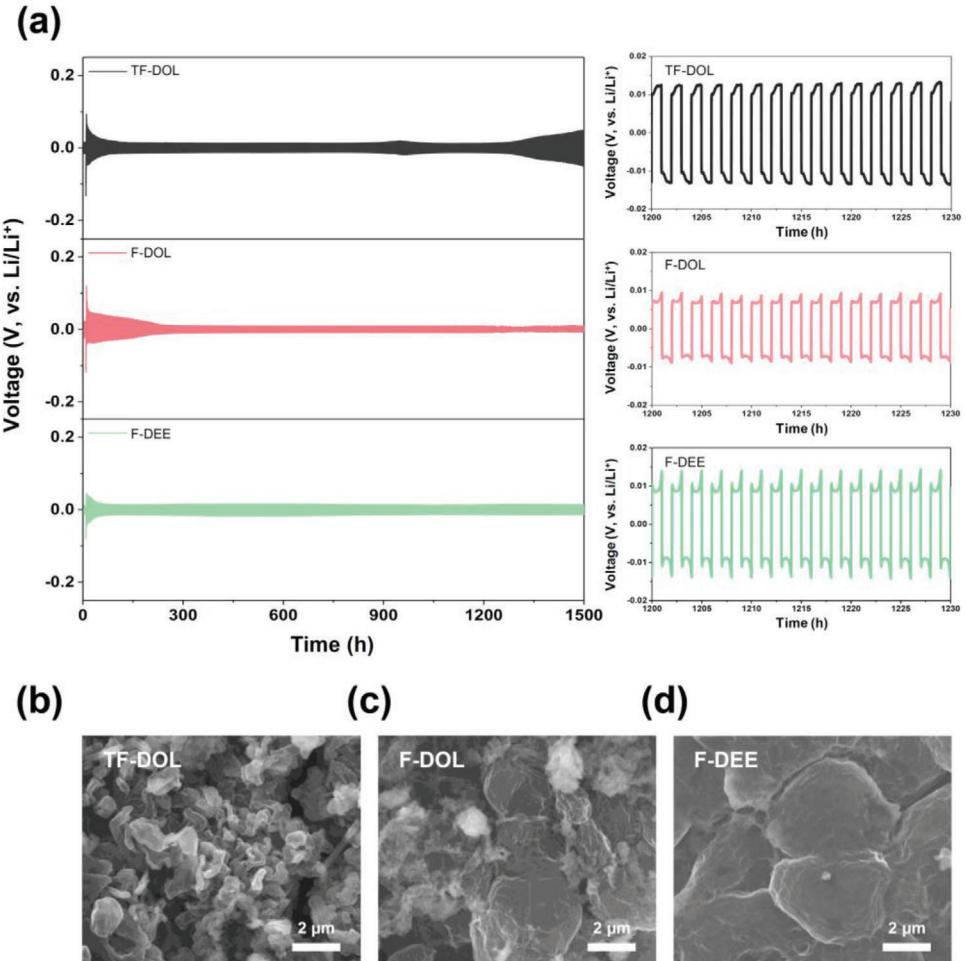
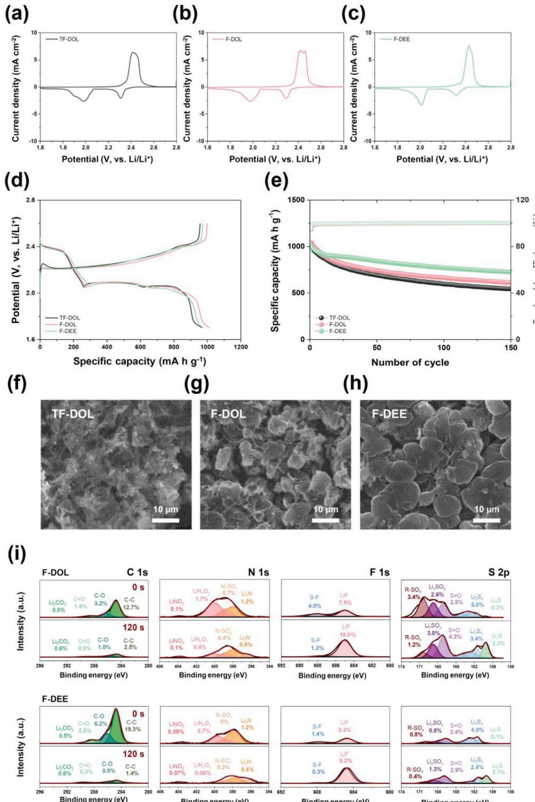

# **Effective Electrolyte Combination Composed of 1,1-Diethoxyethane and Lithium Bis(fluorosulfonyl)imide for Dendrite-suppressible Li Metal Anodes**

*Juhwi Park, Junyoung Mun,\* and Taeeun Yim\**

**Although Li metal is considered the most promising anode material owing to its high theoretical capacity, there are numerous restrictions on expanding its application because of undesired surface reactions occurring at the Li anode. To solve this, an effective electrolyte combination consisting of 1,1-diethoxyethane (DEE) and lithium bis(fluorosulfonyl)imide (LiFSI) is used in this work, which can provide an organic/inorganic-hybridized solid-electrolyte interphase (SEI) at the Li anode. The DEE solvent affords flexible carbon-abundant components, whereas LiFSI offers mechanically rigid lithium fluoride-type components; these undergo electrochemical reduction to form SEI layers that are balanced in terms of organic and inorganic components. Systematic analysis results exhibit that when the SEI layer integrated with DEE and LiFSI is embedded in the lithium anode, electrolyte decomposition, and dendritic lithium growth are suppressed in Li/Li cells, thereby improving surface stability. Similarly, it provides stable cycle life characteristics even at 150 cycles in Li/S cells (72.0% vs 52.6%).**

#### **1. Introduction**

With increasing demand for electric vehicles, the market for rechargeable secondary batteries is also growing

J. Park, T. Yim Department of Chemistry Incheon National University 119 Academy-ro, Yeonsu-gu, Incheon 22012, Republic of Korea E-mail: [yte0102@inu.ac.kr](mailto:yte0102@inu.ac.kr) J. Park, T. Yim Research Institute of Basic Sciences Incheon National University 119 Academy-ro, Yeonsu-gu, Incheon 22012, Republic of Korea J. Mun School of Advanced Materials Science & Engineering Sungkyunkwan University 2066, Seobu-ro, Jangan-gu, Suwon-si, Gyeonggi-do 16419, Republic of Korea E-mail: [munjy@skku.edu](mailto:munjy@skku.edu) J. Mun SKKU Institute of Energy Science and Technology (SIEST) Sungkyunkwan University 2066, Seobu-ro, Jangan-gu, Suwon-si, Gyeonggi-do 16419, Republic of Korea

The ORCID identification number(s) for the author(s) of this article can be found under <https://doi.org/10.1002/adsu.202400680>

**DOI: 10.1002/adsu.202400680**

exponentially.[\[1–5\]](#page-6-0) As conventional lithium-ion batteries currently offer lower energy densities than those required by rechargeable secondary batteries used in electric vehicles, many efforts have been made to enhance their energy densities.[\[6–9\]](#page-6-0) Furthermore, as the energy densities of rechargeable secondary batteries significantly affect the driving mileages of electric vehicles, diversification of the electrode materials to offer high specific capacities and electrochemical potentials has been a major focus of investigation over the past several years.[\[10–12\]](#page-6-0)

To this end, advanced rechargeable batteries employing elemental sulfur (S8) as the cathode material have attracted significant attention owing to its high theoretical specific capacity of 1,675 mA h g−1. [\[13–16\]](#page-6-0) Lithium–sulfur

batteries (LSBs), which comprise a S8 cathode and Li anode, can achieve higher energy densities than conventional lithiumion batteries, potentially extending the theoretical energy densities of the cells to nearly ten times of those that can be achieved using conventional cathode materials such as layered lithium oxides.[\[17,18\]](#page-6-0) However, S8 as a cathode material faces the critical challenge of low electronic conductivity (5.0 × 10−30 S cm−1 at 25 °C), resulting in a practical specific capacity of only ˜ 1,000 mA h g−1, which hampers the facilitation of electrochemical reactions.[\[19,20\]](#page-6-0) Moreover, polysulfide (PS), an intermediate formed from the S8 cathode during discharging/charging processes, is highly soluble in ether-based electrolytes; once dissolved, it severely causes the shuttle reaction, which drastically decreases the lifespans of LSBs.[\[21,22\]](#page-6-0) Furthermore, when dissolved in the electrolyte, PS species can form insulating side products such as Li2S at the Li anode interface by chemical reactions, severely hindering Li plating/dissolution.[\[23,24\]](#page-7-0) This undesirable chemical reactivity between the soluble PS intermediates and Li anode rapidly decreases the utilization of the S8 cathode material upon cycling, leading to a significant decline in cycling retention. Despite these challenges, the soluble behavior of PS species is intrinsic to the working mechanism of LSBs, making it crucial to control the chemical reactivity between the dissolved PS and Li anode to ensure a moderate lifespan for LSBs.[\[25\]](#page-7-0)

Accordingly, numerous efforts have been made to protect Li anodes from chemical reactions with PS.[\[26–28\]](#page-7-0) In conventional lithium-ion batteries, it is well understood that undesired

**Figure 1.** Schematic diagram of Li metal interfaces controlled by TF-DOL-, F-DOL-, and F-DEE-based electrolytes.

electrolyte decomposition at the graphite anode can be effectively managed using vinylene carbonate (VC) as an additive, which forms a solid–electrolyte interphase (SEI) layer via electrochemical reactions.[\[29,30\]](#page-7-0) These SEI layers significantly reduce the electrolyte decomposition at the graphite anode by physically inhibiting electron transfer from the anode to the electrolyte.[\[31\]](#page-7-0) In LSBs, lithium nitrate (LiNO3) performs an analogous role; LiNO3 forms NO*x*-based SEI layers on the Li anode through electrochemical reduction, which efficiently protects the anode by suppressing electrolyte decomposition.[\[32–34\]](#page-7-0) Numerous electrochemical reduction-type additives have been explored in LSBs,[\[35\]](#page-7-0) such as biphenyl-4,4′-dithiol (BPD),[\[36\]](#page-7-0) nickel chloride dimethoxyethane (NiDME),[\[37\]](#page-7-0) *N*-methyl-(*n*-butyl)pyrrolidinium bis(trifluoromethylsulfonyl)imide (Py1,4TFSI),[\[38\]](#page-7-0) phosphorus pentasulfide (P2S5),[\[39\]](#page-7-0) lithium iodide (LiI).[\[40\]](#page-7-0) Recently, our group reported that combining 1,2-dimethoxyethane (DEE) with a LiNO3 additive resulted in the formation of organic/inorganichybridized SEI layers, which significantly reduced parasitic reactions at the Li anode.[\[41\]](#page-7-0) These findings suggest that controlling the reactivity of the Li anode, where chemical/electrochemical reactions with PS species occur, is essential for ensuring the stable cycling performance of LSBs.

In this study, we report an effective electrolyte combination composed of LiNO3, DEE, and LiFSI additives (**Figure 1**). Although the LiNO3 additive alone can form NO*x*-based SEI layers on the Li anode, ensuring improved uniformity of these layers remains a challenge because LiNO3 alone cannot provide durable SEI layers for the prolonged cycling of LSBs.[\[42,43\]](#page-7-0) Our preliminary research indicated that the combination of LiNO3 and DEE could offer more reliable SEI layers hybridized with organic/inorganic SEI components;[\[41\]](#page-7-0) however, more reliable construction of the SEI layers is required because only a small amount of LiNO3 can be used in LSBs owing to its poor solubility in ether-based solvents.[\[44,45\]](#page-7-0) Therefore, we added lithium bis(fluorosulfonyl)imide (LiFSI) to the electrolyte, as it can form a robust LiF-based inorganic SEI layer. Note that this additional LiF-rich SEI layer not only prevented the electrochemical decomposition of electrolytes at the Li anode but also prevented chemical reactions of PS with the Li anode, expecting to improve the cycling retentions of LSBs.

#### **2. Results and Discussion**

The physical properties of the suggested electrolyte combinations were analyzed in terms of viscosity and ionic conductivity (**Figure 2**[a\)](#page-2-0). F-DOL exhibited lower viscosity (3.0 cP) than TF-DOL (3.6 cP) because the size of the anion in F-DOL (FSI−) was smaller than that in TF-DOL (TFSI−). Meanwhile, the DEE-based electrolyte (F-DEE) exhibited a higher viscosity (4.1 cP) than its DOL-based counterparts because a larger steric hindrance occurred in the linear solvent DEE. Similar behaviors were observed for the ionic conductivities of the electrolytes. F-DOL exhibited a greater ionic conductivity (12.2 mS cm−1) than TF-DOL (10.0 mS cm−1) because it employed the less sterically hindered LiFSI as the main lithium salt.[\[46,47\]](#page-7-0) Meanwhile, when the cyclic 1,3-dioxolane (DOL) solvent (F-DOL) was substituted with the linear DEE solvent (F-DEE), the ionic conductivity decreased to 8.2 mS cm−1 because the linear structure seemed to intervene with the Li+ migration in the electrolyte owing to its rotatable structure.[\[48\]](#page-7-0) Nevertheless, the ionic conductivity was still sufficiently high for employment in cells to allow Li+ migration between the electrodes.[\[49,50\]](#page-7-0)

To address the nature of the SEI layers, the potentials of the cells were slowly scanned using electrochemical voltage

**Figure 2.** a) Ionic conductivity and viscosity of each electrolyte. b) Electrochemical voltage spectroscopy (EVS) of each electrolyte. XPS profiles after formation step of c) Li 1s, d) C 1s, e) F 1s, and f) S 2p.

spectroscopy (EVS), and the resulting reductive currents were analyzed at 10 mV increments, as shown in Figure 2b. Generally, LiNO3 appeared at 1.70 V (vs Li/Li+) for all electrolyte combinations.[\[51\]](#page-7-0) For TF-DOL, the electrochemical decomposition of lithium bis(trifluoromethanesulfonyl)imide (LiTFSI) was observed at 1.40 V (vs Li/Li+),[\[52\]](#page-7-0) indicating that the LiTFSI might have participated in forming the SEI layers on the Li anode. For F-DOL, LiFSI decomposition was observed at 1.20 V (vs Li/Li+);[\[53\]](#page-7-0) this was also observed for F-DEE at a similar potential. Interestingly, an additional reductive peak was observed at 0.80 V (vs Li/Li+) for F-DEE. Note that the only difference between F-DEE and other electrolytes was the presence of the DEE component in the electrolyte, implying that the decomposition of the DEE component might have resulted in the reductive peak at 0.80 V (vs Li/Li+) via electrochemical reduction. In other words, DEE built SEI layers in addition to those formed by LiNO3 and LiFSI under cathodic polarization, resulting in the formation of complex SEI layers on the Li anode. To estimate the difference in the electrochemical behaviors between the DEE and DOL solvents, F-DEE and F-DOL were analyzed by NMR, and Raman spectroscopies (Figure S1, Supporting Information). There was a slight difference in the observed results; the peak corresponding to a free FSI anion (717 cm−1) [\[54\]](#page-7-0) was higher in F-DEE than in F-DOL, indicating that DEE was mainly chelated with Li+ species in the electrolyte solution. This indicates a difference in the solvating behavior between DOL and DEE: Li+ can be solvated with one oxygen atom existing in the DOL solvent because the 5-membered rigid DOL structure does not permit free rotation of the molecule; therefore, one oxygen atom should be separated from the other oxygen atom in DOL.[\[55\]](#page-7-0) On the contrary, the free rotation of oxygen might be possible in a linear DEE solvent; therefore, Li+ can be chelated with two oxygen elements in the DEE solvent structure. In this case, DEE has more positive characteristics owing to its preferred interaction with Li+; therefore, electrochemical reduction is preferred during the discharging step. Similar behavior was observed in the 7Li NMR spectra (Figure S2, Supporting Information): Li+ in F-DEE was observed in the upfield region (1.56 ppm) compared to that in F-DOL (1.68 ppm), indicating that Li+ is located in a more electronic-shielding environment because Li+ is chelated with the electron-rich oxygen elements of F-DEE.[\[56\]](#page-7-0)

Further X-ray photoelectron spectroscopy (XPS) analyses provided informative clues for estimating the information about the SEI layers (Figure [2c–f\)](#page-2-0). Comparing the F 1s spectra of the Li anodes cycled in TF-DOL and F-DOL, the former exhibited a relatively weak LiF peak (685 eV)[\[57\]](#page-7-0) compared to the latter. This indicates that even if the decomposition of LiTFSI participated in the formation of SEI layers, LiFSI seemed to be more dominant when incorporating LiF components. Meanwhile, XPS spectra showed that TF-DOL provided a higher amount of carbon-based flexible SEI components, such as Li2CO3 (289.9 eV),[\[57\]](#page-7-0) C═O (288.6 eV),[\[58\]](#page-7-0) and C─O (285.8 eV),[\[59\]](#page-7-0) and a lower amount of inorganic components than F-DOL, which mainly provided LiN*x*O*y* (400.2 eV),[\[60\]](#page-7-0) N─SO*x* (398.8 eV),[\[61\]](#page-7-0) Li3N (398.2 eV),[\[60\]](#page-7-0) R─SO*x* (170.7 eV), Li*x*SO*y* (169.0 eV),[\[62\]](#page-7-0) and S═O (167 eV).[\[63\]](#page-7-0) This means that organic-component-rich SEI components were mainly formed at the Li anode when DOL was combined with LiTFSI, while inorganic-component-predominant SEI layers were formed when DOL was combined with LiFSI. Interestingly, when DOL was replaced with DEE (F-DEE), noticeable changes in the chemical compositions of the SEI layers were observed in their XPS spectra. In detail, cycling in F-DEE revealed that the LiF composition slightly decreased in the presence of the DEE solvent, although the valid composition of inorganic species was still found at the Li anode. Note that LiF is an effective chemical component that regulates undesirable reactions at the Li anode,[\[64,65\]](#page-7-0) and such a composition seems to be compatible with controlling undesired reactions. Further, when DEE was used as the main solvent, the proportion of flexible carbonbased components increased compared to that obtained when the DOL/LiTFSI combination (TF-DOL) was used. The reliability and durability of SEI layers during prolonged cycling depend on the balance of organic and inorganic components in their compositions;[\[66,67\]](#page-7-0) the results, therefore, indicate that the use of DEE caused electrochemical reactions that afforded SEI layers that were well-balanced in terms of the relative ratio between the inorganic and organic species. According to N 1s spectra, the participation of LiNO3 in the SEI layers decreased in the presence of DEE. Note that the SEI layers formed by LiNO3 tend to delaminate from the Li anode during cycling, presenting a significant challenge.[\[68\]](#page-7-0) Although maintaining a sufficient concentration of LiNO3 in the electrolyte is necessary, its low solubility in the electrolyte limits the amount that can be dissolved. In this regard, the use of DEE combined with LiNO3 offers a potential way to alleviate this limitation, as it can form organic component-based SEI layers through its decomposition, while simultaneously restricting further involvement of LiNO3 in the formation of the SEI layers. Therefore, this might decrease the considerable consumption of LiNO3 during the early cycling step, which allows the remaining LiNO3 to form additional SEI layers on the defects of the Li anode as cycling progresses.

During symmetric cycling (**Figure 3**[a\)](#page-4-0), it was observed that prolonged cycling was affected by each SEI layer. Although all cells showed slight polarization behavior during the initial cycle regardless of the electrolyte used, as the electrochemical decomposition involved polarization, they gradually stabilized after a few hours. However, TF-DOL destabilized the cycling after 1300 h. In contrast, the F-DEE still exhibited prolonged cycling after 1500 h, revealing that the reactive Li anode was well regulated after developing SEI layers. To confirm the surface changes, the recovered Li anodes were examined using scanning electron microscopy (SEM) (Figure [3b–d\)](#page-4-0). The Li anodes cycled in the presence of TF-DOL exhibited grown Li plates on the Li surfaces, suggesting that LiFSI is more desirable than LiTFSI in protecting the Li interface.[\[69\]](#page-7-0) Although the sizes of the grown Li plates were smaller on the anodes cycled in F-DOL than on those cycled in TF-DOL, it was clear that the surfaces of the Li anodes were not well regulated in the presence of these electrolyte combinations. In contrast, a more regulated surface state was observed for the Li anode cycled in F-DEE, indicating that the undesired reactions were controlled, which led to enhanced cycling behavior.

The reversible cycling behavior was elucidated using cyclic voltammetry (CV) to estimate the compatibility of the suggested electrolyte combination with LSBs (**Figure 4**[a–c\)](#page-5-0). Although F-DEE exhibited a lower ionic conductivity than the DOL-based electrolytes, the initial CV curve of the cell using F-DEE was similar to the CV curves of those that used the DOL-based electrolytes. This indicates that the reversible oxidation/reduction of PS is still possible even with F-DEE-20. In terms of cycling performance (Figure [4d,e\)](#page-5-0), a lower initial specific capacity was obtained with TF-DOL (957.8 mA h g−1) than with the LiFSI-based electrolytes (F-DOL: 1000.1 mA h g−1 and F-DEE: 972.2 mA h g−1) because TF-DOL exhibited a lower sulfur utilization rate during cycling.[\[70\]](#page-7-0) However, the cycling retention was improved when F-DEE-20 was used; furthermore, although the cells with DOL-based electrolytes steadily faded after 150 cycles (TF-DOL: 52.6% and F-DOL: 58.8%), F-DEE still afforded 72.0% retention. In the coulombic efficiency (CE), the cells with F-DEE exhibited improved behavior compared with those with TF-DOL and F-DOL. The cells with F-DEE exhibited the highest average CE values over 100 cycles (99.95%), whereas the cells with TF-DOL and F-DOL exhibited the lowest average CE values (99.70% and 99.48%). To determine the origin of this difference in cycling retention, cycled Li anodes were recovered and analyzed by SEM (Figure [4f–h\)](#page-5-0). The surfaces of the recovered Li anodes were severely changed upon undergoing extensive cycling (150

**Figure 3.** a) Li/Li symmetric cell of each electrolyte at 1.0 mA cm−2. SEM images of Li metal after the formation step: e) TF-DOL, f) F-DOL, and g) F-DEE-based electrolyte.

cycles), regardless of the electrolyte. This indicates that regulating the surfaces of Li anodes to achieve stable, prolonged cycling remains a challenging task. Nevertheless, there were meaningful differences between the Li anodes: although the surfaces of the recovered Li anodes cycled in DOL-based electrolytes seemed to have broken into small pieces by accumulating the fatigue caused by mechanical stresses, less deformation appeared in the recovered Li anode cycled in F-DEE. In the further XPS analyses for recovered Li anodes (Figure [4i\)](#page-5-0), it is found that undesired reactions were well regulated in the Li anode in the presence of F-DEE. In the recovered Li anode with F-DOL, a large number of decomposed adducts were mainly formed at the Li anode, such as LiNO2 (404 eV),[\[71\]](#page-7-0) LiN*x*O*y* (400.2 eV), N─SO*x* (398.8 eV), and Li3N (398.2 eV) in N 1s and R─SO*x* (170.7 eV), Li*x*SO*y* (169.0 eV), S═O (167 eV), Li2S*x* (161.4–164 eV),[\[72,73\]](#page-7-0) and Li2S (160 eV). [\[74\]](#page-7-0) Conversely, fewer decomposed adducts were observed in the recovered Li anode with F-DEE. When in-depth analyses of the recovered Li anodes were performed, decomposed adducts still appeared in the recovered Li anode in the presence of F-DOL after 120 s, indicating that electrolyte decomposition, in addition to the chemical reaction of the PS intermediates, occurred severely in F-DOL. Meanwhile, the recovered Li anode with F-DEE showed a relatively lower concentration of decomposed adducts after 120 s of etching. This suggests that unfavorable surface reactions were properly controlled in the presence of F-DEE, which contributed to improved interfacial stability by forming effective SEI layers on the Li anode.

### **3. Conclusion**

An effective electrolyte combination comprising a DEE solvent and LiFSI salt was proposed for the stable cycling of Li anodes. The LiFSI salt provided durable LiF-based SEI layers, and the DEE solvent provided carbon-abundant SEI layers via electrochemical reduction, allowing well-balanced SEI layers to be placed on the Li anode. Although replacing the DOL solvent with the DEE solvent resulted in slight decreases in the physical properties of the electrolyte (viscosity and ionic conductivity), the electrolyte was still compatible with the cell. During Li/Li symmetric cycling, F-DEE exhibited prolonged cycling retention without severe formation of dendritic Li and reliable cycling behavior in Li/S batteries. Specifically, F-DEE exhibited stable cycling retention (72.0%) even after 150 cycles because the combination of the DEE solvent and LiFSI salt effectively protected the surface of the

**Figure 4.** Cyclic voltammetry of electrolytes: a) TF-DOL, b) F-DOL, and c) F-DEE. d) Potential profiles and e) cycling performances of Li/S cells. SEM images of Li anodes after 150 cycles cycled by f) TF-DOL, g) F-DOL, and h) F-DEE-based electrolyte. i) XPS depth profiles of Li anodes after cycling for C 1s, N 1s, F 1s, and S 2p.

Li anode. Further ex-situ analyses of the recovered Li anode revealed that such an electrolyte combination not only restricted the fast growth of dendritic Li at the Li anode but also alleviated electrolyte decomposition upon cycling, as the DEE/LiFSI combination resulted in the formation of durable organic/inorganicbased SEI layers on the Li anode.

# **4. Experimental Section**

LiTFSI (Soulbrain), LiFSI (Chunbo Chemicals), and LiNO3 (Aldrich) were used as the lithium salts. DOL (Alfa Aesar), 1,2-dimethoxyethane (DME; Aldrich), and DEE (Aldrich) were used as the electrolyte components. The electrolyte compositions DOL:DME = 2:8 (v/v%) with 1 m LiTFSI, DOL:DME = 2:8 (v/v%) with 1 m LiFSI, and DEE:DME = 2:8 (v/v%) with 1 m LiFSI were abbreviated as TF-DOL, F-DOL, and F-DEE, respectively; note that all electrolytes comprise 0.4 m LiNO3. The ionic conductivities and viscosities of the electrolytes were measured using a conductivity meter (CM-41X, TOA-DKK) and a viscometer (CL-1, CAS), respectively, at room temperature. For EVS, the cells were fabricated using Cu (working electrode) and Li metal (counter and reference electrodes). The voltage applied to the cells was varied from 2.4 V to 0.0 V (vs Li/Li+), decreasing in 10 mV increments; each voltage was applied for 10 min, with 10 min rest in between, and the reductive currents were recorded as a function of each voltage. Raman (DXR2xi, Thermo Fisher Scientific) and 7Li SS NMR (Avance III HD 400, Bruker) were used to predict the solvation structure of the electrolytes. The chemical compositions of the Li anodes were analyzed using XPS (K-Alpha, Thermo Fisher Scientific). The cycling behavior of each electrolyte was further investigated using Li/Li symmetric cells. The cells were charged and discharged for 1 h with current densities of 0.1 mA cm−2 (formation step), following which the current densities were increased to 1.0 mA cm−2 for 750 cycles. After cycling, the Li anodes were disassembled and their surfaces were analyzed by SEM (JSM IT-800, JEOL).

The sulfur cathode was prepared as follows. Elemental sulfur (Aldrich) was infiltrated into mesoporous carbon (Toyo Tanso) by mixing at a weight ratio of 4.8:1.0, then heating at 155 °C for 8 h. The S/C cathode materials, carbon conducting agent, and poly(vinylidene fluoride) (PVDF; Kureha) were dispersed in *N*-methyl-2-pyrrolidinone (NMP; Ashland) for 2 h, and the resulting slurries were cast on Al foil and dried at 60 °C for 12 h to form the sulfur cathode. The mass loading of the cathodes was 1.9 ± 0.3 mg cm−2. For CV, cells were assembled with the sulfur cathode, Li anode, separator, and electrolyte (100 uL). The cells were discharged and charged from 2.8 to 1.6 V versus Li/Li+ at a scan rate of 0.1 mV s−1 at room temperature. For measuring the cycling performance, the cells were discharged/charged from 2.6 to 1.8 V versus Li/Li+ at 0.1 C (formation step) for two cycles and from 2.6 to 1.7 V versus Li/Li+ at 0.3 C for 150 cycles. After cycling, the Li anodes were recovered in an Ar-filled glove box, and their surface states were analyzed by SEM (JSM-IT800, JEOL). The chemical composition of the cycled Li anodes was analyzed using XPS (NEXSA G2, Thermo Fisher Scientific).

# **Supporting Information**

Supporting Information is available from the Wiley Online Library or from the author.

### **Acknowledgements**

This work was supported by the National Research Foundation of Korea (NRF) (NRF-2022R1F1A1069039), by the Core Research Institute (CRI) Program, the Basic Science Research Program through the National Research Foundation of Korea (NRF), Ministry of Education (RS-2017- NR023047), and the Technology Innovation Program (20011173) funded by the Ministry of Trade, Industry & Energy (MOTIE, Korea).

# **Conflict of Interest**

The authors declare no conflict of interest.

# **Data Availability Statement**

The data that support the findings of this study are available from the corresponding author upon reasonable request.

# **Keywords**

1,1-diethoxyethane, dendrite, electrolyte, lithium metal batteries, lithiumsulfur batteries

> Received: September 6, 2024 Revised: November 28, 2024 Published online: December 15, 2024

- [1] M. Fichtner, K. Edström, E. Ayerbe, M. Berecibar, A. Bhowmik, I. E. Castelli, S. Clark, R. Dominko, M. Erakca, A. A. Franco, A. Grimaud, B. Horstmann, A. Latz, H. Lorrmann, M. Meeus, R. Narayan, F. Pammer, J. Ruhland, H. Stein, T. Vegge, M. Weil, *Adv. Energy Mater.* **2022**, *12*, 2102904.
- [2] A. L. Mong, Q. X. Shi, H. Jeon, Y. S. Ye, X. L. Xie, D. Kim, *Adv. Funct. Mater.* **2021**, *31*, 2008586.
- [3] Q. Wang, T. O'Carroll, F. Shi, Y. Huang, G. Chen, X. Yang, A. Nevar, N. Dudko, N. Tarasenko, J. Xie, L. Shi, G. Wu, D. Zhang, *Electrochem. Energy Rev.* **2024**, *7*, 15.
- [4] J. Neumann, M. Petranikova, M. Meeus, J. D. Gamarra, R. Younesi, M. Winter, S. Nowak, *Adv. Energy Mater.* **2022**, *12*, 2102917.
- [5] W. Yao, Z. Chen, X. Zhang, J. Luo, J. Wang, M. He, C. Chen, X.-B. Cheng, J. Xu, *Adv. Funct. Mater.* **2024**, *34*, 2400348.
- [6] Y. Tian, G. Zeng, A. Rutt, T. Shi, H. Kim, J. Wang, J. Koettgen, Y. Sun, B. Ouyang, T. Chen, Z. Lun, Z. Rong, K. Persson, G. Ceder, *Chem. Rev.* **2021**, *121*, 1623.
- [7] X. Yuan, F. Ma, L. Zuo, J. Wang, N. Yu, Y. Chen, Y. Zhu, Q. Huang, R. Holze, Y. Wu, T. van Ree, *Electrochem. Energy Rev.* **2021**, *4*, 1.
- [8] L. Ma, N. Li, S. Zhou, X. Zhang, K. Xie, *Adv. Energy Mater.* **2024**, *14*, 2401157.
- [9] Z. Song, W. Li, Z. Gao, Y. Chen, D. Wang, S. Chen, *Adv. Sci.* **2024**, *11*, 2400405.
- [10] J. W. Choi, D. Aurbach, *Nat. Rev. Mater.* **2016**, *1*, 16013.
- [11] F. Duffner, N. Kronemeyer, J. Tübke, J. Leker, M. Winter, R. Schmuch, *Nat. Energy.* **2021**, *6*, 123.
- [12] A. Manthiram, *Nat. Commun.* **2020**, *11*, 1550.
- [13] H. Raza, S. Bai, J. Cheng, S. Majumder, H. Zhu, Q. Liu, G. Zheng, X. Li, G. Chen, *Electrochem. Energy Rev.* **2023**, *6*, 29.
- [14] H.-Y. Park, S. H. Kim, J.-H. Yu, J. E. Kwon, J. Y. Lim, S. W. Choi, J.-S. Yu, Y. Jung, *J. Electrochem. Sci. Technol.* **2024**, *15*, 198.
- [15] H. Zhang, M. Zhang, R. Liu, T. He, L. Xiang, X. Wu, Z. Piao, Y. Jia, C. Zhang, H. Li, F. Xu, G. Zhou, Y. Mai, *Nat. Commun.* **2024**, *15*, 5451.
- [16] L. Jiao, H. Li, C. Zhang, H. Jiang, S. Yang, D. Shu, C. Li, B. Cheng, Q. Yang, W. Zhang, *EcoMat* **2022**, *4*, e12262.
- [17] Q. Pang, X. Liang, C. Y. Kwok, L. F. Nazar, *Nat. Energy* **2016**, *1*, 16132.
- [18] M. J. M. Al Essa, *J. Electrochem. Sci. Technol.* **2024**, *15*, 1.
- [19] J. Zhou, A. Sun, *Chem. Eng. J.* **2024**, *495*, 153648.
- [20] B. J. Lee, T. H. Kang, H. Y. Lee, J. S. Samdani, Y. Jung, C. Zhang, Z. Yu, G. L. Xu, L. Cheng, S. Byun, Y. M. Lee, K. Amine, J. S. Yu, *Adv. Energy Mater.* **2020**, *10*, 1903934.
- [21] A. Manthiram, Y. Fu, S. H. Chung, C. Zu, Y. S. Su, *Chem. Rev.* **2014**, *114*, 11751.

- [22] N. Togasaki, A. Nakao, A. Nakai, F. Maeda, S. Kobayashi, T. Osaka, *J. Electrochem. Sci. Technol.* **2023**, *14*, 361.
- [23] Z. Liu, S. Bertolini, P. B. Balbuena, P. P. Mukherjee, *ACS Appl. Mater. Interfaces* **2016**, *8*, 4700.
- [24] L.-P. Hou, X.-Q. Zhang, B.-Q. Li, Q. Zhang, *Mater. Today* **2021**, *45*, 62.
- [25] C. Huang, J. Xiao, Y. Shao, J. Zheng, W. D. Bennett, D. Lu, L. V. Saraf, M. Engelhard, L. Ji, J. Zhang, X. Li, G. L. Graff, J. Liu, *Nat. Commun.* **2014**, *5*, 3015.
- [26] Y. Lu, S. Gu, X. Hong, K. Rui, X. Huang, J. Jin, C. Chen, J. Yang, Z. Wen, *Energy Storage Mater.* **2018**, *11*, 16.
- [27] W. Yang, W. Yang, B. Sun, S. Di, K. Yan, G. Wang, G. Shao, *ACS Appl. Mater. Interfaces* **2018**, *10*, 39695.
- [28] J. Liang, X. Li, Y. Zhao, L. V. Goncharova, G. Wang, K. R. Adair, C. Wang, R. Li, Y. Zhu, Y. Qian, L. Zhang, R. Yang, S. Lu, X. Sun, *Adv. Mater.* **2018**, *30*, 1804684.
- [29] B. Han, Y. Zou, G. Xu, S. Hu, Y. Kang, Y. Qian, J. Wu, X. Ma, J. Yao, T. Li, Z. Zhang, H. Meng, H. Wang, Y. Deng, J. Li, M. Gu, *Energy Environ. Sci.* **2021**, *14*, 4882.
- [30] D. Pritzl, S. Solchenbach, M. Wetjen, H. A. Gasteiger, *J. Electrochem. Soc.* **2017**, *164*, A2625.
- [31] W. Yao, S. He, Y. Xue, Q. Zhang, J. Wang, M. He, J. Xu, C. Chen, Xu X., *ACS Sustainable Chem. Eng.* **2021**, *9*, 9961.
- [32] C. Jing, Z. Peng, K. Yan, L. Chen, C. Zhang, W. Wei, *ACS Appl. Mater. Interfaces* **2024**, *16*, 33647.
- [33] R. Zhang, X. B. Cheng, C. Z. Zhao, H. J. Peng, J. L. Shi, J. Q. Huang, J. Wang, F. Wei, Q. Zhang, *Adv. Mater.* **2016**, *28*, 2155.
- [34] Y. Xu, Y. Song, Z. Chen, J. Yu, J. Wang, M. He, J. Xu, J. Luo, W. Yao, *J. Colloid Interface Sci.* **2025**, *679*, 737.
- [35] J. Bell, R. Ye, D. Patino, K. Ahmed, A. Scott, L. Peng, Z. Mutlu, M. Ozkan, C. S. Ozkan, *Nano Energy* **2018**, *49*, 498.
- [36] H.-L. Wu, M. Shin, Y.-M. Liu, K. A. See, A. A. Gewirth, *Nano Energy* **2017**, *32*, 50.
- [37] C. Luo, X. Liang, Y. Sun, W. Lv, Y. Sun, Z. Lu, W. Hua, H. Yang, R. Wang, C. Yan, J. Li, Y. Wan, Q.-H. Yang, *Energy Storage Mater.* **2020**, *33*, 290.
- [38] M. Agostini, M. Sadd, S. Xiong, C. Cavallo, J. Heo, J. H. Ahn, A. Matic, *ChemSusChem* **2019**, *12*, 4176.
- [39] Z. Lin, Z. Liu, W. Fu, N. J. Dudney, C. Liang, *Adv. Funct. Mater.* **2013**, *23*, 1064.
- [40] F. Wu, J. T. Lee, N. Nitta, H. Kim, O. Borodin, G. Yushin, *Adv. Mater.* **2015**, *27*, 101.
- [41] J. Park, T. H. Kim, T. Yim, *Bull. Korean Chem. Soc.* **2024**, *45*, 74.
- [42] S. S. Zhang, *Electrochim. Acta* **2012**, *70*, 344.
- [43] M. Sun, X. Wang, J. Wang, H. Yang, L. Wang, T. Liu, *ACS Appl. Mater. Interfaces.* **2018**, *10*, 35175.
- [44] Q. Jin, K. Zhao, L. Wu, L. Li, L. Kong, X. Zhang, *J. Energy Chem.* **2023**, *84*, 22.
- [45] D. W. Kang, J. Moon, H.-Y. Choi, H.-C. Shin, B. G. Kim, *J. Power Sources* **2021**, *490*, 229504.
- [46] H.-B. Han, S.-S. Zhou, D.-J. Zhang, S.-W. Feng, L.-F. Li, K. Liu, W.-F. Feng, J. Nie, H. Li, X.-J. Huang, *J. Power Sources* **2011**, *196*, 3623.
- [47] L. Wang, Z. Luo, H. Xu, N. Piao, Z. Chen, G. Tian, X. He, *RSC Adv.* **2019**, *9*, 41837.
- [48] H. R. Allcock, S. J. O'Connor, D. L. Olmeijer, M. E. Napierala, C. G. Cameron, *Macromolecules* **1996**, *29*, 7544.
- [49] M. R. Kaiser, S. Chou, H. K. Liu, S. X. Dou, C. Wang, J. Wang, *Adv. Mater.* **2017**, *29*, 1700449.
- [50] H. S. Kim, T.-G. Jeong, N.-S. Choi, Y.-T. Kim, *Ionics* **2013**, *19*, 1795.
- [51] C. Zhang, Q. Lan, Y. Liu, J. Wu, H. Shao, H. Zhan, Y. Yang, *Electrochim. Acta* **2019**, *306*, 407.
- [52] M. Tułodziecki, J. M. Tarascon, P. L. Taberna, C. Guéry, *Electrochem. Commun.* **2017**, *77*, 128.
- [53] M. Wang, L. Huai, G. Hu, S. Yang, F. Ren, S. Wang, Z. Zhang, Z. Chen, Z. Peng, C. Shen, D. Wang, *J. Phys. Chem. C* **2018**, *122*, 9825.
- [54] J.-F. Ding, R. Xu, N. Yao, X. Chen, Y. Xiao, Y.-X. Yao, C. Yan, J. Xie, J.-Q. Huang, *Angew. Chem., Int. Ed.* **2021**, *60*, 11442.
- [55] I. S. Roy, M. Döntgen, C. Huang, W. Kopp, K. Leonhard, *J. Phys. Chem. A* **2023**, *127*, 2992.
- [56] M. Mao, L. Gong, X. Wang, Q. Wang, G. Zhang, H. Wang, W. Xie, L. Suo, C. Wang, *Proc. Natl. Acad. Sci.* **2024**, *121*, e2316212121.
- [57] K. Asheim, I. F. Holsen, V. Renmann, M. V. Blanco, P. E. Vullum, N. P. Wagner, J. P. Mæhlen, A. M. Svensson, *Batter. Supercaps* **2024**, *7*, e202300541.
- [58] D. W. Zenga, K. C. Yungb, C. S. Xiea, *Surf. Coat. Technol.* **2002**, *153*, 210.
- [59] N. Schulz, R. Hausbrand, C. Wittich, L. Dimesso, W. Jaegermann, *J. Electrochem. Soc.* **2018**, *165*, A833.
- [60] H. Liang, L. Wang, Y. Song, D. Ren, A. Wang, Y. Yang, H. Xu, Y. Sun, X. He, *Adv. Funct. Mater.* **2023**, *33*, 2303077.
- [61] G. Qin, Y. Zhang, Z. Qi, X. He, *Adv. Funct. Mater.* **2024**, *34*, 2316813.
- [62] N. Azimi, Z. Xue, I. Bloom, M. L. Gordin, D. Wang, T. Daniel, C. Takoudis, Z. Zhang, *ACS Appl. Mater. Interfaces* **2015**, *7*, 9169.
- [63] V. Sharova, A. Moretti, T. Diemant, A. Varzi, R. J. Behm, S. Passerini, *J. Power Sources* **2018**, *375*, 43.
- [64] J. Fu, X. Ji, J. Chen, L. Chen, X. Fan, D. Mu, C. Wang, *Angew. Chem. Int. Ed.* **2020**, *59*, 22194.
- [65] T. hen, J. You, R. Li, H. Li, Y. Wang, C. Wu, Y. Sun, L. Yang, Z. Ye, B. Zhong, Z. Wu, X. Guo, *Adv. Sci.* **2022**, *9*, 2203216.
- [66] J. Tan, L. Ma, Z. Li, Y. Wang, M. Ye, J. Shen, *Mater. Today* **2023**, *69*, 287.
- [67] R. G. Fedorov, S. Maletti, C. Heubner, A. Michaelis, Y. Ein-Eli, *Adv. Energy Mater.* **2021**, *11*, 2101173.
- [68] P. C. Hsu, Y.-C. Lin, W.-H. Wu, C.-W. Pao, C.-H. Chen, *J. Electrochem. Soc.* **2022**, *169*, 120520.
- [69] X. Zhang, Z. Chen, J. Han, Q. Wang, J. Wang, J. Luo, J. Xu, C. Chen, W. Yao, *J. Materiomics* **2024**, *10*, 1252.
- [70] M.-K. Song, E. J. Cairns, Y. Zhang, *Nanoscale* **2013**, *5*, 2186.
- [71] A. G. Paul-Orecchio, L. Stockton, N. Barichello, A. Petersen, A. Dolocan, Y. Wang, D. Mitlin, C. B. Mullins, *ACS Appl. Mater. Interfaces* **2024**, *16*, 39341.
- [72] Y.-X. Song, Y. Shi, J. Wan, S.-Y. Lang, X.-C. Hu, H.-J. Yan, B. Liu, Y.-G. Guo, R. Wen, L.-J. Wan, *Energy Environ. Sci.* **2019**, *12*, 2496.
- [73] Y. Jin, G. Zhou, F. Shi, D. Zhuo, J. Zhao, K. Liu, Y. Liu, C. Zu, W. Chen, R. Zhang, X. Huang, Y. Cui, *Nat. Commun.* **2017**, *8*, 462.
- [74] M. J. Lacey, A. Yalamanchili, J. Maibach, C. Tengstedt, K. Edström, D. Brandell, *RSC Adv.* **2016**, *6*, 3632.