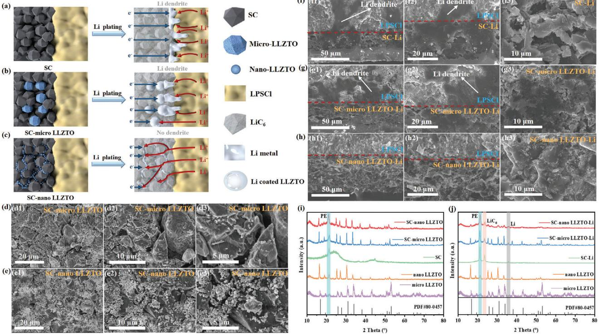
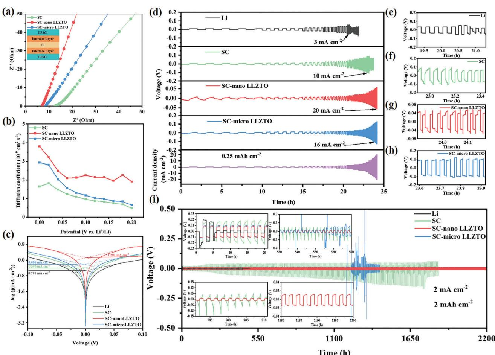
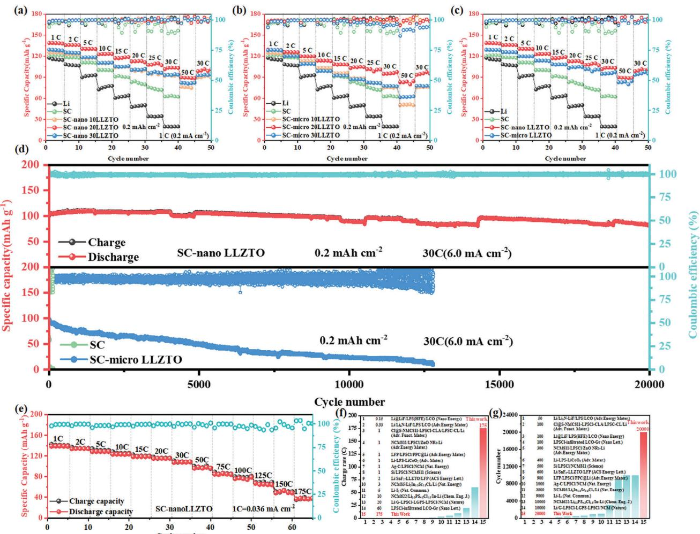
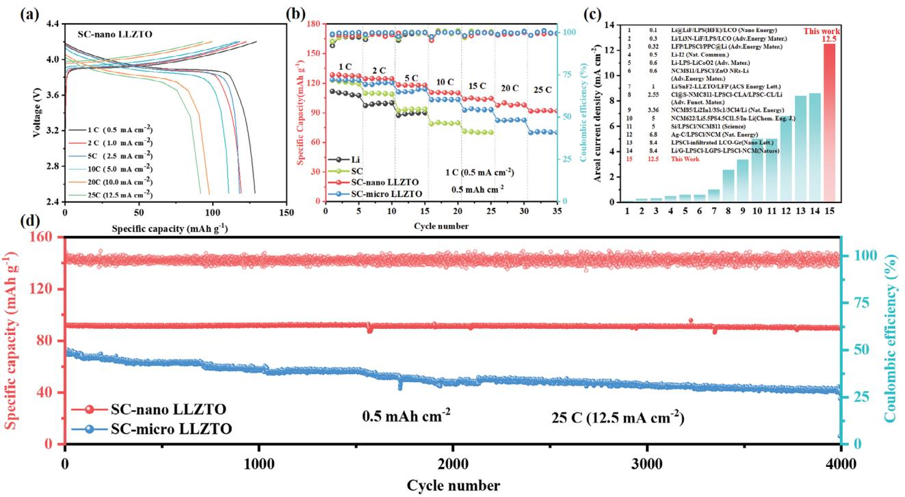
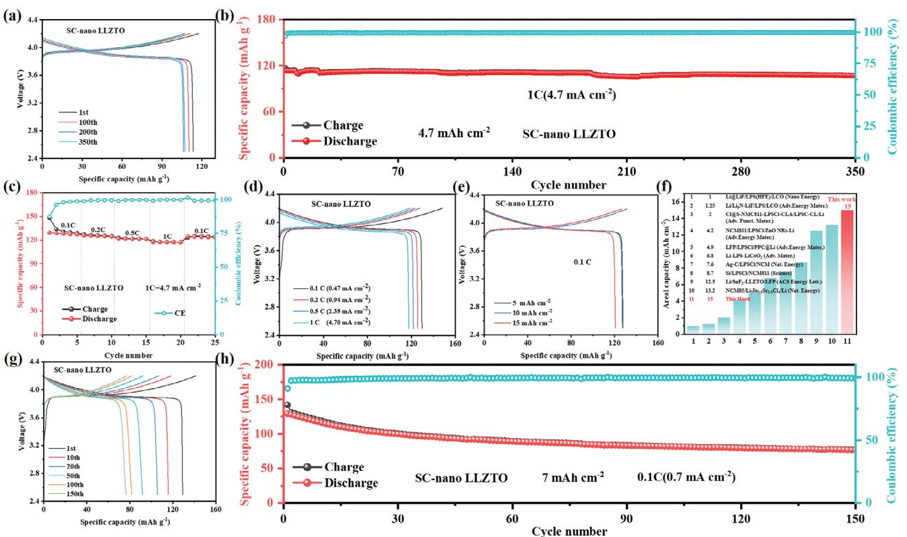
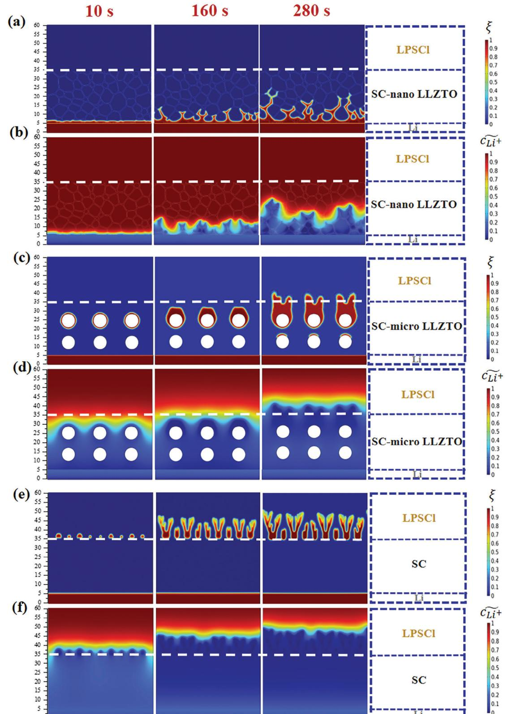

# **High-Areal-Capacity and Long-Cycle-Life All-Solid-State Lithium-Metal Battery by Mixed-Conduction Interface Layer**

*Ming Yang, Yujing Wu, Kaiqi Yang, Zhixuan Wang, Tenghuan Ma, Dengxu Wu, Fuqiang Xu, Li Yang, Pushun Lu, Jian Peng, Qifa Gao, Xiang Zhu, Zhiwen Jiang, Liquan Chen, Hong Li, and Fan Wu\**

**The rapid growth of lithium dendrites has seriously hindered the development and practical application of high-energy-density all-solid-state lithium metal batteries (ASSLMBs). Herein, a soft carbon (SC)-nano Li6.4La3Zr1.4Ta0.6O12 (LLZTO) (with high ionic conductivity and diffusion coefficient) mixed ionic and electronic conducting interface layer is designed to promote the rapid migration of Li+ at the interfacial layer, induce the uniform deposition of lithium metal on nanoscale (nano) LLZTO ion-conducting network inside the interface layer, effectively suppress the growth of lithium dendrites, and significantly improve the electrochemical performance of ASSLMBs. LiZrO2@LiCoO2(LZO@LCO)/Li6PS5Cl(LPSCl)-nano LLZTO/Li ASSLMB achieves high current density (12.5 mA cm−2), ultra-high areal capacity (15 mAh cm−2, corresponding to LZO@LCO mass loadings of 111.11 mg cm−2), and ultra-long cycle life (20 000 cycles). Therefore, the introduction of SC-nano LLZTO mixed conducting interface layer can greatly improve the interfacial stability between solid-state electrolyte (SSE) and lithium metal anode to enable dendrite-free ASSLMBs.**

## **1. Introduction**

All-solid-state lithium metal battery (ASSLMB) is one of the current research hotspots by combining non-flammable solidstate electrolyte (SSE) and high-energy-density lithium-metal anode to simultaneously solve safety problems and increase energy density.[\[1–6\]](#page-10-0) Among various types of SSEs, sulfide SSEs are one of the most promising candidates due to their high room-temperature ionic conductivity (1–25 mS cm−1), desirable mechanical properties, and interfacial compatibility with

M. Yang, Z. Wang, T. Ma, F. Xu, Q. Gao, X. Zhu, Z. Jiang, L. Chen, H. Li, F. Wu

Tianmu Lake Institute of Advanced Energy Storage Technologies Liyang, Jiangsu 213300, China E-mail: [fwu@iphy.ac.cn](mailto:fwu@iphy.ac.cn) M. Yang, T. Ma, F. Xu, Q. Gao, X. Zhu, F. Wu Nano Science and Technology Institute University of Science and Technology of China Suzhou 215123, China Y. Wu, D. Wu, P. Lu, J. Peng, L. Chen, H. Li, F. Wu Yangtze River Delta Physics Research Center Liyang, Jiangsu 213300, China

The ORCID identification number(s) for the author(s) of this article can be found under <https://doi.org/10.1002/aenm.202303229>

#### **DOI: 10.1002/aenm.202303229**

lithium metals.[\[7–14\]](#page-10-0) Sulfide ASSLMBs are expected to achieve higher energy densities for more specialized/highdemanding applications[\[15–20\]](#page-10-0) . However, the majority of sulfide SSEs are unstable toward lithium metal and suffer from dendrite growth or solid electrode/electrolyte interface (SEI) instability during battery charge/discharge cycles. This will lead to many problems such as internal short circuits, increased internal resistance, reduced Coulomb efficiency, and eventual failure of the battery, seriously hindering the practical application of ASSLMBs.[\[18,21–25\]](#page-10-0)

Various strategies have been proposed to alleviate sulfide SSE/Li interface problems, including tuning sulfide SSE components (doped Li3N,[\[26\]](#page-10-0) LiF,[\[27\]](#page-10-0) LiI,[\[28\]](#page-10-0) etc.), exploiting alloy layers (such as Li─In,[\[29\]](#page-10-0) Li─Mg°, Li─Si,[\[31\]](#page-10-0) Li─Sn,[\[32\]](#page-10-0) Li─Ag,[\[33\]](#page-10-0) etc.), and constructing artificial

SEIs (LiF,[\[34\]](#page-10-0) LiI,[\[35\]](#page-10-0) Li3N─LiF,[\[36\]](#page-11-0) etc.)/interfacial protection layers. Among them, the most promising approach is to construct a three-dimensional (3D) mixed ionic and electronic conducting interface layer. This interface layer can promote the rapid transport of Li+ at the interface and induce uniform deposition of lithium metal inside the interface layer, thus effectively preventing lithium deposition on the interface, reducing the local current density concentration, suppressing the growth of lithium dendrites, and improving the rate performance/cycle life of Allsolid-state batteries (ASSBs).[\[37–40\]](#page-11-0) For example, Xing et al.[\[41\]](#page-11-0)

Y. Wu, D. Wu, P. Lu, J. Peng, L. Chen, H. Li, F. Wu Beijing Advanced Innovation Center for Materials Genome Engineering Key Laboratory for Renewable Energy Beijing Key Laboratory for New Energy Materials and Devices Institute of Physics Chinese Academy of Sciences Beijing 100190, China Y. Wu, D. Wu, P. Lu, J. Peng, L. Chen, H. Li, F. Wu School of Physical Sciences University of Chinese Academy of Sciences Beijing 100049, China K. Yang Beijing DP Technology Co.,LTD Beijing 100080, China

prepared a 3D mixed conductive interface layer composed of lithiated graphite and lithium thiophosphate (LPS)-based SSE, which successfully transferred lithium metal deposition from the interface into the pores inside the interface layer to maintain its integrity. This significantly alleviates the short-circuit problem and improves the cycle life/coulomb efficiency of ASSBs. Furthermore, Wachsman's group designed a porous-dense-porous garnet-structured 3D mixed electron/ion conducting framework (3D-MCF) and used it as a 3D host for lithium metal in 2018.[\[37\]](#page-11-0) The porous garnet framework synthesized via the tape casting method provides ionic conductivity while conformal carbon nanotube (CNT) coating on the surface provides electronic conductivity, thus forming a mixed electron/ion conductor as a 3D host for lithium metal. Lithium metal is introduced into the 3D-MCF by slow electrochemical deposition to form a 3D lithium metal anode. The slow lithiation improves the interfacial contact between the lithium metal anode and the garnet SE, achieving a low resistance of 25 Ω cm−2. Moreover, the battery with 3D-MCF can achieve stable cycling of more than 180 h at a high current density of 1 mA cm−2. Additionally, the group developed a three-layer mixed ion- and electron-conducting (MIEC)- Ta-Li7La3Zr2O12 (LLZ)-MIEC structure in 2023, which achieved a CCD of 100 mA cm−2 and a lithium metal plating capacity of 60 mA cm−2 for garnet-type SE in a symmetric Li-ion battery configuration, effectively suppressing the growth of lithium dendrites.[\[38\]](#page-11-0)

Based on this, a mixed ionic and electronic conducting interface layer consisting of soft carbon (SC)-cubic phase nano Li6.4La3Zr1.4Ta0.6O12 (LLZTO) is designed in this work (**Figure 1**[c\)](#page-2-0). The SC-nanoscale (nano) LLZTO interface layer fully combines the advantages of SC as a 3D host material, and high ionic conductivity/diffusion coefficient as well as the stability of cubic-phase nano LLZTO.[\[43–45\]](#page-11-0) This provides sufficient space to accommodate Li deposition and resolves the problem of incompatibility at ion-conductive SE/lithium metal interface, completely prevents the occurrence of side reactions, and successfully constructs an interconnected 3D ion-conducting network inside the interface layer, which effectively promotes rapid Li+ transport, reduces the local current density, homogenizes the lithium-ion flux, and inhibits the growth of lithium dendrites, thus significantly improving electrochemical performance of ASSLMBs at high current density/high areal capacity. Since the SC interface layer has a high electronic conductivity and a low diffusion coefficient of Li+, electrons will quickly reach the SC/Li6PS5Cl (LP-SCl) interface without sufficient Li+ replenishment in time especially under high current density, thus leading to local charge accumulation, Li dendrite formation, penetration through SSE and eventual short circuit (Figure [1a\)](#page-2-0). The introduction of LLZTO with high ionic conductivity/diffusion coefficient facilitates Li+ transport, reduces electron mobility, alleviates charge accumulation, and effectively prevents Li dendrites formation/growth. In

L. Yang

Material Digital R&D Center China Iron and Steel Research Institute Group Beijing 100081, China F. Wu CASOL Energy Co. Ltd. Liyang, Jiangsu 213300, China

the mean time, different particle sizes of doped LLZTO have a great influence on the electrochemical properties of the interface layer. Through a series of electrochemical tests, SC-nano LLZTO interface layer is found to perform much better than the micron-scale (micro) LLZTO counterpart. This is mainly attributed to the smaller particle size and higher specific surface area of nano-LLZTO, which can greatly shorten the ion transport distance, accelerate the lithium-ion transport at the interface, and induce the deposition of lithium metal on its 3D ionconducting network. This effectively reduces the local current density, homogenizes the lithium-ion flux, suppresses the formation/growth of lithium dendrites, and realizes more excellent rate/cycling performances (Figure [1c\)](#page-2-0). In contrast, micron-LLZTO increases the ion transport distance due to the large particle size, which causes blocked Li+ migration and unfavorable electrodeposition behavior. The high deposition volume and high current density cause a "tip effect" that disrupts the spherical growth of the lithium metal around micron LLZTO particles and transforms them into dendritic growth that eventually pierces through the interface layer and grows into the interior of the SE (Figure [1b\)](#page-2-0). LiZrO2@LiCoO2(LZO@LCO)/LPSCl/SCnano LLZTO/Li ASSLMBs with SC-nano LLZTO interface layer show excellent cycling performance (80% capacity retention for 20 000 cycles) at high rate of 30 C (6.0 mA cm−2) and (*>* 98.3% capacity retention for 4000 cycles) at ultra-high current density of 25 C (12.5 mA cm−2). Furthermore, the interface layer enables good long-cycle performance (*>* 94.4% capacity retention for 350 cycles) of ASSLMBs at high areal capacity (4.7 mAh cm−2, corresponding to LZO@LCO mass loadings of 34.81 mg cm−2) and current density (4.7 mA cm−2). It also achieves an ultra-high areal capacity of 15 mAh cm−2(corresponding to LZO@LCO mass loadings of 111.11 mg cm−2). Last but not least, SC-nano LLZTO interface layer consists of a low-cost composite material, and the preparation method is simple and facile, enabling for large-scale production.

### **2. Results and Discussions**

#### **2.1. Structure and Morphology of SC-Micro/Nano LLZTO Interface Layers**

The distribution of nano/micro LLZTO in the SC-nano/micro LLZTO interface layer is investigated by SEM. Figure [1d](#page-2-0) shows the non-uniform distribution of micro-size LLZTO particles due to their large particle size (5 μm). They are distributed mainly on the surface of SC particles but less in the interstices, resulting in large gaps among the particles. In contrast, Figure [1e](#page-2-0) shows that the surface of SC-nano LLZTO interface layer is very dense, with almost no gaps visible among SC particles. This indicates that nano LLZTO with small particle size (300 nm) distributes uniformly on the surface and in the gaps of SC particles, forming an interconnected ion-conductive network to promote rapid Li+ transportation. Moreover, it can be observed from Figure S1a–h (Supporting Information) that LLZTO particles are spherical and uniformly distributed, with the sizes of micro LLZTO particles and nano LLZTO particles are ≈5 μm and 300 nm, respectively.

To verify our experimental design, the morphologies of SC and SC-nano/micro interface layers were studied by SEM after depositing 4.7 mAh cm−2 of lithium metal at a current density of

**Figure 1.** Schematic illustration and Characterization of SC-micro/nano LLZTO interface layers. a–c) Schematic illustration of Li deposition for a) SC, b) SC-micro LLZTO and c) SC-nano LLZTO interface layers. d,e) Surface SEM images of (d) SC-micro LLZTO and (e) SC-nano LLZTO interface layers. f–h) Cross-sectional SEM images of f) SC, g) SC-micro LLZTO, and h) SC-nano LLZTO interface layers after deposition of 4.7 mAh cm−2 lithium at a current density of 4.7 mA cm−2. i,j) XRD patterns of SC-micro LLZTO and SC-nano LLZTO interface layers (i) before and (j) after lithiation.

4.7 mA cm−2. It can be clearly observed from Figure 1f that after lithium deposition, a large number of lithium dendrites penetrate through LPSCl SE, and many gaps still exist among SC particles without lithium metal. This indicates that Li ions acquire electrons directly at SC/LPSCl interface to form lithium dendrites and grow into the interior of LPSCl SE, eventually penetrating through the SE layer. As shown in Figure 1g, after lithium deposition, a large number of lithium dendrites pierced through LP-SCl SE and a large amount of lithium metal was also deposited inside the SC-micro LLZTO interface layer, but a large number of gaps still existed among the particles. This indicates that lithium metal is not only deposited on the surface of the particles or in the gaps inside the interface layer, but also deposited unevenly at the interface between LPSCl and SC-micro LLZTO interface layer, forming lithium dendrites to pierce through the LPSCl SE layer. Combined with Figure S2a–f (Supporting Information), almost no La, Zr, Ta, or O dispersed inside the interface layer. This proves that the inhomogeneous dispersion of micro LLZTO particles in the interface layer and the blocked migration of Li+ cause unfavorable electrodeposition behavior, leading to the "tip effect" under high deposition volume and high current density. This destroys the spherical growth of Li metal around micro LLZTO particles into dendritic growth, forming lithium dendrites that eventually pierce through the interface layer and grow into the interior of SSE. Therefore, the SC-micro LLZTO interface layer can only suppress the growth of lithium dendrites to a certain extent at relatively low current densities, and lithium dendrites will still be formed with further increased current density.

Figure 1h shows that particles inside the SC-nano LLZTO interface layer almost fused with each other to form a dense layer without any gaps, and no lithium metal deposition or lithium dendrites can be observed at the SC-nano LLZTO/LPSCl interface. This corroborates that lithium metal is only deposited/nucleated in the interstices inside the SC-nano LLZTO interface layer, which can greatly increase the deposition sites of lithium metal and can effectively reduce the local current density or suppress the formation of lithium dendrites. This is mainly caused by the fact that cubic-phase nano-LLZTO doping in the SC interface layer increases its ionic conductivity/ionic diffusion rate, and decreases its electronic conductivity. The higher ionic diffusion rate can promote Li+ diffusion to lithium anode under the driving force of concentration gradient, while the lower electronic conductivity can increase the lithium anode potential difference and provide a greater driving force for Li+ diffusion. On the other hand, a 3D nano-LLZTO ion-conductive network is formed inside the interface layer, and Li+ will be rapidly transported along the LLZTO ion-conductive network. The sequential nucleation and growth of Li on nano-LLZTO ion-conductive network inside the interface layer can reduce the local current density and homogenize Li+ flux, thus inhibiting the growth of Li dendrites. Since the SC interface layer has a high electronic conductivity and a low diffusion coefficient of Li+, electrons will quickly reach the SC/LPSCl interface without sufficient Li+ replenishment (especially under high current densities), leading to local charge accumulation, Li dendrite formation, penetration through SSE and eventual short circuit.

**Figure 2.** The electrochemical performances of SC-micro/nano LLZTO interface layers at 55 °C. a) Impedance of LPSCl/interface layer/Li/interface layer/LPSCl electronic blocking cells. b) Li+ diffusion coefficient versus voltage curves for SC-micro/nano LLZTO interface layers. c) Tafel curves of symmetric Li/SC-micro/nano LLZTO/Li cells at −5 °C. d) Critical current densities of symmetric Li/SC-micro/nano LLZTO/Li cells at 0.25 mAh cm−2. e–h) Detailed voltage profiles at different current densities showing micro-short circuits, corresponding to the area pointed out by the arrow in (d). i) Cycling performance of symmetric Li/ SC-micro/nano LLZTO/Li cells.

To verify the products after lithiation of SC-nano/micro interface layer, it is pressed with Li metal at 7 t (≈875 MPa) and kept in an oven at 55 °C for 12 h for sufficient lithiation, and then characterized by XRD both before and after lithiation (Figure [1i,j\)](#page-2-0). Figure [1i](#page-2-0) shows the XRD pattern of SC-nano/micro LLZTO before lithiation of the interface layer. 21.3° corresponds to the characteristic peak of PE used for air isolation. The crystal structure of nano/micro LLZTO in the interface layer is pure cubic phase, and all the characteristic peaks are consistent with the XRD pattern of pure nano/micro LLZTO powder and the standard PDF card of LLZTO (PDF file No. 80–0457), corroborating that LLZTO is successfully doped into SC without change of crystallinity. Figure [1j](#page-2-0) shows the XRD pattern of SC-nano/micro LLZTO after lithiation of the interface layer. The characteristic peaks at 23.5° and 35.8° correspond to LiC6 and Li metal, respectively, indicating that only LiC6 is formed after SC lithiation and Li metal is not completely consumed. Furthermore, all the characteristic peaks of cubicphase nano/micro LLZTO in the interface layer after lithiation remain unchanged, indicating LLZTO is very stable to lithium metal without interfacial reaction during the lithiation process.

#### **2.2. Electrochemical Performances of SC-Micro/Nano LLZTO Interface Layers**

To verify the enhancement of ionic conductivity after doping with LLZTO and to further screen the material system, an electronblocking cell was assembled with the cell structure shown in the inset in **Figure 2**a. The impedances of these interface layers obeyed the following order, SC-nano LLZTO *<* SC-micro LLZTO *<* SC interface layer (Figure 2a). In fact, the cubic-phase nano LLZTO (≈1.0 × 10−3 S cm−1) itself has a higher ionic conductivity than micro LLZTO (0.6 × 10−3 S cm−1). Furthermore, nano LLZTO has smaller particle size and higher specific surface area, leading to more uniform distribution in SC and better contact among nano LLZTO particles to form an interconnected 3D ion-conducting network. This synergizes with the LiC6 generated by lithiation to jointly promote the rapid transport of Li+, such that the SC-nano LLZTO interface layer exhibits the lowest impedance and significantly enhanced ionic conductivity. Although the distribution of micro LLZTO in SC is relatively less uniform and an interconnected ion-conducting network cannot form, Li+ can be rapidly transported through the path from LiC6 to LLZTO, thus also enhancing the ionic conductivity of the interface layer to a certain extent for a smaller impedance than the SC interface layer. Figure [2b](#page-3-0) shows the Li+ diffusion coefficient versus voltage curves of SC-nano/micro LLZTO interface layers, in which the SC-nano LLZTO interface layer shows the highest Li+ diffusion coefficient at different voltages. This indicates that the doping of LLZTO can effectively regulate the ion dynamics in the interface layer, facilitate lithium insertion/de-insertion reactions, promote rapid diffusion of Li+, and significantly enhance the Li+ diffusion coefficient of the interface layer. Figure [2c](#page-3-0) shows the Tafel curves of symmetric cells obtained at −5 °C (since 0.05 V would generate a very large current at room temperature to shortcircuit the cell). Results show that Li anode with SC-nano LLZTO as the interface layer (SC-nano LLZTO-Li) has the highest exchange current density (1.291 mA cm−2). This is mainly due to the more uniform distribution of nano LLZTO in SC and the 3D nano LLZTO ion-conducting network that improves Li+ transportation rate and increases the lithium metal deposition sites. The exchange current density of SC-micro LLZTO-Li is relatively smaller (0.606 mA cm−2), but still much better than that of SC-Li (0.398 mA cm−2) and bare Li (0.291 mA cm−2).

To investigate the interfacial stability of LPSCl/Li optimized using SC-nano/micro LLZTO interface layers, Li/SC-nano/micro LLZTO/LPSCl/SC-nano/micro LLZTO/Li symmetric cells are assembled and tested for critical current density at an areal capacity of 0.25 mAh cm−2 and current densities of 0.25–20 mA cm−2 with step increases. As seen in Figure [2d,](#page-3-0) the SC-nano LLZTO interface layer shows the highest CCD up to 20 mA cm−2, while significant voltage drops (complete short circuit) are observed at current densities of 16 and 10 mA cm−2 for SC-micro LLZTO and SC interface layers, respectively (Figure [2f,h\)](#page-3-0). While bare Li only enables a current density of 3 mA cm−2 before voltage drop (Figure [2e\)](#page-3-0), which is mainly due to poor interfacial contact between LPSCl/Li, resulting in the inhomogeneous deposition of lithium metal and increased local current density, which accelerates the growth of lithium dendrites. Apparently, the LPSCl/Li interface optimized with SC-nano LLZTO interface layer has the best electrochemical stability, attributable to the high lithiumion-diffusion coefficient of SC-nano LLZTO interface layer separating LPSCl SE and Li metal. This SC-nano LLZTO interface layer effectively prevents the chemical/electrochemical reaction between LPSCl and Li metal, promotes the rapid Li+ transport, induces the deposition of Li metal on the LLZTO ion-conducting network inside the interface layer, decreases the local current density and homogenizes the Li+ flux, thus increasing the critical current density and suppressing the growth of Li dendrites. Moreover, the SC-nano LLZTO interface layer has better wettability and highest ionic conductivity to improve the LPSCl/Li interfacial contact and significantly reduce the LPSCl/Li interfacial resistance. In contrast, the inhomogeneous dispersion of micro LLZTO particles in the SC-micro LLZTO interface layer and the blocked migration of Li+ will cause unfavorable electrodeposition and "tip effect" at high current densities, disrupting the spherical growth of Li metal around LLZTO particles into dendritic growth, forming Li dendrites that eventually pierce through the interface layer and grow into the interior of the LPSCl SE. Therefore, although the SC-micro LLZTO interface layer has a higher CCD than the SC interface layer, it can only suppress the growth of lithium dendrites to a certain extent at relatively low current densities, and lithium dendrites will still be formed at high current densities.

Although the use of SC interface layer prevents the interfacial side reactions of LPSCl/Li, improves the interfacial contact of LP-SCl/Li, and increases the CCD to 10 mA cm−2, the ionic conductivity and Li+ diffusion coefficient of SC interface layer are low and the electronic conductivity is high. Therefore, the electrons will quickly reach the interface of SC/LPSCl without sufficient Li+ replenishment, causing local charge buildup, inducing lithium dendrites formation, penetrating through SSE, and eventually leading to short circuit of the battery. The lithium symmetric cell optimized with SC-nano LLZTO interface layer exhibited the best cycling stability at a current density of 2 mA cm−2 and a surface capacity of 2 mAh cm−2, enabling stable cycling close to 2200 h (1100 cycles) with the lowest initial polarization voltage (8 mV) and final polarization voltage (11 mV)(Figure [2i\)](#page-3-0), without any micro-short circuit during cycling. In contrast, although the initial polarization voltage (10 mV) of the lithium-symmetric cell with SC-micro LLZTO interface layer is close to that of the SC-nano LLZTO interface layer (8 mV), a significant voltage fluctuation occurred after 540 h of cycling, followed by a sharp increase in the polarization voltage to 0.5 V, and then a voltage drop eventually leading to a short circuit. The polarization voltage of the lithium symmetric cell optimized with SC interface layer continuously increased and shorted out after 798 h of cycling, with a final polarization voltage as high as 52 mV. This was mainly caused by the uneven deposition and lithium stripping to produce dead lithium, which increased the interfacial resistance and polarization voltage, leading to the final short circuit of the cell. Bare Li symmetric cell shorted out after only 3 cycles and exhibited a very high initial polarization voltage (20 mV), in addition to micro-short during the first cycle.

#### **2.3. Electrochemical Performances of LZO@LCO/LPSCl/SC-Nano/Micro xLLZTO/Li (x% = 0, 10, 20, and 30 wt.%) ASSLMBs**

To further demonstrate the excellent electrochemical performance of the SC-nano LLZTO interface layer, a series of electrochemical characterizations were performed. The rate and cycling performances of the SC- nano/micro xLLZTO (x = 0, 10, 20, and 30 wt.%) interface layers are compared. As shown in **Figure 3**[a,](#page-5-0) the LZO@LCO/LPSCl/SC-nano 20LLZTO/Li ASSLMB can provide the highest specific capacity (89.9 mAh g−1) at an areal capacity of 0.2 mAh cm−2 (corresponding to LZO@LCO mass loadings of 1.48 mg cm−2) and high rate of 50C (10 mA cm−2). It is also observed that the specific capacity provided by LZO@LCO/LPSCl/SC-nano xLLZTO/Li (x = 0, 10, 20, and 30 wt.%) ASSLMBs at different rates first increases and then decreases with increased LLZTO doping. This indicates a threshold value of LLZTO doping amount, beyond which the electrochemical performance of the interface layer will be degraded. This can be attributed to the large specific surface area and high surface energy of the smaller size of LLZTO particles. When the doping amount of LLZTO exceeds 20 wt.%, they tend to agglomerate together spontaneously, resulting in larger particles, increased grain boundary impedance, and lower ionic conductivity.

**Figure 3.** ASSLMBs with high-rate and long-cycle at 55 °C. a,b) Rate performance of (a) LZO@LCO/LPSCl/SC-nano xLLZTO/Li and (b) LZO@LCO/LPSCl/SC-micro xLLZTO/Li (x% = 0, 10, 20, and 30 wt.%) ASSLMBs at different rates. c) Rate performance of LZO@LCO/LPSCl/SCnano/micro LLZTO/Li ASSLMBs at different rates. d) Cycling performance of LZO@LCO/LPSCl/SC-nano/micro LLZTO/Li ASSLMBs at areal capacity of 0.2 mAh cm−2. e) Rate performance of LZO@LCO/LPSCl/SC-nano LLZTO/Li ASSLMBs at different rates. f,g) Comparison of (f) rate performance and (g) cycling performance with other literatures.

Similarly, the SC-micro xLLZTO (x = 0, 10, 20, and 30 wt.%) interface layer exhibits the same trend. LZO@LCO/LPSCl/SCmicro 20LLZTO/Li ASSLMB also has the best rate performance, which can deliver the highest specific capacity (82.2 mAh g−1) at an areal capacity of 0.2 mAh cm−2 and high rate of 50C (10 mA cm−2) (Figure 3b). Comparing the rate performance of ASSBs with the interface layers of SC-nano LLZTO (SC-nano 20LLZTO) and SC-micro LLZTO (SC-micro 20LLZTO) with the optimized ratio, both SC-nano LLZTO and SC-micro LLZTO interface layers can achieve a high rate of 50C (10 mA cm−2) (Figure 3c). However, the specific capacity of ASSB with the SCnano LLZTO interface layer (89.9 mAh g−1) is significantly higher than that of the SC-micro LLZTO interface layer ASSB(82.2 mAh g−1) at 50C (10 mA cm−2) (Figure S3b,c, Supporting Information). In contrast, the ASSB with SC interface layer without LLZTO doping has a poor rate performance, reaching only 30C (6 mA cm−2) and providing only a low specific capacity (63.8 mAh g−1).Bare-Li ASSB has the worst rate performance, providing only the lowest specific capacity (20.1 mAh g−1) at 30C (6 mA cm−2) (Figure S3a, Supporting Information). This shows that the SC-nano LLZTO interface layer has the most excellent rate performance. Moreover, the LZO@LCO/LPSCl/SCnano LLZTO/Li ASSLMB achieves an ultra-long cycle of 20 000 cycles at a high rate of 30C (6 mA cm−2) and delivers a specific capacity of 82.6 mAh g−1 after 20 000 cycles, with a capacity retention rate of 80% (Figure 3d). In contrast, the specific capacities of SC-micro LLZTO and SC-interface-layer ASSLMBs decayed to almost zero at 12 798 and 270 cycles, respectively. Furthermore, the SC-nano LLZTO interface layer contributes to good rate performance of ASSLMBs due to its high exchange current density (1.291 mA cm−2) and good ionic conductivity. Surprisingly, the LZO@LCO/LPSCl/SC-nano LLZTO/Li ASSLMB can still provide a specific capacity of 38.2 mAh g−1 even at an ultra-high rate of 175C (Figure 3e). Compared with the reported rate performance and cycling performance of solidstate batteries in the literature, the Li anode with SC-nano

**Figure 4.** ASSLMBs with high-current-density at 55 °C. a) Charge/discharge curves at 25 C (12.5 mA cm−2) and b) rate performance at different rates of LZO@LCO/LPSCl/SC-nano/micro LLZTO/Li ASSLMBs. c) Comparison of current density with other literatures. d) Cycling performance of LZO@LCO/LPSCl/SC-nano/micro LLZTO/Li ASSLMBs at 25C (12.5 mA cm−2).

LLZTO interface protection layer exhibits an unprecedented ultimate charge rate far exceeding the highest level of currently reported lithium anodes for ASSBs (Figure [3f,g\)](#page-5-0) (Tables S1 and S2, Supporting Information). In conclusion, the SC-nano LLZTO interface layer has the best rate performance and cycling performance, attributable to the high ionic conductivity, high diffusion coefficient, and stable cubic-phase nano LLZTO doped in the SC interface layer. A 3D LLZTO ion-conducting network form inside the interface layer and increases the ionic conductivity and ionic diffusion rate of the interface layer, which also decreases the electronic conductivity to drive Li+ transport into the inside of the SC-nano LLZTO interface layer.

To further demonstrate the excellent electrochemical performance of SC-nano/micro LLZTO interface layer at high current densities, the areal capacity is further increased to investigate the electrochemical performance of LZO@LCO/LPSCl/SCnano/micro LLZTO/Li ASSLMBs at an areal capacity of 0.5 mAh cm−2(corresponding to LZO@LCO mass loadings of 3.7 mg cm−2). As shown in **Figure 4**a,b, LZO@LCO/LPSCl/SCnano/micro LLZTO/Li ASSLMBs can enable a high current density of up to 12.5 mA cm−2, while the SC interface layer and bare Li can only realize 7.5 and 2.5 mA cm−2, respectively. However, LZO@LCO/LPSCl/SC-nano LLZTO/Li ASSLMB can deliver a specific capacity of up to 92.3 mAh g−1, which is significantly higher than that of LZO@LCO/LPSCl/SC-micro LLZTO/Li ASSLMB (70.9 mAh g−1) at 12.5 mA cm−2(25C). This also corroborates again that the SC-nano LLZTO interface layer has better rate performance than the SC-micro LLZTO interface layer even at high current densities. Compared with the current densities of ASSBs reported in the literature, the Li anode with SC-nano LLZTO interface layer exhibits a high ultimate current density exceeding most lithium anodes for ASSBs (Figure 4c). Moreover, LZO@LCO/LPSCl/SC-nano LLZTO/Li ASSLMB achieves a long life of 4000 cycles at a high current density (high rate) of 12.5 mA cm−2 (25C), and still provides a specific capacity of 90.1 mAh g−1 after 4000 cycles with a capacity retention rate of 98.3%. In contrast, the ASSLMB with SCmicro LLZTO interface layer has decayed to a specific capacity of 40 mAh g−1 after 4000 cycles, showing a capacity retention rate of only 56.5% (Figure 4d; Table S2, Supporting Information). This demonstrates that the SC-nano LLZTO interface layer can enable excellent electrochemical properties even at high current densities. This is mainly attributable to the separation of LPSCl SE and Li metal by SC-nano LZLTO interface layer, which effectively prevents chemical/electrochemical reactions between LPSCl and Li metal. Furthermore, the 3D nano LLZTO ion-conductive network inside the interface layer promotes rapid Li+ transport, inducing lithium metal deposition on the nano LLZTO network inside the interface layer, reducing the local current density, and homogenizing Li+ flux for a high current density of 12.5 mA cm−2 and long life of 4000 cycles.

The ASSB with SC-nano LLZTO interface layer not only exhibits ultra-high rate performance (175C) and high current density (12.5 mA cm−2) but is also capable of achieving ultra-high areal capacity. As can be seen from **Figure 5**[a,b,](#page-7-0) the LZO@LCO/LPSCl/SC-nano LLZTO/Li ASSLMB operates for 350 cycles with a capacity retention of 94.4% at areal capacity of 4.7 mAh cm−2 (corresponding to LZO@LCO mass loadings of 34.81 mg cm−2) and high current density of 4.7 mA cm−2. It also exhibits good rate

**Figure 5.** ASSLMBs with high-areal-capacity at 55 °C. a) Charge/discharge curves and b) Cycling performance of LZO@LCO/LPSCl/SC-nano/micro LLZTO/Li ASSLMBs at 1C (4.7 mA cm−2). c) Rate performance and d) charge/discharge curves of LZO@LCO/LPSCl/SC-nano/micro LLZTO/Li ASSLMBs at different rates. e) Charge/discharge of the LZO@LCO/LPSCl/SC-nano/micro LLZTO/Li ASSLMBs with different areal capacities. f) Comparison of areal capacity in this work with other literatures. g) Charge/discharge curves and h) cycling performance at different rates of LZO@LCO/LPSCl/SCnano/micro LLZTO/Li ASSLMBs at 0.1C (0.7 mA cm−2).

performance at areal capacity of 4.7 mAh cm−2 and still provides a specific capacity of 113.5 mAh g−1 at 1C (Figure 5c,d). Moreover, the SC-nano LLZTO interface layer is also capable of charging and discharging at ultra-high areal capacity. As shown in Figure 5e, the LZO@LCO/LPSCl/SC-nano LLZTO/Li ASSLMB demonstrates a specific capacity of 127.7 and 127.1 mAh g−1 with areal capacities of 5, 10 mAh cm−2(corresponding to LZO@LCO mass loadings of 37.04 and 74.08 mg cm−2) and 0.1C. This ASSB still shows a specific capacity of 120.7 mAh g−1 when the areal capacity reaches 15 mAh cm−2 (corresponding to LZO@LCO mass loadings of 111.11 mg cm−2), which is up to now, to the best of our knowledge, the higher areal capacity value reported for all-solid-state, semi-solid-state, and polymeric solid-state lithium-metal batteries (Figure 5f; Table S3, Supporting Information). At an areal capacity of 7 mAh cm−2(corresponding to LZO@LCO mass loadings of 51.85 mg cm−2), the LZO@LCO/LPSCl/SC-nano LLZTO/Li ASSLMB is also capable of achieving 150 cycles at 0.1C (0.7 mA cm−2)(Figure 5g,h). It can be seen that LZO@LCO/LPSCl/SCnano LLZTO/Li ASSLMB can achieve an ultra-high areal capacity of 15 mAh cm−2 and a high areal capacity (7 mAh cm−2) with long cycle life(150 cycles), corroborating its excellent electrochemical performance and good application prospects. This also corroborates again that the SC-nano LLZTO interface layer is an essential improvement for Li-metal anode in ASSBs.

#### **2.4. Phase-Field Simulation**

To further verify the effect of the high diffusion coefficient of cubic-phase nano LLZTO on the lithium deposition behavior, we simulated the lithium deposition processes of SC, SC-micro LLZTO, and SC-nano LLZTO systems driven by an applied current of 5 mA cm−2 using the phase field method. As shown in **Figure [6](#page-8-0)**, 0–5 μm represents lithium metal with lithium-ion concentration (CLi+) of 0 and lithium metal concentration () of 1. 5–35 μm is the thickness of the SC/SC-micro LLZTO/SCnano LLZTO interface layer, where both CLi+ and are 0 under the initial conditions. Above 35 μm is the LPSCl SE layer with CLi+ of 1 and of 0 under initial conditions. According to previous studies, the ion diffusion coefficient of LiC6 is relatively low ≈10−11 cm2 s−1, [\[46,47\]](#page-11-0) while the cubic phase LLZTO has a higher diffusion coefficient of ≈10−8–10−9 cm2 s−1 due to the uniformly distributed lithium ion diffusion channels in all three directions of a,b,c.[\[48–50](#page-11-0)] Therefore, Li+ will be able to diffuse faster into the SC-nano LLZTO/SC-micro LLZTO interface layer. Furthermore, the electron conductivity of the SC-nano LLZTO/SC-micro LLZTO interface layer is also 19–31 times lower than that of the SC interface layer, resulting in a larger potential difference for the SC-nano LLZTO/SC-micro LLZTO interface layer to facilitate the diffusion of lithium ions. Therefore, during the whole lithium deposition process, a large amount of Li+ can be observed to accumulate mainly around the 3D nano LLZTO ion transport

**Figure 6.** Simulating results of phase-field model. The simulated distribution of a,c,e) Li morphology after Li plating and b,d,f) lithium-ion concentration with time.

network inside the SC-nano LLZTO interface layer (Figure [6b\)](#page-8-0), and the lithium metal is preferentially deposited inside the SCnano LLZTO interface layer and grows slowly along the 3D nano LLZTO network (Figure [6a\)](#page-8-0). The intricate 3D nano LLZTO network effectively retard the growth of lithium metal in the interface layer and avoids the growth of lithium metal directly at the interface to the interior of the LPSCl SE, thus effectively inhibiting the growth of lithium dendrites. Similarly, a large amount of Li+ aggregation around the micro LLZTO particles was observed inside the SC-micro LLZTO interface layer (Figure [6d\)](#page-8-0), and the lithium metal was preferentially deposited inside the SCmicro LLZTO interface layer and grew spherically around the micro LLZTO particles (Figure [6c\)](#page-8-0). These spherical lithium can effectively prevent the lithium from growing into dendrites and avoid the formation of lithium dendrites. However, the large particle size of micro LLZTO increases the lithium-ion transport distance and causes blocking the migration of Li+, resulting in unfavorable electrodeposition behavior. At high current densities, the increasing deposition time causes a "tip effect" that disrupts the spherical growth of the lithium metal around the micro LLZTO particles and transforms it into dendritic growth, forming lithium dendrites that eventually pierce the interface layer and grow into the interior of the LPSCl SE. On the contrary, Li is difficult to diffuse into the SC interface layer due to the low Li+ concentration and slow diffusion rate of Li+, such that a large amount of Li+ accumulates mainly at the interface layer of the SC/LPSCl SE(Figure [6f\)](#page-8-0) and obtains electrons directly at the interface to form lithium dendrites (Figure [6e\)](#page-8-0). These dendrites will keep growing toward the interior of LPSCl SE layer as the deposition time increases.

## **3. Conclusion**

In this work, a mixed ion/electron conducting interface protective layer with high lithium-ion diffusion coefficient is invented by compounding soft carbon (SC) with cubic-phase nano LLZTO to promote the uniform deposition of lithium metal inside the interface layer and suppress the growth of lithium dendrites at ultra-high current density. Cubic-phase nano LLZTO with high ionic conductivity and diffusion rate can uniformly distribute on the surface and in the interstices of SC particles, forming fast Li+ transport channels and promoting Li+ migration to the interior of SC-nano LLZTO interface layer. Li+ gain electrons on the LLZTO network within the interface layer to form lithium metal, thus effectively preventing the rapid growth of lithium dendrites at the interface between anode and SE. As a result, Li-symmetric cells exhibit an high critical current density of 20 mA cm−2 at 0.25 mAh cm−2. The LZO@LCO/LPSCl/SC-nano LLZTO/Li ASSLMB assembled with SC-nano LLZTO interface layer has a capacity retention rate of more than 98.3% after 4000 cycles at ultra-high current density (25C, 12.5 mA cm−2). Moreover, at a high areal capacity of 4.7 mAh cm−2, it can operate stably for 350 cycles at 1C (4.7 mA cm−2, corresponding to LZO@LCO mass loadings of 34.81 mg cm−2) with a capacity retention rate of 94.4%. It also achieves an ultra-high areal capacity of 15 mAh cm−2(corresponding to LZO@LCO mass loadings of 111.11 mg cm−2). Meanwhile, the SC-nano LLZTO interface layer proposed in this work provides a feasible and scalable method for optimizing the interface between sulfide SSE and lithium metal anode, paving the way for practical applications of ASSLMBs.

## **4. Experimental Section**

*Synthesis of Li6PS5Cl Electrolyte*: The main sulfide solid electrolyte (SSE) used in this experiment was Li6PS5Cl, which was prepared by the high-energy mechanical ball milling method. The preparation process was as follows: in a glove box filled with argon gas with water content *<*0.1 ppm and oxygen content *<*0.1 ppm, Li2S (*>*99.9%, Tianqi Lithium), LiCl (*>*99.9%, Alfa Aesar), and P2S5 (*>*99.9%, Macklin) raw materials were weighed precisely according to the molar ratio of 5:2:1, and then the weighed materials were put into the ball milling jar, and then the corresponding mass of zirconia balls were added according to the ball material ratio of 20:1, and the jar shell was covered and sealed with Parafilm The jar was sealed with Parafilm film to prevent air from entering. Then the sealed ball mill jar was placed into a planetary ball mill and the ball was milled at 600 rpm for 45 h. The ball milled powder was pressed into flakes under 2t(≈250 MPa) pressure and sealed in a quartz tube, and then annealed in a muffle furnace at 550 °C for 12 h with a heating rate of 5 °C min−1 to obtain Li6PS5Cl SE, which was finally ground and sieved (400 mesh) for the next experiment.

*Preparation of LiCoO2 (LCO) Cathode Composite Electrode*: The LCO cathode materials used in this experiment were all covered with lithium zirconate (LiZrO2). The specific preparation process was as follows: first, 0.10 043 g of n-propanol zirconium (C12H28OZr) (70 wt. % n-propanol solution, Macklin) was weighed in a glass vial in a glove box filled with argon gas with water content *<*0.1 ppm and oxygen content *<*0.1 ppm, then 5 mL of isopropanol (C3H8O) solvent (*>*99.5%, Thermo Fisher Scientific) was added and stirred for a period of time to form a clear and transparent solution, followed by 91.94 μL of lithium methanol. Then 91.94 μL of methanolic lithium (CH3OLi) (A.R. Aladdin) was added and stirred thoroughly to form a clear and transparent solution, then 2 g of LCO (*>*99.5% Aladdin) was added and heated and stirred at 60 °C for 12 h. The solvent was evaporated to obtain the black precursor material, and finally, the black precursor material was placed in an alumina crucible and sintered at 400 °C for 2 h (5 °C min−1 heating rate) to obtain the LZO@LCO product. The LCO cathode composite electrode was prepared by weighing according to the mass ratio of LZO@LCO:LPSCl:VGCF = 60:35:5 and then applying appropriate force to mix it thoroughly.

*Preparation of SC-x%Nano/Micro Li6.4La3Zr1.4Ta0.6O12 (LLZTO) (x%* = *0, 10, 20, and 30 wt.%) Interface Layer*: First, in a glove box filled with argon gas with water content *<*0.1 ppm and oxygen content *<*0.1 ppm, the two materials were weighed according to the mass ratio of SC (HiNa Battery):nano LLZTO (*>*99.99%, 300 nm, Shenzhen Youyan Technology co., LTD)/micro LLZTO (*>*99.99%, 5–8 μm, Hefei kejing materials technology co., LTD) = 100-x:x (x = 0, 10, 20, and 30), placed in a mortar and pestle and continuously ground by a pestle bar to mix the two materials well. Then 5 wt.% of PTFE binder was added and the two materials were completely bonded together by continuous stirring and pressing, followed by rolling to a thickness of 30 or 100 μm by a heated roller press to prepare SC-x% nano/micro LLZTO (x% = 0, 10, 20, and 30wt.%) interface layers of different thicknesses. Finally, they were cut into 10 mm diameter discs by a precision disc cutter.

*Preparation of All-Solid-State Batteries*: All electrochemical data for this experiment were obtained by using a 10 mm diameter Swagelok battery mold to assemble a sulfide all-solid-state lithium battery for testing. The specific cell assembly procedure was as follows: first, 80 mg of Li6PS5Cl solid electrolyte was weighed in an argon-filled glove box with water content *<*0.1 ppm and oxygen content *<*0.1 ppm, carefully placed into a homemade cell mold and pressed by applying a pressure of 1 t (≈125 MPa) for 1 min to form a flat plane, and then the pre-prepared LCO cathode powder (LZO@LCO:LPSCl:VGCF = 60:35:5) was evenly spread on the surface of the electrolyte and pressed with a pressure of 4 t (≈500 MPa) for 1 min. then a pre-prepared 30 μm SC-nano/micro LLZTO interface layer and 20 μm lithium flakes were placed on the other side of LPSCl in turn and

pressed together with a pressure of 7 t (≈875 MPa) for 1 min. (≈875 MPa) together for 1 min, and finally the pressure was reduced to 3 t (≈375 MPa), and the screws were tightened for the next step of testing.

*Materials Characterization*: X-ray diffraction (XRD) patterns were obtained to characterize the crystal structures of the synthesized materials. The XRD patterns were collected in the 2 range of 10°−80° using a diffractometer (Beijing Purkinje General Instrument Co., Ltd.,) at 36 kV, 20 mA. The cross-section morphology and energy disperse spectrum (EDS) mapping were characterized by a field-emission scanning electron microscopy (SEM) with an energy dispersive X-ray detector (HITACHI, SU8100). All these characterizations were performed without air exposure.

## **Supporting Information**

Supporting Information is available from the Wiley Online Library or from the author.

#### **Acknowledgements**

M.Y. and Y.W. contributed equally to this work. This work was supported by the Outstanding Youth Fund Project by the Department of Science and Technology of Jiangsu Province (Grant No. BK20220045), the Key R&D Project funded by the Department of Science and Technology of Jiangsu Province (Grant No. BE2020003), the Key Program-Automobile Joint Fund of National Natural Science Foundation of China (Grant No. U1964205), General Program of National Natural Science Foundation of China (Grant No. 51972334), General Program of National Natural Science Foundation of Beijing (Grant No. 2202058), Cultivation project of leading innovative experts in Changzhou City (CQ20210003), National Overseas High-level Expert recruitment Program (Grant No. E1JF021E11), Talent Program of Chinese Academy of Sciences, "Scientist Studio Program Funding" from Yangtze River Delta Physics Research Center and Tianmu Lake Institute of Advanced Energy Storage Technologies (Grant No. TIES-SS0001). Science and Technology Research Institute of China Three Gorges Corporation (Grant No. 202103402).

#### **Conflict of Interest**

The authors declare no conflict of interest.

## **Data Availability Statement**

The data that support the findings of this study are available in the supplementary material of this article.

## **Keywords**

all-solid-state lithium metal battery, lithium metal anode, mixed conductive interface layer, sulfide solid-state electrolyte

Received: September 25, 2023

- Revised: January 31, 2024
- Published online: March 19, 2024
- [1] Z. Liang, Y. Xiang, K. Wang, J. Zhu, Y. Jin, H. Wang, B. Zheng, Z. Chen, M. Tao, X. Liu, Y. Wu, R. Fu, C. Wang, M. Winter, Y. Yang, *Nat. Commun.* **2023**, *14*, 259.
- [2] Z. Wu, C. Wang, Z. Hui, H. Liu, S. Wang, S. Yu, X. Xing, J. Holoubek, Q. Miao, H. L. Xin, P. Liu, *Nat. Energy* **2023**, *8*, 340.
- [3] H. Yun, J. Cho, S. Ryu, S. Pyo, H. Kim, J. Lee, B. Min, Y. H. Cho, H. Seo, J. Yoo, Y. S. Kim, *Small* **2023**, *19*, 2207223.
- [4] P. Lu, L. Liu, S. Wang, J. Xu, J. Peng, W. Yan, Q. Wang, H. Li, L. Chen, F. Wu, *Adv. Mater.* **2021**, *33*, 2100921.
- [5] J. Xu, J. Li, Y. Li, M. Yang, L. Chen, H. Li, F. Wu, *Adv. Mater.* **2022**, *34*, 2203281.
- [6] W. Yan, Z. Mu, Z. Wang, Y. Huang, D. Wu, P. Lu, J. Lu, J. Xu, Y. Wu, T. Ma, M. Yang, X. Zhu, Y. Xia, S. Shi, L. Chen, H. Li, F. Wu, *Nat. Energy* **2023**, *8*, 800.
- [7] Y. Li, Y. Wu, T. Ma, Z. Wang, Q. Gao, J. Xu, L. Chen, H. Li, F. Wu, *Adv. Energy Mater.* **2022**, *12*, 2201732.
- [8] Y. Li, Y. Wu, Z. Wang, J. Xu, T. Ma, L. Chen, H. Li, F. Wu, *Mater. Today* **2022**, *55*, 92.
- [9] J. Xu, Y. Li, P. Lu, W. Yan, M. Yang, H. Li, L. Chen, F. Wu, *Adv. Energy Mater.* **2022**, *12*, 2102348.
- [10] Y. Wang, Y. Wu, Z. Wang, L. Chen, H. Li, F. Wu, *J. Mater. Chem. A* **2022**, *10*, 4517.
- [11] F. Wu, L. Liu, S. Wang, J. Xu, P. Lu, W. Yan, J. Peng, D. Wu, H. Li, *Prog. Mater. Sci.* **2022**, *126*, 100921.
- [12] J. Peng, D. Wu, P. Lu, Z. Wang, Y. Du, Y. Wu, Y. Wu, W. Yan, J. Wang, H. Li, L. Chen, F. Wu, *Energy Storage Mater.* **2023**, *54*, 430.
- [13] M. Yang, L. Chen, H. Li, F. Wu, *Energy Mater. Adv.* **2022**, *2022*, 9842651.
- [14] Y. Wu, S. Wang, H. Li, L. Chen, F. Wu, *Infomat* **2021**, *3*, 827.
- [15] P. Lu, Y. Xia, Y. Huang, Z. Li, Y. Wu, X. Wang, G. Sun, S. Shi, Z. Sha, L. Chen, H. Li, F. Wu, *Adv. Funct. Mater.* **2022**, *33*, 2211211.
- [16] Y. Wang, Y. Lv, Y. Su, L. Chen, H. Li, F. Wu, *Nano Energy* **2021**, *90*, 106589.
- [17] Y. Wang, Z. Wang, D. Wu, Q. Niu, P. Lu, T. Ma, Y. Su, L. Chen, H. Li, F. Wu, *eScience* **2022**, *2*, 537.
- [18] D. Wu, L. Chen, H. Li, F. Wu, *Appl. Phys. Lett.* **2022**, *121*, 120502.
- [19] D. Wu, F. Wu, *eTransportation* **2023**, *16*, 100224.
- [20] T. Ma, Z. Wang, D. Wu, P. Lu, X. Zhu, M. Yang, J. Peng, L. Chen, H. Li, F. Wu, *Energy Environ. Sci.* **2023**, *16*, 2142.
- [21] J. Wang, L. Chen, H. Li, F. Wu, *Energy Environ. Mater.* **2023**, *6*, e12613.
- [22] Y. Liang, H. Liu, G. Wang, C. Wang, Y. Ni, C.-W. Nan, L.-Z. Fan, *Infomat* **2022**, *4*, e12292.
- [23] J. Peng, D. Wu, F. Song, S. Wang, Q. Niu, J. Xu, P. Lu, H. Li, L. Chen, F. Wu, *Adv. Funct. Mater.* **2021**, *32*, 2105776.
- [24] P. Lu, D. Wu, L. Chen, H. Li, F. Wu, *Electrochem. Energy Rev.* **2022**, *5*, 3.
- [25] Y. Wu, J. Xu, P. Lu, J. Lu, L. Gan, S. Wang, R. Xiao, H. Li, L. Chen, F. Wu, *Adv. Energy Mater.* **2023**, *13*, 2301336.
- [26] Y. Liu, H. Su, M. Li, J. Xiang, X. Wu, Y. Zhong, X. Wang, X. Xia, C. Gu, J. Tu, *J. Mater. Chem. A* **2021**, *9*, 13531.
- [27] F. Zhao, Q. Sun, C. Yu, S. Zhang, K. Adair, S. Wang, Y. Liu, Y. Zhao, J. Liang, C. Wang, X. Li, X. Li, W. Xia, R. Li, H. Huang, L. Zhang, S. Zhao, S. Lu, X. Sun, *ACS Energy Lett.* **2020**, *5*, 1035.
- [28] F. Han, J. Yue, X. Zhu, C. Wang, *Adv. Energy Mater.* **2018**, *8*, 1703644.
- [29] S. Luo, Z. Wang, X. Li, X. Liu, H. Wang, W. Ma, L. Zhang, L. Zhu, X. Zhang, *Nat. Commun.* **2021**, *12*, 6968.
- [30] H. Wan, S. Liu, T. Deng, J. Xu, J. Zhang, X. He, X. Ji, X. Yao, C. Wang, *ACS Energy Lett.* **2021**, *6*, 862.
- [31] S. Chae, S. H. Choi, N. Kim, J. Sung, J. Cho, *Angew Chem Int Ed Engl* **2020**, *59*, 110.
- [32] F. Zhao, S. H. Alahakoon, K. Adair, S. Zhang, W. Xia, W. Li, C. Yu, R. Feng, Y. Hu, J. Liang, X. Lin, Y. Zhao, X. Yang, T.-K. Sham, H. Huang, L. Zhang, S. Zhao, S. Lu, Y. Huang, X. Sun, *Adv. Mater.* **2021**, *33*, 2006577.
- [33] H. J. Choi, D. W. Kang, J. W. Park, J. H. Park, Y. J. Lee, Y. C. Ha, S. M. Lee, S. Y. Yoon, B. G. Kim, *Adv. Sci.* **2022**, *9*, 2103826.
- [34] X. Fan, X. Ji, F. Han, J. Yue, J. Chen, L. Chen, T. Deng, J. Jiang, C. Wang, *Sci. Adv.* **2018**, *4*, aau9245.

- [35] Y. Li, D. Zhang, X. Xu, Z. Wang, Z. Liu, J. Shen, J. Liu, M. Zhu, *J Energy Chem* **2021**, *60*, 32.
- [36] X. Ji, S. Hou, P. Wang, X. He, P. Nan, J. Chen, X. Fan, C. Wang, *Adv. Mater.* **2020**, *32*, 2002741.
- [37] S. Xu, D. W. McOwen, C. Wang, L. Zhang, W. Luo, C. Chen, Y. Li, Y. Gong, J. Dai, Y. Kuang, C. Yang, T. R. Hamann, E. D. Wachsman, L. Hu, *Nano Lett.* **2018**, *18*, 3926.
- [38] G. V. Alexander, C. Shi, J. O'Neill, E. D. Wachsman, *Nat. Mater.* **2023**, *22*, 1136.
- [39] H. Sun, X. Xie, Q. Huang, Z. Wang, K. Chen, X. Li, J. Gao, Y. Li, H. Li, J. Qiu, W. Zhou, *Angew Chem Int Ed Engl* **2021**, *60*, 18335.
- [40] J. Zhu, X. Li, C. Wu, J. Gao, H. Xu, Y. Li, X. Guo, H. Li, W. Zhou, *Angew Chem Int Ed Engl* **2021**, *60*, 3781.
- [41] X. Xing, Y. Li, S. Wang, H. Liu, Z. Wu, S. Yu, J. Holoubek, H. Zhou, P. Liu, *ACS Energy Lett.* **2021**, *6*, 1831.
- [42] B. Chen, J. Ju, J. Ma, J. Zhang, R. Xiao, G. Cui, L. Chen, *Phys. Chem. Chem. Phys.* **2017**, *19*, 31436.
- [43] J. Zhang, N. Zhao, M. Zhang, Y. Li, P. K. Chu, X. Guo, Z. Di, X. Wang, H. Li, *Nano Energy* **2016**, *28*, 447.
- [44] X. Zhang, X. Guan, Y. Zhang, W. Zhang, Q. Shen, *J. Power Sources* **2023**, *556*, 232459.
- [45] Z. Zhao, B. Wu, Y. Zhang, J. Cui, L. Zhang, Y. Su, F. Wu, *Electrochem. Commun.* **2023**, *150*, 107472.
- [46] J. Langer, V. Epp, P. Heitjans, F. A. Mautner, M. Wilkening, *Phys. Rev. B* **2013**, *88*, 094304.
- [47] Z. Wang, A. P. Ratvik, T. Grande, S. M. Selbach, *RSC Adv.* **2015**, *5*, 15985.
- [48] A. Dorai, N. Kuwata, R. Takekawa, J. Kawamura, K. Kataoka, J. Akimoto, *Solid State Ionics* **2018**, *327*, 18.
- [49] Q. Liu, Z. Geng, C. Han, Y. Fu, S. Li, Y.-B. He, F. Kang, B. Li, *J. Power Sources* **2018**, *389*, 120.
- [50] K. Hayamizu, Y. Terada, K. Kataoka, J. Akimoto, *J. Chem. Phys.* **2019**, *150*, 194502.