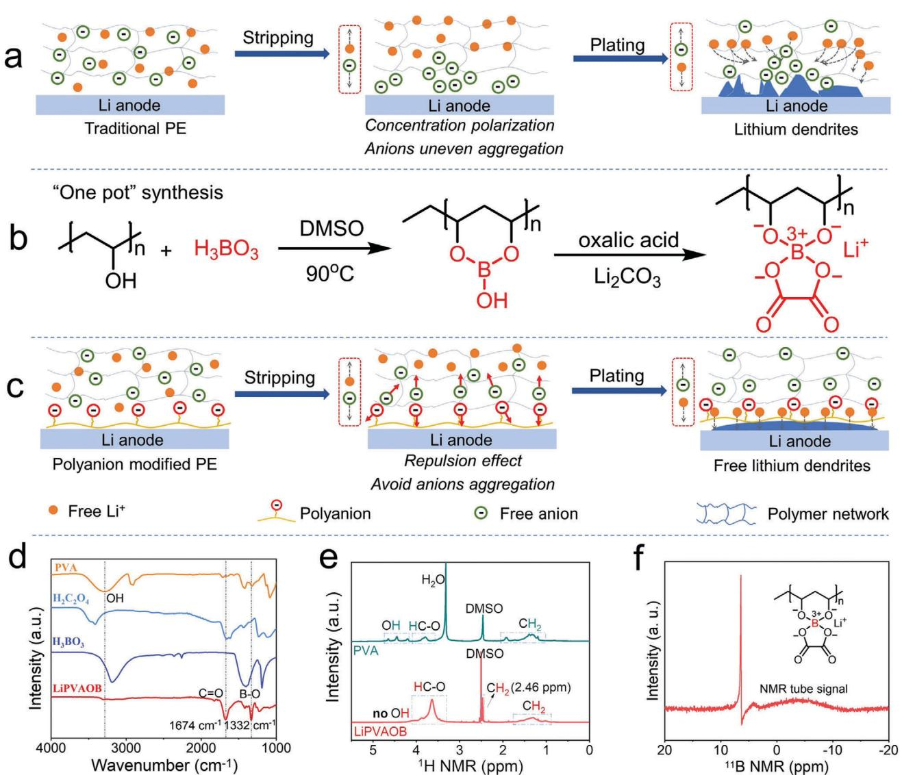
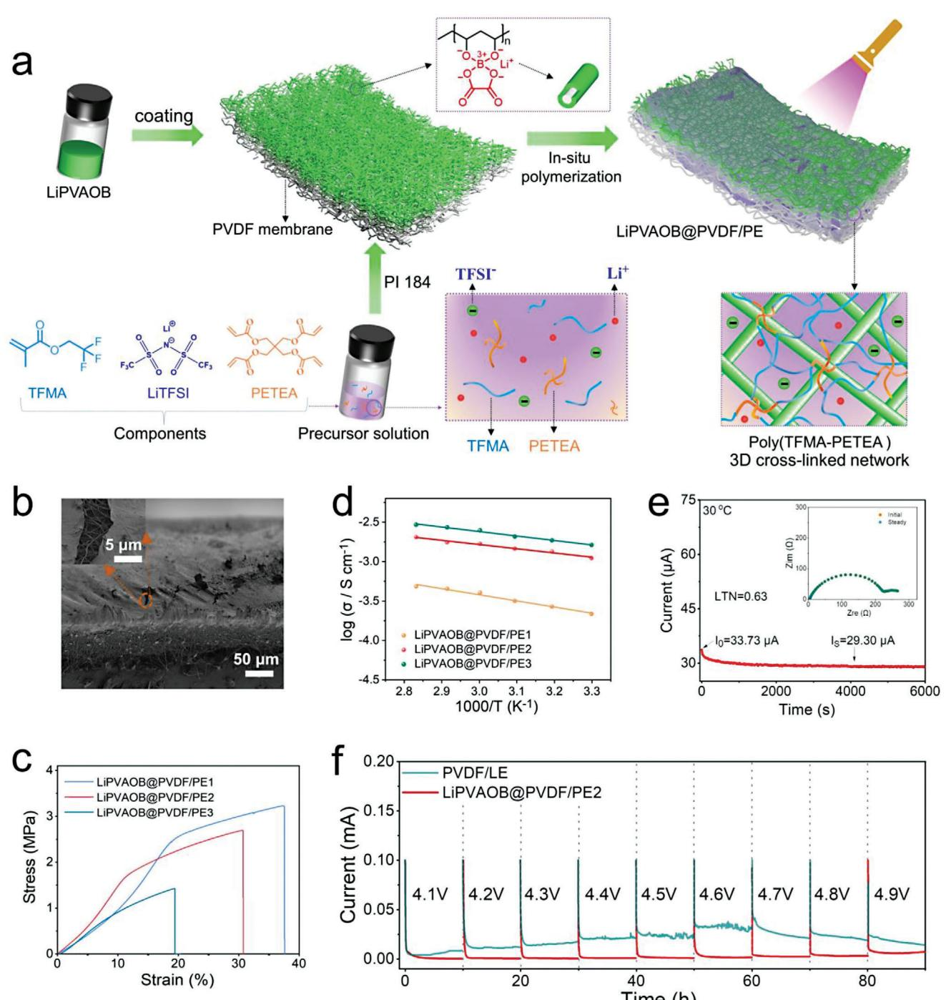
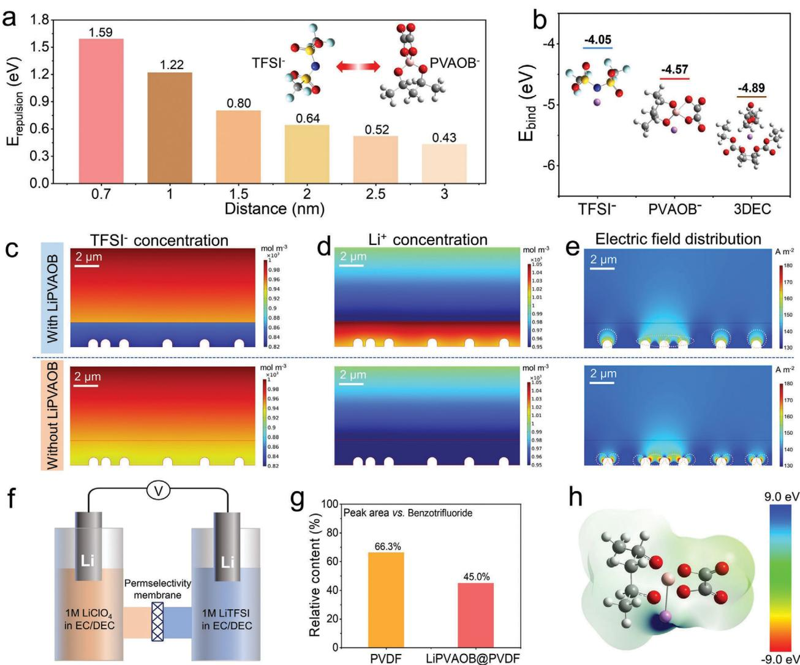
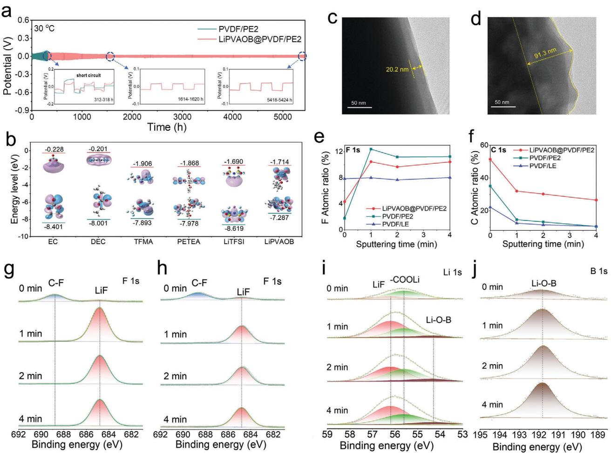
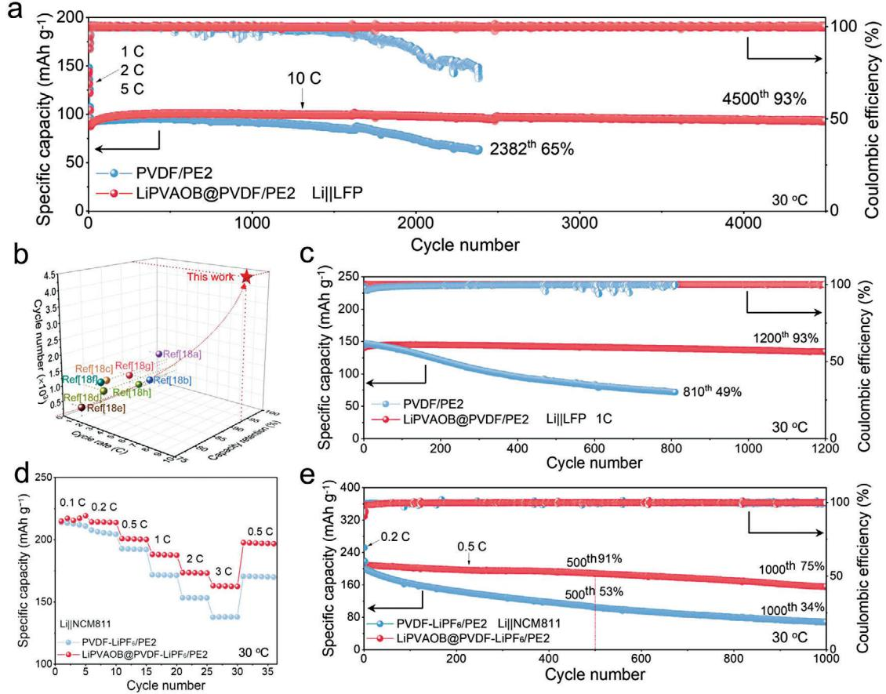

# **Self-Regulating Interfacial Space Charge through Polyanion Repulsion Effect towards Dendrite-Free Polymer Lithium-Metal Batteries**

*Manying Cui, Na Gao, Wenshan Zhao, Hongyang Zhao, Zhenjiang Cao, Yanyang Qin, Guoxin Gao, Kai Xi, Yaqiong Su, and Shujiang Ding\**

**Uncontrolled transport of anions leads to many issues, including concentration polarization, excessive interface side reactions, and space charge-induced lithium dendrites at the anode/electrolyte interface, which severely deteriorates the cycling stability of lithium metal batteries. Herein, an asymmetrical polymer electrolyte modified by a boron-containing single-ion conductor (LiPVAOB), is designed to inhibit the nonuniform aggregation of free anions in the vicinity of the lithium anode through the repulsion effect improving the lithium-ion transference number to 0.63. This LiPVAOB exerts a repulsion interaction with free anions even at a long distance and a selective effect for free anions transport, which diminishes uneven aggregation of free anions at the interface and suppresses space charges-induced lithium dendrites growth. Consequently, the assembled Li||Li cell delivers an ultra-long cycle for over 5400 h. The Li||LiFePO4 cell exhibits outstanding cycle performance with a capacity retention of 93% over 4500 cycles. In particular, the assembled high-voltage Li||Li1.2Ni0.2Mn0.6O2 cell (charged to 4.8 V) exhibits good cycle stability with a high specific capacity of 245 mAh g−1. This designed polymer electrolyte provides a promising strategy for regulating ion transport to inhibit space charge-induced lithium dendrite growth for high-performance lithium metal batteries.**

#### **1. Introduction**

Polymer electrolytes (PEs) are considered promising because of their good ductility, processability, and light weight in contrast to the rigid and fragile inorganic solid electrolytes for lithiummetal batteries (LMBs).[\[1\]](#page-8-0) In terms of traditional PEs, the random transport of free anions causes severe concentration polarization generating lithium dendrites (**Figure 1**[a\)](#page-1-0).[\[2](#page-8-0) ]

M. Cui, N. Gao, W. Zhao, H. Zhao, Z. Cao, Y. Qin, G. Gao, K. Xi, Y. Su, S. Ding School of Chemistry

Engineering Research Center of Energy Storage Materials and Devices Ministry of Education

State Key Laboratory for Mechanical Behavior of Materials

Xi'an Jiaotong University

28 Xianning West Road, Xi'an 710049, China E-mail: [dingsj@mail.xjtu.edu.cn](mailto:dingsj@mail.xjtu.edu.cn)

The ORCID identification number(s) for the author(s) of this article can be found under <https://doi.org/10.1002/aenm.202303834>

**DOI: 10.1002/aenm.202303834**

The excessively aggregated free anions undergo side reactions with fresh lithium metal, thus reducing the coulombic efficiency and forming an inhomogeneous solid electrolyte interface (SEI) film.[\[3\]](#page-8-0) In addition, the nonuniform accumulation of free anions leads to an uneven electric field distribution on the lithium-metal electrode surface, which has a significant influence on the growth of lithium dendrites.[\[4\]](#page-8-0) As demonstrated in the space charge theory proposed by Chazalviel, a large space charge, and local electric field are formed with the anion depletion in the vicinity of the electrode surface, engendering lithium dendrites growth. The growth velocity of lithium dendrite is positively correlated with the rate of anions migration applicable to the equation *v*a = −*μ*a*E*0 (where *v*a represents the growth rate of lithium dendrite; *μ*a represents the rate of free anion migration; and *E*0 represents the electric field).[\[5\]](#page-8-0) Therefore, the dendrites growth caused by space charges can be ef-

ficaciously inhibited by decelerating free anions mobility and especially, reducing the local aggregation of free anions on the electrode surface. Many methods have been developed to decelerate the anions' movement. For example, the single-ion conductor polymer, in which anions are fixed, is an effective way to disrupt concentration gradients of free anions and inhibit space charge-induced lithium dendritic growth.[\[6\]](#page-8-0) However, single-ion conductor polymer tends to deliver low current tolerance due to their poor ionic conductivity. Anion acceptors including supramolecular calix[6]pyrrole, calix[4]arene and Lewis acid sites, have also been developed to retard the free anions movement.[\[6,7\]](#page-8-0) Nevertheless, the practical applications of these anion acceptors are limited due to the poor compatibility with cathode materials and inferior selectivity.[\[8\]](#page-8-0) Those above methods impede the movement of free anions by regulating the ions transport inside the overall electrolyte system, which inevitably causes low ionic conductivity and reduces the current tolerance. Concentration polarization and anions aggregation tend to occur in the vicinity of the electrode surface. Therefore, retarding the free anions mobility at the lithium metal anode/PE interface layer

**Figure 1.** Schematic illustration of lithium-ions and free anions transport in a) traditional PEs and c) LiPVAOB@PVDF/PE. b) The synthesis route of LiPVAOB. d) FT-IR spectra of PVA, oxalic acid, boric acid and LiPVAOB. e) 1H NMR spectra of PVA and LiPVAOB. f) 11B NMR spectrum of LiPVAOB.

is efficacious to inhibit space charge-induced lithium dendrites from the root.

Herein, a single-ion conductor (LiPVAOB) is introduced as a screen at the lithium metal anode/PE interface layer, which not only inhibits the nonuniform anion aggregation by repulsion interaction on the electrode surface but also induces lithium-ion uniform deposition by the lithiophilic site of polyanion from LiPVAOB (Figure 1b,c). This LiPVAOB is coated on one side of the polymer matrix, which is prepared via in-situ cross-linked polymerization of 2,2,2-trifluoroethyl methacrylate (TFMA) monomer and pentaerythritol tetraacrylate (PETEA) as the crosslinker in modified the electrospuning membrane (LiP-VAOB@PVDF) to obtain the heterostructured electrolyte (LiP-VAOB@PVDF/PE). The LiPVAOB layer exerts repulsion interaction with free anions raising the lithium-ion transference number (LTN) to 0.63 and simultaneously contributes additional lithium-ions improving ionic conductivity to 1.14 × 10−3 S cm−1 in this asymmetric PE. The assembled Li||Li cell displays outstanding cycle performance for over 5400 h. In addition, the Li||LiFePO4 (Li||LFP) cell operates over 1200 cycles with a capacity retention of 93% at the rate of 1 C. The Li||NCM811 cell cycles over 1000 cycles with satisfactory capacity retention. In particular, the Li|| Li1.2Ni0.2Mn0.6O2 (LMNO) cell is charged to 4.8 V exhibiting good cycle stability with a high specific capacity of 245 mAh cm−2. The assembled high-loading Li||LFP pouch battery normally works under folded, pierced, and cut conditions, which demonstrates the flexibility and safety of this designed PE.

#### **2. Results and Discussion**

Figure 1b demonstrates the synthetic route of the "one pot" method to prepare LiPVAOB. The synthesis begins with polyvinyl alcohol (PVA) reacting with boric acid at 90 °C to produce 1,3,2 dioxaborinan-2-ol, which is further dehydrated and condensed with oxalic acid to form dioxaborane oxalate, and finally, the lithium carbonate alkalization replaces proton to obtain the LiP-VAOB. As shown in Figure [1d,](#page-1-0) the disappearance of the hydroxyl signal peak (3500–3000 cm−1) in FT-IR spectrum indicates the successful conversion of PVA in the first step; the emerging characteristic peaks of C═O (1674 cm−1) and B─O (1332 cm−1) confirm the successful grafting at the second step. In addition, the disappearing proton signal of OH on PVA and the emerging proton signal of CH2 (2.46 ppm) on LiPVAOB in 1H NMR spectrum further indicate the specific synthesis of LiPVAOB (Figure [1e\)](#page-1-0). The boron signal in 11B NMR spectrum of LiPVAOB indicates that the boric acid reacted with PVA successfully (Figure [1f\)](#page-1-0). The typical peak of C═O group in 13C NMR spectrum of LiPVAOB illustrate the successful reaction with oxalic acid to synthesize LiPVAOB (Figure S1, Supporting Information).

With the merits of chemical stability, adjustable thickness, porous, and outstanding nucleophilicity with liquid electrolyte, the electrospun PVDF membrane was selected as the supporter.[\[9\]](#page-8-0) Then the slurry (LiPVAOB dissolved in water and ethanol) was coated on the surface of the PVDF membrane and subsequently, the composite PVDF membrane was freezedried to obtain a modified PVDF membrane (LiPVAOB@PVDF; **Figure 2**[a\)](#page-3-0). To be noted here, the hydrophobicity of PVDF enables the LiPVAOB solution just on the surface instead of complete penetration in the membrane. Simultaneously, the ethanol solvent improves the contact of LiPVAOB solution on the surface of PVDF. The freeze-drying process ensures the porosity of with good liquid absorption.

The top view of the scanning electron microscope (SEM) image demonstrates that the LiPVAOB layer is uniform (Figure S2b, Supporting Information). The LiPVAOB layer is very thin at the nanometer level and attached to the surface of the PVDF membrane (Figure [2b\)](#page-3-0). Precursor liquid made up of TFMA as a monomer, PETEA as a crosslinker, and 1-hydroxycyclohexyl phenyl ketone (PI184) as a photoinitiator dissolved in a liquid electrolyte (LE), was injected into the LiPVAOB@PVDF membrane. Then the LiPVAOB@PVDF membrane with saturated precursor solution was exposed to an ultraviolet (UV) irradiation for 10 min initiating in-situ radical polymerization to obtain quasi-solid polymer electrolyte LiPVAOB@PVDF/PE. The thicknesses of LiPVAOB@PVDF/PE range from 70 to 80 μm (Figure S2c,d, Supporting Information). The disappearance of FT-IR characteristic peak of the C═C (1639 and 810 cm−1) indicates the formation of poly(TFMA-PETEA) cross-linking network (Figure S3, Supporting Information).

Ionic conductivity and mechanical strength are two key parameters for evaluating the performance of PEs. Here, the mechanical strength and ionic conductivity of PEs possessing different mass ratios of polymer and liquid electrolyte (1:8, 1:6, 1:4, labeled as LiPVAOB@PVDF/PE1, LiPVAOB@PVDF/PE2, LiPVAOB@PVDF/PE3) were measured to make a comprehensive trade-off. When the weight ratio increases to 6:1, LiP-VAOB@PVDF/PE2 not only exhibits good ionic conductivity (1.14 × 10−3 S cm−1) but also maintains outstanding mechanical properties (2.7 MPa; Figure [2c,d\)](#page-3-0). Poly(TFMA-PETEA) effectively supports the electrolyte network. With an increase in liquid electrolyte, the proportion of the amorphous phase in the ester polymer is expanded, which is conducive to ion transport. By contrast, the low content of polymer in LiPVAOB@PVDF/PE1 is not enough to form the gel with beam-fluid ability (Figure S4, Supporting Information). Moreover, the higher content of polymer leads to a drastic reduction of the ionic conductivity of LiP-VAOB@PVDF/PE3 (2.24 × 10−4 S cm−1). Due to the dissociation of additional lithium-ions from LiPVAOB, the ionic conductivity of LiPVAOB@PVDF/PE2 is slightly higher than that of PVDF/PE2 (1.08 × 10−3 S cm−1; Figure S7, Supporting Information). Although LiPVAOB partially dissociates additional lithium-ion to improve ion concentration, excessive thickness of LiPVAOB increases the impedance (Figure S7b,c, Supporting Information). From the above comparison of mechanical properties and ionic conductivity among LiPVAOB@PVDF/PEs (Figure S8, Supporting Information), LiPVAOB@PVDF/PE2 is more suitable for subsequent electrochemical and battery performance tests. LTN is a critical parameter to evaluate the transport of lithium-ions. The calculated LTN of LiPVAOB@PVDF/PE2 is 0.63 higher than that of PVDF/PE2 (0.39; Figure [2e](#page-3-0) and Figure S9, Supporting Information). This result indicates that the migration of free anions to the vicinity of the lithium metal anode is severely inhibited by LiPVAOB in LiPVAOB@PVDF/PE2. Electrochemical stability measure was conducted by electrochemical floating test. The leakage current for LiPVAOB@PVDF/PE2 is lower than that for PVDF/LE with voltages rise, which indicates that the oxidation stability is improved by Poly(TFMA-PETEA) matrix (Figure [2f\)](#page-3-0).[\[10\]](#page-8-0)

Density functional theory (DFT) calculations demonstrate that there is an obvious repulsive interaction between TFSI− and PVAOB−. The repulsive energy gradually decreases with the distance increasing (**Figures [3](#page-4-0)**a and S10, Supporting Information). Nevertheless, although the distance increases to an extremity (3.0 nm), the repulsion energy between TFSI− and PVAOB− is 0.43 eV much higher than the solvation energy of TFSI− (−0.11 eV; Figure S11, Supporting Information). Consequently, the repulsive interaction between TFSI− and PVAOB− affects the solvated transport of TFSI−. In addition, the binding energy of PVAOB− with lithium-ion (−4.57 eV) is higher than that of TFSI− (−4.05 eV), which further reveals the better lithium affinity of the polyanion PVAOB− (Figure [3b\)](#page-4-0). Moreover, the solvation energy of lithium-ion (Li+−3DEC, −4.89 eV) is higher than the dissociation energy of Li+-TFSI− and Li+-PVAOB−. As a result, lithium-ions are gradually dissociated from LiPVAOB through the solvation effect to increase additional solvated lithium-ions, which further improves the ionic conductivity and LTN.[\[11\]](#page-8-0) COM-SOL simulations were performed to investigate the effect of LiP-VAOB on TFSI− concentration, Li+ concentration and electric field distribution at the lithium-metal anode/PE interface. Compared to the absence of LiPVAOB, the concentration of TFSI− is low (Figure [3c\)](#page-4-0) but the concentration of lithium-ion is high (Figure [3d\)](#page-4-0) with the presence of LiPVAOB layer, indicating that LiPVAOB not only exerts the repulsive effect on free anions but also possesses the affinity with lithium-ions. In addition, the interface electric field is more nonuniform (Figure [3e\)](#page-4-0) and the local electric field intensity (Figure S12, Supporting Information) changes more obviously with the absence of LiPVAOB than with the presence of LiPVAOB. This result further verifies that LiP-VAOB homogenizes the electric field distribution reducing the generation of space charge. To further investigate the repulsion

**Figure 2.** a) Diagram of in-situ preparing LiPVAOB@PVDF/PE. b) Cross-sectional SEM images of LiPVAOB@PVDF. c) Stress-strain curves of LiP-VAOB@PVDF/PE1, LiPVAOB@PVDF/PE2, and LiPVAOB@PVDF/PE3 . d) Arrhenius plots for the ionic conductivity of LiPVAOB@PVDF/PE1, LiP-VAOB@PVDF/PE2, and LiPVAOB@PVDF/PE3. e) The i-t curve for LiPVAOB@PVDF/PE2 (the inset is EIS plots before and after polarization). f) Electrochemical floating analysis of the PVDF/LE and LiPVAOB@PVDF/PE2.

effect of LiPVAOB against TFSI−, H-shaped electrolytic cells are assembled with LiPVAOB@PVDF/PE2 or PVDF/PE2 as a selectively permeable separator (Figure [3f\)](#page-4-0). Fluorine (F)-free LiClO4 is chosen as the lithium salt on the blank side to avoid the interference of F element. The F element content is measured by quantitative 19F NMR measure with benzotrifluoride as an internal standard in blank side electrolyte to evaluate the permselectivity of PEs to free anions. When a constant electric field is conducted on the H-shaped electrolytic cell, the TFSI− gradually migrates from the right electrolyte to the blank side electrolyte (the

**Figure 3.** a) DFT calculation of dynamic repulsion energy of free TFSI− anion and PVAOB− polyanion at different distances. b) DFT calculation for complexation energy of lithium-ion with TFSI− anion, PVAOB− anion and DEC (solvation energy), respectively. COMSOL simulations of c) TFSI− concentration, d) Li+ concentration and e) electric field distribution at the lithium-metal anode/PE interface with (upper) and without (lower) LiPVAOB. f) Schematic diagram of H-shaped electrolytic cell with the PVDF/PE2 or LiPVAOB@PVDF/PE2 as a permselectivity membrane for TFSI− migration test. g) The relative content of F element in TFSI− migration test in blank electrode side measured by quantitative 19F NMR with benzotrifluoride as internal standard. h) ESP distribution analysis of LiPVAOB.

light). Then the corresponding 19F NMR spectrum in blank electrolytes is measured to evaluate the migration quantity of free anions through LiPVAOB@PVDF/PE2 or PVDF/PE2 (Figure S13, Supporting Information). After potentio-static polarization for the same time, the F element content in the fluorine-free LiClO4 side electrode is 66.3% (compared to internal standard benzotrifluoride) based on PVDF/PE2, much higher than that of F element content based on LiPVAOB@PVDF/PE2 (45.0%; Figure 3g). In addition, electrostatic potential (ESP) distribution analysis demonstrates the oxalate borate anion fragment with low electrostatic potential, which delivers good lithophilicity to induce lithium-ions uniform deposition (Figure 3h). The sharp contrast demonstrates the selective permeability effect of LiP-VAOB@PVDF/PE2 to free TFSI−.

Li||Li symmetrical cells were assembled to conduct the galvanostatic cycle test at 30 °C. The Li|PVDF/PE2|Li cell exhibits gradually increasing over-potential from 31.5 mV to 88.6 mV and the short circuit occurred at 315th hour (**Figure 4**[a\)](#page-5-0). On the contrary, Li|LiPVAOB@PVDF/PE2|Li cell operates over 5400 h with the over-potential ranging from 18.2 to 53.9 mV. Besides, Li|LiPVAOB@PVDF/PE2|Li cell delivers stable cycle performance at different current densities (Figure S17, Supporting Information). As current density increases from 0.2 to 3.0 mA cm−2 with stripping/plating for 1 h, the overpotential exhibits very little increase, indicating excellent rate performance of Li|LiPVAOB@PVDF/PE2|Li cell.

To investigate the SEI composition at the lithium metal anode/PE interface, the highest occupied molecular orbital

**Figure 4.** (a) Long-term cycle performance test of Li|LiPVAOB@PVDF/PE2|Li cell and Li| PVDF/PE2|Li cell (0.25 mA cm−2, 0.25 mAh cm−2, the insets are the specific time-voltage curves at different times). (b) HUMO and LUMO energy lever of EC, DEC, TFMA, PETEA, LiTFSI, LiPVAOB. SEI thickness observation by Cryo-TEM for (c) Li|LiPVAOB@PVDF/PE2|Li and (d) Li|PVDF/PE2|Li. XPS deep etching analysis of (e) F 1s, (f) C 1s atomic ratio in the SEI film for Li|LiPVAOB@PVDF/PE2|Li, Li|PVDF/PE2|Li and Li|PVDF/LE|Li. Refined XPS high-resolution spectra analysis of SEI about F 1s for (g) Li|PVDF/PE2|Li cell, (h) Li|LiPVAOB@PVDF/PE2|Li cell, and (i) Li 1s, (j) B 1s for Li|LiPVAOB@PVDF/PE2|Li cell.

(HOMO) energy lever and the lowest unoccupied molecular orbital (LUMO) energy lever are calculated to evaluate redox reaction activities. LUMO energy levers of DEC (−0.201 eV) and EC (−0.228 eV) are higher than that of LiPVAOB (−1.714 eV), PETEA (−1.868 eV), and TFMA (−1.906 eV), which indicates that the polymer matrix and LiPVAOB are easy to obtain electrons forming the SEI (Figure 4b).[\[12\]](#page-8-0) The thickness of SEI in PVDF/PE2 and LiPVAOB@PVDF/PE2 is observed by cryo-transmission electron microscopy (Cryo-TEM).[\[13\]](#page-8-0) The SEI thickness for LiP-VAOB@PVDF/PE2 is 20.2 nm much thinner than that in Li|PVDF/PE2|Li (91.3 nm) in Li||Li cells (Figure 4c and Figure 4d). The thinner SEI means fewer side reactions with lithium metal electrode.[\[14\]](#page-8-0) As SEM top-view images shown in Figure S18, (Supporting Information), the Li|LiPVAOB@PVDF/PE2|Li cell displays a compact and flat lithium metal anode surface, whereas Li|PVDF/PE2|Li exhibits the loose and protuberant surface of lithium metal anode. X-ray photoelectron spectroscopy (XPS) deep etching test was conducted to further study specific SEI components. Both the LiPVAOB@PVDF/PE2 and PVDF/PE2 systems have SEI containing C, O, F, and Li elements, whereas the LiPVAOB@PVDF/PE2 system possesses additional B-containing SEI component (Figure S19, Supporting Information). The F-containing SEI components are additionally derived from TFMA in LiPVAOB@PVDF/PE2 system apart from TFSI− and PVDF compared to that in PVDF/LE system.

As shown in Figure 4e, the initial F element contents in SEI of PEs (*<*5%) are less than that of PVDF/LE (about 8%). After etching for over 1 min, the F element content increases to over 10% in SEI of PEs more than that of PVDF/LE. This result reveals the CF3 group in Poly(TFMA-PETEA) also participates in the formation of F-containing SEI in PEs. In terms of PEs, the F element content in SEI of PVDF/PE2 is always higher than that of LiPVAOB@PVDF/PE2 during etching in the next 3 min, which demonstrates the less aggregation of TFSI− near the lithium metal electrode and less TFSI− decomposition in LiPVAOB@PVDF/PE2.[\[3,15\]](#page-8-0) Since Poly(TFMA-PETEA) participates in the formation of SEI, the C element content in SEI of PEs is always higher than that of PVDF/LE (Figure 4f).

**Figure 5.** Long-term cycling performance of Li|PVDF/PE2|LFP cell and Li|LiPVAOB@PVDF/PE2|LFP cell at the rate of a) 10 C (3.12 mA cm−2, 0.18 mAh cm−2) and c) 1 C (0.39 mA cm−2, 0.34 mAh cm−2). b) Comparison of the cycle number, rate and capacity retention with the recently reported polymer Li||LFP cells. d) Rate (1 C = 0.57 mA cm−2) and e) long-term cycle stability of Li||NCM811 cells at 0.5 C (0.29 mAcm−2, 0.44 mAh cm−2).

Furthermore, the C element content in SEI of LiP-VAOB@PVDF/PE2 is higher than that of PVDF/PE2, which reveals that the LiPVAOB layer also promotes the formation of organic component SEI. The SEI in Li|PEs|Li cell featured an organic outer layer (high ratio of C-H/C-C) next to PEs and an inorganic inner layer (low C concentration, Figures S19 and S20, Supporting Information) next to lithium metal anode. In Figure [4g,h,](#page-5-0) the initial F element in the surface layer of SEI is mainly assigned to organic F component. With the etching deepening, the LiF (56.2 eV, Li 1s; 684.8 eV, F 1s, Figure S21, Supporting Information) contents in SEI obviously increase in Li|PEs|Li cell.[\[10b,16\]](#page-8-0) However, the content of the inorganic LiF component in LiPVAOB@PVDF/PE2 is always lower than that in PVDF/PE2. Expect for the same influence of Poly(TFMA-PETEA) and PVDF membrane on forming F-containing SEI, the main difference stems from the TFSI− decomposition on the lithium metal anode surface. This result further verifies that the LiPVAOB layer inhibits the accumulation of TFSI− on the lithium metal anode surface and reduces the side reactions.[\[3b,15\]](#page-8-0) Besides, B-containing SEI component originates from LiPVAOB; with the etching deepening, the B element content gradually increases from 0.17% to 2.36% (Figure S19, Supporting Information). The Li 1s (54.3 eV) signal (Figure [4i\)](#page-5-0) and B─O signal (Figure [4j\)](#page-5-0) are attributed to Li-O-B.[\[17\]](#page-9-0) From the above analysis, it can be found that the LiPVAOB layer not only inhibits the aggregation of free anions on the lithium metal electrode surface to reduce side reactions, but also promotes the formation of multi-component SEI.

Li||LiFePO4 (LFP) full cells were assembled with PVDF/PE2 and LiPVAOB@PVDF/PE2 by in-situ polymerizing to evaluate long-term cycle and rate performance at 30 °C. The Li|LiPVAOB@PVDF/PE2|LFP cell exhibits an ultra-long cycle for 4500 cycles with capacity retention of 93% at 10 C, whereas the discharge capacity and coulombic efficiency of Li|PVDF/PE2|LFP cell began to continuously decay after 1200 cycles with capacity retention of 65% after 2382 cycles (**Figures 5**a and S23, Supporting Information). Encouragingly, the remarkable stability of The Li|LiPVAOB@PVDF/PE2|LFP cell exhibits outstanding cycling performance among the previously reported polymer LMBs by comprehensively comparison of the cycle number, capacity retention, and rate (Figure 5b and Table S2, Supporting Information).[\[18\]](#page-9-0) Even at the rate of 1 C, Li|LiPVAOB@PVDF/PE2|LFP cell still exhibits a satisfactory specific capacity of 146 mAh g−1 with a capacity retention of 93% (1200th cycle) almost twice higher than that of Li|PVDF/PE2|LFP cell (49%) after 810 cycles (Figure 5c and Figure S24, Supporting Information). LiPVAOB@PVDF-LiPF6/PE2 and PVDF-LiPF6/PE2 were fabricated for assembling Li||NCM811 cell to

**Figure 6.** a) Long-term cycle stability and b) specific capacity-voltage curves of Li|LiPVAOB@PVDF-LiPF6/PE2|LMNO cell with the voltage range of 2.0- 4.8 V at 0.2 C (0.11 mA cm−2, 0.49 mAh cm−2). c) Long-term cycle stability and d) specific capacity-voltage curves of Li|LiPVAOB@PVDF/PE2|LFP pouch battery with the high loading LFP (13.02 mg cm−2) at 0.5 C (1.11 mA cm−2, 1.82 mAh cm−2). e) Prepared large-scale LiPVAOB@PVDF membrane. f) The Li|LiPVAOB@PVDF/PE2|LFP pouch battery lights up LED lights at folded and cut&pierced states.

perform the long-term cycle at 0.5 C. Li|LiPVAOB@PVDF-LiPF6/PE2|NCM811 cell still exhibits a satisfactory specific capacity of 208 mAh g−1 with a capacity retention of 75% over twice higher than that of Li|PVDF-LiPF6/PE2|LFP cell (34%) after 1000 cycles (Figure [5e\)](#page-6-0). Specific capacity-voltage curves of Li|LiPVAOB@PVDF-LiPF6/PE2|NCM811 cell demonstrates that no obvious voltage polarization occurs (Figure S26, Supporting Information). This sharp comparison above reveals that LiP-VAOB also exerts an effect on PF6 − in addition to TFSI−. As shown in Figure [5d](#page-6-0) and Figure S27 (Supporting Information), the Li|LiPVAOB@PVDF-LiPF6/PE2|NCM811 cell processes excellent specific capacities of 218, 214, 201, 188, 174, and 163 mAh g−1 at 0.1, 0.2, 0.5, 1, 2, and 3 C, respectively, which is better than that of Li|PVDF-LiPF6/PE2|NCM811 cell, especially at a high rate of 1 C (172 mAh g−1), 2 C (153 mAh g−1), and 3 C (137 mAh g−1). To evaluate the high-voltage performance of LiPVAOB@PVDF-LiPF6/PE2, lithium-manganese rich (LMNO) cathode was synthesized and assembled with lithium metal anode to perform the long-term operation at 0.2 C (2.0–4.8 V). The Li|LiPVAOB@PVDF-LiPF6/PE2|LMNO cell delivers a high specific capacity of 245 mAh g−1 with a capacity retention of 91% after 200 cycles (**Figure 6**a). To be noted here, the specific capacity–voltage curves of Li|LiPVAOB@PVDF-LiPF6/PE2|LMNO cell display a stable cycle (Figure 6b). In addition, the Li|LiPVAOB@PVDF/PE2|LFP pouch battery with high-loading LFP cathode (13.02 mg cm−2) was assembled by in-situ polymerization to assess the safety and practicality of this flexible LiPVAOB@PVDF/PE2. As shown in Figure 6c, the Li|LiPVAOB@PVDF/PE2|LFP (13.02 mg cm−2) pouch battery operates at 0.5 C with the discharge specific capacity of 136 mAh g−1. The specific capacity–voltage curves of Li|LiPVAOB@PVDF/PE2|LFP pouch battery exhibit no obvious voltage polarization (Figure 6d and Figure S28, Supporting Information). The large-scale LiPVAOB@PVDF membrane was prepared for practical applications (Figure 6e). Besides, the Li|LiPVAOB@PVDF/PE2|LFP pouch battery could light up LED lights under folded, cut, and pierced conditions, which demonstrates the flexibility and safety (Figure 6f). This excellent flexibility and safety performance benefits from the good interfacial contact and liquid retention property of the Poly(TFMA-PETEA) network formed by in -situ polymerization.

#### **3. Conclusion**

In summary, an asymmetrical PE modified by single-ion conductor polymer LiPVAOB is explored to diminish anion aggregation in the vicinity of the electrode surface and inhibit space charge-induced lithium dendrite growth in polymer LMBs.

DFT calculation kinetic analyses indicate that the LiPVAOB exerts a strong repulsion effect on free anion, which affects the solvation transport behavior. Ion penetration experiment conducted in H-shaped electrolytic cells preliminarily reveals that the LiPVAOB@PVDF/PE2 hinders the migration of free anions. COMSOL multiphysics simulation further verifies that LiP-VAOB not only exerts an inhibitory effect on anion aggregation to homogenize the electric field distribution but also promotes the uniform deposition of lithium-ions through boroncontaining polyanionic lithiophilicity sites at the lithium-metal anode/PE interface. Cryo-TEM observation and XPS deep sputtering analysis further demonstrate that the LiPVAOB layer participates in the formation of multicomponent SEI and reduces side reactions at lithium-metal anode/electrolyte interface. This devised LiPVAOB@PVDF/PE2 delivers a good ionic conductivity (1.14 × 10−3 S cm−1) and a high LTN of 0.63. As a result, the Li||Li cell displays ultra-stable lithium plating/stripping performance for over 5400 h. The Li||LFP cell delivers an ultralong term cycle for 4500 cycles. Moreover, the assembled Li||LMNO cell stably operates for 200 cycles with a capacity retention of 91% at the voltage range of 2.0–4.8 V, which broadens the scope of high voltage application. This work provides insights into reducing anion aggregation by polyanion repulsion effect to homogenize the electric field distribution at the lithium metal anode/PE interface layer through the designed PE surface modification.

#### **Supporting Information**

Supporting Information is available from the Wiley Online Library or from the author.

#### **Acknowledgements**

This work was financially supported by the National Natural Science Foundation of China (No.52273081,22278329). Natural Science Basic Research Program of Shaanxi (No.2022TD-27). Y.S. acknowledges the "Young Talent Support Plan" of Xi'an Jiaotong University. Supercomputing facilities were provided by Hefei Advanced Computing Center. Instrumental Analysis Center of Xi'an Jiaotong University is acknowledged for providing the test service.

## **Conflict of Interest**

The authors declare no conflict of interest.

## **Author Contributions**

M.C., N.G., and W.Z. contributed equally to this work. M.C. and S.D. conceived and designed those experiments. M.C. and N.G. performed the experiments. M.C. wrote the manuscript. W.Z., Y.Q., and Y.S. conducted the DFT calculation. H.Z., G.G., and S.D. contributed to analyzing the data. M.C., N.G., H.Z., Z.C., G.G., K.X., Y.S., and S.D. revised the manuscript. S.D. supervised and funded the total process.

### **Data Availability Statement**

The data that support the findings of this study are available from the corresponding author upon reasonable request.

# **Keywords**

concentration polarization, ion transport regulation, lithium-metal battery, polymer electrolyte, single-ion conductor

> Received: November 10, 2023 Revised: December 13, 2023 Published online: January 16, 2024

- [1] a) D. Zhou, D. Shanmukaraj, A. Tkacheva, M. Armand, G. Wang, *Chem* **2019**, *5*, 2326; b) F. Chen, X. Wang, M. Armand, M. Forsyth, *Nat. Mater.* **2022**, *21*, 1175.
- [2] a) Q. Cheng, T. Jin, Y. Miao, Z. Liu, J. Borovilas, H. Zhang, S. Liu, S.-Y. Kim, R. Zhang, H. Wang, X. Chen, L.-Q. Chen, J. Li, W. Min, Y. Yang, *Joule* **2022**, *6*, 2372; b) Y. Zhai, W. Hou, M. Tao, Z. Wang, Z. Chen, Z. Zeng, X. Liang, P. Paoprasert, Y. Yang, N. Hu, S. Song, *Adv. Mater.* **2022**, *34*, 2205560; c) Z. Huang, X. Li, Z. Chen, P. Li, X. Ji, C. Zhi, *Nat. Rev. Chem.* **2023**, *7*, 616; d) Z. Sun, K. Xi, J. Chen, A. Abdelkader, M.-Y. Li, Y. Qin, Y. Lin, Q. Jiang, Y.-Q. Su, R. Vasant Kumar, S. Ding, *Nat. Commun.* **2022**, *13*, 3209.
- [3] a) T. Li, X.-Q. Zhang, N. Yao, Y.-X. Yao, L.-P. Hou, X. Chen, M.-Y. Zhou, J.-Q. Huang, Q. Zhang, *Angew. Chem., Int. Ed.* **2021**, *60*, 22683; b) X. Ge, F. Song, A. Du, G. Sun, S. Zhang, J. Zhao, Q. Zhang, X. Zhou, B. Zhang, G. Cui, *ACS Energy Lett.* **2023**, *8*, 3685.
- [4] a) X.-B. Cheng, R. Zhang, C.-Z. Zhao, Q. Zhang, *Chem. Rev.* **2017**, *117*, 10403; b) D. Cao, X. Sun, Q. Li, A. Natan, P. Xiang, H. Zhu, *Matter* **2020**, *3*, 57; c) H. Dai, J. Dong, M. Wu, Q. Hu, D. Wang, L. Zuin, N. Chen, C. Lai, G. Zhang, S. Sun, *Angew. Chem., Int. Ed.* **2021**, *60*, 19852.
- [5] a) Z. Ju, Q. Xie, O. Sheng, X. Wu, Y. Tan, M. Hong, X. Tao, Z. Liang, *Nano Lett.* **2022**, *22*, 5473; b) V. Flewy, J.-N. Chazalviel, M. Rosso, B. Sapoval, *J. Electroanal. Chem. Interfacial Electrochem.* **1990**, *290*, 249.
- [6] H. Zhang, C. Li, M. Piszcz, E. Coya, T. Rojo, L. M. Rodriguez-Martinez, M. Armand, Z. Zhou, *Chem. Soc. Rev.* **2017**, *46*, 797.
- [7] a) N. Matsumi, K. Sugai, H. Ohno, *Macromolecules* **2003**, *36*, 2321; b) A. Blazejczyk, W. Wieczorek, R. Kovarsky, D. Golodnitsky, E. Peled, L. G. Scanlon, G. B. Appetecchi, B. Scrosati, *J. Electrochem. Soc.* **2004**, *151*, A1762.
- [8] Q. Zhou, J. Ma, S. Dong, X. Li, G. Cui, *Adv. Mater.* **2019**, *31*, 1902029;
- [9] a) Y. Zhu, S. Xiao, Y. Shi, Y. Yang, Y. Hou, Y. Wu, *Adv. Energy Mater.* **2014**, *4*, 1300647; b) W. Lei, H. Li, Y. Tang, H. Shao, *Carbon Energy* **2022**, *4*, 539.
- [10] a) Y. Su, X. Rong, A. Gao, Y. Liu, J. Li, M. Mao, X. Qi, G. Chai, Q. Zhang, L. Suo, L. Gu, H. Li, X. Huang, L. Chen, B. Liu, Y.-S. Hu, *Nat. Commun.* **2022**, *13*, 4181; b) Y. Wang, S. Chen, Z. Li, C. Peng, Y. Li, W. Feng, *Energy Storage Mater.* **2022**, *45*, 474; c) X. Wu, B. Niu, H. Zhang, Z. Li, H. Luo, Y. Tang, X. Yu, L. Huang, X. He, X. Wang, Y. Qiao, S.-G. Sun, *Adv. Energy Mater.* **2023**, *13*, 2203089.
- [11] D. Zhou, A. Tkacheva, X. Tang, B. Sun, D. Shanmukaraj, P. Li, F. Zhang, M. Armand, G. Wang, *Angew. Chem., Int. Ed.* **2019**, *58*, 6001.
- [12] a) J. Chen, Y. Peng, Y. Yin, M. Liu, Z. Fang, Y. Xie, B. Chen, Y. Cao, L. Xing, J. Huang, Y. Wang, X. Dong, Y. Xia, *Energy Environ. Sci.* **2022**, *15*, 3360; b) C. Kang, J. Zhu, Y. Wang, S. Ye, Y. Xiong, F. Kong, G. Yin, *Energy Storage Mater.* **2023**, *61*, 102898; c) Q. Liu, Y. Sun, S. Wang, Q. An, L. Duan, G. Zhao, C. Wang, K. Doyle-Davis, H. Guo, X. Sun, *Mater. Today* **2023**, *64*, 21.
- [13] a) R. Lin, Y. He, C. Wang, P. Zou, E. Hu, X.-Q. Yang, K. Xu, H. L. Xin, *Nat. Nanotechnol.* **2022**, *17*, 768; b) S.-Y. Sun, N. Yao, C.-B. Jin, J. Xie, X.-Y. Li, M.-Y. Zhou, X. Chen, B.-Q. Li, X.-Q. Zhang, Q. Zhang, *Angew. Chem., Int. Ed.* **2022**, *61*, 202208743.
- [14] a) J.-G. Zhang, W. Xu, J. Xiao, X. Cao, J. Liu, *Chem. Rev.* **2020**, *120*, 13312; b) Y. Jin, P. M. L. Le, P. Gao, Y. Xu, B. Xiao, M. H. Engelhard,

X. Cao, T. D. Vo, J. Hu, L. Zhong, B. E. Matthews, R. Yi, C. Wang, X. Li, J. Liu, J.-G. Zhang, *Nat, Energy* **2022**, *7*, 718; c) Y. Chen, Z. Yu, P. Rudnicki, H. Gong, Z. Huang, S. C. Kim, J.-C. Lai, X. Kong, J. Qin, Y. Cui, Z. Bao, *J. Am. Chem. Soc.* **2021**, *143*, 18703.

- [15] J.-N. Duan, Q. Hou, R.-M. Yuan, J. Fan, M. Zheng, Q. Dong, *J. Mater. Chem. A* **2023**,*11*, 548.
- [16] X. Xie, Z. Wang, S. He, K. Chen, Q. Huang, P. Zhang, S.- M. Hao, J. Wang, W. Zhou, *Angew. Chem.Int. Ed.* **2023**, *62*, 202218229.
- [17] a) X. Wang, J. Wu, Y. Zhao, B. Li, N. Tavajohi, Q. Liu, J. Duan, D. Wang, P. Dong, Y. Zhang, B. Li, *J. Energy. Chem.* **2023**, *82*, 287; b) Z.-H. Xue, H.-C. Shen, P. Chen, G.-X. Pan, W.-W. Zhang, W.-M. Zhang, S.-N. Zhang, X.-H. Li, C. T. Yavuz, *ACS Energy Lett.* **2023**, *8*, 3843.
- [18] a) D. Wang, H. Xie, Q. Liu, K. Mu, Z. Song, W. Xu, L. Tian, C. Zhu, J. Xu, *Angew. Chem., Int. Ed.* **2023**, *62*, 202302767; b) K. Mu, D. Wang, W. Dong, Q. Liu, Z. Song, W. Xu, P. Yao, Y. Chen, B Yang, C. Li, L. Tian, C. Zhu, J. Xu, *Adv. Mater.* **2023**, *35*, 2304686. c) S. Qin, Y. Yu, J. Zhang, Y. Ren, C. Sun, S. Zhang, L. Zhang, W. Hu, H. Yang, D. Yang, *Adv. Energy Mater.* **2023**, *13*, 2301470; d) X. Pei, Y. Li, T. Ou, X. Liang, Y. Yang, E. Jia, Y. Tan, S. Guo, *Angew. Chem., Int. Ed.* **2022**, *61*, 202205075; e) Z. Tian, L. Hou, D. Feng, Y. Jiao, P. Wu, *ACS Nano* **2023**, *17*, 3786; f) S. Qin, Y. Yu, J. Zhang, Y. Ren, C. Sun, S. Zhang, L. Zhang, W. Hu, H. Yang, D. Yang, *Adv. Energy Mater.* **2023**, *13*, 2301470; g) S. Xu, R. Xu, T. Yu, K Chen, C. Sun, G. Hu, S. Bai, H.-M. Cheng, Z. Sun, F. Li, *Energy Environ. Sci.* **2022**, *15*, 3379; h) S. Chai, Z. Chang, Y. Zhong, Q. He, Y. Wang, Y. Wan, M. Feng, Y. Hu, W. Li, W. Wei, A. Pan, *Adv. Funct. Mater.* **2023**, *33*, 2300425.