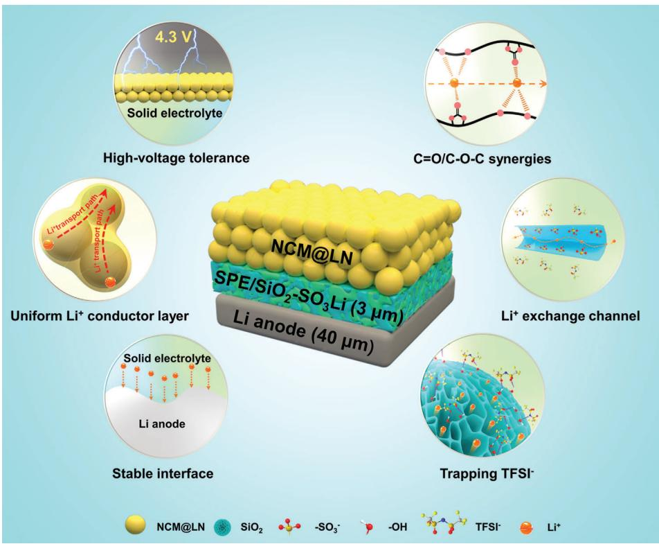
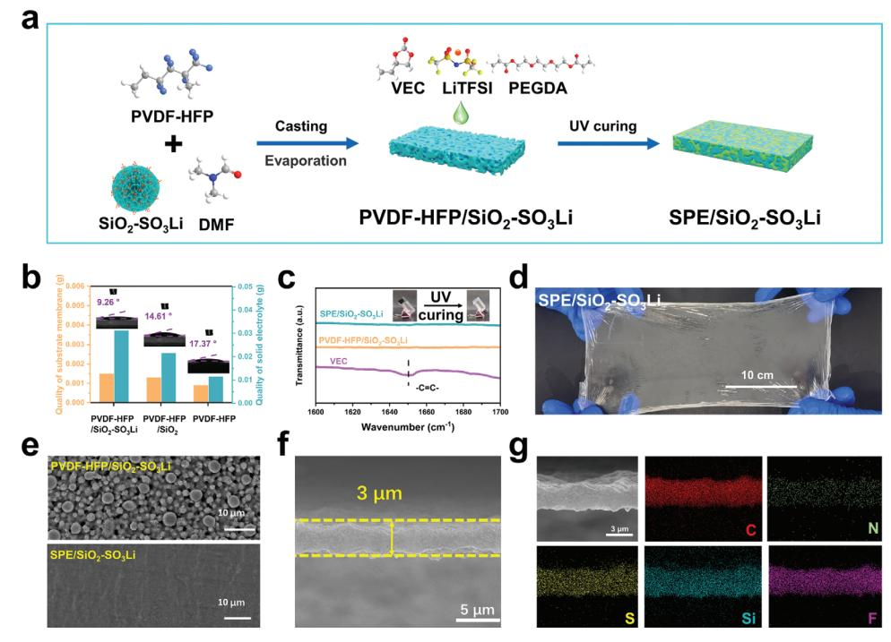
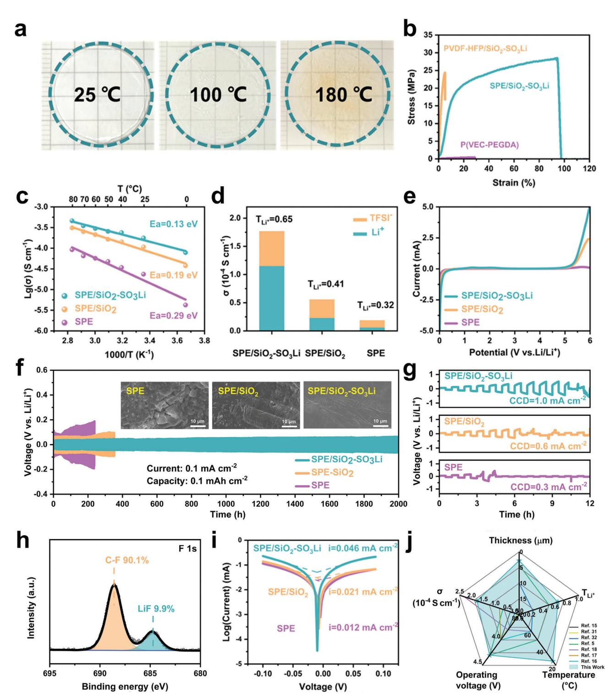
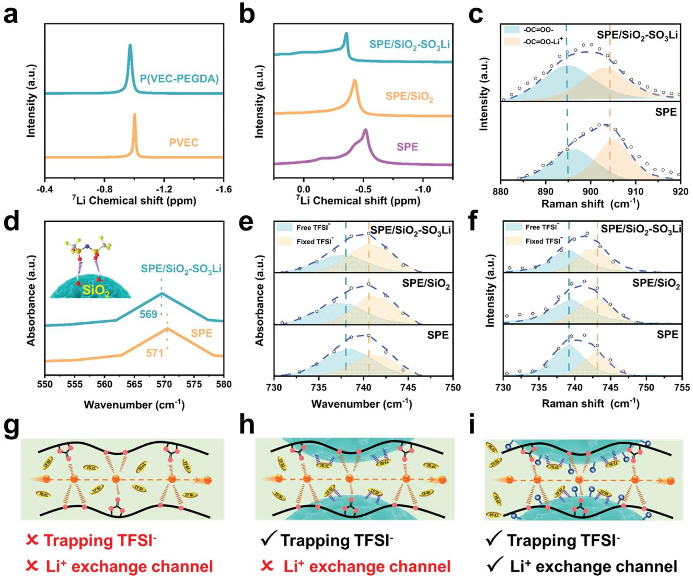
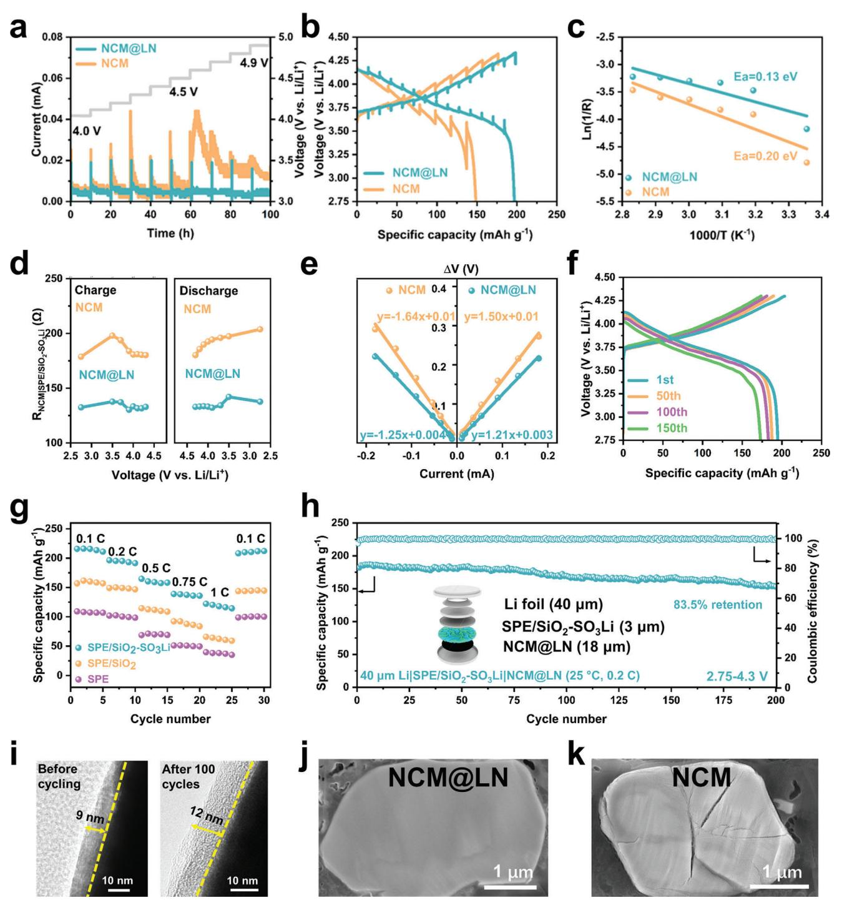
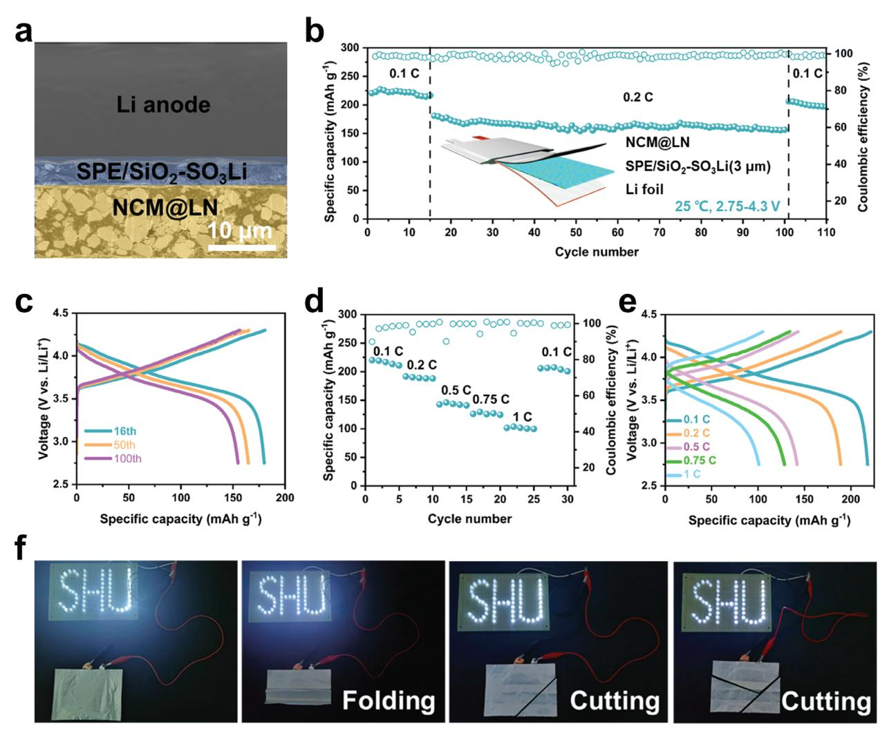

# **A 3 μm-Ultrathin Hybrid Electrolyte Membrane with Integrative Architecture for All-Solid-State Lithium Metal Batteries**

*Kexin Liu, Hui Cheng, Zhuyi Wang,\* Yin Zhao, Yingying Lv, Liyi Shi, Xuesong Cai, Zhongling Cheng, Haijiao Zhang,\* and Shuai Yuan\**

**Ultrathin all-solid-state electrolytes with an excellent Li+ transport behavior are highly desirable for developing high-energy-density solid-state lithium metal batteries. However, how to balance the electrochemical performance and their mechanical properties remains a huge challenge. Herein, an ultrathin solid electrolyte membrane with a thickness of only 3 μm and a weight of 11.7 g m−2 is well constructed by integrating individual functionalized organic with inorganic modules. Impressively, the optimized hybrid electrolyte membrane shows a set of merits including a high room-temperature ionic conductivity of 1.77 × 10−4 S cm−1, large Li+ transference number of 0.65, and strong mechanical strength (strength of 29 MPa, elongation of 95%), as well as negligible thermal shrink at 180 °C. The analysis results reveal that the lithium sulfonate-functionalized mesoporous silica nanoparticles in the membrane play a crucial role in the selective transport of Li+ through anion trapping and cation exchange. The pouch full cell is further assembled with a high-voltage NCM cathode and thin lithium anode, which exhibits excellent long-term cycling stability, outstanding rate performance at room temperature, and high safety against abused conditions. The current work provides an innovative strategy for achieving lithium metal batteries with ultrathin all-solid-state electrolytes.**

components, ultrathin and lightweight solid-state electrolytes (SSEs) can reduce the proportion of inactive components in the battery and decrease the Li+ transfer resistance, which is beneficial for achieving higher energy density. Previous work has revealed that a high energy density exceeding 400 Wh kg−1 can be obtained for solid-state batteries when the thickness of the solid electrolyte is less than 30 μm.[\[5,6\]](#page-12-0) Although inorganic solid-state electrolytes exhibit high ionic conductivity and Young's modulus,[\[7\]](#page-12-0) their brittleness and the traditional sintering and pressing procedure make it difficult to produce large-size thin electrolyte membranes. In contrast, the polymer-based solid-state electrolytes show low density, a simple manufacturing process, and easy regulation for thinner thickness.[\[8\]](#page-12-0) However, the design and fabrication of ultrathin polymer solid-state electrolytes (PSSEs) with excellent comprehensive performances remains a major challenge. The primary concern for PSSEs is how

# **1. Introduction**

All-solid-state lithium metal batteries (ASSLMBs) have attracted considerable research attention because they show great application potential for addressing the energy density and safety limitations of current liquid batteries.[\[1–4\]](#page-12-0) As one of the crucial

K. Liu School of Materials Science and Engineering Shanghai University Shanghai 200444, China K. Liu, Z. Wang, Y. Zhao, Y. Lv, L. Shi, S. Yuan Research Centre of Nanoscience and Nanotechnology Shanghai University Shanghai 200444, China E-mail: [bamboo2009@shu.edu.cn;](mailto:bamboo2009@shu.edu.cn) [s.yuan@shu.edu.cn](mailto:s.yuan@shu.edu.cn)

The ORCID identification number(s) for the author(s) of this article can be found under <https://doi.org/10.1002/aenm.202303940>

**DOI: 10.1002/aenm.202303940**

to combine excellent ionic conductivity and mechanical properties. Generally, high ionic conductivity requires high chain flexibility to achieve rapid Li+ hopping, while mechanical toughness requires chain winding and cross-linking. Polyethylene oxide (PEO), the most studied polymer, hinders both polymer segmental motion and Li+ motion because of its high crystallinity at room

H. Cheng, Z. Cheng, H. Zhang Institute of Nanochemistry and Nanobiology School of Environmental and Chemical Engineering Shanghai University Shanghai 200444, China E-mail: [hjzhang128@shu.edu.cn](mailto:hjzhang128@shu.edu.cn) L. Shi Emerging Industries Institute Shanghai University Jiaxing, Zhejiang 314006, China X. Cai Phoenix Amperex Technology Co., Ltd Jiaxing, Zhejiang 314007, China

temperature. Therefore, the ionic conductivity of PEO at room temperature (ranging from 10−8 to 10−6 S cm−1) falls short of the necessary level for practical applications,[\[9,10\]](#page-12-0) and additional liquid/semisolid additives (liquid electrolyte,[\[11\]](#page-12-0) ionic liquid,[\[12\]](#page-12-0) succinonitrile,[\[13\]](#page-12-0) and inorganic fillers[\[14\]](#page-12-0) ) are usually introduced to improve ionic conductivity. Achieving a balance between the mechanical properties and room temperature ionic conductivity in thinning PSSEs becomes more challenging, because thin PSSEs have an increased risk of short-circuiting caused by external puncture or dendrites formation. Introducing the proper supports such as commercial polyethylene (PE) separator,[\[15\]](#page-12-0) porous Teflon,[\[16\]](#page-12-0) fiber film[\[17\]](#page-12-0) is an efficient strategy to prepare ultrathin PSSEs with sufficient mechanical strength. For example, Huang et al. prepared PSSEs with a thickness of 7.5 μm by injecting PEO and a lithium salt solution into a PE separator, which can promise the Li/LiFePO4 solid-state battery cycle at 60 °C.[\[15\]](#page-12-0) Cui's group filled a porous polyimide (PI) membrane with PEO/lithium bis(trifluoromethanesulfonyl)imide (LiTFSI) to create a 10 μm membrane. The resulting Li/LiFePO4 ASSLMBs also require operation at 60 °C.[\[18\]](#page-12-0) Luo et al. used an ultrathin, fire-proof framework (UFF) filled with PEO/LiTFSI and coated with a polyacrylonitrile (PAN) layer to create a doublelayer UFF/PEO/PAN/LiTFSI solid-state electrolyte membrane of 4.2 μm. This membrane has a dual-functional interface, which can be paired with NCM811 (LiNi0.8Co0.1Mn0.1O2) at 50 °C.[\[5\]](#page-12-0) Nevertheless, the ionic conductivities of these electrolytes are still relatively low at room temperature, which means that they can only be cycled at high temperatures. This greatly limits the efficiency of using the battery's stored energy in practical applications.

Another important issue for PSSEs is to pair with highvoltage cathodes and lithium metal anodes in high-energydensity ASSLMBs. However, the cathode is afflicted with problems such as electrochemical instability,[\[19\]](#page-12-0) inadequate contact at the cathode-solid-state electrolyte interface,[\[20\]](#page-12-0) and limited Li+ transport.[\[21,22\]](#page-12-0) To solve the above problem, the minimal liquid electrolyte is usually introduced to reduce the interface resistance at the cathode.[\[11\]](#page-12-0) Similarly, on the anode side, although lithium metal anode has an ultra-high specific capacity (3860 mA h g−1, higher than silicon anode,[\[23,24\]](#page-12-0) graphite anode,[\[25\]](#page-12-0) etc.), it still faces some key problems. Ensuring stability at the lithium metal anode/solid electrolyte interface and preventing lithium dendrite growth are crucial issues that must be resolved.[\[26,27\]](#page-12-0) Currently, high ionic conductivity and high Li+ transference numbers in solid-state electrolytes can result in uniform current distribution and small polarization.[\[28–30\]](#page-12-0) This promotes uniform lithium deposition and enhances the stability between solid-state electrolytes and lithium metal anode. However, the currently available methods to enhance Li+ transport kinetics between the porous cathode and lithium metal anode in all-solid-state batteries are still insufficient. Therefore, it is highly desirable and challenging to design ultrathin solid-state electrolytes with excellent comprehensive properties to meet the stringent requirements in terms of Li+ conductivity, mechanical properties, interface stability, etc.

The intertwining effects of molecular structure on different properties in a single polymer electrolyte often make it hard to achieve excellent comprehensive performance. In the work, we construct an ultrathin hybrid solid-state electrolyte membrane integrated by several individual functionalized modules to simultaneously enhance the mechanical strength and Li+ transport properties. As shown in **Figure [1](#page-2-0)**, this solid-state electrolyte consists of two parts. The first part is a porous organic/inorganic composite substrate composed of flexible polyvinylidene fluoridehexafluoropropylene copolymer (PVDF-HFP) and mesoporous silica nanoparticle with rich lithium sulfonate groups on surface (SiO2–SO3Li), which provides excellent mechanical properties while achieving high Li+ transference number enabled by a fast Li+ transport channel through anion trapping and cation exchange. The second part is the copolymer of vinylethylene carbonate (VEC) and poly(ethylene glycol) diacrylate (PEGDA), which has good Li+ conductibility due to the ester–ether synergy. The high Li+ transference number and ionic conductivity can facilitate uniform lithium deposition, thus enhancing the compatibility of the electrolyte with the lithium metal anode. In addition, the flexible single-ion conductor coating and hotpressing densification were used to modify the NCM811 singlecrystal particles, which constructed a Li+ transport channel in the cathode. Meanwhile, the coating layer also plays the protecting role for the cathode, leading to a high cathode/electrolyte interface stability. More importantly, the ultrathin hybrid solid-state electrolyte prepared by the above strategy is only 3 μm, which is greatly thinner than those reported so far.[\[5,15–18,31,32\]](#page-12-0) The hybrid electrolyte membrane demonstrates excellent electrochemical properties, including a room temperature ionic conductivity of 1.77 × 10−4 S cm−1, Li+ transference number of 0.65, and strong mechanical strength (strength of 29 MPa, elongation of 95%). To verify the practicality of the obtained ultrathin hybrid solid-state electrolyte, the Li|SPE/SiO2–SO3Li|NCM@LN pouch full cell was further assembled with high-voltage NCM cathode, and lithium anode of 40 μm thickness, exhibiting excellent longterm cycling stability, superior rate performance at room temperature, and high safety against the abused condition.

# **2. Results and Discussion**

#### **2.1. Structure and Composition of Ultrathin Solid-State Electrolyte Membrane**

With an innovative concept of integrating different functional modules, we fabricate ultrathin solid-state electrolyte membranes through the construction of a dual network structure using a two-stage methodology. As depicted in **Figure 2**[a,](#page-3-0) the PVDF-HFP/SiO2–SO3Li substrate membrane, consisting of PVDF-HFP and SiO2–SO3Li, was prepared using the casting method in the initial stage. The key functionalized nanofillers with abundant lithium sulfonate (─SO3Li) groups were synthesized through the grafting of sulfonic acid groups onto the mesoporous silica nanoparticles, followed by a lithiating reaction. The presence of ─SO3H peak and ─SO3Li peak in the FT-IR spectra (Figure S1, Supporting Information) and the S 2p XPS spectra (Figure S2, Supporting Information) indicate the successful grafting of ─SO3Li groups onto the SiO2 surface. The ─SO3Li functionalized nanofillers exhibit a high specific surface area of 354.87 m2 g−1 and rich mesopores with an average pore size of 19.2 nm and a large pore volume of 1.71 cm3 g−1. (Figures S3 and S4, Supporting Information). The optical photograph of PVDF-HFP/SiO2─SO3Li shows a uniform and semi-transparent

**Figure 1.** Schematic illustration of the ultrathin hybrid solid-state electrolyte improving the electrochemical performance of Li|SPE/SiO2– SO3Li|NCM@LN lithium metal batteries.

membrane (Figure S5a, Supporting Information). Meanwhile, the SEM image demonstrates an obvious porous structure (Figure S5b, Supporting Information). Furthermore, the elemental mappings obtained through EDS analysis confirm the uniform distribution of SiO2─SO3Li particles within PVDF-HFP (Figure S5c–f, Supporting Information).

In the second stage, the hybrid solid-state electrolyte SPE/SiO2─SO3Li was prepared by immersing a precursor solution containing VEC, LiTFSI, and the cross-linker polyethylene glycol diacrylate (PEGDA) into the PVDF-HFP/SiO2─SO3Li substrate membrane and subsequently polymerizing it under ultraviolet (UV) curing. The wettability of the substrate membrane toward the precursor solution (VEC/PEGDA/LiTFSI) was assessed through contact angle measurements and uptake tests (Figure [2b;](#page-3-0) Figures S6 and S7, Supporting Information). The precursor solution uptakes of PVDF-HFP, PVDF-HFP/SiO2, and PVDF-HFP/SiO2─SO3Li are 50%, 81%, and 120% of the substrate membranes weight, respectively. Compared with PVDF-HFP/SiO2 and PVDF-HFP membranes, the PVDF-HFP/SiO2─SO3Li substrate membrane exhibits a smaller contact angle and a higher uptake of precursor solution, suggesting its superior wetting property.[\[33–35\]](#page-12-0) The high ratio and fast infiltration process of the ionic conducting components can be attributed to the porous feature and intrinsic affinity of the substrate membrane.[\[36,37\]](#page-12-0)

As evidenced by the Fourier transform infrared (FT-IR) spectra (Figure [2c\)](#page-3-0), the conversion of the precursor solution into the polymer electrolyte was successfully finished. This is further confirmed by the disappearance of the characteristic peak corresponding to the C═C bond (at 1650 cm−1).[\[29,38\]](#page-12-0) The obtained SPE/SiO2─SO3Li hybrid solid-state electrolyte membrane shows a certain level of transparency, indicating its thinness and uniformity (Figure [2d\)](#page-3-0). According to the SEM images of the PVDF-HFP/SiO2─SO3Li substrate membrane and the SPE/SiO2─SO3Li electrolyte membrane (Figure [2e\)](#page-3-0), the electrolyte precursor solution penetrated well into the substrate membrane and filled the pores well after UV curing. The cross-sectional SEM image and the elemental distribution (C, N, S, Si, F) analysis (Figure [2f,g\)](#page-3-0) demonstrate the good uniformity of SPE/SiO2─SO3Li electrolyte membrane in terms of both structure and composition. It is worth noting that the thickness is as thin as 3 μm, which is competitively thin for a solid-state electrolyte compared with previous reports. Meanwhile, the weight of the solid-state electrolyte membrane is only 11.7 g m−2. The ultrathin solid-state electrolyte will not only facilitate the transport of Li+ ions by shortening the distance between electrodes, but also favor the improvement of both volume and mass-energy density of lithium metal batteries.[\[39\]](#page-12-0)

#### **2.2. Physical and Electrochemical Performances of Ultrathin Solid-State Electrolyte Membrane**

High thermal stability separators and solid-state electrolytes (SSE) play a crucial role in ensuring the safety of batteries. The **[www.advancedsciencenews.com](http://www.advancedsciencenews.com) [www.advenergymat.de](http://www.advenergymat.de)**

**Figure 2.** Construction of ultrathin hybrid solid-state electrolyte membrane. a) The schematic diagram for the preparation of ultrathin SPE/SiO2─SO3Li. b) The precursor solution uptake by different substrate membranes, the inset shows the precursor solution contact angles on different substrate membranes. c) The FT-IR spectra of VEC monomer, PVDF-HFP/SiO2─SO3Li substrate membrane, and SPE/SiO2─SO3Li electrolyte membrane, the inset shows optical images of the precursor solution (left) and corresponding P(VEC-PEGDA) (right) after copolymerization. d) Digital image of the SPE/SiO2─SO3Li electrolyte membrane. e) Top-view SEM of PVDF-HFP/SiO2─SO3Li substrate membrane and SPE/SiO2─SO3Li electrolyte membrane. f) Cross-sectional SEM image of SPE/SiO2─SO3Li electrolyte membrane. g) EDS results of SPE/SiO2─SO3Li electrolyte membrane.

SPE/SiO2─SO3Li membrane exhibits remarkable thermal stability, as evidenced by the absence of significant thermal dimensional shrinkage even at temperatures as high as 180 °C (**Figure 3**[a\)](#page-4-0). On the contrary, the PE separator used in commercial applications shows dimensional shrinkage when exposed to the temperature of 100 °C, and eventually experiences complete shrinkage at 180 °C. due to its low melting temperature (Figures S8 and Table S1, Supporting Information). The good thermal stability of SPE/SiO2─SO3Li can be further illustrated by thermogravimetric tests (Figure S9, Supporting Information).

The mechanical properties of solid-state electrolyte membranes are also very important in practical applications. Both flexibility and mechanical strength are essential factors in ensuring the intimate interface contacts between the solid-state electrolyte and electrodes, as well as facilitating the assembly process of solid-state batteries. It is worth mentioning that the SPE/SiO2─SO3Li membrane demonstrates a substantial enhancement in both strength and elongation (29 MPa and 95%, respectively) (Figure [3b;](#page-4-0) Figure S10, Supporting Information), in comparison to the PVDF-HFP/SiO2─SO3Li substrate membrane, the ionic conductive polymer P(VEC-PEGDA), and the solid polymer electrolyte without SiO2─SO3Li particles (SPE). The results indicate that there exists a synergistic relationship among the individual components with regard to their mechanical properties. Based on the aforementioned results, the phenomenon can be ascribed to the uniform structure and composition of the SPE/SiO2─SO3Li organic-inorganic hybrid material.[\[40\]](#page-12-0) The good thermal stability and mechanical properties of SPE/SiO2─SO3Li ultrathin electrolyte membrane will be promising for the safety of solid-state lithium-metal batteries.

Conventional polymer electrolytes generally face some challenges in achieving a balance between their electrochemical and mechanical properties. For instance, it is imperative to decrease the crystallinity in order to enhance the ion conductivity of polymer electrolytes, resulting in a reduction of their mechanical properties. It is anticipated that the achievement of a dual network structure will enable the decoupling of ion conduction and mechanical properties, thereby facilitating the optimization of the electrochemical and mechanical characteristics of the solidstate electrolytes.[\[6\]](#page-12-0)

Multiple electrochemical tests were conducted to analyze the electrochemical performance of solid-state electrolyte membranes. The ionic conductivity of the solid electrolytes was evaluated by electrochemical impedance spectroscopy (EIS) over a range of temperatures from 0 to 80 °C. At 25 °C, the ionic conductivity () of SPE/SiO2─SO3Li, SPE/SiO2, and SPE measured to be 1.77, 0.56, and 0.19 × 10−4 S cm−1, respectively (Figure [3c;](#page-4-0) Figure S11, Supporting Information). According to the conductivity Equation (1), while ensuring that the area is fixed, the smaller the L/ is, the smaller the resistance is. Therefore, reducing the thickness of the solid electrolyte is beneficial to reduce the impedance and promote the transport of Li+. Moreover, the ionic conductivity is closely related to the concentration of ions. According to the aforementioned analysis, the notable ionic conductivity of SPE/SiO2─SO3Li is mainly attributed

**SCIENCE NEWS** www.advancedsciencenews.com

**DVANCED** 

**ENERGY**  $\overline{\mathbf{S}}$ www.advenergymat.de

Figure 3. Critical performances of the ultrathin hybrid solid-state electrolyte membrane. a) Thermal shrinkage of SPE/SiO2–SO3Li after heating at different temperatures for 1 h. b) Stress-strain curves of P(VEC-PEGDA), PVDF-HFP/SiO2-SO3Li and SPE/SiO2-SO3Li. c) The Arrhenius plots of SPE, SPE/SiO2, and SPE/SiO2-SO3Li at various temperatures. d) The ionic conductivities and Li+ transference numbers of SPE, SPE/SiO2, and SPE/SiO2-SO3Li at 25 °C. e) LSV curves of SPE, SPE/SiO2, and SPE/SiO2-SO3Li. f) Galvanostatic curves of the Li symmetric batteries, the inset shows the surface SEM images of lithium electrodes from Li|SPE|Li, Li|SPE/SiO2|Li and Li|SPE/SiO2-SO3Li|Li after 200 h at 0.1 mA cm-2. g) The critical current density (CCD) tests of SPE, SPE/SiO2, and SPE/SiO2–SO2Li. (The LillLi cells were cycled from 0.1 to 1.2 mA cm-2. They were charged for 0.5 h and then discharged for 0.5 h at different current densities). h) F 1s XPS spectra of lithium electrodes. i) Tafel plots of Li symmetric batteries with SPE, SPE/SiO2, and SPE/SiO2–SO3Li. j) Comparison of ASSLMBs using ultrathin polymer electrolytes (thickness < 20  $\mu$ m) reported recently in the open literatures.

to the high ratio of ionic conductive component (P(VEC-PEGDA) and LiTFSI, as well as the abundant Li+ hopping channels provided by rich  $-SO3Li$  groups on the surface of mesoporous silica. The calculation of the activation energy  $(Ea)$  can be performed using the Arrhenius equation, as depicted in Figure 3c. Among the samples,  $SPE/SiO_2$ -SO3Li has the lowest activation energy  $(E_a)$  of 0.13 eV, indicating the presence of the lowest ion transport barrier. Meanwhile, the Li+ transference number  $(T_{Li}^+)$  calculated from the Bruce–Vincent–Evans equation is 0.65 for SPE/SiO2-SO3Li, which demonstrates a notable increase compared to the  $T_{i+}$  values of SPE/SiO2 (0.41) and SPE (0.32) (Figure 3d; Figure S12, Supporting Information). Higher  $T_{Li+}$  values indicate that  $Li^+$  ions have a greater propensity for migration compared to anions, which leads to a reduction in interfacial polarization and mitigates the driving force for dendrite growth.[28] The high Li+ transference number of SPE/SiO2-SO3Li can be attributed to the incorporation of  $SiO_2$ – $SO_3Li$ , which can not only facilitate the selective and rapid transport of Li+ ions through ionexchange channels, but also immobilize TFSI- through hydrogen bonding.[41-43] The mechanism will be discussed in detail in the subsequent text.

In addition to possessing high Li+ conductivity, solid-state electrolyte membranes must also exhibit excellent tolerance toward cathodes with strong oxidation ability and lithium anodes with strong reduction ability. The SPE/SiO2-SO3Li electrolyte membrane can tolerate a voltage as high as 4.9 V (Figure 3e), which is a necessary requirement for a highvoltage battery. The interfacial stability of solid-state electrolytes with lithium anode and their ability to inhibit lithium dendrite formation were also evaluated using lithium symmetric batteries.

As shown in Figure **S13** (Supporting Information), the interfacial impedances of three electrolytes in contact with lithium metal during the initial cycle exhibit low values, which subsequently increase over time. However,  $SPE/SiO_2$ – $SO_3Li$  shows the lowest interfacial impedance of 200  $\Omega$  after 144 h, indicating the highest interfacial compatibility with lithium metal. The reduction in interfacial impedance promotes efficient Li+ transfer at the interface and prevents the formation of lithium dendrite.[44] Long-term interfacial stability is crucial for ensuring the stable operation of the battery. This can be assessed through the utilization of a constant current cycling test. The experimental results indicate that SPE/SiO2 $-$ SO3Li does not exhibit any instances of short-circuiting when subjected to cycling at a current density of  $0.1$  mA cm22122 for a duration of 2000 h. Unfortunately, the occurrence of short-circuiting takes place after 240 and 350 h for SPE and SPE/SiO2, respectively, due to the formation of dendrites. After stripping/platting 200 h at 0.1 mA cm $-2$  and 0.1 mA h cm $-2$ , the lithium metal contacting with SPE/SiO2-SO3Li shows the smoothest surface (Figure 3f). Similar results can be observed in the NCM/Li cell using SPE/SiO2 $\rightarrow$ SO3Li solid-state electrolyte after cycling (Figures S14–S16, Supporting Information). The critical current density (CCD) of SPE/SiO2–SO3Li is 1.0 mA cm-2, which is significantly higher than that of SPE  $(0.3 \text{ mA cm}^{-2})$ and SPE/SiO2 (0.6 mA cm-2) (Figure 3g; Figure S17, Supporting Information), which can be mainly attributed to more efficient Li+ ion transport, lower interfacial impedance, and better mechanical properties.[45–47] To further illustrate the effect of solid-state electrolytes on Li plating and stripping. The Li||Cu cells were also assembled. As shown in Figure S18 (Supporting Information), the Li $|SPE/SiO_2-SO_3Li|Cu$  cell was cycled with the highest average coulombic efficiency. In contrast, the coulombic efficiency of the  $\text{Li}|\text{SPE}/\text{SiO}_2|\text{Cu}$  cell was only 78.2%, and the Li|SPE|Cu showed a short circuit after 30 cycles. The above results demonstrate that the SPE/SiO2-SO2Li electrolyte membrane has remarkable interfacial stability with lithium metal and effectively suppresses the formation of lithium dendrites.

X-ray photoelectron spectroscopy (XPS) analysis reveals that the content of LiF in SPE/ $SiO_2$ -SO3Li (9.9%) is higher than that in SPE/SiO2 (7.8%) and SPE (4.5%), as analyzed by peaks of F 1s (Figure 3h; Figure S19, Supporting Information). The LiF-rich SEI film is electrically insulating, which can inhibit the formation of lithium dendrites.[48,49] From the C 1s spectra, it can be found that the intensity of the deconvolution peak at 286.7 eV corresponding to the C-O vibration is weaker in the case of using SPE/SiO2-SO3Li than that in other samples. The result reveals the limitation of the formation of the carbonate species on the surface of lithium metal when using SPE/SiO2 $\rightarrow$ SO3Li as a solid-state electrolyte (Figure S20, Supporting Information).[50] By analyzing the peaks of N 1s, it can be found that  $Li_3N$  is higher in the case of using SPE/SiO2-SO3Li than in other samples.  $Li_3N$  is a  $Li^+$  conductor and can regulate the deposition of Li+ (Figure S21, Supporting Information).[51] The Tafel plot shows that the exchange current density of SPE/  $SiO_2$ -SO3Li (0.046 mA cm-2) is much higher than that of SPE/SiO2 (0.021 mA cm-2) and SPE (0.012 mA cm-2), indicating that the Li+ transport kinetics at the interface between Li anode and the electrolyte is enhanced by the inclusion of  $SiO_2$ – $SO_3Li$ (Figure 3i). $[52,53]$ 

Thinning is an important trend in the development of solidstate electrolytes. In terms of thickness, it is crucial for an excellent solid-state electrolyte membrane to possess a balanced combination of various properties, including high ion conductivity, interface stability, and mechanical properties. To better demonstrate the superior comprehensive performances of SPE/SiO2-SO3Li, a comparison was made with the solidstate electrolytes of thicknesses less than 20 µm as reported in the literature. The comparison results are presented in Figure 3j and Table S2 (Supporting Information). [5,15–18,31,32] The SPE/SiO2-SO3Li demonstrates an incomparable advantage in comparison to previous studies in terms of thickness, ionic conductivity ( $\sigma$ ), Li+ transference number ( $T_{Li}$ +), operating temperature. This significant progress brings us closer to the practical implementation of ultrathin solid-state electrolytes in ASSLMBs.

#### 2.3. Li+ Transport Behavior in SPE/SiO2-SO3Li

Following the above results, the exceptional Li+ transport performance of SPE/SiO2-SO3Li can be attributed to its modular and integrative architecture. The polymer electrolyte matrix, which incorporates the carbonyl group  $(C=0)$  and ether group  $(C-O-C)$ , is intentionally designed and synthesized through the process of UV-curing of VEC and PEGDA. It has been determined that the binding energy between the  $C-O-C$  moiety and  $Li^+$  is greater than that between the C=O moiety and  $Li^+$ . As

www.advancedsciencenews.com

CIENCE NEWS

www.advenergymat.de

**Figure 4.** Li+ transport mechanism of the ultrathin hybrid solid-state electrolyte membrane. a) 7Li NMR spectra of PVEC and P(VEC-PEGDA). b) 7Li NMR spectra of SPE, SPE/SiO2 and SPE/SiO2-SO3Li. c) Raman spectra of SPE and SPE/SiO2-SO3Li. d) FT-IR spectra of SPE and SPE/SiO2-SO3Li. e) FT-IR spectra of SPE, SPE/SiO2, and SPE/SiO2–SO3Li, fitted with Gaussian–Lorentzian. f) Raman spectra of SPE, SPE/SiO2 and SPE/SiO2–SO3Li. g-i) Schematic diagrams of Li+ transport in SPE, SPE/SiO2, and SPE/SiO2-SO3Li, respectively.

a result, the  $C-O-C$  groups favor the solvation of lithium salt, while the presence of  $C=O$  groups facilitates the migration of  $Li^+$ . It is anticipated that the polymer incorporating both C=O units and C-O-C units will exhibit synergistic effects in enhancing the ionic conductivity. Actually, the experimental results show that the ionic conductivity of the copolymer is enhanced as the ratio of PEGDA/VEC increases, primarily due to the improved solvation. After surpassing the optimal ratio, the ionic conductivity will diminish, owing to a potential reduction in migration of Li+ caused by the lower VEC content (Figure S22, Supporting Information). In comparison to PVEC, the copolymer P(VEC-PEGDA) caused a shift in the signal peak of 7Li NMR toward the downfield, indicating an accelerated migration of Li+ (Figure 4a). Moreover, compared with SPE, the 7Li NMR spectra of SPE/SiO2 and SPE/SiO2-SO3Li exhibit a significant

shift toward higher frequency (Figure 4b), indicating less electron density around Li+ due to either weaker solvent binding or weaker anion binding.[54,55] Raman spectra of SPE/SiO2 and  $SPE/SiO2$ -SO2Li exhibit the characteristic peaks attributed to the carbonate ring and the carbonate ring coordinated with Li+ in the range of 890–900  $\text{cm}^{-1}$  and 900–910  $\text{cm}^{-1}$ , respectively (Figure 4c).[56] From the results, the SPE/SiO2-SO3Li exhibits a smaller peak corresponding to the carbonate ring coordinated with Li+, indicating that interaction between PVEC and Li+ is weaker, which agrees with the 7Li NMR analysis results well. So, it may be supposed that the introducing of  $SiO_2$ – $SO_3Li$  particles reduced the interaction between PVEC and Li+.[13,57] Consequently, the transport  $Li^+$  was improved.

The incorporation of SiO2-SO3Li particles within the substrate membrane plays a crucial role in facilitating the selective conduction of Li+. One reason for this phenomenon is that the TFSI− anions can be immobilized on the surface of the SiO2 nanoparticles through the establishment of hydrogen bonds between ─OH groups and O═S═O groups (Figure [4d\)](#page-6-0). In the SPE/SiO2─SO3Li, the peak corresponding to the O═S═O bond exhibits a redshifted to 569 cm−1, which is ascribed to the increase of bond length after the formation of hydrogen bonds between SiO2 and TFSI−. [\[41\]](#page-12-0) The FT-IR peak corresponding to the S─N─S stretching vibrations of TFSI− ≈740 cm−1 can be dissociated into the peak of free TFSI− (738 cm−1) and the peak of fixed TFSI− (742 cm−1) (Figure [4e;](#page-6-0) Table S3, Supporting Information).[\[58,59\]](#page-13-0) The predominant ratio of fixed TFSI− in SPE/SiO2─SO3Li indicates that a significant portion of TFSI− ions were immobilized by the SiO2. Meanwhile, Raman spectra in the range of 730–745 and 745–755 cm−1 correlate with free TFSI− and fixed TFSI−, respectively (Figure [4f;](#page-6-0) Table S4, Supporting Information).[\[41\]](#page-12-0) The immobility of TFSI− ions can also be confirmed through the analysis of the Raman shift of the S─N─S groups.

Another contributing factor for the increased Li+ transference number is the presence of SiO2─SO3Li, which provides an ionexchange pathway for the selective transport of Li+. The dissociation of the sulfonate groups generates negative charge centers that effectively shield against the transport of negatively charged ions, while facilitating the rapid transport of Li+. [\[42,43,60\]](#page-12-0) The zeta potential of SiO2─SO3Li and SiO2 is −22.2 and −9.8 mV, respectively, indicating that SiO2─SO3Li possesses more negative charge, which is more beneficial to the selective transport of Li+.

The above observations provide a good insight into understanding the mechanism of Li+ transport in various solid-state electrolyte membranes. As illustrated in Figure [4g–i,](#page-6-0) the integration of multiple functional modules, including the synergistic interaction between C═O and C─O─C groups, SiO2 with TFSI− trapping sites, and ─SO3Li with ion-exchange effect, has been employed to construct a selective and rapid Li+ transport pathway for SPE/SiO2─SO3Li. The integration has resulted in enhanced ionic conductivity and improved Li+ transference number.

#### **2.4. Lithiated-Nafion Coated Single-Crystal NCM811 as a Highly Stable Cathode**

In order to achieve stable cycling, it is necessary to ensure compatibility between the solid-state electrolyte and the high-voltage cathode. This requires not only a solid-state electrolyte with excellent electrochemical performance, but also a cathode that facilitates Li+ transport. In this study, the NCM@LN cathode with superior Li+ transport properties was constructed by coating lithiated-Nafion on the surface of the single-crystal NCM811 particles, followed by a hot-pressing process (Figure S23, Supporting Information). The thickness of the cathode decreases when subjected to hot-pressing at the melting point temperature of lithiated-Nafion. The densification results in a more compact and tightly packed arrangement of NCM particles in the presence of lithiated-Nafion.

The NCM and NCM@LN particles have an average size of 3 μm (Figures S24 and S25, Supporting Information). The EDS elements mapping confirms that lithiated-Nafion with a thickness of ≈9 nm is evenly distributed as a coating on the surface of NCM particles (**Figure [5](#page-8-0)**i; Figures S25 and S26, Supporting Information). Both NCM and NCM@LN are of typical hexagonal - NaFeO2 structure (Figure S27, Supporting Information),[\[61–64\]](#page-13-0) indicating that the presence of the lithiated-Nafion nanolayer does not have a substantial impact on the crystal phase of NCM.

To evaluate the stability of the lithiated-Nafion at high oxidation potentials of the nickel-rich cathode, the lithium metal batteries with NCM and NCM@LN were charged at constant voltage for 10 h with the voltage fixed in the range from 4.0 to 4.9 V by electrochemical floating experiments (Figure [5a\)](#page-8-0). The results indicate that the leakage currents observed in the NCM are consistently higher when compared to the utilization of NCM@LN. Especially, the leakage currents of NCM@LN are extremely lower than that of NCM at a faster rate above 4.6 V, indicating that the lithiated-Nafion layer has high oxidation stability and can be used as the high-voltage cathode coating.[\[65\]](#page-13-0)

The feasibility of NCM@LN for ASSLMB application was evaluated by assembling half-cells and running at 0.2C and 25°C (Figure S28, Supporting Information). NCM@LN shows a much higher initial capacity than NCM. Compared with NCM, the voltage profiles reveal that the polarization of NCM@LN is much lower (Figure [5f;](#page-8-0) Figure S29, Supporting Information). Furthermore, NCM@LN exhibits a higher discharge-specific capacity over a wide range of discharge current densities than NCM (Figure S30, Supporting Information).

In order to shed light on the beneficial impacts of lithiated-Nafion on the battery, the electrochemical kinetic properties of the NCM@LN were evaluated by galvanostatic intermittent titration technique (GITT) (Figure [5b\)](#page-8-0). Lithiated-Nafion coating layer can effectively mitigate the increase of cell polarization (Figure S31, Supporting Information). The NCM@LN shows higher Li+ diffusion coefficients than NCM over the entire state of charge (SOC) and depth of discharge (DOD) ranges (Figure S32, Supporting Information). The analysis results verify that the singleion conductivity of the lithiated-Nafion layer enhances the interfacial Li+ diffusion kinetics at the NCM@LN cathode.[\[66,67\]](#page-13-0)

The electrochemical impedance spectroscopy (EIS) tests were carried out on cathodic symmetric cells at various temperatures to further investigate the kinetics of cathodic interfacial transport (Figure S33, Supporting Information). The analysis of activation energies reveals that the *E*a associated with NCM@LN was notably lower than that of NCM (Figure [5c\)](#page-8-0), indicating that the NCM@LN cathode interface has a lower Li+ transport barrier.[\[68\]](#page-13-0) Furthermore, the in-situ EIS was also employed to investigate the interface evolution during cycling (Figure [5d;](#page-8-0) Figures S34 and S35, Supporting Information). The interfacial charge transfer resistance, depends on the state of charge (SOC) and can be used to track the changes of interfacial properties. RNCM@LN|SPE/SiO2-SO3Li is lower than RNCM|SPE/SiO2-SO3Li no matter in the charging or discharging states, indicating that the interface between NCM modified with lithiated-Nafion and the solidstate electrolyte is more stable and less reactive. In addition, we also complemented the impedance tests of cells after 100 cycles at 0% SOC and 0.2C (Figure S36, Supporting Information). The Li|SPE/SiO2─SO3Li|NCM@LN exhibits lower interfacial impedance, which is mainly due to the reduction of side reactions after the NCM is coated.

Meanwhile, the direct current internal resistance (DC-IR) of the batteries was measured (Figure S37, Supporting Information). The internal resistance of each battery during charging and

**SCIENCE NEWS** www.advancedsciencenews.com

**ENFRG** S www.advenergymat.de

Figure 5. Electrochemical performances of the cathodes at room temperature. a) The electrochemical floating test at different potentials. b) GITT profiles of NCM and NCM@LN. c) The Arrhenius plots of the cathode/solid electrolyte interface at various temperatures. d) The in situ EIS of Li|SPE/SiO2–SO3Li|NCM and Li|SPE/SiO2–SO3Li|NCM@LN half-cells. e) The DC-IR experiments of NCM and NCM@LN. f) Charge and discharge voltage profiles of Li|SPE/SiO2-SO3Li|NCM@LN half-cell at different cycle. g) The rate performance of half-cells assembled with different electrolyte membranes and NCM@LN from 0.1C to 1C. h) Cycling stability of Li|SPE/SiO2-SO3Li|NCM@LN coin-type full cell at 0.2C and 25 °C. i) TEM images of NCM@LN before and after cycling. SEM images of j) NCM@LN and k) NCM after 150 cycles.

discharging was measured by analyzing plots of linear regression analysis of voltage change versus current (ΔV-i) (Figure [5e\)](#page-8-0). The ΔV-i plots for the cells assembled with NCM@LN exhibit a comparatively lower slope, indicating that the NCM@LN possesses a lower internal resistance. It should be attributed to the contribution of single-ion conductive polymer, which facilitates the construction of a more efficient Li+ transport pathway compared to the bare NCM cathode.[\[66\]](#page-13-0) The effect of various electrolytes on cycling performance was also investigated. The Li|SPE/SiO2─SO3Li|NCM@LN cell shows higher cycling stability, lower polarization voltage, and better rate performance compared to the control samples (Figure [5f,g;](#page-8-0) Figures S14 and S15, Supporting Information).

The application of thin lithium holds significant importance in the context of ASSLMBs. The cycling performance of a coin-type cell assembled using the thin lithium (40 μm), SPE/SiO2─SO3Li, and NCM@LN, was investigated (Figure [5h\)](#page-8-0). The cell exhibits an initial capacity of 186.7 mA h g−1, with a capacity retention of 93.02% after 100 cycles and 83.5% after 200 cycles. The average coulombic efficiency of the coin-type full cell is 99.92% at 0.2C. Furthermore, the cell with a higher loaded NCM@LN cathode (8.15 mg cm−2) can also be cycled and has a capacity of 185 mAh g−1 (Figure S38, Supporting Information). The stability of the cathode is also crucial to the cycling stability of batteries, alongside the stability of the lithium metal anode. After cycling, the thickness of the surface coating layer on NCM@LN particle increased from 9 to 12 nm. However, the surface of the NCM particle shows the formation of a CEI film with a thickness of 19 nm (Figure [5i;](#page-8-0) Figure S39, Supporting Information). According to the XPS analysis, it can be observed that the concentration of LiF in the CEI film of NCM@LN was significantly lower compared to NCM (Figure S40, Supporting Information). This result confirms that the lithiated-Nafion layer effectively prevents the decomposition of the electrolyte. In addition, the SEM images show that the NCM@LN particles still retain the single-crystal structural integrity and remain firmly attached to the Al collector even after cycling (Figure [5j;](#page-8-0) Figure S41, Supporting Information). On the contrary, the bare single-crystal NCM particles suffer severe cracking and exfoliating from Al foil (Figure [5k\)](#page-8-0).

By applying a lithiated-nafion thin layer on the surface of single-crystal NCM particles, it is possible to enhance the transport of Li+ within the cathode. Meanwhile, the coating can effectively inhibit the interface side reaction between the cathode electrode and the polymer electrolyte, particularly under high voltage conditions. Thereby, this strategy effectively addresses the bottleneck in the cathode aspect when pairing with ultrathin solid-state polymer electrolytes for high-voltage ASSLMBs.

# **2.5. Pouch-Type Full Cells Based on SPE/SiO2**─**SO3Li**

For the purpose of assessing practical applications, the pouchtype full cell is additionally assembled using the ultrathin solid-state electrolyte (3 μm), thin lithium foil (40 μm), and single-crystal NCM811 cathode with a reversible capacity of 220.7 mA h g−1 at 0.1C. The solid-state membrane is tightly adhered to both the cathode and lithium anode, ensuring efficient transport of Li+ (**Figure 6**[a\)](#page-10-0). The pouch cell also exhibits an excellent cycling performance, maintaining 88.6% of its initial capacity after 100 cycles at a rate of 0.2C. And after cycling for 100 cycles, the current density is restored to 0.1C and the specific capacity still has 206.3 mA h g−1. Additionally, the pouch-type full cell exhibits an average coulombic efficiency exceeding 99.78% at 0.2C (Figure [6b\)](#page-10-0). The overpotential of the cell shows consistent stability throughout the cycling process, demonstrating the excellent electrochemical stability of SPE/SiO2─SO3Li (Figure [6c\)](#page-10-0).

According to the rate performance in Figure [6d,e,](#page-10-0) the discharge-specific capacities at different rates are as follows: 216.7 mA h g−1 at 0.1C, 183.2 mA h g−1 at 0.2C, 142.6 mA h g−1 at 0.5C, 125.7 mA h g−1 at 0.75C, and 100.3 mA h g−1 at 1C. Meanwhile, following a high-rate charge/discharge of 1C, the discharge-specific capacity can still rebound to 210.5 mA h g−1 when the charge/discharge rate is restored to 0.2C. The observation demonstrates that the full battery assembled with SPE/SiO2─SO3Li exhibits favorable capacity reversibility and rate capability. The exceptional rate performance comes from the well-constructed pathway for Li+ transport pathway at the cathode, the solid-state electrolyte, and the electrode/solid-state electrolyte interface.

Furthermore, the robustness of the pouch cell under adverse conditions has also been verified. As displayed in Figure [6f,](#page-10-0) even after undergoing folding and cutting, the pouch cell can still demonstrate satisfactory performance, suggesting the absence of any short-circuit incidents. Remarkably, it has been observed that even after cutting twice, the pouch cells are still capable of powering the LED device, indicating that the ultrathin solid-state electrolyte has the potential to be utilized in high-voltage flexible pouch batteries.

# **3. Conclusion**

An ultrathin solid-state electrolyte membrane constructed by an ultrathin functional substrate membrane and a polymer specifically engineered to enhance the rapid conduction of Li+ has been successfully fabricated through the perfect integration of multiple functionalized modules. The as-made hybrid electrolyte membrane shows a 3 μm-ultrathin thickness, remarkable mechanical strength with a tensile strength of 29 MPa, and an elongation of 95%. Importantly, it demonstrates superior electrochemical properties, including a high ionic conductivity of 1.77 × 10−4 S cm−1 at room temperature and a Li+ transference number of 0.65. The detailed analysis indicates that the functional SiO2─SO3Li particles facilitate the formation of ionselective rapid transport pathways and improve the Li+ transference number. Meanwhile, the existence of the C═O/C─O─C bonds in the membrane synergistically promotes lithium ions conduction. The high Li+ transference number and ionic conductivity endow it with a highly stable interface between the solid-state electrolyte and the lithium anode. In addition, a flexible single Li+ conductor coating and hot-pressing densification were utilized to establish efficient Li+ transport pathways within the cathode. In virtue of these advantages, the pouch full-cell assembled with the ultrathin solid-state electrolyte membrane, a high-voltage NCM cathode, and a thin lithium anode demonstrates the superior long-cycling performance and rate capability at room temperature. This study offers more opportunities for www.advancedsciencenews.com

CIFNCF NFWS

www.advenergymat.de

Figure 6. Electrochemical performances of pouch cells based on ultrathin hybrid solid-state electrolyte membrane. a) Cross-sectional SEM image of 40 μm Li|SPE/SiO2–SO3Li|NCM@LN pouch cell. b) Cycling stability obtained from 40 μm Li|SPE/SiO2–SO3Li|NCM@LN pouch cell at 25 °C. c) Charge and discharge voltage profiles of different cycles at 0.2C. d) The rate performance of pouch cell from 0.1C to 1C. e) Charge and discharge voltage profiles of different rates. f) 40  $\mu$ m Li|SPE/SiO2-SO3Li|LNCM@LN pouch cells powering a light-emitting diode under normal, folding and cutting state.

designing ultrathin solid electrolyte materials with exceptional Li+ ion conduction and strong mechanical properties, thereby achieving all-solid-state batteries.

## 4. Experimental Section

Preparation of Mesoporous SiO2 and SiO2-SO3Li: Mesoporous silica nanoparticles (SiO2) were prepared according to the previous report.[69] Typically, 0.17 g of triethanolamine (TEA), was added to 62.5 mL of distilled water and stirred in an oil bath at 80 °C for 0.5 h. Next, 0.95 g of cetyltrimethylammonium bromide (CTAB) and 0.42 g of sodium salicylate were added to the above mixture and stirred for 1 h. Then, the mixture of 10 mL of tetraethyl orthosilicate (TEOS) and 1.25 mL of ethanol was added to the above solution and reacted for 3 h. The product was harvested by centrifugation and washed with distilled water and ethanol. Finally, the residual organics were removed by calcining the collected product at 550  $^{\circ}$ C for 6 h to obtain the mesoporous SiO2 particles.

Then, the  $SiO_2$ – $SO_3Li$  product was prepared following the procedures. Typically, 1.0 g of mesoporous  $SiO2$  was dispersed in 30 mL of anhydrous toluene, and 0.5 mL of 3-mercaptopropyl trimethoxysilane (MPTMS) was added, and then the obtained mixture was refluxed at 130 °C for 24 h. The resulting solid was washed with methanol for several times, and dried overnight at 80 °C. After that, the dried product was dissolved in 30 mL of  $H_2O_2$ . After stirring for 24 h, the SiO2–SO3H were washed with methanol and dried overnight at 80 °C. Subsequently, the  $SiO_2$ -SO3H nanoparticles were dispersed in water and sonicated for 20 min. The solution was titrated with  $0.1\%$  LiOH solution to pH of 7. Then, the solution was stirred at 80 °C for 6 h, and dried in a vacuum to obtain  $SiO_2$ – $SO_3Li$ nanoparticles.

of PVDF-HFP,  $PVDF-HFP/SiO_2$ Prenaration and PVDF-HFP/SiO2-SO3Li Substrate Membrane: PVDF-HFP, PVDF-HFP/SiO2 and PVDF-HFP/SiO2SiO2-SO3SO3Li substrate membranes were prepared by a casting process. The PVDF-HFP was dissolved in DMF solvent and the weight percentage of  $SiO_2$  and  $SiO_2$ -SO3Li in PVDF-HFP was controlled at 20%. The PVDF-HFP, PVDF-HFP/SiO2 and PVDF-HFP/SiO2-SO3Li were dried at 60 °C for 24 h in a vacuum. The obtained substrate membranes were cut into discs with a diameter of 19 mm, and then dried at 80  $\degree$ C for 24 h in a vacuum oven. Finally, the substrate membranes were stored in a glove box for  $\overline{115e}$ 

CIENCE NEWS

www.advancedsciencenews.com

Preparation of SPE, SPE/SiO2 and SPE/SiO2–SO3Li: 1.0 M LiTFSI was added to the mixture solution of VEC and PEGDA (the content of PEGDA was 15 wt.% of the solution), and then the photoinitiator 2-hydroxy-2methyl-1-phenyl-1-propanone (HMPP) was added into the solution with a mass fraction of 0.5wt.% to form the precursor solution. The precursor solution was magnetically stirred for 6 h, and then cast into PVDF-HFP/SiO2-SO3Li substrate membrane and subjected to UV radiation (365 nm) for 2 min to obtain SPE/SiO2-SO3Li. For comparison, P(VEC-PEGDA) was prepared by UV curing of the above precursor solution, whereas SPE and SPE/SiO2 were prepared by UV curing of precursor solutions casting into PVDF-HFP and PVDF-HFP/SiO2 substrate membranes, respectively.

Preparation of NCM@LN: Lithiated-Nafion was prepared by adding 1.0 mol  $L^{-1}$  LiOH to Nafion (5wt.%) with vigorous stirring at 80 °C for 2 h, followed by vacuum drying at 80 °C for 24 h, and then adding NMP to dissolve. NCM811 was dispersed in NMP and stirred vigorously for 6 h. After the black suspension settled for 2 h, the supernatant was removed, and lithiated-nafion (lithiated-nafion/NCM811 =  $1.25$ wt%) was added into NCM811 and stirred vigorously for 6 h. Finally, NCM@LN powders were obtained by centrifugation and vacuum drying.

*Materials Characterization:* Morphological and structural analyses were performed using the scanning electron microscope (SEM, JEOL JSM-6700F) with the energy dispersive spectrometer (EDS) and the transmission electron microscope (TEM, JEOL-2100F). X-ray diffraction (XRD) tests were conducted in Rigaku D/MAX-3000 with Cu-K $\alpha$  radiation, with a scanning range of  $10^{\circ}\text{--}90^{\circ}$  and scanning rate of  $8^{\circ}$   $min^{-1}$  . Mechanical properties of the substrate membrane and solid-state electrolyte were obtained by INSTRON 5943. Contact angle measurements were performed on BIOLIN Attension Theta Flow. X-ray photoelectron spectroscopy (XPS) measurements were performed on ESCALAB 250Xi using an Al-K $\alpha$  source (1486.6 eV) as the x-ray source.  ${}^{7}$ Li nuclear magnetic resonance (NMR) was performed with Bruker 600 MHz AVANCE III spectrometer. Fourier transform infrared (FT-IR) spectra were obtained on the Thermal Nicolet380 spectrometer from 500 to 4000 cm-1. Raman spectra were obtained by inVia Qontor/Renishaw inVia Qontor. BET analysis was performed using a Micromeritics ASAP2460 to analyze the surface area and pore size distribution. Thermogravimetric analysis (TG) was performed by Rigaku TG/DTA8122 thermal analyzer from room temperature to 600 °C at heating rate of 10 °C min-1 in  $\hat{N}_2$  atmosphere.

Electrochemical Measurements: The ionic conductivity was tested by electrochemical impedance spectroscopy (EIS) on AutoLab (PG-STAT302N, Metrohm) electrochemical workstation using 10 mV AC oscillations in the frequency range of 1 MHz to 0.1 Hz. Prior to EIS measurements, cells were kept at the test temperature for 1 h to reach thermal equilibrium. The ionic conductivity ( $\sigma$ ) was calculated according to Equation  $(1)$ 

$$\sigma = \frac{L}{S \cdot R} \tag{1}$$

where L is the thickness of the electrolyte, R is derived from an EIS measurement of the electrolyte sandwiched between two stainless steel plates, and S is the area of the stainless steel (diameter of 15.8 mm). The activation energy is calculated from Arrhenius' Equation (2):

$$\sigma = Ae^{\frac{-E_a}{KT}}$$
 (2)

where A and  $E_a$  are the pre-exponential factor and activation energy for ion transport, respectively. The Li+ transference number  $(T_{Li+})$  was obtained by the combination of DC polarization and EIS measurements of Li||Li cells and calculated by Bruce–Vincent–Evans (BVE) Equation (3)

$$T_{Li^{+}} = \frac{I_{SS} (\Delta V - I_0 R_0)}{I_0 (\Delta V - I_{SS} R_{SS})}$$
 (3)

where the  $\Delta V$  is 10 mV, and  $R_0$  and  $R_{ss}$  represent the interfacial resistances before and after polarization, and  $I_0$  and  $I_{ss}$  represent the initial and steady-state current, respectively. The linear sweep voltammetry (LSV) curves were collected at 0–6 V (vs Li/Li+) with a scan rate of 0.1 mV  $\rm s^{-1}$ using an AutoLab electrochemical station.

The galvanostatic intermittent titration technique (GITT) tests were also performed on the LAND CT2001A test system with a current density of  $0.1C$  and a relaxation time of 1 h per 1 h of operation during the test. The Li+ diffusion coefficient of the NCM811 cathode was calculated by Equation  $(4)$ .

$$D_{Li^{+}} = \frac{4}{\pi \tau} \left(\frac{m_B V_M}{M_B S}\right)^2 \left(\frac{\Delta E_s}{\Delta E_{sr}}\right)^2 \tag{4}$$

 $D_{l,i+}$  (cm2 s-1) is the lithium ion diffusion coefficient;  $\tau$  (s) represents the relaxation time;  $m_{\mbox{\footnotesize{B}}}$  (g) corresponds to the mass of the NCM811,  $\mbox{\sl{S}}$ (cm2) is the area of the cathode,  $V_M$  (cm3 mol-1) corresponds to the molar volume of the NCM811, and  $M_B^{\circ}$  (g mol-1) corresponds to the molar mass;  $\Delta E_s$  represents the open-circuit voltage after two consecutive shelving steps of the cell;  $\Delta E_{\tau}$  indicates the voltage difference when the cell is charged or discharged at constant current.

The NCM@LN cathode was prepared by mixing NCM@LN, carbon black, and PVDF in a weight ratio of 80:10:10 in N-methyl-2-pyrrolidone (NMP), followed by casting the slurry on an Al foil (thickness of 16  $\mu$ m). After drying in a vacuum oven at 120 °C for overnight, the cathode was prepared with NCM@LN mass loading  $\approx$ 2 and 8.15 mg cm-2. Then, the cathode was hot-pressed at  $150^{\circ}$ C for 5 min to densify the cathode. The CR2032 coin cell was assembled in an argon-filled glove box. For the Li|SPE/SiO2-SO3Li|NCM@LN pouch cell, a singleside coated cathode (mass loading of 2 mg cm-2, 3.5 cm  $\times$  4.5 cm) and a single-coated anode (4 cm  $\times$  5.5 cm, 40  $\mu$ m Li) were stacked and separated by an SPE/SiO2-SO3Li (5 cm  $\times$  6 cm). Galvanostatic charge/discharge tests of cells were performed on LAND CT2001A battery test systems using Li|SPE/SiO2-SO3Li|NCM@LN coin cell and Li|SPE/SiO2-SO3Li|NCM@LN pouch cell within a potential range of 2.75–4.3 V (vs Li/Li+), respectively. The temperature of testing was 25  $^{\circ}$ C in a climate chamber. After cycling the batteries were transferred to a glove box and disassembled for characterization. The cycled lithium metal anodes and NCM811 cathodes were transferred to a sealed argon-filled container for SEM and XPS testing.

# **Supporting Information**

Supporting Information is available from the Wiley Online Library or from the author.

## **Acknowledgements**

The authors acknowledge the Natural Science Foundation of Shanghai (23ZR1423600), National Key R&D Plan of the Ministry of Science and Technology of China (2022YFE0122400), Science and Technology Commission of Shanghai Municipality (20dz1201102, 23ZR1423800), Professional and Technical Service Platform for Designing and Manufacturing of Advanced Composite Materials (Shanghai), Engineering Research Center of Material Composition and Advanced Dispersion Technology, Ministry of Education, Nanhu Science and Technology Bureau (2023007).

### **Conflict of Interest**

The authors declare no conflict of interest.

# Author Contributions

 $\hbox{K.L.},$  and  $\hbox{H.C.}$  performed the experiments.  $\hbox{K.L.}$  wrote the initial paper. Z.W., S.Y., and H.Z. conceived the idea, supervised the project, and revised the manuscript. L.S., X.C. contributed platform and funding support.

Y.Z. and Y.L. did characterization. Z.C. performed drawing. All authors discussed the results and checked the manuscript.

# **Data Availability Statement**

The data that support the findings of this study are available from the corresponding author upon reasonable request.

# **Keywords**

hybrid, lithium metal batteries, solid-state electrolyte, ultrathin

- Received: November 18, 2023
- Revised: January 10, 2024
- Published online: January 26, 2024
- [1] Y. S. Tian, G. B. Zeng, A. Rutt, T. Shi, H. Kim, J. Y. Wang, J. Koettgen, Y. Z. Sun, B. Ouyang, T. N. Chen, Z. Y. Lun, Z. Q. Rong, K. Persson, G. Ceder, *Chem. Rev.* **2021**, *121*, 1623.
- [2] J. Y. Wu, L. X. Yuan, W. X. Zhang, Z. Li, X. L. Xie, Y. H. Huang, *Environ Sci* **2021**, *14*, 12.
- [3] M. Zhang, K. X. Liu, Y. C. Gan, H. L. Wang, F. Liu, M. Bai, X. Y. Tang, Z. Q. Wang, S. W. Li, A. Shao, K. F. Zhou, T. Y. Wang, Z. Y. Wang, S. Yuan, Y. Ma, *Adv. Energy Mater.* **2022**, *12*, 2201390.
- [4] H. Zhang, *Engineered Science* **2022**, *15*, 1.
- [5] F. He, W. J. Tang, X. Y. Zhang, L. J. Deng, J. Y. Luo, *Adv. Mater.* **2021**, *33*, 2105329.
- [6] Q. Wang, S. Wang, T. T. Lu, L. X. Guan, L. F. Hou, H. Y. Du, H. Wei, X. D. Liu, Y. H. Wei, H. H. Zhou, *Adv. Sci.* **2023**, *10*, 2205233.
- [7] C. H. Wang, J. T. Kim, C. S. Wang, X. L. Sun, *Adv. Mater.* **2023**, *35*, 2209074.
- [8] H. M. Liang, L. Wang, A. P. Wang, Y. Z. Song, Y. Z. Wu, Y. Yang, X. M. He, *Nano-Micro Lett.* **2023**, *15*, 42.
- [9] S. P. Li, F. Lorandi, H. Wang, T. Liu, J. F. Whitacre, K. Matyjaszewski, *Prog. Polym. Sci.* **2021**, *122*, 101453.
- [10] S. M. Hao, S. Liang, C. D. Sewell, Z. L. Li, C. Z. Zhu, J. Xu, Z. Q. Lin, *Nano Lett.* **2021**, *21*, 7435.
- [11] C. S. Bao, C. J. Zheng, M. F. Wu, Y. Zhang, J. Jin, H. Chen, Z. Y. Wen, *Adv. Energy Mater.* **2023**, *13*, 2204028.
- [12] Z. Y. Wang, Y. M. Wang, P. Zhai, P. Poldorn, S. Jungsuttiwong, S. Yuan, *J. Energy Chem.* **2022**, *75*, 340.
- [13] K. H. Wen, C. Z. Xin, S. D. Guan, X. B. Wu, S. He, C. A. J. Xue, S. J. Liu, Y. Shen, L. L. Li, C. W. Nan, *Adv. Mater.* **2022**, *34*, 2202143.
- [14] Y. Wei, T. H. Liu, W. J. Zhou, H. Cheng, X. T. Liu, J. Kong, Y. Shen, H. H. Xu, Y. H. Huang, *Adv. Energy Mater.* **2023**, *13*, 2203547.
- [15] J. Y. Wu, Z. X. Rao, Z. X. Cheng, L. X. Yuan, Z. Li, Y. H. Huang, *Adv. Energy Mater.* **2019**, *9*, 1902767.
- [16] Q. Liang, L. N. Chen, J. Y. Tang, X. Z. Liu, J. J. Liu, M. Tang, Z. B. Wang, *Energy Storage Mater.* **2023**, *55*, 847.
- [17] Y. K. Lin, M. C. Wu, J. Sun, L. C. Zhang, Q. P. Jian, T. S. Zhao, *Adv. Energy Mater.* **2021**, *11*, 2101612.
- [18] J. Y. Wan, J. Xie, X. Kong, Z. Liu, K. Liu, F. F. Shi, A. Pei, H. Chen, W. Chen, J. Chen, X. K. Zhang, L. Q. Zong, J. Y. Wang, L. Q. Chen, J. Qin, Y. Cui, *Nat. Nanotechnol.* **2019**, *14*, 705.
- [19] J. B. Goodenough, Y. Kim, *Chem. Mater.* **2010**, *22*, 587.
- [20] J. Haruyama, K. Sodeyama, L. Y. Han, K. Takada, Y. Tateyama, *Chem. Mater.* **2014**, *26*, 4248.
- [21] D. H. S. Tan, A. Banerjee, Z. Chen, Y. S. Meng, *Nat. Nanotechnol.* **2021**, *16*, 479.
- [22] A. E. Baumann, D. A. Burns, B. Q. Liu, V. S. Thoi, *Commun Chem* **2019**, *2*, 86.

- [23] Z. L. Cheng, H. Jiang, X. L. Zhang, F. Y. Cheng, M. H. Wu, H. J. Zhang, *Adv. Funct. Mater.* **2023**, *33*, 2301109.
- [24] W. L. Xu, C. Tang, N. Huang, A. J. Du, M. H. Wu, J. J. Zhang, H. J. Zhang, *Small Sci.* **2022**, *2*, 2100105.
- [25] R. S. Chen, Q. H. Li, X. Q. Yu, L. Q. Chen, H. Li, *Chem. Rev.* **2020**, *120*, 6820.
- [26] Z. Z. Tong, S. B. Wang, Y. K. Liao, S. F. Hu, R. S. Liu, *ACS Appl. Mater. Interfaces* **2020**, *12*, 47181.
- [27] H. Li, F. Lian, N. Meng, C. Y. Xiong, N. Wu, B. Y. Xu, Y. T. Li, *Adv. Funct. Mater.* **2021**, *31*, 2008487.
- [28] K. S. Oh, J. H. Kim, S. H. Kim, D. Oh, S. P. Han, K. Jung, Z. Y. Wang, L. Y. Shi, Y. X. Su, T. Yim, S. Yuan, S. Y. Lee, *Adv. Energy Mater.* **2021**, *11*, 2101813.
- [29] Z. Y. Lin, X. W. Guo, Z. C. Wang, B. Y. Wang, S. M. He, L. A. O'Dell, J. Huang, H. Li, H. J. Yu, L. Q. Chen, *Nano Energy* **2020**, *73*, 104786.
- [30] J. Q. Zhou, T. Qian, J. Liu, M. F. Wang, L. Zhang, C. L. Yan, *Nano Lett.* **2019**, *19*, 3066.
- [31] Y. X. Ma, J. Y. Wan, Y. F. Yang, Y. S. Ye, X. Xiao, D. T. Boyle, W. Burke, Z. J. Huang, H. Chen, Y. Cui, Z. A. Yu, S. T. Oyakhire, *Adv. Energy Mater.* **2022**, *12*, 2103720.
- [32] Z. Y. Wang, L. Shen, S. G. Deng, P. Cui, X. Y. Yao, *Adv. Mater.* **2021**, *33*, 2100353.
- [33] G. L. Zheng, T. Yan, Y. F. Hong, X. A. Zhang, J. Y. Wu, Z. X. Liang, Z. M. Cui, L. Du, H. Y. Song, *Nat. Commun.* **2023**, *14*, 2268.
- [34] L. Zhang, D. A. Zha, T. T. Du, S. L. Mei, Z. J. Shi, Z. X. Jin, *Langmuir* **2011**, *27*, 8943.
- [35] W. X. Ren, K. R. Zhu, W. Zhang, H. C. Liang, L. Xu, L. P. Wang, C. C. Yang, Y. Yang, P. F. Zhang, F. Wang, Y. G. Wang, W. Li, *Adv. Funct. Mater.* **2023**, *33*, 2301586.
- [36] D. C. Lin, P. Y. Yuen, Y. Y. Liu, W. Liu, N. Liu, R. H. Dauskardt, Y. Cui, *Adv. Mater.* **2018**, *30*, 1802661.
- [37] J. M. Yu, C. Wang, S. H. Li, N. Liu, J. Zhu, Z. D. Lu, *Small* **2019**, *15*, 1902729.
- [38] Z. L. Rong, Y. Sun, Q. C. Zhao, F. Y. Cheng, W. Q. Zhang, J. Chen, *Chem. Eng. J.* **2022**, *437*, 135329.
- [39] X. F. Yang, K. R. Adair, X. J. Gao, X. L. Sun, *Environ Sci* **2021**, *14*, 643.
- [40] Z. L. Li, S. X. Wang, J. K. Shi, Y. Liu, S. Y. Zheng, H. Q. Zou, Y. L. Chen, W. X. Kuang, K. Ding, L. Y. Chen, Y. Q. Lan, Y. P. Cai, Q. F. Zheng, *Energy Storage Mater.* **2022**, *47*, 262.
- [41] Y. T. Wang, L. Q. Wu, Z. Y. Lin, M. X. Tang, P. P. Ding, X. W. Guo, Z. H. Zhang, S. Q. Liu, B. Y. Wang, X. Yin, Z. H. Chen, K. Amine, H. J. Yu, *Nano Energy* **2022**, *96*, 107105.
- [42] Y. Cao, H. Wu, G. Li, C. Liu, L. Cao, Y. M. Zhang, W. Bao, H. L. Wang, Y. Yao, S. Liu, F. S. Pan, Z. Y. Jiang, J. Sun, *Nano Lett.* **2021**, *21*, 2997.
- [43] K. Jeong, S. Park, G. Y. Jung, S. H. Kim, Y. H. Lee, S. K. Kwak, S. Y. Lee, *J. Am. Chem. Soc.* **2019**, *141*, 5880.
- [44] H. Zhang, C. M. Li, M. Piszcz, E. Coya, T. Rojo, L. M. Rodriguez-Martinez, M. Armand, Z. B. Zhou, *Chem. Soc. Rev.* **2017**, *46*, 797.
- [45] H. Y. Huo, Y. Chen, R. Y. Li, N. Zhao, J. Luo, J. G. P. da Silva, R. Mücke, P. Kaghazchi, X. X. Guo, X. L. Sun, *Environ Sci* **2020**, *13*, 127.
- [46] K. B. Hatzell, X. C. Chen, C. L. Cobb, N. P. Dasgupta, M. B. Dixit, L. E. Marbella, M. T. McDowell, P. P. Mukherjee, A. Verma, V. Viswanathan, A. S. Westover, W. G. Zeier, *ACS Energy Lett.* **2020**, *5*, 922.
- [47] Y. Lu, C. Z. Zhao, H. Yuan, X. B. Cheng, J. Q. Huang, Q. Zhang, *Adv. Funct. Mater.* **2021**, *31*, 2009925.
- [48] L. Fu, X. C. Wang, L. Wang, M. T. Wan, Y. J. Li, Z. Cai, Y. C. Tan, G. C. Li, R. M. Zhan, Z. W. Seh, Y. M. Sun, *Adv. Funct. Mater.* **2021**, *31*, 2010602.
- [49] L. Sheng, Q. Q. Wang, X. Liu, H. Cui, X. L. Wang, Y. L. Xu, Z. L. Li, L. Wang, Z. H. Chen, G. L. Xu, J. L. Wang, Y. P. Tang, K. Amine, H. Xu, X. M. He, *Nat. Commun.* **2022**, *13*, 172.

**[www.advancedsciencenews.com](http://www.advancedsciencenews.com) [www.advenergymat.de](http://www.advenergymat.de)**

- [50] M. Yao, Q. Q. Ruan, S. S. Pan, H. T. Zhang, S. J. Zhang, *Adv. Energy Mater.* **2023**, *13*, 2203640.
- [51] L. F. Tang, B. Chen, Z. H. Zhang, C. Ma, J. C. Chen, Y. Huang, F. Zhang, Q. Y. Dong, G. Y. Xue, D. Chen, C. Hu, S. Li, Z. Liu, Y. B. Shen, Q. Chen, L. Chen, *Nat. Commun.* **2023**, *14*, 2301.
- [52] C. C. Qin, D. Wang, Y. M. Liu, P. K. Yang, T. Xie, L. Huang, H. Y. Zou, G. W. Li, Y. P. Wu, *Nat. Commun.* **2021**, *12*, 7184.
- [53] Z. D. Hao, C. J. Wang, Y. Wu, Q. Q. Zhang, H. Xu, Y. H. Jin, J. B. Liu, H. Wang, X. M. He, *Adv. Energy Mater.* **2023**, *13*, 2204007.
- [54] T. H. Zhou, Y. Zhao, M. El Kazzi, J. W. Choi, A. Coskun, *Angew Chem Int Edit* **2022**, *61*, 202115884.
- [55] Y. L. Chen, Z. Yu, P. Rudnicki, H. X. Gong, Z. J. Huang, S. C. Kim, J. C. Lai, X. Kong, J. Qin, Y. Cui, Z. N. Bao, *J. Am. Chem. Soc.* **2021**, *143*, 18703.
- [56] M. M. Chi, L. Y. Shi, Z. Y. Wang, J. F. Zhu, X. F. Mao, Y. Zhao, M. H. Zhang, L. N. Sun, S. Yuan, *Nano Energy* **2016**, *28*, 1.
- [57] H. X. Yang, Z. K. Liu, Y. Wang, N. W. Li, L. Yu, *Adv. Funct. Mater.* **2023**, *33*, 2209837.
- [58] H. Li, Y. F. Du, Q. Zhang, Y. Zhao, F. Lian, *Adv. Energy Mater.* **2022**, *12*, 2103530.
- [59] Z. Y. Lin, X. W. Guo, R. Zhang, M. X. Tang, P. P. Ding, Z. H. Zhang, L. Q. Wu, Y. T. Wang, S. Zhao, Q. Zhang, H. J. Yu, *Nano Energy* **2022**, *98*, 107330.

- [60] Y. Y. Feng, Y. Li, J. Lin, H. Y. Wu, L. Zhu, X. Zhang, L. L. Zhang, C. F. Sun, M. X. Wu, Y. B. Wang, *Nat. Commun.* **2023**, *14*, 3639.
- [61] X. S. Liu, J. W. Shi, B. Z. Zheng, Z. R. Chen, Y. Su, M. J. Zhang, C. P. Xie, M. T. Su, Y. Yang, *ACS Appl. Mater. Interfaces* **2021**, *13*, 41669.
- [62] S. Y. Yang, Z. Shadike, W. W. Wang, X. Y. Yue, H. Y. Xia, S. M. Bak, Y. H. Du, H. Li, Z. W. Fu, *Energy Storage Mater.* **2022**, *45*, 1165.
- [63] W. B. Liang, F. Jin, Y. Zhao, L. Y. Shi, Q. Liu, Z. Y. Wang, Y. Wang, M. H. Zhang, J. F. Zhu, S. Yuan, *Chem. Eng. J.* **2023**, *464*, 142656.
- [64] W. B. Liang, Y. Zhao, L. Y. Shi, M. H. Zhang, S. Yuan, *Particuology* **2024**, *86*, 67.
- [65] S. Choudhury, Z. Y. Tu, A. Nijamudheen, M. J. Zachman, S. Stalin, Y. Deng, Q. Zhao, D. Vu, L. F. Kourkoutis, J. L. Mendoza-Cortes, L. A. Archer, *Nat. Commun.* **2019**, *10*, 3091.
- [66] S. B. Hong, Y. J. Lee, U. H. Kim, C. Bak, Y. M. Lee, W. Cho, H. J. Hah, Y. K. Sun, D. W. Kim, *ACS Energy Lett.* **2022**, *7*, 1092.
- [67] S. M. Li, J. L. Huang, Y. Cui, S. H. Liu, Z. R. Chen, W. Huang, C. F. Li, R. L. Liu, R. W. Fu, D. C. Wu, *Nat. Nanotechnol.* **2022**, *17*, 613.
- [68] C. H. Wang, J. W. Liang, S. Hwang, X. N. Li, Y. Zhao, K. Adair, C. T. Zhao, X. Li, S. X. Deng, X. T. Lin, X. F. Yang, R. Y. Li, H. Huang, L. Zhang, S. G. Lu, D. Su, X. L. Sun, *Nano Energy* **2020**, *72*, 104686.
- [69] Y. Yang, J. Tang, H. Song, Y. N. Yang, Z. Y. Gu, J. Y. Fu, Y. Liu, M. Zhang, Z. A. Qiao, C. Z. Yu, *Angew Chem Int Edit* **2020**, *59*, 19610.