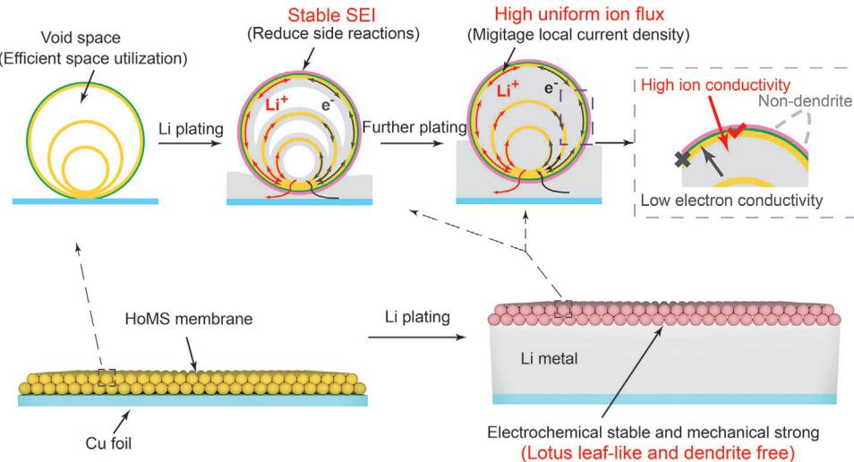
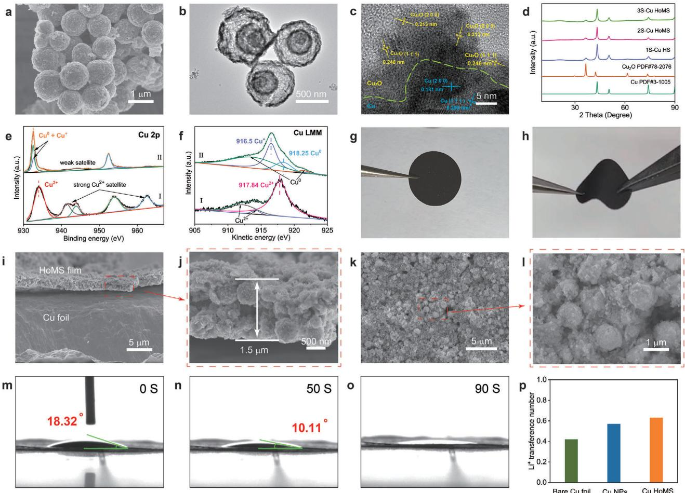
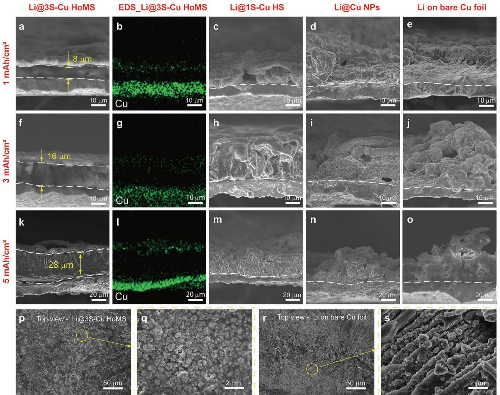
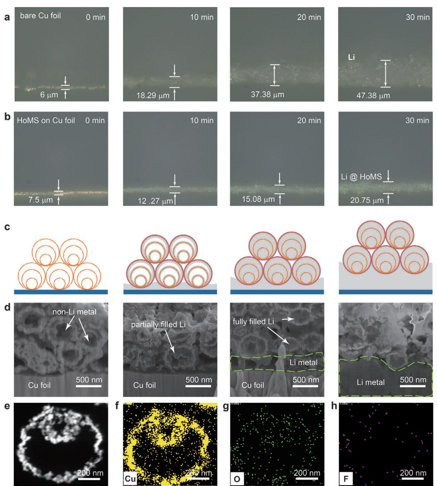
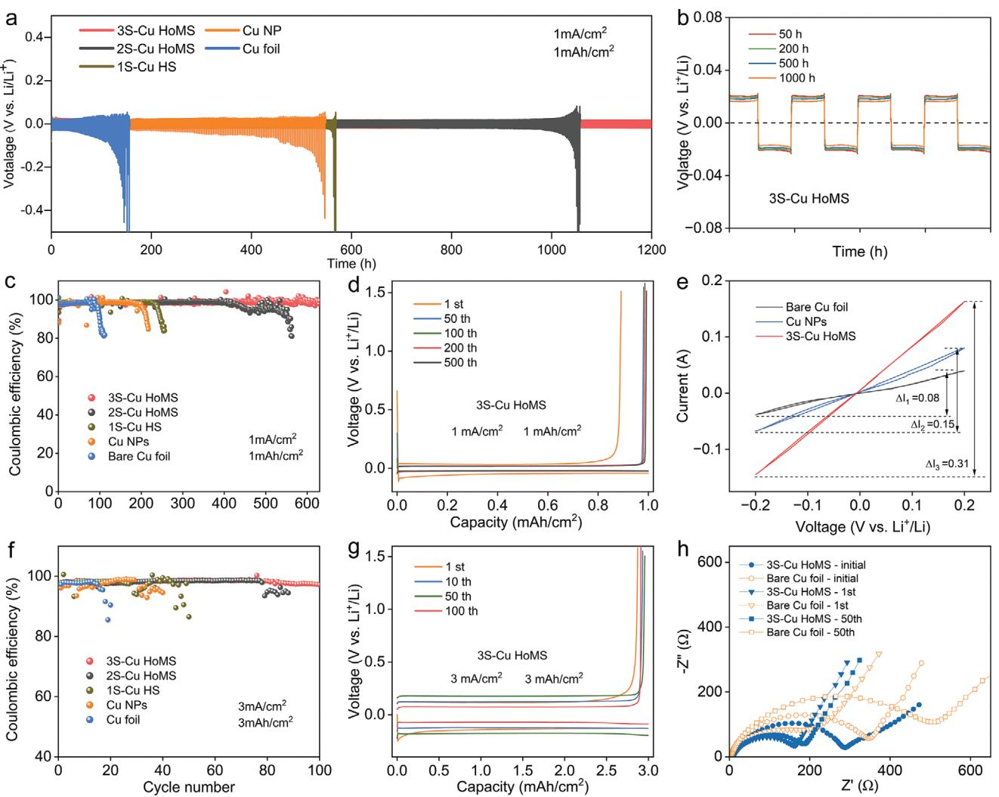
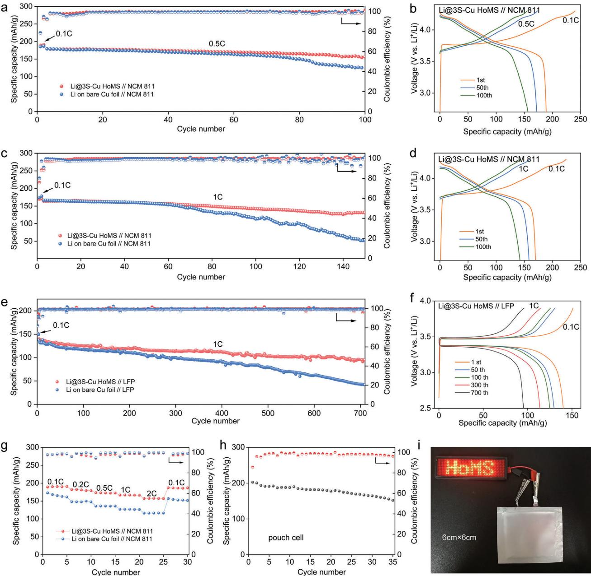

# **Relocatable Hollow Multishelled Structure-Based Membrane Enables Dendrite-Free Lithium Deposition for Ultrastable Lithium Metal Batteries**

*Peng Wei, Haoyu Wang, Mei Yang, Jiangyan Wang,\* and Dan Wang\**

**Lithium metal anode holds great promise due to its highest theoretical capacity and lowest redox potential. However, its practical application is hindered by lithium dendrite growth and exhaustive side reactions, which poses concerns to both cell performance and safety. Herein, a relocatable composite membrane is developed to simultaneously inhibit dendrite growth and stabilize solid electrolyte interphase (SEI) film. The compact packing of hollow multishelled structure (HoMS) provides percolated lithium ion channels and uniform ion flux, while the combined elastic polymer endows membrane structural flexibility to dynamically accommodate volume changes, which results in dendrite-free lithium deposition inside HoMS and underneath the membrane and stable SEI film restricted to the outer surface of HoMS. Consequently, the membrane-modified lithium metal half cell achieves an impressive Coulombic efficiency of 99.6% for over 600 cycles. Notably, full cell paired with LiFePO4 cathode stably runs for over 700 cycles, with a decay rate of only 0.045% per cycle, while the one paired with LiNi0.8Co0.1Mn0.1O2 cathode demonstrates a high capacity of 164.1 mAh g−1 at 1 C and a good capacity retention. This HoMS-based composite membrane opens up new opportunities to realize the practical application of lithium metal batteries.**

#### **1. Introduction**

Lithium (Li) metal is widely recognized as the "holy Grail" for high-energy-density rechargeable batteries due to its highest theoretical specific capacity (3860 mAh/g) and lowest redox potential (−3.04 V vs standard hydrogen electrode).[\[1\]](#page-7-0) However, its practical application is severely hindered by its short cyclic lifespan

P. Wei, H. Wang, M. Yang, J. Wang, D. Wang State Key Laboratory of Biochemical Engineering Institute of Process Engineering Chinese Academy of Sciences Beijing 100190, China E-mail: [jywang@ipe.ac.cn;](mailto:jywang@ipe.ac.cn) [danwang@ipe.ac.cn](mailto:danwang@ipe.ac.cn) P. Wei, H. Wang, J. Wang, D. Wang University of Chinese Academy of Sciences Beijing 100049, China P. Wei, H. Wang, M. Yang, J. Wang, D. Wang Key Laboratory of Biopharmaceutical Preparation and Delivery Chinese Academy of Sciences Beijing 100190, China

The ORCID identification number(s) for the author(s) of this article can be found under <https://doi.org/10.1002/aenm.202400108>

**DOI: 10.1002/aenm.202400108**

and safety concerns ascribed from its high reactivity and dendrite growth.[\[2\]](#page-7-0) To be specific, first, the high reactivity of Li with organic liquid electrolytes, causes massive solid electrolyte interphase (SEI) film formation and large consumption of electrolyte, leading to a low Coulombic efficiency (CE) and short cyclic life;[\[3\]](#page-7-0) second, the dendritic Li growth would cause the cracking of SEI film and more severely, it may penetrate through the separator and cause short circuits, thus bringing severe safety issues;[\[4\]](#page-7-0) third, the formation of dead Li due to the breakage of dendrites, further reduces the cyclic life of the battery.[\[5\]](#page-7-0)

To solve these problems, diverse modification approaches have been developed.[\[6\]](#page-7-0) Based on the understanding that Li dendrite growth is mainly ascribed from the nonuniform Li+ ion transfer through the Li/electrolyte interface, intense efforts have been devoted to constructing 3D matrix, including metals,[\[7\]](#page-7-0) metal compounds,[\[8\]](#page-7-0) composites,[\[9\]](#page-7-0) etc.,

which could eliminate the spatial inhomogeneity of Li+ ion on the electrode surface and enable a uniform Li deposition.

Nevertheless, the naturally formed SEI film with a weak modulus fails to withstand the unavoidable mechanical deformation during Li plating/stripping process,[\[10\]](#page-7-0) thus repeated SEI film broken and reparation with severe consumption of electrolytes. One approach to improve the chemical and mechanical stability of the SEI film is tuning the electrolyte composition[\[11\]](#page-7-0) though introducing additives,[\[12\]](#page-7-0) utilizing mixed solvents/salts[\[13\]](#page-7-0) or high salt concentration,[\[14\]](#page-7-0) etc. Another avenue resides in fabricating artificial SEI layer with alloys,[\[15\]](#page-7-0) metal compounds,[\[16\]](#page-7-0) polymers,[\[17\]](#page-8-0) etc., to mechanically suppress Li dendrite growth and prevent Li metal from direct contact with electrolytes.

Despite the great achievements, the cyclic stability as well as the CE of Li metal batteries still fails to satisfy the requirement of practical applications.[\[18\]](#page-8-0) This is because it remains quite challenging to simultaneously achieve a high uniform Li+ ion flux to inhibit Li dendrite, and a stable SEI film with good electrochemical stability and high mechanical strength.

Herein, we develop a relocatable highly-efficient composite membrane to simultaneously inhibit Li dendrite and stabilize SEI film. Consisted of copper-based hollow multishelled

**Scheme 1.** Schematic diagram showing the advantages of relocatable HoMS-based composite membrane for Li metal anode, which can simultaneously inhibit Li dendrites and stabilize SEI film.

structure (Cu HoMS) with elastic ethyl cellulose binder, this composite membrane offers Li metal batteries with abundant merits (**Scheme 1**). First, HoMS with multiple shells provides percolating Li+ ion channels, inducing homogeneous Li plating[\[19\]](#page-8-0) both inside the HoMS and underneath the composite membrane; second, the ethyl cellulose coating on the outer surface of HoMS, not only holds HoMS tightly together, but also inhibits Li from depositing on the surface of HoMS and restricts the SEI film solely on the outer surface;[\[20\]](#page-8-0) lastly but equally important, the flexibility of the composite membrane enables it to dynamically accommodate the volume change during Li plating/stripping,[\[21\]](#page-8-0) while the mechanical robustness makes it highly effective for inhibiting Li dendrite growth.[\[22\]](#page-8-0) In fact, it floats up and down on a Li metal anode during Li plating/stripping processes just like a lotus leaf floats on water.[\[23\]](#page-8-0) As a result, Li metal batteries decorated with this HoMS-based composite membrane, achieved an impressive Coulombic efficiency of 99.6% for over 600 cycles in half cell. Notably, full cells paired with LiFePO4 (LFP) cathode could stably operate for 700 cycles, while the one with LiNi0.8Co0.1Mn0.1O2 (NCM811) cathode demonstrated a high initial capacity and a good capacity retention.

#### **2. Results and Discussion**

HoMS with multiple orderly-arranged shells and inner cavities has been proven promising for diverse energy[\[24\]](#page-8-0) - and biomedicine[\[25\]](#page-8-0) -related application areas. Herein, Cu HoMS was prepared through a modified sequential templating approach (STA) as reported before.[\[26\]](#page-8-0) First, CuO HoMS was prepared using carbon sphere as a template via STA. By controlling the precursor-enrichment conditions, the shell number could be accurately-controlled,[\[27\]](#page-8-0) with single-shelled (1S), double-shelled (2S) and triple-shelled (3S) hollow spheres obtained (Figure S1 and Table S1, Supporting Information). Then, CuO HoMS was reduced to Cu HoMS using NaBH4 (1 m) as the reducing agent. Cu HoMS well inherits the morphology and shell structure of CuO HoMS (**Figure 1**[a,b;](#page-2-0) Figure S2, Supporting Information). The shell thickness of Cu HoMS is ≈40 nm, while its diameter is ≈0.8 μm. High-resolution transmission electron microscopy (HRTEM) reveals the coexistence of crystal Cu and Cu2O (Figure [1c\)](#page-2-0) in a Cu HoMS. X-ray diffraction (XRD) analysis shows that CuO HoMS (Figure S3, Supporting Information) has been reduced to Cu HoMS, while a small peak at 36.5°corresponding to Cu2O could also be observed, which may be due to the natural oxidation of Cu under air (Figure [1d\)](#page-2-0). In addition, X-ray photoelectron spectroscopy (XPS) was carried out to check the valence of copper element. The strong satellite peaks observed in the CuO HoMS (Figure [1e-I\)](#page-2-0) matches the signal of Cu2+, which is distinct from the Cu HoMS (Figure [1e-II\)](#page-2-0). Given that it is difficult to distinguish between Cu0 and Cu1+ solely based on Cu 2P XPS, Auger electron spectroscopy (AES) Cu LMM spectrum was also analyzed (Figure [1f\)](#page-2-0).[\[28\]](#page-8-0) Two main peaks at 916.50 eV (Cu1+) and 918.25 eV (Cu0) are observed in the Cu HoMS,[\[29\]](#page-8-0) while main peaks corresponding to Cu2+ are observed in the CuO HoMS.

Composite membranes consisted of different Cu materials, including 1S-Cu HS, 2S-Cu HoMS, 3S-Cu HoMS, and Cu NPs, are coated on Cu foil through a spin coating process. As shown in Figure [1g,h,](#page-3-0) the foil coated with 3S-Cu HoMS shows a black color, which may be due to the small particle size of Cu HoMS. In addition, the membrane-coated foil remains stable after folding and twisting. The thickness of the 3S-Cu HoMS composite membrane is ≈1.5 μm, indicating a closely-packed two-layer of Cu HoMS, which could be confirmed both through cross-sectional and in-plane view scanning electron microscopy (SEM) images (Figure [1i–l\)](#page-2-0). The wetting of electrolyte on the composite membrane is good, showing a nearly 0° contact angle, which may benefit the transportation of lithium ion passing through the membrane (Figure [1m–o\)](#page-2-0). Moreover, the electrode with 3S-Cu HoMS membrane exhibits a much higher Li+ ion transference number than the one without coating or coated with Cu NPs (Figure [1p;](#page-2-0) Figure S5, Supporting Information), which may be due to that the high specific surface area and multi-layered shell structure of HoMS provides vast

**Figure 1.** Morphology and structure characterization on Cu HoMS and composite membrane. a) SEM image, b) TEM image, and c) HRTEM images of 3S-Cu HoMS. d) XRD patterns of samples after reduction treatment. e) XPS curves of Cu 2p and f) peak fitting of Cu LMM Auger spectra for the 3S-CuO HoMS (I) and 3S-Cu HoMS (II). g,h) Photos of electrode with 3S-Cu HoMS membrane before (g) and after (h) bending. i) Low magnification and j) high magnification cross-sectional SEM image of 3S-Cu HoMS electrode. k) Low magnification and l) high magnification top-view SEM images of 3S-Cu HoMS electrode. m–o) Contact angle of electrolyte on 3S-Cu HoMS electrode. p) Transference number of Li+ ions tested from symmetrical cells assembled with different electrodes.

and uniform ion transport pathway and decreases concentration polarization.[\[30\]](#page-8-0)

Li metal was plated on bare Cu foil and membrane-coated foil at a current density of 1 mA cm−2 with different plating amounts being ≈1, 3, and 5 mAh cm−2, respectively. The thicknesses of the deposited Li on the 3S-Cu HoMS electrodes were 8, 16, and 28 μm, corresponding to 1, 3, and 5 mAh cm−2, respectively (**Figure 2**[a,f,k\)](#page-3-0), which matches well with the theoretical thickness increment value (5 μm cm−2 for 1 mAh cm−2 Li). SEM-energy dispersive X-ray spectroscopy (EDS) images (Figure [2b,g,l\)](#page-3-0) show two green ribbons corresponding to copper element, with the upper one belonging to the 3S-Cu HoMS composite membrane while the below one belonging to Cu foil. The middle vacant part may be Li metal as whose signal cannot be detected by SEM-EDS. It indicates that membrane floats at the upper of Li metal like a lotus leaf. To further confirm that, a similar test was conducted using 3S-Cu HoMS membrane coated Ni foil as the substrate, SEM-EDS diagram (Figure S6, Supporting Information) clearly shows the same results. Even when the deposition amount goes up to 5 mAh cm−2, the surface of the 3S-Cu HoMS electrode remains smooth (Figure [2p,q\)](#page-3-0). Comparatively, as for the bare Cu foil, rough and dendritic Li metal growth could be observed in both cross-sectional (Figure [2e,j,o\)](#page-3-0) and top-view (Figure [2r,s\)](#page-3-0) SEM images.

To further demonstrate the benefits of 3S-Cu HoMS composite membrane, other composite membranes based on Cu NPs or 1S-Cu HSs are also coated on Cu foil with the same mass loading per unit area (Figures S7 and S8, Supporting Information). It turns out that the 1S-Cu HS electrode remained relatively stable with a small amount of deposited Li, however, the structure is destroyed with dendrites observed as more Li deposited (Figure [2c,h,m\)](#page-3-0). As for the Cu NPs electrode, Li easily punctures through the NPs composite membrane, and becomes randomly and dendritic growth (Figure [2d,i,n\)](#page-3-0). The reasons may be that the fewer contact points between NPs and binder induces a loose and uneven packing of NPs in the composite membrane (Figure S9, Supporting Information), causing it a weak mechanical strength and enabling Li dendrites to easily pierce through the membrane.

**Figure 2.** Characterization of Li plating on Cu foil with/ without composite membrane. Cross-sectional SEM images of different electrodes with 1, 3, and 5 mAh cm−2 deposited Li, a,f,k) 3S-HoMS, c,h,m) 1S-HS, d,i,n) NPs, e,j,o) bare Cu foil. SEM-EDS images of 3S-HoMS electrode with b) 1 mAh cm−2, g) 3 mAh cm−2, and l) 5 mAh cm−2 deposited Li. Top-view SEM images of (p,q) 3S-HoMS electrode and (r,s) bare Cu foil after Li platting.

In situ optical characterization[\[31\]](#page-8-0) was employed to observe the process of Li deposition on bare Cu foil and 3S-Cu HoMS membrane-coated foil, at a current density of 6.67 mA cm−2 (**Figure [3](#page-4-0)**; Figure S10, Supporting Information). It was observed that Li metal deposited uniformly on the 3S-Cu HoMS electrode (Figure [3b\)](#page-4-0). The initial thickness of the 3S-Cu HoMS electrode was 7.5 μm. After half an hour of plating, the total thickness of the 3S-Cu HoMS electrode reached 20.75 μm. It is worth noting that the thickness increment is smaller than the theoretical thickness of deposited Li (1 mAh cm−2 Li possesses a thickness of ≈5 μm), which may be due to that Li deposited into the inside of 3S-Cu HoMS. In contrast, the Li deposition on Cu foil (Figure [3a\)](#page-4-0) was random and loose, showing a much larger thickness of 41.38 μm.

To detect the plating site of Li on the 3S-Cu HoMS electrode, focused ion beam (FIB)-SEM characterization was carried out on the electrode with different amounts of deposited Li. As shown in Figure [3c,d,](#page-4-0) at the initial deposition stage, Li grows simultaneously inside HoMS and underneath the composite membrane. As more Li was deposited, the inside of HoMS gradually becomes filled, and Li mainly deposited underneath the membrane, while the composite membrane would float up and resemble a lotus leaf without dendrite formation. More interestingly, it was found that SEI film mainly forms on the outermost layer of HoMS,[\[32\]](#page-8-0) as the characteristic element of SEI, fluorine, is barely detected inside HoMS (Figure [3e,h;](#page-4-0) Figure S11, Supporting Information). This would reduce side reactions and enhance electrode stability.

The electrochemical advantages of the composite membrane were tested by assembling symmetric cells, half cells as well as full cells. Symmetrical cells were assembled using identical electrodes with 3 mAh cm−2 of Li deposited on the 3S-Cu HoMS electrodes (labeled as Li/3S-Cu HoMS electrodes), or bare Cu foil (labeled as Li/Cu foil electrodes). The performance was tested at a current density of 1 mA cm−2 and a deposition capacity of 1 mAh cm−2. The symmetrical cells with Li/3S-Cu HoMS electrodes exhibited a small over potential of ≈20 mV (**Figure 4**[a,b\)](#page-5-0), which was significantly lower than other symmetrical

**Figure 3.** In situ optical microscopy observation on the Li deposition process. a,b) In situ optical microscopy observation on the process of Li deposition on (a) bare Cu foil and (b) 3S-HoMS electrode. c) Schematic diagrams and d) SEM images of 3S-Cu HoMS electrode with different amounts of deposited Li metal (0, 0.1, 0.5 and 1 mAh cm−2 , respectively). Electrodes were cut open using FIB for viewing. SEM images were taken with a sample rotation angle of 52°. e) TEM image and f–h) elemental mapping of a cycled Cu HoMS, (f) Cu, (g) O, and (h) F elements.

batteries using Li/Cu foil electrode, Li/Cu NP electrode and Li/1S-Cu HoMS (Figure S12, Supporting Information). In addition, it turns out that the cells with Li/3S-Cu HoMS electrodes can stably operate for over 1200 hours with the over potential barely changed, which is superior to other cells. In comparison, the over potential of cells with Li/Cu foil electrodes starts to increase after cycling for only 100 h, and runs to a phenomenal increase at ≈150 h, which indicates a broken structure of the electrodes. The lower overpotential and much better stability of the cells with Li/3S-Cu HoMS electrodes could be attributed to that 3S-Cu HoMS composite membrane provides uniform Li flux and inhibits Li dendrites.

In addition to symmetric cells, half cells were assembled using Li foil as the counter electrode. The CE in a Li metal battery refers to the ratio of the amount of stripped Li during the charge process to the amount of plated Li during the discharge process in each cycle. A constant current test with a capacity of 1.0 mAh cm−2 was conducted on each cell at 1.0 mA cm−2.Cells with 3S-Cu HoMS electrode show a much better stability and higher CE than the other cells (Figure [4c,d;](#page-5-0) Figure S13, Supporting Information), reaching an impressive-high CE of 99.6% even after a long cycle up to 600 cycles. Comparatively, the CE of the cell with bare Cu foil electrode drops gradually after 100 cycles, which may be due to that dendritic Li growth on bare Cu foil leads to accumulated SEI film and dead Li. Moreover, it is worth noting that cell with Cu NPs electrode shows a better stability than the one with bare Cu foil, however, the improvement is limited as CE drops obviously even when cycled *<*200 cycles. To reveal the mechanism, cyclic voltammetry (CV) was tested on half cells. Cells with 3S-Cu HoMS composite membrane-coated electrodes exhibit a much stronger corresponding current (Figure [4e\)](#page-5-0), indicating a faster reaction kinetics.

**Figure 4.** Electrochemical performance of symmetric cells and half cells. a) Voltage profiles of symmetric battery assembled with different electrodes cycled at 1.0 mA cm−2. b) Amplified voltage profiles of symmetric battery assembled with Li/3S-Cu HoMS electrodes. c,f) Coulombic efficiency of Li plating/stripping on different electrodes at (c) 1.0 mA cm−2 and (f) 3.0 mA cm−2. d,g) Voltage profiles of the Li deposition/stripping process at (d) 1.0 mA cm−2 and (g) 3.0 mA cm−2. e) CV curves tested at a scan rate of 0.2 mV s−1 with a voltage range of −0.2 to 0.2 V. h) EIS spectra of cells.

To further demonstrate the merits of 3S-Cu HoMS composite membrane, the performance of cells was also tested at a higher current density of 3 mA cm−2 with a higher deposition capacity of 3 mAh cm−2 (Figure 4f,h; Figure S14, Supporting Information). Surprisingly, the cell with 3S-Cu HoMS electrode also shows a good cycling stability, with a maintained CE of 98.0% after 100 cycles, while the cell with bare Cu foil drops sharply after less than 20 cycles. Electrochemical impedance spectroscopy (EIS) results show that the cell with 3S-Cu HoMS electrode exhibits a smaller impedance than the one with bare Cu foil electrode. Besides, the impedance of the 3S-Cu HoMS electrode remains slightly changed after 50 cycles (Figure 4h), comparatively, the impedance of the bare Cu foil electrode increases violently, which may be due to much less SEI film formed with the 3S-Cu HoMS composite membrane protection.

Furthermore, full battery application tests were conducted using the Li/3S-Cu HoMS electrode as the anode and NCM 811 or LFP as the cathode. The cells were activated at 0.1 C, followed by testing at a higher rate of 0.5 or 1 C. As shown in **Figure 5**[a,](#page-6-0) the CE of the 3S-Cu HoMS full cell remained stable at 99.5% at 0.5 C. The initial discharge capacity in the first cycle is measured at 179.3 mAh g−1, which gradually decreases to 156.3 mAh g−1 with a capacity retention of 87.2% over 100th cycle, while the charge and discharge plateau remains barely changed (Figure [5b\)](#page-6-0). In comparison, the initial specific capacity of the Cu foil full cell was 179.1 mAh g−1, which decreased rapidly to 140.2 mAh g−1 over 100 cycles. At a higher current density of 1C, the capacity of 3S-Cu HoMS cell maintained at 131.5 mAh g−1 after 150 cycles, which is much higher than that of 52.9 mAh g−1 for the bare Cu foil cell (Figure [5c,d\)](#page-6-0).

Moreover, the performance of full cells fabricated using Li/3S-Cu HoMS or Li/Cu foil anode and LFP cathode was also tested at 1 C. The specific capacity of 3S-Cu HoMS full cell was higher than that of the Cu foil full cell. In addition, the 3S-Cu HoMS full

**Figure 5.** Electrochemical performance of full cells. a,c) Specific capacity and Coulombic efficiency, and b,d) the voltage curves of full cells paired with NCM 811 cathodes, cycled at (a,b) 0.5 C and (c,d) 1 C. e) Specific capacity and Coulombic efficiency, and f) voltage curves of full cells paired with LFP cathodes, cycled at 1 C. g) Rate capability diagram of full cells paired with NCM 811 cathodes. h) Specific capacity and Coulombic efficiency of the pouch battery cycled at 0.2 C. i) The images of a LED lamp lighted up by the pouch cell.

cell can stably run for 700 cycles, indicating a capacity decay rate of 0.045% per cycle, which is much better than that of 0.098% for the Cu foil full cell (Figure 5e,f).

particularly pronounced at higher currents (Figure 5g). Similar results were also obtained in the LFP full cells (Figure S15, Supporting Information).

Rate capability of full cells was also compared. It turns out that the specific capacity of the 3S-Cu HoMS-NCM811 full cells is obviously higher than that of the bare Cu foil-NCM811 cell at all currents, 0.1C (190.1 vs 166.1 mAh g−1), 0.2C (180.7 vs 148.4 mAh g−1), 0.5C (172.8 vs 136.2 mAh g−1), 1C (166.6 vs 132.3 mAh g−1), and 2C (157.4 vs 126.8 mAh g−1), with the discrepancy

For practical applications, soft-package batteries were assembled with the Li@3S-Cu HoMS anode and NCM 811 cathode. The initial capacity of the soft-package battery reaches as high as 193.6 mAh g−1 and could stably cycle for over 35 cycles (Figure 5h). Additionally, the application value of the soft-package battery is demonstrated by the ability to power the "HoMS" LED light board

(Figure [5i\)](#page-6-0). Moreover, the energy density of a battery assembled with Li@3S-Cu HoMS anode and NCM 811 cathode with a huge specific capacity of 3.8 mAh cm−2 can reach 252.4 Wh kg−1 (Table S2, Supporting Information). These findings highlight the potential of utilizing 3S-Cu HoMS composite membrane for highenergy-density battery systems.

#### **3. Conclusion**

In summary, a rationally structured HoMS-based composite membrane is demonstrated for ultrastable Li metal batteries. The tightly packed HoMS provides percolating Li+ ion channels, which brings uniform ion flux and high Li+ ion transference number, leading to smooth and dense Li plating. In addition, the relocatable membrane with good structural flexibility could dynamically adapt the volume changes, resulting in a lotus leaflike behavior floating on the Li metal. Moreover, the SEI film is restricted to the outer surface of HoMS, which significantly reduces side reactions. Benefited from these merits, the protected Li metal symmetric cells, half cells as well as full cells all exhibit a good cyclic stability and high CE. Typically, the 3S-Cu HoMS membrane modified Li metal anode delivers an impressive CE of 99.6% for over 600 cycles in half cell, and stably operates for over 700 cycles in full cells. This concept of relocatable HoMS-based composite membrane could advance the commercialization of other high-energy-density rechargeable batteries.

# **Supporting Information**

Supporting Information is available from the Wiley Online Library or from the author.

# **Acknowledgements**

This work was supported by the Natural Science Foundation of China (Grant No.: 52301296, 52261160573, 52072369), the National Key Research and Development Program of China (Grant No.: 2022YFA1504101), the Cooperation Fund of the Institute of Clean Energy Innovation, Chinese Academy of Sciences (Grant No.: DNL202020), the Zhongke-Yuneng Joint R&D Center Program (No.: ZKYN2022008), IPE Project for Frontier Basic Research, Grant No. QYJC-2022-008.

# **Conflict of Interest**

The authors declare no conflict of interest.

#### **Data Availability Statement**

The data that support the findings of this study are available from the corresponding author upon reasonable request.

# **Keywords**

Coulombic efficiency, dendrite-free, hollow multishelled structure, lithium metal batteries, relocatable composite membrane

> Received: January 8, 2024 Revised: February 23, 2024 Published online: March 19, 2024

- [1] S. Chen, F. Dai, M. Cai, *ACS Energy Lett.* **2020**, *5*, 3140.
- [2] a) Z. A. Ghazi, Z. Sun, C. Sun, F. Qi, B. An, F. Li, H. M. Cheng, *Small* **2019**, *15*, 1900687; b) B. Liu, J.-G. Zhang, W. Xu, *Joule* **2018**, *2*, 833.
- [3] a) H. Wang, Z. Yu, X. Kong, S. C. Kim, D. T. Boyle, J. Qin, Z. Bao, Y. Cui, *Joule* **2022**, *6*, 588; b) Y. Sun, T. Yang, H. Ji, J. Zhou, Z. Wang, T. Qian, C. Yan, *Adv. Energy Mater.* **2020**, *10*, 2002373.
- [4] X. Sun, X. Zhang, Q. Ma, X. Guan, W. Wang, J. Luo, *Angew. Chem., Int. Ed.* **2020**, *59*, 6665.
- [5] a) R. Zhang, X. Shen, Y.-T. Zhang, X.-L. Zhong, H.-T. Ju, T.-X. Huang, X. Chen, J.-D. Zhang, J.-Q. Huang, *J. Energy Chem.* **2022**, *71*, 29; b) Q. Wang, B. Liu, Y. Shen, J. Wu, Z. Zhao, C. Zhong, W. Hu, *Adv. Sci.* **2021**, *8*, 2101111.
- [6] a) D. Lin, Y. Liu, Y. Cui, *Nat. Nanotechnol.* **2017**, *12*, 194; b) W. Hou, Y. Ou, K. Liu, *Chem. Res. Chin. Univ.* **2022**, *38*, 735; c) T.-P. Xiong, Z.-D. Li, X.-Y. Yao, Z. Peng, *Chem. Commun.* **2023**, *59*, 6517.
- [7] a) S. Han, Z. Li, Y. Zhang, D. Lei, C. Wang, *Energy Storage Mater.* **2022**, *48*, 384; b) S. Kim, M. Lee, S. Oh, W.-H. Ryu, *Chem. Eng. J.* **2023**, *474*, 145447; c) W. Jing, K. Zou, X. Dai, J. Sun, Q. Tan, Y. Chen, Y. Liu, *J. Alloys Compd.* **2022**, *924*, 166517; d) Y.-X. Zhan, P. Shi, X.-X. Ma, C.-B. Jin, Q.-K. Zhang, S.-J. Yang, B.-Q. Li, X.-Q. Zhang, J.-Q. Huang, *Adv. Energy Mater.* **2022**, *12*, 2103291.
- [8] Z.-J. Zheng, Q. Su, Q. Zhang, X.-C. Hu, Y.-X. Yin, R. Wen, H. Ye, Z.-B. Wang, Y.-G. Guo, *Nat. Energy* **2019**, *64*, 103910.
- [9] a) B. Hong, H. Fan, X.-B. Cheng, X. Yan, S. Hong, Q. Dong, C. Gao, Z. Zhang, Y. Lai, Q. Zhang, *Energy Storage Mater.* **2019**, *16*, 259; b) X. R. Chen, B. Q. Li, C. Zhu, R. Zhang, X. B. Cheng, J. Q. Huang, Q. Zhang, *Adv. Energy Mater.* **2019**, *9*, 1901932; c) X. He, Y. Yang, M. S. Cristian, J. Wang, X. Hou, B. Yan, J. Li, T. Zhang, E. Paillard, M. Swietoslawski, R. Kostecki, M. Winter, J. Li, *Nat. Energy* **2020**, *67*, 104172; e) Y.-J. Fang, S.-L. Zhang, Z.-P. Wu, D.-Y. Luan, X.-W. Lou (David), *Sci. Adv.* **2021**, *7*, eabg3626.
- [10] A. Ramasubramanian, V. Yurkiv, T. Foroozan, M. Ragone, R. Shahbazian-Yassar, F. Mashayek, *ACS Appl. Energy Mater.* **2020**, *3*, 10560.
- [11] a) Z. Li, Y. Chen, X. Yun, P. Gao, C. Zheng, P. Xiao, *Adv. Funct. Mater.* **2023**, *33*, 1033502; b) W. Tang, J. Ma, X. Zhang, Y. Li, S. Meng, Y. Zhang, H. Dong, R. Liu, R. Gao, M. Feng, *Energy Storage Mater.* **2024**, *64*, 103084.
- [12] a) Z. Wang, L. P. Hou, Z. Li, J. L. Liang, M. Y. Zhou, C. Z. Zhao, X. Zeng, B. Q. Li, A. Chen, X. Q. Zhang, P. Dong, Y. Zhang, J. Q. Huang, Q. Zhang, *Carbon Energy* **2023**, *5*, e283; b) T. Li, X.-Q. Zhang, P. Shi, Q. Zhang, *Joule* **2019**, *3*, 2647; c) B. Wu, C. Chen, D. L. Danilov, Z. Chen, M. Jiang, R. A. Eichel, P. H. L. Notten, *Energy Environ. Mater.* **2023**, e12642; d) A. G. Paul-Orecchio, L. Stockton, J. A. Weeks, A. Dolocan, Y. Wang, C. B. Mullins, *ACS Energy Lett.* **2023**, *8*, 4228; e) B.-Y. Xu, X.- Y. Li, C. Yang, Y.-T. Li, N. S. Grundish, P. H. Chien, K. Dong, I. Manke, R.-Y. Fang, N. Wu, H.-H. Xu, A. Dolocan, J. B. Goodenough, *J. Am. Chem. Soc.* **2021**, *143*, 6542.
- [13] a) Y. Xie, Y. Huang, Y. Zhang, T. Wu, S. Liu, M. Sun, B. Lee, Z. Lin, H. Chen, P. Dai, Z. Huang, J. Yang, C. Shi, D. Wu, L. Huang, Y. Hua, C. Wang, S. Sun, *Nat. Commun.* **2023**, *14*, 2883; b) Y. Jie, X. Liu, Z. Lei, S. Wang, Y. Chen, F. Huang, R. Cao, G. Zhang, S. Jiao, *Angew. Chem., Int. Ed.* **2020**, *59*, 3505; c) W. Xue, M. Huang, Y. Li, Y. G. Zhu, R. Gao, X. Xiao, W. Zhang, S. Li, G. Xu, Y. Yu, P. Li, J. Lopez, D. Yu, Y. Dong, W. Fan, Z. Shi, R. Xiong, C.-J. Sun, I. Hwang, W.-K. Lee, Y. Shao-Horn, J. A. Johnson, J. Li, *Nat. Energy* **2021**, *6*, 495.
- [14] a) J. Zheng, P. Yan, D. Mei, M. H. Engelhard, S. S. Cartmell, B. J. Polzin, C. Wang, J. G. Zhang, W. Xu, *Adv. Energy Mater.* **2016**, *6*, 1502151; b) G. Zhang, X. Deng, J. Li, J. Wang, G. Shi, Y. Yang, J. Chang, K. Yu, S.-S. Chi, H. Wang, P. Wang, Z. Liu, Y. Gao, Z. Zheng, Y. Deng, C. Wang, *Nat. Energy* **2022**, *95*, 107014.
- [15] a) C. Ma, C. Liu, Y. Zhang, X. Zhang, Z. Zhao, T. Song, B. Wu, D. Mu, *Chem. Eng. J.* **2022**, *434*, 134637; b) G.-X. Lu, J.-W. Nai, D.-Y. Liu, X.-Y. Tao, X.-W. Lou (David), *Sci. Adv.* **2023**, *9*, eadf1550.

- [16] a) E. Cha, M. D. Patel, J. Park, J. Hwang, V. Prasad, K. Cho, W. Choi, *Nat. Nanotechnol.* **2018**, *13*, 337; b) H. Zhang, X. Liao, Y. Guan, Y. Xiang, M. Li, W. Zhang, X. Zhu, H. Ming, L. Lu, J. Qiu, Y. Huang, G. Cao, Y. Yang, L. Mai, Y. Zhao, H. Zhang, *Nat. Commun.* **2018**, *9*, 3729; c) J. Lang, Y. Long, J. Qu, X. Luo, H. Wei, K. Huang, H. Zhang, L. Qi, Q. Zhang, Z. Li, H. Wu, *Energy Storage Mater.* **2019**, *16*, 85; d) H. Kang, M. Song, M. Yang, J.-W. Lee, *J. Power Sources* **2021**, *485*, 229286; e)
- Y.-J. Liu, X.-Y. Tao, Y. Wang, C. Jiang, C. Ma, O.-W. sheng, G.-X. Lu, X.-W. Lou, *Science* **2022**, *375*, 739. [17] a) J. M. Kim, M. H. Engelhard, B. Lu, Y. Xu, S. Tan, B. E. Matthews, S.
- Tripathi, X. Cao, C. Niu, E. Hu, S. M. Bak, C. Wang, Y. S. Meng, J. G. Zhang, W. Xu, *Adv. Funct. Mater.* **2022**, *32*, 2207172; b) H. Dong, X. Xiao, C. Jin, X. Wang, P. Tang, C. Wang, Y. Yin, D. Wang, S. Yang, C. Wu, *J. Power Sources* **2019**, *423*, 72.
- [18] S. Gao, F. Sun, N. Liu, H. Yang, P.-F. Cao, *Mater. Today* **2020**, *40*, 140.
- [19] B. Li, J. Wang, R. Bi, N. Yang, J. Wan, H. Jiang, L. Gu, J. Du, A. Cao, W. Gao, D. Wang, *Adv. Mater.* **2022**, *34*, 2200206.
- [20] J. Zhao, J. Wang, R. Bi, M. Yang, J. Wan, H. Jiang, L. Gu, D. Wang, *Angew. Chem., Int. Ed.* **2021**, *60*, 25719.
- [21] C. Chen, J. Zhang, B. Hu, Q. Liang, X. Xiong, *Nat. Commun.* **2023**, *14*, 4018.
- [22] G. Zheng, S. W. Lee, Z. Liang, H. W. Lee, K. Yan, H. Yao, H. Wang, W. Li, S. Chu, Y. Cui, *Nat. Nanotechnol.* **2014**, *9*, 618.
- [23] W. Liu, P. Liu, D. Mitlin, *Adv. Energy Mater.* **2020**, *10*, 2002297.
- [24] a) X. Zhang, R. Bi, J. Wang, M. Zheng, J. Wang, R. Yu, D. Wang, *Adv. Mater.* **2023**, *35*, 2209354; b) Y. Wei, F. You, D. Zhao, J. Wan, L. Gu, D. Wang, *Angew. Chem., Int. Ed.* **2022**, *61*, 202212049; c) Y. Wei, J. Wan, N. Yang, Y. Yang, Y. Ma, S. Wang, J. Wang, R. Yu, L. Gu, L. Wang, L. Wang, W. Huang, D. Wang, *Natl. Sci. Rev.* **2020**, *7*, 1638; d) W. Xu, R. Bi, M. Yang, J. Wang, R. Yu, D. Wang, *Nano Res.* **2023**, *16*, 12745; e)

X. Chen, S. Liu, N. Yang, R. Yu, D. Wang, *EcoMat* **2023**, *5*, e12348; f) W. Han, Y. Wang, J. Wan, D. Wang, *Chem. Res. Chin. Univ.* **2022**, *38*, 117; g) X. Chen, N. Yang, Y. Wang, H. He, J. Wang, J. Wan, H. Jiang, B. Xu, L. Wang, R. Yu, L. Tong, L. Gu, Q. Xiong, C. Chen, S. Zhang, D. Wang, *Adv. Mater.* **2022**, *34*, 2107400; h) X. Zhao, M. Yang, J. Wang,

- D. Wang, *Chem. Res. Chin. Univ.* **2023**, *39*, 630. [25] D. Zhao, N. Yang, Y. Wei, Q. Jin, Y. Wang, H. He, Y. Yang, B. Han, S. Zhang, D. Wang, *Nat. Commun.* **2020**, *11*, 4450.
- [26] a) J. Wang, J. Wan, D. Wang, *Acc. Chem. Res.* **2019**, *52*, 2169; b) D. Mao, J. Wan, J. Wang, D. Wang, *Adv. Mater.* **2019**, *31*, 1802874; c) J. Wang, Z. Wang, D. Mao, D. Wang, *Sci. Chin. Chem.* **2021**, *65*, 7; d) Y. Wei, Y. Cheng, D. Zhao, Y. Feng, P. Wei, J. Wang, W. Ge, D. Wang, *Angew. Chem., Int. Ed.* **2023**, *62*, 202302621.
- [27] a) J. Wang, Y. Cui, D. Wang, *Adv. Mater.* **2019**, *31*, 1801993; b) J. Wang, J. Wan, N. Yang, Q. Li, D. Wang, *Nat. Rev. Chem.* **2020**, *4*, 159; c) J. Wang, H. Tang, L. Zhang, H. Ren, R. Yu, Q. Jin, J. Qi, D. Mao, M. Yang, Y. Wang, P. Liu, Y. Zhang, Y. Wen, L. Gu, G. Ma, Z. Su, Z. Tang, H. Zhao, D. Wang, *Nat. Energy* **2016**, *1*, 16050; d) X. Lai, J. Li, B. A. Korgel, Z. Dong, Z. Li, F. Su, J. Du, D. Wang, *Angew. Chem., Int. Ed.* **2011**, *50*, 2738.
- [28] G. L. Christensen, M. A. Langell, *J. Phys. Chem. C* **2013**, *117*, 7039.
- [29] a) H. D. Speckmann, S. Haupt, H. H. Strehblow, *Surf. Interface Anal.* **1988**, *11*, 148; b) B. E. Cowie, L. Häfele, A. Phanopoulos, S. A. Said, J. K. Lee, A. Regoutz, M. S. P. Shaffer, C. K. Williams, *Chem.-Eur. J.* **2023**, *29*, 202300228.
- [30] S. Li, J. Huang, Y. Cui, S. Liu, Z. Chen, W. Huang, C. Li, R. Liu, R. Fu, D. Wu, *Nat. Nanotechnol.* **2022**, *17*, 613.
- [31] J. Chen, J. Zhao, L. Lei, P. Li, J. Chen, Y. Zhang, Y. Wang, Y. Ma, D. Wang, *Nano Lett.* **2020**, *20*, 3403.
- [32] J. Xie, J. Wang, H. R. Lee, K. Yan, Y. Li, F. Shi, W. Huang, A. Pei, G. Chen, R. Subbaraman, J. Christensen, Y. Cui, *Sci. Adv.* **2018**, *4*, eaat5168.