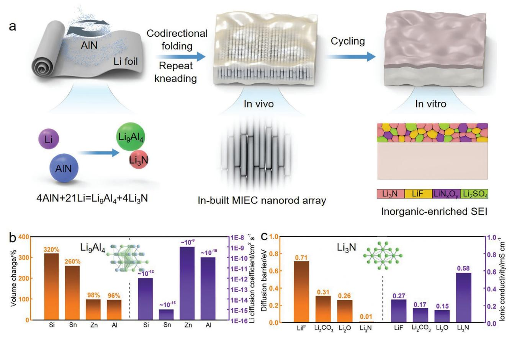
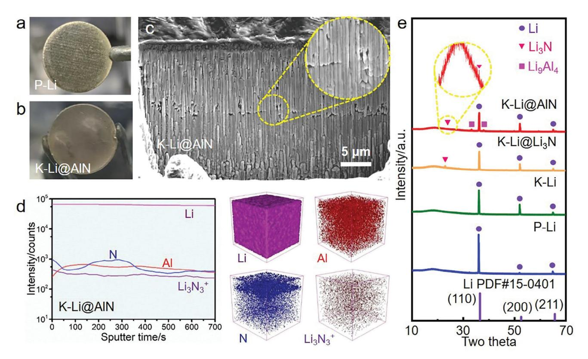
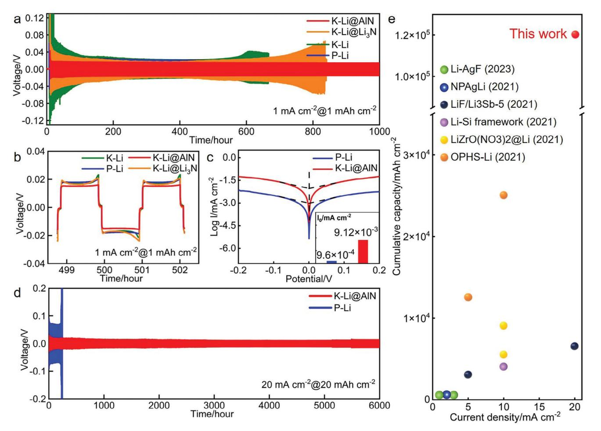
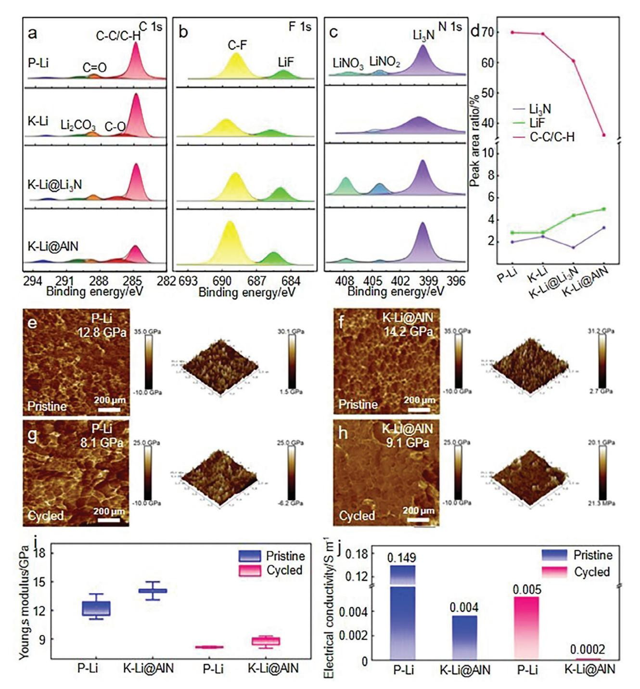
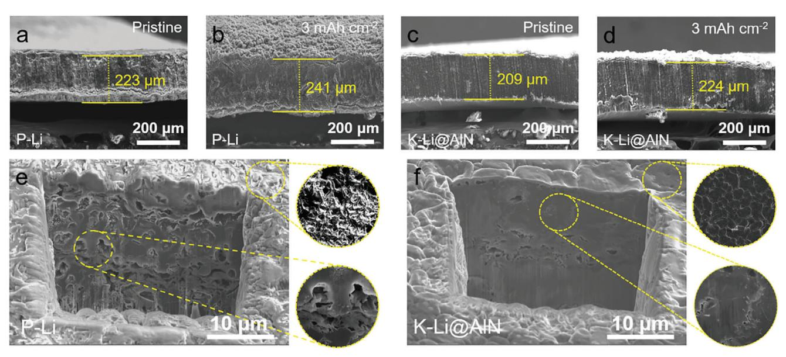
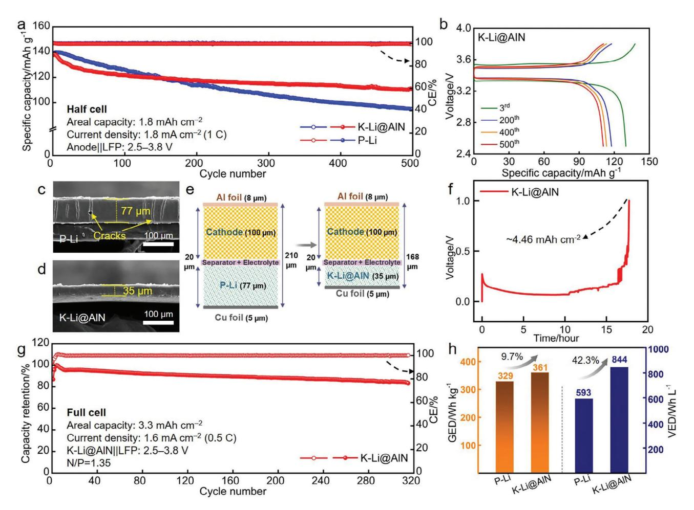
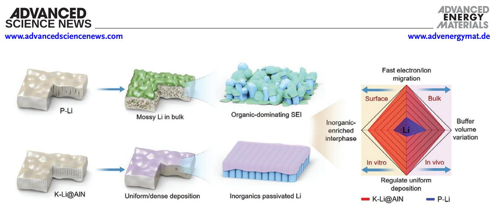

# **Superdense Lithium Deposition via Mixed Ionic/Electronic Conductive Interfaces Implanted In Vivo/Vitro for Stable Lithium Metal Batteries**

*Changjing Ma, Wenlong Jiang, Qiange Duan, De Ning, Man Wang, Jun Wang,\* Bingan Chen, Haobo Jiang,\* Chunlei Yang,\* and Wei Wu\**

**Lithium metal batteries specialize in energy density, while the immoderate dendrite growth and solid electrolyte interphase (SEI) proliferation have been impeding their practical application. The key is the regulation of Li+ diffusion/nucleation behaviors toward a dense deposition. Herein, Li9Al4/Li3N energized mixed ionic/electronic conductive (MIEC) interfaces are pre-implanted in both the surface and bulk of the lithium metal anode. Such MIEC interfaces are activated from the in situ conversion and nano-alloying reactions between AlN and metallic Li and are uniformly dispersed via facile mechanical kneading. In vitro, MIEC interfaces participate in the formation of an inorganic-enriched SEI that balances ionic transport, electron blocking, and mechanical strength to guarantee homogeneous ion fluxes and structural integrity. In vivo, a unique nanorod-array architecture enables a released internal stress and rapid diffusion kinetics, affording a dense and large granular plating manner. As a result, the symmetric cell delivers a striking cumulative capacity of** *>***120000 mAh cm−2 at 20 mA cm−2@20 mAh cm−2 with a prolonged lifespan of over 6000 h. The improved machinability also enables a scalable fabrication of ultrathin foil to achieve a stable high-areal-capacity full cell for 320 cycles with enhanced energy density characteristics both gravimetrically and volumetrically.**

hydrogen electrode) is the most competitive candidate.[\[1\]](#page-9-0) However, the practical application of lithium metal batteries (LMBs) still faces a series of challenges including large volume changes during Li plating/stripping cycling, proliferation and rupture of solid electrolyte interphase (SEI), polymorphous Li formation, etc.[\[2\]](#page-9-0) In principle, polymorphous Li deposits consist of film-like smooth Li and a group of irregularly patterned Li including whisker-like Li, moss-like Li, tree-like Li (Li dendrites) and their combinations.[\[3\]](#page-9-0) Li+ ions prefer to be reduced and deposited on the naked fresh Li metal protrusions, leading to the rapid growth of irregular Li rather than smooth Li. Due to the high reactivity of lithium and normally the larger surface areas of irregular Li, any freshly exposed Li would readily react with electrolyte both chemically and electrochemically, resulting in the continuous depletion of active Li and the formation of thick SEIs.[\[4\]](#page-9-0) Such an SEI layer cannot effectively buffer the large volumetric

# **1. Introduction**

For the anode choice of rechargeable batteries, lithium metal with the highest theoretical specific capacity (3860 mAh g−1) and the lowest electrochemical potential (−3.04 V vs standard

C. Ma, W. Jiang College of Information Technology Jilin Normal University Siping 136000, P. R. China C. Ma, Q. Duan, D. Ning, C. Yang, W. Wu Shenzhen Institutes of Advanced Technology Chinese Academy of Sciences Shenzhen 518055, P. R. China E-mail: [cl.yang@siat.ac.cn;](mailto:cl.yang@siat.ac.cn)[w.wu1@siat.ac.cn](mailto:w.wu1@siat.ac.cn)

The ORCID identification number(s) for the author(s) of this article can be found under <https://doi.org/10.1002/aenm.202400202>

#### **DOI: 10.1002/aenm.202400202**

expansion of the Li electrode and would fracture and regenerate repeatedly during the charging–discharging process.[\[5\]](#page-9-0) As a result, the continuous growth of irregular Li and the recurring SEI formation favor the generation of "dead Li" as well as poor reversibility and therefore cause the cycling performance of the

M. Wang, J. Wang Department of Materials Science and Engineering School of Innovation and Entrepreneurship Southern University of Science and Technology Shenzhen 518055, P. R. China E-mail: [wangj9@sustech.edu.cn](mailto:wangj9@sustech.edu.cn) B. Chen Shenzhen Nashe Intelligent Equipment Co., Ltd. China Merchants Guangming Science Park Shenzhen 518107, P. R. China H. Jiang College of Physics Jilin Normal University Siping 136000, P. R. China E-mail: [jianghaobo@jlnu.edu.cn](mailto:jianghaobo@jlnu.edu.cn)

LMB to deteriorate significantly.[\[6\]](#page-9-0) Hence, for the practical application of LMBs, it is urgently desired to reduce the volume expansion ratio of lithium upon cycling and strengthen the grown SEI layer to ensure dense deposition behavior.

To achieve a dense deposition of lithium, challenges coming from both the surface and bulk need to be tackled. A stable SEI film on the surface of lithium metal is preferred to be able to suppress the continuous generation and rupture by preventing the undesirable parasitic reactions between lithium and electrolyte.[\[4\]](#page-9-0) Assuming that the SEI exhibits sufficient insulativity to prevent electron conduction from the Li anode into the SEI, and the Li+ transport through the SEI is fast enough, the Li metal tends to be deposited at the SEI/Li interface that is beneath SEI, forming a dense deposition structure and extending the lifetime of the LMB.[\[7\]](#page-9-0) An ideal SEI is expected to regulate the uniform diffusion of Li+ and homogenize the Li+ flux that arrives at the Li metal surface.[\[8\]](#page-9-0) Theoretical and experimental studies have revealed that inorganic-rich SEIs are more likely to meet these requirements.[\[9\]](#page-9-0) To achieve this goal, advanced electrolyte design strategies and diverse artificial SEI layers have been introduced.[\[10\]](#page-9-0) In addition, the internal stress and its accumulation upon the repeated lithium plating/stripping would also threaten the structural integrity of lithium, thus influencing the structural evolution pattern of Li deposits.[\[3\]](#page-9-0) The effective relaxation of internal stress would contribute to suppressing the irregular Li growth, particularly whisker-like and moss-like Li.[\[3\]](#page-9-0) From the point of internal stress regulation, one effective approach is alloying, as the LiX (i.e., Mg, Ag, and amorphous Si) alloys by solid-state reaction normally have better reaction kinetics and a more balanced ionic/electronic conductivity via the mixed ionic/electronic conductive (MIEC) interfaces.[\[11\]](#page-9-0) The rapid Li+ diffusion kinetics enables the homogeneous dissipation of Li atoms, and the problems brought by the internal stress in plated bulk Li metal are removed, as evidenced by the much relieved irregular Li growth and reduced volume change.[\[3,12\]](#page-9-0) Another approach is to construct a microstructure inside the lithium metal negative electrode,[\[13\]](#page-9-0) which not only reduces the effective local current density but also regulates the electric field to realize a gradual deposition along the in-plane direction, thus efficiently buffering the volume change of the Li anode.[\[14\]](#page-9-0) However, a huge performance gap still remains for the practical application of such sophisticated LMBs, and substantial improvement is needed. Thus, persistent multidisciplinary investigations are highly recommended for unveiling the polymorphous evolution mechanism of Li and further inspiring effective strategies, which are beneficial for directing a dense Li deposition, regardless of surface or bulk.

In this work, we propose an integrated surface/bulk modification approach, which is rooted in a facile mechanical kneading process. The process creates the dispersed Li9Al4/Li3N MIEC interfaces by the in situ conversion and nano-alloying reactions between metallic lithium and AlN dopant. Such MIEC interfaces are uniformly implanted in the produced composite foil. Physicochemical characterizations validate a superdense lithium deposition behavior synergistically ensured by the inorganic-enriched SEI externally as well as the unique nanorod-array architecture internally. As a result, a stable cycle lifetime of 6000 h in the form of a symmetric cell under the extremely harsh condition of 20 mA cm−2@20 mAh cm−2 is demonstrated. Our approach also enables the fabrication of ultrathin composite foil to constitute high-load full cells. A practical full cell pairing of a highareal-capacity LiFePO4 (LFP) cathode of 3.3 mAh cm−2 with such thin foil anode of 35 μm, which refers to a low negative to positive (N/P) ratio of 1.35, also presents a remarkably stable cycling for 320 cycles. The proposed strategy provides a great promise for high-performance Li metal anode and high-energy-density LMBs.

## **2. Results and Discussion**

#### **2.1. Implanted Interfaces Construction and Characterizations**

The introduction of the MIEC interfaces to both the bulk and surface of lithium metal can promote a dense and uniform lithium deposition behavior by controlling the spatial distribution of carriers.[\[15\]](#page-9-0) **Figure [1](#page-2-0)**a illustrates the conceptual preparation process of the composite anode. AlN powder (5 wt%) was spread uniformly on a Li foil (95 wt%) and then folded up. For the structure, multiple folding and calendaring in the same direction were employed to reshape the internal structure of lithium metal. In each folding, boundaries, and interspace along the texture may be kept. As the folding follows the same direction, parallel boundaries accumulate, and the internal nanorod arrays are formed during repeated folding and calendaring. For the component, AlN was embedded into the soft and sticky metallic Li matrix and the following repeat kneading would dilute the AlN powder and trigger the in situ conversion reaction-induced nanoalloying reaction between AlN and Li. A uniform dispersion of the Li9Al4/Li3N MIEC interfaces was generated and thus implanted in the composite foil. This leads to the facile formation of an in-built nanorod array architecture in its bulk companying with MIEC interfaces consisting of the electronic-conducting Li–Al solid-solution alloy Li9Al4 and the ionic-conducting Li3N, which is termed as K–Li@AlN.[\[16\]](#page-9-0) A detailed record of the whole fabrication process of K–Li@AlN is presented in Figure S1 (Supporting Information).

The compositional design was driven by the unique characteristics of Li9Al4 and Li3N. Among typical lithium alloys, Li–Al alloy has the smallest volume change ratio (96%) meanwhile possesses a high Li+ diffusion coefficient (10−10 cm2 s−1) [\[17\]](#page-9-0) and a low resistivity (26.6 nΩ m−1) [\[18\]](#page-9-0) (Figure [1b\)](#page-2-0). Such Li–Al alloy shows a strong lithiophilicity to assist Li+ transfer and plating. Moreover, among typical Li-containing inorganic compounds, Li3N presents the smallest diffusion barrier as 0.01 eV, which is even lower than routine solid-state electrolytes (SSEs) as Li10GeP2S12 (0.17–0.28 eV), Li7P3S11 (0.16–0.19 eV), and cubic Li7La3Zr2O12 (0.23–0.28 eV).[\[8\]](#page-9-0) The low diffusion barrier coupling with a high carrier concentration of bulk Li3N (1.3 × 10−3) makes Li3N a fast ion conductor (0.58 mS cm−1) compared to other SEI components (Figure [1c\)](#page-2-0). The kneading in the synthesis ensures a uniform spatial distribution of the MIEC interfaces in both the bulk and surface of K–Li@AlN. Such in situ generated Li9Al4/Li3N with improved lithiophilicity provides abundant active sites for Li nucleation with an effectively reduced energy barrier. The MIEC interfaces are also envisioned to participate in the formation of SEI (namely a Li3N/LiF-rich SEI) during the Li plating/stripping cycling, contributing to a robust while ion-conducting SEI layer to guarantee a fast and homogeneous ion flux in cycling. This is

**Figure 1.** Design guideline of composite anode K–Li@AlN. a) Schematic of the fabrication process of K–Li@AlN. Nanorod array architecture is formed by codirectional folding and repeat kneading. b) Summary of volume change and transport properties of various lithium alloy metals.[\[17\]](#page-9-0) c) Summary of diffusion barrier and ionic conductivity of various Li-containing inorganic compounds.[\[8\]](#page-9-0)

highly beneficial for inducing a uniform Li deposition manner by simultaneously regulating Li+ diffusion/nucleation behaviors in the bulk and impeding the parasitic reactions between liquid electrolyte (LE) and Li metal surface.

Macroscopically, K–Li@AlN composite (**Figure 2**[a\)](#page-3-0) has a visibly smoother surface compared to pristine lithium (referring to P–Li) (Figure [2b\)](#page-3-0), evidencing not only a uniform dispersion of the generated Li9Al4/Li3N but also an improved mechanical processability. K–Li@AlN also shows better electrolyte wettability than P–Li, as represented by the contact angle variation toward LEs. As illustrated in Figure S2 (Supporting Information), the contact angle drops from 27.05° for P–Li to 19.45° for K–Li@AlN. Good electrolyte wettability indicates a more uniform Li+ flux that arrives at the Li surface as well as a fast Li+ transport in the interparticle space.[\[12\]](#page-9-0) Microscopically, the bulk of K–Li@AlN shows a unique internal nanostructure. As revealed by the focused ion beam (FIB) to a depth of 20 μm, the generally uniform nanorods (with a width of 200–500 nm and a micro-scale length (Figure S3, Supporting Information)) are all vertically aligned with well-defined boundaries (Figure [2c\)](#page-3-0). Such boundaries and interspace between adjacent nanorods are envisioned to effectively buffer the volume variation and release the stress during Li plating. To the best of our knowledge, this is the first report of such nanoarrays in the bulk of metallic lithium. In Figure S4 (Supporting Information), a similar nanorod array architecture in K–Li is also observed. This indicates that the repeat codirectional folding and kneading method is a versatile approach to modifying the internal structure of lithium metal. However, owing to the high self-affinity of Li, the nanorod array of K–Li is not that sharp, as some of the boundaries merge together, and no clear interspace and voids can be identified. In contrast, microcracks instead of nanorod arrays are observed in P–Li (Figure S5, Supporting Information), which are possibly the origin of the mechanical failure for Li metal upon Li plating/stripping cycling. The rolling treatment combined with AlN doping enhances its mechanical integrity. In composition, the depth profile and the corresponding 3D rendering models of the time-of-flight secondary ion mass spectrometry (TOF-SIMS) (Figure [2d\)](#page-3-0) demonstrate a generally uniform spatial distribution of Al and N components among the Li matrix. Li3N3 + fragment referring to Li3N can be specifically identified, which also confirms the occurrence of the in situ conversion reaction-induced nano-alloying reaction between AlN and Li.

To further understand the grain transformation during the kneading process, K–Li@AlN was broadly compared with P– Li, kneaded pristine Li (K–Li) and kneaded Li with Li3N doping (Li3N:Li = 5:95, K–Li@Li3N) (Figure S6, Supporting Information) via X-ray diffraction (XRD) analysis (Figure [2e\)](#page-3-0).

**Figure 2.** Physicochemical characterizations of Li metal anodes. Digital photographs of a) P–Li and b) K–Li@AlN. c) Cross-sectional focused ion beam scanning electron microscopy (FIB-SEM) image of K-Li@AIN electrode. d) TOF-SIMS-measured depth profile and 3D rendering models of K-Li@AIN. e) XRD patterns of P–Li, K–Li, K–Li@Li3N, and K–Li@AlN electrodes. Inset shows the amplified peak of Li3N.

As anticipated, diffraction peaks for  $Li_9Al_4$  and  $Li_3N$  (in the enlarged inset) were observed in K-Li@AlN, consistent with the TOF-SIMS results. Furthermore, for K-Li, K-Li@Li3N, and K-Li@AlN, an increased intensity of the (200) plane is observed. This is the result of the enhanced crystal anisotropy after repeated kneading, which is consistent with the previous reports.[19]

#### 2.2. Improved Li Plating/Stripping Reversibility

Symmetric cells were assembled to evaluate the electrochemical performance of the K-Li@AlN composite electrode. As illustrated in **Figure 3a,b**, the symmetric K-Li@AlN cell delivers a stable cycling over 1000 h with a well-restrained overpotential of  $\approx$ 17 mV at 1 mA cm-2@1 mAh cm-2. In contrast, the cells with symmetric P-Li, K-Li, and K-Li@Li3N suffer from intensive voltage fluctuation and high voltage hysteresis and then fail consecutively with a cycle life of less than 850 h, primarily owing to the repetitive rupture and regeneration of SEI, the accumulation of mossy Li and dead Li, and electrolyte depletion during cycling. Furthermore, symmetric K-Li@AlN presents a considerably lower overpotential at the initial 100 h of cycling. Such variation confirms that the presence of lithophilic MIEC nanorod array in the K-Li@AlN composite electrode facilitates the Li nucleation kinetics.[11b] The highly reduced polarization and stable cycling of K–Li@AlN can be further supported by the exchange current density ( $I_0$ ) obtained from the Tafel plots (Figure 3c). The  $I_0$  of K-Li@AlN is 9.12 × 10-3 mA cm-2, which is an order of magnitude higher than P–Li of  $9.6 \times 10^{-4}$  mA cm-2. The substantially increased  $I_0$  signifies a faster charge transfer and improved electrochemical reaction kinetics, which can be attributed to the formation of the implanted MIEC interfaces. Upon increasing the current density and deposition areal capacity to a challenging condition of 20 mA cm-2@20 mAh cm-2, a symmetric P–Li cell delivers a cycling lifespan of only 220 h with an overpotential of  $\approx$ 80 mV, which is almost double that of symmetric K–Li@AlN ( $\approx$ 30 mV, Figure 3d; Figure S7, Supporting Information). The Nyquist plots of symmetric K-Li@AlN cell (Figure S8, Supporting Information) after cycling at 20 mA cm-2@20 mAh cm-2 not only exclude the "soft short" of the cells but also suggest a reduced charge transfer resistance and a faster interfacial Li+ diffusion for the K–Li@AlN composite electrode. Finally, K-Li@AlN cell presents an ultralong stability of over 6000 h (Figure 3d). This affords a more outstanding cumulative capacity (>120 000 mAh cm $-2$ ) than recent reports since 2021 (Figure 3e), particularly in terms of high current densities and areal capacities. More detailed data and the associated reference information are shown in Table S1 (Supporting Information). These results from symmetric cells indicate that the interconnected nanorod arrays as well as the in-built MIEC interfaces embedded in K-Li@AlN effectively improve the lithium reversibility during Li plating/stripping and ultimately extend cell lifetime.

**Figure 3.** Electrochemical performance in symmetric cell configurations. a) Cycling performance and b) amplified voltage curves of symmetric P–Li, K–Li, K–Li@Li3N and K–Li@AlN cells at a certain time interval of 500 h at 1 mA cm−2@1 mAh cm−2. c) *Tafel* plots of symmetric K–Li@AlN and P–Li cells after 30 cycles at 10 mA cm−2@10 mAh cm−2. d) Cycling performance of symmetric P–Li and K–Li@AlN at 20 mA cm−2@20 mAh cm−2. e) Performance summary of symmetric cells (represented by current density and cumulative capacity) reported since 2021 for comparison with the work herein.

#### **2.3. Dense Lithium Deposition**

To reveal the underlying factors that contribute to the striking improvement in Li reversibility in a more fundamental manner, the in vitro native SEI analysis as well as the in vivo morphology evolution visualization are valuable. SEM analysis was first carried out to investigate the surface morphology of the Li metal anodes after 30 cycles at 10 mA cm−2@10 mAh cm−2 (Figure S9, Supporting Information). Typically, the cycled P–Li shows massive cracks and severe pulverization, which would cause the Li inventory loss and further initiate dendrite formation. In sharp contrast, a flat surface is observed in the cycled K–Li@AlN. The difference in surface morphology is closely correlated to the grown SEI, in particular its composition, mechanical properties, and conductivities.[\[6\]](#page-9-0) Thus, X-ray photoelectron spectroscopy (XPS) profiling analysis including C 1s, F 1s, and N 1s spectra was carried out accordingly. In **Figure 4**[a,](#page-5-0) copious organic species caused by electrolyte decomposition, including C─C/C─H, C─O, C═O, Li2CO3, and C─F are far more unimpressive in K–Li@AlN. This suggests the suppressed depletion reactions between the Li metal anode and the solvents in the solvation shell as well as salt fragments (CF3SO2N−) at the LE/Li metal interface. Note that the more organic components in P–Li, K–Li, and K–Li@Li3N are generally incompetent in effectively inhibiting dendrite growth and promoting fast Li+ transport.[\[20\]](#page-9-0) By comparison, inorganics represented by LiF (Figure [4b\)](#page-5-0) and Li3N (Figure [4c\)](#page-5-0) are more prominent in K–Li@AlN, accounting for the substantially increased proportions (Figure [4d\)](#page-5-0).

It is important to have enough mechanical strength for the SEI since it will undergo repeated interface displacement during cycling with the risk of crack formation or even breakage.[\[4,21\]](#page-9-0) Beyond this, recent electro–chemo–mechanical modeling results further reveal that an increased mechanical strength of the SEI is also effective in suppressing stress concentration and reducing the possibility of breaking the whole electrode, instead of only the SEI layer.[\[21\]](#page-9-0) Herein, both before and after cycling for 30 cycles at 10 mA cm−2@10 mAh cm−2, K–Li@AlN shows a higher average Young's modulus than that of P–Li (Figure [4e–i\)](#page-5-0), which is conducive to ensuring an improved structural integrity of the electrode surface and bulk. To ensure the reliability of the results, up to three spots of 1 × 1 μm2 each were monitored. The Young's moduli of the proposed SEIs are summarized in Table S2 www.advancedsciencenews.com

DVANCED

CIENCE NEWS

Ś

**Figure 4.** SEI characterizations in electrode surface. XPS spectra of a) C 1s, b) N 1s, and c) F 1s of P–Li, K–Li, K–Li, K–Li, M, and K–Li@AlN surfaces after 30 cycles under 10 mA cm-2@10 mAh cm-2. d) Relative proportions of the components in P–Li and K–Li@AlN (represented by LiF, LixN, and C–C/C–H). The average Young's modulus of e, g) P–Li and f, h) K–Li@AlN surface e, f) before and g, h) after 30 cycles under 10 mA cm-2@10 mAh cm-2. The summary of i) average Young's modulus (with error bars, more detailed data are given in Table S2, Supporting Information) and j) electrical conductivity of P-Li and K-Li@AIN electrodes before and after cycling.

(Supporting Information), and the distribution maps are illustrated in Figure S10-S13 (Supporting Information). The higher mechanical moduli of K-Li@AlN before and after cycling are attributed to the homogeneous distribution of the  $\text{Li}_{0}\text{Al}_{4}/\text{Li}_{3}\text{N}$ components and the Li3N/LiF-enriched SEI, respectively. Moreover, an ideal interphase for Li protection also calls for an evident shielding effect of electrolyte decomposition.[22] This necessitates the SEI layer to act as an electron blocker to prevent electrolyte decomposition to achieve a uniform lithium deposition.[23] In this regard, the grown SEI on K-Li@AlN presents a 25-fold

**[www.advancedsciencenews.com](http://www.advancedsciencenews.com) [www.advenergymat.de](http://www.advenergymat.de)**

**Figure 5.** Lithium plating morphology in bulk. Cross-sectional SEM images of a, b) P–Li and c, d) K–Li@AlN before and after plating 3 mAh cm−2. Cross-sectional FIB-SEM images of e) P–Li and f) K–Li@AlN electrodes after 50 cycles under 10 mA cm−2@10 mAh cm−2.

lower electrical conductivity (0.0002 S m−1) than that on P–Li (0.005 S m−1) (Figure [4j\)](#page-5-0). In the case of K–Li@AlN, its SEI is more effective in suppressing the electron tunneling from the lithium bulk to the electrolyte. In summary, the Li3N/LiFenriched SEI in K–Li@AlN demonstrates a higher Young's modulus while a reduced electrical conductivity. It serves as a robust meanwhile insulating layer to afford a strong electron-blocking ability to inhibit the electrolyte decomposition, thus leading to a more stable interphase construction and improved electrolyte/K– Li@AlN interfacial stability.

To provide further correlation of the bulk evolution to the overall cell performance, the interior morphology variations were also explored. After plating 3 mAh cm−2, the thickness of the P– Li electrode increases from 223 to 241 μm with an increment of 18 μm (**Figure 5**a,b). For K–Li@AlN, only ≈15 μm increase (Figure 5c,d) is observed, which approaches the theoretical value (1 mAh cm−2 equivalent to a relative change in thickness of ≈4.8 μm).[\[1b\]](#page-9-0) The finite volume change of K–Li@AlN evidences a regulated compact Li deposition manner. A step further, more details and significant differences are revealed by FIB-SEM imaging. The morphology evolution of both the surface and bulk of K– Li@AlN in the first cycle was monitored. As shown in Figure S14 (Supporting Information), upon the 1st Li stripping, the nanorodarray structure maintains, and Li is uniformly stripped from the surface. Upon the first Li plating, dense and large granular Li with a smooth surface is observed. The bulk presents a dense vertically aligned microstructure, which has an improved tolerability toward the volume change to maintain the stability of the whole structure. After 50 cycles at 10 mA cm−2@10 mAh cm−2, a large number of irregular cavities and mossy Li are randomly distributed in the bulk of P–Li, and the cavities could reach a depth of tens of microns, suggesting an inhomogeneous electrochemical Li plating/stripping behavior and an inflated overall thickness (Figure 5e). In such a pattern, active Li would readily react with LE and lead to the excessive formation of inner SEI proliferations and the continuous depletion of active Li.[\[24\]](#page-9-0) The porous microstructure combined with the accumulation of proliferation layers obstructs Li+ diffusion across the thick SEI to the underlying lithium and therefore causes the electrochemical performance of LMB to deteriorate gradually.[\[4\]](#page-9-0) Differently, the cycled K–Li@AlN retains a smooth and uniform surface with a dense metallic Li microstructure (Figure 5f). A thin surface SEI maintains superb coverage and close contact with Li while the bulk Li with the MIEC interfaces enables an expedited charge transfer, synergistically contributing to a dense large granular plating of lithium.

#### **2.4. Electrochemical Performance Improvements**

To investigate the application prospect, K–Li@AlN was matched with commercial LFP cathodes with high areal capacities of 1.8 and 3.3 mAh cm−2 in practical LMB cells. As shown in **Figure [6](#page-7-0)**a and K–Li@AlN||LFP half cell (excessive K–Li@AlN of 300 μm) exhibits a higher specific capacity (111 mAh g−1 vs 95 mAh g−1) and an improved capacity retention (87.6% vs. 67.8%) than P– Li||LFP cell. At 1C, an exceptional long-term cycling stability of 500 cycles is achieved in K–Li@AlN||LFP with a well-restricted voltage gap (Figure [6b\)](#page-7-0). In addition, the K–Li@AlN||LFP half cell also exhibits a good rate performance (Figure S15, Supporting Information). As shown, it delivers a reversible specific capacity of 125 mAh g−1 at 1C (1.8 mA cm−2), 100 mAh g−1 at 2C (3.6 mA cm−2) and 73 mAh g−1 at 3C (5.4 mA cm−2), indicating the great promise of K–Li@AlN for potential applications in high current rate conditions.

More importantly, full cells that employ a thin Li metal anode are imperative for practical LMBs. However, fabricating and stabilizing Li thin foils *<*50 μm are still daunting due to the poor processability of Li and its inherent instability in LEs.[\[25\]](#page-9-0) Although P–Li can also be rolled to a thickness of ≈77 μm (Figure [6c\)](#page-7-0), Li

**Figure 6.** Electrochemical characteristics of K–Li@AlN. a) Cycling performances of P–Li||LFP and K–Li@AlN||LFP half cells at 1C. b) The corresponding charge/discharge curves of K–Li@AlN||LFP half cells at different cycles. Cross-sectional SEM images of the as-prepared c) 77 μm P–Li and d) 35 μm K–Li@AlN foils. e) Schematic of the dimensions of all stack components of full cells employing P–Li or K–Li@AlN anodes. f) Voltage–time profile of the 35 μm K–Li@AlN foil with an upper voltage limit of 1.0 V. g) Cycling performance of K–Li@AlN||LFP full cell at 0.5C. h) GED and VED variations for the involved P–Li||LFP and K–Li@AlN||LFP full cells.

foil is tightly sticking onto the roller, and obvious cracks appear, indicating a mechanical failure. Here, it is found that a doping of 5 wt% AlN substantially improves the machinability of Li, allowing a self-supporting foil of only 35 μm (Figure 6d). Moreover, such a reduction in thickness represents a finite lithium supply and smaller proportions in both mass and volume. For a constant LFP cathode of 3.3 mAh cm−2 (mass loading of 24.0 mg cm−2) and 100 μm, K–Li@AlN of 35 μm rather than P–Li of 77 μm indicates a profound enhancement in energy density, both gravimetrically and volumetrically (Figure 6e). The processed K–Li@AlN of 35 μm equals to an areal capacity of 4.46 mAh cm−2 (Figure 6f). A full cell with a low N/P ratio of ≈1.35 could thus be achieved by pairing with an LFP cathode of 3.3 mAh cm−2. The cycling performance is shown in Figure 6g, delivering a high capacity retention of 84% at 0.5C and high Coulombic efficiencies (CEs) exceeding 99.5% for 320 cycles. Regardless of the electrochemical performance, we further examined the difference between P–Li and K–Li@AlN in terms of both gravimetric energy density (GED) and volumetric energy density (VED) (Figure 6h). By considering the practical capacity and voltage as well as the N/P ratio and LE excess,[\[26\]](#page-9-0) additional increases in GED (9.7%) and VED (42.3%) are observed for K–Li@AlN over P–Li. Note that a thickness of 35 μm is not the limit of the K–Li@AlN combined with the technique of rolling and kneading. In addition to the improved electrochemical performance, from the perspective of the device, the demonstration of 35 μm not only confirms the enhanced strength and ductility of K–Li@AlN over the bare metallic Li but also indicates its scalable and industrial potential.

Different from other alloying strategies,[\[27\]](#page-9-0) including fusion reaction, electrochemical lithiation, mechanical ball milling, electrodeposition, and magnetron sputtering, our approach has two advantages. i) The absence of complex equipment, melting treatment in high temperatures, and the post-forming issues, it is realized using a roll squeezer at room temperature, indicating the scalable and industrial potential of this process. ii) The integrated surface/bulk modification in our approach. The promotion of K–Li@AlN against P–Li is built on its dual functions, both externally and internally (**Figure [7](#page-8-0)**). In vitro, at the LE/Li metal

**Figure 7.** Schematic of the surface/bulk evolution behaviors of P–Li and K–Li@AlN.

interface, the in situ generated Li3N participates in the formation of SEI and the Li3N/LiF-enriched SEI suppresses the depletion reactions between Li metal and electrolyte, in particular, inhibits the accumulation of organics. Such inorganic-rich SEI is more competent in balancing ionic transport and strength, guaranteeing a fast meanwhile homogeneous ion flux and an improved electrolyte/K–Li@AlN interfacial stability in cycling. In vivo, the doped Li9Al4 of low volume change ratio and the nanorod architecture could effectively buffer volume variation and release stress during Li plating. The constructed MIEC interfaces enable rapid lithium-ion diffusion kinetics, promoting a dense and large granular plating manner of lithium to prevent mossy Li and crack formation in the bulk.

## **3. Conclusion**

In summary, an MIEC interface implanted composite lithium metal anode has been designed and constructed via a facile kneading method, in which AlN is embedded in the Li matrix and Li9Al4/Li3N dual dopants are in situ generated by the conversion and nano-alloying reactions. The nanorods array architecture with MIEC interfaces in bulk and the Li3N/LiF-rich SEI in the surface synergistically regulate the lithium deposition behavior. The dense and uniform deposition suppresses the parasitic reactions between active lithium and electrolyte that would occur at both the external lithium/electrolyte interface as well as the internal surface created by the cavities and mossy lithium sediments. Therefore, the symmetric cells and high-areal-capacity half/full cells using the MIEC interface implanted composite lithium metal anode exhibit high reversibility and Coulombic efficiency. Engineering exploration also demonstrates an improved strength and ductility of such composite anode, which enables the fabrication of the self-supporting foil of only 35 μm. Our work provides valuable insights into the design and fabrication of highperformance composite anodes for high-energy and long-cycling batteries.

### **4. Experimental Section**

*Fabrication of the K–Li@AlN Composite*: AlN powder (5 wt%, Aladdin Reagent Co., Ltd.) was first spread uniformly on the Li foil (95 wt%, China Energy Lithium Co., Ltd.) and then rolled up using a roll squeezer (MSK-2150, Hefei Kejing Materials Technology Co., Ltd). After 35 to 50 times folding and kneading, AlN was thus dispersed and embedded in the soft and sticky metallic Li, and the in situ conversion and nano-alloying reactions between lithium and AlN dopant occurred to generate Li–Al alloy and Li3N nanodomains (termed as K–Li@AlN). During the repeated mechanical kneading operation, the internal nanorod arrays were also formed. Control samples including kneaded Li (K–Li) and kneaded Li with Li3N doping (Li3N:Li = 5:95, K–Li@Li3N) were similarly fabricated. All the steps were carried out in a glove box (H2O *<* = 0.01 ppm, O2 *<* = 0.01 ppm).

*Physical Characterizations*: Scanning electron microscope (SEM, Hitachi S-4800) was used for imaging the surface and cross-sectional morphologies of pristine Li (P–Li), K–Li, K–Li@Li3N, and K–Li@AlN both before and after cycling. X-ray photoelectron spectroscopy (XPS, Nexsa, Thermo Fisher Scientific) was employed to analyze the surficial composition of electrodes after cycling. Time-of-flight secondary ion mass spectrometry (TOF-SIMS) measurements were carried out with a PHI nanoTOF II. In detail, a Bi3 ++ beam (30 keV, 2 nA, 100 × 100 μm2) was applied as the primary beam to detect the signals, while an Ar+ beam (3 kV, 100 nA, 400 × 400 μm2) was used for depth profiling analysis (sputtering rate of 10 nm min−1 on SiO2). The contact angle test for ether-based electrolyte on the K–Li@AlN surface was conducted using SDC200. X-ray diffraction (XRD) was used to analyze the crystalline structure of the composite foils by Cu-K radiation on Rigaku Ultima IV over the range of 10°– 70°. The samples were wrapped in polyimide tape to avoid oxidation and contamination. The internal microstructures before and after cycling were detected using a focused ion beam scanning electron microscopy (FIB-SEM, Thermo Scientific Helios 5 CX) with an accelerating voltage of 5 kV. The electrical conductivities of P–Li and K–Li@AlN both before and after cycling were measured using a resistance analysis system (CTA-3S, BeiJing Cryoall Science and Technology Co., Ltd.) following the four-probe method. Atomic force microscopy (AFM, Benyuan CSPM5500 system, China) was employed to obtain the topography and the force curves of P–Li and K– Li@AlN before and after cycling.

*Electrochemical Measurements*: Electrochemical experiments were carried out using CR2032-type coin cells in a LAND-CT2001A battery system. Ether-based electrolyte of 20 μL per cell (1.0 m lithium bis(trifluoromethanesulphonyl)imide (LiTFSI) in 1,3-dioxolane (DOL):dimethoxy ethane (DME) = 1:1 vol.% with 2 wt% LiNO3) from DodoChem Co. Ltd. and Celgard 2400 separator were used. Symmetric cells were performed at 1 mA cm−2@1 mA cm−2 and 20 mA cm−2@20 mA cm−2. The exchange current density (*I0*) was estimated based on the linear sweep voltammetry (LSV, CorrTest CS310H electrochemical workstation) in the form of a symmetric cell at a scanning rate of 0.1 mV s−1 from −0.2 to 0.2 V. Galvanostatic charge/discharge measurements of the Li||LFP half and full cells were conducted in a voltage range of 2.5–3.8 V.

**[www.advancedsciencenews.com](http://www.advancedsciencenews.com) [www.advenergymat.de](http://www.advenergymat.de)**

# **Supporting Information**

Supporting Information is available from the Wiley Online Library or from the author.

## **Acknowledgements**

C.M. and W.J. were equally major contributors to this work. This work was supported by the National Natural Science Foundation of China (Grant Nos. 52173243 and 52202331), Basic and Applied Basic Research Foundation of Guangdong Province (Grant No. 2022A1515110313), and Shenzhen Science and Technology Innovation Program (Grant No. JCYJ20230807140818040).

# **Conflict of Interest**

The authors declare no conflict of interest.

# **Data Availability Statement**

The data that support the findings of this study are available from the corresponding author upon reasonable request.

# **Keywords**

composite anode, dendrite, energy density, lithium metal battery, mixed ionic/electronic conductive interface

> Received: January 13, 2024 Revised: March 25, 2024 Published online: April 17, 2024

- [1] a) X. B. Cheng, R. Zhang, C. Z. Zhao, Q. Zhang, *Chem. Rev.* **2017**, *117*, 10403; b) D. Lin, Y. Liu, Y. Cui, *Nat. Nanotechnol.* **2017**, *12*, 194; c) J. Liu, Z. Bao, Y. Cui, E. J. Dufek, J. B. Goodenough, P. Khalifah, Q. Li, B. Y. Liaw, P. Liu, A. Manthiram, Y. S. Meng, V. R. Subramanian, M. F. Toney, V. V. Viswanathan, M. S. Whittingham, J. Xiao, W. Xu, J. Yang, X.-Q. Yang, J.-G. Zhang, *Nat. Energy* **2019**, *4*, 180.
- [2] L. Ye, M. Liao, X. Cheng, X. Zhou, Y. Zhao, Y. Yang, C. Tang, H. Sun, Y. Gao, B. Wang, H. Peng, *Chem. Int. Ed. Engl.* **2021**, *60*, 17419.
- [3] P. Zou, Y. Sui, H. Zhan, C. Wang, H. L. Xin, H. M. Cheng, F. Kang, C. Yang, *Chem. Rev.* **2021**, *121*, 5986.
- [4] C. Chen, Q. Liang, G. Wang, D. Liu, X. Xiong, *Adv. Funct. Mater.* **2021**, *32*, 2107249.
- [5] a) Q. Wang, J. Wan, X. Cao, R. Wen, Y. G. Guo, W. Liu, H. H. Zhou, *Adv. Funct. Mater.* **2022**, *32*, 2107923; b) X. L. Xu, S. J. Wang, H. Wang, C. Hu, Y. Jin, J. B. Liu, H. Yan, *J. Energy Chem.* **2018**, *27*, 513.
- [6] Q. Wang, J. Wan, X. Cao, R. Wen, Y. Guo, W. Liu, H. Zhou, *Adv. Funct. Mater.* **2021**, *32*, 2107923.

- [7] a) A. J. Hu, W. Chen, X. C. Du, Y. Hu, T. Y. Lei, H. B. Wang, L. X. Xue, Y. Y. Li, H. Sun, Y. C. Yan, J. P. Long, C. Z. Shu, J. Zhu, B. H. Li, X. F. Wang, J. Xiong, *Energy Environ. Sci.* **2021**, *14*, 4115; b) G. Y. Wang, M. Zhu, Y. Zhang, C. Song, X. L. Zhu, Z. Y. Huang, Y. J. Zhang, F. F. Yu, G. Xu, M. H. Wu, H.-K. Liu, S.-X. Dou, C. Wu, *InfoMat* **2022**, *4*, 12293.
- [8] X.-X. Ma, X. Shen, X. Chen, Z.-H. Fu, N. Yao, R. Zhang, Q. Zhang, *Small Struct.* **2022**, *3*, 2200071.
- [9] T.-U. Wi, S. O. Park, S. J. Yeom, M.-H. Kim, I. Kristanto, H. Wang, S. K. Kwak, H.-W. Lee, *ACS Energy Lett.* **2023**, *8*, 2193.
- [10] a) S. Liu, X. Ji, N. Piao, J. Chen, N. Eidson, J. Xu, P. Wang, L. Chen, J. Zhang, T. Deng, S. Hou, T. Jin, H. Wan, J. Li, J. Tu, C. Wang, *Angew. Chem. Int. Ed. Engl.* **2021**, *60*, 3661; b) G. X. Lu, J. Nai, D. Y. Luan, X. Y. Tao, X. W. Lou, *Sci. Adv.* **2023**, *9*, 1550; c) M. L. Meyerson, P. E. Papa, A. Heller, C. B. Mullins, *ACS Nano* **2021**, *15*, 29; d) S. Huang, Y. P. Huang, Y. Xia, J. Ding, C. Peng, L. Wang, J. Luo, X. X. Zhang, J. Zheng, Y. Q. Gao, J. Chen, *InfoMat* **2023**, *5*, 12411.
- [11] a) X. Wu, W. Zhang, N. Q. Wu, S. S. Pang, Y. Ding, G. He, *Adv. Energy Mater.* **2021**, *11*, 2003082; b) Z. X. Guo, T. R. Wang, D. H. Wang, H. H. Xu, X. Y. Liu, Y. M. Dai, H. Yang, Y. H. Huang, W. Luo, *ACS Nano* **2023**, *17*, 14136; c) H. T. Wang, C. Wang, Y. B. Tang, *Ecomat* **2021**, *3*, 12172.
- [12] L. Lin, F. Liu, X. Yan, Q. Chen, Y. Zhuang, H. Zheng, J. Lin, L. Wang, L. Han, Q. Wei, Q. Xie, D. L. Peng, *Adv. Funct. Mater.* **2021**, *31*, 2104081.
- [13] a) H. S. Bae, I. Phiri, H. S. Kang, Y. M. Lee, M. H. Ryou, *J. Power Sources* **2021**, *514*, 230553; b) R. Xu, F. Liu, Y. S. Ye, H. Chen, R. R. Yang, Y. X. Ma, W. X. Huang, J. Y. Wan, Y. Cui, *Adv. Mater.* **2021**, *33*, 2104009; c) C. Luo, H. Hu, T. Zhang, S. J. Wen, R. Wang, Y. A. An, S. S. Chi, J. Wang, C. Y. Wang, J. Chang, Z. J. Zheng, Y. H. Deng, *Adv. Mater.* **2022**, *34*, 2205677.
- [14] a) Z. J. Cao, B. Li, S. B. Yang, *Adv. Mater.* **2019**, *31*, 1901310; b) Q. Q. Meng, M. R. Guan, Y. X. Huang, L. Li, F. Wu, R. J. Chen, *InfoMat* **2022**, *4*, 12313.
- [15] M. Yan, C.-Y. Wang, M. Fan, Y. Zhang, S. Xin, J. Yue, X.-X. Zeng, J.-Y. Liang, Y.-X. Song, Y.-X. Yin, R. Wen, Z. Liu, L.-J. Wan, Y.-G. Guo, *Adv. Funct. Mater.* **2023**, 2301638.
- [16] W. Feng, J. Hu, G. Qian, Z. Xu, G. Zan, Y. Liu, F. Wang, C. Wang, Y. Xia, *Sci. Adv.* **2022**, *8*, 8972.
- [17] J. A. Lewis, K. A. Cavallaro, Y. Liu, M. T. McDowell, *Joule* **2022**, *6*, 1418.
- [18] M. Zhu, X. Zhao, R. Yan, J. Zhang, *Curr. Opin. Solid State Mater. Sci.* **2023**, *27*, 101079.
- [19] a) M. Wan, S. Kang, L. Wang, H. W. Lee, G. W. Zheng, Y. Cui, Y. Sun, *Nat. Commun.* **2020**, *11*, 829; b) L. Fu, X. Wang, Z. Chen, Y. Li, E. Mao, Z. W. Seh, Y. Sun, *Carbon Energy* **2022**, *4*, 12.
- [20] J. Wu, X. Wang, Q. Liu, S. Wang, D. Zhou, F. Kang, D. Shanmukaraj, M. Armand, T. Rojo, B. Li, G. Wang, *Nat. Commun.* **2021**, *12*, 5746.
- [21] Y. Liu, X. Xu, O. O. Kapitanova, P. V. Evdokimov, Z. Song, A. Matic, S. Xiong, *Adv. Energy Mater.* **2022**, *12*, 2103589.
- [22] J. Chen, Z. Li, N. Sun, J. Xu, Q. Li, X. Yao, J. Ming, Z. Peng, *ACS Energy Lett.* **2022**, *7*, 1594.
- [23] L. Dong, S. Zhong, B. Yuan, Y. Li, J. Liu, Y. Ji, D. Chen, Y. Liu, C. Yang, J. Han, W. He, *Angew. Chem. Int. Ed. Engl.* **2023**, *62*, 202301073.
- [24] Y. Zhang, F. M. Heim, N. Song, J. L. Bartlett, X. Li, *ACS Energy Lett.* **2017**, *2*, 2696.
- [25] Z. Guo, T. Wang, D. Wang, H. Xu, X. Liu, Y. Dai, H. Yang, Y. Huang, W. Luo, *ACS Nano* **2023**, *17*, 14136.
- [26] L. Wang, Z. Wu, J. Zou, P. Gao, X. Niu, H. Li, L. Chen, *Joule* **2019**, *3*, 2086.
- [27] X. Gu, J. Dong, C. Lai, *Eng. Rep.* **2020**, *3*, 12339.