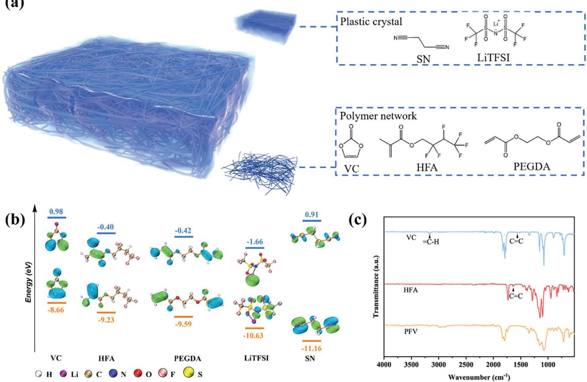
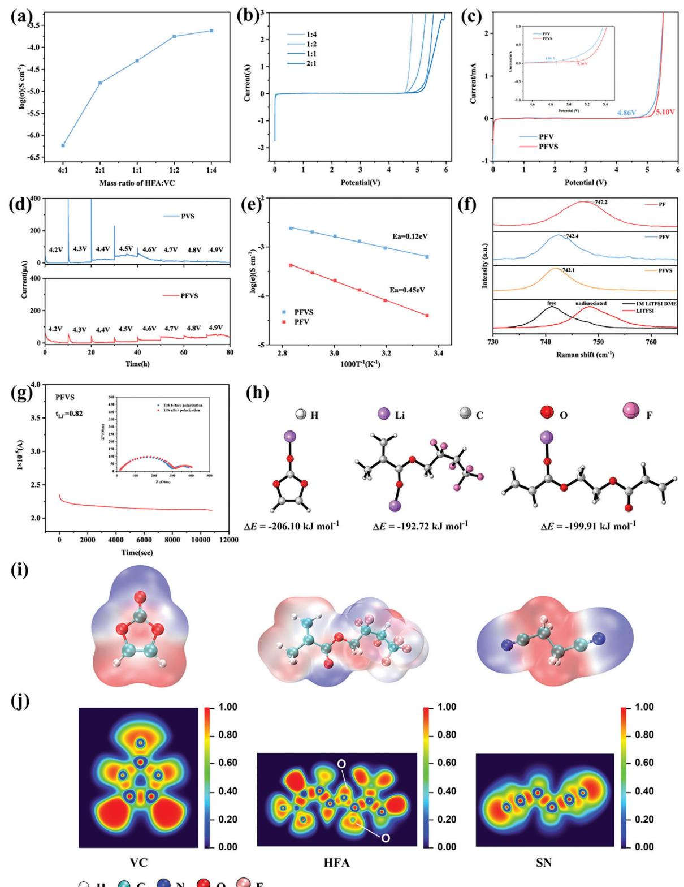
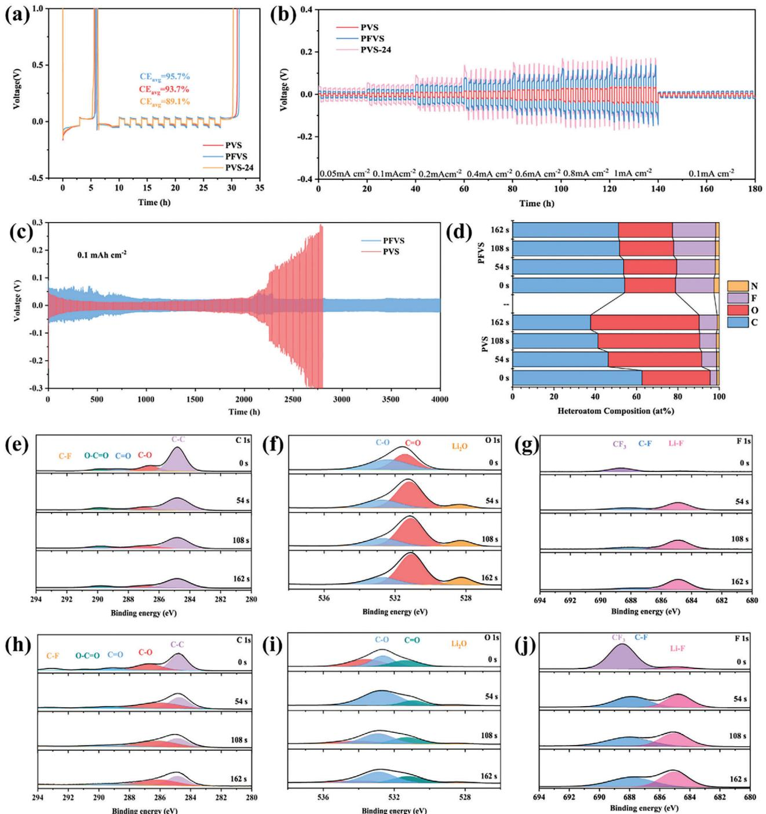
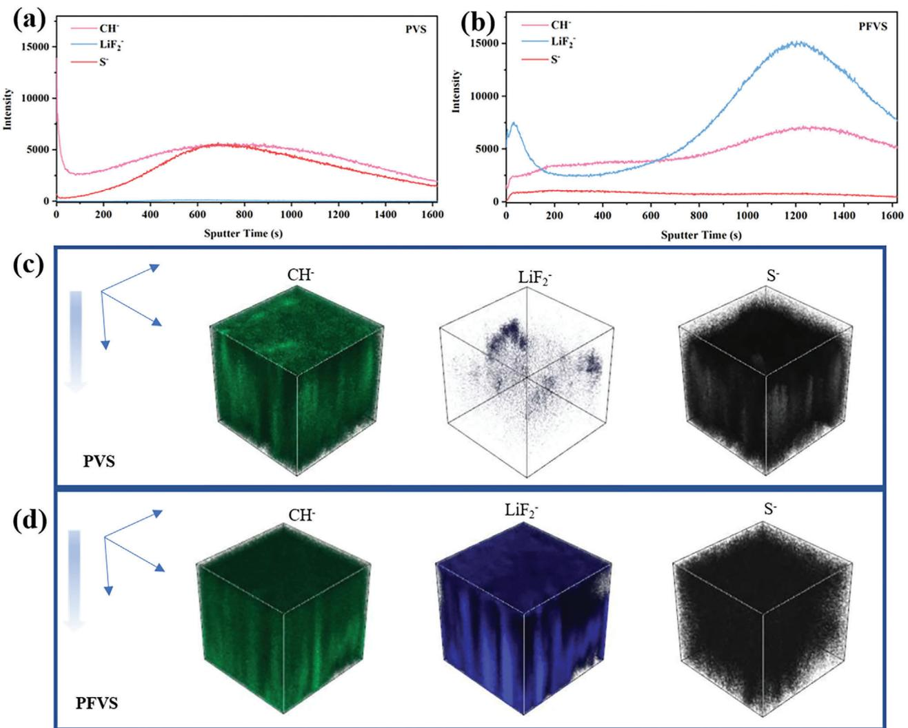
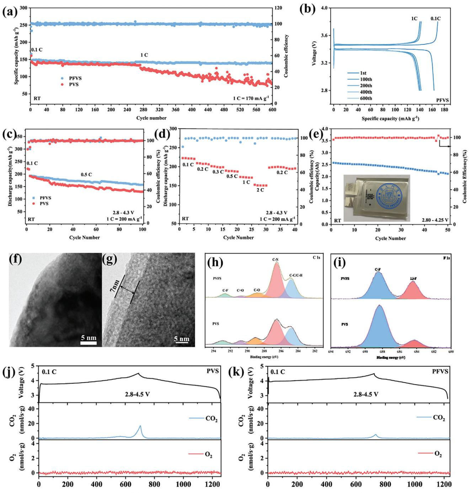

# **Molecular Design for In-Situ Polymerized Solid Polymer Electrolytes Enabling Stable Cycling of Lithium Metal Batteries**

*Hao Peng, Tairen Long, Jun Peng, Hui Chen, Lifei Ji, Hui Sun,\* Ling Huang,\* and Shi-Gang Sun\**

**The practical application of polymer electrolytes is hindered due to the low ionic conductivity and the interfacial instability between the electrodes. Herein, a strategy for designing solid polymer electrolytes is developed that facilitates the rapid lithium-ion migration through weak coordination with polymer chain segments, as well as the fast ion channel transport of oligomers. Moreover, the in situ-produced solid polymer electrolyte (PFVS) can form stable LiF-rich interfaces with both the lithium metal anode and different cathodes. When the PFVS is applied in Li-metal batteries, excellent properties are achieved at room temperature. A Li||Li symmetric cell can be stably cycled for 4000 h at a current density of 0.1 mA cm−1, a Li||LiFePO4 full cell can maintain capacity retention as high as still 94.4% after 600 cycles at 1 C, and a Li||NCM811 full cell can retain 80% capacity after 180 cycles at 1 C. A 2.6 Ah Graphite|PFVS|NCM90 pouch cell is made for demonstrating the practical application potential, and it can be also stably cycled. The developed strategy provides a promising path for designing solid polymer electrolytes that can effectively extend the lifespan of Li metal batteries.**

# **1. Introduction**

Lithium metal is considered as an ideal anode material to further increase the energy of lithium batteries, due to its low redox potential (−3.04 V vs the standard hydrogen electrode) and high theoretical specific capacity (3860 mAh g−1).[\[1\]](#page-9-0) However, the high reactivity of the lithium metal anode promotes undesirable liquid electrolyte consumption and uncontrollable Li

H. Peng, T. Long, J. Peng, H. Chen, L. Ji, L. Huang, S.-G. Sun State Key Laboratory of Physical Chemistry of Solid Surfaces College of Chemistry and Chemical Engineering Xiamen University Xiamen 361005, China E-mail: [huangl@xmu.edu.cn;](mailto:huangl@xmu.edu.cn) [sgsun@xmu.edu.cn](mailto:sgsun@xmu.edu.cn) H. Sun State Key Laboratory of Heavy Oil Processing Beijing Key Laboratory of Biogas Upgrading Utilization College of New Energy and Materials China University of Petroleum-Beijing Beijing 102249, China E-mail: [sunhui@cup.edu.cn](mailto:sunhui@cup.edu.cn)

The ORCID identification number(s) for the author(s) of this article can be found under <https://doi.org/10.1002/aenm.202400428>

**DOI: 10.1002/aenm.202400428**

dendrite growth, leading to low Coulombic efficiency, short circuits, and even safety hazards, which seriously hinder its practical applications.[\[2\]](#page-9-0) Replacing the liquid electrolyte with a solid electrolyte is deemed to be an effective way to address the safety concerns of lithium metal batteries.[\[3\]](#page-9-0) Among the different types of solid electrolytes, solid polymer electrolytes (SPEs) are one of the most promising candidates due to their advantages in terms of high flexibility and excellent processability.[\[4\]](#page-9-0) In particular, the in situ polymerized SPEs have improved interfacial contact with the electrode.[\[5\]](#page-9-0) However, SPEs have yet to be effectively utilized due to their low ionic conductivity and electrochemical instability when paired with a Li metal anode and high-voltage cathodes.[\[6\]](#page-9-0) To enhance the performance of solid-state lithium metal batteries (SLMBs), the preparation

of an SPE with high ionic conductivity, outstanding interfacial stability, and a broad electrochemical stability window is essential.[\[7\]](#page-9-0) Considerable studies to enhance the ionic conductivity of solid polymer electrolytes were reported, including the incorporation of inorganic fillers,[\[8\]](#page-9-0) the addition of plasticizers,[\[9\]](#page-9-0) and the cross-linking of polymers.[\[10\]](#page-9-0) However, all these efforts were focused on improving the ionic conductivity of SPEs, and little attention has been paid to the stability of interfaces of solid polymer electrolytes with lithium metal anode and with highvoltage cathode.

Lithium metal is highly reactive with the SPEs, causing a low Coulombic efficiency. Because Li metal is thermodynamically unstable with polymers, the solid electrolyte interphase (SEI) formed on the lithium metal anode plays a key role in its stable cycling.[\[11\]](#page-9-0) Inhomogeneous SEI during charging and discharging would allow for continuous exposure of fresh Li, resulting in the continued reaction of the SPEs with Li. Therefore, the SEI composition and structure have to be further improved to provide good homogeneity and stability. The stability of SPEs with cathodes is also important. Transition metal ions in the highly delighted state of the cathode can catalyze the decomposition of the SPE with limited anti-oxidative ability, leading to unstable of the interface between the high-voltage cathode and the SPE.[\[12\]](#page-9-0) Consequently, not only the SPE requires a high oxidation stability, but also the construction of a homogeneous and stable cathode–electrolyte interphase (CEI) is crucial for the cycle life of the battery.[\[13\]](#page-9-0) Fluorinated polymers can increase its oxidation resistance due to the electron-withdrawing inductive effect of fluorine.[\[14\]](#page-9-0) Furthermore, fluorine groups enable the formation of LiF-rich SEI and CEI with low diffusion barriers and robust mechanical strength to stabilize the interfaces.

In this study, we developed a strategy to design solid polymer electrolytes with excellent properties. An in situ polymerized fluorinated solid polymer electrolyte was prepared for successful application in lithium metal batteries. The as-prepared SPE can shift the oxidation stability to a higher voltage, and at the same time more readily effectively stabilize the Li anode by forming a homogeneous LiF-rich SEI. Our design strategy allows the electrolyte to coordinate with Li ions with unique interactions, which facilitates the rapid lithium-ion migration through weak coordination with polymer chain segments, and the fast ion channel transport of oligomers as well. The solid polymer electrolyte had a high ionic conductivity of 6.3 × 10−4 S cm−1 and an ultra-high Li ion transference number of 0.82, as well as a wide electrochemical window of 5.10 V. The results showed that the Li||Li symmetric cells using the SPE were stably cycled for 4000 h at a current density of 0.1 mA cm−1. When the SPE was used in the Li||LiFePO4 cells, the capacity retention was kept still at 94.4% after 600 cycles at room temperature and at 1 C. The Li||NCM811 cells with the SPE retained 80% capacity after 180 cycles at C. Finally, a 2.6 Ah pouch cell with the SPE was prepared, and it could also be stably cycled.

# **2. Results and Discussion**

### **2.1. Polymer Electrolyte Design**

The low ionic conductivity of polymers and the interfacial instability between the polymer and electrodes impede their practical application. To address this issue, we designed fluorinecontaining polymer frameworks and plasticized molecules containing nitrile groups. These materials are expected to facilitate ion conduction and ensure stability when used with Li metal anodes and high-voltage cathodes. A 2,2,3,4,4,4-Hexafluorobutyl methacrylate (HFA) mixed with vinylene carbonate (VC) and 1mol% Poly (ethylene glycol) diacrylate (PEGDA) precursor solution undergoes free radical polymerization under thermal initiation to form a cross-linked network, which we refer to as PFV (Figure S1, Supporting Information). To increase the ionic conductivity of the polymer, a solution of succinonitrile (SN) and lithium bis (trifluoromethane sulfonyl) imide (LiTFSI) was mixed into the polymer precursor. SN is a representative plastic crystal due to its high ionic conductivity when complexed with Li salts.[\[15\]](#page-9-0) PFVS is a polymer electrolyte with PFV as the polymer backbone and SN-LiTFSI plasticization (**Figure 1**[a\)](#page-2-0). We refer to the HFA-free solid polymer electrolyte as PVS. As shown in Figure S2 (Supporting Information), the SN-LiTFSI and the polymer precursor were both homogeneous and transparent solutions. After mixing and heating, polymerization occurred and the PFVS was in a solid state.

Density functional theory (DFT) calculations were used to evaluate the highest occupied molecular orbital (HOMO) and lowest unoccupied molecular orbital (LUMO) energies of each component of the electrolyte precursor. Generally, the lower the LUMO energy value, the easier it is to accept electrons and preferentially reduce them. Figure [1b](#page-2-0) displays that the HFA monomer has a lower LUMO energy value (−0.40 eV) than that of VC (0.98 eV), signifying that HFA was more accessible to electrons during the process of polymerization, thus resulting in a faster rate of polymerization in comparison to VC. LiTFSI (−1.66 eV) had the lowest LUMO energy value, indicating its preference for reduction by the Li anode, participating in the formation of the SEI. Relative to the VC unit (−8.66 eV), the HFA unit in the polymer fragments has a comparatively low HOMO energy value of −9.23 eV, corresponding semiquantitatively to higher theoretical oxidation potentials. The fluorine atom in the electrolyte has a strong electronwithdrawing effect, which is expected to guard the VC unit from oxidation, due to its high anti-oxidative ability, and the polymer framework providing additional protection. In addition, SN had the lowest HOMO energy value (−11.16 eV), indicating its ultrahigh anti-oxidative ability. The cooperation between fluorinated polymer frameworks and SN has a synergistic effect that inhibits surface degradation at high-voltage active cathode/SPE interface.

Fourier transform infrared spectroscopy (FT-IR) was employed to analyze the changes in C═C chemical bonds before and after in situ polymerization (Figures [1c](#page-2-0) and Figure S3, Supporting Information). The IR absorption band at 1640 cm−1 corresponds to the stretching vibration of the C═C bonds of HFA, which disappeared after polymerization, confirming a high degree of polymerization of the polymer. The IR band at 3165 cm−1 is attributed to the stretching vibration of the ═C─H bond of VC, and a weak absorption band is still observable, indicating the presence of unbroken C═C bonds of VC in the polymer. This is likely due to the slow polymerization rate of VC, which allows the formation of residual monomers and oligomers of VC monomers and facilitates Li+ transport in the cells. The conversion of VC after thermal initiation was determined using nuclear magnetic resonance hydrogen spectroscopy (1H-NMR). In Figure S4 (Supporting Information), peak a of 7.77 ppm is the hydrogen in the C═C bond environment of VC, while peak *a*′ of 5.35 ppm is the hydrogen in the C-C environment after polymerization. It was calculated that 68% of VC was converted, leaving 32% of the monomer or oligomer still present. Gel permeation chromatography was used to further analyze the molecular weight of the PFV polymer (Figure S5, Supporting Information). The average molecular weight (MW) of the polymer was 38,640 g mol−1, demonstrating that the polymer had been successfully cross-linked. The appropriate degree of cross-linking can enhance the mechanical properties and ion mobility of the polymer.

Thermogravimetric analysis (TGA) was used to evaluate the thermal properties of the electrolytes (Figure S6, Supporting Information). Poly HFA (PF) exhibits an extremely high thermal stability, with a weight loss occurring at 260 °C, signifying the commencement of thermal decomposition. However, the VC short chains or monomers in the PFV, which have low boiling points and molecular weights, start to thermally break down at 55 °C. The SN-LITFSI solution begins to decompose violently at 130 °C. Therefore, the host copolymer of the fluorinated fragments in PFVS offers ultra-high stability. The flame test (Movie S1, Supporting Information) revealed that PFVS was able to burn due to extremely high temperatures, and its sudden extinction

**Figure 1.** a) The schematic diagram of the solid polymer electrolyte design. b) The HOMO and LUMO energy levels of VC, HFA, PEGDA, LITFSI, and SN. c) FT-IR spectra of VC, HFA, and PFV with wavenumber range of 550–4000 cm−1.

indicated that it is less flammable. Fluorination leads to a decrease in the flammability of the electrolyte.[\[16\]](#page-9-0) Scanning electron microscopy (SEM) was utilized to observe the surface and cross-section morphology of PFVS. The PFVS was densely covering the glass fibers and had penetrated into the voids (Figures S7 and S8, Supporting Information). The elemental distribution was observed through Energy Dispersive Spectrometer (EDS), and it was found that the C and F elements were evenly distributed.

#### **2.2. Electrochemical Performance Evaluation**

To optimize the ratio of HFA to VC, the ionic conductivity and oxidation voltage of SPE were measured. PEGDA, which acted as a crosslinker, was kept at a constant of 1 mol % to both VC and HFA. The ionic conductivity of the PFV electrolyte with different ratios of HFA and VC was calculated from the electrochemical impedance spectroscopy (EIS) in Figure S9 (Supporting Information). As **Figure [2](#page-3-0)**a illustrates, the ionic conductivity decreases as the degree of fluorination increases. Linear sweep voltammetry (LSV) was investigated employing lithium||stainless steel (SS) cells to determine the oxidation voltage and the results are presented in Figure [2b.](#page-3-0) It can be seen that the oxidative decomposition voltage increases as the degree of fluorination increases. The ionic conductivity is improved by the incompletely polymerized VC, and the electrochemical window is broadened by the fluorination of HFA fragments. To ensure efficient operation of full cells, the mass ratio of the two was kept at a ratio of 1:1. The ionic conductivity of different ratios of PFV and SN-LiTFSI solutions was studied to determine the optimal ratio (Figure S10, Supporting Information). While the ionic conductivity increased as the concentration of SN-LiTFSI increased, the mechanical strength decreased. Hence, a volume ratio of 7:3 was opted for, with an ionic conductivity of 6.3 × 10−4 S cm−1. LSV tested the change in oxidation voltage upon the addition of a solution of SN-LiTFSI, where the oxidation voltage increased from 4.86 to 5.10 V, showing considerable high-voltage stability (Figure [2c\)](#page-3-0). The effect of fluorination on the oxidation stability of the polymer was further explored by measuring the leakage current during constant voltage charging through electrochemical floatation experiments (Figure [2d\)](#page-3-0). Matching the SPE to Li and Li (Ni0.8Co0.1Mn0.1) O2 (NCM811), the current of the PVC began to become turbulent during constant voltage charging at 4.4 V. The current of the PFVS was stable between 4.2 and 4.6 V, and its leakage current stayed low even at 4.7 V. The results further indicate that its fluorination gives the SPE excellent electrochemical stability.

In order to verify the ionic conductivity and activation energy of the SPEs, the EIS of PFV and PFVS was tested in the range from 25 to 80 °C (Figure S11, Supporting Information). The ionic conductivity of PFV and PFVS was calculated to be 3.96 × 10−5 and

**Figure 2.** a) Ionic conductivities of the electrolytes with different ratios of HFA and VC. b) Sweep voltammogram curves of electrolytes with different ratios of HFA and VC. c) Sweep voltammogram curves of PFV and PFVS at a scan rate of 1 mV s−1. d) Electrochemical floating analysis of cells assembled with NCM811 cathode for PVS and PFVS. e) Arrhenius plots of the ionic conductivities of the solid polymer electrolytes at 25–80°C. f) Raman spectra of the different electrolytes. g) The chronoamperometry profile of Li symmetric cells with PFVS. Inset shows the Nyquist plots before and after polarization. h) The binding energy under the coordination of each group and free Li+. i) The optimized geometric configurations and electrostatic potential of VC, HFA, and SN. j) Electron localization function of VC, HFA, and SN.

6.30 × 10−4 S cm−1 at 25 °C, respectively. The addition of 30 vol% SN-LiTFSI caused a 20-fold increase in the ionic conductivity of the solid polymer electrolyte. The conductivity-temperature relationship of the SPEs followed the Arrhenius behavior, and the activation energies of PFV and PFVS were calculated to be 0.45 and 0.12 eV, respectively (Figure [2e\)](#page-3-0). This low activation energy implies that the PFVS electrolyte reduces the lithium-ion migration barrier, altering the coordination between Li+ and the SPE. Ionic dipole interactions between Li+ and polar groups enable Li+ migration in the SPE. In addition, the SN and VC molecules coordinate with Li+, forming a channel for rapid ion transport h in the polymer framework.

Figure [2f](#page-3-0) shows the Raman spectra of the N─S bond stretching vibrations of TFSI− in different SPEs. Specifically, the Raman shifts of the N─S bonds in the LiTFSI powders and 1 m LiTFSI DME were used to differentiate between the free TFSI− (741.1 cm−1) and the undissociated TFSI− (748.2 cm−1). The peak of PF was 747.2 cm−1, with a considerable amount of undissociated TFSI−. The peaks of PFV and PFVS were 742.4 and 742.1 cm−1, respectively, suggesting that they had moved to the area of free-moving TFSI−. It is evident that the oligomers of incompletely polymerized VC, as well as SN, contribute to the dissociation of LiTFSI, resulting in higher ionic conductivity.

Li+ transference number (tLi+) is an important parameter of battery performance, and a higher tLi+ reduces interfacial polarization and promotes even lithium-ion deposition. The tLi+ of the PFVS electrolyte was calculated to be 0.82, while that of PVS was 0.56 (Figure [2g;](#page-3-0) Figure S12, Supporting Information). The higher tLi+ of PFVS is likely due to the fluorine-containing functional groups on the PFVS network interacting strongly with the fluorinated anions and reducing their mobility.

DFT calculations revealed the adsorption energy of Li+ on different fragments (Figure [2h\)](#page-3-0). The HFA fragment (−192.72 kJ mol−1) exhibits the weakest binding affinity compared to the VC (−206.10 kJ mol−1) and the PEGDA (−199.91 kJ mol−1) fragments. The fluorine moieties of the polymer chain reduce the nucleophilicity of O, leading to a lower binding strength of O to Li+. Polymer fluorination weakens the coordination of Li+ to O, allowing the polymer's chain segments to migrate with a lower barrier. Therefore, the low transport energy barrier for Li+ is due not only to the efficient conduction of the monomers and oligomers, but also to the abundant polar groups on the polymer that interact with Li+. [\[17\]](#page-9-0)

The interaction of polymer fragments with Li+ can be rationalized by electrostatic potential (ESP) calculations, which strongly correlate with non-covalent interactions (Figure [2i\)](#page-3-0).[\[18\]](#page-9-0) The electrostatic potential equivalent surface presented in blue color denotes electrophilicity and the electrostatic potential equivalent surface in red color denotes nucleophilicity. The isosurface electrostatic potential of VC illustrates that the negative potential is concentrated only near the O atom. However, the isosurface electrostatic potential of HFA is completely different, for example, the negative potential is mainly located near both the F and O atoms, contributing to the coordination with positive Li+. Furthermore, the electron localization function (ELF) demonstrates a lower electron density localized on FHFA atoms than on OHFA atoms (Figure [2j\)](#page-3-0), suggesting that the FHFA is more electrondeficient than the OHFA. The delocalization of electron density caused by the fluorine moieties results in a reduction of the nucleophilicity of the oxygen atoms in the electrolyte.[\[19\]](#page-9-0) Overall, PFVS electrolyte has two lithium-ion migration patterns, (1) the free molecule SN and the residual VC in the polymer framework coordinate with Li+ to achieve fast ion transmission, and (2) the other is the chain segment migration of low migration barrier with weak coordination between the polymer frame and Li+. This particular transport pattern of PFVS results in a battery with a low lithium-ion transport barrier, high ionic conductivity, and a steady interface.

#### **2.3. Lithium-Metal Stability**

The long-term interfacial stability of PFVS with lithium metal anode was investigated by the EIS test on Li|PFVS|Li symmetric cells (Figure S13, Supporting Information). The changes in interfacial impedance of the cell after 1, 3, 5, and 7 days of standing were small, indicating that the PFVS has a good interfacial compatibility with lithium metal anode. The coulombic efficiency (CE) was measured to evaluate the cycling reversibility of lithium plating and stripping, and Li||Cu cells were assembled and tested at 0.5 mA cm−2 (**Figure 3**[a\)](#page-5-0). The CE of Li|PFVS|Cu half cells within 10 cycles was 93.7%, while the average CE using PVS as electrolyte was 95.7%. The high average CE of the Li|PVS|Cu cells was attributed to the high ionic conductivity of the PVC due to the incomplete polymerization of VC. Therefore, the PVS was then heated for 24 h to achieve an ionic conductivity similar to that of PFVS (termed as PVS-24), resulting in an average CE of 89.1%. This result suggests that the residual VC in PFVS hindered the parasitic reaction and facilitated the transport of lithium ions at the interface, thereby influencing the stability of the plated/stripped lithium. The abundant electronegative C-F functional groups in PFVS formed strong interactions with Li+ at the interface, which were conducive to the homogeneous distribution of Li+ fluxes and the regulation of lithium nucleation, and ultimately contributed to the uniform Li deposition.

The Li plating/stripping behavior was investigated through Li||Li symmetric cells at a current density ranging from 0.05 mA cm−2 to 1 mA cm−2, and then to 0.1 mA cm−2. As shown in Figure [3b](#page-5-0) and Figure S14 (Supporting Information), the polarization of the Li|PFVS|Li cell increases significantly with increasing current density, and the cell exhibits stable cycling at a current density of 1.0 mA cm−2 without a short circuit or micro-short circuit. The interfacial impedance of the PFVS cell is further reduced after rate cycling (Figure S15, Supporting Information). Due to the incomplete polymerization of VC, the PVS cell has the lowest overpotential compared to the PFVS cell; however, the higher polarization voltage of the PVS-24 was caused by the lower transport capacity at the Li/electrolyte interface. Concentration polarization occurred in the PVS-24 cells, leading to cell degradation. It can be concluded that the PFVS cell exhibits superior rate performance. The symmetric cells assembled with Li|PVS|Li and Li|PFVS|Li were tested for long-time cycling at 0.1 mA cm−2 with a capacity of 0.1 mAh cm−2. It has observed that there was a tendency for the overpotentials of the Li|PFVS|Li cells to gradually shrink and remain constant with a stable cycling of 4,000 h. The amplified curves showed a flat and stable voltage plateau (Figure S16, Supporting Information). This result revealed

**Figure 3.** a) CE measurements of the three electrolytes. b) Voltage profiles of the symmetric Li cells with various current densities. c) Cycling performances of Li/Li symmetric cells with PFVS and PVS at 0.1 mA cm−2. d) atomic concentration of various elements. XPS depth profiles of e) C 1s, f) O 1s, and g) F 1s in Li metal anodes with PVS after 100 h cycles. XPS depth profiles of h) C 1s, i) O 1s, and j) F 1s in Li metal anodes with PFVS after 100 h cycles.

persistent SEI formation and subsequent stable Li plating and stripping reversibility. By comparison, the Li|PVS|Li cell has a much lower polarization voltage to begin with and became more polarized after 2000 h. The resistance of Li|PFVS|Li cells was measured by EIS after cycling (Figure S17, Supporting Information). The results demonstrated that the overpotential decreased after 5, 20, and 100 cycles, which can be attributed to the formation of a more stable interface.

X-ray photoelectron spectroscopy (XPS) depth profiling tests were utilized to analyze the composition of the SEI formed on the lithium anodes from Li||Li symmetric cells after 100 h of cycling. XPS elemental analyses indicate that the SEI formed with

**Figure 4.** ToF-SIMS depth profiles of the a) PVS and b) PFVS-derived SEIs after 100 h cycles. 3D reconstruction of the c) PVS and d) PFVS-derived SEIs represented.

PFVS is rich in F (Figure [3d\)](#page-5-0). The C 1s spectra consist of common species such as C─C/C─H (≈284.8 eV), C─O (≈286.8 eV), C═O (≈289.0 eV), O─C═O (≈291.0 eV) and C─F (≈293.0 eV). The C─F peak is more pronounced in the PFVS electrolyte, demonstrating that the fluorinated functional groups of the polymer chains are involved in SEI formation. The F 1s spectrum of Li metal cycled with PFVS electrolyte revealed a higher intensity of LiF (≈684.9 eV) and C─F (≈687.8 eV) compared to that with PVS electrolyte. The peaks assigned to LiF and C─F in PFVS remain of similar intensity throughout the depth profiling, suggesting a uniform SEI, whereas in the case of PVS, they display large variations with sputtering. Moreover, the LiF peak intensity in the PFVS system tended to remain steady while the C peak intensity decreased with an increase in sputtering depth, indicating that the inner layer of the SEI is mainly composed of inorganic LiF substances and the outer layer is mainly composed of organic compounds. The external organic substances help to improve the mechanical strength, while the internal rich LiF facilitates the uniform migration of lithium-ions to the surface of the lithium metal anode. The stable and conductive organic-inorganic composite SEI allows for stable lithium plating and stripping during long cycling periods. Time-of-Flight-Secondary Ion Mass Spectrometry (ToF-SIMS) was employed to further provide a spatially resolved depth profile of the chemical composition of the SEI. ToF-SIMS depth profiles of the PVS and PFVS electrolytes derived SEI after 50 cycles are shown in **Figure 4**a,b; the content of CH− species (representing organic species) is higher than that of LiF2 − species (representing LiF) in the outer layer of the SEI, and more LiF2 − and less CH− in the inner layer in the PFVS electrolyte system. A similar study was conducted on the SEI formed in the PVS electrolyte system, in which the outer layer of the SEI is abundant with CH− and less LiF2 − species, which suggests the continuing reactions of Li anode with carbonate solvents and indicates that the VC monomers reacted with the Li anode at the interface after Li+ conduction. Figures 4c,d, and Figure S18 (Supporting Information) show the corresponding 3D rendering of the ToF-SIMS top-down depth sputtering and the 2D heat maps of the signal from characteristic ions, confirming that the SEI formed with PFVS is an organic-inorganic composite SEI. The outer layer of the SEI is enriched with an organic structure and a LiF-rich inner gradient layer fully covers the Li anode. The stable and insulating SEI is advantageous for preventing side reactions and the growth of lithium dendrites.[\[20\]](#page-9-0)

Overall, the homogeneous and stable LiF-rich organicinorganic composite SEI inhibits the growth of dendrites on the Li metal anode, resulting in superior long plating/stripping times, high Coulombic efficiencies, and a stable overpotential of PFVS in Li||Li and Li||Cu batteries.

#### **2.4. Performances of SPEs-Based Lithium Metal Batteries**

To assess the utility of in situ polymerized SPEs, Li||LiFePO4 (LFP) cells were assembled and electrochemically tested at 1 C (170 mAh g−1) at room temperature (**Figure 5**[a\)](#page-8-0). The Li|PFVS|LFP cell was first activated with two cycles at 0.1 C, and the discharge-specific capacity of the first cycle was up to 163.3 mAh g−1. The initial discharge-specific capacity at 1 C cycling was 147.0 mAh g−1, and maintained at 138.8 mAh g−1 even after 600 cycles, yielding a capacity retention rate of 94.4% (Figure [5b\)](#page-8-0). The Li|PVS|LFP cell has a similar impressive initial discharge specific capacity of 160.4 mAh g−1 at 0.1 C and 144.4 mAh g−1 at 1 C. However, the discharge capacity of the Li|PVS|LFP cell has dropped to 78.2 mAh g−1 after 600 cycles and retained only 60.0% due to an unstable Coulomb efficiency (Figures S19 and S20, Supporting Information). The EIS of the Li|PVS|LFP cells was tested after a sudden decrease in capacity, and a significant increase in interface impedance was observed (Figure S21, Supporting Information). The SEM image of the lithium anode in the PVS cell after sudden decay reveals uneven lithium deposition and dendrite growth, suggesting that the PVS cells failed to form a stable SEI (Figure S22, Supporting Information).

To assess the application potential of the electrolyte for highvoltage batteries, NCM811 cathode-based lithium metal cells were assembled and their cycling performance was tested over a voltage range of 2.8 to 4.3 V at 0.5 C. Figure [5c](#page-8-0) illustrates that the Li|PFVS|NCM811 cell has an initial capacity of 193.2 mAh g−1, and decreased to 157.5 mAh g−1 after 100 cycles at room temperature, resulting in capacity retention of 81.5%. The initial capacity of the PVS-based cell was 192.4 mAh g−1 while decreased to 129.8 mAh g−1 after 100 cycles, yielding a capacity retention of only 64.5%. Figure S23 (Supporting Information) illustrates the evolution of charge/discharge curves of the LMB with PFVS during a constant current charge/discharge test. The Li|PFVS|NCM811 cell showed little change in the chargedischarge curves during 100 cycles. When cycled at a higher rate of 1 C the Li|PFVS|NCM811 cell still managed to retain 80.6% of its capacity after 180 cycles (Figure S24, Supporting Information). The excellent cycling performance of the PFVS in Li||NCM batteries is superior relative to other reported works so far (Table S2, Supporting Information). Furthermore, Figure [5d](#page-8-0) reveals that the PFVS enabled specific capacities of 222.6, 208.9, 199.6, 189.2, 173.8, and 151.9 mAh g−1 at 0.1, 0.2, 0.3, 0.5, 1, and 2 C, respectively, demonstrating satisfactory multiplicity capacities. Notably, when the current density was changed to 0.2 C, the specific capacity values were similar to the original 0.2 C specific capacity, indicating that the Li|PFVS|NCM811 cell has excellent reversibility.

In order to demonstrate further the practical application, a 2.6 Ah grade Graphite|PFVS|NCM90 pouch cells were constructed and tested to evaluate their suitability for current battery manufacturing processes. As seen in Figure [5e](#page-8-0) and Figure S25 (Supporting Information), the pouch cell has a CE of 97.56% and a discharge capacity of 2.577 Ah at the beginning. The discharge capacity of 2.118 Ah was still maintained after 50 cycles, indicating a capacity retention rate of 82%. The remarkable cycling performance of coin cells and pouch cells reveals the enhanced oxidation stability of a main-chain fluorinated SPE and the formation of a stable interface between the SPE and the electrodes.

High-resolution transmission electron microscopy (HRTEM) was used to observe the cathode electrolyte interphase (CEI) of the cathode. As observed in Figure [5f,](#page-8-0) no CEI was seen in the cathode particles before cycling. After 50 cycles of the PFVS cell, a 7 nm CEI was formed on the cathode particles (Figure [5g\)](#page-8-0). XPS analysis was conducted to determine the composition of the CEI on the cathode (Figure [5h,i\)](#page-8-0). The C 1s spectra of the cathode for the PFVS and the PVS showed that there was not much difference in the organic components, with the C─F bond coming from LiTFSI and PVDF. The F 1s spectrum of the PFVS shows an increased LiF intensity, suggesting the presence of a LiF-rich CEI in the cathode of the PFVS cell. Therefore, the PFVS cells exhibited excellent interface stability during long cycling. The online electrochemical mass spectrometry (OEMS) was used to measure the internal gas production of Li||NCM811 cells during charging and discharging at 2.8–4.5 V (Figures [5j,k\)](#page-8-0). Generally, CO2 is generated from the self-degradation of the electrolyte at high voltage, while oxygen is released from the cathode material. The PVS cell began to produce CO2 at 4 V, and the CO2 production increased sharply when the voltage reached 4.25 V. Conversely, the PFVS cell only started producing CO2 at 4.35 V, with a lower amount of CO2, indicating that the fluorinated fragments of PFVS has suppressed efficiently the interfacial reactions at the cathode. No oxygen production was observed in either case. In summary, the PFVS greatly stabilized both the Li metal anode and cathode, resulting in excellent performance of SLMBs.

## **3. Conclusions**

In this work, we have designed and synthesized a novel fluorinated backbone and oligomer plasticized solid polymer electrolyte (PFVS) that exhibits an excellent lithium-ion conductivity and an ultra-high electrochemical window of 5.10 V. The PFVS is composed of PFV as a polymer backbone with SN-LiTFSI plasticization. It was measured that the PFVS as electrolyte displayed an ionic conductivity of 6.3 × 10−4 S cm−1 and an ionic mobility number of 0.82. The rapid migration of lithium ions is facilitated by weak coordination with polymer chain segments, as well as the fast transport of ions through oligomers, which enables consequently fast migration of lithium-ions and also ensures compatibility of the electrolyte with Li-metal anode and a high-voltage stability. As a result, excellent properties are obtained with lithiummetal batteries using the PFVS solid polymer electrolyte. It has demonstrated that a Li|PFVS|Cu cell delivers a high Coulombic efficiency of 93.7%, and a Li|PVFS|Li symmetric cell can proceed

**Figure 5.** a) Cycling performances of Li//LFP cells at 1 C rate with different electrolytes. b) Galvanostatic discharge/charge voltage profiles of Li/PFVS/LFO cells. c) Cycling performances of Li||NCM811 cells at 0.5 C rate with different electrolytes. d) Rate performance of Li /PFVS/NCM811 cells. e) Cycling performance of Gr/PFVS/NCM90 pouch cells. TEM images of NCM811 cathode particles before f) and g) after 50 cycles. XPS spectra of NCM 811 cycled with PFVS and PVS h) C 1s and i) F 1s. OEMS of Li|NCM811 cells with j) PVS and k) PFVS.

stable charge-discharge cycling of over 4000 h. When the PFVS is applied in lithium-metal batteries with a variety of cathodes, including LFP and NCM811, their cycling reversibility is significantly enhanced. Moreover, a 2.6 Ah pouch cell with graphite anode FVS as electrolyte and NCM90 cathodes illustrates a practical capacity with a stabilized voltage platform and stable cycling. The current study has shed light on the design and in situ polymerization of solid polymer electrolyte with high lithium-ion conductivity and excellent properties in lithium batteries, as well as potential perspective in energy storage.

# **Supporting Information**

Supporting Information is available from the Wiley Online Library or from the author.

## **Acknowledgements**

This work was financially supported by the Natural Science Foundation of China (grant numbers 22288102, 22172133).

# **Conflict of Interest**

The authors declare no conflict of interest.

# **Data Availability Statement**

The data that support the findings of this study are available from the corresponding author upon reasonable request.

## **Keywords**

fluorinated, in situ polymerization, lithium-metal battery, solid polymer electrolyte, stable interfacess

> Received: January 26, 2024 Revised: February 23, 2024 Published online: March 5, 2024

- [1] a) B. Liu, J.-G. Zhang, W. Xu, *Joule.* **2018**, *2*, 833; b) Y. Meng, D. Zhou, R. Liu, Y. Tian, Y. Gao, Y. Wang, B. Sun, F. Kang, M. Armand, B. Li, G. Wang, D. Aurbach, *Nat. Energy.* **2023**, *8*, 1023.
- [2] C. Cui, C. Yang, N. Eidson, J. Chen, F. Han, L. Chen, C. Luo, P.-F. Wang, X. Fan, C. Wang, *Adv. Mater.* **2020**, *32*, 1906427.
- [3] a) R. Chen, Q. Li, X. Yu, L. Chen, H. Li, *Chem. Rev.* **2020**, *120*, 6820; b) J. Wu, S. Liu, F. Han, X. Yao, C. Wang, *Adv. Mater.* **2021**, *33*, 2000751; c) C.-J. H. Huan-Huan Jia, Y.i-X. Zhang, L.i-W. Chen, *J. Electrochem.* **2023**, *29*, 2217008.
- [4] a) H. Peng, H. Sun, *ACS Appl. Energy Mater.* **2022**, *5*, 7115; b) R.-Q. M. Yu Luo, Z.-L. Gong, Y. Yang, *J. Electrochem.* **2023**, *29*, 2217007; c) Z. Ren, J. Li, Y. Gong, C. Shi, J. Liang, Y. Li, C. He, Q. Zhang, X. Ren, *Energy Storage Mater.* **2022**, *51*, 130.
- [5] a) M. Yao, Q. Ruan, T. Yu, H. Zhang, S. Zhang, *Energy Storage Mater.* **2022**, *44*, 93; b) K. Mu, D. Wang, W. Dong, Q. Liu, Z. Song, W. Xu, P. Yao, Y. a. Chen, B. Yang, C. Li, L. Tian, C. Zhu, J. Xu, *Adv. Mater.* **2023**, *35*, 2304686; c) A. Wang, S. Geng, Z. Zhao, Z. Hu, J. Luo, *Adv. Funct. Mater.* **2022**, *32*, 2201861.
- [6] a) Y. Han, B. Liu, Z. Xiao, W. Zhang, X. Wang, G. Pan, Y. Xia, X. Xia, J. Tu, *InfoMat.* **2021**, *3*, 155; b) R. Fang, B. Xu, N. S. Grundish, Y. Xia, Y. Li, C. Lu, Y. Liu, N. Wu, J. B. Goodenough, *Angew. Chem., Int. Ed.* **2021**, *60*, 17701; c) M. Cai, C. Zheng, J. Li, C. Shi, R. Yin, Z. Ren, J. Hu, Y. Li, C. He, Q. Zhang, X. Ren, *J. Colloid Interface Sci.* **2023**, *652*, 529.
- [7] D. Zhang, Y. Liu, Z. Sun, Z. Liu, X. Xu, L. Xi, S. Ji, M. Zhu, J. Liu, *Angew. Chem., Int. Ed.* **2023**, *62*, 202310006.
- [8] a) Y. Nie, T. Yang, D. Luo, Y. Liu, Q. Ma, L. Yang, Y. Yao, R. Huang, Z. Li, E. M. Akinoglu, G. Wen, B. Ren, N. Zhu, M. Li, H. Liao, L. Tan, X. Wang, Z. Chen, *Adv. Energy Mater.* **2023**, *13*, 2204218; b) Q. Zhou, X. Yang, X. Xiong, Q. Zhang, B. Peng, Y. Chen, Z. Wang, L. Fu, Y. Wu, *Adv. Energy Mater.* **2022**, *12*, 2201991.
- [9] a) M. J. Lee, J. Han, K. Lee, Y. J. Lee, B. G. Kim, K.-N. Jung, B. J. Kim, S. W. Lee, *Nature.* **2022**, *601*, 217; b) Z. Li, R. Yu, S. Weng, Q. Zhang, X. Wang, X. Guo, *Nat. Commun.* **2023**, *14*, 482; c) Y. Wang, C. J. Zanelotti, X. Wang, R. Kerr, L. Jin, W. H. Kan, T. J. Dingemans, M. Forsyth, L. A. Madsen, *Nat. Mater.* **2021**, *20*, 1255.
- [10] a) Y. Su, X. Rong, H. Li, X. Huang, L. Chen, B. Liu, Y.-S. Hu, *Adv. Mater.* **2023**, *35*, 2209402; b) T. Dong, H. Zhang, R. Hu, P. Mu, Z. Liu, X. Du, C. Lu, G. Lu, W. Liu, G. Cui, *Energy Storage Mater.* **2022**, *50*, 525; c) L. Tang, B. Chen, Z. Zhang, C. Ma, J. Chen, Y. Huang, F. Zhang, Q. Dong, G. Xue, D. Chen, C. Hu, S. Li, Z. Liu, Y. Shen, Q. Chen, L. Chen, *Nat. Commun.* **2023**, *14*, 2301.
- [11] a) E. Peled, S. Menkin, *J. Electrochem. Soc.* **2017**, *164*, A1703; b) Y.-H. W. Jia Chou, W.-P. Wang, S. Xin, Y.u-G. Guo, *J. Electrochem.* **2023**, *29*, 2217009.
- [12] S. Qi, M. Li, Y. Gao, W. Zhang, S. Liu, J. Zhao, L. Du, *Adv. Mater.* **2023**, *35*, 2304951.
- [13] X. Cao, X. Ren, L. Zou, M. H. Engelhard, W. Huang, H. Wang, B. E. Matthews, H. Lee, C. Niu, B. W. Arey, Y. Cui, C. Wang, J. Xiao, J. Liu, W. Xu, J.-G. Zhang, *Nat. Energy.* **2019**, *4*, 796.
- [14] N. von Aspern, G. V. Röschenthaler, M. Winter, I. Cekic-Laskovic, *Angew. Chem., Int. Ed.* **2019**, *58*, 15978.
- [15] a) Y. Hu, L. Li, H. Tu, X. Yi, J. Wang, J. Xu, W. Gong, H. Lin, X. Wu, M. Liu, *Adv. Funct. Mater.* **2022**, *32*, 2203336; b) Z. Ren, J. Li, M. Cai, R. Yin, J. Liang, Q. Zhang, C. He, X. Jiang, X. Ren, *J. Mater. Chem. A.* **2023**, *11*, 1966.
- [16] a) L. Xia, Y. Xia, Z. Liu, *J. Power Sources.* **2015**, *278*, 190; b) Y. Liu, K. Wang, Y. Lin, Y. Zhu, W. Tu, M. Xu, X. Liu, B. Li, W. Li, *Electrochim. Acta.* **2017**, *256*, 307.
- [17] M.-C. Long, G. Wu, X.-L. Wang, Y.-Z. Wang, *Energy Storage Mater.* **2022**, *53*, 62.
- [18] Z. Yu, H. Wang, X. Kong, W. Huang, Y. Tsao, D. G. Mackanic, K. Wang, X. Wang, W. Huang, S. Choudhury, Y. Zheng, C. V. Amanchukwu, S. T. Hung, Y. Ma, E. G. Lomeli, J. Qin, Y. Cui, Z. Bao, *Nat. Energy.* **2020**, *5*, 526.
- [19] D. H. C. Wong, J. L. Thelen, Y. Fu, D. Devaux, A. A. Pandya, V. S. Battaglia, N. P. Balsara, J. M. DeSimone, *Proc. Natl. Acad. Sci. USA.* **2014**, *111*, 3327.
- [20] X. Fan, X. Ji, F. Han, J. Yue, J. Chen, L. Chen, T. Deng, J. Jiang, C. Wang, *Sci. Adv.* **2018**, *4*, eaau9245.