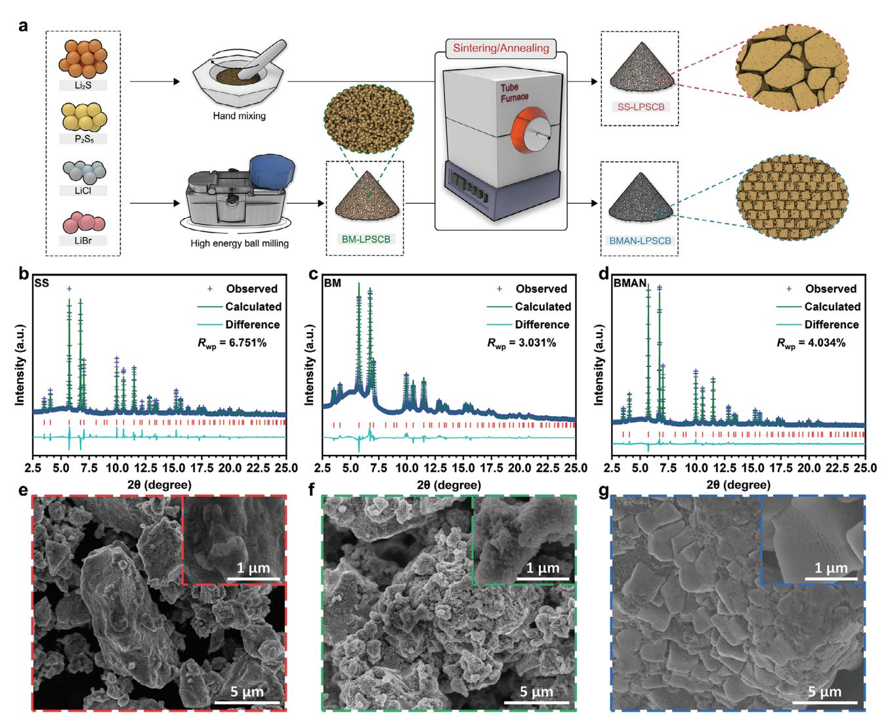
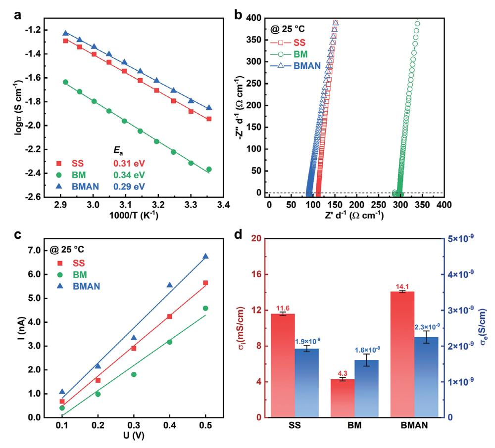
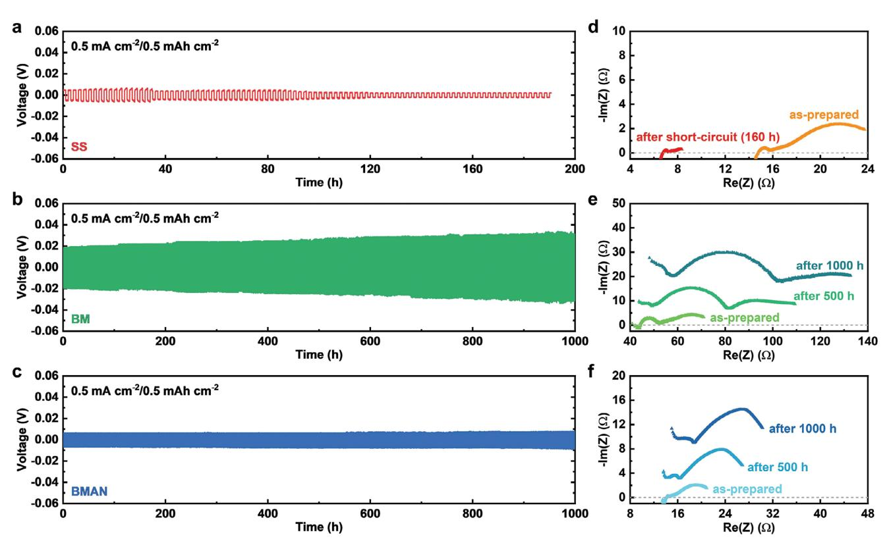
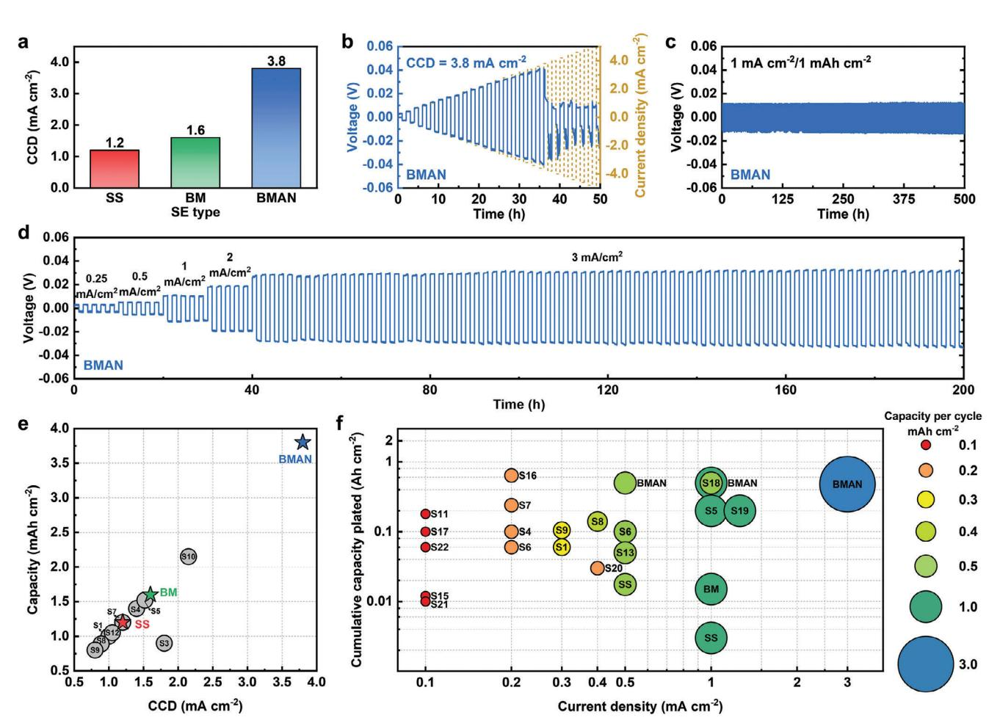
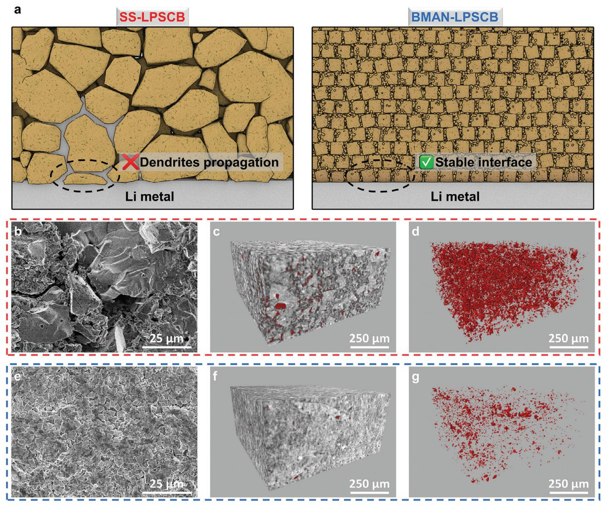
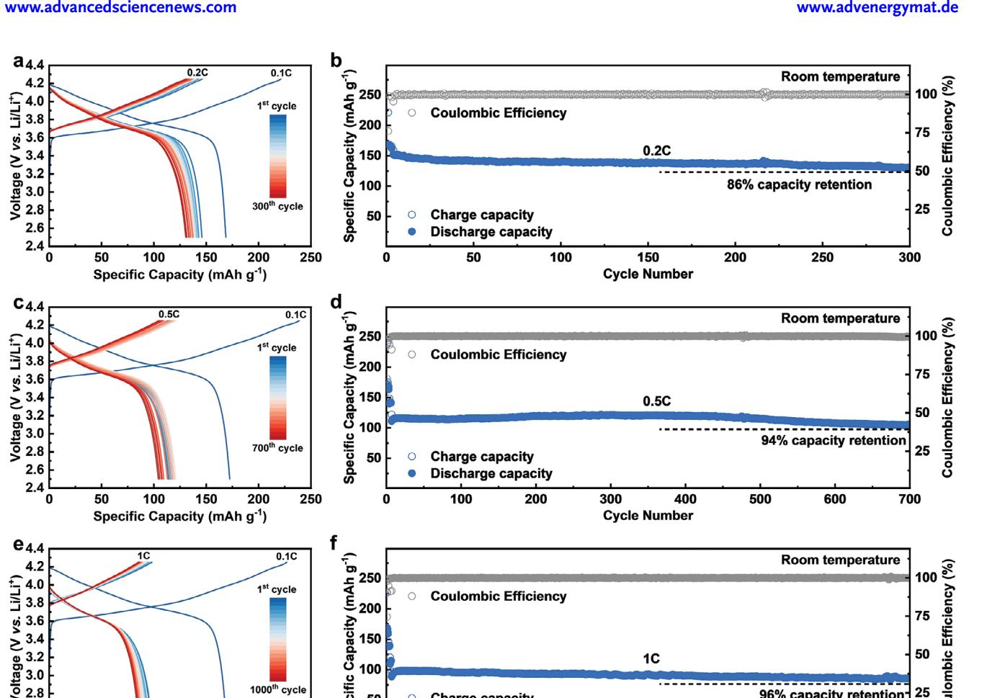

# **Inhibiting Dendrites by Uniformizing Microstructure of Superionic Lithium Argyrodites for All-Solid-State Lithium Metal Batteries**

*Yu Liu, Han Su, Yu Zhong,\* Matthew Zheng, Yang Hu, Feipeng Zhao, Jung Tae Kim, Yingjie Gao, Jing Luo, Xiaoting Lin, Jiangping Tu,\* and Xueliang Sun\**

**The all-solid-state lithium metal battery is considered the next-generation energy storage device with the potential to double the energy density of state-of-the-art Li-ion batteries and eliminate safety hazards. Achieving stable Li plating/stripping without dendrite propagation within the solid electrolyte is crucial for delivering the promised high energy density. In this study, through the comparison of various synthesis routes, a novel cube-shaped microstructure in the Li5.3PS4.3ClBr0.7 argyrodite electrolyte, synthesized using the high-speed mechanical milling followed by annealing method (BMAN-LPSCB) is identified. The uniform microstructure allows for the production of an electrolyte pellet with significantly reduced porosity through cold pressing. The removal of defects has significantly enhanced the electrolyte's ability to inhibit dendrite formation, with a critical current density reaching 3.8 mA cm−2. The lithium symmetric cell with BMAN-LPSCB electrolyte exhibits stable Li plating/stripping for over 150 h at a high current density and cutoff capacity of 3 mA cm−2 / 3 mAh cm−2. The all-solid-state Li/NCM battery utilizing the BMAN-LPSCB electrolyte also demonstrates excellent durability, with a capacity retention of 96% over 1000 cycles at a 1C rate. This study emphasizes that the microstructure of the sulfide electrolyte is a critical factor influencing mechanically-driven Li dendrite propagation in all-solid-state batteries.**

utilizing a Li metal anode and a layered oxide or conversion cathode with the potential to double the energy density of current commercial Li-ion batteries (LIBs).[\[1\]](#page-8-0) Eliminating flammable liquid electrolytes can also intrinsically address the safety concerns associated with LIBs.[\[2\]](#page-8-0) As the most fundamental component of ASSLMBs, solid electrolyte (SE) materials have undergone intensive study in the past decade, resulting in the discovery of numerous families with high ionic conductivity, including oxides,[\[3\]](#page-8-0) sulfides,[\[4\]](#page-8-0) halides,[\[5\]](#page-9-0) nitrides,[\[6\]](#page-9-0) and organic SEs.[\[7\]](#page-9-0) The exceptional ionic conductivity that is comparable to liquid electrolytes, and the good processability of sulfide SE have distinguished it as the most promising type of SE.[\[4a,8\]](#page-8-0) Specifically, lithium argyrodites Li6PS5X (X = Cl, Br, I) have emerged as a popular family of sulfide SE due to their highly ionic conductivity (*>* 10 mS cm−1), cost-effectiveness, and relative stability to lithium metal.[\[9\]](#page-9-0) The origin of Li argyrodites dates

#### **1. Introduction**

All-solid-state lithium metal batteries (ASSLMBs) are anticipated to be the most promising next-generation battery system,

Y. Liu, H. Su, M. Zheng, Y. Hu, F. Zhao, J. T. Kim, Y. Gao, J. Luo, X. Lin, X. Sun

Department of Mechanical and Materials Engineering University of Western Ontario London, Ontario N6A 5B9, Canada E-mail: [xsun9@uwo.ca](mailto:xsun9@uwo.ca)

The ORCID identification number(s) for the author(s) of this article can be found under <https://doi.org/10.1002/aenm.202400783>

© 2024 The Author(s). Advanced Energy Materials published by Wiley-VCH GmbH. This is an open access article under the terms of the [Creative Commons Attribution-NonCommercial-NoDerivs](http://creativecommons.org/licenses/by-nc-nd/4.0/) License, which permits use and distribution in any medium, provided the original work is properly cited, the use is non-commercial and no modifications or adaptations are made.

#### **DOI: 10.1002/aenm.202400783**

back to 2008 when Deiseroth et al. synthesized Li6PS5Cl with an ionic conductivity exceeding 10−3 S cm−1. [\[10\]](#page-9-0) Subsequently, numerous efforts have been dedicated to optimizing the composition or synthesis process of Li

Y. Liu, H. Su, Y. Zhong, J. Tu State Key Laboratory of Silicon and Advanced Semiconductor Materials Key Laboratory of Advanced Materials and Applications for Batteries of Zhejiang Province School of Materials Science and Engineering Zhejiang University Hangzhou 310027, China E-mail: [yu\\_zhong@zju.edu.cn;](mailto:yu_zhong@zju.edu.cn)[tujp@zju.edu.cn](mailto:tujp@zju.edu.cn) X. Sun Eastern Institute for Advanced Study Eastern Institute of Technology Ningbo, Zhejiang 315020, P.R. China

argyrodites, resulting in the development of argyrodites with ionic conductivities comparable to or even higher than that of liquid electrolytes. Examples include Li5.5PS4.5Cl1.5 (9.4 mS cm−1),[\[11\]](#page-9-0) Li5.3PS4.3Cl1.7 (17 mS cm−1),[\[12\]](#page-9-0) Li5.3PS4.3Br1.7 (11 mS cm−1),[\[13\]](#page-9-0) and Li5.3PS4.3ClBr0.7 (24 mS cm−1).[\[14\]](#page-9-0) The remarkable ionic conductivities of these argyrodites are attributed to the increased halide/sulfide disorder in the lattice forced by excess halide content, which significantly promotes Li-ion diffusion.[\[15\]](#page-9-0) Various solid-phase synthesis methods are proven effective in the synthesis of Li argyrodites, including solid-state sintering,[\[16\]](#page-9-0) mechanical milling,[\[17\]](#page-9-0) and mechanical milling followed by annealing.[\[18\]](#page-9-0) However, previous comparisons between different synthesis routes primarily aimed for higher ionic conductivity. For instance, Zhang et al. found that the Li6PS5X electrolytes synthesized by solid-state sintering exhibited much higher Li+ conductivities than those obtained by mechanical milling.[\[19\]](#page-9-0) The impact of synthesis routes on other important features of Li argyrodites such as microstructure morphology and electrochemical performance remains unclear.

Moreover, it is paramount to employ a Li metal anode to fulfill the high energy density of ASSLMBs as promised.[\[20\]](#page-9-0) In comparison to Li10GeP2S12, which undergoes continuous decomposition upon contact with Li metal,[\[21\]](#page-9-0) Li argyrodites exhibit a metastable interface with lithium; however, short circuits are still unavoidable in Li symmetric cells.[\[22\]](#page-9-0) While the majority of the previous efforts sought to improve the ion transport and electrochemical stability of sulfide SEs,[\[23\]](#page-9-0) the most common failure in ASSLMBs is driven by mechanical factors.[\[24\]](#page-9-0) Most theoretical treatments of Li-induced failure depict lithium dendrites propagating from the Li–SE interface toward the bulk of the SE.[\[25\]](#page-9-0) However, recent studies have demonstrated that the initiation of Li deposition occurs in subsurface pores inside the SE due to electronic conductivity.[\[26\]](#page-9-0) Further deposition of Li in the already occupied defects will build up pressure that leads to electrolyte fracture, which will ultimately result in battery shorting.[\[27\]](#page-9-0) Thus, reducing pore size and minimizing the population of pores in SEs will enhance the critical current for dendrite initiation.

In this study, we investigated and compared the crystal structure, conductivity, microstructure morphology, and electrochemical performance of the Li argyrodite electrolyte Li5.3PS4.3ClBr0.7 (LPSCB) synthesized via three different routes (solid-state sintering, mechanical milling, and mechanical milling followed by annealing). The LPSCB synthesized using mechanical milling followed by the annealing method (BMAN-LPSCB) exhibits the highest ionic conductivity and the most uniform microstructure morphology. Cross-sectional scanning electron microscope (SEM) and synchrotron X-ray computed tomography (XCT) revealed that this uniform microstructure morphology can significantly reduce the number of pores in the cold-pressed pellet, which effectively inhibits Li dendrites initiation. The BMAN-LPSCB achieves an outstanding critical current density (CCD) of 3.8 mA cm−2 along with excellent long cycling life in ASSLMB (capacity retention of 96% after 1000 cycles at a 1C rate).

#### **2. Results and Discussion**

**Figure [1](#page-2-0)**a illustrates the three synthesis routes employed in this study to synthesize various types of Li5.3PS4.3ClBr0.7 (LPSCB) argyrodite electrolytes. For the LPSCB synthesized by solid-state sintering (referred to as SS-LPSCB), the starting materials were first mixed by hand in a mortar. Then the mixture underwent vacuum sintering to produce the crystallized product. The ballmilled LPSCB (referred to as BM-LPSCB) was synthesized by mechanically ball-milling the starting materials at a high speed of 750 rpm. The LPSCB synthesized by mechanical milling followed by annealing (referred to as BMAN-LPSCB) were prepared through the subsequent annealing of the BM-LPSCB. The phase and structure of the solid electrolytes were first verified through laboratory XRD and Raman spectroscopy (Figure S1, Supporting Information). All three electrolytes exclusively display peaks associated with the cubic phase of argyrodite, with no trace of impurities detected, while the hand-mixed electrolyte before sintering demonstrates obvious peaks belonging to starting materials (Figure S1a, Supporting Information). Although the XRD patterns of SS-LPSCB and BMAN-LPSCB are identical, those of BM-LPSCB exhibit weaker and broader peaks, indicating that the crystallinity is relatively low.[\[17b,28\]](#page-9-0) Unlike XRD results, all electrolytes exhibit the same characteristic in Raman spectra, with the main peak near 425 cm−1 that can be assigned to PS4 3– tetrahedra. This result further confirms that the pure argyrodite phase has been successfully synthesized despite the routes being different. Synchrotron-based XRD was conducted on all samples to gain a more detailed insight into the crystallographic information of the synthesized electrolytes. Synchrotron-XRD patterns along with their corresponding Rietveld refinement fitting results are shown in Figure [1b–d.](#page-2-0) Low values of the weighted residual (*R*wp) from the least-squares refinement indicate that the fitting results are convincing for all three electrolytes. As shown in Figure [1b,d,](#page-2-0) both SS-LPSCB and BMAN-LPSCB consist of a highly crystallized pure argyrodite phase, indicating that, regardless of the mixing of starting materials, a single phase of argyrodite can be synthesized by the sintering/annealing process. Owing to the high intensity and sensitivity of synchrotron X-ray, the s-XRD pattern of BM-LPSCB (Figure [1c\)](#page-2-0) exhibits much higher spectral resolution than conventional XRD, once again confirming slightly lower crystallinity compared to the sintered/annealed ones. Nevertheless, no impurities can be identified in any of the three electrolytes even under high-intensity synchrotron X-ray, demonstrating the effectiveness of all three synthesis routes in this study. Based on additional detailed crystallographic information summarized in Tables S1-S3 (Supporting Information), all three electrolytes share the same crystal structure. However, SEM photos of the electrolyte powder (Figure [1e–g\)](#page-2-0) have revealed distinct microstructure morphology among these electrolytes. SS-LPSCB (Figure [1e\)](#page-2-0) consists of particles with random shape and size ranging from 1 μm to over 15 μm. This could be resulted from the composition undulation in the mixture introduced by hand mixing, which triggered a rather random crystallization during the subsequent sintering process. EDS mapping of the hand-mixed starting materials of LPSCB electrolyte shown in Figure S2 (Supporting Information) further confirms that manual mixing processes cannot achieve an ideal uniformity in elemental distribution as compared to ball-milling. On the other hand, BM-LPSCB has a more uniform morphology of secondary particles aggregated by nano-sized primary particles (Figure [1f\)](#page-2-0), which is similar to other reported Li argyrodite glass-ceramic electrolytes directly synthesized by ball milling. The repeated

**Figure 1.** a) Schematic diagram illustrating the three synthesis routes of Li argyrodite electrolytes employed in this study. b–d) Synchrotron XRD patterns and the corresponding Rietveld refinement result for SS-LPSCB, BM-LPSCB, and BMAN-LPSCB. e–g) SEM images of SS-LPSCB, BM-LPSCB, and BMAN-LPSCB powders showing distinct microstructure morphology.

energy input during the ball milling process has promoted the homogenization of composition as well as a considerable amount of nanocrystalline nucleation. Surprisingly, after annealing, the nanocrystallites in BM-LPSCB have grown into cubes with a side length of ≈2 μm (Figure 1g). To the best of our knowledge, this is the first report of a Li argyrodite electrolyte with a cubeshaped microstructure morphology. It is deduced that a process similar to grain growth occurred during annealing, where grain boundaries between nanocrystallites were eliminated and several small nanocrystallites grew into one large cubic phase argyrodite crystallite.

Potentiostatic electrochemical impedance spectroscopy (PEIS) was used to determine both the ionic conductivities and the activation energies for Li-ion transport in all three electrolytes. The electrolyte pellets for testing were obtained by cold pressing the powder in a mold. **Figure [2](#page-3-0)**a displays the Arrhenius plots, and Figure [2b](#page-3-0) shows the Nyquist plots at 25 °C for the electrolytes synthesized via different routes. The values of room temperature ionic conductivities () are provided in Figure [2d.](#page-3-0) The BM-LPSCB exhibits an ionic conductivity () of 4.3 ± 0.2 mS cm−1, which is significantly higher than that of any glass-ceramic-type argyrodite electrolyte directly synthesized by ball milling. Both sintered/annealed electrolytes exhibit even higher ionic conductivities exceeding 10 mS cm−1 due to increased crystallinity. The exceptionally high ionic conductivity of this type of argyrodite electrolyte is attributed to the S2−/Cl−/Br− disorder in the lattice.[\[14\]](#page-9-0) Particularly, BMAN-LPSCB has a higher of 14.1 ± 0.1 mS cm−1 compared to SS-LPSCB (11.6 ± 0.2 mS cm−1), indicating that the synthesis route does have an influence on the ionic conductivity. The lower ionic conductivity of BM-LPSCB (4.3 ± 0.2 mS cm−1) should stem from the poor crystallinity as well as the abundant grain boundaries among nanocrystallites that hinder Li-ion transport. Given that both SS-LPSCB and BMAN-LPSCB are well crystallized, the differences in microstructure morphology are likely responsible for the variation in ionic conductivity. In the case of

**Figure 2.** a) Arrhenius plots and b) Nyquist plots of LPSCB electrolytes synthesized via different routes, where the real-axis impedance is normalized to the respective pellet thickness for better comparison. c) Current–voltage plot of LPSCB electrolytes synthesized via different routes during room temperature DC polarization test. Electronic conductivities can be calculated by Ohm's law. d) Comparison of room temperature electronic and ionic conductivities of LPSCB electrolytes synthesized via different routes. The standard deviation of ionic conductivities was determined through testing three series of samples, with detailed data summarized in Table S4 (Supporting Information). The standard deviation of electronic conductivities was derived from the linear fitting results presented in (c).

SS-LPSCB, the randomness in particle size leads to numerous defects such as voids and pores in cold-pressed pellets, which can significantly affect Li-ion conduction. Conversely, the uniformly sized cube-shaped grains in BMAN-LPSCB help form a denser pellet by cold pressing (further discussed later in the article). Moreover, Li-ion conduction is also accelerated in the cubic grains due to the elimination of boundaries. These factors have contributed to enhancing the ionic conductivity of BMAN-LPSCB to 14.1 ± 0.1 mS cm−1, making it one of the highest among coldpressed sulfide electrolytes. The activation energies for Li-ion conduction in SS-, BM-, and BMAN-LPSCB are 0.31, 0.34, and 0.29 eV, respectively, which are calculated from the slope of Arrhenius plots in Figure 2a. The Nyquist plots of these electrolytes under various temperatures are summarized in Figure S3a–c (Supporting Information). The DC polarization method was employed to determine the electronic conductivities of the argyrodite electrolytes. Figure 2c depicts the current-voltage plots of all three LPSCB electrolytes, and the electronic conductivities calculated by Ohm's Law are presented alongside the ionic conductivity values in Figure 2d. Although a positive correlation can be observed between the electronic and ionic conductivities of these LPSCB electrolytes, the difference in electronic conductivities is negligible. The DC polarization curves under stepwise voltages for LPSCB electrolytes are displayed in Figure S3d–e (Supporting Information).

Li symmetric cells were assembled with all three electrolytes to evaluate their stability against Li. Long-term Li plating/stripping tests under a moderate current density and cut-off capacity of 0.5 mA cm−2 / 0.5 mAh cm−2 were first performed. As shown in **Figure 3**[a,](#page-4-0) SS-LPSCB started with a low overpotential of 5 mV at the early stage of the cycling owing to its high ionic conductivity. However, the onset of a short circuit, as indicated by a voltage drop, occurred after only 35 h. The short circuit failure is further confirmed by the post-mortem EIS of the Li symmetric cell shown in Figure [3d,](#page-4-0) since the overall resistance of the cell drastically decreased after cycling. The Li|BM-LPSCB|Li cell cycled for 1000 h without a short circuit (Figure [3b\)](#page-4-0). Nevertheless, its overpotential gradually increased from 18 to 29 mV during the cycling. The evolution of EIS plots during cycling shown in Figure [3e](#page-4-0) suggests that the interfacial resistance of the Li|BM-LPSCB|Li cell keeps growing larger. BMAN-LPSCB delivered the best Li plating/stripping performance, with the overpotential in

**Figure 3.** Voltage-time profiles of Li-Li symmetric cells with a) SS-LPSCB, b) BM-LPSCB and c) BMAN-LPSCB electrolytes cycled under a constant current density and cut-off capacity of 0.5 mA cm−2 / 0.5 mAh cm−2 at room temperature. d–f) Evolution of Nyquist plots of Li-Li symmetric cells using corresponding electrolytes during cycling.

Figure 3c remaining nearly constant throughout 1000 h of cycling under the same conditions. The stability of this cell is further confirmed by the EIS plots shown in Figure 3f.

To better verify the difference of dendrite inhibiting capability between these LPSCB electrolytes, symmetric cells were subjected to step-increased current densities to evaluate their critical current densities (CCD). Results are compared in **Figure 4**[a.](#page-5-0) The CCD of SS-LPSCB and BM-LPSCB are 1.2 and 1.6 mA cm−2, respectively. In particular, BMAN-LPSCB stands out with an exceptionally high CCD of 3.8 mA cm−2. This value is more than three times greater than that of SS-LPSCB, despite their comparable ionic conductivities. The voltage profile acquired during the CCD test for BMAN-LPSCB is shown in Figure [4b,](#page-5-0) while the profiles for SS- and BM-LPSCB are plotted in Figure S4 (Supporting Information) in the Supporting Information. In fact, the CCD of 3.8 mA cm−2 is one of the most outstanding among all reported sulfide electrolytes, of which both the current density and cutoff capacity were summarized and compared in Figure [4e](#page-5-0) and Table S6 (Supporting Information). The difference in stability against Li becomes more significant when the current density and cut-off capacity of the long-term Li plating/stripping test are increased to 1 mA cm−2 / 1 mAh cm−2. While Li|BMAN-LPSCB|Li cell can stably function for over 500 h (Figure [4c\)](#page-5-0), short circuit occurred after only 3 h and 15 h of cycling in SS- and BM-LPSCB, as indicated by the sudden drop of overpotential shown in Figure S5 (Supporting Information). Since BMAN-LPSCB has such a high CCD, it was submitted to a Li symmetric cell long cycling test with even more stringent conditions, of which the voltage profile is demonstrated in Figure [4d.](#page-5-0) Remarkably, it withstood cycling under 3 mA cm−2 / 3 mAh cm−2 for over 150 h, which is a condition close to practical application standards. The credibility of the stable voltage profile is further supported by the EIS plots of Li symmetric cells before and after cycling, which are summarized in Figure S6 (Supporting Information). As both Li|SS-LPSCB|Li and Li|BM-LPSCB|Li is shorted because the imaginary part of the impedance disappeared and the real part decreased to near zero, the EIS plot of Li|BMAN-LPSCB|Li stayed intact after cycling despite a slightly increased overall impedance. Figure [4f](#page-5-0) compares the reported Li symmetric cell performances of sulfide Ses using bare Li metal as electrodes, highlighting the superior stability against Li of the BMAN-LPSCB in this work.

Considering that the chemical composition and the crystal structure of SS- and BMAN-LPSCB are the same, and both their ionic and electronic conductivities are similar, the significant difference in their stability against lithium remains puzzling. As mentioned earlier, it is proposed that the microstructure morphology of electrolyte will influence the quality of the pellets prepared by cold pressing. The schematic illustration in **Figure [5](#page-6-0)**a depicts the effect of the microstructure morphology of LPSCB electrolytes on the capability to inhibit Li dendrites. Particles of random sizes in SS-LPSCB will result in numerous volume defects such as voids and pores in cold-pressed pellets, where

**Figure 4.** a) Critical current densities of LPSCB electrolytes prepared via different routes. b) Galvanostatic cycling of Li–Li symmetric cells with BMAN-LPSCB electrolyte at step-increased current densities with a step size of 0.2 mA cm−2 at room temperature. Voltage-time profiles of Li-Li symmetric cells with BMAN-LPSCB electrolyte cycled under c) 1 mA cm−2 / 1 mAh cm−2, d) increasing current densities and capacities at room temperature. e) Summary of reported critical current densities and corresponding cutoff capacities of sulfide SEs. Star marks indicate the values of electrolytes in this work. f) Summary of reported Li–Li symmetric cell performances using sulfide SEs. The size of circle indicates the cutoff capacity per cycle.

Li dendrites can easily initiate and penetrate during cycling. In contrast, the uniformly sized cube-shaped grains in BMAN-LPSCB can be pressed into a denser pellet that inhibits dendrite growth better. This assumption is supported by the crosssectional SEM images of SS- and BMAN-LPSCB cold-pressed pellets shown in Figure [5b,](#page-6-0) Figures S7a,b and S5c (Supporting Information). Large cracks and pores are present inside the SS-LPSCB pellet, while no obvious defects are found in the BMAN-LPSCB pellet. SEM images with lower magnification, as well as images of the BM-LPSCB pellet, are included in Figure S8 (Supporting Information). Some cracks in the BM-LPSCB pellet place its quality between that of SS-LPSCB and BMAN-LPSCB, explaining why BM-LPSCB exhibits symmetric cell performance better than SS-LPSCB but poorer than BMAN-LPSCB. To quantitively determine the porosity, we measured and calculated the relative densities of these cold-pressed pellets, and the results are shown in Table S5 (Supporting Information). As expected, the relative density of SS-LPSCB is only 80.2%, while those of BMand BMAN-LPSCB are 85.2% and 89.5%, respectively. This result

aligns well with the observations from the cross-sectional SEM images of the pellets. Furthermore, we utilized synchrotron XCT to detect the pores inside SS- and BMAN-LPSCB pellets for better visualization and comparison. The result once again demonstrates that more pores exist in SS-LPSCB than in BMAN-LPSCB (see Figure [5d,e,f,g\)](#page-6-0). Post-mortem cross-sectional SEM images of the cycled Li/electrolyte interface (Figure S9, Supporting Information) further confirm how the porosity of the electrolyte pellet affects short-circuit failure. The intrusion of lithium dendrites into the electrolyte was clearly observed at the Li/SS-LPSCB interface, whereas the Li/BMAN-LPSCB interface remained intact. Our experimental analysis has revealed that the uniform and cube-shaped microstructure morphology of BMAN-LPSCB has led to a denser pellet after cold pressing, which not only promotes Li-ion conduction to some extent but also greatly inhibits dendrites initiation. The huge difference in the Li symmetric cell performance of these LPSCB electrolytes also emphasizes that the majority of failures in ASSLMBs are related to mechanics.

**Figure 5.** a) Schematic of the Li/electrolyte interface with SS-LPSCB and BMAN-LPSCB. b) Cross-sectional SEM image of SS-LPSCB cold-pressed pellet. 3D volume rendered images from the synchrotron XCT of c) SS-LPSCB cold-pressed pellet with inside voids and d) voids only. e) Cross-sectional SEM image of BMAN-LPSCB cold-pressed pellet. 3D volume rendered images from the synchrotron XCT of f) BMAN-LPSCB cold-pressed pellet with inside voids and g) voids only. In 3D rendered images, grey represents the electrolyte part while red represents the voids.

Owing to its enhanced ionic conductivity and the reduced defects in cold-pressed pellets, BMAN-LPSCB has enabled prolonged cycling performances of Li/NCM all-solid-state lithium metal batteries (ASSLMBs) under various C-rates at room temperature. BMAN-LPSCB is used as both the solid electrolyte layer and the solid electrolyte component in the composite cathode. For cells tested under different C-rates, the initial cycles were performed in C-rates that increased every three cycles from 0.1C (0.16 mA cm−2) to the target rate. While cycling under a low rate of 0.2C (0.32 mA cm−2), the overlapped charge-discharge curves throughout cycling in **Figure [6](#page-7-0)**a indicate the stable electrochemical behavior of the cell. As shown in Figure [6b,](#page-7-0) the cell delivered an initial discharge capacity of 152 mAh g−1 and maintained 86% of the capacity after 300 cycles. The average Coulombic efficiency reaches as high as 99.9%, indicating that the Li/BMAN-LPSCB interface is stable and dendrite-free. Under a moderate current density of 0.5C (0.8 mA cm−2), chargedischarge curves in Figure [6c](#page-7-0) still demonstrate good reversibility, despite an increased polarization caused by the elevated current density. As depicted in Figure [6d,](#page-7-0) the cell exhibits an initial discharge capacity of 111.4 mAh g−1 under 0.5C, together with a capacity retention of 94% after 700 cycles. Moreover, when the current density was increased to 1 C (1.6 mA cm−2), a remarkable capacity retention of 96% after 1000 cycles can be achieved for the Li/BMAN-LPSCB/NCM ASSLMB (Figure [6e,f\)](#page-7-0). Likewise, the average Coulombic efficiency under 0.5C and 1C are 99.92% and 99.95%, respectively. The durable long cycling performance under high rates presented by the ASSLMB with BMAN-LPSCB electrolyte further proves that a solid electrolyte pellet with less porosity can endure higher current densities, thus facilitating a more stable Li metal/electrolyte interface during cycling.

**Figure 6.** The electrochemical performance of Li|BMAN-LPSCB|NCM83 ASSLMBs operating between 2.5–4.25 V at room temperature. a) The chargedischarge curves of the first cycle at 0.1C (0.16 mA cm−2) and the following cycles at 0.2C (0.32 mA cm−2). b) The long cycling stability performance at 0.2C rate. c) The charge-discharge curves of the first cycle at 0.1C and the following cycles at 0.5C (0.8 mA cm−2). d) The long cycling stability performance at 0.5C rate. e) The charge-discharge curves of the first cycle at 0.1C and the following cycles at 1C. f) The long cycling stability performance at 1C (1.6 mA cm−2) rate.

#### **3. Conclusion**

In summary, the impact of synthesis routes on the crystal structure, microstructure morphology, ionic/electronic conductivity, and electrochemical performance of Li argyrodite electrolyte Li5.3PS4.3ClBr0.7 was investigated. Either solid-state sintering, high-speed mechanical milling or high-speed mechanical milling followed by annealing can successfully synthesize purephase LPSCB with the same crystal structure. However, different synthesis routes do have a significant impact on the microstructure morphology of the argyrodite electrolyte, which is proved to eventually lead to contrasting electrochemical performance. Well-crystallized SS-LPSCB electrolytes with random particle sizes can be synthesized by directly sintering the hand-mixed starting materials. High-speed mechanical milling can synthesize partially crystallized glass-ceramic BM-LPSCB that contains nanocrystallites, which will grow into unique cube-shaped crystallites with a side length of ∼2 μm during the post-annealing process (BMAN-LPSCB). As confirmed by both cross-sectional SEM images and synchrotron XCT visualization, the randomness of particle size of SS-LPSCB can lead to numerous pores and cracks in the cold-pressed pellet, while BMAN-LPSCB with a uniform cube-shaped microstructure morphology can form a denser pellet with less porosity. The elimination of volume defects inside the BMAN-LPSCB pellet can lead to not only a boosted coldpressed ionic conductivity of 14.1 ± 0.1 mS cm−1 but also a superior Li dendrites inhibiting capability. The Li|BMAN-LPSCB|Li cell can perform Li plating/stripping stably under extreme current density and cutoff capacity of 3 mA cm−2 / 3 mAh cm−2 over 150 h. The all-solid-state lithium metal battery with BMAN-LPSCB as electrolyte layer achieves a remarkable capacity retention of 96% after 1000 cycles under 1C rate. While most of the previous research focused on enhancing the conductivity or electrochemical stability of sulfide electrolytes, this work has brought new perspectives that the microstructure morphology of sulfide electrolytes, which can be affected by synthesis

protocals, plays a critical role in the mechanical failure of all-solidstate batteries.

### **4. Experimental Section**

*Solid Electrolyte Synthesis*: Three different types of Li5.3PS4.3ClBr0.7 (LPSCB) solid electrolytes in this work were prepared via three different routes. For the solid-state sintering method, stoichiometric Li2S (99.98%, Alfa Aesar), P2S5 (99.9%, Alfa Aesar), LiCl (99.9%, anhydrous, Sigma-Aldrich), and LiBr (99.9%, anhydrous, Alfa Aesar) were placed in a mortar and mixed by hand using a pestle for 30 min. The powder mixture was then pressed into pellets under 240 MPa and submitted to sintering at 450 °C for 5 h in a vacuum to yield the SS-LPSCB. The BM-LPSCB was synthesized by mechanical ball-milling the same starting materials at 750 rpm for 10 h using a PULVERISETTE 7 premium line ball-milling apparatus (Fritsch). To be specific, 1 g of stoichiometric Li2S, P2S, LiCl, and LiBr were placed in a 45 mL zirconia pot with 25 zirconia balls (5 mm in diameter). The as-milled powder obtained from the ball milling process (BM-LPSCB) was further pressed into pellets under 240 MPa and annealed at 450 °C for 5 h in a vacuum to yield the BMAN-LPSCB electrolyte. All processes were conducted in an argon-filled glove box with O2 and H2O *<* 0.1 ppm.

*Characterization Methods*: Lab-based powder X-ray diffraction (XRD) was measured on Bruker AXS D8 Advance instrument with Cu K radiation ( = 1.5406 Å) in a 2 range from 10° to 90°. Powders were kept in a zero-background sample holder covered by Kapton film to avoid air and moisture exposure during XRD pattern collecting. Synchrotron-based XRD pattern was collected using the Brockhouse X-ray Diffraction and Scattering (BXDS) beamlines at the Canadian Light Source (CLS) with a wavelength of 0.3497 Å. The samples were loaded into 0.8 mm inner diameter polyimide capillaries and sealed with epoxy in an Ar-filled glove box. Rietveld refinement of synchrotron-XRD data was carried out using the GSAS-II program.[\[29\]](#page-9-0)

Raman spectra were measured on a HORIBA Scientific LabRAM HR Raman spectrometer operated under a laser beam at 532 nm. A powder of sulfide electrolytes was attached to a carbon tape and covered by a transparent cover glass for the test. Scanning electron microscope (SEM) images were captured by a Hitachi S-4800 field-emission scanning electron microscope (FE-SEM, acceleration voltage 5 kV) equipped with energy dispersive spectroscopy (EDS).

Synchrotron X-ray computed tomography was carried out at the Biomedical Imaging and Therapy Facility (BMIT) 05B1-1 beamline at the Canadian Light Source (CLS). The tomogram was captured at a monochromatic beam energy of 55 keV with a voxel size of 1.44 μm. The distance between the sample and the detector was set to 0.06 m.

*Ionic and Electronic Conductivity Test*: For the ionic and electronic conductivity test, solid electrolyte powders were pressed into pellets in model cells under ≈360 MPa for 2 min using two stainless-steel rods as blocking electrodes. Carbon black of 5 mg was evenly spread on both sides of the electrolyte pellet to ensure good contact. Ionic conductivity of the electrolyte was calculated by measuring the bulk resistance of the electrolyte pellet using potentiostatic electrochemical impedance spectroscopy (PEIS) on a versatile multichannel potentialstation 3/Z (BioLogic VMP3), in the frequency range of 7 MHz to 100 mHz with an amplitude of 20 mV. The measurements were carried out at temperatures between 25 to 70 °C. The electronic conductivity of solid electrolytes was determined by the DC polarization method. The applied voltage was varied from 0.1 to 0.5 V in increments of 0.1 V, and each voltage step had a lapse time of 5000 s.

*Cell Assembly and Electrochemical Measurements—Li-Li Symmetric Cells*: Electrolyte powder of 150 mg was pressed under 360 MPa for 2 min. Then two pieces of lithium metal were pressed onto both sides of the electrolyte layer under 50 MPa for 1 min. An external pressure of 20 MPa was applied during testing. Critical current density (CCD) test and longtime Li plating/stripping measurements at different current densities under room temperature were conducted on LAND-CT3001A battery test systems (Wuhan Rambo Testing Equipment Co., Ltd.). Electrochemical impedance spectroscopy (EIS) of the Li-Li symmetric cells before and after cycling was conducted using a versatile multichannel potentialstation 3/Z (BioLogic VMP3) within the frequency range of 7 to 100 MHz and an amplitude of 20 mV.

*Cell Assembly and Electrochemical Measurements—Li-NCM ASSLMBs*: Composite cathode was prepared by hand mixing Zr-F dual doped LiNi0.83Co0.12Mn0.05O2 (NCM83) cathode and BMAN-LPSCB electrolyte (mass ratio = 7: 3) in a mortar for 30 min. The preparation of Zr–F dual doped NCM83 cathode can be found in author's previous work.[\[30\]](#page-9-0) ASSLMBs were assembled in a ceramic model cell with a diameter of 10 mm. First, 120 mg of electrolyte powder was pressed under 360 MPa for 2 min to form an electrolyte layer. Then 10 mg of the composite cathode (corresponding to mass loading of 8.92 mg cm−2) was uniformly spread on one side of the electrolyte layer and pressed under 360 MPa for 3 min. Finally, a Li metal foil of 100 μm was attached on the anode side and further pressed under 50 MPa for 1 min. The three-layer pellet cell was sandwiched between two stainless-steel rods as current collectors and sealed in the model cell. An external pressure of 20 MPa was applied during testing. Galvanostatic charge–discharge tests were performed on a NEWARE CT-4008 battery test system in a voltage range of 2.5–4.25 V versus Li/Li+ under different rates at room temperature.

# **Supporting Information**

Supporting Information is available from the Wiley Online Library or from the author.

#### **Acknowledgements**

Y. L., H. S.u contributed equally to this work. This research was supported by the University of Western Ontario (UWO), the National Natural Science Foundation of China (No. U20A20126, 51971201), the Key Research and Development Program of Zhejiang Province (2021C01175), and the Program of China Scholarship Council (Grant No. 202206320221).

### **Conflict of Interest**

The authors declare no conflict of interest.

# **Data Availability Statement**

Research data are not shared.

#### **Keywords**

all-solid-state battery, argyrodite electrolyte, lithium dendrites, mechanical failure, microstructure

> Received: February 19, 2024 Revised: May 5, 2024 Published online: May 25, 2024

- [1] P. Albertus, S. Babinec, S. Litzelman, A. Newman, *Nat. Energy* **2018**, *3*, 16.
- [2] Q. Zhao, S. Stalin, C.-Z. Zhao, L. A. Archer, *Nat. Rev. Mater.* **2020**, *5*, 229.
- [3] Q. Liu, Z. Geng, C. Han, Y. Fu, S. Li, Y.-b. He, F. Kang, B. Li, *J. Power Sources* **2018**, *389*, 120.

- [4] a) N. Kamaya, K. Homma, Y. Yamakawa, M. Hirayama, R. Kanno, M. Yonemura, T. Kamiyama, Y. Kato, S. Hama, K. Kawamoto, A. Mitsui, *Nat. Mater.* **2011**, *10*, 682; b) Y. Liu, H. Su, Y. Zhong, X. L. Wang, X. H. Xia, C. D. Gu, J. P. Tu, *Adv. Funct. Mater.* **2022**, *32*, 2207978; c) H. Su, Z. Jiang, Y. Liu, J. R. Li, C. D. Gu, X. L. Wang, X. H. Xia, J. P. Tu, *Energy Mater* **2022**, *2*, 200005; d) J. Liang, X. Li, C. Wang, J. T. Kim, R. Yang, J. Wang, X. Sun, *Energy Mater. Adv.* **2023**, *4*, 0021.
- [5] a) X. Li, J. Liang, N. Chen, J. Luo, K. R. Adair, C. Wang, M. N. Banis, T. K. Sham, L. Zhang, S. Zhao, S. Lu, H. Huang, R. Li, X. Sun, *Angew. Chem., Int. Ed.* **2019**, *58*, 16427; b) L. Zhou, T.-T. Zuo, C. Y. Kwok, S. Y. Kim, A. Assoud, Q. Zhang, J. Janek, L. F. Nazar, *Nat. Energy* **2022**, *7*, 83; c) K. Tuo, C. Sun, S. Liu, *Electrochem. Energy Rev.* **2023**, *6*, 17; d) S. Chen, C. Yu, C. Wei, Z. Jiang, Z. Zhang, L. Peng, S. Cheng, J. Xie, *Energy Mater. Adv.* **2023**, *4*, 0019; e) J. Shi, Z. Yao, J. Xiang, C. Cai, F. Tu, Y. Zhang, W. Yao, Q. Jia, Y. Zhou, S. Shen, Y. Yang, *ACS Sustainable Chem. Eng.* **2009**, *12*, 2024.
- [6] a) T. Lapp, S. Skaarup, A. Hooper, *Solid State Ionics* **1983**, *11*, 97; b) W. Li, M. Li, P.-H. Chien, S. Wang, C. Yu, G. King, Y. Hu, Q. Xiao, M. Shakouri, R. Feng, B. Fu, H. Abdolvand, A. Fraser, R. Li, Y. Huang, J. Liu, Y. Mo, T.-K. Sham, X. Sun, *Sci. Adv.* **2023**, *9*, eadh4626.
- [7] a) Z. G. Xue, D. He, X. L. Xie, *J. Mater. Chem. A* **2015**, *3*, 19218; b) X. Su, X.-P. Xu, Z.-Q. Ji, J. Wu, F. Ma, L.-Z. Fan, *Electrochem. Energy Rev.* **2024**, *7*, 2.
- [8] a) Y. Kato, S. Hori, T. Saito, K. Suzuki, M. Hirayama, A. Mitsui, M. Yonemura, H. Iba, R. Kanno, *Nat. Energy* **2016**, *1*, 16030; b) R. Guo, K. Zhang, W. Zhao, Z. Hu, S. Li, Y. Zhong, R. Yang, X. Wang, J. Wang, C. Wu, Y. Bai, *Energy Mater. Adv.* **2023**, *4*, 0022.
- [9] a) C. Yu, F. Zhao, J. Luo, L. Zhang, X. Sun, *Nano Energy* **2021**, *83*, 105858; b) P. Linfeng, C. Yu, C. Wei, C. Liao, S. Chen, L. Zhang, S. Cheng, J. Xie, *Acta Phys. Chim. Sin.* **2022**, *39*, 2211034.
- [10] H. J. Deiseroth, S. T. Kong, H. Eckert, J. Vannahme, C. Reiner, T. Zaiss, M. Schlosser, *Angew. Chem.Int. Ed.* **2008**, *47*, 755.
- [11] P. Adeli, J. D. Bazak, K. H. Park, I. Kochetkov, A. Huq, G. R. Goward, L. F. Nazar, *Angew. Chem., Int. Ed.* **2019**, *58*, 8681.
- [12] X. Feng, P.-H. Chien, Y. Wang, S. Patel, P. Wang, H. Liu, M. Immediato-Scuotto, Y.-Y. Hu, *Energy Storage Mater.* **2020**, *30*, 67.
- [13] P. Wang, H. Liu, S. Patel, X. Feng, P.-H. Chien, Y. Wang, Y.-Y. Hu, *Chem. Mater.* **2020**, *32*, 3833.
- [14] S. V. Patel, S. Banerjee, H. Liu, P. Wang, P.-H. Chien, X. Feng, J. Liu, S. P. Ong, Y.-Y. Hu, *Chem. Mater.* **2021**, *33*, 1435.
- [15] N. J. J. de Klerk, T. Roslon, M. Wagemaker, *Chem. Mater.* **2016**, *28*, 7955.
- [16] a) C. Yu, S. Ganapathy, J. Hageman, L. van Eijck, E. R. H. van Eck, L. Zhang, T. Schwietert, S. Basak, E. M. Kelder, M. Wagemaker, *ACS Appl. Mater. Interfaces* **2018**, *10*, 33296; b) S. Wang, Y. Zhang, X.

Zhang, T. Liu, Y. H. Lin, Y. Shen, L. Li, C. W. Nan, *ACS Appl. Mater. Interfaces* **2018**, *10*, 42279.

- [17] a) S. Boulineau, M. Courty, J.-M. Tarascon, V. Viallet, *Solid State Ionics* **2012**, *221*, 1; b) Y. Liu, H. L. Peng, H. Su, Y. Zhong, X. L. Wang, X. H. Xia, C. D. Gu, J. P. Tu, *Adv. Mater.* **2022**, *34*, 2107346.
- [18] C. Yu, Y. Li, M. Willans, Y. Zhao, K. R. Adair, F. Zhao, W. Li, S. Deng, J. Liang, M. N. Banis, R. Li, H. Huang, L. Zhang, R. Yang, S. Lu, Y. Huang, X. Sun, *Nano Energy* **2020**, *69*, 104396.
- [19] Z. Zhang, L. Zhang, Y. Liu, C. Yu, X. Yan, B. Xu, L. Wang, *J. Alloys Compd.* **2018**, *747*, 227.
- [20] P. Albertus, V. Anandan, C. Ban, N. Balsara, I. Belharouak, J. Buettner-Garrett, Z. Chen, C. Daniel, M. Doeff, N. J. Dudney, B. Dunn, S. J. Harris, S. Herle, E. Herbert, S. Kalnaus, J. A. Libera, D. Lu, S. Martin, B. D. McCloskey, M. T. McDowell, Y. S. Meng, J. Nanda, J. Sakamoto, E. C. Self, S. Tepavcevic, E. Wachsman, C. Wang, A. S. Westover, J. Xiao, T. Yersak, *ACS Energy Lett.* **2021**, *6*, 1399.
- [21] P. Bron, B. Roling, S. Dehnen, *J. Power Sources* **2017**, *352*, 127.
- [22] a) J. Kasemchainan, S. Zekoll, D. S. Jolly, Z. Ning, G. O. Hartley, J. Marrow, P. G. Bruce, *Nat. Mater.* **2019**, *18*, 1105; b) Z. Ning, D. S. Jolly, G. Li, R. De Meyere, S. D. Pu, Y. Chen, J. Kasemchainan, J. Ihli, C. Gong, B. Liu, D. L. R. Melvin, A. Bonnin, O. Magdysyuk, P. Adamson, G. O. Hartley, C. W. Monroe, T. J. Marrow, P. G. Bruce, *Nat. Mater.* **2021**, *20*, 1121; c) Z. Wu, X. Li, C. Zheng, Z. Fan, W. Zhang, H. Huang, Y. Gan, Y. Xia, X. He, X. Tao, J. Zhang, *Electrochem.Energy Rev* **2023**, *6*, 10.
- [23] a) C. Wei, C. Liu, Y. Xiao, Z. Wu, Q. Luo, Z. Jiang, Z. Wang, L. Zhang, S. Cheng, C. Yu, *Adv. Funct. Mater.* **2024**, *34*, 2314306; b) Q. Luo, L. Ming, D. Zhang, C. Wei, Z. Wu, Z. Jiang, C. Liu, S. Liu, K. Cao, L. Zhang, C. Yu, S. Cheng, *Energy Mater. Adv.* **2023**, *4*, 0065.
- [24] S. Kalnaus, N. J. Dudney, A. S. Westover, E. Herbert, S. Hackney, *Science* **2023**, *381*, eabg5998.
- [25] L. Porz, T. Swamy, B. W. Sheldon, D. Rettenwander, T. Frömling, H. L. Thaman, S. Berendts, R. Uecker, W. C. Carter, Y.-M. Chiang, *Adv. Energy Mater.* **2017**, *7*, 1701003.
- [26] a) Q. Tu, T. Shi, S. Chakravarthy, G. Ceder, *Matter* **2021**, *4*, 3248; b) F. Han, A. S. Westover, J. Yue, X. Fan, F. Wang, M. Chi, D. N. Leonard, N. J. Dudney, H. Wang, C. Wang, *Nat. Energy* **2019**, *4*, 187.
- [27] Z. Ning, G. Li, D. L. R. Melvin, Y. Chen, J. Bu, D. Spencer-Jolly, J. Liu, B. Hu, X. Gao, J. Perera, C. Gong, S. D. Pu, S. Zhang, B. Liu, G. O. Hartley, A. J. Bodey, R. I. Todd, P. S. Grant, D. E. J. Armstrong, T. J. Marrow, C. W. Monroe, P. G. Bruce, *Nature* **2023**, *618*, 287.
- [28] Z. Jiang, H. L. Peng, Y. Liu, Z. X. Li, Y. Zhong, X. L. Wang, X. H. Xia, C. D. Gu, J. P. Tu, *Adv. Energy Mater.* **2021**, *11*, 2101521.
- [29] B. H. Toby, R. B. Von Dreele, *J. Appl. Crystallogr.* **2013**, *46*, 544.
- [30] D. Y. Feng, Y. Liu, C. Zhao, H. Su, X. Kong, Y. Zhong, J. Z. Wang, Z. Xu, X. L. Wang, X. Z. Guo, J. Lee, J. P. Tu, *Chem. Eng. J.* **2023**, *477*, 147184.