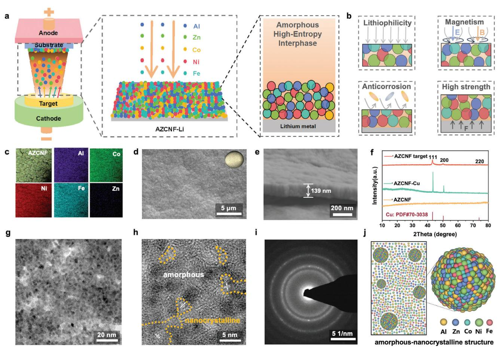
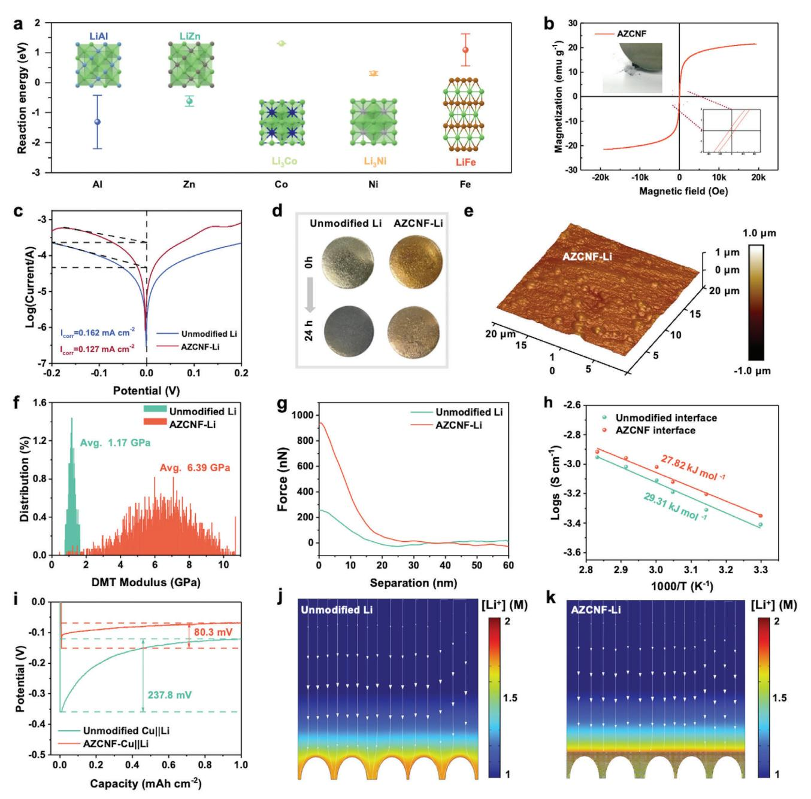
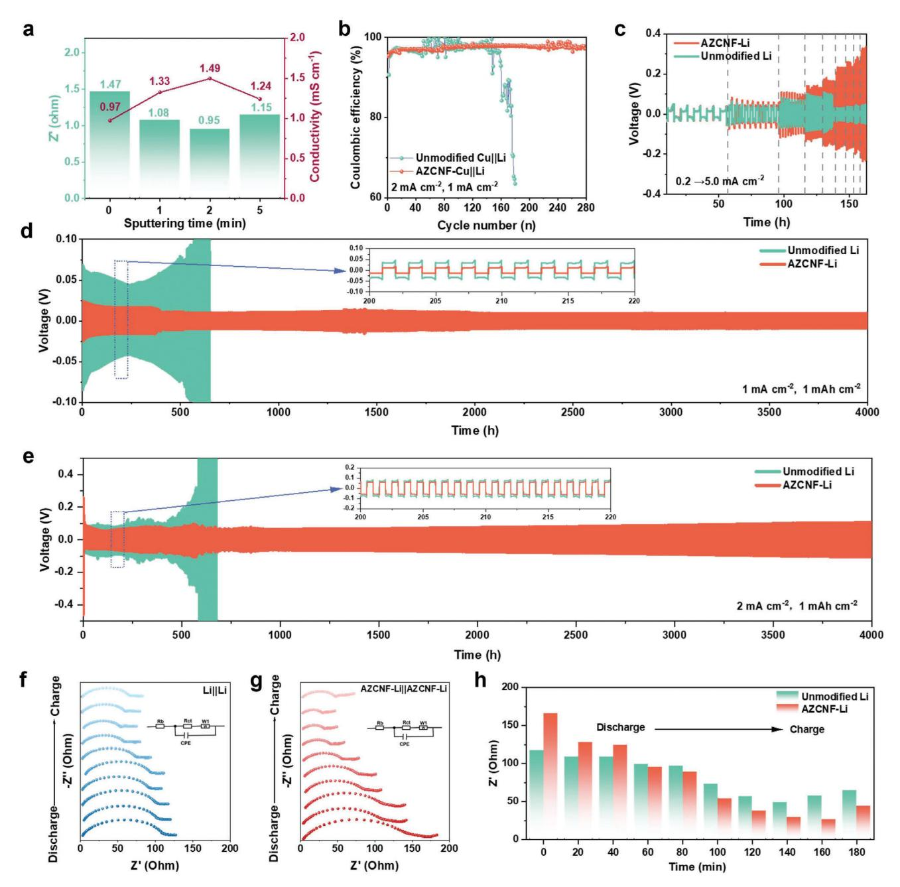
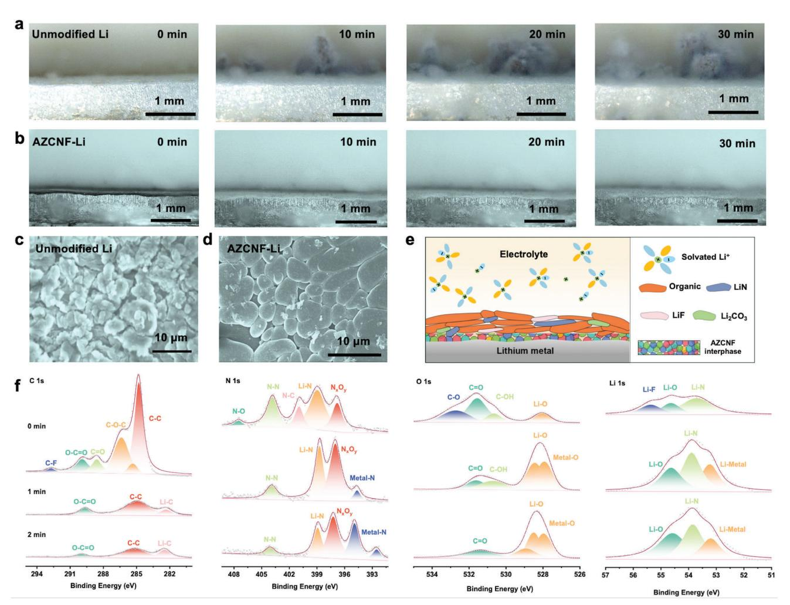
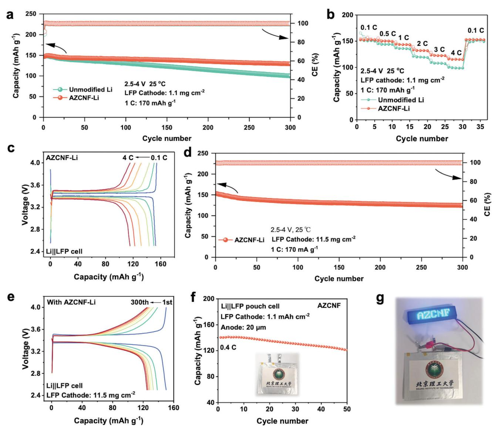

# **Amorphous High-Entropy Alloy Interphase for Stable Lithium Metal Batteries**

*Longhong Zheng, Ruixin Lv, Chong Luo,\* Yafei Guo, MingFan Yang, KaiKai Hu, Ke Wang, Li Li, Feng Wu, and Renjie Chen\**

**The unstable anode/electrolyte interphase induces severe lithium dendrite growth hindering the practical application of lithium metal batteries. The lithium alloy interphase presents a promising strategy for regulating Li+ plating/stripping behavior. However, binary or ternary alloys are insufficient to address various challenges in lithium metal batteries and the high temperature required for alloy preparation hampers their direct applications on lithium metal surfaces. In this study, a high-entropy alloy (HEA) interphase is developed on lithium metal surfaces via room-temperature magnetron sputtering, showcasing multifunctional advantages in regulating Li+ plating/stripping behavior. The cocktail effect of the (HEA) facilitated the formation of a homogeneous amorphous interphase with abundant lithiophilic sites and magnetic properties, promoting uniform Li+ nucleation and deposition. Furthermore, the high mechanical strength and corrosion resistance of HEA provided physicochemical stability for the lithium anode interphase, consistently suppressing dendrite growth. Consequently, lithium metal anodes with HEA interphases exhibited robust cycling performance lasting over 4000 h at 2 mA cm−2. The LFP full battery demonstrated high-capacity retention of 90% with an average Coulombic efficiency of 99.7%. Thus, the HEA interphases on lithium metal surfaces offer controllable regulation of Li+ deposition behavior through high-entropy manipulation, opening novel strategies for stable lithium metal batteries.**

## **1. Introduction**

High-specific-energy rechargeable batteries play crucial roles in energy conversion and storage across various applications.[\[1–6\]](#page-8-0) Among potential high-performance anode materials, lithium

Beijing Key Laboratory of Environmental Science and Engineering School of Material Science and Engineering Beijing Institute of Technology Beijing 100081, China E-mail: [chong.luo@bit.edu.cn;](mailto:chong.luo@bit.edu.cn) [chenrj@bit.edu.cn](mailto:chenrj@bit.edu.cn) C. Luo, L. Li, F. Wu, R. Chen Advanced Technology Research Institute Beijing Institute of Technology Jinan, Shandong 250300, China L. Li, F. Wu, R. Chen

Collaborative Innovation Center of Electric Vehicles in Beijing Beijing 100081, China

The ORCID identification number(s) for the author(s) of this article can be found under <https://doi.org/10.1002/aenm.202402042>

**DOI: 10.1002/aenm.202402042**

metal stands out for its impressive theoretical capacity of 3860 mAh g−1 and its low electrochemical potential (−3.04 V vs the standard hydrogen electrode).[\[7,8\]](#page-8-0) However, the inherent high reactivity of lithium metal often triggers spontaneous side reactions with organic electrolytes, resulting in the loss of active lithium and the formation of solid electrolyte interphase (SEI) byproducts.[\[9\]](#page-8-0) The SEI normally exhibits disordered structures with limited mechanical properties, which tend to be cracked and accumulate after long-term cycling.[\[10\]](#page-8-0) Consequently, the non-uniform deposition of Li+ triggers the formation of lithium dendrites, leading to severe capacity degradation and potential safety issues.[\[11\]](#page-8-0)

Anode interphase engineering has emerged as a promising strategy for regulating Li+ plating/stripping process in lithium metal batteries.[\[12–14\]](#page-8-0) Functional interphases with tunable properties enable effective manipulation of Li+ transport and deposition behavior. Various artificial interfacial

layers incorporating components including metal alloys and metal oxides/sulfides/fluorides have been extensively developed, offering effective improvements in the stability of lithium metal batteries.[\[15–19\]](#page-8-0) Several key properties are essential for stabilizing lithium metal anodes: 1) the presence of uniform lithiophilic active sites to ensure even Li+ distribution[\[20–22\]](#page-8-0) ; 2) stable mechanical properties to suppress lithium dendrite growth[\[23–25\]](#page-8-0) ; and 3) anti-corrosion properties to inhibit side reactions with the electrolyte.[\[26–28\]](#page-8-0) However, single-component interphases may struggle to provide a comprehensive solution to these challenges, necessitating a combination of various functional components to synergistically address these issues.[\[29\]](#page-8-0)

The high-entropy alloy (HEA) has garnered increasing attention in rechargeable batteries.[\[30–33\]](#page-8-0) HEAs are characterized by multielement crystallizing into a single phase, where five or more major elements occupy equiatomic sites to stabilize in a solid state. Through the deliberate combination of various elements, HEAs offer tunable properties that are unique compared to traditional single or alloy materials.[\[34\]](#page-9-0) The effective utilization of HEAs in the cathode, electrolyte, and anode of rechargeable batteries exhibits interesting phenomena. For instance, highentropy oxide cathodes offer a modular approach to tailor lithium

L. Zheng, R. Lv, C. Luo, Y. Guo, M. Yang, K. Hu, K. Wang, L. Li, F. Wu, R. Chen

storage characteristics, resulting in high-capacity retention and reversible delithiation/lithiation behavior. The increased configuration entropy effectively enhances reaction kinetics, electronic conductivity, (Li+) diffusion rates, and better resistance to volume change.[\[35\]](#page-9-0) Moreover, high-entropy electrolytes have been demonstrated to promote favorable interactions between Li+ and solvents, suppressing ion clusters, which significantly improves ion transport, reduces concentration gradients and enables uniform Li+ deposition.[\[36\]](#page-9-0)

The synthesis of HEAs typically requires high-energy and complex preparation techniques such as high-energy ball milling, high-temperature treatment and high-pressure sintering.[\[37–39\]](#page-9-0) Transition metal elements, with their similar atomic radius and electronegativity, are typically combined and transformed into HEAs.[\[40–42\]](#page-9-0) However, constructing high-entropy alloys on lithium metal surfaces remains challenging due to the high reactivity and instability of lithium metal. Conventional hightemperature treatments often exceed the melting point of lithium metal, while mechanical alloying through high-energy ball milling struggles to produce a uniform interfacial coating. The magnetron sputtering offers a form of physical vapor deposition that can be conducted at room temperature with an inert atmosphere, providing a promising solution to address these challenges and depositing a uniform HEA interphase on lithium metal surfaces. The specific components of the HEA interphase can be further precisely manipulated, providing a promising strategy for effectively regulating the the Li+ plating/stripping process.

Herein, HEA interphase was rationally constructed on a lithium metal surface using magnetron sputtering at room temperature. The HEA interphase, denoted as AZCNF, exhibits controllable properties owing to the cocktail effect of various elements (Al, Zn, Co, Ni, and Fe). The abundant lithiophilic sites effectively regulate Li+ flux distribution and facilitate Li+ deposition. Additionally, the magnetic properties of AZCNF provide horizontal Lorentz force, effectively inhibiting the growth of Li dendrites. Moreover, the anti-corrosion properties and high mechanical strength contribute to a highly stable anode/electrolyte interphase, effectively suppressing Li dendrite growth and associated corrosion. As a result, lithium anodes modified with AZCNF demonstrate exceptional stability in Li+ stripping/plating cycling for over 4000 h at 2 mA cm−2. Moreover, the AZCNF-Li||LFP battery exhibits capacity retention of nearly 90% with a coulombic efficiency of 99.7% after 300 cycles at 1 C. Thus, the construction of a HEA interphase on the Li metal surface offers a novel approach to investigating the high-entropy regulation mechanism of Li+ transport and deposition for stable Li metal batteries.

## **2. Results and Discussion**

A uniform HEA interphase was deposited onto the lithium metal surface using direct-current magnetron sputtering of an AZCNF target at room temperature within an argon atmosphere (**Figure 1**[a\)](#page-2-0). The high entropy alloy targets were prepared using the vacuum melting method and the experiment details are shown in Supporting Information. The selection of these elements was deliberate, aligning with the desired properties for the SEI to regulate the behavior of Li+ plating and stripping (Figure [1b\)](#page-2-0). Lithiophilic elements such as Al and Zn were chosen to ensure uniform deposition sites for Li+, while magnetic elements like Co, Ni, and Fe were selected to introduce an external magnetic field, inhibiting the growth of Li dendrites. Moreover, the formation of this HEA interphase endowed the lithium anode with high mechanical strength and corrosion resistance, ensuring physicochemical stability for consistent cycling performance. The successful magnetron sputtering of the HEA interphase was confirmed by the uniform element distribution elucidated through energy-dispersive X-ray spectroscopy (EDS), where the elements including Al, Zn, Co, Ni, and Fe were uniformly distributed at the nanoscale without partial aggregation (Figure [1c\)](#page-2-0). The relative content of elemental components was quantitatively summarized in Figure S3 (Supporting Information). The morphology of the AZCNF-Li was characterized by scanning electron microscopy (SEM) and exhibited a smooth and flat interphase on the lithium metal surface (Figure [1d\)](#page-2-0). AZNCF interphase with different thicknesses was prepared through varying sputtering times, as shown in Figure S4 (Supporting Information). The thickness of the AZCNF interphase can be readily controlled by adjusting the sputtering time, with a deposition rate of ≈14 nm per min on the surface (Figure [1e;](#page-2-0) Figure S5, Supporting Information).

The microstructure and crystallization of the HEA interphase were further investigated using X-ray diffraction (XRD) and transmission electron microscopy (TEM). The AZCNF target exhibited distinct peaks at 43°, 50°, and 74°, corresponding to the (111), (200), and (220) crystal planes of the face-centered cubic (FCC) phase.[\[43\]](#page-9-0) However, the HEA interphase displayed a broad and amorphous pattern without obvious peaks, indicating its amorphous structure with low crystallinity (Figure [1f\)](#page-2-0). The XRD of a thick deposited film (1.6 microns) was also measured to further confirm the amorphous structure (Figure S6, Supporting Information). TEM images were obtained to further elucidate the crystallinity of the high-entropy alloy microstructure. The TEM image of AZCNF revealed a uniform nanodot morphology with a radius of ≈2–3 nm (Figure [1g\)](#page-2-0). Additionally, the HRTEM image displayed an amorphous structure with some nanocrystalline regions (Figure [1h\)](#page-2-0), as further evidenced by the diffraction rings in the selected area electron diffraction (SAED) pattern (Figure [1i\)](#page-2-0). These XRD and TEM findings confirm that the deposited AZCNF via magnetron sputtering primarily consists of a uniformly distributed amorphous structure (Figure [1j\)](#page-2-0). The formation mechanism ascribes to the low mobility of deposited atoms at room temperature sputtering combined with the rapid quenching effect. Besides, the multiple principal elements cause lattice distortion and sluggish diffusion, further preventing the formation of a crystalline structure. Amorphous HEA effectively eliminate grain boundaries compared to crystalline materials, which serve as sites for lithium nucleation and prevent the accumulation of lithium dendrite at grain boundaries. Additionally, amorphous alloys exhibit superior mechanical properties and better corrosion resistance, which are crucial for the stability of lithium metal anodes.[\[44,45\]](#page-9-0)

The selection principle of high-entropy elements was based on their distinct functions in addressing key challenges associated with the lithium metal anode, as illustrated in **Figure [2](#page-3-0)**. Lithiophilic elements such as aluminum (Al) and zinc (Zn) were chosen for their superior lithiophilic behavior, promoting

**Figure 1.** a) Schematic depicting of the preparation processes for the AZCNF high-entropy interphase using magnetron sputtering; b) Schematics illustrating the benifits of the high-entropy interphase in the stripping/plating process of lithium metal anode; c) EDS image showing the AZCNF interphase and the corresponding elemental mappings; d) SEM image and e) cross-sectional SEM images displaying the AZCNF interphase deposited on lithium metal surface; f) XRD patterns of the AZCNF target, AZCNF on Cu substrate and AZCNF powders scratched from the substrate; g,h) highresolution transmission electron microscopy (HRTEM) images and i) selected area electron diffraction (SAED) image of the AZCNF, j) schematic diagram depicting the amorphous-nanocrystalline structure of AZCNF.

uniform lithium-ion nucleation and deposition. Magnetic elements like cobalt (Co), nickel (Ni), and iron (Fe) were included to introduce an external Lorentz force, inhibiting dendrite growth. Al and Zn exhibit higher affinity with Li metal compared to other elements, as evidenced by their more negative reaction energy from the density functional theory (DFT) calculations in Figure [2a](#page-3-0) (Table S1, Supporting Information). This enhances the trend of Li+ adsorption and binding at these lithiophilic sites, promoting uniform deposition of lithium. Additionally, the ferromagnetic properties of AZCNF were confirmed using a vibrating sample magnetometer at room temperature, revealing distinctive narrow hysteresis loops and saturation magnetization (Ms) of 21.52 emu g−1 (Figure [2b\)](#page-3-0). The magnetism of Co, Ni, and Fe generates an external horizontal Lorentz force, and the movement direction of Li+ on the anode surface can be influenced by the external magnetic field. We simulated the distribution of Li+ concentration during the deposition process under a magnetic field using multiphysics simulation. The Li+ flux under the magnetic field results in a more uniform distribution compared to the deposition process without the magnetic field (Figure S7, Supporting Information). This leads to uniform Li+ deposition and effectively reduces excessive Li+ accumulation.

Moreover, owing to the synergistic effect of these high-entropy alloys, AZCNF interphase also demonstrates enhanced anticorrosion properties.[\[46\]](#page-9-0) Tafel plots obtained via linear sweep voltammetry (LSV) were used to analyze the corrosion current density (icorr) as shown in Figure [2c.](#page-3-0) The improved corrosion resistance with a slower corrosion rate was obtained from AZCNFmodified Li metal with a corrosion current density of 0.127 mA cm−2 compared to the unmodified Li metal (0.162 mA cm−2). Additionally, AZCNF-modified Li metal exhibited enhanced stability in ambient air atmosphere and retained its original bright appearance after exposure to air for 24 h, compared to the darkened surface observed on unmodified Li (Figure [2d\)](#page-3-0). In addition to anti-corrosion properties, the high-entropy effect enhances the mechanical strength of the interphase, effectively suppressing Li dendrite growth. The atomic force microscopy (AFM) morphology image confirms the uniform and flat surface of AZCNF-modified Li, consistent with SEM results (Figure [2e\)](#page-3-0).

**Figure 2.** a) The calculated reaction energy of the lithium alloy reaction between different elements; b) The magnetic hysteresis loop of AZCNF; c) Tafel curves of the Unmodified Li and AZCNF-Li symmetrical cell derived from LSV tests; d) Optical images of the unmodified Li and AZCNF-Li before and after exposure to air for 24 h; e) The AFM topography image of the AZCNF-Li anode; f) The quantitative distribution of the Young's modulus and g) the force-separation curves on the unmodified Li and the AZCNF-Li anodes; h) The activation energy of Li+ migration in AZCNF interphase investigated by analyzing the Nyquist plot using the Arrhenius equation; i) The overpotential curves for Li+ plating process on unmodified Cu||Li and AZCNF-Cu||Li for the first cycle; Multiphysics simulation illustrating the distribution of Li+ concentration resulting from Li+ deposition at j) unmodified Li and k) AZCNF-Li surface.

The Young's modulus of AZCNF-modified Li exhibits significantly greater strength, averaging 6.39 GPa compared to unmodified Li at 1.17 GPa (Figure 2f). Moreover, the steeper slope of the force-separation curve obtained from AFM (Figure 2g) further illustrates the increased modulus of the AZCNF interphase. Additionally, nano-indentation tests reveal higher elastic moduli for AZCNF-coated copper foil (109.78 GPa) compared to bare copper foil (83.78 GPa) (Figure S8, Supporting Information). These mechanical analyses confirm the enhanced strength of the AZCNF interphase, which effectively impedes Li dendrite growth and provides substantial protection to the lithium metal anode.

Furthermore, the lithiophilic HEA effectively regulates Li+ migration and nucleation processes. The Li+ migration behavior and apparent activation energy were investigated by analyzing the Nyquist plot using the Arrhenius equation. As illustrated in Figure [2h,](#page-3-0) the activation energy for the AZCNF high-entropy interphase is 27.82 kJ mol−1, lower than that of the unmodified interphase (29.31 kJ mol−1), indicating improved facilitation of Li+ migration on the HEA. The initial deposition curve (Figure [2i\)](#page-3-0) for the unmodified Cu||Li and AZCNF-Cu||Li half-cells was conducted at 1 mA cm−2 and 1 mAh cm−2. AZCNF-Cu||Li exhibits a significantly smaller overpotential (80.3 mV) compared to unmodified Cu||Li (237.8 mV), indicating a reduced nucleation barrier for Li+ deposition due to the lithiophilic properties. Concurrently, multiphysics simulation is employed to simulate Li+ concentration distribution during Li+ deposition processes.[\[39\]](#page-9-0) The model depicts spatial distribution and dynamic changes in the cell system, visually representing Li+ flux and electric field distribution. While unmodified Li leads to obvious accumulation of Li+ at localized high-current density regions, resulting in nonuniform Li+ deposition (Figure [2j\)](#page-3-0), the AZCNF high-entropy interphase, with enhanced lithophilicity, effectively reduces local current density, ensuring uniform distribution of electric field and Li+ flux (Figure [2k\)](#page-3-0).

The cell performance of the AZCNF-modified Li anode was investigated and illustrated in **Figure [3](#page-5-0)**. The optimal thickness of the AZCNF high-entropy interphase was achieved by varying sputtering times (1, 2, 5 min), resulting in estimated thicknesses of ≈14, 28, and 70 nm, respectively. SEM images reveal that the AZCNF coating after 2 min of sputtering exhibited a uniform and fully covered interphase (Figure S9, Supporting Information). The thickness variations do not significantly alter the composition of individual elements and configurational entropy of the HEAs (Figure S10, Supporting Information). Electrochemical impedance spectroscopy (EIS) was employed to assess the impact of thickness on Li+ conductivity. The AZCNF with a deposition time of 2 min exhibited the highest ionic conductivity (Figure [3a;](#page-5-0) Figure S11, Supporting Information). Furthermore, in situ optical microscopy was conducted to observe dendrite growth at a current density of 1 mA cm−2 for 30 min. The high-entropy interphase produced with a 2 min sputtering time exhibited uniform planar deposition compared to other sputtering times (Figure S12, Supporting Information). AZCNF-modified Li with a 2 min sputtering time also exhibited minimal color change after exposure to air for 24 h, indicating improved interfacial stability (Figure S13, Supporting Information). The plating/stripping performance of the Li anode also demonstrates the interphase with a 2 min deposition time exhibits favorable reversibility (Figure S14, Supporting Information). Therefore, we selected a 2 min magnetron sputtering time for the preparation of AZCNF-modified Li samples intended for subsequent electrochemical tests.

The influence of the AZCNF high-entropy interphase on lithium deposition was initially investigated using a Li||Cu halfcell. Figure [3b](#page-5-0) illustrates the Coulombic efficiency (CE) distributions of unmodified Cu||Li and AZCNF-Cu||Li at a current density of 2 mA cm−2 and an areal capacity of 1 mAh cm−2. The Li||Cu half-cell with the high-entropy interphase maintains consistently high CE at 97.5% over 280 cycles. In contrast, the CE of the unmodified Li||Cu half-cell markedly declined after a mere 150 cycles. The AZCNF-Cu||Li cell consistently maintains a smaller overpotential of ≈67.3 mV compared to the 144.2 mV of the Li||Cu half-cell after 150 cycles (Figures S15 and S16, Supporting Information), showcasing the enhanced stability of the highentropy interphase and its excellent reversibility. The modified Aurbach method was used to calculate the specific CEs of these Li||Cu cells, where the Li anode with high-entropy interphase exhibits 98.7%, compared to 98.2% for bare Li (Figure S17, Supporting Information). The rate performance of the symmetrical cell was evaluated across various current density ranges (Figure [3c\)](#page-5-0). With increasing current density, the cell with AZCNF-modified Li anode showed stable rate performance even at a high current density of 5 mA cm−2. However, the voltage of the unmodified lithium cell failed at 2 mA cm-2 after 137 h, possibly due to lithium dendrite penetration through the separator.

In the long cycling test conducted at a current density of 1 mA cm−2 and an areal capacity of 1 mAh cm−2, the unmodified lithium anode cell exhibited significant polarization voltage after 570 h. In contrast, the cell with AZCNF-modified lithium anode demonstrated robust cycle stability for over 4000 h, with notably reduced polarization voltage compared to the unmodified lithium anode cell (Figure [3d\)](#page-5-0). The voltage profiles of the symmetrical cell during the 200th–220th h are illustrated in the insets. Additionally, a SEM image of the Li metal after cycling is provided in Figure S18 (Supporting Information). The Li metal surface in the AZCNF-modified Li cell is uniform without obvious dendritic growth. In contrast, irregular and rough lithium dendrites are found on the surface of the lithium metal in the unmodified Li cell. The cycling test was also tested in a higher current density (2 mA cm−2) at an areal capacity of 1 mAh cm−2, the AZCNF-modified lithium anode also exhibits stable cycling for over 4000 h (Figure [3e\)](#page-5-0). Compared with other alloy anodes from recently reported studies, the AZCNF-modified anode exhibits superior reversibility to achieve stable Li plating/stripping ability (Table S3, Supporting Information). The cycle stability of the symmetrical cell effectively demonstrates the ability of the AZCNF high-entropy interphase to suppress the growth of lithium dendrites.

The in situ EISanalyses were conducted to investigate interfacial reaction kinetics. Variations in the Nyquist plot during initial plating/stripping at a current density of 1 mA cm−2 and an areal capacity of 1 mAh cm−2 are illustrated in Figure [3f,g,](#page-5-0) and the comparative analysis of charge transfer resistance (Rct) values are presented in Figure [3h.](#page-5-0) The semicircular impedance gradually decreased during the discharge stages, resulting in a gradual reduction in ionic conductivity. This reduction can be attributed to the continuous stripping of lithium metal from the surface. The impedance decreased to 44 and 64 ohms for the AZCNFmodified Li||AZCNF-modified Li and the Li||Li symmetric batteries, respectively. The interphase impedance of the AZCNFmodified Li cell was lower than that of the unmodified Li cell, indicating that the lithiophilic AZCNF effectively enhances surface ion transport capabilities and ensures stable Li plating/stripping behavior.

The in situ optical microscope was employed to visually observe the evolution of lithium dendrite growth and confirm the efficacy of the AZCNF high-entropy interphase in suppressing lithium dendrites. In the unmodified Li symmetrical cell, the emergence of lithium dendrites becomes noticeable following a 10 min plating at 1 mA cm−2, with increased mossy lithium

**Figure 3.** a) The ionic conductivity of AZCNF interphase with varying sputtering durations; b) The CE of Li||Cu half-cell using the unmodified Li and AZCNF-Li at 2 mA cm−2 and 1 mAh cm−2; c) Rate performance of the symmetrical cell at current densities ranging from 0.2 to 5 mA cm−2; d,e) The cycling stability of symmetrical cell at different current densities. The insets show corresponding voltage profiles from the 200th to 220th h; f,g) In situ Nyquist plot of the Li||Li cell and the AZCNF-Li||AZCNF-Li cell during the 1st plating/stripping process, with (h) the corresponding resistance (Rct) comparison.

dendrites formed during the plating process (**Figure 4**[a\)](#page-6-0). However, no obvious lithium dendrites were observed on the AZCNFmodified lithium metal after electroplating for 30 min, suggesting uniform lithium deposition during the discharge process (Figure [4b\)](#page-6-0). Morphological changes of the lithium anode after 100 cycles are observed in Figure [4c,](#page-6-0) where numerous mossy lithium dendrites form on the surface of the unmodified lithium anode, resulting in severe pulverization. In contrast, the surface of AZCNF-modified Li appears even and exhibits a smooth morphology with no signs of pulverization (Figure [4d\)](#page-6-0), demonstrating the substantial protective impact of the AZCNF high-entropy interphase on lithium metal.

To comprehensively elucidate the interfacial components, Xray photoelectron spectroscopy (XPS) depth analysis was employed to characterize the interphase of AZCNF-modified Li anode after cycling. The natural SEI on the AZCNF-modified Li

**Figure 4.** In situ optical microscopy of Li+ deposition process on a) unmodified Li and b) AZCNF-Li; SEM images of c) unmodified Li and d) AZCNF-Li anodes after 100 cycles at current density of 1 mA cm−2 and areal capacity of 1 mAh cm−2; e) Schematic diagram of AZCNF HEA interphase; f) C 1s, N 1s, O 1s, Li 1s XPS spectra of the AZCNF-Li interphase at different etching times.

surface predominantly comprises organic compounds such as ROCO2Li (C═O) and ROLi (Li─O), with a minor presence of inorganic components like Li2CO3 (Li─O and C═O), LiF, and Li3N (Li─N). To further validate the chemical composition alterations beneath the surface, a high-resolution XPS depth analysis of AZCNF-modified Li was conducted with different etching times. The carbon content significantly diminishes upon additional etching, confirming the presence of an organic layer atop the SEI comprising ROCO2Li, ROLi, and Li2CO3 (Figures S19– S21, Supporting Information). The presence of Li─F and Li─N suggests the formation of LiF/Li3N SEI facilitated by TFSI− anions and adsorbed Li+. The inner layer predominantly consists of Li, N, O, and metal atoms, with their proportions remaining constant. Figure S19 (Supporting Information) illustrates the XPS analysis conducted on AZCNF-modified Li with varying etching times, revealing the presence of Al, Zn, Co, Ni, and Fe at concentrations of 0.89, 0.22, 0.47, 0.38, and 0.69 at %, respectively. The metal bonds observed in the XPS spectra of N 1s, Li 1s, and O 1s further validate the presence of an alloy layer beneath the SEI layers (Figure 4f; Figure S22, Supporting Information). These XPS results validate the in situ formation of an organic/metal alloy double-layer SEI on the AZCNF interphase as illustrated in Figure 4e, where the underlying high-entropy alloy promotes the uniform distribution of Li+, and the top organic layer enhances SEI toughness, ensuring consistent cycling stability of the lithium metal anode. In addition, SEM-EDS and XRD analysis of the high entropy interphase were conducted after Li plating/stripping. The similar elemental composition and structure indicate that the AZCNF interphase remains stable without significant changes (Figures S23–S26, Supporting Information).

To assess the potential applicability of the AZCNF-modified Li anode, a cell comprising the AZCNF-modified Li anode and LiFePO4 (LFP) cathode was constructed. **Figure [5](#page-7-0)**a depicts the extended cycling performance and Coulombic efficiency (CE) of the Li||LFP cell at 1C (1C = 170 mA g−1). The AZCNF-modified Li||LFP cell maintains a high discharge specific capacity of 130 mAh g−1 even after 300 cycles, with an 88% capacity retention rate and an average CE exceeding 99.7%. In contrast, the specific capacity of the unmodified Li||LFP cell is merely 100 mAh g−1 after 300 cycles, accompanied by a capacity retention rate of

**Figure 5.** a) Cycling performance and b) rate performance of Li||LFP cell assembled with unmodified Li and AZCNF-Li anode and LFP cathode; c) Voltage profiles of AZCNF-Li||LFP cell at different rates; d) Cycling performance and corresponding e) voltage profiles of AZCNF-Li||LFP cell with high LFP cathode loading; f) Cycling performance of the AZCNF-Li||LFP pouch cell at 0.5 C. The inset shows the optical photos of the pouch cell; g) The optical photo of the pouch cell powering LED lights.

68.1% and a CE slightly above 99.3%. Furthermore, the unmodified Li||LFP charge/discharge curve displays higher polarization compared to the AZCNF-modified Li||LFP (Figure S27, Supporting Information) across various cycles, potentially attributed to its inferior capability in inhibiting lithium dendrite formation. The rate capability of the assembled AZCNF-modified Li||LFP cell demonstrates high discharge specific capacities of ≈152.8, 150.2, 143.6, 132, 122.4, and 115.5 mAh g−1 at 0.1, 0.5, 1, 2, 3, and 4 C, respectively, and the capacity fully recuperates after returning the current density to 0.1 C (Figure 5b). In contrast, the discharge-specific capacity of the unmodified Li||LFP diminishes rapidly as the current density increases, highlighting the deficient ionic conductivity of unmodified Li. Furthermore, the charge-discharge curve of AZCNF-modified Li||LFP demonstrates a smaller polarization voltage at various current densities (Figure 5c), compared to unmodified Li||LFP (Figure S28, Supporting Information), suggesting accelerated electrochemical reaction kinetics consistent with the symmetrical cell results. These enhanced performances effectively demonstrate that the AZCNF high-entropy interphase can protect the lithium metal anode.

Meanwhile, the HEA interphase demonstrated a significant effect under high cathode loading (11.5 mg cm−2), effectively improving the cycling stability of the battery. This improvement is evidenced by a capacity retention rate of 81.57% after 300 cycles in Figure 5d,e. To further exemplify the practical application of the AZCNF-modified Li anode, an AZCNF-modified Li||LFP pouch cell with an N/P ratio of 3.74 was assembled for electrochemical testing. The initial capacity of the AZCNF-modified Li||LFP cell exhibits 140.5 mAh g−1 at 0.4 C, and the capacity remains stable at 120.7 mAh g−1 over the following 50 cycles, with a capacity retention of 85.9% (Figure [5f\)](#page-7-0). The charge-discharge curves from various cycles of the pouch cell display minimal polarization voltage (Figure S29, Supporting Information) and present an energy density of 286.36 Wh kg−1. The pouch cells obtained are utilized to power electronic devices, showcasing the successful illumination of the light-emitting diode (LED) labeled as "AZCNF" (Figure [5g\)](#page-7-0).

## **3. Conclusion**

An amorphous HEA interphase was successfully created on the surface of lithium metal through room-temperature magnetron sputtering. The multifunctional interphase, with enhanced lithiophilic and magnetic properties, was achieved through the cocktail effect of the HEA, improving the regulation of Li+ stripping/plating behavior in lithium metal anodes. The enhanced mechanical and anti-corrosion properties of the HEA effectively suppressed dendrite growth and ensured stable Li+ deposition. Therefore, the assembled AZCNF-Li symmetrical cell demonstrated long-term stability over 4000 h at 2 mA cm−2 and 1 mAh cm−2, while maintaining an average CE of 99.7% after 300 cycles at 1 C. This study presents a novel approach to the roomtemperature formation of HEA interphase directly on lithium metal surfaces, offering a unique high-entropy regulation strategy for creating stable lithium metal batteries.

## **Supporting Information**

Supporting Information is available from the Wiley Online Library or from the author.

## **Acknowledgements**

L.Z. and R.L. contributed equally to this work. This work was supported by the National Key Research and Development Program of China (No. 2022YFB2502102), the National Natural Science Foundation of China (52202207), the Beijing Outstanding Young Scientists Program (BJJWZYJH01201910007023), the Beijing Natural Science Foundation (Z220021), the Natural Science Foundation of Shandong (ZR2022QE061), the Shandong Provincial Central Leading Local Science and Technology Development Fund Project (YDZX2023049), Fundamental Research Funds for the Central Universities.

## **Conflict of Interest**

No. The authors declare no conflict of interest.

## **Data Availability Statement**

The data that support the findings of this study are available from the corresponding author upon reasonable request.

#### **Keywords**

dendrite, high entropy alloy, interphase, lithium metal anode, magnetron sputtering

- Received: May 10, 2024
- Revised: July 1, 2024 Published online: July 22, 2024

- [1] R. Choudhury, J. Wild, Y. Yang, *Joule* **2021**, *5*, 1301.
- [2] S. Zhang, Y. Liu, Q. Fan, C. Zhang, T. Zhou, K. Kalantar-Zadeh, Z. Guo, *Energy Environ. Sci.* **2021**, *14*, 4177.
- [3] Z. Liang, W. Wang, Y. Lu, *Joule* **2022**, *6*, 2458.
- [4] S. H. Kim, U. J. Choe, N. Y. Kim, S. Y. Lee, *Batter. Energy* **2022**, *1*, 1.
- [5] A. Rahil, E. Partenie, M. Bowkett, M. H. Nazir, M. M. Hussain, *Batter. Energy* **2022**, *1*, 20210001.
- [6] Z. Wang, B. Zhang, *Energy Mater. and Devices* **2023**, *1*, 9370003.
- [7] Y. Wang, M. Li, F. Yang, J. Mao, Z. Guo, *Energy Mater. Devices* **2023**, *1*, 9370005.
- [8] W. Xu, J. Wang, F. Ding, X. Chen, E. Nasybulin, Y. Zhang, J. Zhang, *Energy Environ. Sci.* **2014**, *7*, 513.
- [9] R. Pathak, K. Chen, F. Wu, A. U. Mane, R. V. Bugga, J. W. Elam, Q. Qiao, Y. Zhou, *Energy Storage Mater.* **2021**, *41*, 448.
- [10] Y. Xu, K. Dong, Y. Jie, P. Adelhelm, Y. Chen, L. Xu, P. Yu, J. Kim, Z. Kochovski, Z. Yu, W. Li, J. Lebeau, Y. Shao-Horn, R. Cao, S. Jiao, T. Cheng, I. Manke, Y. Lu, *Adv. Energy Mater.* **2022**, *12*, 2200398.
- [11] B. Song, I. Dhiman, J. C. Carothers, G. M. Veith, J. Liu, H. Z. Bilheux, A. Huq, *ACS Energy Lett.* **2019**, *4*, 2402.
- [12] P. Zhai, L. Liu, X. Gu, T. Wang, Y. Gong, *Adv. Energy Mater.* **2020**, *10*, 2001257.
- [13] G. H. Lee, S. G. Lee, S. H. Park, D. Jun, Y. J. Lee, *J. Mater. Chem. A* **2022**, *10*, 10662.
- [14] C. Sun, Y. Ruan, W. Zha, W. Li, M. Cai, Z. Wen, *Mater. Horiz.* **2020**, *7*, 1667.
- [15] J. F. Ding, Y. T. Zhang, R. Xu, R. Zhang, Y. Xiao, S. Zhang, C. X. Bi, C. Tang, R. Xiang, H. S. Park, Q. Zhang, J. Q. Huang, *Green Energy Environ.* **2023**, *8*, 1509.
- [16] S. Lee, H. Song, J. Y. Hwang, Y. Jeong, *Fibers Polym.* **2017**, *18*, 2334.
- [17] L. Wang, L. Zhang, Q. Wang, W. Li, B. Wu, W. Jia, Y. Wang, J. Li, H. Li, *Energy Storage Mater.* **2018**, *10*, 16.
- [18] J. Sun, S. Zhang, J. Li, B. Xie, J. Ma, S. Dong, G. Cui, *Adv. Mater.* **2023**, *35*, 2209404.
- [19] H. Chen, A. Pei, D. Lin, J. Xie, A. Yang, J. Xu, K. Lin, J. Wang, H. Wang, F. Shi, D. Boyle, Y. Cui, *Adv. Energy Mater.* **2019**, *9*, 1900858.
- [20] H. Zhuang, T. Zhang, H. Xiao, X. Liang, F. Zhang, J. Deng, Q. Gao, *Energy Environ. Mater.* **2023**, *6*, e12470.
- [21] L. Ye, C. Zhang, Y. Zhou, B. ülgüt, Y. Zhao, J. Qian, *J. Energy Chem.* **2022**, *74*, 412.
- [22] X. Wang, K. Luo, L. Xiong, T. Xiong, Z. Li, J. Sun, H. He, C. Ouyang, Z. Peng, *Energy Environ. Mater.* **2023**, *6*, e12317.
- [23] D. Cheng, T. Wynn, B. Lu, M. Marple, B. Han, R. Shimizu, B. Sreenarayanan, J. Bickel, P. Hosemann, Y. Yang, H. Nguyen, W. Li, G. Zhu, M. Zhang, Y. S. Meng, *Nat. Nanotechnol.* **2023**, *18*, 1448.
- [24] S. Huang, Z. Wu, B. Johannessen, K. Long, P. Qing, P. He, X. Ji, W. Wei, Y. Chen, L. Chen, *Nat. Commun.* **2023**, *14*, 5678.
- [25] P. Wei, H. Wang, M. Yang, J. Wang, D. Wang, *Adv. Energy Mater.* **2024**, *14*, 2400108.
- [26] C. Jin, Y. Huang, L. Li, G. Wei, H. Li, Q. Shang, Z. Ju, G. Lu, J. Zheng, O. Sheng, X. Tao, *Nat. Commun.* **2023**, *14*, 8269.
- [27] Z. Xiao, J. Chen, J. Liu, T. Liang, Y. Xu, C. Zhu, S. Zhong, *J. Power Sources* **2019**, *438*, 226973.
- [28] H. Li, F. Zhang, W. Wei, X. Zhao, H. Dong, C. Yan, H. Jiang, Y. Sang, H. Chen, H. Liu, S. Wang, *Adv. Energy Mater.* **2023**, *13*, 2301023.
- [29] S. J. Yang, J. K. Hu, F. N. Jiang, H. Yuan, H. S. Park, J. Q. Huang, *InfoMat* **2024**, *6*, e12512.
- [30] K. Wang, W. Hua, X. Huang, D. Stenzel, J. Wang, Z. Ding, Y. Cui, Q. Wang, H. Ehrenberg, B. Breitung, C. Kübel, X. Mu, *Nat. Commun.* **2023**, *14*, 1487.
- [31] Q. Wang, C. Zhao, J. Wang, Z. Yao, S. Wang, S. G. H. Kumar, S. Ganapathy, S. Eustace, X. Bai, B. Li, M. Wagemaker, *Nat. Commun.* **2023**, *14*, 440.
- [32] K. Du, Y. Liu, Y. Yang, F. Cui, J. Wang, M. Han, J. Su, J. Wang, X. Han, Y. Hu, *Adv. Mater.* **2023**, *35*, 2301538.

- [33] J. Wang, Y. Wang, X. Lu, J. Qian, C. Yang, I. Manke, H. Song, J. Liao, S. Wang, R. Chen, *Adv. Mater.* **2024**, *36*, 2308257.
- [34] M. C. Gao, D. B. Miracle, D. Maurice, X. Yan, Y. Zhang, J. A. Hawk, *J. Mater. Res.* **2018**, *33*, 3138.
- [35] W. Li, Y. Li, J. H. Wang, S. Huang, A. Chen, L. Yang, J. Chen, L. He, W. K. Pang, L. Thomsen, B. Cowie, P. Xiong, Y. Zhou, G. Jang, D. H. Min, J. S. Byun, L. Xu, J. Q. Huang, K. C. Roh, S. H. Kang, M. Liu, X. Duan, H. S. Park, *Energy Environ. Sci.* **2024**, [https://doi.org/10.1039/](https://doi.org/10.1039/d3ee02392c) [d3ee02392c.](https://doi.org/10.1039/d3ee02392c)
- [36] S. C. Kim, J. Wang, R. Xu, P. Zhang, Y. Chen, Z. Huang, Y. Yang, Z. Yu, S. T. Oyakhire, W. Zhang, L. C. Greenburg, M. S. Kim, D. T. Boyle, P. Sayavong, Y. Ye, J. Qin, Z. Bao, Y. Cui, *Nat. Energy* **2023**, *8*, 814.
- [37] S. Iwan, K. C. Burrage, B. C. Storr, S. A. Catledge, Y. K. Vohra, R. Hrubiak, N. Velisavljevic, *AIP Adv.* **2021**, *11*, 35107.
- [38] J. Wang, Y. Cui, Q. Wang, K. Wang, X. Huang, D. Stenzel, A. Sarkar, R. Azmi, T. Bergfeldt, S. S. Bhattacharya, R. Kruk, H. Hahn, S. Schweidler, T. Brezesinski, B. Breitung, *Sci. Rep.* **2020**, *10*, 18430.
- [39] F. Ye, F. Meng, T. Luo, H. Qi, *J. Eur. Ceram. Soc.* **2023**, *43*, 2185.
- [40] L. Wu, J. P. Hofmann, *Curr. Opin. Electrochem.* **2022**, *34*, 101010.
- [41] H. Chen, S. Li, S. Huang, L. Ma, S. Liu, F. Tang, Y. Fang, P. Dai, *Acta Mater.* **2022**, *222*, 117438.
- [42] J. Cavin, A. Ahmadiparidari, L. Majidi, A. S. Thind, S. N. Misal, A. Prajapati, Z. Hemmat, S. Rastegar, A. Beukelman, M. R. Singh, K. A. Unocic, A. Salehi-Khojin, R. Mishra, *Adv. Mater.* **2021**, *33*, 2100347.
- [43] Q. Wang, Y. Lu, Q. Yu, Z. Zhang, *Sci. Rep.* **2018**, *8*, 14910.
- [44] A. Inoue, *Acta Mater.* **2000**, *48*, 279.
- [45] G. Wu, C. Liu, A. Brognara, M. Ghidelli, Y. Bao, S. Liu, X. Wu, W. Xia, H. Zhao, J. Rao, D. Ponge, V. Devulapalli, W. Lu, G. Dehm, D. Raabe, Z. Li, *Mater. Today* **2021**, *51*, 6.
- [46] C. Liu, Z. Li, W. Lu, Y. Bao, W. Xia, X. Wu, H. Zhao, B. Gault, C. Liu, M. Herbig, A. Fischer, G. Dehm, G. Wu, D. Raabe, *Nat. Commun.* **2021**, *12*, 5518.