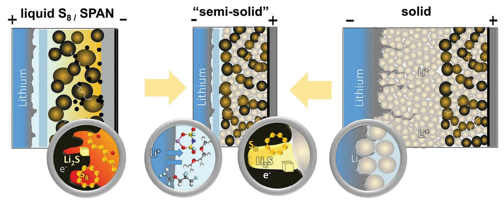
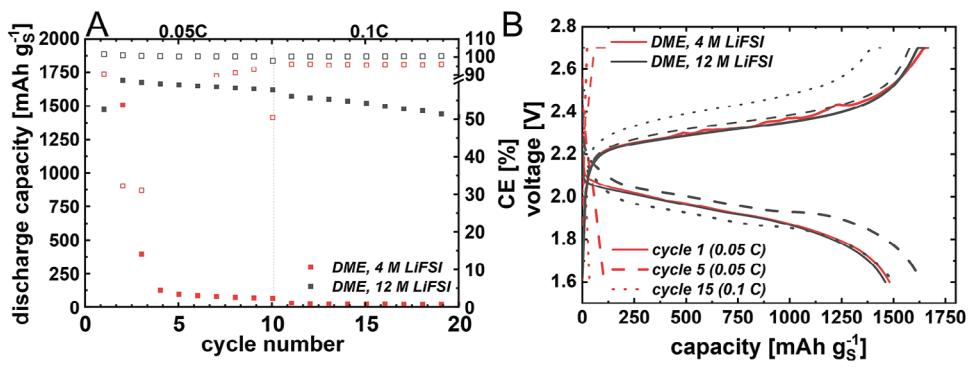
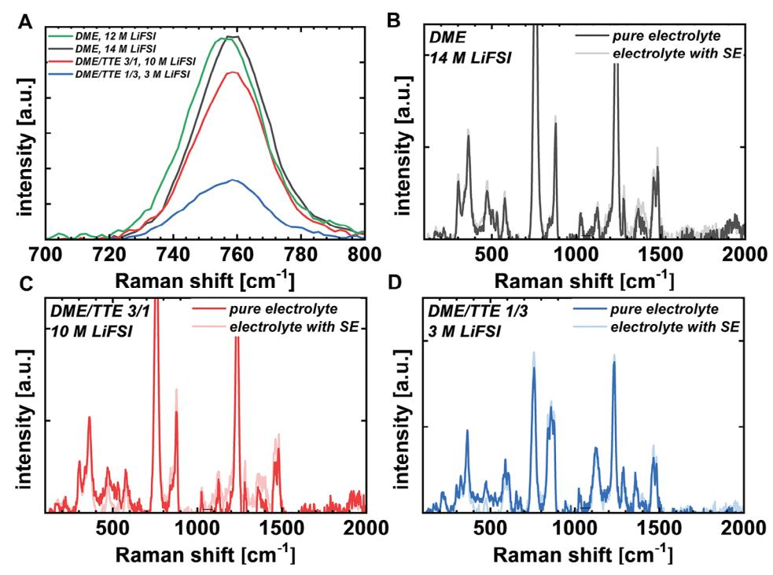
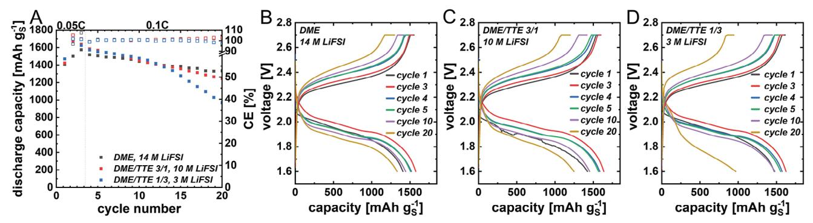
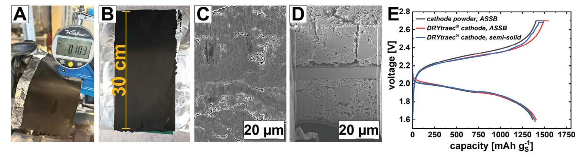
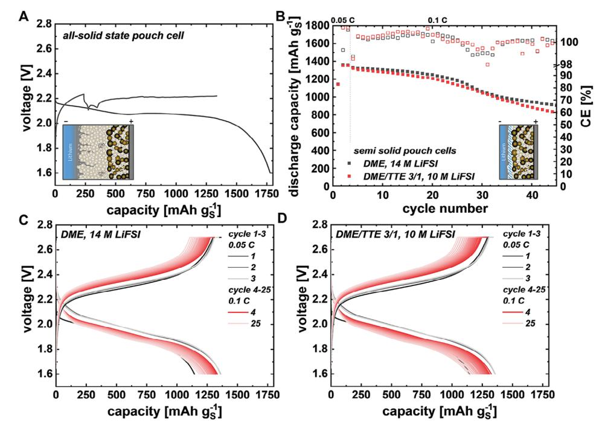

# **A Small Electrolyte Drop Enables a Disruptive Semisolid High-Energy Sulfur Battery Cell Design via an Argyrodite-Based Sulfur Cathode in Combination with a Metallic Lithium Anode**

*Sebastian Kirchhoff, Magdalena Fiedler, Arthur Dupuy, Paul Härtel, Maria Semmler, Felix Hippauf, Susanne Dörfler,\* Benjamin Schumm, Thomas Abendroth, Holger Althues, and Stefan Kaskel*

**Lithium–sulfur batteries with liquid electrolytes are discussed as the most promising post-lithium-ion-battery technology in literature due to their high theoretical specific energy and first prototype cells delivering** *>***470 Wh kg−1. Although several electrolyte and material concepts are developed that partially solve the issue of the so-called shuttle mechanism, the most promising concept to genuinely confine sulfur species in the cathode is all-solid-state argyrodite–sulfur cathodes leading to almost theoretical active material utilization by maintaining reasonable sulfur loadings and electrolyte to sulfur ratios. However, this battery concept has so far not achieved reversible cycling against metallic lithium anodes as it requires high pressures for manufacturing, and ductile lithium metal creeps along the grain boundaries of the solid electrolyte particles leading to short cuts of the cells. Recent findings show that metallic lithium, however, can be stably cycled with dimethoxyethane/lithiumbis(fluorosulfonyl)imide (DME/LiFSI)-based electrolytes. Herein, for the first time, a semisolid concept is presented combining the benefits of an argyrodite-based solid-state cathode and a DME/LiFSI/hydrofluoroether-based anolyte concept – in coin cells and first pouch cells. This disruptive approach enables projected specific energies higher than 600 Wh kg−1 at cell stack level.**

S. Kirchhoff, M. Fiedler, A. Dupuy, P. Härtel, M. Semmler, F. Hippauf, S. Dörfler, B. Schumm, T. Abendroth, H. Althues, S. Kaskel Fraunhofer Institute for Material and Beam Technology IWS Winterbergstrasse 28, 01277 Dresden, Germany E-mail: [susanne.doerfler@iws.fraunhofer.de](mailto:susanne.doerfler@iws.fraunhofer.de)

S. Kirchhoff, M. Fiedler, S. Kaskel Chair of Inorganic Chemistry I TUD Dresden University of Technology 01062 Dresden, Germany

The ORCID identification number(s) for the author(s) of this article can be found under <https://doi.org/10.1002/aenm.202402204>

© 2024 The Author(s). Advanced Energy Materials published by Wiley-VCH GmbH. This is an open access article under the terms of the [Creative Commons Attribution](http://creativecommons.org/licenses/by/4.0/) License, which permits use, distribution and reproduction in any medium, provided the original work is properly cited.

#### **DOI: 10.1002/aenm.202402204**

### **1. Introduction**

Lithium–sulfur batteries (LSBs) have been discussed as one of the most promising post-lithium-ion-battery technologies in literature for the last decade due to their high theoretical specific energy of 2600 Wh kg−1 and first prototype cells delivering *>*470 Wh kg−1. [\[1\]](#page-9-0) However, several drawbacks are still existing in case of liquid LSB concepts, especially cycling stability while restricting the electrolyte excess in combination with a reasonable sulfur utilization still hinders the commercial breakthrough of this battery technology.[\[1,2\]](#page-9-0) One main reason is the dissolution of the active material, sulfur, as polysulfides (PS) in the electrolyte, which leads to the so-called polysulfide shuttle that includes polysulfide diffusion through the cell to the lithium metal anode resulting in decomposition reactions, and therefore, loss of active material.[\[3\]](#page-9-0) Several electrolyte approaches in order to limit polysulfide dissolution have been

developed over the last 5–10 years.[\[4\]](#page-9-0) However, those electrolyte formulations usually lead to a strong lithium metal corrosion, especially when thin (50 μm) lithium foils in pouch cells are employed.[\[5,6\]](#page-9-0) Electrolytes that enable stable cycling of lithium metal batteries in combination with a nickel manganese cobalt oxide (NMC) cathode have been successfully developed, however, they are usually not compatible with the polysulfides of Li─S batteries, especially when relatively low lithium ion concentrations are used.[\[7\]](#page-9-0) Hence, decoupling the anolyte from the catholyte has been much desirable. One concept in order to decouple anolyte and catholyte in LSBs is so-called sulfurized polyacrylonitrile (S-PAN) in combination with lithium-bis(fluorosulfonyl)imide (LiFSI)/dimethoxyethane (DME)- and/or LiFSI/DME/hydrofluoroether (HFE)-based electrolytes as the LiFSI anion in combination with the fluoroether seems to build up a stable catholytic solid interface and a solid

**Scheme 1.** Scheme with components from liquid and all-solid-state Li─S cells are combined in the presented semisolid state cell concept.

electrolyte interface on the anode side.[\[8\]](#page-9-0) In the commercial S-PAN system, however, the sulfur loading is currently limited to 38–47 wt%.[\[9\]](#page-9-0) More importantly, the cathodes are still quite porous and this porosity needs to be always filled with liquid electrolyte (LE), which is mostly the heaviest part of liquid LSB cells (see **Scheme 1**).[\[1\]](#page-9-0)

So far, the threshold for energy density of practical S-PANbased cells is 265–300 Wh kg−1 as stated by Liu within an oral presentation at the International Conference on Lithium Sulfur Batteries in 2021.[\[10\]](#page-9-0) In 2023, the Japanese company Adeka Corporation showed 280 Wh kg−1 on 7 Ah pouch cell scale and 450 Wh kg−1 on 10 Ah scale. However, this value unlikely includes all components of the cell. An alternative for a true sulfur encapsulating and electrochemical solid–solid conversion without any polysulfides on the cathode side might be the recently introduced solid-state lithium sulfur battery based on sulfidic solid electrolyte (SE).[\[11,12\]](#page-9-0) At least on the cathode side, several challenges of today's LSBs can be solved with this concept – such as complete suppression of the polysulfide shuttle as well as almost theoretical sulfur utilization while maintaining decent active material loadings and (solid) electrolyte to sulfur weight ratios (E:S) as low as 1.5. The latter is almost not feasible in cells with the liquid LSB conversion chemistry. However, solid-state/sulfidic LSBs have not been cyclable so far when a thin, and hence reasonable, layer of solid electrolyte and a lithium metal anode (without indium) were employed, especially in pouch cells, due to lithium creeping or rather the formation of lithium dendrites, resulting in short circuits or even just one discharge slope.[\[12,13\]](#page-9-0)

Recently, a perspective on "all-solid to almost-solid" state batteries was published which categorizes the respective cell concepts according their entire solvent content, and 10–15 wt% solvent weight shares are defined as "semisolid."[\[14\]](#page-9-0) "Almost-solid" state batteries are defined with a solvent weight share below *<*5 wt%, but are also characterized by a certain separation of anolyte and catholyte. In 2022, Pasta and co-workers had presented a solid-state concept comprising a sulfur LSB concept with the polymerized catholyte that was separated by a thin solid argyrodite-based electrolyte film.[\[15\]](#page-9-0)

Herein, to the best of our knowledge, for the first time, a unique LSB cell concept with liquid anolyte and solid catholyte combining the advantages of both aforementioned liquid and solid LSB cell concepts is presented – both in coin as well as in first prototype pouch cells. On the cathode side, an electrode comprising carbon, sulfur, and sulfidic solid electrolyte (argyrodite) enables a "solid-to-solid" conversion of sulfur resulting in a complete suppression of the polysulfide shuttle while maintaining a sensible cathode loading without porosity filled by liquid electrolyte. On the anode side, a liquid-presaturated electrolyte enabling stable cycling of a lithium metal anode with decreased lithium corrosion is employed. As this concept is half-solid and half-liquid, we refer to as "semisolid" derived from the Latin term "semi" – although it might meet more the characteristics of the "almost solid" state approach according to Huo and Janek.[\[14\]](#page-9-0)

A careful design of the liquid DME–HFE–LiFSI-based electrolyte is crucial in order to obtain high electrochemical stability of this particular electrolyte against the lithium metal anode and to prevent side reactions between the solid electrolyte of the cathode and the liquid electrolyte. A saturation of the Li– DME coordination sphere can be shown as a promising pathway in order to tackle both challenges. Consequently, different electrolyte compositions by adding 1,1,2,2-tetrafluoroethyl 2,2,3,3 tetrafluoropropyl ether (TTE) as diluent solvent, are evaluated and discussed for the new cell design. The concept was successfully implemented in coin cells leading to 100 cycles with a stable Coulombic efficiency (CE) of over 99%, which outperforms the majority of previously published Li─S cycling data. In addition, the concept was also transferred into first semisolid lithium–sulfur pouch cells by the continuous roll-to-roll DRYtraec process.[\[16\]](#page-9-0) Prospectively, this disruptive cell concept enables higher specific energies than the hitherto existing Li/S-cell concepts or Li metal/NMC cells since no cathode porosity needs to be filled with liquid electrolyte. Thus, a projected energy density as high as 621 Wh kg−1 at stack level is reached (see **Table [1](#page-2-0)** and the Supporting Information). Consequently, this disruptive concept enables a breakthrough by significant enhancement of the specific energy delivered by Li–S battery cells.

**[www.advancedsciencenews.com](http://www.advancedsciencenews.com) [www.advenergymat.de](http://www.advenergymat.de)**

**Table 1.** Estimated specific energy at stack level for different cathode systems and the respective porosities that need to be filled with electrolyte volume/mass.

|                      | Active material (AM) content [%] | Porosity [%] | Specific energy at stack levelb) [Wh kg−1] |
|----------------------|----------------------------------|--------------|--------------------------------------------|
| Cathode systema)     |                                  |              |                                            |
| S8/C                 | 60                               | 78           | 399                                        |
| S8/C calendered      | 60                               | 69           | 492                                        |
| S-PAN                | 90                               | 50           | 355                                        |
| S-PAN calendered  | 90                               | 30           | 429                                        |
| NMC                  | 95                               | 20           | 566                                        |
| Semisolid concept | 30                               | –            | 621                                        |
| Semisolid concept | 40                               | –            | 741                                        |

a) Estimated with 4 mAh cm−2 cathode nominal areal capacity on 12 μm Al current collector; anode areal capacity of 6 mAh cm−2 (≈30 μm Li foil at 100% state of charge (SOC), excess factor 1.5); 12 μm separator filled with electrolyte (1.3 g cm−3); b) Stack with footprint, consists of 30 double-sided (ds) cathodes and 29 ds + 2 ss anodes, w/o tabs and housing, separator: porosity of 40%, areal weight: 0.8 mg cm−2, further details shown in the Supporting Information.

#### **2. Results and Discussion**

#### **2.1. Morphological and Electrochemical Characterization of the Manual Argyrodite–Sulfur/Carbon-Composite Cathode**

The cathode was prepared as described in our previous work.[\[12\]](#page-9-0) Carbon (Printex XE2B), sulfur, and solid electrolyte were processed in a ball mill using harsh conditions to form triple phase boundaries, ensuring electronic and ionic pathways within the cathode. Following, a homogenous cathode composite with small-scale particles was obtained, as shown in **Figure 1**A,B. The described all-solid-state cathode was combined with liquid electrolyte as anolyte, to enable the usage of a metallic lithium anode. As proof of concept, a highly concentrated electrolyte was chosen (12 m LiFSI in DME), in order to ensure the stability of the cathode and suppress solubility of sulfur/polysulfides. Following, the cathode was electrochemically characterized in an all-solidstate setup (argyrodite-based sulfur/carbon cathode/solid electrolyte layer/LiIn alloy anode) as well as in coin cells (argyroditebased sulfur/carbon cathode/12 m LiFSI in DME/metallic Li

**Figure 1.** A,B) Scanning electron microscopy (SEM) image of sulfur/carbon/argyrodite-composite cathode prepared according to Fiedler et al.,[\[12\]](#page-9-0) C) galvanostatic (dis)charge slopes versus metallic lithium anode 25 °C, 0.05 C of the cathode in LiFSI/DME electrolyte in comparison with cycling in a solely argyrodite-based cell setup D) with the corresponding cyclovoltammogram (0.015 mV s−1). The voltage of the all-solid-state cell was recalculated versus Li/Li+, since an InLi anode was used in the half-cell setup, resulting in voltage difference of −0.62 V.

anode). The voltage profiles of both approaches are presented in Figure [1C.](#page-2-0) It has to be mentioned that the voltage of the allsolid-state cell was recalculated versus Li/Li+, since an InLi anode was used in the half-cell setup, resulting in voltage difference of −0.62 V versus Li+/Li. The voltage profiles of both cell setups show a comparable behavior during each of the first three cycles. Only one plateau (2.0 V vs Li/Li+) is pronounced during discharge as wells as during charging (2.3 V vs Li/Li+). During the first discharge, a capacity of 1500 mAh gS −1 was utilized in both cell setups while a higher charge capacity of more than 1650 mAh gS −1 was reached, leading to the assumption that solid electrolyte degradation occurs, as described in literature.[\[17\]](#page-9-0) During the first cycle, ionic and electronic pathways are formed and the sulfur conversion of S8 into Li2S takes place, leading to a finer dispersion of sulfur species and thus a higher utilization during the following cycles. The second and third cycles (red and blue) are characterized by a high sulfur utilization of *<*1650 mAh gS −1, where the voltage profiles of the semisolid and all-solid-state cell setup show the same behavior.

It was noticed that shoulders are evolving in the discharge slope. The mechanism of the solid–solid conversion reaction is still not fully understood. The conversion reaction of elemental sulfur to Li2S consumes 16 electrons, which is why a stepwise reduction reaction can be assumed: 16Li+ + S8 + 16e− → 8Li2S.

Recent work of Cao et al. gave evidence that Li2S2 is present during discharge, confirming the assumption of a stepwise reduction.[\[18\]](#page-9-0) Hence, the observed shoulders during discharge can be referred to a stepwise solid–solid conversion reaction.

Nonetheless, the absence of a defined second voltage plateau can be explained with the absence of liquid polysulfides in the semisolid approach proofing the feasibility of this system. In addition to the galvanostatic cycling, cyclovoltammetry was performed to compare the aforementioned cell systems, as depicted in Figure [1D.](#page-2-0) The cyclic voltammetry (CV) of the all-solid-state cell displays a double peak at 1.8 and 1.95 V versus Li/Li+ during negative current, which is emerging after the first cycle. During positive scan, only one peak is observed at 2.4 V versus Li/Li+, which is shifted to higher voltage (2.5 V vs Li/Li+) in the subsequent cycles. Compared to that, the semisolid cell demonstrates a similar behavior but at lower current densities. Again, a double peak during reduction is observed at slightly higher voltage of 1.85 and 1.95 V versus Li/Li+ and one peak during oxidation at 2.4 V versus Li/Li+. As discussed previously, a stepwise reduction reaction of S8 to Li2S can be assumed, explaining the presence of two peaks at negative currents. In general, the voltage profiles during galvanostatic cycling and cyclic voltammetry showed the same behavior, where the same cathode chemistry was observed for both systems. Thus, the feasibility of the semisolid approach was demonstrated, as the outstanding cathode chemistry of allsolid-state cathodes was transferred into the semisolid system without any significant changes.

#### **2.2. Influence of the Liquid Electrolyte Composition on the Cell Performance**

In order to understand the influence of the liquid electrolyte composition, two different electrolytes were compared in a first step. Previously reported DME/LiFSI electrolytes led to tremendous lithium anode stability in lithium metal batteries as well as S-PAN cells.[\[19\]](#page-10-0) However, in recent publications discussing hybrid lithium-ion cell concepts, it could be shown that free solvent molecules can react with the solid electrolyte, forming a so-called solid liquid electrolyte interface (SLEI).[\[20\]](#page-10-0) Thus, higher salt concentrations, which reduce the amount of free solvent molecules, could reduce possible side reactions and lead to a stabilization of the semisolid cell. In addition, in case of the semisolid LSBs considered here, preventing the dissolution of the active material sulfur in the electrolyte is also important. Therefore, two different DME electrolytes comprising 4 m LiFSI and 12 m LiFSI are compared.[\[19,21\]](#page-10-0) The electrolytes were evaluated in semisolid coin cells, using a C-rate of C/20 for the first ten cycles and a Crate of C/10 for the further cycles. The cycling performance for both electrolytes is shown in **Figure [2](#page-4-0)**. Although, both electrolytes lead to high sulfur utilization of 1500 mAh gS −1 in the first cycle with the same one plateau voltage profile (Figure [2B\)](#page-4-0) indicating the proposed solid–solid conversion mechanism, a fast capacity loss is observed for the 4 m LiFSI electrolyte afterward. This leads to an early cell failure already after three cycles. By contrast, the 12 m LiFSI shows high sulfur utilization for both C-rates, with only a minor overpotential at 0.1 C. Thus, an extraordinary high capacity retention reaching over 1400 mAh gS −1 after 20 cycles was achieved with a constant high Coulombic efficiency close to 100%. Interestingly, the Coulombic efficiency of the 12 m LiFSI electrolyte is slightly above 100%, indicating kinetic limitations during charging or marginal side reactions during discharge. However, the two significant challenges of LSB, limited sulfur utilization as well as low Coulombic efficiencies, could be solved in this new cell design. In addition, stable cycling with a lithium metal anode, a major hurdle for present all-solid-state cells is also possible.

Regarding the liquid electrolyte, the results indicate the importance of the higher salt concentration in order to saturate the coordination sphere of the solvent. Indeed, by comparing the postmortem analysis (Figure S1, Supporting Information) of the cells with the two electrolytes, a yellow coloration of the separator is observed in case of the 4 m LiFSI electrolyte. Thus, polysulfides can still be formed in this cell setup, leading to a rapid collapse of the cathode structure. However, this is not observed in case of the 12 m LiFSI electrolyte, confirming the potential of higher salt concentrations or rather presaturated electrolyte. Consequently, further adaption of the high concentrated electrolyte might be the next promising step in order to use the full potential of the herein developed cell concept.

#### **2.3. Adaption of the Liquid Electrolyte Composition by Hydrofluoroethers**

As shown so far, a higher salt concentration of the electrolyte prevents the dissolution of polysulfides and reduces side reactions between the SE and the LE. However, the saturation of the coordination sphere of DME is not reached in case of the 12 m LiFSI electrolyte. Thus, a further adaption of the electrolyte composition might result in even higher stability. Unfortunately, an increase of the salt concentration will also limit the energy density of the cell as well as the electrolyte transport kinetics by an increase of viscosity and therefore a reduced ionic

**Figure 2.** A) Galvanostatic (dis)charging of manual sulfur/carbon/argyrodite-composite cathode in DME-based electrolytes versus metallic lithium with two different LiFSI concentrations (cycle stability); B) the corresponding galvanostatic (dis)charge slopes versus metallic lithium anode at 25 °C in LiFSI/DME with the respective concentration.

conductivity. To overcome these hurdles, a diluent solvent with no solvation ability is introduced in order to reduce the viscosity while maintaining the complete saturation of the DME coordination sphere. Therefore, TTE, a hydrofluoroether, was chosen as additional solvent, thus so-called "locally high concentrated electrolytes" are obtained.[\[22\]](#page-10-0) To evaluate the influence of TTE, three different electrolytes are compared, DME saturated with LiFSI and two diluted electrolytes with a DME/TTE ratio of 3/1 and 1/3. First, ionic conductivity as well as electrolyte viscosity were determined, shown in Figure S2 (Supporting Information). As expected, the addition of TTE has a significant impact on the electrolyte viscosity. In comparison to the electrolyte without TTE ( = 320 mPa s), the viscosity could be decreased by 56% for the DME/TTE 3/1 electrolyte ( = 140 mPa s) and by 98% for the DME/TTE 1/3 electrolyte ( = 6.5 mPa s). These values (especially of the first two samples) are significantly higher than for state-of-the-art electrolytes. Therefore, the wetting behavior of the electrolytes might be worse. However, for the herein introduced semisolid cell concept, no wetting of a porous carbon cathode is necessary. Hence, this is a negligible effect, which is proven by the decent cell performance of the 12 m LiFSI electrolyte as well as for the further adapted electrolytes, whose electrochemical performance is discussed later on. In addition, the ionic conductivity is also positively affected by the addition of TTE. Interestingly, only a marginal difference can be observed between the two different TTE-containing electrolytes, which show similar ionic conductivities of 2 mS cm−1 (DME/TTE 3/1) and 2.1 mS cm−1 (DME/TTE 1/3). Hence, the ionic conductivity was improved by 70% in comparison to the undiluted DME/LiFSI electrolyte ( = 1.2 mS cm−1). Thus, the ionic conductivities are suitable as battery electrolytes exceeding the values of previously reported sparingly polysulfide solvating electrolytes.[\[6\]](#page-9-0)

Raman spectroscopy was performed to evaluate the lithiumion coordination sphere. In the area of 720 to 760 cm−1, the vibration of the S─N─S-bond of the FSI anion can be used to specify the dominating type of ions.[\[23\]](#page-10-0) In case of solvent-separated ion pairs, the band is shifted to lower wave numbers. For the three electrolytes investigated in this work, the band is at a wave number of 759 cm−1, which corresponds to the formation of aggregates. This is an intuitive finding as the high salt concentration usually leads to a more pronounced aggregation of the electrolyte salt. In comparison to the 12 m LiFSI electrolyte, a small shift is observed to higher wave numbers, indicating that the increased salt concentration still has an influence on the solvation behavior. This is highly relevant in order to reduce interactions between the SE and the LE. In addition, Raman spectroscopy is also suitable to evaluate the stability of the solid electrolyte against the liquid electrolyte. Therefore, small amount (10 mg in 1 mL) of solid electrolyte was dispersed in the liquid electrolyte. After 24 h, the electrolyte was filtered and the obtained samples were also evaluated via Raman spectroscopy in order to validate whether the SE decomposes/dissolves in the electrolyte. In case of a dissolution of the SE in the LE, an additional band of the PS4 3− unit at 426–427 cm−1 should be observed.[\[24\]](#page-10-0) By comparing the spectra of the pure electrolyte and the one dispersed with SE, no further band can be observed in the Raman spectra (**Figure 3**[B–D\)](#page-5-0). The Raman spectra of larger amounts of argyrodite powder (100 mg in 1 mL) exposed to the liquid electrolyte are shown in Figure S3 (Supporting Information). It can be seen, even after repeating the measurements 3 times, no changes in the spectra for each liquid electrolyte system were observed. This proves a principle chemical stability of the combined pristine solid–liquid electrolyte systems – without application of an electric field. However, the optical image shows that for the 4 m LiFSI concentration, a slightly yellowish coloration was visible which needs further investigation beyond the scope of this work.

In order to further evaluate the interactions between the liquid and the solid electrolyte, electrochemical impedance spectroscopy (EIS) was performed. Several hybrid battery approaches introduced in literature showed that a SLEI is formed between the LE and the SE due to side reactions as, for example, nucleophilic attack of the ethereal function on the phosphor of sulfidic solid electrolytes.[\[25\]](#page-10-0) Depending on the electrolyte, thickness and composition, and therefore the resistance of the additional interface, can vary, and increases over time which would decrease cycle life significantly. In this work, a cell with two Alcurrent collectors used as electrodes comprising liquid electrolyte and a SE layer which were separated by a glass fiber separator, (Al/LE/Separator/SE/Al), was used for EIS measurements over 100 h. The results are shown in Figure S4 (Supporting Information). In addition to the three saturated electrolytes, also the 4 m LiFSI electrolyte was evaluated in the same setup. Since the electrolyte with a concentration of 4 m LiFSI contains still free

**Figure 3.** Raman spectra. A) Determination of the dominating ion species; B–D) spectra of the pure electrolytes in comparison to the filtered electrolyte after exposition with argyrodite powder.

solvent molecules, these molecules could react with the SE, hence a thicker SLEI might be formed, resulting in higher resistances especially over time. By contrast, the saturation of the whole DME coordination sphere should prevent side reactions between SE and LE, and therefore, lower resistance and minor increase of the latter over time. Indeed, a high stability can be observed over time for the saturated electrolytes. In addition, an increase of the resistance with increasing DME content is observed caused by the lower transport properties due to the higher salt concentration of the electrolytes. Interestingly, the 4 m LiFSI electrolyte shows the highest ionic conductivity (5.7 mS cm−1[\[19\]](#page-10-0) ), despite the highest impedance, which also increases further over time, indicating the proposed formation of a thick SLEI due to a high amount of free solvent molecules.

Since the three saturated electrolytes show sufficient electrolyte properties as well as good stability against SE, coin cell tests were performed, shown in **Figure 4**. In contrast to the first tests, which demonstrated that stable cycling is possible for both C-rates, 0.05 and 0.1 C, only three cycles at 0.05 C discharge current were carried out as formation of the cells. Subsequently, the cells were cycled at 0.1 C. Similar to the 12 m LiFSI electrolyte, high sulfur utilization is observed for all three electrolytes with an increase of the obtained capacity after formation in cycle 1, resulting in a maximum capacity of over 1600 mAh gS −1 in the second cycle. The increase of C-rate to 0.1 C results in a slight overpotential. However, a high capacity retention of over 1200 mAh gS −1 is reached after 20 cycles for the pure DME and the DME/TTE 3/1 electrolyte. By contrast, the DME/TTE 1/3 electrolyte shows

**Figure 4.** A) Galvanostatic (dis)charging of manual sulfur/carbon/argyrodite-composite cathode in DME-based electrolytes versus metallic lithium in coin cells of adapted electrolyte compositions (cycle stability); B–D) the corresponding galvanostatic (dis)charge slopes versus metallic lithium anode at 25 °C in LiFSI/DME(/TTE).

a faster capacity fading starting already in cycle 14, leading to a capacity of 1000 mAh gS −1 in cycle 20. Thus, a dilution of the DME electrolyte with TTE is a suitable approach, but the amount of TTE should not surpass a certain threshold as possible side reactions of the TTE solvent with the solid electrolyte might occur during cycling. Interestingly, for these adapted electrolytes, the CE of the coin cells is also slightly above 100% as observed for the 12 m LiFSI electrolyte. Since the saturation of the solvent coordination sphere was reached, a decomposition reaction between SE and LE might be excluded as possible reason in this case. However, these experiments have been carried out without electric current/electric field. Recent publications on solidstate batteries could show that the solid electrolyte contributes to the total capacity of the cell.[\[17,26\]](#page-9-0) Thus, an irreversible reaction concerning the solid electrolyte might lead to this phenomenon. However, to verify the reason, further (operando/in situ) studies on this system are needed.

To exclude PS shuttle as reason for the slightly increased CE as well as to prove the suppression of PS in general, photographic analyses of additional coin cells at 50% SOC with the three different electrolytes were performed. The cells were stopped at 50% SOC during the charging step. At this SOC, PS would be expected in case of a regular LSB with a liquid electrolyte. The results of the post mortem (PM) analysis shown in Figure S5 (Supporting Information) reveal that no PS are formed since no coloration of the separator or the lithium metal anode surface can be observed. In addition to the galvanostatic cycling at a constant Crate, rate capability tests were performed, shown in Figure S6 (Supporting Information). At 0.2 C, still a similar performance can be observed. However, at higher C-rate above 0.5 C, the sulfur utilization decreases significantly. One reason for this low rate capability could be the interface resistance from the liquid to the solid phase. A certain energy barrier must be overcome when the solvation sphere of the lithium ion needs to be stripped so that the latter can enter the argyrodite phase.

#### **2.4. Morphological and Electrochemical Characterization of the DRYtraec-Argyrodite–Sulfur/Carbon-Composite Cathode**

Since coin cell tests of the semisolid approach had been promising, an upscaling process was desired to provide sufficient cathode material for pouch cell assembly. DRYtraec is an advanced sustainable process technology for battery electrodes developed by Fraunhofer IWS.[\[16\]](#page-9-0) Therefore, the ball milling process was upscaled, as described in the Supporting Information. The cathode powder was prepared batchwise to obtain a minimum of 100 g of cathode material. In the previous discussed sections, the dry-film cathode was manually prepared. As a homogeneity of the cathodes is crucial to provide reproducibility of the electrochemical performance, the aim was to transfer the cathode production to the DRYtraec technology. As described in previous work, DRYtraec technology enables the solvent-free cathode preparation and concerted transfer to a primed current collector substrate. The challenge was to adapt the production via DRYtraec for solid-state materials as only cathodes for liquid cells (Li-ion and Li─S) had been manufactured before.[\[5,27\]](#page-9-0) After fibrillation of the solid-state cathode composite with polytetrafluoroethylene (PTFE) as binder, homogenous cathode sheets were successfully obtained, containing a low binder content of 0.5 wt%. **Figure 5**[A,B](#page-7-0) displays the double-sided cathode sheets, which were prepared with a coating thickness of ≈50 μm at each side (corresponding to 1.8 mgS cm−2 at single side) with a length of 30 cm. From the SEM image in Figure [5C,](#page-7-0) it can be seen that the cathode is more densified as observed for the manual process (Figure S7, Supporting Information), caused by the higher applied pressure in the calender. Nonetheless, FIB-SEM imaging (Figure [5D\)](#page-7-0) demonstrates that still a certain porosity within the cathode remains. Furthermore, the cathode morphology of the upscaled batch seems to be comparable to the small-scale batch (see Figure [1\)](#page-2-0) showing small-scale particles. It can be seen that a sufficient contact between the current collector and the coated cathode is ensured on both sides of the cathode sheet.

The DRYtraec cathodes were tested in both approaches, allsolid state and semisolid. Additionally, the pure cathode powder before calendering was tested in a pressurized torque cell, to receive insights about the electrochemistry of the upscaled batch itself and to observe a possible influence of the DRYtraec process on the electrochemical performance. The voltage profiles of the first cycle of each system can be seen in Figure [5E.](#page-7-0) The slopes of all tested cells demonstrate the same behavior. During the first discharge, 1400 mAh gS −1 is addressed. Again, shoulders within the discharge plateau at 1.9 V versus Li/Li+ are observable, as discussed previously. During charging, one plateau at 2.3 V versus Li/Li+ is pronounced, reaching a capacity of *>*1500 mAh gS −1. Compared to the small-scale cathode, a decrease of the capacity is present, where an initial discharge capacity of 1500 mAh gS −1 and charge capacity of *>*1650 mAh gS −1 was demonstrated. The loss of capacity can be explained with the upscaling of the cathode batch. It was demonstrated that the energy impact during ball milling on the cathode material is crucial to obtain triple phase boundaries and even distribution on a nanometer scale, as discussed in literature.[\[12,28\]](#page-9-0) The upscaling in the ball mill could lead to decreased energy impact, followed by a reduced formation of triple phase boundaries, which ensure electronic and ionic pathways within the cathode and hence show a direct influence on the addressability of sulfur. Nonetheless, high capacities are still achieved with comparable voltage profiles of all three cells. In addition, long-term cycling performance was also evaluated for the semisolid approach with the DRYtraec-manufactured cathodes, shown in Figure S8 (Supporting Information). In coin cells, 100 cycles were successfully demonstrated, using the 12 m LiFSI/DME electrolyte with a capacity retention of still 880 mAh gS −1 in cycle 100. Thus, the transfer of the manual dry-film production to the DRYtraec process is feasible.

#### **2.5. Implementation of the Adapted LiFSI/DME/TTE Electrolyte in Pouch Cells with Metallic Lithium Anode and Argyrodite–Sulfur/Carbon-Composite Cathode**

Although we recently could show successful cycling of all solid state Li–S pouch cells with thin solid electrolyte layer by using a lithium–indium alloy anode, pure lithium metal anodes lead to early cell failure already during the first charge, as shown in **Figure 6**[A.](#page-7-0) [\[12\]](#page-9-0) Very high sulfur utilization of over

**Figure 5.** A,B) Photographic image of the double-coated all solid state battery (ASSB) Galvanostatic dry-film cathode prepared via DRYtraec, C) SEM image (top-view) of the single-coated DRYtraec cathode, D) FIB-SEM image of the double-coated DRYtraec cathode, E) galvanostatic (dis)charge slopes versus metallic lithium anode 25 °C, 0.05 C of the pure cathode powder cathode, DRYtraec ASSB cathode, and DRYtraec cathode in 12 m LiFSI/DME.

1600 mAh gS −1 could be reached during the first discharge, indicating the potential of the cell concept. However, the following charging step leads to cell failure due to dendrite formation at the lithium metal anode, resulting in short circuit of the cell. It should be noted that the shown slopes are an example for 24 trial pouch cells, all leading to either direct short cuts or could not be charged after the first successful discharge.

By contrast, in the novel semisolid concept, short circuits can successfully be prevented by the introduction of a liquid electrolyte on the anode side, as already shown in coin cells. To demonstrate the applicability of the herein introduced semisolid cell concept at prototype cell level, Li─S pouch cells with the three DME(/TTE) electrolytes saturated with LiFSI, introduced in Section [2.3,](#page-3-0) were assembled, comprising a double-sided cathode (prepared via DRYtraec) and two single-sided (ss) lithium metal anodes. The pouch cell results in Figure 6B–D demonstrate the feasible transfer of the concept into practically relevant cells since reversible cycling is possible with a high sulfur utilization at both C-rates of 0.05 and 0.1 C. The slightly lowered sulfur utilization can be explained by the electrochemical performance of the upscaled batch, as discussed before (see Section [2.4\)](#page-6-0). The electrochemical performance of the semisolid pouch cell is comparable to the performance of the coin cells using DRYtraec electrodes, which was discussed in Figure 5E. The Coulombic efficiency of the cell is again slightly above 100%, in

**Figure 6.** A) Galvanostatic discharging of a pouch cell comprising manual sulfur/carbon/argyrodite-composite cathode in combination with an argyrodite-based separator layer and versus metallic lithium, B) galvanostatic (dis)charging of a pouch cell comprising a sulfur/carbon/argyroditecomposite in DME-based electrolytes versus metallic lithium with two different electrolyte compositions (cycle stability) at 25 °C, C) voltage profiles of the pouch cells using DME, 14 m LiFSI as electrolyte, D) voltage profiles of the pouch cells using DME/TTE 3/1, 10 m LiFSI as electrolyte.

agreement with the coin cell results and already discussed in Section [2.3.](#page-3-0) Thus, the argyrodite-based sulfur/carbon cathode, which prevents the formation of polysulfides and therefore prevents polysulfide shuttle, was successfully coupled and reversibly cycled for the first time with a stable lithium metal anode in pouch cells.

In addition to the stabilization of the lithium metal anode, the herein developed concept offers also practical advantages since the applied external pressure (0.62 MPa for the semisolid cell) can be significantly decreased in comparison to all solid-state cells by at least an order of magnitude. The third liquid electrolyte DME/TTE 1/3 shows a significantly decreased performance with faster capacity fade than the electrolyte with the higher LiFSI concentration (Figure S9, Supporting Information). This is in line with the results obtained in coin cells, emphasizing the importance of the liquid electrolyte composition for the semisolid cell concept.

# **3. Conclusion**

In this study, we introduced a novel semiliquid–solid Li–S-battery cell concept, which enables prospectively high specific energies above 600 Wh kg−1 by the mechanistic decoupling of the catholyte and the anolyte. Thus, a solid-state cathode was successfully paired with a lithium metal anode by applying an etherbased liquid electrolyte on the anode side. This novel cell concept solves several existing challenges of the lithium–sulfur battery technology.

- 1) The polysulfide shuttle phenomena is completely suppressed by the use of an argyrodite solid-state cathode, while the adaption of the liquid electrolyte enables high compatibility with the solid argyrodite electrolyte.
- 2) These cathodes enable significantly higher sulfur utilization (1600 mAh g−1) at low E:S ratio, while maintaining decent sulfur areal loading than obtained in conventional liquidelectrolyte-based Li/S cells. This is mainly attributed to the fact that no infiltration of the liquid electrolyte in the cathode is required, which enables a higher compaction of the cathode.
- 3) A lithium metal anode, which led so far to early cell failure due to short circuits in sulfidic solid concepts under practical pouch cell conditions (thin separator layers), could be stably cycled. Thus, first cells could be successfully cycled over 100 times by preserving high capacity retention. In addition, an upscaled dry-film-manufacturing approach (DRYtraec process) enables the successful evaluation of this novel semisolid Li─S concept versus metallic lithium foil in pouch cells, which achieve, in contrast to state-of-the-art sulfidic all-solid state pouch cells, reversibly (dis)charged. Thus, this disruptive semisolid cell concept was successfully transferred into practical pouch cells. In future work, this cell concept must be further investigated by operando or in situ measurements (Raman, X-ray absorption and/or diffraction, etc.) in order to elucidate the detailed mechanism of this disruptive cell concept. In addition, a focus should be set on the interactions between solid and liquid electrolyte and further development of the multilayered pouch cell manufacturing.

# **4. Experimental Section**

*Preparation of Manual Dry-Film Cathodes*: The preparation of the cathode composite was performed in an argon-filled glove box. In a first step, sulfur (Sigma-Aldrich), carbon (Printex XE2B, Orion), and solid electrolyte (NEI) were mixed in a weight ratio of S/C/SE = 30/20/50 and ball-milled (PM 100, Retsch, 50 mL jar, 60 g ZrO2 balls with *Ø* 5 mm) for 4 h at a rotation speed of 400 rpm. To prepare a freestanding cathode dry film, 0.5 wt% of PTFE was added to the prepared cathode composite. Afterward, the blend was transferred in a heated mortar and sheared, until a single cathode flake was formed. The flake was rolled out on a heated plate to a thickness of ≈50 μm. For the assembly of ASSB cells, the freestanding cathode dry film was stomped out to 11 mm. For the assembly of semisolid cells, the freestanding cathode was sealed on a primed aluminum current collector and stomped to 13 mm for coin cell assembly.

The cathode composite for pouch cell assembly was prepared following the same procedure as described before (4 h at a rotation speed of 400 rpm) but batchwise in a 500 mL jar (60 g ZrO2 balls with *Ø* 5 mm), to obtain the desired amount of 100 g composite. Afterward, it was blended with 0.5 wt% PTFE and fibrillated in a mortar mill (Fritsch Pulverisette 2). Subsequently, the cathodes were prepared using the slightly adapted DRYtraec technology under nitrogen atmosphere (*T*d = −50 °C).[\[5,27\]](#page-9-0)

*FIB-SEM*: A scanning electron microscope JSM-6060 (JEOL, Japan) was used for SEM analysis with an accelerating voltage of 10 kV.

*Electrolyte Preparation*: The electrolytes were prepared in an Ar-filled glove box (O2 *<* 0.1 ppm, H2O *<* 0.1 ppm). DME (Gotion) and TTE were used as received. Before preparation, the water content of the solvents was determined by Karl-Fischer titration method to ensure a water content below 20 ppm. LiFSI (Arkema) was dried prior use in a vacuum oven at 120 °C overnight. The concentration of the electrolytes referred to 1 mol salt per liter solvent (system). The saturation of the electrolytes was achieved by adding LiFSI until an oversaturated solution was obtained. Afterward, the electrolyte solution was filtered using a syringe filter.

*Liquid Electrolyte Characterization*: Ionic conductivity of the electrolytes was determined with a four-pole graphite measuring LF400 electrode (GHM Messtechnik GmbH) in a sealed glass cell filled with 4 mL of electrolyte. The temperature was controlled by a silicon oil bath.

A Haake Rheostress 1 rheometer from Thermo Fisher Scientific Inc. was used to determine the viscosity of the electrolytes at 25 °C using a double cone geometry with an angle of 1°.

*Raman Spectroscopy*: The Raman measurements were performed with a Renishaw inVia device using an excitation wavelength of 514 nm and a laser power of 0.2 mW. The interaction between the solid and liquid electrolyte was evaluated by adding argyrodite powder to the liquid electrolyte. Afterward, the solution was filtered and both components were analyzed.

*Assembly of Solid-State Prototype Cell*: For the assembly of the lab-scale cells, an InLi alloy was used as anode. Therefore, an indium foil (100 μm thick, 13 mm diameter) was placed on the stainless steel current collector. Subsequently, a lithium foil (50 μm thickness) with the same diameter was placed on top. Afterward, 150 mg of solid electrolyte was filled on top of the anode and distributed evenly with a spatula to prepare the separator layer. In a next step, the solid electrolyte was pelletized under moderate pressure followed by the assembly of the as prepared dry-film cathode on top of the solid electrolyte layer. The prepared cell was pressed in a hydraulic press under 110 bar for 30 s, placed in an outer steel case, and tensed at 3.5 N m.

*Assembly of Semisolid Coin Cells*: Coin cells (CR2016) were assembled with the manual manufactured cathodes (1.8 mg S cm−2, 13 mm diameter) using a 11 μm coated PE separator and 250 μm lithium chips. 40 μL of liquid electrolyte was applied.

*Galvanostatic cycling with potential limitation (GCPL)*: Galvanostatic measurements were carried out using a battery tester CTS-Lab (BaSyTec, Germany) at constant temperature of 25 °C. The cells were cycled with three formation cycles at 0.05 C, followed by 0.1 C in the subsequent cycles. During charging, an additional CV step was performed after reaching the upper potential limit.

The Coulombic efficiency was calculated as follows: the first discharge capacity was ignored, and then the 2nd discharge capacity was divided **[www.advancedsciencenews.com](http://www.advancedsciencenews.com) [www.advenergymat.de](http://www.advenergymat.de)**

by the 1st charge capacity, the 3rd discharge by the 2nd charge, etc. 1 C corresponded to 1672 mAh g−1.

*Coin Cell Evaluation*: First coin cell tests using the electrolytes DME, 4 m LiFSI, and 12 m LiFSI with manual manufactured and DRYtraecprocessed electrodes were performed using a C-rate of 0.05 C for 10 cycles. Subsequently, a C-rate of 0.1 C was applied. During charging, an additional CV step was performed after reaching the upper potential limit.

The evaluation of the adapted electrolytes was performed using only three formation cycles at 0.05 C, followed by an increase to 0.1 C in the subsequent cycles. The voltage window was set to 1.6–2.7 V. Charging procedure was kept as described before. Rate capability tests were performed with varying C-rates during the discharge in the range of 0.05–1 C. The charging rate was kept constant as described before.

*CV*: Cyclovoltammetry was carried out using a VSP-300 (Bio-Logic, France), applying a scan rate of 0.015 mV s−1, corresponding to 0.05 C. The voltage range was set between 1 and 2.1 V versus InLi (1.6 and 2.7 V vs Li/Li+).

*Impedance Spectroscopy*: To obtain insights about the resistance and stability between the used electrolytes, a primed current collector foil was placed on stainless steel current collector. Subsequently, 100 mg of solid electrolyte was filled on top and distributed evenly. The prepared separator layer was pressed in a hydraulic press under 130 bar for 30 s. Afterward, a glass fiber separator was placed on top, before 100 μL of liquid electrolyte was added. A second primed current collector was placed on top, before applying constant pressure of 20 MPa to the cell stack. The impedance spectroscopy was performed using a VSP-300 (Bio-Logic, France).

*Pouch Cell Evaluation*: Pouch cell testing was performed using a double-sided DRYtraec cathode (1.8 mg S cm−2), 11 μm coated PE separator and 50 μm lithium. The cell tests were carried out at 25 °C using the same testing procedure as described for the coin cell testing of the adapted electrolyte compositions. During electrochemical pouch cell evaluation, a constant uniaxial pressure of 0.62 MPa was applied.

# **Supporting Information**

Supporting Information is available from the Wiley Online Library or from the author.

# **Acknowledgements**

S.K. and M.F. contributed equally to this work. This work has received funding from the Federal Ministry of Education and Research, Germany (BMBF), in the project SkaLiS (Grant No. 03XP0398) and SoLiS (Grant No. 03XP0395). The authors wish to thank Peter Fleischer and Cathleen Tschelzek for pouch cell assembly and Beate Leupold for Raman measurements.

Open access funding enabled and organized by Projekt DEAL.

# **Conflict of Interest**

The authors declare no conflict of interest.

# **Data Availability Statement**

The data that support the findings of this study are available from the corresponding author upon reasonable request.

# **Keywords**

argyrodites, hydrofluorethers, lithium–sulfur batteries, pouch cells, semisolid concepts

> Received: May 22, 2024 Revised: July 25, 2024

Published online: August 5, 2024

- [1] a) S. Dörfler, H. Althues, P. Härtel, T. Abendroth, B. Schumm, S. Kaskel, *Joule* **2020**, *4*, 539; b) X. Yang, X. Li, K. Adair, H. Zhang, X. Sun, *Electrochem. Energy Rev.* **2018**, *1*, 239; c) W. Ni, *Nanomaterials* **2024**, *14*, 990; d) H. Raza, S. Bai, J. Cheng, S. Majumder, H. Zhu, Q. Liu, G. Zheng, X. Li, G. Chen, *Electrochem. Energy Rev.* **2023**, *6*, 29.
- [2] a) A. Bhargav, J. He, A. Gupta, A. Manthiram, *Joule* **2020**, *4*, 285; b) M. Zhao, B. Q. Li, X. Q. Zhang, J. Q. Huang, Q. Zhang, *ACS Cent. Sci.* **2020**, *6*, 1095.
- [3] a) A. Varzi, K. Thanner, R. Scipioni, D. Di Lecce, J. Hassoun, S. Dörfler, H. Altheus, S. Kaskel, C. Prehal, S. A. Freunberger, *J. Power Sources* **2020**, *480*, 228803; b) B. Zhang, J. Wu, J. Gu, S. Li, T. Yan, X. P. Gao, *ACS Energy Lett.* **2021**, *6*, 537; c) Y. V. Mikhaylik, J. R. Akridge, *J. Electrochem. Soc.* **2004**, *151*, A1969.
- [4] a) Q. J. Meisner, T. Rojas, N. L. Dietz Rago, J. Cao, J. Bareño, T. Glossmann, A. Hintennach, P. C. Redfern, D. Pahls, L. Zhang, I. D. Bloom, A. T. Ngo, L. A. Curtiss, Z. Zhang, *J. Power Sources* **2019**, *438*, 226939; b) X. Gao, Z. Yu, J. Wang, X. Zheng, Y. Ye, H. Gong, X. Xiao, Y. Yang, Y. Chen, S. E. Bone, L. C. Greenburg, P. u Zhang, H. Su, J. Affeld, Z. Bao, Y. Cui, *Proc. Natl. Acad. Sci. USA* **2023**, *120*, e2301260120; c) K. Dokko, N. Tachikawa, K. Yamauchi, M. Tsuchiya, A. Yamazaki, E. Takashima, J. W. Park, K. Ueno, S. Seki, N. Serizawa, M. Watanabe, *J. Electrochem. Soc.* **2013**, *160*, A1304; d) C. Weller, S. Thieme, P. Härtel, H. Althues, S. Kaskel, *J. Electrochem. Soc.* **2017**, *164*, A3766.
- [5] F. Schmidt, A. Korzhenko, P. Härtel, F. S. Reuter, S. Ehrling, S. Dörfler, T. Abendroth, H. Althues, S. Kaskel, *JPhys Energy* **2022**, *4*, 014004.
- [6] C. Weller, J. Pampel, S. Dörfler, H. Althues, S. Kaskel, *Energy Technol.* **2019**, *7*, 1900625.
- [7] a) S. Chen, C. Niu, H. Lee, Q. Li, L. Yu, W. Xu, J. G. Zhang, E. J. Dufek, M. S. Whittingham, S. Meng, J. Xiao, J. Liu, *Joule* **2019**, *3*, 1094; b) S. Chen, J. Zheng, D. Mei, K. S. Han, M. H. Engelhard, W. Zhao, W. Xu, J. Liu, J. G. Zhang, *Adv. Mater.* **2018**, *30*, 1706102; c) X. Ren, W. Xu, J. G. Zhang, *US011094966B2*, **2021**.
- [8] a) W. J. Chen, B. Q. Li, C. X. Zhao, M. Zhao, T. Q. Yuan, R. C. Sun, J. Q. Huang, Q. Zhang, *Angew. Chem., Int. Ed. Engl.* **2020**, *59*, 10732; b) X. Zhao, C. Wang, Z. Li, X. Hu, A. Abdul Razzaq, Z. Deng, *J. Mater. Chem. A* **2021**, *9*, 19282; c) X. Zhang, P. Gao, Z. Wu, M. H. Engelhard, X. Cao, H. Jia, Y. Xu, H. Liu, C. Wang, J. Liu, J. Liu, J. Guang Zhang, P. Liu, W. Xu, *ACS Appl. Mater. Interfaces* **2022**, *14*, 52046.
- [9] T. Yano, K. Kakiage, in The potential of SPAN as cathode active materials for Li–S rechargeable batteries, *10th Workshop "Lithium-Sulfur Batteries"*, Dresden **2023**.
- [10] J. Liu, presented at Int. Conf. Lithium Sulfur Batteries (ICLSB), Dresden, Germany, June 2021.
- [11] a) T. A. Hendriks, M. A. Lange, E. M. Kiens, C. Baeumer, W. G. Zeier, *Batteries Supercaps* **2023**, *6*, 202200544; b) T. Ando, Y. Sato, T. Matsuyama, A. Sakuda, M. Tatsumisago, A. Hayashi, *J. Ceram. Soc. Jpn.* **2020**, *128*, 233; c) B. Qi, X. Hong, Y. Jiang, J. Shi, M. Zhang, W. Yan, C. Lai, *Nano-Micro Lett.* **2024**, *16*, 71; d) L. Du, R. Wu, Z. Wu, H. Huang, Y. Xia, Y. Gan, W. Zhang, X. Xia, X. He, J. Zhang, *Mater. Chem. Front.* **2023**, *7*, 5760.
- [12] M. Fiedler, S. Cangaz, F. Hippauf, S. Dörfler, T. Abendroth, H. Althues, S. Kaskel, *Adv. Sustainable Syst.* **2023**, *7*, 2200439.
- [13] H. Yuan, H. X. Nan, C. Z. Zhao, G. L. Zhu, Y. Lu, X. B. Cheng, Q. B. Liu, C. X. He, J. Q. Huang, Q. Zhang, *Batteries Supercaps* **2020**, *3*, 596.
- [14] H. Huo, J. Janek, *Natl. Sci. Rev.* **2023**, *10*, nwad098.
- [15] S. Kim, Y. A. Chart, S. Narayanan, M. Pasta, *Nano Lett.* **2022**, *22*, 10176.
- [16] B. Schumm, S. Kaskel, *Next Energy* **2023**, *1*, 100009.
- [17] W. D. Richards, L. J. Miara, Y. Wang, J. C. Kim, G. Ceder, *Chem. Mater.* **2016**, *28*, 266.

**[www.advancedsciencenews.com](http://www.advancedsciencenews.com) [www.advenergymat.de](http://www.advenergymat.de)**

- [18] D. Cao, X. Sun, F. Li, S. M. Bak, T. Ji, M. Geiwitz, K. S. Burch, Y. Du, G. Yang, H. Zhu, *Angew. Chem., Int. Ed. Engl.* **2023**, *62*, 202302363.
- [19] J. Qian, W. A. Henderson, W. Xu, P. Bhattacharya, M. Engelhard, O. Borodin, J. G. Zhang, *Nat. Commun.* **2015**, *6*, 6362.
- [20] H. M. Woolley, N. M. Vargas-Barbosa, *J. Mater. Chem. A* **2023**, *11*, 1083.
- [21] J. Zheng, X. Fan, G. Ji, H. Wang, S. Hou, K. C. DeMella, S. R. Raghavan, J. Wang, K. Xu, C. Wang, *Nano Energy* **2018**, *50*, 431.
- [22] X. Cao, H. Jia, W. Xu, J. G. Zhang, *J. Electrochem. Soc.* **2021**, *168*, 010522.
- [23] S. D. Han, R. D. Sommer, P. D. Boyle, Z. B. Zhou, V. G. Young, O. Borodin, W. A. Henderson, *J. Electrochem. Soc.* **2022**, *169*, 110544.
- [24] a) C. Dietrich, D. A. Weber, S. J. Sedlmaier, S. Indris, S. P. Culver, D. Walter, J. Janek, W. G. Zeier, *J. Mater. Chem. A* **2017**, *5*, 18111; b) J.

Ruhl, L. M. Riegger, M. Ghidiu, W. G. Zeier, *Adv. Energy Sustainability Res.* **2021**, *2*, 2000077.

- [25] a) B. Fan, Y. Xu, R. Ma, Z. Luo, F. Wang, X. Zhang, H. Ma, P. Fan, B. Xue, W. Han, *ACS Appl. Mater. Interfaces* **2020**, *12*, 52845; b) D. Y. Oh, Y. J. Nam, K. H. Park, S. H. Jung, S. J. Cho, Y. K. Kim, Y. G. Lee, S. Y. Lee, Y. S. Jung, *Adv. Energy Mater.* **2015**, *5*, 1500865.
- [26] T. Hakari, Y. Sato, S. Yoshimi, A. Hayashi, M. Tatsumisago, *J. Electrochem. Soc.* **2017**, *164*, A2804.
- [27] F. Schmidt, S. Kirchhoff, K. Jägle, A. De, S. Ehrling, P. Härtel, S. Dörfler, T. Abendroth, B. Schumm, H. Althues, S. Kaskel, *Chem-SusChem* **2022**, *15*, 202201320.
- [28] S. Ohno, R. Koerver, G. Dewald, C. Rosenbach, P. Titscher, D. Steckermeier, A. Kwade, J. Janek, W. G. Zeier, *Chem. Mater.* **2019**, *31*, 2930.